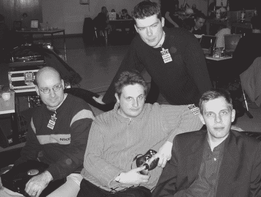

# 第十一章

为 Xbox 开发软件

虽然本书的重点是教育读者硬件黑客和安全知识，但 Xbox 黑客的一个最终目标是运行自制软件。本章致力于描述在本书写作时正在进行的一些 Xbox 自制软件项目。

## **Xbox-Linux**

Xbox-Linux 项目的目标是创建一个用户友好且合法的 GNU/Linux 及其应用程序的移植到 Xbox 硬件平台。多亏了全球黑客的奉献和贡献，Xbox-Linux 项目在实现其目标方面取得了巨大的成功。核心 Xbox-Linux 项目团队的图片可以在图 11-1 中看到，本章和第九章的侧边栏包含了对 Xbox-Linux 项目成员的访谈。（Xbox-Linux 项目的首页是 http://xbox-linux.sourceforge.net。）值得注意的是，Xbox-Linux 项目及其主要黑客并不是反微软的。他们是支持“自由探索”的，而不是幼稚的微软仇恨者；他们有一个涉及保护思想与言论自由议程，这些自由正是将技术带到今天的位置。

Xbox-Linux 不是 Xbox 的终极软件项目；相反，它只是 Xbox 软件黑客的起点。将熟悉的 GNU/Linux 开发环境移植到 Xbox 使得更多的软件黑客能够加入 Xbox 黑客项目。有了 GNU/Linux，Xbox 可以运行各种应用软件，从免费开源视频游戏到文字处理应用，再到用于构建类似 Beowulf 风格的计算机集群的集群软件。

### **安装 Xbox-Linux**

目前，为了运行 Xbox-Linux，您需要使用备用固件设备安装 GNU/Linux 引导 ROM。这需要打开 Xbox。第十章描述了通过 LPC 接口为 Xbox 构建和安装备用固件设备的方法。现在有几家供应商提供易于安装的 LPC 接口备用固件设备。值得注意的是，Xodus/Matrix 设备是市场上第一个具有完全无焊接安装程序的备用固件设备。您需要安装 Xodus/Matrix 设备所需的所有工具在第一章“取消保修”中都有描述，Xodus/Matrix 设备本身也附带了一些易于遵循的说明，说明如何编程和使用备用固件设备。

## **个人简介：迈克尔·斯蒂尔**

**迈克尔，你能告诉我们更多关于你自己的信息吗？**

1979 年出生于德国埃尔丁，我在慕尼黑工业大学学习计算机科学。我在第一学期教授汇编语言，并计划明年获得硕士学位。我从十岁开始就与电脑打交道；我的第一台电脑是 Commodore 64，很快又有了 386 PC。我的主要兴趣一直是硬件和操作系统，我对硬件架构的多样性（Commodore、PC、Amiga、Macintosh、……）以及流行的嵌入式系统，如游戏机特别着迷。（你知道吗，“SEGA CD”有三个 CPU，一个 Z80 和两个 M68000？）这就是为什么我购买了许多用于实验的视频游戏系统，例如任天堂 Super NES、SEGA Genesis 和任天堂 Game Boy。我还研究了 SEGA Dreamcast 的 Linux，但我从未见过适用于索尼 PlayStation 2 的 Linux，因为整个套件对我来说实在太贵了，无论是用于实验还是实际使用。

**你是如何开始 Xbox 破解，特别是 Xbox-Linux 项目的？**

2002 年 4 月 30 日，我购买了一台 Xbox，确信它将是一款非常适合黑客攻击的玩具，并且非常适合运行 Linux。在研究了系统软件一两个小时（我没有买游戏）之后，我拆开了 Xbox。寻找有关破解信息最初让我失望：我找不到比如何将硬盘连接到 PC 更多的信息，还有一个几乎没有任何信息的 Xbox Linux 网站。因此，我决定创建自己的 Xbox 破解网站，并上传我通过将硬盘连接到 PC 获得的信息。

Xboxhacker.net 和原始的 Xbox Linux 邮件列表都非常有帮助；它们都吸引了优秀的黑客并发布了有价值的信息。对 Xbox Linux 项目的原始基础设施不满意，我决定于 5 月 23 日迁移到 Sourceforge。现在每个贡献者都可以在不通过维护者的情况下向网站添加任何内容。但当时，一切仍然相当理论化：在没有 modchips 的情况下，我们无法做更多的事情，只能编写“理论上应该可以工作”的代码。Andy Green 的 Filtror 加速了一切：这个 mod 使完成引导加载程序成为可能，并在 Milosch Meriac 的帮助下，在非常短的时间内适应了 Linux 内核。

2002 年 6 月接近我的“匿名捐赠者”不仅使项目得到了更多的宣传，因此吸引了更多的贡献者，而且还使我结交了一位朋友：BioXX（OpenXbox）modchip 的创造者沃尔特·迈耶，他恰好就住在离我 20 公里远的地方。在其他方面，他帮助我很多，因为我并不是一个真正的焊接铁人。

由于 Linux 已经在 Xbox 上运行，2002 年 12 月，Xbox Linux 核心团队（Andy Green、Milosch Meriac、Franz Lehner 和我；不幸的是，Edgar Hucek 无法参加）在柏林的混沌计算机俱乐部大会上首次面对面会面。

我做所有事情的原始动机只是因为它很有趣，而且通过这样做我可以学到很多东西。我并不是因为想伤害微软才开始的——尽管如此，我同意微软通过不让用户在他们购买的硬件上使用他们想要的软件来伤害了他们的客户，这就是为什么 Xbox Linux 项目特别重要。

[我们]不是“反微软”或“微软仇恨者”。我们不喜欢他们的市场策略，所以我们有合理的理由反对他们。

**关于 Xbox-Linux 的 20 万美元奖金，你还有什么想说的吗？**

我认为这个奖项并没有吸引那些想要看到一些钱的人：现在距离截止日期已经过去一个月了，奖金还没有发放，而且还没有一个人问我什么时候能拿到钱。这个奖项吸引了媒体；我们得到了更多的宣传，这样我们就得到了更多的黑客。但没有人是因为钱而做的。所以我们不希望被认为是因为 Michael Robertson 的支付而做这项工作。一个很好的证据是我们即使在截止日期之后仍然非常活跃。

**你能告诉我们更多关于你的“MIST X-Code 破解”吗？**

在 bunnie 最初的破解之后不久，Andy 完全提取了 MCPX ROM，Steve、Paul 和我开始分析代码，我逆向工程了其中包含的 X-Code 解释器。在寻找可以用来逃离 X-Code 解释循环的漏洞时，我发现代码的一部分已经考虑到了我们的攻击。这是我最初的反汇编：

```
cmp     ebx, 80000880 ; ISA Bridge, MCPX disable?
jnz      short not_mcpx_disable
               ; BUG: too specific: bits 24 to 30
               ; undefined and ignored by PCI hardware!
and     ecx, not 2 ; clear bit 1 (MCPX ROM will be
                   ; turned off by setting bit 1)
not_mcpx_disable:
mov     eax, ebx
mov     dx, 0CF8h
out    dx, eax ; PCI configuration address
add     dl, 4
mov     eax, ecx
out    dx, eax ; PCI configuration data
jmp     short next_instruction

```

我之前一直在做“PCI 配置”工作，因此我知道攻击的测试过于具体：相似的代码会做同样的事情，但它们会通过测试。所以微软的开发者有一个好主意，但实现是错误的，因此以这种方式告诉我们他们的想法！

我把我的想法发送给了 Andy、Steve 和 Paul，他们很快就验证了 0x88000880 和 0x80000880 一样可以用来关闭 MCPX ROM 并退出解释器，通过将解释器代码映射出内存！

### 注意


**微软可以并且将会修改他们的主板布局和安全系统，所以在购买之前，请与您的设备供应商确认与您特定系统硬件的兼容性。如果您想使用标准键盘和鼠标与 Xbox 一起使用，您将需要一个 Xbox 游戏端口到 USB 转换线，这可以通过后市场零售商如 Lik-Sang（http://www.lik-sang.com）购买，或者您可以通过遵循第四章中的逐步指南自己制作一个。**

在安装您的备用固件设备之前，您需要用启动 GNU/Linux 内核的 ROM 镜像对其进行编程。“Cromwell”是一个开源的、干净的（即，不包含任何微软代码）Xbox 引导 ROM，能够引导 GNU/Linux。值得注意的是，Cromwell 源代码和二进制镜像中包含的信息不能用于绕过 Xbox 中内置的任何原生版权控制机制。换句话说，很难辩称 Cromwell 是任何类型的版权控制绕过工具。（Cromwell 可以从 Sourceforge.net 服务器上的 Xbox-Linux 网站 http://xbox-linux.sourceforge.net 下载。）

在将 Cromwell ROM 烧录到您的备用固件设备并在 Xbox 中安装该设备后，您需要将一个可以从 Xbox-Linux 网站（再次，http://xbox-linux.sourceforge.net）下载的 GNU/Linux 安装镜像烧录到 CD/RW 媒体上。这个安装镜像是一个相当大的（100+ MB）*ISO 镜像*，使用 bzip2 进行压缩，并包含将用户友好的 GNU/Linux 发行版在 Xbox 上安装和运行所需的所有软件、接口和工具。在烧录这个 ISO 镜像时，您必须在 CD 刻录软件中使用烧录镜像选项。不要将 ISO 镜像作为一个单独的大文件复制到 CD 上。（ISO 镜像是一个 CD 的原始位模式，因此 ISO 镜像已经包含了一个完整的文件系统描述。将 ISO 镜像作为常规文件而不是镜像来烧录，会将 ISO 镜像封装在一个新的文件系统中，因此 ISO 镜像看起来就像一个“位袋”而不是包含文件的文件系统。）

您可能还需要一个带有 Xbox-Linux 引导程序的第二个磁盘。这个引导程序是一个较小的 ISO 镜像，应该可以从您下载主要 GNU/Linux 安装镜像的同一地方获得。这个引导镜像允许您通过简单地将它放入 Xbox 中来启动 Linux 安装，就像开始一个游戏一样。（如果您更喜欢不处理单独的引导磁盘，您也可以使用第三方仪表板将这个磁盘的内容复制到硬盘上，并直接从硬盘引导 Xbox-Linux。）

烧录一个良好的 CD/RW 映像是安装 Xbox-Linux 过程中可能最棘手的部分。Xbox DVD-ROM 驱动器内部使用的激光不太适合读取可写 CD 媒体，因此 Xbox 对媒体类型、烧录器类型以及创建 CD 映像时使用的烧录器设置非常挑剔。此外，激光退化的具体细节因 Xbox 而异，取决于安装的驱动器型号。用户发现，很少的 Xbox 可以可靠地读取 CD-R 媒体，因此*必须*使用 CD/RW 媒体。此外，使用全新的空白 CD/RW 或已完全擦除的 CD/RW（与仅重置文件系统而不实际销毁先前写入的数据的快速擦除相比）以最慢的烧录器设置烧录 CD/RW 媒体会有所帮助。

在决定使用特定类型的 CD/RW 媒体之前，尝试使用常规 Xbox 仪表板的 WMA 抓取工具将您用音乐烧录的 CD/RW 的内容复制到硬盘上。如果这可以可靠且无错误地工作，那么您可能可以使用这种类型的 CD/RW 媒体来安装 Linux。（许多 Xbox-Linux 安装问题已被追踪到 CD/RW 驱动器读取数据的问题。）在撰写本文时，没有可用的 CD-ROM 媒体发行版。在 Xbox-Linux 社区中有些讨论是关于订购一套定制 CD-ROM 映像的，因为这可以解决用户所经历的大多数 CD/RW 问题。（此外，请注意，您可以在 Xbox 中安装一个兼容性更好的第三方 DVD-ROM 驱动器，它对可写 CD 格式有更好的兼容性，如前一章所述。）

### 注意


**请注意，Xbox-Linux 是一个活跃的项目，它** **正在不断演变**。在 Sourceforge Xbox-Linux 网站上可以找到安装 GNU/Linux 到 Xbox 的最新说明，并且这些说明**在撰写本文时已被翻译成至少六种语言**。如果您有兴趣为 Xbox-Linux 项目贡献您的才能，Sourceforge Xbox-Linux 网站上有一个待办项目列表，以及一些如何加入开发者**邮件列表**的说明。

### **“项目 B”**

目前有一个正在进行中的项目，被称为“项目 B”，由 Xbox-Linux 开发者提出，旨在寻找一种无需任何硬件修改即可安装和启动 Xbox-Linux 的方法。项目 B 的名字来源于 Lindows 公司 CEO 迈克尔·罗伯逊提供的 20 万美元奖金的评选标准。项目 A 的奖金是 10 万美元，已经颁发给了第一个将 Linux 运行在 Xbox 上且进行硬件修改的团队。剩余的 10 万美元将颁发给完成项目 B 的个人或团队。奖金的不对称分配暗示了完成项目 B 的挑战。（更多关于项目 B 的详细信息可以在 Sourceforge Xbox-Linux 网站 http://xbox-linux.sourceforge.net/articles.php?aid=2002354043211 上找到。）

有多个团队正在追求项目 B 的策略。最概念上简单的方法是分解用于签署 Xbox 游戏光盘的 2048 位 RSA 密钥。这个方法正在由 OperationProjectX（http://sourceforge.net/projects/opx）通过分布式计算方法进行尝试。简单来说，如果 2048 位 RSA 密钥被分解以揭示微软的私钥，任何人都可以伪造微软的数字签名并创建 Xbox 的可启动游戏光盘，前提是微软从未从 Xbox 内核中移除从常规 CD 或 CD/RW 媒体加载程序的能力。值得注意的是，微软将游戏发行在双层 DVD-9 格式的光盘上，带有特殊的安全结构。微软可以将 Xbox 固件配置为仅从具有这种特定结构的光盘中启动，而不管数字签名检查。由于目前无法使用普通 DVD 刻录机刻录双层 DVD，因此要求使用安全的 DVD-9 媒体作为可执行文件的唯一来源，这将对通过互联网免费下载 Xbox-Linux 造成障碍。这种方法的其他问题是，通过暴力搜索成功分解 Xbox 私钥的机会非常非常小。（第七章“简明安全入门”中有一个关于“非常困难的问题”的侧边栏，试图传达这项任务的计算难度。）如果通过这种方法在合理的时间内成功恢复私钥，将大大降低人们对 RSA 算法的信心。（另一方面，如果你不买彩票，你就永远赢不了，而使用 CPU 的空闲周期运行免费的分布式分解客户端比 Powerball 彩票便宜得多。）



**图 11-1**：在德国柏林举行的第 19 届年度混沌计算机大会上，Xbox-Linux 核心团队。在后面，迈克尔·斯蒂尔；在前排，从左到右：安迪·格林、米洛什·梅里亚克和弗朗茨·莱纳。（照片由格哈德·法费莱德提供。)*《黑客 Xbox：逆向工程入门》

另一种与破解 RSA-2048 位密钥相关的方法是修改现有的、已签名的 Xbox 可执行文件，使其以有用的方式修改，而不改变其加密散列值。这种建设性的散列冲突会使修改后的可执行文件在数字签名检查方面看起来与原始文件相同。Xbox 数字签名算法中使用的散列算法是 SHA-1。SHA-1 是一个 160 位的散列，没有公开已知的算法弱点；由于散列的来源是固定的，大约需要尝试 2¹⁶⁰种随机变化来发现冲突。作为旁注，你不能使用生日攻击将攻击的难度降低到 280 种随机变化，因为我们不是试图找到两个散列到相同任意值的消息。目标是生成一个特定的目标散列，或者可能是从所有已发布的 Xbox 游戏标题集中收集的非常有限的目标散列集中的一个。因此，这种方法也属于“非常困难的问题”类别。

Project B 的另一种方法是寻找 Xbox 软件中的安全漏洞，并利用这些漏洞来控制 CPU 的指令指针。为了了解这种方法如何有帮助，考虑以下例子：假设在某个游戏中发现了一个基于网络的缓冲区溢出漏洞，可能导致任意代码执行。运行在通过网络连接到 Xbox 的 PC 上的程序就可以利用这个漏洞向 Xbox 发送数据包，安装一个简单的 Xbox-Linux 引导加载程序。这个引导加载程序可能只是一个在 Xbox 硬盘或 DVD 光驱上指定位置运行代码的程序。任何 Xbox 可以接收数据的端口都可以成为这种攻击的途径，包括 USB 和网络端口，以及硬盘和 DVD-ROM 驱动器。损坏的存档游戏或文件结构可以被镜像到硬盘或 DVD-ROM 驱动器上，导致 Xbox 运行用户开发的代码。值得一提的是，微软在网络安全方面做得相当出色，所有的网络交互和存档游戏协议都使用了相当强大且经过充分测试的安全技术。此外，我在麻省理工学院关于 Xbox 的微软演示会上听说，所有游戏代码都经过缓冲区溢出检查器检查，并且微软对那些被发现故意在游戏代码中设置后门的开发者有合同上的补救措施。这表明 Xbox 代码库比典型的微软产品更安全，这使得它对黑客来说更具吸引力。（如果你对作为“Project B”一部分参与 Xbox 黑客攻击感兴趣，我鼓励你首先查看 Project B 奖规则网页：http://xbox-linux.sourceforge.net/articles.php?aid=20030023081956。）

最近，发现了一种缓冲区溢出漏洞，该漏洞存在于电子艺界（Electronic Arts）的“007: Agent Under Fire”游戏中保存游戏的方式。这个漏洞最早是由一个名叫“habibi_xbox”的黑客在 2003 年 3 月 29 日通过 XboxHacker.net BBS 上的帖子公布的。值得注意的是，这个漏洞在多款游戏中被发现，但“007: Agent Under Fire”是唯一在帖子中明确指出的游戏。该漏洞利用未检查的字符串运行一小段（几百字节）代码，插入一系列内核补丁。在设计这个黑客程序时，包含了各种措施，使其很难修改以执行除运行预期的 Xbox-Linux 目标之外的其他操作。例如，黑客程序修补了原始 Xbox RSA 公钥，该公钥用于验证数字签名，同时保留了未修补的数字签名检查算法。只有作为黑客程序一部分提供的 Xbox-Linux 引导加载程序，才使用相应的新私钥进行了适当的签名。其他黑客必须分解新的公钥才能使用这个黑客程序来运行其他可执行文件。此外，“007: Agent Under Fire”游戏本身对所有保存的游戏执行独立的数字签名检查，因此修改被黑保存游戏文件中的漏洞代码并不简单。黑客程序实施者将此类安全措施纳入程序是一个值得赞扬的决定，因为它有助于确保黑客程序不会直接用于如盗版等应用。实施保护微软利益的安全措施可能有助于使 Xbox-Linux 项目免受微软和美国司法部的愤怒。

## 个人简介：Milosch Meriac

**你能告诉我们一些关于你自己的信息吗？**

我的一般经历相当简单。我于 1976 年出生于捷克斯洛伐克。我的父母（我的母亲是教师，我的父亲是土木工程师）在冷战期间因为共产主义政权的镇压逃到了西德。我们大约三岁时到达德国。在德国幼儿园，我立即学会了德语。从这一点开始，事情变得非常简单——在我十岁时，经过几个月的抱怨后，我得到了我的第一台电脑。事情开始有了转机。

在高中毕业考试和一段在德国联邦国防军服役的奇特插曲之后，我开始学习控制论和计算机科学，但我在三年后决定辍学，并将长期目标集中在自己的公司上。在学习期间，我建立了一些有价值的商业联系，因此很容易在德国为各种公司作为自由职业者工作。我进行了一些逆向工程项目，开发了小型足迹的实时嵌入式 Linux 系统，进行了一些底层编程，如 Windows 系统的实时扩展，并为一家著名的德国公司开发了一种基于软件的硬盘保护系统。我现在和我的女朋友在柏林生活，我们在那里过得非常愉快。

**你为什么黑客？**

在编程经验更加丰富之后，我开始发现计算机世界的美丽和光鲜实体实际上是一幅脆弱的拼凑。

最初，黑客对我来说就像是一场游戏。你可以在自己的计算机系统中四处游走，每天都能发现新的代码和可能性。偶尔，人们可以通过尝试分析和规避应用作者的复制保护来向他们发起挑战。有时这就像下棋；有时则像是一场生死决斗。

一方面，我为自己知识的增长而兴奋，另一方面，对于一个 14 岁的孩子来说，绕过那些高薪的、神一般的硬核程序员的安保系统自然是一种极大的自我提升。在我上高中的时候，我在学校假期为一些当地公司编写编程工具和应用程序时遇到了一些真正的程序员——我感到失望：他们既不是神，也不是神一般的存在。

过了一段时间，我意识到编写一个酷炫的演示、黑客应用 X 或为 Y 找到一个小巧的漏洞并不能比在中国某处倒下一袋大米对世界产生更大的影响。因此，我开始更明智地选择我的领域——日常生活中的技术，如电话、计算机、网络和卫星。我发现，通过向普通用户解释技术或帮助公司保护他们的产品，一个人有能力改变事物。

今天，我意识到自己作为一名白帽黑客的力量。在当今生活中，每个人都会受到信息技术的影响：监控技术、数据挖掘、信息战、数字千年版权法、TCPA、数字版权管理、对版权和专利法的新解释如同雨后春笋般增长。就像我过去一样，我渴望窥探这些美丽和光鲜实体背后的秘密，并希望在他们找到我们之前找到漏洞和陷阱。

**你能告诉我们你在 Xbox-Linux 项目中的经历吗？**

我加入了 Xbox Linux 项目，并帮助内核运行起来，这很棘手，因为与个人电脑相比，Xbox 架构有一些陷阱和差异。我为微软的 Xbox 创建了早期的 Linux 发行版。这很重要，因为我们只有 1MB 的闪存可以用来存储完整的发行版和内核，硬盘还没有解锁。我还为 Andy Green 的 filtror 设备提供了控制台驱动程序，这样我们就能通过他的设备作为某种远程接口来查看内核启动信息，并使用 linux 控制台。这个发行版已经包括了网络驱动程序、声卡驱动程序、mp3 支持、telnet 服务器、web 服务器、NFS 支持以及广泛的 Linux 标准工具。这使得我们能够摆脱定制的硬件，并允许数百人加入项目，无论是作为代码贡献者还是作为测试人员。当时我们还没有屏幕输出，所以我向 Xbox Linux 内核添加了 framebuffer 接口，并做出了许多其他贡献。

贡献的开发者数量开始急剧增长。我们得到了来自世界各地的出色帮助，使得 Xbox Linux 成为可能。有些人保持匿名，因为他们害怕像美国 DMCA 这样的法律不确定性，而其他人则可以自由贡献。

**您还有其他想分享的评论吗？**

有些人可能会问，像我这样的成年人为什么还要摆弄这个 Xbox 玩具。每个人当然都有自己的原因；我的原因是为了提高我的技能，并更多地了解最新的技术。例如，微软的 Xbox 是 TCPA/Palladium 受保护计算机的前身，具有所有技术和社会影响。它是我研究更安全计算机系统、不强迫用户的好场所。

主要原因之一是我们的社区。与这些聪明的极客一起工作，无论是线上还是线下在酒吧里喝着美味的啤酒，都非常有趣，也是一种巨大的乐趣。我每天都对社区日益增长的力量感到惊讶。感谢所有使这一切成为可能的人！

展望未来，项目 B 的成功可能会预示着 Xbox 破解的新时代，或者 Xbox 破解的终结。尽管项目 B 的破解者通过试图保护 Microsoft 的利益来展示了他们的社会责任感和善意，但阻止那些不太谨慎的破解者逆向工程破解并最终以某种不太适合 Microsoft 的形式重现该技术是不可能的。最终结果可能是 Microsoft 对所有破解活动进行严厉打击，或者由于收入渠道被切断，就像世嘉在 Dreamcast 盗版丑闻中那样，Microsoft 完全退出视频游戏业务。或者，Microsoft 可以选择将更多资金投入到业务中，并发布一个重新设计的、包含已知安全漏洞修补和对策的全新游戏机。结果将严重取决于未来几个月的事件发展。然而，随着 Xbox 价格的大幅下降以及有关全新“缩小版”游戏机彻底重新设计的传言，似乎 Microsoft 的短期策略是集中精力抢占市场，而不是遏制合理使用或盗版。毕竟，每卖出一台 Playstation2 或 Gamecube 可能对 Microsoft 业务的负面影响，可能比将每个 Xbox 转换为运行 GNU/Linux，甚至转换为运行盗版游戏的影响还要大。

## **OpenXDK**

已经为 Xbox 开发了许多有趣和有用的项目，例如 XboxMediaPlayer 和 MAME-X（Xbox 的多款街机仿真器），这些项目都是为原生 Xbox 游戏平台开发的。不幸的是，这些程序是使用未经授权的 Microsoft Xbox SDK（软件开发工具包）开发的。Microsoft 的 Xbox SDK 本应仅提供给经过批准的、有许可证的开发者。然而，在游戏机发布之前，SDK 就已经泄露，从那时起，许多人使用泄露的 Xbox SDK 来创建他们自己的 Xbox 程序。虽然专有的 Xbox SDK 使用方便且易于使用，但技术上使用它是非法的。原生 Xbox 平台缺乏合法的 SDK 使得吸引大量的开源开发者变得困难。

OpenXDK 项目旨在解决对 Xbox SDK 法律替代品的需求。OpenXDK 的既定目标是创建一个用于创建 Xbox 可执行文件（XBEs）的法律开发套件。OpenXDK 将允许用户创建原生 XBE 文件，这些文件在用适当的数字签名签名后，可以在纯 Xbox 上运行。由于这个适当的数字签名目前尚不清楚，这项工作是在预期未来会有一种能够与使用 OpenXDK 开发的程序互操作的法律技术的情况下进行的。

尽管具有实用性，OpenXDK 项目仍处于起步阶段，正在寻找开发者。更多关于 OpenXDK 项目的信息可以在 http://openxdk.sourceforge.net 找到。OpenXDK 的项目经理是 Dan Johnson（也被称为 SiliconIce，XboxHacker BBS 的创建者）和 Aaron Robinson（也被称为 caustik；caustik 还在领导 CXBX 可执行文件重连器和 CXBE Xbox 模拟器项目）。
