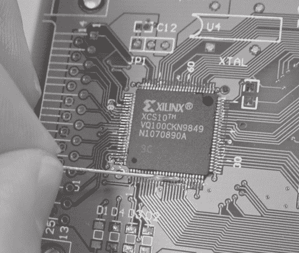
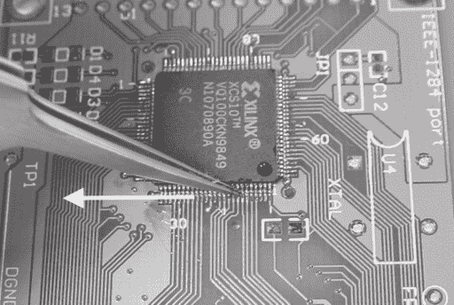

# 附录 B -

焊接技术

本附录将解释焊接的基本知识以及一些更高级的表面贴装焊接技术。如果你在阅读时尝试焊接技术，你会从本附录中获得最大收益。Jameco Electronics（www.jameco.com）销售各种需要通孔组装的项目套件，你可以用来进行基本的焊接练习。如果你想要练习 SMT 组装技术，TopLine（www.topline.tv）提供经济型练习套件，使用空白组件，而 MCM Electronics（www.mcmelectronics.com）提供实用的表面贴装焊接练习套件。（我强烈建议你在尝试焊接你关心的 SMT 组件之前，先练习你的 SMT 焊接技能。）

## **焊接入门**

焊接的基本技术相当简单：将焊锡铁头的尖端楔入组件引脚和电路板焊盘之间的空间，以加热这两块材料。一旦它们足够热，逐渐将一些焊丝喂入焊缝，直到形成漂亮、平滑的焊料圆角。实际上，焊接需要一些练习和经验，才能在没有不良焊缝的情况下焊接一个有超过一千个焊点的典型电路板。为了创建良好的焊缝，热的液态焊料必须“润湿”主体材料，以便建立连接。因此，手工焊接的真正艺术在于理解如何保证焊料润湿。

你可以通过观察来判断液态焊料是否润湿了一块金属。润湿的焊缝看起来像熔化的焊料已经失去了所有表面张力；液态焊料是闪亮的，并且在工作区域上流畅地流动。在相反的情况下，焊料表面看起来是暗淡的，并且倾向于在焊锡铁头周围形成球状，而不是向外流动。

### **使用助焊剂**

焊料未能润湿主体金属，因为空气中的氧气或污垢和油脂已经与金属发生了反应。在这种情况下，你可以将*助焊剂*应用到你的工件上，以分解这些外来化合物。助焊剂这个词来源于拉丁语*fluxus*，意为流动。大多数焊料都内置了助焊剂核心，以增强可焊性。如果你仔细观察一段切割的焊料，你可以看到助焊剂核心被焊料合金包围。始终使用带有助焊剂核心的焊料，否则你将陷入痛苦，试图让焊料润湿。几乎所有专门为电子产品制造的焊料都有助焊剂核心，但你在五金店偶然购买的焊料可能没有助焊剂，并且是用于管道连接等目的的。当你加热助焊剂核心焊料时，会有一小股助焊剂蒸汽上升。在工作区域附近放置一个小风扇可以将烟雾吹走，防止吸入。

一个常见的初学者错误是过分依赖膏状焊料。通常，膏状焊料中含有的助焊剂不足以使焊料润湿。在这种情况下，你需要额外施加助焊剂。原始的助焊剂通常以液体或膏状形式出现，因此应用起来很方便。在液体形式下，只需用牙签的一半滴上一滴助焊剂。将牙签折断，使断裂处略微粗糙。将牙签的断裂端浸入助焊剂中，一小滴助焊剂会附着在末端。用细尖画家的画笔将液体助焊剂涂覆在大面积上，但务必在完成后清洁画笔，否则几天后它将变得粘稠且无法使用。助焊剂滴管也很方便，但价格昂贵。助焊剂滴管是一个顶部有细长毛细管的瓶子；当你倒置瓶子时，助焊剂会缓慢地从毛细管中滴出。在膏状形式下，可以通过将任何碎片，如牙签或一段实心电线，浸入助焊剂膏中来施加助焊剂。最后，助焊剂笔对初学者来说很方便，因为它们将助焊剂的储存和分配结合在一个方便且价格低廉的包装中。助焊剂笔没有其他助焊剂应用技术的精度或质量，但它们很方便，适合偶尔使用。

许多助焊剂在使用后需要清理。助焊剂会随着时间的推移而硬化，使得未来的维修变得困难，它们会慢慢腐蚀电路板，并且会吸收水分而变得导电。传统的焊接助焊剂是一种树脂助焊剂。树脂助焊剂需要使用强溶剂，这些溶剂易燃且有毒。因此，我倾向于推荐水溶性助焊剂或无清洁助焊剂。水溶性助焊剂可以通过用水冲洗电路板来去除。最好使用蒸馏去离子水，但我发现大多数温水也很有效。当我必须清洗大量电路板时，我会把它们扔进洗碗机（食物过滤网已清洁且无洗涤剂！）。电路板清洗后，将它们放在一个导电、干净的饼干盘或铝箔上，然后放入烤箱低温（约 200°F）烘烤大约一两个小时，或者直到所有水分蒸发。务必不要将烤箱温度调得太高，否则被困在元件孔隙中的水会变成蒸汽，导致它们开裂或爆炸。大多数元件设计为“工艺密封”，因此用水清洗它们是可以的。然而，对于连接器和开关要小心；你可能需要用一块 Kapton 胶带覆盖它们，以防止水分污染。

### 警告

**不要在电路板上使用酸性助焊剂。它们会** **腐蚀电路板和元件，并随着时间的推移导致故障**。 **酸性助焊剂经常困扰那些使用旨在用于管道焊接的焊料和助焊剂的初学者**。

### 初学者提示

具有许多引脚的元件在焊接之前需要对齐并固定到位。如果元件是表面贴装类型，可以通过焊接设备对角线两端的两个引脚来固定它。固定元件后，重新检查对齐情况，以防元件在固定过程中发生偏移。如果元件是通孔类型，你需要使用遮蔽胶带在翻转板子时将其固定。固定元件的角落引脚，并在焊接所有引脚之前检查它是否与板子水平。（遮蔽胶带有一定的弹性，通常你需要在按下元件以使其与板子水平时加热其中一个固定的角落。）

Kapton 胶带是工作台上非常方便的东西。由杜邦公司制造，Kapton 可以承受高达 500°F 的温度，远高于焊料的熔点。它非常适合遮盖你不想焊料接触的附近区域。然而，Kapton 胶带价格昂贵，所以只有在它将接触热焊料的情况下才使用。

焊料无法润湿过冷的金属。在焊接大型接头或焊接连接到大型铜板的接头时，这是一个常见问题。在这些情况下，连接的金属会传导足够的热量，使得接头永远不会达到焊料的熔点。解决这个问题的方法是使用更强大的烙铁（但请注意——非常大的烙铁的热量也可能导致电路板上的走线脱落），或者在使用焊料之前，让烙铁与接头保持更长时间的接触。加快加热工作区域的一个小技巧是将一小滴焊料喂入烙铁尖端，在那里它正在加热东西。即使焊料不会在板上润湿，烙铁尖端上的液态焊料增加了烙铁和板之间的有效接触面积，热量会更快地传递到板上。

在将焊料应用到烙铁尖端后，有时你需要旋转烙铁，同时保持与接头的接触，以便让熔化的焊料接触到板。你可以通过仔细观察光线如何从它反射来判断一个元件引脚或板上的焊盘是否足够热。电路板上的元件引脚和焊盘通常有一些镀层，通常是焊料制成的。在正常条件下，这种焊料镀层略带哑光。然而，当加热到足够高的温度时，光泽从哑光变为几乎完美反光。为了了解这看起来像什么，尝试使用上述技术加热一个大的正方形焊盘，使用烙铁加热板。你通常可以看到熔化前沿随着烙铁加热板而传播。

### 警告

**如果你使用的是非温度控制的焊铁，请使用你能找到的最小功率焊铁来完成工作。这有助于防止板子损坏，因为过度的热量可能导致铜迹从板上剥离。**

## 表面贴装焊接

掌握表面贴装焊接的技能需要一点耐心、实践和好工具。除了基本的焊接套件外，还需要镊子和放大镜。

一副细尖的镊子是表面贴装组件焊接的必备工具。在焊接过程中，需要使用镊子安全地处理表面贴装组件，因为小组件会迅速升温，足够热到烧伤手指。镊子还必须用来固定小组件，防止它们在液态焊锡熔化和冷却时被表面张力拉扯。镊子的尖端应该足够小，可以夹在你要工作的最精细表面贴装组件的引脚之间。这样，你就可以在焊接和检查过程中使用镊子操作单个引脚。

镊子有很多等级。评级基于尖端锋利度、质量和耐用性，尖端的对齐，以及镊子的弹簧动作。高级镊子价格略高，但如果你打算做大量的表面贴装焊接，这笔投资是值得的。专注于生产供应的分销商，如 Future-Active Electronics（www.future-active.com），销售了合理数量的优质镊子。

表面贴装焊接最大的挑战是能够看到你正在操作的内容。你的双手有轻松且反复操作肉眼无法看到的微小物体的能力。对于焊接的理想放大解决方案是一个光学立体显微镜，就像用于检查生物样本的那种。不幸的是，这些显微镜非常昂贵，更好的型号售价大约相当于一辆二手车的价格。

一个更经济的选择是使用桌面放大镜。许多制图/艺术用品店销售这类镜头，大多数办公用品店至少销售一种带有内置放大镜的灯具。这些放大镜有助于组装，但它们缺乏彻底检查焊接工作的能力。应使用相对便宜的高功率便携式放大镜，如珠宝放大镜或校对放大镜，来检查完成的焊点。

### **简单组件的技术**

简单的表面贴装组件，如电阻器、电容器、电感器和小型半导体器件，如晶体管和二极管，很容易安装在电路板上。让我们看看安装这些组件的技术。

**

**图 B-1**：(1) 在目标组件的一个焊盘上涂上一滴焊锡。在这种情况下，目标组件是 C25。(2) 涂上焊锡后的焊锡滴图片。(3) 使用镊子调整目标组件的位置，然后使用烙铁加热，直到初始焊锡滴流动到组件引脚周围。(4) 焊接剩余的组件焊盘。

首先，在组件的一个焊盘上放置一小滴焊锡，然后使用一对镊子放置并调整组件的位置，使其覆盖在其焊盘上。一旦你对组件的位置感到满意，就对焊锡滴加热，直到它融化，组件沉入其焊盘上的位置。在调整组件的对齐时，继续加热。移除热量，等待焊锡冷却并固化。再次检查组件的对齐，然后将组件的其余接触点焊接到位。如果第一个焊点看起来暗淡或薄弱，在所有其他引脚都焊接完毕后，用更多焊锡重新加热一次（见图 B-1）。这种技巧适用于两脚或三脚组件，以及具有宽间距的多脚组件，例如 50 密耳间距的小型封装 IC 器件。

在焊接这些组件时，你可能会遇到的最困难的情况是，当组件的一个或多个引脚连接到一大块铜上，例如电源平面时。在这种情况下，必须在焊锡润湿并粘附到电路板之前，对 PCB 焊盘施加大量热量。当这种情况发生时，请注意，焊锡会氧化并形成球状，与电路板接触不良。如果出现这种情况，添加少量焊剂以帮助增强熔融焊锡的润湿作用。

### 提示

**“干燥”的烙铁头在加热大面积铜或连接到电源平面的焊盘时会遇到困难。提高烙铁热量传递速率的一种方法是在烙铁尖端放置一小滴熔融焊锡，并通过熔融焊锡滴接触电路板。这个滴液会扩散并局部加热电路板，并建立一个良好的热连接，更有效地传递热量。一旦添加更多焊锡，这将最终导致更好的焊接连接。**

### 复杂组件的焊接技巧

今天，大多数集成电路组件都可用某种细间距表面贴装封装。这种封装一开始可能令人望而生畏，但只需通过一些简单技巧和提示进行少量练习，就可以有信心地安装这些部件。安装细间距表面贴装组件的过程与安装简单表面贴装组件的过程非常相似，对于典型中等尺寸的表面贴装封装，这个过程不应超过几分钟。

第一步是使用芯片上的两个角落引脚将组件在电路板上固定。如果第一次尝试对齐不正确，可以通过加热两个角落中的一个，同时将芯片推向所需的对齐方向来轻松纠正（见图 B-2）。请务必注意对齐的准确性：对齐不正确的芯片在焊接芯片时会导致无尽的挫败感。

**图 B-2**：首先，在芯片的两个相对角落的每个角落焊接一个引脚。此图中的箭头指示了本例中使用的角落。

下一步是在芯片周围涂上一层薄薄的焊锡膏。这将增强焊锡在芯片引脚上的润湿作用，并使焊锡能够吸到组件焊盘上，而不是在引脚之间，这会导致短路（见图 B-3）。

### 小贴士

在布局电路板时，应使用超长焊盘来放置细间距表面贴装组件。额外的长度会使手工焊接更容易，尽管这也会使布线稍微困难一些，并导致电路板尺寸略有增加。额外的焊盘长度有助于将多余的焊锡从芯片引脚上吸走，从而减少焊桥的可能性。

一旦所有引脚都均匀地涂上了焊锡膏，将焊锡铁的尖端装上一个小焊锡球，并将其压在未焊接的引脚上。焊锡球会吸到组件引脚下方的空间中。重复此过程，直到所有引脚都涂上焊锡。在此阶段，如果多余的焊锡桥接多个引脚，请不要担心。完成所有引脚的焊接后，使用铜脱焊带（焊锡吸球）来去除任何焊桥，如图 B-4 所示。

**图 B-3**：在芯片周围的引脚上涂上一层薄薄的焊锡膏。在此图中，使用经常蘸取焊锡容器的废线将膏状焊锡膏涂上。

你几乎完成了。最后，确保所有引脚都牢固地焊接到位。如果没有显微镜，很难通过视觉检查来完成这项工作。相反，可以用针或镊子的尖端拉引脚，如图 B-5 所示，以稳定、均匀的动作沿着引脚拖动。未焊接到位的引脚会稍微移动。如果它们移动了，可以通过将它们推回原位并给引脚上一点焊锡来修复它们。

### 注意

**在焊接电路板后，始终检查电源短路** **。一些焊桥可能是微小的树枝状晶体，** **而一些焊桥会在芯片下面的引脚下方形成。使用设置为测量电阻的多用电表检查电源短路。不要使用可听连续性模式，因为大型高速计算机板通常** **在电源轨之间具有很低的（几欧姆）电阻，这足以在许多连续性表上注册短路。此外，在测量电源线之间的电阻时，等待一秒钟或两秒钟，以便测量稳定。在大型电容器充电到电源线上的初始电阻将会非常低。**

一旦你的组件被焊接好，请使用温和的溶剂，例如异丙醇，和棉签（如图 B-6 所示）清理多余的焊剂。清理工作很重要，因为它使得视觉检查更容易，同时也有助于在调试过程中更容易地探测芯片引脚。此外，清理也很重要，因为许多焊剂随着时间的推移会结皮并捕获污染物，这会妨碍未来的维修。

**图 B-4**： (1) 在烙铁尖端熔化一小部分焊剂。 (2) 将此焊剂转移到组件的引脚上。重复步骤 (1) 和 (2)，直到所有引脚都焊接好。 (3) 焊桥，用箭头指示，将在许多引脚上形成。 (4) 使用一小段铜脱焊带移除焊桥。

### **移除组件的技术**

移除表面贴装组件有许多技术，其中许多需要特殊工具，例如镊子式烙铁或热风枪。镊子式烙铁适用于移除较小的表面贴装组件，尤其是在密集排列的板上。它们相当快速且高效，合适的镊子式烙铁会将组件的引脚保持相对良好的状态。然而，它们也相当昂贵，并且需要一些练习才能确定移除芯片时使用的正确时机和压力。

**图 B-5**：使用镊子或针沿芯片侧面施加稳定而有力的力来移动引脚。焊接不良的引脚会略微弯曲。箭头指示运动方向。

**图 B-6**：使用浸有温和溶剂的棉签清理焊剂残留物。

一种更简单、更经济的解决方案是使用热风枪，就像在五金店出售的用于移除亚麻地板砖的热风枪一样。热风枪会加热整个电路板区域，组件会从其引脚上浮起，对引脚造成的损害最小。这种技术的缺点是它不够精确，因此它不是用于再次使用电路板的芯片移除的理想解决方案。因此，热风枪在从损坏的电路板上回收好芯片方面最为有效。使用热风枪的另一个问题是，热量可能会使电路板变形或导致吸收了水分的芯片发生破坏性故障。这种称为“爆米花”的故障模式发生在芯片内部的水分沸腾但无法逃逸时，导致压力累积，最终在破坏性释放事件中达到顶峰。在潮湿环境中运行或用水清洗过的芯片和电路板，在用热风枪脱焊之前，应在烤箱中烘烤约 200 至 250°F 几小时。

另一个对业余爱好者特别有吸引力的选择是将焊点重新合金化，使其在非常低的温度下熔化，低于 300°F。一家名为 Chip Quik（www.chipquikinc.com）的公司拥有这项技术的专利，并且可以从许多供应商处购买移除套件，包括 Jameco（订单号 141305）。这种技术之所以吸引人，是因为它不需要特殊设备，而且很容易且相对安全，如图 B-7 所示。

要这样做，首先在芯片引脚上涂上焊剂，然后将芯片移除合金熔化到要移除的组件的引脚上。这将在芯片周围形成一大滴低熔点合金。接下来，通过将焊锡铁的尖端拖过合金滴来加热整个合金滴。芯片和合金中储存的热量将使其保持熔融状态足够长的时间，以便整个芯片可以轻松地从其引脚上滑落。最后，通过用焊锡铁加热并然后用棉签擦拭来清理低熔点合金。合金可以从电路板和芯片上相对容易地擦拭掉。

这种重新合金化技术保留了移除芯片的引脚以及电路板上的焊盘的完整性。这种技术的缺点是清理合金可能会有些混乱，并且合金的微小颗粒可能会卡在相邻芯片的引脚之间。（在清理时小心可以防止这个问题。）另一个缺点是移除芯片会消耗移除合金，因此使用这种合金大量移除芯片可能会在长期内变得昂贵。幸运的是，对于大多数业余爱好者来说，芯片移除是一种相当罕见的情况。

“球栅阵列”（BGA）封装是一种表面贴装封装，由于其高电气性能和密度，正变得越来越受欢迎。这些封装通过在封装下方的较大阵列的焊球连接到电路板上。显然，这种封装不能使用传统的烙铁进行焊接。此外，由于大部分焊点都深深埋在封装下方，BGA 封装的检查非常困难。唯一可行的将这些组件连接起来的方法就是使用烤箱，将整个电路板和组件加热到所有焊球融化的程度。通常，这些 BGA 封装的对准是通过某种机器的帮助来完成的，而 BGA 封装的检查则是通过 X 射线或超声波成像来完成的。

安装这类封装所需的设备非常昂贵，因此业余爱好者安装 BGA 封装设备的最佳方式是支付给专业组装厂来处理。例如 Naprotek（www.naprotek.com）这样的公司，它们专门从事快速、小批量原型制作，将以相当合理的费用安装 BGA 封装设备。在安装 BGA 时，一定要要求提供该部件的检查照片；照片带来的安心感值得额外的费用。BGA 部件也可以被移除并重新焊球，尽管这个过程可能比焊接过程贵得多。

**图 B-7**：通过加热焊点来移除芯片。（在开始此过程之前，用焊剂准备好芯片引脚。）(1) 将重熔化合物熔化到所有芯片引脚上。重熔化合物呈线状。(2) 通过在金属上拖动烙铁来加热芯片周围的金属球。所有重熔的焊料都会变成熔融状态，此时可以推动芯片离开其焊盘。(3) 通过加热并用棉签擦拭来清理电路板和芯片上的重熔化合物。(4) 结果，芯片被干净地移除。
