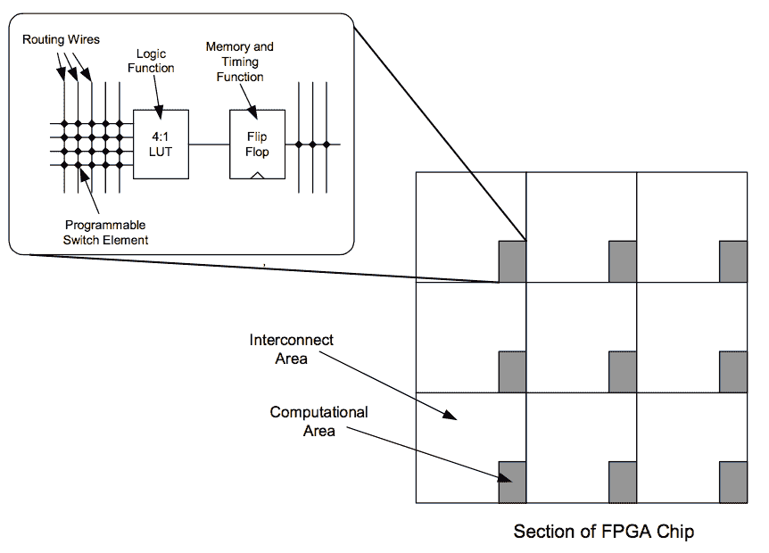
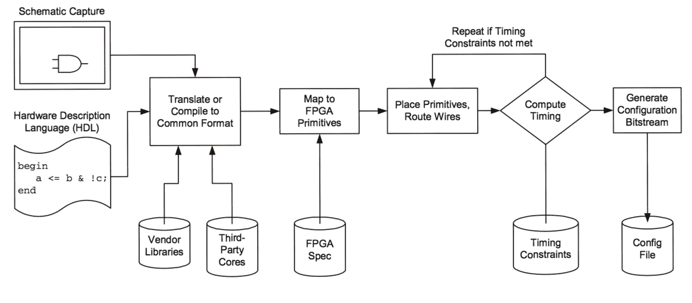

# 附录 D -

开始使用 FPGA

集成是硬件黑客的噩梦。我们喜欢拆解东西，修改它们，并改进它们，但趋势是将一切塞入一个或两个 ASIC（专用集成电路）中。这种集成对于普通人来说遥不可及，因为用于定义芯片上特征的掩模套件的成本正迅速接近一百万美元。这是一百万美元的*每个独特* *修订版*的芯片。如果犯了一个需要新掩模套件的错误，你必须再花一百万美元来修复它。

幸运的是，即使是许多公司，一开始就投入一百万美元现金购买芯片也太多了，这为 FPGA 创造了一个市场——通用、可编程（“可重构”）的硬件设备，可以在许多应用中替代 ASIC。

## **什么是 FPGA？**

FPGA 代表现场可编程门阵列。换句话说，它是由用户在现场编程的门阵列。你可以将 FPGA 想象成可以在家中舒适构建的定制硅芯片，尽管向部分可重构和上下文相关重构的趋势为 FPGA 增加了一个在 ASICs 中找不到的维度。虽然 ASICs 在大量生产中每单位成本更低，并且它们可以具有更高的时钟速度性能，但 FPGA 已经确立了自己作为低到中等产量应用和原型设计的首选工具。

FPGA 的基本架构是在一个灵活的布线网络中嵌入的硬件原语数组。FPGA 的力量在于复杂计算可以被分解成一系列更简单的逻辑函数。这些更简单的函数可以依次分解，直到整个计算仅由可以映射到 FPGA 硬件原语的基本逻辑操作序列来描述。因此，相同的 FPGA 可以通过改变硬件原语和布线网络的配置来实现微处理器、视频控制器或井字棋游戏。

FPGA 架构实现的硬件原语类型强烈影响了 FPGA 针对特定目标应用的实现效率。现代 FPGA 为设计师提供了主要是单比特宽的原语：一个 4 或 5 输入到 1 比特输出的查找表，以及一个称为触发器的时间同步存储位。查找表被用作逻辑原语，因为它们可以被编程执行任何逻辑操作，其术语数量与查找表的输入数量相同。然后，这些原语被连接到一个庞大的可编程网络中；一个典型的高端 FPGA 可能有数万这些原语元素。

结果表明，虽然单比特宽的结构非常通用，但在自然数据宽度大的应用中，它们可能非常资源低效。特别是，实际逻辑原语所分配的面积在许多情况下约为 1%，其余部分是配置存储器和互连。所有这些电线都是必需的，以处理你可能需要的许多单比特宽应用的布线排列。



**图 D-1**：典型 FPGA 结构的框图，说明了 FPGA 上的电线数量与计算逻辑数量之间的差异。一个典型的现代 FPGA 将包含数万个这样的基本单元。

为了提高面积效率，许多 FPGA 还包含一些粗粒度原语，例如 RAM 块或乘法器块。Xilinx 的 Virtex II-Pro FPGA 甚至包含几个片上 PowerPC 核心。虽然这听起来很令人印象深刻，但这样的核心实际占用的面积出人意料地小：PowerPC 处理器可能占用略多于 1mm²的硅面积，而 FPGA 的面积是数百平方毫米。

市场上最新的 FPGA 除了拥有非常灵活的计算硬件外，还拥有非常灵活的 I/O 接口。一个典型的 FPGA 可以与所有最流行的高速信号标准进行接口，包括 PCI、AGP、LVDS、HSTL、SSTL 和 GTL。此外，大多数 FPGA 还可以处理 DDR 时钟信号。如果这些缩写对你来说没有意义，基本想法是 FPGA 可以用来与典型 PC 主板上的几乎所有硬件进行通信，例如 Xbox。这对硬件黑客来说是个极好的消息，因为这意味着 FPGA 可以用来模拟或监控 PC 中找到的几乎所有芯片。（当然，如果 FPGA 无法跟上 PC 的速度，PC 可能需要降低时钟频率。）

## **为 FPGA 设计**

对于典型的 FPGA 设计流程，您有许多设计输入选项可供选择。如果您喜欢图形化思考，大多数设计流程都支持原理图捕获工具。虽然原理图捕获对于硬件设计来说通常更直观，但它们可能更难以维护和修改。例如，如果您必须点击每根电线并输入新名称，更改所有实例的网名可能很繁琐。此外，任何单一设计层次级别的尺寸限制为原理图纸的尺寸，因此复杂设计需要大量的计划和前瞻性思考，仅用于原理图捕获。

因此，硬件描述语言（HDLs）是实现复杂设计的首选工具。HDLs 乍一看与常规编程语言非常相似。例如，Verilog 的语法看起来与 C 或 Java 非常相似。然而，语言的语义可能有点难以理解。

硬件具有固有的并行性，而像 C 这样的过程式语言无法表达。如果你仔细想想，FPGA 上的每一个门和每一个触发器都可以并行计算，而在 C 程序中，通常假设只有一个执行线程。因此，硬件描述语言（HDLs）将硬件表示为一系列并行操作的过程；程序员需要将这些函数分组到正确的进程中，以便编译器能够理解如何将一个过程转换为门。



**图 D-2：典型的 FPGA 设计流程**。

例如，Verilog 中一个单时钟存储元件（触发器）是一个“过程”，其结构通常如下所示：

```
input inData;        // declare your inputs and outputs
input clock;
reg   bitOfStorage;  // declare the storage bit as a reg
type

always @(posedge clock) begin
  bitOfStorage <= inData;
end

```

此代码从输入端口 inData 获取值，并在每个上升沿时钟边沿，将 inData 存储在一个输出称为 bitOfStorage 的触发器中。单个设计中可以存在由 always @( ... ) begin ... end 语法分隔的多个过程，并且所有过程都并行执行。组合逻辑也可以表示为过程。例如，以下 Verilog 代码实现了一个无时钟的两个输入多路复用器：

```
input  a;
input  b;
input  select;
output out;
reg    c;
always @(a or b or select) begin
  if( select == 1’b1 ) begin
    c <= a;
  end else begin
    c <= b;
  end 
end
assign out = c;  // assign statements can contain logic
                 // functions as well

```

在这个例子中，always 关键字后面的括号内包含的*sensitivity list*包含了可能影响输出的所有输入。从 sensitivity list 中省略一个参数意味着即使该参数发生变化，输出也不会改变。例如，如果你从 sensitivity list 中省略了 a 和 b，那么输出只会改变当 select 改变时：你会构建一个存储器，根据 select 的状态存储 a 或 b。然而，多路复用器期望的操作是在任何时候都将 a 或 b 的变化传递到输出，即使 select 没有转换，所以 a 和 b 都必须是 sensitivity list 的一部分。

在学习 HDL 时，有一些细微之处超出了本书的范围，但上面两个代码段应该能让你对预期有所了解。熟练的软件程序员可能比新手更难适应 HDL，因为许多在软件世界中视为理所当然的技巧在直接硬件实现中转换得非常差。数组、结构、乘法和除法原语在软件世界中都是理所当然的，但每个这些结构都转换成可能很大且效率低下的硬件块。此外，在硬件实现中，case 语句中的所有可能情况都存在，无论你是否有意为之；忽略为默认情况完全指定 case 语句通常意味着将生成额外的硬件来处理隐含的情况。Google 上索引了大量的 Verilog 教程和语法参考手册；verilog 语法和 verilog 教程都是搜索语法参考或教程时的好关键词集。Xilinx 的网站也提供了针对 FPGA 设计者的良好的 Verilog 参考，Sutherland HDL 公司在其网站 http://www.sutherland-hdl.com/on-line_ref_guide/vlog_ref_body.html 上提供了一份免费的 Verilog 快速参考指南。

## **FPGA 超频设计**

值得注意的是，用于 FPGA 的时序模型相当保守。这意味着 FPGA 在比时序分析仪允许的频率更高的频率下正常工作是非常可能的。实际上，对 FPGA 逻辑进行仔细的手动布局可以将 FPGA 的性能提升到其标称规格之外。

例如，用于实现 Xbox Hypertransport 总线插件的 FPGA（Xilinx Virtex-E）仅指定可以处理大约 200 Mbits/s/pin 的数据速率，但应用要求 400 Mbits/s/pin。我能实现这一点的原因是实际的逻辑和存储元件可以非常快地运行，但大部分性能都消耗在携带信号之间的线缆和重复器上。具体来说，一些线在 400 Mbits/s 下的延迟会很大，以至于它们实际上存储了一个时钟周期的数据。

我通过捕获一系列数据并将其与之前使用示波器发现的模式进行比较，确定了哪些线比其他线慢。一旦确定了慢路径，我就反转了时钟和/或在延迟过小的通道上插入触发器。最终结果是得到一组经过时间偏移校正的信号。然后，这些信号可以简单地解复用到较低的时钟速率，在那里可以使用传统编译的 HDL 设计技术。

虽然这项技术非常强大，但它并不普遍适用，因为由于芯片之间的差异，导线引起的延迟量各不相同，并且可能取决于环境温度和电源电压质量等参数。然而，在可控条件下针对一个特定的芯片，我能够获得 2 倍于额定性能。与此应用相比，另一个重要区别是，在每几千个中发生 1 个错误的比特错误率是可以容忍的，因为我可以只取三个轨迹并使用 XOR 操作来恢复由于随机噪声源而丢失的任何信息。然而，对于正常应用来说，每 10000 个中有一个错误的比特错误率是不可接受的；比每 10000000000000 个中有一个错误更典型的不可恢复错误率要好。这一切都回到了我常说的一句话：“做一次事情很容易，但完美地做一百万次就很难了。”

HDL 设计输入方法的另一个优点是免费和付费“软核”的可用性。例如，www.opencores.org 等网站提供了一般公众许可的 HDL 核，用于 USB 接口、DES 和 AES 加密引擎以及各种微处理器等功能。此外，几乎每个标准功能都由第三方供应商提供，他们将以费用出售核心。

在将设计编译成硬件之前，强烈建议你在设计输入后对其进行模拟。试图通过调整代码、将其推送到硬件并探测变化来追踪错误是非常低效的。模拟允许你通过按按钮来探测电路的任何节点。此外，模拟代码更改所需的工作量非常小，尤其是与将更改推送到硬件所需的工作量相比。

一旦设计已经输入并模拟，就需要将其编译或转换成通用的网表格式。这种网表格式被输入到一个程序中，该程序将网表原语映射到目标 FPGA 硬件原语，之后映射的原语被放置和布线。结果设计被分析以符合设计者指定的约束条件。如果设计不符合设计者的规格，则需要通过连续的放置和布线迭代进行改进。一旦设计通过了设计约束，它就会进入配置位流生成器，在那里 FPGA 的内部表示被转换成一个二进制文件，该文件可以被 FPGA 用来配置自己。（所有这些步骤在 FPGA 设计工具的后期版本中都可以通过按一个按钮相当无缝地完成。）

### **项目想法**

现在你已经了解了一些关于 FPGA 是什么以及如何编程它们的知识，你可以用它们做什么呢？

结果表明，如今 FPGA 的逻辑容量和性能已经足够强大，可以完成非常令人印象深刻的任务范围。FPGA 最明显的工业应用是在模拟为硬连线硅设计的电路。定制芯片的成本正在飞速上升，很快就会出现一个错误就能导致数十万美元，甚至数百万美元的修复费用。

另一方面，修复 FPGA HDL 描述中的错误基本上只花费时间和设计努力；你不会丢弃任何部件，也不需要购买任何新部件。因此，许多公司已经采取了在最终硅片生产之前，在 FPGA 中完全模拟设计原型的策略。这种方法的一个附带好处是，使用定制硅片的软件和硬件团队可以在定制硅片制造的同时开始使用 FPGA 原型验证他们的设计；这个过程有时可能需要几个月的时间。

对于黑客来说，FPGA 似乎是各种复杂项目的万能药。如果你对进行暴力破解密钥搜索或快速加密大量数据感兴趣，FPGA 是实施加密函数的绝佳选择。它们在实现信号处理功能方面也非常有用，特别是考虑到存在免费的乘数和数字滤波器核心。FPGA 可以在比 DSP 更低的功耗下实现更高的性能，因此在电池供电的机器人等应用中拥有独特的市场空间。FPGA 在嵌入式控制器应用中也很有用：今天的小型微处理器核心，相当于或优于 PIC，可以轻松地集成到 FPGA 中。添加所有你的定制硬件外围设备，例如串行端口和 PWM 定时发生器，你就可以开始业务了。

FPGA 在那些不专注于大量数据处理的情况下也非常有用。在紧凑的空间中，FPGA 可以作为一个出色的粘合逻辑，而且合理放置的 FPGA 可以让你免于因为逻辑设计错误而需要添加线跳线来修复电路板。对于无法负担 1 万美元 Tek TLA 主机的我们来说，FPGA 也提供了一个廉价的逻辑分析仪替代品。最新 FPGA 的高速 I/O 能力与大型自动生成的 FIFO 配置嵌入式存储器相结合，使得设计信号捕获和分析系统变得轻而易举。

最后，FPGA 在混合信号情况下的应用可能并不立即明显。最常见的一种混合信号应用可能是使用 FPGA 来驱动 VGA 监视器的模拟信号。只需要几个电阻分压器或一个精心选择的输出驱动器类型，就可以处理生成彩色图像所需的所有时序和逻辑，这些都可以在 FPGA 内部的逻辑中完成。FPGA 也可以简单地用作 PWM D/A 转换器，甚至可以作为 sigma-delta D/A 或 A/D 转换器的一部分。

### **购买渠道**

你可能认为这样多功能且强大的工具肯定要花费一大笔钱。虽然十年前是这样的，但如今你只需花费不到 50 美元就可以买到 10 万门的 FPGA，而且设计工具对于教育用户和/或爱好者通常是免费的。

当然，单独的 FPGA 并不是那么有用；它需要安装到带有适当连接的板上才能使用。为此，一家名为 XESS（www.xess.com）的公司生产了一系列相对实惠的 FPGA 入门套件。随着新 FPGA 的推出，其产品线会发生变化，但目前的入门级 FPGA 板是 XSA-50 板，它配备了一个 50,000 门的 FPGA，售价约为 150 美元。该板还包括几兆字节的 RAM、并行端口、VGA 端口、PS/2 键盘端口以及其他一些基本设备。

另一个选择是如果你有勇气，从头开始自己制作板。本书的其他附录描述了如何进入板布局和制造以及如何将细间距 FPGA 设备连接到你的板上。实际上，尝试自己制作板是非常有成就感的，我建议你尝试一下；如今，制作板的成本远远低于 100 美元，所以即使你的板最终不起作用，你也不会损失太多。

如果你正在制作自己的板，你需要从 Xilinx 分销商那里购买你的 FPGA。Xilinx 网页（www.xilinx.com）提供了最新的分销商链接。截至本文撰写时，较方便的分销商之一是 NuHorizons（www.nuhorizons.com），因为他们在网页上提供产品可用性和定价信息，无需注册或特殊客户账户。

FPGA 开发软件通常可以以低价或免费获得。例如，Xilinx 为其 Virtex-II（高达 300K 门）、Spartan II-E 和 CoolRunner 系列部件提供免费的开发环境。这个开发环境被称为 Xilinx ISE WebPACK，注册后可以在 www.xilinx.com 下载。这个免费环境拥有令人印象深刻的特性列表，包括原理图和 HDL 输入、HDL 综合器、flop planner、时序驱动的布局和布线、时序分析和功耗分析工具。

Xilinx 还通过 Prentice-Hall 提供其软件的一个版本，称为“Xilinx 学生版”。此软件捆绑了大量的教程和文档，可以帮助你入门 FPGA 设计。你可以在 Xilinx 网站的“教育”标签下找到各种有用的教程和讲座。
