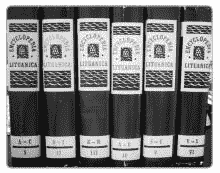
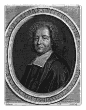

# 第二章：世界获得了一部免费的百科全书

维基百科早期充满希望的梦想已经变成现实。现在有一个免费的在线百科全书，在第一章中，你已经审查了其内容。但是什么导致了维基百科的创建，网站背后的哲学是什么？

在《偶遇》一书中，意大利著名学者和知识分子 Umberto Eco 以这个想法结束了他的第一篇论文：

> 总的来说，有教养的人的首要职责是始终准备重写百科全书.^([2])

在 1994 年，当 Eco 在博洛尼亚大学就“虚假的力量”进行演讲时，他自然并不是字面意义上理解这个陈述。对他来说，百科全书是隐喻性的；信念的修订是文明能够自我质疑的标志，而新的观点和发现，如科学进步或伪造品的揭露，会促使新的知识总结。但维基百科让这个隐喻变得生动起来：每天，成千上万的人“重写百科全书”，没有人检查这些编辑是否拥有适当的学位或资格证书，甚至是否为这次活动着装得体。

维基百科结合了百科全书、维基网站和免费开放内容的思想，定义了每个人如何构建一部免费百科全书。在本章中，我们将探讨这三个思想及其演变，讨论项目的动机及其早期历史，并通过讨论一些围绕几个案例研究的常见批评来审视维基百科方法的缺点。在本书的最后一章，我们将回到更近的历史和维基百科当前的组织方面。与此同时，当你阅读和编辑文章、参与社区讨论时，了解维基百科的哲学背景和影响是理解其运作的关键。

# 维基百科的使命

维基百科的作用是什么？在 21 世纪，分发信息比以往任何时候都要容易。一兆字节的数据——相当于一本大书的文本——可以在世界大多数地区的手机上以不到一美分的价格发送。互联网的基础设施越来越对世界人口开放，广播公司和出版商正变得不那么必要的中间人。

一直缺失的是自由可用的在线信息本身。网络上有大量的其他内容：新闻、观点、虚拟购物和社交网络。网络所缺乏的是硬事实，高质量的事实材料可以改变人们的生活。

这就是维基百科发挥作用的地方。它的使命是使全世界的所有信息都能用所有语言获取。到目前为止，这还不可能实现：大型参考图书馆并没有均匀地分布在地球上。如果你认为良好的平衡信息是每个人都需要的东西，你就能理解为什么一个全面、中立的在线百科全书很重要。如果你认为这种信息是每个人在日常生活中都能使用的工具，你就能看到为什么一个免费、易于获取的百科全书是必不可少的。快速、便捷地获取事实和参考资料现在很重要，而不仅仅是一个像艾萨克·阿西莫夫（Isaac Asimov）的《银河百科全书》（*Encyclopedia Galactica*）或道格拉斯·亚当斯（Douglas Adams）的手持《银河漫游指南》（*Hitchhiker's Guide*）那样的科幻概念。

**维基百科做什么**

“想象一个世界，在这个世界里，地球上每个人都能免费获取所有人类知识的总和。这就是我们正在做的事情。”

——维基百科创始人吉米·威尔士（Jimmy Wales），摘自 2004 年经常被引用的 Slashdot 访谈

**进一步阅读**

[`en.wikipedia.org/wiki/Serendipities`](http://en.wikipedia.org/wiki/Serendipities) 本章节开头引用的乌尔姆贝托·埃科（Umberto Eco）书籍的维基百科文章

[`en.wikiquote.org/wiki/Jimmy_Wales`](http://en.wikiquote.org/wiki/Jimmy_Wales) Slashdot 引用和其他吉米·威尔士（Jimmy Wales）的名言

* * *

^([2]) 参见乌尔姆贝托·埃科（Umberto Eco），“虚假的力量”，载于《偶然发现：语言与疯狂》（*Serendipities: Language and Lunacy*），威廉·韦弗（William Weaver）译（纽约：哥伦比亚大学出版社，1998 年），第 21 页。

# 维基百科的根源

维基百科成立于 2001 年，但帮助塑造该网站的批判性思想和发展早在那时就已经形成。以下按时间顺序列出了这些思想。它们显示了一种加速的趋势，特别是在 1990 年万维网成为具体提案之后。在整个 1990 年代，技术进步了。关于工具的新思考方式出现，深思熟虑且富有创新的发展相结合，影响了计算机技术的内容和影响。这些发展产生了塑造世界思想。然而，维基百科是互联网之前的一个悠久传统的组成部分，一些更古老的思想也融入了维基百科的文化——其中最重要的是百科全书的革命性概念。

## 从古希腊到今天：百科全书

什么是百科全书？对大多数人来说，*百科全书*是一本大书或多卷本的作品。它由一系列综合性的短篇文章组成，将知识领域划分为不同的主题。百科全书是参考工具书，旨在引导新读者，总结可能分散在许多出版物中的细节，并以易于理解的方式提供可用信息的概要。一个好的百科全书可以回答许多问题，而不会取代构建它的来源。

百科全书是**三级资料**的例子。它们既不是原始资料，如历史文件，也不是次级资料，如教科书，通常讨论、报道或解释原始资料。相反，百科全书的编纂者收集和总结了可用的次级资料（通常也会注明原始资料），以报道某一特定时期的知识领域和当时的思考。

百科全书有着崇高的起源。早期例子在世界各地的文化中以手稿形式存在，而装订的百科全书几乎与书籍的存在一样久远。普林尼的巨著《自然史》，写于公元 77 年，常被引用为最早的百科全书之一；这部作品至少影响了 1500 年。其他一些最早的百科全书是用中文（现已失传的《黄炎》，约公元 220 年出版）和阿拉伯语（10 卷本的《Kitāb 'Uyūn al-Akhbār》，或《Adab al-Kitāb》，约公元 880 年编纂）编写的。在整个中世纪欧洲，还发展了其他百科全书式作品，许多是用拉丁文写的，围绕哲学和宗教思想展开。

然而，直到很久以后，这个词汇才被用来描述这些作品。那么这个词的起源在哪里呢？维基百科本身提供了这个解释，归功于 16 世纪的学者 Joachim Sterck van Ringelbergh (图 2-1)：

> 词汇**百科全书**源自古典希腊语“ὲγκύκλια παιδεία”（发音为“enkyklia paideia”），字面意思是“[全面]的教育”，意味着“一般知识”。尽管知识的汇编概念可以追溯到数千年以前，但这个术语首次在 1541 年由 Joachimus Fortius Ringelbergius 所著的书籍标题中使用，即《Lucubrationes vel potius absolutissima kyklopaideia》（巴塞尔，1541 年）。词汇**encyclopaedia**首次由百科全书编纂者 Pavao Skalic 在其书籍标题中使用，即《Encyclopaedia seu orbis disciplinarum tam sacrarum quam prophanarum epistemon》（或称《Encyclopaedia，或世界学科的知识》，巴塞尔，1559 年）。（来源[[百科全书]，2007 年 4 月）

最早的百科全书汇编了关于整个世界的知识，旨在作为完整的教育内容直接阅读。^[[3]] 这种观念最终演变成了更现代的百科全书概念，即作为参考工具，更类似于字典的概念，其中单词被定义以便于查阅。（百科全书式词典，一种混合形式，至少自公元 2 世纪以来就存在。）在当代意义上，百科全书可能展示物体、绘制地图、包含关于历史、地理、科学和传记的文章，并涵盖事实知识的整个范围。

**图 2-1. 《Lucubrationes vel potius absolutissima kyklopaideia，1541》的扉页**

在现代时代，传统的百科全书努力在有限的篇幅和编辑能力下平衡其受众重要的主题。通用百科全书旨在具有普遍的覆盖范围，同时足够紧凑，每隔几十年就能全面更新，并适合放在书架上。专业百科全书可以为某一领域或子领域填充相似的空间。像《世界图书》这样的通用儿童百科全书与科学百科全书在格式和目标上有所不同，但两者都提供了对主题的清晰介绍。这个公式一直很成功，为出版商提供了从 18 世纪至今的高销量。

今天，数千种专业百科全书已印刷出版(图 2-2 展示了其中之一，即《立陶宛百科全书》，这是一部关于立陶宛的英文六卷本百科全书)。通用百科全书已成为家喻户晓的名字：对英语使用者来说有《大英百科全书》^([4])和《世界图书》，德语有《布罗克豪斯》，法语有《拉鲁斯》。《大苏联百科全书》在俄语中发展到 10 万篇文章，并为苏联的其他语言出版了百科全书。

**图 2-2. 《立陶宛百科全书》，1970 年至 1980 年在马萨诸塞州波士顿出版**

## 17 世纪末：现代百科全书

我们今天所知道的百科全书受到了 18 世纪欧洲启蒙运动的强烈影响。维基百科也拥有这些根源，包括理解并记录世界所有领域的理性动力。

约翰·以色列^([5]) 将路易·莫雷里的《大词典》(图 2-3，现代百科全书的先驱"))视为第一部现代百科全书。1674 年出版，半个世纪内印刷了多个版本。当时，正如现在一样，时代在变化：前十年的伦敦皇家学会由业余爱好者组成，他们大多不在大学里，但他们却是学术社团和现代科学方法的先驱。当时的新媒体是期刊，如皇家学会的《哲学事务》，它们被用来传播科学发现和理论。根据以色列的说法，在莫雷里编纂出现后的十年里，新的学术期刊机构威胁到了现有的权威。

到启蒙时代，文艺复兴时期的多才多艺的**“全才”**或**“万能之人”**概念已经达到了极限。科学和探索为知识体系增加了许多事实，没有人能够掌握所有重要的东西。

百科全书编辑通过协调主要学者和知识分子的努力，并浓缩可用信息，使知识领域对公众读者开放。以色列写道：“这些庞大的作品……是专门为广泛市场生产的。”他提到了“令人惊叹”的 64 卷德语《Zedler *Universal-Lexicon*》（1731–1750 年出版）；他还评论了当时一个藏书丰富的图书馆的巨大开销。6] 现在一般信息对富裕的中产阶级来说是可获得的；它不再局限于富人以及那些积极参与知识网络的人。

**图 2-3. 路易·莫雷里（1643–1680），现代百科全书的先驱**

新一代的百科全书，其中最著名的是丹尼斯·狄德罗的挑衅性法语作品**《百科全书，或科学、艺术和工艺的系统词典》**（*Encyclopedia, or a systematic dictionary of the sciences, arts and crafts*），是综合性作品。它们包括从技术到神秘到神学的所有知识领域。

## 维基百科作为百科全书

维基百科继承了这些百科全书的传统，但也有一些激进的变化。最明显的变化是技术性的：维基百科在线存储信息，因此其范围不受印刷经济学的限制。

维基百科的页面结构鼓励许多短篇文章而不是少数长篇文章。这是因为页面是**超文本**：一系列相互链接的文章。早期的百科全书使用脚注和索引作为链接到其他文章的方式，但维基百科充分利用了超文本，与印刷页面相比，它具有非常不同的组织风格。这种广泛的链接不仅限于英语版本的条目：从法语到斯瓦希里语（图 2-4

**图 2-4. 斯瓦希里语版本的维基百科标志**

如第一章所述，维基百科编辑会遇到原始百科全书编辑所遇到的问题——包括哪些主题以及如何呈现它们——并通过制定内容标准和风格指南来解决这些问题。文章应该是简洁的概述，而不是个人论文：完整、准确和客观。它们应该在引言部分快速总结主题，就像词典一样。这些风格指南有助于维基百科履行百科全书的传统功能：人们访问网站以获取对主题的快速介绍，这些介绍是为普通读者撰写的。

然而，维基百科的范畴远大于之前的百科全书项目。传统的百科全书通常被出版为对某些知识领域的全面指南。维基百科则是一个由专业和通识百科全书组成的集合，这些百科全书相互连接形成一个整体。其文章可以立即更新：文章是动态的，其内容可以每天甚至（在当前事件的情况下）每分钟变化。维基百科的巨大规模和快速更新部分得益于其作者模式与早期项目完全不同：著名作者或专家撰写文章的想法已被摒弃。

最后，与早期的百科全书不同，维基百科是一个非商业项目，其内容被故意许可，以便其他人可以自由使用。仅此一点，就肯定远远超出了早期百科全书编纂者所期望的。

## 20 世纪 60 年代和 70 年代：Unix、网络和个人计算机

现在向前展望几百年，我们将探讨维基百科遗产的技术部分：自由软件运动、互联网和个人计算机的发展以及维基技术的开发。

在 20 世纪 60 年代末，计算技术发生了两个关键的发展。第一个是现代操作系统的开始，这对于网络计算至关重要。在 20 世纪 60 年代，公众关注的计算机是 IBM 的昂贵 S/360 系列大型机，其抽动式磁带驱动器成为快速电子大脑工作的标志性象征。与此同时，当时相对被忽视的贝尔实验室的 Unix 操作系统是在数字设备公司的 PDP-7 小型机上创建的。（据传说，这台机器在被遗弃在走廊后已被回收。）Unix 最终成为互联网背后服务器上最广泛使用的操作系统之一，在 IBM 大型机成为硬件恐龙之后继续繁荣，并激发了各种自由软件项目。

在同一时期，后来成为互联网的网络基础被奠定。被称为*ARPANET*的原始互联网是美国国防部在 20 世纪 60 年代初期首先理论化的项目。与其它网络一样，ARPANET 为大学和研究机构提供了一些最早的连接。后来，这个网络背后的技术对消费者开放了新的网络：1979 年，CompuServe 提供了第一项电子邮件服务，同年也开发了新闻组软件。

十年后，蒂姆·伯纳斯-李将开发一个网络化的超文本概念实现，这个概念将变成万维网。随着 20 世纪 90 年代初网络浏览器的开发，自 20 世纪 70 年代中期以来一直在购买个人计算机的消费者（这一现象随着 1977 年 Apple II 的推出而变得普遍），现在可以“上网”并参与不断增长的互联网。这些在短短几十年内发生的发展，彻底重塑了现代世界，并使像维基百科这样的大型在线项目成为可能。个人网络计算的兴起也为自由软件和在线社区的文化思想提供了必要的技术背景，这些思想对维基百科的发展至关重要。

## 20 世纪 80 年代：自由软件运动

在 20 世纪 80 年代初，理查德·M·斯托尔曼，麻省理工学院人工智能实验室的软件开发者，对程序员自由丧失的现象感到警觉。Stallman 在同事环境中工作了二十年，那里改变或修改软件在技术上可行且没有法律问题。如果有人需要别人的计算机程序，他只需请求并修改它。

如维基百科上所述：

> 在 20 世纪 70 年代末和 80 年代，Stallman 所繁荣的黑客文化开始分裂。为了防止软件被用于竞争对手的计算机上，大多数制造商停止分发源代码，并开始使用版权和限制性软件许可来限制或禁止复制和再分发。这种专有软件之前就存在，并且很明显它将成为常态。[……]
> 
> 在 1980 年，Stallman 和其他在 AI 实验室的黑客们没有得到 Xerox 9700 激光打印机（代号 Dover）的源代码，这是业界的第一款激光打印机。（摘自[[理查德·斯托尔曼]]，2007 年 4 月）

当 Stallman 和其他黑客能够定制另一台实验室打印机，以便在打印时纸张卡住时向用户发送消息，但他们无法对 Dover 这样做——这对打印机位于不同楼层来说是一个大麻烦。Stallman 请求打印机软件，但被拒绝；这次经历和其他经历使 Stallman 确信免费软件的道德必要性。

软件现在由微软等公司生产，被拥有和控制，分享它意味着违反许可证和违法。*源代码*——更改程序所需的版本——通常不公开。即使你为它付了钱，也无法定制软件。

1983 年，斯托尔曼宣布了 GNU 操作系统项目，并在两年后创立了自由软件基金会。在一篇题为“什么是自由软件？”的论文中，斯托尔曼宣布了自由软件所必需的自由：

+   运行程序用于任何目的的自由

+   研究程序如何工作并将其适应你需要的自由

+   分发副本的自由，以便你能够帮助你的邻居

+   改进程序并将其改进发布给公众，以便整个社区受益

GNU 项目（其标志恰当地以一只角马为特色——见图 2-5)旨在构建一个完全自由的操作系统，灵感来自 Unix。*GNU*这个首字母缩略词是程序员的一个玩笑，代表*GNU's Not Unix*。GNU 是一个协作项目，到 20 世纪 90 年代初已经基本功能齐全。1991 年，一位名叫林纳斯·托瓦兹的年轻芬兰程序员提供了最后一块关键剩余部分，一个内核。

**图 2-5. GNU 项目标志**

托瓦兹将他的项目命名为*Linux*。在这个内核上运行的 GNU 软件组合被称为*GNU/Linux*，现在被个人和公司广泛使用。全世界有成百上千的人为 Linux 做出了贡献.^([7])

这个操作系统已经成为为不同目的开发的众多发行版的基础，是自由软件运动的一大成功。一些 GNU/Linux 版本是商业分发的，例如 Red Hat Linux。自由软件背后的思想已经变得广泛传播；其他成功的自由软件项目例子包括 Apache 软件，许多服务器都在其上运行，以及数百万人们使用的 Mozilla 网络浏览器。如今，自由许可、协作构建的软件支持全球企业和个人的工作。

GNU 开发者认识到，需要创建新的软件许可证，这些许可证与传统版权观念不同，以保护合法分享这些程序的自由。尽管版权赋予的权利长期以来一直备受关注——美国宪法中提到了版权，授予国会“通过为作者和发明家在有限的时间内提供其各自作品和发现的专有权，以促进科学和有用艺术的进步”的权力——但个人电脑和互联网的出现放大并扩大了版权问题。广义而言，版权法赋予创作作品的作者某些专有权，以销售和分发该作品，阻止他人未经许可复制和从作者的作品中获利。如今，在美国和其他许多国家，作品创作时版权会自动赋予。然而，由于复制作品，如计算机文件，现在变得快速、常规且几乎不花钱，因此许多人对版权法在电子环境中的地位和有效性提出了许多疑问。

作为传统版权的替代方案，斯托尔曼于 1989 年创建了通用公共许可证（GPL）；如今，这个许可证被广泛用于自由软件。这个许可证是*Copyleft*的一个例子——一个通过使用结合自由软件思想的新的许可安排来保护创作作品自由的运动。

如往常一样，维基百科对此有很多话要说：

> Copyleft 是对版权一词的戏谑，是指利用版权法来取消对他人分发作品副本和修改版本的限制，并要求在修改版本中保留相同的自由。
> 
> Copyleft 是一种许可形式，可用于修改计算机软件、文档、音乐和艺术等作品的版权。一般来说，版权法允许作者禁止他人复制、改编或分发其作品副本。相反，作者可以通过 Copyleft 许可方案，给予每个收到作品副本的人复制、改编或分发作品的许可，只要任何产生的副本或改编也受相同的 Copyleft 许可方案约束。（来源：[[Copyleft]], 2007 年 4 月）

进入 21 世纪转折点时，自由软件的理念已经远远超出了计算机代码的范畴。2000 年，斯托尔曼创建了 GNU 自由文档许可证（GFDL）。GFDL 被视为 GPL 的补充许可证，但其目的是针对书面作品，如软件文档，而不是代码。维基百科很早就采用了 GFDL 作为其网站上所有内容的许可证——这一举措保证了网站内容将永远对所有人免费使用和重新分发。

### 维基百科和自由视角

维基百科的方法与自由软件运动的理想紧密相连。维基百科运行的软件（MediaWiki）和网站的内容都对任何人免费开放，以便他们进行修改和调整，仅受各自 GPL 和 GFDL 许可证的要求限制。维基百科的口号是*维基百科，自由的百科全书*。没有人需要付费查看维基百科文章，但*免费*的含义不止于此：免费还意味着“无附加条件”，这是维基媒体项目的持续目标。自由意味着免费，没有修改和修改任何内容的限制，可以自由重新分发，任何人都可以参与，不受商业影响.^([8]) GFDL 许可证规定，任何置于其下的作品都可以被任何人合法地重新使用和重新发布，唯一的限制是这种重新发布本身也必须根据 GFDL（并且必须注明原始作者）进行许可。换句话说，该许可证确保任何 GFDL 许可的内容既免费可用，又对所有开放。尽管维基百科的贡献者*确实*保留了对他们作品的版权，但他们失去了指定如何使用它的权利。

因此，其他网站可以重新包装并从维基百科文章中获利，只要它尊重许可证。事实上，有许多这样的合法网站，被称为*镜像网站*，任何使用搜索引擎的人都会经常遇到它们。唯一的规则是，如果一个网站复制了维基百科的内容，那些页面也必须根据 GFDL 进行许可，并承认内容的来源。正因为这个条款，GFDL 有时被称为*病毒式许可证*：它传播并延续自身。

任何向维基百科添加内容的作者都应该了解许可证的含义。如果你对你的作品保持个人控制权很重要，你不应该将其添加到维基百科。一旦你将你的贡献保存到网站上，你就已经承认其他人可以修改它们，并且可以在许可证条款下以任何他们希望的方式使用它们。

使用 GFDL 的其他作品包括你正在阅读的书籍；其文本可以在相同条件下被重新使用。GFDL 要求有作者的历史记录；在维基百科上，你可以在我们引用的每个维基百科页面的页面历史中查找文章的原始作者完整列表（包括化名、自动化编辑和 IP 地址）。你可以在附录附录 A 和附录 E 中找到更多关于 GFDL 和重新使用合规性的信息。

## 1995 年：沃德的维基

Tim Berners-Lee，万维网技术的先驱，曾经说过他一直希望网络是互动的。互联网使用的社交和协作方面现在正在赶上这种潜力，维基网站只是更大模式的一部分。

*维基*是一种任何人都可以编辑的网站类型。建立维基创建了一个有效的协作群体创作工具。简单来说，维基是一组位于万维网公共地址上的网页集合，通过它们的页面标题相互链接，并且可以由贡献者在线编辑，无需特殊权限。更技术地说，维基是一种数据库，由 HTML 页面组成，这是在网络上使用的标记语言，但维基页面可以通过贡献者使用更简单的标记语言进行编辑。

结构上，维基可以包含多个由许多主题组成的讨论，并且由于其本质上是动态和变化的。大多数维基记录对其所做的更改，保留页面的先前版本，并使从一个页面到网站上另一个页面的可点击链接非常简单。开放性也是大多数维基的关键特性。您不需要太多的技术知识或特殊权限来编辑大多数维基页面；相反，您可以按需更改它们。维基页面与传统网页形成对比，传统网页的内容大多是静态的且不可编辑的。

维基的概念和名称来源于霍华德·G·"沃德"·坎宁安，一位美国计算机程序员。在设置他的网站 WikiWikiWeb 时，他没有选择他的第一个想法 QuickWeb，而是选择了夏威夷语中的术语*wiki wiki*：

> 为了使程序员之间交换想法更加容易，沃德·坎宁安于 1994 年开始开发 WikiWikiWeb，这是基于他在 20 世纪 80 年代末开发的 HyperCard 堆栈中的想法。他在 1995 年 3 月 25 日将 WikiWikiWeb 安装在他的公司 Cunningham & Cunningham 的网站[c2.com](http://c2.com)上。坎宁安之所以这样命名 WikiWikiWeb，是因为他记得一位檀香山国际机场柜台员工告诉他乘坐所谓的"Wiki Wiki" Chance RT-52 穿梭巴士线路，该线路在机场航站楼之间运行。"Wiki Wiki"是夏威夷语中*快速*这个词的重复（来自[[WikiWikiWeb]], 2007 年 4 月）。

在这个原始的维基网站上，即波特兰模式存储库（图 2-6

**图 2-6. 原始维基首页[`c2.com/cgi/wiki`](http://c2.com/cgi/wiki)**

> …对 Linux 的贡献并非来自随机样本，而是来自那些足够感兴趣以使用该软件、了解其工作原理、尝试解决他们遇到的问题，并实际上提出一个看似合理的解决方案的人。通过所有这些筛选的人极有可能有所贡献。（摘自埃里克·S·雷蒙德，《大教堂与市集》，1997 年 Linux Kongress 大会演讲）

以类似的方式，维基百科鼓励其众多读者成为作家、事实核查者和校对编辑，允许任何人提问或纠正错误信息。从广义上讲，共享改进和集体审查的理念在维基、免费软件以及任何人都可以编辑的百科全书概念中是普遍存在的。

## 2000 年：在线社区动态

维基百科以其培养一个复杂、独特的志愿者社区而闻名，但维基百科远非第一个在线社区或第一个维基社区。其他团体已经探索了将成为维基百科社会原则基础的想法。

专用虚拟社区自计算机网络开始以来就存在。随着互联网的发展，数百个在线社区已经发展起来，每个社区都有其独特的道德规范和传统。*社区*这一概念暗示了关注参与的个人以及他们如何互动是理解这些群体如何运作的关键。维基百科将虚拟社区定义为“一个具有共同兴趣、理念、任务或目标的社会网络，在跨越时间、地理和组织边界的虚拟社会中互动，并能够发展个人关系。”例如，以下是一些早期著名的在线社区（改编自[[虚拟社区]]）：

+   Usenet 社区成立于 1980 年，作为一个*分布式互联网讨论系统*，是第一个高度发展的在线社区之一，拥有志愿者调解员。

+   WELL 社区成立于 1985 年，它开创了在线社区文化的某些方面，许多用户自愿参与社区的建设和维护（例如，作为会议主持人）。

+   从 1983 年成立以来，AOL 提供了各种形式的聊天和游戏，后来还帮助开创了当代的“聊天室”。这些聊天室最初由志愿者社区领袖主持，并帮助 AOL 成为最大的在线服务提供商之一。

20 世纪 90 年代末兴起的新维基社区，其出发点是进行在线互动，这一想法是由这些以及其他许多在线社区共同发展起来的，并在此基础上加入了日益增长的自由和开源软件运动所阐述的开放大众协作的理念。但随着维基的发展，它们不得不发展出新的想法和原则，以指导人们如何在如此开放、根本不同的网站上有效地协作。

在原始 WikiWikiWeb 上工作的人们在后来对其他维基社区产生了影响力的术语和想法进行了创造和发展，例如，人们可以承担不同的角色，如*维基小精灵*，他们在网站上修复格式和风格的小问题。他们还注意到，内容在维基上可以以各种方式发展（有的比其他方式更好），例如，作为*围栏花园*，密集的内容区域，普通编辑发现难以访问。

对话在一小但影响深远的维基百科 MeatballWiki 上继续进行，该维基百科由加拿大人 Sunir Shah 于 2000 年 4 月建立。这个维基吸引了那些对讨论在线社区及其动态和典型问题感兴趣的人。在 MeatballWiki 上的大部分对话都是关于个人编辑倾向于如何回应维基编辑的自由。*软安全*（通过群体动态而不是硬编码的限制来保证安全）和*离去的权利*（某人应该能够轻松且优雅地加入和离开维基社区）的概念首次在这里讨论。用户还讨论了影响整个社区的大规模概念，例如*分叉*和*维基间*连接——社区分裂或联合。MeatballWiki 一直持续到今天，充满了关于构成健康、成功的在线社区以及在工作于维基上意味着什么的文章、讨论、争论和沉思。

因此，WikiWikiWeb、MeatballWiki 和其他早期网站发展了术语，并阐述了今天许多维基，包括维基百科，所遵循的社区结构原则。维基百科反过来，继续以这些早期维基未曾想象的大规模方式应用这些想法。

### 维基百科作为一个维基社区

维基百科是在维基已经作为特定类型的在线社区确立的氛围中发展的。*维基*这个词有时被解释为*缩写词*，一种逆向形成的缩写词，好像它代表*W-I-K-I*。按照互联网缩写的风格，你可以把它读作*What I Know Is*，指的是维基的知识贡献、存储和交换功能。典型的维基仍然让人联想到扩展头脑风暴会议上的笔记：超文本结构使得可以就任何点在其自己的较小讨论线程中展开讨论。早期的维基不仅是维基百科的技术先驱，而且在人们从一开始就认为维基编辑是一种分享知识的方式。然而，维基百科改变了维基的模式，从成为同伴之间的持续对话转变为收集信息和构建参考资源的项目——在这个过程中，它表明你可以用一个大型的、跨越语言和地理的异质在线社区来构建单一的作品。

成为维基网站不是维基百科内容的内在属性。然而，维基技术的采用对于维基百科在先前项目失败的领域取得快速成功至关重要。从技术历史学家的角度来看，维基百科已经足以被称为*杀手级应用*，这种技术的应用本身就证明了维基的成功。维基百科成功地利用其维基方面来收集和开发迄今为止世界上最大的百科全书。

拥抱百科全书的历史、免费软件的开放性以及在线社区和维基的易于访问和协作特性，使得维基百科能够吸引到既看到免费软件运动益处的技术意识强的人群，也能吸引到被百科全书使命和社区结构所吸引的非技术人群。在原本难以预见的领域，实现了高水平协作。例如，时事文章会迅速更新，通常一天内会有数百人进行上千次编辑，展示了这一协作工具的非凡响应能力。

## 2001 年：维基百科上线

维基百科从一开始就是一个不断发展的现象。它迅速增长，并持续吸引更多关注。

维基百科的直接前身是 Nupedia。（这并不是第一个互联网百科全书想法；1993 年的 Interpedia 项目从未真正启动。）Nupedia 由吉米·威尔士发起，拉里·桑格担任主编。该项目由威尔士和蒂姆·谢尔共同创立和运营的互联网门户网站 Bomis 提供支持。Nupedia 旨在提供一个在免费内容许可下的在线百科全书网站，由贡献的文章构建。其模式更为传统；它不是一个维基，而且预期贡献者在其领域是专家。他们提交的作品只有在经过广泛的同行评审过程后才会发布到网站上。由于这些多个评审阶段，项目的势头逐渐丧失，并且只有少数文章得以完成。

维基百科于 2001 年 1 月 15 日创建，作为一个基于开放维基网站的替代品。最初，该网站被定位为吸引新贡献者和文章加入 Nupedia 的方式。（桑格和威尔士在早期都参与了网站的开发，后来关于他们是否是维基百科的“共同创始人”存在一些争议。桑格于 2002 年离开了项目，而威尔士至今仍在维基百科中扮演着领导角色。）为了将网站与 Nupedia 区分开来，新的项目被命名为维基百科。

维基百科立即取得了成功。其维基设置降低了进入门槛，其声誉仅通过口碑传播就不断增长——该网站从未直接进行过广告宣传。一些关键提及在流行的网站上引起了人们对该网站的注意；2001 年 3 月，在 Slashdot 网站上发布了一篇帖子，同年 7 月，在社区编辑的技术和文化网站 Kuro5hin 的一个故事中得到了突出推荐。这些故事给维基百科带来了流量激增，包括技术熟练的人。搜索引擎，尤其是谷歌，每天也会带来数百名新访客。主流媒体第一次对维基百科的报道是在 2001 年 9 月 20 日的《纽约时报》上。

到 2001 年中旬，维基百科开始拥有自己的身份（图 2-7).已经创建了加泰罗尼亚语、中文、德语、法语、希伯来语、意大利语、西班牙语、日语、俄语、葡萄牙语和世界语版本，并且已经建立了技术支持（大多数情况下都是在公众视线之外，正如吉米·威尔士在 IRC 上聊天和在邮件列表上讨论问题）。更多的访问者意味着更多的文章被撰写，同时也对现有文章进行了更多的编辑（虽然难以量化，但同样重要）。最近更改页面显示了不断增加的活动。该项目在 2001 年 2 月 12 日左右达到了 1,000 篇文章，在 2001 年 9 月 7 日左右达到了 10,000 篇文章（参见图 2-8

**图 2-7. 从 2001 年底到 2003 年使用的维基百科标志。这个标志由一个名为 The Cunctator 的志愿者设计，并在公开标志比赛中获胜。查看维基百科标志随时间的变化情况。[`meta.wikimedia.org/wiki/Meta:Historical/Logo_history`](http://meta.wikimedia.org/wiki/Meta:Historical/Logo_history)。**

## 今日维基百科

现在，*维基百科*已经成为家喻户晓的词汇（至少在可以访问网络的家中）。到 2007 年底，根据 Alexa 排名，该网站已成为全球第 8 大访问量网站，维基百科背后的基于志愿者的社区组织已经变得高度复杂，从过去的错误中学习并发展机构。维基百科不仅仅是一块超文本；该网站是迄今为止最大、最全面的交叉引用事实信息集合。部分得益于这种坚持不懈的内容交叉链接，维基百科的文章在搜索引擎结果中非常突出；许多（如果不是大多数）网络查询都可以用维基百科文章来回答。维基百科是一个*互联网现象*，以前从未见过——而且直到最近，它技术上不可能以类似的规模存在。

在早期，维基百科完全由志愿者管理（技术上、财务上和社会上）。运行该网站所需的硬件和人员由 Bomis 捐赠。然而，随着时间的推移，维基百科的需求超出了 Bomis 的能力。现在，该网站的基础设施（但不是其内容）由非营利性的维基媒体基金会（WMF）运营，这将在第十七章中详细介绍。

WMF（维基媒体基金会）由一个非常小的员工团队组成，并由董事会管理，承担了协调来自世界各地的一个庞大且多样化的志愿者群体的角色：到 2008 年，维基百科已经存在超过 250 种语言。该基金会是所有维基百科和姊妹项目的母组织（这些其他参考项目在第十六章中描述）。最初位于佛罗里达州的圣彼得堡，WMF 在 2008 年初迁至旧金山。然而，提供维基百科基础设施的大多数服务器仍然托管在佛罗里达，还有额外的服务器位于欧洲和韩国。

**图 2-8. 2001 年末的维基百科（来自怀旧维基，[`nostalgia.wikipedia.org`](http://nostalgia.wikipedia.org)，2001 年维基百科快照的可浏览版本）**

基金会的目标始终与志愿者自由创建内容并传播全球信息的理想保持一致。其使命声明部分是：

> 授权和激励世界各地的人们收集和开发在免费许可或公共领域下的教育内容，并有效地在全球范围内传播……基金会将使其项目中的有用信息免费且永久性地在互联网上可用。

维基百科的其他故事属于第四部分。在那里，我们将告诉你关于许多语言中当前项目的范围以及维基媒体基金会的情况。这些项目和基金会的关键要素在头六个月就已经到位：开发人员负责软件，内容的开放创作，一个国际和跨语言的贡献者群体，口碑宣传，以及基础设施的宽松但有效的中央控制，以及社区驱动的轻量级编辑机制。

## 未完成的事业

维基百科的增长仍然完全开放——该项目通过完全忽略这个问题来简化了停止增长的问题。英语维基百科上的文章数量可能还会增加三到四倍，甚至更多。例如，如果将有关地理的信息添加到与世界其他地区的相同深度，英语维基百科的文章数量可能会增加到 500 万到 1000 万之间。

然而，除了关注未来的增长之外，还有更好的问题可以问。找到新的百科全书主题有多容易？编辑社区何时会转向关注每个单独文章的深度和质量，而不是整体覆盖范围的广度？这可能已经在发生了：内容的质量正变得与数量一样重要（参见第七章了解更多关于这些以质量为重点的项目以及如何参与）。

*《万事问津》* 是一本畅销的维多利亚时代参考书和指南书，首次出版于 1856 年（并在蒂姆·伯纳斯-李的早期网络先驱项目 ENQUIRE 中提及）。这或许会是维基百科的一个更好的标题，因为维基百科正逐渐成为一个关于一切事物的参考。但使用维基百科时仍需谨慎（参见第四章)，这是可以预料的；维基文化深刻地接受不完美和不完整，认为这是不可避免的，甚至可能是激发一个工作社区所必需的。

**进一步阅读**

百科全书

[维基百科百科全书历史](http://en.wikipedia.org/wiki/Encyclopedia#History) 百科全书简史

[维基百科百科全书列表](http://en.wikipedia.org/wiki/List_of_encyclopedias) 百科全书列表

[维基百科关于建立在线百科全书的项目信息](http://en.wikipedia.org/wiki/Internet_encyclopedia_project) 信息关于建立在线百科全书的项目

自由软件和开源

[自由软件基金会](http://www.fsf.org/) 自由软件基金会

[理查德·斯托尔曼的传记](http://en.wikipedia.org/wiki/Richard_Stallman) 理查德·斯托尔曼的传记

[埃里克·雷蒙德的论文《大教堂与市集》的文本](http://www.catb.org/~esr/writings/cathedral-bazaar/) 埃里克·雷蒙德的论文《大教堂与市集》

维基和社区

[c2.com](http://c2.com/cgi/wiki?WelcomeVisitors) [c2.com](http://c2.com)，第一个也是原始的 WikiWikiWeb

[维基百科关于维基的信息](http://en.wikipedia.org/wiki/Wiki) 来自维基百科

[维基的历史](http://en.wikipedia.org/wiki/History_of_wikis) 维基的历史

[`meta.wikimedia.org/wiki/Interwiki_map`](http://meta.wikimedia.org/wiki/Interwiki_map) 关于互链前缀的元页面

[`en.wikipedia.org/wiki/Virtual_community`](http://en.wikipedia.org/wiki/Virtual_community) 虚拟或在线社区

[`www.usemod.com/cgi-bin/mb.pl?WikiPediaIsNotTypical`](http://www.usemod.com/cgi-bin/mb.pl?WikiPediaIsNotTypical) MeatballWiki 上的文章，“WikiPediaIsNotTypical”

维基百科

[`en.wikipedia.org/wiki/Wikipedia#History`](http://en.wikipedia.org/wiki/Wikipedia#History) 维基百科的历史，来自维基百科

[`wikimediafoundation.org/wiki/Mission_statement`](http://wikimediafoundation.org/wiki/Mission_statement) 维基媒体基金会的使命宣言

[`www.alexa.com/data/details/traffic_details/wikipedia.org`](http://www.alexa.com/data/details/traffic_details/wikipedia.org) Alexa 流量详情，针对维基百科网站

[`reagle.org/joseph/2005/historical/digital-works.html`](http://reagle.org/joseph/2005/historical/digital-works.html) 约瑟夫·雷格莱的文章，“维基百科的遗产：愿景、实用主义和偶然性”，关于维基百科的影响和早期历史

* * *

^([3]) 请参阅罗伯特·柯林森的《百科全书：历史》（纽约：哈夫纳，1996 年），第 21 页。

^([4]) 关于对《大英百科全书》的批评，请参阅哈维·艾因贝德的《大英神话》（纽约：格罗夫出版社，1964 年）。艾因贝德（一位物理学家）的这本书仅对《大英百科全书》的中世纪版本具有权威性；它带有敌对偏见，但包含了许多关于一般三级源问题（如更新、名人作者、科学覆盖和人文方法）的有趣讨论和研究。

^([5]) 请参阅乔纳森·以色列的《激进启蒙：哲学与现代性的形成，1650-1750》（牛津：牛津大学出版社，2001 年），第 134 页。

^([6]) 以色列，《激进启蒙》，第 135 页。

^([7]) 关于对 Linux 持同情态度的大规模协作的讨论，请参阅詹姆斯·苏罗维基的《群体智慧：为什么多数人比少数人更聪明，集体智慧如何塑造商业、经济、社会和国家》（纽约：道布迪，2004 年）。关于 GNU/Linux 的历史，请参阅格兰·穆迪的《叛逆代码：Linux 和开源革命内部》（纽约：基础书籍，2001 年）。

^([8]) 请参阅自由文化作品的定义（[`freecontentdefinition.org/`](http://freecontentdefinition.org/）），维基媒体基金会于 2007 年（[http://wikimediafoundation.org/wiki/Resolution:Licensing_policy](http://wikimediafoundation.org/wiki/Resolution:Licensing_policy)）为其项目采用。

^([9]) Alexa 是一家使用 Alexa 工具栏用户数据的网络流量测量公司（[`www.alexa.com/`](http://www.alexa.com/))。

# 关于维基百科模式的辩论

维基百科在实现其使命，即生产一个广泛使用的、多语言免费内容百科全书方面取得了非凡的成功。这种成功既体现在网站的高使用率上，也体现在生产维基百科的全球社区中，这个社区由一群热心的志愿者组成。然而，维基百科尚未完成，远非完美，这一点在关于该网站的报道中也有所体现。关于该网站的新闻报道往往不是关于更多免费内容的“好消息”。媒体对网站失败的“坏消息”表现出更大的兴趣，这意味着许多人第一次听说维基百科是在批评性评论中，通常关于不准确的信息。

随着时间的推移，维基百科积累了众多批评者，数百篇文章都报道了维基百科覆盖范围的缺陷。有些讨论了单个文章的问题，而有些则对维基百科的整体政策和治理提出负面评论。有些人还对维基百科背后的整个想法进行了批评。这种批评不仅限于外部媒体：内部，贡献者花费大量时间讨论维基百科是如何运作的以及如何改进它。

在本节中，我们将突出一些对维基百科工作模型的常见反对意见：误信息的可能性、学术的尊重性，以及对专家和权威意见的不尊重和对业余编辑的开放性。我们将描述一些真实案例研究和评论，并描述维基百科的回应。这些问题都不是有简单答案的既定问题；维基百科继续完善其模型。我们鼓励你在阅读这本书并了解更多关于维基百科如何运作的信息时，考虑这些问题和其他问题，以形成你自己的观点。

## 误信息：Seigenthaler 丑闻

2005 年 5 月，一篇诽谤性的文章在“新页面巡逻”中漏网，这是维基百科编辑的一个非正式小组，他们在文章创建时检查新文章。一位匿名恶作剧者在一篇关于已故美国记者 John Seigenthaler Sr.的文章中插入了一段简短的虚构传记，只有五句话，Seigenthaler 曾在美国肯尼迪总统的白宫司法部任职。文本暗示 Seigenthaler 与肯尼迪暗杀案有关。五个月无人注意到——直到 2005 年 9 月，恶作剧被揭露并成为头条新闻。

Seigenthaler 的一位朋友最初发现了这篇文章；他通知了 Seigenthaler，Seigenthaler 随后联系了 Jimmy Wales 进行投诉。在 2005 年 9 月 24 日被发现后，令人反感的内容几乎立即从活页上删除；到 10 月初，该文章被彻底删除，以便无法从页面历史中查看令人反感的版本（随后重新创建了一个准确的传记）。由于维基百科的内容在其他网站上也有镜像，Seigenthaler 还不得不要求在这些网站上删除他的传记，例如[Answers.com](http://Answers.com)和[Reference.com](http://Reference.com)。

然而，事情并没有就此结束。西格瑟勒在那年的 11 月在美国《今日美国》上发表了一篇客座社论。^([10]) 在其中，他谈论了自己的“网络人格诽谤”，谴责了在互联网上散播的“毒笔文人”，并称维基百科是一个有缺陷的研究工具。这引发了几篇关于该网站的其它文章以及西格瑟勒和吉米·威尔士的访谈.^([11])

整个事件对网站来说是一个具有里程碑意义的时刻。被破坏的西格瑟勒传记成为国家新闻故事，这表明维基百科现在已经足够突出，以至于文章的准确性*很重要*——诽谤或不准确的内容真的可能伤害个人。在西格瑟勒丑闻之前，维基百科的贡献者往往接受网站上存在一些错误内容，并坚持“所以修复它”的哲学。这个想法仍然是维基百科基本哲学的核心部分，它认为在一个任何人都可以贡献的开放维基上，任何发现错误的人都可以——也应该自己修复它。西格瑟勒事件促使人们更加努力地撰写来源更准确的文章，建立对无稽之谈的零容忍环境，并认识到那些没有意愿亲自在网站上工作的人可能会受到维基百科文章的影响。

随着这个故事以及 2005 年底维基百科经历的大幅增长所带来的问题，也出现了一些程序上的变化。其中之一是对在世人物传记的政策（[[维基百科：在世人物传记]]，快捷键 WP:BLP）。这项政策要求这些传记严格遵守可验证性和无原创研究原则，并讨论在处理负面、无关信息或与文章其余部分不平衡的信息时如何维护中立观点政策。通过插入八卦或诽谤性内容违反这项政策是非常严重的；相关的文章或修订可能被删除，持续的违规行为可能导致编辑被禁止编辑。为了处理文章投诉，维基百科还设立了一个由信任的志愿者组成的电子邮件地址和回答机制。

在 2005 年 12 月，匿名用户通过 IP 地址创建文章的功能被停止。现在您必须注册并登录才能创建文章（参见第六章）。这项政策有助于减少被创建的无意义页面数量，这些页面是网站管理员必须删除的，这已经成为一项巨大的工作量——每天大约数千页。有些人质疑这项措施是否有效，未来维基百科可能会尝试重新启用匿名文章创建，以观察它会产生多大的影响。

这场丑闻的一个副作用是，从事媒体工作的人——以及任何名字出现在新闻中的人——现在倾向于检查他们是否有维基百科页面，许多人要求更改（或在某些情况下删除）页面。然而，编辑们会认真对待这些请求。他们会考虑中立性和准确来源的问题，不会仅仅为了满足主题的愿望而更改文章。

约翰·西格特纳尔关于负责任使用维基百科日益增长媒体力量的布道并未被忽视。文章可能被忽视的可能性是非常真实的。已经创建了越来越多的复杂机制来监视和纠正不良内容（见第七章)，但维基百科的开放性——一个关键价值——意味着某些错误的内容可能被提交并未被注意到，直到它引起麻烦。

## 业余贡献者、权威和学术界

任何维基百科的贡献者都可以匿名，而且大多数都是**化名**。贡献者没有任何义务透露他们在“现实生活中”是谁，大多数人也不会这么做。除非作者或编辑自愿提供这些信息，否则你无法真正了解作者对某一主题的经验细节。而且经验不应该很重要：无论一个人是大学教授还是高中生，重要的是他或她是否尊重维基百科的规则，并有效地为百科全书做出贡献。这个原则从一开始就非常重要：作者或编辑的背景不应影响他们在维基百科的贡献者地位。

同样，第一章中规定的（尤其是可验证性）内容政策适用于每个人。维基百科并不简单地接受权威人士的论点。即使是某个领域的广为人知的专家，也必须通过包括适当的参考文献来支持他们所提出的所有主张（至少在原则上）。

在这种情况下，许多问题随之而来。如果大多数贡献者都是半匿名的话，那么有人撒谎关于他或她是谁，这有关系吗？维基百科反学术吗？它因为不够尊重专家意见而伤害了自己吗？鉴于业余爱好者构建了这个网站，这个网站可信吗？

在本节中，我们将探讨权威的不同方面以及维基百科模式的批评。

### 维基百科与学术权威

维基百科在教育工作者中的声誉参差不齐；有些人认为它的质量很低，而其他人则训练学生适当地使用维基百科。现在许多大学已经明确表示，在学期论文中引用维基百科是不可接受的。^([12)] 维基百科未能通过一些学术尊重性的基本测试。

一个是关于维基百科内容的质量和准确性的担忧，这当然在整个网站上都有所不同。另一个更基本的原因是，大学水平的教授可以正确地将百科全书文章视为为懒惰的学生准备的。学生应该自己进行研究。

在维基百科上工作的人通常会同意这一点。文章的目的是提供快速获取信息的方式，维基百科对学术作品的引用旨在促进研究，而不是取代研究。学生应该跟进文章中给出的参考文献，并在其他来源中研究主题。通过改写维基百科来写文章是不可接受的，当然直接复制维基百科的内容应得到一个*F*级评分。不幸的是，学生可以轻易地将网站用作其他来源的替代品。（见附录 B，其中提供了针对使用并关注维基百科的教育者的具体建议。）

### 维基百科与专家

在文章中为陈述寻找支持性参考文献的需求（体现在可验证性和无原创研究政策中）与网站上处理争议的方式有关，尤其是关于贡献者专业性的问题。如果你在任何可争议的话题上发表观点，无论你在该领域的地位如何，你必须允许他人质疑它。陈述应明确指出谁说了什么以及在哪里，中立性意味着你要包括所有观点。你不能仅仅将你的专业知识作为维基百科的内容插入，而不提供支持你工作的参考文献。

因此，维基百科对编辑实行平等政策。专家与其他编辑享有相同的特权：专业知识必须通过编辑和讨论过程体现出来。普遍的观点是，如果你在一个主题上是专家，你可能已经花了一些时间研究文献，应该知道要引用的相关出版物，因此你可以轻松地遵循这些政策。要求引用是对一般、怀疑性读者的让步，排除了任何“因为我这么说，你就应该接受”之类的论点。如果你不引用来源即兴写作，那么你可能会遇到“你怎么知道？”之类的问题。这种挑战将同样发生在专家和非专家贡献者身上。

有些人认为这种将维基百科模式拉平的方法是错误的。这种论点的表述之一是，要求专家和教授为他们的观点提供学术支持是不尊重的。另一种观点是，维基百科积极敌视专家和专业知识，甚至迫使该领域最博学的人也要受到极端怀疑论者和业余爱好者的挑战。

在提供结论和省略部分原因的传统百科全书与强调提供完整细节和来源之间可能存在不匹配。即使是依赖*可靠来源*也可能存在问题。可靠来源应当被引用，但谁来确定哪些来源是可靠的？对来源的批评应当公正，但专家们在外人看来可能会显得争论激烈或判断过于迅速。

维基百科为这些困难提供的解决方案是附在文章上的专用讨论页面。在讨论页面上，你可以查询和澄清文章中提出的论点的步骤，以及质疑这些陈述的来源。例如，如果某本书的地位存在问题，可以在讨论页面上提出敌对评论，尽管它本身可能不适合文章。然而，仅靠讨论有时无法解决涉及专业知识问题的冲突，以下案例研究显示了这一点。如果怀疑论者觉得专家在回避问题，而专家只是试图简洁，那么双方都不会满意。

### 学术权威案例研究

维基百科与学术界的关系对其进步至关重要，但仅凭学术权威不足以在维基百科上确立自己的立场。维基百科在这一问题上的方法是由现实世界的经验塑造的——包括编辑争议、丑闻以及经过现场司法系统处理的事项。当贡献者匿名工作时，他们的资格必须被信任或忽略。此外，维基百科的历史表明，即使经过确认的学术资历也不是在网站上避免编辑冲突的切实保障。持有资历者的编辑可能会受到质疑。

科学领域一个有争议且高度可见的问题，即气候变化及其可能的原因，在 2005 年导致了一起维基百科上的戏剧性事件。许多文章都涉及其中；当时，大约有 100 篇关于气候学家的文章，超过 100 篇关于全球变暖怀疑者的文章，以及大约 100 篇关于全球变暖科学的文章（你可以在[[分类:气候学]]下的子分类中找到这些文章）。

威廉·M·康诺利（William M. Connolley），一位学术气候学家，以真名编辑维基百科。康诺利在面临极端怀疑论者时遇到了麻烦，这些怀疑论者也在编辑气候变化文章。纯粹的怀疑可能会破坏任何试图根据共识观点撰写合理科学材料的尝试，在这种情况下，争议导致了双方之间的编辑战争。

由于这次争议，康诺利被*仲裁委员会*制裁，该委员会是帮助监管和解决网站争议的志愿者编辑的正式机构，并在必要时有权制裁编辑（参见第十四章).^([13]) 他的制裁包括一个*撤销假释*——他每天只能撤销另一位编辑所做的更改，这是一项旨在帮助防止编辑战的措施。这些制裁后来被重新考虑并取消。在整个案例中，康诺利撰写气候主题的资格并不是问题；能否有效地编辑并与其他编辑和谐相处与一个人对主题的了解关系不大。

在 2006 年底关于*伪科学*的后续案例([[Wikipedia:Requests for arbitration/Pseudoscience]])中，维基百科对学术权威的看法得到了进一步的明确。根本问题涉及中立性（NPOV）及其在涉及科学问题时代表所有主要观点的含义。仲裁委员会的这一裁决更加明确地与主流科学保持一致；科学文章中预期科学共识将占主导地位。相关的原则是：“维基百科：中立观点，一项基本政策，要求对科学正统观念的显著替代观点进行公平的表述。在这个案例中，显著的替代观点指的是合法的科学分歧，而不是伪科学。”

第三个与此类案例相关的案例涉及卡尔·休伊特^([14]),麻省理工学院的一位荣誉副教授，他被禁止编辑英语维基百科上的一些文章。仲裁委员会的裁决确定他违反了中立观点政策，并过分强调了自己及其学生在理论计算机科学以及某些其他领域（如量子力学和科学社会学）的贡献的重要性。这里的问题不是区分学术和非学术方法，而是维基百科文章作为学术文献的概述，不应过分重视任何一种方法。受影响的一个领域是逻辑编程，这是“第五代计算”项目的基本技术。休伊特越过了无原创研究政策，试图在文章中强加自己对该领域的定义.^([15])

这些案例都说明了维基百科模式的具体困难。学者和其他专家都受到适用于网站上其他所有人的行为和内容政策的约束。然而，这些案例有所不同。Hewitt 的方法违反了中立观点的原则，明显造成了利益冲突。专家也不是免受人类缺点和激情的影响。Connolley 与麻烦的非专家的问题因他对制裁和其他编辑的耐心而短暂，他对自己贡献的证实从未成为问题。在维基百科上，无论你的专业知识多么丰富，中立观点都是不可协商的。

### 匿名和声称的专业知识

编辑的权威性和专业知识在编辑可以谈论自己的问题上也被讨论过。用户:Essjay（真名 Ryan Jordan）的案例在 2007 年春季曝光，并在一段时间内成为新闻的焦点。

Essjay 是英语维基百科上一位备受尊敬且经验丰富的编辑，担任了几个受信任的行政职位。他也声称匿名，在网站上没有透露自己的真实姓名或身份，但在他的用户页面上声称自己拥有神学博士学位和学术教学职位。他通常专注于网站的行政和流程方面，而不是内容，并因其公正和承诺而受到维基百科社区的尊重。

2006 年，Essjay 接受了《纽约客》杂志一篇长篇报道的采访，并继续声称自己是一名学者。后来发现这并不真实——Jordan 实际上是一名没有神学经验的年轻学生——通过误导记者，他让维基百科感到尴尬。丑闻爆发后，他辞去了网站上的职位。关于他是否曾利用声称的专业知识来影响内容，以及声称（但虚假）的主题专业知识在考虑他在维基百科上作为编辑的记录良好的技能时是否重要，仍然存在疑问。任何试图影响文章内容的行为都应该被了解维基百科不主张从权威出发辩论的教条的任何人所忽视，但无论是否如此，这都值得讨论。有关用户页面和在那里发布建议的更多信息，请参阅第十一章。

### 业余爱好者群体

在这两章中，你已经看到了维基百科内容模型的概述。多年来进行了一些调整，但维基百科想要收集的材料、其呈现和分发方式，以及为什么以这种方式而不是另一种方式行事的基本理念并没有随着时间的推移而改变。这确实留下了一些问题。谁负责写作和编辑？网站真的是一个开放的自由竞争，还是在幕后有真正的项目管理和管理机构？这些问题将在本书的后续章节中解答（分别参见第十二章和第七章），但就维基百科的工作方式而言，答案很复杂。

与批评维基百科对专家持敌对态度相伴随的是对编辑社区的相关批评——即维基百科依赖于业余爱好者。^([[17]) 一个常见的说法是，维基百科成功的背后仅仅是一群业余作家，他们缺乏制作优秀参考工作所需的专业知识。另一个批评是，维基百科对专业知识问题的处理是互联网文化中更大问题的组成部分。（从这个角度对维基百科“商业模式”的广泛讨论随之而来，但鉴于维基百科作为非营利性倡议的地位，这或许并不重要。）

记录有专业知识贡献者是否是编写优秀百科全书所必需的？这个答案需要一些限定。并非所有维基百科编辑都是业余爱好者；许多人都是学者（尽管他们可能不在自己的专业领域撰写文章）。当考虑到来源时，专业知识根本不会被拒绝：专家撰写的材料是网站上文章最理想的来源。参考使命可以明确实际目标是什么。维基百科正在构建一个庞大的材料和信息汇编，其中许多来自传统来源，内容政策仅仅作为应用于所有提交内容的标准。将维基百科编辑视为新的百科全书编纂者是有道理的，但更精确地说，他们正在从事创建一种*新型*的第三手资料，为*网络世界*提供*免费*的资料。

显然，如果没有广泛的公开参与，世界上最大的参考工作不可能在不到十年内完成。^([[18]) 与网站被批评为业余爱好者所创建相反，许多人认为维基百科动员大众编写一种新型参考书的做法是一种绝妙的举措——这种新方法仅仅是一套新的优势和劣势，正如所有新媒体一样。例如，非常快速的更新既是这个模型的优势也是劣势，这需要一些时间来适应。

维基百科之所以成功，还因为其出现时机恰到好处。自 2001 年以来，它积累了大量的文章和贡献者社区，这些是无法迅速超越的。尚未创建出其他多语言参考网站可以与之竞争。本章中提到的批评可能会导致维基百科模型或程序的变更，从而改善百科全书，或者一个新的网站可能会改善维基百科的基本模型。这个想法并非不切实际：维基百科的 GFDL 许可证和开放精神明确鼓励网站的某种后续发展。为什么地球上不能有两个或更多的第三级资源呢？未来是开放的。

**进一步阅读**

[`en.wikipedia.org/wiki/Seigenthaler_controversy`](http://en.wikipedia.org/wiki/Seigenthaler_controversy) 讨论 Seigenthaler 争议的文章

[`www.cs.kuleuven.ac.be/~dtai/projects/ALP/newsletter/may07/content/Articles/kowalski/content.html`](http://www.cs.kuleuven.ac.be/~dtai/projects/ALP/newsletter/may07/content/Articles/kowalski/content.html) 罗伯特·科瓦尔斯基对卡尔·休伊特案件的外部观点

[`en.wikipedia.org/wiki/Wikipedia:Why_Wikipedia_is_so_great`](http://en.wikipedia.org/wiki/Wikipedia:Why_Wikipedia_is_so_great)

[`en.wikipedia.org/wiki/Wikipedia:Why_Wikipedia_is_not_so_great`](http://en.wikipedia.org/wiki/Wikipedia:Why_Wikipedia_is_not_so_great) 一篇长期存在的论文，讨论了维基百科模型的优点和问题

* * *

^([10]) 参见约翰·西格特纳尔的文章 "虚假的维基百科‘传记’"，*《今日美国》*（2005 年 11 月 29 日），[`www.usatoday.com/news/opinion/editorials/2005-11-29-wikipedia-edit_x.htm`](http://www.usatoday.com/news/opinion/editorials/2005-11-29-wikipedia-edit_x.htm)。

^([11]) 整个事件的经过总结在文章 [[Seigenthaler 事件]] 中。

^([12]) 参见 Noam Cohen 的文章 "历史系禁止引用维基百科作为研究资源"，*《纽约时报》*（2007 年 2 月 21 日），[`www.nytimes.com/2007/02/21/education/21wikipedia.html`](http://www.nytimes.com/2007/02/21/education/21wikipedia.html)。

^([13]) 从 2005 年的第一个案例开始，这一限制的细节发布在 [[Wikipedia:仲裁请求/气候变化争议]]。在 2005 年的第二个关于此问题的案例中（[[Wikipedia:仲裁请求/气候变化争议 2]]），发现“威廉·M·康诺利总体上遵守了他的撤销誓言，尽管可以找到一些遵守不完整或可疑的孤立实例”，并且“对威廉·M·康诺利施加的一个撤销誓言是不必要的举动，现予以撤销。”

^([14]) 参见 Jenny Kleeman 的文章 "Wikipedia 禁止破坏性教授"，*《卫报》*（2007 年 12 月 9 日），[`www.guardian.co.uk/technology/2007/dec/09/wikipedia.internet`](http://www.guardian.co.uk/technology/2007/dec/09/wikipedia.internet)。

^([15]) 他的案件详情发布在 [[维基百科:仲裁请求/卡尔·休伊特]]。休伊特不接受裁决的公正性，并试图规避对他施加的编辑限制。

^([16]) 参见斯黛西·谢夫的文章 "Know It All: Can Wikipedia Conquer Expertise?" *《纽约客》* (2006 年 7 月 31 日)，[`www.newyorker.com/archive/2006/07/31/060731fa_fact`](http://www.newyorker.com/archive/2006/07/31/060731fa_fact)。

^([17]) 参见安德鲁·基恩的著作 *《业余爱好者崇拜：数字世界的民主化如何攻击我们的经济、文化和价值观》* (纽约：Doubleday，2007)。基恩的视角对维基百科持敌对态度，强调专业性和对百科全书业务的影响。

^([18]) 参见唐·塔普斯科特和安东尼·D·威廉姆斯的著作 *《维基经济学：大众协作如何改变一切》* (纽约：企鹅出版社，2006)。塔普斯科特和威廉姆斯对维基百科持同情态度，在商业背景下讨论它。

# 摘要

2007 年 3 月 15 日，当“wiki”一词进入牛津高阶英汉双解大词典在线版时，标志着一项里程碑式的成就，而这项技术存在还不到 12 年。然而，维基百科的根源可以追溯到更早，追溯到古代世界的许多早期百科全书和知识收集项目，以及启蒙时代理解世界的精神。在更近的时期，个人电脑和互联网的技术发展使得维基和维基百科成为可能，而自由软件运动为维基百科提供了其哲学立场。这段丰富的历史帮助定义了维基百科的目标，即向世界各地的每个人提供他们自己的语言中的免费信息，并以透明、协作、动态和开放的方式进行。自由软件还为维基百科提供了其内容许可：GFDL，确保内容将保持开放、可访问和任何人都可以自由使用的状态。这些目标自 2001 年网站开始以来一直是维基百科的一部分。然而，尽管充满理想主义，该网站显然并未免受对其模型本身和实施方式的批评；在本章中，我们介绍了说明这些批评的一些案例研究。
