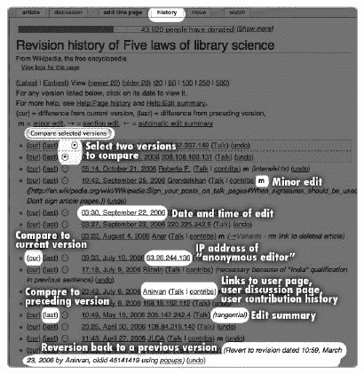

# 第四章 理解与评估文章

一旦您找到了您要查找的内容，您接下来需要了解的是您正在查看什么。通过理解维基百科中的命名空间和内容类型，您可以轻松地判断您正在查看的是文章、讨论页面、社区页面还是用户页面；一旦您知道如何搜索和浏览网站，找到您主题的文章就变得简单。下一步是评估文章的质量。

理解如何阅读文章的所有组件——从其编辑历史到其讨论页面——对于熟练和明智地阅读维基百科至关重要。经验丰富的编辑和读者使用许多技巧来快速评估页面并了解其状态。这取决于知道在哪里寻找以及确定哪些线索最为重要。

在本章中，我们将确定典型文章的不同部分，并讨论每个部分可以告诉您什么。然后，我们将列出在批判性地评估文章时需要提出的一些详细问题。在本章中，当我们描述文章是如何组合起来的，我们将列出线索——用于质量评估的要点。如果您时间紧迫，我们已在章节末尾总结了我们的最佳线索。

### 注意

*在本节讨论维基百科的外观和感觉时，我们将讨论使用默认配置、Monobook 皮肤查看页面。皮肤是可定制的，有多种选择；更多内容请参阅设置您的偏好*。

# 文章结构

每个可编辑的维基百科页面都由三个相关部分组成：页面或文章的文本、页面历史记录以及一个独立的讨论页面。在（几乎）任何页面的顶部可见的标签页是您进入这些组件的入口点。如果您未登录，则会有四个标签页，如果您已登录，则会有六个标签页。

假设您已登录，您将看到的标签页如图 4-1 所示：文章、讨论、编辑此页、历史、移动和监视。

+   文章标签页显示了您正在查看的文章文本；这是您访问页面时的默认视图，也是您在探索其他组件后想要返回的视图。该标签页的标题会根据命名空间而变化；例如，如果您正在查看维基百科命名空间中的页面，则显示为*项目页面*，如果您正在查看用户命名空间中的页面，则显示为*用户页面*。

+   讨论标签页显示了该文章的讨论或谈话页面；这是一个专门用于讨论页面内容的独立页面。

    

    **图 4-1. 维基百科页面顶部的标签页**

    ### 注意

    *“讨论页”和“讨论页”有时可以互换使用。尽管用于讨论文章的标签标有“讨论”，但它实际上会引导到一个位于 Talk 命名空间中的页面。附在用户页面上的讨论页，用于编辑者之间的对话，也称为讨论页——尽管，为了严谨，它们位于 User talk 命名空间中的用户讨论页*。

+   “编辑此页”标签允许您编辑您当前正在查看的页面。点击标签将打开一个编辑窗口，您可以在其中修改页面的文本。

+   “历史”标签显示了您正在查看的页面的编辑历史。

+   “移动”标签可以将页面移动到新的标题。现在先不要进行这项高级操作，直到你有机会阅读第八章。

+   “关注”标签将你当前查看的文章添加到你的个人关注列表中。（如果你已经关注了某篇文章，标签将显示“取消关注”，点击它将从你的关注列表中移除文章。）

在本章中，我们将整体介绍文章，包括讨论页和历史页。编辑内容从第二章第五节（第五章）开始讨论，然后我们将回到第十一章（第十一章）继续关注关注列表。

**缺失的标签**

对于特定页面上的标签，有一些例外。例如，受保护的页面不会显示“编辑”标签，而是显示“查看源代码”标签，该标签显示了文章的 wikisource，但不允许您编辑它。Special 命名空间中的页面，这些页面不可编辑，不会显示任何这些标签。如果您未登录，则“移动”和“关注”标签不可用。

## 文章正文

你是否曾经好奇是什么让维基百科的文章看起来如此标准化？撰写维基百科文章的常规方式结合了多个可识别的特征，这些特征通常会在文章成熟时出现。在本节中，我们将回顾你可能在文章中遇到的各个部分。提示：*并非所有文章都必须包含所有这些部分，但如果看到一篇没有这些部分的文章——或者如果文本看起来没有格式化——那么这篇文章很可能是由一个缺乏经验的编辑添加的*。

在页面标签直接下方，你会看到你正在查看的页面标题，以大号粗体字显示，然后是一行文字和“来自维基百科，免费百科全书”的字样。从这里开始，页面的可编辑部分开始了。

就像电影预告片一样，文章开头可能会有斜体字的消息。这些消息不是文章的一部分，但是一个称为“帽子注”的规则。*帽子注*会指引你到消歧义页面或其他可能与你所查看的文章混淆的文章；例如，*有关医学术语，请参阅[[rigor (medicine)]]*出现在[[rigour]]的顶部。

你也可能在文章开头看到一个或多个醒目的带有彩色框的警告信息；例如，警告说*这篇文章需要专家的关注*或*这篇文章的中立性存在争议*。其他信息可能只是简单地指出文章需要进行某种清理。这些信息有两个目的：它们提醒读者注意问题，并让编辑知道“这里需要做些事情。”它们是通过模板生成的（参见[[Wikipedia:Template messages]]的列表），任何编辑都可以添加（或删除）任何模板，所以它们并不特别“官方”。然而，它们对于许多质量问题是很有用的警报，并且告诉你至少有一位编辑对这篇文章表示关注。

**颜色编码**

文章警告信息具有标准形状（细长和矩形）和颜色编码：橙色表示内容问题，红色表示删除候选，黄色表示清理。蓝色用于任何一般性信息性消息。参见[[Wikipedia:Article message boxes]]，快捷键 WP:AMB，以获取完整解释。

在任何消息之后，文章本身的文本开始。通常文章文本被分成许多部分，这些部分应该传达文章的逻辑结构并将其分解成可管理的部分。如果有三个或更多这样的部分，就会自动显示目录（ToC）。单击目录中的任何链接会直接带你去到文章的相应部分。你可以通过单击[显示/隐藏]链接来隐藏冗长的目录；如果你已登录，你还可以在你的用户偏好设置中禁用所有目录的显示。

无论文章有多少部分，都应该以一个强有力的引言段落开始，这个段落会告诉你文章的主题以及为什么它很重要。

文本本身也应该穿插着指向其他文章的内部链接或维基链接；这些链接以蓝色显示。提示：*如果文本中没有维基链接，那么这篇文章很可能是由不熟悉维基百科惯例的人所写，这篇文章本身也可能存在问题*。

文本还可能包含图像（应附有标题）或图形，这些图像总结了关于主题的信息。要查看完整尺寸的图像及其更多信息，只需单击图像；这将带你去到图像描述页面。

您也可能在文章开头附近看到一个*信息框*，通常位于右侧。这些框是对文章主题关键事实的标准化展示。为许多不同领域的文章开发了不同风格的信息框，从植物种类到澳大利亚板球运动员。它们都是基于*模板*的，这些模板在第九章中有描述。提示：*作者在文章中不会签名，所以如果您在文章文本中看到签名，那是由不熟悉维基百科惯例的人留下的*。

对于参考文献，文章可能包含脚注或内联引用。有时外部链接会嵌入到文本中；然而，这种引用风格是不被推荐的，更倾向于使用脚注。脚注将以小上标数字出现在句子的末尾；点击脚注数字将带您到文章末尾的相应脚注，反之亦然；点击脚注开头的箭头（^）将带您回到文本。

在一篇优秀的文章末尾，您会发现几个标准化的部分：参见、参考文献和外部链接。（在消歧义页面上，它作为指向具有相关名称文章的专用导航结构，这些部分不使用。）参见部分应包括其他相关维基百科文章的列表。通常，已经在文本中链接的文章不会包含在本节中。参考文献，有时称为*来源*或*注释*，包括撰写文章时使用的来源。当存在时，脚注通常列在这里，或在参考文献后附加的注释部分中。外部链接部分包括指向该主题的其他相关非维基媒体网站的链接。例如，如果文章是关于在网络上设有主页的公司或组织，那么应在该外部链接部分包含指向该网站的链接。

有时也会包含参考文献和进一步阅读部分；前者可能列出文章主题的出版物，而进一步阅读部分可能列出文章中未直接引用的其他重要信息来源。本节还可能包含指向其他维基媒体姊妹项目的链接——例如，指向维基媒体共享资源上的相关媒体或指向维基词典中某个术语的定义。此外，本节还可能有说明材料是从非版权来源导入的消息。提示：*从其他来源导入的任何材料，例如旧百科全书，可能需要更新*。

**参考文献和研究**

您对文章给予的关注越重要，您对某个主题的研究越认真，那么文章的参考文献就越可能引起您的兴趣。尽管这并不总是如此，参考文献应该包括在线和纸质来源，以及近期作品和提供广泛背景的教科书。一个良好的参考文献、外部链接或进一步阅读部分可以是一个很好的开始研究的地方，尤其是如果您对某个主题是新手的话。

在文章的底部，您可以找到任何存根消息。正如在第一章中提到的，存根只是一个简短或初级的文章，可能是不完整的。存根文章按主题排序，并带有这些基于短模板的消息，告诉您该文章是一个存根以及它属于哪个广泛的主题类别。提示：*存根文章在提供的信息方面可能是不完整的——看到存根消息是一个提醒，需要检查其他来源*。

文章主体之后跟着一个小盒子，列出了文章被归入的分类。点击这些分类链接中的任何一个都会带您进入分类页面，该页面列出了同一分类中的其他相关文章。提示：*所有文章至少应属于一个分类。没有列出任何分类的文章可能是新文章或孤儿文章*。

## 返回链接

如果您想将文章置于更广泛的背景中，或者如果您正在深入研究某个主题，侧边栏中的“这里链接”链接可能会有用。点击此链接会显示链接到您当前查看的文章的其他页面。换句话说，此链接为您提供了一个列表，即*返回链接*——您的文章在其他页面上的引用位置。检查返回链接是充分利用维基百科的技巧之一。

对于一个基本主题的文章，可能有大量其他文章链接到它，并且可能有太多的反向链接来告诉你任何有用的信息。除了它们确实非常多之外，你不会从关于[[纽约]]的文章的反向链接中学到很多。另一方面，只有少数文章可能链接到一个更不为人知的文章。例如，对于你正在研究的历史人物，反向链接可能会出现进一步研究的切入点：关于他们一生中发生的事件的文章或包括感兴趣人物的官员名单。不要假设文章本身会通过其“参见”部分将你带到所有那些其他页面——文章总是处于不断进展中。如果引用隐藏在具有不同替代文本的内部 wikilinks 中，那么搜索网站上的文章标题也不一定会找到其他页面上对它的所有引用。然而，使用“链接到此”将捕获对文章的所有引用，包括它可能在用户或项目讨论页面上被讨论的地方。如果你正在检查文章的质量，检查反向链接总是值得的。

完全没有反向链接意味着你发现了一个孤儿，这被认为是一种令人衰弱的状态。一个孤儿的文章是不幸的，可能是可疑的，提醒读者注意潜在的问题。这可能仅仅是因为文章是新的，还没有其他文章有机会链接到它，或者它可能是一个实际上不是百科全书式的话题。如果一个文章声称是关于一个重要话题的，但没有东西链接到它，那么它可能是一个骗局。检查文章的年龄，如下一节所述。提示：*没有进入链接也可能意味着文章标题选择不当，可能不符合维基百科风格。也可能想象到一个孤儿的文章标题中有一个拼写错误（例如，一个细微的错误，如错误的标点符号或* Mc *而不是* Mac*）。如果是这种情况，值得搜索关于同一主题的其他文章，如第三章中所述。

## 文章历史

一旦你彻底阅读了一篇文章，你想要了解其下一个重要方面——如何阅读其历史。维基百科上的每一页，无论是文章、讨论页还是任何其他页面（除了自动生成的特殊页面），都记录了对其所做的所有更改，这些更改都保存在页面历史中。

页面历史对了解情况的人来说是很有启发性的。阅读页面历史的目的是通常确定一篇文章随时间发生的故事。这篇文章有多老？有多少编辑参与过它？主题是否引起争议，编辑之间是否有辩论？页面是否随着时间的推移而改进，或者是否有好的内容丢失？某个编辑的特定编辑对文章有价值吗？你正在查看的当前版本是否被破坏？页面历史可以回答所有这些问题，还可以给你一个关于文章可信度的良好印象。经验丰富的维基百科编辑通过查看页面历史并跟进构成该历史的某些个别编辑，可以从中获得大量关于文章的信息。提示：*文章主题的争议性很重要，因为一个变成战斗区的主题通常会驱赶所有除了高度偏见的编辑；经过仔细调查，页面历史可以告诉你这是否是情况*。

页面历史可以通过点击页面顶部的“历史”标签来访问。“历史”标签始终指向你正在查看的页面的历史。例如，如果你正在查看文章的讨论页面，点击“历史”标签将带你到该讨论页面的编辑历史，而不是相关文章的历史。返回查看文章，然后点击“历史”标签以查看文章的历史。

重要的文章通常有多个贡献者。如果页面历史表明该页面完全是或几乎完全是某一个人的作品，你面临的情况更类似于评估某人私人网站上的文章。提示：*简短的历史是一个警告信号。如果只有少数人编辑过一篇文章，那么很可能只有少数人审查过事实内容，页面可能代表了主题的有限观点*。

**你不能更改维基百科**

你实际上无法在维基百科中更改任何内容……你只能添加内容。你今天阅读的文章只是当前的草稿；每次更改时，都会保留新版本和旧版本的副本。这允许你比较不同版本，并在必要时恢复旧内容。除了页面删除（在第七章中讨论 Chapter 7）外，内容永远不会真正从维基百科中删除。（改编自[[Wikipedia:Ten things you may not know about Wikipedia]])

然而，即使在漫长的历史中，一些编辑可能应该被忽略，因为它们对内容的重要性很小。许多编辑可能只是对文章进行了微小的格式更改。一些无意识的机器人可能已经编辑了它。这些贡献者可能没有验证任何内容，只是简单地将文章提升到维基百科的风格标准。一个常见的情况是，一个单独的贡献者写了一篇短文或初稿的大部分内容，然后有几个人会重新格式化文章，但不会实质性地改变内容。在这些情况下，仍然只有一个主要作者。

### 阅读页面历史

首先而且最重要的是，页面历史会告诉你谁曾经修改过这个页面，并允许你检查文章的连续版本以及它们之间的差异（参见图 4-2). 你还可以看到每次编辑的日期和时间，并比较编辑的版本。最后，你可以看到贡献者在编辑摘要字段中关于他们编辑的评论。



**图 4-2. 阅读页面历史，从“历史”标签访问**

页面历史中的每一行代表一次单独的编辑。每次修改并保存 wiki 页面时，都会保存该页面的新版本，并在页面历史中添加新的一行。最新的版本显示在历史记录的顶部，因此向下阅读就是回溯到任何页面的历史。

页面历史中的每一行都有几个元素。从左到右阅读，它们如下：

+   首先是两个链接，curr 和 last，以及一个单选按钮。点击 curr 查看特定版本，它会与文章的最新版本进行比较（这样你可以看到该版本与网站上当前显示的版本相比如何），而点击 last 则将特定版本与紧接其前的版本进行比较（这样你可以确切地看到这次编辑具体改变了什么）。单选按钮允许你比较文章的任何两个版本，如“分析页面历史”中所述，分析页面历史。

+   接下来，显示编辑的日期和时间作为蓝色链接。默认情况下，此时间设置为显示在 UTC 时区。 (如果您登录，可以更改时间到您所在的时区，方法如“设置您的偏好”中所述，见创建账户。) 点击此链接将显示该页面的特定版本。当您查看旧版本时，页面上方将显示警告消息，并且浏览器中的页面 URL 将显示您正在查看的版本的版本号或唯一 ID。您可以使用此 URL 链接到该页面的特定修订版。 (这也是左侧侧边栏上的“永久链接”的工作方式。)

+   接下来，显示编辑的作者。此作者将按用户名（如果编辑者已登录）或 IP（互联网协议）地址（如果匿名编辑）列出。点击用户名将带您到编辑者的用户页面，如果有的话；如果用户名显示为红色链接，则表示编辑者已登录但尚未创建用户页面。如果编辑者未登录，则将显示他或她编辑的计算机的数字 IP 地址，点击 IP 地址将带您到该 IP 的贡献列表。

+   在编辑者姓名之后，括号中有指向编辑者用户讨论页面的链接（讨论）和，如果编辑者已登录，则指向其贡献（贡献）。无论编辑者是否登录，您都可以访问其讨论页面留言。提示：*如果您怀疑是破坏行为，查看讨论页面以查看是否有特定编辑收到了其他编辑的警告可能特别有帮助。再次提醒，红色链接表示编辑者的讨论页面尚无留言*。点击“贡献”链接将显示该特定编辑者所做的所有编辑列表。

+   接下来，如果编辑将编辑标记为“次要”，则编辑将显示小写*m*；次要编辑通常是小的更改，例如拼写或错别字纠正。括号中的数字（自 2007 年中以来进行的编辑）显示该单个编辑更改的字节数；大量更改通常反映了整个文章的编辑和保存。 (更有用的一点是，单个编辑更改的字节数净变化也显示在“最近更改”和“个人关注列表”中)。

+   最后，任何随后的文本都是编辑提供的*编辑摘要*的一部分。这（希望）是一个旨在描述编辑所完成的内容以及为什么进行编辑的信息性评论。有时这些摘要会自动创建并包含各种链接；通常它们包含多年来发展起来的某种简写或术语。

**问题 IP**

如果编辑是由未登录的用户进行的，你至少可以查看使用相同 IP 地址做出的其他贡献。但请记住，相同的 IP 地址可能代表不同的人进行编辑，而不同的 IP 地址可能代表同一个人，因为互联网服务提供商并不总是以电话号码分配那样简单的方式分配 IP 地址。许多互联网服务提供商从地址池中向用户发放临时 IP 地址，当用户断开连接时，地址会返回池中，以便分配给其他人。这些被称为*动态 IP*。（只有最后三位不同的 IP 号码可能是同一编辑者使用动态 IP。）此外，即使 IP 地址是固定的，它也可能是公共场所（如图书馆、互联网咖啡馆或学校）中的计算机的 IP 地址。这意味着，当然，你可能会看到来自同一 IP 地址的许多人的贡献，并且你不能确定留在讨论页上的信息是否会到达特定的用户。来自公共设置的 IP 地址有时会揭示极端且令人困惑的编辑和破坏的组合。然而，你仍然可能看到特定的编辑是在一系列编辑中发生的，这可以帮助你判断当时坐在那台机器上的人的性格。如果他们被确定为来自公共计算机，IP 地址的讨论页面有时会有此类通知。

### 分析页面历史

比较文章的版本，或*检查差异*，是编辑确定文章随时间变化的最有用工具。"Diff"是"页面之间的差异"的缩写。术语"diff"也常被用作指代页面特定旧版本的简称。

检查差异可以告诉你页面随时间的变化，以及当前显示的版本是否是最佳版本。例如，如果你怀疑当前版本有破坏行为，可以回退一个或两个更改，使用单选按钮或 curr 和 last 链接查看信息是否持续存在。如果文章中的某些内容似乎不真实，值得比较版本，直到你可以确定它是何时被添加以及由谁添加的。（毕竟，如果你可以询问编辑文章中某些内容的人关于编辑的问题，你可能会对你的困难有所进展。）

由于保留了页面的所有版本，任何两个版本都可以进行比较。要这样做，选择你感兴趣查看的版本的单选按钮。将出现另一个单选按钮，用于所有比你所选择的版本更新的页面版本。选择这个新的右手边的单选按钮，以查看你感兴趣的较新版本。（要比较最新版本，请选择顶部的单选按钮。）现在点击页面历史记录顶部的"比较所选版本"按钮。

将出现一个带有两个标题的分屏，如图图 4-3 所示，每个标题都告诉您版本日期和时间、编辑作者以及他的或她的编辑摘要。右侧的版本始终是您选择的两个版本中的较新版本。然后您将看到您选择的两个版本的维基源逐行比较。在旧版本中，与新版本不同的段落突出显示为黄色，在新版本中，它们突出显示为绿色。段落内删除的文本在旧版本中显示为红色，而在新版本中，段落内添加的新文本也显示为红色；如果整个段落被删除或添加，文本简单地显示为黑色，而另一侧为空白（白色）。


**图 4-3. 通过点击页面历史中的“比较版本”可以访问差异。右侧显示最新版本。阴影表示已更改的段落。编辑者的姓名、编辑的日期和时间以及编辑摘要列在顶部。**

**撤销破坏行为**

页面的任何旧版本都可以编辑并重新保存，以成为最新版本，覆盖任何其他编辑。当这样做以撤销单个编辑时，称为*还原*该编辑。还原是错误可以轻松修复的方式，如第五章中所述，以及如何删除大多数破坏行为，如第七章中所述。

在此突出显示的更改摘要下方，显示您比较的两个版本中较新版本的整个渲染视图。请注意，您可以在用户偏好设置下的“其他”中更改此视图。

如果没有显示逐行差异，则页面两个版本之间没有差异。如果您比较的两个版本之间还有中间编辑，比较会告诉您这一点（例如，*5 个中间编辑未显示*）。仅显示您比较的两个版本之间的差异。

如果编辑是由注册用户进行的，你可以通过访问该用户的页面来跟进，看看他是谁（或者至少他声称是谁）。与每个用户页面相关联的是用户讨论页面，它可以给你一个用户与其他用户互动的感觉：是不是充满了感谢的便条或充满敌意的争论？点击任何特定贡献者的贡献可以显示该特定人员在维基百科上所做的编辑。提示：*这是一个新贡献者还是有经验的贡献者？他或她还做了些什么工作？*

有时候，当你需要找到某个特定信息被添加到文章中的确切修订版时，你会在历史中这样做。也许你需要知道谁添加了一个有问题的陈述，或者添加清理标签背后的推理是什么。你可以简单地从当前修订版逐个回退，比较每个版本，直到找到你想要的那个。这种方法对于历史非常短的文章来说效果很好，但对于编辑历史较长的文章来说很快就会变得乏味。因此，有几种技巧可以快速审查长页历史：

1.  首先，在页面历史记录的顶部，将可查看的更改数量设置为 500 而不是 50，这样你就可以在单个屏幕上看到所有历史（或至少更多）。

1.  快速扫描编辑摘要——有什么东西跳出来吗？例如，如果你正在寻找添加清理标签，有人提到添加这个标签吗？使用 CTRL-F 进行特定术语的搜索有时可能会有所帮助。

1.  如果你找不到你正在寻找的版本，可以回退大量更改，并在中间选择一个修订版来二分编辑历史。通过点击链接的日期或使用单选按钮与当前修订版进行比较来审查这个修订版。你正在寻找的信息是否在这个旧修订版中？

1.  如果是这样，可以一次回退几个更改，直到找到一个版本，其中它不存在。如果不是，可以向前几个更改，直到找到一个版本，其中它*存在*。

1.  完成这些后，你将在信息被添加时找到两个修订版——一个在信息添加之前，一个在信息添加之后（你找到的包含信息的最早修订版）。以这种方式缩小范围后，可以一次几个修订版地向前和向后工作，使用单选按钮比较修订版。

1.  确定添加某物时的确切差异通常很快。然后，你可以通过检查编辑者的编辑摘要和其他贡献来确定这似乎是一个值得信赖的编辑。

### 编辑摘要和微小编辑

当阅读页面历史时，你会看到评论和解释。这些是*编辑摘要*，编辑提供的简短评论，以帮助解释他们的编辑。编辑摘要会在页面历史、最近更改和用户监视列表中显示。理想的编辑摘要简要解释编辑的性质，并为其提供一些背景信息（例如，不仅仅是说*重写*，而是*重写了第二段以改进语法和清晰度*）。编辑摘要不必复杂。如果你自己进行测试编辑，请在编辑摘要框中添加*测试*。当你撤销编辑时，只需在框中写下*撤销测试*。

编辑摘要（尽管是一个非常好的主意）是可选的，即使存在，也可能因为多年来已经发展了大量术语而显得晦涩难懂。例如，你第一次看到*避免交叉引用*时可能无法理解，但它是指*避免了一个交叉引用页面*，这反过来又意味着链接被修正为指向适当的文章而不是交叉引用页面。*维基化*一个页面是指向页面添加适当的维基链接，通过将适当的单词、名称和短语链接到其他文章；这是最常见的操作之一，因为编辑在编织维基网，这可能在摘要中也以*wfy*的形式出现。

还有一些编辑摘要是由软件自动添加的。例如，被编辑的章节标题会自动添加，并在编辑历史中以灰色字体显示。偶尔，你会看到编辑在某个问题上来回讨论时的小对话（然而，编辑摘要不会被索引或可搜索，因此任何真正重要的讨论都应该始终在讨论页上进行）。如果需要，编辑摘要可以包含维基链接。

请参阅附录 C 或附录 D 或[[Wikipedia:编辑摘要图例]]（快捷键 WP:ESL）以了解编辑摘要中可能出现的其他术语。如果你在确定编辑摘要时遇到困难，可以将有疑问的版本与紧接其前的版本进行比较。差异应该会使事情变得清楚。

在评估文章时，寻找表明将页面恢复到先前状态的编辑摘要。这些将用*撤销*或缩写如*rv*或*rvt*表示，并表明是撤销了破坏行为或编辑在某个问题上意见不一致。提示：*页面历史中有很多撤销的编辑片段表明某种编辑战。不幸的是，在持续的编辑战中，文章的质量可能会急剧下降，所以请小心*。

另一个重要的警告信号是编辑从不使用编辑摘要。提示：*特别是如果编辑以匿名方式编辑，而不是使用账户编辑，你应该对这种未注释的编辑持怀疑态度*。

有时出现在编辑摘要旁边的低强度粗体*m*表示这是一次小编辑。这种编辑编辑者认为足够小，以至于不需要其他编辑者进行审查。小编辑的例子包括拼写和语法纠正、链接修复以及小的格式更改。如果存在，小编辑的编辑摘要通常非常简短：*typo*或*spp*表示拼写纠正。只有登录用户可以标记编辑为小编辑。登录时，您还可以选择在最近更改页面和您的监视列表中排除小编辑。

**进一步阅读**

[关于反向链接](http://en.wikipedia.org/wiki/Help:What_links_here)

[如何阅读页面历史](http://en.wikipedia.org/wiki/Help:Page_history)

[编辑摘要简介及自动编辑摘要更多信息](http://en.wikipedia.org/wiki/Help:Edit_summary)

[常用编辑摘要术语表](http://en.wikipedia.org/wiki/Wikipedia:Edit_summary_legend)；如果您遇到不认识的缩写，这将很有帮助

[如何阅读页面两个版本的差异](http://en.wikipedia.org/wiki/Help:Diff)

## 讨论页面

讨论或讨论页面是用于讨论文章和其他页面的。维基百科上的几乎每个页面都有一个附加的、专门的讨论页面。这些页面存在于各种讨论命名空间中。您可以通过点击“讨论”标签来访问或创建讨论页面；如果标签是蓝色的，则页面已经存在；如果是红色的，您将创建它。

讨论页面在社交和实用方面都至关重要。它们有助于加强内容，也是维基百科社区的一个基本组成部分。讨论页面是“草根”——它们作为所有文章的读者和编辑之间对话的空间。编辑者可以提及可能的问题，留下关于文章当前或正在进行的工作的笔记，并协商解决内容上的冲突。维基百科的主要目标，即建立编辑社区并改进已开始的文章，在这里得到了体现。讨论页面通过将讨论保持在与文章内容紧密相关的状态，而不是在集中的讨论论坛上，在使维基百科运作中发挥着重要作用。任何人都可以参与，即使他们没有登录。

我们在本书的早期就提到了讨论页面的工作方式，并不是因为您一定会立即在上面发帖，而是因为讨论页面是文章的必要组成部分，并且它们经常包含关于文章质量的 重要信息。检查讨论页面是正确评估文章的关键。

### 阅读和参与讨论页面

讨论页面为人们提供了一个在不实际在文章中留下评论的情况下讨论文章的方法。它们还提供了一个方便的地方，用于 WikiProjects 和其他编辑项目（在第七章中进一步讨论）放置评估和消息。讨论页面的开头可能有几个模板消息、警告或评分，以及指向较老讨论页面讨论存档的链接。

作为维基百科的读者，迟早您会对文章中的某些内容强烈不满，想要采取行动。或者，文章中的某个观点可能是个谜，您可能希望引用另一个来源。虽然您可以简单地编辑文章，但表达担忧或从正在编辑文章的其他人那里获得反馈或帮助的最佳方式是在讨论页面上留言。如果需要，您可以自己开始一个新线程。只需通过点击“讨论”标签进入讨论页面，然后点击“编辑此页”标签或“新建部分”标签。添加一个新部分或新评论，如这里所述。

某个对话可能由两个、三个或数十个贡献者加入。讨论页面上的讨论通常由一个主题标题下的线程式评论组成；最新的评论在底部。对评论的回复放置在其下方，并缩进以帮助对话更加清晰。至少这是理论上的：复杂的讨论往往会在一个线程或页面部分内产生分支。编辑可能希望回到页面较高位置的某些观点；如果是这样，他们应该使用深缩进来尝试清楚地划分次要问题。与文章的贡献不同，评论由其作者签名。

按照惯例，讨论页面上的每个新主题都通过类似于这样的标题与前面的主题分开：

```
==sheep foraging habits==
I was just wondering: what is the deal with the foraging habits of sheep? do
the listed references cover this? I think we need some more detail about this
important topic. -- Phoebe 19:11, 13 Jan 2007 (EST)
```

使用 *`==标题==`* 格式化将为您的评论添加标题，这将自动创建目录。在页面的底部添加一个带有标题的新评论，位于源框中出现的任何其他文本下方；然后点击页面底部的保存按钮。或者，使用“新建部分”标签页，它允许您在不需编辑整个页面的情况下开始新部分。主题/标题字段将成为您评论的部分标题。当您使用“发表评论”功能，如图 4-4 所示，部分标题也将成为编辑摘要，因此您在保存页面时不需要创建单独的编辑摘要。


**图 4-4. 从讨论页面发表的评论标签**

你可以用项目符号和空格（输入一个星号，后跟一个冒号）来缩进评论；或者更常见的是，你可以简单地使用一个冒号。随后的回复应该使用更多的冒号进一步缩进；冒号的数量提供了讨论级别的参考。例如，当你编辑谈话页面时，页面源代码可能看起来像这样：

```
==sheep foraging habits==
I was just wondering: what is the deal with the foraging habits of sheep? do
the listed references cover this? I think we need some more detail about this
important topic. -- Phoebe 19:11, 13 Jan 2007 (EST)
:* Sheep foraging habits are covered in ''Sheep of the world'', listed in
references. -- Sj 18:24, 10 February 2007 (EST)
::* There's also some info in ''Sheep Past and Present.'' -- A New Zealander
(talk) 18:55, 10 February 2007 (EST)
:::* ok, thanks everyone! -- Phoebe 12:11, 11 Feb 2007 (EST)
```

并将生成图 4-5 所示的页面。


**图 4-5. 谈话页面的线程式讨论**

这清楚地显示了随时间推移的线程式讨论。在页面底部添加一个新主题，并使用另一个部分标题：

```
==Wool==
The paragraph about wool types is confusing. Could someone who understands the
subject rewrite it?  -- Charles Matthews 21:14, 14 Jan 2007 (EST)
```

你会在维基百科上看到各种缩进风格的使用。

编辑名称和日期是通过自动签名生成的。与修改文章不同，谈话页面上的评论应该始终签名。要生成你的签名，输入四个波浪号（~~~~）。如果你已登录，这将生成一个默认包含你的用户名、链接到你的用户页面以及包含编辑日期和时间的签名的签名。它看起来像这样：

```
Username 19:36, 10 January 2006 (UTC)
```

如果你未登录，输入四个波浪号将生成你的 IP 地址加上时间戳。在添加谈话页面评论时，拥有账户确实是一个优势。它让其他编辑对你有信心，知道你的用户名——你是在表明自己是维基百科社区的一员，而不是一个数字。拥有账户会带来一个用户页面和一个个人用户谈话页面，人们可以在那里给你留言。如果你未登录，你的 IP 地址将被记录；如果你在公共计算机上编辑，这个地址可能会与其他贡献者共享，或者如果它是动态 IP，它可能会从一次编辑到下一次编辑发生变化。IP 地址也有谈话页面，可以在那里为该 IP 留下消息，但无法保证消息会到达预期的编辑。

**花时间使用波浪号**

总是在谈话页面上签名评论（但永远不要在文章上签名）！这是维基百科的黄金法则之一；不这样做被认为是非常不礼貌的。如今，如果你不签名你的评论，一个机器人可能会通过在你留下谈话页面评论时自动添加你的签名来给你上一堂礼貌课。更多关于自定义签名的信息，请参阅第十一章。

### 充分利用谈话页面

在讨论页上，基本思想是清楚地说明文章应该如何改进或您想了解的内容。对于建议的更改，提出一个简短、冷静的理由来支持您的更改（无需长篇大论），并辅以必要的参考文献。很可能会有人帮您更改文章。如果不这样做，几天后，您可以自己进行更改。在更改之前在讨论页上发布初步评论，充当一种保险政策，同时也是对您更改的解释。如果您先讨论然后编辑，您不应受到专横行为的怀疑。任何有争议的行动都应该首先在讨论页上讨论。您也可以参与其他正在进行的讨论。在第十二章中，我们将探讨如何最有效地使用讨论页与其他编辑进行沟通。

用户讨论页是用于编辑者之间对话的地方，而不是关于特定文章的对话。如果您有账户，其他人可以通过访问[[用户讨论:*您的用户名*]]并在那里编辑页面来在您的用户讨论页上给您留言。当您的用户讨论页上有新消息时，您下次登录时会收到弹出消息，通知您有关消息（见图 4-6）。


**图 4-6. 通知您在个人讨论页上有新消息。**

这个提示使您很容易知道何时有新消息，并且提示会一直持续到您访问页面。如果您未登录，您可能仍然会找到提示和当前 IP 地址的消息。

您可以回复在您的个人讨论页上留给您的任何消息，在线程讨论中，或者在另一位编辑的讨论页上。有关如何在用户讨论页上与另一位编辑进行良好讨论的更多信息，请参阅第十一章。基本要点是直接了当，当然，还要礼貌。

**进一步阅读**

[维基百科：讨论页](http://en.wikipedia.org/wiki/Wikipedia:Talk_page) 讨论页指南

[维基百科：签名](http://en.wikipedia.org/wiki/Wikipedia:Signatures) 签名讨论页

# 评估文章

维基百科处于持续发展中，贡献者每分钟都在添加新文章和改进现有文章。不可避免的是，文章的质量差异很大。尽管维基百科中的大多数文章作为基本参考是有用的，但大多数文章仍然是其主题的不完整处理。此外，一些文章如本节所述是不可靠的；一个细心读者的首要任务是发现这些文章。这种不可靠性并不意味着维基百科无用，但它确实意味着你需要保持一定的谨慎。

评估文章是成为一名熟练的读者和参与维基百科编辑的基本技能之一。任何读者都应该能够快速判断他所查看信息的价值，而编辑则必须能够在开始工作时辨别出文章中可能需要改进的地方。

经过经验积累，编辑可以快速评估文章，即使是不熟悉的话题，也可以根据线索和行业技巧进行评估。尽管有一些既定的维基百科评级系统，但评估文章的过程更像是挑选新鲜农产品，而不是从超市货架上取下加工食品——了解你要找的东西以及如何判断瑕疵是很有帮助的。

## 错误信息、缺失信息和错误

由于维基百科的编纂方式，文章中存在错误信息是一个真实可能性。幸运的是，公众现在已经意识到这一点：依赖维基百科文章未经证实的证词是一个非常糟糕的想法。将文章用作进入一个主题的垫脚石，而不是依赖的拐杖。正如[[Wikipedia:General disclaimer]]所述，*维基百科不保证信息的有效性*。一个令人惊讶的常见误解是维基百科为文章雇佣了事实核查员，但这并不代表实际情况。事实一直在由许多活跃的编辑进行核查，但网站上没有一类人的工作是确认事实。

在大多数参考作品中，事实和其他真实陈述被视为经过复杂的出版流程的审查，包括作者、编辑和事实核查员，因此读者期望它们是正确的。在维基百科上，你不能如此自满。尽管有同行评审和开发准确信息的系统，但没有任何保证这些流程和系统已经应用于你正在阅读的特定文章；文章可能是过去一小时创建的，或者自创建以来从未被评估过。每篇文章都是由不同的小组编写，并且对它的关注程度各不相同。因此，没有一种严肃的方法可以整体判断维基百科；说这个网站是“好来源”或“坏来源”并不足够精确。相反，有好的文章和坏的文章，以及介于两者之间的广泛范围。

可能发生的一些具体问题各有不同的原因——错误信息、缺失信息和简单错误。它们都会导致向读者展示不准确的信息。

*错误信息*，或不良信息，有多种形式。故意添加的错误信息被认为是破坏行为。维基百科上大部分的破坏行为都是明显的、愚蠢的涂鸦或删除文章文本以支持涂鸦。维基百科的一个巨大成功是，这种破坏行为可以很容易地被任何人清理，通常清理得非常快；2003 年研究编辑历史的研究人员测量了明显和粗俗的破坏行为的平均清理时间不到三分钟.^([20]) 低级破坏行为及其纠正，在维基百科的开放世界中是持续发生的；明尼苏达大学学者的一项更近期的研究分析了 5,760,164,444 篇文章修订，发现尽管大约 5%的修订被破坏，但 42%的这些受损修订几乎立即得到修复，在一位读者的页面浏览量内.^([21]) （参见第七章了解更多关于打击破坏行为的努力）。

然而，故意添加的错误信息或破坏行为也可能非常微妙。错误信息可能被试图传达某种观点的人故意引入（这违反了维基百科的核心政策——中立观点）。这可能是通过只包括辩论的一方面，添加并强调有争议的观点，或者依赖只推广某种观点的来源来实现的。令人信服的错误信息可能持续很长时间，尤其是在人迹罕至的文章中，尽管通常可以通过仔细观察文章来揭示它在添加时的可疑之处。许多错误信息都有一种独特的偏斜语气，这与文章的其他部分和其他正确撰写的维基百科文章的风格不符。塔纳·阿卡姆的案例涉及了既是*破坏行为*（对网站内容的恶意破坏）又是*诽谤性*（针对个人声誉）的错误信息。

**错误信息的难题**

一个高调的例子，说明了不检查破坏行为可能导致的后果，发生在 2007 年 2 月 16 日，当时明尼苏达大学的土耳其学者塔纳·阿卡姆在前往加拿大时被边境官员拦截。阿卡姆报告说，当被问及为什么被拘留时，移民官员向他出示了他 2006 年 12 月 24 日的维基百科文章的副本，该文章被恶意篡改为声称他是恐怖分子。移民官员依赖了这些错误信息。参见[[塔纳·阿卡姆]]获取关于这个故事和背景以及阿卡姆在高度争议性问题上的工作的链接。

比故意提供错误信息更常见的是简单的*信息缺失*。文章可能完全正确，但缺少主题的关键方面。更多的信息和更完整的处理可以帮助更好地将主题置于上下文中，或者甚至可能完全改变文章中信息的意义。由于维基百科是逐步构建的，因此一篇文章缺少某些信息是极其常见甚至预期的。例如，简短的文章通常被认为缺少大量细节，但即使是更长或未标记的文章也可能缺少部分。唯一确定的方法是将文章与其他同一主题的来源进行比较，以了解你是否获得了完整的画面。

*错误*——非恶意添加的错误信息——可能以多种方式发生。编辑可能会添加他们记得是真实的信息，但人类的记忆是会出错的。也许他们会添加被驳斥或过时的事实或想法。编辑依赖的来源可能是错误的或被误解。在网络上复制粘贴信息非常容易，因此错误可能会从一个网站复制到另一个网站，然后在维基百科（然后又复制回其他网站）中重复。即使是简单的错误，如数字和日期中的错误，也可能导致意义的改变。

当维基百科给你提供错误信息时，你应该怎么做？也许最重要的是不要依赖该网站获取关键信息；对于重要主题，除了维基百科外，还应该检查其他来源。然而，从根本上说，评估你找到的内容同样重要。

如果一个主题对你来说不熟悉，评估一篇文章可能会既困难又重要。幸运的是，维基百科开发过程的透明性意味着有多个地方可以查找问题。到目前为止，我们已经标记了*线索*——任何文章或其历史中可能表明问题的任何方面。在本节中，我们将概述一种系统性的方法，这种方法在你对某个主题的研究越认真时，应该越严格地应用。一个关键主题是*寻找作者或作者对维基百科不熟悉的线索*。

## D-R-E-W-S

每篇文章都需要评估五个一般领域。

D：讨论 检查文章的讨论页面，看看是否有关于文章的任何争议。

R：评级 文章是否有正式的评级或清理通知？WikiProject 评级在讨论页面上，而不是在文章本身。

E：编辑历史 文章的历史将告诉你文章是如何以及由谁组成的。

W：写作和格式 页面读起来如何？看起来如何？

S：来源 文章中的主张是否得到了可靠的参考文献的支持？

### 讨论页面

对于某个特定的文章，可能还没有讨论页面（在这种情况下，它将以红色显示），但对于有争议的话题，很可能已经有一些通知和讨论存在。可能让你感到困扰的某个特定点可能已经被讨论过。任何出现在文章上的关于内容争议的警告标签（尽管并不总是如此）也会引导你到讨论页面上的适当讨论线程。

因此，要查看文章内容的有效性是否受到质疑或是否提出了其他问题，首先应该查看讨论页面。讨论页面上是否有长长的目录表？是否有指向先前讨论存档的链接？这两者都表明过去有过相关的辩论。

如果你对自己文章有任何担忧或问题，讨论页面是发布这些内容的合适地方。任何正在处理该文章的人都应该注意到这些信息。

### 评级

另一个需要考虑的方面是其他编辑如何对文章进行评级。评级可能以负面评估的形式出现（例如文章上的清理标签）或正面评估，因为文章被评估为维基百科中最好的文章之一。

有两种正式的评级流程来选择优秀的文章，这两个流程都涉及到编辑之间的共识。产生特色文章和优秀文章的漫长同行评审流程确实保证了质量的关注。*特色文章*，可能最终会出现在主页上，代表了可用的最佳内容之一；然而，它们只占维基百科总内容的约 0.1%。一旦被选为特色文章，文章右上角将会有一个小小的青铜星，并在讨论页面上注明这一点。*优秀文章*，不需要像特色文章那样详尽，讨论页面上只会有一条备注。（参见[[Wikipedia:Featured articles]]和[[Wikipedia:Good articles]]浏览这些文章的集合。）

还有一些正式的评级项目来评估特定主题领域的文章质量；这些评级通常不需要共识，而是反映了基于既定标准的个人编辑对文章的看法。大多数评级项目都是由专注于特定主题领域的 WikiProjects 组织的（例如，[[Wikipedia:WikiProject Chemistry]]，它是第一个对文章进行评级的项目之一）。如果你正在使用维基百科进行特定主题的研究，你可能很幸运地发现你感兴趣领域的文章基本评级已经相当先进。大多数评级系统都相当于说，“在 1 到 5 的尺度上，这篇文章处于什么位置？”任何评级通知都将被放置在文章讨论页面上。

一个一般的评估项目是维基百科 1.0 WikiProject，它将评估文章的想法应用于各个主题，以收集基本主题的高质量文章并发布在集合中。（该项目已经帮助发行了一些基本维基百科内容的 CD。）维基百科 1.0 使用六个分类来评估文章：*草稿、开始、B 级、A 级、好文章*和*特色文章*（这是为已经通过特色文章流程的文章保留的）。这种编辑分类也被一些 WikiProjects 采用。同样，1.0 项目的成员会在文章讨论页面上留下他们的评分。

最后，编辑可能会评估文章需要修改。这比前面描述的过程要非正式，但更为普遍。正如描述的那样，你可能会在文章顶部看到警告信息。这些信息框是由模板生成的，任何编辑（如第七章所述）都可以添加，如果你看到了这样的信息，那就是一个仔细查看以确定问题的线索。有时问题很明显：一篇完全未格式化的文章或拼写糟糕且没有维基链接的文章很可能会收到清理信息。然而，有时问题并不明显，特别是模板不会自动消失：有人可能解决了问题，但未能移除模板。一个技巧是查看页面历史记录，以了解信息何时被添加，以及编辑摘要是否提供了任何其他信息。

如果你看到一条消息指出文章可能被删除，这是一个巨大的红旗，表明文章可能质量较差。删除消息应该给出一些简短的删除原因。删除决定是通过几种过程之一做出的；通常在做出决定之前，文章将进行一段时间的讨论，消息将链接到这次讨论。有关更多信息，请参阅第七章。

所有这些评分只是指示性的，应该带着一颗宽容的心去接受——评分是近似和主观的，通常只反映了一位编辑的评估，而不是文章的当前状态。然而，了解其他经验丰富的编辑对文章的看法，在做出自己关于文章质量的决策时可能非常有帮助。

### 编辑历史

维基页面与大多数已发表的写作不同，它携带了所有的草稿。保留所有版本的主要好处之一是可以进行调查研究；你可以追踪信息何时被插入到文章中以及由谁插入。在查看文章历史时，还有一些更大的问题需要考虑。

**文章是否最近被创建？最后一次编辑是什么时候？**

虽然年龄当然不能保证质量，但较老的文章可能已经被更多的编辑看过并评估过。

**很多人为文章做出了贡献，还是只有一两个编辑者的作品？这些贡献者是登录状态还是匿名编辑？**

更多的人参与文章的编写应该意味着更多的编辑已经查看、评估和检查了文章；然而，诸如拼写纠正之类的微小编辑可能并不表明对文章的全面检查。如果对某个编辑的具体更改有疑问，请通过点击“贡献”链接检查该编辑的整体贡献。

**是否有证据表明存在持续的编辑战或关于内容的争论（即，是否有人在两人或更多人之间不断撤销更改）？是否在编辑摘要中表明了相同的更改被反复执行和撤销？**

这可能表明是一个有争议的话题，一个没有共识的话题，或者是一个无法验证的话题。请使用外部参考资料验证任何关键事实。严重的编辑战往往会导致文本质量下降，因此也请查看页面的旧版本，这些版本可能比当前版本更好。并非所有的编辑战都是关于重要的事情：如果分歧只是在一些小问题上来回纠缠，这对您来说重要吗？

**是否有证据表明存在严重的或持续的破坏行为（即，频繁的更改和撤销，通常发生在 IP 地址和其他编辑者之间，编辑摘要中包含*撤销*或*rvv 破坏*等）？**

虽然这本身并不一定是质量问题的证据——一些维基百科上最好的、流量最大的文章遭受了最多的破坏，仅仅是因为它们非常显眼——但这确实意味着您应该确保您正在查看的文章是一个未被破坏的版本。一些破坏可能是微妙的，例如更改日期或结论，并且最好在外部来源中验证重要事实。检查您正在查看的版本与一些由其他人编辑的先前版本之间的差异，以确保您正在查看的版本是完整的，而不是被破坏者随机裁剪的。

通常，对于您正在评估的任何文章，选择几个版本与当前版本进行比较。了解页面作为动态内容：它是否随着时间的推移发生了很大的变化，或者它是否几乎完整地提交到网站上？文章的变化速度有多快？它曾经比现在长得多吗？尽管文章通常会随着时间的推移变得更好和更长，但有时它们会偏离方向。偶尔你会发现，之前的版本——有时是几个月甚至几年前的版本——实际上比当前版本更好。

**《维基百科棕色与被捕获的考拉案：页面历史之谜》**

这由 Adam Cadre 创作的激动人心的在线谜题，其关键在于阅读维基百科页面历史！请查看导航分类的实际截图，详情请见[`adamcadre.ac/content/brown/`](http://adamcadre.ac/content/brown/)。

### 写作和格式

仔细阅读一篇文章，例如像阅读报纸文章一样。在评估文章时，你当然必须考虑文章文本本身的性质。第一印象的质量是重要的。它是否被适当地呈现并且看起来全面？它是否具有说服力，关于其权威性和覆盖范围的平衡？这些因素很重要，同时还需要仔细阅读以确保事实准确性。然而，还有更多具体的线索可以用来判断文章的发展水平。

**文章是否写得很好，解释得很好，并且使用正确的英语？在文章中，主题是否以一种对普通读者有意义的方式进行解释，有一个好的解释性开头段落，并在第一句话中给出清晰的定义？**

如果不是，那么它可能缺乏经验丰富的编辑的关注；也可能不是由真正熟悉该主题的人撰写的。良好的写作并不保证事实准确性，但作为一项间接证据，它可以增加其准确性的可能性。

当然，我们并不是说由非英语母语者撰写的文章必然比由英语母语者撰写的文章差：专业知识胜过语言技能。但如果文章中持续存在英语错误，那么该网站上没有优秀的英语编辑对其进行过修改。重要的是忽视，而不是第一作者是谁。如果一篇文章以紧凑的事实风格写得很好并且组织得当，那么它要么是原始就是这样写的，要么是后来由其他编辑进行了改进。无论如何，这篇文章很可能被某个对百科全书写作和维基百科惯例有良好了解的人审阅过。

**文章是否按照风格指南进行格式化？这些是使维基百科文章看起来像维基百科文章的指南。**

经验表明，这个问题也非常有用，至少如果你熟悉维基百科页面的标准格式。第六章详细描述了维基百科的*风格指南*。提示：*遵守格式指南意味着原始作者或后续编辑们熟悉它们。如果你阅读维基百科一段时间，就不会很难识别出那些有明显的格式问题的页面*。

例如，页面是否传统地链接到其他维基百科文章？参见也和外部链接部分是否格式化为项目符号列表？问问自己，这篇文章看起来和读起来是否像一篇值得尊敬的文章？具有非传统格式或大量格式错误的页面可能不是由经验丰富的编辑撰写的，这意味着，反过来，作者也可能没有遵循更基本的内容政策。可能自首次发布以来，文章也一直被忽视。它也可能是从另一个网站复制粘贴的（这通常是版权侵犯）。他们说不能以貌取人……但如果封面有明显的错别字，你可能会开始怀疑。

现在你可以评估内容本身了。

**明显的空白**

一些格式和意义问题可能是破坏者删除的线索。有时，文本块被删除可以通过缺失的标点符号检测到，例如未完成的句子，或其他明显的错误。

**是否有章节更详细地解释了主题的各个部分（例如历史和现代状况或传记和作品）？**

没有章节的文章往往是无序的，有时只是事实的集合，没有太多的逻辑顺序。这可能表明编辑对维基百科不熟悉，或者可能进行了大量编辑而没有全面的概述。如果是这种情况，预计会有一些事实错误悄悄进入。看看是否有八卦、谣言、都市传说等等。

**根据主题，你是否看到了你期望存在的元素？**

例如，关于作者的文章应包括作品的格式化参考文献；关于历史事件的文章应将事件置于背景中并提供某种类型的编年史。这些内容的缺失并不意味着文章质量差，而只是表明它不完整，还应该使用其他来源来获得完整的画面。

**它采用了什么语气？是像百科全书文章、个人论文还是广告？**

如果一篇文章明显违反了一些核心内容政策，例如 NPOV，那么它可能是由不熟悉维基百科的人添加的，它可能或可能不适合该网站。如果在其他公平文本中存在一些过分的说法，这可能表明是破坏行为，你应该检查几个版本。

### 来源

文章有参考文献吗？这是对文章质量的一个相当简单但基本测试。如果你在其他方面感到困扰，你将在这里得出关于可靠性的结论。

许多旧的百科全书在文本中或在文章末尾不列出参考文献。相反，读者被期望相信那些文章的作者在其领域内是专家。整个工作的可信度是对权威的诉求。在维基百科中，实际上根本无法知道一篇文章的作者是否是专家。相反，所使用的参考文献至关重要，无论是为了验证信息，还是为了给读者提供关于该主题进一步阅读的来源。

在这个语境中，“参考文献”指的是对外部作品的引用：例如，印刷文章、书籍或网页。其他维基百科文章不算作参考文献；尽管这些文章可能在文本中链接或列在“参见”部分，但将它们作为来源是循环的，并且忽略了试图获得*外部*验证的目的。（你可以检查那些其他文章，看看它们是否有更好的来源。）

来源和参考文献提供了一种非常实际的方式来评估文章的准确性。你（原则上）总是可以回头检查原始来源，以了解它们说了什么。大多数人首先会尝试更间接的方法，即在网上进行快速的合理性检查。正如在第三章中提到的，排除维基百科结果的搜索可以在这里派上用场。

最好的参考文献类型是文章中的特定信息被适当地脚注，引用具体说明如何找到相关信息。这是*内联*引用风格。超过其他任何事物，对学术书籍中某一页的脚注引用应该能够增加对脚注陈述准确性的信心。如果有疑问，始终检查引用的来源和其他来源的说法。

在一个完全引用的文章中，所有具体事实都应该有参考文献。在维基百科社区中，关于这意味着什么以及应该走多远进行引用已经进行了广泛的辩论。作为读者，你可能有自己的优先级：首先检查那些令人惊讶或可能引起争议的声明是否有参考文献。也就是说，好的参考文献对于你不太可能仅凭作者的话就接受的说法至关重要。

许多文章仍然没有在文中引用参考文献。至少，来源应该在文章末尾明确列出。其他与研究主题相关的未使用参考文献应放在“进一步阅读”部分。自然地，这些参考文献仍然可以帮助你验证某些内容。

**趣味部分**

从质量的角度来看，评估孤立的事实是最困难的。这样的事实列表用项目符号表示是一项真正的挑战：一个人如何推断出关于任何给定点的真相？这正是许多文章中琐事部分的现状。如果没有提供可靠的来源，就没有理由相信它们，因为琐事可能令人惊讶、晦涩，甚至奇特。参见 [[维基百科：避免在文章中包含琐事部分]]，快捷方式 WP:TRIVIA。

仍然有成千上万的优秀、可验证的文章，由经验丰富的编辑提供，关于知名话题，但没有列出参考文献。参考文献是一个缓慢且持续的任务，在维基百科的早期年份并没有对此给予足够的重视。另一方面，一个可疑话题没有参考文献可能意味着它不适合包含在维基百科中。其他评估标准可以帮助你判断哪种情况。如果你对某个话题有所了解，添加良好的参考文献是维基百科需要帮助的关键任务之一。在讨论页面上提问是请求改进某篇文章参考文献的基本方式。第六章讨论了参考文献的技术和语法。

**进一步阅读**

[`en.wikipedia.org/wiki/Wikipedia:General_disclaimer`](http://en.wikipedia.org/wiki/Wikipedia:General_disclaimer) 一般免责声明

[`en.wikipedia.org/wiki/Wikipedia:Version_1.0_Editorial_Team/Assessment`](http://en.wikipedia.org/wiki/Wikipedia:Version_1.0_Editorial_Team/Assessment) 维基百科 1.0 团队使用的标准

[`en.wikipedia.org/wiki/Wikipedia:Researching_with_Wikipedia`](http://en.wikipedia.org/wiki/Wikipedia:Researching_with_Wikipedia) 使用维基百科进行研究和评估单个文章的考虑因素和技术概述

[`en.wikipedia.org/wiki/Reliability_of_Wikipedia`](http://en.wikipedia.org/wiki/Reliability_of_Wikipedia) 维基百科的一般可靠性概述

* * *

^([20]) Viégas, Fernanda, 等人。 "使用历史流可视化研究作者之间的合作与冲突。" (CHI 2004, 2004 年 4 月 24 日至 29 日)。IBM 历史流项目：[`www.research.ibm.com/visual/projects/history_flow/`](http://www.research.ibm.com/visual/projects/history_flow/)。

^([21]) Priedhorsky, Reid, 等人。 "在维基百科中创造、破坏和恢复价值。" (GROUP '07, 2007 年 11 月 4 日至 7 日)。[`www-users.cs.umn.edu/~reid/papers/group282-priedhorsky.pdf`](http://www-users.cs.umn.edu/~reid/papers/group282-priedhorsky.pdf)。

# 摘要

检查文章文本、相关的讨论页面及其历史。了解维基百科编辑过程的读者可以使用这些相关页面来了解文章的来源并对其进行评估。这个过程主要基于对维基百科标准的经验——所以如果你感到困惑，请继续阅读网站。以下是我们再次提供的关于评估的最佳线索的十三点：

+   如果文本中没有维基链接，那么文章很可能是由不熟悉维基百科惯例的人所写，这可能是有问题的。文本是否符合其他内容指南？

+   遵守维基百科的格式和风格指南是一个积极的迹象，表明有经验的编辑已经处理过这篇文章。文章的所有常规部分都存在吗？它是否被分类在一个或多个类别中？

+   文章是否是存根？存根可能在其信息上不完整。是否有明显缺失的主题方面？

+   材料最初是否来自其他来源？例如，从旧百科全书导入的材料可能需要更新。

+   没有进入链接（反向链接）通常是一个迹象，表明文章是新的，没有经过太多审查，或者标题不佳。检查该主题的不同标题的重复文章。这个主题在外部来源中可验证吗？

+   文章讨论页面上是否有关于内容的分歧或严重疑问？

+   文章顶部是否有警告或清理信息？文章是否被其他编辑评级？

+   短页历史是一个警告信号。这篇文章是否由多个主要作者共同完成？

+   页面历史中有一系列被撤销的编辑表明正在进行某种编辑战。在持续的编辑战中，文章的质量可能会急剧下降。早期的文章版本是否更好？

+   作者是否是新手或经验丰富？检查他们的贡献——他们还在做什么其他工作？

+   尤其是对于来自 IP 地址而不是账户的编辑，读者有权利对没有编辑摘要的编辑持怀疑态度。差异显示的是破坏行为或可能的破坏行为吗？

+   如果你怀疑有破坏行为，请检查编辑者或 IP 的讨论页面；是否有其他编辑的警告？

+   文章中是否有来源？是否有可疑或具有争议性的陈述被引用？

# 第一部分总结

对于那些不知道从何开始的人：为浏览而设置的这些结构有助于深入探索几乎所有主题，以你未曾想象的方式。

对于那些对质量有顾虑的人：维基百科非常透明，它是第一个对其编辑过程如此开放的百科全书。虽然编辑历史的透明度并不能保证正确性，但它为自行判断质量提供了比大多数参考来源更多的机会。

对于那些认为维基百科应该是一个一站式商店的人来说：尽管维基百科通常作为研究的第一手资料非常出色，但它几乎不应该成为你研究的终点。就像任何百科全书一样，检查其他参考来源和原始资料是必须的。

对于那些想要帮助的人来说：从旁观者转变为网站上的工作者很容易。这本书的下一部分将涵盖你需要了解的关于编辑的知识。

对于那些喜欢拥有最终话语权的人来说：在维基百科上，没有最终的话语权，它是一个持续进行中的作品。
