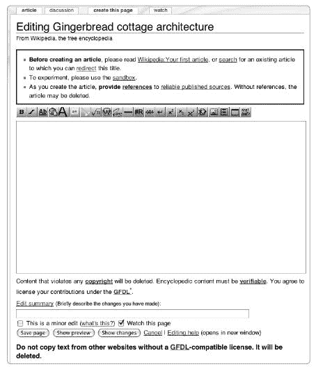

# 第六章. 好的写作和研究

本章解释了如何参与维基百科的主要活动：写作、研究和改进百科文章。它涵盖了如何开始文章——这是一件简单的事情——以及如何写好文章——这是一件相当困难的事情。好的写作是练习的结果，同时也是对文字有天赋、理解百科文章的风格、语气和参考文献的结果。

一个好的作家总是会从更广泛的角度考虑预期的文章。维基百科的规模对研究工作有影响。现有的文章和他人已经添加到维基百科上的研究将帮助你确定主题，并可能对你的研究意图提供反馈。审查网站以查找一个主题领域已经写过的内容是一种尽职调查：你将避免重复他人的努力并节省时间。

维基百科由于有成千上万的编辑共同开发，因此具有额外的复杂性。学习如何在协作环境中高效工作可能意味着获得一些特定的技能。在本章中，我们将讨论如何使用从撰写了数十万篇文章的维基百科人那里积累的建议来撰写一篇好文章。

# 开始新文章

维基百科社区非常重视填补空白、写作质量高且参考文献齐全的新文章。这真的是专家们的赞誉！如果你已经通过校对他人作品等方式开始编辑，那么你当然可以考虑开始撰写新文章。

任何拥有账户的人都可以在几秒钟内轻松开始新文章。如果你没有用户账户，你仍然可以提出文章，我们将在下一节中描述。但在开始输入之前，请记住一些事情。这对维基百科编辑员和童子军一样适用：做好准备！在投入大量时间写作之前，考虑一下预备工作。以下是撰写新文章的步骤：

1.  决定一个主题。

1.  检查维基百科上是否有现有内容。

1.  寻找参考资料并研究主题。

1.  选择一个标题并开始撰写文章。

1.  起草文章。

1.  将其链接到其他文章并对其进行分类。

在执行这些步骤时越灵活、越全面、越有资源，你会发现向百科全书添加好的内容就越简单。无论你是添加一篇关于详细主题的长篇文章、一篇简短的条目，还是一组相关文章，都要努力研究，然后好好写作。同样的技术也适用于重写文章或扩展现有的条目文章；对于许多主题来说，你现在更有可能找到一篇需要清理和扩展的低质量文章，而不是完全没有文章。然而，对作者来说，挑战是相同的。

## 决定要写什么

二十万篇文章的百科全书算完整吗？根本不算。如果你不知道写什么，去一个好的图书馆是找到一个引人注目的主题的简单方法。或者，你可以调查一些已经建立起来以收集需要撰写主题的众多项目：

**请求的文章（快捷方式 WP:RA**）

这个页面——实际上是一系列按主题组织的页面——任何人都可以通过创建一个红色链接来添加请求。请注意，请求文章的页面往往相当混乱，仅仅因为一篇文章列在这里并不意味着该主题符合收录指南。始终要检查请求的文章是否以其他形式存在，以及是否应该撰写。

**创建文章（快捷方式 WP:AFC**）

这就是新用户或未注册用户可以请求创建文章的地方。页面由一个模板表单组成，文章请求者填写；注册用户随后进行审批或拒绝请求。如果你是品行良好的注册用户，不要使用这个表单来创建新文章；然而，你通常可以在这里找到值得变成文章的想法。

**缺失的百科全书文章**

这个维基项目是一个集中地点，根据研究其他参考作品来确定可能缺失于维基百科的主题。该项目表示其目标是“确保维基百科有对应于每本其他通用百科全书中的每篇文章的文章。”

[[分类:维基百科缺失主题]] 是收集潜在缺失文章列表的母分类。缺失文章的可能主题领域包括任何不是美国或欧洲的政治家；20 世纪之前的传记（检查任何公共领域的传记词典，尤其是那些不是英文的）；在著名国家科学院的科学家等等。可以在[[分类:红色列表]]中找到一些个别编辑的缺失文章汇编，它收集了编辑设置的所谓红色链接列表，作为工作页面。

如果你理解版权和公共领域的内容，你可以使用来自旧来源的导入材料来开始你的文章。例如，现在公共领域的 1911 年版《大英百科全书》的大部分文本已被导入维基百科。来自维基源的其他材料，应该是公共领域或 GFDL，可以审查以适应它。但是，复制粘贴几乎总是不够；适应旧材料需要熟练的编辑工作，以使语言和事实内容都跟上时代（例如，缺失的百科全书文章项目的子页面正在核实 1911 年版的*大英百科全书*，以确保这些文章准确及时）。

## 在开始新文章之前

一旦你选择了主题，确保关于该主题的文章还没有在维基百科上被撰写。你需要彻底搜索网站以避免创建重复的文章。这一步很重要，因为网站缺乏自上而下的结构：在传统百科全书中，编辑委员会会分配作者主题，而维基百科没有这样的机制，作者负责了解他们主题的其他内容，并确保新文章符合这种结构。

**良好的时机**

如果你的信息过时了怎么办？如果它根本还没发生呢？正如第一章中提到的，如果只是推测性的话，未来发生的事件——比如体育赛事、正在制作的电影或正在进行中的建设工作——通常不适合作为文章的主题。维基百科不是水晶球。如果你有好的可验证的来源和确切未来的事件，你可以在维基百科上写关于它。例如，与正在建设的新道路相关的材料可以包含在文章中，但只有在适当标记的情况下。为此目的存在蓝色条形信息模板（在[[Category:Temporal templates]]中）。如果主题是时间敏感的，你应该正确标记信息。例如，截至 2008 年，尚未有关于[[雪人]]的确认目击事件。要快速表明信息自特定日期起有效，可以使用`{{As of|`*`year}}`*模板，将年份替换为有效的*`year`*。参见[[Wikipedia:As of]]（快捷键 WP:AO）了解这如何帮助维护网站。

在你搜索了网站上的主题和你心中的工作文章标题之后，你会发现以下情况之一是真实的：

+   关于这个主题的文章已经存在（可能标题与你所想的有所不同）。

+   关于这个主题已经写过多篇文章，所有文章都使用了不同的标题。

+   关于这个主题的一些材料存在，但它们包含在一个更广泛的涵盖多个主题的文章中。

+   这个主题在另一篇文章中简要提及，但尚未展开。

+   你想要的这篇文章标题已经被使用，但文章内容却是另一回事。

+   网站上任何地方都没有提到这个主题的参考资料。

如果关于这个主题的文章已经存在（但标题不同），只需将你的文章标题改为指向该页面的*重定向*，如第八章中所述。对现有文章进行改进是一个很好的下一步；在维基百科上，很少有文章是全面的。在英语维基百科的历史的这个阶段，对于想要写特定主题的人来说，这种情况是最常见的。

如果关于该主题已经写出了不止一篇文章，并且它们似乎彼此重复，它们可能需要合并；参见第八章中关于合并的说明。在此期间，你可以继续改进这些文章。

如果你的主题已经在现有的更广泛的文章中有所展开，你可能想要改进这篇文章的内容。如果关于该特定主题已经写出了足够的内容来形成一篇单独的文章，你将想要将内容拆分到一个以新标题命名的文章中；参见第八章。确保为新页面添加适当的开头、结尾、参考文献和“也见”链接。

如果某个主题在其他文章中提到但没有展开，请确保每个对该主题的提及都通过维基链接指向你想要编写的新文章的标题。这将使你的新文章与维基百科上的现有内容相连接。此外，查看这些主题提及可能为你提供研究线索。在你遇到任何有趣且意外的事情以及相关的参考文献时，请注意它们。

如果文章标题已经被使用，但文章本身是关于不同主题的，你可能需要将该文章移动到一个更精确的标题，用另一个精确的标题创建你的文章，然后创建一个*消歧义*页面来引导读者在文章之间，如第八章中所述。例如，*约翰·格雷*是一个相当常见的名字。如果你想写一篇关于这个名字的建筑师的文章，你可能将你的文章标题为[[John Gray (architect)]]而不是简单地[[John Gray]]。如果[[John Gray]]已经有了一篇关于物理学家的文章，那篇文章可以被移动到标题[[John Gray (physicist)]]，而主页面[[John Gray]]可以被重新格式化为一个消歧义页面，以引导读者到这些不同的文章。

如果你没有在维基百科上找到任何关于你的主题的文章或参考文献，你在写作之前应该暂停一下。为什么你的主题没有被提及？你的主题是否值得注意（参见下文“避免危险主题”）？你是否查找了文章或主题的所有可能的替代名称？使用你能想到的所有标题变体进行彻底的搜索。如果你决定你的主题是值得注意的（并且只是遗漏了），确保你能够将其放入已编写文章的上下文中。通常，你在开始写作之前应该在现有文章中添加到你的新提议文章中的红链接（无论是在文本中还是在“也见”部分）；然后当你创建文章时，你不会创建一个孤儿页面。

## 避免危险主题

如果你的主题尚未被撰写或提及，找出原因。重新审视第一章中提到的文章收录指南（“其他指南”），特别是知名度的指南（快捷键 WP:NOTE）以及关于不要撰写经典主题的侧边栏（快捷键 WP:DUMB）。

新作者可能会陷入一些常见的陷阱。其中最危险的可能是所谓的虚荣文章和对知名度的幻想。*虚荣文章*是指为了促销目的而撰写的文章（通常由文章的主题撰写），而不是为了其百科全书的价值。如果你正在考虑撰写关于自己或你公司的文章——请不要这样做。即使出于最好的意图，这也可能被视为自我推销，并常常导致文章被删除。即使没有发生这种情况，撰写关于自己的文章也可能是一把双刃剑：一旦文章发布，你就无法控制内容，任何相关的负面信息都会像正面信息一样突出。（换一种方式想：*大英百科全书*也不会出版你的简历。）

对知名度的幻想也可能出现在其他领域。在知名度方面经常处于边缘的话题是关于地方乐队、在世人物以及新电影、书籍或专辑的文章。如第一章中所述，维基百科为所有这些领域都有特定的知名度指南。考虑这些指南以及你的文章如何适应这个背景。

其他危险的主题是以前被删除的文章。如果你开始撰写一个以前创建并被删除的主题的文章，你会收到一条警告信息，内容为：“注意：你正在重新创建一个已被删除的页面”。换句话说，一个或多个编辑认为这个主题不适合维基百科。如果文章是通过社区流程被删除的（见第七章），则警告信息中会包含关于该文章的讨论链接。点击该链接，找出页面被删除的原因：是该主题本身不适合维基百科，还是原始文章只是存在可以修复的缺陷？如果有疑问，管理员（可以查看已删除版本）可能能提供帮助。

## 开始撰写文章

作为已登录用户，你可以选择一个标题并开始写作。想要创建新文章？现在是选择维基百科用户名并开设账户的完美时机，因为你必须登录才能开始新页面。在此期间，请参考[[维基百科：你的第一篇文章]]（快捷键 WP:FIRST）以获取一个简明的事务清单。

### 点击一个红链接

初始化文章的最佳方式是从现有页面上的红链接开始。假设你选择的主题是姜饼小屋建筑，你想用这个标题写一篇新文章。这个术语可能已经在某些现有维基百科页面上使用过（可能是关于小屋建筑或姜饼屋的一般文章），你可以将其转换为红链接。或者，一次不成功的搜索可能会显示一个包含匹配你的搜索词的红链接的页面。

**红链接**

“这里链接”链接也适用于红链接（当页面不存在时，搜索页面也提供此选项：*查看所有链接到本页面的维基百科页面*）。在开始文章之前检查存在的反向链接可以指向相关的现有内容，并通过链接到它的页面数量来给出红链接受欢迎程度的指示。

你也可以在你的用户页面上设置一个指向[[姜饼小屋建筑]]的红链接，从而开始你的*自夸列表*。以这种方式描述你的新文章是完全可接受的，并且无疑会吸引正在检查你开始的文章的维基百科用户。

点击红链接将弹出一个空编辑窗口，标题为*编辑姜饼小屋建筑*，如图图 6-1 所示。开始输入！或者，如果你已经准备好了，可以粘贴你已经写好的文本（参见草拟文章中的“草拟文章”）。

预览你的工作，纠正格式、标点符号和错误，并保存新文章。添加一个简短的编辑摘要，说明这是第一版。如果你遵循了这些说明，新页面将不会是一个孤儿（至少不是完全的），因为至少有一个曾经是红链接的页面现在有一个指向你的文章的蓝链接。并且点击[[姜饼小屋建筑]]侧边栏上的“这里链接”将揭示那些已经链接到你的文章的意外页面（例如，如果这篇文章在另一位编辑的待办事项列表上）。



**图 6-1. 新文章的空编辑窗口**

标题中的错误需要移动页面来纠正，因为标题不能直接编辑。从红链接开始的一个好理由是你不太可能在标题本身犯错误。

### 两种开始文章的方法

为了达到最大的用户友好性，你可以访问[[帮助:开始新页面]]以获取创建页面的进一步帮助。在顶部的搜索框中输入你的文章标题。如果它还不存在，你将经历创建页面的过程。

开始一篇文章最基本（但也是最原始）的方式就是将文章的名称作为 URL 输入到浏览器中。例如，你可以通过将浏览器导航到[`en.wikipedia.org/wiki/Gingerbread_cottage_architecture`](http://en.wikipedia.org/wiki/Gingerbread_cottage_architecture)来开始一篇名为[[Gingerbread cottage architecture]]的文章。

一旦你将浏览器导航到一个不存在的维基百科页面，你会看到一些文本告诉你该页面目前不存在，这你应该已经知道了，还有一个开始文章的链接，如果你已经登录，这个链接将会工作。虽然以这种方式开始文章非常快，但找到你可以首先创建一个维基链接到你的主题的页面是最佳方法，因为你永远不应该创建孤立的文章。使用浏览器方法也增加了意外创建重复文章或标题拼写错误或其他错误的文章的可能性。

### 标题很棘手

在开始新文章时，维基百科有一些标题惯例你应该遵守。当你搜索时，这些惯例通过增加你推断出确切主题标题的可能性来为你工作。这就是为什么对惯例的尊重不仅仅是学究式的；一致的标题是一个可用性问题。在特定领域，现有文章的标题为当前生效的惯例提供了很好的线索。最基本的惯例是始终使用单数形式：[[Siberian Tiger]]，而不是[[Siberian Tigers]]。但对于复数名词，会做出例外；关于竹竿的文章在[[Stilts]]（作为一个单独的竹竿你可能想要交换一个[[Pogo stick]]，而且无论如何，[[Stilt]]是一种鸟）。

为关于某人的文章命名可能会特别令人困惑。关于人的文章通常应采用*姓氏+名字*的形式。对于贵族、古罗马人、有多个姓氏的人以及任何其他特殊情况，遵循这一惯例可能会很困难。关于名为*Raymond, Count of Provence*的人的文章可能会在*Raymond of Provence*下，因为贵族头衔通常会被省略。如果有多个这样的历史人物存在——例如，普罗旺斯的雷蒙德二世（用罗马数字表示，不是“雷蒙德第二”）——那么这个名字该如何拼写？Raymond，Raymund，Raimund……？如果*of*应该是法语中的*de*呢？实际上，这篇文章位于[[Ramon Berenguer II, Count of Provence]]，使用的是对*Ramon*的加泰罗尼亚语拼写。如果已经为这篇文章设置了从可能的名字变体到这篇文章的重定向，那么使用 Google 通过搜索*Raymond, Count, and Provence*这些词可能是找到这篇文章最快的方法。关于命名人的文章的详细案例研究可以在[[Wikipedia:Naming conventions (people)]]中找到。

这里有一些例子。关于阿西西圣弗朗西斯的文章是[[Francis of Assisi]]，而不是[[Saint Francis of Assisi]]，尽管后者是一个重定向。你可以在[[Wikipedia:WikiProject_Saints]]找到关于命名圣徒文章的具体建议，编辑们为这些特定的文章制定了特殊的风格指南。尽管最常用和公认的名字是首选，但关于江青的文章是在[[Jiang Qing]]下，而不是[[Madame Mao]]，尽管后者也是一个重定向。初始文章不包括在页面标题中：[[Statue of Liberty]]，而不是[[The Statue of Liberty]]。只有专有名词首字母大写：[[Pythagorean theorem]]，而不是[[Pythagorean Theorem]]。如果几个可能的文章有相同的标题，维基百科根据主题有各种各样的消歧方案。最常见的是在文章名称中添加括号内的限定词，例如在先前的例子中是[[John Gray (architect)]]。关于如何消歧页面标题的通用指南在主消歧页面（快捷键 WP:DAB#NAME）上。

根据你感兴趣的领域，查看类似的文章可能会在确定好的标题上节省你时间。这些问题都有记录：关于充分的细节，请参阅[[Wikipedia:Naming conventions]]（快捷键页面 WP:NAME），这是一项官方政策，包括许多特定主题领域的命名规范信息。还可以参阅[[Category:Wikipedia naming conventions]]。

页面名称中禁止使用一些字符，包括

```
# < > [ ] | { }
```

并且还有一些有问题的。详细信息可以在 WP:NAME 找到。

正如我们在第五章中提到的，MediaWiki 软件总是将标题的第一个字母大写，但除此之外标题是区分大小写的：多词标题中的大写字母，如名字，必须小心处理。[[[Thomas Jefferson]]]不等于[[Thomas jefferson]]。对于确实应该有小写第一个字母的标题，如[[iPod]]或[[e (mathematical constant)]], 有一个特殊的解决方案：模板`{{lowercase}}`。这个模板显示文章标题的首字母小写（尽管文章名称在 URL 中仍然是自动大写的）。至于[[E. E. Cummings]]的著名案例，文章已经解释了，所以我们不需要再解释。

## 草拟文章

一旦你选择了主题并确定了标题，你实际上需要撰写文章。通常需要写几个草稿才能写出好的文章。在将文章发布到网站上之前，先在其他地方草拟文章通常是最好的。草拟文章可以让你记录想法，收集资料，并在确定你想说什么时留下未完成的句子和评论给自己——而不会把“不好的”内容添加到百科全书。

你可以在三个可能的地方起草文章。你可以在文章本身或你的用户空间中起草。你也可以在文本编辑器中离线工作。对于新手来说，不建议在实时文章中起草，因为文章可能会在你仍在工作时被严重编辑或提名删除。为了获得更安静的经验，在你的用户空间中工作，其他编辑员不太可能编辑你写的内容；一开始，在你的用户页面上起草，并在你更有雄心时创建草稿子页面。

你可以在你的*用户空间*中创建一个子页面——你的用户页面及其下的任何子页面（见第十一章). 例如，如果你的用户名是 Ydobon，你的用户页面将是[[User:Ydobon]]，你可以在用户空间中通过在用户页面名称和新页面名称之间添加一个斜杠来创建一个子页面，例如[[User:Ydobon/Draft1]]. 你只需在你的用户页面中键入[[/Draft1]]并点击它即可开始写作。子页面会自动链接回它们的主页面。使用斜杠构建子页面在其他地方也有效，但在文章命名空间中是不允许的。子页面在项目空间中广泛使用，尤其是在流程页面（在第七章中描述）上，每个讨论都在一个单独的页面上。有关更多信息，请参阅[[Wikipedia:Subpages]]。

你还可以在文字处理程序中完全离线工作，完成后将内容粘贴到文章中。这种方法有一些优点。将草稿文章打印出来进行审查时，通常会揭示不一致性和不自然的措辞和流畅性。在文字处理程序中工作也使得拼写检查和重新结构化变得容易。

用户空间起草方法具有“所见即所得”的优势：你将看到草稿格式化得与文章中显示的完全一样。因此，如果你想测试或完善维基语法格式，在用户空间中起草是一个好方法。也许最好的方法是先离线写作，然后在添加维基语法时将正在进行的作品复制到你的用户空间。用户空间是一个公共空间，你可以邀请其他编辑员进行反馈。但按照惯例，没有人应该在那里编辑草稿，除非被直接要求。

一旦文章发布在主文章空间中，你就不再控制它了。如果你在文章空间中仍在进行主要起草工作，你可能想在顶部添加反骚扰模板`{{inprogress}}`。这个模板可以挡住几乎所有入侵者，减少编辑冲突，表明你知道自己在做什么，并且可能阻止任何早期的删除提案。长时间保留模板是不合适的（也不是阻止他人编辑你作品的方法）。同样，如果你添加隐藏注释作为起草的方式，完成时应该删除它们。

## 不要忘记

文章没有签名。当你创建一个新文章时，提供描述性的编辑摘要，可能用几个词总结主题。最后，一旦你点击保存，你就无法控制内容了。现在，成百上千万的陌生人——在线上——可以编辑它。

**进一步阅读**

[请求的文章](http://en.wikipedia.org/wiki/Wikipedia:Requested_articles) 文章请求，按主题排序

[其他百科全书中的文章但缺少在英语维基百科中](http://en.wikipedia.org/wiki/Wikipedia:WikiProject_Missing_encyclopedic_articles) 按主题排序的其他百科全书中的文章但缺少在英语维基百科中

[不存在的文章和高链接数](http://en.wikipedia.org/wiki/Wikipedia:Most_wanted_articles) 文章不存在，但链接数很高

[如何开始新页面](http://en.wikipedia.org/wiki/Help:Starting_a_new_page) 指导如何开始一个新页面，包括一个方便的搜索框，你可以检查页面是否真的是新的

[创建文章的过程](http://en.wikipedia.org/wiki/Wikipedia:Articles_for_creation) 未注册用户可以请求创建文章的过程

[页面名称的技术限制](http://en.wikipedia.org/wiki/Wikipedia:Page_name) 创建页面名称的技术限制

[命名规范政策](http://en.wikipedia.org/wiki/Wikipedia:Naming_conventions) 文章命名的政策

[如何创建子页面](http://en.wikipedia.org/wiki/Wikipedia:Subpages) 如何创建子页面，包括如何创建用户子页面的说明

# 写作技巧

完美的维基百科文章可能不存在，尽管维基百科上关于良好写作的讨论已经成为这篇文章应该是什么的目录。如果你认为旅程比目的地更有趣，那么你可能是一个天生的维基百科编辑，因为维基百科的现实是持续的、渐进的改进。文章会随着时间的推移而演变。

一篇优秀的文章满足了信息需求——它通过广泛的覆盖范围、相关背景和深思熟虑的文风向读者提供信息。至少，一篇优秀的文章对专家和非专家来说都是可理解的，表达清晰。它彻底探索并详细解释了主题。但文章不仅仅是其*内容*；它也是一个网页。维基百科的编辑员应该带着这个背景来写作，并继续构建网络。优秀的文章包含进入维基链接和外链。这些外链应将读者带到最佳网站，以便跟进文章。如果适用，通过提供参考文献来引用学术文献。通过这样做，你不仅是在构建维基百科，也是在构建整个网络。*节点页面*——既连接你又提供信息的页面——对读者来说具有额外的价值。维基百科的文章并不是试图取代其他地方可用的专业信息，而是提供访问这些材料的方式。优秀的网页填补了空缺：所讨论的空缺是百科全书文章，但现在是在一个大大扩大的网络背景下。

在本节中，我们将讨论在撰写文章时应考虑的八个广泛领域，以及完成任务的两个技巧——咨询*《风格指南》*和获取评论。更多建议，请参考[[Wikipedia:The perfect article]]（快捷键 WP:PERFECT），其中列出了大约 20 个制作优秀文章的要点。再次强调，完美可能不是人类能够达到的——我们在第二章中提到，对不完美的接受深深植根于维基文化——因此，请将我们的建议视为一种追求和补充[[Wikipedia:Guide to writing better articles]]（快捷键 WP:BETTER）。

## 咨询《风格指南》

本节中的许多建议和链接都来自*《风格指南》*，这是一本由维基百科社区开发的风格指南，旨在帮助编辑员撰写一致且高质量的条目。《风格指南》是一份内容丰富的文档，随着时间的推移而发展，代表了关于撰写百科全书文章的巨大集体知识体系。它的主页类似于书籍出版商和报纸编辑制作的风格指南。这掩盖了其他以维基风格开发的页面：一个关于如何为维基百科写作的更复杂的咨询材料网络。这些*《风格指南》*页面为全球问题（如语气和组织）以及小的语法细节（如是否使用序列逗号）提供指导。术语*《风格指南》*通常理解为包括[[Wikipedia:Manual of Style (abbreviations)]]以及[[Category:Wikipedia style guidelines]]中的其他页面。

*《风格指南》* 本身，可在 [[Wikipedia:Manual of Style]]（快捷页面 WP:MOS）找到，是维基百科的指南，这给它赋予了官方地位。连同它链接到的专业页面，*《风格指南》* 是必不可少的参考资料。作者和编辑应该经常参考它（当然，他们不需要在开始写作之前阅读全部内容）。

很可能，只有少数几个手册页面与你的特定主题领域最相关。例如，[[Wikipedia:Manual of Style (command-line examples)]]（快捷方式 WP:MOSCOMM）对那些（只有那些）打算在文章中包含计算机代码示例的人感兴趣。与其试图记住页面的位置和内容，不如从你的用户页面创建到你引用的页面的内部链接。例如，最有用的页面之一是 [[Wikipedia:Summary style]]（快捷方式 WP:SS），它解释了如何构建长篇文章和太大而无法在一个文章中处理的主题。

**缩写过多**

*《风格指南》* 通常缩写为 *MOS* 或 *MoS*，而 *《指南》* 中的指南可以通过简写如 *MOS:FLAGS* 来引用。维基百科有一个这些简写的列表，在 [[Special:Prefixindex/MOS:]]。并非每个人都会知道这些或其他维基百科的缩写。过多的缩写可能会使页面难以理解（只需等待第十三章 Chapter 13），这一点在论文 [[Wikipedia:WTF? OMG! TMD TLA. ARG!]]（快捷方式 WP:OMG）中得到了很好的表达。

## 引言和主题句

一篇文章应该以对主题的清晰描述开始。第一句话应该定义文章的主题，使用文章的标题或主题，这些应该以粗体格式呈现。引言段落的其他部分应该清楚地解释主题及其重要性，避免过度详细。如果你在主题句上遇到困难，你可能需要进一步思考文章的标题。

尽管文章的开头应该传达一个主题为什么有趣，但百科全书文章并不是书评或个人散文，你也不是在试图吸引读者。文章 [[Robinson Crusoe]] 的第一句话应该表明这是一部英文小说。关于丹尼尔·笛福的记者生涯和关于 18 世纪早期航海的历史讨论应推迟到后面。如果你提交的是为其他目的（如论文或学校论文）撰写的文章，你的原始开头几乎肯定需要重写。

引言部分最多可以分成三个段落，但不应超过这个长度。开头部分应该概括文章的其余部分。更多建议可以在 [[Wikipedia:Lead section]]（快捷方式 WP:LS）找到。

对报纸文章结构的某些基本见解可以作为参考点（文章 [[倒金字塔]] 描述了这种风格）。新闻故事的开头段落经常同时处理故事的几个线索，然后再提供细节。这种技巧在维基百科上也非常有用，作为一种将良好的摘要放在较长的文章主要内容之前的方法。

让我们分析维基百科 [2007 年 6 月] 中的一个引言：

> 赫伯特·乔治·威尔斯（1866 年 9 月 21 日至 1946 年 8 月 13 日），更广为人知的是 H. G. 威尔斯，是一位英国作家，以《时间机器》、《世界大战》、《隐身人》和《莫洛博士岛》等科幻小说而闻名。他是一位多产的作家，既写小说也写非小说，创作了多种不同体裁的作品，包括当代小说、历史和社会评论。他还是一位直言不讳的社会主义者。他的后期作品越来越具有政治性和说教性，而今天广泛阅读的只有他早期的科幻小说。威尔斯、雨果·根斯巴克和儒勒·凡尔纳有时被称为“科幻小说之父”。

这篇引言具有相当简单的 A-B-A 结构，其中 A 代表“科幻小说”，B 代表“政治观点”。（你可能注意到一些可能的问题与可验证性相关：谁说他的后期作品阅读不多，谁有资格授予“之父”这样的称号？但这些可能在文章后面的部分得到更好的解释。）根据维基百科指南，引言部分理想情况下最多有三段，所以它可能比示例更复杂。但如果一篇文章有三个主要观点，A、B 和 C，你应该每段只介绍一个观点。主题结构可能类似于 A-BA-BC，其中 A 是标题，B 和 C 是最重要的相关点，但这就是开头应该有的复杂程度。

**我们为谁写作？**

我们为那些对某个主题一无所知但需要快速了解的人写文章。你有十秒钟。

+   谁、什么、哪里、何时、为什么？

+   摘要引言部分，然后是倒金字塔结构。

+   省略不必要的词语。

+   *《经济学人》* 风格指南：清晰加精确。

+   “为什么”几乎比“什么”更重要。

我有时想象我的读者是一个非常聪明的十到十二岁的孩子。一个有良好阅读年龄的人，但对此一无所知。你小时候是不是喜欢阅读百科全书？（改编自用户：David Gerard 的“我的个人风格指南”）

## 全面性和适当的长度

一篇优秀的维基百科文章会承认并探讨主题的所有方面。换句话说，它涵盖了每一个百科全书的角度。这个目标本身可能对作者来说是一种压力。涵盖威廉·莎士比亚的每一个角度？然而，中立的视角政策确实要求*全面性*，定义为包含所有重要的观点。关于莎士比亚对非英语文学的影响以及关于作者身份理论应该有所论述。

显然，确保这样的文章有适当的长度是困难的。使用*摘要风格*，如*手册*中提到的，是至关重要的。在主题上包含足够的信息、深度和分析，但不要有不必要的细节。从主要文章发展而来的子文章、相关文章（例如，关于莎士比亚的[[莎士比亚作者身份问题]]的详细文章），或在某些情况下在维基姐妹项目中，可以包含这些额外信息。你会发现关于主要主题的材料会在文章之间移动，直到覆盖更加平衡。

## 结构

你不能期望你的读者对你的文章的逻辑和流程有比你自己更清晰的看法。分割长句，特别是如果它们通过连词松散地连接。任何更长的逻辑论证在百科全书术语中都是可疑的。在避免密集或晦涩的风格的同时，维基百科文章应该是紧凑和简洁的，而不是冗长的。W.S. Gilbert 在*H.M.S. Pinafore*中写道，“不必理会为什么和为什么”，维基百科人知道一个好的“为什么”可能很有价值，但他们警惕复杂的“为什么”：长篇大论应该总结并做好参考文献。

一篇好的文章逻辑上是有条理的，并分为几个部分。将一个概念的历史收集到一个部分。无论这是紧接着介绍部分之后还是文章的结尾，取决于特定的想法。

像[[防毒面具]]这样的文章可以将化学放在历史之前，或者相反。对于大多数读者来说，将主题的两个方面分开是最有帮助的。当处理任何技术问题时，这个问题很典型。[[钢琴]]（截至 2008 年 3 月）的文章在介绍部分之后有一个关于早期历史的章节。然后，通过主题明确指出，使用副标题来区分大钢琴、直立钢琴等。

## 可读性

每个在维基百科上的人都想成为一名优秀的作家。可读性应该是你的最终目标。*可读性*意味着你的写作清晰易懂。百科全书文章的散文应该尽可能透明，这样写作就不会妨碍内容。

可读性并非孤立存在，优秀的写作当然并不意味着乏味、枯燥或单调的写作。维基百科上已经存在的优秀内容可以提供强有力的散文示例（同时你也能看到一些差劲文章中的陷阱）。其他编辑也可以帮助提供关于风格的反馈。

对于指导如何使散文更加优雅和易读，任何写作指南都可能很有价值。选择一个能够解答你问题的，并且本身也易于阅读的指南。美国经典写作指南是斯特伦克和怀特的《风格要素》；其他经典作品包括《福勒现代英语用法》和戈尔斯的《完整平实英语》。与一个好的风格指南一样有用的是沉浸其中：*阅读*优秀的写作。比较不同百科全书中的类似文章——哪些是相似的，哪些是不同的？阅读优秀的书籍会使你成为一个更好的作家。通过练习，你可以写出一篇事实准确、公正、清晰、雄辩且丰富多彩的百科全书文章——或者，用项目最早期的术语来说，就是使用*精彩的散文*。

**精彩的散文**

*精彩的散文*是维基百科上最早的项目页面之一。拉里·桑格创建了该项目，并在*维基百科-L*邮件列表的第一条信息中讨论了该主题。桑格于 2001 年 1 月 22 日报告说，当时维基百科上有 184 篇文章，其中 14 篇被列在精彩的散文页面上，这使他得出结论，“维基百科真的很棒。”（来自[`lists.wikimedia.org/pipermail/wikipedia-l/2001-January/000000.html`](http://lists.wikimedia.org/pipermail/wikipedia-l/2001-January/000000.html)）

## 受众

谁是*普通读者*？谁是你的*受众*？维基百科的受众是谁一直是讨论的主题。在维基百科上，普遍的观点（如果不是普遍的观点）是文章应该为受过良好教育的成年人而写；这个选择也是《大英百科全书》的传统选择。

一些专业主题（如许多数学文章）不可避免地会包含普通读者难以理解的材料。然而，在阅读完一篇文章后，你应该能够说出你知道的两件事：主题是什么以及为什么它很重要。对于非专业人士来说，引言最为重要。它应该总结文章的内容，并为普通读者提供背景。

有时，可读性和准确性会发生冲突。特别是对于高度技术性的主题，对于一般读者来说，理解一个概念可能很困难。为了解决这些说明性的困难，在开头段落提供一个可接受的、一般可读的摘要，然后在文章的主体部分提供一个准确的形式定义。

一个人使用的行话可能是另一个人正确的术语，当然。可能有必要首先列出这些行话。但随后你有义务用诸如*大致地说…，换句话说…，简单地说…*或其他表明以下内容是普通读者总结的短语来定义这些行话。所有读者都应该知道可以期待的内容。

这篇来自[[血压]]的介绍展示了技术性和日常语言的双重使用：

> *血压*（严格来说：血管压力）指的是循环[[血液]]对[[血管]]壁施加的力，并构成主要的[[生命体征]]之一。随着血液通过[[动脉|动脉]]、[[小动脉]]、[[毛细血管|毛细血管]]和[[静脉]]，循环血液的压力会降低；血压这一术语通常指的是动脉压力，即较大动脉中的压力，动脉是带血离开心脏的血管。*动脉压力*最常见的是通过[[血压计]]来测量的，它使用水银柱的高度来反映循环压力（参见[[#非侵入性测量|非侵入性测量]]）。尽管许多现代血管压力设备不再使用水银，但血管压力值仍然普遍以[[托尔|毫米汞柱]]（mmHg）为单位报告。

如此所示，超文本的一个巨大优势是*间接性*。如果你为技术术语提供了一个维基链接，那么跟随它获取更多信息的人将是一个真正想要这些信息的选择性群体。到[[血压计]]的链接减少了在血压文章本身中进行长篇解释的需要。

## 语言的使用

许多旧的百科全书倾向于浮夸，但维基百科的语气直接、清晰、现代。维基百科的文章是一种学术写作，但它们不采用学术期刊的正式或专业语气。它们应该是有趣的——而不是枯燥、无色或平淡的。它们不应该文学化、个人化、争论性或调查性。在争议性问题上，文章应旨在描述而非有偏见。在这方面，维基百科的文体接近于记录报纸的报道，从纷争之上报道事件，并呈现一个问题的所有显著方面。

死亡可能是*意外的*，但不应该是*遗憾的*、*过早的*或*悲剧的*。然而，同样，委婉语是不恰当的：不要用*去世了*来代替*死了*。一个发现可以被称为*高度重要*或只是*重要*。如果你仔细想想，*重要*可以更有说服力。为什么？也许是因为普通读者不希望被超级形容词轰炸，而是希望了解发展的主要阶段。这一点在[[Wikipedia:Avoid peacock terms|避免孔雀术语]]（快捷方式 WP:APT）中以一般方式进行了说明。适度地表达也有助于中立性。历史学家阿克顿勋爵说：“公正的最佳方式是在表达判断时保持一点保留。”

语言不应是口语化的，应遵循使用指南。遵循标准写作规范：使用完整的句子和正确的语法、标点和拼写。断断续续的写作会分散读者的注意力。为了温和地表达。尽管在专业领域很常见，但缩写不仅应该链接到它们自己的文章，而且通常应该为普通读者展开。

**谁的英语？**

美式英语和英联邦英语在英语维基百科上共存。这种共存应该是和平的；涉及不同拼写检查设置维基百科用户的冲突是不受欢迎的。有关哪些地方可以接受哪些风格的指南，请参阅[[Wikipedia:Manual of Style#National_varieties_of_English]]（快捷方式 WP:ENGVAR）中的《风格指南》部分。规则是*当两种风格都可行时，编辑者不应从一个风格转换到另一个风格，除非他有充分的理由这样做*。换句话说，如果一篇文章已经用英国或美国英语写成，那么在添加内容时应该坚持现有的风格。这在维基百科早期是一个经过激烈斗争的妥协！

在维基百科中写作的一个特殊规则是*避免自我引用*——也就是说，避免在维基百科文章中引用维基百科项目。与讨论和社区页面不同，在那里讨论维基百科是自然的，在文章中这会分散注意力。这也使得内容不太适合*分叉*到新的项目，这是维基百科开放许可的一个目标。避免使用像“这篇维基百科文章讨论了”甚至“在这个百科全书里”这样的短语。显然，禁止提及维基百科的文章不适用于关于维基百科相关主题的文章。有关此问题的《风格指南》页面，请参阅[[Wikipedia:Avoid self-references]]（快捷方式 WP:SELF）。

## 图像

一篇好的文章应包括信息丰富、相关的图像——图表和图形、地图、肖像、照片和艺术品，这些都能增加读者对主题的兴趣或理解。每张图片都应该有一个解释性的标题。有关如何将图像添加到文章中的技术细节，请参阅寻找和添加图像中的“图像和媒体文件”部分。

图像应该支持文本；图片的数量或突出程度不应过多，以免分散或分散文章本身的注意力。不要仅仅为了使文章看起来更漂亮而包含图片。在最适合的格式中使用图表、信息图表（见[[infographics]]）和*表格*（表格数据），而不是在所有情况下都使用。记住，任何数据都应该有参考文献，但不进行分析——数据分析可能会变成原创研究。

*信息框*（显示关键事实的模板）不应侵入性，也不应*有偏见*（所有事实都应该是可验证的）。对于普通读者来说，应该清楚地将文章作为相关系列中的一员放置。例如，[[奥地利王位继承战争]]包括一个按时间顺序列出这场 18 世纪欧洲战争参战者的框（图 6-2）。底部两个框，其内容可以通过点击框角处的显示链接查看，是列出战争主要战役的附加信息框（完整的列表也见[[奥地利王位继承战争战役类别]]）。信息框通常只在维基百科有关于某个主题的几个相关文章时才包括在内。

![如上图所示，是来自[[奥地利王位继承战争]]的详细信息框。底部两个部分是可扩展的附加信息框。](tagoreillycom20090804nostarchimages315924.png.jpg)

**图 6-2。如上图所示，是来自[[奥地利王位继承战争]]的详细信息框。底部两个部分是可扩展的附加信息框。**

## 应用基本内容策略

文章的读者首先应该感觉到它对主题进行了负责任的总括。做到这一点的方法是众所周知的。符合内容策略的文章是完全无偏见的；它具有中立观点（NPOV），逻辑和公正地呈现争议中的不同观点。语言的使用也受到基本政策的影响，我们在此将给出一些例子。

考虑到短语“臭名昭著的嗜血成性且遭受鞭刑的海盗布莱克贝德。”对于一位训练有素的维基百科编辑来说，“嗜血成性”可能是一种观点，但“鞭刑”可能是有事实依据的。“海盗”是那些可以根据观点以不同方式使用的词语之一：弗朗西斯·德雷克爵士是海盗吗？你可能会找到一本西班牙书说他是。对这个特定短语的回应可能是删除除“布莱克贝德”之外的所有内容，并包含一个链接到关于[[布莱克贝德]]（也称为爱德华·滕奇）的优秀维基百科文章。毕竟，你不需要介绍一个已经有专门文章的人。

同位语短语，如*convicted fraudster, quack doctor, disgraced politician*和*international terrorist*很可能会被删除。在喊出“审查制度！”之前，要清楚这种编辑被认为是家务事：编辑正在应用维基百科的政策。令人惊讶的是，人们经常将清理语言以使其更具百科全书风格与事实审查混淆。维基百科的中立观点可能并不代表你的观点。同样的推理可能要求在名字前删除*renowned*或*extraordinary*。你可能认为每次提到科学家的名字时，他都应获得*Nobel laureate*的称号，但维基百科并不这样认为。*Legendary*仅限于传说中的事物和人。

在任何棘手领域，都要做一个中立派。指出争论的所有方面，而不偏袒特定的观点。强调事实和公认的见解。给少数派观点以较低的突出度，但提供足够的信息和参考文献，以便读者可以了解更多关于特定观点的信息。

较早的材料通常能更清楚地说明编辑的中立性和语气问题。这个摘录是从 1913 年的百科全书直接引入的，说明了问题。它冗长且偏颇。这篇文章是关于法国神秘主义者 Madame Guyon（来自[[Jeanne Marie Bouvier de la Motte Guyon]]）：

> 她奇怪的行为使她受到了严厉的谴责，她只看到了恶意的表现。显然，她经常缺乏应有的谨慎和节制；但无论如何，必须承认，她的道德似乎并没有为严重的指责提供依据。Bossuet 对她从未宽容，在法国牧师全体会议上说：“至于被认为是她原则的结果的丑行，她从未对它们的恐怖表示过质疑。”值得注意的是，她在路易十四宫廷的门徒总是虔诚且生活典范的人。

你可以大大减少这部分内容（但仍需要一些修改）：

> 她的行为引起了批评，但她的道德并没有为她提供这样的理由。批评者之一 Bossuet 在法国牧师面前说：“至于被认为是她原则的结果的丑行，她从未对它们的恐怖表示过质疑。”她在凡尔赛的门徒是虔诚且生活典范的人。

开头的两句话已经被合并，增加了清晰度和中立性。用作编辑评论或不需要强调的形容词已被移除：“strange”在“strange conduct”中，“severe”在“severe censures”中，“great”在“great piety”中。这种编辑和紧缩应该应用于所有草稿中的写作。顺便说一下，引用必须保持原样。维基百科中的引用不应被编辑。在这种情况下，你必须找到原始的法语引用并重新翻译它。虽然你可能会改写这个引用来说，“波舒哀对她很严厉，但认为她不是伪君子”，但这听起来像是原创研究，独立验证波舒哀的态度会是一个更好的选择。

维基百科的 NPOV 政策的一个风险是，不明确的措辞可能看起来更中立，但你可以避免这种情况。参见[[Wikipedia:Avoid weasel words]]（快捷键 WP:WEASEL）。显然，那些狐狸精也可以被指责为冗长、被动语态结构、复杂的句法、隐含对错误逻辑的认可和单调重复。

在维基百科的早期，你可能会发现太多的文章形式是“有些人说*X*，而有些人说*Y*。”这种形式旨在保持中立，但失败了。这种表述方式的问题包括写作懒惰，以及那些含糊其辞的词语：

+   这个短语应该是可验证的，读作“*A, B*和*C*说*X*，而*D*和*E*说*Y*，”并为每个主张提供引用。

+   那些说*Z*的人呢？他们不是被不公平地边缘化了吗？

+   整个评论是否公平地代表了整个辩论，包括争议的主要原因？

尽管由于两种观点不相容，可能有一方必须错误，但中立的观点仍然是在公平地呈现双方，不多也不少。在关于有争议主题的文章中，添加含糊其辞的词语的诱惑可能特别强烈；例如，短语“*从未被证明过*”出现在西格恩塔勒丑闻的违规文章中（见第二章）。

## 评论

在任何时候，你都可以请其他人审阅你的作品。在维基百科上，评论是自然发生的，这是该网站的优势之一。为了促使其他人发表评论，维基百科还设有专门的求助地方；参见[[Wikipedia:Peer review]]（快捷键 WP:PR）。在这里，你可以提名一篇文章供其他人审阅并留下评论。通过同行评审是优秀文章被提名特色状态的一个常见步骤，如第七章所述。任何人都可以提供评论，审阅其他作者的文章也可以是学习如何批判性地思考文章结构的好方法。对于不太正式的评论，请参阅[[Wikipedia:Requests for feedback]]（快捷键 WP:RFF）。

## 质量和好的摘要

为维基百科做出贡献的作者可以添加新的长篇文章，尝试全面覆盖一个主题，添加显然需要的良好存档，或者改进现有文章的质量。最终目标是确保任何文章都是关于一个主题信息的可靠和全面总结，并提供优秀的概述。这个目标一直是传统百科全书编纂者的目标。

唯一的问题是怎样达到这个目标。写得好需要时间，但长期以低质量贡献并不会让人感到满足。维基百科使用中间版本作为垫脚石。这就是为什么存档很重要。说一个存档可能是“好的”，意味着即使是内容不全面的文章也有一个质量的概念。一个好的存档文章——如[[维基百科：存档]]中描述的理想存档文章——是一个页面的快速开始。它为百科全书增加了价值，其他编辑也不会在你背后默默地咒骂。

总结来说，文章质量包括以下方面：

+   符合维基百科的收录标准，尤其是 NPOV 和 NOR

+   文中包含的参考文献（表明个别事实已核对或源自外部来源）

+   事实准确性，经外部来源验证

+   与主题相关的可靠外部链接和来源列表

+   符合高标准书面英语的写作

+   适当的图片或图表以及符合维基百科风格指南的格式，包括逻辑章节和适当的内部链接

+   对主题的完整和清晰的解释，以及文章的逻辑流程

**进一步阅读**

[维基百科：完美的文章](http://en.wikipedia.org/wiki/Wikipedia:The_perfect_article) 完美文章包括的简要清单

[维基百科：如何写出更好的文章指南](http://en.wikipedia.org/wiki/Wikipedia:Guide_to_writing_better_articles) 关于如何写出更好文章的建议

[维基百科：写作风格指南](http://en.wikipedia.org/wiki/Wikipedia:Manual_of_Style) 维基百科文章的写作和格式指南

[维基百科：存档](http://en.wikipedia.org/wiki/Wikipedia:Stub) 存档文章的风格指南

[维基百科：如何满足标准 1a](http://en.wikipedia.org/wiki/User:Tony1/How_to_satisfy_Criterion_1a) 一篇关于如何满足特色文章指南中标准 1a 的文章——即文章的散文是“引人入胜的，甚至精彩，且符合专业标准”

在开始一篇文章时，即使你还不能提供最后两点提到的完整性和视觉吸引力，你也能确保所有其他质量方面的要求。如果你做到了这一点，那么你就已经写出了理想的存档。

# 文章研究

研究非常重要。如果你完全不引用参考文献……好吧，我们不得不告诉你，其他人可能会删除他们认为不可信的部分，在某些情况下，整篇文章可能会被删除。一篇优秀的文章应该有良好的文献记录，所有事实都有信誉良好的来源引用。作为文章的作者，你有责任引用你的工作；至少在写作时，包括你用来构建文章的来源选择。如果你找不到一个事实的来源，那么它可能不属于百科全书。

对任何实质性文章的研究至少应该和实际写作一样长——可能还要长得多。这项研究要求限制了任何人在维基百科作者的身份上的多产；毕竟，维基百科不是一个打字速度测试。因此，尽管维基编辑快速而即兴，但写一篇好文章很大程度上取决于花费大量时间收集资料和信息搜索的准备时间，而且熟练的维基编辑也必须擅长这些研究任务。虽然直接添加你知道的事实很容易且诱人，但想想你实际上是如何知道这个事实的。这是你在学校学到的吗？或者你花时间研究过吗？你亲眼见过吗？或者这是你听说的吗？如果你能记得你是如何学到它的，你很可能可以引用一个来源。即使你主要修改现有的文章而不是开始新的文章，你仍然需要进行研究。如果编辑和增补的文章伴随着良好的支持性引用，它们更容易被其他编辑接受。如果你喜欢做研究，核实现有文章的事实和添加现有引用也是一个重要的清理任务，如第七章所述。最后，良好的研究技能对于评估文章中的信息很有用；例如，如果你在讨论页面上对某个特定观点表示怀疑，首先快速搜索一下信息是否在其他地方得到支持。

在本节中，我们将讨论研究技巧和维基百科文章的不同引用风格。研究，就像写作一样，是一项需要练习才能做得好的技能，这只是一个关于这个主题的简要介绍。其他资源包括研究指南（如托马斯·曼的《牛津图书馆研究指南》），图书馆和图书管理员（他们的工作是帮助研究问题），以及如维基百科自己的参考台（在[[Wikipedia:Reference desk]]）这样的论坛，你可以在那里就任何话题提问。理想情况下，研究应该是有趣且自然的，而不是负担；汇编事实是百科全书编纂者的主要工作，而研究是这一过程背后的工作。

## 优秀的维基百科研究

“好的”研究是什么意思？在维基百科上，研究使该网站成为一个高质量的参考作品。对于个别编辑来说，在公开论坛上展示你的作品并接受批评和修改之前进行研究也是深思熟虑的准备。好的研究可以让你对提交给维基百科的内容有信心，并使文章免受其他编辑关于内容的质疑——这可能很重要，因为维基百科，像一般的在线社区一样，可能是一个争论的地方。

可验证性和无原创研究政策是维基百科上引用信息的背景。所有事实都应该是可验证的，提出的理论必须仅基于已经发表的内容，而不应有新的综合。在实践中，这意味着应根据可靠来源指南为事实提供来源。从维基百科的角度来看，一些来源比其他来源更好。同样真实的是，尽管所有事实都应来自可靠来源，但有些事实在包含到文章中之前比其他事实更值得进行彻底的研究。任何有争议的或可能可疑的事情都应该首先进行详细记录。然而，在争议领域，不要期望对可靠来源的定义达成完全一致。如果一篇文章提出了一个问题的两个方面，其编辑应该找到两方面的信誉良好的权威人士。

有时维基百科中的信息被证明是都市传说，来自朋友的朋友……。在这种情况下，确保所说的内容实际上是在某个地方有记录的，而不仅仅是闲言碎语或懒惰的新闻报道。为信息提供好的、可靠的、印刷的来源。如果验证一个观点比你想的更困难，那么记录你找到它的地方就更有理由，为了维基百科的读者。记住，维基百科不对真相做出判断，但该网站负责报道和收集关于所有主题的可靠信息。

研究得好的主题中最容易的已经添加到百科全书中了。更不为人知的话题可能更难研究，但再次强调，了解一个主题到足以向普通百科全书读者撰写的程度的一部分是做好背景研究。

## 进行研究

研究是一项艰苦的工作，但就像寻找宝藏或解决纵横字谜一样，通过仔细的步骤发现未知的事物可以非常令人满足。无论你对哪个主题感兴趣，进行研究以证实文章中的信息或了解更多关于某个主题的内容，都包括几个基本步骤：

1.  确定你试图回答的问题。这个问题可能涉及你想要引用的文章中的具体事实，或者可能更加普遍（例如，“这位科学家是在哪一年获得诺贝尔奖的？”或“这位科学家研究了哪些基本主题，他或她因这项工作获得了认可吗？”）。对于现有文章，如果你需要开始提问的地方，请花点时间对事实内容进行第二次和怀疑性的审视。哪些显著的事实最有可能引起怀疑？

1.  确定可能拥有你所需信息的来源类型以及你可以在哪里找到这些来源。

1.  使用适当的来源类型。这是良好研究的一个关键（并且经常被忽视）的部分：并非所有来源都适合所有主题。对于关于最近自然灾害的信息，请查阅报纸或新闻机构的报道和政府公告；这些新闻故事可以通过搜索像谷歌新闻这样的网络索引找到，谷歌新闻是免费的在线资源，或者通过许多图书馆订阅的新闻索引，如 LexisNexis。另一方面，如果你正在研究 19 世纪的作家，他的或她的生平可能可以在文学百科全书、传记词典、其作品中的介绍或（如果他们非常著名）专门的传记中找到，这些传记可以在图书馆目录中找到。通常，具体问题最容易回答：对于科学家示例，诺贝尔奖获奖者名单可以在诺贝尔奖委员会网站上轻松找到。然而，对于更深入的信息，你将需要转向传记。

1.  搜索适当的来源。这需要将你的搜索问题转换为可以在网络搜索引擎、图书馆目录、文章数据库或类似系统中使用的关键词。如果你使用一个词找不到任何东西，尝试另一个类似词或名称变化。在这个阶段和上一个阶段，向对该主题有知识的人士和图书管理员寻求帮助可以非常有帮助。

1.  阅读并评估潜在来源。这是进行研究的耗时部分。这些来源是否回答了你的问题？它们的信息来源是什么？它们看起来是否可靠？*可靠*的含义可能因你寻找的内容而异；尽管由学术出版社出版的学术传记通常是调查科学家生平的可靠来源，但由学生撰写并发布在个人网站上的关于那位科学家的文章可能并不可靠。在可靠来源指南中讨论了关于维基百科上大多数主题的可靠来源是什么。然而，重要的是，事实陈述应该基于可用的最佳信息。

1.  记录你的来源。一旦你找到了一个回答你问题的好、可靠的来源，就引用它，无论是使用“引用风格”中描述的行内样式在引用风格（对于具体事实）中引用，还是在单独的参考文献部分引用（对于更一般的来源）。

恭喜你，完成了！（至少对于那篇文章来说是这样。）

### 备注

*保存网址。如果你在网上搜索时找到了可能的相关网页，即使你记得如何找到关键参考文献，也要保存这些网址。搜索并不总是可重复的实验，因为搜索引擎和入站链接会自行更新*。

值得特别提到的几项研究资源：

**针对学术论文**

Google Scholar，可在[`scholar.google.com/`](http://scholar.google.com/)找到，索引了所有领域的科研文章的引用。请注意，文章本身可能不在网上免费提供，但通常摘要会提供。这个来源对于寻找最新的科学文献很好，尽管搜索结果几乎总是随机组合的潜在相关材料。Google Scholar 是通用的；文章[[学术数据库和搜索引擎]]涵盖了其他数据库，这些数据库通常可以通过图书馆获得，用于查找许多特定领域的文章。

**近期研究和无倾向性观点**

在宣布当代科学发现时使用谨慎的语言。注意不要过分强调你找到的任何特定研究的重要性，仅仅因为它容易在线获取。特别是对于科学研究，新的发现必须经过他人的审查；有时需要许多年才能弄清楚新的研究是否真正值得注意。此外，记住无倾向性观点的一部分是平衡：你是在寻求为普通读者提供一个准确和广泛的主题概述，而不是列出所有已完成的研究或一个主题的最新发现。谣言、预印本和新闻报道中的科学研究不是可靠的信息来源。

**针对网站**

除了使用搜索引擎（可以在[[搜索引擎列表]]中找到长长的列表）之外，还可以尝试像 Librarians Internet Index 这样的目录，网址为[`lii.org/`](http://lii.org/)。这个网站，就像其他网络目录建设项目一样，按主题收集网站，但每个网站在发布之前都会由图书管理员进行审查，以确保内容看起来合理。另一个知名的、由志愿者编辑的网络目录是[`dmoz.org/`](http://dmoz.org/)；其他目录可以在[[网络目录列表]]中找到。

**针对书籍**

WorldCat，位于[`worldcat.org/`](http://worldcat.org/)，是全球所有图书馆的联合目录，现在免费在线提供。如果您心中有一本特定的书，这个目录可以指引用户找到拥有该书的附近图书馆，并且可以按主题搜索书籍。在线书籍的三个良好来源是 Google Books，位于[`books.google.com/`](http://books.google.com/)，它扫描了美国图书馆持有的书籍，并使它们的全文可搜索（尽管如果作品受版权保护，则只能查看书籍的片段）；互联网档案馆的 Texts 项目，位于[`www.archive.org/details/texts`](http://www.archive.org/details/texts)，它扫描公共领域和免费许可的书籍，并提供与其他在线收藏一起使用；以及 Project Gutenberg，[`www.gutenberg.org/`](http://www.gutenberg.org/)，它提供了 20,000 本公共领域书籍的全文。

**参考工具书**

[[分类:维基百科来源]]列出了文章中常用的某些来源，而[[分类:公共领域参考工具书]]列出了公共领域的参考工具书，这些工具书通常可在网上免费使用，并且可以自由地用于文章（尽管通常需要一些清理）。

寻找书籍和文章的其他良好来源是一般教科书或关于某个主题的概述资料，这些资料几乎总是包括核心来源的参考文献，您可以根据这些参考文献进行查找。并且，与任何研究项目一样，当地图书馆和图书管理员也可以帮助您建议和定位可能的研究来源。

**ISBN 和书籍来源**

国际标准书号（ISBN）是一个由出版商和全球图书馆用来唯一识别书籍的 10 位或 13 位数字。您可能会在维基百科上注意到，链接的 ISBN 通常在书籍引用之后列出。点击其中一个链接 ISBN 会带您到一个特殊页面，[[Wikipedia:Book sources]]，这是一个包含来自世界各地图书馆的长期列表。如果您通过点击 ISBN 到达这个页面，点击任何图书馆目录链接将自动在该目录中搜索该书。如果您可以访问这些图书馆中的一个或多个，这将节省大量时间。一些在线书店也被列出。如果您有书的 ISBN，您也可以直接在[[特殊:BookSources]]中搜索它。要将 ISBN 插入到参考文献中，只需键入 ISBN 和数字，无需标点符号。数字将自动链接到书籍来源页面。

## 可靠的来源

一些来源在验证信息方面比其他来源更好。始终使用您能找到的最佳来源。此外，维基百科对来源也有一些一般偏好：

+   由于维基百科作为一个研究工具的全球可用性以及合作研究人员可能只能访问公开来源的可能性，尽量使用对所有人免费在线获取的资料（通常除了印刷或订阅资料之外）。然而，要注意，许多通过大学或图书馆可访问的资源，如在线杂志，是通过订阅付费的，对公众不可用。

+   更新的资料更受欢迎，尽管对某个主题的深入探讨可能依赖于较旧的学术资料。新资料一旦出版，总是可以随时添加。

+   在可能的情况下，使用多种资料：结合外部网站链接、标准教科书的引用以及学术书籍和期刊的具体引用是理想的。

+   不要依赖博客或其他更多基于观点而非事实报道的来源；社论可能对于讨论有争议主题的观点是好的资料来源，但它们通常不是事实信息的最佳来源。在研究一个非常有争议的主题时，务必非常小心地核实来源的起源，并呈现故事的双方。

+   对于任何资料，都要了解作者的专业知识。专家的定义在不同的背景下可能会有明显差异；在当前流行音乐文化中的专家可能是一位音乐记者，而不是一位学术教授。无论如何，要清楚信息是从哪里来的。

+   不要随意删除有良好参考文献的信息或合理的来源。如果你找到了比列出的更好的来源，当然可以添加，但在大多数情况下，不要删除旧来源。如果来源存在分歧，请在文章或讨论页面上注明。

在维基百科上，关于什么是可靠资料以及文章中需要引用哪些主张的争论一直在进行。就大部分情况而言，学术资料将比（比如说）专栏作家曾经写过的内容更有说服力。但你也应该对资料持合理态度：可靠性并不等同于绝对无误。

### 注意

*不要通过使用其他维基百科文章作为资料来源来自我引用。这种自我引用违背了从可靠来源获取信息的初衷。其他文章的链接应放在“参见”部分*。

对于详细讨论，请参阅[[维基百科：可靠资料]]（快捷方式 WP:RS）。关于可靠资料的这一指南及其同时进行的辩论（不幸但可能不可避免地）被极端案例所主导，这对大多数文章没有帮助。资料指南通常涉及在可靠性方面采取强硬立场最有意义的地方，如宗教、政治或活人的传记。

一个相关的指南是关于传记资料的来源。以下内容来自[[维基百科：在世人物的传记]]（快捷方式 WP:BLP），这是官方政策（访问日期：2007 年 10 月 3 日）：

> 来自自出版书籍、杂志、网站和博客的材料，除非由文章的主题人物撰写或出版，否则绝不应作为关于活人的资料来源。
> 
> 编辑应避免重复八卦。问问自己来源是否可靠；材料是否被呈现为真实；即使真实，是否与关于该主题的百科全书文章相关。当不太可靠的出版物印刷他们怀疑是虚假的材料时，他们通常会包含一些狡猾的短语。留意这些。如果原始出版物不相信自己的故事，我们为什么应该相信呢？

## 引用风格

一旦你手头有了完美的资料，你接下来就需要在文章中实际添加引用。多年来，维基百科上采用了各种各样的引用风格，并最终被淘汰——更不用说在学术界常用的六种风格被加入到混合中，以及引入了模板等技术解决方案。然而，所有这些引用风格共同之处在于，它们试图使文章中的信息来源和所使用的资料变得清晰。确保引用存在比确保引用的具体风格正确要重要得多；其他编辑总是可以随后进行风格上的编辑。

话虽如此，我们推荐使用*内联*引用风格，其中特定的引用在文本主体中使用编号的上标链接到脚注。这些脚注出现在文章的末尾（通常分组在称为“参考文献”或“注释”的章节中），并包含每个带有脚注的信息所使用的特定引用。这种风格正在逐渐成为今天维基百科上最常见的方式，并且它有几个优点。文本中的脚注链接意味着读者可以轻松点击到任何特定信息的来源，并且你可以进行非常具体的引用——文章中的每一句话理论上都可以有一个指向不同特定来源的脚注。每个事实的引用可以直接出现在该事实旁边。这种风格还意味着文章可以随着时间的推移轻松地获取更多资料；如果编辑在文章中找到一个用于记录单个事实的完美资料，他或她可以轻松地插入该资料的脚注，并且脚注列表及其编号将自动更新。此外，如果通过编辑或移动文本删除了脚注，脚注编号也会自动更新。这使得它成为协作引用工作的良好风格。

**你应该引用多少？**

几年来，关于文章中是否需要将所有内容（包括常识）都引用到来源，或者只需引用关键点，一直存在争议。也有人提出，文章中大量脚注是否会降低其可读性，甚至对读者来说是否有用，因为读者不必查询每个事实来学习材料。抛开这些争论，立即提供特定的来源是有用的，脚注使得这一点成为可能。

除了仅包含引用的脚注外，它们还可以对正文进行评论或包含旁白，尽管这些在文章中较少见。对于全面引用的文章，脚注部分（在这种情况下称为“注释”）也可以与单独的参考文献或进一步阅读部分结合，其中可以列出作为整个文章的一般参考文献的作品。图 6-3 展示了这种风格在文章末尾部分[[菲尼亚斯·盖奇]]（关于一个因头部和大脑被一根大铁棒刺穿而闻名于世的 19 世纪男子）的使用情况。

![文章的参考文献、进一步阅读和外部链接部分 [[菲尼亚斯·盖奇]]](tagoreillycom20090804nostarchimages315926.png.jpg)

**图 6-3. 文章的参考文献、进一步阅读和外部链接部分 [[菲尼亚斯·盖奇]]**

维基百科本身没有默认的引用风格；学术风格的几种不同变体很常见（更多信息请参阅[[Wikipedia:Citations]]）。一个作品的引用方式将取决于其内容；典型的维基百科文章包括来自网页、书籍，以及可能来自期刊和学术杂志的来源。以下是一些关于在维基百科上格式化引用的建议：

+   保持一致性。如果文章中已经使用了某种引用方法或风格，请坚持使用该风格。

+   不必倒置名字。尽管许多学术风格要求在参考文献列表中将作者的姓氏放在前面，但这种风格对于可能正在网站上搜索特定作者的读者来说并不有帮助。

+   可以明智地使用维基链接；许多著名作者和知名来源都有自己的文章，在这些情况下，引用中的名字可以链接给好奇的读者。

+   如果可能，请包括一个 URL，但请确保该 URL 是稳定的，并且对每个人（而不仅仅是杂志的订阅者）都是可访问的。包括你访问 URL 的日期。

+   明确写出。在学术期刊中经常使用的神秘缩写对于可能对研究领域不熟悉的读者来说并不有帮助。尽可能提供有关来源的信息（例如，作者的完整姓名、期刊名称或书籍的 ISBN）。来自世界各地的读者最终可能会尝试找到这个来源。

**参考文献部分**

在典型文章的末尾有几个标准化的参考文献部分：参见，用于链接到其他维基百科文章；参考文献，包括用于文章的所有来源；以及外部链接，包含指向外部网站的链接。这些部分应按此顺序出现。偶尔，参考文献将被拆分为一个注释部分（用于脚注），参考文献（用于任何非脚注参考文献），以及进一步阅读（用于未直接引用的相关额外来源）。

### 使用脚注

行内样式的工作马是 `<ref>` 标签。注释和引用放置在文本中一对 `<ref>` 标签之间，你希望脚注出现的位置。例如，

```
According to scientists, the Sun is pretty big<ref> Miller, E: "The Sun", page
23\. Academic Press, 2005</ref>, however the moon is not so big.<ref>Smith, R:
"Size of the Moon", ''Scientific American'', 46(78):46</ref>.
```

此示例引用了两个来源：由学术出版社出版的 E. Miller 的作品和由 R. Smith 在 *《科学美国人》* 发表的作品。参考文献将仅在文本中以编号链接的形式显示，该链接直接出现在你放置第一个 `<ref>` 标签的位置。这些数字在添加新脚注时将自动更新。

为了让读者真正看到引用的参考文献，你必须添加第二个部分——`<references/>` 标签，该标签插入到文章底部一个名为“参考文献”或“注释”的部分中。所有脚注的文本将出现在你放置此标签的位置（尽管在 `<ref>` 之前放置 `<references/>` 是不起作用的）。例如，对于前面的例子，你会创建一个看起来像这样的部分：

```
==Notes==
<references/>
```

不要在 `<references/>` 标签中添加任何内容；文本中的链接参考文献将自动显示在这里：

```
==Notes==
# ^ Miller, E: "The Sun", page 23\. Academic Press, 2005
# ^ Smith, R: "Size of the Moon", ''Scientific American'', 46(78):46
```

每个脚注都以一个撇号（^）开头，该撇号会自动链接回放置引用的文本位置。要编辑引用，你直接在文章文本中更改，而不是在参考文献部分中。

虽然你不需要在 `<references/>` 标签中添加任何内容，但你也可以在这个部分列出其他非脚注参考文献。然而，创建两个部分，一个称为“注释”（用于脚注），一个称为“参考文献”（用于所有其他参考文献）会更好。这种形式还使你能够在脚注中使用简短的参考文献（如“Smith，p. 47”），只要在“参考文献”部分中详细列出完整的参考文献。

你可以使用相同的脚注（即相同的引用），因此可以使用相同的脚注编号多次。为此，在 `<ref>` 标签中插入 `name` 变量，如下所示：

```
According to scientists, the Sun is pretty big<ref name="sun"> Miller, E: "The
Sun", page 23\. Academic Press, 2005</ref>, however the moon is not so big.<ref
name="moon">Smith, R: "Size of the Moon", ''Scientific American'', 46(78):46</ref>.
```

要在稍后引用这些引用，你只需要引用参考文献的缩写形式，使用 `ref name`：

```
The sun is also very hot <ref name="sun"/>. The moon, however, is cold <ref
name="moon"/>.
```

一定要添加最后一个结束斜杠，否则在保存页面时，参考文献之后的文本将不会显示！

这两个参考文献随后使用与第一个使用该名称的参考文献相同的脚注编号。在脚注部分，每个参考文献实例的链接将出现在使用多次的脚注旁边，并按字母顺序标记：a、b、c 等等。

使用 `ref name` 是在文本中多次引用来源的最佳方式。旧的学术惯例 *ibid*。（缩写自 *ibidem*，意为这是与上一条注释中提到的同一本书，但位于不同的页面）并不足够稳健。有人可能在你的连续注释之间添加脚注，第二个注释将不再有意义。内联系统之所以有效，是因为如果文本被编辑或移动，数字会自动跟随。不幸的是，当前脚注系统的一个局限性是，如果你想更改引用的任何部分（例如引用不同的页码）`ref name` 就不起作用了；你必须重新输入整个引用。如果在一篇长文章中这样做变得耗时，可以考虑在笔记部分使用简短引用风格，并在单独的参考文献部分列出完整的参考文献。

### 引用模板

已经为格式化引用开发了多个模板。您可以使用模板确保不同类型来源的引用（如报纸、书籍等）以标准化的方式清晰地显示。您还可以在脚注中或单独在参考文献部分列出引用时使用引用模板。

在引用模板中，编辑将模板参数填写为来源信息（例如作者、作品标题等），模板会根据来源类型自动适当地安排引用。例如，以下是使用 `{{news}}` 模板对在线新闻报道的引用的 wikitext：

```
{{cite news |last=Plunkett |first=John |url=http://media.guardian.co.uk/site/
story/0,14173,1601858,00.html |title=Sorrell accuses Murdoch of panic buying
|publisher=The Guardian |date=2005-10-27 |accessdate=2005-10-27}}
```

当你保存页面时，读者会看到以下引用：

```
Plunkett, John. "Sorrell accuses Murdoch of panic buying", The Guardian,
October 27, 2005\. Retrieved on October 27, 2005.
```

文章标题链接到给定的 URL。模板的工作是确保引用格式正确。它们还帮助确保引用包含所有必要的信息——不仅是一个网站的 URL，还包括日期——这样，如果 URL 无效，文章可以从存档中访问。

已经为常见引用的特定来源创建了某些模板。在这种情况下，主要来源信息已经编码在模板中，因此编辑只需添加变量信息，例如作者姓名或文章标题。当页面保存时，完整的来源引用将显示出来。例如，模板 `{{Fishbase_species}}` 用于添加指向 FishBase 的链接，这是一个关于鱼类信息的学术在线数据库。在 [[Guppy]] 文章中，以下引用出现：

**链接失效**

*链接失效* 是指当网站下线或重新组织其内容时发生的情况，因此其他页面中引用它们的 URL 将失效。这对维基百科来说显然是一个问题，因为它引用了数十万个其他网站。可以采取一些实际措施。所有网站引用还应包括网站标题、作者或出版者（如果已知）以及访问网站的日期，这样如果网站后来关闭，可以使用网络存档，如 Wayback Machine ([`www.archive.org/`](http://www.archive.org/) )。有关引用中的链接失效时应该做什么，请参阅[[WP:DEADREF]]。

```
{{FishBase_species|genus=Poecilia|species=reticulata|year=2004|month=April}}
```

编辑器只需填写物种和日期访问网站的信息。保存的页面将此呈现为以下引用：

```
"Poecilia reticulata". *`FishBase.`* Ed. Ranier Froese and Daniel Pauly. April 2004
version. N.p.: FishBase, 2004.
```

数据库的标题、编辑者和引用的格式都编码在模板中。如果您多次引用同一来源，这显然是有用的。具体来源模板的列表可以在[[特定来源模板类别]]中找到。

模板的一个问题是它们不够灵活；例如，如果您想在新闻示例中 wikilink 作者姓名，您会遇到麻烦，因为作者名和姓位于不同的字段中。针对这个特定问题有两个解决方案：要么不使用模板，手动编写引用，或者添加一个额外的字段，专门为此开发，称为 *authorlink*，可以填写如 `|authorlink=[[John Plunket]]`（对于合著者，可以使用 `authorlink1=` 和 `authorlink2=`）。

如您所见，模板可能会变得复杂。它们也可能使维基标记更加密集和难以阅读，尤其是当它们用于文中引用时，并且它们可能不会对参考文献的展示增加太多。模板当然是可以选择的。它们也可以逐步添加：现有的参考文献可以随着时间的推移转换为模板。有关引用模板的更多信息，请参阅[[维基百科：引用模板]]。

**进一步阅读**

[维基百科：引用来源](http://en.wikipedia.org/wiki/Wikipedia:Citing_sources) 文章中关于引用的样式指南

[维基百科：脚注](http://en.wikipedia.org/wiki/Wikipedia:Footnotes) 关于在文本中使用脚注和脚注样式的指南

[维基百科：引用模板](http://en.wikipedia.org/wiki/Wikipedia:Citation_templates) 关于引用模板的信息

# 与他人协作编辑

在维基百科上，没有一篇文章是孤立存在的，也没有编辑是独自工作的。始终要考虑你的工作是在与其他人合作的基础上进行的，同时考虑到他们的观点，并将新内容融入现有结构中。如果你创建了一篇带有维基链接的文章，你会对点击蓝色链接时找到的所有页面都感到满意吗？该网站上有许多需要改进的文章，因此你很可能会修复和扩展不足的文章来支持你自己的文章；你也极有可能以逐个编辑的方式逐步进行工作。作为一个编辑，你会发现自己是众多编辑中的一员。在维基百科的协作环境中，考虑到他人的意见至关重要。新来者经常问的第一个问题是“当两个人意见不一致时会发生什么？”答案是涉及的编辑会努力达成**共识**，这是维基百科运作的基石之一。在第十四章中，我们将深入探讨达成共识和解决争议的一般想法；在这里，我们将提供一些具体建议，说明如何在编辑文章时与他人有效地合作。

## 改变他人所写的内容

以逻辑步骤进行编辑，而不是一次性进行大量编辑。如果一篇文章需要做大量工作，许多编辑任务会自然而然地出现；如果是这种情况，你需要一个行动计划。例如，重构文章的逻辑流程比改写和应该优先考虑。通常，你决定改变文章的某些内容，但可能不是全部，也不是一次性。这是最好的方法。在离散的逻辑步骤中做出改变，使用良好的编辑摘要（有时在讨论页面上留下笔记）可以帮助其他人了解并接受你对文章所做的改动。为自己设定有限和合理的目标，例如，选择一个部分来改进内容和措辞。

有时候，对一页进行彻底的重写确实是必要的。这时你实际上是在页面上粘贴一篇新文章，差异显示可能只有几个词，如*和*和*的*被保留。这确实会带来潜在的问题。你应该努力保留文章中已有的任何有价值的内容，最好的方法就是让文章逐步、逐节地展示稳步改进。否则，你可能会被怀疑采取了专断的态度。如果你讨厌某些格式或其他小惯例，在进入并全部更改之前，先在讨论页面上添加一个笔记。在没有征求他人意见的情况下，对许多文章进行大规模的格式更改可能会引起争议。

## 你的编辑会被保留吗？

添加的文字并不总是保留在维基百科上。页面总是可以被重写或恢复到之前的状态。如果其他编辑认为它们未能满足基本网站政策，整个文章都可能被删除（尽管写得体面、研究充分的作品不太可能被删除）。你写的文章可能会被他人修改，并且最终有人会重做或撤销你做的重大更改。虽然这是在维基百科上工作的自然部分，但添加最终会被移除的材料最终会变成徒劳之举。这种情况会发生在你身上吗？如果你花了很多时间在维基百科上写作，如果你的编辑或文章以某种方式没有被网站吸收，你会觉得你浪费了时间。

清楚地了解一些事情。问题是“百科全书需要这篇文章吗？”与问题是“这篇文章的添加或更改是否有利于百科全书？”是相当不同的。文章可能会被删除，但个别编辑也可能被撤销或重写。文章的新增内容受到与整体文章相同的内容和风格政策的约束，但个别编辑的讨论方式不同。有缺陷的文章会得到怀疑的待遇，并且随着时间的推移会得到改进和清理。只有那些对基本政策理解不足的文章才应该受到严厉对待。然而，个别编辑可能只是因为标准不高而被撤销。试着理解编辑被撤销的原因。你是不是在某个观点上错了，或者把意见当作事实插入？你引用了参考文献吗？

假设你的文章编辑经常被其他编辑拒绝。你该怎么办？如果维基百科的政策奖励固执，那么这个网站早在几年前就已经过载了。编辑文章有很好的方法，不仅仅是防御性和固执己见。首先，你应该像在第十一章中解释的那样，观察和监控你感兴趣的条目。其次，考虑你的选题：不要总是直接进入争议，也不要成为一个麻烦的鸟，带着麻烦而来。有些主题当然比其他主题更具争议性；作为一个新编辑，你可能想从处理不那么有争议的主题的文章开始（从关于政治或历史争议的文章开始从来不是一个好主意）。第三，要有广阔的胸怀。欣赏其他编辑的出发点。他们可能至少和你一样有理有据，并且可能对问题有不同的看法。认识到其他人可能不同意你的理由是合理的：这是*假定善意*的核心原则，这是在维基百科上互动的基础，将在第十二章中描述。最后，如果你对一个主题无法保持中立，不要责怪百科全书——专注于你不太投入的话题。

确保你的编辑被保留的最好方法是首先提交优质内容；注意你的写作风格，并纳入我们关于写作良好的指南和其他风格提示。如果你在维基百科上匆忙写作，那么你可以预期你的编辑会被修改，如果它们被保留的话。使用谨慎、简洁的英语，并将一切置于上下文中。这本书包含了足够的建议，确保遵循它的读者将成为一个添加受欢迎内容的维基百科编辑。

如果你提交的文章被删除，你需要了解文章删除流程以及如何适当地提出异议（参见第七章）。你还应该让你的作品更明显地符合内容政策。每天在维基百科上都有许多新提交的文章被删除：大约每分钟一篇。删除的原因通常很明显。文章非常明显不符合网站指南，这意味着它们通常符合*快速删除*的条件，即无需审查。

最后，从你在维基百科上所做的工作中寻找满足感。最终，你应该找到一个贡献不会过于社会压力，并且以其他方式促进写作、研究或维护网站的区域。"维基幸福"是找到最适合你的工作，没有先入为主的观念。

## 编辑摘要

现在我们将更深入地介绍编辑摘要；我们在第四章中简要介绍了它们。*编辑摘要*简单来说就是在编辑和保存页面时提供的文本行。编辑摘要记录了提升文章的工作。其他编辑将使用它们来检查和评估你的工作和方法，这是公平的，因为你将学会以同样的方式回报。好的编辑摘要是一种建立信心的措施，如果你在一个有争议的领域编辑，特别推荐使用。养成添加摘要的习惯将有助于你的编辑声誉，并有助于网站上的其他人。

在保存页面之前，将你在编辑窗口下方“编辑摘要”框中写下的关于文章的操作摘要。这个编辑摘要随后会随着你的编辑（或*diff*）一起保存，并在页面历史记录和文章更改列表中显示，如最近更改和监视列表。编辑摘要的字符限制为 200 个字符，但你可以在 200 个字符内表达很多内容。好的编辑摘要简要描述了你所做的更改，以及如果你所做的更改不是显而易见的，为什么你做出了这些更改。编辑摘要不会被搜索或索引，因此所有重要信息也应添加到讨论页面上。

标准缩写和术语通常被使用（但不是必需的）。你马上就会注意到这一点。某些类型的摘要具有自动化（*bot*）编辑或其他半自动化工具的特征，识别这些编辑是有用的。对于你感兴趣的条目，你也希望关注任何与删除过程相关的摘要。编辑摘要术语列表见附录 C。

虽然没有人能强迫你使用编辑摘要，但在社交层面上它们非常重要。编辑摘要使维基百科的工作更加顺畅。一些标准情况几乎要求有摘要：

+   删除他人的作品

+   当需要长篇详细解释时，引起对讨论页面上线程的关注

+   以重大方式改写文章，每次保存更改时都使用单独的描述

+   当不是每个人都具备你所拥有的关于某个主题的背景和知识时，即使变化看似微不足道，也要通知其他人

+   标记和取消标记以及网站维护

+   将内容拆分形成新页面，需要在两个地方提供编辑摘要以提供审计跟踪，这样任何人都可以看到“新”内容从何而来以及“旧”内容去向何方（根据 GFDL 许可要求，原始作者应可通过新页面的历史记录访问）

+   提名一个页面进行删除

当你编辑一个部分时，维基百科会在摘要中添加一个自动前缀；在所有这些情况下，你应该补充说明你做了什么。

编辑摘要应该回答“这次编辑的原因是什么？”——尤其是当对文章进行了更正时。例如，在更正历史事件的日期时，考虑结合三件事：在文章本身中添加一个明确的引用，撰写一个编辑摘要说“根据学术共识更正日期，详情见讨论页”，以及在讨论页笔记中提供更多支持。以合理的长度提供详细信息。一个更详细的解释（在一定范围内）通常比一个模糊的解释要好：“为了清晰重写历史部分”比“重写”要好。然而，对于小编辑，简单地注明“拼写”或“错别字”就足够了。

## 没有所有权

记住一件事：无论你花多少时间来撰写或润色一篇文章，其他人仍然有权编辑它。一篇文章永远不会是**你**的专属。对于作者来说，维基百科的文化是**可以做到的**，包括**可以编辑**，这意味着**任何人**都可以编辑任何页面。不要咆哮，不要占地盘，也不要为此大吵大闹；固执（“你不可能认真对待我的作品”）不是维基的方式。

永远不要试图控制维基百科上的文章。一旦发布，维基百科页面不仅是在开放许可下发布的，而且它们被发布到一个开放和协作的编辑环境中，任何人都可以自由且被鼓励在页面上工作。如果你不同意你对开始的文章的更改，请在讨论页上努力解决这个争议，就像在其他任何页面上一样达成共识。参见[[Wikipedia:Ownership_of_articles]]（快捷键 WP:OWN）以了解关于编辑行为的基本方针。并且记住与他人合作的积极好处：他们会为文章带来不同的视角，可能会修复你从未看到的错误，并会为页面添加内容。

**进一步阅读**

[Wikipedia:Consensus](http://en.wikipedia.org/wiki/Wikipedia:Consensus) 关于达成共识的基本方针以及如何达成的建议

[Wikipedia:Edit_summary](http://en.wikipedia.org/wiki/Wikipedia:Edit_summary) 所有关于使用编辑摘要进行沟通的内容

[Wikipedia:Ownership_of_articles](http://en.wikipedia.org/wiki/Wikipedia:Ownership_of_articles) 关于不假定“所有权”的方针

# 摘要

成为维基百科优秀贡献者所需的大部分技能都是更普遍有用的，例如进行研究和组织材料，为广泛的受众清晰、逻辑地写作，以及用详细的参考文献支持论点。任何拥有注册账户的登录用户都可以轻松开始一篇新文章；开始文章的最佳方式是从另一页上的红色链接开始。维基百科为文章标题及其组合提供了几种风格规范。*风格指南手册*，这是一系列风格指南的集合，提供了关于如何最好地编排文章的指导。良好的写作和良好的研究技能对于制作一篇优秀的文章至关重要。

一位熟练的维基百科编辑还必须耐心，在编辑时也要考虑他人的工作和贡献。编辑是集体性的，因此编辑应该理解和利用空间和论坛进行互动，并将其他编辑视为同事。
