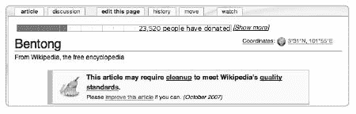
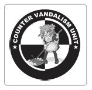

# 第七章. 清理、项目和流程

请不要说你在维基百科上找不到今天可以做的事情。需要修复的事情实在太多了！维基百科的清理概念包括创建文章后大多数需要改进的任务。任何需要从撰写新文章中休息的时候，你都会在现有的文章中找到大量的工作等待着你。

在维基百科上的工作是自我指导的。你可以创建自己的任务，或者查看各种项目和流程，这些项目和流程旨在特别改善和维护维基百科内容。你几乎总能找到其他人对你感兴趣的工作领域感兴趣。

在本章中，我们将讨论一些可用的清理任务和为维护文章而设立的协作项目。我们还将介绍*流程*，这是为了允许感兴趣的编辑讨论文章并执行某些正式任务而建立的结构。流程是政策实际实施的体现，并为日常工作提供了结构。我们将讨论两个最大的流程：删除文章和推广优质内容。本章中描述的活动是维基百科协作编辑和文章改进的核心，这些活动使维基百科得以运作。

# 清理

如果你看到一篇文章开头有一个带有黄色条的消息，以及一个扫帚驱赶灰尘的图标，那么这是一个标签，表示该文章需要清理。尽管大多数文章都可以得到改进——毕竟，维基百科永远不会完成——但有些文章显然比其他文章更需要帮助。这些被忽视的文章需要清理。

*清理*只是改善文章的一般术语。维基百科上绝大多数任务都属于这个广泛的标题：溯源、格式化、改写和链接都是清理任务。尽管任何人都可以在任何时候自由地处理任何任务，但维基百科已经发展出各种机制来整理需要帮助的文章，以便编辑们可以更容易地找到它们并解决清理问题。在本节中，我们将描述识别和标记需要帮助的文章的基本机制，然后我们将讨论广泛的问题类别以及如何找到存在这些问题的文章。

至少花一些时间在清理任务上对任何维基百科编辑者都有帮助。处理需要清理的文章可以揭示维基百科面临的问题类型，并且在多篇文章中处理类似问题和问题是一个学习维基百科风格和提升百科写作熟练度的绝佳方法（并且由此扩展到任何类型的写作）。清理也是最好的贡献方式之一；维基百科总是有大量的清理工作积压。彻底改进一篇写得不好的文章也可以非常令人满意：你可以总是通过查看页面历史中的文章前后版本来比较你取得了多少成就。

大多数人开始通过探索和尝试小型清理工作来志愿参与。尝试不同的编辑任务，看看什么适合你。这本书的作者们在维基百科上喜欢做不同的任务：菲比喜欢合并和事实核查，而查尔斯更喜欢创建重定向。许多人最终专注于一项或两项任务——比如校对或引用。正如在项目：改进内容中描述的，许多这些任务都有专门的 Wiki 项目，其中一群感兴趣的编辑者共同工作：WikiProject League of Copyeditors（快捷键 WP:LoCE）服务于那些对风格编辑感兴趣的人，而 WikiProject Fact and Reference Check（快捷键 WP:FACT）是为事实核查者准备的。

## 标记文章

当编辑遇到需要清理的文章时，他们有两个选择：他们可以立即修复问题，或者他们可以标记文章，用描述问题的信息标记给另一位编辑稍后清理。一旦文章被标记，其他编辑就可以系统地处理所有被标记为特定问题的文章。

这些*标记*或*标签*就是你在许多文章顶部看到的清理信息。它们是由*模板*产生的，这些是可以在页面上包含的小段代码，用于生成标准化的信息。正如在第五章中提到的，要将模板添加到页面上，你只需将模板名称用双大括号括起来，并将其放置在你想它出现的位置。

例如，你可以在[[模板:清理]]中找到通用的清理模板。要使用此模板标记文章需要清理，请在文章最上方插入此代码：

```
{{cleanup}}
```

这将创建图 7-1 中显示的信息。



**图 7-1. 清理模板信息**

如果一篇文章有几个问题，多个清理模板可能会堆叠在一起。编辑员也可以根据特定问题变得清晰时，用更具体的消息替换一般清理消息：例如，如果文章需要重写以提高清晰度，你会用`{{confusing}}`模板而不是更一般的`{{cleanup}}`模板来标记它。现在大多数可想象的问题都有模板消息。长长的清理消息列表可以在[[Wikipedia:Template messages/Cleanup]]（快捷键 WP:TC）找到；我们还在接下来的章节中列出了一些这些模板。

如果编辑员修复了文章，使得清理消息不再需要，他或她可以通过简单地编辑页面并删除模板标签来移除模板消息。如果编辑员只部分解决了问题，他或她可能只移除适当的模板消息，如果文章中添加了多个模板或添加一个在讨论页上的备注，详细说明已经做了什么以及还有什么未完成的工作。尽管编辑员有时会忘记在清理文章时移除模板，但如果你不确定所有问题都已解决，请小心移除模板，因为与内容相关的模板也作为对读者的警告。

大多数清理模板也可以标注日期，这样你可以看到一篇文章需要清理有多长时间了。对于一般的清理标签，添加日期的方式如下：

```
{{cleanup|date=November 2007}}
```

这个标签将日期添加到模板消息中，并将文章分类到按月份清理的类别中。

尽管清理过程因此具有一定的主观性——没有关于何时添加任何特定模板的硬性规则，任何人都可以添加或删除模板——但使用模板消息系统允许几位不同的编辑员（他们可能否则永远不会联系）通过一个宽松的过程来清理文章，并帮助读者了解文章何时存在问题。

## 清理类别

将清理消息添加到文章中会自动将该文章放入相关的清理类别中。这样编辑员可以轻松地找到所有标记为需要某种清理的文章；他们只需进入该类别并开始工作。例如，标记有`{{cleanup}}`的文章被放入[[Category:All pages needing cleanup]]。标记有带日期的清理标签的文章也会自动分类到按月份清理的类别中（在上面的例子中，[[Category:Cleanup from November 2007]]），这样那些带有较旧标签的文章可以先被处理。这也使得大型清理类别更容易管理。如果你编辑删除模板来移除它，文章将自动从清理类别中移除。

当然，标记文章比实际清理它们要容易。这在一些大型清理类别中有所体现。这些类别有*积压*——大量文章等待关注。维基百科的快速增长可能使得这种情况不可避免。因为有很多事情要做，为每个问题添加模板实际上并不真的有帮助，因为这可能会实际上掩盖文章最严重的问题；如果快速编辑可以解决问题，那么就先修复它（第十三章中描述的*sofixit*原则）。然而，如果你不能立即修复它们，请确保标记最大的问题。截至 2008 年初，大约有 31,000 篇文章在[[分类:所有需要清理的页面]]中。在这个类别中工作可能会让人感到压倒性；另一方面，31,000 篇文章只占总数不到 2%。

# 清理任务

寻找协作清理项目列表最全面的地方是[[维基百科:维护]]（快捷方式 WP:MAINT）。这个页面概述了各种清理任务，从简单的到复杂的。任务列表如此之多，你可能不知道从哪里开始。那么，什么是“维基项目红链恢复”？嗯，这个项目旨在通过自动化寻找标题匹配和提出重定向的过程，将红链转换为蓝链。

如果你更愿意按主题编辑，加入一个维基项目可能是最好的途径（参见维基项目中的“维基项目”）。或者，你也可以简单地浏览任何主题领域的文章列表，以找到一个看起来有趣且需要帮助的文章。尝试[[分类:待办事项]]，它显示了在它们的讨论页面上有*待办事项*列表的文章，或者[[维基百科:清理]]，它列出了需要清理的文章列表，以及简要说明需要做什么。如果你能完全清理这些文章之一，只需编辑页面将其从列表中删除。

清理可能是基本的维基百科工作，但它仍然提供了挑战和有趣的见解。有时文章可能需要完全重构。有些可能需要重写：参考处理主要编辑任务以了解处理主要编辑的一般方法，并注意第六章中关于保留可保存材料和工作，以避免清理在页面历史中留下大断裂和意外的差异的建议。

## 重写

维基百科中的每一篇文章都应该追求优雅、清晰的散文，优雅地、逻辑地解释一个主题。不幸的是，这种愿望并不总是能够实现。

糟糕的写作以不同的方式渗透到维基百科中：

+   一篇文章可能以一个写作不佳的草稿开始。原始作者可能不是熟练的作家，或者英语可能是他们的第二语言。

+   一篇文章可能逐渐变得不清楚。那些随着时间的推移分部分进行校对的文章，虽然改进了措辞但忽略了逻辑流程，可能仍然需要彻底重写。也许随着时间的推移，逐渐添加了一些小的信息，但现在文章缺乏结构。

+   最后，一篇文章可能写得很好，但语气或风格不适合百科全书。一篇文章可能缺乏中立观点，表现出对事件、产品或个人的编辑偏见。一篇文章也可能读起来像新闻稿、产品公告，甚至广告。

需要语言帮助的文章可以通过多种方式标记。此外，许多带有通用清理标签的文章实际上需要重写。

许多明确的清理标签解决了写作质量差的问题。要查看带有这些模板之一的文章，您可以访问模板页面（例如 [[模板:Copyedit]]）；通常，文章被放入的类别将在此处注明，或者您也可以从模板页面点击“链接到此页”来查看。例如：

+   `{{copyedit}}` 解决任何与语法、风格、连贯性、语气或拼写有关的问题

+   `{{advert}}, {{fansite}}, {{gameguide}}, {{likeresume}}, {{newsrelease}}, {{obit}}, {{review}}, {{story}}` 解决不恰当的语气和风格问题

    **“修复糟糕散文挑战”**

    任何认为自己写作不错的读者都应该点击左侧边栏的“随机文章”链接 20 次，并重新撰写您找到的文章中的任何糟糕的散文，同时不牺牲事实。至少每周做一次。当选择出现时，细节和准确性胜过华丽，但这并不证明糟糕的散文是合理的。（改编自用户：David Gerard）

+   `{{abbreviations}}, {{buzzword}}, {{cleanup-jargon}}, {{inappropriate person}}, {{quotefarm}}, {{toospecialized}}` 解决文章的组成问题

+   `{{contradict}}, {{misleading}}, {{unbalanced}}, {{limitedgeographicscope}}, {{weasel}}` 解决内容和呈现方面的问题

根据问题的程度，存在许多重写文章的方法。关于优秀文章的指南可以在《风格手册》和关于该主题的各种论文中找到（见第六章)，但最重要的目标是确保信息清晰传达给读者，符合内容政策。对于不清晰的措辞，考虑在不牺牲事实或思想的情况下提供更清晰的解释方式。当你完成时，读者将受益。要找到对写作和校对感兴趣的编辑，可以考虑加入校对者联盟 WikiProject。

## 扩展存根

*存档*文章是需要添加更多主题信息的起始文章。所有主题区域中已有数十万篇文章被标记为存档——如此之多，以至于按主题进行存档排序本身就是一个关键维护任务。如果你不想从头开始撰写整篇文章但喜欢研究和写作过程，可以尝试扩展这些文章之一。然而，不要忘记，新信息应有良好的参考文献。

所有存档类型的列表（这些列表反过来又链接到每种类型的特定类别）维护在[[Wikipedia:WikiProject Stub sorting]]。当处理这些文章时，请回顾同一主题区域中更成熟的文章。缺少哪些信息？例如，关于作者的条目是否包含作者的著作目录？

维基百科没有关于存档文章在不再被视为存档之前可以多长的硬性规定。如果一篇文章看起来相当完整或看起来像是一篇长文章，你很可能可以移除存档信息。如果一篇文章看起来比存档长但仍需要扩展，请使用`{{expand}}`模板标记它。

## Wikification

*Wikification*是将任何文本转换为维基文本的过程，包括用维基语法标记它、将文章结构化为逻辑部分，并添加内部链接。Wikification 很容易变成重写和事实核查，因为从根本上说，你正在将普通散文转换为维基百科超文本。在这个更广泛的意义上，“Wikification”意味着“按照维基百科风格格式化”。经验丰富的维基百科编辑在严肃重写散文风格之前可能先进行 wikification，因为 wikification 使文章更接近百科全书式的考虑，并有助于在其他文章中标记相关材料。

当你进行 wikify 时，要警惕其他问题：

+   如果这篇文章是一个死胡同文章，没有 wikilinks 从它指向其他页面，请检查“链接到此页”以确保文章本身也不是一个没有入链的孤儿文章。这两个问题通常出现在同一篇文章中。部分 wikifying 可能包括从其他页面添加适当的链接到文章。

+   你可能需要向文本中添加部分或重写引言主题句子以使其更具百科全书性。如果一篇文章的整体逻辑流程是错误的，那么给它最高的优先级。

+   格式不佳的内容通常还应检查是否符合知名度标准和事实准确性；格式不佳通常是内容被不熟悉维基百科的人添加的迹象。

+   不当的语气可能是版权问题的线索；参见“版权违规”部分中的“版权违规”（Copyright Violations）。

**格式化文章**

有时需要风格帮助的文章实际上可能不适合百科全书：它们可能重复了其他较老的文章，涉及非知名话题，甚至可能是骗局。如果你看到一篇文章的主题值得怀疑，不要害怕在花费大量时间格式化之前寻求第二意见。在编辑过程中，你也可能需要为文章添加其他标签，例如为可疑陈述添加“引用需要”。

使用`{{wikify}}`模板（图 7-2 中讨论的那样。然而，*可验证性*，即原则上验证某事的能力，与实际上提供可验证来源是不同的。许多维基百科文章在这方面略有不足。在维基百科较为自由的时代，一些较老的文章可能完全没有引用来源，而其他文章可能只引用了文本中的一些想法的来源，或者文本本身没有脚注。


**图 7-2. Wikify 模板信息**

查找来源是一个持续的过程：为任何主题，即使是小主题，编制一份好的参考书目都是一个艰巨的任务。对于某些主题，你可能很难找到任何可靠的来源，在这些情况下，准确的参考文献工作尤其有价值。当原始作者没有提供事实来源时，各种事实核查项目会完成这项工作。

维基百科有几个模板会提醒编辑和读者文章中需要引用：

+   `{{unreferenced}}` 此模板将文章放入[[分类:缺少来源的文章]]。当一篇文章完全没有引用任何来源时使用。

+   `{{refimprove}}` 此模板将文章放入[[分类:缺少可靠引用的文章]]。当存在一些来源但需要更多时使用。

+   `{{citeneeded}}` 更常见的 `{{citeneeded}}` 或 `{{fact}}` 都会将文章放入 [分类：所有未注明来源的声明文章]。与前面两个模板不同，这些模板应直接在文章文本中添加，无论问题出现在哪里（图 7-3). 例如，如果一篇文章包含需要引用的疑问或争议性陈述，你可以在疑问句的末尾插入 `{{fact}}` 模板。


**图 7-3. 内联引用需要标签**

获取来源可能会耗费时间，但你可以在文章中逐步添加来源。如果你能找到一篇文章中提到的某个事实的外部、可靠的来源，添加带有此来源的脚注是非常有帮助的。如果你有关于文章主题的更一般性的来源，但尚未将其用作文章中特定事实的来源，考虑开始一个“进一步阅读”或“外部链接”部分，并将该来源列为读者获取更多信息的地方。例如，你可能想在“进一步阅读”部分列出有关知名人物的权威传记，或者在“外部链接”部分添加指向在线原始文档的链接，以供历史文章使用。每篇文章都应尽可能有充分的来源。

如果你熟悉某个特定主题领域，并希望专注于寻找该领域的资料，那么加入一个 WikiProject（如“项目：致力于改进内容”（Projects: Working to Improve Content）中所述）是找到需要改进的该主题文章的最简单方法。

### 帮助，我的文章有误！

维基百科不希望文章包含错误陈述，尤其是那些损害个人或商业活动的内容。另一方面，维基百科的内容不由外部压力决定；中立性是一个关键原则，维基百科不是一个推广机制。因此，没有事实依据的不准确信息和不公平批评不应出现在维基百科文章中；但公平的批评，如果正确引用并以平衡的方式呈现，不应仅仅因为主题或其他人希望将其删除而从维基百科中移除。

如果关于你或你公司的文章在事实上是不正确的，你有几个选择，但你应该首先评估纠正错误的最佳方式。

**讨论**

首先，请记住考虑第一章中提出的指南和政策。所有文章都必须以中立的方式呈现，事实准确且可验证，并且关于值得注意的百科全书主题。关于事实不准确的问题可以在任何文章的讨论页面上讨论。这是解决问题的最佳第一步。冷静地说明文章在哪些地方事实错误，并用外部参考资料支持你的论点。这应该会促使编辑文章的人进行更正。

**编辑**

当然，你也可以简单地编辑文章；但在这样做之前，请咨询[[Wikipedia:Conflict of interest]]（快捷方式 WP:COI）。本指南区分了诽谤性评论（任何人，包括你，都可以删除）和其他不准确之处。另外两个相关的页面是[[Wikipedia:Biographies of Living persons]]（快捷方式 WP:BLP）和[[Wikipedia:Autobiography]]（快捷方式 WP:AUTO）。维基百科对关于在世人物的写作有严格的指南，WP:BLP 将帮助你论证删除针对你的敌对言论。另一方面，WP:AUTO（从属于利益冲突指南）解释了为什么自传性写作被强烈反对——在大多数情况下，你不应该编辑关于自己的文章。

**电子邮件途径**

如果在讨论页面上讨论问题无法解决，即使你已经引起了管理员对该问题的注意，也不要试图强迫问题得到解决，发出威胁，或者滥用正在编辑该文章的编辑。这些方法很可能是适得其反的。你最好的办法是发送一封电子邮件，如[[Wikipedia:OTRS]]（快捷方式 WP:OTRS）中所述，详细说明问题。这是官方的投诉机制。如果你的投诉有任何实质内容，经验丰富的志愿者将审查文章并努力解决问题。

### 版权侵权

你通常可以通过其语气在维基百科上发现版权侵权。来自其他来源的材料通常不像百科全书文章那样读起来。大多数版权侵权是由人们从其他网站复制粘贴材料到文章中造成的，你可以通过在网络上搜索该段落来检测到这一点。务必搜索中间或特定不寻常的句子中的选定短语；编辑通常会更改开头和结尾句子。

如果你找到了某些文章文本的可能来源，接下来的问题是复制了多少文本。如果只复制了一句话或两句话，并且来源没有注明，那么重写并引用来源可能就能解决问题。然而，如果整篇文章或大部分内容是从单一来源复制过来的（如常见的剪切粘贴违规），那么就发生了版权侵权。但请注意，维基百科确实包含了许多合法的公共领域文本，并且其他网站也镜像了维基百科的内容——请确保其他网站不是在复制维基百科，而不是相反！

你有几个选项可以用来移除版权侵权：

+   首先，可以将文本恢复到良好版本。检查页面历史记录以查看是否存在干净版本；如果存在，只需恢复到这个良好版本，并添加适当的编辑摘要。

+   如果你难以确定是否存在良好版本，你可以自己重写文本。请注意，你并不是简单地改写。删除大部分细节并重新开始，在重新插入每个事实时引用来源。务必在讨论页面上添加注释，解释为什么你删除了文章文本。

+   如果你无法恢复或重写，可以使用`{{copyvio}}`标签标记已确认的版权侵权，这将把文章放入可能版权侵权的类别中，供经验丰富的编辑检查。

+   如果你不确定是否发生了版权侵权，请使用`{{copyvio|url=}}`，这将触发一个更加谨慎的删除流程。在等号之后，粘贴你认为可能复制材料的网址。详细说明可以在[[Wikipedia:Copyright problems]]（快捷键 WP:CP）中找到。

+   如果你确信文章侵犯了版权，且文本或主题似乎没有任何可取之处，你可能想使用快速删除标签`{{db-copyvio}}`，这将确保快速获得管理员关注（参见“删除流程”中的删除流程）。

查看更多关于[检测可能的版权侵权](https://wiki.example.org/Wikipedia:Spotting_possible_copyright_violations)（快捷键 WP:SPCP）的信息。如果你的版权在文章中被侵犯，请参阅[[Wikipedia:Contact us/Article problem/Copyright]]；有几位经验丰富的编辑负责解决版权问题。

## 破坏性巡查

破坏行为巡逻，虽然正式上既不是项目也不是流程，但在维基百科上却是最重要的持续工作之一。根据定义，*破坏行为*是指出于恶意意图对维基百科内容产生负面影响而进行的更改。内容争议可能导致破坏行为的指控，但任何编辑都不应*轻易使用*这个词——除非你有充分的理由不这样做，否则始终*假定善意*。任何出于善意努力改善百科全书的行为，即使方向错误或考虑不周，也不算破坏行为。参见[[维基百科:破坏行为]]（快捷方式 WP:VAN）以了解该主题的一般观点，以及[[维基百科:管理员针对破坏行为的干预]]（快捷方式 WP:AIV）以了解提交针对最有问题编辑者的报告的地方。

当然，任何人都可以撤销他们看到的明显破坏行为；检查历史页面，然后登录后编辑或使用撤销版本将文章恢复到破坏发生之前的版本，如第五章中所述。 (使用任何一种方法，都要检查当前版本与你要撤销到的版本之间的*差异*，以确保你只撤销了破坏行为，然后添加一个编辑摘要：*rvv 破坏行为*是常见的。) 许多编辑正是利用他们的监视列表来完成这一目的，定期检查更改列表以查找可能为破坏行为的可疑编辑。其他人则投入大量时间监视最近更改和其他日志。大多数破坏行为都是明显的：无理由地删除内容或插入淫秽、粗俗的幽默或胡言乱语。如果你发现了一个被破坏的页面，你应该花几分钟时间回顾页面历史；破坏编辑往往集中在一起，你可能需要撤销多个编辑才能找到“最新良好版本”或一个完全没有被破坏的页面版本（参见修复错误和其他撤销原因）。

如果你无法判断一个编辑是否为破坏行为，请检查该编辑的*差异*以及进行该编辑的用户的历史编辑记录，以做出最终判断。如果一个编辑看起来可能现实但未注明来源且未加注释，你总是可以适当地标记它（例如使用“引用需要”模板），在讨论页面上留下评论，或者撤销它但将编辑文本复制到讨论页面上供其他人验证。

大多数破坏都遵循一定的模式。将在 第十二章 中再次讨论的 *软安全* 概念在此处值得提及。维基百科对所有人均开放，因此不良编辑会发生。然而，正如 第四章 中所指出的，这些编辑中的大多数都被迅速发现。违规者通常是年轻人，大多数破坏都是幼稚的。一些坚持不懈或更微妙的破坏者可能暂时成功。但维基百科的防御是深层次的，而不仅仅是第一道防线。维基百科通过自我修复来工作。

已经开发了许多工具和系统来检测（有时自动纠正）破坏性编辑；位于 [[Wikipedia:Counter-Vandalism Unit]]（快捷键 WP:CVU）的反破坏单位是一个对这项工作感兴趣的编辑团队（图 7-4 展示了其标志）。



**图 7-4. 反破坏单位标志**

## 清理编辑工具

除了破坏修复外，许多清理编辑任务（如纠正拼写或修复错别字）都是重复性的，对于这些任务，您可以使用编辑工具。这些工具帮助 *高级编辑* 快速完成枯燥的任务（尽管编辑人员始终对其所做的编辑负责，无论是否使用了自动化工具）。

一个流行的应用是 AutoWiki Browser。以下是其在 [[Wikipedia:AutoWikiBrowser]]（快捷键 WP:AWB）页面上的描述：

> AutoWikiBrowser 是一款为 Microsoft Windows 2000/XP（或更新版本）设计的半自动化维基百科编辑器，旨在使繁琐的重复性任务变得更快、更简单。它本质上是一个浏览器，当最后一页保存后，会自动打开新页面。当设置为这样做时，它会建议一些更改（通常是格式化），这些更改通常是对主要更改的辅助。

此工具和其他自动化工具仅适用于经验丰富的编辑人员；通过手动编辑来学习规则。您可以在 [[Wikipedia:Tools]]（快捷键 WP:AWB）找到许多其他工具，包括快速编辑的工具。

**进一步阅读**

一般清理任务

[`en.wikipedia.org/wiki/Wikipedia:Maintenance`](http://en.wikipedia.org/wiki/Wikipedia:Maintenance) 许多不同维护任务的列表

[`en.wikipedia.org/wiki/Wikipedia:Template_Messages`](http://en.wikipedia.org/wiki/Wikipedia:Template_Messages) 维基百科上使用的模板消息的参考，包括所有清理模板

[`en.wikipedia.org/wiki/Category:Cleanup_by_month`](http://en.wikipedia.org/wiki/Category:Cleanup_by_month) 标记为需要“清理”的所有页面，按月份排列

[`en.wikipedia.org/wiki/Category:Wikipedia_backlog`](http://en.wikipedia.org/wiki/Category:Wikipedia_backlog) 需要工作的文章大量积压的各种清理任务的列表

[维基百科清理类别](http://en.wikipedia.org/wiki/Category:Wikipedia_cleanup_categories) 包含所有清理类别的类别

重写

[维基项目：校对联盟](http://en.wikipedia.org/wiki/Wikipedia:WikiProject_League_of_Copyeditors) 校对和重写项目

[需要校对的文章类别](http://en.wikipedia.org/wiki/Category:Wikipedia_articles_needing_copy_edit) 需要校对的文章类别

[需要风格编辑的文章类别](http://en.wikipedia.org/wiki/Category:Wikipedia_articles_needing_style_editing) 需要编辑风格的文章类别

[需要重写的文章](http://en.wikipedia.org/wiki/Category:Wikipedia_articles_needing_rewrite) 可能需要完全重写的文章

扩展和条目

[维基项目：条目分类整理](http://en.wikipedia.org/wiki/Wikipedia:WikiProject_Stub_sorting) 组织条目分类的维基项目

[维基项目：条目分类整理/条目类型](http://en.wikipedia.org/wiki/Wikipedia:WikiProject_Stub_sorting/Stub_types) 所有条目文章，按主题排序

[需要扩展的文章](http://en.wikipedia.org/wiki/Category:All_articles_to_be_expanded) 需要扩展的文章（可能不是条目）

维基化

[维基项目：维基化](http://en.wikipedia.org/wiki/Wikipedia:WikiProject_Wikify) 覆盖维基格式化任务的维基项目

[需要维基化的文章](http://en.wikipedia.org/wiki/Category:Articles_that_need_to_be_wikified) 需要格式化为符合维基百科风格指南的文章

[死胡同页面](http://en.wikipedia.org/wiki/Wikipedia:Dead-end_pages) 不包含指向其他页面内部链接的页面（因此需要维基化）

版权侵犯

[版权问题页面](http://en.wikipedia.org/wiki/Wikipedia:Copyright_problems) 列出和审查可能的版权侵犯的地方，也是询问文章版权状态的第二意见的好地方

事实核查

[维基项目：事实与参考检查](http://en.wikipedia.org/wiki/Wikipedia:WikiProject_Fact_and_Reference_Check) 事实与参考检查维基项目

[缺少来源的文章](http://en.wikipedia.org/wiki/Category:Articles_lacking_sources) 没有来源的文章，按月份排序

[`en.wikipedia.org/wiki/Category:Articles_with_unsourced_statements`](http://en.wikipedia.org/wiki/Category:Articles_with_unsourced_statements) 包含一些未注明来源的语句的文章，按月份排序

[`en.wikipedia.org/wiki/Wikipedia:Biographies_of_living_persons`](http://en.wikipedia.org/wiki/Wikipedia:Biographies_of_living_persons) 关于在世人物的传记政策

[`searchengineland.com/070807-085103.php`](http://searchengineland.com/070807-085103.php) 一篇关于正确修复自己或客户不准确的维基百科文章的维基百科管理员的文章

破坏行为

[`en.wikipedia.org/wiki/Wikipedia:Vandalism`](http://en.wikipedia.org/wiki/Wikipedia:Vandalism) 关于不同类型的破坏行为

[`en.wikipedia.org/wiki/Wikipedia:Cleaning_up_vandalism`](http://en.wikipedia.org/wiki/Wikipedia:Cleaning_up_vandalism) 清理破坏行为的介绍

清理编辑工具

[`en.wikipedia.org/wiki/Wikipedia:AutoWikiBrowser`](http://en.wikipedia.org/wiki/Wikipedia:AutoWikiBrowser) AutoWikiBrowser 工具

[`en.wikipedia.org/wiki/Wikipedia:Tools/Editing_tools`](http://en.wikipedia.org/wiki/Wikipedia:Tools/Editing_tools) 其他编辑工具

# 项目：努力提高内容质量

> 维基百科方法的根本问题是大规模协作是*困难的*。
> 
> —David Gerard, *WikiEN-l* 邮件列表，2007 年 10 月 9 日

文章在由个人创建后，通常会在更广泛的维基百科编辑社区中得到更高的标准。为了从不同方向处理维基百科内容，已经发展出两种类型的系统：项目和流程。*项目*是网站上的松散社会群体。相比之下，*流程*（本章后面将讨论），专注于根据特定指南做出编辑和其他决策。换句话说，项目使用更随意的流程概念，而流程则将文章或决策从一个阶段移动到另一个阶段，更像是工厂。

## Wiki 项目

Wiki 项目是由一群编辑组成的松散组合。实际上并没有“蛙类 Wiki 项目”——但是有一个“两栖动物和爬行动物 Wiki 项目”。邮票 Wiki 项目和滑板 Wiki 项目也都存在。有些项目非常具体，而其他项目则关注广泛领域，例如化学 Wiki 项目，它处理与化学所有领域相关的文章（图 7-5). Wiki 项目小说“旨在为关于小说的文章定义一致性标准。”这种目标对于 Wiki 项目来说是典型的：为文章的结构或格式规定某些方面。这样的项目对开发关于特定主题领域的有用模板和指南感兴趣。项目还可以在其领域内对文章进行评级，开发门户和其他导航结构，并确定哪些文章缺失。

**关于命名的注意事项**

WikiProjects 是存在于维基百科命名空间内的页面。命名惯例是使用 WikiProject（首字母大写 *P*）然后是项目的名称。因此，要链接到的完整内部页面名称，例如 WikiProject 化学，是 [[Wikipedia:WikiProject 化学]]。

维基百科有成百上千个不同的项目，每个项目都针对一个主题区域或特定的维护或清理任务。参与项目的最佳理由是它们在更小的规模上运作，而维基百科则非常庞大。在维基百科这个大都市中，项目运作得更像一个小村庄，在那里更容易了解和与对相同主题感兴趣的编辑一起工作。

WikiProjects 有两种类型：

**主题 WikiProjects**

这些项目专注于改善和管理单一主题区域的文章。它们通常作为记录和讨论变更的地方，并为讨论主题区域提供一个自然的论坛（在项目主页的讨论页面上）。它们可能提供集中化的“待办事项”列表，以协调感兴趣编辑之间的文章。 

**维护 WikiProjects**

这些项目专注于维基百科的维护和一般清理任务，通过协调努力清理需要的文章，可能使用几种模板类型。这些项目只是通过正式的项目页面帮助汇总工作，这些页面描述了需要完成的任务和完成它们的技术。


**图 7-5. WikiProject 化学 页面**

可以在 [[Wikipedia:WikiProject_Council/Directory]] 找到这两种类型项目的列表。

要加入一个 WikiProject，只需将你的用户名添加到感兴趣编辑的列表中，并承担可能列出的其中一项工作。当然，在处理该区域的文章之前，你不必加入项目！人们通常是自己主动承担任务。正式的分配和其他类型的自上而下的管理几乎不存在。项目在正式程度和活动水平上有所不同；一些项目有编辑提供关于主题区域的定期更新，活跃的小组从事任务或评估文章，而其他项目只是提供偶尔更新的文章需要工作的列表。

任何认为他们有一个好项目想法的编辑都可以创建一个项目页面，然后其他感兴趣的编辑可以自由加入项目并开始工作。如果你看到需要一个新的 WikiProject，你可以轻松地开始一个。你可以在 [[Wikipedia:WikiProject]]（快捷键 WP:PROJ）和 [[Wikipedia:WikiProject Council/Guide]]（快捷键 WP:PROJGUIDE）找到更多信息。在开始一个新项目之前，你不需要特殊的许可，但你可能想四处询问——任何新项目的成功都取决于吸引他人来帮忙。

## Wikiportals

门户，那些邀请读者浏览的页面，包含在第三章中描述的相关文章和项目，通常不在维基项目的直接控制之下。另一方面，一个主题的门户与同一主题的维基项目之间存在自然的关系。维基项目诗歌宣布，“需要帮助维护门户：诗歌，包括添加引言、诗歌、文章和其他未来几周的材料。”门户是浏览读者在网站上的自然入口点，因此维基项目通常旨在维持和改进匹配的门户，或者在需要时建立一个新的门户。门户还经常提供特定主题区域需要工作的文章列表，因此如果你在寻找要工作的文章，请在这里查找。[[Portal:Contents/Portals]]提供了门户列表，按主题组织。

大多数门户使用标准化的布局，高度依赖于模板和子页面。设置新的门户不需要任何特殊权限，但在开始之前理解模板是有帮助的。先尝试在其他门户上工作，以了解它们的功能。请参阅[[Wikipedia:Portal/Instructions]]以获取创建新门户的详细指南。

## 写作协作

写作或文章协作简单来说就是提高特定文章的驱动力。有些人喜欢独立工作，但其他人更喜欢写作协作提供的更专注的推动力。当多个人共同工作于某一特定文章时，其改进速度可以非常快。

大多数维基项目都采用协作方式。有些项目基于特定时间段，例如每周一篇文章，其中小组在该周选择一篇文章进行专门的改进努力。一个长期存在的、非特定主题的项目是文章协作与改进驱动，该项目选择需要协作工作的文章。通常，通过投票选出的文章是*核心主题*或被忽视的重要文章，这些文章更倾向于更专业的主题。广博的主题可能难以写出高质量的内容！请参阅[[Wikipedia:Article Collaboration and Improvement Drive]]（快捷方式 WP:ACID）。

另一个寻找协作的好地方是[[Wikipedia:Community Portal]]，也可以从左侧边栏中的社区门户链接访问。在这里，人们可以自由发布协作、项目和需要其他编辑帮助的清理任务。在社区门户页面上，你可以找到一个专门讨论协作的部分；其中许多是需要优秀编辑的文章协作。更多写作协作的列表可以在[[Wikipedia:Collaborations]]（快捷方式 WP:CO）找到。

**进一步阅读**

维基项目

[维基项目](http://en.wikipedia.org/wiki/Wikipedia:WikiProject) 关于维基项目

[维基百科：Wiki 项目委员会](http://en.wikipedia.org/wiki/Wikipedia:WikiProject_Council) 一群协调 Wiki 项目的维基百科用户

[维基百科：Wiki 项目化学](http://en.wikipedia.org/wiki/Wikipedia:WikiProject_Chemistry) 化学 Wiki 项目

门户

[维基百科：门户](http://en.wikipedia.org/wiki/Wikipedia:Portal) 关于门户及其查找方法

协作

[维基百科：协作](http://en.wikipedia.org/wiki/Wikipedia:Collaborations) 关于文章协作

[维基百科：文章协作与改进驱动](http://en.wikipedia.org/wiki/Wikipedia:Article_Collaboration_and_Improvement_Drive) 每周的文章协作与改进驱动

# 流程

在维基百科上，编辑和管理决策必须不断做出，但该网站规模庞大，单个决策中心无法成为有效的解决方案。因此，大小决策都在不同的论坛中做出，其中关于特定主题的讨论结构清晰。流程不是正式指导的，但它们通常遵循特定的、达成一致的决策规则。流程结构清晰，而项目很少如此，更像是一个用于*处理*决策的传送带。几个流程基于官方政策，例如删除政策。任何人都可以参与流程；感兴趣的编辑只需访问流程页面即可发表自己的观点。

技术上，维基百科流程是一个页面，或一系列页面，通常位于维基百科命名空间中，编辑们在这里讨论拟议的决定。流程是公开的、开放的和透明的。它们也是建立信任的机制，因为它们有助于确保规则对所有编辑和主题都是相同的，并且每个人都可以看到（并双重检查）其他人是否在公平竞争，规则是否突然改变。正如文章[[维基百科：实用流程]]所说：

> 我们在这里是为了编写百科全书。过程是我们搭建的临时脚手架，帮助我们编写百科全书。没有过程或未按照既定过程工作会导致混乱。我们使用过程：1. 在类似情况下提供一些一致性。这有助于使过程感觉公平，尽管先例在维基百科上不具有约束力。2. 减少从基本原则出发做出每一个决定的冗余努力。3. 鼓励制度学习，并导致决策的整体质量更高。

大多数流程依赖于社区共识以及政策来做出决策。“共识”，在维基百科中是一个不寻常且特定的术语。在流程的背景下，“共识”意味着在指定时间段内参与者之间的一般性同意（几乎所有流程都对讨论设定了时间限制）。有时会使用特定类型的投票，如在文章删除讨论中，编辑会包括他们的名字以及他们认为文章是否应该被删除；但即使在这些情况下，每个人都明白这并不是真正的投票——遵循政策的强制论据比简单的“是”或“否”更有分量。

因此，维基百科的流程是完成某些事情的系统。“流程”、“社区”和“政策”：这些是理解维基百科如何运作的关键概念——真正的维基百科，而不是乌托邦式的复制品。尽管维基百科的委员会很少，但它有许多流程，每个流程都向愿意投入工作来理解特定决策所涉及问题的任何人开放。

通常应遵循流程，除非有非常好的理由不这样做；例如，管理员可以“不按流程”删除页面，但他们这样做可能会引起争议。另一方面，流程有失控的倾向，而规则性的流程不应仅仅为了存在而存在。流程很重要——繁琐的程序不是。维基百科的反官僚性质在官方政策页面[[Wikipedia:What Wikipedia is not]]上有明确的说明。在 WP:BURO 上搜索会直接带您到“维基百科不是官僚机构”这一部分。这一部分值得全文引用（截至 2007 年 7 月 11 日）：

> 维基百科不是一个模拟法庭，规则也不是社区的目的。应避免规则蔓延。在发布任何内容（如想法或提名）中出现的感知程序错误，不应成为使该帖子无效的理由。如果您觉得规则、政策或指南存在冲突，应遵循其精神而非字面意思。分歧应通过基于共识的讨论来解决，而不是通过严格遵循规则和程序。

换句话说，流程不应变成教条主义。流程可能会失控，而那些无论发生什么情况都坚持遵循自身规则的过程应该避免。我们将在第十三章（参见《维基百科的精神》中的“无视所有规则，大胆行事”）中再次回到这个想法。

## 涵盖的流程

维基百科有许多流程，涉及内容和社区。这些流程包括一些实施维基百科官方政策的流程，例如删除流程、特色文章候选流程、各种争议解决流程以及管理员晋升的请求管理员流程。其他流程则专注于使特定的维护任务变得常规化，例如重命名类别或批准机器人。

一个值得注意的例外是解决关于文章内容的争议。你可能认为，一个百科全书维基应该有一个关于这一过程的明确想法。*没有这样的过程，并且可能永远不会存在*。这个设计决策是维基百科模式的关键之一。

删除流程处理的是是否应该涵盖某个主题的问题，而争议解决流程帮助正在争论的编辑达成一致。但维基百科没有正式的裁决形式来处理关于合适文章内容的对立观点。编辑应该与其他人就他们的不同观点进行交流，并通过讨论、常识以及假设每个人都站在百科全书一边来处理分歧。内容决策流程将变成网站的编辑委员会，这与维基百科的核心思想——开放性和社区——相违背。维基百科的地位不允许任何人规定内容。

在本节中，我们将介绍两个主要的内容处理过程：删除文章和特色文章。在后续章节中，我们将探讨社区过程，包括争议解决。

## 删除文章

维基百科正在以惊人的速度增长，但也有很多内容被删除——每天有数百或数千篇文章从维基百科中删除。显然，并非所有创建的文章都适合百科全书，但应该保留什么，应该删除什么并不总是显而易见。*文章删除*流程用于决定应该删除什么。主要用作维护措施，此流程主要应用于选择不当的主题——那些无法，也不能导致适当百科全书文章的主题。

删除文章是彻底从百科全书移除内容的唯一方式，因此读者无法看到页面或页面的历史记录。删除不同于通过保存空修订版来清空页面；在删除过程中，被删除文章的历史记录，包括对所有修订的访问权限，也会被删除。对该文章的所有贡献痕迹也会从网站上消失——删除文章的更改不会出现在用户贡献、观察列表、最近更改或相关更改中。然而，文章并不会完全消失；删除的文章仍然对管理员可见，这允许他们审查删除操作并在出现错误的情况下恢复内容（*撤销删除*）。每个被删除的文章都会记录在一个特殊的列表中，即删除日志，可以在[[特殊:日志]]中查看。

只有维基百科的管理员才能删除文章，但删除过程对任何人来说都是开放的，可以讨论即将被删除的文章的命运。维基百科对页面应该如何被删除有非常具体且复杂的规则，并且有大量关于这个主题的过去讨论。由于维基百科倾向于尽可能包含内容，因此如果文章可以被挽救，删除通常被视为一个不好的解决方案。文章只有在需要清理或只是存根的情况下才不会被删除。文章也不会因为任何人个人不喜欢主题内容而被删除——维基百科没有审查制度。在网站上对删除内容的重视程度是一个长期存在的哲学辩论；参见第十二章，其中广泛讨论了“包含主义与删除主义”的辩论。

那么，什么会被删除呢？通常，删除是为了处理维基百科最糟糕的内容。有些文章根本不可能被清理。提交的页面可能是胡言乱语、涂鸦、非英文内容、个人传记、广告、明显的版权侵犯，以及只包含网站 URL 的垃圾文章。这些例子并不特别有争议，而且许多这类文章在提交后几乎立即被删除，作为常规的破坏性内容控制的一部分（这属于下一节中描述的快速删除流程）。

删除那些虽然出于善意提交但可能违反维基百科内容政策的文章更具争议性。有时违规是明显的；普通的词典定义或原创研究片段根本不适合百科全书的范围。许多文章被删除是因为它们违反了显著性的原则，这种违规更难确定。它也可能导致争议——没有人喜欢被告知他们的公司“不显著”。在这些删除讨论中，讨论删除的编辑可能需要做外部研究来了解更多关于该主题的信息，并全面评估文章以及它是否应该收录在百科全书中。偶尔，编辑会决定尽管主题不值得拥有自己的文章，但内容应该合并或以其他方式纳入另一篇文章。

显著性可能是一个有问题的概念。如果一篇文章的主题违反了显著性的原则，那么这篇文章很可能会被删除。但反过来，*显著性*的最佳工作定义来自哪些主题被删除，哪些主题没有被删除。应用显著性不是一门精确的科学。如第一章中所述，已经为各种主题制定了显著性指南，以帮助指导决策，但这些并不提供确切的标准。声称一个电视演员因为他在屏幕上有 421 分钟而具有显著性，但如果没有 419 分钟就不具有显著性，这是荒谬的，同样，如果一个演员因为获得了 76 栏英寸的行业报道而具有显著性，但没有 74 英寸，这也是荒谬的。

另一方面，先例对维基百科不具有约束力——尤其是在删除讨论中。许多维基百科用户认为，一篇文章的存在并不意味着同一主题的另一篇文章应该自动包含。例如，仅仅因为网站上有一篇关于某位演员的文章，并不意味着关于另一位演员的文章也应该默认包含。每篇文章都应该根据其自身优点进行评估，并对照基本内容政策进行衡量。因此，删除讨论是关于个别文章，而不是文章类别。

这些复杂的问题有助于解释为什么删除文章是一个过程——这个过程有助于确保及时做出决定，无论是暂时还是永久地解决该问题。

### 删除流程

任何人都可以提名文章进行删除，审查已被提名文章，并就它们是否应该被删除提出意见。几乎每一次删除都需要对维基百科政策（这当然并不总是明确的）进行一些解释。然而，删除流程是相当稳定、规范且相对一致的。

在删除文章的三个主要方法中，删除文章（AfD）需要社区讨论和专门的辩论，而提议删除（PRODs；见 WP:PROD）和快速删除（*speedies*，有时称为*CSD*，即快速删除标准，政策页面）则不需要。快速删除是最常见的，因为提交的无意义文章数量巨大。不符合快速删除指南的文章可能会通过删除文章流程或提议删除流程被删除，有争议的快速删除和提议删除通常会被转交给 AfD 流程。换句话说，当更快的删除流程出现争议时，维基百科有更严肃的 AfD 作为备选方案。

每个删除流程都是由编辑通过将红色条删除模板标记在文章上而开始的。这个模板将页面添加到多个待审查的列表中，在 AfD 的情况下，编辑创建一个页面解释为什么应该删除该文章。

每个具体的删除流程针对不同类型的问题文章：

**快速删除**

此流程适用于明确违反维基百科政策的文章。维基百科维护了一个大约 20 个特定快速删除准则的详细列表，位于 [[Wikipedia:快速删除准则]]（快捷键 WP:CSD），以及可以使用的特定删除模板。如果不符合这些准则中的任何一个，应使用其他删除流程。*快速*确实意味着快速，然而，*快速*有时也可能意味着仓促，并且它绝不应该应用于有争议或不明确的情况。

快速删除的常规流程是，新页面或其他破坏性巡查员会发现一个明显质量低下的文章。他或她将使用快速删除模板（图 7-6

**图 7-6. 快速删除信息**

**提议删除**

提议删除（PRODs）比快速删除更为温和，并为社区提供了时间来审查该提议。与快速删除一样，PRODs 也旨在用于不太可能引起争议的删除，但 PRODs 可以用于任何类型的文章，而不仅仅是那些符合 CSD 标准的文章。

当编辑发现他认为应该明确删除的文章时，编辑可以通过标记文章并使用 PROD 模板（图 7-7

**图 7-7. PROD 删除信息**

**删除文章**

这个详尽的讨论流程是针对可能被删除的文章；这些文章被添加到一个列表中，其他编辑在专门的页面上审查它们。删除文章（AfD）处理了 5% 到 10% 的严重争议案件，以及任何提名者希望从其他编辑那里获得意见的删除案件。如果在大约一周的时间内达成共识，讨论就会结束，并实施决定。如果没有达成共识，通常的做法是保留文章。其他结果也是可能的（例如，合并或重定向）。一小部分案件变得非常激烈。

将文章提名给这个删除流程需要几个步骤。首先，编辑将 AfD 模板添加到相关文章中（图 7-8

**图 7-8. AfD 删除信息**

任何人都可以通过访问主 AfD 页面并添加带有自己意见的签名评论来讨论 AfD 提名，意见是保留还是删除正在讨论的文章（On-Wiki Forums 展示了一个示例评论）。参与几场辩论以了解会出现哪些类型的讨论可以非常有趣。一些编辑会例行审查所有当前的 AfD 提名，而另一些编辑只是偶尔访问列表，看看是否有他们感兴趣的条目出现在那里。如果你对某个特定主题有知识，对是否保留特定文章或主题提出意见可以对这个过程非常有价值，而且 AfDs 现在按主题排序，以便那些不想搜索所有内容的人。审查 AfDs 的良好做法是仔细阅读相关文章，进行任何必要的其他研究（例如在线查找信息、检查反向链接和进行基本事实核查），然后基于文章内容和维基百科的政策提出有理有据的意见。AfD 讨论可能很热烈，但存在一些基本规则：讨论应始终关于内容，而不是发布或提名该内容的编辑，对个人喜好的呼吁（“我喜欢；我不喜欢”）没有帮助。

如果一篇文章已经不再相关，被另一篇文章取代，或者标题不合适，不需要进行删除讨论。相反，转向第八章了解如何移动、合并或重定向文章。

### 帮助，我的文章被删除了！

第一步：不要慌张！你通常可以挽救一个受到威胁的文章。如果你想要对删除提出争议，维基百科有不同的程序要遵循；生气不是其中之一。

有时文章在发布后立即被提名删除；有时，文章可能已经在网站上存在多年，直到有人决定它不属于这个网站。无论如何，对删除的争议取决于所使用的删除流程，但所有流程都需要讨论并将文章提升到维基百科的标准。

**删除其他类型的页面**

AfDs、PRODs 和 speedies 仅用于删除主命名空间中的文章或页面。图像和媒体的处理是分开的；请参阅[[Wikipedia:Images and media for deletion]]（快捷键 WP:IFD）。类别和模板也有它们自己的流程；请参阅[[Wikipedia:Categories for discussion]]（快捷键 WP:CFD）和[[Wikipedia:Templates for deletion]]（快捷键 WP:TFD），分别。对于删除维基百科或用户命名空间中的页面，请参阅[[Wikipedia:Miscellany for deletion]]（快捷键 WP:MFD）。这里偶尔会有关于未使用或不适当的材料进入项目命名空间的辩论。一个罕见的情况是管理员的空白操作，即不删除项目空间页面。对于这种情况，请参阅[[Wikipedia:Deletion policy#Courtesy blanking]]（快捷键 WP:CBLANK）。这个页面为包含非常尖锐评论的旧页面提供了解决方案，例如关于特定个人或公司的评论。作为礼貌，管理员可能会替换当前页面的内容，以确保随着时间的推移，旧内容在搜索引擎上的突出度降低。因为页面本身没有被删除，内容仍然保留在页面历史中。

+   如果你的文章被提议进行*快速*删除，不要移除模板。相反，在相关文章的顶部插入一个`{{hangon}}`模板，然后立即前往其讨论页解释为什么这篇文章是值得保留的。引用来源也会大有帮助。

+   你可以随时移除一个*提议的*删除标签，但随后你应该努力修改文章，解决提名者提出的问题。如果文章的知名度受到质疑，请添加可靠的来源来证明其知名度。知名来源取决于上下文；例如，对于一个人，列出出版物、奖项和荣誉有助于证明其知名度。投入足够的努力以证明文章符合知名度和内容标准，有助于防止随后的提名进入 AfD。

+   在 AfD 辩论中，请随意参与讨论。清楚地陈述你的观点，不要将别人的评论个人化。在 AfD 辩论期间，任何人都可以清理正在讨论的文章，因此你可以利用这个机会根据批评者的观点改进文章。你可以在 AfD 讨论页面上解释你是如何改进文章的。基于你自己的清理和额外的引用请求人们重新考虑可能会取得非常好的效果。

如果你直到文章被删除后才意识到它被提名为删除，确定为什么以及如何被删除。通常，删除日志中会给出原因，并附上删除管理员的姓名。你可以通过访问文章的标题来查看这些信息，现在它将是一个红色链接页面，显示“维基百科没有这篇文章的准确名称”的消息。点击页面中间出现的删除日志链接，查看删除日志条目。

了解文章被删除的常见原因。记住，你不需要急于撰写和发布文章。在维基百科上工作不是一场赛跑，维基百科也不会因为速度而颁发奖品。采取深思熟虑的方法，学习系统而不是对抗它。

文章被删除的最常见原因是它们被认为是不重要的或*虚荣*主题。关于当地音乐家、小公司高管或其他不经常出现在新闻中的人的文章可能会被拒绝。记住，也不要写关于自己的文章；自传应该放在用户页面或个人网站上。

这里有一些删除文章的其他常见原因：

**垃圾邮件式帖子**

文章读起来像是一则广告吗？它是否只关于一个项目或公司？它是否只是谈论某物有多么伟大，而没有保持中立的态度？最初为公司网站或新闻稿撰写的内 容很少适合维基百科。

**过于专业**

如果你的文章被认为是不重要的，但实际上是更大事物的一部分——例如，如果你是在写大学中的一个单一学院——你可能能够将信息包含在更广泛的主题下，而不是为其撰写新的文章。

**热情**

专业化是虚构角色和元素（如漫画书和视频游戏角色；电视剧集；单独的歌曲；或关于虚构宇宙微小部分的系列文章）的常见问题。*粉丝垃圾*（有时简称为*cruft*）是对这类文章的贬义词，这些文章有时只是勉强被容忍。通过清理已经存在的关于该主题的更广泛的文章并首先添加细节，而不是开始新的文章，你会赢得朋友。在某些情况下，内容可能真的更适合放在一个更专业的维基百科上（参见第十六章）。

**他们讨厌你的写作方式**

写作不佳不应该是删除的理由，而应该是清理，但你可以通过首先提交一篇写得好的文章来避免删除。许多经验丰富的编辑在用户空间中制作草稿，正如在第六章中讨论的那样，以及其他写作建议。

最后，如果你确信你的文章很好，但被错误删除，你可以开始进行*删除审查*。对于 PROD 删除，通常很容易让管理员在没有特殊讨论的情况下恢复文章。对于快速删除，你必须证明你可以解决文章被删除的原因。对于 AfD 删除，已经开发了一套严肃的申诉程序（见[[Wikipedia:删除审查]]，快捷键 WP:DRV），其中将进行另一轮社区讨论。这个过程审查和检查删除的程序方面，贡献者可以评论他们认为删除是否是最好的选择。然而，正如删除审查页面所说，第一步是与删除管理员交谈，看看为什么页面被删除。如果删除审查没有结果，你可能不得不等待六个月才能尝试重新创建文章。

如果你确实决定再次尝试，确保你解决了所有评论者提出的问题，并且你自信能够创作出符合内容政策和管理指南的文章，包括知名度、可验证性和中立观点。

当然，六个月规则并不是绝对的：由于当前事件或新可靠来源的发布，一个主题的知名度可以一夜之间改变。然而，反复重新创建一个被社区共识删除的文章，而没有实质性地改进，可以被视为一种破坏行为。偶尔，反复重新创建可能会导致管理员*撒盐*页面，这意味着保护页面并添加一个特殊的模板，传达维基百科真诚地、真正地、发自内心地不希望有关于这个主题的文章（这个术语来自短语“撒盐土地”）。

### 删除案例研究

显然，维基百科不是一个商业机构，但这并没有阻止它出现在哈佛商学院的案例研究中。这是由该校的 Andrew P. McAfee 和 Karim R. Lakhani 准备的。^([[22]) 维基百科的系统被置于显微镜下，因为它追踪了 2006 年 8 月的一个特定删除辩论。这是维基百科内部流程（在这种情况下是 AfD）首次受到如此密切的学术关注。论文采用了分析和历史方法（一直追溯到 Ephraim Chambers 和 Nupedia），并充分支持了特定删除辩论的案例研究。这项研究很有趣，因为它清楚地描绘了结构、社区、管理员、政策和流程之间的相互作用，重点关注个人编辑作为主要因素的作用。

这项研究关注的是由 McAfee 本人创造的术语[[企业 2.0]]的命运。这个话题位于维基百科自然内容的边缘。关于是否包含新术语的经典辩论有两种对立的观点：

+   维基百科的使命是事实性的，与传播新术语无关。

+   许多人希望以维基百科略带距离和中立的风格讨论正在流传的新短语。

这些想法可能是删除辩论立场背后的原因，其中“删除主义者”（参见[Wikiphilosophies](https://hw-wkpd-wk_15.html#wikiphilosophies "Wikiphilosophies")中的“Wikiphilosophies"）旨在让维基百科远离传播行话；但他们必须与“无原创研究”和“可验证性”的核心内容政策相协调。对于一个新术语来说，你确实需要根据已发表文本中的使用情况进行判断，以验证新行话确实被使用，并且是以文章所声称的方式使用，这样定义就不是“原创研究”；有时关于新短语的条目确实应该等待其他地方出现良好的来源。维基百科的内容和知名度的判断永远不应该仅仅基于宣传努力。

最终，这篇相当简短的条目在 AfD（删除讨论）中幸存了下来。尽管删除过程看起来决定性，但实际上是临时的。[企业 2.0]自被保留以来实际上有着复杂的历史，经历了被重定向到另一篇文章，然后又重新创建。在撰写本文时，其状态是重定向到[[企业社交软件]]。

显然，一个新术语可能会繁荣，也可能不会，维基百科可以也应该更新以反映这一点。从这个角度来看，维基百科的社会机制在灵活性方面是好的，而不是弱的：AfD 的结论，或维基百科上的任何其他过程，都不是一成不变的。

## 特色文章

与其被删除，一些非常好的文章在地位上得到了提升。*优秀文章（GA）*和*特色文章（FA）*是维基百科社区确定的两个级别的文章，被认为是维基百科上一些最好的内容。审查和积极工作于文章是参与维基百科的 Wikipedian 的关键技能之一。这种技能也适用于正式或非正式的同行评审（如第六章所述 Chapter 6）和 WikiProjects。用提高内容的眼光来衡量内容。（在优秀文章上工作也被推荐作为对抗由于其他极端——沉浸在删除辩论中——造成的倦怠的良方。）

在第三章中描述了如何寻找和浏览特色文章。维基百科还有针对媒体、图片、列表和门户的特色审阅流程。与维基百科的其他内容相比，只有少数文章被指定为优秀或特色，大约只有 1/660 篇文章被列为优秀，1/1,200 篇文章被列为特色。然而，许多高质量的文章并不在这些列表中——那些尚未经过正式流程的文章。优秀和特色文章的标准基本上与第六章中提到的标准相同，但在过程中，你可以通过公开同行评审来体验标准的应用。对于这两个流程，任何人都可以提名一篇文章，任何人都可以审阅它，尽管特色文章需要更复杂的审阅。如果你觉得难以收到对自己作品的详细批评，请记住*无所有权*规则。大多数正在审阅的文章都会得到极大的改进，无论最终结果如何。

优秀文章的候选名单列在[[维基百科：优秀文章候选名单]]（快捷方式 WP:GAC）。要提名一篇文章，只需遵循本页上的说明，并在文章的讨论页面上放置相应的优秀文章候选模板。反过来，任何编辑都可以选择审阅该文章（通常只有一个人会审阅文章）。审阅的标准列在[[维基百科：优秀文章标准]]（快捷方式 WP:GA?）。审阅过程应该是相当非正式的。审阅者阅读文章并根据标准进行评估，然后他们有三个选择：他们可以*通过*文章作为优秀文章，如果他们认为文章不符合标准，则*失败*文章，或者通过将文章*挂起*来提出改进建议。通常，审阅者会做出详细的建设性评论。通过的文章将被添加到[[维基百科：优秀文章]]（快捷方式 WP:GA）的优秀文章列表中。未通过的文章需要改进。一旦解决了批评，文章可以被重新提名。

特色文章将经历一个更正式的社区同行评审流程，通常有几位不同的编辑作为评审参与。这个审查基于[[Wikipedia:特色文章标准]]（快捷方式 WP:FACR）。标准包括，例如，适当使用图片。审查将在[[Wikipedia:特色文章候选人]]（快捷方式 WP:FAC）进行。在这里，你可以找到 50 到 100 个正在审查的候选人。评审员的评论可能是详细和广泛的，从格式等小问题到不清晰的写作或缺失参考文献等大问题。任何人都可以提名一篇文章作为特色文章，但按照惯例，提名者应该留下来进行审查并帮助修复文章。这个过程旨在作为一种对话，提名者通过解决文章的问题来回应批评。其他人也欢迎帮忙，但一个在批评后没有任何改进的文章不太可能通过。提名新文章的指南在特色文章候选人页面（快捷方式 WP:FAC）上，以及评论提名指南。一篇文章不应同时提名为优秀文章和特色文章，但一篇优秀文章可以后来被提名为特色文章。

通过（有时需要经过几轮审查）的文章将被添加到[[Wikipedia:特色文章]]（快捷方式 WP:FA）列表中。任何特色文章都可以在网站主页上列为“今日特色文章”；当前月份的选择将在[[Wikipedia:今日特色文章]]中列出。质量下降的特色文章可以通过特色文章审查流程（[[Wikipedia:特色文章审查]]）进行审查，任何人都可以提名当前的特色文章进行讨论，以确定该状态是否应该被移除。

**进一步阅读**

过程

[`en.wikipedia.org/wiki/Wikipedia:Process_is_important (快捷方式 WP:PI)`](http://en.wikipedia.org/wiki/Wikipedia:Process_is_important (快捷方式 WP:PI)) 一篇关于过程作用的论文

[`en.wikipedia.org/wiki/Wikipedia:Practical_process (快捷方式 WP:PRO)`](http://en.wikipedia.org/wiki/Wikipedia:Practical_process (快捷方式 WP:PRO)) 另一篇关于过程如何运作的论文

[`meta.wikimedia.org/wiki/Polls_are_evil`](http://meta.wikimedia.org/wiki/Polls_are_evil) 讨论真正的需求，而不仅仅是“赞成”和“反对”的回应

删除流程

[`en.wikipedia.org/wiki/Wikipedia:Deletion`](http://en.wikipedia.org/wiki/Wikipedia:Deletion) 删除政策

[`en.wikipedia.org/wiki/Wikipedia:Guide_to_deletion`](http://en.wikipedia.org/wiki/Wikipedia:Guide_to_deletion) 删除流程概述

[`en.wikipedia.org/wiki/Wikipedia:Articles_for_deletion`](http://en.wikipedia.org/wiki/Wikipedia:Articles_for_deletion) 讨论当前提名删除的文章

优秀和特色文章

[`en.wikipedia.org/wiki/Wikipedia:Featured_articles`](http://en.wikipedia.org/wiki/Wikipedia:Featured_articles) 特色文章门户

[`en.wikipedia.org/wiki/Wikipedia:Good_articles`](http://en.wikipedia.org/wiki/Wikipedia:Good_articles) 优秀文章门户

[`en.wikipedia.org/wiki/Wikipedia:Featured_article_candidates`](http://en.wikipedia.org/wiki/Wikipedia:Featured_article_candidates) 特色文章提名

* * *

^([22]) 案例研究在线上可查阅，[`courseware.hbs.edu/public/cases/wikipedia/`](http://courseware.hbs.edu/public/cases/wikipedia/)。

# 摘要

作为提升和更新维基百科整体任务的一部分，大量工作由小型团队或通过本地公开讨论完成。这些合作和讨论是看似无序的维基百科运作方式。幕后，有一大批多样性的支持项目和流程在运作。它们共同的特点是编辑在宽松的框架内操作，通过沟通和汇集努力来改进百科全书。
