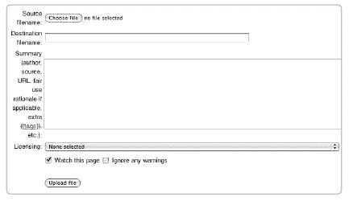
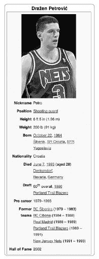
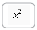
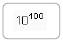

# 第九章。图片、模板和特殊字符

维基百科上的文章可以包括不仅仅是文本。图片和媒体文件增强了内容，而模板（如无处不在的信息框）和表格可以帮助你更干净地布局文章。精心选择的图形和整洁的展示可以显著提高文章质量。你还可以使用许多格式化技巧。例如，你可以成功使用一些 HTML，显示特殊字符，并将数学公式添加到文章中。所有这些任务都使用高级 wikisyntax，将在本章中介绍。

我们最好的建议是在需要时学习更高级的语法选项。本章涵盖的大部分内容，尤其是有关模板语法的知识，通常对于基本编辑不是必需的，但如果你想要使用它们来改进文章，你通常可以快速学会如何应用这些增强功能。

# 图片和媒体文件

图片和媒体文件是维基百科的热烈欢迎的贡献，并以多种方式补充文章文本。图片可能是插图、图表、照片或地图；它们可以展示动物的外观、国家的位置，或给城市天际线的感觉。媒体文件可能包括声音，如不熟悉单词的发音或作曲家作品的简短剪辑，或视频，如机器工作原理的动画。所有这些文件共同的特点是它们的存在是为了说明和阐明文章文本。图片不应仅仅为了添加漂亮的图片而放置在文章中，但一个良好、清晰的图片——或者一个适当的声音或视频文件——可以极大地增强任何文章。

与所有其他维基百科内容一样，所有媒体和图片都必须是免费许可的。尽管今天你可以在互联网上到处找到数字图片，但总的来说，你不能直接将这些图片用于维基百科；这种使用通常构成版权侵犯，就像复制他人的文字并将其上传为自己的作品一样。更好的策略是拍摄照片或自己制作图表和插图，自由许可它们，然后将它们上传到维基百科用于文章。

在本节中，我们将讨论如何在维基百科上找到图片，如何上传您自己的作品以供网站使用（以及在此过程中需要考虑的许可指南，包括您是否可以声称*合理使用*的理由），然后讨论如何使用特殊的图片语法将图片嵌入页面。然后我们将讨论声音和视频剪辑等媒体文件。

任何关于图片的讨论如果不提及维基百科的姊妹项目之一，即维基媒体共享资源（[`common.wikimedia.org/`](http://common.wikimedia.org/)），都是不完整的。维基媒体共享资源为所有维基媒体项目提供了一个图片和媒体文件存储库。如今，在共享资源上上传和处理图片，而不是直接在维基百科上，因为图片更容易被重复使用和搜索，更受欢迎。关于这个项目的更详细描述可以在第十六章中找到。

## 查找和添加图片

截至 2008 年初，维基百科和维基媒体共享资源已有超过 3,000,000 张图片。有了这么多图片，您很可能可以在文章中找到现有的图片。如果没有，任何人都可以上传新的图片到网站上，只要这些图片可以在文章中使用并且是免费许可的。

### 搜索可用的图片

维基媒体共享资源可能是开始搜索图片或媒体文件的最好地方。最简单的方法是使用 Mayflower 搜索引擎（您可以在共享资源的首页找到它的链接）；Mayflower 会在共享资源上搜索包含您关键词的图片描述页面，并将缩略图大小的图片页面作为搜索结果返回。您也可以访问共享资源，通过主题浏览媒体文件和图片，因为大多数图片已经被广泛分类。

在维基百科本身，您也可以使用分类浏览图片。图片的最高分类是[[Category:Wikipedia images]]；这个分类还包含仅作为维基百科项目一部分使用的图片（而不是在文章中），例如用于 WikiProject 奖项的图片。在这个分类下，您可以找到[[Category:Wikipedia images by subject]]和[[Category:Wikipedia images by type]]，这些分类根据图片是否为绘图、动画等对图片进行排序。一个特别值得访问的图片集合是[[Wikipedia:Featured pictures]]，这是维基百科上一些最好的图片的选择；在这里，您可以找到每日图片并参与图片评审。

最后，您还可以直接在维基百科上通过搜索图片命名空间来搜索图片描述，如第三章中所述。您是否能得到任何结果完全取决于图片的标题和描述是否做得很好。

如果您喜欢贡献图片并希望帮助找到所需的图片，有两个地方可以查找图片请求：维基百科上的[[Category:Wikipedia requested images]]和共享资源上的[[Commons:Picture requests]]。

### 图片许可和合理使用

如果您在文章中找不到现有的图片，您可以上传一张新的图片。但首先请确保图片的许可协议是可接受的。您在不知道许可限制或未经许可的情况下不应将图片上传到维基百科。您上传到维基百科的所有图片都必须符合以下四个标准之一：

+   你（将图片上传到维基百科的人）拥有该图像的权利（即你创建了它），并且你同意在免费许可下发布该图像，例如 GFDL。

+   如果你最初没有创建该图像，你可以证明版权持有者已在该图像下许可了一个可接受的免费许可，例如 GFDL。

+   你可以证明该图像属于公有领域；这是美国政府创建的作品的情况，例如美国国家航空航天局（NASA）的照片，这些照片自动进入公有领域。

+   你提出一个令人信服的合理使用理由。

对规则玩忽职守是非常不利的。*不要*复制你在网上找到的图像并称其为你的作品。尽管忽视这些点技术上仍然可以上传，但许多维基百科用户会监控新图像上传的列表，如果没有适当的许可，该图像不会在网站上保留很长时间（通常，它将在一周内被删除）。

最后一个标准，即合理使用，仅在英语维基百科上被接受（*不在* Commons 上），并且相当有争议，多年来引发了大量讨论。根据美国版权法，*合理使用*一词通常指的是为教育或评论目的对受版权保护的作品进行有限的使用。例如，当一位评论者引用他或她正在评论的书籍中的小段内容时，评论者可以这样做，因为这是合理使用。在维基百科上，所谓的合理使用政策文件规定了在网站上使用非自由图像的接受条件。例如，专辑封面出现在关于专辑的多篇文章中。封面艺术通常是受版权保护的，但合理使用政策可能意味着封面的小扫描图像是可以接受的，只要文章中批判性地讨论了专辑艺术本身，并且需要图像来帮助澄清这一讨论。

合理使用在维基百科上是有争议的，因为该网站旨在仅包含免费内容；考虑到维基百科的许可和价值，包含任何受版权保护的材料都存在问题，而且确定什么是或不是合理使用的法律方面可能非常困难。鉴于这种情况，所谓的合理使用图像仅在非常有限的情况下使用。如果将来某个时候有可能获得受版权保护的图像的*免费等效物*（例如，如果受版权保护的图像是一位活着的演员，另一位摄影师可能会捐赠一张等效照片），那么不应使用受版权保护的图像。

维基百科上关于图像和媒体的合理使用全细节相当复杂，并在 [[Wikipedia:Non-free content]]（快捷键 WP:NONFREE）中解释。涉及十个要点：

1.  不存在免费等效物。

1.  版权所有者的商业机会不得受到影响。

1.  在维基百科上的使用必须是最小限度的。如果部分或样本可以做到，则不会使用整个作品。

1.  该作品必须在维基百科之外之前已出版。

1.  必须满足维基百科的一般内容要求，并且材料必须是百科全书式的。

1.  必须满足媒体特定政策的其他方面（[[维基百科：图片使用政策]]，快捷键 WP:IUP）。

1.  内容至少被用于一篇文章中。

1.  读者必须从文章的增加中获得显著收益，而这种收益不能仅通过文本获得。

1.  非自由内容基本上只允许在文章中使用，而不允许在消歧义页面中使用。

1.  图片描述页面必须正确填写。

即使如此，合理使用图片也常常被从网站上删除。

合理使用的最佳替代方案是找到免费图片，这与网站推广自由文化的使命相一致。例如，对于名人或政治家，将一张公关照片发布到公共领域（或 GFDL）确保维基百科可以免费使用该图片，并且每个人都从中受益。

### 上传您的图片

图片必须先上传才能在项目中使用。您不能链接到其他网站上的图片。图片可以直接上传到维基百科，或者上传到维基媒体共享资源，那里的图片可以被所有维基媒体项目使用（而不仅仅是英语维基百科）。后者是首选的选项。有关如何上传到共享资源的说明，与下面描述的过程相当类似，请参阅第十六章。

**文件类型**

以下文件类型可以上传到维基百科：PNG、GIF、JPG、JPEG、XCF、SVG、DJVU、PDF、MID 和 OGG。前七个是图像文件格式，而后三个是用于文档和媒体的。根据[[维基百科：媒体]]，首选的文件格式是 JPEG（**.jpg**）用于图像和可缩放矢量图形（SVG；**.svg**）用于绘图。

要上传图片，您必须登录到该网站。点击左侧侧边栏的“上传文件”或访问[[特殊：上传]]。

步骤很简单：

1.  将您希望上传到计算机中的图片或文件保存。

1.  点击左侧侧边栏的“上传文件”并说明您如何获得该图片。根据所选选项，您将进入一系列许可问题，回答这些问题后才能到达上传表单。

    

    **图 9-1. 图片上传表单**

1.  一旦到达上传表单，请滚动到页面上的警告下方，直到到达表单本身（图 9-1）。

1.  填写“源文件名”字段；此字段用于您的原始文件。点击“浏览”访问您计算机上的图片。一旦找到文件，选择它并点击“打开”。然后文件名将出现在“源文件名”字段中。

1.  选择*目标文件名*；这是文件在维基百科或维基共享资源上的名称（此名称将自动以*Image:*开头）。默认情况下，您电脑上的图片文件名将被使用，但您可以编辑名称来更改它（请参阅下面对文件命名的建议）。请记住，与文章标题不同，一旦命名，图片文件名*不能*更改，所以请仔细选择。

1.  在摘要字段中描述图片。图片是什么？照片是在什么时候拍摄的或绘图是在什么时候创作的？尽可能包含尽可能多的有用信息——这是人们搜索图片时能够找到您图片的唯一方式。根据您在第一步中选择的选项，此字段可能已预先填充了一个模板；如果是这样，您可以填写适当的参数。

1.  选择适当的许可协议；如果您选择*我不知道*，您的图片将被删除。

1.  确保选中“监视此页面”；这样，您就会注意到如果图片被标记为删除。

1.  点击上传文件。您就完成了！

图片现在位于图片命名空间中，使用您给出的文件名。一旦成功上传图片，您将被带到其*图片描述页面*；此页面位于[`en.wikipedia.org/wiki/Image:yourimagename.jpg`](http://en.wikipedia.org/wiki/Image:yourimagename.jpg)，其中`yourimagename.jpg`是您在目标文件名字段中输入的文件名。此页面也是您图片的摘要描述出现的地方。一旦图片被嵌入到文章中，点击它的人将被带到这个页面（请注意，如果您点击来自维基共享资源的图片，您将自动看到维基共享资源的描述页面）。此页面上的信息和描述可以像任何其他页面一样进行编辑。要直接链接到图片描述页面（而不是显示图片），在 wikilink 中的文件名前添加一个冒号（:）。

```
[[:image:yourimagename.jpg]]
```

文件应具有描述性名称；不要使用无意义的数字和字母串（例如您可能从数码相机中获得的）或如`image.jpg`之类的文件名。图片文件名应清楚地表明图片的主题，图片描述应清楚地表明图片的主题、摄影师或图片创作者以及图片来源。其他有助于记录图片的信息还包括图片拍摄日期、地点、场合等。图片常被用于多篇文章中，显然您对图片的使用没有比其他编辑更多的发言权。

虽然您在上传图片后不能更改图片文件名，但您可以通过上传具有完全相同名称的新图片版本来替换图片；这种更改将在图片历史中显示。对于现有图片，点击图片描述页面下方的“上传此文件的最新版本”链接，该链接位于*文件历史*下。 

## 使用图片

一旦上传了图片，您就可以在维基百科页面上插入它。使用以下语法在页面上插入图片：

```
[[Image:*`nameofimage`*.jpg]]
```

这将在页面上显示图片，大小与原始图片相同。

图片可以浮动在文本的左侧或右侧。在文章中，将图片布局在右侧更为传统，尽管根据文章的设计和使用的图片数量，左右交替也可能是有意义的。例如，标准的信息框通常放置在文章的右上部分，这将影响文章布局。有关使用多张图片的文章示例，请参阅 [[曼德布罗特集]]，其中使用了多种技术来显示和排列图片。

您可以通过添加参数来设置图片对齐，使用竖线或管道字符（|）：

```
[[Image:*`nameofimage`*.jpg|left]] or [[Image:*`nameofimage`*.jpg|right]]
```

您还可以将图片显示为缩略图，这将自动将图片大小调整为 180 像素，并在底部留出空间用于标题，使用 *thumb* 参数。您通过添加两个参数来完成此操作：

```
[[Image:*`nameofimage`*.jpg|thumb|*`This is an image caption`*]]
```

*这是一张图片的标题* 将在此处显示在图片下方。标题应完整描述图片；如有必要，可以包括内部或外部链接。您还可以结合使用对齐参数：

```
[[Image:*`nameofimage`*.jpg|right|thumb|*`This is an image caption`*]]
```

这将使图片在页面右侧以方便的缩略图尺寸显示，并在其下方显示标题。

与使用默认缩略图尺寸不同，图片也可以调整到任何尺寸：

```
[[Image:*`nameofimage`*.jpg|300px|left|*`This is an image`*]]
```

这将显示图片，大小为 300 像素，左对齐，当读者将鼠标悬停在图片上时，*这是一张图片* 将显示为替代文本。要将此文本作为任何尺寸图片的标题添加，请使用带有尺寸参数的缩略图标签：

```
[[Image:*`nameofimage`*.jpg|thumb|300px|*`This is an image`*]]
```

如果您有很多小图片并且想一起显示，请尝试使用 `<gallery>` 标签。只需在两个画廊标签之间列出您想要包含在画廊中的图片，如下所示：

```
<gallery>
Image:Wiki.png|*`Caption`*
Image:Wiki.png|*`Caption`*
Image:Wiki.png|*`Caption`*
Image:Wiki.png|*`Caption`*
Image:Wiki.png|*`Caption`*
Image:Wiki.png|[[Help:Contents/Links|Links]] can also be put in captions.
</gallery>
```

这将整齐地显示这六张图片。在图片画廊中，不需要在文件名周围使用双括号。更多详情请参阅 [[维基百科：画廊标签]]。

如果您想包含一张特别宽的图片，例如城市天际线的全景图，请使用模板 [[模板：宽图片]]。详细信息包含在模板页面上。

至于哪些图片应该包含在文章中，维基百科的图片政策主要涉及版权问题。[[维基百科：图片]] 中的指南定义了百科图片：百科图片与当前主题相关，清晰，质量良好。不要让您的文章充斥着图片；使用缩略图功能也确保页面将更快地为读者加载。特色图片项目在 [[维基百科：特色图片标准]] 中列出了更多关于好图片的标准；许多这些标准与图片的技术质量相关。如果您需要帮助改进图片，可以随时询问对图片感兴趣的编辑人员——尝试维基百科图形实验室项目在 [[维基百科：图形实验室]]。 

## 使用多媒体文件

在维基百科上也可以使用其他媒体文件。音频文件对于某些主题非常有帮助；例如，维基百科有许多旨在帮助你正确发音中文姓名的文件。第三章介绍了如何播放这些文件。声音文件必须使用免费的 Ogg Vorbis 或 MIDI 格式，视频文件必须使用 Ogg Theora 格式。

考虑到大约有 70,000 篇文章是关于专辑和单曲的，你可能预计维基百科会有很多音乐文件。然而，所有来自版权来源的音乐样本都必须与文章中歌曲或音乐作品的描述具体相关联。关于专辑的文章旨在提供信息，而不是推广。

公平使用政策同样适用。关于鲍勃·迪伦的《All Along the Watchtower》的文章确实包含歌曲的 14 秒样本。这个简短的长度符合公平使用政策：样本必须是最低限度的，并且不影响合法的商业贸易。

媒体文件，如声音文件，以与图片文件相同的方式上传。但当你链接到它们时，将*图片*替换为*媒体*：

```
[[Media:*`nameoffile`*.ogg]]
```

虽然你可以上传 PDF 文件，但它们通常在维基百科或其他维基媒体项目中没有起到有用的作用。

要识别文章中的声音链接，你可以使用[[模板：听]]，它添加了一个小声音图标和一个方便的菜单来播放文件，如[[Wikipedia:媒体文件的创建和使用]]所述。

**进一步阅读**

图片

[`en.wikipedia.org/wiki/Wikipedia:Images`](http://en.wikipedia.org/wiki/Wikipedia:Images) 页面中使用图片的概述

[`en.wikipedia.org/wiki/Wikipedia:Picture_tutorial`](http://en.wikipedia.org/wiki/Wikipedia:Picture_tutorial) 图片格式教程

[`en.wikipedia.org/wiki/Wikipedia:Extended_image_syntax`](http://en.wikipedia.org/wiki/Wikipedia:Extended_image_syntax) 更高级的图片语法

[`en.wikipedia.org/wiki/Help:Images_and_other_uploaded_files`](http://en.wikipedia.org/wiki/Help:Images_and_other_uploaded_files) 图片的主要帮助页面

[`en.wikipedia.org/wiki/Wikipedia:Finding_images_tutorial`](http://en.wikipedia.org/wiki/Wikipedia:Finding_images_tutorial) 寻找插图图片教程

[`commons.wikimedia.org/wiki/Commons:First_steps/Reuse`](http://commons.wikimedia.org/wiki/Commons:First_steps/Reuse) 使用 Commons 图片的指南

[`en.wikipedia.org/wiki/Wikipedia:Image_use_policy`](http://en.wikipedia.org/wiki/Wikipedia:Image_use_policy) 图片使用政策，包括格式、内容和版权问题

[`en.wikipedia.org/wiki/Wikipedia:10_things_you_did_not_know_about_images_on_Wikipedia`](http://en.wikipedia.org/wiki/Wikipedia:10_things_you_did_not_know_about_images_on_Wikipedia) 关于维基百科图片的要点简短列表

媒体

[维基百科：媒体帮助](http://en.wikipedia.org/wiki/Wikipedia:Media_help) 播放媒体文件的帮助页面

[维基百科：听力模板](http://en.wikipedia.org/wiki/Template:Listen) 用于音频文件的模板

[维基百科：音频模板](http://en.wikipedia.org/wiki/Template:Audio) 用于音频和发音文件的另一个模板

[维基百科：口语维基项目](http://en.wikipedia.org/wiki/Wikipedia:WikiProject_Spoken_Wikipedia) 产生维基百科文章录音的项目

# 模板

模板通常在维基百科上用作导航和格式化辅助工具，以及以一致的方式向页面添加重复或模板化消息。它们是通用的，并且当正确使用时，有助于信息的展示。*模板*是一个页面——例如，可能包含导航菜单——您可以将其插入到维基页面中并多次重复使用。

每个模板都可以包含（技术上称为“转包含”）在任何数量的其他维基页面中，从几十到数百万。对于程序员来说，一个转包含的模板可以与一个`#include`语句或一个在页面查看时运行的宏相提并论。您现在可能熟悉的模板是出现在文章顶部的清理消息和放置在文章底部非常底部的存根消息。模板还可以帮助将复杂的格式化融入文章中，以实现标准化，因为模板一旦创建就可以重复使用。模板可以提供一致、灵活的信息显示解决方案。因此，维基百科用户在相似文本出现在不同位置时，会创建模板。在网站上发挥重要作用的某些模板受到保护，但大多数是可编辑的页面，位于它们自己的模板命名空间中。

对模板有一定的了解将有助于任何编辑。虽然您不需要学习如何构建自己的模板才能成为知识渊博的维基百科贡献者，但了解模板的功能以及您可以从它们那里期待什么是有帮助的。您应该了解如何使用和编辑它们。

## 使用模板

如果您想在特定主题的所有文章中显示相同的页脚或框图样式，那么您将需要创建一个模板。同样，如果您在用户讨论页面上持续留下某些信息——问候或可能是建议——使用模板可以提供一致性，并且还能节省时间。

要将模板添加到页面中，只需编辑该页面，并在您希望其出现的位置嵌入模板的名称（不带模板命名空间前缀），就像这样：

```
{{*`template name`*}}
```

模板可以在单个页面上使用多次。在保存页面后，模板将显示您放置的位置。

例如，放置

```
{{cleanup}}
```

在文章顶部将生成读者在图 7-1 中看到的消息，该图位于清理部分。单独查看模板消息可以通过访问模板页面在[[模板:清理]]。要查看此模板的实际源代码，请点击“编辑此页面”标签（对于这个受保护的页面，它被标记为*查看源代码*）。您看到的看起来很复杂的格式化部分实际上是当您使用快捷键`{{cleanup}}`时在渲染的文章中包含的内容。

**检查文章中使用的模板**

要查看页面上使用的所有模板，首先选择“编辑此页面”标签以查看 wikisource。然后滚动到编辑窗口和编辑快捷键的末尾。在页面底部所有其他文本和许可信息下方，您将看到注释*Pages transcluded onto the current version of this page*。在此之下是包含在该页面上的所有模板的列表；点击其中一个即可转到模板页面本身。

## 使用参数

作为一名初级编辑，您可能希望围绕模板进行编辑，而不是立即开始更改它们。随着时间的推移，您可能需要编辑模板，修改它以添加新文本。许多模板要求您以指定形式输入*参数*或变量，然后根据特定页面定制模板的显示方式。

参数表示或允许您包含将在每个模板使用中不同的变量。例如，模板`{{WPBooks}}`用于关于书籍的文章的讨论页面上，作为整理它们的辅助工具。这个模板在填写之前看起来是这样的：

```
{{WPBooks |class = |needs-infobox = }}
```

每个后面跟着等号的选项都是一个可选字段，由插入模板的人填写。例如，您可以用反映您查看文章时文章质量的评级来填写`class`字段。可能的评级列在`{{WPBooks}}`模板的主页上；它们被描述为“FA, A, GA, B, Start, Stub, Dab, Template, Cat, NA。如果为空，则默认为未评估。”换句话说，如果您正在审查关于一本书的文章并希望将其评为 Start 等级，请在`class`参数后键入`Start`。

另一方面，`infobox`参数是一个简单的是/否选择。如果文章需要一个信息框，这是一种另一种模板，请在这里键入`yes`。如果不需要信息框，您可以键入`no`或直接留空该参数。

许多模板都有可选参数。例如，上一节中提到的清理模板最好与这样的日期参数一起使用：

```
{{Cleanup|date=May 2008}}
```

通过按月份对清理文章进行分类，有助于确保可以首先解决最老的问题。

## 模板的工作原理

当仅使用双大括号在页面上包含模板时，这个过程被称为*转包含*。一些模板可能需要你通过称为*替换*的过程来替换它们。模板说明——通常在模板页面的注释中找到——通常会指定何时需要替换模板而不是转包含它。

替换是通过输入

```
{{subst:*`template name`*}}
```

*替换*意味着在保存页面时扩展并渲染模板，而不是在查看时。也就是说，模板产生的维基文本被保存到使用模板的页面的源代码中。这与转包含形成对比，在查看源代码时，你只看到双括号中的模板名称。

当模板被替换时，模板页面的更新*不会*自动传播到已放置模板的页面（当页面被转包含时，会）。替换对于你希望维基文本更接近读者看到的渲染视图的页面可能很有用。

**其他转包含**

事实上，任何维基页面，而不仅仅是模板命名空间中的页面，都可以被转包含到任何其他页面。只需在冒号和你要包含的页面名称周围放置大括号：*`{{:Yourpagename}}`*。在维基百科项目空间中，将子页面转包含到主页面有时是为了将长页面分成许多部分。例如，如果你查看[[Wikipedia:Featured article candidates]]，每个提名实际上都在一个子页面，它通过模板语法被转包含到主 FAC 页面，以提供一个所有提名的单一视图。当你设计自己的模板时，这个功能可能很有帮助——只需在你的用户空间子页面中工作模板，在那里你可以随意实验。要在另一个页面上测试你的模板，输入``{{:User:*`yourname/yourtemplatename}}`*``。

当然，当你完成时，你会将它移动到常规模板命名空间。

模板可以——并且通常确实——自动对它们所使用的页面进行分类。例如，在书籍模板中，如果你包含一个`infobox`参数，文章的讨论页面将自动被添加到[[Category:Book articles needing infoboxes]]。同样，`{{cleanup}}`将文章放入一个名为[[Category:All articles needing cleanup]]的大类别。如果你在这个标签中使用 2007 年 8 月的`date`参数，文章也将被分类到[[Category:Cleanup from August 2007]]。一旦模板被移除，文章也将从类别中移除。

## 模板的种类

我们没有足够的空间来讨论模板的所有可能用途，更不用说列出所有常用模板了——维基百科有成千上万的模板。然而，我们将回顾几种主要类型。其中一些你可能已经熟悉，例如清理模板。

*事实核查通知*对于与维基百科网站互动很有用，即使您没有打算深度参与。这些模板会就内容提出疑问。除了我们在第第四章和第七章中描述的清理模板外，这些模板可以放置在文章的顶部以产生清理信息框，您还可以在文本本身中插入小的清理和事实核查模板。当陈述的来源不明确时，应用`{{fact}}`和`{{who}}`模板。另一个这样的模板是`{{lopsided}}`，它会在文章中添加关于处理中立性的查询。将这些模板直接放置在疑问文本旁边。例如

```
The Moon is made of old blue cheese, with the dusty surface being a space
fungus that has grown on it{{fact}}.
```

显示一个内联消息，例如为`{{fact}}`（参见图 7-3 在事实核查和引用中如何使用此标签）的*引用需要*。此模板还将文章添加到维护类别[[Category:所有未注明来源的声明文章]]。

一个*信息框*组织信息以便干净地展示给读者，同时标准化文章主题基本事实的展示。各种信息框中，*taxobox*是一个用于展示动物或植物物种分类信息的特定信息框。信息框通常是矩形、右对齐，并放置在文章顶部。

您可以访问[[模板:Infobox NBA Player]]来查看一个带有足够文档的篮球运动员信息框，以了解其工作原理（参见图 9-2 以了解此信息框在文章中的显示方式）。每条信息都是一个参数，由放置信息框的编辑者填写。

要设置信息框，请访问[[帮助:Infobox]]。创建和修改信息框比维基百科的标准流程要复杂一些。现有的信息框可以在[[Wikipedia:List of infoboxes]]（快捷方式 WP:IB）中找到，尽管这个页面可能不是持续维护的，或者在[[Category:Infobox templates]]（快捷方式 WP:INFO）中，但通过访问类似的文章或相关的 WikiProject 可能更容易找到信息框。

*导航模板*也非常常见，尤其是对于文章页脚。例如，

```
{{Popes}}
```

该框位于任何关于教皇的文章页面底部，位于类别和互链列表之上。此模板显示为一个列出关于天主教教皇所有页面链接的框。作为一个改进，由于该模板包含指向 264 位其他教皇的链接，因此相当长，模板详情仅在您点击显示链接时才显示。这种*隐藏模板*通常用于大型或难以管理的导航框。然而，如果您使用浏览器搜索在页面上定位短语，隐藏模板可能会导致一些奇怪的效果，因为浏览器无法“看到”如果模板被隐藏，则列出的所有教皇的文本。



**图 9-2. 德拉仁·彼得洛维奇的 NBA 球员信息框**

另一种多功能且对相关文章有用的导航辅助工具是*继承框*，它通常也显示在文章底部。在[[亚伯拉罕·林肯]]的底部附近，你会看到一个可能由这些模板创建的框：

```
{{start box}}
 {{succession box
 | before = [[James Buchanan]]
 | title = [[President of the United States]]
 | after = [[Andrew Johnson]]
 | years = [[March 4]], [[1861]] - [[April 15]], [[1865]]
 }}
 {{end box}}
```

这将显示一条消息，告诉您林肯是美国总统詹姆斯·布坎南的继任者等等（图 9-3

**图 9-3. 亚伯拉罕·林肯文章底部的继承框**

*格式化模板*可以帮助您进行文本布局。例如，`{{TOCleft}}`将目录放置在页面左侧。如果文章还包括一个右对齐的信息框，这可能很有用。许多更复杂的模板也可以用于在其他模板内进行格式化或用于页面元素的间距，就像 CSS 在常规网页上起的作用一样。维基百科还有数十个针对项目而不是文章的模板；这些模板大多收集在[[分类：维基百科模板]]和[[分类：维基百科实用模板]]下。参见格式化列以了解使用模板格式化文本的另一个示例。

## 如何构建模板

你可能想要在你需要构建自己的模板时再阅读这一节。现有的模板数量非常多，并且可以很容易地适应大多数需求。编辑者欢迎构建新的模板。

我们将以在用户讨论页面上放置欢迎新用户的模板为例。为此目的，已经存在一个模板 [[Template:Welcome]]，但你可能想要自定义它或从头开始构建你自己的版本。模板可以包含变量，这使得模板能够在放置模板时根据输入的参数显示不同的信息。这个例子说明了它是如何工作的。

**姜饼人进军**

模板不仅方便和多功能，而且还能促进一定程度的一致性，有助于读者。根据你在使用由共同元素库组成的类似页面上的经验来导航新页面是很有用的，模板也有助于确保相关文章都包含类似的信息。然而，过多的模板可能会使文章难以阅读和编辑。贬义词 *cooker-cutter page* 也适用：维基百科文章应该比姜饼人更有个性。参见 [[Wikipedia:Huge message boxes]] 了解（幽默的）警告。

要开始一个新的模板，请在模板命名空间中创建一个新页面。例如，我们的模板示例将被命名为 *mywelcometemplate*，并且它将包含一个指向维基百科帮助页面的加粗链接。在页面 [[Template:Mywelcometemplate]] 上，你会输入以下内容：

```
'''[[Help:Contents|click here for handy tips and help]]'''
```

然后点击保存。到目前为止，一切顺利。现在，当你任何其他页面上输入 `{{mywelcometemplate}}` 并点击保存时，你会在页面上看到以下加粗链接渲染：点击此处获取实用技巧和帮助。

然后，你可以引入一个参数。在模板定义中，*形式参数*（输入参数值的占位符）是一个带有三对花括号的参数名称。例如，如果你想为模板参数命名为 *myVariableName*，你会输入 `{{{myVariableName}}}`。

在这个例子中，假设你想要在你的欢迎信息中包含一个变量文章名称。你可能输入如下：

```
If you need help with your article called "{{{articlename}}}", '''[[Help:
Contents|click here for handy tips and help]]'''.
```

当你在页面上包含模板时，你会输入以下内容：

```
{{mywelcometemplate|articlename = *`the article name you want to display`*}}
```

当页面渲染时，你会看到以下内容：

```
If you need help with your article called "*`the article name you want to`*
*`display`*", `click here for handy tips and help.`
```

您还可以通过使用连续数字来包含未命名的参数：`{{{1}}}, {{{2}}}`，依此类推。在这种情况下，用户只需在管道字符之间放置他想要包含的变量文本，无需参数名称。例如，如果你的模板看起来像这样，

```
Dear {{{1}}}, if you need help with your article called "{{{2}}}", '''[[Help:
Contents|click here for handy tips and help]]'''.
```

你可以按照以下方式填写：

```
{{mywelcometemplate|Mary|Truly Tuesday}}
```

在页面渲染时，以下内容将显示：

```
Dear Mary, if you need help with your article called "Truly Tuesday", `click`
`here for handy tips and help.`
```

模板可以变得非常复杂，本书的范围超出了提供编码它们的完整说明。首先研究现有模板，以了解可能实现的内容。任何可能包含在常规维基页面中的内容也可以包含在模板中——从普通文本和图像到维基语法、CSS、HTML，甚至其他模板。从设计师的角度来看，维基语法在模板内仍然像通常那样表现。使用模板语法和*解析函数*（基于至少一个未命名的参数返回值的模板样构造）可以编写极其复杂的模板。

学习如何构建模板的最简单方法就是简单地查看——也许可以借用——现有模板的源代码。例如，如果你试图为特定类型的文章构建一个新的信息框，你可以简单地使用现有的信息框作为模板，在必要时更改字段名称和大小。

**进一步阅读**

[MediaWiki 模板帮助](http://www.mediawiki.org/wiki/Help:Templates) 使用和创建带参数模板的快速、清晰指南

[Wikipedia 模板快速指南](http://en.wikipedia.org/wiki/Help:A_quick_guide_to_templates) 在维基百科上使用模板的基本指南

[模板帮助](http://en.wikipedia.org/wiki/Help:Template) 模板帮助——关于模板特性的高级、详细文档

[维基百科：模板命名空间](http://en.wikipedia.org/wiki/Wikipedia:Template_namespace) 模板及其在维基百科上的模板命名空间的介绍

[维基百科：模板](http://en.wikipedia.org/wiki/Wikipedia:Template) 文章和项目页面标准模板消息列表，包括标准清理模板

[引用和参考模板](http://en.wikipedia.org/wiki/Category:Citation_templates) 引用和参考模板

# 文章布局

除了部分、段落和基本维基语法之外，模板和表格是布局和格式化文章的两个主要工具。特殊的布局模板现在已经取代了表格在维基百科上曾经使用的许多功能（例如，信息框曾经是表格驱动的）。然而，表格仍然非常适用于展示数据，如多列列表。模板和表格也可以结合使用；例如，如果需要，表格可以包含在模板中。

## 表格

表格提供了一种整洁的方式来组织任何最好以行列格式呈现的信息。然而，表格应该始终谨慎使用，因为它们会使 wikisyntax 的可读性降低。许多专门的“列表”文章使用表格，因为它们可以紧凑地显示多个数据元素（参见图 9-4）。在基本文章中通常不需要它们；通常可以使用简单的列表代替。

![使用表格形式的跨行、多列列表 [[日本畅销单曲列表]]](tagoreillycom20090804nostarchimages315962.png.jpg)

**图 9-4. 使用表格形式的跨行、多列列表 [[日本畅销单曲列表]]**

表格是布局任何类型的数据数组或多列、多行列表的最简单方式。“何时使用表格”，《风格手册》中的指南指出，“如果你正在编辑的信息不是表格形式的，它可能不属于表格。”对于视觉布局（即，布局页面以使其看起来美观，而不是展示数据），表格已被模板和嵌入的 wiki 标记所取代，例如图像标记和 CSS。

MediaWiki 提供了一个集成的表格语法，这是一种用于简洁的特殊 wikicode。此代码的功能与 HTML 中的表格标记非常相似，并且在结构上相同（尽管在 MediaWiki 中也可以使用，但通常不应使用）。表格语法使用管道符号 (|) 作为主要分隔元素，因此有时被称为 *管道代码*。

现在将详细描述此代码。你还可以在[[帮助：表格#管道语法教程]]中了解有关管道代码的信息，它详细介绍了更复杂的表格语法，包括格式化单个行和单元格。

整个表格被花括号和垂直线（管道符号）包围。因此，你使用 {| 开始一个表格，并用 |} 结束它。每个标签都需要单独一行：

```
{|
*`table code goes here`*
|}
```

表格格式信息，如边框宽度，可以放置在 {| 之后的第一行。可选的表格标题可以通过插入以垂直线加加号开始的行来包含，|+，标题跟在其后：

```
{| border=1
|+ The table's caption
*`table code goes here`*
|}
```

要开始一个新的表格行，请在单独的一行上输入一个管道符号和一个连字符，|-,。该行的单元格代码将从下一行开始。

```
{| border=1
|+ The table's caption
|-
*`row code goes here`*
|-
*`row code goes here`*
|}
```

在新的一行上输入每行每个单元格的代码，从管道符号开始：

```
{| border=1
|+ The table's caption
|-
| *`first cell code in the row goes here`*
| *`second cell code in the same row goes here`*
|-
| *`first cell code in the next row goes`*
...
|}
```

单元格可以通过新行和新的管道符号或同一行上的双管道符号 (||) 来分隔。两者都会产生相同的结果：

```
{| border=1
|+ The table's caption
|-
|Row 1, Cell 1 || Cell 2 || Cell 3
|-
|Row 2, Cell A
|Cell B
|Cell C
|}
```

最后，可以在表格开头以感叹号 (!) 开头的一行中添加列标题。例如，在图 9-5 中，列标题是：

```
{|
!Rank
!Year
!Sales
!Chart Peak
!Title
!Artist
|-
 ...
|}
```

列表头也可以在同一行上通过双感叹号(!!)分隔。列标题通常会以粗体字体显示并在列顶部居中。列的样式信息（如宽度、颜色等）也可以使用 CSS 格式放置在列标题中；有关详细信息，请参阅[[帮助:表格]]。

一个新的发展（自 2007 年以来）是*可排序表格*，读者可以通过在表格列顶部的按钮上按下来对表格中的任何列数据进行排序，首先按升序排序，然后切换到升序和降序。这是通过使用 JavaScript 实现的。要使任何表格可排序，请在模板的标题中添加`class=sortable`，在`{|`旁边，其中也包含样式信息和 CSS。更多详细信息请参阅[[帮助:排序]]。

## 格式化列

如果你只想将文本格式化为列，而不是以表格格式排序，你也可以使用格式化模板。模板或表格是 MediaWiki 中产生真正列布局的唯一方法。

任何项目列表都可以使用`{{col-begin}}`, `{{col-break}}`, 和 `{{col-break}}`模板分成几个列。这些模板是快速使长列表中的短项目在页面上占据更少空间并节省读者滚动时间的一种方法。将`{{col-begin}}`放置在列部分的开始处，`{{col-break}}`在列表中的每个列开始处，以及`{{col-end}}`关闭列部分。例如，

```
{{Col-begin}}
{{Col-break}}
Column 1 list items here
{{Col-break}}
Column 2 list items here
{{Col-break}}
Column 3 list items here
{{Col-end}}
```

将生成三列布局。更多示例可以在[[模板:Col-begin]]模板的模板文档中看到。

要生成两列或更多列的参考文献列表，你需要使用`{{reflist}}`模板，该模板可以在使用脚注引用时替换`<references/>`标签。例如，如果你有一长串脚注并且希望它们以两列显示，请使用`{{reflist|2}}`代替`<references/>`。使用`{{reflist|3}}`生成三列的参考文献列表，依此类推。`{{reflist}}`模板还可以方便地将脚注以较小的字体显示，因此它们占据的空间更少。

**进一步阅读**

[表格帮助](http://en.wikipedia.org/wiki/Help:Tables)

[使用表格的指南](http://en.wikipedia.org/wiki/Wikipedia:When_to_use_tables)

[可排序表格信息](http://en.wikipedia.org/wiki/Help:Sorting)

[布局模板](http://en.wikipedia.org/wiki/Category:Table_and_column_templates)

# 特殊语法

由于 MediaWiki 服务于许多目的，它有许多资源用于扩展和展示标准文本。

## HTML 和 CSS

尽管之前有鼓励性的说法，即你不需要知道 HTML 就可以编辑维基百科，但大约有 40 个 HTML 标签是被允许的。完整的列表请参阅[[帮助:维基文本中的 HTML]]。

有用的 HTML 标签包括`<small>`和`<big>`，分别用于使文本变小或变大。在文章中，这些标签用途不多，但它们在布局用户页面或模板时可能很有帮助。其他有用的 HTML 标签包括`<div>`用于创建格式化分隔，`<strike>`或`<s>`用于删除线文本，以及`<sub>`和`<sup>`用于创建下标或上标字符。

通常不应使用 HTML 进行表格格式化或页面布局。对于 HTML 可以完成的多数任务，存在定制的 MediaWiki 语法。每当 wikisyntax 可以完成 HTML 的工作时，wikisyntax 是首选的。在文章中不应使用不必要的 HTML。

使用层叠样式表（CSS）语法也很普遍，主要用于格式化模板。整个网站的外观通过 CSS *皮肤*来设计，任何登录用户都可以单独自定义这些皮肤；参见第十一章。

## 数学公式

科学和技术文章可能需要一些数学符号或记号。截至 2008 年，维基百科上的数学处理是两种基本风格的混合（因此是一个可能令人困惑的正在进行中的工作）。尚未使用确定的 Math HTML。这可能会持续到有足够的时间来找到解决方案：换句话说，这还需要一段时间。显示数学的两种方式是使用 HTML 编码或 TeX 标记，如下所述。

编写基本数学的最低要求是能够编写指数和下标，例如，表达一个简单的公式或用科学记数法写数字。上标文本可以用`<sup>`标签显示。文本

```
''x''<sup>2</sup>
```

将显示为



因此，

```
10<sup>100</sup>
```

显示为



（也称为*googol*）。

使用`<sub>`标签来表示下标文本；因此

```
H<sub>2</sub>O
```

显示为


许多数学符号都有 HTML 代码，可以通过输入

```
*`&codename;`*
```

其中*`codename`*是一个希腊字母或某些其他符号的缩写。例如，`&radic;`显示为平方根符号（√），`&gamma;`显示为希腊字母γ，而`&Gamma;`代表大写希腊字母Γ。有关支持的符号列表，请参阅[[Wikipedia:Mathematical symbols]]。这些符号的显示方式在某些情况下取决于您使用的浏览器。

如果你对维基百科上的数学感兴趣，你可以边走边积累更多符号；只需查阅例如[[2 的平方根]]这样的文章，并检查 wikitext。然而，请注意，这里使用的是多个系统。除了 HTML 符号外，MediaWiki 还使用 TeX 标记集（数学排版的行业标准），包括一些来自 LaTeX 和 AMSLaTeX 的扩展。可在[[帮助：显示公式]]中找到可用的 TeX 标记的全列表。

TeX 中的数学标记放在特殊的`<math>`和`</math>`标签内。一个 TeX 公式在 wikitext 中是可识别的，看起来像这样：

```
:<math>\pi = 3.141...</math>
```

在这里，冒号缩进了公式，这是维基百科上的惯例。这应该显示为


在 TeX 中，额外的空格和新行将被忽略。TeX 代码必须直接输入。MediaWiki 模板、预定义模板和参数不能在数学标签内使用，成对的括号将被忽略，并且#符号会产生错误信息。

**当前妥协**

这里是数学符号的整体解释：公式可以内联显示（使用 HTML 格式）或作为图像显示，与文本分开，如果你使用带有`<math>`标签的 TeX 公式就是这样。(图 9-5 显示了来自[[质量-能量等价]]文章的两种风格的区别。)不幸的是，TeX 渲染为 PNG 图像，这可能会在页面格式中引起奇怪、破坏性的效果。你可能看不到这些效果；这是那些页面外观取决于你使用的浏览器的情况之一。至少在维基百科数学社区中，工作协议是一个混合体：

+   对于显示数学公式，请使用 TeX 或 HTML。

+   对于内联数学公式，请仅使用 HTML 或 wiki 标记。

因为许多符号也可以在文本中未编码使用，这意味着维基百科上存在三个系统并存（实际上类似于书写中的日语，它使用两种字母和一组符号）。


**图 9-5. 文章中关于 E=mc2 的部分的两种数学风格**

## 变量和魔法词

要插入当前日期的数字形式，请在页面上插入`{{CURRENTDAY}}`。然而，这不是一个模板，而是一个*变量*。MediaWiki 提供了广泛的此类变量选择；可在[[帮助：变量]]中找到列表。使用双大括号将其括起来以使用它们。它们每次页面渲染时都会返回一个新值。这个值可能会变化，考虑到名称，并且它会根据情况变化，例如，时间（`{{CURRENTTIME}}`）或网站在该时刻的总文章数（`{{NUMBEROFARTICLES}}`）。

变量只是所谓魔法词更大类的一个子集。可以在 [[Help:Magic words]] 中找到列表。*魔法词* 是 MediaWiki 软件识别的符号。当它们出现在页面文本中时，会触发软件执行特定的操作。例如，当命令 `__NOTOC__`（注意在 `NOTOC` 前后有两个下划线）放置在页面主体中的某个位置时，它会阻止目录在页面上显示。另一方面，使用魔法词 `__FORCETOC__` 将强制在自动生成目录不足时显示目录。其他魔法词在文章中很少使用。

**格式化目录**

除了上述列出的魔法词之外，文章中自动生成的目录（ToC）可以使用特殊模板进行格式化或移动。

要将目录（ToC）强制移动到页面左侧或右侧，请在页面顶部添加模板 `{{TOCleft}}` 或 `{{TOCright}}`。移动目录可能会改善页面布局和图像位置（这，像所有 CSS 渲染一样，在某种程度上总是依赖于浏览器）。如果您正在开发一个长列表页面，特殊的模板 `{{compactTOC}}` 非常方便；它将目录转换为 A–Z 的字母部分，这些部分在一行上显示而不是 26 行单独显示。可以在 [[Wikipedia:Template messages/Compact tables of contents]] 找到关于 `{{compactToC}}` 的几个变体和解释。有关重新格式化目录的指南，请参阅 [[Help: Section#Floating_the_TOC]]。

**进一步阅读**

[`en.wikipedia.org/wiki/Help:Special_characters`](http://en.wikipedia.org/wiki/Help:Special_characters) 关于维基文本中特殊字符和 Unicode 编码的帮助

[`en.wikipedia.org/wiki/Help:Advanced_editing#Special_characters`](http://en.wikipedia.org/wiki/Help:Advanced_editing#Special_characters) 特殊字符表及其在维基文本中的生成方法

[`en.wikipedia.org/wiki/Help:HTML_in_wikitext`](http://en.wikipedia.org/wiki/Help:HTML_in_wikitext) 维基文本中允许的 HTML 标签列表

[`en.wikipedia.org/wiki/Help:Displaying_a_formula`](http://en.wikipedia.org/wiki/Help:Displaying_a_formula) 关于在文章中显示数学信息

[`en.wikipedia.org/wiki/Wikipedia:WikiProject_Mathematics`](http://en.wikipedia.org/wiki/Wikipedia:WikiProject_Mathematics) 关于数学文章的所有信息

[`en.wikipedia.org/wiki/Help:Magic_words`](http://en.wikipedia.org/wiki/Help:Magic_words) 媒体 Wiki 中所有可用魔法词和变量的参考

# 摘要

图片、模板、表格和特殊标记都可以用来仔细准确地格式化页面，并产生视觉上吸引人且引人入胜的布局。尽管每个编辑都应该对图片和模板的工作原理有基本的了解，但学习它们更复杂的功能对于大多数编辑来说并不是必要的。

维基百科的技术资源提供了巨大的可能性——但也存在一些限制。学习高级语法分为三个阶段：识别维基文本中的结构、熟悉其工作原理的原则，以及了解一些可能对你感兴趣的应用。尽管在网站上四处浏览会有所帮助，但第三个阶段通常只有在开发你自己的项目时才会发生。
