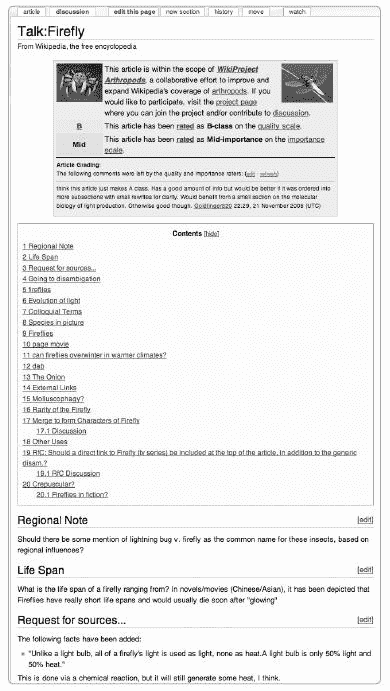
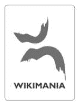

# 第十二章. 社区和沟通

一个庞大、多元且繁荣的志愿者群体制作百科全书文章并管理维基百科。随着时间的推移，维基百科社区的成员已经发展出了相互互动的惯例、管理内容的流程以及最小化干扰和最大化有用工作的政策。

在本章中，我们将讨论在哪里可以找到其他贡献者以及如何就任何主题寻求帮助。我们还将解释社区成员之间相互交流的方式。尽管大多数讨论发生在讨论页面上，但维基百科有一些中心社区论坛，用于辩论网站的重大政策和更具体的问题。我们还将讨论社区的构成。然而，首先，我们将概述维基百科共享文化的各个方面，从关于贡献者之间如何相互作用的核心理念到一些长期争论的要点，再到随着时间的推移出现的友好做法。尽管明确的网站政策涵盖了内容指南和社会规范，但非正式的哲学和实践有助于将维基百科的贡献者社区团结在一起。

# 维基百科的文化

维基百科的社区是自发和有机地成长的——这是一个充满内部玩笑和内部引用的复杂文化的配方。但是，像假设善意和请不要咬新来者这样的*维基方式*的核心原则，从一开始就伴随着社区。

## 到达时的假设

维基百科的编辑们努力对待新编辑友好。假设善意（AGF）是一种基本哲学，也是维基百科的官方指南（快捷方式 WP:AGF）。它可以概括为：除非你有强有力的证据证明相反，你应该始终*假设参与项目的人是在试图帮助它，而不是伤害它*。

假设善意意味着如果某人似乎没有遵循政策，那么假设他或她只是犯了一个错误，而不是故意破坏百科全书；始终给予编辑怀疑的余地。这种认为每个人都希望使百科全书变得更好的假设，导致更多建设性的辩论，并有助于在网站上营造和谐。作为这种态度的一部分，不应使用用户在其他网络论坛或项目中的声誉来反对他或她。

“假定善意”是一个好的起点，但实践起来可能很困难。如果一个编辑一开始似乎是在写关于他自己或他的公司或组织的文章，那么假定这位编辑主要对百科全书工作感兴趣是困难的；在“假定善意”和“利益冲突”之间存在紧张关系。如果一个账户是“单一目的”——也就是说，编辑只在某个小领域进行党派性编辑——那么假定善意就更困难，因为推广性和活动性编辑是不受欢迎的。破坏行为是明显的不诚实行为，通常会导致短暂的封禁。然而，“假定善意”意味着你应该首先通过参与讨论并告知他或她关于政策的信息来试图弄清楚编辑的意图。一个单一目的或破坏性的编辑可能会始终扩大他对项目的贡献。

请不要咬伤新来者（这是另一项指南的名称，简称 WP:BITE），它侧重于对新来者表示欢迎的重要性。显然，这项指南与“假定善意”原则相兼容。它鼓励你在看到新来者犯错时对他们温柔一些。鼓励新来者——你希望他们继续贡献——并教他们关于维基百科的知识。我们曾经都是新手！新编辑对某些政策细节的不了解并不令人惊讶——令人惊讶的倒是能找到一个已经完全掌握所有这些细节的新手。

**同意不同意见**

如果你不同意某人的编辑或行为，但你能看出编辑或行为是从一个合理的立场出发的，那么考虑不要撤销编辑。这真的那么重要吗？不同的编辑可能对百科全书同样有益，而且不是每个决定都应该被视为原则问题。这个网站的这个方面可能是新手难以欣赏的一个方面。因为没有人真正指导维基百科，你应该采取和平的方式，并假定整个社区的理智将占上风；理性的人可以同意不同意见。

## 随机善举

维基百科有一些友好的习俗。其中之一是在新编辑的讨论页面上欢迎他们。当你注意到新贡献者做出的有益编辑时，简单地 saying, "Hello, good work!" 是一种鼓励。许多欢迎者会留下更详细的初始信息，包括帮助页面和更多关于维基百科的信息。`{{welcome}}` 模板，如果留在讨论页面上，就是这类信息的例子；编辑也可以编写他们自己的欢迎信息，就像我们在第九章中做的那样。个人问候是不可替代的。欢迎委员会负责协调新编辑的信息，但每个人都可以帮助完成这项任务；有关更多信息，请参阅[[维基百科：欢迎委员会]]（快捷方式 WP:WC）。

对新用户的非正式指导一直在进行，但同时也存在一个正式的指导项目，称为[[Wikipedia:Adopt-a-User]]（快捷键 WP:ADOPT），涉及数百名维基百科用户。要收养一个新用户，您需要 500 次编辑记录；要注册收养，只需遵循该页面上的说明。

维基百科用户也有互相颁发奖项的习惯。最初且最受欢迎的奖项是 Barnstar（[图 12-1

**图 12-1. 原始维基百科星形徽章**

**星形徽章的起源**

Barnstar（星形徽章）是由 Sunir Shah 在 2003 年创建于 MeatballWiki（参见第二章上的“注册账户”中的自动确认限制，是账户的唯一重大限制。

这些原则有许多持续的影响。例如，尽管多年来许多人建议限制编辑权限仅限于注册用户，但这仍然不太可能发生。（可能发生的是一种“稳定版本”的形式，其中一些编辑版本在审查后才会上线；这一技术发展仍在讨论中。）

## 软安全

你可能不完全相信这一点，尤其是如果你早期就遇到过管理员，但维基百科的安全系统——为保护网站采取的措施——大部分保持在幕后。维基百科的安全是“软”的，这意味着安全主要是反应性的。不良贡献无法完全排除在网站之外，因此清理工作后的人依赖检查贡献和撤销不良更改。

维基百科的一个悖论是，这个系统似乎永远无法正常运作。在一个完全由志愿者运营的开放系统中，为什么不需要更多的限制？一个答案是维基百科以最广泛的方式使用了软安全原则。安全是由社区引导的，而不是在事前限制社区行动。网站上所有活跃的用户都对安全和质量负责。你、你的监视列表以及你对文章中奇怪行为和异常缺陷的警觉性都是安全系统的一部分。

**进一步阅读**

[`en.wikipedia.org/wiki/Wikipedia:Assume_good_faith`](http://en.wikipedia.org/wiki/Wikipedia:Assume_good_faith) 关于假定善意的指南

[`en.wikipedia.org/wiki/Wikipedia:Please_do_not_bite_the_newcomers`](http://en.wikipedia.org/wiki/Wikipedia:Please_do_not_bite_the_newcomers) 关于对新手友好的指南

[`en.wikipedia.org/wiki/Wikipedia:Barnstars`](http://en.wikipedia.org/wiki/Wikipedia:Barnstars) 关于 barnstars 的信息，以及链接到其他奖项页面

[`en.wikipedia.org/wiki/User:Jimbo_Wales/Statement_of_principles`](http://en.wikipedia.org/wiki/User:Jimbo_Wales/Statement_of_principles) 社区原则声明

**对软安全的不同看法**

维基百科上软安全的概念来自 MeatballWiki（在第二章中描述，Chapter 2）。在[`www.usemod.com/cgi-bin/mb.pl?SoftSecurity`](http://www.usemod.com/cgi-bin/mb.pl?SoftSecurity)上，一篇关于这个主题的文章说：

> 软安全就像水。它在攻击下弯曲，却从四面八方涌来填补空隙。随着时间的推移，它变得强大，并能适应任何形状。它寻求影响和鼓励，而不是控制和强制。[…]
> 
> 软安全遵循以下原则：

+   假定善意：人们几乎总是试图帮助；因此，我们应用先信任原则，相信偶尔的恶意会被善意所淹没。

+   同行评审：你的同行可以确保你不会损害系统。

+   宽恕与遗忘：即使心地善良的人也会犯错误。这些错误不需要是永久的。

+   限制损害：当无法预防的错误发生时，将损害控制在可容忍的范围内。

+   公平过程：金和莫博格尼的理论认为，透明和让每个人都有发言权是基本的管理技能。

+   非暴力：不要使用暴力，以免暴力找上你。

## 与其他编辑沟通

所有这些核心社区原则在实践中都依赖于编辑们努力相互沟通。维基百科有多个沟通渠道，比任何一个人都能合理跟踪的论坛还要多。在这里，我们将引导你了解一些沟通的复杂性，包括*在哪里*和*如何*与其他编辑沟通以引起对问题的关注，获取反馈，提问，甚至只是社交聊天。

维基百科有几种类型的页面，编辑们在这些页面上相互沟通：

+   文章讨论页面，用于讨论文章内容

+   用户讨论页面，用于给其他贡献者留下个人信息

+   项目页面和政策页面讨论页面，用于讨论个别政策或流程

+   全项目论坛，用于讨论维基百科、提问或提出一般建议

+   通知板，用于提出有关特定主题的问题或感兴趣的项目

+   用于获取反馈或对特定问题（如删除辩论）进行投票的过程页面

在维基百科本身之外，或 *off-wiki*，讨论发生在 IRC、通过电子邮件列表、在 Meta 网站上（在第 第十七章 中描述），以及面对面聚会期间。许多维基百科编辑也写博客，每年都有数百篇关于维基百科的外部媒体报道。这是一个庞大且持续进行的对话，任何贡献者都可以随时加入。

面对这一系列可能性，最好的做法不是感到害怕，而是稳步地伸出援手。与你在网站上有所接触的人聊天。不要从“稳步”跳到“垃圾邮件”：一次性将类似的消息粘贴到许多页面上是不被鼓励的。保持一般主题相关，保持愉快和尊重的语气，并假定他人是善意的。

### 讨论页面指南

文章的讨论页面，在第 第四章 和 第六章 中介绍，以及用户讨论页面，在第 第十一章 中介绍，是编辑之间相互联系的主要方式。讨论页面惯例是随着时间的推移而发展的；换句话说，维基百科在讨论方面积累了丰富的经验，无论是有益的还是无益的。当你在讨论页面上写作时，某些方法可能适得其反，而其他方法则有助于良好的编辑并营造友好的氛围。保持主题相关非常重要。在维基百科上，你面对的是一个欣赏专注和相关的复杂受众。在所有时候，都要问自己你的贡献是否使百科全书变得更好（在你点击保存之前，而不是之后）。如果不是，可能到了休息一下的时候了。

### 注意

*在所有类型的讨论和辩论中坚持这些惯例，无论是在讨论页面还是其他论坛上，都是一个好主意。记住，你的维基百科形象主要是通过与其他人沟通来构建的*。

注意文章讨论页面的总体结构（图 12-2 中所示“阅读和参与讨论页面”。较老的主题在页面顶部，新主题应在讨论页面底部的新章节中开始。对于现有主题，线程讨论中帖子的顺序应该是按时间顺序的，你应该通常通过在章节底部添加你的评论或回复来加入现有讨论。

**图 12-2. 讨论页面**

讨论页面的首要价值是三个 C：沟通性、文明性和深思熟虑的回答。毕竟，这些原则很可能是你在讨论中希望得到的。对最具争议性的话题保持警惕，例如宗教和政治，在这些话题中对话可能很复杂。对于这些话题，回顾过去的讨论，在加入讨论前感受一下语气。对于大多数文章，你可以简单地开始参与。

现在提供一些详细的建议。

**专注于讨论文章，并将自我表达保留在你的用户页面上。**

保持主题相关，专注于如何修复文章。文章讨论页面不是提供关于文章主题的一般讨论的地方，编辑也不应将其用作表达个人观点或经历的平台。关于其他文章的讨论应指出重复内容、可能的内容导入或导出，或与所讨论文章的合并。避免无关的对话。

**使用讨论页面来讨论事实和来源。**

讨论页面是提出验证相关问题的理想场所。如果你认为一篇文章在某个主张上误导或完全错误，请访问其讨论页面并陈述你的观点。请求帮助找到更好的来源，比较不同来源中的矛盾事实，并批判性地检查参考的可靠性。请求一个可验证的参考来支持可疑的陈述通常比仅仅反对它更好（“你能告诉我还有谁支持那个陈述吗？”而不是“我认为你错了”）。而且提供可靠的、矛盾的参考也不会损害你的论点。

**简短但不要生硬。具体说明你希望看到的变化。**

用更详细的讨论来增强你的编辑摘要。在某些情况下，你可能故意编辑的是讨论页面而不是文章（例如，如果你个人参与了该主题）。如果你是合理的，你可以期待被听到；记住，尖锐可能是适得其反的，而耐心将赢得其他编辑的同情。解释你认为编辑或部分存在的问题，并提出如何修复的建议。即使你处于争论中，通过提供新的草案来推动事情的发展。

**讨论页面具有仓储功能。**

你可以将从文章中移除的内容发布到讨论页面上。这通常是为了验证目的（例如，询问其他编辑他们是否有任何参考资料来支持一个主张）或者详细评论某些问题。这种技术比简单地丢弃别人的工作更为委婉和温和：其含义不如永久删除那么强烈。你也在承认，如果重新编写或在其他地方整合，这些材料可能是有用的。但你不能将受版权保护的材料移动到讨论页面上。如果版权问题迫使文章进行了大量的修剪，请添加一个讨论页面的注释来解释问题，并引用一个来源来证明明显的违规行为。

**保持礼貌，不要进行人身攻击。**

这绝对是基本准则。要合理，尊重他人；毕竟，你是在与他们进行礼貌和专业的对话。以同事的身份行事，而不是对手。从假设别人试图做正确的事情开始，表现出善意。不要侮辱：不要进行*人身攻击*，例如称某人为白痴或法西斯主义者。讨论编辑而不是文章是走错了路。记住，*冷静、公正、建设性、寻求共识*和其他类似的描述（来自他人）在发展你的维基百科声誉方面是纯金；当讨论变得激烈时，尽量体现这些品质。

**避免绝对禁忌。**

不要威胁他人。例如，承诺因为不同意你就禁止某人是不利于解决问题的。提出“你认识的管理员”不是一个好话题。永远不要提出法律威胁：威胁诉讼对维基百科来说是非常破坏性的，几乎从未达到预期的结果。（而且你可能会被禁止。）争端解决更为有效，所以参见第十四章了解更多关于正确渠道的信息。永远不要发布关于他人的个人细节或暗示，或者在网上威胁任何人。那些做这些事情的人将面临无限期的封禁。

**不要删除注释，并且只有在最后不得已的情况下才进行重构讨论。**

每个人都有权在讨论页面上发表自己的意见。不要删除或重写评论，包括你自己的。惯例是让其他人的评论保持原样：甚至不要纠正拼写。如果你希望收回某事，删除它并在其位置插入一个快速的道歉。但如果已经太晚，删除有问题的评论会使其他编辑的评论看起来奇怪，可以使用`<s>`和`</s>`标签删除你的评论。原则上，讨论页面可以被*重构*或总结，以使讨论更清晰。这相对较少见，需要技巧。更好的、肯定更容易的方法是添加一些自己的总结。

**不要排斥新来者。**

人们通常会不赞同的说法是“我们已经决定那个观点了。”新来者有理由重新开启关于文章内容的任何问题。维基百科页面应该是随着时间的推移而不断改进的。学会耐心。如果一个观点已经被讨论过并归档，那么礼貌地引导新来者去查看讨论。如果已经达成共识，花点时间解释它或温和地引用归档的讨论。

**问题用户会随着时间的推移而暴露自己。**

当你第一次回复评论时，无论其是否合理，你实际上并不知道是青少年还是资深教授留下的。部分基于善意假设的做法是不根据一两个评论就对其他编辑进行评判；礼貌永远不会被浪费。避免指责：说“我不同意”而不是“你在这件事上显然有偏见。”

过了一段时间，你可能会得出结论，编辑是一个浪费时间的人，对主题了解不多，或者是一个有书本知识但非常困惑的自学成才者。或者更糟：你可能正在处理一个真正的怪人，一个恶意用户（*破坏者*），或者一个挑衅者（*网络喷子*），他或她可能比你拥有更多的时间。基本建议是保持冷静和礼貌；不要公开假设恶意，但也要更加谨慎；减少你的回应，不要被拖入无休止的、重复的辩论。

**不要喂食网络喷子**

有些人只是寻求关注和争论，到了干扰他人的程度。说法“不要喂食网络喷子”鼓励你忽略这种行为，不要被卷入不必要的争论。参见[`meta.wikimedia.org/wiki/What_is_a_troll?`](http://meta.wikimedia.org/wiki/What_is_a_troll?)。

为了结束这次讨论：最坏的情况是，三个 C（沟通、协作、共识）可能不得不变成三个 P（礼貌、耐心、政策）。政策在与敌对和具有攻击性、有偏见的编辑打交道时尤为重要。学习适当的政策和指南的详细内容，这样你就可以在不被卷入的情况下抵制不良行为。

**那些波浪线签名**

与文章贡献不同，讨论贡献应该签名。使用四个波浪号（~~~~）签名是标准做法，会显示您的用户名和时间戳。使用三个波浪号签名会显示您的用户名但没有时间戳。另一方面，五个波浪号会生成时间戳但没有名字。

### 投票和讨论

> 让每个人都对每件事进行投票是愚蠢的民主。（用户：Eclecticology，2007 年 4 月 10 日，*wiki-en* 邮件列表）

维基百科不是一个民主制度，尽管称其为非民主也可能相当误导。与其他许多在线项目相比，维基百科的多数投票很少，而是通过讨论页和项目页上的讨论来汇集参与者的共识。（尽管维基百科的规模似乎可以证明转向代议制民主而不是直接一人一票的投票是合理的，但这并没有发生——个人参与者仍然被期望发表意见。）

[[维基百科:请求评论]]（快捷键 WP:RfC）的结构很典型。在维基百科的术语中，RfC 是一个紧密定义但开放的论坛讨论，针对三个领域中的一个问题：内容、编辑行为或政策。其他编辑被邀请参与讨论并就正确的解决方案提出意见。除了在 RfC 中使用外，投票在删除辩论和管理员晋升讨论中也很常见。

然而，这些投票并不简单。在维基百科的几乎所有讨论中，都比人数支持某个特定立场的人数更重视每条评论背后的理由。为了增加任何讨论，用公开的事实支持您的评论。假设您参与了一个关于二元决定的辩论：是/否或保留/删除。不要只是说，“我喜欢它/讨厌它”，而应该提供一个有理有据的意见，说明您为什么这样感觉。清楚地指出哪些网站政策和其他因素影响了您的意见，从而得出结论；如果您同意另一位贡献者已经说过的话，请明确指出。

这里是一个完整的评论，记录在一个关于高度争议性文章的删除辩论中，[[美国犯下的国家恐怖主义指控]]。这里的辩论是是否保留这篇文章，评论来自认为文章应该保留的人：

> 强制保留 - 自上次六次 Afds 以来有什么变化？好好看看，你会发现参考文献现在有了极大的改进，内容自上次 Afds 以来已经显著扩展和改进。内容引用的是现在相当大的学术和人权文献，包括对美国州级恐怖主义的描述或支持假设的深入考察。请参阅参考文献部分，其中包括来自耶鲁大学、普林斯顿大学、麻省理工学院、哥伦比亚大学和香港大学的教授等人的贡献。如果您需要更多证据表明这是一个严肃的学术关注，构成一个重要的替代话语，尽管不是主流，那么我很乐意提供一个长长的学术参考文献列表。BernardL（讨论）00:13，2007 年 12 月 18 日（UTC）

当然，并不是每个人都这样长期参与。但请注意，评论如何正确地关注可靠引用作为支持知名度和可验证性的方式。评论者使用的框架是基本内容政策，而不是文章讨论的主题，提出的观点是正确地针对现有材料来支持此类文章的。

### 在维基百科上的论坛

村庄水龙头([[Wikipedia:Village pump]]，快捷方式 WP:PUMP)是维基百科上的主要社区讨论场所——水冷却器和市政会议合二为一。帖子分为五个部分：政策、技术、提案、协助和杂项。活跃的讨论线程在这里进行；您还会找到指向诸如[[Wikipedia:Department directory]]（快捷方式 WP:DEPT）等页面的链接，该页面通过部门向您展示维基百科的视图。

社区门户是进入维基百科社交生活的另一个入口点。位于[[Wikipedia:Community Portal]]，它提供了一个社区公告板用于公告。这提供了一种与维基百科活动交互的不同方式；例如，它直接链接到[[Template:RFCsci list]]，这是一个要求社区输入的科学文章讨论更新列表（换句话说，就是您的输入）。这是一个发布新提案、请求帮助的主题和新的项目公告的地方。

进一步的讨论广泛分布，附在维基百科的“讨论”命名空间中的项目讨论页面上，以及在其他讨论页面上（例如特定模板或类别的讨论页面）。关于网站管理方面的论坛，如果不专门针对特定流程，则习惯上称为*公告板*；最著名的是位于[[Wikipedia:Administrators' noticeboard]]（快捷方式 WP:AN）的管理员公告板。您可以在那里发布关于管理员可以协助解决的问题的通知。

### 提问和解决问题

如何获得帮助？以下是一些关于在哪里提问或提出关注的问题的提示。

首先，前往帮助台([[Wikipedia:Help desk]], 快捷键 WP:HD)，这是询问使用维基百科问题的完美地方。帮助台每天处理几十个查询——任何了解该网站的人都可以提供帮助。你需要回来查看你的问题是否得到了回答。

你也可能发现维基百科的常见问题解答页面很有帮助；请参阅[[Wikipedia:FAQ]]（快捷键 WP:FAQ）。你还可以在那里找到其他有用的链接，例如，一个链接到基本教程。

维基百科还有一个参考台([[Wikipedia:Reference desk]], 快捷键 WP:RD)。正如其名所示，它就像图书馆参考台一样运作。在这里，你可以就任何主题提出事实性问题，维基百科的编辑们会尽力回答。服务按广泛的主题领域划分；例如，人文参考台每天回答大约十个问题。同样，任何人都可以提供帮助，如果你对某个主题有知识，请随时回答问题。

最后，维基百科有一个中心页面，[[Wikipedia:Questions]]（快捷键 WP:Q），它链接到这些页面以及许多其他专门用于解答问题的页面。例如，从这里你可以链接到[[Help:Contents]]，这是帮助页面和文档的中心门户。

### 注意

*你可以在[[Wikipedia:Unusual requests]]上了解一些多年来提出的非同寻常的请求*。

如果你有一个问题而不是疑问，考虑从[[Wikipedia:Problems FAQ]]开始。你的问题是不是与阅读或编辑维基百科页面有关？[[Wikipedia:Troubleshooting]]可能会有所帮助。这些页面处理技术问题。

对于特定领域的问题，维基百科有一些专门的地方你可以寻求帮助。如果你的版权被维基百科上发布的某些内容侵犯了，[[Wikipedia:Contact us/Article problem/Copyright]]列出了你的选项。如果你想提出正式的投诉，请前往[[Wikipedia:Designated agent]]。如果你认为维基百科上的传记或其他文章诽谤了你，请前往[[Wikipedia:Biographies of living persons/Noticeboard]]，在那里你可以为将努力解决问题的编辑留下评论，以及/或[[Wikipedia:Libel]]，它有一个电子邮件联系方式。

对于其他与内容相关的问题，请在文章的讨论页面上参与讨论，并以合理、非对抗性的语气参与辩论。你有完美的权利在那里，但请记住，其他人也会有他们自己的观点。

与其他编辑有纠纷？在他的或她的用户讨论页面上留下文明的通知。在问题升级的情况下，你可以尝试管理员公告板，并选择最适合问题的链接，如破坏或页面保护请求。

如果您被封锁，特别是，请注意维基百科会从*封锁审查*的角度考虑这种情况，也称为*申诉封锁*，而不是将其视为维基百科本身的问题。如果您觉得您被管理员错误或不合理地封锁，请前往[`lists.wikimedia.org/mailman/listinfo/unblock-en-l`](http://lists.wikimedia.org/mailman/listinfo/unblock-en-l) 进行解锁讨论。您可以在第十四章中找到更多关于要做什么（以及更重要的是，不要做什么）的详细信息。

对于更复杂的问题，或者如果您不确定您遇到的是否合适，您可以在[[维基百科：村庄泵（协助）]]（快捷键 WP:VPA）上发表评论，这是一个可以寻求帮助的一般论坛。您还可以使用邮件列表或 IRC 频道，如“邮件列表和互联网中继聊天”中所述。邮件列表和互联网中继聊天。尽量找到一个与问题相匹配的列表或频道。

**进一步阅读**

与他人沟通

[维基百科：讨论页指南](http://en.wikipedia.org/wiki/Wikipedia:Talk_page_guidelines) 有效使用讨论页的指南

获取帮助

[维基百科：帮助台](http://en.wikipedia.org/wiki/Wikipedia:Help_desk) 您可以在此页面上询问有关维基百科的问题

[维基百科：参考台](http://en.wikipedia.org/wiki/Wikipedia:Reference_desk) 您可以在此页面上询问任何主题的问题

[维基百科：问题](http://en.wikipedia.org/wiki/Wikipedia:Questions) 您可以在此页面上提问或发表评论

社区论坛

[维基百科：社区门户](http://en.wikipedia.org/wiki/Wikipedia:Community_Portal) 社区门户，用于获取维基百科活动新闻和寻找参与的协作

[维基百科：村庄泵](http://en.wikipedia.org/wiki/Wikipedia:Village_pump) 您可以在此页面上提出建议或进行一般性讨论

[维基百科：公告板分类](http://en.wikipedia.org/wiki/Category:Wikipedia_noticeboards) 报告不同类型问题的各种公告板

[维基百科：管理员公告板](http://en.wikipedia.org/wiki/Wikipedia:Administrators'_noticeboard) 用于吸引管理员注意问题（任何人都可以在此发表）

### 获取新闻

您可能想知道维基百科上目前正在发生什么。[[[维基百科：新闻分类]]](Category:Wikipedia_news) 是您获取包含新闻内容的维基百科页面的第一个来源。例如 [[维基百科：公告]]（快捷键 WP:ANN）涉及里程碑和基金会事务。

维基百科有几个项目为社区带来了更广泛范围的新闻。在英语维基百科上，有一个已建立的新闻服务叫做 *维基百科快报* (图 12-3). *快报* 是在 [[维基百科:快报]] (快捷方式 WP:POST) 现场制作的每周通讯。

自 2005 年以来，*快报* 一直报道对维基百科社区感兴趣的故事。你可以查看所有存档；这是了解维基百科历史的快捷方式。每期通讯都包含一些经常出现的部分，例如本周技术发展的回顾和当前仲裁案例的简要总结。通讯是由用户：Michael Snow 创办的，现在由用户：Ral315 编辑，并有来自各种编辑的贡献。任何人都可以通过编辑 WP:POST/TIPS 参与其中，在那里你还可以学习如何记录维基百科的媒体报道。

WikiProject WikipediaWeekly (快捷方式 WP:WEEKLY)，自 2006 年底开始活跃，专注于制作关于维基百科的播客。与 *快报* 一样，你还可以将 WikipediaWeekly 发送到你的用户页面或用户讨论页面。如果你喜欢 RSS 源，每周播客有一个。另一个选择是名为 NotTheWikipediaWeekly ([[维基百科:NotTheWikipediaWeekly]]) 的播客，它也制作关于维基百科的播客节目。

另一个这样的项目是 *Wikizine*，于 2006 年开始，由荷兰语和英语维基百科的用户：Walter 编辑。这份通讯通过电子邮件发送给订阅者。它涵盖了关于国际项目和社区的新闻，重点关注技术问题和基金会层面的讨论。在 [`en.wikizine.org/`](http://en.wikizine.org/) 注册或阅读最新一期。

**图 12-3. 维基百科快报，每周现场通讯**

### 邮件列表和互联网中继聊天

使用了多种多样的邮件列表来讨论维基百科项目。*wiki-en* 列表，用于讨论英语维基百科的一般问题，是一个非常高流量的列表；如果你有具体的问题，可能更适合在维基百科上的一个更专业的论坛中提问。更多信息请见 [[维基百科:邮件列表]] (快捷方式 WP:MAIL)；这些列表通常只有轻微的监管，并且公开存档，所以你在上面说的话可能会通过互联网搜索被访问。

维基百科也使用了许多 IRC 频道。*互联网中继聊天*，或简称*IRC*，是一种实时互联网聊天方式，旨在用于群组通信，但也允许一对一聊天或私密消息。要访问 IRC，你需要一个 IRC 客户端。这些程序几乎适用于所有 PC 平台。Mozilla Firefox 浏览器的 Chatzilla 客户端作为一个浏览器扩展运行，无需额外软件，使用和安装都很方便。^([25])

更多技术信息、与维基百科相关的频道完整列表以及分类在维基媒体下的链接，请参阅[[Wikipedia:IRC channels]]（快捷方式 WP:IRC）。维基媒体项目使用 Freenode 网络，这是一个专门为开源项目设计的网络。

与英语维基百科最相关的频道包括：

+   *#wikipedia*，作为一般维基百科讨论频道，臭名昭著地几乎总是离题。这是一个社交的好地方，但可能不适合胆小的人。

+   *#wikipedia-en* 的人较少，更专注于英语维基百科。

+   *#wikipedia-en-help* 是一个帮助频道。

+   *#wikimedia* 讨论与维基媒体基金会整体相关的问题。

### 线下聚会和会议

要举办线下聚会，只需在维基百科上宣布，然后召集一群当地编辑一起喝咖啡、饮料或吃饭。第一次聚会是在 2004 年的伦敦，当时吉米·威尔士和一群国际编辑下午聚在一起。令人惊讶的是，除了拉里·桑格之外，威尔士在维基百科存在的头三年半中，没有见过任何亲自在该网站上工作的编辑。作为互联网时代的真正产物，维基百科几乎完全是由那些仅通过邮件列表、维基讨论页面和 IRC 相互认识的人组成的。

然而，自 2004 年以来，从上海到西雅图等数十个城市已经举办了数百场聚会。它们通常是非正式的，但形式从纽约中央公园的野餐到正式的演讲都有。聚会是结识其他热心的维基编辑的好方法。

Meetups 页面（快捷方式 WP:MEET）列出了当前和过去的聚会；如果在你所在地区还没有，你可以从 Meetups 页面创建一个关于你所在城市的子页面，然后通过在他们的用户讨论页面上留下笔记来招募你所在地区的人。浏览[[Category:Wikipedians by location]]及其子类别将帮助你找到自称为特定地区的人。吉米·威尔士继续旅行以会见维基百科编辑；一部纪录片电影《数字真相：维基百科的故事》，将于 2009 年上映，其中包括他旅行的片段。

第一个年度维基媒体基金会会议，称为维基曼尼亚，由几个维基媒体项目的志愿者组织，并于 2005 年在德国法兰克福举行。这是一个重要的国际活动，吸引了来自 50 多个国家的 300 多人，受到了大量的媒体报道。法兰克福设定了一个趋势，包括关于维基和维基媒体项目的学术论文，来自各个社区关于不同姐妹项目成功的报告，以及关于未来工作的提案和社区讨论。

维基曼尼亚现在已成为一个年度活动（图 12-4"）展示了会议标志）。2006 年维基曼尼亚在位于美国马萨诸塞州剑桥的哈佛法学院校园举行。2007 年，会议在台北，台湾举行，当地社区在一个青年中心举办了会议；两次会议都吸引了来自世界各地的数百人。

这些会议（2008 年在埃及亚历山大，新亚历山大图书馆举行，2009 年在布宜诺斯艾利斯举行），像大多数维基媒体活动一样，由来自世界各地的志愿者团队组织。当地社区争取举办会议的机会，向基于基金会的一组评审团队提交包括地点和可能的赞助的提案。大部分的组织工作都在网上进行，在 IRC 和 Meta 网站上的特殊维基页面上，并结合了维基媒体基金会和领导规划过程的当地志愿者的努力。

**图 12-4. 维基曼尼亚标志（由本·耶茨设计**）

**进一步阅读**

获取新闻

[`en.wikipedia.org/wiki/Wikipedia:Wikipedia_Signpost`](http://en.wikipedia.org/wiki/Wikipedia:Wikipedia_Signpost) 《维基百科信使》每周社区报纸

[`en.wikipedia.org/wiki/Wikipedia:WikipediaWeekly`](http://en.wikipedia.org/wiki/Wikipedia:WikipediaWeekly) 维基百科每周播客

[`www.wikizine.org/`](http://www.wikizine.org/) 《维基杂志》通讯（英文、西班牙文和德文）

邮件列表和 IRC

[`meta.wikimedia.org/wiki/Mailing_lists`](http://meta.wikimedia.org/wiki/Mailing_lists) 关于邮件列表及其存档的详细信息

[`meta.wikimedia.org/wiki/IRC`](http://meta.wikimedia.org/wiki/IRC) 关于维基媒体 IRC 频道的详细信息

[`www.nabble.com/Wikipedia-f14018.html`](http://www.nabble.com/Wikipedia-f14018.html) 在 Nabble 上的列表电子邮件存档（提供类似论坛的视图，对于高流量列表更容易阅读）

聚会

[`en.wikipedia.org/wiki/Wikipedia:Meetup`](http://en.wikipedia.org/wiki/Wikipedia:Meetup) 协调聚会的页面，包括过去聚会的列表以及图片

[`wikimania.org/`](http://wikimania.org/) 关于年度维基曼尼亚会议的信息（将重定向到当年的网站）

[`meta.wikimedia.org/wiki/Wikimania`](http://meta.wikimedia.org/wiki/Wikimania) 协调会议计划的 Meta 页面

## 维基哲学

搜索*维基哲学*，你会得到几百个来自个人用户的链接，他们已经写下了他们个人的维基百科方法。主题包括如何在维基上协作工作，如何在维基百科上高效工作，以及为什么你应该做出贡献。其中一些哲学，如假设善意，已经发展成为指南和文化的核心部分；其他，如包含主义与删除主义，已经成为长期存在的哲学辩论。

在维基百科上，从长远来看，最具争议的问题最终与内容政策相关。这是幸运的，因为辩论百科内容的原则直接关系到网站的使命。我们已经看到了这个辩论的两个主要方面：学术权威和主流科学的状态在第二章[hw-wkpd-wk_03.html "第二章。世界获得了一个免费的百科全书"]中有所涉及，而关于[[Mzoli's Meats]]的删除辩论中的利益冲突在第十章[hw-wkpd-wk_12.html "第十章。文章的生命周期"]中有所讨论。尽管核心内容政策尚未通过新的主要原则得到扩展，但关于如何将那些原则应用于个别文章的激烈讨论仍在继续，有时这些辩论会被媒体拾起。^([26])

关于哪些文章应该被包含的争论已被证明是最基本且最持久的争论之一。*包含主义*是一种哲学，即应尽可能保留提交给网站的大部分材料。基本的包含主义立场是这样的：*维基百科不是纸张*，这意味着维基百科可以保留文章，即使它们目前的状态需要改进或验证，因此编辑应努力帮助网站尽可能扩大规模。反对包含主义者的人被标记为*删除主义者*，他们认为一篇文章在被包含之前应该处于合理的形状，并且关于一个明显值得注意的主题；有疑问的材料应该更严格地删除。当然，双方都同意，一些新的文章和内容将需要被删除；问题是关于哪些文章以及在什么情况下。正如第七章所示，一些删除争论证明是有争议的，特别是对于新术语或思想。

与此密切相关的是一种方法论问题——*渐进主义*与*即时主义*。*渐进主义*，即如果你让事情存在足够长的时间，它们最终会变得更好，似乎最能体现 wiki 精神，即事情是随着人们有空去做它们而完成的。然而，许多人认为这种做法需要针对某些主题进行修改，例如对于在世人物的传记，任何需要的行动都应被视为紧急的，并应立即作为一个道德问题执行。

包容主义与删除主义、渐进主义与即时主义之间的辩论在过去的几年中多次以各种形式爆发。这场辩论不仅对维基百科包含的内容有影响，还涉及了内容的创建和工作方式。最初，这场辩论表现为维基百科与较老的 wiki 传统区分自己的方式。一般来说，wiki 只是简单地收集意见，而维基百科旨在建立一个事实性参考资源，使用关于什么是和什么不是百科全书式的概念。可验证性的概念变得越来越重要，最初作为一个标准，然后作为一个政策，现在社区接受不可验证的材料可能被删除。

然后，在一段时间内，注意力转向了可验证性的影响，例如关于可靠来源指南的辩论。随着时间的推移，渐进主义的中间道路在这场辩论中获胜，至少在实践中是这样——文章总是需要清理，删除真正无法验证的材料只是推动质量的一个方面。

到了 2007 年，由于文章的净增长似乎已经达到顶峰（尽管外界人士越来越多地通过撰写关于自己和他们的企业来推广维基百科），注意力又回到了删除主义。尽管删除主义倾向于为新文章接受明确的相对严格的标准，这些标准正在被越来越多地采用，但包容主义和新文章应给予机会的观点也继续是主要力量。无论如何，包容主义观点认为所有过程都应该逐案操作，而不是确定是否应该包含广泛的主题领域，这一观点仍然占主导地位，尽管这一观点受到极大的争议，尤其是在流行文化领域。

无尽的变体和立场占据了中间地带。参见 [[分类:按维基百科哲学划分的维基百科用户]]，大约有 30 个这样的类别。维基百科也有一些重要的混合立场。例如，最终主义-删除主义立场认为，随着时间的推移真正没有改进的文章被删除并不是很大的损失，如果一家初创公司或新想法繁荣发展，那么关于它的文章最终会被接受。即时主义-包含主义立场认为，如果一个新主题的文章被删除，而实际上没有必要删除，那么维基百科的覆盖范围就会受到影响。^([27]) 随着维基百科现在试图成为一个参考网站和寻找最新信息的首选之地，这场辩论将继续下去。

## 有趣的商业

愚蠢、糟糕的笑话和共享的幽默在维基百科文化中占有一席之地。你会在许多项目页面上找到（据说）幽默的材料，其中一些梗会溢入看似严肃的辩论中。

[[分类:维基百科幽默]] (快捷方式 WP:HUMOR) 是一些这些搞笑页面的集合。模板 `{{humor}}` 也用于搞笑的项目页面，因此你可以使用查看链接到 [[模板:Humor]] 的反向链接技巧来找到更多页面，这些页面来自维基百科历史的各个时期。许多幽默的项目页面都在取笑维基百科用户过度行为。例如，“最糟糕的编辑战”集合（快捷方式 WP:LAME）纪念了那些经常围绕微小细节发生的史诗般的战斗。尽管有趣，这个页面也作为维基百科历史、文化引用和可能引发争议的细节的极好介绍。

**平淡无奇或无趣**

查尔斯曾经问过 [[The Cantos]] 的主要作者，一篇关于埃兹拉·庞德诗歌杰作的文章，他是否打算添加一个剧透警告。这被正确地当作一个玩笑。但建议将 [[0.9999…]] 重定向到 [[1 (number)]] 以避免争论，这让一些人误以为查尔斯是认真的。

两个经典的搞笑梗是 BJAODN，意思是“糟糕的笑话和其他被删除的无聊内容”，这是一系列幽默的破坏行为，最终在 2007 年（现在在 WP:SILLY 上被纪念）引发了大量争议，以及 TINC。TINC 代表 *There Is No Cabal*——一个从 UseNet 文化延续下来的长期笑话。这个笑话实际上是在那些相信一个秘密的、小型的、专门的团体控制维基百科的人身上。

维基百科是一个足够多样化的地方，如果一个笑话依赖于共享的文化参考或技术专业，那么这个俏皮话可能会失效。大多数俚语短语和网络方言都会让某些人感到困惑。许多贡献者不是母语为英语的人，当然，即使在那些是母语为英语的人中，也不是每个人都拥有相似背景。

反语、讽刺和冷幽默在网上特别难以传达，可能会引起冒犯。尽管添加一个笑脸可以帮助人们看出你在开玩笑，但如果你必须用表情符号来标记幽默以传达它，你可能需要考虑这个笑话实际上有多有趣。同样，如果你对某件事感到困惑，看起来很荒谬，在愤怒之前，问问自己对方是否在开玩笑。使用幽默的目的是始终让合作更加有趣。[[Wikipedia:Department of fun]]是一个长期运行的维基项目，旨在帮助做到这一点。

**Uncyclopedia**

虽然大多数维基百科幽默都集中在长期流行的梗上，但要真正模仿该网站，试试 Uncyclopedia。尽管它不是一个维基媒体项目，但 Uncyclopedia 在精神上是一个姐妹项目——也就是说，如果你的姐妹是那种无情地取笑你的人。Uncyclopedia 还拥有自己的姐妹项目——一个词典、*unbooks*和新闻部分（*UnNews*），其中经常讽刺现实新闻中的事件。表面上由神秘的 Uncyclomedia 基金会运营，实际上该网站由 Wikia 托管。尽管其非政策是*如何幽默而不只是愚蠢*，但维基百科内部笑话层出不穷，许多维基百科编辑在 Uncyclopedia 兼职。吉祥物是一个名叫 Sophia 的土豆，它看起来非常像一个变形的维基百科标志，配有拼图块；Uncyclopedia 告诉我们，它实际上是一个*untato*——技术上是一个连接到 Uncyclomedia 服务器的脑，这些服务器为所有 Uncyclomedia 项目提供动力。请参阅[`uncyclopedia.org/`](http://uncyclopedia.org/)。

**"重金属元音"**

关于[[重金属元音]]的文章——例如 Mötley Crüe 和 Motörhead 这样的重金属乐队名称中的元音——有着悠久而传奇的历史，使其成为著名的“不寻常文章”。该文章始于 2003 年，由一位匿名编辑发起，文章曾被报道、被媒体引用、印在 T 恤上，并且是乔恩·乌德尔描述协作编辑过程的一段短视频的主题；请参阅[`weblog.infoworld.com/udell/gems/umlaut.html`](http://weblog.infoworld.com/udell/gems/umlaut.html)。

来自外部来源对维基百科的幽默嘲讽，包括斯蒂芬·科尔特尔的友好玩笑，可以在[[Wikipedia in culture]]中追踪，该部分还包括对维基百科的更多流行文化引用。

尽管声称幽默的材料应该只出现在项目命名空间中，但有些文章既有趣又真实：例如，[[Tarquin Fin-tim-lin-bin-whin-bim-lim-bus-stop-F'tang-F'tang-Olé-Biscuitbarrel]]是 1981 年英国一个地区选举中一位政治候选人的化名；他注册在[[Official Monster Raving Loony Party]]。维基百科收集了一些这些更奇特（不，古怪）的文章在[[Wikipedia:Unusual articles]]（快捷键 WP:ODD）。

**进一步阅读**

维基哲学

[`meta.wikimedia.org/wiki/Deletionism`](http://meta.wikimedia.org/wiki/Deletionism) 关于删除主义的解释

[`meta.wikimedia.org/wiki/Inclusionism`](http://meta.wikimedia.org/wiki/Inclusionism) 关于包容主义的解释

[`meta.wikimedia.org/wiki/Conflicting_Wikipedia_philosophies`](http://meta.wikimedia.org/wiki/Conflicting_Wikipedia_philosophies) 更多关于维基哲学的信息

幽默

[`en.wikipedia.org/wiki/Wikipedia:Silly_things`](http://en.wikipedia.org/wiki/Wikipedia:Silly_things) 一系列愚蠢的破坏行为（之前称为 Bad Jokes and Other Deleted Nonsense）

[`en.wikipedia.org/wiki/Category:Wikipedia_humor`](http://en.wikipedia.org/wiki/Category:Wikipedia_humor) 一系列幽默或讽刺的项目页面

[`uncyclopedia.org/`](http://uncyclopedia.org/) Uncyclopedia 网站

经典的奇特维基百科文章是[[Exploding whale]]。还可以查看[[Undecimber]]，即一年中的第十三个月；[[ETAOIN SHRDLU]]；[[colors of noise]]；以及许多其他文章。每年都会选出一些这样的文章在愚人节的主页上展示。这是一个精心设计的玩笑，以那些认为维基百科会故意愚弄他们的人为代价。

* * *

^([25]) 如果你已经安装了 Firefox，你可以在[`addons.mozilla.org/en-US/firefox/addon/16`](https://addons.mozilla.org/en-US/firefox/addon/16)下载并安装 Chatzilla。

^([26]) 例如，小说家尼古拉斯·贝克公开表示自己是包容主义者，他感兴趣的是尝试拯救一篇关于因饮用胶体银而脸色变蓝的个人的文章。参见《卫报》2008 年 4 月 10 日的文章“How I Fell in Love with Wikipedia,” [`www.guardian.co.uk/technology/2008/apr/10/wikipedia.internet`](http://www.guardian.co.uk/technology/2008/apr/10/wikipedia.internet)。

^([27]) 这一点被记者和维基百科编辑安德鲁·李有力地论证，他专注于 Pownce 这个互联网初创公司的文章被删除的案例。参见《每日电讯报》2007 年 10 月 11 日的文章“Wikipedia: an Online Encyclopedia Torn Apart,” [`www.telegraph.co.uk/connected/main.jhtml?xml=/connected/2007/10/11/dlwiki11.xml`](http://www.telegraph.co.uk/connected/main.jhtml?xml=/connected/2007/10/11/dlwiki11.xml)，该文过分夸大了李的观点；参见[`www.andrewlih.com/blog/2007/10/10/telegraph-uk-on-wikipedia-inclusionismdeletionism/`](http://www.andrewlih.com/blog/2007/10/10/telegraph-uk-on-wikipedia-inclusionismdeletionism/)以了解李的进一步评论。

# 谁在写这东西呢？

谁在编写维基百科？维基百科社区的成员是谁？没有人能确切回答这个问题，维基百科在它的社会方面没有单一的参考点。

一种简单但当然不充分的方法是询问有多少工作实际上与英语维基百科相关。嗯，工作量相当于 1,000 名全职人员。或者可能更像是 5,000 人每周工作一天，甚至更像是那些 5,000 人每周投入 8 小时的空闲时间。维基百科有劳动分工，因为人们会趋向于他们喜欢的工作，但几乎没有等级制度。

认为维基百科有一个社区是错误的，提到“社区”有些令人困惑。社区是谁？毕竟，项目的工作包括开发软件、撰写文章和照顾管理一个公开可编辑网站的实际事务。社区是那些积极向一般邮件列表贡献或挂在 IRC 上的人吗？关心和关注政策页面或在村泵上发表观点的人？你是在想你在特定 WikiProject 遇到的贡献者吗？那些喜欢参加聚会和会议，与其他维基百科用户见面的人？或者是那些与基金会层面的治理有关的人，他们可能帮助整体运行网站，但不再编辑文章？

当然，答案是这些人都是维基百科社区的一部分。社会复杂性的程度，加上网站的大规模，可能破坏了基于之前在线群体讨论的所有假设。

## 人口统计

> 维基百科——也被称为失业博士死亡赛（用户：Finlay McWalter）

维基百科的编辑可以是任何能够证明自己有撰写和升级百科文章才能的招募者。其他因素并不重要。贡献者的匿名性是可以接受的，在很大程度上是因为你的身份或你之前的背景不应该对你的贡献被接受有任何影响，只要你尊重内容政策。无论你是青少年还是享有终身职位的博士，这都不重要：在维基百科上，没有人需要知道你是一位医生。

**古德温的九点**

1.  使用促进良好讨论的软件。

1.  不要对帖子长度设定限制。

1.  在你的系统中优先考虑健谈、多样化的群体。

1.  让用户解决他们自己的纠纷。

1.  提供机构记忆。

1.  促进连续性。

1.  成为特定兴趣小组的东道主。

1.  为儿童提供场所。

1.  最重要的是：向用户展示危机。

这九点关于促进成功在线社区的建议于 1994 年 6 月发表在《Wired》杂志上，由迈克·古德温撰写。古德温是互联网上著名的名字，因为[[古德温定律]]和其他许多与电子前沿基金会相关的重大成就。2007 年，他成为维基媒体基金会的法律顾问。

看到维基百科在这些点上实际失败的地方是困难的。在第 7 点上，维基百科接待了成千上万对某个主题极度感兴趣的人。年轻贡献者在维基百科上是受欢迎的：例如，他们在选举中被赋予权利，因为投票没有年龄要求。没有人能确定维基人的中位年龄，但维基百科的读者，这可能与普通大学生的年龄相对应。

关于危机的第 9 点可能会让阅读邮件列表的人露出苦笑。维基百科什么时候没有危机？讨论线程什么时候没有谈论即将到来的灾难？从某种意义上说，Nupedia 向维基百科的转变，以及内容批准机制的破坏，是一场具有持续影响的创始危机。

由于在注册过程中没有收集任何个人数据，关于贡献者人口统计的假设和信息大多基于轶事。尽管许多编辑选择在他们的用户页面或另一个论坛（例如他们从事的工作或他们的真实姓名）公开部分身份，但许多人并没有这样做。聚会提供了一些信息，但这是一个自我选择的群体。德语维基百科，其语气明显更学术，提供了一些调查结果，表明编辑的中位年龄在 20 年代末。

从英语维基百科中可以清楚地看出，母语为英语的人并不一定占主导地位。维基百科有许多编辑，他们的英语是第二语言，他们历史上在建设网站方面发挥了重要作用。有些人用两种或更多语言编辑维基百科。参见第十五章了解更多信息。

## 系统性偏见

如果你纯粹将维基百科视为百科全书，它对时事和流行文化的覆盖可能似乎不成比例。例如，大约一半的传记都是关于活着的人：大量精力被投入到提升这 20 万个文章中，因为现实生活中的真实生活可能会受到维基百科上可用内容的影响。但关于古董、晦涩但学术的，以及英语世界不太知名的话题呢？

*系统性偏见*是维基百科用来描述这样一个概念：知名度和文章覆盖范围的广度都反映了编辑社区及其人口统计特征。确实，维基百科的覆盖范围偏向于与英语国家相关的主题。例如，关于发展中国家的人和地点的文章，与关于北美和欧洲地理和人物的文章相比，常常缺失或不完整。与女性相关的主题（如著名女性的传记或关于女权主义的文章）以及关于蓝领职业的文章代表性不足。这是一个已知的问题，但不是通过政策轻易解决的问题。（术语*系统性偏见*不要与*系统性偏差*混淆，后者是中立观点原则的一种违反，即某一篇文章或一组文章是一面的。）

在维基百科上繁荣发展的文章，一般来说，是那些在创建时可以立即从现有文章中链接到的，并且吸引编辑（除了初始作者）参与相同的一般领域。这些积极因素也可以从另一个角度来理解：如果一个领域在维基百科上被忽视，新文章的生命周期（第十章])

**女性与维基媒体**

在维基百科中，参与的人是否比女性多？来自面对面聚会、邮件列表和其他社区论坛的证据确实表明，维基百科的参与者中男性比女性多，但确定这一点是不可能的。这种偏见在互联网和计算机领域并不罕见，但对于一个旨在欢迎所有人的项目来说，这绝对不是理想的。

虽然基于个人特征（包括性别）的歧视显然违反了维基百科的原则，但有些人认为该网站的文化过于激进，这种批评确实取决于你从哪里寻找证据。维基百科是否做了足够的事情来控制那些在辩论中考虑性别，甚至可能以骚扰女性编辑等更有害的方式行事的反女权编辑？其他人认为，鉴于维基百科的实践和关于包容性的基本价值观，在项目中不存在与性别特别相关的问题。这个话题仍然是具有争议性的，而且没有哪个编辑的经验可能与另一个人的完全相同，这始终是定义系统性问题的困难之一。

关于维基百科上女性待遇（以及如何改进）的这场辩论导致了 2007 年 WikiChix 项目的创建（[`wikichix.org/`](http://wikichix.org/)）。*WikiChix*模仿了类似的 LinuxChix 小组，提供了一个仅限女性的环境来讨论维基和维基媒体项目，并探讨使项目更易于女性使用和友好的方法。在基金会层面，几位女性当选为维基媒体基金会的董事会成员。其中包括（截至 2008 年初）组织的现任主席，弗洛伦斯·德沃瓦尔德。

尽管如此，并非一切都笼罩在阴霾之中，因为维基百科确实逐渐克服了一些这些限制。为需要工作的较弱领域创建了个人维基项目（例如[[Wikipedia:WikiProject Gender Studies]]），并且维基百科吸引了一些学术专家和其他人，他们稳定地工作，填补了覆盖范围的空白。在被人忽视的领域工作同样可以是有回报的，因为这里有更多机会创造新的文章。

## 维基百科上的维基人

维基百科的维基人喜欢撰写关于维基百科的文章。这一点在大量关于该网站的论文中得到了体现，这些论文既发布在用户讨论页面上，也发布在项目页面上。这些文章可能是快乐的、悲伤的、批评性的，通常很有趣，它们是关于该网站、其人员及其治理的见解的拼贴。一篇文章可能旨在影响网站政策或人们的行为方式，或者仅仅是自我表达，为网站文化增添的一小部分。许多文章最终在讨论中被其他编辑引用，甚至有些文章最终成为指南或政策。

这里是从我们最喜欢的几篇论文中选取的一些摘录。其中一些与本书其他地方提到的观点相联系，而另一些则关注维基百科引人深思的方面，我们并未进一步探讨。

> 高比例的维基百科用户都有与权威问题。这就是为什么许多人最初被维基百科吸引。如果你成为管理员，请记住这一点，因为你可能无意中成为了这些人最痛恨的东西；无论你做得有多好，他们都会找到你的一个错误并以此攻击你。最好是接受这种人口统计数据所呈现的现实。他们通常是最好的编辑，只要维基百科对所有用户开放，这种情况就会持续下去。（来自[[用户:Antandrus/对维基百科行为的观察]], 快捷方式 WP:OWB）
> 
> 维基百科是太空时代的康宁玻璃，不是陶瓷，即使你把它摔下来也不会破碎。不要让你的恐惧破坏事物阻止你编辑。（来自[[维基百科:Can't break it]])
> 
> 在许多方面，维基百科可以是一个错综复杂的政策、指南、风格规范、格式技巧和论文的混合体。对于新编辑来说，基本上不可能了解或预测大多数这些内容，即使是经验丰富的编辑偶尔也会违反政策或指南。当这种情况发生时，这并不一定意味着编辑行为不当或失去了社区的信任。通常，这只意味着他们犯了一个小错误，其他人纠正了它。这就是像维基百科这样的维基网站的工作方式：错误总是被发现并得到纠正。对任何维基网站，尤其是像英语维基百科这样的大型、复杂网站来说，重要的是人们不要对避免错误产生偏执。错误是不可避免的。重要的是编辑要从错误中学习，阅读相关的政策、指南或任何相关内容，并努力在将来遵循它。错误会发生；不要让它们让你沮丧。（来自[[用户:Chaser/Make mistakes, then learn from them]], 快捷方式 WP:BOOBOOS）
> 
> 如果一场辩论、讨论或一般观点的交流因为一方“获胜”或（更可能的是）社区对整个事件失去了兴趣而自然结束，那么无论你站在哪一方，你都应该离开。（来自[[维基百科:放下棍子，慢慢地从马尸旁边退开]], 快捷方式 WP:DEADHORSE）
> 
> 为敌人写作是一个过程，即尽可能清晰、公正地解释他人的观点，类似于魔鬼的辩护。目的是让该观点的拥护者和倡导者感到你理解他们的主张和论点。（来自[[维基百科:为敌人写作]], 快捷方式 WP:WFTE）
> 
> 我们祖先在进化过程中形成的战斗或逃跑反应可能曾帮助他们逃离愤怒的猛犸象，但在在线百科全书上这并不具有建设性。（来自[[维基百科:没有愤怒的猛犸象]], 快捷方式 WP:KEEPCOOL）
> 
> 衣帽架文章是一种表面上讨论名义主题的维基百科文章，但实际上是关于一个相关偏见主题的掩饰。名义主题被用作一个空衣帽架，最终被“大衣”所掩盖。（摘自[[维基百科：衣帽架]], 快捷方式 WP:COAT）
> 
> 维基百科的文章不是发表强烈观点的地方。或者更确切地说，我们对强烈观点的看法就像自然历史博物馆对老虎的看法。我们钦佩它们，并希望我们的访客看到它们是多么凶猛和聪明，所以我们把它们填充起来，挂起来以便近距离观察。我们挂上各种精心措辞的标志，让人们像我们一样欣赏它们。但是无论我们多么喜爱老虎，博物馆里的一只活老虎被视为一个紧急问题。（摘自[[维基百科：警惕老虎]], 快捷方式 WP:TIGER）
> 
> 一个年轻的初学者问道：“维基百科是一个社区，还是一个百科全书？”Alkivar 回答“是”；后来，另一个初学者问 Alkivar 同样的问题，他回答“不是”。（摘自[[维基百科：维基百科的禅宗]], 快捷方式 WP:KOAN）
> 
> 维基百科仅仅是一个百科全书。维基百科社区的核心仅仅是由一些认为编写一个免费、完整和准确的百科全书是一个好主意（而且很有趣）的人组成的社区。维基百科社区并不太高兴看到人们试图利用维基百科来推广除了拥有一个优秀的在线百科全书之外的其他事业。这包括旨在推广网站和产品的贡献，政治事业，宗教和其他信仰，以及当然，个人对什么真正好笑的看法。（摘自[[维基百科：不要在 PETA 大会上分发熊猫三明治]], 快捷方式 WP:PANDA）
> 
> 在你对自己的案例优点有所怀疑的地方得到最后一句话尤为重要。最后一句话将作为一个决定性的论据，来弥补你逻辑中的任何不足。（摘自[[维基百科：最后一句话]], 快捷方式 WP:TLW）
> 
> 在你让自己和他人不高兴之前，请记住这一点：你有离开的权利。（摘自[[维基百科：离开的权利]], 快捷方式 WP:RTL）

你可以在[[分类：维基百科文章]]中找到许多这样的文章。许多维基百科人也博客关于维基百科和相关维基媒体问题。你可以在 Meta 上找到自称为博客作者的人的列表，但为了更方便和更有针对性的阅读，你可以在 Planet Wikimedia 网站上找到关于维基媒体主题的博客集合，那里它们被方便地聚合；参见[`en.planet.wikimedia.org/`](http://en.planet.wikimedia.org/)。还有一个 RSS 源可用。

## 运营分析：劳尔的法则

其中一篇特别的文章，被称为“劳尔的法则”（快捷方式 WP:RAUL），包含了一系列关于维基百科如何运作以及维基百科编辑如何协作的观察。这篇文章是由经验丰富的贡献者 User:Raul654 开始的，但由数十位贡献者共同构建。该页面提供了对维基百科运作的非常深入的内部视角，尽管后来添加的法则在兴趣上差异很大。

我们从最初的 15 条“法则”中选取了 6 条。两个术语是[[Astroturfing]]，这是一个公关术语，指的是旨在看起来像自发的草根活动的有组织的活动，以及[[梅特卡夫定律]]，它指出网络中用户数量的平方是衡量其价值的一个指标。

+   维基百科的大部分内容和所有日常功能都由一小群最热心的贡献者监督。

+   内容吸引访客——这对于维基和网络来说都是正确的，这是由梅特卡夫定律所规定的。在这些访客中，一定数量的人会留下来成为贡献者。在这些贡献者中，一定数量的人会留下来足够长的时间，成为忠实用户。

+   你无法激励人们去写他们不愿意写的内容。

+   随着时间的推移，有争议的文章将从激发编辑战争的起点逐渐发展到最终达成所有未因沮丧而离职的编辑都同意的妥协。这种平衡不可避免地会被新用户破坏，他们指责文章过于片面，并试图重写整个文章。

+   维基百科持续增长的受欢迎程度意味着在接下来的一年或两年内，我们将开始看到有组织的公司虚假草根活动。^([29])

+   随着时间的推移，维基百科的规则和非正式政策变得越来越缺乏弹性，越来越难以改变。

## 实践价值观、流程和政策

维基百科没有集中控制，但网站仍在进步并取得成功。维基百科的整体管理比批评者预测的要好得多。显然，某些事情确实有效。但究竟是什么有效呢？

单纯的讨论可能不会取得很大成果。如果没有达成共识，富有成效的辩论可能会变成无法解决的争端。在采访编辑时，一个常见的主题是：维基百科编辑们明显感觉到他们与其他编辑共享价值观。

这些价值观包括以下内容：

+   超出版权障碍之外的开源信息的价值（因此，也可能支持免费软件）

+   对全球共享知识的承诺

+   多元文化、多样性和多语言

+   在代表不同观点时保持公平

维基吸引能够适应自由形式结构的人。但共享和实用的价值观意味着维基人将承认某些结构是必要的，并且必须存在关于如何构建百科全书的一些想法。维基百科的结构，例如如何提供编辑权限，必须与这些核心价值观相匹配。

维基百科完成与其项目相关工作的关键方式是其特有的结构：过程包括关于可分离问题的去中心化讨论。这就是实际做出决策和网站管理如何前进的方式。通过限制讨论时间来避免积压。这些过程反过来又受到具有普遍同意的政策文件的规范。（第十三章 从这里开始，并将解释您如何拥有维基风格的*可编辑*政策。）

因此，在维基百科上，政策和流程密切相关，为编辑通过讨论共同工作提供了一个结构。有许多事情需要做，因此已经发展出的合理方法是拥有所有这些区分化的过程，而不是一个单一的执行机构。尽管过程和政策存在不完美之处，但它们会随着不断变化的情况而发展。请参阅概述文章 [[维基百科:产品、过程、政策]] (快捷方式 WP:3P) 了解更多关于这个想法的内容。

## 需要更多研究

到目前为止，我们仍然不知道一些事情。

+   长期来看，英语维基百科是否需要发展不同的社会过程？

+   每种语言版本的维基百科都会经历相同的内容发展和社区发展阶段吗？

+   时间会带来英语维基百科社区的稳定人口结构，由对百科全书知识有广泛兴趣的人组成吗？如何让更多的人，包括专家，参与到编辑中来？

+   在拥有数百万篇文章的开放百科全书中，质量能否得到保持？

请参阅 [[维基百科:研究维基百科]] (快捷方式 WP:RW) 了解一些研究想法。[[维基百科:维基百科在学术研究中的应用]] 展示了一些已经完成的工作。

**进一步阅读**

社区

[`en.wikipedia.org/wiki/User:Raul654/Raul's%20laws`](http://en.wikipedia.org/wiki/User:Raul654/Raul's%20laws) 拉乌尔的法律，关于社区的一个协作思考集合

[`www.wired.com/wired/archive/2.06/vc.principles_pr.html`](http://www.wired.com/wired/archive/2.06/vc.principles_pr.html) 迈克·戈德温的九点原则

人口统计和系统性偏见

[`en.wikipedia.org/wiki/Wikipedia:Wikipedians`](http://en.wikipedia.org/wiki/Wikipedia:Wikipedians) 维基人是谁？

[`en.wikipedia.org/wiki/Wikipedia:WikiProject_Countering_systemic_bias`](http://en.wikipedia.org/wiki/Wikipedia:WikiProject_Countering_systemic_bias) 反系统性偏见维基项目

[`wikichix.org/`](http://wikichix.org/) 对任何对维基感兴趣的女性开放的 WikiChix 小组

文章

[`en.wikipedia.org/wiki/Category:Wikipedia_essays`](http://en.wikipedia.org/wiki/Category:Wikipedia_essays) 维基百科用户撰写的关于维基百科的文章；这些位于维基百科命名空间的文章常被其他用户引用。

[`en.wikipedia.org/wiki/Category:User_essays`](http://en.wikipedia.org/wiki/Category:User_essays) 维基百科用户撰写的更多文章；这些文章位于用户空间，可能引用范围较窄或仅代表一个人的观点。

[`meta.wikimedia.org/wiki/Category:Essays`](http://meta.wikimedia.org/wiki/Category:Essays) Meta 网站上的文章；这些是维基百科用户撰写的关于维基百科、维基媒体和维基哲学的旧文章。

[`en.planet.wikimedia.org`](http://en.planet.wikimedia.org) Planet Wikimedia 是维基媒体博客的聚合器，由维基媒体人撰写。

研究维基百科

[`en.wikipedia.org/wiki/Wikipedia:Wikipedia_in_academic_studies`](http://en.wikipedia.org/wiki/Wikipedia:Wikipedia_in_academic_studies) 一份关注维基百科的研究列表

[`meta.wikimedia.org/wiki/Research`](http://meta.wikimedia.org/wiki/Research) 维基媒体研究网络，一个供全球维基媒体研究者分享其工作的页面

[`en.wikipedia.org/wiki/Wikipedia:Researching_Wikipedia`](http://en.wikipedia.org/wiki/Wikipedia:Researching_Wikipedia) 一些研究问题

* * *

^([28]) 参见“你能相信维基百科吗？”《卫报》。2005 年 10 月 24 日星期一，[`www.guardian.co.uk/technology/2005/oct/24/comment.newmedia`](http://www.guardian.co.uk/technology/2005/oct/24/comment.newmedia)。

^([29]) 预测得到证实，2005 年 8 月 28 日（预测发布后九个月）：一位匿名读者联系了 Boing Boing，表示他在一家使用维基百科进行在线营销策略的市场营销公司工作。参见[`www.smh.com.au/news/icon/wikipedia-worries/2005/08/23/1124562860192.html.`](http://www.smh.com.au/news/icon/wikipedia-worries/2005/08/23/1124562860192.html.)。

# 摘要

虽然概念松散且定义模糊，但“社区”这一概念对维基百科来说绝对是基本的；没有它，网站就无法成功。维基百科的设置导致了不依赖中央权威或中央论坛的社区。相反，维基百科的编辑主要通过编辑他人阅读的页面进行交流——包括文章讨论页面和中央讨论论坛。这些页面迅速发展到数万个单独的讨论，其中问题被分离出来并个别处理。每次辩论都会聚集一小群对任何主题感兴趣的人。维基百科没有真正的中心，也没有对所有这些互动的简单概述。维基百科的成功依赖于其总体哲学与网站上错综复杂的、小规模的行动之间的结合。
