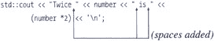
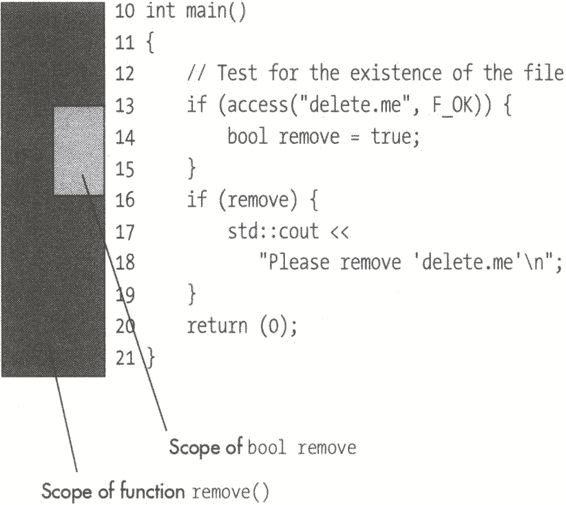
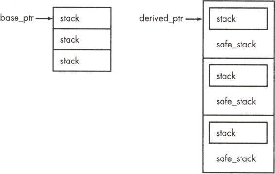
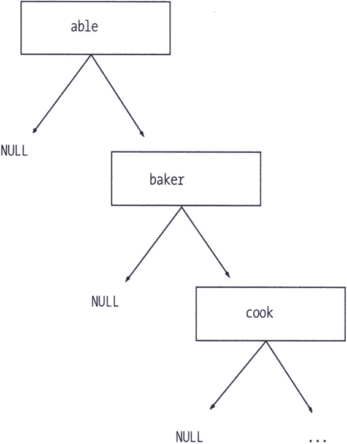

# 第三部分：答案

**答案 1:** 问题在于一个大型羊群包含 10,000 只羊。那是 40,000 条腿。short int 的最大值是 32,767。这小于 40,000，所以 (10,000*4) 会导致溢出，结果输出错误的数据。

**答案 2:** 问题在于这个语句：

```
          // The bit we are printing now
          short int bit = (1<<16);

```

并没有将变量位设置为 1000 0000 0000 0000(b)，而是设置为 1 0000 0000 0000 0000(b)。不幸的是，它无法容纳 17 位，所以结果是它被设置为零。

因为它是零，位测试语句将始终失败，给出以下结果：

```
          ---------------

```

**答案 3:** 全局类在 main 之前初始化。编译器不保证顺序。特别是，没有任何东西可以保证在它被使用之前 first_name 已经初始化。所以如果编译器选择了错误的顺序，程序将输出错误的数据或崩溃。

**答案 4:** 程序员以为他在 if 语句中放了两条语句，但他忘记了花括号。

所以这个语句：

```
          if (size > MAX)
              std::cout << "Size is too large\n";
              size = MAX;

```

正确缩进看起来像：

```
          if (size > MAX)
              std::cout << "Size is too large\n";
          size = MAX;

```

程序员应该写的是：

```
          if (size > MAX)
          {
              std::cout << "Size is too large\n";
              size = MAX;
          }

```

**答案 5:** 问题在于文件类型没有被指定为二进制（ios::bin）。Microsoft Windows 运行时库编辑字符输出，并在每个 <line-feed (0xA)> 前插入 <carriage-return (0xD)>。这解释了文件中在 0A 字符之前额外的 0D。

**答案 6:** 问题在于这一行：

```
          6 void main()

```

main 函数不是一个 void 函数。它是一个 int。该函数返回一个退出代码给操作系统。一个正确编写的 "Hello World" 看起来像：

```
 1 /************************************************
 2  * The "standard" hello world program.          *
 3  ************************************************/
 4 #include <ostream>
 5
 6 int main()
 7 {
 8     std::cout << "Hello world!\n";
 9     return (0);
10 }

```

当我的妻子第一次学习编程时，这是她被教的第一段程序（void 版本）。我将 void 改为 int，她交了作业。助教判错了，又改了回去。

不必说，我对这件事感到非常不高兴，并给他写了一封非常傲慢的信，告诉他 main 是一个 int，并引用了 C++ 标准的章节和段落来证明这一点。他回信时非常和善。

**答案 7:** 问题在于 *sub.cpp* 将 str 定义为一个字符数组（char []）。*main.cpp* 中的 extern 声明将 str 定义为一个字符指针（char *）。

现在字符数组和字符指针在 C++ 中的几乎所有地方都是可互换的 *几乎*。这是它们不可互换的少数情况之一。在这种情况下，程序 main 认为 str 是一个字符指针，所以它去那个位置读取前四个字节，期望得到一个地址。前四个字节是 "Hell"，这不是一个地址，所以程序崩溃。

**避免 1:** 总是在头文件中定义 extern。这个头文件应该总是被定义该项目的模块以及使用它的每个模块包含。

**答案 8:** 问题在于 ch 可以是一个有符号字符。这意味着如果 ch 在比较时转换为有符号整数，你得到 int(ch)=-1 (0xFFFFFFF)。这并不是 0xFF，比较失败了。

**避免 2**：当使用字符变量来存储数字时要小心。它们可能不会按你的预期工作。

**答案 9**：问题在于优化器查看代码，看到我们读取*in_port_ptr 三次然后丢弃结果。优化器随后推断出，通过删除第 20、21 和 22 行，它可以优化程序并产生相同的结果。

解决方案是声明端口指针为 volatile。在程序 107 中我们已经这样做了，但有些地方不太对劲。

**答案 10**：答案是 printf 格式（%d）与参数类型（double）不匹配。程序员应该这样写：

```
        12   printf("pi is %f\n", M_PI);

```

**答案 11**：字符有 8 位，编号为 0 到 7。这些位可以用常数（1 << 0）到（1 << 7）来表示。

没有位号 8，所以表达式

```
          privs |= P_BACKUP;    // P_BACKUP = (1 << 8)

```

因为它设置了一个超出字符边界的位，所以什么也不做。结果是，只有管理权限真正被设置。

**答案 12**：运算符=函数调用接受一个类型为 data_holder 的单个参数。这种类型的参数是按值传递参数，因此会调用复制构造函数。创建复制构造函数的程序员决定走捷径，并使用运算符=来实现复制。所以运算符=调用复制构造函数，它又调用运算符=，然后调用复制构造函数……以此类推，直到栈空间耗尽。

运算符=函数应该将其参数类型取为常量引用：

```
            data_holder &operator = (
                  const data_holder &old_data_holder) {

```

它也应该返回一个指向数据持有者的引用。

**避免 3**：如果可能，在传递参数时使用 const 引用。这避免了按值传递参数时的额外开销。

**答案 13**：问题出在 if 语句上。在第一个中：

```
        if (width < MIN) {
            std::cout << "Width is too small\n";
            width = MIN;

```

程序员忘记了添加闭合的花括号。这没关系；他通过忘记为下一个 if 语句添加开括号来弥补：

```
        if (height < MIN)
            std::cout << "Height is too small\n";
            height = MIN;
        }

```

如果我们正确缩进代码，我们就可以看到问题：

```
        if (width < MIN) {
            std::cout << "Width is too small\n";
            width = MIN;

            if (height < MIN)
                 std::cout << "Height is too small\n";
            height = MIN;
        }

```

程序员应该写的是：

```
        if (width < MIN) {
            std::cout << "Width is too small\n";
            width = MIN;
        }

        if (height < MIN) {
            std::cout << "Height is too small\n";
            height = MIN;
        }

```

**答案 14**：语句：

```
        save_queue = a_queue

```

将大小为 30 的队列复制到大小为 20 的队列中。换句话说，赋值运算符（如实现的那样）允许我们复制不同大小的队列。我们不应该被允许这样做。

解决这个问题的有四种方法：

1.  使用 STL 队列类。

1.  将赋值运算符设置为私有（并且不允许任何赋值）。

1.  将赋值运算符修改为，如果队列的大小不同则抛出异常。

1.  将队列类修改为可以相互赋值不同大小的队列。

**答案 15**：常数 02126 是八进制，因为最高位是零。所以在 C++中，02126（八进制）等于 1110（十进制），并不是波士顿的邮政编码。

**答案 16**：问题在于编译器知道 12 * 34 等于多少，所以它不是直接进行乘法运算，而是优化了语句，将其转换为：

```
        18         result = 408;

```

由于没有进行乘法运算，时间计算有误。程序 109 是尝试解决这个问题。

**答案 17**：问题在于程序员使用了位与(&)而不是逻辑与(&&)。两个数字的位与给出了我们：

```
           3 0011
        & 12 1100
        =========
           0 0000

```

因此结果是 0，跳过了 if 子句，执行 else 子句。

一些程序员使用缩写：

```
           if (x)

```

for

```
           if (x != 0)

```

（我反对这种缩写。）

这就是我不喜欢捷径的一个例子。编写 if 语句的更好方法是：

```
           if ((i1 != 0) && (i2 != 0))

```

在发现这个错误不久后，我告诉了一个同事。我解释了发生了什么，并说：“我现在知道'and'和'and and'之间的区别了。”我不确定我更惊讶的是我提出了这个句子，还是他理解了这个句子。

**答案 18**：问题在于 tmp_name 返回一个指向局部变量 name 的指针。当函数结束时，所有非静态局部变量的存储空间都会被回收。这包括 name 的存储空间。因此，返回的指针指向一个随机、未分配的内存区域。

接下来的函数调用可能会覆盖那个存储空间，使 a_name 看起来非常奇怪。

解决这个问题的方法是将 name 声明为**静态**。

（参见程序 59 中的类似问题。）

**答案 19**：问题在于该语句

```
           bit >>= 1;

```

并没有将位向右移动一位。相反，它执行了一个“有符号”的位移，这会复制符号位。因此

```
       0x8000 >> 1      1000 0000 0000 0000 (b)

```

不是

```
       0x4000           0100 0000 0000 0000 (b)

```

如预期的那样，但结果是

```
       0xC000           1100 0000 0000 0000 (b)

```

由于这个问题，位测试给出了错误的结果。

**答案 20**：memset 的参数是：

```
        memset(
            void *ptr,// Pointer to the data
            int value,// Value to set
            size_t size// Number of bytes to fill
        );

```

在这种情况下，值是 sizeof(array)，要填充的字节数是 0。由于 size=0，没有进行任何操作。

程序员应该写成：

```
        memset(array, '\0', sizeof(array));

```

**答案 21**：C++标准规定所有指针都必须指向数组或其上方。你不能指向数组下方。

在这个例子中，我们有一个在英特尔机器上的数组。在英特尔怪异指针术语中，数组的地址是：

```
            5880:0000

```

data_ptr 变量最初位于：

```
            5880:001E

```

然后只要它大于 data，它就会递减。在其递减过程中，data_ptr 会移动到

```
            5880:0000

```

这等于数组 data 的地址，所以它再次递减。（记住在这个内存模型中，只有地址部分被改变。）结果是：

```
            5880:FFFE

```

现在

```
            data_ptr >= data

```

被评估。但是 data_ptr 现在比 data 大得多，所以程序继续执行。

结果是程序覆盖了随机数据，这可能导致系统崩溃。但如果不会，data_ptr 将下降到：

```
            5880:0000

```

wrap，并且过程将再次继续。

**答案 22**：问题在于函数 max 返回一个参数的引用。该参数是 3+4，这是一个表达式。

当调用 min 时，C++实际上做的事情是：

1.  创建一个临时变量（tmp1）并将其赋值为 1+2

1.  创建一个临时变量（tmp2）并将其赋值为 3+4

1.  调用 max(tmp1, tmp2)

1.  这个函数返回对 tmp2 的引用。

    ```
    i = &tmp2
    tmp1 destroyed
    tmp2 destroyed

    ```

1.  变量 i 现在是一个对无物的引用。

问题是由返回参数的引用引起的。这创建了一个悬空引用。

**答案 23**：程序员没有在输出文本的该行中添加空格：

```
        13    std::cout << "Twice" << number << "is" <<
        14        (number *2) << '\n';

```

结果，输出看起来像

```
        Twice5is10

```

他应该写成这样：



**答案 24：** 这是一个经典的死锁问题：

+   进程 1 需要资源#1 和#2。

+   进程 2 需要资源#2 和#1。

他们以那个顺序获取资源。记住，线程切换可能随时发生。

因此，我们有一个可能导致以下情况发生的竞争条件：

1.  进程 1 获取资源#1

1.  线程切换到进程 2

1.  进程 2 获取资源#2

1.  进程 2 试图获取资源#1

1.  资源#1 不可用，因此进程将休眠直到它被释放（在它工作期间保持资源#2 锁定）

1.  线程切换到进程 1

1.  进程 1 试图获取资源#2。由于它被锁定，进程将休眠直到它被释放。（在此期间，资源#1 保持锁定。）

结果是进程 1 在持有资源#1 的同时等待资源#2。它不会放弃资源#1 直到它获取到资源#2。

进程 2 在持有资源#2 的同时等待资源#1。它不会放弃资源#2 直到它获取到资源#1。

**避免 4：** 定义锁定顺序（例如，你必须按照#1、#2 的顺序获取锁）。在获取多个锁时始终使用此锁定顺序。

**备选方案：** 在获取多个锁时，使用以下算法：

1.  尝试获取所有锁（如果不可用则不阻塞）。

1.  如果你已经拥有了所有东西，那么继续做你的工作。

1.  如果你没有获取到所有锁，释放那些你没有获取到的锁，稍作休眠，然后再次尝试。

**答案 25：** 问题在于这个语句：

```
        if (n2 =! 0)

```

这是一个 if 语句内的赋值语句。如果我们重写代码以避免快捷方式，我们得到两个语句：

```
        n2 = !0;
        if (n2)

```

在这种情况下使用逻辑非（!0）给我们一个结果为 1。所以我们总是将 n2 赋值为 1，然后进行比较和除法。

!=被错误地写成=!，因此产生了意外。

该语句应该读作：

```
        if (n2 != 0)

```

**答案 26：** 问题在于：

```
            diff[diff_index++] =
                array[i++] - array[i++];

```

这告诉编译器：

1.  增加 i

1.  使用它来索引数组（首次出现）

1.  增加 i

1.  使用它来索引数组（第二次出现）

1.  计算差值

问题在于步骤 1-4 可能以不同的顺序发生：

1.  增加 i

1.  增加 i

1.  使用它来索引数组（首次出现）

1.  使用它来索引数组（第二次出现）

具有许多副作用语句给 C++编译器提供了出错的空间。

**避免 5：** 将像++和--这样的副作用操作单独放在一行。

**答案 27：** 问题在于“1”是一个整数。数字“3”也是一个整数。所以“1/3”是整数除法。

因此，语句：

```
        12    result = 1/3;     // Assign result something

```

对 1 除以 3 进行整数除法。整数除法会截断小数部分，因此结果是 0。整数“0”被转换为浮点数并分配给结果。

程序员应该这样写：

```
        12    result = 1.0 / 3.0;// Assign result something

```

**答案 28：** scanf 函数非常难以使用。在这个程序中，语句：

```
        22          scanf("%c %d", &oper, &value);

```

获取一个字符和一个整数。下一次调用 scanf 时，它将读取另一个字符和整数。那么下一个字符是什么呢？让我们看看示例运行：

```
        % calc
        Enter operator and value:+ 5
        Total: 5
        Enter operator and value:+ 10
        Bad operator entered
        Total: 5
        Enter operator and value:Bad operator entered
        Total: 5
        Enter operator and value:q
        Bad operator entered
        Total: 5
        Enter operator and value:q

```

我们输入的第一行是：

```
        + 5

```

第一次调用 scanf 后，输入指针位于 5 后的换行符之前。下一次 scanf 尝试读取操作符并获取换行符。它继续读取并看到加号而不是数字。结果是很多困惑。

**避免 6**：scanf 函数很难正确使用。但我有一个简单的方法来处理这个问题：我从不使用它。相反，我总是使用 fgets 和 sscanf 的组合。

```
           fgets(line, sizeof(line), stdin);
           sscanf(line, "%c %d", &operator, &value);

```

**答案 29**：预处理器不理解 C++ 语法。当我们定义 TOTAL 为 37 + 33 时，它实际上是 37 + 33，而不是 70。

面积宏定义为：

```
        37 + 33 * 10

```

运算符优先级占上风，给出了错误的答案。

**避免 7**：尽可能使用常量而不是定义宏。

**避免 8**：将括号放在所有定义非简单数字的 #define 语句周围。

示例：

```
        // Total top size
        #define TOP_TOTAL (TOP_PART1 + TOP_PART2)

```

**答案 30**：问题在于函数返回了一个局部变量的引用。这是件坏事，因为局部变量在返回时被销毁；引用被称为 *悬空引用*。它指向不再存在的东西。

当我们尝试打印不再存在的字符串时，我们会遇到麻烦。

**避免 9**：不要返回局部变量的引用。

**答案 31**：问题在于 else 子句与最近的 if 语句配对。正确缩进的代码如下：

```
        23 if (balance < 0)
        24     if (balance < - (100*DOLLAR))
        25         cout << "Credit " << -balance << endl;
        26     else
        27         cout << "Debt " << balance << endl;

```

这不是程序员想要的结果。他想要做的是：

```
        if (balance < 0) {
            if (balance < - (100*DOLLAR))
                cout << "Credit " << -balance << endl;
        } else
            cout << "Debt " << balance << endl;

```

**避免 10**：如果在一个 if、for、while 或其他控制语句的控制下有多个语句条件控制，请使用 {} 包围这些语句。

(这是一种说法：不要写这样的代码。)

| **** |
| --- |

奖励问题：这解决了大多数问题，但这个程序中仍然有一个错误。是什么？(下一个 提示 112。 答案 38。)

| **** |
| --- |
|  |

**答案 32**：问题在于内存是在构造函数中分配的，但从未被释放。

**避免 11**：在析构函数中删除在构造函数中创建的。

这个规则没有被遵循，所以每次我们创建一个栈，一些堆就会永久消失。

**答案 33**：程序打印：

```
        First: John
        Last:  Smith
        Hello: John
         Smith

```

问题在于 fgets 会获取包括换行符在内的整行。所以当读取第一个名字时，它读取为 John\n。同样的事情发生在 Smith 上，结果是我们的有趣输出。

**答案 34**：for 语句的末尾有一个额外的分号：

```
            for (index = 1; index <= 10; ++index);

```

这意味着 for 循环根本控制不了什么。正确缩进的程序如下：

```
        for (index = 1; index <= 10; ++index);
        std::cout << index << " squared " <<
             (index * index) << '\n';

```

或者如果我们添加一些注释，看起来是这样的：

```
        for (index = 1; index <= 10; ++index)
            /* Do nothing */;
        std::cout << index << " squared " <<
            (index * index) << '\n';

```

从这里我们可以看出，std::cout 行不在 for 循环内部。

**答案 35**：问题在于我们声明了一个名为 remove 的局部变量。还有一个名为 remove 的标准函数。我们的局部变量隐藏了局部变量作用域内的函数。

这个作用域在第一行 15 的第一个 if 语句结束时结束。

下一个语句：

```
        16    if (remove) {

```

检查函数 remove 的地址是否非零，如果是，则执行下一个语句。



**避免 12**：避免隐藏变量。

**答案 36**：问题在于我们返回的字符串被定义为：

```
         15     // The name we are generating
         16     std::string name;

```

这是一个局部变量。子程序返回对这个字符串的引用。但由于它是一个局部变量，它在函数结束时被销毁。这意味着当我们使用结果时，持有结果的变量已经被销毁了。

**答案 37**：问题在于反斜杠字符被用作转义字符。所以 \n 是换行符。\new 是 <newline>ew。

所以字符串 \root\new\table 解码为

```
       "<return>oot<newline>ew<tab>able"

```

程序员真正想要的是：

```
       const char name[] = "\\root\\new\\table";  // DOS path

```

具有讽刺意味的是，这个规则不适用于 #include 文件名。

```
       #include "\usr\include\table.h"

```

它工作正常且正确。

**答案 38**：问题在于这个语句：

```
       if (balance < 0)

```

这用于检查客户是否欠公司东西。因此，客户可以看到类似的消息：

```
       You owe 0.

```

|  | 注意  | 这实际上发生在一个人的身上。他收到了一张 $0.00 的账单。他打电话给公司，他们道歉了，下个月他又收到了一张 $0.00 的账单。这种情况持续了好几个月。每次他打电话给公司，他们都会道歉并告诉他他们会解决这个问题，但什么也没有发生。 |
| --- | --- | --- |

他甚至被收取了 5% 的滞纳金。这使得他的账单达到了 $0.00。

最后，他给他们寄了一张 $0.00 的支票。

那周他收到了银行的一个令人不快的电话。“你为什么写出了这样一张支票？”他们质问道。

看起来支票使他的电脑系统崩溃了。所以支票被退回，下周他收到了一张 $0.00 的账单。

**答案 39**：问题在于优化器很聪明。它看到我们在计算

```
        factor1 * factor2;

```

在 for 循环内。如果我们把这个移动到 for 循环外，答案不会改变，但会更快。所以这个程序的优化版本只乘一次：

```
        17     int register1 = factor1 * factor2;
        18     // We know that 1863 multiplies
        19     // delay the proper amount
        20     for (i = 0; i < 1863; ++i)
        21     {
        22         result = register1;
        23     }

```

为了解决这个问题，我们需要声明我们的因子为易失性。

```
         1 /************************************************
         2 * bit_delay -- Delay one bit time for           *
         3 *      serial output.                           *
         4 *                                               *
         5 * Note: This function is highly system          *
         6 *      dependent.  If you change the            *
         7 *      processor or clock it will go bad.       *
         8 *************************************************/
         9 void bit_delay(void)
        10 {
        11     int i;      // Loop counter
        12     volatile int result;// Result of the multiply
        13
        14     // Factors for multiplication
        15     volatile int factor1 = 12;
        16     volatile int factor2 = 34;
        17
        18     // We know that 1863 multiples delay
        19     // the proper amount
        20     for (i = 0; i < 1863; ++i)
        21     {
        22         result = factor1 * factor2;
        23     }
        24 }

```

正是这类事情使得嵌入式编程变得如此简单。

**答案 40**：问题在于 ostream 是按“按值传递”传递的。你不能复制流变量。（如果你这样做，意味着系统必须复制文件。）参数应该改为“按引用传递”参数：

```
        void print_msg_one(
            // File to write the message to
            class ostream &out_file,

            // Where to send it
            const char msg[]
        )

```

**答案 41**：问题在于这个语句：

```
        strcat(file_name, '/');

```

strcat 函数接受两个字符串作为参数。在这个例子中，我们给了它一个字符串和一个字符。因为没有原型，C 语言无法进行参数检查；错误的参数被传递给了 strcat，这使得它非常困惑。

**避免 13**：所有函数都应该显式声明。永远不要让 C 隐式声明它们。确保包含定义你使用的所有函数原型的头文件。

**答案 42**：有符号的一位数可以有两个值：0 和-1。

该语句：

```
       printer_status.online = 1;

```

失败，因为一位宽的字段无法容纳值 1。（所以它溢出并将变量赋值为-1！）结果是下一个语句：

```
       if (printer_status == 1)

```

失败。

**避免 14**：单比特字段应该是无符号的。

**答案 43**：在 MS-DOS 上，你可能会得到类似以下的结果：

```
      The answer is 4C:>#
      (# is the cursor)

```

在 UNIX 上，你可能会得到类似以下的结果：

```
      The answer is 4$ #

```

问题在于程序员没有在 std::cout 语句的末尾添加换行符。结果是程序运行，输出一条语句，然后退出，光标定位在行尾。命令处理器随后运行并输出其提示符（MS-DOS 为 C:>，UNIX 为$）紧挨着程序的输出。

程序员应该这样写是：

```
      std::cout << "The answer is " << result << '\n';

```

**答案 44**：逗号可以用来分隔 C++语句。它的用法如下：

```
      if (x)
          std::cout << "X set. Clearing\n", x = 0;

```

（请不要这样编程，谢谢！）

该语句

```
       one_million = 1,000,000;

```

等于：

```
       one_million = 1,
       000,
       000;

```

或者

```
       one_million = 1;
       000;
       000;

```

从这个中，我们可以看到为什么我们得到 1 作为输出。

**答案 45**：问题是表达式 ch+1 是一个整数（值为 66）。C++检测到这一点并调用 std::cout.operator <<(int)函数，输出一个整数。

程序员应该这样写：

```
     std::cout << static_cast<char>(ch+1);
     std::cout << static_cast<char>(ch+2);

```

**答案 46**：输出如下：

```
     The double of 1 is 2
     The double of 2 is 3
     The double of 3 is 4
     The double of 4 is 5
     The double of 5 is 6

```

原因是 DOUBLE(i+1)展开为：

```
     (i+1 * 2)

```

当 C++看到这个表达式时，它会将 1 乘以 2，然后加上 i。这个结果并不是程序员想要的。

**避免 15**：尽可能使用内联函数而不是宏。

**避免 16**：尽可能总是将宏的参数用括号括起来。例如：

```
      #define DOUBLE(x) ((x) * 2)

```

**答案 47**：该语句：

```
       if (amount = 0)

```

将 0 赋值给 amount，然后比较结果看它是否不为零。它是零，所以执行 else 子句。

程序员应该这样写这个语句：

```
      if (amount == 0)

```

|  | 注意 | 我在教编程时最令人欣慰的经历之一是在课程结束大约两个月后遇到一个学生。“Steve，”他说。“我必须告诉你，在课堂上我觉得你对这个‘=’与‘==’的东西有点过分——直到昨天。你知道，我写了我的第一个真正的程序，猜猜我犯了什么错误？” |
| --- | --- | --- |

**答案 48**：使用以下语句：

```
        i = 3 - i;

```

|  | 注意 | 这个算法最初被发现隐藏在一篇文章中，作为如何不完成工作的例子。作者的“理想”做法是使用以下代码：

```
         switch (i) {
             case 1
                 i = 2;
                 break;
             case 2:
                 i = 1;
                 break;
             default:
                 std::cerr << "Error: i is not 1 or 2\n";
                 exit (99)
         }

```

作者试图说明的是，你应该检查代码中的非法值。细心的读者可能会注意到这段代码中存在语法错误。原文中“理想”解决方案也存在类似问题。换句话说，作者展示的“理想”代码无法工作。|

**答案 49**：问题是 C++的运算符优先级并不是程序员所想的。+运算符在<<之前，所以

```
           y = x<<2 + 1;

```

被解析为：

```
           y = x << (2+1);

```

结果是 1<<4 或 8。

**避免 17**：使用简单的 C++ 优先级规则：

1.  *, / 和 % 的优先级高于 + 和 -。

1.  将 () 放在其他所有内容周围。

**答案 50**：它打印

```
      Hello
      Hello

```

问题在于，当发生 fork 时，printf 缓冲区中有数据。fork 创建了两个进程副本和 printf 缓冲区中的两个数据副本。因此，当缓冲区稍后（在两个进程中）被刷新时，我们都会收到来自它们的 Hello。

**答案 51**：程序员从未费心初始化 sum。你不能指望一个未初始化的值包含任何东西。所以 sum 可能从 0、5190、123、5 或其他值开始。

程序员应该编写的是：

```
       9   int sum = 0;

```

**答案 52**：问题是以下行

```
       flags |= CD_SIGNAL;

```

此操作无法防止线程切换。在复杂的指令机器上，此操作的汇编代码如下：

```
       ; 80x86 assembly
       orb $2,flags

```

线程切换仅在指令边界上发生。因此，在 80x86 机器家族上无法中断此操作。

但在像 Sparc 这样的 RISC 机器上，代码看起来略有不同：

```
1\. sethi %hi(flags),%o0    ; Get the address of the flags in %o0,%o1
2\. sethi %hi(flags),%o1
3\. ld [%o1+%lo(flags)],%o2 ;%o2 = contents of the variable flags
4\. or %o2,2,%o1             ;%o1 = The results of seeting the flag
5\. st %o1,[%o0+%lo(flags)] ;Store results in %o0

```

因此，现在 C++ 语句是可中断的。特别是，以下情况可能发生：

1.  程序运行并完成指令 3。此时，标志的值在寄存器 %o2 中。

1.  发生了线程切换。

1.  另一个进程修改了标志。

1.  线程切换回原状态。

1.  标志的旧值在寄存器 %o2 中。

1.  该位被设置，并将结果存储。因为这将包含标志的旧值，所以其他线程中进行的任何更改都会意外地被丢弃。

解决此问题的方法是使用锁来防止在语句执行期间发生任务切换。

**答案 53**：该语句：

```
    48       printf("%o\t", matrix[row][col]);

```

以八进制形式打印答案。程序员犯了一个错误，本应使用 %d 而使用了 %o。结果是数字是正确的，只是基数错误。

**答案 54**：问题是你在浮点数中不能精确表示 1/3。让我们看看当我们以十进制形式添加这些数字时会发生什么。

```
       1/3 = 0.33333
       1/3 = 0.33333
       1/3 = 0.33333
       -------------
             0.99999

```

由于舍入误差，结果不是 1。

记住，当使用浮点数时，数字不是精确的。

**答案 55**：问题是我们在析构函数中抛出异常。

当程序到达以下行：

```
       if (i3 < 0)
           throw (problem("Bad data"));

```

异常代码接管。它销毁所有局部变量。这包括变量 a_stack。

当 a_stack 被销毁时，会调用析构函数：

```
       ~stack(void) {
           if (count != 0) {
               throw (problem("Stack not empty"));
           }
       }

```

析构函数抛出异常。C++ 不喜欢你在异常中抛出异常。当发生这种情况时，程序会调用 terminate() 函数。

如果你想捕获第二个异常和其他类似的异常问题，请使用标准函数 set_terminate 来设置一个处理意外问题的函数。

**避免 18**：不要在析构函数中抛出异常。

**答案 56**：问题是重新定义的新函数实现不正确。程序员假设当一个人执行

```
       new fast_bit_array

```

分配的对象大小是 sizeof(fast_bit_array)。当 fast_bit_array 用作基类时，这并不正确。在这种情况下，分配的内存大小是派生类 safe_bit_array 的大小，它比 fast_bit_array 大，从而导致内存混淆。

**避免 19：除非你确定自己在做什么，否则不要定义自己的 operator new 函数。如果你确定你知道自己在做什么，确保你真的真的确定。即使如此，除非绝对必要，否则也不要这样做。**

**答案 57：问题是存在两个变量声明：**

*文件：main.cpp*

```
           int value = 20;

```

*文件：check.cpp*

```
           int value = 30;

```

这意味着值被设置为 20 或 30。但哪一个？结果是编译器依赖的。如果你想使值在它们声明的文件中局部化，你需要将它们声明为 static：

*文件：main.cpp*

```
            static int value = 20;

```

*文件：check.cpp*

```
            static int value = 30;

```

或者更好的是，给它们两个不同的名字。

**答案 58：根据 C++标准，一旦你定义了一个与基类成员函数同名派生类成员函数，所有同名的成员函数都将被隐藏：**

所以 der::print_it(float)隐藏了 base::print_it(float)和 base::print_it(int)。

当我们调用 print_it(2)时，C++会寻找它可以使用的 print_it 版本。唯一可见的 print_it 是 der::print_it(float)。C++更愿意有一个以**int**作为参数的函数，但它知道如何将**int**转换为**float**，所以它将 2 提升为 2.0 并使用 der::print_it(float)。

**答案 59：问题是我们没有定义拷贝构造函数。当这种情况发生时，C++会为你定义一个，但通常做得不好。**

拷贝构造函数定义为：

```
       var_array(const var_array &other) {
           data = other.data;
           size = other.size;
       }

```

拷贝构造函数被调用以创建一个用于 store_it 函数的 _an_array_ 的副本。数据指针被复制。

当在 pushy 的末尾调用 var_array::^~var_array 时，它将数据返回到堆中。

当在 main 函数的末尾调用 var_array::^~var_array 时，它将相同的数据返回到堆中。因为我们删除了相同的内存两次，结果是堆损坏。

**避免 20：以某种方式始终声明一个拷贝构造函数。主要有三种方式：**

1.  隐式声明它。

1.  如果你永远不希望任何人能够调用它，将其声明为 private：

    ```
    private:
        var_array (const var_array &);
        // No one can copy var_arrays

    ```

1.  如果默认设置有效，使用注释：

    ```
    // Copy Constructor defaults

    ```

在你的程序中。这样，你告诉阅读你代码的人你已经考虑过这个问题，并且知道 C++的默认设置不会成问题。

**答案 60：程序员有一个非常不好的习惯，那就是在打开文件后不关闭它们。很快，打开的文件数达到最大，系统不再允许他打开更多的文件。**

需要在代码的关键点添加关闭语句：

```
      int fd = open(cur_ent->d_name, O_RDONLY);
      if (fd < 0)
          continue;   // Can't get the file so try again

      int magic;       // The file's magic number
      int read_size = read(fd, &magic, sizeof(magic));
      if (read_size != sizeof(magic)) {
          close(fd);   // <---- added
          continue;
      }

      if (magic == MAGIC) {
          close(fd);     // <---- added
          return (cur_ent->d_name);
}
      close(fd);         // <---- added

```

此外，程序员使用 opendir 打开一个目录。他从未关闭它。所以需要一个 closedir。

```
      void scan_dir(
          const char dir_name[]   // Directory name to use
      )
      {
          DIR *dir_info = opendir(dir_name);
          if (dir_info == NULL)
              return;
          chdir(dir_name);

          while (1) {
              char *name = next_file(dir_info);

              if (name == NULL)
                  break;
              std::cout << "Found: " << name << '\n';
          }
         closedir(dir_info);      // <---- added
      }

```

**答案 61：问题是这个语句：

```
      5 const char *volatile in_port_ptr =
      6 (char *)0xFFFFFFE0;

```

告诉 C++，*指针*是易变的。被指向的数据不是易变的。结果是，优化器仍然将我们优化掉。解决方案是将 volatile 放在它修改的数据处。我们还添加了一个 const 到声明中，以确保指针不能被修改。结果声明是：

```
      4 // Input register
      5 volatile char *const in_port_ptr =
      6         (char *)0xFFFFFFE0;
      7
      8 // Output register
     10 volatile char *const out_port_ptr =
     11         (char *)0xFFFFFFE1;

```

这告诉 C++：

+   in_port_ptr 是一个 const 指针，不能被修改。

+   *in_port_ptr 是一个易变的 char，其值可以在正常的 C++编程规则之外被改变。

**答案 62：** 问题在于注释：

```
        10    base = 5;    /* Set the base of the triangle

```

不包含一个关闭注释。因此，它继续吞噬下面的语句：

```
        10    base = 5;    /* Set the base of the triangle
        11    height = 2;  /* Initialize the height */

```

从这里很容易看出为什么没有设置高度。

**答案 63：** 问题在于 getchar 返回一个 int。我们将其赋值给一个字符。一些系统将字符视为无符号字符。结果是，当我们得到 EOF（-1）时，系统将其分配

```
        ch = (unsigned char)(-1)

```

或者 ch = 0xFF。然后它将 0xFF 与-1（它们不相同）进行比较，并且不会退出循环。

这个程序也是一个风格上的灾难。每个 C++程序员的目标应该是编写一个清晰的程序。这个程序是为了紧凑而编写的。一个更好的程序是：

```
  1 /************************************************
  2  * copy -- Copy stdin to stdout.                *
  3  ************************************************/
  4 #include <stdio.h>
  5
  6 int main()
  7 {
  8
  9     while (1) {
 10     {
 11         int ch; // Character to copy
 12
 13         ch = getchar();
 14
 15         if (ch == EOF)
 16             break;
 17
 18         putchar(ch);
 19     }
 20     return (0);
 21 }

```

**答案 64：** 输出是：

```
      Name (a): /var/tmp/tmp.2
      Name (b): /var/tmp/tmp.2

```

原因是，尽管我们有两个指针，但它们都指向一个变量名。当 tmp_name 第一次被调用时：

```
        a_name --> name = "/var/tmp/tmp.1"

```

在第二次调用之后：

```
        b_name --> name = "/var/tmp/tmp.2"

```

但 a_name 也指向 name，所以：

```
        a_name --> name = "/var/tmp/tmp.2"
        b_name --> name = "/var/tmp/tmp.2"

```

第二次调用覆盖了用于存储第一次调用结果的存储空间。

解决这个问题的方法之一是在每次调用后复制字符串，或者让调用者提供自己的字符数组来存储名称。

另一个解决方案是使用处理自己的内存分配的 C++风格字符串。

**答案 65：** 每个 put 后面都跟着一个 flush。这意味着每个字符输出都会进行系统调用。系统调用很昂贵，并且占用大量的 CPU 时间。

换句话说，尽管 I/O 库是为缓冲 I/O 设计的，但过多的 flush 调用会导致它逐个字符进行无缓冲 I/O。

我们需要在每个块的末尾刷新，以确保远程系统接收到一个完整的块。那是*块*，不是*字符*，因此我们可以通过将 flush 移动到块发送之后来加快系统速度：

```
       for (i = 0; i < BLOCK_SIZE; ++i) {
            int ch;

            ch = in_file.get();
            serial_out.put(ch);
       }
       serial_out.fflush();

```

**答案 66：** setjmp 在代码中标记了一个位置。longjmp 调用跳转到它。它直接跳转到它，不经过 go，不收集$200。它还跳过了堆栈上所有变量的析构函数。在这种情况下，因为 std::string 的析构函数返回字符串分配的内存，所以我们有一个内存泄漏。

那是因为 setjmp 和 longjmp 函数是 C 函数，不应该在 C++中使用。

**避免 21：** 不要在 C++程序中使用 setjmp 和 longjmp。使用异常代替。

**答案 67：** 在默认情况下：

```
       defualt:
           std::cout << i << " is not prime\n";
           break;

```

"default"关键字拼写错误。结果是，C++编译器认为"defualt"是一个 goto 标签。

**答案 68：** printf 函数缓冲其输出。它实际上不会写入任何内容，直到缓冲区满或发送换行符。

因此，程序遇到 printf，"开始" 消息进入缓冲区而不是屏幕，并且 average 函数执行并得到除以零错误。

结果是，“开始”消息丢失，让我们以为平均函数从未被调用过。

解决这个问题的方法是显式地在开始消息后刷新缓冲区：

```
           printf("Starting....");
           fflush(stdout);

```

|  | 警告  | 缓冲区刷新的规则取决于正在写入的文件类型。规则如下：

1.  *如果* *stdout* *或* *stderr* *正在写入屏幕，则输出将被缓冲，直到：*

    1.  *当写入一行时。*

    1.  *当* *stdin* *被读取时。*

    1.  *当缓冲区满时。*

1.  *如果* *stdout* *或* *stderr* *正在写入磁盘，则输出将被缓冲，直到：*

    1.  *当缓冲区满时。*

|

（这些可能是你系统上的规则。实际的规则是系统相关的。）

**答案 69：** 问题在于程序员编写了：

```
         std::cout << "Hello World!/n";

```

而不是：

```
         std::cout << "Hello World!\n";

```

因此，输出实际上是：

```
         Hello World/n

```

**答案 70：** 问题在于以下语句：

```
        54     while (
        55         (std::strcmp(cur_cmd->cmd, cmd) != 0) &&
        56         cur_cmd != NULL)

```

该语句检查 cur_cmd->cmd 指向的数据，然后检查 cur_cmd->cmd 是否有效。在某些系统上，解引用 NULL（如果我们处于列表的末尾，我们会这样做）会导致核心转储。

在 MS-DOS 和其他脑损伤系统上，没有内存保护，因此允许解引用 NULL，尽管你会得到奇怪的结果。微软 Windows 修复了这个问题，解引用 NULL 指针将导致一般保护故障 (GPF)。

循环应该这样编写：

```
      while (
          (cur_cmd != NULL) &&
          (std::strcmp(cur_cmd->cmd, cmd) != 0))

```

但即使这样也很棘手。该语句取决于 C++ 标准是否正确实现。该 C++ 标准指出，对于 &&，第一部分将被评估。如果第一个项为假，则跳过第二个项。为了安全起见，最好写成这样：

```
          while (1) {
              if (cur_cmd == NULL)
                   break;
              if (std::strcmp(cur_cmd->cmd, cmd) == 0)
                   break;

```

**答案 71：**

1.  **对齐**

一些机器要求长整数值对齐在 2 字节或 4 字节边界上。一些则不需要。C++ 将在结构中插入填充以使对齐。

因此，在一台机器上，结构将是：

```
       struct data {
           char flag;       // 1 byte
           long int value;  // 4 bytes
       };

```

总共 5 个字节。而在另一台机器上可能如下：

```
       struct data {
           char flag;       // 1 byte
           char pad[3];     // 3 bytes (automatic padding)
           long int value;  // 4 bytes
       };

```

总共 8 个字节。

1.  **字节顺序**

一些机器使用 ABCD 的字节顺序写入长整数。而另一些使用 DCBA。这阻止了可移植性。

1.  **整数大小**

64 位机器正在到来。这意味着在某些系统上，长整型是 64 位，而不是 32 位。

**答案 72：** 我们有一个名为 safe stack 的派生类数组。在 C++ 中，你可以使用基类指针（stack*）来指向派生类（safe_stack）。系统将只看到对象的基部分，但你仍然可以指向它。


现在指针可以指向一个类的单个实例或对象的数组。


因此，我们有以下两个规则：

1.  基指针可以指向派生对象。

1.  对象指针可以指向对象的数组。

从这个结论中，我们可以得出：

1.  基指针可以指向派生对象的数组。

这是错误的。

问题在于派生对象的数组与基类对象的数组并不相同。



因此，如果我们用一个基指针指向派生数组，内存布局将会错误。


**避免 22**：使用 STL 向量模板而不是数组。它可以避免很多问题。

**避免 23**：不要将基类数组作为参数传递。

**答案 73**：问题在于编译器如何为程序生成机器代码。

语句：

```
      if (number1 + number2 == number1)

```

生成如下：

```
     movefp_0, number1
     add fp_0, number2
     movefp_1, number1
     fcmpfp_0, fp_1
     jump_zero out_of_the_while

```

在这个例子中，fp_0 和 fp_1 是浮点寄存器。在浮点协处理器中，寄存器具有可用的最大精度。因此，在这种情况下，虽然数字可能只有 32 位，但浮点处理器以 80 位进行操作，从而报告出高精度。

这种问题在大多数具有浮点处理器的机器上都会发生。另一方面，如果你有一个使用软件进行浮点运算的旧机器，你可能会得到正确答案。这是因为，通常，软件浮点运算只使用足够的位来完成工作。

为了修复程序，我们需要将主循环转换为：

```
       while (1)
       {
       // Volatile keeps the optimizer from
       // putting the result in a register
       volatile float result;

       result = number1 + number2;
       if (result == number1)
           break;

```

**答案 74**：问题在于单词按字母顺序存储在输入文件中，而树是不平衡的。因此，当插入单词时，会构建以下数据结构：



结果是我们得到一个链表，而不是树。单词被添加到链表的末尾（代价高昂），并且通过线性搜索进行查找（同样代价高昂）。

平衡二叉树可以解决这个问题。

**答案 75**：问题在于我们的代码中有以下语句：

```
        an_array = an_array;

```

这被伪装成：

```
        82    to_array = from_array;

```

操作符=函数删除目标数组的数据。这很好，除非源数组是同一栈，因此其数据也会被销毁。

解决方法是显式检查操作符=函数中的自赋值：

```
           array & operator = (const arrary &old_array) {
       if (this == &old_array)
                   return;

```

**避免 24**：操作符=函数应检查自赋值。

**答案 76**：问题在于 strcmp 在字符串相等时返回 0，否则返回非零值。这意味着如果你有如下语句：

```
          if (strcmp(x,y))

```

只有当字符串**不**相等时，if 语句才会执行。

**避免 25**：使用

```
          if (strmp(x,y) != 0)

```

来测试两个字符串是否相等。这比 if (strcmp(x,y))更清晰，并且它有效。

**避免 26**：尽可能使用 C++字符串类而不是旧的 C 风格字符串。这样，你可以使用关系运算符（<,>, ==等）而不是 strcmp。

**答案 77**：问题在于以下代码：

```
       while (first != NULL) {
           delete first;
           first = first->next;
       }

```

它删除了数据，然后又使用了它。在删除之后，它们真的应该消失。

**避免 27**：在删除或释放后，始终将指针设置为 NULL。

当代码带有一些额外的保护时，问题就很明显了：

```
        delete first
        first = NULL;
        first = first->next;

```

Also, because of the added protection of setting first to NULL, if we do attempt to use the pointer, we will abort in a well-defined manner (on most systems).

**答案 78**：变量的类型是：

+   sam 是一个字符指针（char *）。

+   joe 是一个字符（char）。

预处理器处理后的声明结果为：

```
       char * sam, joe;

```

**避免 28**：使用 typedef 定义新类型，而不是使用#define。

**答案 79**：C++没有**运算符。（至少对于整数。）所以(12 ** 2)是一个无效的结构。

问题在于这种糟糕的语法被隐藏在一个直到第 16 行才展开的预处理器宏中。这就是为什么第 16 行有语法错误。

**避免 29**：尽可能使用 const 代替预处理器宏。以下语句：

```
       const int GROSS = (12 ** 2);

```

仍然会生成错误消息，但至少行号是正确的。

**答案 80**：问题是比较的结果是一个整数 1 或 0。所以表达式：

```
       if (a > b > c)

```

becomes

```
       if ((a > b) > c)

```

因为 a 大于 b，所以 a > b 的结果是 1，所以我们现在有

```
       if (1 > c)

```

这是错误的，所以 else 子句被执行。

**答案 81**：程序员怀疑在读取数据项#500 时发生了奇怪的事情。他希望在读取这个项目之前设置一个断点。

问题在于，如果他将在 get_data 的顶部设置断点，他将不得不执行 500 个调试器继续命令，才能到达他想要的位置。

所以他在这一行设置断点：

```
       seq = seq;

```

|  | 注意  | 更高级的调试器允许用户设置跳过计数以跳过前*x*个断点停止。我们友好的程序员没有这样的工具。 |
| --- | --- | --- |

**答案 82**：程序员使用分号来结束#define 声明。因为预处理器对事物相当字面，分号变成了文本的一部分。结果是 USABLE 被定义为：

```
         8.5; -1.0;;

```

text_width 的初始化现在变为

```
         double text_width = 8.5; -1.0;;

```

或者，正确缩进后，

```
       double text_width = 8.5;
       -1.0;
        ;

```

从这里我们可以看到我们的问题。

**避免 30**：尽可能使用 const 代替#define。

**答案 83**：问题是缓冲区是一个局部变量。这意味着它在函数调用结束时消失。不幸的是，printf 不知道这一点，所以它仍然会在之后填充数据。

The

```
        printf("That's all\n");

```

仍然会尝试使用局部变量。

为了解决这个问题，将缓冲区声明为静态：

```
        static char buffer[BUFSIZ];

```

**答案 84**：问题是优化器。优化器知道变量 debugging 为零。它始终为零。

现在我们知道了这一点，让我们看看这个语句：

```
       if (debugging)

```

这总是错误的，因为调试始终为零。所以这个块永远不会被执行。这意味着我们可以优化代码：

```
       13   if (debugging)
       14   {
       15       dump_variables();
       16   }

```

into the statement：

```
       // Nothing

```

现在让我们看看调试使用的次数。它在第 11 行初始化，并在第 13 行使用。第 13 行被优化掉了，所以调试从未被使用。如果一个变量从未被使用，它可以被优化掉。

结果是一个看起来像这样的优化程序：

```
       9 void do_work()
      10 {
      11     // Declaration optimized out
      12
      13     // Block optimized out
      14     //
      15     //
      16     // End of block that was removed
      17     // Do real work
      18 }

```

现在程序员想使用调试变量来帮助他调试问题。问题是优化后没有调试变量。

问题在于 C++不知道程序员打算使用魔法（调试器）在背后更改变量。如果你打算这样做，你必须告诉编译器。这是通过声明调试变量 volatile 来完成的。

```
     static volatile int debugging = 0;

```

"volatile"关键字告诉 C++，“某些奇怪的事情，如中断例程、调试器命令或其他事情，可能会在背后更改这个变量。你不能对其值做出任何假设。”

**答案 85**：printf 语句：

```
       11    printf("The answer is %d\n");

```

告诉 C 打印一个整数，但未能提供。printf 函数不知道这一点，所以它会从堆栈中取出下一个数字（某个随机数字）并打印它。

程序员应该写的是：

```
       printf("The answer is %d\n", answer);

```

**答案 86**：问题是使用了 matrix[1,2]。C++中的逗号运算符仅仅返回第二部分的结果。所以表达式"1,2"告诉 C++扔掉第一部分（1），值是 2。所以 matrix[1,2]实际上是 matrix[2]。这是一个指向整数数组的指针，C++会将其视为指针进行打印。这就是为什么打印出奇怪值的原因。

程序员真正想要的是：

```
        matrix[1][2]

```

**答案 87**：前缀++的版本返回增加后的数字。

因此

```
     ++++i;

```

告诉 C++增加 i，返回结果，然后再次增加变量 i。

后缀++（i++）的版本返回变量的副本，然后增加它。

所以

```
       ++++i

```

1.  告诉 C++复制 i（称为 tmp_1）。

1.  增加 i。

1.  在 tmp_1 上完成其余的工作。

1.  复制 tmp_1（称为 tmp_2）。

1.  增加 tmp_2。

1.  将 tmp_1 作为表达式的值返回。

|  | 注意  | C++不会让你在整数上使用++++。只有通过一些额外的类愚蠢行为，你才能逃脱。 |
| --- | --- | --- |

**避免 31**：单独使用++和--。

**答案 88**：问题是这个宏：

```
         #define SQR(x) ((x) * (x))

```

当调用时

```
            SQR(++number)

```

这展开为

```
            ((++number) * (++number))

```

这两次增加了数字，而不是程序员想要的增加一次。更糟糕的是，编译器可以就各种操作的顺序做出一些决定；因此，这个表达式的结果是编译器依赖的。

**避免 32**：使用**内联**函数而不是参数化宏。

**避免 33**：将++和-放在单独的行上。

**答案 89**：优化器知道尽管子程序计算了 result 的值，但它没有对它做任何事情。所以程序是否计算 result 都会工作相同。因此，优化器查看循环：

```
          20    for (i = 0; i < 1863; ++i)
          21    {
          22        result = factor1 * factor2;
          23    }

```

被优化：

```
          20    for (i = 0; i < 1863; ++i)
          21    {
          22        /* Do nothing */;
          23    }

```

当然，我们不需要做 1,863 次无意义的事情，所以这被优化为：

```
          20    /* No loop needed */
          21    {
          22        /* Do nothing */;
          23    }

```

这是最优化的程度。要防止优化器这样做，我们需要声明变量 result 是 volatile。程序 110 显示了添加此修复后会发生什么。

**答案 90**：C++使用零基索引。所以对于数组[5]，有效的元素是：

```
       array[0], array[1], array[2], array[3], array[4]

```

然而，程序员使用的是元素 1-5。没有数组 [5]，所以程序修改了随机内存，导致内存损坏。

这就是为什么大多数 C++ 程序不使用类似以下语句：

```
         for (i = 1; i <= 5; ++i) {

```

他们使用以下方式计数：

```
         for (i = 0; i < 5; ++i) {

```

**答案 91**：问题是这个语句：

```
         result=result/*divisor; /* Do divide */;

```

第一个 /*（位于语句中间的）开始了一个注释；它不会进行除法。因此，这个语句是：

```
         result = result /* a very big comment */;

```

**避免 34**：在运算符周围留空格。这不仅避免了问题，还使程序更容易阅读。

```
         result=result / *divisor; /* Do divide */;

```

**答案 92**：问题是线程切换可以在任何时候发生。

当计数 > 0 时，写者将从缓冲区中删除一个字符。读者执行以下两个步骤：

```
       ++count;  // We've got a new character
       *in_ptr = ch;// Store the character

```

但线程切换可能发生在这两个步骤之间。

因此，以下情况可能发生：

```
       reader:++count;// We've got a new character

       thread switch to writer

       writer: check count > 0 -- it is

       writer: Get the character

       thread switch to reader

       reader: Put the character in the buffer AFTER writer has already read it.

```

一种解决方案是改变步骤的顺序

```
       ++count; // We've got a new character
       *in_ptr = ch;// Store the character

```

到

```
       *in_ptr = ch;// Store the character
       ++count; // We've got a new character

```

根据保护共享数据的指令序列，很难且复杂。

更好、更简单的方法是在执行一组无法中断的语句时告诉任务管理器。在 pthreads 中，这是通过互斥锁来实现的：

```
       pthread_mutex_lock(&buffer_mutex);

       ++count;
       *in_ptr = ch;
       ++in_ptr;

       pthread_mutex_unlock(&buffer_mutex);

```

**答案 93**：成员变量按声明顺序初始化。

在这种情况下，以下语句：

```
       ) : width(i_width),
           height(i_height),
           area(width*height)

```

在声明顺序中执行：1) 区域，2) 宽度，3) 高度。这意味着区域使用未定义的宽度和高度值进行初始化，然后宽度和高宽度进行初始化。

**避免 35**：编写构造函数，使变量按声明的顺序初始化。（如果你不这样做，编译器会为你做，并导致混淆。）

**避免 36**：永远不要使用成员变量来初始化其他成员变量。

**答案 94**：在 K&R 风格的函数中，参数声明紧接在第一个花括号之前。

这意味着以下声明：

```
       int sum(i1, i2, i3)
       {

```

声明三个默认（int）类型的参数。之后声明的任何内容都被视为局部变量。

特别是

```
       int sum(i1, i2, i3)
       {
           int i1;   /* Local variable, not parameter */
           int i2;   /* Local variable, not parameter */
           int i3;   /* Local variable, not parameter */

```

结果是，程序不是对三个参数求和，而是对三个未初始化的局部变量求和。难怪我们得到了一个奇怪的结果。

**答案 95**：问题是这个语句：

```
     24    sscanf(line, "%c %d", oper, value);

```

sscanf 函数接受指针作为其参数。（记住 C 语言不会检查参数的正确类型。）在这种情况下，我们给了 sscanf 一个字符和一个整数。我们应该给它一个字符指针和一个整数指针：

```
       24     sscanf(line, "%c %d", &oper, &value);

```

**答案 96**：程序使用原始 I/O 来完成其工作（使用 read 和 write 系统调用）。这个程序对每个字符进行一次原始读取和一次原始写入。操作调用很昂贵，而这个程序每复制一个字节就使用 2 次（一次读取和一次写入）。

为了加快程序速度，减少操作系统调用。这可以通过两种方式实现：

1.  通过将输入和输出 fstreams 而不是文件描述符来使用缓冲 I/O 系统。

1.  一次读取和写入多个字符。

**答案 97**：问题在于这个陈述：

```
       for (index = 0; string[index] != '\0'; ++index)
           /* do nothing */
       return (index);

```

在 /* do nothing */ 语句之后没有分号。

返回是 for 语句的一部分。代码在正确缩进后应该看起来像这样：

```
       for (index = 0; string[index] != '\0'; ++index)
           /* do nothing */
           return (index);

```

从这段代码中我们可以看到，第一次循环时，for 循环的索引将是零，并执行返回操作。这就是为什么所有字符串的长度都是零的原因。

程序员想要的是：

```
       for (index = 0; string[index] != '\0'; ++index)
           /* do nothing */;
       return (index);

```

**答案 98：** 问题在于类不是由 C++ new 操作符分配的，而是使用旧的 C malloc 操作符。这为类创建了空间，但没有调用构造函数。

然后为了更添乱，memset 被调用以将类清零。

```
       result =
           (struct info *)malloc(sizeof(struct info));
       memset(result, '\0', sizeof(result));

```

程序员应该写的是：

```
       result = new info;

```

|  | 注意  | 作者首先在一个他试图调试的大型库中发现了这个问题。由于库的大小很大，混乱很复杂，他花了一个星期才找到 *malloc* 的位置。 |
| --- | --- | --- |

**答案 99：** 语句：

```
          out_file << ch;

```

并不会向输出发送字符。无论其名称如何，ch 变量都是整型。结果是整数被打印到输出。这就是为什么输出文件充满了整数。

这是 C++ 自动输出参数类型检测会阻碍你的一个情况。旧的 C printf 语句会正确处理：

```
          printf("%c", ch);

```

但在使用 C++ 时，你必须进行类型转换才能得到这种情况下的正确结果：

```
         out_file << static_cast<char>(ch);

```

**答案 100：** 程序输出：

```
     First: second Second: second

```

问题是 readdir 返回的是指向静态数据的指针。这些数据由 readdir 拥有，并被后续调用覆盖。

所以发生的情况是这样的：我们调用 scan_dir 并将 first_ptr 设置为指向字符串 first。这正是我们想要的，但包含名称的数组是静态的，当我们再次调用 readdir 时，它使用相同的缓冲区来存储第二个名称。因此，现在 first_ptr 指向 second，这就是我们遇到麻烦的原因。


**答案 101：** 在基类析构函数中，我们调用 clear 函数。

这个函数调用了一个纯虚函数，delete_data。

在析构过程中，派生类首先被删除。当派生类消失时，delete_data 的定义也随之消失。接下来，调用基类析构函数。在这种情况下，我们的列表类间接调用纯虚函数 delete_data。因为没有派生类，运行时系统导致程序崩溃。

**避免 37：** 不要从抽象类的构造函数或析构函数中调用纯虚函数。

**答案 102：** 我期望的结果是：

```
       First 1
       First 1
       First 1
       Second 1
       Second 2
       Second 3

```

但结果是：

```
       First 0
       First 0
       First 0
       Second 0
       Second 1
       Second 2

```

问题在于这个语句：

```
       return (i++);

```

现在，我*知道*这个函数将 i 加一并返回。问题是 i++ 是*增量之前*的 i 的值。所以这个语句实际上做的操作是：

1.  保存 i 的值。

1.  增加 i。

1.  返回保存的值。

所以这些行：

```
       i = 1;
       return (i++);

```

导致返回 1，而不是预期的 2。

**避免 38：** 将 ++ 和 - 单独放在一行上。

**答案 103：** 问题在于在某些系统中，长整型必须对齐在四字节边界上。所以让我们看看我们的结构：

```
       struct end_block_struct
       {
           unsigned long int next_512_pos;  // [0123]
           unsigned char next_8k_pos1;      // [4]
           unsigned char next_8k_pos2;      // [5]

           unsigned long int prev_251_pos;  // [6789]

```

6 不能被 4 整除，所以编译器添加两个填充字节以跳转到 8。所以实际上我们有：

```
       struct end_block_struct
       {
           unsigned long int next_512_pos;  // [0123]
           unsigned char next_8k_pos1;      // [4]
           unsigned char next_8k_pos2;      // [5]

           unsigned char pad1, pad2;        // [67]
           unsigned long int prev_251_pos;  // [89 10 11]

```

这不是缩进的样子。

**避免 39**：在你的代码中放置如下语句

```
       assert(sizeof(end_block_struct) == 16);

```

来捕获导致此问题的编译器。

另一种避免方法是使结构中的每个成员都是一个字节，并自己组装短整型和长整型。然而，这需要更多的工作。

**答案 104**：邮政编码 44101 对于 MS-DOS 的 16 位整数来说太大。16 位整数可以存储的最大数是 32,767。结果是数字溢出到符号位，导致问题。

|  | 注意  | Win32 系统使用 32 位整数，所以这个问题在当前版本的 Microsoft Windows 上不会发生。 |
| --- | --- | --- |

**答案 105**：ABORT 宏展开成两个语句。因此，if 语句的结果是：

```
        if (value < 0)
            std::cerr << "Illegal root" << std::endl;exit (8);

```

或者正确缩进：

```
        if (value < 0)
             std::cerr << "Illegal root" << std::endl;
        exit (8);

```

从这个输出中很容易看出我们为什么总是退出。

**避免 40**：使用内联函数而不是多语句宏。

```
       inline void ABORT(const char msg[]) {
           std::cerr << msg << std::endl;
           exit(8);
       }

```

**避免 41**：如果你必须使用多语句宏，请用花括号括起来：

```
       #define ABORT(msg) \
           {std::cerr << msg << std::endl;exit(8);}

```

**答案 106**：问题是这个语句：

```
           char prev_ch = '\0';

```

因为 prev_ch 是一个自动变量，所以这个变量在每个循环的开始时创建和初始化。这意味着对于第一个 if，变量 prev_ch 将始终持有 '\0'，我们永远不会匹配双字母。

**答案 107**：这个程序犯了一个大错误，即使用浮点数表示货币。浮点数可能不是精确的。当累加大量浮点数时，可能会出现一些错误。

解决方案是将程序中的货币存储方式从分数美元更改为整数美分。

**避免 42**：不要使用浮点数表示货币或任何其他需要精确表示的东西。

**答案 108**：printf 调用打印你给出的任何字符串。如果你对一个字符字符串加 1，你得到的是去掉第一个字符的字符串。

因此：

```
       printf("-xxx") prints -xxx
       printf("-xxx" + 1) prints xxx

```

表达式 ((flags & 0x4) != 0) 根据位是否设置返回 0 或 1。

如果位被设置（"-word" + 0），程序员会打印 -word。如果它被清除（"-word" + 1），输出是 word。

|  | 注意  | 如果你在代码中表现得如此聪明，请注释以告诉维护程序员你有多聪明。 |
| --- | --- | --- |

**答案 109**：问题是操作符 = 函数。它定义为：

```
                trouble operator = (const trouble &i_trouble)
                {
                    std::cout << "= operator called\n";
                    data = i_trouble.data;
                    return (*this);
                }

```

这个函数的返回值是类麻烦。但是有一个问题。因为这个函数没有返回引用，所以必须创建变量的副本。这意味着必须调用复制构造函数。这调用操作符 = 函数，它执行返回，调用复制构造函数，等等。

解决方案是让操作符 = 函数返回类的引用：

```
               trouble& operator = (const trouble &i_trouble)

```

**答案 110**：log_file 的初始化可以调用 new。当然，我们的 new new 使用了 log_file，因此 log_file 可能在使用它构建之前就被使用，这会使整个混乱。

**避免 43**：除非你真的知道你在做什么，否则不要重新定义全局的 new 和 delete。真的知道你在做什么。即使如此，也不要这样做。

**答案 111**：问题是全局变量的初始化顺序没有保证。在这种情况下，a_var 假设 std::cout 已经初始化。这可能不是事实。

让我们假设最坏的情况，假设初始化顺序是 a_var，std::cout。在这种情况下，a_var 被创建。构造函数被调用，并向 std::cout 输出一条消息。因为 std::cout 尚未创建，所以事情变得非常混乱，程序崩溃。

**答案 112**：问题是 MAX 被定义为 literally 的文本 “=10”。这意味着

```
       for (counter =MAX; counter > 0; --counter)

```

展开为

```
      for (counter ==10; counter > 0; --counter)

```

这并没有初始化计数器（它只是比较计数器与 10 并抛出结果）。因为计数器没有初始化，所以我们得到一个随机的问候次数。

|  | 注意  | GNU 预处理器在宏展开周围保留空格，以便 GNU 版本的展开：

```
*for (counter = =10 ; counter > 0; --counter)*

```

很不幸，好的 GNU 技术正在剥夺我们调试奇怪失败程序的机会。|

**答案 113**：在名称 DOUBLE 后面的空格使这个宏成为一个简单的文本替换宏。因此，

```
       #define DOUBLE (value) ((value) + (value))

```

将 DOUBLE 替换为：

```
       (value) ((value) + (value))

```

真的！

这意味着这一行

```
       std::cout << "Twice " << counter << " is " <<
           DOUBLE(counter) << '\n';

```

看起来像：

```
       std::cout << "Twice " << counter << " is " <<
           (value) ((value) + (value)) (counter) << '\n';

```

（增加了缩进。）

解决方案：将 DOUBLE 定义为

```
       #define DOUBLE(value) ((value) + (value))

```

**避免 44**：尽可能使用内联函数而不是参数化宏。例如：

```
       inline DOUBLE(const int value) {
           return (value + value);
       }

```

**答案 114**：问题是优化器可以自由地重写代码。一些优化器会将变量保留在寄存器中以提高代码速度。例如，这个程序的优化版本看起来像：

```
  1 /************************************************
  2  * sum -- Sum the sine of the numbers from 0 to *
  3  *      0X3FFFFFFF.   Actually we don't care    *
  4  *      about the answer, all we're trying to   *
  5  *      do is create some sort of compute       *
  6  *      bound job so that the status_monitor    *
  7  *      can be demonstrated.                    *
  8  ************************************************/
  9 /* --- After the optimizer --- */
 10 /* --- gets through with it --- */
 11 static void sum(void)
 12 {
 13     static double sum = 0;      /* Sum so far */
 14     register int reg_counter = counter;
 15
 16     for (reg_counter = 0;
 17          reg_counter < 0x3FFFFFF; ++reg_counter)
 18     {
 19         sum += sin(double(reg_counter));
 20     }
 21     printf("Total %f\n", sum);
 22     counter = reg_counter;
 23     exit (0);
 24 }

```

从这个例子中，我们可以看到计数器仅在程序完成后才更新。如果我们试图在其他线程中的任何时间检查它，我们就会崩溃。

解决方案是声明变量为 volatile：

```
       volatile int counter;

```

然后，编译器将不会对如何进行优化做出任何假设，并将生成保持计数器更新的代码。

**答案 115**：我试图确保在覆盖变量之前删除变量数据，这样我就不会出现内存泄漏。我甚至在以下代码中删除了它：

```
       34        // Copy constructor
       35        v_string(const v_string &old)
       36        {
       37            if (data != NULL)
       38            {
       39            delete[] data;
       40            data = NULL;
       41        }
       42        data = strdup(old.data);
       43    }

```

这是拷贝构造函数。它首先检查数据中是否有内容，如果有，则删除它。但数据可能有什么内容呢？我们刚刚创建了类，还没有初始化它。所以我们在删除一个随机指针，结果导致崩溃。正确编写的拷贝构造函数应该是：

```
       34       // Copy constructor
       35       v_string(const v_string &old):
       36           data(strdup(old.data))
       37       {}

```

# 侧边栏列表
