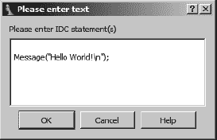
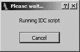
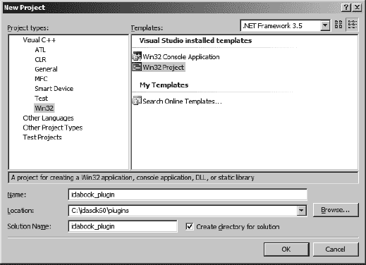
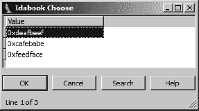
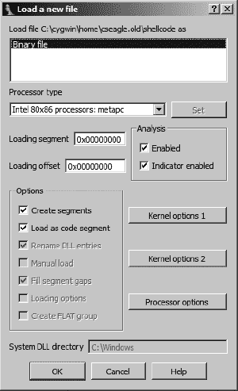
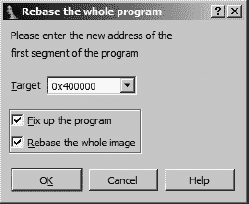
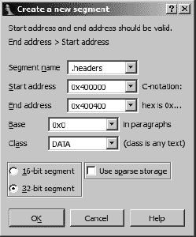
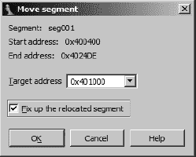

# 第四部分. 扩展 IDA 的功能

# 第十五章. IDA 脚本


这是一个简单的事实，没有任何应用程序能够满足每个用户的每个需求。根本无法预测可能出现的每一个潜在用例。应用程序开发者面临着回应无休止的功能请求或为用户提供解决他们自己问题的手段的选择。IDA 采取了后一种方法，通过集成脚本功能，允许用户对 IDA 的操作进行大量的程序性控制。

脚本的可能用途无限，可以从简单的单行命令到完整的程序，这些程序可以自动化常见任务或执行复杂分析功能。从自动化的角度来看，IDA 脚本可以被视为宏，^([95])而从分析的角度来看，IDA 的脚本语言作为查询语言，提供了对 IDA 数据库内容的程序性访问。IDA 支持使用两种不同的语言进行脚本编写。IDA 的原始、嵌入式脚本语言命名为*IDC*，可能是因为其语法与 C 语言非常相似。自 IDA 5.4 版本发布以来，^([96))通过集成 Gergely Erdelyi 的 IDAPython 插件，也支持了与 Python 的集成脚本。在本章的剩余部分，我们将介绍编写和执行 IDC 和 Python 脚本的基本知识，以及一些对脚本作者更有用的函数。

# 基本脚本执行

在深入了解任何脚本语言之前，了解脚本最常见的执行方式是有用的。有三个菜单选项，文件▸脚本文件、文件▸IDC 命令和文件▸Python 命令^([98])，可用于访问 IDA 的脚本引擎。选择文件▸脚本文件表示您希望运行一个独立的脚本，此时您将看到一个文件选择对话框，允许您选择要运行的脚本。每次运行新的脚本时，程序都会添加到最近脚本列表中，以便轻松编辑或重新运行脚本。图 15-1 显示了通过视图▸最近脚本菜单选项可访问的最近脚本窗口。


图 15-1. 最近脚本窗口

双击列表中的脚本会导致脚本执行。一个弹出式、上下文相关的菜单提供了从列表中删除脚本或使用在“选项”▸“常规”选项卡下指定的编辑器打开脚本进行编辑的选项。

作为执行独立脚本文件的替代方案，你可以选择使用“文件”▸“IDC 命令”或“文件”▸“Python 命令”打开脚本输入对话框。图 15-2 显示了由此产生的脚本输入对话框（在这种情况下为 IDC 脚本），在只想执行几个语句而不想麻烦创建独立脚本文件的情况下非常有用。



图 15-2. 脚本输入对话框

对可以在脚本对话框中输入的语句类型有一些限制，但对话框在创建完整的脚本文件过于繁琐的情况下非常有用。

执行脚本命令的最后一种简单方法是使用 IDA 的命令行。命令行仅在 IDA 的 GUI 版本中可用，其存在由`DISPLAY_COMMAND_LINE`选项在`*<IDADIR>/cfg/idagui.cfg`中的值控制。自 IDA 5.4 以来，命令行默认启用。图 15-3 显示了命令行在 IDA 工作区左下角输出窗口下方的外观。


图 15-3. IDA 命令行

将用于执行命令行的解释器标签位于命令行输入框的左侧。在图 15-3 中，命令行被配置为执行 IDC 语句。点击此标签将打开图 15-3 中显示的弹出菜单，允许将 IDC 或 Python 解释器与命令行关联。

尽管命令行只包含一行文本，但你可以通过分号分隔每个语句来输入多个语句。为了方便，可以使用上箭头键访问最近命令的历史记录。如果你发现自己经常需要执行非常短的脚本，你会发现命令行非常有用。

在掌握了执行脚本的基本能力之后，现在是时候关注 IDA 提供的两种脚本语言的细节了，即 IDC 和 Python。我们首先描述 IDA 的本地脚本语言 IDC，然后讨论 IDA 的 Python 集成，这将严重依赖于以下 IDC 部分建立的基础。

* * *

^([95]) 许多应用程序提供允许用户将一系列操作记录到一个称为*宏*的单一复杂操作中的功能。重新播放或触发宏会导致记录的所有步骤序列被执行。宏提供了一种自动化复杂操作序列的简单方法。

^([96]) 要获取每个新版本 IDA 引入的功能的完整列表，请访问 [`www.hex-rays.com/idapro/idanew48.htm`](http://www.hex-rays.com/idapro/idanew48.htm)。

^([97]) 请参阅 [`code.google.com/p/idapython/`](http://code.google.com/p/idapython/)

^([98]) 此选项仅在 Python 正确安装的情况下可用。有关详细信息，请参阅第三章。

# IDC 语言

与 IDA 中其他一些方面不同，IDA 的帮助系统中为 IDC 语言提供了一定程度的帮助。帮助系统顶层可用的主题包括*IDC 语言*，它涵盖了 IDC 语法的基础知识，以及*IDC 函数索引*，它提供了 IDC 程序员可用的内置函数的详尽列表。

IDC 是一种脚本语言，它从 C 语言中借用了大部分的语法元素。从 IDA 5.6 开始，随着面向对象功能和异常处理的引入，IDC 实际上更多地具有了 C++的风格。由于其与 C 和 C++的相似性，我们将用这些语言来描述 IDC，并主要关注 IDC 与这些语言的不同之处。

## IDC 变量

IDC 是一种弱类型语言，这意味着变量没有显式的类型。IDC 中使用的三个主要数据类型是整数（IDA 文档使用类型名*long*）、字符串和浮点值，绝大多数操作都是在整数和字符串上进行的。在 IDC 中，字符串被视为原生数据类型，无需跟踪存储字符串所需的空间或字符串是否以空字符终止。从 IDA 5.6 开始，IDC 包含了一些额外的变量类型，包括对象、引用和函数指针。

所有变量在使用之前都必须声明。IDC 支持局部变量，并且从 IDA 5.4 开始也支持全局变量。IDC 关键字`auto`用于引入局部变量声明，局部变量声明可以包括初始值。以下示例显示了合法的 IDC 局部变量声明：

```
auto addr, reg, val;   // legal, multiple variables declared with no initializers
auto count = 0;        // declaration with initialization
```

IDC 识别使用`/* */`的 C 风格多行注释和使用`//`的 C++风格行终止注释。此外，请注意，可以在单个语句中声明多个变量，并且 IDC 中的所有语句都使用分号（如 C 语言中一样）终止。IDC 不支持 C 风格数组（切片是在 IDA 5.6 中引入的），指针（尽管从 IDA 5.6 开始支持引用），或复杂数据类型，如结构和联合。类是在 IDA 5.6 中引入的。

使用`extern`关键字引入全局变量声明，并且它们的声明在函数定义内外都是合法的。在声明全局变量时提供初始值是不合法的。以下列表显示了两个全局变量的声明。

```
extern outsideGlobal;

static main() {
   extern insideGlobal;
   outsideGlobal = "Global";
   insideGlobal = 1;
}
```

全局变量在 IDA 会话期间首次遇到时分配，并且只要该会话保持活跃，就会持续存在，无论你打开和关闭了多少数据库。

## IDC 表达式

除了少数例外，IDC 支持几乎所有在 C 中可用的算术和逻辑运算符，包括三元运算符 (`? :`)。不支持形式为 `op=` 的复合赋值运算符（例如 `+=`, `*=`, `>>=` 等）。逗号运算符从 IDA 5.6 开始支持。所有整数操作数都被视为有符号值。这影响了整数比较（总是有符号的）和右移运算符 (`>>`)，它总是执行带符号位复制的算术右移。如果你需要逻辑右移，你必须自己实现，如以下示例所示：

```
result = (x >> 1) & 0x7fffffff;  //set most significant bit to zero
```

由于字符串在 IDC 中是原生类型，因此字符串上的某些操作在 IDC 中的含义与在 C 中可能不同。将字符串操作数赋值给字符串变量会导致字符串复制操作；因此不需要字符串复制或复制函数，如 C 的 `strcpy` 和 `strdup`。此外，两个字符串操作数的相加会导致两个操作数的连接；因此“Hello” + “World” 得到 “HelloWorld”；不需要连接函数，如 C 的 `strcat`。从 IDA 5.6 开始，IDC 为字符串提供了切片运算符。Python 程序员将熟悉切片，它基本上允许你指定类似数组的变量的子序列。切片使用方括号和起始（包含）和结束（不包含）索引来指定。至少需要一个索引。以下列表展示了 IDC 切片的使用。

```
auto str = "String to slice";
auto s1, s2, s3, s4;
s1 = str[7:9];     // "to"
s2 = str[:6];      // "String", omitting start index starts at 0
s3 = str[10:];     // "slice", omitting end index goes to end of string
s4 = str[5];       // "g", single element slice, similar to array element access
```

注意，尽管 IDC 中没有数组数据类型，但切片运算符实际上允许你将 IDC 字符串视为数组来处理。

## IDC 语句

与 C 一样，所有简单语句都以分号结束。IDC 不支持的唯一 C 风格的复合语句是 `switch` 语句。在使用 `for` 循环时，请注意，IDC 不支持复合赋值运算符，这可能影响你使用非一作为计数单位的愿望，如下所示：

```
auto i;
for (i = 0; i < 10; i += 2) {}     // illegal, += is not supported
for (i = 0; i < 10; i = i + 2) {}  // legal
```

在 IDA 5.6 中，IDC 引入了 `try`/`catch` 块以及相关的 `throw` 语句，这些在语法上与 C++ 异常类似.^([99]) IDA 的内置帮助文档包含了关于 IDC 异常处理实现的详细信息。

对于复合语句，IDC 使用与 C 相同的花括号 (`{}`) 语法和语义。在一个花括号块内，只要变量声明是该块内的第一条语句，就可以声明新的变量。然而，IDC 并不严格限制新引入变量的作用域，因为这些变量可能在其声明块之外被引用。考虑以下示例：

```
if (1) {    //always true
   auto x;
   x = 10;
}
else {      //never executes
   auto y;
   y = 3;
}
Message("x = %d\n", x);   // x remains accessible after its block terminates
Message("y = %d\n", y);   // IDC allows this even though the else did not execute
```

输出语句（`Message` 函数类似于 C 语言的 `printf` 函数）会告诉我们 `x = 10` 和 `y = 0`。鉴于 IDC 不严格强制执行 `x` 的作用域，我们被允许打印 `x` 的值并不令人特别惊讶。但有一点令人有些惊讶的是，`y` 竟然可以访问，考虑到声明 `y` 的代码块从未被执行。这仅仅是 IDC 的一个特性。请注意，尽管 IDC 可能会松散地强制函数内的变量作用域，但一个函数内声明的变量在其他任何函数中仍然无法访问。

## IDC 函数

IDC 仅支持在独立程序（*.idc* 文件）中定义用户自定义函数。当使用 IDC 命令对话框时（参见使用 IDC 命令对话框），不支持用户自定义函数。使用 IDC 命令对话框）。IDC 声明用户自定义函数的语法与 C 语言最不同。使用 `static` 关键字引入用户自定义函数，函数的参数列表仅由逗号分隔的参数名列表组成。以下列表详细说明了用户自定义函数的基本结构：

```
static my_func(x, y, z) {
   //declare any local variables first
   auto a, b, c;
   //add statements to define the function's behavior
   // ...
}
```

在 IDA 5.6 之前，所有函数参数都是严格按值传递的。在 IDA 5.6 中引入了按引用传递参数。有趣的是，参数是按值传递还是按引用传递，取决于函数的调用方式，而不是函数的声明方式。在函数调用中（*不是*函数声明）使用一元 `&` 操作符来表示参数是按引用传递的。以下示例展示了从上一个列表中调用 `my_func` 函数，使用了按值传递和按引用传递参数。

```
auto q = 0, r = 1, s = 2;
my_func(q, r, s);   //all three arguments passed using call-by-value
                    //upon return, q, r, and s hold 0, 1, and 2 respectively
my_func(q, &r, s);  //q and s passed call-by-value, r is passed call-by-reference
                    //upon return, q, and s hold 0 and 2 respectively, but r may have
                    //changed. In this second case, any changes
 that my_func makes to its
                    //formal parameter y will be reflected in the
 caller as changes to r
```

函数声明永远不会指示函数是否显式返回值，或者当函数产生结果时返回什么类型的值。

使用 IDC 命令对话框

IDC 命令对话框提供了一个简单的界面，用于输入短序列的 IDC 代码。命令对话框是一个快速输入和测试新脚本的好工具，无需创建独立的脚本文件。在使用命令对话框时，最重要的是要记住，*必须*不要在对话框内定义任何函数。本质上，IDA 将你的语句包裹在一个函数中，然后调用该函数以执行你的语句。如果你在对话框内定义了一个函数，最终效果将是一个函数内定义的函数，由于 IDC（或实际上 C 语言）不允许嵌套函数声明，这将导致语法错误。

当你希望从函数中返回一个值时，使用`return`语句来返回所需的值。在函数的不同执行路径中返回完全不同的数据类型是允许的。换句话说，一个函数在某些情况下可能返回一个字符串，而在其他情况下，同一个函数可能返回一个整数。与 C 语言一样，在函数中使用`return`语句是可选的。然而，与 C 语言不同，任何没有显式返回值的函数隐式返回的值是零。

最后一点，从 IDA 5.6 版本开始，函数在 IDC 中更接近成为一等对象。现在可以将函数引用作为参数传递给其他函数，并将函数引用作为函数的结果返回。以下列表展示了函数参数和函数作为返回值的使用。

```
static getFunc() {
   return Message;  //return the built-in Message function as a result
}

static useFunc(func, arg) {  //func here is expected to be a function reference
   func(arg);
}

static main() {
   auto f = getFunc();
   f("Hello World\n");       //invoke the returned function f
   useFunc(f, "Print me\n"); //no need for & operator,
 functions always call-by-reference
}
```

## IDC 对象

IDA 5.6 版本引入的另一个功能是定义类的能力，从而拥有表示对象变量的变量。在接下来的讨论中，我们假设你对面向对象编程语言（如 C++或 Java）有一定的了解。

IDA 脚本演变

如果你没有意识到 IDC 在 IDA 5.6 版本中引入了大量的更改，那么你可能没有注意到。在 IDA 5.4 版本中集成 IDAPython 之后，Hex-Rays 寻求复兴 IDC，导致本章中提到的许多功能在 IDA 5.6 版本中引入。在这个过程中，甚至考虑将 JavaScript 作为 IDA 脚本系列中可能的补充。（100）

IDC 定义了一个名为`object`的根类，所有类最终都从这个类派生出来，创建新类时支持单继承。IDC 不使用`public`和`private`等访问修饰符；所有类成员都是公开的。类声明只包含类的成员函数的定义。为了在类中创建数据成员，你只需创建一个将值赋给数据成员的赋值语句。以下列表将有助于阐明。

```
class ExampleClass {
   ExampleClass(x, y) {   //constructor
      this.a = x;         //all ExampleClass objects have data member a
      this.b = y;         //all ExampleClass objects have data member b
   }
   ~ExampleClass() {      //destructor
   }
   foo(x) {
      this.a = this.a + x;
   }
   //...   other member functions as desired
};

static main() {
   ExampleClass ex;            //DON'T DO THIS!! This is not
 a valid variable declaration
   auto ex = ExampleClass(1, 2);   //reference variables are initialized by assigning
                                   //the result of calling the class constructor
   ex.foo(10);                 //dot notation is used to access members
   ex.z = "string";            //object ex now has a member z, BUT the class does not
}
```

关于 IDC 类及其语法的更多信息，请参阅 IDA 内置帮助文件中的相应部分。

## IDC 程序

对于需要超过几个 IDC 语句的任何脚本应用程序，你可能会想创建一个独立的 IDC 程序文件。除了其他事情之外，将你的脚本保存为程序为你提供了一定程度的持久性和可移植性。

IDC 程序文件要求你使用用户定义的函数。至少，你必须定义一个名为`main`的函数，该函数不接受任何参数。在大多数情况下，你还会想包含文件`*idc.idc*`，以便获取其中包含的有用宏定义。以下列表详细说明了最小 IDC 程序文件的组件：

```
#include <idc.idc>    // useful include directive
//declare additional functions as required
static main() {
   //do something fun here
}
```

IDC 识别以下 C 风格预处理器指令：

**`#include`** `<file>`

在当前文件中包含指定的文件。

**`#define`** <名称> [可选值]

创建一个名为 *名称* 的宏，并可选择将其指定值分配给它。IDC 预定义了多个宏，可用于测试脚本执行环境的各个方面。这些包括 *_NT_*, *_LINUX_*, *_MAC_*, *_GUI_*, 和 `_TXT_*` 等等。有关这些和其他符号的更多信息，请参阅 IDA 帮助文件的*预定义符号*部分。

**`#ifdef`** <名称>

检查是否存在名为的宏，如果存在，则可选地处理任何后续语句。

**`#else`**

可与`#ifdef`一起使用，在名为的宏不存在时提供一组备选语句进行处理。

**`#endif`**

这是`#ifdef`或`#ifdef/#else`块的必需终止符。

**`#undef`** <名称>

删除指定的宏。

## IDC 中的错误处理

没有人会赞扬 IDC 的错误报告能力。在运行 IDC 脚本时，你可以期望遇到两种类型的错误：解析错误和运行时错误。

*解析错误*是那些阻止你的程序执行的错误，包括语法错误、对未定义变量的引用以及向函数提供错误数量的参数。在解析阶段，IDC 只报告它遇到的第一个解析错误。在某些情况下，错误消息正确地标识了错误的位置和类型（`hello_world.idc,20: 缺少分号`），而在其他情况下，错误消息没有提供真正的帮助（`语法错误附近：<END>`）。只报告解析过程中遇到的第一个错误。因此，在一个有 15 个语法错误的脚本中，可能需要运行 15 次脚本才能通知你每个错误。

*运行时错误*通常比解析错误遇到的频率低。当遇到时，运行时错误会导致脚本立即终止。一个运行时错误的例子是尝试调用一个未定义的函数，这个函数在脚本最初解析时由于某种原因没有被检测到。另一个问题是脚本执行时间过长。一旦脚本开始执行，如果它意外地陷入无限循环或执行时间超过你愿意等待的时间，就没有简单的方法来终止脚本。一旦脚本执行超过两到三秒，IDA 会显示图 15-4 中所示的对话框。

此对话框是终止无法正确终止的脚本的唯一方式。



图 15-4. 脚本取消对话框

调试是 IDC 的另一个弱点。除了大量使用输出语句外，没有其他方法可以调试 IDC 脚本。随着 IDA 5.6 中异常处理（`try/catch`）的引入，现在可以构建更健壮的脚本，可以优雅地终止或继续，就像你选择的那样。

## IDC 中的持久数据存储

也许你是那种好奇的类型，不相信我们会提供足够的 IDA 脚本功能覆盖，所以匆匆忙忙地去查看 IDA 帮助系统对这个主题有什么说法。如果是这样，欢迎回来，如果不是，我们感谢你一直坚持到现在。无论如何，在某个地方，你可能获得了关于 IDC 实际支持数组的知识，在这种情况下，你肯定在质疑这本书的质量。我们敦促你给我们一个机会来澄清这种潜在的混淆。

如前所述，IDC 不支持传统意义上的数组，即声明一个大块存储空间，然后使用下标符号来访问该块中的单个项目。然而，IDA 的脚本文档中提到了一种称为 *全局持久数组* 的东西。IDC 的全局数组最好被视为 *持久命名对象*。这些对象恰好是稀疏数组。^([101)] 全局数组存储在 IDA 数据库中，并且跨脚本调用和 IDA 会话持久存在。数据通过指定索引和要存储在数组指定索引处的数据值来存储在全局数组中。数组中的每个元素可以同时存储一个整数值和一个字符串值。IDC 的全局数组不提供存储浮点值的方法。

### 注意

对于过于好奇的人来说，IDA 存储持久数组的内部机制被称为 netnode。虽然接下来描述的数组操作函数提供了一个对 netnode 的抽象接口，但可以使用 IDA SDK 以较低级别访问 netnode 数据，SDK 与 netnode 一起在 第十六章 中讨论。

所有与全局数组的交互都通过使用 IDC 专门用于数组操作的函数来完成。以下是对这些函数的描述：

**`long CreateArray(string name)`**

此函数创建一个具有指定名称的持久对象。返回值是用于所有未来数组访问所需的整数句柄。如果指定的对象已经存在，则返回值是 −1。

**`long GetArrayId(string name)`**

一旦创建了一个数组，后续对数组的访问必须通过一个整数句柄来完成，这个句柄可以通过查找数组名称来获得。该函数的返回值是一个整数句柄，用于所有未来的数组交互。如果指定的数组不存在，则返回值是 −1。

**`long SetArrayLong(long id, long idx, long value)`**

将整数 `value` 存储到由 `id` 引用的数组中，位置由 `idx` 指定。成功时返回 1，失败时返回 0。如果数组 `id` 无效，则操作将失败。

**`long SetArrayString(long id, long idx, string str)`**

将字符串 `value` 存储到由 `id` 引用的数组中，位置由 `idx` 指定。成功时返回 1，失败时返回 0。如果数组 `id` 无效，则操作将失败。

**`string or long GetArrayElement(long tag, long id, long idx)`**

虽然根据要存储的数据类型有专门用于将数据存储到数组中的函数，但只有一个函数用于从数组中检索数据。此函数从指定的数组（`id`）中指定的索引（`idx`）检索整数或字符串值。检索整数或字符串由 `tag` 参数的值决定，该值必须是常量 `AR_LONG`（用于检索整数）或 `AR_STR`（用于检索字符串）之一。

**`long DelArrayElement(long tag, long id, long idx)`**

从指定的数组中删除指定位置的数组内容。`tag` 的值决定是否删除与指定索引关联的整数值或字符串值。

**`void DeleteArray(long id)`**

删除由 `id` 引用的数组及其所有相关内容。一旦创建了一个数组，它将继续存在，即使在脚本终止后，直到调用 `DeleteArray` 从创建它的数据库中删除数组。

**`long RenameArray(long id, string newname)`**

将由 `id` 引用的数组重命名为 `newname`。如果操作成功则返回 1，如果操作失败则返回 0。

全局数组的可能用途包括近似全局变量、近似复杂数据类型以及在脚本调用之间提供持久存储。脚本的全局变量通过在脚本开始时创建全局数组并在数组中存储全局值来模拟。这些全局值通过将数组句柄传递给需要访问这些值的函数或要求任何需要访问的函数执行所需数组的名称查找来共享。

存储在 IDC 全局数组中的值在脚本执行的生命周期内持续存在。您可以通过检查 `CreateArray` 函数的返回值来测试数组的存在。如果数组中存储的值仅适用于脚本的一次特定调用，则应在脚本终止之前删除该数组。删除数组确保没有全局值从一个脚本的执行延续到同一脚本的后续执行。

* * *

^([99]) 查看 [`www.cplusplus.com/doc/tutorial/exceptions/`](http://www.cplusplus.com/doc/tutorial/exceptions/).

^([100]) 查看 [`www.hexblog.com/?p=101`](http://www.hexblog.com/?p=101)

^([101]) 稀疏数组不一定为整个数组预分配空间，也不受特定最大索引的限制。相反，当向数组添加元素时，将根据需要为数组元素分配空间。

# 将 IDC 脚本与热键关联

有时您可能会开发出如此出色的脚本，以至于您必须通过几个按键来访问它。当这种情况发生时，您将希望分配一个热键序列，以便您可以快速激活您的脚本。幸运的是，IDA 提供了一种简单的方法来实现这一点。每次启动 IDA 时，都会执行包含在 *<IDADIR>/idc/ida.idc* 中的脚本。此脚本的默认版本包含一个空的 `main` 函数，因此不会执行任何操作。要将热键与您的脚本之一关联，您需要向 *ida.idc* 中添加两行。您必须添加的第一行是 `include` 指令，用于将您的脚本文件包含在 *ida.idc* 中。您必须添加的第二行是在 `main` 中调用 `AddHotkey` 函数，以将特定的热键与您惊人的 IDC 函数关联。这可能会使 *ida.idc* 看起来像这样：

```
#include <idc.idc>
#include <my_amazing_script.idc>
static main() {
   AddHotkey("z", "MyAmazingFunc");  //Now 'z' invokes MyAmazingFunc
}
```

如果您尝试关联到脚本的热键已经被分配给了另一个 IDA 动作（菜单热键或插件激活序列），则 `AddHotkey` 将静默失败，除了您在激活热键序列时函数无法执行的事实外，没有其他方式可以检测到失败。

这里有两个重要的点：IDC 脚本的标准包含目录是 *<IDADIR>/idc*，并且您不得将您的脚本函数命名为 `main`。如果您希望 IDA 能够轻松找到您的脚本，您可以将它复制到 *<IDADIR>/idc* 中。如果您打算将您的脚本文件留在另一个位置，那么您需要在 `include` 语句中指定脚本的全路径。在测试您的脚本时，将脚本作为具有 `main` 函数的独立程序运行将非常有用。然而，一旦您准备好将脚本与热键关联，您就不能使用 `main` 名称，因为它将与 *ida.idc* 中的 `main` 函数冲突。您必须重命名您的 `main` 函数，并在调用 `AddHotkey` 时使用新名称。

# 有用的 IDC 函数

到目前为止，你已经拥有了编写良好格式 IDC 脚本所需的所有信息。你所缺乏的是与 IDA 本身进行任何有用交互的能力。IDC 提供了一系列内置函数，提供了许多访问数据库的不同方式。所有这些函数都在 IDA 帮助系统中的“IDC 函数索引”主题下进行了某种程度的文档说明。在大多数情况下，文档只是从主 IDC 包含文件`idc.idc`中复制的相关行。熟悉这种相当简略的文档是学习 IDC 时更加令人沮丧的方面之一。一般来说，没有简单的方法来回答“如何在 IDC 中做*x*？”这个问题。最常见的方法是浏览 IDC 函数列表，寻找一个根据其名称似乎能完成你所需要的功能。当然，这假设函数的命名是根据其目的来命名的，但它们的目的可能并不总是显而易见。例如，在许多情况下，从数据库检索信息的函数被命名为`Get`*`XXX`*；然而，在许多其他情况下，并不使用`Get`前缀。更改数据库的函数可能被命名为`Set`*`XXX`*、`Make`*`XXX`*或完全不同的名称。总之，如果你想使用 IDC，就要习惯浏览函数列表并阅读它们的描述。如果你发现自己完全不知所措，不要害怕使用 Hex-Rays 的支持论坛。^([[102])]

本节剩余部分的目的在于指出一些更有用（根据我们的经验）的 IDC 函数，并将它们分组到功能区域。即使你只打算用 Python 编写脚本，熟悉列出的函数也将对你有所帮助，因为 IDAPython 为这里列出的每个函数都提供了 Python 等效函数。然而，我们并不试图涵盖每个 IDC 函数，因为它们已经在 IDA 帮助系统中有所介绍。

## 读取和修改数据的函数

以下函数提供对数据库中单个字节、字和双字的访问：

**`long Byte(long addr)`**

从虚拟地址`addr`读取一个字节值。

**`long Word(long addr)`**

从虚拟地址`addr`读取一个字（2 字节）值。

**`long Dword(long addr)`**

从虚拟地址`addr`读取一个双字（4 字节）值。

**`void PatchByte(long addr, long val)`**

在虚拟地址`addr`设置一个字节值。

**`void PatchWord(long addr, long val)`**

在虚拟地址`addr`设置一个字值。

**`void PatchDword(long addr, long val)`**

在虚拟地址`addr`设置一个双字值。

**`bool isLoaded(long addr)`**

如果`addr`包含有效数据，则返回 1，否则返回 0。

这些函数在读取和写入数据库时都会考虑到当前处理器模块的字节序（小端或大端）。`Patch`*`XXX`* 函数还会通过仅使用调用函数的正确数量的低阶字节来修剪提供的值到适当的大小。例如，对 `PatchByte(0x401010, 0x1234)` 的调用将使用 `0x34`（`0x1234` 的低阶字节）修补位置 `0x401010`。如果在用 `Byte`、`Word` 和 `Dword` 读取数据库时提供了无效地址，将分别返回 `0xFF`、`0xFFFF` 和 `0xFFFFFFFF` 的值。由于无法区分这些错误值和数据库中存储的合法数据，您可能希望在尝试从该地址读取之前调用 `isLoaded` 来确定数据库中的地址是否包含任何数据。

由于 IDA 反汇编视图刷新的一个怪癖，您可能会发现修补操作的结果不会立即可见。在这种情况下，从修补位置滚动离开，然后滚动回修补位置通常可以强制正确更新显示。

## 用户交互函数

为了执行任何用户交互，您需要熟悉 IDC 输入/输出函数。以下列表总结了 IDC 一些更有用的接口函数：

**`void Message(string format, ...)`**

将格式化的消息打印到输出窗口。此函数类似于 C 的 `printf` 函数，并接受 `printf` 风格的格式字符串。

**`void print(...)`**

将每个参数的字符串表示打印到输出窗口。

**`void Warning(string format, ...)`**

在对话框中显示格式化的消息。

**`string AskStr(string default, string prompt)`**

显示一个输入对话框，提示用户输入字符串值。返回用户的字符串或 0（如果对话框被取消）。

**`string AskFile(long doSave, string mask, string prompt)`**

显示文件选择对话框以简化选择文件的任务。可以创建新文件以保存数据（`doSave = 1`），或选择现有文件以读取数据（`doSave = 0`）。显示的文件列表可以根据 `mask`（例如 `*.*` 或 `*.idc`）进行筛选。返回所选文件的名称或 0（如果对话框被取消）。

**`long AskYN(long default, string prompt)`**

提出一个是或否的问题，突出显示默认答案（1 = 是，0 = 否，-1 = 取消）。返回表示所选答案的整数。

**`long ScreenEA()`**

返回当前光标位置的虚拟地址。

**`bool Jump(long addr)`**

将反汇编窗口跳转到指定的地址。

由于 IDC 缺少任何调试功能，您可能会发现自己将`Message`函数作为主要的调试工具。存在几个其他`Ask`*`XXX`*函数，用于处理更专业的输入情况，例如整数输入。请参阅帮助系统文档以获取可用`Ask`*`XXX`*函数的完整列表。`ScreenEA`函数在您希望创建基于光标位置的脚本时非常有用。同样，`Jump`函数在您需要脚本调用用户的注意力到反汇编中的特定位置时非常有用。

## 字符串操作函数

虽然 IDC 中使用基本运算符可以处理简单的字符串赋值和连接，但更复杂的操作必须使用可用的字符串处理函数来完成，其中一些在此处详细介绍：

**`string form(string format, ...) // pre IDA 5.6`**

返回一个根据提供的格式字符串和值格式化的新字符串。这大致等同于 C 语言的`sprintf`函数。

**`string sprintf(string format, ...) // IDA 5.6+`**

在 IDA 5.6 中，`sprintf`替换了`form`（见上文）。

**`long atol(string val)`**

将十进制值`val`转换为相应的整数表示。

**`long xtol(string val)`**

将十六进制值`val`（可能以`0x`开头）转换为相应的整数表示。

**`string ltoa(long val, long radix)`**

返回`val`在指定`radix`（2、8、10 或 16）中的字符串表示。

**`long ord(string ch)`**

返回单字符字符串`ch`的 ASCII 值。

**`long strlen(string str)`**

返回提供的字符串的长度。

**`long strstr(string str, string substr)`**

返回`substr`在`str`中的索引，如果子字符串未找到，则返回-1。

**`string substr(string str, long start, long end)`**

返回包含从`start`到`end-1`字符的子字符串。使用切片（IDA 5.6+），此函数等同于`str[start:end]`。

请记住，IDC 中没有字符数据类型，也没有数组语法。由于缺少切片，如果您想遍历字符串中的单个字符，您必须对字符串中的每个字符取连续的一个字符子字符串。

## 文件输入/输出函数

输出窗口可能并非总是发送脚本输出（尤其是生成大量文本或二进制数据的脚本）的理想位置。对于希望将输出保存到磁盘文件的脚本，您可能希望将其输出到磁盘文件。我们已经讨论了使用`AskFile`函数请求用户输入文件名。然而，`AskFile`仅返回包含文件名的字符串。IDC 的文件处理函数在此处详细介绍：

**`long fopen(string filename, string mode)`**

返回一个整数文件句柄（或错误时返回 0），用于与所有 IDC 文件 I/O 函数一起使用。`mode` 参数类似于 C 的 `fopen` 中使用的模式（例如，`r` 用于读取，`w` 用于写入等）。

**`void fclose(long handle)`**

关闭由 `fopen` 指定的文件。

**`long filelength(long handle)`**

返回指定文件的长度或错误时返回 -1。

**`long fgetc(long handle)`**

从给定文件中读取一个字节。错误时返回 -1。

**`long fputc(long val, long handle)`**

将一个字节写入给定文件。成功时返回 0 或错误时返回 -1。

**`long fprintf(long handle, string format, ...)`**

将格式化的字符串写入给定文件。

**`long writestr(long handle, string str)`**

将指定的字符串写入给定文件。

**`string/long readstr(long handle)`**

从给定文件中读取一个字符串。此函数读取所有字符（包括非 ASCII 字符）直到并包括下一个换行符（ASCII 0xA）字符。成功时返回字符串或错误时返回 -1。

**`long writelong(long handle, long val, long bigendian)`**

使用大端（`bigendian` = 1）或小端（`bigendian` = 0）字节顺序将一个 4 字节整数写入给定文件。

**`long readlong(long handle, long bigendian)`**

使用大端（`bigendian` = 1）或小端（`bigendian` = 0）字节顺序从给定文件中读取一个 4 字节整数。

**`long writeshort(long handle, long val, long bigendian)`**

使用大端（`bigendian` = 1）或小端（`bigendian` = 0）字节顺序将一个 2 字节整数写入给定文件。

**`long readshort(long handle, long bigendian)`**

使用大端（`bigendian` = 1）或小端（`bigendian` = 0）字节顺序从给定文件中读取一个 2 字节整数。

**`bool loadfile(long handle, long pos, long addr, long length)`**

从给定文件的位置 `pos` 读取 `length` 个字节并将这些字节写入从地址 `addr` 开始的数据库。

**`bool savefile(long handle, long pos, long addr, long length)`**

将从数据库地址 `addr` 开始的 `length` 个字节写入给定文件的位置 `pos`。

## 操作数据库名称

在脚本中，经常需要操作命名位置。以下 IDC 函数可用于在 IDA 数据库中处理命名位置：

**`string Name(long addr)`**

返回与给定地址关联的名称或如果位置没有名称则返回空字符串。此函数在名称标记为本地时不会返回用户指定的名称。

**`string NameEx(long from, long addr)`**

返回与 `addr` 关联的名称。如果 `from` 是包含 `addr` 的函数中的任何地址，则返回用户定义的本地名称。

**`bool MakeNameEx(long addr, string name, long flags)`**

将给定的名称分配给给定的地址。名称通过在`flags`位掩码中指定的属性创建。这些标志在`MakeNameEx`的帮助文件文档中描述，用于指定名称是否为本地或公共，或者是否应在名称窗口中列出。

**`long LocByName(string name)`**

返回具有给定名称的位置地址。如果数据库中不存在此类名称，则返回 BADADDR（-1）。

**`long LocByNameEx(long funcaddr, string localname)`**

在包含`funcaddr`的函数内搜索给定的本地名称。如果给定函数中不存在此类名称，则返回 BADADDR（-1）。

## 处理函数的函数

许多脚本被设计用于在数据库中执行函数分析。IDA 为反汇编函数分配了多个属性，例如函数局部变量区域的大小或函数在运行时栈上的参数大小。以下 IDC 函数可用于访问数据库中函数的信息。

**`long GetFunctionAttr(long addr, long attrib)`**

返回包含给定地址的函数的请求属性。有关属性常量的列表，请参阅 IDC 帮助文档。例如，要查找函数的结束地址，请使用**`GetFunctionAttr(addr, FUNCATTR_END);`**。

**`string GetFunctionName(long addr)`**

返回包含给定地址的函数的名称，或者如果给定地址不属于函数，则返回空字符串。

**`long NextFunction(long addr)`**

返回给定地址之后下一个函数的起始地址。如果数据库中没有更多函数，则返回-1。

**`long PrevFunction(long addr)`**

返回给定地址之前最近函数的起始地址。如果给定地址之前没有函数，则返回-1。

使用`LocByName`函数根据函数的名称查找函数的起始地址。

## 代码交叉引用函数

交叉引用在第九章中进行了介绍。IDC 提供了访问与任何指令相关的交叉引用信息的函数。决定哪些函数满足你的脚本需求可能会有些困惑。这需要你理解你是否对跟踪给定地址离开的流程感兴趣，或者你是否对迭代所有引用给定地址的位置感兴趣。描述了执行上述两种操作的函数。其中一些函数旨在支持对一组交叉引用的迭代。这些函数支持交叉引用序列的概念，并需要一个`当前`交叉引用来返回一个`下一个`交叉引用。在枚举交叉引用中提供了使用交叉引用迭代器的示例。

**`long Rfirst(long from)`**

返回给定地址传递控制权的第一个位置。如果给定地址不引用其他地址，则返回 BADADDR（-1）。

**`long Rnext(long from, long current)`**

在`current`已经被前一个调用`Rfirst`或`Rnext`返回的情况下，返回给定地址（`from`）传递控制权的下一个位置。如果没有更多交叉引用存在，则返回 BADADDR。

**`long XrefType()`**

返回一个常量，指示由交叉引用查找函数（如`Rfirst`）返回的最后一个交叉引用的类型。对于代码交叉引用，这些常量是`fl_CN`（近调用）、`fl_CF`（远调用）、`fl_JN`（近跳转）、`fl_JF`（远跳转）和`fl_F`（普通顺序流程）。

**`long RfirstB(long to)`**

返回将控制权传递给给定地址的第一个位置。如果没有引用给定地址，则返回 BADADDR（-1）。

**`long RnextB(long to, long current)`**

在`current`已经被前一个调用`RfirstB`或`RnextB`返回的情况下，返回将控制权传递给给定地址的下一个位置。如果没有更多指向给定位置的交叉引用，则返回 BADADDR。

每次调用交叉引用函数时，都会设置一个内部 IDC 状态变量，指示返回的最后一个交叉引用的类型。如果你需要知道你收到了哪种类型的交叉引用，那么你必须在使用另一个交叉引用查找函数之前调用`XrefType`。

## 数据交叉引用函数

访问数据交叉引用信息的函数与用于访问代码交叉引用信息的函数非常相似。这些函数在此进行描述：

**`long Dfirst(long from)`**

返回给定地址引用数据值的第一个位置。如果给定地址不引用其他地址，则返回 BADADDR（-1）。

**`long Dnext(long from, long current)`**

返回指向给定地址（`from`）的数据值的下一个位置，前提是`current`已经被前一个对`Dfirst`或`Dnext`的调用返回。如果没有更多交叉引用存在，则返回 BADADDR。

**`long XrefType()`**

返回一个常数，指示由`Dfirst`等交叉引用查找函数返回的最后一个交叉引用的类型。对于数据交叉引用，这些常数包括`dr_O`（取偏移量）、`dr_W`（数据写入）和`dr_R`（数据读取）。

**`long DfirstB(long to)`**

返回指向给定地址的数据的第一个位置。如果没有指向给定地址的引用，则返回 BADADDR（-1）。

**`long DnextB(long to, long current)`**

返回指向给定地址（`to`）的数据的下一个位置，前提是`current`已经被前一个对`DfirstB`或`DnextB`的调用返回。如果没有更多指向给定位置的交叉引用，则返回 BADADDR。

与代码交叉引用一样，如果您需要知道您收到了哪种类型的交叉引用，那么在调用另一个交叉引用查找函数之前，您必须调用`XrefType`。

## 数据库操作函数

存在许多用于格式化数据库内容的函数。以下是这些函数的一些描述：

**`void MakeUnkn(long addr, long flags)`**

在指定地址取消定义项目。标志（参见`MakeUnkn`的 IDC 文档）决定了后续项目是否也会被取消定义，以及与取消定义的项目关联的任何名称是否会被删除。相关函数`MakeUnknown`允许您取消定义大量数据块。

**`long MakeCode(long addr)`**

将指定地址的字节转换为指令。如果操作失败，则返回指令的长度或 0。

**`bool MakeByte(long addr)`**

将指定地址的项目转换为数据字节。`MakeWord`和`MakeDword`也是可用的。

**`bool MakeComm(long addr, string comment)`**

在给定地址添加常规注释。

**`bool MakeFunction(long begin, long end)`**

将从`begin`到`end`的指令范围转换为函数。如果将`end`指定为`BADADDR (-1)`，IDA 将尝试通过定位函数的返回指令来自动识别函数的结束。

**`bool MakeStr(long begin, long end)`**

创建一个字符串，该字符串是当前字符串类型（由`GetStringType`返回），跨越从`begin`到`end - 1`的字节。如果将`end`指定为`BADADDR`，IDA 将尝试通过自动识别字符串的结束。

存在许多其他`Make`*`XXX`*函数，它们提供与上述函数类似的行为。请参阅 IDC 文档以获取这些函数的完整列表。

## 数据库搜索函数

IDA 的大多数搜索功能都以各种`Find`*`XXX`*函数的形式在 IDC 中提供，其中一些在此处进行了描述。`Find`*`XXX`*函数中使用的`flags`参数是一个位掩码，用于指定查找操作的行为。其中三个更有用的标志是`SEARCH_DOWN`，它使搜索扫描向更高地址；`SEARCH_NEXT`，它跳过当前出现以搜索下一个出现；以及`SEARCH_CASE`，它使二进制和文本搜索以区分大小写的方式进行。

**`long FindCode(long addr, long flags)`**

从给定地址搜索指令。

**`long FindData(long addr, long flags)`**

从给定地址搜索数据项。

**`long FindBinary(long addr, long flags, string binary)`**

从给定地址搜索一系列字节。`binary`字符串指定一系列十六进制字节值。如果没有指定`SEARCH_CASE`，并且字节值指定大写或小写 ASCII 字母，则搜索也将匹配相应的互补大小写值。例如，“41 42”将匹配“61 62”（以及“61 42”），除非设置了`SEARCH_CASE`标志。

**`long FindText(long addr, long flags, long row, long column, string text)`**

从给定地址的给定行（`row`）的给定列（`column`）开始搜索`text`字符串。请注意，给定地址的汇编文本可能跨越多行，因此需要指定搜索应从哪一行开始。

还要注意，`SEARCH_NEXT`不定义搜索方向，这可能向上或向下，具体取决于`SEARCH_DOWN`标志。此外，当未指定`SEARCH_NEXT`时，如果`addr`处的项目满足搜索条件，`Find`*`XXX`*函数返回与作为`addr`参数传入的相同地址是完全合理的。

## 汇编行组件

有时从汇编列表中的单个行提取文本或文本的部分是有用的。以下函数提供了访问汇编行各种组件的权限：

**`string GetDisasm(long addr)`**

返回给定地址的汇编文本。返回的文本包括任何注释，但不包括地址信息。

**`string GetMnem(long addr)`**

返回给定地址上指令的助记符部分。

**`string GetOpnd(long addr, long opnum)`**

返回指定地址上指定操作数的文本表示。操作数从零开始编号，从最左边的操作数开始。

**`long GetOpType(long addr, long opnum)`**

返回表示给定地址上给定操作数类型的整数。有关`GetOpType`的完整操作数类型代码列表，请参阅 IDC 文档。

**`long GetOperandValue(long addr, long opnum)`**

返回给定地址处与给定操作数关联的整数值。返回值的性质取决于由`GetOpType`指定的给定操作数的类型。

**`string CommentEx(long addr, long type)`**

返回给定地址处存在的任何注释的文本。如果`type`为 0，则返回常规注释的文本。如果`type`为 1，则返回可重复注释的文本。如果给定地址处不存在注释，则返回空字符串。

* * *

^([102]) 当前支持论坛位于 [`www.hex-rays.com/forum/`](http://www.hex-rays.com/forum/)

# IDC 脚本示例

在这一点上，查看一些执行特定任务的脚本示例可能是有用的。在本章的剩余部分，我们将展示一些相当常见的情况，在这些情况下，脚本可以用来回答有关数据库的问题。

## 枚举函数

许多脚本操作单个函数。例如，生成以特定函数为根的调用树，生成函数的控制流图，或分析数据库中每个函数的栈帧。示例 15-1 遍历数据库中的每个函数，并打印每个函数的基本信息，包括函数的起始和结束地址、函数参数的大小以及函数局部变量的大小。所有输出都发送到输出窗口。

示例 15-1. 函数枚举脚本

```
#include <idc.idc>
static main() {
   auto addr, end, args, locals, frame, firstArg, name, ret;
   addr = 0;
   for (addr = NextFunction(addr); addr != BADADDR; addr = NextFunction(addr)) {
      name = Name(addr);
      end = GetFunctionAttr(addr, FUNCATTR_END);
      locals = GetFunctionAttr(addr, FUNCATTR_FRSIZE);
      frame = GetFrame(addr);     // retrieve a handle to the function's stack frame
      ret = GetMemberOffset(frame, " r");  // " r" is the name of the return address
      if (ret == −1) continue;
      firstArg = ret + 4;
      args = GetStrucSize(frame) - firstArg;
      Message("Function: %s, starts at %x, ends at %x\n", name, addr, end);
      Message("   Local variable area is %d bytes\n", locals);
      Message("   Arguments occupy %d bytes (%d args)\n", args, args / 4);
   }
}
```

此脚本使用 IDC 的结构操作函数来获取每个函数的栈帧句柄（`GetFrame`），确定栈帧的大小（`GetStrucSize`），并确定栈帧中保存的返回地址的偏移量（`GetMemberOffset`）。函数的第一个参数位于保存的返回地址之后 4 个字节处。函数的参数区域大小是通过第一个参数和栈帧末尾之间的空间计算得出的。由于 IDA 无法为导入的函数生成栈帧，此脚本通过检查函数的栈帧是否包含保存的返回地址作为识别导入函数调用的简单方法。

## 枚举指令

在给定的函数内，你可能想要枚举每个指令。示例 15-2 计算了由当前光标位置确定的函数中包含的指令数量：

示例 15-2. 指令枚举脚本

```
#include <idc.idc>
  static main() {
     auto func, end, count, inst;
    func = GetFunctionAttr(ScreenEA(), FUNCATTR_START);
     if (func != −1) {
       end = GetFunctionAttr(func, FUNCATTR_END);
        count = 0;
        inst = func;
        while (inst < end) {
             count++;
          inst = FindCode(inst, SEARCH_DOWN | SEARCH_NEXT);
        }
        Warning("%s contains %d instructions\n", Name(func), count);
     }
     else {
        Warning("No function found at location %x", ScreenEA());
     }
  }
```

函数的起始是通过使用 `GetFunctionAttr` 来确定包含光标地址（`ScreenEA()`）的函数的起始地址来开始的 。如果找到了函数的起始点，下一步  是确定函数的结束地址，再次使用 `GetFunctionAttr` 函数。一旦函数被界定，就通过使用 `FindCode` 函数的搜索功能  来执行一个循环，逐个遍历函数中的连续指令。在这个例子中，使用 `Warning` 函数来显示结果，因为函数将只生成一行输出，并且警告对话框中显示的输出比消息窗口中生成的输出更明显。请注意，此示例假设给定函数中的所有指令都是连续的。另一种方法可能用迭代函数中每个指令的所有代码交叉引用的逻辑来替换 `FindCode` 的使用。正确编写的话，第二种方法将能够处理非连续的，也称为“分块”的函数。

## 遍历交叉引用

由于可用的访问交叉引用数据的函数数量以及代码交叉引用的双向性，遍历交叉引用可能会令人困惑。为了获取所需的数据，您需要确保您正在访问适合您情况的正确类型的交叉引用。在我们的第一个交叉引用示例中，如 示例 15-3 所示，我们通过遍历函数中的每个指令来确定指令是否调用另一个函数，从而推导出函数内所有函数调用的列表。完成这一任务的一种方法可能是解析 `GetMnem` 的结果以查找 `call` 指令。这不会是一个非常通用的解决方案，因为用于调用函数的指令在不同类型的 CPU 之间是不同的。其次，还需要进行额外的解析来确定被调用的确切函数。交叉引用避免了这些困难，因为它们与 CPU 无关，并且直接告诉我们交叉引用的目标。

示例 15-3. 遍历函数调用

```
#include <idc.idc>
static main() {
  auto func, end, target, inst, name, flags, xref;
  flags = SEARCH_DOWN | SEARCH_NEXT;
  func = GetFunctionAttr(ScreenEA(), FUNCATTR_START);
  if (func != −1) {
    name = Name(func);
    end = GetFunctionAttr(func, FUNCATTR_END);
    for (inst = func; inst < end; inst = FindCode(inst, flags)) {
      for (target = Rfirst(inst); target != BADADDR; target = Rnext(inst, target)) {
        xref = XrefType();
        if (xref == fl_CN || xref == fl_CF) {
          Message("%s calls %s from 0x%x\n", name, Name(target), inst);
        }
      }
    }
  }
  else {
    Warning("No function found at location %x", ScreenEA());
  }
}
```

在这个例子中，我们必须遍历函数中的每个指令。对于每个指令，我们必须然后遍历从指令出发的每个交叉引用。我们只对调用其他函数的交叉引用感兴趣，因此我们必须测试`XrefType`的返回值，寻找`fl_CN`或`fl_CF`类型的交叉引用。在这里，这个特定的解决方案只处理指令连续的函数。鉴于脚本已经遍历了每个指令的交叉引用，要产生这里看到的地址驱动分析而不是流驱动分析，只需进行很少的修改。

另一个使用交叉引用的用途是确定引用特定位置的每个位置。例如，如果我们想创建一个低成本的安全分析器，我们可能会对突出显示所有调用诸如`strcpy`和`sprintf`等函数的调用感兴趣。

**危险函数**

C 函数`strcpy`和`sprintf`通常被认为使用起来很危险，因为它们允许无限制地复制到目标缓冲区。虽然每个函数都可以安全地由对源和目标缓冲区大小进行适当检查的程序员使用，但这样的检查往往被不了解这些函数危险性的程序员所遗忘。例如，`strcpy`函数声明如下：

```
char *strcpy(char *dest, const char *source);
```

`strcpy`函数的定义行为是将源缓冲区中遇到的所有字符（包括第一个空终止字符）复制到指定的目标缓冲区（`dest`）。基本问题是无法在运行时确定任何数组的大小。在这种情况下，`strcpy`没有确定目标缓冲区容量是否足以容纳从源复制的数据的手段。这种未经检查的复制操作是缓冲区溢出漏洞的主要原因。

在示例 15-4 中所示，我们反向操作以遍历所有指向特定符号的交叉引用（与上一个示例中的从特定符号出发相反）：

示例 15-4. 列出函数的调用者

```
#include <idc.idc>
  static list_callers(bad_func) {
     auto func, addr, xref, source;
    func = LocByName(bad_func);
     if (func == BADADDR) {
        Warning("Sorry, %s not found in database", bad_func);
     }
     else {
       for (addr
 = RfirstB(func); addr != BADADDR; addr = RnextB(func, addr)) {
         xref = XrefType();
         if (xref == fl_CN || xref == fl_CF) {
             source = GetFunctionName(addr);
             Message
("%s is called from 0x%x in %s\n", bad_func, addr, source);
           }
        }
     }
  }
  static main() {
     list_callers("_strcpy");
     list_callers("_sprintf");
  }
```

在这个例子中，使用`LocByName`函数来查找给定（按名称）的坏函数的地址。如果找到了函数的地址，就会执行一个循环来处理所有指向坏函数的交叉引用。对于每个交叉引用，如果确定交叉引用类型是调用类型的交叉引用，就会确定调用函数的名称并将其显示给用户。

重要的一点是，可能需要对导入函数的名称进行一些修改才能正确查找。特别是在 ELF 可执行文件中，特别是将过程链接表（PLT）与全局偏移表（GOT）结合使用以处理链接到共享库的细节，IDA 分配给导入函数的名称可能不够清晰。例如，PLT 条目可能看起来被命名为 `_memcpy`，但实际上它被命名为 `.memcpy`，而 IDA 将点替换为下划线，因为 IDA 认为点在名称中是无效字符。更复杂的是，IDA 实际上可能创建一个名为 `memcpy` 的符号，它位于 IDA 命名的 `extern` 部分中。当尝试枚举 `memcpy` 的交叉引用时，我们感兴趣的符号是 PLT 版本，因为这是程序中其他函数调用的版本，因此所有交叉引用都会引用这个版本。

## 枚举导出函数

在 第十三章 中，我们讨论了使用 `idsutils` 生成 *.ids* 文件，这些文件描述了共享库的内容。回想一下，生成 *.ids* 文件的第一个步骤是生成 *.idt* 文件，这是一个包含库中每个导出函数描述的文本文件。IDC 包含遍历由共享库导出的函数的函数。在 示例 15-5 中显示的脚本可以在使用 IDA 打开共享库后运行以生成 *.idt* 文件：

示例 15-5. 生成 *.idt* 文件的脚本

```
#include <idc.idc>
static main() {
   auto entryPoints, i, ord, addr, name, purged, file, fd;
   file = AskFile(1, "*.idt", "Select IDT save file");
   fd = fopen(file, "w");
   entryPoints = GetEntryPointQty();
   fprintf(fd, "ALIGNMENT 4\n");
   fprintf(fd, "0 Name=%s\n", GetInputFile());
   for (i = 0; i < entryPoints; i++) {
      ord = GetEntryOrdinal(i);
      if (ord == 0) continue;
      addr = GetEntryPoint(ord);
      if (ord == addr) {
         continue; //entry point has no ordinal
      }
      name = Name(addr);
      fprintf(fd, "%d Name=%s", ord, name);
      purged = GetFunctionAttr(addr, FUNCATTR_ARGSIZE);
      if (purged > 0) {
         fprintf(fd, " Pascal=%d", purged);
      }
      fprintf(fd, "\n");
   }
}
```

脚本的输出保存到用户选择的文件中。此脚本中引入的新函数包括 `GetEntryPointQty`，它返回库导出的符号数量；`GetEntryOrdinal`，它返回一个序号（库导出表的索引）；`GetEntryPoint`，它返回通过序号识别的导出函数的地址；以及 `GetInputFile`，它返回加载到 IDA 中的文件名。

## 查找和标记函数参数

GCC 3.4 之后的版本在 x86 二进制文件中使用 `mov` 指令而不是 `push` 指令将函数参数放入栈中，在调用函数之前。偶尔这会给 IDA 的分析带来一些问题（IDA 的新版本处理这种情况更好），因为分析引擎依赖于找到 `push` 指令来定位函数调用中参数被推入的位置。以下列表显示了当参数被推入栈时的 IDA 汇编：

```
.text:08048894                 push    0               ; protocol
.text:08048896                 push    1               ; type
.text:08048898                 push    2               ; domain
.text:0804889A                 call    _socket
```

注意 IDA 在右页边距放置的注释。这种注释只有在 IDA 识别出参数被推入栈中，并且 IDA 知道被调用函数的签名时才可能实现。当使用 `mov` 语句将参数放置到栈上时，生成的反汇编结果相对不那么具有信息量，如下所示：

```
.text:080487AD                 mov     [esp+8], 0
.text:080487B5                 mov     [esp+4], 1
.text:080487BD                 mov     [esp], 2
.text:080487C4                 call    _socket
```

在这种情况下，IDA 未识别出在调用之前的三个 `mov` 语句被用来设置函数调用的参数。因此，我们在反汇编中得到的自动注释形式的帮助较少。

在这里，脚本可能能够恢复我们在反汇编中习惯看到的一些信息。示例 15-6 是自动识别为函数调用设置参数的指令的初步尝试：

示例 15-6. 自动化参数识别

```
#include <idc.idc>
static main() {
  auto addr, op, end, idx;
  auto func_flags, type, val, search;
  search = SEARCH_DOWN | SEARCH_NEXT;
  addr = GetFunctionAttr(ScreenEA(), FUNCATTR_START);
  func_flags = GetFunctionFlags(addr);
  if (func_flags & FUNC_FRAME) {  //Is this an ebp-based frame?
    end = GetFunctionAttr(addr, FUNCATTR_END);
    for (; addr < end && addr != BADADDR; addr = FindCode(addr, search)) {
      type = GetOpType(addr, 0);
      if (type == 3) {  //Is this a register indirect operand?
        if (GetOperandValue(addr, 0) == 4) {   //Is the register esp?
          MakeComm(addr, "arg_0");  //[esp] equates to arg_0
        }
      }
      else if (type == 4) {  //Is this a register + displacement operand?
        idx = strstr(GetOpnd(addr, 0), "esp"); //Is the register esp?
        if (idx != −1) {
          val = GetOperandValue(addr, 0);   //get the displacement
          MakeComm(addr, form("arg_%d", val));  //add a comment
        }
      }
    }
  }
}
```

该脚本仅在基于 EBP 的栈帧上工作，并依赖于在函数调用之前将参数移动到栈上时，GCC 会生成相对于 `esp` 的内存引用。脚本遍历函数中的所有指令；对于每个使用 `esp` 作为基址寄存器的内存位置写入指令，脚本确定栈中的深度，并添加注释以指示正在移动哪个参数。`GetFunctionFlags` 函数提供了访问与函数相关联的各种标志的方法，例如函数是否使用基于 EBP 的栈帧。在 [示例 15-6 中运行脚本会产生如下所示的带注释的反汇编：

```
.text:080487AD                 mov     [esp+8], 0   ; arg_8
.text:080487B5                 mov     [esp+4], 1   ; arg_4
.text:080487BD                 mov     [esp], 2    ; arg_0
.text:080487C4                 call    _socket
```

评论并不特别具有信息量。然而，现在我们可以一眼看出，三个 `mov` 语句被用来将参数放置到栈上，这是朝着正确方向迈出的一步。通过进一步扩展脚本并探索 IDC 的更多功能，我们可以编写出一个脚本，它在正确识别参数时几乎能提供与 IDA 相当多的信息。最终产品的输出如下所示：

```
.text:080487AD                 mov     [esp+8], 0   ;  int protocol
.text:080487B5                 mov     [esp+4], 1   ;  int type
.text:080487BD                 mov     [esp], 2    ;  int domain
.text:080487C4                 call    _socket
```

示例 15-6 中的脚本扩展版本，它能够将函数签名中的数据纳入注释中，可在本书的网站上找到.^([103])

## 模拟汇编语言行为

有许多原因你可能需要编写一个模拟你正在分析程序行为的脚本。例如，你正在研究的程序可能是自修改的，就像许多恶意软件程序一样，或者程序可能包含一些在运行时需要解码的编码数据。在不运行程序并从运行进程的内存中提取修改后的数据的情况下，你如何理解程序的行为？答案可能在于 IDC 脚本。如果解码过程并不特别复杂，你可能能够快速编写一个 IDC 脚本，执行程序运行时执行的动作。使用脚本以这种方式解码数据可以消除在不知道程序做什么或无法访问可以运行程序的平台时运行程序的需求。后者的情况可能发生在你使用 Windows 版本的 IDA 检查 MIPS 二进制文件时。没有任何 MIPS 硬件，你将无法执行 MIPS 二进制文件并观察它可能执行的数据解码。然而，你可以编写一个 IDC 脚本来模拟二进制文件的行为，并在 IDA 数据库中做出必要的更改，而无需 MIPS 执行环境。

以下 x86 代码是从 DEFCON^([104]) Capture the Flag 二进制文件中提取的.^([105])

```
.text:08049EDE                 mov     [ebp+var_4], 0
.text:08049EE5
.text:08049EE5 loc_8049EE5:
.text:08049EE5                 cmp     [ebp+var_4], 3C1h
.text:08049EEC                 ja      short locret_8049F0D
.text:08049EEE                 mov     edx, [ebp+var_4]
.text:08049EF1                 add     edx, 804B880h
.text:08049EF7                 mov     eax, [ebp+var_4]
.text:08049EFA                 add     eax, 804B880h
.text:08049EFF                 mov     al, [eax]
.text:08049F01                 xor     eax, 4Bh
.text:08049F04                 mov     [edx], al
.text:08049F06                 lea     eax, [ebp+var_4]
.text:08049F09                 inc     dword ptr [eax]
.text:08049F0B                 jmp     short loc_8049EE5
```

此代码解码了嵌入在程序二进制文件中的私钥。使用示例 15-7 中显示的 IDC 脚本，我们可以提取私钥而无需运行程序：

示例 15-7. 使用 IDC 模拟汇编语言

```
auto var_4, edx, eax, al;
var_4 = 0;
while (var_4 <= 0x3C1) {
   edx = var_4;
   edx = edx + 0x804B880;
   eax = var_4;
   eax = eax + 0x804B880;
   al = Byte(eax);
   al = al ^ 0x4B;
   PatchByte(edx, al);
   var_4++;
}
```

示例 15-7 是按照以下相当机械的规则生成的先前汇编语言序列的相当直译。

1.  对于在汇编代码中使用的每个堆变量和寄存器，声明一个 IDC 变量。

1.  对于每个汇编语言语句，编写一个模拟其行为的 IDC 语句。

1.  通过读取和写入在 IDC 脚本中声明的相应变量来模拟读取和写入堆变量。

1.  根据读取的数据量（1、2 或 4 字节）使用`Byte`、`Word`或`Dword`函数从非堆位置读取数据。

1.  使用`PatchByte`、`PatchWord`或`PatchDword`函数将数据写入非堆位置，具体取决于写入的数据量。

1.  通常情况下，如果代码中包含一个终止条件不明显循环，最简单的方法是从一个无限循环`while (1) {}`开始，然后在遇到导致循环终止的语句时插入`break`语句。

1.  当汇编代码调用函数时，事情会变得复杂。为了正确模拟汇编代码的行为，您必须找到一种方法来模拟被调用的函数的行为，包括提供在模拟的代码上下文中有意义的返回值。仅此一点就可能阻止使用 IDC 作为模拟汇编语言序列行为的工具。

在开发如前所述的脚本时，需要理解的重要一点是，您并不绝对有必要完全理解您正在模拟的代码在全局范围内是如何行为的。通常，一次只理解一条或两条指令并生成这些指令的正确 IDC 翻译就足够了。如果每条指令都已正确翻译成 IDC，那么整个脚本应该能够正确地模拟原始汇编代码的完整功能。我们可以推迟对汇编语言算法的进一步研究，直到 IDC 脚本完成之后，那时我们可以使用 IDC 脚本来增强我们对底层汇编的理解。一旦我们花时间考虑我们的示例算法是如何工作的，我们可能会将前面的 IDC 脚本缩短为以下内容：

```
auto var_4, addr;
for (var_4 = 0; var_4 <= 0x3C1; var_4++) {
   addr = 0x804B880 + var_4;
   PatchByte(addr, Byte(addr) ^ 0x4B);
}
```

作为一种替代方案，如果我们不想以任何方式修改数据库，如果我们处理的是 ASCII 数据，我们可以用 `Message` 函数调用替换 `PatchByte` 函数，或者如果我们处理的是二进制数据，我们可以将数据写入文件。

* * *

^([103]) 请参阅 [`www.idabook.com/ch15_examples`](http://www.idabook.com/ch15_examples)。

^([104]) 请参阅 [`www.defcon.org/`](http://www.defcon.org/)。

^([105]) 感谢 Kenshoto，DEFCON 15 的 CTF 组织者。Capture the Flag 是在 DEFCON 举办的年度黑客竞赛。

# IDAPython

IDAPython 是由 Gergely Erdelyi 开发的一个插件，它将 Python 解释器集成到 IDA 中。结合提供的 Python 绑定，此插件允许您编写具有对 IDC 脚本语言所有功能完全访问权限的 Python 脚本。使用 IDAPython 获得的明显优势是访问 Python 的原生数据处理能力以及完整的 Python 模块范围。此外，IDAPython 还公开了 IDA 的 SDK 功能的一部分，这使得使用 IDC 实现的脚本功能更加强大。IDAPython 在 IDA 社区中已经积累了一定的追随者。Ilfak 的博客^([106]) 包含了许多使用 Python 脚本解决问题的有趣示例，而问题、答案以及许多其他有用的 IDAPython 脚本经常在 OpenRCE.org 的论坛上发布.^([107]) 此外，来自 Zynamics 的第三方工具，如 BinNavi^([108))，依赖 IDA 和 IDAPython 来执行工具所需的各项子任务。

自从 IDA 5.4 以来，Hex-Rays 一直将 IDAPython 作为标准插件提供。该插件的源代码可在 IDA-Python 项目页面上下载，^([[109])] API 文档可在 Hex-Rays 网站上找到。^([[110])] IDA 仅在检测到计算机上已安装 Python 时才会启用插件。IDA 的 Windows 版本随附并安装了一个兼容的 Python 版本，^([[111])] 而 Linux 和 OS X 版本的 IDA 则将 Python 的正确安装留给你。在 Linux 上，当前版本的 IDA（6.1）寻找 Python 2.6。IDAPython 与 Python 2.7 兼容，如果你从所需的 Python 2.6 库创建到现有 Python 2.7 库的符号链接，IDA 将运行良好。如果你有 Python 2.7，以下类似的命令将创建使 IDA 满意的符号链接：

```
# ln -s /usr/lib/libpython2.7.so.1.0 /usr/lib/libpython2.6.so.1
```

OS X 用户可能会发现随 OS X 一起提供的 Python 版本比 IDA 所需的版本要旧。如果是这种情况，应从 [www.python.org](http://www.python.org) 下载合适的 Python 安装程序。^([[112])]

## 使用 IDAPython

IDAPython 通过提供三个 Python 模块将 Python 代码桥接到 IDA，每个模块都服务于特定的目的。通过 `idaapi` 模块可以访问核心 IDA API（通过 SDK 暴露）。IDC 中所有的函数都在 IDAPython 的 `idc` 模块中提供。随 IDAPython 一起提供的第三个模块是 `idautils`，它提供了一些实用函数，其中许多函数返回各种数据库相关对象的 Python 列表，如函数或交叉引用。`idc` 和 `idautils` 模块会自动导入所有 IDAPython 脚本。另一方面，如果你需要 `idaapi`，你必须自己导入它。

当使用 IDAPython 时，请注意该插件将单个 Python 解释器实例嵌入到 IDA 中。这个解释器在你关闭 IDA 之前不会被销毁。因此，你可以将所有的脚本和语句视为在单个 Python 命令行会话中运行。例如，一旦你在 IDA 会话中第一次导入 `idaapi` 模块，你就不需要再次导入它，直到你重启 IDA。同样，初始化的变量和函数定义会保留它们的值，直到它们被重新定义或直到你退出 IDA。

学习 IDA 的 Python API 有多种策略。如果你已经有一些使用 IDC 或使用 IDA SDK 编程的经验，那么你应该会感到非常熟悉 `idaapi` 和 `idc` 模块。快速浏览 `idautils` 模块中的附加功能应该就足够你开始充分利用 IDAPython 了。如果你有使用 IDC 或 SDK 的先验经验，那么你可能需要深入研究 Hex-Ray 的 Python API 文档，以了解它提供的功能。记住，`idc` 模块基本上反映了 IDC API，你可能会在 IDA 的内置帮助中找到 IDC 函数列表非常有用。同样，本章前面介绍的 IDC 函数描述也适用于 `idc` 模块中的相应函数。

* * *

^([106]) 查看 [`www.hexblog.com`](http://www.hexblog.com)。

^([107]) 查看 [`www.openrce.org/articles/`](http://www.openrce.org/articles/)

^([108]) 查看 [`www.zynamics.com/binnavi.html`](http://www.zynamics.com/binnavi.html)。

^([109]) 查看 [`code.google.com/p/idapython/`](http://code.google.com/p/idapython/)

^([110]) 查看 [`www.hex-rays.com/idapro/idapython_docs/index.html`](http://www.hex-rays.com/idapro/idapython_docs/index.html)。

^([111]) 查看 [`www.python.org/`](http://www.python.org/)。

^([112]) 查看 [`www.python.org/download/mac/`](http://www.python.org/download/mac/)

# IDAPython 脚本示例

通过比较和对比 IDC 和 IDAPython，以下章节展示了之前在 IDC 讨论中看到的相同示例案例。 wherever possible 我们努力最大限度地利用 Python 特有的功能来展示通过 Python 脚本可以获得的效率。

## 枚举函数

IDAPython 的一个优点是它使用 Python 强大的数据类型来简化对数据库对象集合的访问。在 示例 15-8 中，我们使用 Python 重新实现了 示例 15-1 中的函数枚举脚本。回想一下，这个脚本的目的是在数据库中迭代每个函数并打印每个函数的基本信息，包括函数的起始和结束地址、函数参数的大小以及函数局部变量空间的大小。所有输出都发送到输出窗口。

示例 15-8. 使用 Python 枚举函数

```
funcs = Functions()
for f in funcs:
   name = Name(f)
   end = GetFunctionAttr(f, FUNCATTR_END)
   locals = GetFunctionAttr(f, FUNCATTR_FRSIZE)
   frame = GetFrame(f)     # retrieve a handle to the function's stack frame
   if frame is None: continue
   ret = GetMemberOffset(frame, " r")  # " r" is the name of the return address
   if ret == −1: continue
   firstArg = ret + 4
   args = GetStrucSize(frame) - firstArg
   Message("Function: %s, starts at %x, ends at %x\n" % (name, f, end))
   Message("   Local variable area is %d bytes\n" % locals)
   Message("   Arguments occupy %d bytes (%d args)\n" % (args, args / 4))
```

对于这个特定的脚本，使用 Python 除了使用 `Functions` ![http://atomoreilly.com/source/nostarch/images/854061.png] 列表生成器外，在效率方面并没有给我们带来多少提升，这个生成器简化了 ![http://atomoreilly.com/source/nostarch/images/854063.png] 的 `for` 循环。

## 枚举指令

示例 15-9 展示了如何使用 Python 编写 示例 15-2 中的指令计数脚本，利用 `idautils` 模块中可用的列表生成器。

示例 15-9. Python 中的指令枚举

```
from idaapi import *
func = get_func(here())  # here() is synonymous with ScreenEA()
if not func is None:
   fname = Name(func.startEA)
   count = 0
   for i in FuncItems(func.startEA): count = count + 1
   Warning("%s contains %d instructions\n" % (fname,count))
else:
   Warning("No function found at location %x" % here())
```

与 IDC 版本相比，包括使用 SDK 函数 ![http://atomoreilly.com/source/nostarch/images/854061.png]（通过 `idaapi` 访问）来获取函数对象（特别是 `func_t`）的引用，以及使用 `FuncItems` ![http://atomoreilly.com/source/nostarch/images/854063.png] 生成器（来自 `idautils`）来提供在函数内所有指令上的简单迭代。因为我们不能在生成器上使用 Python 的 `len` 函数，所以我们仍然必须逐个遍历生成器列表来计数每个指令。

## 枚举交叉引用

`idautils` 模块包含几个生成器函数，它们以比我们在 IDC 中看到的方式更直观的方式构建交叉引用列表。示例 15-10 重写了我们在 示例 15-3 中看到的函数调用枚举脚本。

示例 15-10. 使用 Python 枚举函数调用

```
from idaapi import *
func = get_func(here())
if not func is None:
   fname = Name(func.startEA)
   items = FuncItems(func.startEA)
   for i in items:
      for xref in XrefsFrom(i, 0):
         if xref.type == fl_CN or xref.type == fl_CF:
            Message("%s calls %s from 0x%x\n" % (fname, Name(xref.to), i))
else:
   Warning("No function found at location %x" % here())
```

在这个脚本中新引入的是使用 `XrefsFrom` ![http://atomoreilly.com/source/nostarch/images/854061.png] 生成器（来自 `idautils`）来遍历当前指令的所有交叉引用。`XrefsFrom` 返回一个指向 `xrefblk_t` 对象的引用，该对象包含有关当前交叉引用的详细信息。

## 枚举导出函数

示例 15-11 是 示例 15-5 中 *.idt* 生成器脚本的 Python 版本。

示例 15-11. 生成 IDT 文件的 Python 脚本

```
file = AskFile(1, "*.idt", "Select IDT save file")
with open(file, 'w') as fd:
   fd.write("ALIGNMENT 4\n")
   fd.write("0 Name=%s\n" % GetInputFile())
   for i in range(GetEntryPointQty()):
      ord = GetEntryOrdinal(i)
      if ord == 0: continue
      addr = GetEntryPoint(ord)
      if ord == addr: continue   #entry point has no ordinal
      fd.write("%d Name=%s" % (ord, Name(addr)))
      purged = GetFunctionAttr(addr, FUNCATTR_ARGSIZE)
      if purged > 0:
         fd.write(" Pascal=%d" % purged)
      fd.write("\n")
```

两个脚本看起来非常相似，因为 IDAPython 没有用于入口点列表的生成器函数，所以我们只能使用在 示例 15-5 中使用的相同函数集。值得注意的一个区别是，IDAPython 废弃了 IDC 的文件处理函数，转而使用 Python 的内置文件处理函数。

# 摘要

脚本提供了扩展 IDA 功能的强大手段。多年来，脚本以多种创新方式被用于满足 IDA 用户的需求。许多有用的脚本可以在 Hex-Rays 网站以及前 IDA Palace 的镜像网站上下载。^([113]) IDA 脚本非常适合小任务和快速开发，但它们并不完全适合所有情况。

IDC 语言的主要局限性之一是其对复杂数据类型的支持不足，以及无法访问更全面的功能 API，如 C 标准库或 Windows API。通过增加复杂性，我们可以通过转向编译扩展而不是脚本扩展来克服这些限制。正如我们将在下一章中展示的，编译扩展需要使用 IDA 软件开发工具包 (SDK)，其学习曲线比 IDC 或 IDAPython 都要陡峭。然而，使用 SDK 开发扩展时所能获得的功能通常值得投入学习如何使用它的努力。

* * *

^([113]) 查看 [`old.idapalace.net/`](http://old.idapalace.net/).

# 第十六章。IDA 软件开发工具包

在本书的整个过程中，我们使用了诸如“IDA 这样做”和“IDA 那样做”之类的短语。虽然 IDA 确实为我们做了很多，但更准确地说，这种智能应归因于 IDA 所依赖的各种模块。例如，分析阶段的所有决策都是由处理器模块做出的，因此可以说，IDA 的智能程度取决于它所依赖的处理器模块。当然，Hex-Rays 在确保其处理器模块尽可能强大方面投入了巨大的努力，而对于普通用户来说，IDA 将其模块化架构巧妙地隐藏在其用户界面之下。

在某个时刻，你可能发现自己需要比 IDC 脚本语言所能提供的更多功能，无论是出于性能原因，还是因为你希望做 IDC 简单设计所无法实现的事情。当这一刻到来时，是时候进阶到使用 IDA 的 *软件开发工具包 (SDK)* 来构建你自己的编译模块以供 IDA 使用了。

### 注意

IDC 脚本引擎建立在 IDA 的 SDK 之上。所有 IDC 函数最终都会被转换成对一个或多个执行实际工作的 SDK 函数的调用。虽然确实如果你能在 IDC 中做到某事，你也可以使用 SDK 做到同样的事情，但反之则不然。SDK 提供的功能远比仅使用 IDC 可用得多，而且许多 SDK 动作在 IDC 中没有对应的操作。

SDK 以 C++库的形式暴露了 IDA 的内部编程接口，以及与这些库接口所需的头文件。为了创建处理新文件格式的加载模块、处理新 CPU 指令集的处理模块，以及可能被视为比脚本更强大的编译替代品的插件模块，需要 SDK。

钟声、口哨声和脚跟子弹

在使用 C++时，您当然可以访问各种 C++库，包括您操作系统的本地 API。通过利用这些库，您可能会倾向于将各种复杂的功能纳入您构建的任何模块中。然而，您在选择以这种方式纳入的功能时应该非常小心，因为这可能会导致 IDA 不稳定。最具体的例子是，IDA 是一个单线程应用程序。没有任何努力去同步访问低级数据库结构，SDK 也不提供这样做的方法。对于 5.5 版本之前的 IDA 版本，您绝对不应该创建可能同时访问数据库的额外线程。对于 5.5 版本及以后的版本，您可以创建额外的线程，但任何对 SDK 函数的调用都应该使用在*kernwin.hpp*中描述的`exec_request_t`和`execute_sync`函数进行排队。此外，您应该了解，您执行的任何阻塞操作都将使 IDA 在操作完成之前无响应。

在本章中，我们介绍了 SDK 的一些核心功能。无论您是在创建插件、加载模块还是处理模块，您都会发现这些功能非常有用。由于在接下来的三个章节中会分别详细介绍这些类型的模块，因此本章中的示例提供时并未试图提供它们可能被使用的特定上下文。

# SDK 简介

IDA 的 SDK 的分布方式与其他我们之前讨论过的 IDA 附加组件非常相似。包含 SDK 的 Zip 文件可以在您原始的 IDA CD 上找到，或者授权用户可以从 Hex-Rays 网站下载 SDK。每个 SDK 版本都是以与之兼容的 IDA 版本命名的（例如，*idasdk61.zip*与 IDA 版本 6.1 相匹配）。SDK 具有与其他 IDA 相关工具中常见的相同简约文档，对于 SDK 来说，这意味着一个顶级的*readme.txt*文件以及插件、处理模块和加载器的附加 README 文件。

SDK 定义了模块可以用来与 IDA 交互的已发布编程接口。在 SDK 版本 4.9 之前，这些接口的变化足够大，以至于在 SDK 4.8 下成功编译的模块可能在新版本的 SDK（如版本 4.9）下不再编译，而无需进行更改。随着 SDK 4.9 版本的引入，Hex-Rays 选择标准化现有的 API，这意味着模块不仅无需更改即可成功编译 SDK 的新版本，而且模块与 IDA 的新版本也具有二进制兼容性。这意味着模块用户不再需要等待模块作者更新他们的源代码或提供模块的更新二进制版本，每次 IDA 发布新版本时。但这并不意味着现有的 API 接口完全冻结；Hex-Rays 继续在每个 SDK 的新版本中引入新功能（即每个新 SDK 都是前一个 SDK 的超集）。利用这些新功能的模块通常与 IDA 或 SDK 的旧版本不兼容。尽管如此，由于各种原因，有时函数会被重命名或标记为已弃用。SDK 提供宏来允许或禁止使用已弃用的函数，这使得记录函数何时被弃用变得容易。

## SDK 安装

在版本 5.4 之前，包含 SDK 的 Zip 文件不包含顶级目录。由于 SDK 与 IDA 共享多个子目录名称，强烈建议您创建一个专门的 SDK 目录，例如 idasdk53，并将 SDK 内容提取到该目录中。这将使区分 SDK 组件和 IDA 组件变得容易得多。从版本 5.4 开始，IDA SDK 被打包在一个顶级 SDK 目录中，例如 idasdk61，因此此步骤不再需要。无需在相对于 *<IDADIR>* 的特定位置安装 SDK。无论您选择在何处安装 SDK，我们将在本书的其余部分将 SDK 目录通称为 *<SDKDIR>*。

## SDK 布局

对 SDK 中使用的目录结构的了解将有所帮助，这不仅有助于了解您可能在何处找到文档，还有助于了解您可以在何处找到您构建的模块。以下是您在 SDK 中可以期望找到的内容的简要概述。

**bin 目录**

此目录是示例构建脚本在成功构建后保存其编译模块的地方。安装模块涉及将模块从 *bin* 目录中的适当子目录复制到 *<IDADIR>* 目录中的适当子目录。模块安装将在第十七章（第十七章。IDA 插件架构）、第十八章（第十八章。二进制文件和 IDA 加载模块）和第十九章（第十九章。IDA 处理器模块）中更详细地介绍。此目录还包含创建处理器模块所需的后期处理工具。

**etc 目录**

此目录包含构建某些 SDK 模块所需的两个实用程序的源代码。这些实用程序的编译版本也包含在 SDK 中。

**include 目录**

此目录包含定义 IDA API 接口的头文件。简而言之，你被允许使用的每个 API 数据结构以及你被允许调用的每个 API 函数都声明在此目录中的一个头文件中。SDK 的顶层 *readme.txt* 文件包含此目录中一些常用头文件的概述。此目录中的文件构成了 SDK 文档的大部分内容（即“阅读源代码”）。

**ldr 目录**

此目录包含几个示例加载模块的源代码和构建脚本。加载器的 README 文件不过是此目录内容的概述。

**lib 目录**

此目录包含多个子目录，这些子目录又包含构建各种 IDA 模块所需的链接库。子目录以应使用的编译器命名。例如，`x86_win_vc_32`（6.1 及以后版本）或 `vc.w32`（6.0 及以前版本）包含用于 Windows 上 Visual Studio 和 32 位 IDA 的库，而 `x64_mac_gcc_64`（6.1 及以后版本）或 `gcc64.mac64`（6.0 及以前版本）包含用于 OSX 平台上 64 位 IDA 的库。

**module 目录**

此目录包含几个示例处理器模块的源代码和构建脚本。处理器模块的 README 文件不过是此目录内容的概述。

**插件目录**

此目录包含几个示例插件模块的源代码和构建脚本。插件的 README 文件提供了插件架构的高级概述。

**顶层目录**

SDK 的顶层包含用于构建模块的几个 make 文件以及 SDK 的主要 *readme.txt* 文件。几个额外的 *install_xxx.txt* 文件包含有关各种编译器（例如，*install_visual.txt* 讨论了 Visual Studio 配置）的安装和配置信息。

请记住，关于使用 SDK 的文档很少。对于大多数开发者来说，对 SDK 的了解是通过试错和广泛探索 SDK 内容得来的。你可以在 Hex-Rays 支持论坛的*Research & Resources*论坛上发帖提问，那里熟悉 SDK 的其他 IDA 用户可能会回答你的问题。一本优秀的第三方资源，介绍了 SDK 和插件编写，是 Steve Micallef 的指南，标题为*IDA Plug-in Writing in C/C++*。^[[115]

## 配置构建环境

使用 SDK 的一个更令人沮丧的方面与编程无关。相反，你可能发现，编写一个解决问题的方案相对容易，但最终发现几乎不可能成功构建你的模块。这是因为支持单个代码库的广泛编译器可能很困难，而编写解决方案的复杂性又因 Windows 编译器识别的库文件格式通常不兼容而加剧。

SDK 中包含的所有示例都是为使用 Borland 工具构建而创建的。从*install_make.txt*中，我们可以找到 Ilfak 的以下引言：

> 只有使用 Borland C++ CBuilder v4.0 才能创建 WIN32 版本。可能旧的 BCC v5.2 也能用，但我还没有验证过。

话虽如此，其他*install_xxx*文件提供了如何使用其他编译器成功构建模块的指导。一些示例模块包含用于 Visual Studio 构建的文件（例如，*<SDKDIR>/plugins/vcsample*），而*install_visual.txt*提供了使用 Visual C++ Express 2005 正确配置 SDK 项目的步骤。

为了使用 Unix 风格的工具构建模块，无论是在 Unix 风格的系统（如 Linux）上还是在 MinGW 这样的环境中，SDK 提供了一个名为*idamake.pl*的脚本，该脚本在启动构建过程之前将 Borland 风格的 make 文件转换为 Unix 风格的 make 文件。这个过程在*install_linux.txt*中有详细讨论。

### 注意

SDK 提供的命令行构建脚本期望有一个名为 IDA 的环境变量指向*<SDKDIR>*。你可以通过编辑*<SDKDIR>/allmake.mak*和*<SDKDIR>/allmake.unx*来设置此变量，或者通过向你的全局环境添加 IDA 环境变量来设置它。

Steve Micallef 的指南还提供了配置构建环境的优秀说明，用于使用各种编译器构建插件。我们个人在为 IDA 的 Windows 版本构建 SDK 模块时，更喜欢使用 MinGW 工具 gcc 和 make。在第十七章（Chapter 17. The IDA Plug-in Architecture）、第十八章（Chapter 18. Binary Files and IDA Loader Modules）和第十九章（Chapter 19. IDA Processor Modules）中提供的示例包括不依赖于 SDK 中包含的任何构建脚本的 makefiles 和 Visual Studio 项目文件，并且易于修改以满足您项目的需求。每个章节也将讨论特定模块的构建配置。

* * *

^([114]) 阻塞操作是指导致程序停止执行，等待操作完成的动作。

^([115]) 查看 [`www.binarypool.com/idapluginwriting/`](http://www.binarypool.com/idapluginwriting/)。

# IDA 应用程序编程接口

IDA 的 API 由*<SDKDIR>/include*中的头文件内容定义。没有单一源索引可用的函数（尽管 Steve Micallef 在他的插件编写指南中收集了一个相当不错的子集）。许多潜在的 SDK 程序员最初发现这个事实很难接受。现实是，对于“我如何使用 SDK 来做*x*？”这样的问题，永远没有容易找到的答案。回答此类问题的两种主要选项是将问题发布到 IDA 用户论坛，或者通过搜索 API 文档自行尝试回答。你说什么文档？当然，是头文件。诚然，这些文件不是最容易搜索的文档，但它们确实包含了完整的 API 功能集。在这种情况下，`grep`（或合适的替代品，最好是集成到您的编程编辑器中）是您的朋友。难点在于知道要搜索什么，这并不总是显而易见的。

有几种方法可以尝试缩小 API 搜索的范围。第一种方法是利用您对 IDC 脚本语言的知识，并尝试使用关键字和可能从 IDC 派生的函数名在 SDK 中定位类似的功能。然而——这是一个极其令人沮丧的点——虽然 SDK 可能包含执行与 IDC 函数相同任务的函数，但这些函数的名称很少相同。这导致程序员学习两套 API 调用，一套用于 IDC，一套用于 SDK。为了解决这个问题，附录 B 提供了一个 IDC 函数的完整列表以及执行这些函数的相应 SDK 6.1 操作。

缩小与 SDK 相关搜索的第二种技术是熟悉各种 SDK 头文件的内容及其目的。一般来说，相关函数和关联的数据结构根据功能组分组到头文件中。例如，允许与用户交互的 SDK 函数被分组到*kernwin.hpp*。当使用`grep`风格的搜索无法找到所需的特性时，了解哪个头文件与该特性相关将缩小搜索范围，并有望限制需要深入挖掘的文件数量。

## 头文件概述

虽然 SDK 的*readme.txt*文件提供了最常用头文件的高级概述，但本节突出了使用这些文件的一些其他有用信息。首先，大多数头文件使用*.hpp*后缀，而少数使用*.h*后缀。这很容易在命名要包含在文件中的头文件时导致微不足道的错误。其次，*ida.hpp*是 SDK 的主要头文件，应包含在所有与 SDK 相关的项目中。第三，SDK 使用预处理指令来阻止对 Hex-Rays 认为危险的功能（如`strcpy`和`sprintf`）的访问。在将*ida.hpp*包含到自己的文件中之前，请参考`USE_DANGEROUS_FUNCTIONS`宏以获取这些功能的完整列表。以下是一个示例：

```
#define USE_DANGEROUS_FUNCTIONS
#include <ida.hpp>
```

如果未定义`USE_DANGEROUS_FUNCTIONS`，将导致构建错误，显示`dont_use_snprintf`是一个未定义的符号（在尝试使用`snprintf`函数的情况下）。为了补偿限制对这些所谓的危险函数的访问，SDK 为每个函数定义了更安全的等效函数，通常以`qstr`*`XXXX`*函数的形式，如`qstrncpy`和`qsnprintf`。这些更安全的版本也声明在*pro.h*中。

类似地，SDK 限制了访问许多标准文件输入/输出变量和函数，如`stdin`、`stdout`、`fopen`、`fwrite`和`fprintf`。这种限制部分是由于 Borland 编译器的限制。在这里，SDK 也定义了替换函数，形式为`q`*`XXX`*对应函数，如`qfopen`和`qfprintf`。如果您需要访问标准文件函数，则必须在包含*fpro.h*（它从*kernwin.hpp*包含，而*kernwin.hpp*又从几个其他文件包含）之前定义`USE_STANDARD_FILE_FUNCTIONS`宏。

在大多数情况下，每个 SDK 头文件都包含对文件目的的简要描述，以及相当详尽的注释，描述了在文件中声明的数据结构和函数。这些注释共同构成了 IDA 的 API 文档。以下是一些常用 SDK 头文件的简要描述。

**area.hpp**

此文件定义了`area_t`结构，它表示数据库中地址的连续块。此结构作为基于地址范围概念的几个其他类的基类。通常不需要直接包含此文件，因为它通常包含在定义`area_t`子类的文件中。

**auto.hpp**

此文件声明了用于与 IDA 的自动分析器交互的函数。自动分析器在 IDA 忙于处理用户输入事件时执行排队分析任务。

**bytes.hpp**

此文件声明了用于处理单个数据库字节的函数。在此文件中声明的函数用于读取和写入单个数据库字节以及操作这些字节的特征。一些杂项函数还提供对与指令操作数相关的标志的访问，而其他函数允许操作常规和可重复的注释。

**dbg.hpp**

此文件声明了提供对 IDA 调试器程序控制功能的函数。

**entry.hpp**

此头文件声明了用于处理文件入口点的函数。对于共享库，每个导出的函数或数据值都被视为入口点。

**expr.hpp**

此文件声明了用于处理 IDC 构造的函数和数据结构。可以修改现有的 IDC 函数，添加新的 IDC 函数，或从模块内部执行 IDC 语句。

**fpro.h**

此文件包含之前讨论过的替代文件 I/O 函数，如`qfopen`。

**frame.hpp**

此头文件包含用于操作堆栈帧的函数。

**funcs.hpp**

此头文件包含用于处理反汇编函数以及用于处理 FLIRT 签名的函数和数据结构。

**gdl.hpp**

此文件声明了使用 DOT 或 GDL 生成图的辅助例程。

**ida.hpp**

这是使用 SDK 所需的主要头文件。此文件包含`idainfo`结构的定义以及全局变量`inf`的声明，该变量包含有关当前数据库的信息的多个字段，以及从配置文件设置初始化的字段。

**idp.hpp**

此文件包含形成处理器模块基础的结构的声明。描述当前处理器模块的全局变量`ph`和描述当前汇编器的全局变量`ash`在此文件中定义。

**kernwin.hpp**

此文件声明了与用户和用户界面交互的函数。这里声明了 IDC 的`Ask`*`XXX`*函数的 SDK 等效函数，以及用于设置显示位置和配置热键关联的函数。

**lines.hpp**

此文件声明了用于生成格式化、着色反汇编行的函数。

**loader.hpp**

此文件包含用于创建加载模块和插件模块所需的 `loader_t` 和 `plugin_t` 结构的声明，以及在文件加载阶段有用的函数以及激活插件的函数。

**name.hpp**

此文件声明了用于操作命名位置（与结构或堆栈帧中的名称相对，分别由 *stuct.hpp* 和 *funcs.hpp* 覆盖）的函数。

**netnode.hpp**

Netnodes 是通过 API 可访问的最底层存储结构。Netnodes 的详细信息通常被 IDA 用户界面隐藏。此文件包含 `netnode` 类的定义以及用于低级操作 netnodes 的函数。

**pro.h**

此文件包含任何 SDK 模块中所需的顶层 typedefs 和宏。您不需要在项目中显式包含此文件，因为它是从 *ida.hpp* 中包含的。此外，此文件中定义了 `IDA_SDK_VERSION` 宏。`IDA_SDK_VERSION` 提供了一种确定模块正在使用哪个 SDK 版本的方法，并且可以在使用不同版本的 SDK 时进行测试，以提供条件编译。请注意，`IDA_SDK_VERSION` 是从 SDK 版本 5.2 引入的。在 SDK 5.2 之前，没有官方的方法来确定正在使用哪个 SDK。一个非官方的头文件（*sdk_versions.h*），它为旧版本的 SDK 定义了 `IDA_SDK_VERSION`，可在本书的网站上找到。

**search.hpp**

此文件声明了在数据库上执行不同类型搜索的函数。

**segment.hpp**

此文件包含 `segment_t` 类的声明，它是 `area_t` 的子类，用于描述二进制文件中的单个部分（如 `.text`、`.data` 等）。还在此声明了用于处理段面的函数。

**struct.hpp**

此文件包含 `struc_t` 类的声明以及用于在数据库中操作结构的函数。

**typeinf.hpp**

此文件声明了用于处理 IDA 类型库的函数。其中，此处声明的函数提供了对函数签名的访问，包括函数返回类型和参数序列。

**ua.hpp**

此文件声明了在处理器模块中广泛使用的 `op_t` 和 `insn_t` 类。还在此声明了用于反汇编单个指令和为每行反汇编的不同部分生成文本的函数。

**xref.hpp**

此文件声明了添加、删除和迭代代码和数据交叉引用所需的 datatypes 和函数。

上述列表描述了与 SDK 一起提供的头文件的大约一半。我们鼓励您不仅熟悉列表中的文件，还要熟悉 SDK 中所有其他头文件，因为您在深入研究 SDK 时，会用到这些文件。构成已发布 API 的函数被标记为 `ida_export`。只有被指定为 `ida_export` 的函数才会被包含在 SDK 一起提供的链接库中。不要被 `idaapi` 的使用所误导，因为它仅仅表示该函数在 Windows 平台上将使用 `stdcall` 调用约定。您可能会偶尔遇到一些看起来很有趣但未指定为 `ida_export` 的函数；您不能在您的模块中使用这些函数。

## Netnodes

IDA 的 API 的大部分都是围绕 C++ 类构建的，这些类模拟了解析二进制文件的各个方面。另一方面，`netnode` 类似乎被神秘地包裹着，因为它似乎与二进制文件中的结构（段、函数、指令等）没有直接关系。

Netnodes 是在 IDA 数据库中可访问的最低级和最通用的数据存储机制。作为一个模块程序员，您很少需要直接与 netnodes 一起工作。许多高级数据结构隐藏了它们最终依赖于 netnodes 在数据库中进行持久存储的事实。在文件 *nalt.hpp* 中详细介绍了 netnodes 在数据库中的使用方式，例如，我们了解到关于二进制导入的共享库和函数的信息存储在一个名为 `import_node` 的 netnode 中（是的，netnodes 可以有名称）。Netnodes 也是 IDC 的全局数组所使用的持久存储机制。

文件 *netnode.hpp* 中详细描述了 Netnodes。但从高层次的角度来看，netnodes 是 IDA 内部用于各种目的的存储结构。然而，它们的精确结构被隐藏起来，即使是 SDK 程序员也无法得知。为了提供对这些存储结构的接口，SDK 定义了一个 `netnode` 类，它作为内部存储结构的不可见包装器。`netnode` 类包含一个名为 `netnodenumber` 的单一数据成员，它是一个整数标识符，用于访问 netnode 的内部表示。每个 netnode 都通过其 `netnodenumber` 唯一标识。在 32 位系统上，`netnodenumber` 是一个 32 位量，允许有 2³² 个唯一的 netnodes。在 64 位系统上，`netnodenumber` 是一个 64 位整数，允许有 2⁶⁴ 个唯一的 netnodes。在大多数情况下，`netnodenumber` 代表数据库中的一个虚拟地址，这就在数据库中的每个地址和可能需要存储与该地址相关信息的任何 netnode 之间创建了一种自然映射。注释文本是可能与地址相关联的任意信息的一个例子，因此它被存储在与之相关的 netnode 中。

操作网节点的推荐方法是调用`netnode`类的成员函数，使用实例化的`netnode`对象。阅读`netnode.hpp`，你会注意到存在一些非成员函数，似乎支持对网节点的操作。建议使用成员函数而不是这些函数。然而，你会注意到`netnode`类中的大多数成员函数都是围绕一个非成员函数的薄包装。

在内部，网节点可以用来存储几种不同类型的信息。每个网节点可以关联一个最多 512 个字符的名称和一个最多 1,024 字节的主要值。`netnode`类的成员函数提供了检索（`name`）或修改（`rename`）网节点名称的功能。其他成员函数允许你将网节点的主要值视为整数（`set_long`, `long_value`）、字符串（`set`, `valstr`）或任意二进制 blob^([116])（`set`, `valobj`）。使用的函数本身决定了如何处理主要值。

这里事情变得有些复杂。除了名称和主要值之外，每个`netnode`还能够存储 256 个稀疏数组，其中数组元素可以任意大小，每个元素的最大值可达 1,024 字节。这些数组分为三个重叠的类别。第一个类别的数组使用 32 位索引值进行索引，可以潜在地存储超过 40 亿个条目。第二个类别的数组使用 8 位索引值进行索引，因此可以存储多达 256 个条目。最后一个类别的数组实际上是使用字符串作为键的哈希表。无论使用哪三个类别，数组的每个元素都将接受大小最多为 1,024 字节的值。简而言之，网节点可以存储大量的数据——现在我们只需要学习如何让它发生。

如果你想知道所有这些信息都存储在哪里，你并不孤单。所有网节点内容都存储在 IDA 数据库中的 btree 节点内。btree 节点反过来又存储在 ID0 文件中，当你关闭数据库时，这些文件会被存档到 IDB 文件中。你创建的任何网节点内容都不会在 IDA 的任何显示窗口中可见；数据由你自己随意操作。这就是为什么网节点是存储任何插件和脚本的理想位置，这些插件和脚本可以用来存储从一次调用到下一次调用的结果。

### 创建网节点

关于网节点的一个可能令人困惑的点是在你的模块中声明`netnode`变量并不一定在数据库内部创建该网节点的内部表示。网节点只有在以下事件之一发生时才会内部创建：

+   网节点被分配了一个名称。

+   网节点被分配了一个主要值。

+   值被存储到网节点的内部数组之一。

在您的模块中声明 netnodes 有三个构造函数可用。每个的原型，从 *netnode.hpp* 中提取，以及它们的使用示例，显示在 示例 16-1 中。

示例 16-1. 声明 netnodes

```
#ifdef __EA64__
  typedef ulonglong nodeidx_t;
  #else
  typedef ulong nodeidx_t;
  #endif
  class netnode {
    netnode();
    netnode(nodeidx_t num);
    netnode(const char *name, size_t namlen=0, bool do_create=false);
    bool create(const char *name, size_t namlen=0);
    bool create();
     //... remainder of netnode class follows
  };
  netnode n0;                       //uses
  netnode n1(0x00401110);           //uses
  netnode n2("$ node 2");           //uses
  netnode n3("$ node 3", 0, true);  //uses
```

在本例中，只有一个 netnode (`n3`) 在代码执行后保证存在于数据库中。如果之前已创建并填充了数据，则 netnodes `n1` 和 `n2` 可能存在。在此点，`n1` 能够接收新数据。如果 `n2` 不存在，意味着在数据库中找不到名为 `$ node 2` 的 netnode，那么在将数据存储到其中之前，必须显式创建 `n2` ( 或 )。如果我们想保证能够将数据存储到 `n2` 中，我们需要添加以下安全检查：

```
if (BADNODE == (nodeidx_t)n2) {
   n2.create("$ node 2");
}
```

前面的示例演示了使用 `nodeidx_t` 操作符，它允许将 netnode 转换为 `nodeidx_t`。`nodeidx_t` 操作符简单地返回相关 netnode 的 `netnodenumber` 数据成员，并允许将 `netnode` 变量轻松转换为整数。

关于 netnodes，一个需要理解的重要点是，在您可以将数据存储到 netnode 中之前，netnode *必须* 有一个有效的 `netnodenumber`。`netnodenumber` 可以显式分配，如 `n1` 通过在先前的示例中显示的构造函数 ()。或者，当使用构造函数中的 `create` 标志创建 netnode 时，`netnodenumber` 可以内部生成（如 `n3` 通过在先前的示例中显示的构造函数 ()），或者通过 `create` 函数（如 `n2`）。内部分配的 `netnodenumbers` 以 `0xFF000000` 开头，并随着每个新创建的 netnode 而递增。

到目前为止，我们在示例中忽略了 netnode `n0`。就目前情况而言，`n0` 既没有编号也没有名称。我们可以通过使用与 `n2` 类似的 `create` 函数按名称创建 `n0`。或者，我们可以使用 `create` 的另一种形式创建一个无名称的 netnode，它具有有效的、内部生成的 `netnodenumber`，如下所示：

```
n0.create();  //assign an internally generated netnodenumber to n0
```

在这一点上，可以将数据存储到 `n0` 中，尽管我们没有方法在未来检索这些数据，除非我们将分配的 `netnodenumber` 记录在某个地方或给 `n0` 赋予一个名称。这证明了这样一个事实：当 netnodes 与虚拟地址相关联时（类似于我们示例中的 `n1`），它们很容易访问。对于所有其他 netnodes，赋予一个名称使得能够执行对 netnode 的命名查找（如我们示例中的 `n2` 和 `n3`）。

注意，对于我们的命名 netnode，我们选择使用以“`$`”为前缀的名称，这与在*netnode.hpp*中推荐的实践一致，以避免与 IDA 内部使用的名称冲突。

### Netnode 中的数据存储

现在你已经了解了如何创建可以存储数据的 netnode，让我们回到对 netnode 内部数组存储能力的讨论。要将值存储到 netnode 内的数组中，我们需要指定五条信息：一个索引值、一个索引大小（8 位或 32 位）、要存储的值、值包含的字节数，以及要存储值的数组（每个数组类别有 256 个可供选择）。索引大小参数由我们用于存储或检索数据的函数隐式指定。其余值作为参数传递给该函数。选择将值存储在 256 个可能的数组中的参数通常称为*tag*，通常使用一个字符指定（尽管不必须）。netnode 文档区分了几种特殊类型的值，称为*altvals*、*supvals*和*hashvals*。默认情况下，这些值通常与特定的数组标签相关联：`'A'`用于 altvals，`'S'`用于 supvals，`'H'`用于 hashvals。第四种类型的值，称为*charval*，不与任何特定的数组标签相关联。

重要的是要理解，这些值类型更多地与将数据存储到 netnode 的特定方式相关，而不是与 netnode 中的特定数组相关。通过指定存储数据时的备用数组标签，可以在任何数组中存储任何类型的值。在所有情况下，你必须记住你将哪种类型的数据存储到特定的数组位置，以便你可以使用适合存储数据类型的检索方法。

*Altvals*为在 netnode 中存储和检索整数数据提供了一个简单的接口。Altvals 可以存储在 netnode 中的任何数组中，但默认为`'A'`数组。无论你希望将整数存储到哪个数组中，使用与 altval 相关的函数都可以大大简化问题。示例 16-2 中的代码演示了使用 altvals 进行数据存储和检索。

示例 16-2. 访问 netnode altvals

```
netnode n("$ idabook", 0, true);  //create the netnode if it doesn't exist
sval_t index = 1000;  //sval_t is a 32 bit type, this example uses 32-bit indexes
ulong value = 0x12345678;
n.altset(index, value);   //store value into the 'A' array at index
value = n.altval(index);  //retrieve value from the 'A' array at index
n.altset(index, value, (char)3);  //store into array 3
value = n.altval(index, (char)3); //read from array 3
```

在这个例子中，你看到的是一个模式，这个模式将在其他类型的 netnode 值中重复出现，即使用一个*`XXX`*`set`函数（在这个例子中，`altset`）将值存储到 netnode 中，以及一个*`XXX`*`val`函数（在这个例子中，`altval`）从 netnode 中检索值。如果我们想使用 8 位索引值将整数存储到数组中，我们需要使用稍微不同的函数，如下一个例子所示。

```
netnode n("$ idabook", 0, true);
uchar index = 80;      //this example uses 8-bit index values
ulong value = 0x87654321;
n.altset_idx8(index, value, 'A');  //store, no default tags with xxx_idx8 functions
value = n.altval_idx8(index, 'A'); //retrieve value from the 'A' array at index
n.altset_idx8(index, value, (char)3);  //store into array 3
value = n.altval_idx8(index, (char)3); //read from array 3
```

你可以看到，使用 8 位索引值的一般规则是使用带有 `_idx8` 后缀的函数。请注意，没有任何 `_idx8` 函数为数组标签参数提供默认值。

*Supvals* 代表在 netnodes 中存储和检索数据最灵活的方式。Supvals 可以表示任意大小的数据，从 1 字节到最多 1,024 字节。当使用 32 位索引值时，存储和检索 supvals 的默认数组是 `'S'` 数组。然而，再次强调，通过指定适当的数组标签值，supvals 可以存储到 256 个可用数组中的任何一个。字符串是任意长度数据的常见形式，因此在 supval 操作函数中得到了特殊处理。示例 16-3 中的代码提供了将 supvals 存储到 netnode 中的示例。

示例 16-3. 存储 netnode supvals

```
netnode n("$ idabook", 0, true);  //create the netnode if it doesn't exist

char *string_data = "example supval string data";
char binary_data[] = {0xfe, 0xdc, 0x4e, 0xc7, 0x90, 0x00, 0x13, 0x8a,
                      0x33, 0x19, 0x21, 0xe5, 0xaa, 0x3d, 0xa1, 0x95};

//store binary_data into the 'S' array at index 1000, we must supply a
//pointer to data and the size of the data
n.supset(1000, binary_data, sizeof(binary_data));

//store string_data into the 'S' array at index 1001\.  If no size is supplied,
//or size is zero, the data size is computed as: strlen(data) + 1
n.supset(1001, string_data);
//store into an array other than 'S' (200 in this case) at index 500
n.supset(500, binary_data, sizeof(binary_data), (char)200);
```

`supset` 函数需要一个数组索引、指向某些数据的指针、数据的长度（以字节为单位），以及默认为 `'S'` 的数组标签（如果省略）。如果省略长度参数，它默认为零。当指定长度为零时，`supset` 假设要存储的数据是字符串，计算数据的长度为 `strlen`(data) + 1，并存储一个空终止字符以及字符串数据。

从 supval 中检索数据需要一点小心，因为在尝试检索之前，你可能不知道 supval 中包含的数据量。当你从 supval 中检索数据时，字节会被从 netnode 复制到用户提供的输出缓冲区。你如何确保你的输出缓冲区足够大，以接收 supval 数据？第一种方法是检索所有 supval 数据到一个至少 1,024 字节的缓冲区。第二种方法是预先设置输出缓冲区的大小，通过查询 supval 的大小。有两个函数可用于检索 supvals。`supval` 函数用于检索任意数据，而 `supstr` 函数专门用于检索字符串数据。这些函数都期望一个指向你的输出缓冲区的指针以及缓冲区的大小。`supval` 的返回值是复制到输出缓冲区的字节数，而 `supstr` 的返回值是复制到输出缓冲区的字符串长度，不包括空终止符，尽管空终止符也被复制到缓冲区。这些函数都识别在输出缓冲区指针的位置提供一个 `NULL` 指针的特殊情况。在这种情况下，`supval` 和 `supstr` 返回存储 supval 数据所需的字节数（包括任何空终止符）。示例 16-4 展示了使用 `supval` 和 `supstr` 函数检索 supval 数据。

示例 16-4. 检索 netnode supvals

```
//determine size of element 1000 in 'S' array.  The NULL pointer indicates
//that we are not supplying an output buffer
int len = n.supval(1000, NULL, 0);

char *outbuf = new char[len];  //allocate a buffer of sufficient size
n.supval(1000, outbuf, len);   //extract data from the supval

//determine size of element 1001 in 'S' array.  The NULL pointer indicates
//that we are not supplying an output buffer.
len = n.supstr(1001, NULL, 0);

char *outstr = new char[len];  //allocate a buffer of sufficient size
n.supval(1001, outstr, len);   //extract data from the supval

//retrieve a supval from array 200, index 500
char buf[1024];
len = n.supval(500, buf, sizeof(buf), (char)200);
```

使用 supvals，可以访问 netnode 中任何数组存储的数据。例如，可以通过限制 supset 和 supval 操作的大小到 altval 的大小，使用 supval 函数存储和检索 altval 数据。通过阅读*netnode.hpp*，你会看到这确实如此，通过观察`altset`函数的内联实现，如下所示：

```
bool altset(sval_t alt, nodeidx_t value, char tag=atag) {
   return supset(alt, &value, sizeof(value), tag);
}
```

*Hashvals*提供了另一种访问 netnodes 的接口。与整数索引关联不同，hashvals 与键字符串关联。`hashset`函数的重载版本使得将整数数据或数组数据与哈希键关联变得容易，而`hashval`、`hashstr`和`hashval_long`函数允许在提供适当的哈希键时检索 hashvals。与`hash`*`XXX`*函数关联的标签值实际上选择 256 个哈希表中的一个，默认表为`'H'`。通过指定不同于`'H'`的标签来选择备用表。

我们将要提到的最后一个与 netnodes 的接口是*charval*接口。`charval`和`charset`函数提供了一种简单的方法将单字节数据存储到 netnode 数组中。与 charval 存储和检索没有关联默认数组，因此你必须为每个 charval 操作指定一个数组标签。Charvals 存储在与 altvals 和 supvals 相同的数组中，而 charval 函数只是 1 字节 supvals 的包装。

`netnode`类提供的另一个功能是能够迭代 netnode 数组（或哈希表）的内容。迭代是通过可用于 altvals、supvals、hashvals 和 charvals 的*`XXX`*`1st`、*`XXX`*`nxt`、*`XXX`*`last`和*`XXX`*`prev`函数来执行的。示例示例 16-5 说明了跨默认 altvals 数组(`'A'`)的迭代。

对 supvals、charvals 和 hashvals 的迭代以非常相似的方式进行；然而，你会发现语法取决于访问的值类型。例如，对 hashvals 的迭代返回 hashkeys 而不是数组索引，然后必须使用这些索引来检索 hashvals。

示例 16-5. 枚举 netnode altvals

```
netnode n("$ idabook", 0, true);
//Iterate altvals first to last
for (nodeidx_t idx = n.alt1st(); idx != BADNODE; idx = n.altnxt(idx)) {
   ulong val = n.altval(idx);
   msg("Found altval['A'][%d] = %d\n", idx, val);
}

//Iterate altvals last to first
for (nodeidx_t idx = n.altlast(); idx != BADNODE; idx = n.altprev(idx)) {
   ulong val = n.altval(idx);
   msg("Found altval['A'][%d] = %d\n", idx, val);
}
```

NETNODES AND IDC GLOBAL ARRAYS

你可能还记得第十五章中提到的，IDC 脚本语言提供了持久的全局数组。Netnodes 为 IDC 全局数组提供支持存储。当你向 IDC `CreateArray`函数提供一个名称时，字符串`$ idc_array`会被添加到你提供的名称之前，形成 netnode 名称。新创建的 netnode 的`netnodenumber`作为 IDC 数组标识符返回给你。IDC `SetArrayLong`函数将整数存储到 altvals（`'A'`）数组中，而`SetArrayString`函数将字符串存储到 supvals（`'S'`）数组中。当你使用`GetArrayElement`函数从 IDC 数组中检索值时，你提供的标签（`AR_LONG or AR_STR`）代表用于存储相应整数或字符串数据的 altval 和 supval 数组。

附录 B 提供了关于在 IDC 函数实现中使用 netnodes 的额外见解，并揭示了 netnodes 是如何在数据库中用于存储各种类型的信息（如注释）的。

### 删除 Netnodes 和 Netnode 数据

`netnode`类还提供了用于删除单个数组元素、整个数组内容或整个 netnode 内容的函数。删除整个 netnode 相对直接。

```
netnode n("$ idabook", 0, true);
n.kill();                        //entire contents of n are deleted
```

当删除单个数组元素或整个数组内容时，你必须小心选择正确的删除函数，因为函数的名称非常相似，选择错误的形式可能会导致数据的大量丢失。以下是一些注释示例，展示了如何删除 altvals：

```
netnode n("$ idabook", 0, true);
 n.altdel(100);       //delete item 100 from the default altval array ('A')
  n.altdel(100, (char)3); //delete item 100 from altval array 3
 n.altdel();          //delete the entire contents of the default altval array
  n.altdel_all('A');      //alternative to delete default altval array contents
  n.altdel_all((char)3);  //delete the entire contents of altval array 3;
```

注意删除默认 altval 数组全部内容的语法与删除默认 altval 数组单个元素的语法相似  和 。如果你在想要删除单个元素时未能指定索引，你可能会删除整个数组。类似的函数也存在于删除 supval、charval 和 hashval 数据。

## 有用的 SDK 数据类型

IDA 的 API 定义了多个 C++类，旨在模拟可执行文件中通常找到的组件。SDK 包含用于描述函数、程序部分、数据结构、单个汇编语言指令以及每个指令中的单个操作数的类。还定义了额外的类来实现 IDA 用于管理反汇编过程的工具。属于后一类的类定义了通用数据库特性、加载模块特性、处理器模块特性和插件模块特性，并定义了用于每个反汇编指令的汇编语法。

在这里描述了一些更常见的通用类。关于更特定于插件、加载器和处理器模块的类的讨论将推迟到涵盖这些主题的适当章节。我们的目标是介绍类、它们的目的以及每个类的一些重要数据成员。用于操作每个类的有用函数在常用 SDK 函数中描述，见常用 SDK 函数。

**`area_t`** **(area.hpp)**

此结构体描述了一个地址范围，是其他几个类的基类。该结构体包含两个数据成员，`startEA`（包含）和`endEA`（排除），它们定义了地址范围的边界。定义了成员函数来计算地址范围的大小，并且可以在两个区域之间执行比较。

**`func_t`** **(funcs.hpp)**

此类从 `area_t` 继承。为记录函数的二进制属性（例如，函数是否使用帧指针）以及描述函数的局部变量和参数的属性添加了额外的数据字段。为了优化目的，一些编译器可能会将函数拆分为二进制内的几个非连续区域。IDA 将这些区域称为*块*或*尾部*。`func_t` 类也用于描述尾部块。

**`segment_t`** **(segment.hpp)**

`segment_t` 类是 `area_t` 的另一个子类。额外的数据字段描述了段名称、段内的权限（可读、可写、可执行）、段类型（代码、数据等），以及段地址中使用的位数（16、32 或 64）。

**`idc_value_t`** **(expr.hpp)**

此类描述了 IDC 值的内容，该值在任何时候都可能包含一个字符串、一个整数或一个浮点数。在与编译模块内的 IDC 函数交互时，类型被广泛使用。

**`idainfo`** **(ida.hpp)**

此结构体填充了描述打开数据库的特征。在 *ida.hpp* 中声明了一个名为 `inf` 的全局变量，其类型为 `idainfo`。此结构体中的字段描述了正在使用的处理器模块的名称、输入文件类型（例如通过 `filetype_t` 枚举的 `f_PE` 或 `f_MACHO`）、程序入口点（`beginEA`）、二进制中的最小地址（`minEA`）、二进制中的最大地址（`maxEA`）、当前处理器的字节序（`mf`），以及从 *ida.cfg* 解析的配置设置数量。

**`struc_t`** **(struct.hpp)**

这个类描述了反汇编中结构化数据的布局。它用于描述结构窗口中的结构以及描述函数栈帧的组成。一个`struc_t`包含描述结构属性（例如，它是否是结构或联合，或者结构在 IDA 显示窗口中是折叠还是展开）的标志，并且它还包含一个结构成员数组。

**`member_t`** **(struct.hpp)**

这个类描述了结构化数据类型中的一个单个成员。包含的数据字段描述了成员在其父结构中开始和结束的字节偏移量。

**`op_t`** **(ua.hpp)**

这个类描述了反汇编指令中的一个操作数。该类包含一个基于零的字段来存储操作数的编号（`n`），一个操作数类型字段（`type`），以及一些其他字段，其含义取决于操作数类型。`type`字段被设置为在 *ua.hpp* 中定义的 `optype_t` 常量之一，并描述了操作数类型或用于操作数的寻址模式。

**`insn_t`** **(ua.hpp)**

这个类包含描述单个反汇编指令的信息。类内的字段描述了指令在反汇编中的地址（`ea`），指令的类型（`itype`），指令的字节长度（`size`），以及一个包含六个可能的操作数值（`Operands`）的数组，这些值是类型 `op_t`（IDA 将每个指令限制为最多六个操作数）。`itype`字段由处理器模块设置。对于标准的 IDA 处理器模块，`itype`字段被设置为在 *allins.hpp* 中定义的枚举常量之一。当使用第三方处理器模块时，必须从模块开发者那里获取潜在的`itype`值列表。请注意，`itype`字段通常与指令的二进制操作码没有任何关系。

前面的列表绝不是 SDK 中使用的所有数据类型的 definitive 指南。此列表仅作为介绍一些常用类以及这些类中一些常用字段的目的。

## 常用 SDK 函数

虽然 SDK 是用 C++编写的并定义了许多 C++类，但在许多情况下，SDK 更倾向于使用传统的 C 风格的非成员函数来操作数据库中的对象。对于大多数 API 数据类型，更常见的是找到需要指向对象的指针的非成员函数，而不是找到可以按您希望的方式操作对象的成员函数。

在以下摘要中，我们介绍了提供与第十五章中介绍的许多 IDC 函数类似功能的 API 函数。不幸的是，执行相同任务的函数在 IDC 和 API 中命名不同。

### 基本数据库访问

在 *bytes.hpp* 中声明的以下函数提供了对数据库中单个字节、字和双字的访问。

| **`uchar get_byte(ea_t addr)`** 从虚拟地址 `addr` 读取当前字节值。 |
| --- |
| **`ushort get_word(ea_t addr)`** 从虚拟地址 `addr` 读取当前字值。 |
| **`ulong get_long(ea_t addr)`** 从虚拟地址 `addr` 读取当前双字值。 |
| **`get_many_bytes(ea_t addr, void *buffer, ssize_t len)`** 从 `addr` 复制 `len` 个字节到提供的缓冲区。 |
| **`patch_byte(ea_t addr, ulong val)`** 在虚拟地址 `addr` 设置字节值。 |
| **`patch_word(long addr, ulonglong val)`** 在虚拟地址 `addr` 设置字值。 |
| **`patch_long(long addr, ulonglong val)`** 在虚拟地址 `addr` 设置双字值。 |
| **`patch_many_bytes(ea_t addr, const void *buffer, size_t len)`** 使用用户提供的 `buffer` 中的 `len` 个字节从 `addr` 开始修补数据库。 |
| **`ulong get_original_byte(ea_t addr)`** 从虚拟地址 `addr` 读取原始字节值（补丁之前）。 |
| **`ulonglong get_original_word(ea_t addr)`** 从虚拟地址 `addr` 读取原始字值。 |
| **`ulonglong get_original_long(ea_t addr)`** 从虚拟地址 `addr` 读取原始双字值。 |
| **`bool isLoaded(ea_t addr)`** 如果 `addr` 包含有效数据则返回 true，否则返回 false。 |

存在额外的函数用于访问不同的数据大小。请注意，`get_original_`*`XXX`* 函数获取第一个 *原始* 值，这个值不一定是补丁之前的地址处的值。考虑以下情况：字节值被补丁两次；随着时间的推移，这个字节已经持有三个不同的值。在第二次补丁之后，当前值和原始值都是可访问的，但无法获得第二个值（这是第一次补丁设置的）。

### 用户界面函数

与 IDA 用户界面的交互由一个名为 `callui` 的单个 *分发器* 函数处理。通过将用户界面请求（枚举 `ui_notification_t` 常量之一）和请求所需的任何附加参数传递给 `callui` 来请求各种用户界面服务。每个请求类型所需的参数在 *kernwin.hpp* 中指定。幸运的是，*kernwin.hpp* 中还定义了多个便利函数，这些函数隐藏了直接使用 `callui` 的许多细节。以下描述了几个常见的便利函数：

| **`msg(char *format, ...)`** 将格式化的消息打印到消息窗口。此函数类似于 C 的 `printf` 函数，并接受 `printf` 风格的格式字符串。 |
| --- |
| **`warning(char *format, ...)`** 在对话框中显示格式化的消息。 |
| **`char *askstr(int hist, char *default, char *format, ...)`** 显示一个输入对话框，要求用户输入字符串值。`hist` 参数指定对话框中下拉历史记录列表的填充方式，应设置为 *kernwin.hpp* 中定义的 `HIST_`*`xxx`* 常量之一。`format` 字符串和任何其他参数用于形成提示字符串。 |
| **`char *askfile_c(int dosave, char *default, char *prompt, ...)`** 显示一个文件保存（`dosave` = 1）或文件打开（`dosave` = 0）对话框，最初显示默认指定的目录和文件掩码（例如 `C:\\windows\\*.exe`）。返回所选文件的名称或 NULL（如果对话框被取消）。 |
| **`askyn_c(int default, char *prompt, ...)`** 提示用户以是或否的问题，突出显示默认答案（1 = 是，0 = 否，-1 = 取消）。返回表示所选答案的整数。 |
| **`AskUsingForm_c(const char *form, ...)`** `form` 参数是一个对话框及其相关输入元素的 ASCII 字符串规范。此函数可用于在 SDK 的其他便利函数都无法满足需求时构建自定义用户界面元素。`form` 字符串的格式在 *kernwin.hpp* 中有详细说明。 |
| **`get_screen_ea()`** 返回当前光标位置的虚拟地址。 |
| **`jumpto(ea_t addr)`** 将反汇编窗口跳转到指定的地址。 |

使用 API 可以获得比 IDC 脚本更多的用户界面功能，包括创建自定义的单列和多列列表选择对话框的能力。对这些功能感兴趣的用户应查阅 *kernwin.hpp* 以及 `choose` 和 `choose2` 函数。

### 数据库名称操作

以下函数可用于在数据库中处理命名位置：

| **`get_name(ea_t from, ea_t addr, char *namebuf, size_t maxsize)`** 返回与 `addr` 关联的名称。如果位置没有名称，则返回空字符串。当 `from` 是包含 `addr` 的函数中的任何地址时，此函数提供对局部名称的访问。名称被复制到提供的输出缓冲区中。 |
| --- |
| **`set_name(ea_t addr, char *name, int flags)`** 将给定的名称分配给给定的地址。名称使用 `flags` 位掩码中指定的属性创建。可能的标志值在 *name.hpp* 中描述。 |
| **`get_name_ea(ea_t funcaddr, char *localname)`** 在包含 `funcaddr` 的函数中搜索给定的局部名称。如果给定函数中不存在此类名称，则返回名称的地址或 BADADDR（-1）。 |

### 函数操作

访问反汇编函数信息的 API 函数在 *funcs.hpp* 中声明。访问堆栈帧信息的函数在 *frame.hpp* 中声明。以下是一些常用函数的描述：

| **`func_t *get_func(ea_t addr)`** 返回一个指向 `func_t` 对象的指针，该对象描述了包含指定地址的函数。 |
| --- |
| **`size_t get_func_qty()`** 返回数据库中函数的数量。 |
| **`func_t *getn_func(size_t n)`** 返回一个指向 `func_t` 对象的指针，该对象表示数据库中的第 *n* 个函数，其中 *`n`* 在零（包含）和 `get_func_qty()`（不包含）之间。 |
| **`func_t *get_next_func(ea_t addr)`** 返回一个指向 `func_t` 对象的指针，该对象描述了指定地址之后的下一个函数。 |
| **`get_func_name(ea_t addr, char *name, size_t namesize)`** 将包含指定地址的函数的名称复制到提供的名称缓冲区中。 |
| **`struc_t *get_frame(ea_t addr)`** 返回一个指向 `struc_t` 对象的指针，该对象描述了包含指定地址的函数的堆栈帧。 |

### 结构操作

`struc_t` 类用于访问函数调用栈帧以及类型库中定义的结构化数据类型。这里描述了一些与结构和它们相关成员交互的基本函数。许多这些函数都使用了类型 ID (`tid_t`) 数据类型。API 包含将 `struc_t` 映射到相关 `tid_t` 以及相反的函数。请注意，`struc_t` 和 `member_t` 类都包含一个 `tid_t` 数据成员，因此如果你已经有了有效 `struc_t` 或 `member_t` 对象的指针，获取类型 ID 信息就很简单了。

| **`tid_t get_struc_id(char *name)`** 根据结构名称查找类型 ID。 |
| --- |
| **`struc_t *get_struc(tid_t id)`** 获取一个指向 `struc_t` 的指针，该 `struc_t` 表示由给定类型 ID 指定的结构。 |
| **`asize_t get_struc_size(struc_t *s)`** 返回给定结构的大小（以字节为单位）。 |
| **`member_t *get_member(struc_t *s, asize_t offset)`** 返回一个指向 `member_t` 对象的指针，该对象描述了位于给定结构中指定 `offset` 的结构成员。 |
| **`member_t *get_member_by_name(struc_t *s, char *name)`** 返回一个指向 `member_t` 对象的指针，该对象描述了由给定 `name` 标识的结构成员。 |
| **`tid_t add_struc(uval_t index, char *name, bool is_union=false)`** 将具有给定 `name` 的新结构追加到标准结构列表中。该结构也被添加到给定 `index` 的结构窗口中。如果 `index` 是 `BADADDR`，则该结构作为结构窗口中的最后一个结构添加。 |
| **`add_struc_member(struc_t *s, char *name, ea_t offset, flags_t flags, typeinfo_t *info, asize_t size)`** 向给定的结构中添加一个具有给定 `name` 的新成员。该成员要么在结构中指定的 `offset` 位置添加，要么如果 `offset` 是 `BADADDR`，则添加到结构的末尾。`flags` 参数描述了新成员的数据类型。有效的标志是通过在 *bytes.hpp* 中描述的 `FF_`*`XXX`* 常量定义的。`info` 参数为复杂数据类型提供附加信息；对于原始数据类型，它可能被设置为 `NULL`。`typeinfo_t` 数据类型在 *nalt.hpp* 中定义。`size` 参数指定新成员占用的字节数。 |

### 段操作

`segment_t` 类存储与数据库中不同段（如 `.text` 和 `.data`）相关的信息，如 View ▸ Open Subviews ▸ Segments 窗口中列出。回想一下，IDA 所称的 *段* 通常被各种可执行文件格式（如 PE 和 ELF）称为 *节*。以下函数提供了对 `segment_t` 对象的基本访问。处理 `segment_t` 类的附加函数在 *segment.hpp* 中声明。

| **`segment_t *getseg(ea_t addr)`** 返回包含给定地址的 `segment_t` 对象的指针。 |
| --- |
| **`segment_t *ida_export get_segm_by_name(char *name)`** 返回具有给定名称的 `segment_t` 对象的指针。 |
| **`add_segm(ea_t para, ea_t start, ea_t end, char *name, char *sclass)`** 在当前数据库中创建一个新的段。段的边界由 `start`（包含）和 `end`（排除）地址参数指定，而段名由 `name` 参数指定。段的类大致描述了正在创建的段类型。预定义的类包括 `CODE` 和 `DATA`。预定义类的完整列表可以在 *segment.hpp* 中找到。`para` 参数描述了当使用分段地址（`seg:offset`）时，节的基地址；在这种情况下，`start` 和 `end` 被解释为偏移量而不是虚拟地址。当不使用分段地址或所有段基于 0 时，此参数应设置为 0。 |
| **`add_segm_ex(segment_t *s, char *name, char *sclass, int flags)`** 创建新段的替代方法。`s` 的字段应设置为反映段的地址范围。段根据 `name` 和 `sclass` 参数命名和分类。`flags` 参数应设置为在 *segment.hpp* 中定义的 `ADDSEG_`*`XXX`* 值之一。 |
| **`int get_segm_qty()`** 返回数据库中存在的段数。 |
| **`segment_t *getnseg(int n)`** 返回一个 `segment_t` 对象的指针，其中包含数据库中第 *n* 个程序节的信息。 |
| **`int set_segm_name(segment_t *s, char *name, ...)`** 更改给定段的名称。名称是通过将 `name` 作为格式字符串处理，并按照格式字符串的要求合并任何附加参数来形成的。 |
| **`get_segm_name(ea_t addr, char *name, size_t namesize)`** 将包含给定地址的段名称复制到用户提供的 `name` 缓冲区中。注意，`name` 可能会被过滤，以替换 IDA 认为无效的字符（在 *ida.cfg* 中未指定为 `NameChars` 的字符）为一个占位符字符（通常是一个下划线，如 *ida.cfg* 中的 `SubstChar` 所指定）。 |
| **`get_segm_name(segment_t *s, char *name, size_t namesize)`** 将给定段的可能已过滤的名称复制到用户提供的 `name` 缓冲区中。 |
| **`get_true_segm_name(segment_t *s, char *name, size_t namesize)`** 将给定段的准确名称复制到用户提供的 `name` 缓冲区中，而不过滤任何字符。 |

必须使用 `add_segm` 中的一个函数来实际创建一个段。仅仅声明和初始化一个 `segment_t` 对象并不会在数据库中实际创建一个段。这对于所有包装类（如 `func_t` 和 `struc_t`）都是正确的。这些类仅仅提供了一个方便的方式来访问底层数据库实体的属性。为了对数据库进行持久性更改，必须使用适当的函数来创建、修改或删除实际的数据库对象。

### 代码交叉引用

在 *xref.hpp* 中定义了多个函数和枚举常量，用于与代码交叉引用一起使用。其中一些在这里进行了描述：

| **`get_first_cref_from(ea_t from)`** 返回给定地址转移控制权的第一个位置。如果给定地址不指向其他地址，则返回 BADADDR (-1)。 |
| --- |
| **`get_next_cref_from(ea_t from, ea_t current)`** 在给定地址 (`from`) 已经由先前的 `get_first_cref_from` 或 `get_next_cref_from` 调用返回的情况下，返回给定地址的控制权转移到的下一个位置。如果没有更多的交叉引用存在，则返回 BADADDR。 |
| **`get_first_cref_to(ea_t to)`** 返回控制权转移到给定地址的第一个位置。如果没有对给定地址的引用，则返回 BADADDR (-1)。 |
| **`get_next_cref_to(ea_t to, ea_t current)`** 在给定地址 (`to`) 已经由先前的 `get_first_cref_to` 或 `get_next_cref_to` 调用返回的情况下，返回控制权转移到给定地址 (`to`) 的下一个位置。如果没有更多到给定位置的交叉引用存在，则返回 BADADDR。 |

### 数据交叉引用

访问数据交叉引用信息的函数（也在 *xref.hpp* 中声明）与用于访问代码交叉引用信息的函数非常相似。这些函数在这里进行了描述：

| **`get_first_dref_from(ea_t from)`** 返回引用给定地址作为数据值的第一个位置。如果给定地址不引用其他地址，则返回 BADADDR (-1)。 |
| --- |
| **`get_next_dref_from(ea_t from, ea_t current)`** 返回引用给定地址（`from`）作为数据值的下一个位置，前提是 `current` 已经由之前的 `get_first_dref_from` 或 `get_next_dref_from` 调用返回。如果没有更多交叉引用，则返回 BADADDR。 |
| **`get_first_dref_to(ea_t to)`** 返回引用给定地址作为数据的第一个位置。如果没有引用给定地址，则返回 BADADDR (-1)。 |
| **`get_next_dref_to(ea_t to, ea_t current)`** 返回引用给定地址（`to`）作为数据的下一个位置，前提是 `current` 已经由之前的 `get_first_dref_to` 或 `get_next_dref_to` 调用返回。如果没有更多给定位置的交叉引用，则返回 BADADDR。 |

SDK 中没有与 IDC 的 `XrefType` 函数等效的功能。在 *xref.hpp* 中声明了一个名为 `lastXR` 的变量；然而，它没有被导出。如果您需要确定交叉引用的确切类型，您必须使用 `xrefblk_t` 结构遍历交叉引用。`xrefblk_t` 在“枚举交叉引用”中描述。

## 使用 IDA API 的遍历技术

使用 IDA API，通常有几种不同的方式来遍历各种数据库对象。在以下示例中，我们展示了某些常见的遍历技术：

### 枚举函数

遍历数据库中函数的第一个技术模仿了我们使用 IDC 执行相同任务的方式：

```
for (func_t *f = get_next_func(0); f != NULL; f = get_next_func(f->startEA)) {
   char fname[1024];
   get_func_name(f->startEA, fname, sizeof(fname));
   msg("%08x: %s\n", f->startEA, fname);
}
```

或者，我们可以简单地通过索引号遍历函数，如下一个示例所示：

```
for (int idx = 0; idx < get_func_qty(); idx++) {
   char fname[1024];
   func_t *f = getn_func(idx);
   get_func_name(f->startEA, fname, sizeof(fname));
   msg("%08x: %s\n", f->startEA, fname);
}
```

最后，我们可以在一个较低的水平上工作，并使用一个名为 `areacb_t` 的数据结构，也称为 *区域控制块*，它在 *area.hpp* 中定义。区域控制块用于维护相关 `area_t` 对象的列表。一个名为 `funcs` 的全局 `areacb_t` 被导出（在 *funcs.hpp* 中）作为 IDA API 的一部分。使用 `areacb_t` 类，前面的示例可以重写如下：

```
 int a = funcs.get_next_area(0);
  while (a != −1) {
     char fname[1024];
    func_t *f = (func_t*)funcs.getn_area(a);  // getn_area returns an area_t
     get_func_name(f->startEA, fname, sizeof(fname));
     msg("%08x: %s\n", f->startEA, fname);
    a = funcs.get_next_area(f->startEA);
  }
```

在此示例中，`get_next_area` 成员函数  和  被反复使用以获取 `funcs` 控制块中每个区域的索引值。通过将每个索引值提供给 `getn_area` 成员函数 ，可以获得每个相关 `func_t` 区域的指针。在 SDK 中声明了几个全局 `areacb_t` 变量，包括 `segs` 全局变量，它是一个包含二进制中每个部分 `segment_t` 指针的区域控制块。

### 枚举结构成员

在 SDK 中，栈帧是通过`struc_t`类的功能来建模的。在示例 16-6 中，利用结构成员迭代作为打印栈帧内容的一种手段。

示例 16-6. 枚举栈帧成员

```
func_t *func = get_func(get_screen_ea());  //get function at cursor location
msg("Local variable size is %d\n", func->frsize);
msg("Saved regs size is %d\n", func->frregs);
struc_t *frame = get_frame(func);          //get pointer to stack frame
if (frame) {
   size_t ret_addr = func->frsize + func->frregs;  //offset to return address
   for (size_t m = 0; m < frame->memqty; m++) {    //loop through members
      char fname[1024];
      get_member_name(frame->members[m].id, fname, sizeof(fname));
      if (frame->members[m].soff < func->frsize) {
         msg("Local variable ");
      }
      else if (frame->members[m].soff > ret_addr) {
         msg("Parameter ");
      }
      msg("%s is at frame offset %x\n", fname, frame->members[m].soff);
      if (frame->members[m].soff == ret_addr) {
         msg("%s is the saved return address\n", fname);
      }
   }
}
```

此示例使用函数的`func_t`对象和表示函数栈帧的关联`struc_t`对象中的信息来总结函数的栈帧。`frsize`和`frregs`字段分别指定栈帧局部变量部分的大小和分配给保存寄存器的字节数。保存的返回地址可以在局部变量和保存的寄存器之后的帧中找到。在帧本身中，`memqty`字段指定帧结构中定义的成员数量，这也对应于`members`数组的大小。使用循环检索每个成员的名称，并根据其在帧结构中的起始偏移量（`soff`）确定该成员是局部变量还是参数。

### 枚举交叉引用

在第十五章中，我们了解到从 IDC 脚本中枚举交叉引用是可能的。在 SDK 中，虽然形式略有不同，但同样具备这些功能。例如，让我们回顾一下列出特定函数所有调用的想法（参见示例 15-4，在枚举导出函数中）。以下函数几乎可以工作。

```
void list_callers(char *bad_func) {
   char name_buf[MAXNAMELEN];
   ea_t func = get_name_ea(BADADDR, bad_func);
   if (func == BADADDR) {
      warning("Sorry, %s not found in database", bad_func);
   }
   else {
      for (ea_t addr = get_first_cref_to(func); addr != BADADDR;
           addr = get_next_cref_to(func, addr)) {
         char *name = get_func_name(addr, name_buf, sizeof(name_buf));
         if (name) {
            msg("%s is called from 0x%x in %s\n", bad_func, addr, name);
         }
         else {
            msg("%s is called from 0x%x\n", bad_func, addr);
         }
      }
   }
}
```

这个函数几乎可以工作的原因是无法确定循环每次迭代返回的交叉引用类型（回想一下，SDK 中没有 IDC 的`XrefType`等效项）。在这种情况下，我们应该验证给定的每个函数的交叉引用实际上是一种调用类型（`fl_CN`或`fl_CF`）的交叉引用。

当您需要在 SDK 中确定交叉引用的类型时，您必须使用由`xrefblk_t`结构提供的替代形式的交叉引用迭代，该结构在*xref.hpp*中有所描述。`xrefblk_t`的基本布局如下所示。（有关完整详情，请参阅*xref.hpp*。）

```
struct xrefblk_t {
    ea_t from;     // the referencing address - filled by first_to(),next_to()
    ea_t to;       // the referenced address - filled by first_from(), next_from()
    uchar iscode;  // 1-is code reference; 0-is data reference
    uchar type;    // type of the last returned reference
    uchar user;    // 1-is user defined xref, 0-defined by ida

    //fill the "to" field with the first address to which "from" refers.
   bool first_from(ea_t from, int flags);

    //fill the "to" field with the next address to which "from" refers.
    //This function assumes a previous call to first_from.
   bool next_from(void);

    //fill the "from" field with the first address that refers to "to".
   bool first_to(ea_t to,int flags);

    //fill the "from" field with the next address that refers to "to".
    //This function assumes a previous call to first_to.
   bool next_to(void);
  };
```

`xrefblk_t`的成员函数用于初始化结构！[](httpatomoreillycomsourcenostarchimages854061.png)和！[](httpatomoreillycomsourcenostarchimages854063.png)，并执行迭代！[](httpatomoreillycomsourcenostarchimages854093.png)和！[](httpatomoreillycomsourcenostarchimages854095.png)，而数据成员用于访问检索到的最后一个交叉引用的信息。`first_from`和`first_to`函数所需的`flags`值决定了应返回哪种类型的交叉引用。`flags`参数的有效值包括以下内容（来自*xref.hpp*）:

```
#define XREF_ALL        0x00            // return all references
#define XREF_FAR        0x01            // don't return ordinary flow xrefs
#define XREF_DATA       0x02            // return data references only
```

注意，没有标志值限制返回的引用仅限于代码。如果您对代码交叉引用感兴趣，您必须将`xrefblk_t type`字段与特定的交叉引用类型（如`fl_JN`）进行比较，或者测试`iscode`字段以确定最后一个返回的交叉引用是否是代码交叉引用。

下面的`list_callers`函数的修改版本展示了`xrefblk_t`迭代结构的用法。

```
void list_callers(char *bad_func) {
     char name_buf[MAXNAMELEN];
     ea_t func = get_name_ea(BADADDR, bad_func);
     if (func == BADADDR) {
        warning("Sorry, %s not found in database", bad_func);
     }
     else {
        xrefblk_t xr;
        for (bool ok = xr.first_to(func, XREF_ALL); ok; ok = xr.next_to()) {
          if (xr.type != fl_CN && xr.type != fl_CF) continue;
           char *name = get_func_name(xr.from, name_buf, sizeof(name_buf));
           if (name) {
              msg("%s is called from 0x%x in %s\n", bad_func, xr.from, name);
           }
           else {
              msg("%s is called from 0x%x\n", bad_func, xr.from);
           }
        }
     }
  }
```

通过使用`xrefblk_t`，我们现在有机会检查由迭代器返回的每个交叉引用的类型，并决定它对我们是否有兴趣。在这个例子中，我们简单地忽略任何与函数调用无关的交叉引用。我们没有使用`xrefblk_t`的`iscode`成员，因为`iscode`对于跳转和普通流程交叉引用来说也是真的，而不仅仅是调用交叉引用。因此，仅凭`iscode`本身并不能保证当前交叉引用与函数调用相关。

* * *

^([116]) *二进制大对象*，或*blob*，是一个常用来指代不同大小的任意二进制数据的术语。

# 摘要

本章描述的函数和数据结构只是触及了 IDA API 的表面。对于描述的每个功能类别，都存在许多执行更专业任务并提供比使用 IDC 更精细控制的 API 函数。在接下来的章节中，我们将介绍构建插件模块、加载模块和处理器模块的细节，并继续扩展我们对 SDK 功能的介绍。

# 第十七章。IDA 插件架构


在接下来的几章中，我们将介绍可以使用 IDA SDK 构建的各种模块类型。我们还将讨论自 IDA 5.7 以来引入的新功能，这些功能允许使用 IDA 的脚本语言之一来开发这些相同类型的模块。无论你是否打算创建自己的插件，对插件的基本理解都将极大地增强你在使用 IDA 时的体验，因为可以说，为 IDA 开发的第三方软件的大部分都是以插件的形式分发的。在本章中，我们通过讨论 IDA 插件的目的以及如何构建、安装和配置它们，开始对 IDA 模块进行探索。

插件最好被描述为编译后的、尽管更强大的 IDA 脚本的等价物。插件通常与热键和/或菜单项相关联，并且通常只能在数据库打开后才能访问。单个插件可能是通用的，适用于广泛的二进制文件类型和处理器架构，或者它们可能是非常专业的，仅设计用于特定文件格式或处理器类型。在所有情况下，由于是编译模块，插件可以完全访问 IDA API，并且通常可以执行比仅使用脚本所能完成的更复杂的任务。

# 编写插件

所有 IDA 模块，包括插件，都作为适合插件预期执行的平台上的共享库组件实现。在 IDA 的模块化架构下，模块不需要导出任何函数。相反，每种模块类型必须导出一个特定类的变量。在插件的情况下，这个类被称为 `plugin_t`，并在 SDK 的 *loader.hpp* 文件中定义。

不断演进的 IDA API

自 SDK 4.9 以来，Hex-Rays 试图最小化 IDA 版本之间 API 函数的变化。这一政策的一个结果是，旧版本的 IDA 的二进制插件可以直接复制到新的 IDA 安装中，并继续正常工作。尽管如此，IDA 的 API 随着每个新版本的发布而增长，引入了新的函数和新的选项，以利用 IDA 持续扩展的功能列表。随着 SDK 的发展，Hex-Rays 选择弃用偶尔的 API 函数。当一个函数（或任何其他符号）被弃用时，Hex-Rays 会将其移动到一个由 `NO_OBSOLETE_FUNCS` 宏的测试所包围的代码块中。如果你希望确保你的插件（或其他模块）没有使用任何弃用的函数，你应该在包含任何 SDK 头文件之前定义 `NO_OBSOLETE_FUNCS`。

为了理解如何创建插件，你必须首先了解 `plugin_t` 类及其组件数据字段（该类没有成员函数）。`plugin_t` 类的布局在此处显示，注释来自 *loader.hpp*：

```
class plugin_t {
public:
  int version;          // Should be equal to IDP_INTERFACE_VERSION
  int flags;            // Features of the plugin
  int (idaapi* init)(void); // Initialize plugin
  void (idaapi* term)(void);   // Terminate plugin. This function will be called
                            // when the plugin is unloaded. May be NULL.
  void (idaapi* run)(int arg); // Invoke plugin
  char *comment;               // Long comment about the plugin
  char *help;           // Multiline help about the plugin
  char *wanted_name;    // The preferred short name of the plugin
  char *wanted_hotkey;  // The preferred hotkey to run the plugin
};
```

每个插件都必须导出一个名为`PLUGIN`的`plugin_t`对象。导出你的`PLUGIN`对象由*loader.hpp*处理，这让你负责声明和初始化实际的对象。由于成功创建插件依赖于正确初始化此对象，所以我们在这里描述了每个成员的目的。请注意，即使你更喜欢利用 IDA 的新脚本插件功能，你仍然需要熟悉这些字段，因为它们在脚本插件中也被使用。

**`version`**

此成员指示用于构建插件的 API 版本号。它通常设置为在*idp.hpp*中声明的常量`IDP_INTERFACE_VERSION`。自 API 与 SDK 版本 4.9 标准化以来，此常量的值没有变化。此字段的原始目的是防止使用较早版本的 SDK 创建的插件被加载到使用较新版本的 SDK 构建的 IDA 版本中。

**`flags`**

此字段包含各种标志，指示 IDA 在不同情况下如何处理插件。这些标志是通过在*loader.hpp*中定义的`PLUGIN_`*`XXX`*常量的位组合来设置的。对于许多插件，将此字段设置为 0 将足够。请参阅*loader.hpp*了解每个标志位的含义。

**`init`**

这是`plugin_t`类中包含的三个函数指针中的第一个。这个特定的成员是指向插件初始化函数的指针。该函数不接受任何参数，并返回一个`int`。IDA 调用此函数以给插件一个被加载的机会。插件的初始化在插件初始化中讨论。

**`term`**

此成员是一个另一个函数指针。当你的插件卸载时，IDA 会调用相关的函数。该函数不接受任何参数，也不返回任何值。此函数的目的是在 IDA 卸载插件之前执行插件所需的任何清理任务（释放内存、关闭句柄、保存状态等）。

**`run`**

此成员指向当用户通过热键、菜单项或脚本调用激活（your plug-in）时应该被调用的函数。这个函数是任何插件的核心，因为用户与插件关联的行为定义在这里。这个函数与脚本行为最为相似。该函数接收一个整数参数（在插件执行中讨论），并返回空值。

**`comment`**

该成员是一个指向字符字符串的指针，用作插件的注释。它不会被 IDA 直接使用，可以安全地设置为 NULL。

**`help`**

该成员是一个指向字符字符串的指针，用作多行帮助字符串。它不会被 IDA 直接使用，可以安全地设置为 NULL。

**`wanted_name`**

该成员是一个指向字符字符串的指针，包含插件的名称。当插件被加载时，这个字符串被添加到 Edit ▸ Plugins 菜单中，作为激活插件的一种方式。虽然不需要该名称在已加载的插件中是唯一的，但在从菜单中选择名称时，很难确定哪个具有相同名称的插件将被激活。

**`wanted_hotkey`**

该成员是一个指向字符字符串的指针，包含要尝试与插件关联的热键名称（例如 `"Alt-F8"`）。在这里，也没有必要要求这个值在已加载的插件中是唯一的；然而，如果该值不是唯一的，则热键将与最后请求它的插件关联。配置插件中的配置插件讨论了用户如何覆盖 `wanted_hotkey` 值。

下面展示了初始化 `plugin_t` 对象的示例：

```
int idaapi idaboook_plugin_init(void);
void idaapi idaboook_plugin_term(void);
void idaapi idaboook_plugin_run(int arg);

char idabook_comment[] = "This is an example of a plugin";
char idabook_name[] = "Idabook";
char idabook_hotkey = "Alt-F9";

plugin_t PLUGIN = {
   IDP_INTERFACE_VERSION, 0, idaboook_plugin_init, idaboook_plugin_term,
    idaboook_plugin_run, idabook_comment, NULL, idabook_name, idabook_hotkey
};
```

`plugin_t` 类中包含的功能指针允许 IDA 在不要求您导出这些函数或为这些函数选择特定名称的情况下，在您的插件中定位所需的函数。

## 插件生命周期

一个典型的 IDA 会话从启动 IDA 应用程序本身开始，然后通过加载和分析新的二进制文件或现有数据库，最后进入等待用户交互的状态。在这个过程中，IDA 提供了三个不同的点，让插件有机会加载：

1.  插件可以在 IDA 启动时立即加载，无论是否正在加载数据库。以这种方式加载由 `PLUGIN.flags` 中的 `PLUGIN_FIX` 位是否存在控制。

1.  插件可以在处理器模块之后立即加载，并保持加载状态，直到处理器模块被卸载。将插件绑定到处理器模块由 `PLUGIN.flags` 中的 `PLUGIN_PROC` 位控制。

1.  在没有上述标志位的情况下，IDA 每次在 IDA 中打开数据库时都为插件提供加载的机会。

IDA 通过调用 `PLUGIN.init` 为插件提供加载的机会。当被调用时，`init` 函数应确定插件是否设计为在 IDA 的当前状态下加载。*当前状态* 的含义取决于在插件加载时适用的前三种情况中的哪一种。插件可能感兴趣的示例状态包括输入文件类型（例如，插件可能专门设计用于与 PE 文件一起使用）和处理器类型（插件可能仅设计用于与 x86 二进制文件一起使用）。

为了向 IDA 表达其愿望，`PLUGIN.init` 必须返回在 *loader.hpp* 中定义的以下值之一。

| **PLUGIN_SKIP** 返回此值表示插件不应被加载。 |
| --- |
| **PLUGIN_OK** 返回此值指示 IDA 使插件可用于与当前数据库一起使用。当用户通过菜单操作或热键激活插件时，IDA 会加载插件。 |
| **PLUGIN_KEEP** 返回此值指示 IDA 使插件可用于与当前数据库一起使用，并保持插件在内存中加载。 |

一旦插件被加载，可以通过两种方式之一激活它。激活插件最常见的方法是用户根据菜单选择或热键激活的指示。每次以这种方式激活插件时，IDA 都会通过调用 `PLUGIN.run` 将控制权传递给插件。另一种激活插件的方法是插件挂钩到 IDA 的事件通知系统。在这种情况下，插件必须表达对一种或多种 IDA 事件感兴趣，并注册一个回调函数，以便 IDA 在任何感兴趣的事件发生时调用。

当插件需要卸载时，IDA 会调用 `PLUGIN.term`（假设它非 NULL）。插件卸载的情况根据 `PLUGIN.flags` 中设置的位而变化。未指定标志位的插件根据 `PLUGIN.init` 返回的值加载。这些类型的插件在为它们加载的数据库关闭时卸载。

当插件指定 `PLUGIN_UNL` 标志位时，插件在每次调用 `PLUGIN.run` 之后卸载。此类插件必须在每次后续激活时重新加载（导致调用 `PLUGIN.init`）。指定 `PLUGIN_PROC` 标志位的插件在为它们加载的处理器模块卸载时卸载。处理器模块在数据库关闭时卸载。最后，指定 `PLUGIN_FIX` 标志位的插件仅在 IDA 本身终止时卸载。

## 插件初始化

插件的初始化分为两个阶段。插件的静态初始化发生在编译时，而动态初始化是通过在 `PLUGIN.init` 中执行的操作在加载时发生的。如前所述，`PLUGIN.flags` 字段在编译时初始化，决定了插件的一些行为。

当 IDA 启动时，会检查*<IDADIR>/plugins*目录中每个插件的`PLUGIN.flags`字段。在此阶段，IDA 会为指定了`PLUGIN_FIX`标志的每个插件调用`PLUGIN.init`。`PLUGIN_FIX`插件在 IDA 的任何其他模块之前加载，因此有机会通知 IDA 能够生成的事件，包括由加载模块和处理器模块生成的通知。此类插件的`PLUGIN.init`函数通常应返回`PLUGIN_OK`或`PLUGIN_KEEP`，因为在启动时请求加载它，然后在`PLUGIN.init`中返回`PLUGIN_SKIP`几乎没有意义。

然而，如果你的插件设计用于在 IDA 启动时执行一次性的初始化任务，你可以考虑在该插件的`init`函数中执行该任务，并通过返回`PLUGIN_SKIP`来表示插件不再需要。

每次加载处理器模块时，IDA 都会检查每个可用插件的`PLUGIN_PROC`标志，并为其中`PLUGIN_PROC`被设置的每个插件调用`PLUGIN.init`。`PLUGIN_PROC`标志允许创建响应处理器模块生成通知的插件，从而补充这些模块的行为。此类模块的`PLUGIN.init`函数可以访问全局的`processor_t`对象`ph`，可以检查和使用它来确定插件是否应该被跳过或保留。例如，专门为与 MIPS 处理器模块一起使用而设计的插件，如果正在加载 x86 处理器模块，则可能应该返回`PLUGIN_SKIP`，如下所示：

```
int idaapi mips_init() {
   if (ph.id != PLFM_MIPS) return PLUGIN_SKIP;
   else return PLUGIN_OK;  //or, alternatively PLUGIN_KEEP
}
```

最后，每次加载或创建数据库时，都会调用尚未加载的每个插件的`PLUGIN.init`函数，以确定是否应该加载该插件。在此阶段，每个插件都可以使用任何数量的标准来决定 IDA 是否应该保留它。专用插件的例子包括那些针对特定文件类型（ELF、PE、Mach-O 等）、处理器类型或编译器类型提供特定行为的插件。

无论出于何种原因，当插件决定返回 `PLUGIN_OK`（或 `PLUGIN_KEEP`），`PLUGIN.init` 函数也应负责执行任何一次性的初始化动作，以确保插件在最终激活时能够正常工作。`PLUGIN.init` 所请求的资源应在 `PLUGIN.term` 中释放。`PLUGIN_OK` 和 `PLUGIN_KEEP` 之间的主要区别在于，`PLUGIN_KEEP` 防止插件被反复加载和卸载，从而减少了在插件指定 `PLUGIN_OK` 时可能需要的分配、释放和重新分配资源的需要。一般来说，当插件未来的调用可能依赖于插件之前调用期间积累的状态时，`PLUGIN.init` 应返回 `PLUGIN_KEEP`。为此，插件可以通过使用持久化存储机制（如 netnodes）将任何状态信息存储在开放的 IDA 数据库中。使用这种技术，后续的插件调用可以定位并利用早期调用存储的数据。这种方法的优势在于，不仅可以在插件调用之间提供持久化存储，还可以在 IDA 会话之间提供持久化存储。

对于每个调用完全独立于任何先前调用的插件，通常适合 `PLUGIN.init` 返回 `PLUGIN_OK`，这具有减少 IDA 内存占用（在任何给定时间保持较少的模块加载到内存中）的优点。

## 事件通知

虽然插件通常通过用户通过菜单选择（编辑 ▸ 插件）或使用热键直接激活，但 IDA 的事件通知能力提供了激活插件的一种替代方法。

当你想让你的插件通知 IDA 内部发生的特定事件时，你必须注册一个回调函数来表示对特定事件类型的兴趣。`hook_to_notification_point` 函数用于通知 IDA（1）你对特定类别的事件感兴趣，并且（2）每次发生指示类别的事件时，IDA 应该调用你指定的函数。这里展示了使用 `hook_to_notification_point` 注册对数据库事件兴趣的示例：

```
//typedef for event hooking callback functions (from loader.hpp)
typedef int idaapi hook_cb_t(void *user_data, int notification_code, va_list va);
//prototype for  hook_to_notification_point (from loader.hpp)
bool hook_to_notification_point(hook_type_t hook_type,
                                hook_cb_t *callback,
                                void *user_data);
int idaapi idabook_plugin_init() {
   //Example call to  hook_to_notification_point
   hook_to_notification_point(HT_IDB, idabook_database_cb, NULL);
}
```

存在四种广泛的通知类别：处理器通知（`idp_notify`在`*idp.hpp*`中，`HT_IDP`）、用户界面通知（`ui_notification_t`在`*kernwin.hpp*`中，`HT_UI`）、调试器事件（`dbg_notification_t`在`*dbg.hpp*`中，`HT_DBG`）和数据库事件（`idp_event_t`在`*idp.hpp*`中，`HT_IDB`）。在每个事件类别中都有一些单独的通知代码，代表您将接收通知的特定事件。数据库（`HT_IDB`）通知的例子包括`idb_event::byte_patched`，表示数据库字节已被修补，以及`idb_event::cmt_changed`，表示常规或可重复的注释已被更改。每次事件发生时，IDA 都会调用每个已注册的回调函数，传递特定的事件-通知代码以及任何针对通知代码的特定参数。每个通知代码提供的参数在定义每个通知代码的 SDK 头文件中有详细说明。

继续先前的例子，我们可能定义一个回调函数来处理数据库事件，如下所示：

```
int idabook_database_cb(void *user_data, int notification_code, va_list va) {
     ea_t addr;
     ulong original, current;
     switch (notification_code) {
        case idb_event::byte_patched:
         addr = va_arg(va, ea_t);
           current = get_byte(addr);
           original = get_original_byte(addr);
           msg("%x was patched to %x.  Original value was %x\n",
                addr, current, original);
           break;
     }
     return 0;
  }
```

这个特定的例子只识别`byte_patched`通知消息，对于这个消息，它会打印出被修补字节的地址、字节的新的值以及字节的原始值。通知回调函数使用 C++变量参数列表`va_list`来提供对可变数量参数的访问，具体取决于向函数发送哪个通知代码。每个通知代码提供的参数数量和类型在定义每个通知代码的头文件中指定。`byte_patched`通知代码在`*loader.hpp*`中定义，以接收其`va_list`中的一个`ea_t`类型的参数。应该使用 C++的`va_arg`宏从`va_list`中检索连续的参数。在先前的例子中，从`va_list`中检索修补字节的地址在。

这里展示了从数据库通知事件取消连接的例子：

```
void idaapi idabook_plugin_term() {
   unhook_from_notification_point(HT_IDB, idabook_database_cb, NULL);
}
```

所有表现良好的插件都应该在插件卸载时取消所有通知。这是`PLUGIN.term`函数的一个预期用途。未能取消所有活动通知几乎肯定会导致在插件卸载后不久 IDA 崩溃。

## 插件执行

到目前为止，我们已经讨论了 IDA 调用插件函数的几个实例。插件加载和卸载操作分别导致调用`PLUGIN.init`和`PLUGIN.term`。通过编辑▸插件菜单或插件的关联热键激活用户插件会导致调用`PLUGIN.run`。最后，插件注册的回调函数可能会在 IDA 内部发生的各种事件响应中被调用。

无论插件是如何被执行的，理解一些基本事实是很重要的。插件功能是从 IDA 的主事件处理循环中调用的。当插件正在执行时，IDA 无法处理事件，包括队列中的分析任务或用户界面的更新。因此，你的插件应尽可能快速地完成任务并返回控制权给 IDA。否则，IDA 将完全无响应，将无法恢复控制。换句话说，一旦你的插件开始执行，就没有简单的方法从中退出。你必须等待插件完成或终止你的 IDA 进程。在后一种情况下，你可能会遇到一个可能损坏或可能无法由 IDA 修复的开放数据库。SDK 提供了三个函数，你可以使用这些函数来解决这个问题。可以通过调用 `show_wait_box` 函数来显示一个对话框，该对话框显示消息“请等待...”以及一个取消按钮。你可以通过调用 `wasBreak` 函数定期测试用户是否按下了取消按钮。这种方法的优点是，当调用 `wasBreak` 时，IDA 将利用这个机会更新其用户界面，并允许你的插件有机会决定是否应该停止正在进行的处理。无论如何，你必须调用 `hide_wait_box` 来从显示中移除等待对话框。

不要试图在插件中变得有创意，让 `PLUGIN.run` 函数创建一个新的线程来处理插件内的处理。IDA 不是线程安全的。IDA 中没有锁定机制来同步对 IDA 使用的许多全局变量的访问，也没有锁定机制来确保数据库事务的原子性。换句话说，如果你创建了一个新的线程，并使用 SDK 函数在该线程中修改数据库，你可能会损坏数据库，因为 IDA 可能正在对其进行自己的数据库修改，这与你的尝试更改相冲突。

考虑到这些限制，对于大多数插件，插件执行的大部分工作将在 `PLUGIN.run` 中实现。基于我们之前初始化的 `PLUGIN` 对象，`PLUGIN.run` 的一个最小（且无聊）的实现可能如下所示：

```
void idaapi idabook_plugin_run(int arg) {
   msg("idabook plugin activated!\n");
}
```

每个插件都可以使用 C++ 和 IDA API。通过将插件与适当的平台特定库链接，可以获得额外的功能。例如，完整的 Windows API 对 IDA 的 Windows 版本开发的插件可用。若想做一些比向输出窗口打印消息更有趣的事情，您需要了解如何使用 IDA SDK 中的可用函数来完成您期望的任务。以 示例 16-6 中的代码为例，我们可能会开发以下函数：

```
void idaapi extended_plugin_run(int arg) {
   func_t *func = get_func(get_screen_ea());  //get function at cursor location
   msg("Local variable size is %d\n", func->frsize);
   msg("Saved regs size is %d\n", func->frregs);
   struc_t *frame = get_frame(func);          //get pointer to stack frame
   if (frame) {
      size_t ret_addr = func->frsize + func->frregs;  //offset to return address
      for (size_t m = 0; m < frame->memqty; m++) {    //loop through members
         char fname[1024];
         get_member_name(frame->members[m].id, fname, sizeof(fname));
         if (frame->members[m].soff < func->frsize) {
            msg("Local variable ");
         }
         else if (frame->members[m].soff > ret_addr) {
            msg("Parameter ");
         }
         msg("%s is at frame offset %x\n", fname, frame->members[m].soff);
         if (frame->members[m].soff == ret_addr) {
            msg("%s is the saved return address\n", fname);
         }
      }
   }
}
```

使用此函数，我们现在有了插件的核心，该插件在每次插件激活时都会转储当前选定函数的栈帧信息。

# 构建您的插件

在 Windows 上，插件是有效的 DLL 文件（偶然使用 *.plw* 或 .*p64* 扩展名），而在 Linux 和 Mac 上，插件是一个有效的共享对象文件（分别使用 *.plx/.plx64* 或 *.pmc/.pmc64* 扩展名）。构建插件可能是一个棘手的问题，因为您必须确保所有构建设置都正确，否则构建过程几乎肯定会失败。SDK 包含了多个示例插件，每个插件都包含自己的 makefile。这些 makefile 都是为了与 Windows 上的 Borland 构建工具兼容而创建的。当您希望使用不同的工具链或在不同的平台上构建时，这会带来一些挑战。SDK 中包含的 *install_xxx.txt* 文件讨论了使用 *<SDKDIR>/bin/idamake.pl* 来使用 GNU make 和 gcc 构建插件。*idamake.pl* 的目的是从 Borland 风格的 makefile 生成 GNU make 风格的 makefile，然后调用 GNU make 来构建插件。

我们在构建插件时倾向于使用简化版的 makefile，配合 GNU 工具（通过 Windows 上的 MinGW）。示例 17-1 中的简化 makefile 可以轻松地适配到您自己的插件项目中：

示例 17-1. 为 IDA 插件的一个示例 makefile

```
#Set this variable to point to your SDK directory
IDA_SDK=../../

PLATFORM=$(shell uname | cut -f 1 -d _)

ifneq "$(PLATFORM)" "MINGW32"
IDA=$(HOME)/ida
endif

#Set this variable to the desired name of your compiled plugin
PROC=idabook_plugin

ifeq "$(PLATFORM)" "MINGW32"
PLATFORM_CFLAGS=-D__NT__ -D__IDP__ -DWIN32 -Os -fno-rtti
PLATFORM_LDFLAGS=-shared -s
LIBDIR=$(shell find ../../ -type d | grep -E "(lib|lib/)gcc.w32")
ifeq ($(strip $(LIBDIR)),)
LIBDIR=../../lib/x86_win_gcc_32
endif
IDALIB=$(LIBDIR)/ida.a
PLUGIN_EXT=.plw

else ifeq "$(PLATFORM)" "Linux"
PLATFORM_CFLAGS=-D__LINUX__
PLATFORM_LDFLAGS=-shared -s
IDALIB=-lida
IDADIR=-L$(IDA)
PLUGIN_EXT=.plx

else ifeq "$(PLATFORM)" "Darwin"
PLATFORM_CFLAGS=-D__MAC__
PLATFORM_LDFLAGS=-dynamiclib
IDALIB=-lida
IDADIR=-L$(IDA)/idaq.app/Contents/MacOs
PLUGIN_EXT=.pmc
endif

#Platform specific compiler flags
CFLAGS=-Wextra -Os $(PLATFORM_CFLAGS)

#Platform specific ld flags
LDFLAGS=$(PLATFORM_LDFLAGS)

#specify any additional libraries that you may need
EXTRALIBS=

# Destination directory for compiled plugins
OUTDIR=$(IDA_SDK)bin/plugins/

#list out the object files in your project here
OBJS=idabook_plugin.o

BINARY=$(OUTDIR)$(PROC)$(PLUGIN_EXT)

all: $(OUTDIR) $(BINARY)

clean:
    -@rm *.o
    -@rm $(BINARY)

$(OUTDIR):
    -@mkdir -p $(OUTDIR)

CC=g++
INC=-I$(IDA_SDK)include/

%.o: %.cpp
    $(CC) -c $(CFLAGS) $(INC) $< -o $@

LD=g++

$(BINARY): $(OBJS)
    $(LD) $(LDFLAGS) -o $@ $(OBJS) $(IDADIR) $(IDALIB) $(EXTRALIBS)

#change idabook_plugin below to the name of your plugin, make sure to add any
#additional files that your plugin is dependent on
idabook_plugin.o: idabook_plugin.cpp
```

上述 makefile 使用 `uname` 命令来确定其运行的平台，并根据此配置一些构建标志。可以通过将相关目标文件的名称追加到 `$OBJS` 变量和 makefile 的末尾来向插件项目添加额外的源文件。如果你的插件需要额外的库，你应该在 `$EXTRALIBS` 中指定库的名称。`$IDA_SDK` 变量用于指定 *<SDKDIR>* 的位置，`$IDA_SDK` 可以指定为绝对路径或相对路径。在这个例子中，`$IDA_SDK` 被指定为相对路径，表示 *<SDKDIR>* 位于插件目录的上两层。这与将插件项目定位在 *<SDKDIR>/plugins* 内（在这种情况下是 *<SDKDIR>/plugins/**idabook_plugin*）相一致。如果你选择将插件的项目目录定位在相对于 *<SDKDIR>的其他位置，你必须确保 `$IDA_SDK` 正确地引用了 *<SDKDIR>*。最后，上述示例被配置为将成功编译的插件存储在 *<SDKDIR>/bin/plugins* 中。重要的是要理解，成功编译插件并不一定意味着插件被安装。我们将在下一节中介绍插件的安装。

在 *install_visual.txt* 中讨论了使用 Microsoft 的 Visual C++ Express 构建 IDA 模块。要使用 Visual Studio 2008 从头创建一个项目，请执行以下步骤：

1.  选择 **文件** ▸ **新建** ▸ **项目** 以打开显示在 图 17-1 中的新建项目对话框。

    

    图 17-1. Visual Studio 新建项目对话框

1.  将项目类型指定为 **Visual C++/Win32**，选择 **Win32 项目** 模板，并为你的项目提供名称和位置。我们通常在 *<SDKDIR>/plugins* 目录内创建新的插件项目，以便将所有插件分组在一起。当你点击 **OK** 时，Win32 应用程序向导会出现。点击 **Next** 进入应用程序设置步骤，然后将应用程序类型设置为 **DLL**，在点击 **Finish** 之前将附加选项设置为 **空项目**，如图 图 17-2 所示。

    

    图 17-2. Visual Studio Win32 应用程序向导

1.  一旦创建了项目的基本框架，您必须配置一些额外的设置。在 Visual Studio 2008 中，通过项目 ▸ 属性访问项目属性，这将显示图 17-3 中所示的对话框。只有在将源文件添加到项目后，C/C++配置选项才可用，无论是通过添加和编辑新文件还是添加现有文件。

    

    图 17-3. Visual Studio 项目属性对话框

需要修改的设置分散在对话框左侧的配置属性部分。 图 17-3 展示了在整个项目中设置属性的方式。在对话框左侧选择每个属性类别后，对话框右侧将显示可配置属性的列表。请注意，属性类别以分层方式组织。属性使用文件选择控件、单行编辑控件、多行编辑控件或下拉列表选择控件进行编辑。表 17-1 详细说明了必须编辑以创建插件项目的属性。

注意，Visual Studio 允许您为项目的调试和发布版本指定不同的配置选项（见图 17-3 左上角）。如果您打算为您的插件构建单独的调试和发布版本，请确保您已修改了两种配置中的属性。或者，您可以通过从配置下拉列表（位于属性对话框的左上角）中选择“所有配置”来节省一些时间，在这种情况下，您的属性更改将应用于所有构建配置。

表 17-1. Visual Studio 插件配置值（32 位）

| 配置属性类别 | 特定属性 | 属性值 |
| --- | --- | --- |
| 一般 | 输出目录 | 如需，通常为 *<SDKDIR>\bin\plugins* |
| C/C++▸一般 | 额外包含目录 | 添加 *<SDKDIR>\include* |
| C/C++▸预处理器 | 预处理器定义 | 追加 “;__NT__;__IDP__” |
| C/C++▸代码生成 | 运行库 | 多线程（发布）^([a]) 多线程调试（调试）（不是 DLL 版本）^([b]) |
| 链接▸一般 | 输出文件 | 更改扩展名为 *.plw* |
| 链接▸一般 | 额外库目录 | 添加 *<SDKDIR>\lib\x86_win_vc_32*^([c]) |
| 链接器▸输入 | 额外依赖项 | 添加 *ida.lib*（来自 *\lib\86_win_vc_32*） |
| 链接器▸命令行 | 额外选项 | 添加 */EXPORT:PLUGIN* |

|

^([a]) 在此情况下，多线程指的是 C++运行时库本身。IDA 恰好是一个使用此库的单线程应用程序。C++运行时库没有单线程版本。

^([b]) 选择 C++库的 DLL 版本需要确保在插件最终运行的系统上存在 *MSVCR80.DLL*。为了消除此限制，请选择非 DLL 版本的 C++运行时库，这将生成一个更易于移植的静态链接插件。

^([c]) 在 SDK 版本 6.1 之前，添加库目录 *<SDKDIR>\lib\vc.w32*。

|

# 安装插件

与构建过程相比，插件安装非常简单。安装插件是通过将编译好的插件模块复制到 *<IDADIR>/plugins* 目录来完成的。请注意，Windows 系统不允许覆盖正在使用的可执行文件。因此，要在 Windows 系统上安装插件，您必须确保任何之前的插件版本已经从 IDA 中卸载。根据插件加载选项，插件可能在关闭数据库时卸载。然而，设置了 `PLUGIN_FIX` 标志的插件可能需要在将新插件复制到 *<IDADIR>/plugins* 之前完全关闭 IDA。

在 Linux 和 OS X 系统上，可执行文件在使用时可以被覆盖，因此您不需要在安装新版本之前确保插件已卸载。然而，新版本的插件将不会在下次 IDA 提供插件加载机会之前被加载到 IDA 中。

一些 IDA 插件仅以二进制形式分发，而其他插件则以源代码和二进制格式分发。安装此类插件通常涉及找到适合您 IDA 版本的编译好的插件版本，并将其复制到 *<IDADIR>/plugins* 目录。请确保您阅读了任何您希望安装的插件的文档（如果有！），因为某些插件需要安装额外的组件才能正常工作。

# 配置插件

IDA 通过 *<IDADIR>/plugins/plugins.cfg* 中的设置提供有限的插件配置能力。*plugins.cfg* 中的设置可以用来指定有关插件以下信息：

+   插件的备用菜单描述。此值覆盖了插件的 `wanted_name` 数据成员。

+   插件的非标准位置或文件扩展名。默认情况下，IDA 在 *<IDADIR>/plugins* 中搜索插件，并期望插件具有默认的平台特定文件扩展名。

+   用于激活插件的备用或附加快捷键。此值覆盖了插件的 `wanted_hotkey` 数据成员。

+   每次插件被激活时，要传递给插件`PLUGIN.run`函数的整数值。

+   用于调试器插件的可选`DEBUG`标志。调试器插件将在第二十四章中讨论。

有效插件配置行的语法在`plugins.cfg`中描述。这里展示了几个插件配置行的示例：

```
; Semicolons introduce comments.  A plugin configuration line consists
; of three required components and two optional components
;  plugin_name  plugin_file  hotkey  [integer run arg]  [DEBUG]
The_IdaBook_Plugin   idabook_plugin   Alt-F2  1
IdaBook_Plugin_Alt   idabook_plugin   Alt-F3  2
```

插件的`wanted_name`和`wanted_hotkey`数据成员由插件作者选择并编译到插件中。完全有可能两个由不同作者开发的插件具有相同名称或相同的快捷键关联。在`plugin.cfg`中，`plugin_name`字段指定要添加到“编辑 ▸ 插件”菜单中的文本（该文本覆盖`PLUGIN.wanted_name`）。可以为单个插件分配多个名称——因此可以分配多个菜单项。在将名称添加到“编辑 ▸ 插件”菜单之前，`plugin_name`字段中的下划线字符被替换为空格字符。

`plugin_file`字段指定应用于当前配置行的编译插件模块文件的名称。如果指定了完整路径，IDA 将从指定路径加载插件。如果没有指定路径，IDA 将在`<IDADIR>/plugins`中查找插件。如果没有指定文件扩展名，则 IDA 假设当前平台的默认插件扩展名。如果指定了文件扩展名，IDA 将搜索与插件文件名完全匹配的文件。 

`hotkey`字段指定用于激活插件的快捷键。此字段覆盖`PLUGIN.wanted_hotkey`的值，并可用于解决两个已构建的插件使用相同快捷键进行激活时的冲突快捷键分配。或者，将多个快捷键分配给插件可以提供以多种方式激活插件的能力。在这种情况下，根据使用了哪个快捷键来激活插件，为`PLUGIN.run`指定唯一的整数参数是有用的。当你向`PLUGIN.run`传递不同的整数值时，IDA 使插件能够确定它确切是如何被激活的。当插件实现多个行为且每个行为都是根据插件是如何被激活的来选择时，这种能力非常有用。在前面的配置示例中，每次插件通过 alt-F3 快捷键序列被激活时，IDA 都会将整数值 2 传递给`idabook_plugin`的`PLUGIN.run`函数。

# 扩展 IDC

到目前为止，我们已介绍了主要设计用于操作或从数据库中提取信息的插件。在本节中，我们将展示如何扩展 IDC 脚本语言的功能。（[117]) 如第十六章所述，IDC 是在 IDA API 之上实现的，因此当需要时使用 API 来增强 IDC 并不令人惊讶。

在 第十五章 和 第十六章 中，你了解到 IDC 全局数组实际上是 netnodes 的一种有限抽象。回想一下，在 IDC 中，你通过提供一个名称并返回一个数组 ID 来创建全局数组。内部你的名称会被前缀字符串 “$ idc_array ”，而你收到的数组 ID 实际上是一个 netnode 索引值。我们如何扩展 IDC 以便能够访问 IDA 数据库中的任何 netnode 呢？我们可以通过使用索引作为 IDC 中的数组 ID 来访问任何我们恰好知道索引的 netnode，所以我们需要的能力是能够访问任何我们恰好知道名称的 netnode。IDC 目前阻止我们这样做，因为它将 “$ idc_array ” 前缀添加到我们提供的每个 netnode 名称中。现在引入 SDK 和 `set_idc_func_ex` 函数。

在 *expr.hpp* 中定义的 `set_idc_func_ex` 可以用来创建一个新的 IDC 函数并将其行为映射到 C++ 实现中。`set_idc_func_ex` 的原型如下所示：

```
typedef error_t (idaapi *idc_func_t)(idc_value_t *argv, idc_value_t *res);
bool set_idc_func_ex(const char *idc_name, idc_func_t idc_impl,
                     const char *args, int extfunc_flags);
```

注意，我们在这里引入了 `idc_func_t` 数据类型，以简化代码。此数据类型在 SDK 中没有定义。`set_idc_func_ex` 的参数指定了我们要引入的新 IDC 函数的名称（`idc_name`），实现我们新 IDC 行为的 C++ 函数的指针（`idc_impl`），一个以 null 结尾的字符数组，指定新 IDC 函数的参数类型和顺序（`args`），以及标志（`extfunc_flags`），指示是否需要打开数据库或函数是否永不返回。

以下函数用作插件初始化函数，通过创建我们正在设计的新的 IDC 函数来完成整个过程：

```
int idaapi init(void) {
    static const char idc_str_args[] = { VT_STR2, 0 };
    set_idc_func_ex("CreateNetnode", idc_create_netnode, idc_str_args, 0);
      return PLUGIN_KEEP;
  }
```

此函数创建新的 IDC 函数 `CreateNetnode` 并将其映射到我们的实现函数 `idc_create_netnode` 。新 IDC 函数的参数指定为单个字符串类型（`VT_STR2`） {
   res->vtype = VT_LONG;           //result type is a netnode index
   if (argv[0].vtype == VT_STR2) {  //verify we have the proper input type
      netnode n(argv[0].c_str(), 0, true);  //create the netnode
      res->num = (nodeidx_t)n;          //set the result value
     }
     else {
      res->num = −1;         //If the user supplies a bad argument we fail
     }
     return eOk;
  }
```

这个函数的两个参数代表输入参数数组（`argv`），包含 `CreateNetnode` 的所有参数（在这种情况下应该只有一个）和一个输出参数（`res`），用于接收我们实现的 IDC 函数的结果。SDK 数据类型 `idc_value_t` 代表一个 IDC 值。此数据类型内的字段表示值当前表示的数据类型和值的当前内容。函数开始时指定 `CreateNetnode` 返回一个长整型（`VT_LONG`）值。由于 IDC 变量是无类型的，我们必须内部指示变量在任何给定时刻所持有的值类型。接下来，函数验证 `CreateNetnode` 的调用者是否提供了一个字符串类型的参数（`VT_STR2`）。返回的 netnode 索引号作为 `CreateNetnode` 函数的结果返回给调用者。在这个例子中，结果类型是一个整数值，因此结果被存储到 `res->num` 字段中。如果结果类型是字符串，我们就需要调用 `res->set_string` 来设置结果字符串值。如果用户未能提供字符串参数，函数将失败并返回无效的 netnode 索引 `-1`。

我们通过以下函数和 `PLUGIN` 结构完成插件：

```
void idaapi term(void) {}   //nothing to do on termination
  void idaapi run(int arg) {} //nothing to do and no way to activate

  plugin_t PLUGIN = {
    IDP_INTERFACE_VERSION,
    //this plugin loads at IDA startup, does not get listed on the Edit>Plugins menu
    //and modifies the database
   PLUGIN_FIX | PLUGIN_HIDE | PLUGIN_MOD,  // plugin flags
    init,                 // initialize
    term,                 // terminate. this pointer may be NULL.
    run,                  // invoke plugin
    "",                   // long comment about the plugin
    "",                   // multiline help about the plugin
    "",                   // the preferred short name of the plugin
    ""                    // the preferred hotkey to run the plugin
  };
```

这个插件的技巧在于它在 IDA 启动时加载（`PLUGIN_FIX`），并且对用户隐藏，因为它没有被添加到 Edit ▸ Plugins 菜单中（`PLUGIN_HIDE`）。插件被保存在内存中，用于所有数据库，所有初始化都在插件的 `init` 函数中完成。因此，插件在它的 `run` 方法中没有任何操作。

一旦安装了这个插件，IDC 程序员可以使用 netnode 的名称访问 IDA 数据库中的任何命名 netnode，如下例所示：

```
auto n, val;
n = CreateNetnode("$ imports");       //no $ idc_array prefix will be added
val = GetArrayElement(AR_STR, n, 0);  //get element zero
```

使用 SDK 与 IDC 交互的更多信息包含在 *expr.hpp* 头文件中。

* * *

^([117]) 注意，目前尚无方法可以从编译后的插件中程序化地扩展 IDAPython API。

# 插件用户界面选项

本书并不假装是一本用户界面开发指南。然而，在许多情况下，插件需要与 IDA 用户交互以请求或显示信息。除了在第十六章（Chapter 16）中提到的 API 的 `ask`*`XXX`* 函数之外，IDA API 还提供了一些更复杂的函数用于用户交互。对于更有冒险精神的插件开发者来说，值得记住的是，为 IDA 的 GUI 版本开发的插件也完全有权访问各种 GUI 库（Qt 或 Windows Native）中可用的用户界面函数。通过使用这些函数，你几乎可以在插件中使用任何类型的图形界面元素。

在使用 SDK 构建用户界面元素时，除了 SDK 的 `ask`*`XXX`* 接口函数之外，事情会变得稍微有些挑战性。其中一个原因是 SDK 试图提供一个通用的编程接口来完成向用户显示 GUI 元素并接受用户输入的相对复杂的任务。

## 使用 SDK 的选择对话框

我们将要讨论的前两个函数被称为 `choose` 和 `choose2`。这些函数以及用于控制其行为的各种常量都在 *kernwin.hpp* 中声明。每个函数的目的是向用户显示一系列数据元素，并要求用户从列表中选择一个或多个项目。`choose` 函数能够通过要求你指定用于生成选择窗口中显示的每一行文本的格式化函数，几乎显示任何类型的数据。这两个函数的不同之处在于 `choose` 显示单列列表，而 `choose2` 能够显示多列列表。在以下示例中，我们展示了这些函数最简单的形式，这些形式依赖于许多默认参数。如果你想要探索 `choose` 和 `choose2` 的全部功能，请查阅 *kernwin.hpp*。

对于向用户显示单列信息，`choose` 函数的最简单形式在省略默认参数后如下：

```
ulong choose(void *obj,
             int width,
             ulong (idaapi *sizer)(void *obj),
             char *(idaapi *getline)(void *obj, ulong n, char *buf),
             const char *title);
```

在这里，`obj` 参数是指向要显示的数据块的指针，而 `width` 是在选取窗口中使用的期望列宽。`sizer` 参数是指向一个函数的指针，该函数能够解析 `obj` 指向的数据，并返回显示该数据所需的行数。`getline` 参数是指向一个函数的指针，该函数可以生成从 `obj` 中选择的单个项目的字符字符串表示。请注意，只要 `sizer` 函数能够解析数据以确定显示数据所需的行数，并且只要 `getline` 函数可以使用整数索引定位特定数据项并生成该数据项的字符字符串表示，`obj` 指针可以指向任何类型的数据。`title` 参数指定用于生成的选取对话框的标题字符串。`choose` 函数返回用户选择的项的索引号（1..*n*），如果对话框被用户取消，则返回零。示例 17-2 中的代码虽然并不十分令人兴奋，但它是从一个演示 `choose` 函数使用的插件中提取出来的。

示例 17-2. `choose` 函数的示例用法

```
#include <kernwin.hpp>

//The sample data to be displayed
int data[] = {0xdeafbeef, 0xcafebabe, 0xfeedface, 0};

//this example expects obj to point to a zero
//terminated array of non-zero integers.
ulong idaapi idabook_sizer(void *obj) {
   int *p = (int*)obj;
   int count = 0;
   while (*p++) count++;
   return count;
}

/*
 * obj In this example obj is expected to point to an array of integers
 * n indicates which line (1..n) of the display is being formatted.
 *   if n is zero, the header line is being requested.
 * buf is a pointer to the output buffer for the formatted data. IDA will
 *     call this with a buffer of size MAXSTR (1024).
 */
char * idaapi idabook_getline(void *obj, ulong n, char *buf) {
   int *p = (int*)obj;
   if (n == 0) { //This is the header case
      qstrncpy(buf, "Value", strlen("Value") + 1);
   }
   else { //This is the data case
      qsnprintf(buf, 32, "0x%08.8x", p[n - 1]);
   }
   return buf;
}

void idaapi run(int arg) {
   int choice = choose(data, 16, idabook_sizer, idabook_getline,
                      "Idabook Choose");
   msg("The user's choice was %d\n", choice);
}
```

从 示例 17-2 激活插件会导致出现 图 17-4 中所示的选取对话框。



图 17-4. 选取对话框的示例

`choose2` 函数提供了一个多列版本的选取对话框。同样，我们来看这个函数最简单的版本，接受所有可能的默认参数，这归结为以下内容：

```
ulong choose2(void *obj,
              int ncol,
              const int *widths,
              ulong (idaapi *sizer)(void *obj),
              void (idaapi *getline)(void *obj, ulong n, char* const *cells),
              const char *title);
```

我们可以观察到 `choose2` 函数与我们之前看到的 `choose` 函数之间的一些差异。首先，`ncol` 参数指定要显示的列数，而 `widths` 参数是一个整数数组，指定每列的宽度。在 `choose2` 中，`getline` 函数的格式有所变化。由于 `choose2` 对话框可以包含多个列，因此 `get-line` 函数必须在单行内为每个列提供数据。示例 17-3 中的示例代码展示了在演示插件中使用 `choose2`。

示例 17-3. `choose2` 函数的示例用法

```
#include <kernwin.hpp>

//The sample data to be displayed
int data[] = {0xdeafbeef, 0xcafebabe, 0xfeedface, 0};
//The width of each column
int widths[] = {16, 16, 16};
//The headers for each column
char *headers[] = {"Decimal", "Hexadecimal", "Octal"};
//The format strings for each column
char *formats[] = {"%d", "0x%x", "0%o"};

//this function expects obj to point to a zero terminated array
//of non-zero integers.
ulong idaapi idabook_sizer(void *obj) {
   int *p = (int*)obj;
   int count = 0;
   while (*p++) count++;
   return count;
}

/*
 * obj In this function obj is expected to point to an array of integers
 * n indicates which line (1..n) of the display is being formatted.
 *   if n is zero, the header line is being requested.
 * cells is a pointer to an array of character pointers. This array
 *       contains one pointer for each column in the chooser.  The output
 *       for each column should not exceed MAXSTR (1024) characters.*/
void idaapi idabook_getline_2(void *obj, ulong n, char* const *cells) {
   int *p = (int*)obj;
   if (n == 0) {
      for (int i = 0; i < 3; i++) {
         qstrncpy(cells[i], headers[i], widths[i]);
      }
   }
   else {
      for (int i = 0; i < 3; i++) {
         qsnprintf(cells[i], widths[i], formats[i], p[n - 1]);
      }
   }
}

void run(int arg) {
   int choice = choose2(data, 3, widths, idabook_sizer, idabook_getline_2,
                        "Idabook Choose2");
   msg("The choice was %d\n", choice);
}
```

使用 示例 17-3 中的代码生成的多列选取对话框如图 图 17-5 所示。


图 17-5. `choose2` 对话框示例

`choose` 和 `choose2` 函数的更多复杂用法是可能的。每个函数都能够创建模态或非模态对话框，并且每个函数都可以生成允许选择多个项目的对话框。此外，每个函数还接受几个额外的参数，允许您在对话框中发生各种事件时得到通知。当这些函数用于创建非模态对话框时，结果是在其他 IDA 显示窗口的标签旁边显示一个新标签页窗口，例如导入窗口。实际上，IDA 的导入窗口是使用 `choose2` 接口实现的。有关 `choose` 和 `choose2` 的功能更多信息，请参阅 *kernwin.hpp*。

## 使用 SDK 创建自定义表单

为了创建更复杂的用户界面元素，SDK 提供了 `AskUsingForm_c` 函数。此函数的原型在此处显示：

```
int AskUsingForm_c(const char *form,...);
```

函数看起来足够简单，但在 SDK 中提供的用户界面函数中，它属于较为复杂的函数之一。这种复杂性是由于 `form` 参数的性质，该参数用于指定自定义对话框中各种用户界面元素的布局。`AskUsingForm_c` 函数与 `printf` 类似，因为 `form` 参数本质上是一个格式字符串，它描述了各种输入元素的布局。`printf` 格式字符串使用输出格式说明符，这些说明符被格式化的数据替换，而 `AskUsingForm_c` 格式字符串由输出说明符和表单字段说明符组成，当表单显示时，这些说明符被输入元素的实例替换。`AskUsingForm_c` 识别与 `printf` 完全不同的输出字段说明符。这些说明符在 *kernwin.hpp* 中详细说明，并提供了关于使用 `AskUsingForm_c` 的完整文档。表单字段指定符的基本格式在此处显示：

```
<#hint text#label:type:width:swidth:@hlp[]>
```

表单字段指定符的各个组成部分在以下列表中描述：

| **`#提示文本#`** 此元素是可选的。如果存在，则提示文本（不包括 # 字符）在鼠标悬停在关联输入字段上时作为工具提示显示。 |
| --- |
| **`label`** 静态文本，作为关联输入字段左侧的标签显示。在按钮字段的情况下，这是按钮文本。 |
| **`type`** 单个字符表示所指定的表单字段的类型。表单字段类型在以下列表中描述。 |
| **`width`** 关联输入字段可接受的输入字符的最大数量。在按钮字段的情况下，该字段指定一个整数按钮标识码，用于区分不同的按钮。 |
| **`swidth`** 输入字段的显示宽度。 |
| **`@hlp[]`** 此字段在*kernwin.hpp*中被描述为“从*IDA.HLP*文件中的帮助屏幕数量。”由于此文件的内容由 Hex-Rays 决定，因此此字段在大多数情况下似乎不太可能有用。为了忽略此字段，可以用冒号替换它。 |

用于`type`字段的字符指定在运行时实现对话框时将生成哪种类型的输入字段。每种表单字段都需要在`AskUsingForm_c`参数列表的变量参数部分中有一个关联的参数。表单字段类型说明符及其关联的参数类型如下（从*kernwin.hpp*中摘取）：

```
Input field types                       va_list parameter
  -----------------                       -----------------

  A - ascii string                        char* at least MAXSTR size
  S - segment                             sel_t*
  N - hex number, C notation              uval_t*
  n - signed hex number, C notation       sval_t*
  L - default base (usually hex) number,  ulonglong*
      C notation
  l - default base (usually hex) number,  longlong*
      signed C notation
  M - hex number, no "0x" prefix          uval_t*
  D - decimal number                      sval_t*
  O - octal number, C notation            sval_t*
  Y - binary number, "0b" prefix          sval_t*
  H - char value, C notation              sval_t*
  $ - address                             ea_t*
  I - ident                               char* at least MAXNAMELEN size
  B - button                              formcb_t button callback function
  K - color button                        bgcolor_t*
  C - checkbox                            ushort* bit mask of checked boxes
  R - radiobutton                         ushort* number of selected radiobutton
```

所有数字字段将用户提供的输入解释为 IDC 表达式，该表达式在用户点击对话框的 OK 按钮时解析和评估。所有字段都需要一个指针参数，用于输入和输出。当表单首次生成时，所有表单字段的初始值通过关联指针的解引用来获取。返回时，用户提供的表单字段值将写入相关的内存位置。与按钮（`B`）字段关联的指针是如果按下相关按钮将被调用的函数的地址。`formcb_t`函数定义如下。

```
// callback for buttons
typedef void (idaapi *formcb_t)(TView *fields[],int code);
```

按钮回调的`code`参数表示与被点击按钮关联的代码（宽度）值。通过使用 switch 语句测试此代码，你可以使用单个函数来处理许多不同的按钮。

指定单选按钮和复选框控件的语言与其它类型表单字段的格式略有不同。这些字段使用以下格式：

```
<#item hint#label:type>
```

单选按钮和复选框可以通过按顺序列出它们的说明符并使用以下特殊格式表示列表的结束来分组（注意末尾的额外`>`）。

```
<#item hint#label:type>>
```

单选按钮（或复选框）组将被框起来以突出显示该组。你可以通过在指定组中的第一个元素时使用特殊格式来给框一个标题，如下所示：

```
<#item hint#title#box hint#label:type>
```

如果你想要有一个框标题但不想使用任何提示，可以省略提示，留下以下格式说明符：

```
<##title##label:type>
```

在这一点上，让我们看看使用`AskUsingForm_c`构建的对话框的示例。图 17-6 显示了我们将在此讨论中引用的对话框。


图 17-6. 样本`AskUsingForm_c`对话框

用于创建`AskUsingForm_c`对话框的格式字符串由指定所需对话框每个方面的单独行组成。除了表单字段指定符外，格式字符串还可以包含在结果对话框中按原样显示的静态文本。最后，格式字符串可以包含对话框标题（必须后跟两个回车换行符）和一个或多个行为指令（例如`STARTITEM`，它指定当对话框首次显示时最初激活的表单字段索引）。用于创建图 17-6 中对话框的格式字符串如下所示：

```
char *dialog =
 "STARTITEM 0\n"          //The first item gets the input focus
 "This is the title\n\n"  //followed by 2 new lines
 "This is static text\n"
 "<String:A:32:32::>\n"   //An ASCII input field, need char[MAXSTR]
 "<Decimal:D:10:10::>\n"  //A decimal input field, sval_t*
 "<#No leading 0x#Hex:M:8:10::>\n"  //A Hex input field with hint, uval_t*
 "<Button:B::::>\n"                 //A button field with no code, formcb_t
 "<##Radio Buttons##Radio 1:R>\n"   //A radio button with box title
 "<Radio 2:R>>\n"                   //Last radio button in group
                                    //ushort* number of selected radio
 "<##Check Boxes##Check 1:C>\n"     //A checkbox field with a box title
 "<Check 2:C>>\n";                  //Last checkbox in group
                                    //ushort* bitmask of checks
```

通过将对话框规范格式化为我们这样的形式，每行一个元素，我们试图使将每个字段指定符映射到图 17-6 中相应的字段变得更加容易。你可能注意到，在图 17-6 中，所有的文本和数字输入字段都显示为下拉列表控件。为了节省你的时间，IDA 会为每个列表填充与相关输入字段类型匹配的最近输入的值。以下插件代码可以用来显示示例对话框并处理任何结果：

```
void idaapi button_func(TView *fields[], int code) {
   msg("The button was pressed!\n");
}

void idaapi run(int arg) {
   char input[MAXSTR];
   sval_t dec = 0;
   uval_t hex = 0xdeadbeef;
   ushort radio = 1;      //select button 1 initially
   ushort checkmask = 3;  //select both checkboxes initially
   qstrncpy(input, "initial value", sizeof(input));
   if (AskUsingForm_c(dialog, input, &dec, &hex,
                      button_func, &radio, &checkmask) == 1) {
      msg("The input string was: %s\n", input);
      msg("Decimal: %d, Hex %x\n", dec, hex);
      msg("Radio button %d is selected\n", radio);
      for (int n = 0; checkmask; n++) {
         if (checkmask & 1) {
            msg("Checkbox %d is checked\n", n);
         }
         checkmask >>= 1;
      }
   }
}
```

注意，在处理单选按钮和复选框的结果时，每组中的第一个按钮被认为是按钮零。

`AskUsingForm_c`函数为设计插件的用户界面元素提供了相当多的功能。这里的示例涉及了该函数的许多功能，但更多细节可以在*kernwin.hpp*中找到。请参考此文件以获取有关`AskUsingForm_c`函数及其功能的更多信息。

## 仅限 Windows 的用户界面生成技术

许多开发人员都曾为创建他们插件的用户界面而挣扎。针对仅限 Windows 的 IDA GUI 版本(*idag.exe*)的插件可以利用整个 Windows 图形 API。Tenable Security 的 mIDA^([119])插件的开发者开发了一种创建 MDI^([120])客户端窗口的替代方法。在 IDA 支持论坛中可以找到一个关于 mIDA 开发者面临的挑战的长篇帖子^([121))。该帖子还包含示例代码，展示了他们解决问题的方法。

ida-x86emu^([122])插件在用户界面方面采取了略有不同的方法。此插件依赖于可以使用以下 SDK 代码获取 IDA 主窗口句柄的事实：

```
HWND mainWindow = (HWND)callui(ui_get_hwnd).vptr;
```

以 IDA 主窗口作为父窗口，ida-x86emu 目前不尝试集成到 IDA 工作区中。所有插件的对话框界面都是使用 Windows 资源编辑器生成的，所有用户交互都是通过直接调用 Windows API 函数来处理的。结合图形对话框编辑器和直接调用原生 Windows API 函数提供了最强大的用户界面生成能力，但代价是增加了复杂性，并且需要额外的知识来处理 Windows 消息和与低级界面函数协同工作。

## 使用 Qt 生成用户界面

IDA 6.0 中引入的 Qt 用户界面为插件开发者提供了创建具有复杂用户界面、可在所有 IDA 平台上使用的插件的机会。Hex-Rays 的 Daniel Pistelli^([123]) 在 Hex-Rays 博客上的一篇博客文章中讨论了在插件中使用 Qt 的一些要求。见 ^([124]) 在本节中，我们将重申 Daniel 提出的某些重要观点，并指出一些额外的有用信息。

如果你希望在插件中使用任何 Qt 功能，你必须首先正确配置一个 Qt 开发环境。IDA 6.1 随带其自己的 Qt 4.7.2 库版本.^([125]) 当 Hex-Rays 构建其 Qt 库时，它会将库包裹在一个名为 `QT` 的 C++ 命名空间中。为了配置你的开发环境，从诺基亚获取适当的 Qt 源代码。Windows 版本的 *idaq* 使用 Visual Studio 2008 构建，^([126]) 而 Linux 和 OS X 版本使用 g++。Windows 适当的源代码可以在这里找到：

```
*`ftp://ftp.qt.nokia.com/qt/source/qt-win-opensource-4.7.2-vs2008.exe`*
```

Linux 和 OS X 的源代码可以在这里找到：

```
*`ftp://ftp.qt.nokia.com/qt/source/qt-everywhere-opensource-src-4.7.2.tar.gz`*
```

请参阅 Daniel 的博客文章，了解配置源代码的具体命令。正确配置的关键是以下命令行参数：

```
-qtnamespace QT
```

此参数会导致 Qt 源代码被包裹在 `QT` 命名空间中。为了在 Windows 上构建任何与 Qt 相关的插件，你需要为你在插件中使用的每个 Qt 库链接库 (*.lib 文件)。虽然 IDA 随带了一些 Qt 的动态链接库（见 *<IDADIR>* 以获取完整列表），但 SDK 随带了一些非常有限的 Windows Qt 链接库（特别是 QtCore4 和 QtGui），这些库可以在 *<SDKDIR>/lib/x86_win_qt* 中找到。如果你需要额外的链接库，你需要链接到你从 Qt 源代码构建的库。在 Linux 和 OS X 上，你可以直接链接到随 IDA 一起提供的 Qt 库。在 Linux 上，这些库可以在 *<IDADIR>* 中找到；在 OS X 上，这些库可以在 *<IDADIR>/idaq.app/Contents/Frameworks* 中找到。请注意，链接到不随 IDA 一起提供的 Qt 库会使你的插件的可移植性降低，除非你还将这些库与你的插件一起分发。

当配置你的 Qt 插件项目时，确保你的 `qmake` 项目文件包含以下配置指令：

```
QT_NAMESPACE = QT
```

IDA 在 SDK 中定义了多个用于更安全字符串处理的函数。这些包括 `qstrlen` 和 `qsnprintf` 等函数，这些函数长期以来一直是 SDK 的一部分。随着转向基于 Qt 的 GUI，这导致了一些问题，因为 Qt 也定义了几个与 IDA 提供的函数同名。IDA 函数位于全局命名空间中，而 Qt 函数位于 `QT` 命名空间中。可以通过显式引用全局命名空间（如下所示）来调用此类函数的 IDA 版本：

```
unsigned int len = ::qstrlen(myString);
```

如果你在插件中创建任何小部件需要父级小部件，以下语句将获取`idaq`顶级应用程序窗口的指针：

```
QWidget *mainWindow = QApplication::activeWindow();
```

这将调用 Qt 的 `QApplication` 类中的一个静态方法，该方法返回任何 Qt 应用程序中唯一的 `QApplication` 对象的窗口指针。

关于配置你的插件以使用 Qt 的更多信息，请参阅丹尼尔的文章。此外，IDA SDK 中的 qwindow 插件示例提供了一个使用 Qt 的插件的例子。具体来说，它包含示例代码，创建一个空的小部件（使用 `create_tform`），使用回调来接收表单正在变得可见的通知，获取指向新创建表单的 QWidget 指针，并最终用 Qt 按钮对象填充表单。在 第二十三章 中讨论的 collabREate 和 ida-x86emu 插件也使用 Qt GUI 元素，以便这些插件可以在所有 IDA 兼容平台上使用。

* * *

^([118]) 在用户被允许继续与对话框的父应用程序交互之前，必须关闭 *模态对话框*。文件打开和保存对话框是模态对话框的常见例子。模态对话框通常在应用程序需要在继续执行之前从用户那里获取信息时使用。另一方面，非模态或无模式对话框允许用户在对话框保持打开状态的同时继续与父应用程序交互。

^([119]) 查看 [`cgi.tenablesecurity.com/tenable/mida.php`](http://cgi.tenablesecurity.com/tenable/mida.php)。

^([120]) Windows 的 *多文档界面 (MDI)* 允许多个子（客户端）窗口包含在一个容器窗口中。

^([121]) 查看 [`www.hex-rays.com/forum/viewtopic.php?f=8&t=1660&p=6752`](http://www.hex-rays.com/forum/viewtopic.php?f=8&t=1660&p=6752)

^([122]) 查看 [`www.idabook.com/ida-x86emu`](http://www.idabook.com/ida-x86emu)

^([123]) 丹尼尔领导了 Hex-Rays 将 IDA 的 GUI 迁移到 Qt 的努力。

^([124]) [`www.hexblog.com/?p=250`](http://www.hexblog.com/?p=250)

^([125]) IDA 6.0 使用了 Qt 4.6.3。

^([126]) 因此，如果你在 Windows 上构建与 Qt 相关的插件，你必须使用 Visual Studio 来构建你的插件。

# 脚本插件

IDA 5.6 引入了对脚本加载模块的支持。在 IDA 5.7 中，增加了对脚本插件^([127])和处理器模块的支持。虽然这并不一定允许开发更强大的插件，但它确实在一定程度上降低了潜在插件开发者的入门门槛，并允许开发周期更快，因为复杂的构建过程被消除了。

虽然可以使用 IDC 或 Python 创建脚本插件，但鉴于 Python 暴露了 IDA SDK 的大部分内容，Python 可能是最合适的选择。鉴于这一事实，没有理由认为 Python 插件不能像编译的 C++插件一样强大。

创建 Python 插件是一个简单的过程。主要要求是定义一个名为`PLUGIN_ENTRY`的函数，该函数返回`plugin_t`（在模块`idaapi`中定义）的一个实例。`plugin_t`类包含成员，这些成员反映了 SDK 的 C++ `plugin_t`类的成员。示例 17-4 显示了一个简单的 Python 插件，该插件定义了一个名为`idabook_plugin_t`的类，该类继承自`plugin_t`；初始化所有必需的成员；并定义了`init`、`term`和`run`函数，这些函数实现了插件的行为。

示例 17-4. 一个最小的 Python 插件

```
from idaapi import *

class idabook_plugin_t(plugin_t):
   flags = 0
   wanted_name = "IdaBook Python Plugin"
   wanted_hotkey = "Alt-8"
   comment = "IdaBook Python Plugin"
   help = "Something helpful"

   def init(self):
      msg("IdaBook plugin init called.\n")
      return PLUGIN_OK

   def term(self):
      msg("IdaBook plugin term called.\n")

   def run(self, arg):
      warning("IdaBook plugin run(%d) called.\n" % arg)

   def PLUGIN_ENTRY():
      return idabook_plugin_t()
```

插件脚本的安装是通过将脚本复制到*<IDADIR>/plugins*来完成的。

用 IDC 编写的相同插件出现在示例 17-5 中。由于 IDC 没有定义与插件相关的基类，我们的义务是创建一个定义了插件所需所有元素的类，确保我们正确命名每个元素。

示例 17-5. 一个最小的 IDC 插件

```
#include <idc.idc>

class idabook_plugin_t {

   idabook_plugin_t() {
      this.flags = 0;
      this.wanted_name = "IdaBook IDC Plugin";
      this.wanted_hotkey = "Alt-9";
      this.comment = "IdaBook IDC Plugin";
      this.help = "Something helpful";
   }

   init() {
      Message("IdaBook plugin init called.\n");
      return PLUGIN_OK;
   }

   term() {
      Message("IdaBook plugin term called.\n");
   }

   run(arg) {
      Warning("IdaBook plugin run(%d) called.\n", arg);
   }
}

static PLUGIN_ENTRY() {
   return idabook_plugin_t();
}
```

与 Python 示例一样，`PLUGIN_ENTRY`函数用于创建并返回我们的插件类的一个实例。安装过程再次涉及将*.idc*文件复制到*<IDADIR>/plugins*。

* * *

^([127]) 查看 [`www.hexblog.com/?p=120`](http://www.hexblog.com/?p=120)

# 摘要

当脚本无法满足扩展 IDA 功能的需求时，IDA 插件是逻辑上的下一步。尽管脚本插件的出现可能会让你抵制深入研究 SDK 的冲动。此外，除非你面临逆向工程 IDA 未知的文件格式或 IDA 没有处理器模块的机器语言的挑战，否则插件可能是你唯一需要探索的 IDA 扩展类型。尽管如此，在接下来的两个章节中，我们继续通过查看可用于 IDA 的其他类型的模块来探索 IDA SDK 提供的功能：加载器和处理器模块。

# 第十八章. 二进制文件和 IDA 加载模块


有朝一日，人们会知道你已经成为了驻场的 IDA 极客。你可能喜欢自己已经达到了顶峰，或者你可能哀叹从那天起，人们会打断你询问某个文件的功能。最终，无论是由于这样的一个问题，还是因为你喜欢使用 IDA 打开你找到的几乎所有文件，你可能会遇到图 18-1 中显示的对话框。

这是 IDA 的标准文件加载对话框，但存在一个小问题（从用户的角度来看）。识别的文件类型列表很短，只有一个条目，即二进制文件，这表明 IDA 的所有已安装加载模块都无法识别您要加载的文件格式。希望您至少知道您正在处理哪种机器语言（您至少知道文件是从哪里来的，对吧？）并且可以智能地选择处理器类型，因为在这种情况下您能做的也就只有这些了。



图 18-1. 加载二进制文件

在本章中，我们将讨论 IDA 帮助您理解未知文件类型的能力，从手动分析二进制文件格式开始，然后以此作为开发您自己的 IDA 加载模块的动机。

# 未知文件分析

存储可执行代码的文件格式有无限多种。IDA 随带了许多常见文件格式的加载模块以供识别，但 IDA 无法适应存在的格式数量不断增加。二进制映像可能包含为特定操作系统格式化的可执行文件、从嵌入式系统提取的 ROM 映像、从闪存更新中提取的固件映像，或者仅仅是原始的机器语言块，这些可能是从网络数据包捕获中提取的。这些映像的格式可能由操作系统（可执行文件）、目标处理器和系统架构（ROM 映像）或根本没有任何东西（嵌入在应用层数据中的漏洞 shellcode）决定。

假设有一个处理器模块可以反汇编未知二进制文件中的代码，那么你的任务是在通知 IDA 哪些二进制部分代表代码，哪些部分代表数据之前，正确地安排文件映像在 IDA 数据库中的位置。对于大多数处理器类型，使用二进制格式加载文件的结果只是将文件内容堆叠在以地址零开始的单个段中，如示例 18-1 所示。

示例 18-1. 以二进制模式加载的 PE 文件的前几行

```
seg000:00000000                 db  4Dh ; M
seg000:00000001                 db  5Ah ; Z
seg000:00000002                 db  90h ; É
seg000:00000003                 db    0
seg000:00000004                 db    3
seg000:00000005                 db    0
seg000:00000006                 db    0
seg000:00000007                 db    0
```

在某些情况下，根据所选处理器模块的复杂程度，可能会进行一些反汇编操作。这种情况可能发生在所选处理器是一个可以针对 ROM 映像的内存布局做出特定假设的嵌入式微控制器时。对于那些对这类应用感兴趣的人来说，安迪·惠特克（Andy Whittaker）已经创建了一个出色的教程^([128]），介绍了如何对西门子 C166 微控制器应用的反汇编二进制映像进行逆向工程。

面对二进制文件时，你几乎肯定需要装备尽可能多的与文件相关的资源。这些资源可能包括 CPU 参考、操作系统参考、系统设计文档，以及通过调试或硬件辅助（如通过逻辑分析仪）分析获得的任何内存布局信息。

在下一节中，为了举例说明，我们假设 IDA 不识别 Windows PE 文件格式。PE 是一个广为人知的文件格式，许多读者可能熟悉。更重要的是，详细说明 PE 文件结构的文档广泛可用，这使得分析任意 PE 文件相对简单。

* * *

^([128]) 请参阅 [`www.andywhittaker.com/ECU/DisassemblingaBoschME755/tabid/96/Default.aspx`](http://www.andywhittaker.com/ECU/DisassemblingaBoschME755/tabid/96/Default.aspx)。

# 手动加载 Windows PE 文件

当你能找到特定文件使用的格式文档时，在尝试将文件映射到 IDA 数据库的过程中，你的生活将会大大简化。示例 18-1 显示了作为二进制文件加载到 IDA 中的 PE 文件的前几行。在没有 IDA 的帮助下，我们转向 PE 规范，^([129])它指出，一个有效的 PE 文件将以一个有效的 MS-DOS 头部结构开始。一个有效的 MS-DOS 头部结构反过来又以 2 字节的签名`4Dh 5Ah`（`MZ`）开始，这在示例 18-1 的第一两行中可以看到。

在这一点上，需要理解 MS-DOS 头部的布局。PE 规范会告诉我们，文件中偏移量为`0x3C`的 4 字节值指示了下一个我们需要找到的头部的偏移量——PE 头部。分解 MS-DOS 头部字段有两种策略：（1）为 MS-DOS 头部中的每个字段定义适当大小的数据值；（2）使用 IDA 的结构创建功能，根据 PE 文件规范定义并应用一个`IMAGE_DOS_HEADER`结构.^([130])采用后一种方法会产生以下修改后的显示：

```
seg000:00000000                 dw 5A4Dh                ; e_magic
seg000:00000000                 dw 90h                  ; e_cblp
seg000:00000000                 dw 3                    ; e_cp
seg000:00000000                 dw 0                    ; e_crlc
seg000:00000000                 dw 4                    ; e_cparhdr
seg000:00000000                 dw 0                    ; e_minalloc
seg000:00000000                 dw 0FFFFh               ; e_maxalloc
seg000:00000000                 dw 0                    ; e_ss
seg000:00000000                 dw 0B8h                 ; e_sp
seg000:00000000                 dw 0                    ; e_csum
seg000:00000000                 dw 0                    ; e_ip
seg000:00000000                 dw 0                    ; e_cs
seg000:00000000                 dw 40h                  ; e_lfarlc
seg000:00000000                 dw 0                    ; e_ovno
seg000:00000000                 dw 4 dup(0)             ; e_res
seg000:00000000                 dw 0                    ; e_oemid
seg000:00000000                 dw 0                    ; e_oeminfo
seg000:00000000                 dw 0Ah dup(0)           ; e_res2
seg000:00000000                 dd 80h                ; e_lfanew
```

`e_lfanew` 字段  的值为 `80h`，表示在数据库中偏移 `80h`（128 字节）处应该找到 PE 头。检查偏移 `80h` 处的字节应该会揭示 PE 头的魔数 `50h 45h` (`PE`)，并允许我们在数据库的偏移 `80h` 处构建（基于我们对 PE 规范的阅读）并应用 `IMAGE_NT_HEADERS` 结构。IDAS 列表的一部分可能看起来如下所示：

```
seg000:00000080        dd 4550h        ; Signature
seg000:00000080        dw 14Ch       ; FileHeader.Machine
seg000:00000080        dw 4          ; FileHeader.NumberOfSections
seg000:00000080        dd 47826AB4h    ; FileHeader.TimeDateStamp
seg000:00000080        dd 0E00h        ; FileHeader.PointerToSymbolTable
seg000:00000080        dd 0FBh         ; FileHeader.NumberOfSymbols
seg000:00000080        dw 0E0h         ; FileHeader.SizeOfOptionalHeader
seg000:00000080        dw 307h         ; FileHeader.Characteristics
seg000:00000080        dw 10Bh         ; OptionalHeader.Magic
seg000:00000080        db 2            ; OptionalHeader.MajorLinkerVersion
seg000:00000080        db 38h          ; OptionalHeader.MinorLinkerVersion
seg000:00000080        dd 600h         ; OptionalHeader.SizeOfCode
seg000:00000080        dd 400h         ; OptionalHeader.SizeOfInitializedData
seg000:00000080        dd 200h         ; OptionalHeader.SizeOfUninitializedData
seg000:00000080        dd 1000h      ; OptionalHeader.AddressOfEntryPoint
seg000:00000080        dd 1000h        ; OptionalHeader.BaseOfCode
seg000:00000080        dd 0            ; OptionalHeader.BaseOfData
seg000:00000080        dd 400000h    ; OptionalHeader.ImageBase
seg000:00000080        dd 1000h      ; OptionalHeader.SectionAlignment
seg000:00000080        dd 200h       ; OptionalHeader.FileAlignment
```

前面的列表和讨论与第八章中进行的 MS-DOS 和 PE 头结构探索有许多相似之处。第八章。然而，在这种情况下，文件是在没有 PE 加载器的好处下被加载到 IDA 中的，而且与第八章中的情况不同，头结构对于成功理解数据库的其余部分是至关重要的。

在这一点上，我们已经揭示了一些有趣的信息，这将帮助我们进一步细化数据库布局。首先，PE 头中的 `Machine` 字段  指示了为哪个目标 CPU 类型构建的文件。在这个例子中，值 `14Ch` 指示该文件适用于 x86 处理器类型。如果机器类型是其他类型，例如 `1C0h`（ARM），我们实际上需要关闭数据库并重新启动分析，确保我们在初始加载对话框中选择了正确的处理器类型。一旦加载了数据库，就无法更改该数据库使用的处理器类型。

`ImageBase` 字段  指示加载的文件映像的基虚拟地址。使用这些信息，我们最终可以开始将一些虚拟地址信息纳入数据库。使用“编辑”▸“段”▸“重定位程序”菜单选项，我们可以为程序的第一段指定一个新的基址，如图 18-2 所示。



图 18-2. 为程序指定新的基址

在当前示例中，只有一个段存在，因为当以二进制模式加载文件时，IDA 只创建一个段来保存整个文件。对话框中显示的两个复选框选项确定 IDA 在段移动时如何处理重定位条目，以及 IDA 是否应该移动数据库中出现的每个段。对于以二进制模式加载的文件，IDA 不会意识到任何重定位信息。同样，由于程序中只有一个段，整个映像将默认重定位。

`AddressOfEntryPoint`  字段指定程序入口点的相对虚拟地址（RVA）。RVA 是从程序的基本虚拟地址的相对偏移量，而程序入口点代表程序中将要执行的第一条指令的地址。在这种情况下，入口点 RVA 为 `1000h` 指示程序将在虚拟地址 `401000h` (`400000h + 1000h`) 开始执行。这是一条重要信息，因为这是我们第一次得知在数据库中寻找代码应该从哪里开始。然而，在我们能够做到这一点之前，我们需要正确地将数据库的其余部分映射到适当的虚拟地址。

PE 格式使用段来描述文件内容到内存范围的映射。通过解析文件中每个段的段头，我们可以完成数据库的基本虚拟内存布局。`NumberOfSections`  字段指示 PE 文件中包含的段数；在这种情况下有四个。再次参考 PE 规范，我们会了解到一个段头结构数组紧随 `IMAGE_NT_HEADERS` 结构之后。数组中的单个元素是 `IMAGE_SECTION_HEADER` 结构，我们可以在 IDA 的结构窗口中定义它，并将其（在这种情况下四次）应用于 `IMAGE_NT_HEADERS` 结构之后的字节。

在我们讨论段创建之前，有两个额外的字段值得指出，即 `FileAlignment`  和 `SectionAlignment` 。这些字段分别指示每个段的文件内数据如何对齐以及当映射到内存中时相同数据将如何对齐。在我们的例子中，每个段在文件中都对齐到 `200h` 字节偏移量；然而，当加载到内存中时，这些相同的段将在地址上是 `1000h` 的倍数处对齐。较小的 `FileAlignment` 值在将可执行映像存储在文件中时提供了一种节省空间的方法，而较大的 `SectionAlignment` 值通常对应于操作系统的虚拟内存页面大小。了解段如何对齐可以帮助我们在数据库中手动创建段时避免错误。

在结构化每个段头之后，我们最终拥有了足够的信息来开始在数据库中创建额外的段。将 `IMAGE_SECTION_HEADER` 模板应用于紧随 `IMAGE_NT_HEADERS` 结构之后的字节，得到第一个段头，并在我们的示例数据库中显示以下数据：

```
seg000:00400178                 db '.text',0,0,0      ; Name
seg000:00400178                 dd 440h                 ; VirtualSize
seg000:00400178                 dd 1000h              ; VirtualAddress
seg000:00400178                 dd 600h               ; SizeOfRawData
seg000:00400178                 dd 400h               ; PointerToRawData
seg000:00400178                 dd 0                    ; PointerToRelocations
seg000:00400178                 dd 0                    ; PointerToLinenumbers
seg000:00400178                 dw 0                    ; NumberOfRelocations
seg000:00400178                 dw 0                    ; NumberOfLinenumbers
seg000:00400178                 dd 60000020h            ; Characteristics
```

`Name`  字段告诉我们这个头文件描述的是 `.text` 段。所有剩余的字段在格式化数据库时可能都很有用，但我们将重点关注描述段布局的三个字段。`PointerToRawData`  字段（`400h`）指示可以在文件偏移量 `400h` 处找到该段的内容。请注意，此值是文件对齐值 `200h` 的倍数。PE 文件中的段按递增的文件偏移量（和虚拟地址）顺序排列。由于此段从文件偏移量 `400h` 开始，我们可以得出结论，文件的前 `400h` 字节包含文件头数据。因此，即使它们严格来说不构成一个段，我们也可以通过将它们分组到数据库中的段来强调它们在逻辑上的相关性。

使用 Edit ▸ Segments ▸ Create Segment 命令可以在数据库中手动创建段。图 18-3 显示了段创建对话框。



图 18-3. 段创建对话框

在创建一个段时，你可以指定任何你希望的名字。在这里，我们选择 `.headers`，因为它不太可能被用作文件的实际段名，并且它充分描述了该段的内容。你可以手动输入段的起始（包含）和结束（不包含）地址，或者如果你在打开对话框之前已经突出显示了组成段的地址范围，它们将被自动填充。段的基值在 SDK 的 *segment.hpp* 文件中描述。简而言之，对于 x86 二进制文件，IDA 通过将段基左移四位并将偏移量加到字节上来计算字节的虚拟地址（`virtual = (base << 4) + offset`）。当不使用分段时，应使用零作为基值。段类可以用来描述段的内容。一些预定义的类名，如`CODE`、`DATA`和`BSS`被识别。预定义的段类也在 *segment.hpp* 文件中描述。

创建新段的一个不幸副作用是，任何在段内定义的数据（例如我们之前格式化的标题）都将变为未定义。在重新应用之前讨论的所有标题结构之后，我们回到`.text`部分的标题，注意到`VirtualAddress` 字段（`1000h`）是一个 RVA，它指定了应将部分内容加载到的内存地址，而`SizeOfRawData` 字段（`600h`）表示文件中包含多少字节的数据。换句话说，这个特定的部分标题告诉我们`.text`部分是通过将文件偏移量`400h-9FFh`中的`600h`字节映射到虚拟地址`401000h-4015FFh`来创建的。

由于我们的示例文件是以二进制模式加载的，所以`.text`部分的全部字节都存在于数据库中；我们只需将它们移到正确的位置。在创建`.headers`部分之后，我们可能在`.headers`部分的末尾看到类似以下的内容：

```
.headers:004003FF                 db    0
.headers:004003FF _headers        ends
.headers:004003FF
seg001:00400400 ; ===========================================================
seg001:00400400
seg001:00400400 ; Segment type: Pure code
seg001:00400400 seg001          segment byte public 'CODE' use32
seg001:00400400                 assume cs:seg001
seg001:00400400                 ;org 400400h
seg001:00400400                 assume es:_headers, ss:_headers, ds:_headers
seg001:00400400                 db  55h ; U
```

当创建`.headers`部分时，IDA 将原始`seg000`分割成我们指定的`.headers`部分和一个新的`seg001`来存储`seg000`中剩余的字节。`.text`部分的内容作为`seg001`的前`600h`字节存储在数据库中。我们只需将部分移动到正确的位置并正确设置`.text`部分的大小。

创建`.text`部分的第一个步骤是将`seg001`移动到虚拟地址`401000h`。使用 Edit ▸ Segments ▸ Move Current Segment 命令，我们指定`seg001`的新起始地址，如图图 18-4 所示。



图 18-4. 移动一个段

下一步是从新移动的`seg001`的第一个`600h`字节中切割出`.text`部分，使用 Edit ▸ Segments ▸ Create Segment。显示了用于创建新部分的参数，这些参数是从部分标题值中派生出来的。

请记住，结束地址是排他的。`.text`部分的创建将`seg001`分割成新的`.text`部分和原始文件中剩余的所有字节，这些字节将组成一个新的名为`seg002`的部分，它紧随`.text`部分之后。


图 18-5. 手动创建.text 部分

返回到部分标题，我们现在来看第二个部分，一旦它被结构化为`IMAGE_SECTION_HEADER`，它将如下所示：

```
.headers:004001A0                 db '.rdata',0,0         ; Name
.headers:004001A0                 dd 60h                  ; VirtualSize
.headers:004001A0                 dd 2000h                ; VirtualAddress
.headers:004001A0                 dd 200h                 ; SizeOfRawData
.headers:004001A0                 dd 0A00h                ; PointerToRawData
.headers:004001A0                 dd 0                    ; PointerToRelocations
.headers:004001A0                 dd 0                    ; PointerToLinenumbers
.headers:004001A0                 dw 0                    ; NumberOfRelocations
.headers:004001A0                 dw 0                    ; NumberOfLinenumbers
.headers:004001A0                 dd 40000040h            ; Characteristics
```

使用我们之前检查`.text`章节时使用的相同数据字段，我们注意到这个章节被命名为`.rdata`，在文件中从偏移量`0A00h`开始占用`200h`字节，并映射到 RVA `2000h`（虚拟地址`402000h`）。在此点需要注意的是，由于我们移动了`.text`段，我们不能再轻易地将`PointerToRawData`字段映射到数据库中的偏移量。相反，我们依赖于`.rdata`章节的内容紧接在`.text`章节内容之后的事实。换句话说，`.rdata`章节目前位于`seg002`的第一个`200h`字节中。另一种方法是将章节按相反的顺序创建，从标题中定义的最后一个章节开始，逐步向后工作，直到我们最终创建`.text`章节。这种方法使得章节在移动到相应的虚拟地址之前位于它们正确的文件偏移量处。

`.rdata`章节的创建方式与`.text`章节的创建方式类似。第一步，将`seg002`移动到`402000h`，第二步，创建实际的`.rdata`章节以跨越地址范围`402000h-402200h`。

在这个特定的二进制文件中定义的下一个章节被称为`.bss`章节。`.bss`章节通常由编译器生成，作为一个位置来分组所有在程序开始时需要初始化为零的静态分配变量（例如全局变量）。具有非零初始值的静态变量通常分配在`.data`（非常量）或`.rdata`（常量）章节中。`.bss`章节的优势在于它通常在磁盘映像中不需要空间，当操作系统加载器创建可执行文件的内存映像时，为该章节分配空间。在这个例子中，`.bss`章节的指定如下：

```
.headers:004001C8                 db '.bss',0,0,0      ; Name
.headers:004001C8                 dd 40h             ; VirtualSize
.headers:004001C8                 dd 3000h             ; VirtualAddress
.headers:004001C8                 dd 0               ; SizeOfRawData
.headers:004001C8                 dd 0                 ; PointerToRawData
.headers:004001C8                 dd 0                 ; PointerToRelocations
.headers:004001C8                 dd 0                 ; PointerToLinenumbers
.headers:004001C8                 dw 0                 ; NumberOfRelocations
.headers:004001C8                 dw 0                 ; NumberOfLinenumbers
.headers:004001C8                 dd 0C0000080h        ; Characteristics
```

在这里，章节标题表明文件内章节的大小，`SizeOfRawData` ，为零，而该章节的`VirtualSize` 为`0x40`（64）字节。为了在 IDA 中创建此章节，首先需要在地址空间中从地址`0x403000`开始创建一个间隙（因为我们没有文件内容来填充章节），然后定义`.bss`章节以消耗这个间隙。创建这个间隙的最简单方法是将二进制文件的剩余部分移动到它们适当的位置。当这项任务完成时，我们可能会得到一个类似以下内容的段窗口列表：

```
Name     Start    End      R W X D L Align Base Type   Class
.headers 00400000 00400400 ? ? ? . . byte  0000 public DATA   ...
.text    00401000 00401600 ? ? ? . . byte  0000 public CODE   ...
.rdata   00402000 00402200 ? ? ? . . byte  0000 public DATA   ...
.bss     00403000 00403040 ? ? ? . . byte  0000 public BSS    ...
.idata   00404000 00404200 ? ? ? . . byte  0000 public IMPORT ...
seg005   00404200 004058DE ? ? ? . L byte  0001 public CODE   ...
```

为了简洁起见，列表的右侧已被截断。你可能注意到段结束地址与其后续段的起始地址不相邻。这是由于使用文件大小而不是考虑它们的虚拟大小和任何所需的段对齐来创建段的结果。为了使我们的段反映可执行图像的真实布局，我们可以编辑每个结束地址以消耗段之间的任何间隙。

段列表中的问号代表每个部分的权限位上的未知值。对于 PE 文件，这些值是通过每个部分头文件中的“特征”字段中的位来指定的。除了通过编程使用脚本或插件外，没有其他方法可以指定手动创建部分的权限。以下 IDC 语句设置了上一个列表中`.text`部分的执行权限：

```
SetSegmentAttr(0x401000, SEGATTR_PERM, 1);
```

不幸的是，IDC 并没有为每个允许的权限定义符号常量。Unix 用户可能会发现记住各个部分的权限位与 Unix 文件系统中使用的权限位相对应是很容易的；因此，读取是 4，写入是 2，执行是 1。你可以使用位运算符`OR`组合这些值，在单个操作中设置多个权限。

我们将在手册加载过程中讨论的最后一步是最终让 x86 处理器模块为我们做一些工作。一旦二进制文件已经被正确地映射到各种 IDA 部分，我们就可以回到我们在头文件中找到的程序入口点（RVA `1000h`，或虚拟地址`401000h`），并要求 IDA 将该位置的字节转换为代码。如果我们希望 IDA 在“导出”窗口中将该地址列为入口点，我们必须通过编程将其指定为入口点。以下是一个用于此目的的 Python 单行代码：

```
AddEntryPoint(0x401000, 0x401000, 'start', 1);
```

以这种方式调用，IDA 将入口点命名为`'start'`，将其添加为导出符号，并在指定的地址创建代码，从而启动递归下降以反汇编尽可能多的相关代码。请参阅 IDA 的内置帮助以获取有关`AddEntryPoint`函数的更多信息。

当以二进制模式加载文件时，IDA 不会对文件内容进行任何自动分析。在其他方面，没有尝试识别用于创建二进制的编译器，没有尝试确定二进制文件导入的库和函数，也没有自动将类型库或签名信息加载到数据库中。我们很可能需要做大量工作才能生成与 IDA 自动生成的反汇编代码相当的结果。实际上，我们甚至还没有触及 PE 头部的其他方面以及我们如何将此类附加信息纳入我们的手动加载过程。

在完成对手动加载的讨论时，请考虑每次打开具有相同格式、IDA 未知格式的二进制文件时，您都需要重复本节中涵盖的每个步骤。在这个过程中，您可能会选择通过编写执行一些标题解析和段创建的 IDC 脚本来自动化一些操作。这正是 IDA 加载模块背后的动机和目的，这些内容将在下一节中介绍。

* * *

^([129]) 请参阅[`www.microsoft.com/whdc/system/platform/firmware/PECOFF.mspx`](http://www.microsoft.com/whdc/system/platform/firmware/PECOFF.mspx)（需要接受 EULA）。

^([130]) 请参阅使用标准结构中的使用标准结构，以讨论在 IDA 中添加这些结构类型。

^([131]) 对齐描述了数据块的开始地址或偏移量。地址或偏移量必须是对齐值的偶数倍。例如，当数据对齐到`200h-`（`512-`）字节边界时，它必须从可以整除`200h`的地址（或偏移量）开始。

# IDA 加载模块

IDA 依赖于加载模块来执行创建新数据库初始布局的繁重工作。当用户选择打开新文件时，会使用加载模块，其任务是读取输入文件到新创建的数据库中，根据输入文件的结构创建部分，并在将控制权传递给处理器模块之前，通常组织数据库的布局。处理器模块的任务是执行任何与反汇编相关的任务。一旦创建了一个数据库，IDA 可能会调用原始加载模块中的特殊函数，以处理数据库段移动并生成 EXE 文件（文件 ▸ 生成文件 ▸ 创建 EXE 文件）。

加载过程开始于用户选择打开新文件时（加载模块不用于加载现有数据库）。像插件一样，加载模块可以使用 IDA SDK 构建为共享库组件。加载模块是 IDA 的第一个可以使用脚本实现的扩展模块（在 IDA 5.6 中引入）。

选择新二进制文件后，IDA 以动态库的形式加载*<IDADIR>/loaders*目录中的每个加载模块，并要求每个模块检查二进制文件。所有识别新文件格式的加载模块都会列在文件加载对话框中，用户需要决定使用哪个加载模块来加载文件。

# 使用 SDK 编写 IDA 加载模块

IDA 与任何加载模块的主要接口是通过每个加载模块必须声明和导出的全局`loader_t`对象。`loader_t`结构类似于插件模块中使用的`plugin_t`类。以下列表显示了在*loader.hpp*中定义的`loader_t`结构的布局。

```
struct loader_t {
  ulong version;        // api version, should be IDP_INTERFACE_VERSION
  ulong flags;          // loader flags

//check input file format. if recognized,
  int (idaapi *accept_file)(linput_t *li,
                            char fileformatname[MAX_FILE_FORMAT_NAME],
                            int n);
//load file into the database.
  void (idaapi *load_file)(linput_t *li, ushort neflags,
                           const char *fileformatname);

//create output file from the database, this function may be absent.
  int (idaapi *save_file)(FILE *fp, const char *fileformatname);

//take care of a moved segment (fix up relocations, for example)
//this function may be absent.
  int (idaapi *move_segm)(ea_t from, ea_t to, asize_t size,
                          const char *fileformatname);

//initialize user configurable options based on the input file.
//Called only when loading is done via File->New, not File->Open
//this function may be absent.
  bool (idaapi *init_loader_options)(linput_t *li);
};
```

与`plugin_t`类一样，`loader_t`对象的行为由指向其成员的函数（由加载器的作者创建）定义。每个加载器都必须导出一个名为`LDSC`（*加载器描述*）的`loader_t`对象。导出`LDSC`对象由`loader.hpp`处理，您只需负责声明和初始化实际对象。请注意，一些函数接受类型为`linput_t`（*加载器输入类型*）的输入参数。`linput_t`是一个内部 SDK 类，它为 C 标准的`FILE`类型提供了一个编译器无关的包装。实现`linput_t`标准输入操作的函数在`diskio.hpp`中声明。

由于成功创建加载器依赖于正确初始化`LDSC`对象，因此每个成员的用途在此描述：

**`version`**

此成员与`plugin_t`类的`version`成员具有相同的作用。请参阅第十七章中的描述。

**`flags`**

加载器唯一识别的标志是`LDRF_RELOAD`，它在`loader.hpp`中定义。对于许多加载器，将此字段设置为 0 将足够。

**`accept_file`**

此函数的目的是提供对新选定的输入文件的基本识别。此函数应使用提供的`linput_t`对象从文件中读取足够的信息以确定加载器是否可以解析给定的文件。如果文件被识别，加载器应将文件格式名称复制到`fileformatname`输出缓冲区。如果文件格式不被识别，则函数应返回 0；如果格式被识别，则返回非零值。将返回值与`ACCEPT_FIRST`标志进行`OR`操作将请求 IDA 在加载文件对话框中将此加载器列为首选。当多个加载器指示`ACCEPT_FIRST`时，最后查询的加载器将被列为首选。

**`load_file`**

此成员是另一个函数指针。如果用户选择您的加载器来加载新选定的文件，IDA 将调用关联的函数。该函数接收一个`linput_t`对象，该对象应用于读取选定的文件。`neflags`参数包含在`loader.hpp`中定义的`NEF_`*`XXX`*标志的位或。这些标志中的几个反映了加载文件对话框中各种复选框设置的状态。`load_file`函数负责对输入文件内容进行任何必要的解析，并将某些或全部文件内容加载和映射到新创建的数据库中。如果识别到不可恢复的错误条件，`load_file`应调用`loader_failure`以终止加载过程。

**`save_file`**

此成员可选地指向一个函数，该函数能够响应文件▸生成文件▸创建 EXE 文件命令生成可执行文件。严格来说，这里的 EXE 使用有点名不副实，因为你的`save_file`实现可以选择生成你想要的任何类型的文件。由于加载器负责将文件映射到数据库中，它也可能具有将数据库映射回文件的能力。在实践中，加载器可能没有从原始输入文件中加载足够的信息，无法仅根据数据库内容生成有效的输出文件。例如，与 IDA 一起提供的 PE 文件加载器无法从数据库文件重新生成 EXE 文件。如果你的加载器无法生成输出文件，那么你应该将`save_file`成员设置为 NULL。

**`move_segm`**

此成员是指向一个函数的指针，当用户尝试使用此加载器加载的数据库中的段移动时，将调用该函数。由于加载器可能了解原始二进制中包含的重定位信息，因此该函数在移动段时可能能够考虑重定位信息。此函数是可选的，如果不需要该函数（例如，在此文件格式中没有重定位或修复的地址），则应将指针设置为 NULL。

**`init_loader_options`**

此成员是指向一个函数的指针，该函数的目的是通过文件▸新建中可用的向导基础加载过程设置用户指定的选项。此函数仅在 Windows 原生 GUI 版本的 IDA（idag）中很有用，因为这是唯一提供这些向导的 IDA 版本。在用户选择加载器并在调用`load_file`之前，将调用此函数。如果加载器在调用`load_file`之前不需要配置，则可以将此成员指针安全地设置为 NULL。

`init_loader_options`函数值得进一步解释。重要的是要理解，如果使用文件▸打开来打开文件，此函数将不会被调用。在更复杂的加载器中，例如 IDA 的 PE 加载器，此函数用于初始化基于 XML 的向导，引导用户完成加载过程。几个向导的 XML 模板存储在`<IDADIR>/cfg`中；然而，除了现有的模板外，没有关于创建自己的向导模板的文档。

在本章的剩余部分，我们将开发两个示例加载器，以回顾一些常用的加载器操作。

## 简单加载器

为了演示 IDA 加载器的基本操作，我们引入了一个完全虚构的*简单*文件格式，该格式由以下 C 结构定义（所有值都是小端序）：

```
struct simpleton {
   uint32_t magic; //simpleton magic number: 0x1DAB00C
   uint32_t size;  //size of the code array
   uint32_t base;  //base virtual address and entry point
   uint8_t code[size]; //the actual program code
};
```

文件格式非常简单：一个魔数文件标识符和两个描述文件结构的整数，然后是文件中包含的所有代码。文件的执行从`code`块中的第一个字节开始。

一个小型简单文件的反转十六进制可能看起来像这样：

```
0000000: 0cb0 da01 4900 0000 0040 0000 31c0 5050  ....I....@..1.PP
0000010: 89e7 6a10 5457 50b0 f350 cd91 5859 4151  ..j.TWP..P..XYAQ
0000020: 50cd 9166 817f 0213 8875 f16a 3e6a 025b  P..f.....u.j>j.[
0000030: 5853 6a09 516a 3ecd 914b 79f4 5068 6e2f  XSj.Qj>..Ky.Ph//
0000040: 7368 682f 2f62 6989 e350 5389 e150 5153  shh/bin..PS..PQS
0000050: b03b 50cd 91                             .;P..
```

SDK 中包含了一些示例加载器，可以在 *<SDKDIR>/ldr* 目录中找到。我们选择在示例加载器旁边的单独子目录中构建我们的加载器。在这种情况下，我们在 *<SDKDIR>/ldr/simpleton* 中工作。我们的加载器从以下设置开始：

```
#include "../idaldr.h"
#define SIMPLETON_MAGIC 0x1DAB00C

struct simpleton {
   uint32_t magic; //simpleton magic number: 0x1DAB00C
   uint32_t size;  //size of the code array
   uint32_t base;  //base virtual address and entry point
};
```

`idaldr.h` 头文件是一个便利文件，包含在 SDK 中（*<SDKDIR>/ldr/idaldr.h*），它包含几个其他头文件并定义了几个宏，所有这些在加载器模块中都是常用的。

下一步要做的事情是声明所需的 `LDSC` 对象，它指向实现我们加载器行为的各种函数：

```
int idaapi accept_simpleton_file(linput_t *, char[MAX_FILE_FORMAT_NAME], int);
void idaapi load_simpleton_file(linput_t *, ushort, const char *);
int idaapi save_simpleton_file(FILE *, const char *);

loader_t LDSC = {
  IDP_INTERFACE_VERSION,
  0,                      // loader flags
  accept_simpleton_file,  // test simpleton format.
  load_simpleton_file,    // load file into the database.
  save_simpleton_file,    // simpleton is an easy format to save
  NULL,                   // no special handling for moved segments
  NULL,                   // no special handling for File->New
};
```

在此加载器中使用的函数按它们可能被调用的顺序描述，首先是下面所示的 `accept_simpleton_loader` 函数：

```
int idaapi accept_simpleton_file(linput_t *li,
                              char fileformatname[MAX_FILE_FORMAT_NAME], int n) {
   uint32 magic;
   if (n || lread4bytes(li, &magic, false)) return 0;
   if (magic != SIMPLETON_MAGIC) return 0;   //bad magic number found
   qsnprintf(fileformatname, MAX_FILE_FORMAT_NAME, "Simpleton Executable");
   return 1;  //simpleton format recognized
}
```

此函数的整个目的是确定正在打开的文件是否看起来像是一个简单文件。`n` 参数是一个计数器，指示在当前加载过程中我们的 `accept_file` 函数被调用的次数。此参数的目的是允许加载器识别多个相关文件格式。IDA 将使用递增的 `n` 值调用你的 `accept_file` 函数，直到你的函数返回 0。对于你的加载器识别的每个唯一格式，你应该填写 `fileformatname` 数组并返回非零值。在这种情况下，我们选择忽略除了第一次调用（当 `n` 为零时）之外的所有内容，通过立即返回 0。定义在 *diskio.hpp* 中的 `lread4bytes` 函数用于读取 4 字节魔数，如果读取成功则返回 0。`lread4bytes` 的一个有用特性是它能够根据其布尔第三个参数的值（`false` 读取小端；`true` 读取大端）以大端或小端格式读取字节。这个特性可以帮助减少在加载过程中所需的字节交换函数的调用次数。如果在 `accept_simpleton_file` 中找到了所需的魔数，那么此函数的最终步骤是在返回 1 以指示已识别文件格式之前，将文件格式的名称复制到 `fileformatname` 输出参数中。

对于简单加载器，如果用户选择使用 File ▸ New 而不是 File ▸ Open 来加载简单文件，则不需要进行特殊处理，因此不需要 `init_loader_options` 函数。因此，加载序列中下一个调用的函数将是 `load_simpleton_file`，如下所示：

```
void idaapi load_simpleton_file(linput_t *li, ushort neflags, const char *) {
   simpleton hdr;
   //read the program header from the input file
   lread(li, &hdr, sizeof(simpleton));
   //load file content into the database
   file2base(li, sizeof(simpleton), hdr.base, hdr.base + hdr.size,
             FILEREG_PATCHABLE);
   //create a segment around the file's code section
   if (!add_segm(0, hdr.base, hdr.base + hdr.size, NAME_CODE, CLASS_CODE)) {
      loader_failure();
   }
   //retrieve a handle to the new segment
   segment_t *s = getseg(hdr.base);
   //so that we can set 32 bit addressing mode on (x86 has 16 or 32 bit modes)
   set_segm_addressing(s, 1);  //set 32 bit addressing
   //tell IDA to create the file header comment for us.  Do this
   //only once. This comment contains license, MD5,
   // and original input file name information.
   create_filename_cmt();
   //Add an entry point so that the processor module knows at least one
   //address that contains code.  This is the root of the recursive descent
   //disassembly process
   add_entry(hdr.base, hdr.base, "_start", true);
}
```

加载过程的大部分工作发生在加载器的 `load_file` 函数中。我们的简单加载器执行以下任务：

1.  使用来自 *diskio.hpp* 的 `lread` 函数从文件中读取简单文件头。

1.  使用来自 *loader.hpp* 的 `file2base` 将文件中的代码部分加载到数据库中的适当地址空间。

1.  使用来自 *segment.hpp* 的 `add_segm` 创建包含新加载字节的新的数据库段。

1.  通过调用来自 *segment.hpp* 的 `getseg` 和 `set_segm_addressing` 在我们的新代码段上指定 32 位寻址。

1.  使用来自 *loader.hpp* 的 `create_filename_cmt` 生成数据库头注释。

1.  使用来自 *entry.hpp* 的 `add_entry` 添加程序入口点，为处理器模块提供反汇编过程的起点。

`file2base` 函数是加载器的一个工作马函数。其原型如下：

```
int ida_export file2base(linput_t *li, long pos, ea_t ea1, ea_t ea2, int patchable);
```

此函数从提供的 `linput_t` 读取字节，从由 `pos` 指定的文件位置开始。字节从地址 `ea1` 开始加载到数据库中，直到但不包括 `ea2`。读取的字节总数计算为 `ea2-ea1`。`patchable` 参数指示 IDA 是否应维护文件偏移量与其在数据库中对应位置的内部分配。为了维护此类分配，此参数应设置为 `FILEREG_PATCHABLE`，这允许生成 IDA DIF 文件，如第十四章所述。

`add_entry` 函数是加载过程中另一个重要的函数。反汇编过程只能从已知包含指令的地址开始。对于递归下降反汇编器，这些地址通常是通过解析文件以获取入口点（例如导出函数）来获得的。`add_entry` 函数的原型如下：

```
bool ida_export add_entry(uval_t ord, ea_t ea, const char *name, bool makecode);
```

`ord` 参数对于可能通过序号而不是函数名导出的导出函数很有用。如果入口点没有关联的序号，则 `ord` 应设置为与 `ea` 参数相同的值。`ea` 参数指定入口点的有效地址，而 `name` 参数指定与入口点关联的名称。符号名称 `_start` 通常应用于程序的初始执行地址。布尔参数 `makecode` 指定指定的地址是否要被视为代码（true）或不是（false）。导出数据项，如加载模块中的 `LDSC`，是非代码入口点的示例。

我们在简单加载器中实现的最后一个函数 `save_simpleton_file` 用于从数据库内容创建简单文件。我们的实现如下：

```
int idaapi save_simpleton_file(FILE *fp, const char *fileformatname) {
   uint32 magic = SIMPLETON_MAGIC;
   if (fp == NULL) return 1;   //special case, success means we can save files
   segment_t *s = getnseg(0);  //get segment zero, the one and only segment
   if (s) {
      uint32 sz = s->endEA - s->startEA;    //compute the segment size
      qfwrite(fp, &magic, sizeof(uint32));  //write the magic value
      qfwrite(fp, &sz, sizeof(uint32));     //write the segment size
      qfwrite(fp, &s->startEA, sizeof(uint32));  //write the base address
      base2file(fp, sizeof(simpleton), s->startEA, s->endEA); //dump the segment
      return 1;  //return success
   }
else {
      return 0;  //return failure
   }
}
```

`loader_t` 的 `save_file` 函数接收一个 `FILE` 流指针 `fp`，该函数应该将输出写入此指针。`fileformatname` 参数是加载器的 `accept_file` 函数填写的相同名称。如前所述，`save_file` 函数是在响应 IDA 的文件 ▸ 生成文件 ▸ 创建 EXE 文件命令时被调用的。响应此命令时，IDA 首先使用 `fp` 设置为 NULL 调用 `save_file`。以这种方式调用时，`save_file` 正在被查询是否可以生成由 `fileformatname` 指定的输出文件类型，在这种情况下，如果无法创建指定的文件类型，`save_file` 应返回 0；如果可以创建指定的文件，则返回 1。例如，加载器可能只有在数据库中存在特定信息时才能创建有效的输出文件。

当使用有效的（非 NULL）`FILE` 指针调用时，`save_file` 应将有效的输出文件表示写入提供的 `FILE` 流。在这种情况下，IDA 在向用户展示文件保存对话框后创建 `FILE` 流。

IDA 和 FILE 指针

如果你为 IDA 的 Windows 版本开发模块，IDA `FILE` 流的行为的一个重要方面在 `fpro.h` 中被指出，并源于 IDA 的核心 DLL，`ida_wll.dll`，是使用 Borland 工具构建的。简而言之，Borland `FILE` 指针可能不能在程序模块之间共享，并且尝试这样做很可能会导致访问违规，甚至可能使 IDA 崩溃。为了解决这个问题，IDA 提供了一组完整的包装函数，形式为 `qfxxx`（例如在 `fpro.h` 中声明的 `qfprintf`），作为标准 C 风格 `FILE` 操作例程（例如 `fprintf`）的替代。然而，在使用这些函数时，必须小心，因为 `qfxxx` 函数并不总是使用与它们的 C 风格对应函数相同的参数（例如，`qfwrite` 和 `fwrite`）。如果你希望使用 C 风格的 `FILE` 操作函数，你必须记住以下规则：

+   在将 `fpro.h` 包含到你的模块中之前，你必须定义 `USE_STANDARD_FILE_FUNCTIONS` 宏。

+   你绝对不能将 IDA 提供的 `FILE` 指针与 C 库的 `FILE` 函数混合使用。

+   你不能将来自 C 库函数的 `FILE` 指针与 IDA 的 `qfxxx` 函数混合使用。

返回到 `save_simpleton_file` 函数，在实现我们的 `save_file` 功能时使用的唯一真正有趣的函数是 `base2file` 函数，它是 `load_simpleton_file` 中使用的 `file2base` 函数的输出对应函数。`base2file` 函数简单地将一系列数据库值写入提供的 `FILE` 流的指定位置。

虽然简单的文件格式几乎无用，但它确实有一个用途，即它使我们能够展示 IDA 加载模块的核心功能。简单加载器的源代码可以在本书的网站上找到。

## 构建 IDA 加载模块

构建和安装 IDA 加载器模块的过程几乎与第十七章中讨论的构建 IDA 插件模块的过程相同，只有一些细微的差异。首先，用于加载器的文件扩展名在 Windows 上是 *.ldw/.l64*，在 Linux 平台上是 *.llx/.llx64*，在 OS X 上是 *.lmc/.lmc64*。其次，这是一个个人偏好的问题，但当我们构建加载器时，我们将新创建的加载器二进制文件存储在 *<SDKDIR>/bin/loaders* 中。第三，通过将编译好的加载器二进制文件复制到 *<IDADIR>/loaders* 来安装加载器模块。在 示例 17-1 中提供的插件 makefile 可以很容易地修改为构建 simpleton 加载器，只需将 `PLUGIN_EXT` 变量更改为 `LOADER_EXT` 变量，以反映每个 IDA 平台适当的加载器文件扩展名，将所有对 `idabook_plugin` 的引用更改为 `simpleton`，并将 `OUTDIR` 变量更改为指向 `$(IDA)/bin/loaders`。

## IDA 的 pcap 加载器

当然，大多数网络数据包不包含可反汇编的代码。然而，如果数据包恰好包含漏洞利用的证据，数据包可能包含可能需要反汇编以进行适当分析的二进制代码。为了证明 IDA 加载器可用于许多用途，我们现在描述了一个能够将 pcap^([132])格式数据包捕获文件加载到 IDA 数据库中的加载器构建过程。虽然这可能有些过分，但在过程中，我们将展示 IDA SDK 的更多功能。这里没有尝试以任何方式匹配 Wireshark^([133])等工具的功能。

这样的加载器开发过程需要对 pcap 文件格式进行一些研究，这揭示了 pcap 文件是以以下粗略语法构建的：

```
pcap_file: pcap_file_header (pcap_packet)*
pcap_packet: pcap_packet_header pcap_content
pcap_content: (byte)+
```

`pcap_file_header` 包含一个 32 位魔数字段，以及其他描述文件内容的字段，包括文件中包含的数据包类型。为了简化，我们假设这里只处理 `DLT_EN10MB`（10Mb 以太网数据包）。在开发 pcap 加载器时，我们的目标之一是尽可能多地识别头部数据，以便帮助用户专注于数据包内容，尤其是在应用层。我们实现这一目标的方法是（1）通过为每个文件头部和包数据创建单独的段来分离文件头部和包数据，（2）尽可能多地识别与包段相关的头部结构，以便用户不需要手动解析文件内容。以下讨论仅关注 pcap 加载器的 `load_file` 组件，因为 `accept_file` 函数是对 `accept_simpleton_file` 函数的简单修改，改为识别 pcap 魔数。

为了突出显示头结构，在加载阶段我们需要在 IDA 结构窗口中定义一些常用结构。这允许加载器在已知这些字节的类型时自动将字节组格式化为结构。Pcap 头结构以及描述以太网、IP、TCP 和 UDP 头的各种网络相关结构定义在 IDA 的 GNU C++ Unix 类型库中；然而，在 IDA 5.3 之前的版本中，IP 头结构（`iphdr`）的定义是不正确的。`load_pcap_file` 执行的第一个步骤是调用我们编写的辅助函数 `add_types`，以处理将结构导入新数据库。我们检查了 `add_types` 的两种可能版本，一个版本利用了 IDA 的 GNU C++ Unix 类型库中声明的类型，另一个版本中 `add_types` 自行处理所有必需的结构声明。

第一版本的 `add_types` 首先加载 GNU C++ Unix 类型库，然后从新加载的类型库中提取类型标识符。这里展示了 `add_types` 的这个版本：

```
void add_types() {
#ifdef ADDTIL_DEFAULT
   add_til2("gnuunx.til", ADDTIL_SILENT);
#else
   add_til("gnuunx.til");
#endif
   pcap_hdr_struct = til2idb(-1, "pcap_file_header");
   pkthdr_struct = til2idb(-1, "pcap_pkthdr");
   ether_struct = til2idb(-1, "ether_header");
   ip_struct = til2idb(-1, "iphdr");
   tcp_struct = til2idb(-1, "tcphdr");
   udp_struct = til2idb(-1, "udphdr");
}
```

在 *typinf.hpp* 中定义的 `add_til` 函数用于将现有的类型库文件加载到数据库中。随着 IDA 版本 5.1 的引入，`add_til` 函数已被弃用，转而使用 `add_til2`。这些函数是 SDK 中使用类型窗口（在第八章中讨论）加载 *.til* 文件的等效函数。一旦类型库被加载，就可以使用 `til2idb` 函数将单个类型导入当前数据库。这是在加载过程中向结构窗口添加标准结构的程序等效操作，这也在第八章中有所描述。`til2idb` 函数返回一个类型标识符，在我们要将一系列字节转换为特定结构化数据类型时是必需的。我们选择将这些类型标识符保存到全局变量（每个都是 `tid_t` 类型）中，以便在加载过程中后续更快地访问类型。

这种 `add_types` 第一版本的缺点是我们需要导入整个类型库才能访问六个数据类型，并且如前所述，内置的 IDA 结构定义可能是不正确的，这会导致我们在加载过程中尝试应用这些结构时出现问题。

`add_types` 的第二版本展示了通过解析实际的 C 风格结构声明动态构建类型库的过程。这里展示了这个版本：

```
void add_types() {
   til_t *t = new_til("pcap.til", "pcap header types"); //empty type library
   parse_decls(t, pcap_types, NULL, HTI_PAK1); //parse C declarations into library
   sort_til(t);                                //required after til is modified
   pcap_hdr_struct = import_type(t, −1, "pcap_file_header");
   pkthdr_struct = import_type(t, −1, "pcap_pkthdr");
   ether_struct = import_type(t, −1, "ether_header");
   ip_struct = import_type(t, −1, "iphdr");
   tcp_struct = import_type(t, −1, "tcphdr");
   udp_struct = import_type(t, −1, "udphdr");
   free_til(t);                                  //free the temporary library
}
```

在这种情况下，使用 `new_til` 函数创建了一个临时、空白的类型库。新的类型库通过解析包含加载器所需类型的有效 C 结构定义的字符串（`pcap_types`）来填充。`pcap_types` 字符串的前几行如下所示：

```
char *pcap_types =
   "struct pcap_file_header {\n"
        "int magic;\n"
        "short version_major;\n"
        "short version_minor;\n"
        "int thiszone;\n"
        "int sigfigs;\n"
        "int snaplen;\n"
        "int linktype;\n"
   "};\n"
   ...
```

`pcap_types`的声明继续进行，包括 pcap 加载器所需的所有结构体的定义。为了简化解析过程，我们选择将结构定义中使用的所有数据声明更改为使用标准 C 数据类型。

`HTI_PAK1`常量在`typeinf.hpp`中定义，是许多`HTI_`*`XXX`*值之一，这些值可以用来控制内部 C 解析器的行为。在这种情况下，请求在 1 字节边界上进行结构打包。修改后，预期将使用`sort_til`对类型库进行排序，此时它就准备好使用了。`import_type`函数以类似于`til2idb`的方式，从指定的类型库中将请求的结构类型拉入数据库。在这个版本中，我们再次将返回的类型标识符保存到全局变量中，以便在加载过程中稍后使用。该函数通过使用`free_til`函数删除临时类型库来完成，以释放类型库消耗的内存。在这个版本的`add_types`中，与第一个版本不同，我们对要导入数据库的数据类型有完全的控制权，我们不需要导入整个结构库，因为我们没有打算使用这些结构。

作为补充，使用`store_til`函数（应该在调用`compact_til`之前）也可以将临时类型库文件保存到磁盘上。由于要构建的类型很少，在这种情况下这几乎没有好处，因为每次加载器执行时构建结构体和构建并分发一个特殊用途的类型库一样容易，而这个特殊用途的类型库必须正确安装，最终并没有节省多少时间。

将注意力转向`load_pcap_file`函数，我们可以看到对`add_types`的调用，用于初始化数据类型，正如之前所讨论的；接着创建文件注释；然后是将 pcap 文件头加载到数据库中，围绕头部字节创建一个部分，并将头部字节转换成`pcap_file_header`结构：

```
void idaapi load_pcap_file(linput_t *li, ushort, const char *) {
   ssize_t len;
   pcap_pkthdr pkt;

   add_types();              //add structure templates to database
   create_filename_cmt();    //create the main file header comment
   //load the pcap file header from the database into the file
   file2base(li, 0, 0, sizeof(pcap_file_header), FILEREG_PATCHABLE);
   //try to add a new data segment to contain the file header bytes
   if (!add_segm(0, 0, sizeof(pcap_file_header), ".file_header", CLASS_DATA)) {
      loader_failure();
   }
   //convert the file header bytes into a pcap_file_header
   doStruct(0, sizeof(pcap_file_header), pcap_hdr_struct);
   //... continues
```

再次看到使用`file2base`将新打开的磁盘文件中的内容加载到数据库中。一旦 pcap 文件头内容被加载，它将在数据库中拥有自己的部分，并且使用在`bytes.hpp`中声明的`doStruct`函数将`pcap_file_header`结构应用于所有头部字节，该函数是 SDK 中使用 Edit ▸ Struct Var 将连续的字节块转换为结构的等价物。`doStruct`函数期望一个地址、一个大小和一个类型标识符，并将给定地址的 size 字节转换为指定的类型。

`load_pcap_file`函数继续读取所有数据包内容，并在数据包内容周围创建一个单独的`.packets`部分，如下所示：

```
//...continuation of load_pcap_file
   uint32 pos = sizeof(pcap_file_header);    //file position tracker
   while ((len = qlread(li, &pkt, sizeof(pkt))) == sizeof(pkt)) {
      mem2base(&pkt, pos, pos + sizeof(pkt), pos);  //transfer header to database
      pos += sizeof(pkt);       //update position pointer point to packet content
      //now read packet content based on number of bytes of packet that are
      //present
      file2base(li, pos, pos, pos + pkt.caplen, FILEREG_PATCHABLE);
      pos += pkt.caplen;        //update position pointer to point to next header
   }
   //create a new section around the packet content.  This section begins where
   //the pcap file header ended.
   if (!add_segm(0, sizeof(pcap_file_header), pos, ".packets", CLASS_DATA)) {
      loader_failure();
   }
   //retrieve a handle to the new segment
   segment_t *s = getseg(sizeof(pcap_file_header));
   //so that we can set 32 bit addressing mode on
   set_segm_addressing(s, 1);  //set 32 bit addressing
   //...continues
```

在前面的代码中，`mem2base`函数是新的，用于将已加载到内存中的内容传输到数据库。

`load_pcap_file`函数通过在数据库中尽可能应用结构模板来结束。我们必须在创建段之后应用结构模板；否则，创建段的行为将移除所有应用的结构模板，从而抵消了我们所有的努力。函数的第三和最后一部分如下所示：

```
//...continuation of load_pcap_file
   //apply headers structs for each packet in the database
   for (uint32 ea = s->startEA; ea < pos;) {
      uint32 pcap = ea;       //start of packet
      //apply pcap packet header struct
      doStruct(pcap, sizeof(pcap_pkthdr), pkthdr_struct);
      uint32 eth = pcap + sizeof(pcap_pkthdr);
      //apply Ethernet header struct
      doStruct(eth, sizeof(ether_header), ether_struct);
      //Test Ethernet type field
      uint16 etype = get_word(eth + 12);
      etype = (etype >> 8) | (etype << 8);  //htons

      if (etype == ETHER_TYPE_IP) {
         uint32 ip = eth + sizeof(ether_header);
         //Apply IP header struct
         doStruct(ip, sizeof(iphdr), ip_struct);
         //Test IP protocol
         uint8 proto = get_byte(ip + 9);
         //compute IP header length
         uint32 iphl = (get_byte(ip) & 0xF) * 4;
         if (proto == IP_PROTO_TCP) {
            doStruct(ip + iphl, sizeof(tcphdr), tcp_struct);
         }
         else if (proto == IP_PROTO_UDP) {
            doStruct(ip + iphl, sizeof(udphdr), udp_struct);
         }
      }
      //point to start of next pcak_pkthdr
      ea += get_long(pcap + 8) + sizeof(pcap_pkthdr);
   }
}
```

前面的代码简单地遍历数据库，一次一个数据包，检查每个数据包头中的几个字段，以确定要应用的结构类型及其起始位置。以下输出表示使用 pcap 加载器加载到数据库中的 pcap 文件的前几行：

```
.file_header:0000 _file_header    segment byte public 'DATA' use16
.file_header:0000         assume cs:_file_header
.file_header:0000         pcap_file_header <0A1B2C3D4h, 2, 4, 0, 0, 0FFFFh, 1>
.file_header:0000 _file_header    ends
.file_header:0000
.packets:00000018 ; =========================================================
.packets:00000018
.packets:00000018 ; Segment type: Pure data
.packets:00000018 _packets  segment byte public 'DATA' use32
.packets:00000018            assume cs:_packets
.packets:00000018            ;org 18h
.packets:00000018            pcap_pkthdr <<47DF275Fh, 1218Ah>, 19Ch, 19Ch>
.packets:00000028            db 0, 18h, 0E7h, 1, 32h, 0F5h; ether_dhost
.packets:00000028            db 0, 50h, 0BAh, 0B8h, 8Bh, 0BDh; ether_shost
.packets:00000028            dw 8                    ; ether_type
.packets:00000036            iphdr <45h, 0, 8E01h, 0EE4h, 40h, 80h, 6, 9E93h,
                                    200A8C0h, 6A00A8C0h>
.packets:0000004A            tcphdr <901Fh, 2505h, 0C201E522h, 6CE04CCBh, 50h,
                                     18h, 0E01Ah, 3D83h, 0>
.packets:0000005E            db  48h ; H
.packets:0000005F            db  54h ; T
.packets:00000060            db  54h ; T
.packets:00000061            db  50h ; P
.packets:00000062            db  2Fh ; /
.packets:00000063            db  31h ; 1
.packets:00000064            db  2Eh ; .
.packets:00000065            db  30h ; 0
```

以这种方式应用结构模板，我们可以展开和折叠任何头文件以显示或隐藏其单个成员字段。如图所示，观察地址`0000005E`的字节是 HTTP 响应数据包的第一个字节。

具备对 pcap 文件的基本加载能力为开发执行更复杂任务的插件奠定了基础，例如 TCP 流重组和各种其他形式的数据提取。可以进一步工作，以更用户友好的方式格式化各种网络相关结构，例如显示 IP 地址的可读版本，以及在每个头文件内为其他字段提供字节序显示。这样的改进留给了读者作为挑战。

* * *

^([132]) 查看 [`www.tcpdump.org/`](http://www.tcpdump.org/).

^([133]) 查看 [`www.wireshark.org/`](http://www.wireshark.org/).

# 替代加载策略

如果你花些时间浏览 SDK 中包含的示例加载器，你会发现几种不同的加载器样式。其中一个值得指出的是 Java 加载器（`<SDKDIR>/ldr/javaldr*`）。对于某些文件格式，加载器与处理模块之间的耦合非常松散。一旦加载器记录了代码的入口点，处理模块就不需要额外的信息来正确地反汇编代码。某些处理模块可能需要大量关于原始输入文件的信息，并且可能需要执行之前由加载器完成的大部分相同的解析。为了避免这种努力的重叠，加载器和处理模块可以以更紧密耦合的方式配对。实际上，Java 加载器采取的方法基本上是将所有加载任务（那些通常在加载器的`load_file`函数中进行的任务）通过类似以下代码的方式推送到处理模块：

```
static void load_file(linput_t *li, ushort neflag, const char *) {
  if (ph.id != PLFM_JAVA) {
    set_processor_type("java", SETPROC_ALL | SETPROC_FATAL);
  }
  if (ph.notify(ph.loader, li, (bool)(neflag & NEF_LOPT))) {
    error("Internal error in loader<->module link");
  }
}
```

在 Java 加载器中，唯一的工作是验证处理器类型是否设置为 Java 处理器，此时加载器向处理器模块发送一个 `ph.loader`（在 *idp.hpp* 中定义）通知消息，告知处理器加载阶段已经开始。接收到通知后，Java 处理器接管加载任务，并在过程中推导出大量内部状态信息，这些信息将在处理器被指示执行反汇编任务时被重用。

这种策略是否适合您完全取决于您是否正在开发加载器和相关的处理器模块，以及您是否认为处理器将从访问在加载器中传统上获取的信息（如分段、文件头字段、调试信息等）中受益。

从加载器向处理器模块传递状态信息的另一种方法涉及使用数据库 netnodes。在加载阶段，加载器可以选择用信息填充特定的 netnodes，这些信息可以在反汇编阶段由处理器模块检索。请注意，频繁访问数据库以检索以这种方式存储的信息可能比使用可用的 C++ 数据类型要慢一些。

# 编写脚本式加载器

在 IDA 5.6 中，Hex-Rays 引入了使用 Python 或 IDC 脚本实现加载器的功能。在宣布这一新功能的 Hex Blog 帖子中，^([134]) Hex-Rays 的 Elias Bachaalany 描述了一个使用 Python 实现的加载器，用于加载特定类型的恶意 *.pdf* 文件，该文件包含 shellcode。恶意 *.pdf* 文件的性质使得加载器不能泛化到所有 *.pdf* 文件，但这个加载器是 IDA 中如何加载不受支持的文件格式的优秀示例。

脚本式加载器可以采用 IDC 或 Python 实现，并且至少需要两个函数，`accept_file` 和 `load_file`，这些函数的功能与之前描述的基于 SDK 的加载器类似。这里展示了 Simpleton 文件格式的基于 IDC 的加载器示例：

```
#include <idc.idc>

#define SIMPLETON_MAGIC 0x1DAB00C

//Verify the input file format
//   li - loader_input_t object. See IDA help file for more information
//   n  - How many times we have been called
//Returns:
//   0 - file unrecognized
//   Name of file type - if file is recognized
static accept_file(li, n) {
   auto magic;
   if (n) return 0;
   li.readbytes(&magic, 4, 0);
   if (magic != SIMPLETON_MAGIC) {
      return 0;
   }
   return "IDC Simpleton Loader";
}

//Load the file
//   li - loader_input_t object
//   neflags - refer to loader.hpp for valid flags
//   format  - The file format selected nby the user
//Returns:
//   1 - success
//   0 - failure
static load_file(li, neflags, format) {
   auto magic, size, base;
   li.seek(0, 0);
   li.readbytes(&magic, 4, 0);
   li.readbytes(&size, 4, 0);
   li.readbytes(&base, 4, 0);
   // copy bytes to the database
   loadfile(li, 12, base, size);
   // create a segment
   AddSeg(base, base + size, 0, 1, saRelPara, scPub);
   // add the initial entry point
   AddEntryPoint(base, base, "_start", 1);
   return 1;
}
```

除了使用 IDC 函数代替 SDK 函数之外，simpleton 加载器的 IDC 版本和之前展示的 C++ 版本之间的相似性应该是相当明显的。加载器脚本通过将它们复制到 *<IDADIR>/loaders* 来安装。

Python 也可以用来开发加载器，并且由于它提供了对 IDA 内部 SDK 的更广泛访问，因此可以支持更健壮的开发。在 Python 中实现的 simpleton 加载器可能看起来像这样。

```
#Verify the input file format
#   li - loader_input_t object. See IDA help file for more information
#   n  - How many times we have been called
#Returns:
#   0 - file unrecognized
#   Name of file type - if file is recognized
def accept_file(li, n):
   if (n):
      return 0
   li.seek(0)
   magic = struct.unpack("<I", li.read(4))[0]
   if magic != 0x1DAB00C:
      return 0
   return "Python Simpleton Loader"

#Load the file
#   li - loader_input_t object
#   neflags - refer to loader.hpp for valid flags
#   format  - The file format selected nby the user
#Returns:
#   1 - success
#   0 - failure
def load_file(li, neflags, format):
   li.seek(0)
   (magic, size, base) = struct.unpack("<III", li.read(12))
   # copy bytes to the database
   li.file2base(12, base, base + size, 1)
   # create a segment
   add_segm(0, base, base + size, ".text", "CODE")
   # add the initial entry point
   add_entry(base, base, "_start", 1)
   return 1;
```

脚本式加载器（以及插件）的一个最大的优点是，它们允许快速原型化那些最终可能使用 SDK 实现的模块。

* * *

^([134]) 查看 [`www.hexblog.com/?p=110`](http://www.hexblog.com/?p=110)。

# 摘要

一旦你了解了加载器如何融入 IDA 的模块化架构，你应该会发现创建加载器模块并不比创建插件模块更困难。加载器显然有它们自己的特定子集的 SDK，它们严重依赖于这些 SDK，其中大部分位于`loader.hpp`、`segment.hpp`、`entry.hpp`和`diskio.hpp`中。最后，由于加载器在处理器模块有机会分析新加载的代码之前就执行了，因此加载器不应该去处理任何反汇编任务，例如处理函数或反汇编指令。

在下一章中，我们将通过介绍处理器模块来完善我们对 IDA 模块的讨论，处理器模块是负责反汇编二进制文件整体格式的组件。

# 第十九章。IDA 处理器模块


可以使用 SDK 构建的 IDA 模块中最后一种类型是处理器模块，这无疑是 IDA 模块类型中最复杂的。处理器模块负责 IDA 内部发生的所有反汇编操作。除了将机器语言操作码转换为它们的汇编语言等效操作码之外，处理器模块还负责创建函数、生成交叉引用和跟踪栈指针的行为。正如 Hex-Rays 在插件和加载器方面所做的那样，它使得（从 IDA 5.7 版本开始）能够使用 IDA 的一种脚本语言来编写处理器模块成为可能。

需要开发处理器模块的明显情况是，为不存在处理器模块的二进制文件进行逆向工程。这类二进制文件可能代表嵌入式微控制器的固件映像或从手持设备中提取的可执行映像。处理器模块的一个不那么明显用途可能是反汇编嵌入在混淆可执行文件中的自定义虚拟机的指令。在这种情况下，现有的 IDA 处理器模块，如 x86 的`pc`模块，可以帮助你理解虚拟机本身；但它对反汇编虚拟机底层的字节码没有任何帮助。Rolf Rolles 在[OpenRCE.org](http://openrce.org)上发布的一篇论文中展示了处理器模块的这样一个应用。在他的论文附录 B 附录 B。IDC/SDK 交叉引用中，Rolf 还分享了他对创建 IDA 处理器模块的看法；这是关于这个主题的少数几个文档之一。

在 IDA 模块的世界里，插件有着无限多的潜在用途，并且在脚本之后，插件是 IDA 最常见的外部第三方插件。对于自定义加载模块的需求远小于插件的需求。这一点并不意外，因为二进制文件格式的数量（以及加载器的需求）通常远小于插件的潜在用途数量。一个自然的后果是，除了捐赠给 IDA 并随 IDA 一起分发的模块之外，公开发布的第三方加载模块相对较少。对于处理器模块的需求则更小，因为需要解码的指令集数量小于使用这些指令集的文件格式数量。同样，这也导致了除了与 IDA 及其 SDK 一起分发的少数几个之外，几乎没有第三方处理器模块。从 Hex-Rays 论坛帖子的话题来看，很明显人们正在开发处理器模块；这些模块只是没有向公众发布。

在本章中，我们希望对创建 IDA 处理器模块的主题进行进一步的探讨，并帮助揭开（至少在一定程度上）IDA 模块组件的最后面纱。作为一个运行示例，我们将开发一个用于反汇编 Python 字节码的处理器模块。由于处理器模块的组件可能很长，因此不可能包含模块每个部分的完整列表。Python 处理器模块的完整源代码可在本书的配套网站上找到。重要的是要理解，如果没有 Python 加载模块的好处，将无法完全自动地反汇编编译的*.pyc*文件。缺少这样的加载器，您需要以二进制模式加载*.pyc*文件，选择 Python 处理器模块，确定函数的可能起始点，然后使用“编辑”▸“代码”将显示的字节转换为 Python 指令。

# Python 字节码

Python^([136])是一种面向对象的解释型编程语言。Python 通常以类似于 Perl 的方式用于脚本任务。Python 源文件通常以*.py*扩展名保存。每当执行 Python 脚本时，Python 解释器将源代码编译成内部表示，称为*Python 字节码*。^([137])这种字节码最终由虚拟机解释。整个过程在某种程度上类似于 Java 源代码编译成 Java 字节码，最终由 Java 虚拟机执行。主要区别在于，Java 用户必须显式地将 Java 源代码编译成 Java 字节码，而 Python 源代码在用户选择执行 Python 脚本时隐式地转换为字节码。

为了避免从 Python 源代码到 Python 字节码的重复翻译，Python 解释器可能会将 Python 源文件的字节码表示保存在一个 *.pyc* 文件中，该文件可以直接在后续执行中加载，从而消除翻译 Python 源代码所花费的时间。用户通常不会明确创建 *.pyc* 文件。相反，Python 解释器会自动为任何被另一个 Python 源模块导入的 Python 源模块创建 *.pyc* 文件。理论上是这样的，模块往往会被频繁重用，如果模块的字节码形式可以轻松获得，那么可以节省时间。Python 字节码 (*.pyc*) 文件大致等同于 Java *.class* 文件。

由于 Python 解释器在存在相应的字节码文件时不需要源代码，因此可能可以将 Python 项目的某些部分作为字节码而不是源代码进行分发。在这种情况下，逆向工程字节码文件以了解其功能可能是有用的，就像我们可能对任何其他二进制软件分发做的那样。这正是我们示例 Python 处理器模块的预期用途——提供一个可以帮助逆向工程 Python 字节码的工具。

* * *

^([135]) 请参阅 [`www.openrce.org/articles/full_view/28`](http://www.openrce.org/articles/full_view/28) 中的“使用 IDA 处理器模块击败 HyperUnpackMe2”

^([136]) 请参阅 [`www.python.org/`](http://www.python.org/)

^([137]) 请参阅 [`docs.python.org/library/dis.html#bytecodes`](http://docs.python.org/library/dis.html#bytecodes) 以获取 Python 字节码指令及其含义的完整列表。还可以在 Python 源代码分发中的 *opcode.h* 中找到字节码助记符与其等效操作码的映射。

# Python 解释器

在我们开发 Python 处理器模块时，对 Python 解释器的一些背景知识可能是有用的。Python 解释器实现了一个基于栈的虚拟机，能够执行 Python 字节码。当我们说“基于栈”时，我们的意思是虚拟机除了指令指针和栈指针之外没有其他寄存器。Python 字节码指令中的大多数通过读取、写入或检查栈内容以某种方式操作栈。例如，`BINARY_ADD` 字节码指令从解释器的栈中移除两个项目，将这两个项目相加，并将单个结果值放回解释器栈的顶部。

在指令集布局方面，Python 字节码相对容易理解。所有 Python 指令都由一个单字节操作码和零个或两个操作数字节组成。本章中提供的处理器示例不需要你对 Python 字节码有任何先前的了解。在需要特定知识的一些情况下，我们会花时间充分解释字节码。本章的主要目标是提供一个对 IDA 处理器模块的基本理解以及创建它们时需要考虑的一些因素。Python 字节码仅作为实现这一目标的手段。

# 使用 SDK 编写处理器模块

在不包含关于处理器模块的标准免责声明的情况下开始讨论创建处理器模块是不恰当的。除了阅读 SDK 包含的包含文件和 SDK 中包含的处理器模块的源代码外，你会发现 SDK 的`readme.txt`文件是唯一其他可以提供有关如何创建处理器模块信息的文件，其中在“处理器模块描述”标题下有一些注释。

值得明确的是，虽然 README 文件引用了处理器模块中的特定文件名，好像这些文件名是固定不变的，但实际上并非如此。然而，它们往往是在包含的 SDK 示例中使用的文件名，并且它们也是那些示例中包含的构建脚本中引用的文件名。请随意使用你喜欢的任何文件名来创建你的处理器模块，只要相应地更新你的构建脚本即可。

指向特定处理器文件的一般意图是传达一个想法，即处理器模块由三个逻辑组件组成：一个*分析器*、一个*指令模拟器*和一个*输出生成器*。随着我们创建 Python 处理器模块的过程，我们将介绍每个功能组件的作用。

在`<SDKDIR>/module`中可以找到几个示例处理器。其中，阅读起来相对简单的一个处理器（如果存在的话）是 z8 处理器。其他处理器模块的复杂度因指令集的不同以及是否承担任何加载责任而有所不同。如果你正在考虑编写自己的处理器模块，一个入门的方法（在 README 文件中由 Ilfak 推荐）是复制一个现有的处理器模块，并修改它以满足你的需求。在这种情况下，你将希望找到与你的模块预想的逻辑结构（不一定是处理器架构）最相似的处理器模块。

## `processor_t`结构

与插件和加载器一样，处理器模块只导出一件事情。对于处理器来说，这一件事就是一个名为`LPH`的`processor_t`结构体。如果您包含`*<SDKDIR>/module/idaidp.hpp*`，这个结构体会自动导出，它反过来又包含了处理器模块通常需要的许多其他 SDK 头文件。编写处理器模块之所以如此具有挑战性，其中一个原因就是`processor_t`结构体包含 56 个字段需要初始化，其中 26 个字段是函数指针，而 1 个字段是指向一个或多个结构指针数组的指针，每个指针指向一个不同的类型结构（`asm_t`），该结构包含 59 个字段需要初始化。听起来很简单，对吧？构建处理器模块的一个主要不便之处在于初始化所有必需的静态数据，这个过程可能会因为每个数据结构中的字段数量众多而容易出错。这也是为什么 Ilfak 建议使用现有的处理器作为您开发任何新处理器的基础的原因之一。

由于这些数据结构的复杂性，我们不会尝试列举每个可能的字段及其用途。相反，我们将突出显示主要字段，并请您参考`*idp.hpp*`以获取有关这些和其他结构中字段的更多详细信息。我们覆盖各种`processor_t`字段的顺序与这些字段在`processor_t`中声明的顺序没有任何相似之处。

## LPH 结构的基本初始化

在深入探讨处理器模块的行为方面之前，有一些静态数据需求需要您注意处理。当您构建一个反汇编模块时，您需要创建一个列表，列出您打算为您的目标处理器识别的所有汇编语言助记符。这个列表以`instruc_t`（在`*idp.hpp*`中定义）结构体的数组形式创建，通常放置在一个名为`*ins.cpp*`的文件中。正如这里所示，`instruc_t`是一个简单的结构体，其目的是双重的。首先，它提供了一个用于指令助记符的表格查找。其次，它描述了每个指令的一些基本特性。

```
struct instruc_t {
  const char *name;  //instruction mnemonic
  ulong feature;     //bitwise OR of CF_xxx flags defined in idp.hpp
};
```

`feature`字段用于指示行为，例如指令是否读取或写入其任何操作数，以及指令执行后执行如何继续（默认、跳转、调用）。`CF_`*`xxx`*中的`CF`代表*规范特性*。`feature`字段基本上驱动了控制流和交叉引用的概念。这里描述了一些更有趣的规范特性标志：

| **`CF_STOP`** 指令不会将控制权传递给后续指令。示例可能包括绝对跳转或函数返回指令。 |
| --- |
| **`CF_CHGn`** 指令修改操作数`n`，其中`n`的范围是 1..6。 |
| **`CF_USEn`** 指令使用操作数 `n`，其中 `n` 在 1..6 的范围内，并且 *使用* 意味着“读取”或“引用”（但不修改；参见 `CF_CHGn`）一个内存位置。 |
| **`CF_CALL`** 指令调用一个函数。 |

指令无需按任何特定顺序列出。特别是，没有必要根据它们关联的二元操作码对指令进行排序，也没有要求此数组中的指令与有效的二元操作码之间有一对一对应关系。我们示例指令数组的开头和结尾几行如下所示：

```
instruc_t Instructions[] = {
     {"STOP_CODE", CF_STOP},   /* 0 */
     {"POP_TOP", 0},           /* 1 */
     {"ROT_TWO", 0},           /* 2 */
     {"ROT_THREE", 0},         /* 3 */
     {"DUP_TOP", 0},           /* 4 */
     {"ROT_FOUR", 0},          /* 5 */
    {NULL, 0},                /* 6 */
     ...
     {"CALL_FUNCTION_VAR_KW", CF_CALL}, /* 142 */
     {"SETUP_WITH", 0},                 /* 143 */
     {"EXTENDED_ARG", 0},               /* 145 */
     {"SET_ADD", 0},                    /* 146 */
     {"MAP_ADD", 0}                     /* 147 */
  };
```

在我们的示例中，由于 Python 字节码非常简单，我们将保持指令和字节码之间的一对一对应关系。请注意，为了做到这一点，某些指令记录必须充当填充，当操作码未定义时，例如本例中的操作码 6 。

通常在 *ins.hpp* 中定义一组枚举常量，以提供从整数到指令的映射，如下所示：

```
enum python_opcodes {
   STOP_CODE = 0,
   POP_TOP = 1,    //remove top item on stack
   ROT_TWO = 2,    //exchange top two items on stack
   ROT_THREE = 3,  //move top item below the 2nd and 3rd items
   DUP_TOP = 4,    //duplicate the top item on the stack
   ROT_FOUR = 5,   //move top item below the 2nd, 3rd, and 4th items
   NOP = 9,        //no operation
   ...
   CALL_FUNCTION_VAR_KW = 142,
   SETUP_WITH = 143,
   EXTENDED_ARG = 145,
   SET_ADD = 146,
   MAP_ADD = 147,
   PYTHON_LAST = 148
};
```

在这里，我们选择明确为每个枚举分配一个值，既是为了清晰起见，也因为我们的序列中存在间隙，因为我们选择使用实际的 Python 操作码作为我们的指令索引。还添加了一个额外的常量 (`PYTHON_LAST`)，以便于引用列表的末尾。有了指令列表及其关联的整数映射，我们就有了足够的信息来初始化 `LPH`（我们的全局 `processor_t`）的三个字段。这三个字段在此处描述：

```
int instruc_start;   // integer code of the first instruction
  int instruc_end;     // integer code of the last instruction + 1
  instruc_t *instruc;  // array of instructions
```

我们必须分别用 `STOP_CODE`、`PYTHON_LAST` 和 `Instructions` 初始化这些字段。这些字段共同使处理器模块能够快速查找反汇编中任何指令的助记符。

对于大多数处理器模块，我们还需要定义一组寄存器名称及其关联的枚举常量集，以便引用它们。如果我们正在编写 x86 处理器模块，我们可能从以下内容开始，为了简洁起见，我们限制自己只使用基本的 x86 寄存器集：

```
static char *RegNames[] = {
   "eax", "ebx", "ecx", "edx", "edi", "esi", "ebp", "esp",
   "ax", "bx", "cx", "dx", "di", "si", "bp", "sp",
   "al", "ah", "bl", "bh",  "cl", "ch", "dl", "dh",
   "cs", "ds", "es", "fs", "gs"
};
```

`RegNames` 数组通常在名为 *reg.cpp* 的文件中声明。此文件也是示例处理器模块声明 `LPH` 的地方，这使得 `RegNames` 可以静态声明。相关的寄存器枚举将在头文件中声明，通常以处理器命名（例如，在这种情况下可能是 *x86.hpp*），如下所示：

```
enum x86_regs {
   r_eax, r_ebx, r_ecx, r_edx, r_edi, r_esi, r_ebp, r_esp,
   r_ax, r_bx, r_cx, r_dx, r_di, r_si, r_bp, r_sp,
   r_al, r_ah, r_bl, r_bh,  r_cl, r_ch, r_dl, r_dh,
   r_cs, r_ds, r_es, r_fs, r_gs
};
```

确保您在寄存器名称数组和其关联的常量集之间保持适当的对应关系。寄存器名称数组和枚举寄存器常量一起允许处理器模块在格式化指令操作数时快速查找寄存器名称。这两个数据声明用于初始化 `LPH` 中的额外字段：

```
int   regsNum;            // total number of registers
  char  **regNames;         // array of register names
```

这两个字段通常分别用`qnumber(RegNames)`和`RegNames`初始化，其中`qnumber`是一个宏，定义在`*pro.h*`中，用于计算静态分配数组中的元素数量。

无论实际的处理器是否使用段寄存器，IDA 处理器模块总是需要指定关于段寄存器的信息。由于 x86 使用段寄存器，前面的示例配置起来相当直接。段寄存器在`processor_t`的以下字段中进行配置：

```
 // Segment register information (use virtual CS and DS registers if
  // your processor doesn't have segment registers):
    int   regFirstSreg;        // number of first segment register
    int   regLastSreg;         // number of last segment register
    int   segreg_size;         // size of a segment register in bytes

 // If your processor does not use segment registers, You should define
  // 2 virtual segment registers for CS and DS.
  // Let's call them rVcs and rVds.
    int   regCodeSreg;         // number of CS register
    int   regDataSreg;         // number of DS register
```

为了初始化我们的假设 x86 处理器模块，前五个字段将按顺序初始化如下：

```
r_cs, r_gs, 2, r_cs, r_ds
```

注意以下关于段寄存器的注释， 和 ，它们涉及到段寄存器。IDA 总是希望获取关于段寄存器的信息，即使你的处理器并不使用它们。回到我们的 Python 示例，在设置寄存器映射时，我们不需要做太多工作，因为 Python 解释器是一种基于栈的架构，没有寄存器，但我们确实需要处理段寄存器的问题。通常的做法是为最小的一组段寄存器（代码和数据）创建名称和枚举值。基本上，我们只是在伪造段寄存器的存在，原因仅仅是因为 IDA 期望它们。然而，尽管 IDA 期望它们，我们并没有义务使用它们，所以我们只是在我们的处理器模块中忽略它们。对于我们的 Python 处理器，我们做以下操作：

```
//in reg.cpp
static char *RegNames = { "cs", "ds" };

//in python.hpp
enum py_registers { rVcs, rVds };
```

在这些声明就绪后，我们可以使用以下值序列返回并初始化`LPH`结构中的适当字段：

```
rVcs, rVds, 0, rVcs, rVds
```

在继续实现 Python 处理器的任何行为之前，我们花了一些时间来处理一些关于`LPH`结构初始化的剩余低垂果实。这里描述了`processor_t`的前五个字段：

```
int version; // should be IDP_INTERFACE_VERSION
int id;     // IDP id, a PLFM_xxx value or self assigned > 0x8000
ulong flag; // Processor features, bitwise OR of PR_xxx values
int cnbits; // Number of bits in a byte for code segments (usually 8)
int dnbits; // Number of bits in a byte for data segments (usually 8)
```

`version`字段应该很熟悉，因为它也要求在插件和加载模块中使用。对于自定义处理器模块，`id`字段应该是一个大于 0x8000 的自定义值。`flag`字段描述了处理器模块的各种特性，作为在`*idp.hpp*`中定义的`PR_`*`xxx`*标志的组合。对于 Python 处理器，我们选择指定仅`PR_RNAMESOK`，这允许将寄存器名称用作位置名称（由于我们没有寄存器，这是可以接受的），以及`PRN_DEC`，它将默认数字显示格式设置为十进制。剩余的两个字段`cnbits`和`dnbits`分别设置为 8。

## 分析器

在这个阶段，我们已经填充了足够的`LPH`结构，可以开始考虑处理器模块的第一个部分，即执行器——分析器。在示例处理器模块中，分析器通常通过一个名为`ana`（你可以取任何你喜欢的名字）的函数在名为*ana.cpp*的文件中实现。这个函数的原型非常简单，如下所示：

```
int idaapi ana(void); //analyze one instruction and return the instruction length
```

你必须使用指向你的分析器函数的指针初始化`LPH`对象的`u_ana`成员。分析器的任务是分析一条指令，将有关指令的信息填充到全局变量`cmd`中，并返回指令的长度。分析器不应对数据库进行任何更改。

`cmd`变量是一个`insn_t`对象的全局实例。`insn_t`类在*ua.hpp*中定义，用于描述数据库中的单条指令。其声明如下所示：

```
class insn_t {
  public:
    ea_t cs; // Current segment base paragraph. Set by kernel
    ea_t ip; // Virtual address of instruction (within segment). Set by kernel
    ea_t ea; // Linear address of the instruction. Set by kernel
   uint16
 itype; // instruction enum value (not opcode!). Proc sets this in ana
   uint16 size;  // Size of instruction in bytes. Proc sets this in ana
    union {       // processor dependent field. Proc may set this
      uint16 auxpref;
      struct {
        uchar low;
          uchar high;
      } auxpref_chars;
    };
    char segpref;     // processor dependent field.  Proc may set this
    char insnpref;    // processor dependent field.  Proc may set this
   op_t Operands[6]; // instruction operand info.  Proc sets this in ana
    char flags;       // instruction flags.  Proc may set this
  };
```

在调用你的分析器函数之前，IDA 内核（IDA 的核心）将`cmd`对象的前三个字段填充为指令的分段和线性地址。之后，填充其余部分就是分析器的任务。分析器需要填充的基本字段是`itype` ![httpatomoreillycomsourcenostarchimages854061.png]，`size` ![httpatomoreillycomsourcenostarchimages854063.png]，和`Operands` ![httpatomoreillycomsourcenostarchimages854093.png]。`itype`字段必须设置为之前讨论过的枚举指令类型值之一。`size`字段必须设置为指令的总大小（以字节为单位），并应作为指令的返回值使用。如果指令无法解析，分析器应返回大小为零。最后，一条指令可能有最多六个操作数，分析器应填写指令使用的每个操作数的信息。

分析器函数通常使用 switch 语句实现。分析器的第一步通常是请求一个或多个（取决于处理器）字节从指令流中，并使用这些字节作为 switch 测试变量。SDK 为分析器提供了特殊函数，用于从指令流中检索字节。这些函数如下所示：

```
//read one byte from current instruction location
uchar ua_next_byte(void);
//read two bytes from current instruction location
ushort ua_next_word(void);
//read four bytes from current instruction location
ulong ua_next_long(void);
//read eight bytes from current instruction location
ulonglong ua_next_qword(void);
```

`当前指令位置`最初与*cmd.ip*中包含的值相同。对`ua_next_`*`xxx`*函数之一的每次调用都会产生副作用，根据被调用的`ua_next_`*`xxx`*函数请求的字节数（1、2、4 或 8）增加`cmd.size`。检索到的字节必须解码足够，以便将适当的指令类型枚举值分配到`itype`字段，确定指令所需的操作数数量和类型，然后确定指令的总长度。随着解码过程的进行，可能需要额外的指令字节，直到从指令流中检索到完整的指令。只要您使用`ua_next_`*`xxx`*函数，`cmd.size`将自动为您更新，从而消除跟踪给定指令请求的字节数的需要。从高层次的角度来看，分析器在某种程度上模仿了真实 CPU 中使用的指令获取和指令解码阶段。与现实生活相呼应，对于具有固定指令大小的处理器，指令解码通常更容易，如 RISC 风格的架构通常那样，而对于使用可变长度指令的处理器，如 x86，指令解码通常更复杂。

使用检索到的字节，分析器必须为指令使用的每个操作数在`cmd.Operands`数组中初始化一个元素。指令操作数使用`op_t`类的实例表示，该类在*ua.hpp*中定义，并在下面进行总结：

```
class op_t {
public:
  char n;  // number of operand (0,1,2).  Kernel sets this do not change!
  optype_t type; // type of operand.  Set in ana, See ua.hpp for values

  // offset of operand relative to instruction start
  char offb;  //Proc sets this in ana, set to 0 if unknown
  // offset to second part of operand (if present) relative to instruction start

  char offo;  //Proc sets this in ana, set to 0 if unknown
  uchar flags; //Proc sets this in ana.  See ua.hpp for possible values

  char dtyp; // Specifies operand datatype. Set in ana. See ua.hpp for values

  // The following unions keep other information about the operand
  union {
    uint16 reg;    // number of register for type o_reg
    uint16 phrase; // number of register phrase for types o_phrase and o_displ
                   // define numbers of phrases as you like
  };

  union {          // value of operand for type o_imm or
    uval_t value;  // outer displacement (o_displ+OF_OUTER_DISP)
    struct {       // Convenience access to halves of value
        uint16 low;
        uint16 high;
    } value_shorts;
  };

  union {   // virtual address pointed or used by the operand
    ea_t addr;  // for types (o_mem,o_displ,o_far,o_near)
    struct {    // Convenience access to halves of addr
        uint16 low;
        uint16 high;
    } addr_shorts;
  };

  //Processor dependent fields, use them as you like.  Set in ana
  union {
    ea_t specval;
    struct {
        uint16 low;
        uint16 high;
    } specval_shorts;
  };
  char specflag1, specflag2, specflag3, specflag4;
};
```

配置操作数从将操作数的`type`字段设置为*ua.hpp*中定义的枚举`optype_t`常量之一开始。操作数的`type`描述了操作数数据的源或目的地。换句话说，`type`字段大致描述了用于访问操作数的寻址模式。操作数类型的示例包括`o_reg`，表示操作数是寄存器的内容；`o_mem`，表示操作数是编译时已知的内存地址；以及`o_imm`，表示操作数是包含在指令中的立即数据。

`dtype`字段指定操作数数据的大小。此字段应设置为*ua.hpp*中指定的`dt_`*`xxx`*值之一。示例值包括`dt_byte`用于 8 位数据，`dt_word`用于 16 位数据，以及`dt_dword`用于 32 位数据。

以下 x86 指令演示了一些主要操作数数据类型与常用操作数的对应关系：

```
mov  eax, 0x31337          ; o_reg(dt_dword), o_imm(dt_dword)
push word ptr [ebp - 12]   ; o_displ(dt_word)
mov [0x08049130], bl       ; o_mem(dt_byte), o_reg(dt_byte)
movzx eax, ax              ; o_reg(dt_dword), o_reg(dt_word)
ret                        ; o_void(dt_void)
```

在`op_t`结构体内部，各种联合的使用方式由`type`字段的值决定。例如，当操作数类型为`o_imm`时，立即数据值应存储到`value`字段中，而当操作数类型为`o_reg`时，应将寄存器号（来自寄存器常数的枚举集合）存储到`reg`字段中。关于如何存储指令中每一部分的详细信息包含在`ua.hpp`中。

注意，`op_t`结构体内的任何字段都不描述操作数是作为数据源还是目标使用。实际上，这不是分析器的职责。在指令名称数组中指定的规范标志在处理器的一个后续阶段被用来确定操作数的确切使用方式。

在`insn_t`类和`op_t`类内部，有几个字段被描述为*处理器相关*，这意味着你可以根据需要使用这些字段。这些字段通常用于存储不适合放入这些类中其他字段的信息。处理器相关的字段也是将信息传递到处理器后续阶段的便捷机制，这样那些阶段就不需要重复分析器的工作。

在涵盖了分析器的所有基本规则之后，我们可以尝试为 Python 字节码编写一个最小化的分析器。Python 字节码非常直接。Python 操作码是 1 字节长。小于 90 的操作码没有操作数，而大于或等于 90 的操作码每个都有 2 字节的操作数。我们的基本分析器如下所示：

```
#define HAVE_ARGUMENT 90
int idaapi py_ana(void) {
   cmd.itype = ua_next_byte();    //opcodes ARE itypes for us (updates cmd.size)
   if (cmd.itype >= PYTHON_LAST) return 0;             //invalid instruction
   if (Instructions[cmd.itype].name == NULL) return 0; //invalid instruction
   if (cmd.itype < HAVE_ARGUMENT) { //no operands
      cmd.Op1.type = o_void;      //Op1 is a macro for Operand[0] (see ua.hpp)
      cmd.Op1.dtyp = dt_void;
   }
   else {   //instruction must have two bytes worth of operand data
      if (flags[cmd.itype] & (HAS_JREL | HAS_JABS)) {
         cmd.Op1.type = o_near;  //operand refers to a code location
      }
      else {
         cmd.Op1.type = o_mem;   //operand refers to memory (sort of)
      }
      cmd.Op1.offb = 1;          //operand offset is 1 byte into instruction
      cmd.Op1.dtyp = dt_dword;   //No sizes in python so we just pick something

      cmd.Op1.value = ua_next_word(); //fetch the operand word (updates cmd.size)
      cmd.auxpref = flags[cmd.itype]; //save flags for later stages

      if (flags[cmd.itype] & HAS_JREL) {
         //compute relative jump target
         cmd.Op1.addr = cmd.ea + cmd.size + cmd.Op1.value;
      }
      else if (flags[cmd.itype] & HAS_JABS) {
         cmd.Op1.addr = cmd.Op1.value;  //save absolute address
      }
      else if (flags[cmd.itype] & HAS_CALL) {
         //target of call is on the stack in Python, the operand indicates
         //how many arguments are on the stack, save these for later stages
         cmd.Op1.specflag1 = cmd.Op1.value & 0xFF;         //positional parms
         cmd.Op1.specflag2 = (cmd.Op1.value >> 8) & 0xFF;  //keyword parms
      }
   }
   return cmd.size;
}
```

对于 Python 处理器模块，我们选择创建一个额外的标志数组，每个指令一个标志，用于补充（在某些情况下复制）每个指令的规范特性。`HAS_JREL`、`HAS_JABS`和`HAS_CALL`标志被定义用于我们的`flags`数组。我们使用这些标志来指示指令操作数是否代表相对跳转偏移、绝对跳转目标或函数调用栈的描述。如果不深入 Python 解释器的操作，解释分析阶段的每个细节都很困难，所以我们在这里总结分析器，并通过前述代码中的注释来记住，分析器的任务是解析单个指令：

1.  分析器从指令流中获取下一个指令字节，并确定该字节是否是有效的 Python 操作码。

1.  如果指令没有操作数，`cmd.Operand[0]`（`cmd.Op1`）被初始化为`o_void`。

1.  如果命令有操作数，`cmd.Operand[0]`会被初始化以反映操作数的类型。一些处理器特定的字段被用来将信息传递到处理器模块的后续阶段。

1.  指令的长度被返回给调用者。

更复杂的指令集几乎肯定需要更复杂的分析阶段。然而，任何分析器的行为可以概括如下：

1.  从指令流中读取足够的字节以确定指令是否有效，并将指令映射到枚举的指令类型常量之一，然后将其保存到`cmd.itype`中。此操作通常通过一个大的 switch 语句来分类指令操作码。

1.  读取任何额外的字节，以正确确定指令所需的操作数数量、这些操作数使用的寻址模式以及每个操作数的各个组成部分（寄存器和立即数据）。这些数据用于填充`cmd.Operands`数组中的元素。此操作可以分解为一个单独的操作数解码函数。

1.  返回指令及其操作数的总长度。

严格来说，一旦指令被分解，IDA 就有足够的信息来生成该指令的汇编语言表示。为了生成交叉引用、方便递归下降过程以及监控程序栈指针的行为，IDA 必须获取关于每个指令行为的额外细节。这是 IDA 处理器模块的模拟阶段的工作。

## 模拟器

而分析阶段关注的是单个指令的结构，模拟阶段关注的是单个指令的行为。在 IDA 示例处理器模块中，模拟器通常通过一个名为`emu`（你可以取任何你喜欢的名字）的函数在名为`emu.cpp`的文件中实现。与`ana`函数一样，此函数的原型非常简单，如下所示：

```
int idaapi emu(void); //emulate one instruction
```

根据`idp.hpp`，`emu`函数应该返回被模拟指令的长度；然而，大多数示例模拟器似乎返回值 1。

你必须使用指向你的模拟器函数的指针初始化`LPH`对象的`u_emu`成员。在调用`emu`之前，`cmd`已经被分析器初始化。模拟器的主要目的是根据`cmd`描述的指令行为创建代码和数据交叉引用。模拟器也是跟踪栈指针变化并基于观察到的对函数栈帧的访问创建局部变量的地方。与分析器不同，模拟器可以更改数据库。

通过检查指令的规范特征以及指令操作数的`type`字段来确定指令是否导致创建任何交叉引用，通常是通过检查指令的规范特征以及指令操作数的`type`字段来完成的。以下是一个具有最多两个操作数的指令集的非常基本的模拟器函数示例，这代表了许多 SDK 示例：

```
void TouchArg(op_t &op, int isRead);  //Processor author writes this

int idaapi emu() {
   ulong feature = cmd.get_canon_feature(); //get the instruction's CF_xxx flags

   if (feature & CF_USE1) TouchArg(cmd.Op1, 1);
   if (feature & CF_USE2) TouchArg(cmd.Op2, 1);

   if (feature & CF_CHG1) TouchArg(cmd.Op1, 0);
   if (feature & CF_CHG2) TouchArg(cmd.Op2, 0);

   if ((feature & CF_STOP) == 0) { //instruction doesn't stop
      //add code cross ref to next sequential instruction
      ua_add_cref(0, cmd.ea + cmd.size, fl_F);
   }
   return 1;
}
```

对于每个指令操作数，前一个函数会检查指令的规范特征以确定是否应生成任何类型的交叉引用。在这个例子中，一个名为 `TouchArg` 的函数检查单个操作数以确定应生成哪种类型的交叉引用，并处理生成正确交叉引用的细节。当从仿真器生成交叉引用时，应使用在 *ua.hpp* 中声明的交叉引用创建函数，而不是在 *xref.hpp* 中。以下粗略指南可用于确定要生成哪种类型的交叉引用。

+   如果操作数类型是 `o_imm`，操作是读取（`isRead` 为真），并且操作数值是一个指针，则创建一个偏移量引用。通过调用 `isOff` 函数（例如，`isOff(uFlag, op.n)`）来确定操作数是否为指针。使用 `ua_add_off_drefs`（例如，`ua_add_off_drefs(op, dr_O);`）添加偏移量交叉引用。

+   如果操作数类型是 `o_displ` 并且操作数值是一个指针，则创建一个适当的读取或写入交叉引用类型的偏移量交叉引用，例如，`ua_add_off_drefs(op, isRead ? dr_R : dr_W);`。

+   如果操作数类型是 `o_mem`，则使用 `ua_add_dref`（例如，`ua_add_dref(op.offb, op.addr, isRead ? dr_R : dr_W);`）添加适当的数据交叉引用，类型为读取或写入交叉引用。

+   如果操作数类型是 `o_near`，则使用 `ua_add_cref`（例如，`ua_add_cref(op.offb, op.addr, feature & CF_CALL ? fl_CN : fl_JN);`）添加适当的代码交叉引用，类型为跳转或调用交叉引用。

仿真器还负责报告栈指针寄存器的行为。仿真器应使用 `add_auto_stkpnt2` 函数通知 IDA 指令已更改栈指针的值。`add_auto_stkpnt2` 的原型如下所示：

```
bool add_auto_stkpnt2(func_t *pfn, ea_t ea, sval_t delta);
```

`pfn` 指针应指向包含被仿真地址的函数。如果 `pfn` 为 NULL，IDA 将自动确定。`ea` 参数应指定改变栈指针的指令的结束地址（通常是 `cmd.ea + cmd.size`）。`delta` 参数用于指定栈指针增长或缩小的字节数。当栈增长（例如在 `push` 指令之后）时使用负 delta，当栈缩小（例如在 `pop` 指令之后）时使用正 delta。对栈指针进行简单的 4 字节调整并结合 `push` 操作可能仿真如下：

```
if (cmd.itype == X86_push) {
   add_auto_stkpnt2(NULL, cmd.ea + cmd.size, −4);
}
```

为了保持栈指针行为的准确记录，仿真器应能够识别和仿真所有改变栈指针的指令，而不仅仅是简单的 `push` 和 `pop` 情况。跟踪栈指针的更复杂示例发生在函数通过从栈指针减去一个常数值来分配其局部变量时。此情况如下所示：

```
//handle cases such as:  sub  esp, 48h
if (cmd.itype == X86_sub && cmd.Op1.type == o_reg
    && cmd.Op1.reg == r_esp && cmd.Op2.type == o_imm) {
   add_auto_stkpnt2(NULL, cmd.ea + cmd.size, -cmd.Op2.value);
}
```

由于 CPU 架构在各个 CPU 之间差异很大，IDA（或任何其他程序）都无法考虑操作数可能形成的所有可能方式或指令可能引用其他指令或数据的所有方式。因此，没有精确的烹饪配方来构建你的模拟器模块。在模拟器能够完成你想要的所有功能之前，你可能需要阅读现有的处理器模块源代码，并进行大量的尝试和错误。

下面展示了我们示例 Python 处理器的模拟器：

```
int idaapi py_emu(void) {
   //We can only resolve target addresses for relative jumps
   if (cmd.auxpref & HAS_JREL) { //test the flags set by the analyzer
      ua_add_cref(cmd.Op1.offb, cmd.Op1.addr, fl_JN);
   }
   //Add the sequential flow as long as CF_STOP is not set
   if((cmd.get_canon_feature() & CF_STOP) == 0) {
      //cmd.ea + cmd.size computes the address of the next instruction
      ua_add_cref(0, cmd.ea + cmd.size, fl_F);
   }
   return 1;
}
```

再次强调，由于 Python 解释器的架构，我们在生成交叉引用的类型上受到严重限制。在 Python 字节码中，没有数据项的内存地址的概念，每个指令的绝对地址只能通过解析编译的 Python (*.pyc*) 文件中包含的元信息来确定。数据项要么存储在表中并通过索引值引用，要么存储在程序栈上，它们不能被直接引用。在这里，虽然我们可以直接从指令操作数中读取数据项索引值，但我们除非解析了包含在*.pyc*文件中的附加元信息，否则无法知道包含数据的表的结构。在我们的处理器中，我们只能计算相对跳转指令的目标和下一条指令的地址，因为它们位于当前指令地址的相对位置。我们的处理器只有在它对文件结构有更详细的理解时才能提供更好的反汇编，这是一个我们在处理器模块架构中讨论的限制，见处理器模块架构。

由于类似的原因，我们选择不在我们的 Python 处理器中跟踪栈指针的行为。这主要是因为 IDA 将栈指针的变化视为仅在函数内部进行时才相关，而我们目前没有在 Python 代码中识别函数边界的手段。如果我们实施栈指针跟踪，明智的做法是记住，作为一个基于栈的架构，几乎每条 Python 指令都会以某种方式修改栈。在这种情况下，为了简化确定每条指令修改栈指针多少的过程，可能更容易定义一个包含每个 Python 指令修改栈的数量的数组，每个指令一个值。这些数量将在每次模拟指令时调用`add_auto_stkpnt2`时使用。

一旦模拟器添加了它能添加的所有交叉引用，并对数据库进行了它认为必要的任何其他修改，你就可以开始生成输出。在下一节中，我们将讨论输出器在生成 IDA 反汇编显示中的作用。

## 输出器

输出器的作用是将由 `cmd` 全局变量指定的单个反汇编指令输出到 IDA 显示。在 IDA 处理器模块中，输出器通常通过一个名为 `out`（您可以将其命名为任何您喜欢的名称）的函数在名为 *out.cpp* 的文件中实现。像 `ana` 和 `emu` 函数一样，此函数的原型非常简单，如下所示：

```
void idaapi out(void); //output a single disassembled instruction
```

您必须使用指向您的输出函数的指针初始化 `LPH` 对象的 `u_out` 成员。在 `out` 被调用之前，`cmd` 已由分析器初始化。您的输出函数不应更改数据库。您还必须创建一个辅助函数，其唯一目的是格式化和输出单个指令操作数。此函数通常命名为 `outop`，并由 `LPH` 的 `u_outop` 成员指向。您的 `out` 函数不应直接调用 `outop`。相反，每次您需要打印反汇编行的操作数部分时，您应调用 `out_one_operand`。数据输出操作由一个单独的函数处理，该函数通常命名为 *`cpu`*`_data`，并由 `LPH` 对象的 `d_out` 成员字段指定。在我们的 Python 处理器中，此函数名为 `python_data`。

在反汇编列表中的输出行由多个组件组成，例如前缀、名称标签、助记符、操作数以及可能的注释。IDA 内核保留渲染这些组件（如前缀、注释和交叉引用）的责任，而其他组件则是处理器输出器的责任。在 *ua.hpp* 中声明了以下标题下的几个用于生成输出行片段的有用函数：

```
//--------------------------------------------------------------------------
//      I D P   H E L P E R   F U N C T I O N S  -  O U T P U T
//--------------------------------------------------------------------------
```

通过使用插入特殊颜色标签到输出缓冲区的函数，可以给每行输出着色。可以在 *lines.hpp* 中找到用于生成输出行的附加函数。

与直接写入 IDA 显示的基于控制台风格的输出模型不同，IDA 使用基于缓冲区的输出方案，您必须将单行显示文本写入字符缓冲区，然后请求 IDA 显示您的缓冲区。生成输出行的基本过程如下：

1.  调用 `init_output_buffer(char *buf, size_t bufsize)`（在 *ua.hpp* 中声明）以初始化您的输出缓冲区。

1.  使用 *ua.hpp* 中的缓冲区输出函数，通过向初始化的缓冲区添加内容来生成单行内容。这些函数中的大多数会自动将内容写入之前步骤中指定的目标缓冲区，因此通常不需要显式将这些函数传递一个缓冲区。这些函数通常命名为 `out_`*`xxx`* 或 `Out`*`Xxx`*。

1.  调用 `term_output_buffer()` 来最终化您的输出缓冲区，使其准备好发送到 IDA 内核进行显示。

1.  使用 `MakeLine` 或 `printf_line`（两者均在 *lines.hpp* 中声明）将输出缓冲区发送到内核。

注意，`init_output_buffer`、`term_output_buffer` 和 `MakeLine` 通常仅在您的 `out` 函数内部调用。您的 `outop` 函数通常利用由 `out` 初始化的当前输出缓冲区，并且通常不需要初始化自己的输出缓冲区。

严格来说，您可以直接跳过前面列表中的前四个步骤中描述的所有缓冲区操作，直接调用 `MakeLine`，只要您不介意完全控制缓冲区生成过程并放弃 *ua.hpp* 中提供的便利函数。除了假设生成的输出有默认目的地（通过 `init_out_buffer` 指定）外，许多便利函数会自动与 `cmd` 变量的当前内容一起工作。以下是一些 *ua.hpp* 中更有用的便利函数的描述：

**`OutMnem(int width, char *suffix)`**

在至少 `width` 个字符的区域内输出与 `cmd.itype` 对应的助记符，并追加指定的后缀。助记符后至少打印一个空格。默认宽度为 8，默认后缀为 NULL。后缀值的使用示例可能包括操作数大小修饰符，如下面的 x86 助记符所示：`movsb`、`movsw`、`movsd`。

**`out_one_operand(int n)`**

调用处理器中的 `outop` 函数以打印 `cmd.Operands[n]`。

**`out_snprintf(const char *format, ...)`**

将格式化文本追加到当前输出缓冲区。

**`OutValue(op_t &op, int outflags)`**

输出操作数的常量字段。此函数输出 `op.value` 或 `op.addr`，具体取决于 `outflags` 的值。有关 `outflags` 的含义，请参阅 *ua.hpp*，默认值为 0。此函数旨在在 `outop` 内部调用。

**`out_symbol(char c)`**

使用当前颜色（`COLOR_SYMBOL`，如 *lines.hpp* 中定义）输出给定的字符。此函数主要用于输出操作数内的语法元素（因此从 `outop` 调用），例如逗号和括号。

**`out_line(char *str, color_t color)`**

将给定字符串，在给定 `color` 中，追加到当前输出缓冲区。颜色在 *lines.hpp* 中定义。请注意，此函数根本不会输出一行。此函数可能更好的名称是 `out_str`。

**`OutLine(char *str)`**

与 `out_line` 相同，但不使用颜色。

**`out_register(char *str)`**

使用当前颜色（`COLOR_REG`）输出给定的字符串。

**`out_tagon(color_t tag)`**

在输出缓冲区中插入一个 *开启颜色* 标签。直到遇到 *关闭颜色* 标签，后续输出到缓冲区的文本将显示为指定的颜色。

**`out_tagoff(color_t tag)`**

在输出缓冲区中插入一个 *关闭颜色* 标签。

请参阅 *ua.hpp* 了解可能对构建输出器有用的其他输出函数。

*ua.hpp*中缺少的一个输出功能是轻松输出寄存器名称。在分析阶段，寄存器号存储在操作数的`reg`或`phrase`字段中，具体取决于该操作数使用的寻址模式。由于许多操作数使用寄存器，因此有一个函数可以快速输出寄存器字符串，给定寄存器号，将会很方便。以下函数提供了执行此操作的最小功能：

```
//with the following we can do things like: OutReg(op.reg);
void OutReg(int regnum) {
   out_register(ph.regNames[regnum]);  //use regnum to index register names array
}
```

IDA 仅在需要时调用你的`out`函数，当地址在 IDA 显示中的一个视图中出现或当一行的一部分被重新格式化时。每次调用`out`时，都期望输出尽可能多的行来表示`cmd`全局变量中描述的指令。为了做到这一点，`out`通常会对`MakeLine`（或`printf_line`）进行一次或多次调用。在大多数情况下，一行（因此是对`MakeLine`的一次调用）就足够了。当需要多行来描述一个指令时，你不应该在输出缓冲区中添加换行符以尝试一次性生成多行。相反，你应该对`MakeLine`进行多次调用以输出每一行。`MakeLine`的原型如下所示：

```
bool MakeLine(const char *contents, int indent = −1);
```

一个`indent`值为-1 请求默认缩进，这是在“选项 ▸ 通用”对话框的“反汇编”部分中指定的`inf.indent`的当前值。当指令（或数据）在反汇编中跨越多行时，`indent`参数具有额外的意义。在多行指令中，缩进为-1 表示该行是该指令最重要的行。请参阅*lines.hpp*中`printf_line`函数的注释，以获取有关以这种方式使用`indent`的更多信息。

到目前为止，我们避免了对注释的讨论。像名称和交叉引用一样，注释由 IDA 内核处理。然而，你可以控制多行指令的哪一行显示注释。注释的显示在一定程度上由一个名为`gl_comm`的全局变量控制，该变量在*lines.hpp*中声明。关于`gl_comm`最重要的理解是，除非`gl_comm`设置为 1，否则无法显示注释。如果`gl_comm`为 0，那么即使在“选项 ▸ 通用”设置中启用了注释，用户输入的注释也不会显示在你生成的输出末尾。问题是，`gl_comm`默认为 0，所以如果你希望用户在使用你的处理器模块时看到注释，你需要确保在某个时刻将其设置为 1。当你的`out`函数生成多行时，如果你想显示除第一行输出之外的用户输入的任何注释，你需要控制`gl_comm`。

在掌握构建输出器的高潮之后，以下是我们的示例 Python 处理器的`out`函数：

```
void py_out(void) {
   char str[MAXSTR];  //MAXSTR is an IDA define from pro.h
   init_output_buffer(str, sizeof(str));
   OutMnem(12);       //first we output the mnemonic
   if(cmd.Op1.type != o_void) {  //then there is an argument to print
      out_one_operand(0);
   }
   term_output_buffer();
   gl_comm = 1;      //we want comments!
   MakeLine(str);    //output the line with default indentation
}
```

该函数以非常简单的方式遍历反汇编行的组件。如果 Python 指令可以接受两个操作数，我们可能会使用`out_symbol`输出一个逗号，然后再次调用`out_one_operand`以输出第二个操作数。在大多数情况下，您的`outop`函数将比您的`out`函数更复杂，因为操作数的结构通常比指令的高级结构更复杂。实现`outop`函数的典型方法是用 switch 语句测试操作数`type`字段的值，并相应地格式化操作数。

在我们的 Python 示例中，我们被迫使用一个非常简单的`outop`函数，因为在大多数情况下，我们缺乏将整数操作数转换为更易理解内容所需的信息。我们的实现如下所示，仅对比较和相对跳转进行特殊处理：

```
char *compare_ops[] = {
    "<", "<=", "==", "!=", ">", ">=",
    "in", "not in", "is", "is not", "exception match"
};

bool idaapi py_outop(op_t& x) {
   if (cmd.itype == COMPARE_OP) {
      //For comparisons, the argument indicates the type of comparison to be
      //performed.  Print a symbolic representation of the comparison rather
      //than a number.
      if (x.value < qnumber(compare_ops)) {
         OutLine(compare_ops[x.value]);
      }
      else {
         OutLine("BAD OPERAND");
      }
   }
   else if (cmd.auxpref & HAS_JREL) {
      //we don't test for x.type == o_near here because we need to distinguish
      //between relative jumps and absolute jumps.  In our case, HAS_JREL
      //implies o_near
      out_name_expr(x, x.addr, x.addr);
   }
   else {  //otherwise just print the operand value
      OutValue(x);
   }
   return true;
}
```

除了反汇编指令外，反汇编列表通常还包含应表示为数据的字节。在输出阶段，数据显示由`LPH`对象的`d_out`成员处理。内核调用`d_out`函数来显示任何不属于指令的字节，无论这些字节的数据类型是否未知，或者这些字节是否已被用户或仿真器格式化为数据。`d_out`的原型如下所示：

```
void idaapi d_out(ea_t ea);   //format data at the specified address
```

`d_out`函数应检查由`ea`参数指定的地址关联的标志，并生成与正在生成的汇编语言风格适当的数据表示。此函数必须为所有处理器模块指定。SDK 以`intel_data`函数的形式提供了一个基本的实现，但它可能无法满足您的特定需求。在我们的 Python 示例中，我们实际上对格式化静态数据的需求非常小，因为我们没有定位它的手段。为了举例，我们使用了下面所示的函数：

```
void idaapi python_data(ea_t ea) {
   char obuf[256];
   init_output_buffer(obuf, sizeof(obuf));
   flags_t flags = get_flags_novalue(ea);  //get the flags for address ea
   if (isWord(flags)) {  //output a word declaration
      out_snprintf("%s %xh", ash.a_word ? ash.a_word : "", get_word(ea));
   }
   else if (isDwrd(flags)) {  //output a dword declaration
      out_snprintf("%s %xh", ash.a_dword ? ash.a_dword : "", get_long(ea));
   }
   else { //we default to byte declarations in all other cases
      int val = get_byte(ea);
      char ch = ' ';
      if (val >= 0x20 && val <= 0x7E) {
         ch = val;
      }
      out_snprintf("%s %02xh   ; %c", ash.a_byte ? ash.a_byte : "", val, ch);
   }
   term_output_buffer();
   gl_comm = 1;
   MakeLine(obuf);
}
```

在`bytes.hpp`中提供了访问和测试与数据库中任何地址关联的标志的函数。在这个例子中，标志被测试以确定地址是否表示 word 或 dword 数据，并使用当前汇编模块中适当的数据声明关键字生成适当的输出。全局变量`ash`是`asm_t`结构的实例，它描述了正在使用的反汇编汇编语法的特征。为了生成更复杂的数据显示，例如数组，我们需要更多的逻辑。

## 处理器通知

在第十七章中，我们讨论了插件使用`hook_to_notification_point`函数挂钩各种通知消息的能力。通过挂钩通知，插件可以了解数据库内发生的各种操作。通知消息的概念也存在于处理器模块中，但处理器通知的实现方式与插件通知略有不同。

所有处理器模块应在`LPH`对象的`notify`字段中设置一个指向通知函数的指针。`notify`函数的原型如下所示：

```
int idaapi notify(idp_notify msgid, ...);  //notify processor with a given msg
```

`notify`函数是一个可变参数函数，它接收一个通知代码和与该通知代码相关的变量参数列表。可用的处理器通知代码的完整列表可以在`*idp.hpp*`中找到。通知消息存在于简单的操作，如加载（`init`）和卸载（`term`）处理器，以及更复杂的操作，如创建代码或数据、添加或删除函数或段。每个通知代码提供的参数列表也在`*idp.hpp*`中指定。在查看`notify`函数的示例之前，值得注意以下仅在 SDK 的一些示例处理器模块中找到的注释：

```
// A well-behaving processor module should call invoke_callbacks()
// in its notify() function. If invoke_callbacks function returns 0,
// then the processor module should process the notification itself.
// Otherwise the code should be returned to the caller.
```

为了确保所有已挂钩处理器通知的模块都能得到适当的通知，应调用`invoke_callbacks`函数。这将导致内核将给定的通知消息传播到所有已注册的回调函数。我们 Python 处理器中使用的`notify`函数如下所示：

```
static int idaapi notify(processor_t::idp_notify msgid, ...) {
   va_list va;
   va_start(va, msgid);   //setup args list
   int result = invoke_callbacks(HT_IDP, msgid, va);
   if (result == 0) {
      result = 1;             //default success
      switch(msgid) {
         case processor_t::init:
            inf.mf = 0;       //ensure little endian!
            break;
         case processor_t::make_data: {
            ea_t ea = va_arg(va, ea_t);
            flags_t flags = va_arg(va, flags_t);
            tid_t tid = va_arg(va, tid_t);
            asize_t len = va_arg(va, asize_t);
            if (len > 4) { //our d_out can only handle byte, word, dword
               result = 0; //disallow big data
            }
            break;
         }
      }
   }
   va_end(va);
   return result;
}
```

此`notify`函数仅处理两个通知代码：`init`和`make_data`。处理`init`通知是为了明确强制内核将数据视为小端。`inf.mf`（最前位）标志表示内核使用的小端值（0 表示小端，1 表示大端）。每当尝试将字节转换为数据时，都会发送`make_data`通知。在我们的案例中，`d_out`函数只能处理字节、字和双字数据，因此该函数会检查正在创建的数据的大小，并禁止大于 4 字节的数据。

## 其他`processor_t`成员

为了结束关于创建处理器模块的讨论，我们至少需要涉及到 `LPH` 对象中的几个附加字段。如前所述，该结构中有大量的函数指针。如果你阅读了 *idp.hpp* 中 `processor_t` 结构的定义，在某些情况下可以清楚地看到你可以安全地将一些函数指针设置为 NULL，内核将不会调用它们。合理地假设你需要为 `processor_t` 所需的所有其他函数提供实现。一般来说，当你不知道该做什么时，通常可以使用一个空的存根函数。在我们的 Python 处理器中，由于不清楚 NULL 是否是一个有效的值，我们按照以下方式初始化了函数指针（有关每个函数的行为，请参阅 *idp.hpp*）：

| **`header`** 在示例中指向空函数。 |
| --- |
| **`footer`** 在示例中指向空函数。 |
| **`segstart`** 在示例中指向空函数。 |
| **`segend`** 在示例中指向空函数。 |
| **`is_far_jump`** 在示例中设置为 NULL。 |
| **`translate`** 在示例中设置为 NULL。 |
| **`realcvt`** 指向 *ieee.h* 中的 `ieee_realcvt`。 |
| **`is_switch`** 在示例中设置为 NULL。 |
| **`extract_address`** 在示例中指向返回 (BADADDR−1) 的函数。 |
| **`is_sp_based`** 在示例中设置为 NULL。 |
| **`create_func_frame`** 在示例中设置为 NULL。 |
| **`get_frame_retsize`** 在示例中设置为 NULL。 |
| **`u_outspec`** 在示例中设置为 NULL。 |
| **`set_idp_options`** 在示例中设置为 NULL。 |

除了这些函数指针之外，以下三个数据成员也值得提及：

| **`shnames`** 是一个以 NULL 结尾的字符指针数组，这些指针指向与处理器（如 *python*）关联的短名称（少于九个字符）。使用 NULL 指针终止此数组。 |
| --- |
| **`lnames`** 是一个以 NULL 结尾的字符指针数组，这些指针指向与处理器（如 *Python 2.4 字节码*）关联的长名称。此数组应包含与 `shnames` 数组相同数量的元素。 |
| **`asms`** 是指向目标汇编器 (`asm_t`) 结构的指针的 NULL 结尾数组。 |

`shnames` 和 `lnames` 数组指定了当前处理器模块可以处理的所有处理器类型的名称。用户可以在选项 ▸ 通用对话框的分析选项卡上选择替代处理器，如图 19-1 所示。

支持多个处理器的处理器模块应该处理 `processor_t.newprc` 通知，以便了解处理器变化。


图 19-1. 选择替代处理器和汇编器

`asm_t`结构用于描述汇编语言的一些语法元素，例如十六进制数的格式、字符串和字符分隔符，以及汇编语言中常用的各种关键字。`asms`字段的目的是允许单个处理器模块生成多种不同的汇编语言风格。支持多个汇编器的处理器模块应该处理`processor_t.newasm`通知，以便通知处理器更改。

最终，我们简单的 Python 处理器版本能够生成如下代码：

```
ROM:00156                 LOAD_CONST 12
ROM:00159                 COMPARE_OP ==
ROM:00162                 JUMP_IF_FALSE loc_182
ROM:00165                 POP_TOP
ROM:00166                 LOAD_NAME 4
ROM:00169                 LOAD_ATTR 10
ROM:00172                 LOAD_NAME 5
ROM:00175                 CALL_FUNCTION 1
ROM:00178                 POP_TOP
ROM:00179                 JUMP_FORWARD loc_183
ROM:00182 # ----------------------------------------------------------
ROM:00182 loc_182:                           # CODE XREF: ROM:00162j
ROM:00182                 POP_TOP
ROM:00183
ROM:00183 loc_183:                           # CODE XREF: ROM:00179j
ROM:00183                 LOAD_CONST 0
ROM:00186                 RETURN_VALUE
```

虽然可以生成比这更多的 Python 反汇编信息，但它们需要比本例中假设的更深入的知识来理解*.pyc*文件格式。一个功能更全面的 Python 处理器模块可在本书的网站上找到。

# 构建处理器模块

构建和安装 IDA 处理器模块的过程与构建插件和加载器的过程非常相似，但有一个主要区别，如果不遵循，可能会导致 IDA 无法使用您的处理器。构建过程中的某些细微差异包括这些：

1.  处理器的文件扩展名在 Windows 上是*.w32/.w64*，在 Linux 上是*.ilx/ilx64*，在 OS X 平台上是`.imc/.imc64`。

1.  SDK 示例处理器（以及我们自己的）的构建脚本将新创建的处理器二进制文件存储到`*<SDKDIR>/bin/procs*`。

1.  处理器模块通过将编译后的处理器二进制文件复制到`*<IDADIR>/procs*`目录来安装。

1.  Windows 处理器模块需要使用 SDK 提供的定制 MS-DOS 引导程序^([138))。

1.  基于 Windows 的处理器模块需要执行一个插件和加载器不需要的定制后处理步骤。此步骤的目的是将处理器描述字符串插入到编译后的处理器二进制文件中的特定位置。该描述字符串将在 IDA 的加载文件对话框的处理器下拉列表部分显示。

当您构建基于 Windows 的处理器模块时，您需要使用 SDK 提供的定制 MS-DOS 引导程序(*<SDKDIR>/module/stub*)。为了使用定制的 MS-DOS 引导程序，您必须指导您的链接器使用您的引导程序而不是它默认包含的引导程序。当使用特定于 Windows 的编译器时，有时可以通过使用模块定义 (*.def*) 文件来指定替代引导程序。Borland 构建工具（Hex-Rays 使用）支持使用*.def*文件来指定替代引导程序。SDK 包括供您使用的`*<SDKDIR>/module/idp.def*`，如果您恰好在使用 Borland 工具。GNU 和 Microsoft 链接器都支持*.def*文件（尽管语法略有不同）；然而，它们都不支持指定替代 MS-DOS 引导程序，如果您使用这些编译器之一，这显然会引发问题。

假设你确实能够使用 SDK 提供的定制 MS-DOS stub 构建处理器模块，你仍然必须将处理器描述注释插入到处理器二进制文件中。这就是 *`<SDKDIR>/bin/mkidp.exe`* 工具的目的。你可以使用以下语法向 `mkidp` 添加描述：

```
$ mkidp *`module description`*
```

在这里，*`module`* 是你的处理器模块的路径，而 *`description`* 是你的模块的文本描述，其形式如下：

```
Long module name:short module name
```

要为我们的 Python 处理器模块添加描述，我们可能使用以下命令行：

```
$ ./mkidp procs/python.w32 "Python Bytecode:python"
```

`mkidp` 工具尝试将提供的描述插入到名为模块的文件中，偏移量为 128 字节，位于 MS-DOS stub 和 PE 头部之间的空间中，假设存在这样的空间。如果由于 PE 头部太靠近 MS-DOS stub 的末尾而导致空间不足，你将收到以下错误信息：

```
mkidp: too long processor description
```

到这一点，事情变得更加依赖于你的工具，因为使用 Microsoft 链接器构建的处理器将有足够的空间来插入描述，而使用 GNU 链接器构建的处理器则不会有。

为了消除我们心中的困惑，并允许我们使用 Microsoft 或 GNU 工具，我们开发了一个名为 `fix_proc` 的实用程序，该实用程序可在书籍网站的 第十九章 部分找到。`fix_proc` 实用程序使用与 `mkidp` 相同的命令行语法，但它提供了额外的行为，允许它将处理器描述插入到大多数编译器构建的处理器模块中。当 `fix_proc` 执行时，它会用 SDK 提供的 stub 替换处理器现有的 MS-DOS stub（从而消除了在构建过程中使用 *.def* 文件的需求）。同时，`fix_proc` 执行必要的操作，将处理器的 PE 头部重新定位，以创建足够的空间来存放处理器描述字符串，最终将描述字符串插入到处理器二进制文件中的正确位置。我们使用 `fix_proc` 作为 `mkidp` 的替代品，在处理器模块上执行所需的后期处理步骤。

### 注意

严格来说，对于处理器模块，使用 SDK 的 MS-DOS stub 不是必需的。只要 IDA 在处理器模块中找到 128 字节处的描述字符串，它就会对处理器模块感到满意。在 `fix_proc` 函数中，我们简单地用 SDK stub 替换现有的 MS-DOS stub，以避免在描述字符串专用空间上可能出现的任何冲突。

表 19-1 描述了基于构建它们的工具的处理器功能。

只有具有有效描述的处理器才会列在文件加载对话框中。换句话说，如果没有有效的描述字段，就无法选择处理器模块。

表 19-1. 通过编译器后处理的 IDA 处理器模块 (按编译器分类)

|   | 初始构建 |   | 在 mkidp 之后 |   | 在 fix_proc 之后 |   |
| --- | --- | --- | --- | --- | --- | --- |
| 工具 | 使用 .def? | 有占位符? | 有占位符? | 有描述? | 有占位符? | 有描述? |
| Borland | 是 | 是 | 是 | 是 | 是 | 是 |
| Microsoft | 否 | 否 | 否 | 是 | 是 | 是 |
| GNU | 否 | 否 | 否 | 否 | 是 | 是 |

这些构建过程中的所有差异都需要对示例 17-1 中展示的 makefile 进行一些额外的修改，而构建加载模块所需的修改较少。示例 19-1 展示了一个修改后的 makefile，用于构建我们的示例 Python 处理器。

示例 19-1. Python 处理器模块的 makefile

```
#Set this variable to point to your SDK directory
  IDA_SDK=../../

  PLATFORM=$(shell uname | cut -f 1 -d _)

  ifneq "$(PLATFORM)" "MINGW32"
  IDA=$(HOME)/ida
  endif

  #Set this variable to the desired name of your compiled processor
  PROC=python

  #Specify a description string for your processor, this is required
  #The syntax is <long name>:<short name>
 DESCRIPTION=Python Bytecode:python

  ifeq "$(PLATFORM)" "MINGW32"
  PLATFORM_CFLAGS=-D__NT__ -D__IDP__ -DWIN32 -Os -fno-rtti
  PLATFORM_LDFLAGS=-shared -s
  LIBDIR=$(shell find ../../ -type d | grep -E "(lib|lib/)gcc.w32")
  ifeq ($(strip $(LIBDIR)),)
  LIBDIR=../../lib/x86_win_gcc_32
  endif
  IDALIB=$(LIBDIR)/ida.a
  PROC_EXT=.w32

  else ifeq "$(PLATFORM)" "Linux"
  PLATFORM_CFLAGS=-D__LINUX__
  PLATFORM_LDFLAGS=-shared -s
  IDALIB=-lida
  IDADIR=-L$(IDA)
  PROC_EXT=.ilx

    else ifeq "$(PLATFORM)" "Darwin"
  PLATFORM_CFLAGS=-D__MAC__
  PLATFORM_LDFLAGS=-dynamiclib
  IDALIB=-lida
  IDADIR=-L$(IDA)/idaq.app/Contents/MacOs
  PROC_EXT=.imc
  endif

  #Platform specific compiler flags
  CFLAGS=-Wextra $(PLATFORM_CFLAGS)

  #Platform specific ld flags
  LDFLAGS=$(PLATFORM_LDFLAGS)

  #specify any additional libraries that you may need
  EXTRALIBS=

  # Destination directory for compiled plugins
  OUTDIR=$(IDA_SDK)bin/procs/

  # Postprocessing tool to add processor comment
 MKIDP=$(IDA_SDK)bin/fix_proc
  #MKIDP=$(IDA)bin/mkidp

  #list out the object files in your project here
  OBJS=     ana.o emu.o ins.o out.o reg.o

  BINARY=$(OUTDIR)$(PROC)$(PROC_EXT)

  all: $(OUTDIR) $(BINARY)

  clean:
          -@rm *.o
          -@rm $(BINARY)

  $(OUTDIR):
          -@mkdir -p $(OUTDIR)

  CC=g++
  INC=-I$(IDA_SDK)include/

  %.o: %.cpp
          $(CC) -c $(CFLAGS) $(INC) $< -o $@

  LD=g++
    ifeq "$(PLATFORM)" "MINGW32"
  #Windows processor's require post processing
  $(BINARY): $(OBJS)
          $(LD) $(LDFLAGS) -o $@ $(OBJS) $(IDALIB) $(EXTRALIBS)
       $(MKIDP) $(BINARY) "$(DESCRIPTION)"
  else
  $(BINARY): $(OBJS)
         $(LD) $(LDFLAGS) -o $@ $(OBJS) $(IDALIB) $(EXTRALIBS)
  endif

  #change python below to the name of your processor, make sure to add any
  #additional files that your processor is dependent on
  python.o: python.cpp
  ana.o: ana.cpp
  emu.o: emu.cpp
  ins.o: ins.cpp
  out.o: out.cpp
  reg.o: reg.cpp
```

除了对处理器不同后缀和默认文件位置进行的一些小修改外，主要差异包括定义一个描述字符串 ，指定一个用于插入描述字符串的工具 ，以及在 Windows 处理器模块中添加一个构建步骤以插入描述字符串 。

* * *

^([138]) MS-DOS 头部占位符包括 MS-DOS 文件头部以及警告用户在 MS-DOS 模式下无法执行 Windows 程序的代码。

# 定制现有处理器

也许你正在考虑开发一个处理器模块，但注意到现有的处理器模块几乎可以做你需要的一切。如果你有处理器模块的源代码，那么你可能很容易修改它以满足你的需求。另一方面，如果你没有源代码，你可能觉得你运气不好。幸运的是，IDA 通过使用插件提供了一种定制现有处理器的机制。通过钩住适当的处理器通知，插件模块可以拦截对现有处理器分析器、模拟器和输出器阶段的调用。定制处理器的潜在应用包括以下内容：

+   扩展现有处理器的功能以识别额外的指令

+   修复现有处理器模块中的损坏行为（尽管直接告诉 Ilfak 你发现了一个错误可能更快）

+   定制现有处理器模块的输出以满足特定需求

以下通知代码，在 `processor_t` 中声明并在 *idp.hpp* 中讨论，可以被想要拦截处理器各个阶段调用的插件钩住：

| **`custom_ana`** 行为类似于 `u_ana`；然而，任何新的指令都必须使用 `cmd.itype` 值为 0x8000 或更高。 |
| --- |
| **`custom_emu`** 为自定义指令类型提供仿真。如果您想调用处理器现有的仿真器，可以调用 `(*ph.u_emu)()`。 |
| **`custom_out`** 生成自定义指令的输出或为现有指令提供自定义输出。如果您想调用处理器的 `out` 函数，可以调用 `(*ph.u_out)()`。 |
| **`custom_outop`** 输出一个单独的自定义操作数。如果您想调用处理器现有的 `outop` 函数，可以调用 `(*ph.u_outop)(op)`。 |
| **`custom_mnem`** 生成自定义指令的助记符。 |

以下代码片段来自一个插件，该插件修改了 x86 处理器模块的输出，将 `leave` 指令替换为 `cya` 指令，并交换具有两个操作数的指令的显示顺序（类似于 AT&T 风格的语法）：

```
int idaapi init(void) {
    if (ph.id != PLFM_386) return PLUGIN_SKIP;
    hook_to_notification_point(HT_IDP, hook, NULL);
     return PLUGIN_KEEP;
  }

  int idaapi hook(void *user_data, int notification_code, va_list va) {
     switch (notification_code) {
        case processor_t::custom_out: {
         if (cmd.itype == NN_leave) {  //intercept the leave instruction
            MakeLine(SCOLOR_ON SCOLOR_INSN "cya" SCOLOR_OFF);
              return 2;
           }
           else if (cmd.Op2.type != o_void) {
              //intercept 2 operand instructions
              op_t op1 = cmd.Op1;
              op_t op2 = cmd.Op2;
              cmd.Op1 = op2;
              cmd.Op2 = op1;
               (*ph.u_out)();
              cmd.Op1 = op1;
              cmd.Op2 = op2;
              return 2;
           }
        }
     }
     return 0;
  }
    plugin_t PLUGIN = {
    IDP_INTERFACE_VERSION,
   PLUGIN_PROC | PLUGIN_HIDE | PLUGIN_MOD,  // plugin flags
    init,                 // initialize
    term,                 // terminate. this pointer may be NULL.
    run,                  // invoke plugin
    comment,              // long comment about the plugin
    help,                 // multiline help about the plugin
    wanted_name,          // the preferred short name of the plugin
    wanted_hotkey         // the preferred hotkey to run the plugin
  };
```

插件的 `init` 函数验证当前处理器是 x86 处理器  然后挂钩处理器通知 。在回调 `hook` 函数中，插件处理 `custom_out` 通知以识别 `leave` 指令  并生成替代输出行 。对于具有两个操作数的指令，`hook` 函数在调用 x86 处理器的 `u_out` 函数之前，临时保存与当前命令关联的操作数，在命令内部交换它们  以处理打印行的所有细节。返回后，命令的操作数将恢复到原始顺序。最后，插件的标志  指定插件应在加载处理器时加载，不应在“编辑 ▸ 插件”菜单中列出，并修改数据库。以下输出显示了插件执行的定制效果：

```
.text:00401350            push    ebp
 .text:00401351            mov     400000h, edx
  .text:00401356            mov     esp, ebp
 .text:00401358            mov     offset unk_402060, eax
 .text:0040135D            sub     0Ch, esp
  .text:00401360            mov     edx, [esp+8]
  .text:00401364            mov     eax, [esp+4]
 .text:00401368            mov     offset unk_402060, [esp]
  .text:0040136F            call    sub_401320
 .text:00401374            cya
  .text:00401375            retn
```

您可以通过注意常数在四条指令中作为第一个操作数出现  以及 `cya` 指令被用作 `leave` 指令的替代  来观察插件的效果。

在 第二十一章 中，我们将探讨使用自定义处理器插件来帮助分析某些类型的混淆二进制文件。

# 处理器模块架构

当你开始设计处理器模块时，你需要考虑的一件事是处理器是否会紧密耦合到特定的加载器，或者是否可以从所有加载器中解耦。例如，考虑 x86 处理器模块。此模块对正在反汇编的文件类型没有任何假设。因此，它很容易被集成并与其他加载器一起使用，例如 PE、ELF 和 Mach-O 加载器。

以类似的方式，当加载器能够独立于与文件一起使用的处理器处理文件格式时，它们表现出多功能性。例如，PE 加载器在包含 x86 代码或 ARM 代码时都能正常工作；ELF 加载器在包含 x86、MIPS 或 SPARC 代码时都能正常工作；Mach-O 加载器在包含 PPC 或 x86 代码时也能正常工作。

在现实世界中，CPU 适合创建不依赖于特定输入文件格式的处理器模块。另一方面，虚拟机语言则提出了更大的挑战。虽然可以使用各种加载器（如 ELF、a.out 和 PE）来在原生硬件上加载代码执行，但虚拟机通常既充当加载器又充当 CPU。结果是，对于虚拟机来说，文件格式和底层字节码密切相关。一个不能没有另一个存在。我们在开发 Python 处理器模块的过程中多次遇到了这种限制。在许多情况下，如果没有对正在反汇编的文件结构的深入了解，根本无法生成更易于阅读的输出。

为了让 Python 处理器能够访问它所需的其他信息，我们可以构建一个 Python 加载器，以非常具体的方式配置数据库，以便 Python 处理器确切地知道信息所在的位置。在这种情况下，大量的加载器状态数据需要从加载器传递到处理器。一种方法是将此类数据存储在数据库 netnodes 中，这样处理器模块稍后可以检索这些数据。

另一种方法是构建一个仅识别 *.pyc* 文件的加载器，然后告诉处理器模块它应该处理所有其他加载任务，在这种情况下，处理器肯定知道如何定位所有用于反汇编 *.pyc* 文件所需的信息。

IDA 通过允许加载器将所有加载操作推迟到相关的处理器模块来实现，从而简化了紧密耦合的加载器和处理器模块的构建。为了使加载器能够将加载推迟到处理器模块，加载器首先应该通过返回文件类型为`f_LOADER`（在`ida.hpp`中定义）来接受一个文件。如果加载器被用户选中，加载器的`load_file`函数应该在向处理器发送加载通知消息之前，如果需要，通过调用`set_processor_type`（在`idp.hpp`中定义）来确保已经指定了正确的处理器类型。为了构建一个紧密耦合的 Python 加载器/处理器组合，我们可能会构建一个具有以下`load_file`函数的加载器：

```
void idaapi load_file(linput_t *li, ushort neflag, const char *) {
   if (ph.id != PLFM_PYTHON) {  //shared processor ID
      set_processor_type("python", SETPROC_ALL|SETPROC_FATAL);
   }
   //tell the python processor module to do the loading for us
   //by sending the processor_t::loader notification message
   if (ph.notify(processor_t::loader, li, neflag)) {
      error("Python processor/loader failed");
   }
}
```

当处理器模块接收到`loader`通知时，它负责将输入文件映射到数据库中，并确保它能够访问在`ana`、`emu`和`out`阶段所需的任何信息。在本书的配套网站上有一个以这种方式运行的 Python 加载器和处理器组合。

# 编写处理器模块脚本

在 IDA 5.7 中引入的，使用 IDA 的一种脚本语言创建处理器模块的能力，在某种程度上简化了处理器模块的创建。至少，它完全消除了模块创建的构建阶段。Hex-Rays 的 Elias Bachaalany 在 Hex Blog^([139])上发表了一篇关于脚本处理器模块的文章，IDA 的 EFI 字节码处理器模块是用 Python 脚本实现的（见`<IDADIR>/procs/ebc.py`）。请注意，尽管 Hex Blog 文章提供了有用的背景信息，但用于脚本处理器模块的实际 API 似乎已经发生了演变。你开始自己处理器模块脚本开发的最佳地方是 SDK 中附带的自定义模块模板（见`<SDKDIR>/module/script/proctemplate.py`）。这个模板列出了 Python 处理器模块中所需的所有字段。

脚本处理器模块使用了之前讨论的几乎所有元素。理解这些元素将有助于你过渡到脚本模块。此外，目前随 IDA（截至 IDA 6.1）一起提供的三个 Python 处理器模块是开始你自己的模块开发的优秀示例。这两个模块的结构比 SDK 中提供的 C++示例更容易理解，后者跨越多个文件，并要求你正确配置构建环境。

从一个非常高的层面来看，实现 Python 处理器模块需要两个东西：

+   定义一个`idaapi.processor_t`的子类，提供所有必需的处理器模块函数的实现，例如`emu`、`ana`、`out`和`outop`。

+   定义一个`PROCESSOR_ENTRY`函数（不是你的子类的成员）它返回你的处理器类的实例。

以下列表开始概述一些必需的元素：

```
from idaapi import *

class demo_processor_t(idaapi.processor_t):
   # Initialize required processor data fields including id and
   # assembler and many others. The assembler field is a dictionary
   # containing keys for all of the fields of an asm_t. A list of
   # instructions named *`instruc`* is also required. Each item in the list
   # is a two-element dictionary containing *`name`* and *`feature`* keys.

   # Also define functions required by processor_t such as those below.

   def ana(self):
      # analyzer behavior

   def emu(self):
      # emulator behavior

   def out(self):
      # outputter behavior

   def outop(self):
      # outop behavior

# define the processor entry point function which instantiates
# and returns an instance of processor_t
def PROCESSOR_ENTRY():
    return demo_processor_t()
```

一个有效的 Python 处理器模块包含比上面显示的更多字段和函数，本质上反映了任何用 C++实现的处理器模块所需的字段。一旦你的脚本完成，通过将你的脚本复制到*<IDADIR>/procs*，就可以完成你的模块的安装。

* * *

^([139]) 查看 [`www.hexblog.com/?p=116`](http://www.hexblog.com/?p=116)。

# 摘要

作为 IDA 模块扩展中最复杂的部分，处理器模块的学习需要时间，创建则需要更多时间，尽管使用脚本可以在一定程度上减轻这种痛苦。然而，如果你在一个细分的市场中进行逆向工程，或者你只是喜欢站在逆向工程社区的尖端，你几乎肯定会在某个时候需要开发一个处理器模块。我们无法过分强调耐心和试错在处理器开发中的角色。当你能够将你的处理器模块与每个新收集的二进制文件一起重用时，这种辛勤的工作将得到充分的回报。

随着本章的结束，我们结束了对 IDA 扩展功能的讨论。在接下来的几章中，我们将讨论 IDA 在现实场景中的多种应用方式，并查看用户如何利用 IDA 扩展执行各种有趣的分析任务。
