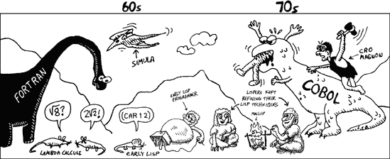
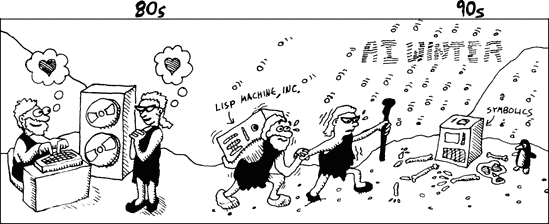

# 引言

因此，你决定拿起一本关于 Lisp 的书并阅读前言。也许你惊讶地看到一本看起来像漫画书的东西夹杂在书架上的其他计算机编程书籍中。谁会费心写一本关于像 Lisp 这样奇怪的学术编程语言的漫画书呢？或者也许你听到其他人狂热地谈论 Lisp 语言，心想，“哇，Lisp 真的听起来和其他人谈论的语言很不一样。也许我应该什么时候找一本 Lisp 书。”无论如何，你现在手里拿着一本关于一种非常酷但也很不寻常的编程语言的书籍。


# 什么是使 Lisp 如此酷且不寻常的原因？

Lisp 是一种非常*表达性*的语言。Lisp 被设计成让你以最清晰和适当的方式表达最复杂的编程思想。Lispers 有自由以最有助于解决任何手头问题的方式编写程序。

当你编写 Lisp 代码时，指尖上的力量正是使其与众不同的原因。一旦你“理解”了 Lisp，你作为一个程序员的身份将永远改变。即使你余生再也没有写过 Lisp 代码，学习 Lisp 也会从根本上改变你作为一个程序员的状态。

在某种程度上，学习一种典型的编程语言类似于成年人学习外语。假设你明天出去决定你要学习法语。你可能会上你找到的所有法语课程，阅读只有法语的资料，甚至搬到法国去。但无论你做什么，你对法语的理解总是会有些不完美。无论你最终成为多好的法语说话者，在你的梦中，你可能仍然会说着你的母语。

Lisp 是不同的。它不仅仅是学习任何外语。一旦你学会了 Lisp，你甚至会在梦中用 Lisp 思考。Lisp 是一个如此强大的理念，它将取代你之前的编程经验，并成为你的新母语！无论你在任何语言中遇到新的编程思想，你总会对自己说，“那有点像我在 Lisp 中会怎么做，除了……”。这就是只有 Lisp 才能给你的那种力量。


到目前为止，你可能对 Lisp 的了解仅限于至少有一个人（就是我）对此非常兴奋。但你的时间是宝贵的，学习新事物必然需要一些努力。

好消息是 Lisp 并没有表面上看起来那么困难。例如，以下是一个有效的 Lisp 表达式：

```
(+ 3 (* 2 4))
```

你能猜出这个表达式的值是多少吗？如果你回答是 11，那么你已经弄懂了如何阅读基本的 Lisp 代码。它写起来就像数学一样，只不过函数——在这个例子中，是加法和乘法——在数字之前，而且所有内容都在括号内。

# 如果 Lisp 如此出色，为什么更多的人不使用它？

实际上，相当多的大型公司确实使用 Lisp 进行一些严肃的工作（你可以在[`snipurl.com/e3lv9/`](http://snipurl.com/e3lv9/)找到长长的工业 Lisp 项目列表）。其他编程语言不断“借用”Lisp 的特性，并将它们作为最新的最伟大的想法展示出来。此外，许多人认为将在 Web 的未来发挥重要作用的语义网，使用了大量用 Lisp 编写的工具。

### 注意

语义网背后的理念是为网站创建一套协议，以便计算机能够确定网页上信息的“含义”。这是通过使用特殊元数据（通常称为资源描述框架，或 RDF）来注释网页，这些元数据链接到常见的词汇表，不同网站可能共享。许多用于处理描述逻辑和 RDF 数据的工具是用 Lisp 编写的（例如，RacerPro 和 AllegroGraph）。

因此，Lisp 肯定有一个光明的未来。但有些人可能会认为学习 Lisp 不值得付出努力。

Lisp 如何获得这种不应得的声誉？

我认为人们在决定生活中哪些事物值得学习时，会遵循一种经验法则。大多数人会在以下三个类别中寻求知识：

+   许多人学习的内容（例如微积分、C++等）

+   容易学习的东西（例如呼啦圈、Ruby 等）

+   有价值且容易欣赏的东西（例如热核物理，或者那种你把手指放在嘴里吹得非常响的哨子）

Lisp 不属于这些类别。它不像微积分那样受欢迎，也不像学习那样容易，也不像那个响亮的哨子那样明显有价值。如果我们遵循这些（通常非常合理的）经验法则，我们就会得出结论，一个理智的人应该远离 Lisp。然而，在 Lisp 的情况下，我们将摒弃这些规则。正如你从阅读这本书中看到的那样，Lisp 给你提供了对计算机编程的深刻见解，每个严肃的程序员都应该有一些使用这种不寻常语言的经验，即使这需要一点努力。

如果你仍然不确信，你可能想看看书末尾的漫画书尾声。你现在可能无法完全理解那里的所有内容，但它会给你一个关于 Lisp 中可用的高级功能和 Lisp 编程与其他类型编程不同的感觉。

# Lisp 是从哪里来的？

Lisp 语言家族的历史非常悠久，与其他语言的历史不同。我们需要追溯到很久以前才能找到它的起点。

很久以前（在 20 世纪 40 年代），地球被一个名为泛古洋的巨大海洋覆盖，以及一个名为泛大陆的单个贫瘠陆地。在这个残酷的环境中，第一台计算机程序进化了，是用纯机器语言编写的（或者说“一和零”，就像他们说的）。

这些原型语言与特定的计算机系统紧密相连，如 ENIAC、Zuse Z3 和其他早期的真空管装置。通常，这些早期的计算机非常原始，编程它们只是简单地翻转开关或修补电缆来物理编码每个操作。

这些原型语言的黑暗时期见证了不同计算机架构的大量实验和不同计算机指令集的爆炸式增长。竞争激烈。虽然这些原始语言实验中的大多数最终消失了——成为古代生存斗争的牺牲品——但其中一些却繁荣起来。


在某个时刻，计算机获得了自己的内存来存储程序，以及允许用文本编写程序而不是只用纯数字的原始*汇编器*。这些*汇编语言*包括 Short Code、ARC 汇编和 EDSAC 初始指令。

汇编语言使软件开发变得更加高效，使得古代汇编器能够避开这个原始海洋中的众多捕食者。但汇编语言仍然存在显著的局限性。它们总是围绕特定处理器的指令集进行设计，因此它们不能在不同的机器架构之间移植。编程语言需要进化以超越特定机器指令集的局限。

20 世纪 50 年代见证了第一个机器无关的编程语言的诞生。像 Autocode 和信息处理语言这样的语言通过肺和腿实现了这种独立性，同时也通过新的软件类型，如编译器和解释器。

随着编译器和解释器的出现，计算机程序现在可以使用人类友好的语法编写。*编译器*可以将人类编写的计算机程序自动转换为计算机可执行的机器友好二进制格式。另一方面，*解释器*直接执行人类编写的程序中描述的操作，而不需要将它们全部转换为机器友好的二进制格式。

首次，程序员可以使用旨在使计算机编程成为一种愉快活动的语言，而无需在计算机硬件的原始级别上进行操作。这些解释和编译的编程语言就是我们今天所认为的第一种“真正”的编程语言。这些早期语言中最令人印象深刻的一种，FORTRAN（于 1957 年开发），在多种架构上得到了广泛支持，并且至今仍在被大量使用。



到目前为止，最成功的语言都是围绕一个中心思想设计的：提供一个通用设计和语法，使编程尽可能容易。然而，设计一个好的编程语言证明是非常困难的。因此，这些语言中的大多数，如 FORTRAN、BASIC 和 C，实际上只是旧想法的大杂烩，相互抄袭，拼凑在一起，缺乏真正的美感。它们通常只在表面上容易使用。尽管如此，这些凶猛的语言在丛林中漫游了数十年，寻找容易捕获的猎物。

在这些可怕的巨兽阴影中，潜伏着一种小而谦逊、完全不同的生物——大多数时候隐藏在视线之外，但几乎从第一台机器无关语言爬上陆地以来就存在。这些语言使用数学语法，如 20 世纪 30 年代数学家开发的 lambda 演算。

这些语言并不关心是否实用或易于新手学习，它们非常智能，并希望推动语言设计的极限。它们提出了关于程序符号、语言语义和最简单可能的语言语法的疑问。

从这些高度智能的数学语法中演变出了最引人注目的生物：最初的 Lisp 编程语言。与大多数其他编程语言不同，它并非源自 FORTRAN 或其他关注实用主义或易用性的语言。它的血统是完全独立的，直接源自数学。但 Lisp 是从哪里来的呢？

有些人声称 Lisp 的起源背后的故事已经永远迷失在时间的迷雾中。其他人（可能更正确）说 Lisp 的创造是约翰·麦卡锡在 1959 年的工作。据说，有一天，他在麻省理工学院召集了他的部落，并提出了一个巧妙的主意。麦卡锡设想了一种完全理论化的编程语言，它将具有最少的语法和语义，但同时又能够创造出极其优雅的程序。这些程序如此优雅，以至于用 Lisp 本身编写 Lisp 的解释器只需要大约 50 行计算机代码！



### 注意

约翰·麦卡锡发表了论文“符号表达式的递归函数及其通过机器的计算，第一部分”，ACM 通讯（1960 年 4 月）：184-195。您可以在[`www-formal.stanford.edu/jmc/recursive.pdf`](http://www-formal.stanford.edu/jmc/recursive.pdf)上阅读它。


当麦卡锡首次发表他的想法时，这只是一个对数学语法的智力探索。但很快，Lisp 语言就发展起来，可以与编译器和解释器一起工作。它现在运行在真正的计算机上，就像 FORTRAN 和其他编程语言一样！但与这些其他语言不同，Lisp 保留了一种从其数学血统中继承的美。

在第一个 Lisp 出现不久之后，第一个 Lisp 程序员也出现了，他们捕捉了这些温顺的生物，并将它们转化为更加精细的编程语言。随着时间的推移，这些程序员将原始的 Lisp 转变为 MACLISP 和 Interlisp 等方言。


虽然早期 Lisp 的狩猎对早期 Lisp 程序员来说是一种成功的业余爱好，但很快，这些猎人就有一个竞争对手：克罗马农人。克罗马农人比和平的 Lisp 程序员更具侵略性，他们使用 COBOL 等可怕的语言攻击更大的软件开发项目。为商业应用开发的 COBOL 是一个丑陋而卑鄙的巨兽，但这对克罗马农人来说却是有利可图的猎物。另一方面，Lisp 程序员更愿意沉思优雅的编程和偶尔的 Lisp 猎捕。

现在，虽然 Lisp 是一个极其强大的想法，但其他编程语言已经在市场份额和更成熟的发展工具方面领先。这使得 Lisp 及其程序员面临挑战，难以获得主流成功的牵引力。然而，温和的 Lisp 程序员并不关心这些琐事。尽管他们的性格各异，但 Lisp 程序员和克罗马农人还是相对和谐地生活在一起。

以他们自己的方式，Lisp 程序员正在蓬勃发展。当时，他们从图像识别、计算机化数据分类和其他属于“人工智能（AI）”一般范畴的问题中受益匪浅。这些问题的高度数学性质使得他们的研究适合 Lisp 方法，Lisp 程序员将这些新的 Lisp 方言构建到更加先进的计算机系统中以应对这些问题。许多人认为这是 Lisp 的黄金时代。

不幸的是，在这段短暂的黄金时期之后，风向突然对可怜的 Lisp 程序员们不利。在 20 世纪 80 年代中期，地球轴线的突然倾斜改变了气候，导致 Lisp 语言所需的生存食物来源短缺。人工智能研究进展的失望导致许多学术研究资助枯竭，而且许多 Lisp 所青睐的硬件（如 Symbolics、Lisp Machine, Inc. 和德州仪器的 Lisp 计算机）在复杂指令集计算机（CISC）和精简指令集计算机（RISC）硬件架构的能力方面落后。世界对 Lisp 和依赖它们的 Lisp 程序员来说变得不再友好。“人工智能寒冬”已经到来，Lisp 命运难逃。

这最终给了克罗马农人在语言竞赛中的绝对优势。1983 年发展起来的新热潮，巨石阵、FORTRAN 衍生的面向对象语言——如 C++——逐渐征服了商业软件开发。这使克罗马农人免受困扰 Lisp 程序员的“人工智能寒冬”的影响。此外，狡猾的克罗马农人借鉴了 Lisp 程序员开创的一些想法来解决主流语言的问题。因此，垃圾回收和参数多态性，最初在 Lisp 中发现，成为主流程序员使用的语言中的常见特性。

最终，通过巨大的努力，古老的编程语言巨兽被克罗马农人驯服成了 C#、Java 和类似的语言。人们产生了这样的信念，即这些语言比过去任何可用的工具都更容易使用，而 Lisp 的黄金时代早已被遗忘。最近，像 Python 和 Ruby 这样的语言进一步将这些克罗马农语言精炼成更现代的方向。

但在这段时间里 Lisp 程序员们发生了什么？他们是否完全屈服于人工智能寒冬？他们是否再次潜伏在阴影中，等待阳光再次照耀的一天？没有人能确切知道。但如果你足够努力地寻找，也许在最高的山脉，最深的丛林，或者在麻省理工学院最底层的地下室里，你可能会瞥见一种奇怪的生物。有些人称之为 Windigo；其他人称之为 Yeti、Sasquatch 或 rms。但真正了解的人认为，它可能真的存在——它可能只能是——一个 Lisp 程序员。


# Lisp 的力量从何而来？

我已经说过 Lisp 是一种特别强大的语言。那么约翰·麦卡锡（以及后来的 Lisp 创新者）有哪些关键洞察力使得这种力量成为可能？

要使编程语言强大，你需要让它具有表现力。拥有表现力强的语言意味着你可以用很少的实际代码做很多事情。但语言需要哪些特性才能实现这一点？我认为有两个特性是最重要的。

第一种特性是语言中内置了许多功能。这样，对于大多数你需要完成的事情，已经有其他人为你完成了一些工作，你可以利用这些工作来使你的代码看起来简洁。许多现代语言都有这种特性。例如，Java 语言以其强大的库而闻名，例如，它让你能够轻松地从另一台 PC 通过套接字获取数据。

第二种赋予语言力量的特性是让你尽可能深入地玩弄它，使其按照你的意愿行事。这样，即使语言的设计者从未想过你要做什么，你仍然可以修改语言，直到它能够优雅地解决你的问题。这种特性在语言中提供起来要困难得多。假设你想在 Java 中添加类似嵌套函数定义支持的功能。如果你对 Java 非常了解，思考如何添加这样的支持就像是噩梦。

大多数语言难以同时支持这两种特性，原因在于它们彼此冲突。语言越丰富，其复杂性就越高。而语言越复杂，对其进行修改就越痛苦。这就是为什么对最成熟的编程语言进行自我修改几乎是不可能的。

当然，只要你足够努力，你总是可以对任何语言进行根本性的改变。例如，在 C++被开发出来时，它最初是以 C 预处理器形式出现的。编写了一个特殊的 C 程序，可以将用新的 C++方言编写的代码转换为普通的 C 代码，然后你可以通过标准的 C 编译器来运行它。这就是 Bjarne Stroustrup，C++的发明者，能够调整 C 语言并添加特性以使其成为自己的语言的原因。然而，编写这样的转换器是一个极其困难且繁琐的过程，你只会将其视为最后的手段。

相比之下，Lisp 语言使得经验丰富的 Lisper 能够非常容易地修改运行程序的编译器/解释器，同时仍然支持丰富的语言特性和广泛的库。实际上，在 Lisp 中玩弄语言比在创建的任何其他语言中都更容易！

例如，在 Lisp 中编写一个函数来计算两点之间的距离会很简单，就像在大多数其他语言中一样。但经验丰富的 Lisper 会发现，发明一种新的函数定义嵌套方式或设计一个有趣的 if-then 命令同样容易。甚至在你自己的 Lisp 中编写面向对象的编程支持也不复杂（而且大多数 Lisper 可能都曾在某个时刻这样做过）。在 Lisp 中，每个人都可以成为迷你版的 Stroustrup！


Lisp 是如何实现这一巧妙功能的？Lisp 的一个核心特性是，直接用 Lisp 编写 Lisp 本身，其简单程度令人难以置信。结果是，*这一点正是关键属性*，使得 Lisp 能够打破两个特性的悖论。它最初作为一种能够执行优雅地编写自身的酷炫数学技巧的语言，最终拥有了既功能丰富又可调整的属性。这反过来又使其成为编写几乎所有类型程序的完美工具！

想象一下：给一个程序员他的编程语言中的 `fish` 命令，他可能会吃上一天的中国外卖，喝上 Jolt。给一个程序员一种允许他编写自己的 `fish` 命令的编程语言，他可能会吃上一天的中国外卖，喝上 Jolt，并且这一习惯可能会持续一生（诚然，这可能会因为营养不足而缩短寿命，我们甚至都不想讨论可能的心律失常）。

因此，你现在应该明白为什么 Lisp 是一种非常酷且非常独特的编程语言。与大多数编程语言相比，它有着漫长且不寻常的历史。大多数语言源于工程领域，而 Lisp 则起源于一个更数学化的背景。对于那些愿意花点时间学习新事物的人来说，它有很多东西可以提供。
