# 第三部分。Lisp 是黑客


# loop 和 format：Lisp 的阴暗面

之前，我们探讨了 Common Lisp 语言的精髓，并对其简洁和优雅表示钦佩。然而，围绕这个核心，Lisp 还有一些不那么光鲜、有些阴暗的部分，它们本身也具有一定的魅力。它们可能缺乏 Lisp 核心的美感，但它们以强大的功能来弥补这一点。对于任何初学的 Lisp 程序员来说，这些语言的部分真是令人愉悦。

我们在本节中将要介绍的扩展，`loop` 和 `format`，非常强调功能强大而非数学上的优雅。这导致 Lisp 程序员之间偶尔出现争议，有些人质疑这些命令提供的强大功能是否值得在优雅性上的妥协。这些程序员认为，在编写任何严肃的代码时都应该避免使用 `loop` 和 `format`。

但学习和使用这些命令有一个很好的理由：它们体现了 Lisp 的灵活性和可扩展性。由于 Lisp（有争议地）是可用的最灵活的编程语言，黑客们已经通过数十年的数千个自己的黑客技巧来扩展它。`loop` 和 `format` 作为这些扩展中最成功的一些，必须非常出色才能在达尔文式的战场上生存下来。


# 第十章。使用 loop 命令进行循环

`loop` 和 `format` 命令功能强大且对黑客友好。尽管它们提供的许多功能在 Lisp 语言的其他地方也有提供，但这些高度专业化的命令如果喜欢简洁的代码，学习它们是值得的。我们将在本章中探讨 `loop`。下一章将介绍 `format`。

# 循环宏

在计算机程序内部进行的任何类型的循环都可以通过 `loop` 宏来完成。以下是一个简单的示例：

```
> `(loop for i`
 `below 5`
 `sum i)`
10
```

这段代码将 5 以下的自然数相加，如下所示：

| 0 + 1 + 2 + 3 + 4 = 10 |
| --- |

你可以看到，这个 `loop` 命令并不像一个合适的 Lisp 命令那样工作。首先，它在括号方面存在挑战。在此之前，我们从未有过七个连续的标记而没有括号！


使其更加不符合 Lisp 特性的还有，其中一些额外的标记（`for`、`below` 和 `sum`）似乎具有特殊的意义。回想一下 第三章，形式（括号之后）的第一个标记通常是决定代码基本行为的东西，而形式的其他部分包含参数。在 `loop` 宏中，这些“魔法标记”中的几个从根本上影响了 `loop` 的行为。它们的意义如下：

+   `for` 允许你声明一个变量（在这种情况下，命名为 `i`），该变量遍历一系列值。默认情况下，它将从零开始计数整数。

+   `below` 告诉 `for` 构造在达到指定值（在这种情况下，为 `5`）时停止，不包括该值本身。

+   `sum` 将给定表达式的所有值（在这种情况下，表达式只是 `i`）相加，并使 `loop` 返回该数字。

## 一些循环技巧

`loop` 宏拥有丰富的特殊令牌，几乎可以实现任何行为。让我们看看一些可能性。

### 从一个起始点计数到结束点

通过使用 `from` 和 `to` 子句，你可以使 `for` 构造遍历任何特定的整数范围：

```
> `(loop for i`
 `from 5`
 `to 10`
 `sum i)`
45
```

### 遍历列表中的值

在以下示例中，我们使用 `in` 令牌遍历列表中的值：

```
> `(loop for i`
 `in '(100 20 3)`
 `sum i)`
123
```

### 在循环中执行操作

`do` 令牌接受任意表达式并在 `loop` 中执行它：

```
> `(loop for i`
 `below 5`
 `do (print i))`
0
1
2
3
4
```

### 在特定条件下执行操作

`when` 令牌允许你根据需要运行 `loop` 的以下部分：

```
> `(loop for i`
 `below 10`
 `when (oddp i)`
 `sum i)`
25
```

注意，只有奇数的和被返回。

### 提前退出循环

以下 `loop` 使用了几个新技巧：

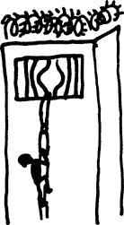

```
> `(loop for i`
 `from 0`
 `do (print i)`
 `when (= i 5)`
 `return 'falafel)`
0
1
2
3
4
5

FALAFEL
```

注意，在 `loop` 的 `for` 部分中没有告诉它停止计数的任何内容——它从零开始一直计数到无穷大。然而，一旦我们达到 `5`，`when` 子句就会触发循环立即返回值 `'falafel'`。

### 收集一系列值


`collect` 子句允许你从 `loop` 中返回多个项目，形式为一个列表。当需要修改列表中的每个项目时，此命令非常有用，如下例所示：

```
> `(loop for i`
 `in '(2 3 4 5 6)`
 `collect (* i i))`
(4 9 16 25 36)
```

### 使用多个 `for` 子句


一个 `loop` 宏可以有多个 `for` 子句。考虑以下示例：

```
(loop for x below 10
      for y below 10
      collect (+ x y))
```

你认为会有多少数字作为结果返回？有两种可能性：要么同时递增 `x` 和 `y` 并返回一个包含 10 个项目的列表，要么以嵌套方式迭代 `x` 和 `y` 并返回 100 个数字。答案是前者：

```
> `(loop for x below 10`
 `for y below 10`
 `collect (+ x y))`
(0 2 4 6 8 10 12 14 16 18)
```

如您所见，两个数字在 0 到 9 之间同时递增。

如果在 Common Lisp 的 `loop` 中有多个 `for` 子句，每个子句都会被检查，并且当任何一个子句的值用尽时，`loop` 会停止。这意味着 `for` 子句不会在多个循环变量之间独立 `loop`，所以如果你在两个各有 10 个值的范围内 `loop`，它仍然只会 `loop` 10 次。

然而，有时你想要生成多个范围之间的笛卡尔积。换句话说，你想要一个循环为两个或更多范围的每一种可能的组合运行一次。为了实现这一点，你需要使用嵌套循环来处理`x`和`y`：

```
> `(loop for x below 10`
 `collect (loop for y below 10`
 `collect (+ x y)))`
((0 1 2 3 4 5 6 7 8 9) (1 2 3 4 5 6 7 8 9 10) (2 3 4 5 6 7 8 9 10 11)
 (3 4 5 6 7 8 9 10 11 12) (4 5 6 7 8 9 10 11 12 13) (5 6 7 8 9 10 11 12 13 14)
 (6 7 8 9 10 11 12 13 14 15) (7 8 9 10 11 12 13 14 15 16)
 (8 9 10 11 12 13 14 15 16 17) (9 10 11 12 13 14 15 16 17 18))
```

在这个例子中，我们创建了 10 个包含 10 个项目的列表，总共循环了 100 个项目。

此外，请注意，使用从零开始的`for`变量，例如以下示例中的`i`变量，提供了一种跟踪列表中项目索引数字的干净方式：

```
> `(loop for i`
 `from 0`
 `for day`
 `in '(monday tuesday wednesday thursday friday saturday sunday)`
 `collect (cons i day))`
((0 . MONDAY) (1 . TUESDAY) (2 . WEDNESDAY)
 (3 . THURSDAY) (4 . FRIDAY) (5 . SATURDAY) (6 . SUNDAY))
```

你可能认为我们到现在已经涵盖了所有可能的循环变体。如果是这样，你大错特错了。看吧！循环宏的周期表！

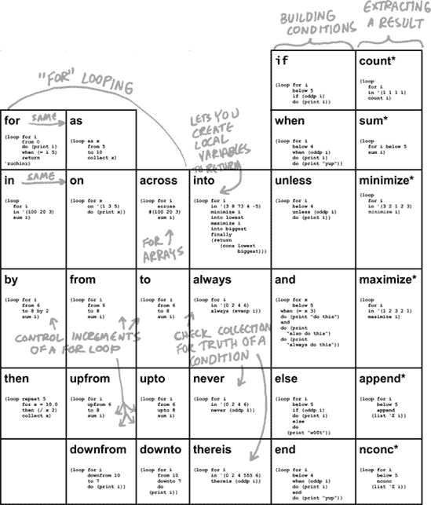

## 你想知道关于循环的一切

我们迄今为止讨论的个别示例只是对`loop`完整功能的简要提示。但别担心！你现在拥有了世界上第一个也是唯一的循环宏周期表。只需将它贴在你的显示器上，粘在你的钱包上，或者直接激光雕刻到你的视网膜上，你就能保证迅速达到`loop`熟练水平！

几乎所有可以在循环宏中使用的合法命令都在周期表中得到了涵盖。它展示了如何操作散列表和数组，以及执行特殊的循环操作。周期表中的每个方格都包含一个示例。如果你运行这个示例，你应该能够弄清楚给定命令的行为。

# 使用循环进化！


让我们再创建一个游戏，充分利用`loop`。但这不会是我们玩的游戏。相反，它将是一个随着我们观看而演化的游戏世界！我们将创建一个由草原和热带雨林组成的环境，里面充满了四处奔跑、觅食、进食和繁殖的动物。经过几百万个时间单位后，我们将看到它们已经进化成不同的物种！

### 注意

这个示例改编自 A.K. Dewdney 的文章“模拟进化：虫子学会捕食细菌”，发表在《科学美国人》的“计算机娱乐”专栏（1989 年 5 月：138-141）。

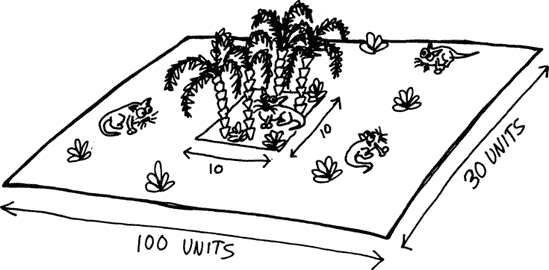

我们的游戏世界极其简单。它由一个简单的矩形平面组成，边缘环绕到对面。从数学上讲，它具有环面拓扑结构。这个世界的绝大部分都是草原，这意味着几乎没有植物生长供动物食用。在世界的中心是一个小型的热带雨林，那里的植物生长得更快。我们的动物是食草动物，它们将在这个世界中觅食以寻找食物。

让我们创建一些描述我们世界范围的变量：

```
(defparameter *width* 100)
(defparameter *height* 30)
(defparameter *jungle* '(45 10 10 10))
(defparameter *plant-energy* 80)
```

我们给世界设定了 100 个单位的宽度和 30 个单位的长度。使用这些尺寸应该可以在我们的 Lisp REPL 中轻松显示世界。`*jungle*`列表定义了包含丛林的世界地图中的矩形。列表中的前两个数字是丛林左上角的 x 和 y 坐标，最后两个数字是其宽度和高度。最后，我们给出每个植物所含的能量量，设置为 80。这意味着如果动物找到植物，它通过吃它将获得 80 天的食物。

### 注意

如果你的终端窗口不够大，无法显示整个世界，请更改`*width*`和`*height*`变量的值。将`*width*`变量设置为终端窗口宽度减去二，将`*height*`变量设置为终端窗口高度减去一。

## 在我们的世界中种植植物

如你所想，在计算机上模拟进化是一个缓慢的过程。为了看到生物进化，我们需要模拟大量时间，这意味着我们希望这个项目的代码非常高效。当动物在我们的世界中游荡时，它们需要能够检查给定 x,y 位置是否有植物。实现这一点最有效的方法是将所有植物存储在基于每个植物 x 和 y 坐标的哈希表中。

```
(defparameter *plants* (make-hash-table :test #'equal))
```

默认情况下，Common Lisp 哈希表在测试键的相等性时使用`eq`。然而，对于这个哈希表，我们定义`:test`使用`equal`而不是`eq`，这将允许我们使用 x 和 y 坐标对的 cons 对作为键。如果你还记得我们检查相等性的经验法则，cons 对应该使用`equal`进行比较。如果我们没有进行这个更改，每次检查键都会失败，因为即使两个不同的 cons 单元具有相同的内容，使用`eq`测试时也会被视为不同。

植物将在全球范围内随机生长，尽管在丛林地区的植物密度将高于草原地区。让我们编写一些函数来种植新的植物：

```
(defun random-plant (left top width height)
    (let ((pos (cons (+ left (random width)) (+ top (random height)))))
         (setf (gethash pos *plants*) t)))

  (defun add-plants ()
    (apply #'random-plant *jungle*)
    (random-plant 0 0 *width* *height*))
```

`random-plant`函数在世界的指定区域内创建一个新的植物。它使用`random`函数构建一个随机位置，并将其存储在局部变量`pos`中 ![http://atomoreilly.com/source/nostarch/images/783564.png]。然后它使用`setf`来指示哈希表中植物的存在 ![http://atomoreilly.com/source/nostarch/images/783562.png]。哈希表中实际存储的唯一项是`t`。对于这个`*plants*`表，表的键（每个植物的 x,y 位置）实际上比表中存储的值要多。

看起来有点奇怪，要费这么大的劲创建一个散列表，只是为了在每个槽位中存储`t`。然而，Common Lisp 默认并没有为持有数学集合而设计的结构。在我们的游戏中，我们想要追踪所有包含植物的全球位置集合。结果证明，散列表是表达这种方式的完美选择。你只需使用每个集合项作为键，并将`t`作为值存储。实际上，这样做确实是一种折衷方案，但它是一种相对简单且高效的折衷方案。（其他 Lisp 方言，如 Clojure，直接内置了集合数据结构，使得这种折衷方案变得不必要。）

每天我们的模拟运行时，`add-plants`函数将创建两种新的植物：一个在丛林中  和一个在地图的其余部分 。由于丛林很小，与世界的其余部分相比，它将有更茂密的植被。

## 创建动物


我们世界中的植物非常简单，但动物要复杂一些。因此，我们需要定义一个结构来存储我们游戏中每个动物的属性：

```
(defstruct animal x y energy dir genes)
```

让我们详细看看这些字段中的每一个。

### 动物的解剖结构


我们需要追踪每个动物的一些属性。首先，我们需要知道它的 x 和 y 坐标。这表明动物在世界地图上的位置。

接下来，我们需要知道动物有多少`能量`。这是一个达尔文式的生存游戏，所以如果动物不能觅食足够的食物，它就会饿死。能量字段追踪动物剩余的能量天数。动物在能量供应耗尽之前找到更多的食物至关重要。

我们还需要追踪动物面向的方向。这很重要，因为动物每天都会在世界地图上的相邻方块中移动。`dir`字段将指定动物下一个 x,y 位置的方位，为一个从 0 到 7 的数字：

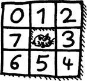

例如，方位 0 将导致动物在第二天向上并向左移动。

最后，我们需要追踪动物的`基因`。每种动物恰好有八个基因，由正整数组成。这些整数代表八个“槽位”，如下环绕着动物：

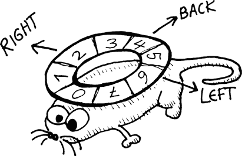

每天早上，动物将决定是否继续面向前一天的方向，或者转向面向新的方向。它将通过咨询这八个槽位并随机选择一个新的方向来完成这项工作。基因被选择的概率将与存储在基因槽中的数字成正比。

例如，一个动物可能具有以下基因：

```
(1 1 10 1 1 1 1 1)
```

让我们用表格表示这些基因，显示每个槽位编号及其存储的值的大小：


在这个例子中，一个动物在 2 号槽中存储了一个大数（10）。查看我们围绕动物的八个槽位的图片，你可以看到 2 号槽指向右边。因此，这个动物将会进行很多右转，并形成一个圆圈。当然，由于其他槽位仍然包含大于零的值，动物偶尔也会移动到其他方向。

让我们创建一个`*animals*`变量，用单个起始动物填充。你可以把这个动物看作是“亚当”（或者“夏娃”，取决于你更喜欢我们的无性动物是男性还是女性）。

```
(defparameter *animals*
    (list (make-animal :x      (ash *width*  −1)
                       :y      (ash *height* −1)
                       :energy 1000
                       :dir    0
                       :genes  (loop repeat 8
                                     collecting (1+ (random 10))))))
```

我们将动物起点设置为世界的中心，将`x`和`y`位置分别设置为地图宽度和高度的一半。我们将它的初始能量设置为`1000`，因为它还没有进化很多，我们希望它在生存上有一定的机会。它一开始面向上左，其`dir`字段设置为`0`。对于其基因，我们只使用随机数。

注意，与`*plants*`结构不同，后者是一个哈希表，`*animals*`结构只是一个普通的列表（目前只包含一个成员）。这是因为，对于我们模拟的核心，我们从未需要搜索我们的动物列表。相反，我们只需在模拟的每一天遍历一次`*animals*`，让我们的生物体进行日常活动。列表已经支持高效的线性遍历，因此使用另一个更复杂的数据结构（如表）对我们的模拟性能不会有显著影响。

### 处理动物运动


`move`函数接受一个动物作为参数，并根据我们描述的方向网格将其移动，可以是正交或对角移动：

```
(defun move (animal)
    (let ((dir (animal-dir animal))
         (x (animal-x animal))
         (y (animal-y animal)))
     (setf (animal-x animal) (mod (+ x
                                     (cond ((and (>= dir 2) (< dir 5)) 1)
                                           ((or (= dir 1) (= dir 5)) 0)
                                           (t −1))
                                      *width*)
                                   *width*))
     (setf (animal-y animal) (mod (+ y
                                      (cond ((and (>= dir 0) (< dir 3)) −1)
                                            ((and (>= dir 4) (< dir 7)) 1)
                                            (t 0))
                                      *height*)
                                   *height*))
      (decf (animal-energy animal))))
```

`move`函数修改`x`和`y`字段，使用`animal-x`和`animal-y`访问器。正如我们讨论的那样，这些是通过`defstruct`宏自动生成的，基于字段名称。在这个函数的顶部，我们使用访问器检索动物的 x 和 y 坐标  。然后我们使用相同的访问器设置相同的值，借助`setf`  。

为了计算新的 x 坐标，我们使用 `cond` 命令首先检查方向是否为 2、3 或 4 。这些是动物可能面对且指向世界东部的方向，因此我们希望将 x 坐标加一。如果方向是 1 或 5，则意味着动物正直接面向北或南 。在这些情况下，x 坐标不应改变。在所有其他情况下，动物面向西，我们需要减一 。y 坐标以类似的方式调整 。

由于世界需要在边缘处绕回，我们使用 `mod` （余数）函数进行一些额外的数学计算来计算坐标的模数，并允许在地图上绕回  。如果一个动物的 x 坐标会变成 `*width*`，则 `mod` 函数将其放回零，对 y 坐标和 `*height*` 也做同样的处理。例如，如果我们的函数使动物向东移动直到 `x` 等于 100，这意味着 (`mod 100 *width*`) 等于零，动物将绕回到游戏世界的远西边。

`move` 函数需要做的最后一件事是减少动物拥有的能量量一个单位。毕竟，运动需要能量。

### 处理动物转向

接下来，我们将编写 `turn` 函数。此函数将使用动物的基因来决定在给定的一天中它是否以及如何转向。

```
(defun turn (animal)
   (let ((x (random (apply #'+ (animal-genes animal)))))
     (labels ((angle (genes x)
                 (let ((xnu (- x (car genes))))
                  (if (< xnu 0)
                       0
                       (1+ (angle (cdr genes) xnu))))))
          (setf (animal-dir animal)
               (mod (+ (animal-dir animal) (angle (animal-genes animal) x))
  8)))))
```

此功能需要确保动物转向的量与给定槽位中的基因数量成比例。它是通过首先计算所有基因的总和，然后在那个总和内选择一个随机数来实现的 。之后，它使用一个名为 `angle` 的递归函数 ，该函数遍历基因，并根据每个基因对总和的贡献找到对应的数字。它从参数 `x` 中的运行计数中减去当前基因存储的数字 。如果运行计数达到或超过零，则函数已达到所选数字并停止递归 。最后，它将转向量加到当前方向上，并在需要时，通过使用 `mod`  将数字绕回零。

### 处理动物进食


进食是一个简单的过程。我们只需检查动物当前位置是否有植物，如果有，就消耗它：

```
(defun eat (animal)
  (let ((pos (cons (animal-x animal) (animal-y animal))))
    (when (gethash pos *plants*)
      (incf (animal-energy animal) *plant-energy*)
      (remhash pos *plants*))))
```

动物的能量通过植物储存的能量量来增加。然后我们使用`remhash`函数从世界中移除植物。

### 处理动物繁殖


在任何动物模拟中，繁殖通常是最有趣的部分。我们将通过让我们的动物进行无性繁殖来简化问题，但这仍然应该是有趣的，因为当它们的基因被复制时，错误会逐渐进入，导致突变。

```
(defparameter *reproduction-energy* 200)

  (defun reproduce (animal)
    (let ((e (animal-energy animal)))
     (when (>= e *reproduction-energy*)
       (setf (animal-energy animal) (ash e −1))
       (let ((animal-nu (copy-structure animal))
             (genes     (copy-list (animal-genes animal)))
              (mutation  (random 8)))
          (setf (nth mutation genes) (max 1 (+ (nth mutation genes) (random 3) −1)))
          (setf (animal-genes animal-nu) genes)
          (push animal-nu *animals*)))))
```

要产生健康的后代，需要一个健康的父母，因此我们的动物只有在拥有至少 200 天的能量时才会繁殖！[](httpatomoreillycomsourcenostarchimages783564.png)。我们使用全局常量`*reproduction-energy*`来决定这个截止数字应该是多少。如果动物决定繁殖，它将失去一半的能量给它的子女！[](httpatomoreillycomsourcenostarchimages783562.png)。

要创建新的动物，我们只需使用`copy-structure`函数复制父母的结构！[](httpatomoreillycomsourcenostarchimages783560.png)。但是，我们需要小心，因为`copy-structure`只执行结构的浅拷贝。这意味着如果结构中包含比数字或符号更复杂的值的字段，这些字段中的值将与父母共享。动物的基因，存储在列表中，是我们动物结构中唯一的这种复杂值。如果我们不小心，动物基因的突变将同时影响所有父母和子女。为了避免这种情况，我们需要使用`copy-list`函数创建基因列表的显式副本！[](httpatomoreillycomsourcenostarchimages783554.png)。

这里有一个例子，展示了如果我们仅仅依赖于`copy-structure`函数的浅拷贝，可能会发生多么糟糕的事情：

```
> `(defparameter *parent* (make-animal :x 0`
   `:y 0`
   `:energy 0`
   `:dir 0`
 `:genes '(1 1 1 1 1 1 1 1)))`
  *PARENT*
 > `(defparameter *child* (copy-structure *parent*))`
  *CHILD*
 > `(setf (nth 2 (animal-genes *parent*)) 10)`
  10
 > `*parent*`
  #S(ANIMAL :X 0 :Y 0 :ENERGY 0 :DIR 0 :GENES (1 1 10 1 1 1 1 1))
 > `*child*`
  #S(ANIMAL :X 0 :Y 0 :ENERGY 0 :DIR 0 :GENES (1 1 10 1 1 1 1 1))
```

在这里，我们创建了一个所有基因都设置为`1`的父代动物 。接下来，我们使用`copy-structure`创建一个子代 。然后我们将第三个（从零开始计数）基因设置为`10` 。现在我们的父代看起来是正确的 。不幸的是，由于我们忘记使用`copy-list`为子代创建一个单独的基因列表，当父代发生变异时，子代的基因也被改变了 。任何当你有超出简单原子符号或数字的数据结构时，在使用`setf`时都需要非常小心，以免这类错误悄悄进入你的代码。在未来的章节（特别是第十四章)中，你将学习如何通过不使用像`setf`那样直接修改数据的函数来避免这些问题。

要在我们的`reproduce`函数中变异一个动物，我们随机选择它的八个基因中的一个，并将其放入`mutation`变量中。然后我们使用`setf`对这个值进行一点调整，再次使用一个随机数。我们在以下这一行做了这个调整：

```
(setf (nth mutation genes) (max 1 (+ (nth mutation genes) (random 3) −1)))
```

在这一行，我们稍微改变了一下基因列表中的一个随机槽位。这个槽位的数字存储在局部变量`mutation`中。我们给这个槽位中的值加上一个小于三的随机数，然后从总数中减去一。这意味着基因值将改变一正一负，或者保持不变。由于我们不希望基因值小于一，我们使用`max`函数确保它至少是一。

然后，我们使用`push`将这个新生物插入到我们的全局`*animal*`列表中，这样它就被添加到了模拟中。

## 模拟我们世界的一天

现在我们已经有了处理动物日常细节的函数，让我们写一个模拟我们世界一天的函数。

```
(defun update-world ()
   (setf *animals* (remove-if (lambda (animal)
                                   (<= (animal-energy animal) 0))
                               *animals*))
   (mapc (lambda (animal)
            (turn animal)
            (move animal)
            (eat animal)
            (reproduce animal))
          *animals*)
   (add-plants))
```

首先，这个函数会从世界中移除所有死亡的动物 。（如果一个动物的能量小于或等于零，它就是死亡的。）接下来，它映射到列表上，处理每个动物可能的日常活动：转身、移动、进食和繁殖 。由于所有这些函数都有副作用（它们直接使用`setf`修改单个动物结构），我们使用`mapc`函数，它不会浪费时间从映射过程中生成结果列表。

最后，我们调用 `add-plants` 函数！[](httpatomoreillycomsourcenostarchimages783560.png)，该函数每天向世界添加两种新的植物（一个在丛林中，一个在草原上）。由于景观上总是有新的植物在生长，我们的模拟世界最终应该达到平衡，允许在模拟的时间跨度内生存一个相当大的动物群体。

## 绘制我们的世界

一个模拟的世界如果没有我们能看到我们的生物四处奔跑、寻找食物、繁殖和死亡，那就没有多少乐趣。`draw-world` 函数通过使用 `*animals*` 和 `*plants*` 数据结构来绘制当前世界的快照到交互式命令行环境（REPL）中。

```
(defun draw-world ()
   (loop for y
          below *height*
          do (progn (fresh-line)
                    (princ "|")
                   (loop for x
                          below *width*
                         do (princ (cond ((some (lambda (animal)
                                                   (and (= (animal-x animal) x)
                                                        (= (animal-y animal) y)))
                                                 *animals*)
                                         #\M)
                                        ((gethash (cons x y) *plants*) #\*)
                                         (t #\space))))
                    (princ "|"))))
```

首先，该函数使用一个 `loop` 来遍历世界的每一行！[](httpatomoreillycomsourcenostarchimages783564.png)。每一行都以一个新行（使用 `fresh-line` 创建）开始，后面跟着一个垂直线，这显示了世界的左边缘。接下来，我们遍历当前行的列！[](httpatomoreillycomsourcenostarchimages783562.png)，检查每个位置是否有动物。我们使用 `some` 函数！[](httpatomoreillycomsourcenostarchimages783560.png) 来执行此检查，该函数允许我们确定列表中是否至少有一个项目满足某个条件。在这种情况下，我们检查的条件是当前 x 和 y 坐标处是否有动物。如果有，我们在该位置绘制字母 `M`！[](httpatomoreillycomsourcenostarchimages783554.png)。（如果你发挥想象力，大写字母 `M` 看起来有点像动物。）

否则，我们检查是否存在植物，我们将用星号（`*`）字符来表示！[](httpatomoreillycomsourcenostarchimages783510.png)。如果没有植物或动物，我们绘制一个空格字符！[](httpatomoreillycomsourcenostarchimages783544.png)。最后，我们再画一条垂直线来结束每一行的绘制！[](httpatomoreillycomsourcenostarchimages783556.png)。

注意，在这个函数中，我们需要搜索整个 `*animals*` 列表，这将会造成性能损失。然而，`draw-world` 并不是我们模拟的核心程序。正如你很快就会看到的，我们游戏的用户界面将允许我们一次运行数千天的模拟，直到最后才将世界绘制到屏幕上。由于在这种情况下我们不需要每天都在屏幕上绘制屏幕，所以 `draw-world` 的性能对模拟的整体性能没有影响。

## 创建用户界面

最后，我们将为我们的模拟创建一个用户界面函数，称为 `evolution`。

```
(defun evolution ()
   (draw-world)
    (fresh-line)
   (let ((str (read-line)))
     (cond ((equal str "quit") ())
           (t (let ((x (parse-integer str :junk-allowed t)))
                 (if x
                    (loop for i
                        below x
                        do (update-world)
                        if (zerop (mod i 1000))
                        do (princ #\.))
                     (update-world))
                (evolution))))))
```

首先，这个函数在 REPL 中绘制世界 。然后它等待用户在 REPL 中使用 `read-line`  输入命令。如果用户输入 `quit`，模拟结束 。否则，它将尝试使用 `parse-integer` 解析用户的命令 。我们为 `parse-integer` 设置了 `:junk-allowed` 为 `true`，这使得界面可以接受一个字符串，即使它不是一个有效的整数。

如果用户输入一个有效的整数 *n*，程序将运行 *n* 模拟天，使用循环 。它还会在每 1000 天打印一个点，以便用户可以看到计算机在运行模拟时没有冻结。

如果输入的不是有效的整数，我们将运行 `update-world` 来模拟额外的一天。由于 `read-line` 允许空值，用户只需按下回车键，就可以看到动物在其世界中四处移动。

最后，`evolution` 函数递归地调用自身来重新绘制世界并等待更多用户输入 。我们的模拟现在完成了。

## 让我们观看一些进化吧！

要开始模拟，按照以下方式执行 `evolution`：

```
> `(evolution)`
|
                                             |
|
                                                     |
|
                                                |
|
                                                     |
|
                                             |
|
                                             |
|
                                            |
|
                                     |
|
                                        |
|
                                             |
|
                                        |
|
                                           |
|
                                      |
|
                                      |
|
                                      |
|                                                  M
                                            |
|
                                        |
|
                                             |
|
                                          |
|
                                             |
|
                                      |
|
                                                  |
|
                                         |
|
                                           |
|
                                           |
|
                                              |
|
                                              |
|
                                          |
|
                                           |
|
                                   |
```

目前我们的世界是空的，除了中心的亚当/夏娃动物。按回车键几次，可以循环显示几天：

```
|
                                                    |
|
                                             |
|
                                                  |
|
                                          |
|
                                             |
|
                                         |
|
                                       |
|
                                        |
|
                                          |
|
                                            |
|
                                               |
|
                                                |
|
                                               |
|
                                           |
|                                                *
                                               |
|
                                                     |
|                                               *   M
                                                |
|
                                                     |
|
                                     |
|
                                     |
|
                                         |
|
                                             |
|
                                               |
|
                                                 |
|
                                                 |
|
                                                |
|
                                           |
|
                                             |
|
                                   |
|
                                                |
``*`[enter]`*``
|
                                                |
|
                                                   |
|
                                                 |
|                *
                                                  |
|
                                                 |
|
                                                   |
|
                                                |
|
                                                  |
|
                                                |
|
                                             |
|
                                          |
|
                                               |
|
                                          |
|
                                       |
|                                                *
                                              |
|                                                      *
                                          |
|                                               *  M
                                            |
|
                                           |
|
                                     |
|
                                      |
|
                                  |
|
                                        |
|
                                      |
|
                                             |
|
                                      |
|
                                     |
|
                                         |
|
                                           |
|
                                        |
|
                                      |
```

我们未充分进化的动物正在随机乱走，一些植物开始生长。

接下来，输入 **`100`** 来看看 100 天后世界是什么样子：

```
`100`
|                                                    *
               *                       |
|
           *                       *          |
|  *                 **                            *
                                           |
|           *    *    *
          * *                        |
|                                          M        *
      M*                           *        |
|          *                        M    *
                                       |
|             *           *                                        *
                                 |
|                                        *     M             M *
                                    |
|                                           M M  M
              *                  |
|                       *                        M M             *    *
                              |
|                        *                       M M  MM                *
    *                      |
|                                            M* *
                              *              |
|                                                 M  M    M
          *                         |
|                          *                  M       MM
                                           |
|          *                  *     *      M  M   *      M
   M  *                     *   *          |
|     *                           *    *       M MM   *  M
       *                *               |
|                                            M M   M*  *
         *              *           |
|                        *      *        M    M  M
                                           |
|                   *                                 *    M
                  *              *  *   |
|
   M                               *       |
|         *                           * M               M
                                            |
|   *                 *               *             M     M
                                         |
| *    *                                  *     M M    M
   M                                        |
|               *                         *      M    M
           * *          *                  |
|                                            *
                                   *       |
|                        *             *
          *                            |
|                            *
                       *              |
|        *      *                                 M
                                        *     |
|                        *
                                     *       |
| *                   *                          M              *
           * * *                   |
```

我们的动物已经繁殖了很多，但这与它吃过的食物量没有太大关系，而是与我们给予它的“启动能量”大量有关。

现在，让我们全力以赴，运行五百万天的模拟！由于我们使用的是 CLISP，这可能会比较慢，你可能想在晚上启动它，让它整夜运行。使用性能更高的 Lisp，如 SBCL，可能只需几分钟。

```
`5000000`
|                                                                *
      M              M        |
|         *            *          *
                          M               |
|      M
                       *              |
|           M                                       *
       *       M        M                |
|                *                            M            *
        *                             |
|                                                           **
                                  *   |
|                                                M
                                          |
|           M        *                                M              M
       *                       |
|              *                       *     M   M M     M
              M                     M      |
|                                                M
                        M                  |
| M*                                    *     M  M  MMM    M
                                   M     |
|    *              *                     MMM  *           M             M
                       M  |
|  *            M    *               M      M *MM*     MMM M
                           *            |
|                                              M  MMMMMM M M
      M                        *         |
|               M                          MMMM MMM  M *          M
                              M   |
|         M                              *          M MMM
     *                               *   |
|                                             M M M  M M M
     M                           *    |
|      M                                M M  MMM               M
      M       M                 |
|                      M                  M  M    MM
   M             *          *      |
|                                     *     MMM M
 MM M                                        M   |
|                        M                            MM     *
            M                          |
|                                             MMM  M  M   M
                                         |
|           *               M                           M
                                         |
|               M            M          M        *M                *
       M   M                     |
|      M        M
      MM            M                |
|  M                             *                 M   *    M
    M                                 |
|               MM      M      M      M
     M                        |
|                   M       M         M
                                         |
|        M           *    M                    *            *
                *                  |
|        M     M                                     M
                                          |
```

五百万天后，我们的世界看起来与一百天后并没有太大的不同。当然，动物更多了，既有穿越草原的，也有享受丛林茂密植被的。

但外表是欺骗性的。这些动物与它们的早期祖先明显不同。如果你仔细观察（通过按回车键），你会看到一些生物直线移动，而另一些生物只是在小范围内跳跃，在任何方向上都不会走超过一步。（作为一个练习，你可以调整代码，为每种动物使用不同的字母，以便更容易观察它们的运动。）你可以通过输入 `quit` 退出模拟，然后检查 REPL 中的 `*animals*` 变量内容来更清楚地看到这种对比：

```
>`*animals*`
#S(ANIMAL :X 6 :Y 24 :ENERGY 65 :DIR 3 :GENES (67 35 13 14 1 3 11 74))
 #S(ANIMAL :X 72 :Y 11 :ENERGY 78 :DIR 6 :GENES (68 36 13 12 2 4 11 72))
 #S(ANIMAL :X 16 :Y 26 :ENERGY 78 :DIR 0 :GENES (71 36 9 16 1 6 5 77))
 #S(ANIMAL :X 50 :Y 25 :ENERGY 76 :DIR 4 :GENES (2 2 7 5 21 208 33 9))
 #S(ANIMAL :X 53 :Y 13 :ENERGY 34 :DIR 4 :GENES (1 2 8 5 21 208 33 8))
 #S(ANIMAL :X 58 :Y 10 :ENERGY 66 :DIR 6 :GENES (5 2 7 2 22 206 29 3))
 #S(ANIMAL :X 74 :Y 3 :ENERGY 77 :DIR 0 :GENES (68 35 11 12 1 3 11 74))
 #S(ANIMAL :X 47 :Y 19 :ENERGY 47 :DIR 2 :GENES (5 1 8 4 21 207 30 3))
 #S(ANIMAL :X 27 :Y 22 :ENERGY 121 :DIR 1 :GENES (69 36 11 12 1 2 11 74))
 #S(ANIMAL :X 96 :Y 14 :ENERGY 78 :DIR 5 :GENES (71 37 9 17 2 5 5 77))
 #S(ANIMAL :X 44 :Y 19 :ENERGY 28 :DIR 1 :GENES (1 3 7 5 22 208 34 8))
 #S(ANIMAL :X 55 :Y 22 :ENERGY 18 :DIR 7 :GENES (1 3 8 5 22 208 34 7))
 #S(ANIMAL :X 52 :Y 10 :ENERGY 63 :DIR 0 :GENES (1 2 7 5 23 208 34 7))
 #S(ANIMAL :X 49 :Y 14 :ENERGY 104 :DIR 4 :GENES (4 1 9 2 22 203 28 1))
 #S(ANIMAL :X 39 :Y 23 :ENERGY 62 :DIR 7 :GENES (70 37 9 15 2 6 5 77))
 #S(ANIMAL :X 97 :Y 11 :ENERGY 48 :DIR 0 :GENES (69 36 13 12 2 5 12 72))
 ...
```

如果你仔细观察列表中的所有动物，你会注意到它们有两种不同的基因组。一组动物在列表的前面有较高的数字，这导致它们主要直线移动。另一组动物在列表的后面有较大的数字，这导致它们在较小的区域内跳跃。没有动物在两种极端之间。我们进化出两种不同的物种了吗？

如果你创建一个函数来衡量这些进化动物在固定时间内行进的距离，距离的直方图将如下所示：


这是一个清晰的二模态分布，表明这些动物的行为似乎分为两个群体。想想这些动物生活的环境，并尝试推理为什么这种二模态分布会进化。我们将在下一节讨论这个难题的解决方案。

## 解释进化

进化难题的解决方案相当直接。在这个虚构的世界里，动物可以采取两种可能的生存策略：

+   关注丛林中丰富的食物供应。采用这种策略的任何动物都需要在运动上保守。它不能随着时间的推移走得太远，否则可能会掉出丛林。当然，这类动物*确实*需要至少进化一点跳跃运动，否则它们将永远找不到任何食物。让我们称这些保守的、跳跃的、生活在丛林中的动物为*象种*。

+   在草原上觅食稀疏的植被。在这里，生存的最关键特征是覆盖大距离。这类动物需要思想开放，并且必须不断迁移到地图上的新区域以寻找食物。（然而，它不能直线旅行得太直，否则可能会与自己的后代竞争资源。）这种策略需要一点天真的乐观，有时可能会导致灾难。让我们称这些思想开放、敢于冒险的动物为*马种*。


将模拟扩展到进化三个政府分支的任务留给读者作为练习。

# 你学到了什么

在本章中，我们详细讨论了`loop`命令。在这个过程中，你学习了以下内容：

+   `loop`命令是一个一站式循环商店——它可以完成你需要`loop`完成的任何事情。

+   要在循环中计数数字，请使用`for`短语。

+   要在循环中计数列表中的项目，请使用`for in`短语。

+   你可以使用`collect`短语在列表内收集项目，并将它们作为一个列表返回。

+   使用循环宏周期表来找到`loop`支持的其他有用短语。

# 第十一章. 使用格式函数打印文本

即使在现代编程时代，能够操纵文本仍然非常重要，而 Common Lisp 拥有一些最花哨的文本打印函数。无论你需要操纵 XML、HTML、Linux 配置文件，还是任何其他文本格式的数据，Lisp 都能使你的工作变得简单。

在 Common Lisp 中，最重要的高级文本打印函数是`format`函数，这是本章的主题。

# `format`函数的解剖结构

这里是`format`函数使用的一个示例：

```
> `(format t "Add onion rings for only ˜$ dollars more!" 1.5)`
Add onion rings for only 1.50 dollars more!
NIL
```

让我们看看这个函数的每个部分代表什么。


## 目标参数

`format`函数的第一个参数是*目标*参数，它告诉`format`将生成的文本发送到何处。以下是它的可能值：

**`nil`**

不打印任何内容；只需返回值作为字符串。

**`t`**

将值打印到控制台。在这种情况下，函数只是返回 nil 作为值（如我们的示例所示）。

**`stream`**

将数据写入输出流（在第十二章中介绍）。

在以下示例中，我们将第一个参数设置为`nil`，因此它简单地以字符串形式返回值：

```
> `(princ (reverse`
        `(format nil "Add onion rings for only ˜$ dollars more!" 1.5)))`
 !erom srallod 05.1 ylno rof sgnir noino ddA
 "!erom srallod 05.1 ylno rof sgnir noino ddA"
```

生成的字符串值（`"Add onion rings for only 1.50 dollars more!"`）传递给`reverse`函数，然后使用`princ`命令将反转后的字符串打印到屏幕上。

在这个示例中，REPL 也会打印输入表达式的值，以及`princ`命令输出的信息。这就是为什么你会看到值被显示两次。在本章的其余部分，示例将省略 REPL 打印的这些值，只显示我们代码显式打印的信息。

## 控制字符串参数

`format`函数的第二个参数是一个`控制字符串`，它控制文本格式。`format`函数的力量在于控制字符串。在我们的当前示例中，控制字符串是`"Add onion rings for only ˜$ dollars more!"`。

默认情况下，此字符串中的文本将简单地作为输出打印。然而，你可以在字符串中放置*控制序列*来影响输出的格式，正如本章剩余部分所描述的。我们当前的示例包含控制序列`˜$`，表示*货币浮点值*。`format`函数识别的每个控制序列都以波浪号（`˜`）字符开头。

## 值参数

控制字符串后面的`format`参数包含值，或实际要显示和格式化的数据。正如你所看到的，控制字符串与这些参数交互并控制它们的格式。

# 打印 Lisp 值的控制序列

任何 Lisp 值都可以使用`print`或`prin1`命令打印。要打印供人类阅读的值，不使用任何分隔符，我们可以使用`princ`命令：

```
> `(prin1 "foo")`
"foo"
> `(princ "foo")`
foo
```

我们可以使用`˜s`和`˜a`控制序列与`format`一起产生与`prin1`和`princ`相同的行为。当与`format`一起使用时，`˜s`控制序列包含适当的分隔符。`˜a`显示没有分隔符的值，以便人类阅读：

```
> `(format t "I am printing ˜s in the middle of this sentence." "foo")`
I am printing "foo" in the middle of this sentence.
> `(format t "I am printing ˜a in the middle of this sentence." "foo")`
I am printing foo in the middle of this sentence.
```

我们可以通过在控制序列内输入参数来进一步调整这些控制序列的行为。例如，我们可以在`a`或`s`前放置一个数字*n*，以指示值应该用空格在右侧*填充*。然后`format`命令将添加空格，直到值的总宽度达到*n*。

例如，在以下示例中，通过写入`˜10a`，我们在`foo`的右侧添加了七个空格，使得格式化值的总宽度为 10 个字符：

```
> `(format t "I am printing ˜10a within ten spaces of room." "foo")`
I am printing foo        within ten spaces of room.
```

我们也可以通过添加@符号在值的左侧添加空格，如下所示：

```
> `(format t "I am printing ˜10@a within ten spaces of room." "foo")`
I am printing        foo within ten spaces of room.
```

在这种情况下，添加的空格总数加上值`foo`等于 10 个字符。

控制序列可以接受不止一个参数。在先前的例子中，我们只设置了第一个参数，它控制最终格式化字符串的宽度。让我们看看一个同时设置`˜a`控制序列第二个参数的例子：

```
> `(format t "I am printing ˜10,3a within ten (or more) spaces of room." "foo")`
I am printing foo          within ten (or more) spaces of room.
```

如您所见，控制序列的附加参数用逗号分隔。在这种情况下，第二个参数设置为`3`，这告诉`format`命令以三组（而不是一次一个）添加空格，直到达到目标宽度 10。在这个例子中，总共添加了九个空格到格式化值中。这意味着它超出了我们的目标宽度 10（按设计），反而导致总宽度为 12（九个空格加上字母`foo`）。以这种方式以倍数填充字符串不是常用的功能，所以`˜a`控制序列的第二个参数很少使用。

有时候我们需要控制添加到字符串中的确切空格数，而不管最终值的长度。我们可以通过在`˜a`控制序列中设置第三个参数来实现这一点。例如，假设我们想在最终格式化值后打印出恰好四个空格。要将第三个控制序列参数设置为四，我们在参数前放置两个逗号来表示前两个参数为空，然后跟一个`4`：

```
> `(format t "I am printing ˜,,4a in the middle of this sentence." "foo")`
I am printing foo     in the middle of this sentence.
```

注意到结果中恰好插入了四个额外的空格。由于在逗号之前没有指定第一个和第二个参数，将使用它们的默认值。

第四个控制序列参数指定了用于填充的字符。例如，在以下列表中，我们用四个感叹号填充打印的值：

```
> `(format t "The word ˜,,4,'!a feels very important." "foo")`
The word foo!!!! feels very important.
```

这些控制序列参数也可以组合使用。例如，我们可以在代码中添加 `@` 符号来表示感叹号应该出现在值的前面，如下所示：

```
> `(format t "The word ˜,,4,'!@a feels very important." "foo")`
The word !!!!foo feels very important.
```

现在你已经了解了 `format` 命令的控制序列概述，让我们看看如何使用它们进行格式化，从数字开始。

# 数字格式化控制序列

`format` 命令有许多专门设计用于控制数字外观的选项。让我们看看其中一些更有用的选项。

## 整数格式化控制序列

首先，我们可以使用 `format` 来使用不同的基数显示一个数字。例如，我们可以使用 `˜x` 控制序列以十六进制（基数-16）显示一个数字：

```
> `(format t "The number 1000 in hexadecimal is ˜x" 1000)`
The number 1000 in hexadecimal is 3E8
```

类似地，我们可以使用 `˜b` 控制序列以二进制（基数-2）显示一个数字：

```
> `(format t "The number 1000 in binary is ˜b" 1000)`
The number 1000 in binary is 1111101000
```

我们甚至可以显式声明一个值将以十进制（基数-10）数字的形式显示，使用 `˜d` 控制序列：

```
> `(format t "The number 1000 in decimal is ˜d" 1000)`
The number 1000 in decimal is 1000
```

在这种情况下，如果我们只是使用了更通用的 `˜a` 控制序列，我们也会得到相同的结果。区别在于 `˜d` 支持特定于打印十进制数字的特殊参数和标志。例如，我们可以在控制序列内部放置冒号以启用逗号作为数字分组分隔符：

```
> `(format t "Numbers with commas in them are ˜:d times better." 1000000)`
Numbers with commas in them are 1,000,000 times better.
```

要控制数字的宽度，我们可以设置填充参数，就像我们在 `˜a` 和 `˜s` 控制序列中所做的那样：

```
> `(format t "I am printing ˜10d within ten spaces of room" 1000000)`
I am printing    1000000 within ten spaces of room
```

要更改用于填充的字符，请传入所需的字符（在这种情况下，是 *x* 字符）作为第二个参数：

```
> `(format t "I am printing ˜10,'xd within ten spaces of room" 1000000)`
I am printing xxx1000000 within ten spaces of room
```

## 浮点数格式化控制序列

浮点值使用 `˜f` 控制序列处理。与之前讨论的所有控制序列一样，我们可以通过更改第一个参数来更改值的显示宽度。当与浮点数一起使用时，`format` 命令将自动将值四舍五入以适应请求的字符数（包括小数点）：

```
> `(format t "PI can be estimated as ˜4f" 3.141593)`
PI can be estimated as 3.14
```

如你所见，`3.14` 的最终宽度是四个字符宽，正如控制序列所指定的。

`˜f` 控制序列的第二个参数控制小数点后显示的数字位数。例如，如果我们将在前面的示例中传递 `4` 作为第二个参数，我们得到以下输出：

```
> `(format t "PI can be estimated as ˜,4f" 3.141593)`
PI can be estimated as 3.1416
```

注意，Common Lisp 实际上在标准中包含了常数 `pi`，因此你也可以这样重写命令：

```
> `(format t "PI can be estimated as ˜,4f" pi)`
PI can be estimated as 3.1416
```

`˜f` 控制序列的第三个参数会导致数字按十的因子缩放。例如，我们可以将 `2` 作为第三个参数传递，我们可以用它将分数乘以 10²，将其转换为百分比：

```
> `(format t "Percentages are ˜,,2f percent better than fractions" 0.77)`
Percentages are 77.0 percent better than fractions
```

除了 `˜f`，我们还可以使用控制序列 `˜$`，它用于货币格式化：

```
> `(format t "I wish I had ˜$ dollars in my bank account." 1000000.2)`
I wish I had 1000000.20 dollars in my bank account.
```

你在本章的开头看到了一个使用 `˜$` 的示例。

# 打印多行输出

Common Lisp 在打印时开始新行有两个不同的命令。第一个，`terpri`，只是告诉 Lisp 终止当前行并开始一个新行以打印后续输出。例如，我们可以这样在不同的行上打印两个数字：

```
> `(progn (princ 22)`
         `(terpri)`
         `(princ 33))`
22
33
```

我们也可以使用 `fresh-line` 来开始新行。此命令将开始新行，但前提是 REPL 中的光标位置不在行的最前面。让我们看看一些示例：

```
> `(progn (princ 22)`
         `(fresh-line)`
         `(princ 33))`
22
33
> `(progn (princ 22)`
         `(fresh-line)`
         `(fresh-line)`
         `(princ 33))`
22
33
```

正如您所看到的，在两个 `princ` 调用之间放置两个 `fresh-line` 语句导致 Lisp 在输出数字之间只打印了一行。第一个 `fresh-line` 开始新行；第二个 `fresh-line` 被简单地忽略。

实际上，`terpri` 命令表示“开始新行”，而 `fresh-line` 命令表示“如果需要，开始新行”。任何使用 `terpri` 命令的代码都需要“知道”之前打印了什么。否则，可能会出现难看的空白行。由于程序的不同部分最好尽可能少地了解彼此，大多数 Lisp 程序员更喜欢使用 `fresh-line` 而不是 `terpri`，因为它允许他们将一条数据的打印与下一条数据的打印解耦。

`format` 命令有两个与 `terpri` 和 `fresh-line` 类似的控制序列：

**`˜%`**

在所有情况下都会创建新行（类似于 `terpri`）

**`˜&`**

只在需要时创建新行（类似于 `fresh-line`）。

这些示例说明了这种差异：

```
> `(progn (format t "this is on one line ˜%")`
           `(format t "˜%this is on another line"))`
  this is on one line

  this is on another line
  > `(progn (format t "this is on one line ˜&")`
           `(format t "˜&this is on another line"))`
  this is on one line
  this is on another line
```

正如您所看到的，使用额外的 `˜%` 会打印出难看的空白行 ，而在相同的位置使用 `˜&` 则不会。

这两个行终止序列也可以在它们前面有一个额外的参数，以指示要创建的新行数。这在我们需要使用空行来分隔输出时很有用。例如，以下示例中添加的 `5` 在输出中添加了五行空行：

```
> `(format t "this will print ˜5%on two lines spread far apart")`
this will print

on two lines spread far apart
```

# 输出对齐

`format` 命令也让我们对文本对齐有了很多控制。控制序列允许我们格式化表格、居中文本以及执行其他有用的对齐技巧。

为了帮助您理解各种对齐规则，我们将创建一个简单的函数，该函数返回具有不同字符长度的不同动物名称：

```
> `(defun random-animal ()`
      `(nth (random 5) '("dog" "tick" "tiger" "walrus" "kangaroo")))`
RANDOM-ANIMAL
> `(random-animal)`
"walrus"
```

现在假设我们想在表格中显示一些随机的动物。我们可以通过使用 `˜t` 控制序列来实现这一点。`˜t` 可以接受一个参数，指定格式化值应出现的列位置。例如，为了使我们的动物表格出现在第五、第十五和第二十五个字符位置的三列中，我们可以创建如下表格：

```
> `(loop repeat 10`
        `do (format t "˜5t˜a ˜15t˜a ˜25t˜a˜%"`
                   `(random-animal)`
                   `(random-animal)`
                   `(random-animal)))`
     kangaroo  tick      dog
     dog       walrus    walrus
     walrus    tiger     tiger
     walrus    kangaroo  dog
     kangaroo  tiger     dog
     tiger     walrus    kangaroo
     tick      dog       tiger
     kangaroo  tick      kangaroo
     tiger     dog       walrus
     kangaroo  kangaroo  tick
```

记住，带有 `repeat 10` 子句的 `loop` 命令会执行循环体 10 次。正如您所看到的，使用 `˜t` 控制序列导致动物被整齐地排列在表格中。


现在假设我们想要所有动物在单行上均匀分布。为了做到这一点，我们可以使用 `˜<` 和 `˜>` 控制序列，如下所示：

```
> `(loop repeat 10`
        `do (format t "˜30<˜a˜;˜a˜;˜a˜>˜%"`
                   `(random-animal)`
                   `(random-animal)`
                   `(random-animal)))`
tick         tiger        tick
tick         tiger         dog
tick          dog          dog
kangaroo     kangaroo    tiger
tiger      tiger      kangaroo
walrus       kangaroo      dog
dog         dog         walrus
kangaroo       dog      walrus
walrus        dog       walrus
kangaroo       tiger      tick
```

让我们分解这个控制字符串来了解它是如何工作的：


首先，`˜30<` 告诉函数我们正在启动一个对齐文本块。参数 `30` 表示该块应该有 30 个字符宽。接下来，我们有一行三个 `˜a` 控制序列，每个动物一个。每个 `˜a` 都由 `;` 分隔，这告诉 `format` 我们正在开始一个新的值，该值将由 `˜<` 对齐。（`˜;` 序列表示应在何处插入额外空格以对齐值。）然后我们使用 `˜>` 命令序列结束对齐部分。

由于每行动物之间的等距分布并不能保证通过打印多行创建的列能够正确对齐，我们在对齐命令序列 `˜<` 中添加了 `:@` 标志。例如，我们可以创建一个整齐居中的单列，如下所示：

```
> `(loop repeat 10 do (format t "˜30:@<˜a˜>˜%" (random-animal)))`
              dog
            walrus
           kangaroo
             tick
             tick
             tiger
              dog
           kangaroo
           kangaroo
              dog
```

同样，我们可以使用 `:@` 与多个对齐值一起使用，在行的左右两端添加额外的空间来居中对齐：

```
> `(loop repeat 10`
        `do (format t "˜30:@<˜a˜;˜a˜;˜a˜>˜%"`
                     `(random-animal)`
                     `(random-animal)`
                     `(random-animal)))`
    walrus    tick    tick
    walrus    tiger    tick
     tick     dog     tick
    walrus    tiger   tiger
   kangaroo   dog   kangaroo
   tiger   kangaroo   walrus
   tiger  kangaroo  kangaroo
    kangaroo   tiger   tick
    tick    tiger    walrus
    walrus    tiger    tick
```

这一步让我们更接近于拥有三个整齐居中的列，但我们的列仍然有点波浪状，因为我们是在单行内对齐值，而没有告诉 `format` 使用三个居中对齐的列来排列值。

为了产生整齐的列，我们仍然会使用 `:@` 标志，但我们将使用三个独立的 10 个字符对齐部分来描述我们的行：

```
> `(loop repeat 10`
        `do (format t "˜10:@<˜a˜>˜10:@<˜a˜>˜10:@<˜a˜>˜%"`
                     `(random-animal)`
                     `(random-animal)`
                     `(random-animal)))`
   tiger   kangaroo  kangaroo
 kangaroo  kangaroo   walrus
   tick      tick      tick
    dog       dog       dog
   tiger      dog     walrus
    dog      tiger   kangaroo
  walrus      dog      tick
   tick     walrus   kangaroo
    dog      tick     walrus
   tiger     tiger     tiger
```

最后，我们拥有了梦想中完美居中的随机动物列！

如您所见，`format` 的布局选项非常灵活。由于我们在调试应用程序时经常需要创建复杂的数据列表和表格，这些技巧在您需要掌握数据时非常有用，即使是在更复杂的程序中也是如此。

# 使用控制序列遍历列表

带有众多控制序列的 `format` 函数实际上是一种编程语言。（事实上，许多 Lisp 程序员会称其为**领域特定语言**，这个概念我们将在第十七章（Chapter 17）中再次探讨。）而且，像大多数编程语言一样，`format` 可以遍历数据。它是通过使用 `˜{` 和 `˜}` 控制序列来实现的。

要实现这种循环，请将包含 `˜{` 和 `˜}` 的控制字符串和要迭代的列表传递给 `format` 函数。控制字符串中 `˜{` 和 `˜}` 序列之间的部分几乎像循环的主体。它将被执行多次，具体取决于其后列表的长度。`format` 函数将遍历这个列表，将每个项目应用于指定的控制字符串部分。

例如，让我们创建一个动物列表，我们可以用它来测试：

```
> `(defparameter *animals* (loop repeat 10 collect (random-animal)))`
*ANIMALS*
> `*animals*`
("dog" "kangaroo" "walrus" "kangaroo" "kangaroo" "walrus" "kangaroo"
 "dog" "tick" "tick")
```

现在我们使用 `˜{ ˜}` 控制序列来遍历这个列表：

```
> `(format t "˜{I see a ˜a! ˜}" *animals*)`
I see a dog! I see a kangaroo! I see a walrus! I see a kangaroo! I see
 a kangaroo! I see a walrus! I see a kangaroo!
 I see a dog! I see a tick! I see a tick!
```

要生成这个循环，我们只需将单个变量 `*animals*`，一个项目列表，传递给 `format` 函数。控制字符串会遍历列表，为 `*animals*` 的每个成员构造句子 `"我看到一个 ˜a"`。

单个迭代结构也可以从列表中获取多个项目，如下例所示：

```
> `(format t "˜{I see a ˜a... or was it a ˜a?˜%˜}" *animals*)`
I see a dog... or was it a kangaroo?
I see a walrus... or was it a kangaroo?
I see a kangaroo... or was it a walrus?
I see a kangaroo... or was it a dog?
I see a tick... or was it a tick?
```

在这里，我们有一个单独的循环结构中包含两个 `˜a` 控制序列。每个 `˜a` 从列表中拉取一个动物，因此每次循环迭代都会打印出两个动物。

# 创建漂亮数据表的疯狂格式化技巧

让我们看看最后一个 `format` 示例，它使用了一些你已经见过的控制序列，以及一些新的控制序列。这个例子将说明如何将不同的控制序列组合起来以实现复杂的行为。

```
> `(format t "|˜{˜<|˜%|˜,33:;˜2d ˜>˜}|" (loop for x below 100 collect x))`
| 0  1  2  3  4  5  6  7  8  9 |
|10 11 12 13 14 15 16 17 18 19 |
|20 21 22 23 24 25 26 27 28 29 |
|30 31 32 33 34 35 36 37 38 39 |
|40 41 42 43 44 45 46 47 48 49 |
|50 51 52 53 54 55 56 57 58 59 |
|60 61 62 63 64 65 66 67 68 69 |
|70 71 72 73 74 75 76 77 78 79 |
|80 81 82 83 84 85 86 87 88 89 |
|90 91 92 93 94 95 96 97 98 99 |
```

要创建这个格式良好的数字表，我们首先使用循环控制序列 `˜{ ˜}` 通过 `loop` 命令创建的数字列表进行迭代。在迭代过程中，我们放置了之前使用过的对齐控制序列 `˜< ˜>`。在这种情况下，我们不是用它们来对齐文本，而是用它们来将生成的文本分成几部分。这就是我们将 100 个数字分成 10 行整洁的行的方法。我们在对齐控制序列 `˜< ˜>` 内放置了 `˜:;` 控制序列，这将导致文本被分成等长的片段。

当在对齐中使用时，此序列之前的控制字符串 `˜:;`（在这种情况下恰好是 `|˜%|`）只有在当前光标位置超过由第二个参数指定的某个点时才会触发，即 `33`。换句话说，我们是在告诉格式化函数：“嘿，一旦你有 33 个字符的文本，就开启一个新行。”

`|˜%|` 控制字符串会导致换行并打印垂直线。要显示的数字使用 `˜2d` 格式化，这将打印一个左对齐的数字，宽度为两个字符。

### 注意

要详细了解每个控制序列的详细信息，请参阅 *Common Lisp HyperSpec* 在 [`www.lispworks.com/documentation/HyperSpec/Front/index.htm`](http://www.lispworks.com/documentation/HyperSpec/Front/index.htm)。

# 机器人攻击！


在这里，我们看看一个如此恐怖的游戏，它肯定会让你做噩梦：机器人攻击！在这个游戏中，机器人已经占领了世界，你的任务是摧毁它们。尽管情节可能听起来很可怕，但这个游戏真正会给 Lisp 程序员带来噩梦的部分是它滥用 `loop` 和 `format` 命令，以便将一个功能齐全的机器人战斗游戏压缩到 *单页代码* 中！（此程序使用了上一节中讨论的“疯狂格式化技巧”）

我已经用一些基本解释注释了代码。如果你想详细了解游戏是如何工作的，你需要回顾前几章的大部分信息。此外，你可以访问[`landoflisp.com/`](http://landoflisp.com/)下载游戏的源代码，并阅读代码的更详细解释。

要赢得游戏，你需要策略性地在场上移动，以使所有机器人相互碰撞。移动键是 QWE/ASD/ZXC。这些字符在你的键盘左侧形成一个网格，让你可以向上、向下、向左、向右移动，也可以斜向移动。你还可以使用 T 键进行传送。

享受吧！


# 你学到了什么

本章并没有真正涵盖 `format` 函数的所有功能。然而，它确实提供了一个介绍，其中你学习了以下内容：

+   `format` 命令的第一个参数决定了输出是发送到 REPL、流还是作为字符串返回。

+   `format` 命令的第二个参数是一个 *控制字符串*，它允许你改变数据打印的方式。控制字符串具有复杂的语法，几乎可以像一门编程语言一样独立存在。

+   `format` 命令剩余的参数是可以从控制字符串中引用的值，用于将值嵌入到格式化输出中。

+   要将 Lisp 值嵌入到格式化字符串中，请使用 `˜s` 或 `˜a` 控制序列。

+   许多控制序列可用于打印和自定义数字的显示外观。

+   `format` 命令还具有复杂的循环能力，可以用于格式化以多种不同风格排列的表格。

# 第十二章。处理流

几乎你编写的每个计算机程序都需要在某个时候与外部世界交互。也许你的程序只需要通过 REPL 与用户通信，打印信息并从键盘捕获用户的输入。你编写的其他程序可能需要读取或写入硬盘上的文件。此外，你可能想编写与其他计算机交互的程序，无论是通过本地网络还是互联网。在 Common Lisp 中，这类交互通过流来实现。

*流* 是 Common Lisp 中的数据类型，它允许你将一些外部资源看作是你可以用代码操作的数据。外部资源可以是各种东西：磁盘上的文件、网络上的另一台计算机，或者是屏幕上控制台窗口中的文本。正如你将在本章中学到的，通过使用流，Lisp 程序可以像与列表或哈希表交互一样容易地与外部资源交互。

# 流的类型

当我们从 Common Lisp 程序与外部资源通信时，我们通过使用流来完成。不同类型的资源有不同的流类型可用。另一个因素是流的流向——有时你可能想向资源写入数据，有时你可能想从资源读取数据。

## 按资源类型分类的流

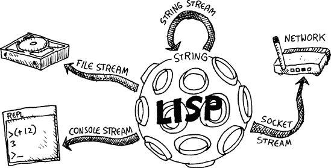

当按它们操作的资源类型组织时，以下是最常用的流类型：

**控制台流**

我们到目前为止与 REPL 通信时使用的内容。

**文件流**

让我们在硬盘上的文件中读取和写入。

**套接字流**

让我们通过网络与其他计算机进行通信。

**字符串流**

让我们从 Lisp 字符串发送和接收文本。

在这些流类型中，字符串流是这个家族中的“黑羊”。字符串流不仅让你与外界通信，还允许你以新的和有趣的方式操作字符串。

## 按方向分类的流

当你向资源写入数据时，你使用 *输出流*。对于从资源读取数据，你使用 *输入流*。

### 输出流

输出流用于诸如写入 REPL、写入文件或通过套接字发送信息等任务。在最基本层面上，你可以对输出流做两件事：

+   检查流是否有效。

+   将新项目推入流。


如你所见，流在 Lisp 中比真正的数据结构更受限制。例如，列表支持与流相同的所有功能（我们可以使用 `push` 将新项目推入列表，并使用 `listp` 检查列表是否有效），我们还可以使用列表执行某些任务，这些任务我们无法使用输出流执行（例如，使用 `setf` 改变列表中的项）。但流这种有限的功能实际上使它们在许多情况下非常有用。

要检查我们是否有有效的输出流，我们可以使用 `output-stream-p` 函数。例如，REPL 有一个与之关联的输出流，称为 `*standard-output*`。我们可以使用以下代码来检查这是否是一个有效的输出流：

```
> `(output-stream-p *standard-output*)`
T
```

Lisp 字符是一个可以使用基本命令 `write-char` 推入输出流的项目。例如，要将字符 `#\x` 写入 `*standard-output*` 流，我们可以运行以下命令：

```
> `(write-char #\x *standard-output*)`
xNIL
```

此代码将一个 *x* 打印到标准输出（在这种情况下，它与 REPL 相同）。请注意，此函数还返回 `nil`，导致 *x* 和返回值在同一行上打印。正如你在 第六章 中看到的，这个额外的 `nil` 只是代码在 REPL 中运行时的副作用。如果我们把这个命令作为更大程序的一部分运行，只有 *x* 会被打印出来。

### 注意

在本章中，我们将仅讨论基于文本字符的流。在 Common Lisp 中，您还可以创建基于其他数据类型的流。例如，如果您正在处理二进制数据，您可能希望发送或接收原始字节而不是字符。但就我们的目的而言，操作文本数据（因此使用与文本字符一起工作的流）是最方便的。

### 输入流

输入流用于读取数据。与输出流一样，您可以使用输入流执行的操作有限。在最基本层面上，您可以使用输入流做两件事：

+   检查流是否有效。

+   从流中弹出项目。

我们可以使用`input-stream-p`命令来检查我们是否有有效的流。例如，与标准输出一样，REPL 有一个相关的输入流，称为`*standard-input*`，我们可以如下验证：

```
> `(input-stream-p *standard-input*)`
T
```


我们可以使用`read-char`命令从流中弹出项目。由于我们从 REPL 中读取，我们需要输入一些字符并按回车键将数据发送到标准输入流：

```
> `(read-char *standard-input*)`
`123`
#\1
```

如您所见，流前面的 1 被`read-char`弹出并返回。

使用其他命令与流交互

除了`write-char`和`read-char`之外，Common Lisp 还有许多其他命令用于与流交互。事实上，在第六章中引入的所有打印和读取命令都可以接受一个流作为额外参数，这使得我们可以使用 Lisp 强大的输入/输出能力与任何流一起使用。例如，我们可以明确告诉`print`命令将输出打印到`*standard-output*`，如下所示：

```
> `(print 'foo *standard-output*)`
FOO
```

这在处理除`*standard-output*`之外的流时可能很有用，您很快就会看到。

# 文件操作

除了使用流在 REPL 中写入和读取外，我们还可以使用流将数据写入和读取到文件中。

您可以使用多种方式在 Common Lisp 中创建文件流。最好的方法是使用`with-open-file`命令。如您很快就会看到的，此命令包含特殊的错误预防功能，使其比其他可用的文件命令更安全。以下示例使用`with-open-file`将字符串`"my data"`写入名为`data.txt`的文件：

```
> `(with-open-file (``my-stream "data.txt" :direction :output)`
 `(print "my data" my-stream))`
```

在这个例子中，`with-open-file` 命令将输出流绑定到名称 `my-stream` 。这将在名为 `my-stream` 的文件中创建一个文件输出流。这个流将在 `with-open-file` 命令的体内部可用（直到最后的闭合括号 ），并且我们发送到这个流中的任何数据都将最终存储在磁盘上的名为 `data.txt` 的文件中。`print` 命令将 `my-stream` 作为其输出的目标 。因此，运行此示例后，你应该在启动 CLISP 的文件夹中找到一个名为 `data.txt` 的新文件。该文件的内容是文本 "`my data`"。

将 `:output` 作为 `with-open-file` 的方向指定将创建一个输出流。要将其改为输入流，我们可以将方向更改为 `:input`，如下所示：

```
> `(with-open-file (my-stream "data.txt" :direction :input)`
 `(read my-stream))`
"my data"
```

如你所见，这导致数据——与上一个示例中写入文件中的相同数据——从文件中读取。

如你在 第六章 中所学，`print` 和 `read` 命令可以打印和读取任何基本 Common Lisp 数据类型。这种功能使得使用流将程序数据存储到硬盘驱动器变得容易。以下是一个更复杂的示例，它将关联列表（alist）写入文件：

```
 > `(let ((animal-noises '((dog . woof)`
   `(cat . meow))))`
 `(with-open-file (my-stream "animal-noises.txt" :direction :output)`
         `(print animal-noises my-stream)))`
  ((DOG . WOOF) (CAT . MEOW))
 > `(with-open-file (my-stream "animal-noises.txt" :direction :input)`
       `(read my-stream))`
  ((DOG . WOOF) (CAT . MEOW))
```

在这个例子中，我们正在创建一个动物及其发出的声音的关联表。我们创建了一个名为 `animal-noises` 的新 alist 。我们将 `dog` 和 `cat` 的键放入这个列表中。现在我们可以将这个 alist 写入一个名为 `animal-noises.txt` 的新文件 。稍后，我们可以轻松地从文件中重新构建这个 alist 。

`with-open-file` 命令可以接受修改其行为的关键字参数。例如，你可以告诉命令如果存在具有给定名称的文件时应该做什么。在以下示例中，我们将使用 `:if-exists` 关键字参数显示错误信息：

```
> `(with-open-file (my-stream "data.txt" :direction :output :if-exists :error)`
      `(print "my data" my-stream))`
*** - OPEN: file #P"/home/user/data.txt" already exists
```

或者，你可能只想覆盖现有的文件。在这种情况下，将 `:if-exists` 关键字参数设置为 `:supersede`，如下所示：

```
> `(with-open-file (my-stream "data.txt" :direction :output`
                                         `:if-exists :supersede)`
      `(print "my data" my-stream))`
"my data"
```

`with-open-file` 命令为你提供了一个非常简洁的方式来处理文件。与大多数编程语言不同，当使用此命令时，你不需要手动打开和关闭文件，也不需要担心由于未能正确关闭文件而可能损坏文件。（实际上，Common Lisp 也有用于打开和关闭文件的低级命令，但 `with-open-file` 以一种干净的方式将它们打包起来，隐藏了所有丑陋的细节。）

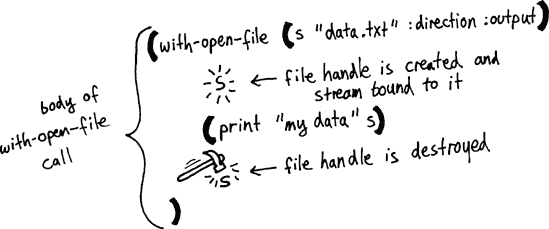

`with-open-file`的主要目的是获取文件资源。它控制文件并承担关闭文件的责任。实际上，即使`with-open-file`内部的代码抛出一个丑陋的错误，停止程序运行，`with-open-file`仍然会正确关闭文件，以确保该资源保持完整。

### 注意

Common Lisp 有许多以`with-`开头的命令，可以安全地以这种方式分配资源。这些`with-`命令，可在核心 Lisp 库中找到，是用 Lisp 的强大宏系统构建的。你将在第十六章中了解更多关于 Lisp 宏的知识，以及如何创建自己的`with-`命令。

# 与套接字一起工作


现在我们已经使用流与 REPL 和文件进行通信，让我们看看我们如何使用它们与另一台计算机进行通信。

如果你想要编写一个可以与标准网络（几乎所有网络现在都使用 TCP/IP 协议）上其他地方的计算机进行通信的程序，你首先需要创建一个套接字。*套接字*是在计算机网络上在运行在不同计算机上的程序之间路由数据的机制。

不幸的是，套接字没有进入 ANSI Common Lisp 标准，这意味着目前没有标准的方式来与套接字交互。然而，每个版本的 Common Lisp 都支持套接字，即使它不遵循任何标准。由于我们在这本书中选择了 CLISP 作为我们的 Lisp，我们将只考虑 CLISP 的套接字命令。

### 注意

cl-sockets *(*[`common-lisp.net/project/cl-sockets/`](http://common-lisp.net/project/cl-sockets/)*)* 和 usocket *(*[`common-lisp.net/project/usocket/`](http://common-lisp.net/project/usocket/)*)* 是将标准套接字库添加到 Common Lisp 的两种尝试。

## 套接字地址

网络中的每个套接字都必须有一个*套接字地址*。这个套接字地址有两个组成部分：

**IP 地址**

一个唯一标识网络中计算机的数字（通常以点分隔的 4 个字节表示，例如 192.168.33.22）。

**端口号**

任何想要使用网络的程序都必须选择一个唯一的端口号，这个端口号在该计算机上的其他程序尚未使用。

IP 地址和端口号组合起来构成套接字地址。由于 IP 地址在网络中是唯一的，端口号对于给定的计算机是唯一的，因此网络上的每个套接字地址都是特定计算机上运行的特定程序的唯一标识。通过网络（通过称为*TCP 数据包*的数据块）传输的任何消息都将带有套接字地址，以指示其目的地。

一旦计算机收到标记有其 IP 地址的数据包，操作系统将查看消息的套接字地址中的端口号，以确定哪个程序应该接收该消息。

操作系统是如何知道哪个程序接收指定端口的消息的呢？因为它知道，一个程序必须首先为该端口创建一个套接字才能使用它。换句话说，套接字就是计算机程序告诉操作系统的一种方式：“嘿，如果你收到端口 251 上的任何消息，请将它们发送给我！”

## 套接字连接

为了在两个程序之间通过套接字发送消息，我们首先需要遵循一些步骤来初始化一个 *套接字连接*。创建此类连接的第一步是让其中一个程序创建一个处于监听状态的套接字，等待查看网络上是否有其他程序想要开始通信。拥有处于监听状态套接字的计算机被称为 *服务器*。然后，另一个程序（称为 *客户端*）在其端创建一个套接字，并使用它来与服务器建立连接。如果一切顺利，这两个程序现在可以通过它们之间运行的套接字连接传输消息。

但说得够多了。让我们现在尝试连接两个程序，亲自看看魔法是如何发生的！

## 通过套接字发送消息

首先，在你的计算机上打开两个 CLISP 副本，分别在两个不同的控制台窗口中。我们将一个称为客户端，另一个称为服务器。（或者，如果你在一个网络上有两台计算机并且知道它们的 IP 地址，你可以在两个不同的机器上创建两个控制台，以获得完整的网络体验。）

### 注意

你 *必须* 使用 CLISP 来运行本章中显示的套接字代码。

在服务器上，通过调用 `socket-server` 来控制一个端口：

```
> `(defparameter my-socket (socket-server 4321))` ;ON THE SERVER
MY-SOCKET
```

此命令获取端口 4321 并将套接字绑定到它，使用操作系统。套接字绑定到 `my-socket` 变量，这样我们就可以与之交互。

此命令有些危险，因为操作系统期望我们在完成套接字后放弃它。如果我们不这样做，就没有人能够再使用这个套接字了。实际上，如果你在套接字练习中犯了任何错误，你可能会弄乱端口 4321 上的套接字，然后你需要切换到另一个端口号，直到你重新启动计算机。（在下一章中，你将学习如何使用 Common Lisp 的异常处理系统来绕过这些丑陋的问题。）

接下来，让我们从这个套接字（仍然在服务器上）创建一个流，该流处理来自单个客户端的连接：

```
> `(defparameter my-stream (socket-accept my-socket))` ;ON THE SERVER
```

运行此命令后，服务器似乎会锁定，并且你不会返回到 REPL 提示符。不要惊慌——`socket-accept` 命令是一个 *阻塞操作*，这意味着函数不会退出，直到客户端已连接。

现在切换到你的客户端 CLISP，并使用 `socket-connect` 命令连接到服务器上的那个套接字：

```
> `(defparameter my-stream (socket-connect 4321 "127.0.0.1"))` ;ON THE CLIENT
MY-STREAM
```

IP 地址 127.0.0.1 是一个特殊的地址，它始终指向调用它的计算机。如果你为这个练习使用了两台不同的计算机，你应该输入服务器的实际 IP 地址。

运行此命令后，服务器将解锁，`my-stream` 变量的值将被设置。我们现在在 CLISP 的两个副本中都有一个打开的流，我们可以用它来在它们之间进行通信！

CLISP 在这里创建的流被称为 *双向* 流。这意味着它可以作为输入流和输出流，我们可以使用任何一组命令与之通信，以双向进行通信。让我们在客户端和服务器之间发送一个友好的问候。

在客户端输入以下内容：

```
> `(print "Yo Server!" my-stream)`
"Yo Server!"
```

在服务器上输入以下内容：

```
> `(read my-stream)`
"Yo Server!"
```

然后，仍然在服务器上，输入以下内容：

```
> `(print "What up, Client!" my-stream)`
"What up, Client!"
```

回到客户端，运行以下命令：

```
> `(read my-stream)`
"What up, Client!"
```

当你完成时，你的两个 CLISP 窗口应该看起来像这样：


我们通过套接字发送的消息是一个 Lisp 字符串，但由于 Lisp 优雅的流处理能力，我们可以以相同的方式发送几乎任何标准的 Lisp 数据结构，而无需任何额外的工作！

## 整理我们的工作

在这个练习中，我们创建的资源释放至关重要。首先，在客户端和服务器上运行以下命令来关闭两端的流：

```
> `(close my-stream)`
T
```

接下来，在服务器上运行 `socket-server-close` 命令来释放端口，并断开与该端口的套接字连接。如果不这样做，端口 4321 将无法使用，直到你重新启动。

```
> `(socket-server-close my-socket)`
NIL
```

# 字符串流：怪异类型

流通常用于从 Lisp 程序内部与外部世界通信。一个例外是字符串流，它只是让字符串看起来像流。就像你可以使用其他类型的流读取或写入外部资源一样，字符串流将允许你读取或写入字符串。

你可以使用 `make-string-output-stream` 和 `make-string-input-stream` 命令创建字符串流。以下是一个使用 `make-string-output-stream` 的示例：

```
> `(defparameter foo (make-string-output-stream))`
> `(princ "This will go into foo. " foo)`
> `(princ "This will also go into foo. " foo)`
> `(get-output-stream-string foo)`
"This will go into foo. This will also go into foo. "
```

你可能想知道为什么有人会想要做这件事，因为我们已经可以直接在 Lisp 中操作字符串，而不需要使用流。实际上，使用字符串流这种方式有几个很好的理由。它们在调试时很有用，而且可以有效地创建复杂的字符串。

## 将流发送到函数

使用字符串流允许我们使用需要流作为参数的函数。这对于仅使用字符串作为数据输入和输出的文件或套接字代码的调试来说非常棒。

例如，假设我们有一个`write-to-log`函数，它将日志信息写入流。通常，我们希望将日志信息发送到文件流，以便将其写入文件以进行安全存储。然而，如果我们想调试该函数，我们可能希望将其发送到字符串流，这样我们就可以查看它写入的数据并确保其正确性。如果我们将`write-to-log`函数硬编码为仅写入文件，我们就不会有这种灵活性。这就是为什么在可能的情况下，编写使用流这一抽象概念的功能函数而不是使用其他方法访问外部资源是有意义的。

## 处理长字符串

当处理非常长的字符串时，字符串流可以使代码的性能更好。例如，将两个字符串连接起来可能是一个昂贵的操作——首先，它需要一个新块内存来存储两个字符串，然后字符串需要被复制到这个新位置。由于这个瓶颈，许多编程语言使用称为*字符串构建器*的设备来避免这种开销。在 Lisp 中，我们可以通过使用字符串流获得类似性能的好处。

## 阅读和调试

使用字符串流的另一个原因是它们可以使我们的代码更容易阅读和调试，尤其是在我们使用`with-output-to-string`宏时。


这里有一个使用此命令的例子：

```
 >  `(with-output-to-string (*standard-output*)`
      `(princ "the sum of ")`
       `(princ 5)`
       `(princ " and ")`
       `(princ 2)`
       `(princ " is ")`
       `(princ (+ 2 5)))`
 "the sum of 5 and 2 is 7"
```

`with-output-to-string`宏将拦截任何本应输出到控制台、REPL 或其他输出流的文本，并将其捕获为字符串。在前面的例子中，`with-output-to-string`调用体内的`princ`函数创建的输出被自动重定向到字符串流中。一旦`with-output-to-string`命令的主体完成，整个放入流中的打印输出将作为结果返回。

你也可以使用`with-output-to-string`宏通过“打印”每个部分来轻松构建复杂的字符串，然后将结果捕获为字符串。这通常比使用`concatenate`命令更加优雅和高效。

### 注意

使用`with-output-to-string`与函数式编程的原则（在第十四章中讨论）相悖。一些 Lisper 认为这个函数（以及拦截输入或输出到其他目的地的类似函数）是一种丑陋的修补。你会在 Lisp 社区中看到一些关于`with-output-to-string`的使用是优雅的还是丑陋的争议。

# 你学到了什么

本章介绍了如何使用流使您的 Lisp 程序与外部资源交互。你学习了以下内容：

+   不同类型的流与不同类型的资源交互。这些包括*控制台流*、*文件流*、*套接字流*和*字符串流*。

+   流可以根据其方向进行分类。*输出流*让我们可以向资源写入。*输入流*让我们可以从资源读取。

+   套接字流允许计算机程序通过网络进行通信。为了建立套接字流，我们首先需要在两端打开套接字，并在程序之间建立一个套接字连接。

+   字符串流允许我们在调试时使用需要流的功能，而不需要链接到外部资源。它们也通过使用 `with-output-to-string` 来有效地构建复杂字符串，并且优雅。

# 第十三章。让我们创建一个 Web 服务器！

在第六章中，你学习了如何通过向 REPL 发送和接收文本与用户交互。然而，当人们现在谈论“与用户交互”时，他们通常指的是 Web 上的用户。在本章中，你将学习如何通过从头开始构建 Web 服务器来与 Web 用户交互。由于网络通信本质上容易出错，你将首先学习 Lisp 中如何处理错误。

# Common Lisp 中的错误处理

任何时候你与外界交互，就像我们的 Web 服务器将要做的那样，都可能发生意外的事情。无论现代计算机网络多么聪明，它都无法预见到每一个可能出现的异常情况。毕竟，即使是最聪明的网络也无法从某个笨蛋绊倒在错误电缆上而恢复过来。

Common Lisp 提供了一套非常广泛的功能来处理代码中意外异常情况。这个异常处理系统非常灵活，它可以用来做其他大多数语言中异常系统不可能做到的事情。

## 发出条件信号

如果你正在编写一个函数，并且出了严重的错误，Lisp 函数可以通知 Lisp 环境，已经遇到了问题。这是通过*发出一个条件信号*来完成的。可能会发生什么问题呢？也许一个函数尝试除以零。或者也许库函数接收到了错误类型的参数。或者也许是因为你绊倒了网络电缆，套接字通信被中断了。

如果你想要直接发出一个条件信号，你可以使用 `error` 命令。如果你写的函数自己检测到问题——一个严重到程序无法正常继续的问题，你会这样做。使用 `error` 命令将中断你的运行中的 Lisp 程序，除非你在其他地方拦截错误以防止中断。让我们发出一个条件信号，并打印消息“foo”来描述错误：

```
> `(error "foo")`

*** - foo
The following restarts are available:
ABORT          :R1      Abort main loop
>
```

如您所见，发出这个条件会导致 Lisp 中断我们的程序，打印消息“foo”，并在 REPL 中显示错误提示。（在 CLISP 中，您可以在此时输入 **`:a`** 来终止程序并返回到正常的 REPL。）

大多数情况下，当您的程序发出条件时，这很可能不是因为您自己调用了 `error`。相反，这可能是由于您的程序有错误，或者您调用了库函数，而这个函数发出了一个条件。然而，任何阻止程序正常执行并导致条件的事情，您的程序都会停止并显示一个类似于前面示例的错误提示。

## 创建自定义条件

在我们的第一个例子中，我们将描述条件的字符串传递给了 `error` 命令。然而，这个文本字符串只是自定义了错误信息，并不会导致不同“类型”的条件。Common Lisp 也允许你拥有各种类型的条件，这些条件可以用不同的方式处理。

信号条件的一种更复杂的方式是首先使用 `define-condition` 定义一个自定义条件，如下面的示例所示：

```
 (define-condition foo () ()
    (:report (lambda (condition stream)
                (princ "Stop FOOing around, numbskull!" stream))))
```

这是一个创建新类型条件的典型例子，我们将其命名为 `foo`！[](httpatomoreillycomsourcenostarchimages783564.png)。当这个条件被发出时，我们可以提供一个自定义函数，该函数将被调用以报告错误。在这里，我们声明了一个 lambda 函数来完成这个目的！[](httpatomoreillycomsourcenostarchimages783562.png)。在 lambda 函数内部，我们打印一个自定义消息来报告错误！[](httpatomoreillycomsourcenostarchimages783560.png)。

让我们看看触发这个新条件会发生什么：

```
> `(error 'foo)`

*** - Stop FOOing around, numbskull!
The following restarts are available:
ABORT          :R1      Abort main loop
>
```

如您所见，我们的自定义消息已被打印出来。这种技术允许程序员获得一个更有意义的错误报告，该报告针对触发特定条件的具体情况进行了定制。

## 拦截条件

当我们使用 `define-condition` 创建一个条件时，它会赋予一个名称（例如 `foo`）。这个名称可以被程序的高级部分用来拦截和处理该条件，这样就不会停止程序的执行。我们可以通过 `handler-case` 命令来实现，如下所示：

```
> `(defun bad-function ()`
       `(error 'foo))`
  BAD-FUNCTION
 > `(handler-case (bad-function)`
      `(foo () "somebody signaled foo!")`
       `(bar () "somebody signaled bar!"))`
 "somebody signaled foo!"
```

在 `handler-case` 命令中，我们首先放入的是可能会发出我们想要处理的条件的代码片段！[](httpatomoreillycomsourcenostarchimages783564.png)。

在这个例子中，我们正在观察的代码是对 `bad-function` 的调用。`handler-case` 的其余部分允许我们指定在特定条件发生时要执行的操作 ![http://atomoreilly.com/source/no_starch_images/783562.png]。当这段代码运行时，`bad-function` 通过调用 `(error 'foo)` 触发 `foo` 条件。通常，这会导致我们的程序中断，并在 REPL 中出现错误提示。然而，我们的 `handler-case` 命令拦截了 `foo` 条件 ![http://atomoreilly.com/source/no_starch_images/783562.png]。这意味着程序可以继续运行而不会中断，`handler-case` 评估为“有人发出了 foo 信号！” ![http://atomoreilly.com/source/no_starch_images/783560.png]。

## 防止资源受到意外条件的影响

当程序中发生意外异常时，总有可能导致程序崩溃，甚至可能对程序外的资源造成损害。异常会中断代码的正常流程，并且它们可能会在代码进行敏感操作时立即停止。

例如，当程序遇到意外异常时，它可能正在向文件或套接字流写入数据。在这种情况下，程序有机会关闭文件/套接字流并释放文件句柄或套接字至关重要；否则，该资源可能会无限期地锁定。如果这些资源没有得到适当的清理，用户可能需要首先重新启动计算机，资源才能再次可用。

`unwind-protect` 命令可以帮助我们避免这些问题。使用这个命令，我们可以告诉 Lisp 编译器，“无论发生什么，这段代码都必须运行。”考虑以下示例：

```
 > `(unwind-protect (/ 1 0)`
                   `(princ "I need to say 'flubyduby' matter what"))`

  *** - /: division by zero
  The following restarts are available:
  ABORT          :R1      Abort main loop
  > `:r1`
  I need to say 'flubyduby' matter what
  >
```

在 `unwind-protect` 中，我们进行除以 0 的操作，这会触发一个条件 ![http://atomoreilly.com/source/no_starch_images/783564.png]。即使我们告诉 CLISP 终止程序，程序仍然会打印出其关键信息 ![http://atomoreilly.com/source/no_starch_images/783562.png]。

我们通常可以通过依赖 Common Lisp 的“`with-`”宏来避免直接调用 `unwind-protect`；其中许多宏在底层会自己调用 `unwind-protect`。在第十六章中，我们将创建自己的宏来了解这是如何实现的。

### 注意

在书的漫画书尾声中，你将了解 Common Lisp 信号系统的一个附加功能，称为 *restarts*。

# 从零开始编写 Web 服务器

现在你已经对套接字（在第十二章[Working with Streams]中介绍）和错误处理有了基本的了解，你已经有足够的知识来创建一个能够服务用 Lisp 编写的动态网页的 Web 服务器。毕竟，为什么 Apache（世界上最受欢迎的 Web 服务器）要独占所有乐趣呢？

## Web 服务器是如何工作的

超文本传输协议，或 HTTP，是用于传输网页的互联网协议。它在一旦建立了套接字连接后，在 TCP/IP 之上添加了一层，用于请求页面。当运行在客户端计算机上的程序（通常是网络浏览器）发送一个正确编码的请求时，服务器将检索请求的页面并通过套接字流发送它作为响应。


### 注意

这个网络服务器是从由 Ron Garret 创建的 *http.lisp* 中改编而来的。

例如，假设客户端是 Firefox 网络浏览器，并且请求 *lolcats.html* 页面。客户端的请求可能看起来像这样：

```
GET /lolcats.html HTTP/1.1
Host: localhost:8080
User-Agent: Mozilla/5.0 (X11; U; Linux i686; en-US; rv:1.9.0.5)
Accept: text/html,application/xhtml+xml,application/xml;q=0.9,*/*;q=0.8
Accept-Language: en-us,en;q=0.5
Accept-Encoding: gzip,deflate
Accept-Charset: ISO-8859-1,utf-8;q=0.7,*;q=0.7
Keep-Alive: 300
Connection: keep-alive
```

对于我们的网络服务器来说，这个请求最重要的部分是第一行。在那里我们可以看到所进行的请求类型（一个 `GET` 请求，这意味着我们只想查看页面而不修改它），以及请求的页面名称 (*lolcats.html*)。发送到服务器的这些数据被称为 *请求头*。你将在稍后看到，可以在请求头下方发送更多信息到服务器，在 *请求体* 中。

### 注意

对于来自遥远未来的读者，*lolcats* 是第三千年早期的一个病毒式互联网现象。它涉及带有有趣标题的猫的图片。如果你们那个时代的人们不再熟悉 lolcats，这并不会造成太大的损失。

作为响应，服务器将通过套接字流发送一个表示网页的 HTML 文档。这被称为 *响应体*。以下是一个响应体的示例：

```
 <html>
    <body>
       Sorry dudez, I don't have any L0LZ for you today :-(
     </body>
 </html>
```

HTML 文档被包裹在 `html` 开头  和结尾标签  之间。在这些标签内，你可以声明一个主体部分 。在主体部分，你可以写入将在网络浏览器中作为网页主体的文本消息！[](httpatomoreillycomsourcenostarchimages783560.png)。

对于一个完全符合 HTML 规范的网页，文档中必须存在其他项目，例如 DOCTYPE 声明。然而，我们的示例将正常工作，并且我们可以忽略这些技术细节以进行简单的演示。

网络服务器通常还会生成一个 *响应头*。这个头可以给网络浏览器提供有关它刚刚接收到的文档的额外信息，例如它是否是 HTML 或其他格式。然而，我们将要创建的简化版网络服务器不会生成这样的头，而是简单地返回一个主体。

### 注意

由于我们使用的是 CLISP 特定的套接字命令，你必须运行 CLISP 才能使本章中提供的示例网络服务器正常工作。

## 请求参数

网络表单是使网站运行的基本元素。例如，假设我们为网站创建一个简单的登录表单。

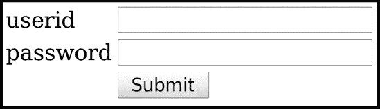

当网站访客点击此页面的提交按钮后，它将向网站发送一个`POST`请求。`POST`请求看起来与前面示例中的`GET`请求非常相似。然而，`POST`请求通常意味着它可能会更改服务器上的数据。

在我们的示例登录表单中，我们需要告诉服务器用户 ID 和密码，这是访客在此表单的文本字段中输入的。作为`POST`请求一部分发送到服务器的这些字段的值被称为*请求参数*。它们通过在请求头下方附加到请求体中发送。

这就是我们的登录示例中可能出现的`POST`请求：

```
POST /login.html HTTP/1.1
  Host: www.mywebsite.com
  User-Agent: Mozilla/5.0 (X11; U; Linux i686; en-US; rv:1.9.0.5)
  Accept: text/html,application/xhtml+xml,application/xml;q=0.9,*/*;q=0.8
  Accept-Language: en-us,en;q=0.5
  Accept-Encoding: gzip,deflate
  Accept-Charset: ISO-8859-1,utf-8;q=0.7,*;q=0.7
  Keep-Alive: 300
  Connection: keep-alive
  `Content-Length: 39`

 `userid=foo&password=supersecretpassword`
```

这个`POST`请求头部的额外参数`Content-Length`表示请求底部参数数据的长度。具体来说，`Content-Length: 39`告诉服务器包含请求参数的文本（如![http://www.example.com/source/nostarch/images/783564.png]所示）是 39 个字符长。

### `GET`请求的请求参数

正如我们之前讨论的，请求参数的典型用途是在`POST`请求期间将网页表单数据发送回服务器。然而，`GET`请求也可能包含请求参数。通常，在`GET`请求中，我们希望查看请求 URL 中的参数，而在`POST`请求中，参数则隐藏在请求体中。

例如，假设你访问 Google 并搜索“dogs”。在这种情况下，后续页面将有一个类似[`www.google.com/search?q=dogs&hl=en&safe=off&`](http://www.google.com/search?q=dogs&hl=en&safe=off&)的 URL。URL 中的这些值（如表示[q]uery=“dogs”的那个）也是请求参数。

我们正在创建的 Web 服务器需要允许服务器代码访问这两种类型的请求参数：请求体中的那些（这在`POST`请求中很常见）以及出现在 URL 中的那些（这在`GET`请求中很常见。）

### 解析请求参数的值

HTTP 使用一种特殊的方式来表示用户可能输入到表单中的非字母数字字符，即使用*HTTP 转义码*。这些转义码允许你在请求参数的值中使用那些在 HTTP 格式中通常不可用的字符。例如，如果用户输入**`"foo?"`**，它将在请求中显示为`"foo%3F"`，因为问号是用转义码表示的。我们的 Web 服务器需要解码这些转义字符，因此我们将编写的第一个函数是`decode-param`：

```
 (defun http-char (c1 c2 &optional (default #\Space))
   (let ((code (parse-integer
                 (coerce (list c1 c2) 'string)
                 :radix 16
                 :junk-allowed t)))
      (if code
          (code-char code)
        default)))

  (defun decode-param (s)
    (labels ((f (lst)
                 (when lst
                   (case (car lst)
                       (#\% (cons (http-char (cadr lst) (caddr lst))
                                  (f (cdddr lst))))
                      (#\+ (cons #\space (f (cdr lst))))
                      (otherwise (cons (car lst) (f (cdr lst))))))))
        (coerce (f (coerce s 'list)) 'string)))
```

### 注意

我们在这里讨论的 HTTP 转义码与我们在这本书的其他部分讨论的 Lisp 字符串中的转义字符无关。

首先，这个函数定义了一个名为`f`的局部函数！，我们将使用它来递归处理字符。为了使这个递归工作，我们需要使用`coerce`将字符串转换为字符列表！，然后将这个列表传递给`f`。

`f`函数检查列表中的第一个字符，看它是否是一个百分号（`%`）或一个加号（`+`）。如果是百分号，我们知道列表中的下一个值是一个 ASCII 码，表示为十六进制数。（ASCII 码是一组标准数字，对应于文本字符，在许多计算机系统和应用程序中共享。） 

为了解码这个 ASCII 码，我们创建了一个名为`http-char`的函数！。在这个函数中，我们使用`parse-integer`函数将这个字符串转换为整数！。在这种情况下，我们在`parse-integer:`上使用了一些关键字参数：`:radix`参数告诉函数解析一个十六进制数，而`:junk-allowed`参数告诉它在给出无效数字时只返回 nil，而不是发出错误信号。

然后，我们使用`code-char`函数将这个整数（它包含 ASCII 码）转换为用户实际输入的实际字符。

根据 HTTP 编码的规则，如果请求参数中的值包含一个加号，它应该被转换为空格字符。我们在这里进行这个转换！。

任何其他字符都会通过`f`函数保持不变。然而，我们仍然需要调用`f`函数处理列表的其余部分，直到所有字符都被处理！。

这里有一些`decode-param`函数的示例：

```
> `(decode-param "foo")`
"foo"
> `(decode-param "foo%3F")`
"foo?"
> `(decode-param "foo+bar")`
"foo bar"
```

### 解码请求参数列表

服务器接下来需要做的事情是解码一系列参数，这些参数将以字符串形式给出，例如 `"name=bob&age=25&gender=male"`。正如我们之前讨论的，网页的 URL 通常在末尾包含这样的名称/值对。正如你所看到的，这个字符串表明我们在网页上寻找的人的名字是 bob，年龄是 25 岁，性别是男性。这些名称/值对由一个和号（`&`）分隔。这些字符串的结构与关联列表（alist）的结构相当，因此我们将使用以下函数将这些参数存储为一个 alist：

```
(defun parse-params (s)
   (let* ((i1 (position #\= s))
            (i2 (position #\& s)))
       (cond (i1 (cons (cons (intern (string-upcase (subseq s 0 i1)))
                             (decode-param (subseq s (1+ i1) i2)))
                       (and i2 (parse-params (subseq s (1+ i2))))))
              ((equal s "") nil)
              (t s))))
```

`parse-params` 函数通过使用 `position` 函数找到字符串中第一个出现的 `&` 和 `=` 符号 。如果找到一个名称/值对（如果字符串中找到了等号并且存储在 `i1` 中，我们知道这是真的），我们使用 `intern` 函数将名称转换为 Lisp 符号 。然后我们使用 `cons` 函数将这个名称连接到参数的值上，我们使用我们的 `decode-param` 函数来解码这个值 。最后，我们递归地调用 `parse-params` 函数处理字符串的剩余部分 。

让我们尝试我们的新 `parse-params` 函数：

```
> `(parse-params "name=bob&age=25&gender=male")`
((NAME . "bob") (AGE . "25") (GENDER . "male"))
```

将这些数据放入 alist 中将允许我们的代码在需要时轻松引用特定的变量。

### 注意

`decode-param` 和 `parse-params` 如果使用尾调用编写，可能会实现更高的性能，我们将在第十四章（第十四章. 使用函数式编程提升 Lisp 的层次）中讨论。

## 解析请求头

接下来，我们将编写一个函数来处理请求头的第一行。（这将是看起来像 `GET /lolcats.html HTTP/1.1` 这样的行）。

以下 `parse-url` 函数将处理这些字符串：

```
(defun parse-url (s)
    (let* ((url (subseq s
                      (+ 2 (position #\space s))
                       (position #\space s :from-end t)))
          (x (position #\? url)))
       (if x
          (cons (subseq url 0 x) (parse-params (subseq url (1+ x))))
          (cons url '()))))
```

这个函数首先使用字符串的分隔空格来找到并提取 URL 。然后它检查这个 URL 是否包含问号，这可能表明需要处理请求参数 。例如，如果 URL 是 `*lolcats.html?extra-funny=yes*`，那么问号让我们知道在 URL 中有一个名为 `*extra-funny*` 的参数。如果存在这样的参数，我们需要提取它们，然后使用我们的 `parse-params` 函数来解析它们 。如果没有请求参数，我们只需返回 URL 。注意，这个函数会跳过请求方法（通常是 `GET` 或 `POST`）。更高级的 Web 服务器会提取这个数据点。

让我们尝试我们的新 URL 提取器：

```
> `(parse-url "GET /lolcats.html HTTP/1.1")`
("lolcats.html")
> `(parse-url "GET /lolcats.html?extra-funny=yes HTTP/1.1")`
("lolcats.html" (EXTRA-FUNNY . "yes"))
```

现在我们能够读取第一行，我们将处理请求的其余部分。以下 `get-header` 函数将把请求的剩余行转换为漂亮的 alist：

```
(defun get-header (stream)
   (let* ((s (read-line stream))
           (h (let ((i (position #\: s)))
                 (when i
                       (cons (intern (string-upcase (subseq s 0 i)))
                            (subseq s (+ i 2)))))))
       (when h
         (cons h (get-header stream)))))
```

这个函数从流  中读取一行，根据冒号  的位置将其转换为键/值对，然后递归地转换头部中的附加行 。如果它遇到不符合头部行的行，这意味着我们已经到达了头部的空行，并且完成了。在这种情况下，`i` 和 `h` 都将是 `nil`，函数终止。

在生成上述键时使用的 `intern` 命令是一个简单的函数，它将字符串转换为符号。我们也可以使用 `read` 命令来完成这个目的，就像我们在本书中之前做的那样。但请记住，`read` 命令的灵活性也使其成为黑客攻击的绝佳目标，他们可能会尝试创建格式不正确的头部来破解你的网络服务器。这就是为什么使用更有限、更具体的 `intern` 函数来处理发送到我们网络服务器的互联网数据是明智的。

## 使用字符串流测试 get-header

由于 `get-header` 函数直接从套接字流中获取其数据，你可能会认为我们无法直接通过 REPL 测试它。然而，正如你在上一章中看到的，除了套接字之外，还有几种不同类型的资源可以通过 Common Lisp 的流接口访问。由于流之间的通用接口，我们可以通过传递字符串流而不是套接字流来测试我们的 `get-header` 函数：

```
 > `(get-header (make-string-input-stream "foo: 1`
  `bar: abc, 123`

 `"))`
  ((FOO . "1") (BAR . "abc, 123"))
```

使用 `make-string-input-stream` 函数，我们可以从字面字符串创建一个输入流。在这个例子中，我们取一个定义了两个键（`foo` 和 `bar`）并以其一个空行结束的字符串，就像一个典型的 HTTP 头部。注意，我们有一个从  到  的单个字面字符串。这样的字符串在 Common Lisp 中是允许的。正如你所见，`get-header` 函数适当地从这个流中提取了两个键及其值，就像它会从套接字流中提取这些值一样。

使用这个技巧，你可以直接从 REPL 测试操作流的函数。要做到这一点，只需用字符串流替换其他更复杂的流类型。

## 解析请求体

在 POST 请求中，通常会在头部下方存储参数，在称为 *请求体* 或 *请求内容* 的区域。以下 `get-content-params` 函数提取这些参数：

```
(defun get-content-params (stream header)
        (let ((length (cdr (assoc 'content-length header))))
          (when length
            (let ((content (make-string (parse-integer length))))
               (read-sequence content stream)
               (parse-params content)))))
```

首先，这个函数在头部搜索一个名为`content-length`的值 ，它告诉我们包含这些内容参数的字符串的长度。如果存在`content-length`，那么我们知道有参数需要解析 。然后，该函数将使用`make-string` 创建一个给定长度的字符串，并使用`read-sequence` 将流中的字符填充到该字符串中。然后，它将结果通过我们的`parse-params`函数运行，将参数转换为我们的清理后的 alist 格式 。

## 我们的大结局：服务函数！

现在所有的部件都已经就位，我们可以编写我们网络服务器的心脏部分：`serve`函数。以下是它的全部辉煌：

```
 (defun serve (request-handler)
   (let ((socket (socket-server 8080)))
     (unwind-protect
        (loop (with-open-stream (stream (socket-accept socket))
                  (let* ((url    (parse-url (read-line stream)))
                          (path   (car url))
                          (header (get-header stream))
                          (params (append (cdr url)
                                          (get-content-params stream header)))
                          (*standard-output* stream))
                            (funcall request-handler path header params))))
         (socket-server-close socket))))
```

`serve`函数接受一个单一参数：`request-handler` ，这是想要使用这个网络服务器的网站创建者提供的。当服务器通过网络接收到请求时，它会将请求解析成干净的 Lisp 数据结构（使用我们在本章中讨论过的函数），然后将这个请求信息传递给`request-handler`。然后`request-handler`显示正确的 HTML。

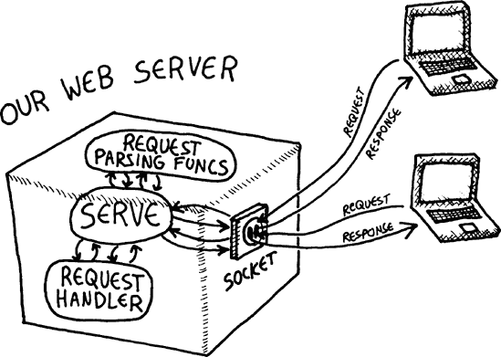

让我们详细看看我们的`serve`函数，看看它是如何完成这个任务的。

首先，`serve`创建一个绑定到 8080 端口的套接字 。这是几个常用端口之一，用于提供网页服务，尤其是在网站仍在开发阶段时。 (80 端口通常用于生产网站/服务器。)然后我们调用`unwind-protect` ，这确保无论服务器运行过程中发生什么，`socket-server-close`都会在某个时刻被调用以释放套接字。

接下来，我们启动主要的网络服务循环。在这个循环中，我们为访问我们服务器的任何客户端打开一个流 。然后我们使用`with-open-stream`宏来保证，无论发生什么，那个流都将被正确关闭。现在我们准备好读取和解析客户端对我们服务器提出的网站请求，使用我们创建的所有读取和解析函数 。

最后，我们调用`request-handler`函数，传入请求详情 。注意我们事先重新定义了`*standard-output*`动态变量。这意味着请求处理器可以直接写入标准输出，所有打印的数据将自动重定向到客户端流。正如你在第十二章中学到的，从标准输出捕获数据可以让我们最小化字符串连接。此外，它还将使我们的`request-handler`函数更容易调试，正如你很快就会看到的。

### 注意

我们没有在我们的 Web 服务器中做的一件事是防止`request-handler`触发异常时 Web 服务器崩溃。相反，我们只是保证在异常情况下不会损坏任何资源。我们很容易添加额外的异常处理来确保即使在发生可怕的异常的情况下，服务器也能继续运行。然而，由于我们的目标是学习 Lisp 并在浏览器中开发游戏，最好是立即了解任何异常，即使那会导致我们的服务器崩溃。

# 构建动态网站

为了尝试我们闪亮的新 Web 服务器，让我们构建一个简单的网站，该网站使用简单的函数`hello-request-handler`来问候访客：

```
(defun hello-request-handler (path header params)
   (if (equal path "greeting")
       (let ((name (assoc 'name params)))
          (if (not name)
              (princ "<html><form>What is your name?<input name='name' />
 </form></html>")
             (format t "<html>Nice to meet you, ˜a!</html>" (cdr name))))
       (princ "Sorry... I don't know that page.")))
```

这个`hello-request-handler`函数只支持一个网页，称为`greeting`。提供这个`greeting`页面的第一步是查看这个页面是否确实是客户端请求的 。如果不是，我们向用户打印一个道歉，因为我们没有找到指定的页面 。否则，我们检查请求参数，看我们是否知道用户的姓名 。如果不知道，我们要求用户使用网页表单输入用户名 。如果我们确实知道用户的姓名，我们将热情地问候访客 。

### 注意

我们在构建我们的 Web 服务器和这个原始网站时采用了许多捷径。例如，发送给客户端的任何 HTML 都应该包裹在一个合适的 HTML 骨架中，例如`<html><body>...</body></html>`。然而，即使如此，我们的页面也不会完全符合现代 HTML 标准。此外，当客户端请求一个不存在的页面时，适当的响应是显示 404 错误页面，而不仅仅是打印一个礼貌的道歉。幸运的是，网络浏览器对这样的捷径非常宽容，它们仍然会显示我们的简化响应。

## 测试请求处理器

在我们启动新网站之前，让我们通过首先查看有关 lolcats 的页面来在 REPL 中测试我们的`hello-request-handler`：

```
> `(hello-request-handler "lolcats" '() '())`
Sorry... I don't know that page.
```

完美。正如你所看到的，当我们向请求处理器请求除`greeting`页面之外的页面时，它只是打印出一个道歉。现在让我们尝试查看正确的`greeting`页面：

```
> `(hello-request-handler "greeting" '() '())`
<html><form>What is your name?<input name='name' /></form></html>
```

太棒了！我们的请求处理器已生成一个 HTML 表单，要求用户输入用户名。现在让我们为用户名传递一个参数，就像表单已被处理并发送到服务器一样：

```
> `(hello-request-handler "greeting" '() '((name . "Bob")))`
<html>Nice to meet you, Bob!</html>
```

由于我们设计 Web 服务器的方式，在 REPL 中独立调试请求处理器非常简单。我们能够看到`hello-request-handler`生成了正确的响应，而无需实际启动 Web 浏览器。

## 启动网站

既然我们知道我们的新网站正在运行，让我们启动它！但首先，我们需要确保本章讨论的所有函数都已在一个 CLISP 实例中定义。如果您在阅读时没有将这些函数输入到 REPL 中，您可以将它们全部保存到一个名为*webserver.lisp*的文件中，然后使用`(load "webserver")`来加载它们。

一旦你在 CLISP 中定义了你的函数，通过在 REPL 中输入以下内容来启动服务器：

```
> `(serve #'hello-request-handler)`
```

就这样！现在你应该能够通过 Web 浏览器访问该网站：


如您所见，当您从浏览器（使用 127.0.0.1:8080，这将指向运行 Web 浏览器的同一台机器上的 8080 端口）访问我们的`greeting`页面时，您会被要求输入您的名字。然后服务器会显示一个后续页面，通过名字问候您。这表明我们的 Web 服务器能够从请求参数中解析出名字，并将名字传递给我们的`hello-request-handler`函数。

现在我们已经拥有了一个完全功能的 Web 服务器和请求处理基础设施。在未来的章节中，我们将使用这些工具来创建一个令人惊叹的、图形化的、基于 Web 的游戏。

# 你学到了什么

在本章中，您使用 Common Lisp 创建了一个 Web 服务器，并在过程中学习了以下内容：

+   您可以使用`error`函数在 Common Lisp 中发出条件。您可以使用`handle-case`命令捕获此类错误。如果某些代码绝对、肯定需要在发生任何错误的情况下调用，您可以将此代码放在`unwind-protect`命令内部。

+   Web 服务器处理 HTTP 请求。最常见的一种请求是`GET`请求，用于查看信息。另一种常见类型是`POST`请求，用于提交 Web 表单，例如。您可以通过查看*请求头*来告诉请求的类型、请求的页面以及其他信息。`GET`和`POST`请求都可能包含请求参数，这些参数可以出现在请求 URL 的末尾或在*请求体*的底部。

# 第 13.5 章. 函数式编程很美

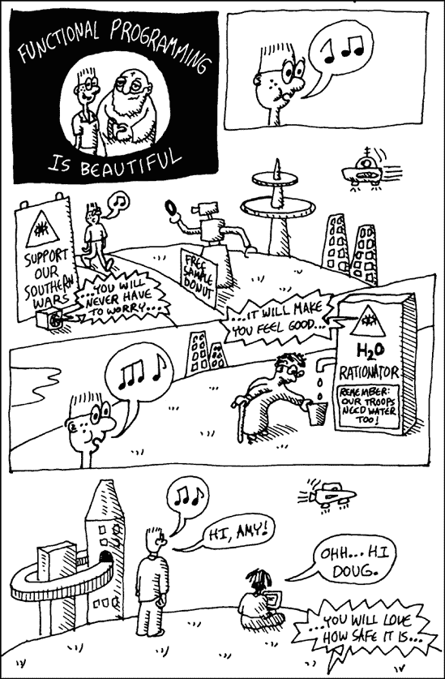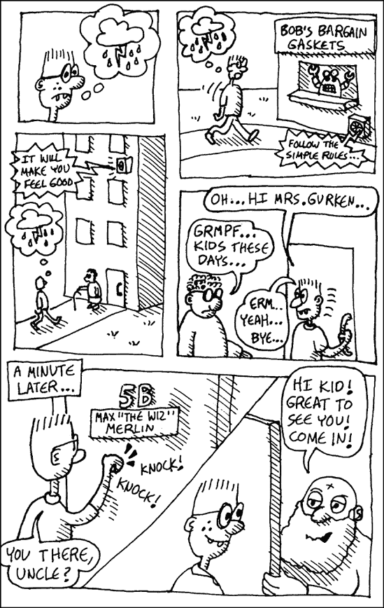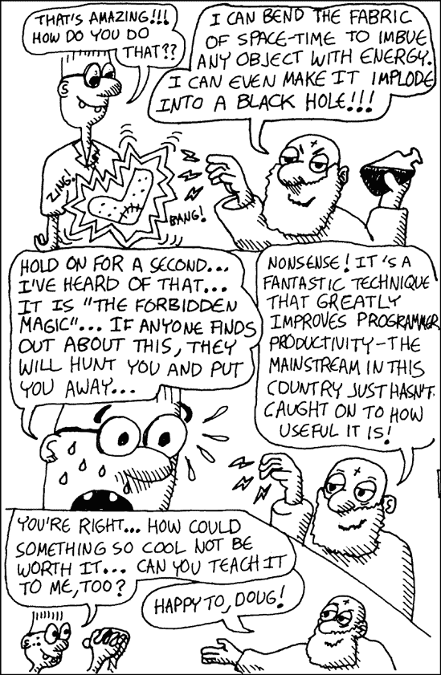
