# 第四部分：Lisp 是科学


# 第十四章：使用函数式编程提升 Lisp 的水平

正如你在前面的章节中看到的，Lisp 使得快速编写代码和构建简单的游戏变得非常容易。然而，Lisp 的主要声誉在于作为一种学术工具，适合解决最复杂的科学问题。它也适合黑客攻击，这可以说是附带的好处。

在本书的其余部分，我们将专注于语言的科学方面，探索一些高级技术来构建一个更复杂的游戏，我希望这真的会让你大开眼界。它将做些你可能从未想过在计算机程序中做到的事情。

在本章中，你将学习第一个高级 Lisp 概念，称为 *函数式编程技术*。在下一章中，我们将使用这项技术来构建一个简单的掷骰子战争游戏，以及一个粗略的人工智能对手来与之对战！

# 什么是函数式编程？

我们已经在前面章节中讨论了函数式编程的概念。简单地说，函数式编程是“一种编程风格，我们使用函数编写所有的代码。”

然而，当我们在这个上下文中使用术语 *函数* 时，我们指的是非常具体的东西——与数学家使用这个词时所指的完全相同。那么，当数学家使用这个词时，他们是什么意思呢？

你可能已经知道了答案。试着回忆一下你上代数前的时候。如果你在那个特别的课程中没有睡着，你可能会记得你的老师在大黑板上画了类似这样的东西：

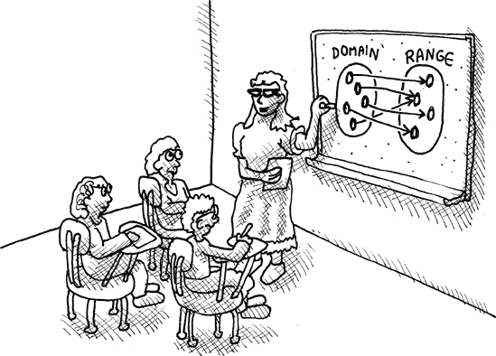

这张图片显示了一个函数有可以输入的参数，称为函数的 *定义域*。然后函数将这些参数取走并返回一个值。这个值被称为位于函数的 *值域* 内。

### 注意

一些高级 Lisp 程序员可能会对有人说函数“返回值”感到不适。这是因为 Lisp 源自一种称为 *λ-演算* 的东西，这是一种在 1930 年代由 Alonzo Church 开发的基本的编程类似代数。在 λ-演算中，你通过在起始程序上执行替换规则来“运行”一个程序，以确定函数的结果。因此，一组函数的结果通过执行替换规则神奇地出现；函数永远不会“有意识地”决定返回一个值。

因此，Lisp 纯粹主义者更喜欢说一个函数“评估为结果”。然而，在编程世界的几乎每个人喜欢说函数返回一个值。这取决于你决定哪种关于函数的思考方式感觉最自然。

这里有一些数学函数的重要属性，我们希望我们的 Lisp 函数也遵守：

+   只要传入相同的参数，函数总是返回相同的结果。（这通常被称为*引用透明性*。）

+   函数永远不会引用函数外部定义的变量，除非我们确定这些变量将保持不变。

+   函数不会修改（或如函数式程序员喜欢说的*变异*）任何变量。

+   函数的目的是除了返回结果之外不做任何事情。

+   函数不会做任何外界可见的事情，例如在屏幕上弹出对话框或让计算机发出“Bing！”的声音。

+   函数不会从外部来源获取信息，例如键盘或硬盘。

如果我们尽可能遵守这些规则，我们可以说我们的代码是以*函数式风格*编写的。

真正的数学函数的一个很好的例子是正弦函数。同样，Lisp 中的`sin`函数（计算数学正弦）是 Lisp 函数遵守函数式风格的绝佳例子：

```
> `(sin 0.5)`
0.47942555
```

`sin`函数只要传入相同的参数（在这种情况下，`0.5`）就会始终返回相同的结果。它不会做任何与外界交互的事情。它存在的全部目的就是返回正弦值。它遵守前面列出的所有规则。

显然，在计算机程序中用函数式风格编写*所有*代码是不可能的。例如，其中一条规则规定计算机不允许发出“Bing！”的声音——如果计算机偶尔不发出“Bing！”的声音，谁会想使用它呢？


每当一段代码做了一些外界可见的事情，例如发出“Bing！”的声音或在屏幕上显示对话框时，我们就说这段代码*引起了副作用*。函数式程序员认为这样的副作用会使你的代码“不洁”。

这种包含副作用的不洁代码的术语是*命令式代码*。术语*命令式*意味着代码是以“食谱”风格编写的，你基本上会说“首先做这个，然后做那个。”就像食谱一样，命令式代码中的大多数行都会执行副作用，例如写入屏幕或修改全局变量。命令式代码与函数式代码相反。

这引导我们到函数式编程的核心哲学。它指出你应该将你的程序分成两部分：

+   第一部分，也是最大的一部分，应该是完全函数式且无副作用的。这是你程序中的干净部分。

+   程序的第二部分，较小的一部分，是包含所有副作用的部分，与用户和外界交互。这段代码是不洁的，应该尽可能保持最小。

如果一段代码弹出一个对话框，例如，我们认为它是脏的，并将其放入我们代码的命令式部分。像对话框这样的东西并不真的是数学，我们不应该让它们与我们的数学函数和其他干净、功能性的代码互动。


# 函数式风格编写的程序结构

现在我们已经讨论了如何进行函数式编程，让我们写一个简单的程序，遵循这种风格。由于我们希望这个程序成为大多数软件的典型例子，我们应该弄清楚世界上大多数软件实际上做什么。那么，世界上大多数程序实际上做什么呢？它们跟踪小部件！


下面是我们的整个示例程序，用函数式风格编写的：

```
;the clean, functional part
 (defun add-widget (database widget)
   (cons widget database))

  ;the dirty, nonfunctional part
 (defparameter *database* nil)

 (defun main-loop ()
   (loop (princ "Please enter the name of a new widget:")
         (setf *database* (add-widget *database* (read)))
          (format t "The database contains the following: ˜a˜%" *database*)))
```

正如承诺的那样，它分为两部分：*干净部分*和*脏部分*。我确实说过程序的干净部分应该比脏部分大得多。然而，由于这个例子非常简短，脏部分最终变得稍微大一些。通常，你可以预期干净部分大约占实际代码的 80%。

### 注意

一些编程语言甚至比 Lisp 更专注于函数式编程。例如，Haskell 有强大的功能，让你可以用函数式风格编写 99.9% 的代码。然而，最终，你的程序仍然需要某种形式的副作用；否则，你的代码无法完成任何有用的任务。

那么，我们的示例程序做什么呢？嗯，它基本上做了世界上大多数计算机程序设计要做的：它在数据库中跟踪小部件！

这个例子中的数据库非常原始。它只是一个存储在全局变量 `*database*` 中的 Lisp 列表。由于数据库一开始是空的，我们初始化这个变量并将其设置为空 ![http://atomoreilly.com/source/nostarch/images/783560.png]。

我们可以通过调用函数 `main-loop` 来开始跟踪一些小部件 ![http://atomoreilly.com/source/nostarch/images/783554.png]。这个函数只是启动一个无限循环，询问用户小部件的名称 ![http://atomoreilly.com/source/nostarch/images/783510.png]。然后，在读取小部件信息后，它调用 `add-widget` 函数将新小部件添加到数据库中 ![http://atomoreilly.com/source/nostarch/images/783544.png]。

然而，`add-widget` 函数  位于代码的干净部分。这意味着它是功能性的，不允许直接修改 `*database*` 变量。像所有功能性代码一样，`add-widget` 函数只能返回一个新值，不能做更多的事情。这意味着它唯一能够“添加”小部件到数据库的方式是返回一个全新的数据库！它是通过简单地接受传递给它的数据库，然后将小部件连接到数据库来创建一个新的数据库 。新的数据库与之前的数据库完全相同，只是现在列表的最前面增加了一个新的小部件。

想想这听起来有多疯狂。想象一下，我们正在运行一个包含数百万个小部件的 Oracle 数据库服务器：


然后，当我们添加一个新的小部件时，数据库服务器通过创建一个全新的数据库副本来完成这个任务，这个副本与之前的数据库唯一的不同之处在于增加了一个新的项目：

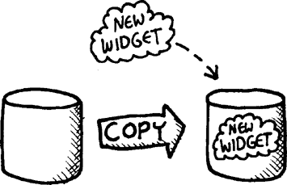

这将非常低效。然而，在我们的小部件示例中，事情并没有看起来那么糟糕。确实，每次调用 `add-widgets` 函数时，都会创建一个新的小部件列表，并且重复调用此函数会使列表越来越长。然而，由于每个新的小部件只是简单地添加到列表的前面，结果发现小部件列表的尾部与列表的上一版本完全相同。因此，`add-widget` 函数在创建新列表时可以通过简单地连接一个新小部件到列表的前面，并将旧列表作为尾部来保存其余项目来“欺骗” 。这允许以快速的方式创建新列表，并且只需要分配非常少的内存。实际上，`add-widget` 分配的唯一新内存是一个新的连接单元，用于将新小部件连接到之前的列表。

在创建新数据结构时这种欺骗行为是使高效功能性编程成为可能的关键技术。此外，由于功能性编程的一个基本原则是永远不要修改旧数据，因此结构共享可以安全地进行。

因此，我们的 `add-widget` 函数为我们创建了一个包含额外项目的数据库。在代码的脏部分，`main-loop` 函数将全局的 `*database*` 变量设置为这个新数据库。这样，我们就间接地在两步中修改了数据库。

1.  `add-widget` 函数，这个程序的大脑，为我们生成了一个更新的数据库。

1.  负责脏活累活的 `main-loop` 函数修改了全局的 `*database*` 变量以完成操作。

这个示例程序展示了用函数式风格编写的 Lisp 程序的基本布局。让我们尝试运行我们的新程序，看看它是如何工作的：

```
> `(main-loop)`
Please enter the name of a new widget: `Frombulator`
The database contains the following: (FROMBULATOR)
Please enter the name of a new widget: `Double-Zingomat`
The database contains the following: (DOUBLE-ZINGOMAT FROMBULATOR)
...
```

记住，你可以按 ctrl-C 来退出这个例子中的无限循环。

# 高阶编程

对于学习用函数式风格编写程序的程序员来说，一个常见的难题是他们发现很难将不同的代码块组合起来执行单个操作。这被称为*代码组合*。编程语言应该使代码组合变得容易。换句话说，它应该使你能够将不同的代码片段组合起来，共同解决问题。在编写函数式代码时，*高阶编程*是代码组合的最强大工具，它允许你使用接受其他函数作为参数的函数。

让我们通过一个例子来了解为什么代码组合可能对初学的函数式程序员来说是一个挑战。假设我们想要将以下列表中的每个数字加二：

```
> `(defparameter *my-list* '(4 7 2 3))`
*MY-LIST*
```

要做到这一点，我们需要编写代码来遍历列表，以及编写代码来将一个数字加二。这是我们需要的两个组合任务。

## 使用命令式代码进行代码组合

执行这个任务的一个可能的天真（且命令式）的方法是使用一个`loop`：

```
;For demonstration purposes only. A Lisper would not write code like this.
 > `(loop for n below (length *my-list*)`
         `do (setf (nth n *my-list*) (+ (nth n *my-list*) 2)))`
  NIL
  > `*my-list*`
  (6 9 4 5)
```

在这里，我们创建了一个变量`n`，它通过`loop`遍历列表中的所有项 。然后我们使用`setf`将列表中位置`n`的数字加二 。这类似于如果你是 C 程序员可能会编写的代码。尽管它看起来很丑陋，但关于它也有一些积极的东西可以说：

+   这种结构的代码可能非常高效。它节省空间，因为我们不需要为存储新列表分配任何内存（我们只是在修改旧列表，使其中的所有数字都加二）。而且它也可能非常节省时间，如果我们把这个循环改写为在数组上工作而不是在列表上。记住，在列表中找到第*n*项是慢的。

+   这样编写的代码明显组合了循环  和将一个数字加二  的任务。通过将我们的加法代码放在循环内部，我们将这两个活动组合起来，以完成一个更复杂的任务：将整个数字列表中的数字加二。

然而，命令式方法存在明显的缺点：

+   这会破坏原始列表。如果我们稍后使用`*my-list*`变量，并且没有意识到这段代码已经破坏了列表中的原始值，这就会成为一个问题。Lisper 会说，允许`*my-list*`变量随意修改，使得这个变量成为程序中的*隐藏状态*。与隐藏状态相关的错误在鼓励命令式编程风格的编程语言中很常见。

+   我们需要创建一个变量 `n` ![http://atomoreilly.com/source/nostarch/images/783564.png] 来跟踪我们在列表中的位置。这使得代码更加臃肿，也增加了更多可能出现错误的地方。我们总是有风险给 `n` 赋予错误的值或错误地使用它来访问列表中的项。

## 使用函数式风格

现在我们来看看如果我们以函数式风格重写这段代码会发生什么。让我们首先像初学者一样写它，不使用高阶编程：

```
 > `(defun add-two (list)`
      `(when list`
        `(cons (+ 2 (car list)) (add-two (cdr list)))))`
  ADD-TWO
  > `(add-two '(4 7 2 3))`
  (6 9 4 5)
```

在这里，我们正在创建一个名为 `add-two` 的函数 ![http://atomoreilly.com/source/nostarch/images/783564.png]，它将 2 加到列表前面的数字上，然后递归地调用自身来构建列表的尾部。

这段代码避免了命令式解决方案的许多缺点。它不会破坏原始列表，也不需要我们使用数字索引。不幸的是，它也失去了命令式版本的一个关键好处：不再有明确的界限来区分添加 2 到列表项的代码和遍历列表的代码。这两个活动现在深深地交织在一起，这也是我们需要创建一个特殊的函数 `add-two` 来使这个解决方案工作的原因。我们失去了以干净的方式组合这两个任务的能力。

## 高阶编程来拯救

如果我们想以函数式风格编写这个任务的代码，但仍然允许我们的代码可组合，我们需要使用高阶函数。以下是一个经验丰富的 Lisper 如何将 2 加到列表中每个数字上的方法：

```
> `(mapcar (lambda (x)`
             `(+ x 2))`
           `'(4 7 2 3))`
(6 9 4 5)
```

现在我们终于有一个版本的代码是函数式的，并且允许我们组合遍历代码和添加代码。在这里，遍历是通过 `mapcar` 函数完成的，它是一个高阶函数，因为它将提供的函数应用于列表中的每个成员。添加是通过一个 lambda 函数完成的，它只负责将 2 加到数字上，并且对数字在列表中的事实视而不见。这个例子表明，高阶编程可以让我们编写清晰界定的代码块，然后组合它们，而无需打破函数式风格。

# 为什么函数式编程很疯狂

我们已经知道为什么函数式编程很疯狂的一个原因：函数式程序实际上不能做任何事情，因为它们不能有 *副作用*。正如著名的函数式程序员 Simon Peyton Jones 喜欢说的，“没有副作用你能做的只是按下一个按钮，然后看着盒子热一段时间。”（这从技术上讲是不正确的，因为盒子变热本身就是一个副作用。）

我们已经看到，我们可以通过在我们的程序中添加一个“脏”部分来绕过函数式编程的限制，这部分代码与代码的其他部分保持分离，并包含所有我们的命令式代码，这些代码不是函数式风格的。然而，回想一下函数式风格的问题：它可能导致代码效率极低。

性能一直是函数式程序的一个巨大关注点。必须编写不允许修改现有变量值，而只能创建新变量的代码，这可能导致大量的内存复制和内存分配，这可能会使程序速度慢到几乎停止。减轻这种复制和分配的一种方法是在我们程序的不同数据部分之间使用共享结构。

尽管如此，以函数式风格编写的代码具有影响性能的其他属性。例如，函数式代码大量使用递归，而不是循环。使用递归会导致 Lisp 编译器/解释器在程序栈上放置大量项目，这可能会非常慢。

幸运的是，函数式程序员已经开发出可以解决绝大多数性能问题的优化技术。这些包括记忆化、尾调用优化、惰性评估和高级编程，这些内容我们将在下一章中介绍。使用这些技术和其他技术，经验丰富的函数式程序员可以编写通常与其他风格编写的代码具有可比性能的代码。

然而，有些类型的程序根本不能以纯函数式的方式编写。例如，你可能不会用函数式风格来编写一个全功能的 Oracle 式关系数据库系统。然而，较小的、内存驻留的数据库系统可能能够使用纯函数式技术（例如，Haskell 程序员可以在[`happs.org/`](http://happs.org/)上获得的 HAppS-IxSet）。因此，实际上并没有一个严格的界限来决定何时可以使用函数式编程。

# 为什么函数式编程很棒

现在我已经告诉你函数式程序员必须忍受的所有头痛问题，你可能想知道，“为什么有人会费心以这种方式编程？”答案是，函数式编程有许多吸引人的好处，这些好处可以弥补这些头痛。

## 函数式编程减少错误

计算机程序中的错误通常发生是因为，在特定情况下，代码的行为与程序员在编写代码时预期的行为不符。在函数式编程中，函数的行为取决于一个且仅有一个因素：传递给函数的显式参数。这使得程序员更容易理解程序可能遇到的所有情况，包括可能导致错误的情况。

编写仅依赖于其参数行为的函数也使得错误易于复制。如果你用通过其参数传入的相同数据调用一个函数，它应该每次都做完全相同的事情。这就是我们所说的*引用透明性*。

## 功能性程序更加紧凑

结果表明，许多常规计算机程序的工作涉及创建、初始化和更新变量。功能性程序不做任何这些。正如我们之前讨论的，功能性程序利用了高阶函数，这不需要我们在代码中创建大量的临时变量，这使得我们的代码更加紧凑。

## 功能性代码更加优雅

功能性编程的最大优势是它将所有计算机编程带回到了数学领域。数学方程式弹出对话框或写入硬盘是没有意义的。可以认为，如果我们让我们的计算机代码回到这种相同的纯净水平，它将更加优雅。此外，如果我们的代码更接近数学世界，我们可能能够使用数学工具来编写更好的计算机代码。

事实上，许多研究仍在继续进行，使用数学证明来检查功能性计算机程序的正确性。尽管这项研究还没有达到实用程序员会使用这些技术的程度，但它们在未来可能会更加普遍。而且，几乎可以肯定，功能性编程风格将对于在代码上进行正确性证明变得至关重要。

# 你学到了什么

在本章中，我们讨论了功能性编程。在这个过程中，你学习了以下内容：

+   以功能性风格编写的程序在给定的参数值相同时总是给出相同的结果。

+   功能性程序不包含*副作用*。它们存在的全部目的就是计算一个值并返回。

+   非功能性程序通常读起来像菜谱，包含诸如“首先做这个，然后做那个”之类的语句。这种编程风格被称为*命令式编程*。

+   编写 Lisp 程序的一个好策略是将它们分解成一个干净的功能性部分和一个脏的命令式部分。

+   功能性程序可以快速编写，更加紧凑，并且往往具有更少的错误，尤其是在经验丰富的功能性程序员手中。

# 第十五章。使用功能性风格编写的“末日骰子”游戏

现在我们终于准备好在功能性风格中创建一个更复杂（并且有趣）的计算机程序了。随着我们在本书的其余部分扩展这个程序，你将了解编写优雅功能性代码的技术，同时保持程序中的强大性能。


# “末日骰子”的规则

“末日骰子”是一款与“风险”、“骰子战争”（[`www.gamedesign.jp/flash/dice/dice.html`](http://www.gamedesign.jp/flash/dice/dice.html)）和“KDice”（[`kdice.com/`](http://kdice.com/)）同属一类的游戏。一开始，我们将保持“末日骰子”的规则极其简单。在后面的章节中，我们将扩展规则，直到最终我们会有一个与“骰子战争”非常相似的游戏。

下面是我们将开始使用的简化规则：

+   两个玩家（命名为 A 和 B）在一个六边形网格上占据空间。网格中的每个六边形上都会有一些六面骰子，属于占领者。

+   在一个回合中，玩家可以进行任意数量的移动，但必须至少进行一次移动。如果玩家无法移动，游戏结束。

+   移动包括攻击对手拥有的相邻六边形。玩家必须在她自己的六边形中拥有比相邻六边形更多的骰子才能进行攻击。目前，所有攻击都将自动导致胜利。在未来变体中，我们将实际掷骰子进行战斗。但到目前为止，拥有更多骰子的玩家将自动获胜。

+   在赢得一场战斗后，输掉战斗的玩家的骰子将从棋盘上移除，并且除了一个之外的所有赢家的骰子都将移动到新占领的六边形上。

+   在玩家完成她的移动后，将增援部队添加到该玩家的骰子军队中。增援到玩家占领的六边形的增援是逐个骰子添加的，从左上角开始，横向和纵向移动。作为增援添加的骰子最大数量比玩家在其完成的回合中从对手那里拿走的骰子少一个。

+   当一名玩家不能再进行她的回合时，游戏结束。此时占据最多六边形区域的玩家是赢家。（也可能出现平局。）

# “末日骰子”的一个示例游戏

由于我们的“末日骰子”实现将包括一个 AI 玩家，我们将从极小的游戏板尺寸开始。正如你可能知道的，AI 代码可能非常计算密集。在我们这个游戏的早期、非常天真的版本中，任何大于 2x2 六边形网格的棋盘都会让 CLISP 崩溃！

下面是一个在微小的 2x2 棋盘上进行的完整游戏示例：

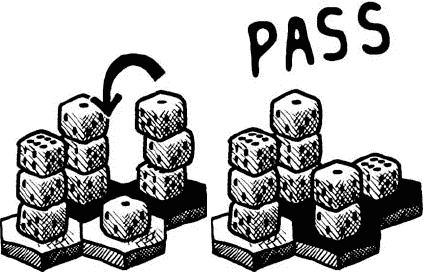

游戏开始时，玩家 A（用黑色六边形表示）拥有顶部两个六边形，每个六边形上有三个骰子。玩家 B 占据底部行（用白色六边形表示），分别有三个骰子和一个骰子。玩家 A 用他的一堆骰子中的一枚攻击孤立的骰子。攻击后，玩家 A 的一枚骰子留在了原地，而其他骰子移动到被征服的位置。然后玩家 A 结束回合。

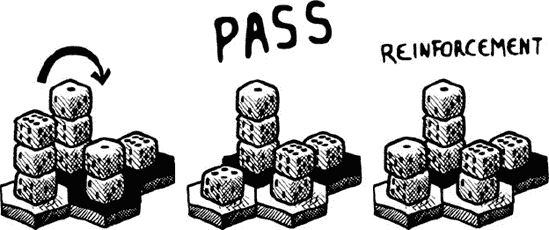

现在玩家 B 用三堆骰子攻击玩家 A 的两个骰子。然后玩家 B 传递。在这个时候，玩家 B 在她的左侧六边形上获得一个强化骰子。这是因为她杀死了玩家 A 的两个骰子。根据规则，强化骰子的数量是杀死的骰子数量减去一。


玩家 A 现在用他的三个骰子进行攻击并传递。此外，他还获得一个强化骰子。


玩家 B 现在只有一个合法的移动，即攻击两个对抗一个。

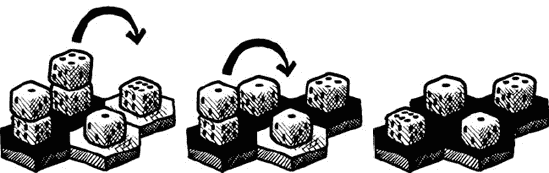

现在玩家 A 处于优势，杀死了玩家 B 剩余的所有骰子。正如你所见，玩家 A 在传递之前被允许进行多次攻击。游戏以玩家 A 获胜结束。

# 实现“末日骰子”版本 1

让我们开始用 Lisp 编写这个游戏。正如我们在上一章中讨论的，这个游戏将包含干净的、函数式的代码和脏的、命令式的代码。你将能够通过它旁边的“干净/函数式”或“脏/命令式”图标来判断代码块属于哪个类别。

## 定义一些全局变量

首先，我们将创建一些全局变量来定义我们游戏的基本参数：

```
 (defparameter *num-players* 2)
 (defparameter *max-dice* 3)
 (defparameter *board-size* 2)
 (defparameter *board-hexnum* (* *board-size* *board-size*))
```

我们声明将有两位玩家 ，每个方格上的骰子最大数量为三个 ，并且游戏板将是 2x2 。在 Dice of Doom 的后续版本中，我们将增加所有这些参数，以允许更具有挑战性的游戏。

由于了解当前游戏板大小下六边形的总数是有用的，我们也定义了`*board-hexnum*` 。请注意，尽管网格由六边形组成，但它基本上仍然是一个方形网格，因为六边形的数量正好等于网格边长的平方。

### 注意

在本章中，每个代码示例都有一个相关的图标，表示它是脏的、命令式的还是干净的、函数式的代码。到本章结束时，你应该能够轻松地区分它们，并对每种风格的优点有所了解。

## 表示游戏板

我们将使用一个简单的列表来表示游戏板。六边形将存储在这个列表中，从左上角开始，然后横向和纵向移动。对于每个六边形，我们将存储一个包含两项的列表：一个表示当前占据六边形的数字，另一个表示该位置的骰子数量。

例如，以下是一个游戏板及其编码列表的示例：


```
((0 3) (0 3) (1 3) (1 1))
```

注意，大多数 Lisp 程序员喜欢从零开始计数。因此，玩家 A 和 B 分别用数字 0 和 1 表示。这个列表表明玩家 A 在第一个六边形上有三个骰子，在第二个六边形上也有三个。玩家 B 在第三个六边形上有三个骰子，在第四个六边形上有一个。

当我们创建我们的 AI 玩家时，它需要能够非常快速地查看棋盘上的许多六边形。因此，我们将以数组的形式创建我们棋盘的第二个表示。记住，在列表中检查数字位置（例如，六边形 2）需要 `nth` 函数，这可能是缓慢的。另一方面，数组将允许在特定位置进行非常快速的查找，即使是在非常大的棋盘尺寸下。

`board-array` 函数将用列表表示的棋盘转换为数组：


```
(defun board-array (lst)
  (make-array *board-hexnum* :initial-contents lst))
```

当游戏开始时，我们将从一个随机化的棋盘开始。这是创建随机棋盘的函数：


```
(defun gen-board ()
   (board-array (loop for n below *board-hexnum*
                      collect (list (random *num-players*)
                                       (1+ (random *max-dice*))))))
```

这个函数不是函数式风格（如图标所示），因为它每次调用都会产生不同的、随机的结果。它将棋盘生成为一个列表，但完成后会使用 `board-array` 将列表转换为我们的更快的数组格式 。

它使用 Lisp 函数 `random` 生成随机值。这个函数每次都会产生一个不同的随机整数，大于或等于零，但小于传递给它的数字。我们使用我们的全局变量 `*num-players*` 和 `*max-dice*` 为每个六边形生成随机值 。

让我们尝试一下 `gen-board` 函数：

```
> `(gen-board)`
#((0 3) (1 2) (1 3) (0 1))
```

记住，井号（#）表示我们创建了一个数组，而不是一个列表。

我们将使用字母来命名玩家（仅限于 A 和 B，直到我们开始介绍更多玩家）。这是一个将玩家编号转换为字母的函数：


```
(defun player-letter (n)
  (code-char (+ 97 n)))
```

`code-char` 函数将 ASCII 码转换为相应的字符。让我们为玩家 1 调用它来看看结果：

```
> `(player-letter 1)`
#\b
```

最后，让我们创建一个函数，它将接受一个编码的棋盘，并以美观的方式在屏幕上绘制它。它将以与我们的绘图相同的方式倾斜棋盘，因此可以清楚地看到任何给定的六边形周围相邻的六个六边形。


```
(defun draw-board (board)
   (loop for y below *board-size*
          do (progn (fresh-line)
                   (loop repeat (- *board-size* y)
                          do (princ "  "))
                   (loop for x below *board-size*
                         for hex = (aref board (+ x (* *board-size* y)))
                          do (format t "˜a-˜a " (player-letter (first hex))
                                               (second hex))))))
```

由于整个 `draw-board` 函数的目的是将内容写入控制台，它肯定不是函数式的。让我们更仔细地看看这个函数。

外层`循环`遍历存储在变量`y`中的棋盘所有行 ![httpatomoreillycomsourcenostarchimages783564.png]。存在两个内层`循环`。第一个内层`循环`在左侧添加缩进，使棋盘看起来倾斜 ![httpatomoreillycomsourcenostarchimages783562.png]。第二个内层`循环`遍历存储在变量`x`中的列 ![httpatomoreillycomsourcenostarchimages783560.png]。然后使用`x`和`y`计算适当的十六进制数，并使用`aref`从棋盘数组中检索该十六进制数 ![httpatomoreillycomsourcenostarchimages783554.png]。最后，它打印出十六进制中的数据 ![httpatomoreillycomsourcenostarchimages783510.png]。

这是`draw-board`函数的输出，以及与之比较的绘图：

```
> `(draw-board #((0 3) (0 3) (1 3) (1 1)))`
    a-3 a-3
  b-3 b-1
```


## 将“末日骰子”的规则与游戏的其他部分解耦

现在我们准备编写处理我们第一个“末日骰子”实现核心部分的代码。在编写此代码时，我们将采用一种强大的函数式编程技术：函数管道。这意味着我们的游戏将由一系列函数组成，这些函数依次对一个大数据块进行操作，该数据块将包含我们游戏棋盘的表示，并在过程中对其进行修改。函数管道将使我们能够构建一个与游戏代码其他部分完全解耦的游戏规则引擎。为了理解为什么这如此酷，让我们首先考虑编写具有智能人工智能玩家的棋盘游戏所涉及的一些内容。

首先，任何棋盘游戏的计算机实现都需要处理人类玩家走棋的代码。这部分代码需要了解棋盘游戏的规则，并在允许发生之前确保人类玩家的走棋是合法的。

我们还需要编写人工智能代码。为了让人工智能玩家选择走棋，它需要了解棋盘游戏的全部规则。

注意到了什么？我们游戏引擎的这两个独立部分都需要理解游戏规则！显然，我们想要做的是将我们的游戏代码分成三个主要部分：

+   处理人类的走棋

+   人工智能玩家

+   规则引擎

一部分处理玩家的走棋。另一部分是人工智能玩家的代码。这两部分然后与一些理解规则的代码进行通信，有点像“规则引擎”。这种设计可能吗？

在传统的命令式编程风格中，编写这样的程序会非常困难。大多数命令式游戏引擎会复制“理解规则”的代码，因为在一个命令式语言中编写完全解耦的组件非常复杂。这是因为棋盘游戏需要大量的上下文——每一个动作都依赖于之前发生的动作。这意味着每次 AI 模块或玩家处理模块需要检查规则时，它必须详细地告诉“规则代码”当前的上下文。两者都需要告诉规则代码：“现在是某某玩家的回合，游戏板看起来是这样的。”没有这些信息，规则代码就无法判断一个动作是否合法。

传递这个上下文需要大量的繁琐的记账代码，容易出错，且效率低下。效率低下是因为，在简单的设计中，玩家处理代码可能会检查 AI 代码已经探索并认为合法的动作的合法性。

然而，使用函数式编程，我们可以在程序中完全解耦这三个关注点。我们将能够做到这一点，而不需要记账代码，并且以避免任何合法性计算重复的方式。我们将通过将我们的规则代码编码在懒游戏树中来实现这一点！

### 注意

我们使用的基本方法——使用懒游戏树和函数管道以函数式风格编写游戏——在 John Hughes 的经典论文“为什么函数式编程很重要”中有描述([`www.scribd.com/doc/26902/whyfp/`](http://www.scribd.com/doc/26902/whyfp/))。

在本章中，我们将创建一个还不是懒的棋盘树。您需要等到第十八章才能理解懒编程以及懒游戏树的样子。那时您也将能够完全欣赏这种架构设计有多么酷。


## 生成游戏树

我们游戏的整个规则集都编码在以下主函数中：


```
 (defun game-tree (board player spare-dice first-move)
   (list player
          board
         (add-passing-move board
                            player
                            spare-dice
                            first-move
                           (attacking-moves board player spare-dice))))
```

`game-tree`函数根据一定的起始配置构建所有可能动作的树。这个函数将在游戏开始时只被调用一次。然后，它将递归地构建游戏的所有可能动作的树，直到最终的胜利位置。我们的游戏的其他部分将优雅地遍历这棵树，以符合游戏的规则。

为了从给定的上下文中计算游戏树的合法可能动作，该函数需要通过参数传递四份数据 :

+   棋盘的样子

+   当前玩家

+   在当前回合中，玩家捕获了多少个骰子，这是根据我们的规则计算未来增援所需的

+   当前移动是否是当前玩家的第一次移动，因为玩家在至少进行一次移动之前不能传递回合

当`game-tree`函数创建树时，它将在每个分支上放置有关当前棋盘和当前玩家的信息 。子分支将包含从当前分支的所有合法后续移动：

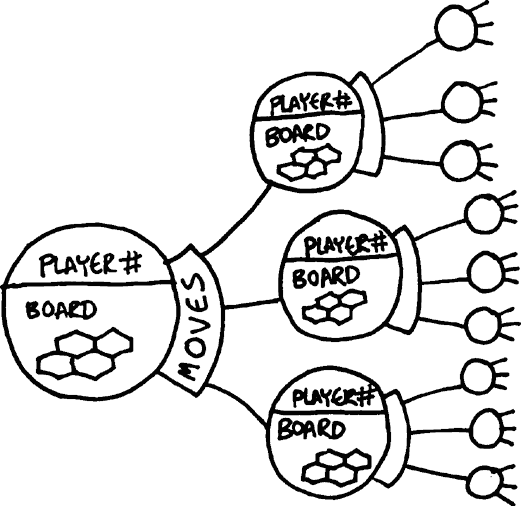

玩家可能有两种合法的移动类型：攻击一个六边形或将其回合传递给下一个玩家（假设他们已经至少攻击过一次）。通过`add-passing-move`函数将传递移动添加到合法移动列表中 。攻击移动通过`attacking-moves`函数添加到列表中 。接下来，让我们看看这些函数。

## 计算传递移动

这里是向游戏树添加传递移动的函数：


```
 (defun add-passing-move (board player spare-dice first-move moves)
   (if first-move
       moves
       (cons (list nil
                   (game-tree (add-new-dice board player (1- spare-dice))
                              (mod (1+ player) *num-players*)
                                     0
                                     t))
            moves)))
```

这个函数的任务是在允许传递的情况下，将传递移动添加到移动总数中。当前移动列表被传递到这个函数 ，然后该函数将返回扩展后的移动列表。如果移动是玩家回合中的第一次移动 ，则不允许传递，我们只返回未更改的列表 。否则，我们向列表中添加一个新的移动。

我们的游戏树中的每个移动都由两部分组成：

+   第一部分是对移动的描述。由于我们只是传递这个移动，我们将描述设置为`nil` 。

+   移动的第二部分是一个全新的游戏树，它包含了在此移动执行后存在的所有可能的移动。我们通过递归调用`game-tree`来创建这个游戏树 。由于这是玩家的回合结束，玩家可能会收到骰子作为增援。因此，我们使用`add-new-dice`函数更新发送给这个新`game-tree`调用的棋盘 。

当然，我们还需要更改当前玩家，因为现在是一个新人的回合开始了。我们通过将当前玩家编号加一，并用玩家总数作为除数取模来实现这一点 。以这种方式更改玩家将允许代码在未来版本中即使增加游戏中的玩家数量也能正常工作。

## 计算攻击移动

这里是向游戏树添加可能攻击移动的函数：


```
(defun attacking-moves (board cur-player spare-dice)
   (labels ((player (pos)
               (car (aref board pos)))
            (dice (pos)
               (cadr (aref board pos))))
     (mapcan (lambda (src)
               (when (eq (player src) cur-player)
                 (mapcan (lambda (dst)
                            (when (and (not (eq (player dst) cur-player))
                                 (> (dice src) (dice dst)))
                            (list
      (list (list src dst)
            (game-tree (board-attack board cur-player src dst (dice src))
                        cur-player
                        (+ spare-dice (dice dst))
                        nil)))))
                        (neighbors src))))
              (loop for n below *board-hexnum*
                    collect n))))
```

`attacking-moves`函数比`add-passing-move`函数复杂一些。它负责扫描当前游戏棋盘，并确定当前玩家合法允许执行哪些移动。

由于必须花费大量时间来确定给定六边形上的玩家是谁，我们首先编写了一个方便的函数`player`，该函数返回给定棋盘位置的玩家 ![http://atomoreilly.com/source/nostarch/images/783564.png]。我们编写了一个类似函数来获取给定六边形上的骰子数量 ![http://atomoreilly.com/source/nostarch/images/783562.png]。

接下来，我们需要从上到下扫描棋盘，找出当前玩家占据的方格。对于每个占据的方格，可能有一个或多个从该位置开始的合法攻击。由于任何六边形的攻击数量可能不同，我们使用`mapcan`来扫描棋盘 ![http://atomoreilly.com/source/nostarch/images/783560.png]。记住，`mapcan`允许我们扫描的每个六边形将其结果作为列表返回。然后`mapcan`将这些列表连接起来。这样，任何扫描的六边形都可以向列表贡献从 0 到*n*个移动。

在`mapcan`函数中使用的`lambda`函数，该函数为每个六边形调用一次，我们首先想要检查当前玩家是否占据了该六边形 ![http://atomoreilly.com/source/nostarch/images/783554.png]。然后我们想要检查所有相邻的六边形，看看是否有任何一个六边形构成了有效的攻击。我们使用另一个`mapcan` ![http://atomoreilly.com/source/nostarch/images/783510.png] 来完成这个操作。我们将通过使用`neighbors`函数来确定这个六边形的相邻六边形，这个函数我们将很快编写 ![http://atomoreilly.com/source/nostarch/images/783498.png]。

我们如何决定一个六边形是否可以成为攻击目标？嗯，它必须是一个我们尚未拥有的六边形，并且（根据规则）源六边形需要比目标六边形有更多的骰子 ![http://atomoreilly.com/source/nostarch/images/783544.png]。如果我们找到了一个合法的攻击移动，我们随后描述这个移动 ![http://atomoreilly.com/source/nostarch/images/783556.png]。描述只是一个源位置和目标位置的列表。然后（就像传递移动一样）递归地生成另一个游戏树，描述如果执行这个移动会发生什么 ![http://atomoreilly.com/source/nostarch/images/783566.png]。

## 寻找相邻六边形

接下来，让我们创建一个函数来计算给定六边形的相邻六边形：


```
(defun neighbors (pos)
    (let ((up (- pos *board-size*))
          (down (+ pos *board-size*)))
     (loop for p in (append (list up down)
                            (unless (zerop (mod pos *board-size*))
                               (list (1- up) (1- pos)))
                            (unless (zerop (mod (1+ pos) *board-size*))
                               (list (1+ pos) (1+ down))))
                 when (and (>= p 0) (< p *board-hexnum*))
                  collect p)))
```

游戏板上的每个六边形可能有最多六个邻居，如果六边形在板的边缘，则可能更少。我们通过一个`loop`构建可能的邻居列表 ，然后收集那些位置编号不在板边缘的六边形 。此外，由于我们的位置编号从行到行是循环的，我们需要确保如果我们位于板的左侧边缘  或右侧边缘 ，不要向左看或向右看。

这个函数被标记为清洁（它处于函数式风格），但尽管如此，它仍然包含一个`loop`。通常，循环违反函数式编程的原则。然而，许多 Lisper 认为，如果`loop`只是收集一些值，那么在函数式代码中使用它是可以接受的，因为它实际上并没有改变任何值或产生任何其他副作用。因此，我们将允许自己在游戏的函数式风格部分使用这样的循环。

让我们尝试我们的`neighbors`函数：

```
> `(neighbors 2)`
(0 3)
```


如您所见，它正确地告诉我们六边形 2 的邻居是六边形 0 和 3。

## 攻击

现在让我们编写我们的`board-attack`函数：


```
(defun board-attack (board player src dst dice)
   (board-array (loop for pos
                      for hex across board
                      collect (cond ((eq pos src) (list player 1))
                                    ((eq pos dst) (list player (1- dice)))
                                    (t hex)))))
```

这是一个确定如果六边形`src`攻击六边形`dst`会发生什么的函数。它通过在板上`loop`，跟踪当前位置  和该位置六边形的内含物  来工作。如果当前六边形是源六边形，我们只需在那个地方放置一个骰子；根据我们的规则，攻击后留下一个骰子 。如果当前六边形是目标位置，我们将剩余的骰子放在那里，减去留下的一个 。在其他情况下，我们只是收集相同的六边形 。

让我们尝试我们的`board-attack`函数：

```
> `(board-attack #((0 3) (0 3) (1 3) (1 1)) 0 1 3 3)`
#((0 3) (0 1) (1 3) (0 2))
```


如您所见，从六边形 1 攻击到 3 会导致`board-attack`正确更新游戏板，使得一个骰子留在原来的方格上，两个在新的、征服的方格上。

### 注意

本章中的许多函数都有低效之处，以保持简单。我们将在游戏的未来版本中修复这些问题。

## 增援

要在棋盘上添加强化，我们需要扫描整个游戏棋盘，找到可以容纳另一个骰子的占据点，并将骰子放在那里。当然，强化骰子的数量受限于玩家在上一个回合中捕获的对手骰子的数量。因此，我们需要持续计算剩余的强化骰子数量。

跟踪剩余骰子的最明显方法是有 `remaining-dice` 变量，并在放置骰子时递减。然而，拥有递减（变异）的骰子与函数式风格不符。

因此，我们将使用局部递归函数来编写我们的 `add-new-dice` 函数，该函数也将维护骰子的运行计数。

下面是这个 `add-new-dice` 函数：


```
(defun add-new-dice (board player spare-dice)
   (labels ((f (lst n)
              (cond ((null lst) nil)
                    ((zerop n) lst)
                 (t (let ((cur-player (caar lst))
                          (cur-dice (cadar lst)))
                     (if (and (eq cur-player player) (< cur-dice *max-dice*))
                          (cons (list cur-player (1+ cur-dice))
                               (f (cdr lst) (1- n)))
                         (cons (car lst) (f (cdr lst) n))))))))
     (board-array (f (coerce board 'list) spare-dice))))
```

`add-new-dice` 首先定义了一个名为 `f` 的局部函数 。这个函数将遍历棋盘上的六边形，并输出一个包含强化骰子的新列表。由于我们的棋盘实际上为了效率原因存储在一个数组中，我们在调用 `f` 之前使用 `coerce` 函数将数组转换为列表 。

在函数 `f` 内部，我们必须考虑三种情况：

+   我们已经到达棋盘的末尾。在这种情况下，强化后的棋盘也将完成，所以我们只需返回 `nil` 。

+   我们已经没有 `spare-dice` 可以添加作为强化。在这种情况下，剩余的棋盘将保持不变，因此我们可以直接返回列表的剩余部分作为新的棋盘 。

+   上述两种情况都不适用。在其他所有情况下，我们需要分析当前六边形并决定是否需要在其中添加强化。我们检查当前玩家是否占据该六边形，以及在该方块上我们是否拥有少于最大数量的骰子 。如果是这种情况，我们在六边形上添加一个新的骰子，并对剩余的棋盘递归地调用 `f` 。否则，我们保持当前六边形不变，并通过递归地调用 `f` 对剩余的棋盘进行操作 。

尝试在棋盘上添加强化：

```
> `(add-new-dice #((0 1) (1 3) (0 2) (1 1)) 0 2)`
#((0 2) (1 3) (0 3) (1 1))
```

如您所见，`add-new-dice` 正确地为玩家 A（玩家 0）放置了两个强化骰子。

## 尝试我们的新游戏树函数

我们现在已经编写了创建简化版“末日骰子”的完整游戏树的所需所有代码。但要注意！大多数棋类游戏的游戏树都非常庞大。即使在 2x2 的棋盘上，我们的游戏也可能包含数百种可能的动作。你只想在接近游戏结束的棋盘上调用`game-tree`函数，否则你将无助地看着 CLISP REPL 打印出一个巨大的树，显示游戏可能进展的所有可能方式。

这里有一个安全的棋盘位置供你尝试：


```
> `(game-tree #((0 1) (1 1) (0 2) (1 1)) 0 0 t)`
 (0
  #((0 1)(1 1) (0 2) (1 1))
  (((2 3)(0
             #((0 1) (1 1) (0 1) (0 1))
            ((NIL(1
                     #((0 1) (1 1) (0 1) (0 1))
                     NIL)))))))
```

游戏树首先列出当前玩家编号 ，棋盘布局 ![http://atomoreilly.com/source/nostarch/images/783562.png]，然后是该上下文的有效动作。对于初始棋盘位置，在玩家 A 的回合开始时，只有一个可能的动作：玩家可以从六边形 2 移动到六边形 3，捕获该位置的玩家 B 的骰子 ![http://atomoreilly.com/source/nostarch/images/783560.png]。之后，玩家可以选择过。玩家 B 现在没有可用的动作。由于这个玩家的游戏树没有列出可用的动作 ![http://atomoreilly.com/source/nostarch/images/783554.png]，游戏结束，玩家 A 获胜。

## 与另一名人类玩“末日骰子”

现在我们已经完全捕获了“末日骰子”游戏的全局“游戏树”函数，创建一个人类对人类版本的游戏变得简单。我们只需要创建一些函数，让它们随着玩家选择动作而沿着游戏树向下移动。

### 主循环

这里是沿着游戏树向下移动的函数，允许两名人类玩“末日骰子”：


```
(defun play-vs-human (tree)
   (print-info tree)
   (if (caddr tree)
       (play-vs-human (handle-human tree))
     (announce-winner (cadr tree))))
```

这个函数`play-vs-human`是游戏的主循环。它接受一个描述棋盘起始位置的树。

首先，它调用一个名为`print-info`的函数，该函数将在屏幕上绘制棋盘，以及有关游戏当前状态的其他有用信息 。接下来，我们需要检查是否存在后续动作。这些后续动作将从游戏树的`caddr`位置开始 。

如果有后续动作可用，我们调用`handle-human`函数，该函数将与当前玩家交互，帮助他选择新的动作。然后`handle-human`函数将返回表示玩家选择的子树的分支。然后我们可以递归地将这个子分支传递给`play-vs-human`以继续游戏 。

如果没有后续动作可用，游戏就正式结束了。然后我们调用`announce-winner`函数，它恰当地会宣布获胜者 。

### 游戏状态信息提供

这里是`print-info`函数，它描述了游戏树中当前节点的状态：


```
(defun print-info (tree)
  (fresh-line)
   (format t "current player = ˜a" (player-letter (car tree)))
   (draw-board (cadr tree)))
```

此函数在 REPL 上显示两个重要的信息。首先，它显示了当前玩家是谁 。然后，它使用`draw-board`函数打印出游戏板的漂亮版本 。

### 处理来自人类玩家的输入

接下来是允许人类选择下一步行动的函数。它显示了一个非常有用的、编号的菜单，列出了所有当前可用的移动供玩家选择。


```
(defun handle-human (tree)
    (fresh-line)
    (princ "choose your move:")
    (let ((moves (caddr tree)))
     (loop for move in moves
           for n from 1
            do (let ((action (car move)))
                 (fresh-line)
                (format t "˜a. " n)
                (if action
                    (format t "˜a -> ˜a" (car action) (cadr action))
                    (princ "end turn"))))
      (fresh-line)
     (cadr (nth (1- (read)) moves))))
```

要显示可用的移动列表，我们使用一个`loop`遍历所有可用的移动，并打印每个移动的描述 。这个`loop`不是函数式的，因为它在屏幕上打印内容供玩家阅读。我们使用变量 n 在每次移动前打印一个计数数字 ，其中 n 在`loop`内部从 1 开始计数 。

每个移动都与一个动作值相关联。如果动作非 nil ，则该动作是攻击，动作值描述了攻击的源和目标六边形。我们使用`format`命令打印这种攻击动作 。

我们使用一个空的动作值来表示传递动作。在这种情况下，我们只需`princ`“结束回合”来描述这个动作 。

在显示可用的移动后，我们使用`read`读取玩家的选择。然后，使用`nth`函数，我们可以选择游戏树的那部分并从我们的`handle-human`函数返回它 。

### 确定胜者

宣布胜者的任务可以很好地分为一个*干净/功能*部分和一个*脏/强制*部分。

干净的部分涉及计算胜者的任务。我们希望以能够处理不仅仅是两个玩家的方式计算这一点，因为我们的游戏未来将允许更多。此外，该函数必须意识到可能的平局。

为了实现这一点，我们将编写一个名为`winners`的函数，该函数返回一个或多个在游戏结束时捕获了最多六边形的玩家列表。如果有平局，它将简单地返回所有共享第一名的玩家，即所有玩家占据的总空间数。按照这种设计，该函数将适用于*任何数量的玩家*，并且优雅地处理平局。这是`winners`函数的样子：


```
(defun winners (board)
   (let* ((tally (loop for hex across board
                        collect (car hex)))
           (totals (mapcar (lambda (player)
                            (cons player (count player tally)))
                          (remove-duplicates tally)))
          (best (apply #'max (mapcar #'cdr totals))))
     (mapcar #'car
             (remove-if (lambda (x)
                           (not (eq (cdr x) best)))
                         totals))))
```

我们通过四个步骤计算给定结束棋盘位置的赢家。

+   首先，我们统计出占据棋盘上每个六边形的玩家！[](httpatomoreillycomsourcenostarchimages783564.png)。使用`across loop`结构，我们可以直接遍历结束棋盘的数组并收集每个六边形的占据者。

+   第二，我们需要使用这个统计来计算每个玩家占领的总方块数。`totals`变量将是一个 player->spaces 对的 alist。我们通过使用`remove-duplicates`找到至少在统计中有一次条目的所有玩家来构建这个 alist！[](httpatomoreillycomsourcenostarchimages783560.png)。然后我们可以映射到这个列表，并为每个占据者创建一个计数！[](httpatomoreillycomsourcenostarchimages783562.png)。

+   第三，我们想要找出单个玩家占据的六边形数量的最大值。我们通过映射`cdr`到我们的 alist 上来从计数中去除！[](httpatomoreillycomsourcenostarchimages783554.png)。然后，我们应用`max`到这个列表中，以找到单个玩家占据的最大空间数量。

+   最后，我们需要创建一个包含所有“最佳”玩家的列表。我们通过使用`remove-if`函数从总数中去除所有非最佳玩家来实现这一点！[](httpatomoreillycomsourcenostarchimages783544.png)。然后，我们通过映射`car`到最佳玩家的列表中，提取出最佳玩家的玩家编号！[](httpatomoreillycomsourcenostarchimages783510.png)。

接下来，让我们编写“宣布赢家”的函数：


```
(defun announce-winner (board)
    (fresh-line)
   (let ((w (winners board)))
     (if (> (length w) 1)
       (format t "The game is a tie between ˜a" (mapcar #'player-letter w))
       (format t "The winner is ˜a" (player-letter (car w))))))
```

这个函数相当简单。首先，我们通过调用我们之前的功能来计算赢家！[](httpatomoreillycomsourcenostarchimages783564.png)。然后我们检查是否有多个赢家！[](httpatomoreillycomsourcenostarchimages783562.png)（平局）。对于平局，我们打印一条特殊信息！[](httpatomoreillycomsourcenostarchimages783560.png)。否则，我们只宣布一个赢家！[](httpatomoreillycomsourcenostarchimages783554.png)。

### 尝试玩“末日骰子”的人与人版本

现在我们有一个完全可玩的游戏“末日骰子”。以下是一个从开始到结束的示例游戏：

```
> `(play-vs-human (game-tree (gen-board) 0 0 t))`
current player = a
    b-2 b-2
  a-2 b-1
choose your move:
1\. 2 -> 3
`1`
current player = a
    b-2 b-2
  a-1 a-1
choose your move:
1\. end turn
`1`
current player = b
    b-2 b-2
  a-1 a-1
choose your move:
1\. 0 -> 2
2\. 0 -> 3
3\. 1 -> 3
`1`
current player = b
    b-1 b-2
  b-1 a-1
choose your move:
1\. end turn
2\. 1 -> 3
`1`
current player = a
    b-1 b-2
  b-1 a-1
The winner is b
```

# 创建一个智能电脑对手

正如我们在为“末日骰子”设计游戏树代码时讨论的那样，有一个独立的游戏树生成器使得将 AI 玩家添加到游戏引擎中变得容易。实际上，我们现在要添加一个电脑玩家，它只需 23 行额外的代码就能玩出绝对完美的游戏！

那么，一个 AI 玩家是如何决定走哪一步的呢？我们将使用以下策略：

1.  检查每个可用的走法。

1.  给出每个走法导致的棋盘位置的评分。

1.  选择具有最大评分的走法。

这个计划听起来很简单，但这个算法中有一个步骤相当棘手：计算给定棋盘位置的最佳评分。

如果一个动作直接导致胜利，很容易为该动作给出评分——任何胜利的动作显然都应得到非常高的评分。然而，大多数游戏中的动作都不能导致立即胜利。在这些情况下，为了确定一系列动作的结果是否值得一个好的评分，我们需要弄清楚对手玩家将如何回应。

但我们如何知道对手玩家将决定做什么？如果我们不小心，我们可能会陷入一个丑陋的僵局，我们说，“他认为我认为他认为我认为……”，以便为给定的棋盘位置计算一个有意义的评分。我们如何考虑对手的行为而不让自己头疼？

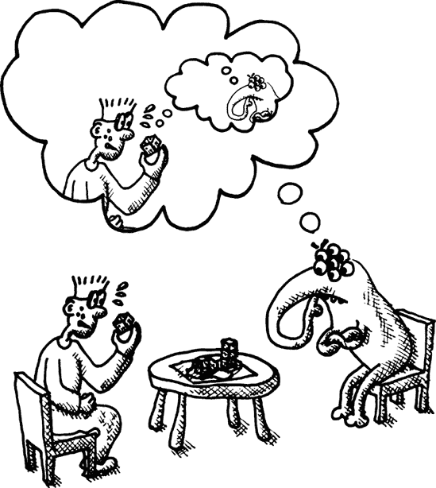

## 最小-最大算法

结果表明，对于两人棋盘游戏，存在一种简单的方法来模拟对手将如何行动。我们简单地接受这样一个真理：“对我对手有利的就是对我有害的。”这意味着我们可以使用以下方法来模拟对手的动作：

1.  查看每个可用的动作。

1.  为每个动作导致的棋盘位置给出评分。

1.  选择评分最低的动作。

这个用于估计对手将如何行动的算法与用于主要玩家的算法相同，只是在第 3 步中，我们选择评分最低的动作而不是评分最高的动作。这种方法的优点，称为最小-最大算法，是我们使用与主要 AI 玩家相同的评分来计算对手的动作，然后只是稍微调整第 3 步。

这非常重要：结果证明，如果我们能够避免在游戏中为对手和自己计算不同的评分，那么在游戏树中搜索好的动作就会变得大大简化并加快速度。

### 注意

基本的最小-最大算法仅在两人游戏中有效。当有三名或更多玩家参与游戏时，我们不能再断言“对我对手有利的就是对我有害的”这一说法完全正确。这是因为一个额外的真理变得很重要：“敌人的敌人是我的朋友。”这意味着我的某些对手可能会在某个时刻通过采取损害共同敌人的动作来充当朋友，而不会直接影响我。我们将在第二十章中更详细地讨论这个问题。

## 将最小-最大转化为实际代码

现在我们已经准备好将最小-最大思想付诸实践，如下所示：


```
(defun rate-position (tree player)
    (let ((moves (caddr tree)))
     (if moves
        (apply (if (eq (car tree) player)
                #'max
              #'min)
              (get-ratings tree player))
       (let ((w (winners (cadr tree))))
          (if (member player w)
             (/ 1 (length w))
           0)))))
```

`rate-position`函数为游戏树的一个给定分支生成一个数值评分。为了做到这一点，我们首先需要确定从给定位置（即当前动作不是游戏中的结束动作）是否有任何可用的动作。

如果有可用动作，我们需要查看所有后续动作以决定如何评级当前位置。我们通过调用`get-ratings` ，一个将返回每个后续动作的点评级的函数来实现这一点。按照最小-最大原则，然后我们将选择所有后续动作中的最佳(`max`) 或最差(`min`) 评级，具体取决于正在评级的动作是为 AI 玩家还是其对手。

如果没有后续动作，我们需要检查当前棋盘位置的胜者 。如果玩家不是这个位置胜者之一，我们可以给这个位置分配最低评级`0` 。否则，我们将胜者数量除以 1 来确定我们的评级 。通过这样做，我们也为平局给出了有意义的评级。如果玩家是唯一的胜者，根据这个公式，评级将是最大值`1`。对于两名玩家的平局，评级将是合理的`0.5`。

下面是`get-ratings`函数的样子：


```
(defun get-ratings (tree player)
  (mapcar (lambda (move)
          (rate-position (cadr move) player))
        (caddr tree)))
```

这个函数简单地映射给定树分支的每个可用后续动作的`rate-position`。

## 使用人工智能玩家创建游戏循环

之前，我们编写了一个名为`handle-human`的函数，该函数与人类交互以决定游戏中的移动。这里有一个类似的功能，`handle-computer`，它与我们的 AI 玩家交互以选择移动：


```
(defun handle-computer (tree)
   (let ((ratings (get-ratings tree (car tree))))
     (cadr (nth (position (apply #'max ratings) ratings) (caddr tree)))))
```

这个`handle-computer`函数相当直接。首先，我们获取每个可用动作的评级 。然后我们选择评级最高的动作 。

最后，让我们创建一个处理与计算机对弈的主循环的函数。这个函数与之前的`play-vs-human`函数类似：


```
(defun play-vs-computer (tree)
   (print-info tree)
   (cond ((null (caddr tree)) (announce-winner (cadr tree)))
       ((zerop (car tree)) (play-vs-computer (handle-human tree)))
       (t (play-vs-computer (handle-computer tree)))))
```

与`play-vs-human`函数一样，`play-vs-computer`首先打印出有关当前游戏状态的详细信息 。如果没有更多动作可用，它随后调用`announce-winner`函数 。

接下来，我们需要检查当前玩家是谁。按照惯例，我们将人类玩家称为玩家 A（玩家 0）。如果玩家编号是 0，我们将调用我们的旧`handle-human`函数，让人类玩家决定她的走法 。否则，我们将玩家视为 AI 玩家，并使用`handle-computer`函数来决定走法 。

我们现在已经为《末日骰子》编写了一个完全功能化的 AI 引擎！

## 玩我们的第一次人机对战游戏

以下是对抗计算机 AI 的示例游戏。计算机玩了一局最优游戏并获胜。

```
> `(play-vs-computer (game-tree (gen-board) 0 0 t))`
current player = a
    a-3 b-3
  a-2 b-2
choose your move:
1\. 0 -> 3
`1`
current player = a
    a-1 b-3
  a-2 a-2
choose your move:
1\. end turn
`1`
current player = b
    a-2 b-3
  a-2 a-2
current player = b
    b-2 b-1
  a-2 a-2
current player = a
    b-3 b-1
  a-2 a-2
choose your move:
1\. 3 -> 1
`1`
current player = a
    b-3 a-1
  a-2 a-1
choose your move:
1\. end turn
`1`
current player = b
    b-3 a-1
  a-2 a-1
current player = b
    b-1 a-1
  b-2 a-1
current player = b
    b-1 a-1
  b-1 b-1
current player = a
    b-2 a-1
  b-2 b-1
The winner is b
```

# 让《末日骰子》更快

函数式编程风格可能会导致代码运行缓慢，至少对于新手程序员来说是这样。我们使用了函数式风格来开发《末日骰子》的核心。因此，我们这款游戏的第一版效率极低。为了使其可玩，我们不得不将游戏限制在 2x2 的棋盘上。但现在，随着我们优化游戏引擎，我们可以将棋盘大小增加到 3x3。

让我们增加控制棋盘大小的参数，以实现这一目标。除非你是一个极其有耐心的人，不介意电脑花费数分钟构建初始游戏树并决定走法，否则你可能不想在这个新大小上玩游戏，除非你已经实现了本章其余部分的全部优化。

```
(defparameter *board-size* 3)
(defparameter *board-hexnum* (* *board-size* *board-size*))
```

在那里，我们已经将棋盘大小升级到 3x3。

本章的其余部分将介绍一些优化函数式代码的重要技术。这些技术适用于所有以函数式风格编写的程序，包括《末日骰子》。在后面的章节中，我们将添加其他优化。最终，我们将在更大的棋盘上与 AI 玩家对战，同时仍然保持使用函数式风格编写的优雅代码。

## 闭包

在我们开始优化《末日骰子》之前，有一个重要的 Lisp 编程概念我们需要讨论：*闭包*。闭包是每当创建 lambda 函数时从外部世界捕获的一些额外数据。为了理解在闭包中捕获变量的如何和为什么，请考虑以下示例：

```
> `(defparameter *foo* (lambda ()`
 `5))`
  *FOO*
 > `(funcall *FOO*)`
  5
```

在这个例子中，我们创建了一个新的、未命名的函数 ，然后将`*foo*`设置为这个函数。接下来，我们使用`funcall`命令调用这个函数 。正如你所期望的，这个函数返回的值是`5`。lambda 函数所做的只是返回这个数字。

接下来，考虑这个更有趣的例子：

```
 > `(defparameter *foo* (let ((x 5))`
 `(lambda ()`
 `x)))`
  *FOO*
```

这个版本的`foo`与之前的`*foo*`版本完全相同，除了我们首先声明了一个局部变量`x` ![http://atomoreilly.com/source/nostarch/images/783564.png]，它被设置为`5`。然后，在`lambda`体的内部，我们返回`x` ![http://atomoreilly.com/source/nostarch/images/783562.png]。所以，你认为如果我们调用这个新的`*foo*`版本会发生什么？

这个问题之所以困难，是因为`x`被声明为一个“局部”变量。然而，一旦我们调用`*foo*`，`x`（显然）就不再存在了，因为我们已经远远超过了评估`let`表达式体的点。

让我们试一试看看会发生什么：

```
> `(funcall *foo*)`
5
```

天哪！不知怎么的，我们创建的 lambda 表达式记住了创建时`x`的值。我们之前认为的局部变量`x`不知怎么的设法在其创建的块之外存活了下来！

当我们在第二章中首次介绍`let`表达式时，你了解到高级 Lisper 更喜欢将使用`let`表达式创建的变量称为*词法变量*。现在你可以看到为什么了：以这种方式创建的变量不需要是局部的，如果它在闭包中被捕获，通过在 lambda 表达式中使用该变量。

要理解闭包是如何工作的，请记住 Lisp 使用垃圾回收。实际上，它是第一个具有此功能的语言。垃圾回收意味着你永远不需要“释放”变量（就像你在 C 编程中做的那样）。Lisp 编译器/解释器足够智能，能够知道何时变量不再被使用，并自动销毁它们。

在你退出一个`let`表达式之后，垃圾回收将在某个任意未来的时间发生。定期地，Lisp 会搜索其内存以查找那些在任何地方都不再被引用的项目，因此可以安全地销毁它们。如果 Lisp 注意到在`let`中定义的变量不再被任何东西使用，它将销毁那个变量。

然而，如果你在`let`表达式中创建一个 lambda 表达式（就像我们之前做的那样），这些变量可能会继续存在，因为它们在 lambda 表达式中被引用。在这种情况下，垃圾回收器会留下这些变量。基本上，你已经创建了永久的变量——至少在 lambda 表达式不再被使用并且没有被垃圾回收之前是这样的。

你可以使用闭包做很多酷的事情。它们通常用于在函数使用之间缓存小块信息。例如，这里有一个记住当前正在打印的行号的函数：

```
 > `(let ((line-number 0))`
 `(defun my-print (x)`
 `(print line-number)`
   `(print x)`
 `(incf line-number)`
        `nil))`
  MY-PRINT
  > `(my-print "this")`
  0
  "this"
  nil
  > `(my-print "is")`
  1
  "is"
  nil
  > `(my-print "a")`
  2
  "a"
  nil
  > `(my-print "test")`
  3
  "test"
  nil
```

为了跟踪行号，我们首先创建一个名为 `line-number` 的词法变量 。接下来，我们使用 `defun`  在 `let` 的主体中声明我们的 `my-print` 函数。这个命令将在幕后创建一个 lambda 函数，因此也允许我们生成闭包。

在 `my-print` 函数的主体中，我们可以打印 `line-number` ，甚至使用 `incf`  来修改它。（`incf` 只是将一个变量加一。）因为 `line-number` 变量被捕获在闭包中，它可以在 `my-print` 的调用之间“存活”，这样我们就可以计数行号。

## 记忆化

我们将要执行的第一项优化称为 *记忆化*。这项技术利用闭包。记忆化只适用于以函数式风格编写的函数。正如你所知，函数式风格的函数行为仅取决于传递给它的参数。此外，函数式风格的函数唯一的行为是计算一个值并将其返回给调用者。

这表明了一个明显的优化：如果我们记住这个函数每次调用的参数和结果会怎样？那么，如果这个函数再次以相同的参数被调用，我们就不需要重新计算结果。相反，我们可以简单地返回预先计算的结果。

Dice of Doom 中的几个函数可以从记忆化中受益。

### 记忆化邻居函数

让我们从 `neighbors` 函数开始，它让我们知道从给定位置可以攻击棋盘上的哪些六边形：

```
> `(neighbors 0)`
(3 1 4)
```

`neighbors` 函数告诉我们，如果我们想从六边形 0 攻击棋盘上的其他六边形，我们只能到达 3、1 或 4 号六边形（基于我们新的 3x3 棋盘大小）。

如你所记，`neighbors` 函数需要做各种关于棋盘边缘的丑陋检查，因为边缘的六边形在它们可以攻击的六边形方面是有限的。然而，由于棋盘的形状在游戏中永远不会改变，这些数字对于给定的棋盘位置永远不会改变。这使得 `neighbors` 成为记忆化的完美候选！以下是实现这一点的代码：

```
 (let ((old-neighbors (symbol-function 'neighbors))
       (previous (make-hash-table)))
   (defun neighbors (pos)
     (or (gethash pos previous)
         (setf (gethash pos previous) (funcall old-neighbors pos)))))
```

让我们剖析这段代码，以理解正在发生的事情。首先，我们将 `neighbors` 函数的旧版本保存在一个名为 `old-neighbors` 的局部变量中 。`symbol-function` 命令简单地检索绑定到符号的函数。在这里使用 `symbol-function` 允许我们保留对 `neighbors` 旧值的访问，即使我们定义了一个具有相同名称的新函数，就像我们很快要做的那样。

接下来，我们定义一个局部变量`previous` ，它将保存函数曾经见过的所有参数和结果。这可以表示为一个哈希表，其中参数是哈希键，结果是值。

现在我们定义一个新的`neighbors`函数，它将覆盖旧的`neighbors`定义 。这个新定义将为旧版本的函数添加记忆化。然后我们在哈希表中查找参数`pos`，如果有的话就返回它 。否则，我们调用函数的旧定义（这就是为什么我们需要创建`old-neighbors`词法变量），并将这个新的参数/结果对添加到哈希表中 。由于`setf`返回被设置的值，这个命令也会导致这个新计算的结果返回给`neighbors`的调用者。

### 注意

请注意，不要多次声明`neighbors`函数的记忆化版本，而不重新声明函数的原始版本。否则，`neighbors`函数将被包裹在多层不美观的记忆化层中，因为没有检查记忆化是否已经完成。

### 记忆化游戏树

在我们的程序中，记忆化带来的最大收益将是`game-tree`函数。如果你考虑一下棋盘游戏的工作方式，这是有道理的。在棋盘游戏中，通过以稍微不同的顺序执行相同的移动，你经常可以得到相同的棋盘位置。在我们原始的`game-tree`函数版本中，每一个不同的移动序列都会导致游戏树中完全不同的分支，我们需要以完全重复和低效的方式构建这些分支。

在`game-tree`代码的记忆化版本中，函数可以对自己说，“嘿，我以前见过这个棋盘位置！”然后可以共享游戏树的分支。下面是一个执行此操作的`game-tree`的记忆化版本：

```
(let ((old-game-tree (symbol-function 'game-tree))
       (previous (make-hash-table :test #'equalp)))
    (defun game-tree (&rest rest)
      (or (gethash rest previous)
        (setf (gethash rest previous) (apply old-game-tree rest)))))
```

如你所见，这种记忆化几乎与`neighbors`函数中使用的记忆化完全相同。唯一的区别是我们将哈希表设置为使用`equalp`而不是默认的`eql`来进行键的测试 。

这是因为键（即`game-tree`的参数）包含游戏板，以数组的形式。如果我们把测试函数改为`equalp`，那么 Lisp 将检查游戏板上的每一个六边形，确保它们匹配后才会使用之前的计算。

### 记忆化`rate-position`函数

另一个将从记忆化中受益极大的函数是`rate-position`函数。这里就是它，已经记忆化了：

```
(let ((old-rate-position (symbol-function 'rate-position))
       (previous (make-hash-table)))
    (defun rate-position (tree player)
     (let ((tab (gethash player previous)))
       (unless tab
         (setf tab (setf (gethash player previous) (make-hash-table))))
        (or (gethash tree tab)
           (setf (gethash tree tab)
                  (funcall old-rate-position tree player))))))
```

由于传递给`rate-position`的`tree`参数，我们需要对这个函数的记忆化做一些特殊处理，以确保其正确工作。游戏树可能非常大，因此我们需要确保我们永远不会使用`equal`（或类似的大型列表慢速比较函数）来比较游戏树对象。相反，我们希望使用`eql`来比较。因此，我们分别处理`rate-position`的两个参数的记忆化（`tree`和`player`）。我们通过嵌套哈希表来实现这一点。

首先，我们创建一个外部的哈希表，使用默认的`eql`测试。然后，我们定义一个`tab`变量，在外部哈希表中查找我们的一个变量（`player`），以检索一个内部哈希表。如果`tab`在外部哈希表中未找到，我们将创建一个新的、空的内部哈希表，使用相同的键存储在外部哈希表中。函数的其余部分与我们的前例类似，只是我们现在使用内部哈希表，以`tree`参数作为键。

这种记忆化将使我们更接近拥有更大、更有趣的“末日骰子”棋盘。

### 注意

您使用记忆化来优化以函数式风格编写的代码的性能。然而，记忆化代码本身并不是以函数式风格编写的。它不能是，因为它要求您维护和更新目标函数先前调用的表。

## 尾调用优化

我们将要使用的下一个优化函数式程序的技术被称为*尾调用优化*。为了理解这个概念，让我们研究一个简单的函数，该函数用于计算列表的长度：

```
> `(defun my-length (lst)`
 `(if lst`
 `(1+ (my-length (cdr lst)))`
 `0))`
  MY-LENGTH
  > `(my-length '(fie foh fum))`
  3
```

到目前为止，`my-length`函数应该很容易理解。首先，它检查列表是否为空。如果不为空，它将递归地对其列表的尾部调用自身，并使用`1+`函数将总数加一。如果列表为空，函数仅返回`0`。

结果表明，这个函数实际上相当低效。我们可以通过尝试使用它来处理一个非常大的列表来轻松地看出这一点：

```
> `(defparameter *biglist* (loop for i below 100000 collect 'x))`
*BIGLIST*
> `(my-length *biglist*)`

*** - Program stack overflow. RESET
```

在 CLISP 中调用此函数实际上会导致程序崩溃！（其他 Common Lisp 编译器/解释器可能表现更好，这取决于编译器编写者是否使用了任何特殊技巧来预测 Lisp 代码中的这种常见陷阱。）

这是因为`1+`函数。它告诉 Lisp，“*首先*，找出较短列表的长度，*然后*在结果上调用`1+`。”

问题在于每次我们递归调用 `my-length` 时，Lisp 必须记住稍后需要将结果加一，一旦计算出列表尾部的长度。由于列表有 100,000 个项目长，它必须在执行单个加法之前记住 99,999 次！CLISP 解释器将这些加法的提醒放在程序栈上，最终导致栈溢出，程序崩溃。

那么，我们如何避免这个问题呢？我们通过如下重写我们的 `my-length` 函数来实现：

```
> `(defun my-length (lst)`
 `(labels ((f (lst acc)`
 `(if lst`
 `(f (cdr lst) (1+ acc))`
 `acc)))`
 `(f lst 0)))`
  MY-LENGTH
  > `(my-length '(fie foh fum))`
  3
```

在这里，我们定义一个局部函数 `f` ![http://atomoreilly.com/source/nostarch/images/783564.png]，它将充当我们的列表消耗者。这个函数接受一个额外的参数，通常称为 `accumulator`，这里简称为 `acc` ![http://atomoreilly.com/source/nostarch/images/783564.png]。这个 `acc` 参数保持着我们之前遇到的列表中项目数量的累计计数。当我们最初调用函数 `f` 时，我们将 `acc` 设置为 `0` 。

通过使这个累加器可用，这意味着当 `f` 递归调用自身时 ，它现在不再需要将一加到结果上。相反，它只需将一加到累加器上。一旦我们到达列表的末尾（`lst` 是 `nil` ），那么 `acc` 将等于列表中的项目总数，因此我们可以直接返回它 。

重要的是，在函数 `f` 的最后一件事情中，如果列表中还有更多项目，它将递归地调用自身 。（`if` 语句中的附加行  不计入，因为如果表达式评估为真，这部分将不会被调用。）当一个函数在 Lisp 中将其自身（或另一个函数）作为其最后的行为调用时，我们称这个行为为 *尾部调用*。一个聪明的 Lisp 编译器，在看到尾部调用时，可以对自己说，“嘿，既然我在再次调用 `f` 之后不需要做任何事情，我就可以直接跳到 `f`，而不需要将当前的程序上下文放在栈上。”

这实际上类似于在 BASIC 中执行 `GOTO` 或者在 C++ 中执行 `longjmp`。在这些所有情况下，我们只是“忘记”了我们来自哪里，这非常快，而且不会使栈碎片化。然而，在 Lisp 中的尾部调用情况下，这也是完全安全的。任何使用过 `GOTO` 或 `longjmp` 的人都知道它们绝对不安全！

注意，在前面示例代码中存在两个不同的 `lst` 定义。一个是 `my-length` 函数的参数，另一个是函数 `f` 的参数 。随着程序运行和 `f` 的递归调用，这两个 `lst` 参数的值将会不同。然而，在函数 `f` 内部，其参数列表中的版本将具有优先权。通过优先级隐藏一个变量以另一个变量称为 *变量遮蔽*。

### 注意

我在 `my-length` 函数中使用了变量遮蔽，这样在编写函数 `f` 内部的代码时，我就不可能意外地使用“错误的列表”。其他程序员不喜欢这种技术，因为具有相似名称但值不同的变量可能会导致混淆。你需要决定哪种论点对你最有说服力，以及你将在自己的代码中使用变量遮蔽。

### Common Lisp 中的尾调用支持

不幸的是，在 Common Lisp 中，你不能百分之百确信编译器/解释器会执行尾调用优化。ANSI Common Lisp 标准没有要求这一点。（在 Scheme 的情况下，情况实际上不同，因为 Scheme 对尾调用优化有严格的要求。）

然而，大多数 Common Lisp 编译器支持此功能，尽管 CLISP 需要一些额外的说服才能使某些函数（包括我们的示例函数）的尾调用优化工作。原因在于尾调用本身在某些神秘的情况下可能会导致性能问题。此外，当我们调试程序时，能够查看完整的调用堆栈会很好；尾调用优化将阻止这一点，因为，根据其本质，它们将最小化堆栈上的信息。

这里是我们需要采取的额外步骤，以便让 CLISP 对 `my-length` 函数进行尾调用优化：

```
(compile 'my-length)
```

调用此函数将告诉 CLISP 通过其完整的编译器运行 `my-length` 函数，包括尾代码优化步骤。现在我们可以用 `my-length` 对我们的巨型列表进行测试了！

```
> `(my-length *biglist*)`
100000
```

### 恶魔骰子的尾调用优化

我们游戏中一个肯定可以从尾调用优化中受益的函数是 `add-new-dice` 函数。以下是完全优化的版本：

```
(defun add-new-dice (board player spare-dice)
   (labels ((f (lst n acc)
               (cond ((zerop n) (append (reverse acc) lst))
                    ((null lst) (reverse acc))
                     (t (let ((cur-player (caar lst))
                              (cur-dice (cadar lst)))
                          (if (and (eq cur-player player)
                                   (< cur-dice *max-dice*))
                              (f (cdr lst)
                                 (1- n)
                                (cons (list cur-player (1+ cur-dice)) acc))
                           (f (cdr lst) n (cons (car lst) acc))))))))
      (board-array (f (coerce board 'list) spare-dice ()))))
```

如前所述，我们在名为 `f` 的函数中进行列表消耗 ，该函数也有一个累加器。然而，这次 `acc` 变量将包含一个包含额外骰子的新六边形列表。我们现在可以在两个地方调用 `f` 以尾调用位置  ，我们将新的六边形 `cons` 到 `acc` 变量中。

一旦我们处理完棋盘上所有六边形的列表，我们就可以直接返回`acc`。然而，由于我们在遍历列表的过程中向`acc`中添加了东西，`acc`实际上会被反转。因此，我们需要在最后额外调用一次`reverse`！。

我们现在已经探索了一些优化函数式风格编写的计算机程序的基本技术。

## 3x3 棋盘上的一个示例游戏

现在，让我们享受我们劳动的果实。以下是在 3x3 棋盘上与 AI 玩家进行的一场完整游戏。正如你所看到的，在一个势均力敌的起始棋盘上，计算机现在几乎是无敌的。

```
> `(play-vs-computer (game-tree (gen-board) 0 0 t))`
current player = a
      b-1 a-2 a-3
    a-1 b-1 b-2
  b-2 a-2 b-3
choose your move:
1\. 1 -> 4
2\. 1 -> 0
3\. 2 -> 5
4\. 7 -> 4
`3`
current player = a
      b-1 a-2 a-1
    a-1 b-1 a-2
  b-2 a-2 b-3
choose your move:
1\. end turn
2\. 1 -> 4
3\. 1 -> 0
4\. 5 -> 4
5\. 7 -> 4
`1`
current player = b
      b-1 a-3 a-1
    a-1 b-1 a-2
  b-2 a-2 b-3
current player = b
      b-1 a-3 a-1
    b-1 b-1 a-2
  b-1 a-2 b-3
current player = a
      b-1 a-3 a-1
    b-1 b-1 a-2
  b-1 a-2 b-3
choose your move:
1\. 1 -> 4
2\. 1 -> 0
3\. 5 -> 4
4\. 7 -> 4
5\. 7 -> 3
6\. 7 -> 6
`1`
current player = a
      b-1 a-1 a-1
    b-1 a-2 a-2
  b-1 a-2 b-3
choose your move:
1\. end turn
2\. 4 -> 0
3\. 4 -> 3
4\. 7 -> 3
5\. 7 -> 6
`1`
current player = b
      b-1 a-1 a-1
    b-1 a-2 a-2
  b-1 a-2 b-3
current player = b
      b-1 a-1 a-1
    b-1 a-2 b-2
  b-1 a-2 b-1
current player = a
      b-2 a-1 a-1
    b-1 a-2 b-2
  b-1 a-2 b-1
choose your move:
1\. 4 -> 3
2\. 4 -> 8
3\. 7 -> 3
4\. 7 -> 6
5\. 7 -> 8
`2`
current player = a
      b-2 a-1 a-1
    b-1 a-1 b-2
  b-1 a-2 a-1
choose your move:
1\. end turn
2\. 7 -> 3
3\. 7 -> 6
`1`
current player = b
      b-2 a-1 a-1
    b-1 a-1 b-2
  b-1 a-2 a-1
current player = b
      b-1 b-1 a-1
    b-1 a-1 b-2
  b-1 a-2 a-1
current player = a
      b-1 b-1 a-1
    b-1 a-1 b-2
  b-1 a-2 a-1
choose your move:
1\. 7 -> 3
2\. 7 -> 6
`1`
current player = a
      b-1 b-1 a-1
    a-1 a-1 b-2
  b-1 a-1 a-1
choose your move:
1\. end turn
`1`
current player = b
      b-1 b-1 a-1
    a-1 a-1 b-2
  b-1 a-1 a-1
current player = b
      b-1 b-1 b-1
    a-1 a-1 b-1
  b-1 a-1 a-1
current player = a
      b-1 b-1 b-1
    a-1 a-1 b-1
  b-1 a-1 a-1
The winner is b
```

# 你已经学到了什么

在本章中，我们利用函数式编程的知识开发了一个带有 AI 的棋盘游戏。在这个过程中，你学习了以下内容：

+   函数式编程技术允许你使用一个独立的“规则引擎”来编写游戏程序，这个引擎与代码的其他部分是分开的。你通过使用*函数管道*和构建一个*游戏树*来实现这一点，该游戏树在游戏进行过程中由游戏代码的其他部分独立遍历。

+   你可以使用*最小-最大算法*为两人游戏创建一个 AI 玩家。这个算法基于这样一个真理：“对我敌人有利的就是对我有害的。”它允许你高效地评估两人棋盘游戏中的位置。

+   词汇变量（我们一直称之为*局部*变量）如果被 lambda 表达式引用，它们可以超出其创建的形式而存在。以这种方式捕获变量被称为*创建闭包*。

+   函数式程序可以使用*记忆化*进行优化，这需要你缓存函数计算出的先前结果。

+   你还可以通过使用*尾调用优化*来改进函数式程序，这可以确保调用栈不被滥用。你通过控制哪个函数出现在你的列表吞噬函数的尾调用（最终）位置来实现这一点。

# 第十六章。Lisp 宏的魔力

*宏编程*允许你在你的 Lisp 编译器/解释器内部捣鼓，将 Lisp 转换成你自己的定制编程语言。当面对一个困难的编程挑战时，许多经验丰富的 Lisper 会首先问自己：“我能用哪种编程语言来使这个问题容易解决？”然后他们会使用宏将 Lisp 转换成*那种*语言！

没有任何其他编程语言拥有如此简单而全面的宏系统。甚至可以争论说，由于一个简单的原因，将这个特性添加到其他编程语言中是不可能的：Lisp 语言是唯一一种将计算机代码和程序数据由相同的“材料”构成的。正如本书多次讨论的那样，Lisp 中存储数据的基本结构是符号、数字和列表，它们由 cons 单元组成。同样，Lisp 程序的代码也是由这些相同的基本构建块构成的。正如您在本章中将会看到的，Lisp 中代码与数据之间的这种对称性是使 Lisp 宏系统成为可能的关键。

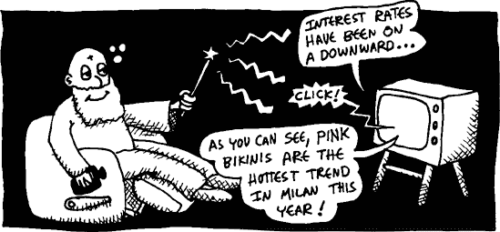

### 注意

您可能听说过其他编程语言，如 C++，也具有名为宏的功能。例如，在 C++ 语言中，您会使用 #define 指令来创建这些宏。然而，这些并不是一回事！Lisp 宏以完全不同且更为复杂的方式工作。

# 一个简单的 Lisp 宏

有时候，当您编写计算机程序时，您会感到一种 *似曾相识* 的感觉。我相信您知道这种感觉。您正在电脑上打字，突然意识到，“嘿，这已经是本周第三次写这段相同的代码了！”

假设，例如，您的程序需要一个特殊的 `add` 函数：

```
(defun add (a b)
   (let ((x (+ a b)))
       (format t "The sum is ˜a" x)
       x))
```

这个函数将两个数字相加，并以副作用在 REPL 上打印出总和。您可能会在程序调试期间发现这个函数很有用：

```
> `(add 2 3)`
The sum is 5
5
```

这个 `add` 函数看起来很简单，但它的代码有一个烦恼：为什么您需要这么多括号来声明变量 `x` ？`let` 命令需要这么多括号，以至于当您只需要一个变量时，代码看起来特别荒谬。

`let` 所需的括号是程序员几乎每天都必须处理的 *视觉噪音* 的一个例子。然而，您不能仅仅写一个常规函数来隐藏那些括号，因为 `let` 命令可以做一些常规 Lisp 函数不支持的事情。`let` 命令是一个 *特殊形式*。它是语言的核心部分，并具有超出标准 Lisp 函数的特殊能力。

宏让我们摆脱了多余的括号。让我们创建一个新的宏名为 `let1`：

```
 (defmacro let1 (var val &body body)
    `(let ((,var ,val))
       ,@body))
```

如您所见，宏的定义看起来与函数的定义相似。然而，我们不是使用 `defun` 来定义它，而是使用 `defmacro`。像函数一样，它有一个名称（在这种情况下，`let1`）和传递给它的参数 。

一旦我们定义了宏 `let1`，它就可以像 `let` 一样使用，只是它使用更少的括号：

```
> `(let ((foo (+ 2 3)))`
 `(* foo foo))`
25
> `(let1 foo (+ 2 3)`
 `(* foo foo))`
25
```

## 宏展开

虽然宏定义看起来与函数定义非常相似，但实际上宏与函数非常不同。为了理解原因，想象一下你的 Lisp 实际上是一个可爱的小球，快乐地运行你的 Lisp 程序。


这个小球只理解标准的 Lisp 代码。如果它看到我们的`let1`命令，它将不知道该怎么办。


现在想象一下，我们有一根魔杖，在 Lisp 查看代码之前，就改变了代码的外观。在我们的例子中，它将`let1`转换成常规的`let`，这样 Lisp 就会保持快乐。

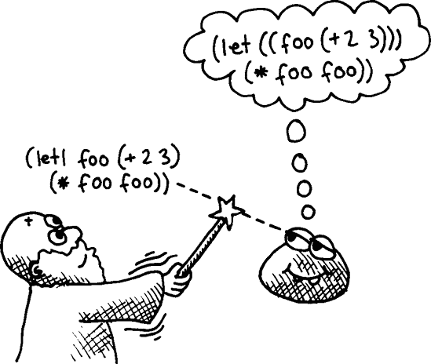

这根魔杖被称为*宏展开*。这是一种特殊的转换，在 Lisp 解释器/编译器的核心看到它之前，你的代码会经历这种转换。宏展开器的任务是找到你的代码中的任何宏（如我们的 let1 宏）并将它们转换成常规的 Lisp 代码。

这意味着宏的运行时间与函数的运行时间不同。常规的 Lisp 函数在你执行包含函数的程序时运行。这被称为*运行时*。另一方面，宏在程序运行之前运行，当你的 Lisp 环境读取和编译程序时。这被称为*宏展开时间*。

现在我们已经讨论了 Lisp 宏背后的基本思想，让我们更仔细地看看`let1`是如何定义的。

## 宏是如何转换的

当我们使用`defmacro`命令定义一个新的宏时，我们基本上是在教 Lisp 宏展开系统一个新的转换，它可以在运行程序之前使用这个转换来翻译代码。宏接收其参数中的原始源代码，形式为 Lisp 表达式。它的任务是帮助宏展开器将这个原始代码转换成标准的 Lisp 代码，这样 Lisp 小球就会保持快乐。

让我们更仔细地看看我们的`let1`宏是如何转换的。这是它的定义再次：

```
 (defmacro let1 (var val &body body)
    `(let ((,var ,val))
       ,@body))
```

这个`defmacro`调用的第一行  告诉宏展开器，“嘿，如果你在代码中看到一个以 let1 开头的形式，这就是你需要做的，将其转换成标准的 Lisp。”使用`defmacro`定义的宏也可以传入参数，这些参数将包含在宏中使用时在宏内部找到的原始源代码。`let1`宏有三个这样的参数传入：`var`、`val`和`body` 。那么这三个参数代表什么呢？

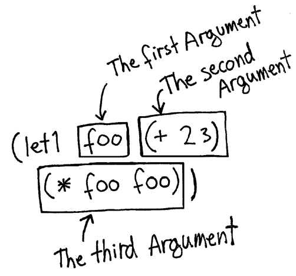

如你所见，当我们使用`let1`时，我们最终会在其中得到三个不同的表达式，它们是`let1`宏的参数：

**`var`**

第一个参数是我们定义的变量的名称。这个名称将在我们的宏中使用名为 `var` 的参数中可用。在这个例子中，它将等于符号 `foo`。

**`val`**

第二个表达式包含确定变量值的代码。在我们的宏中，这是第二个参数 `val`。它将等于列表 `(+ 2 3)`。

**`body`**

`let1` 调用中的第三个表达式是体代码，它使用了新创建的变量（在这种情况下，`foo`）。它将通过名为 `body` 的参数在宏中可用。

由于 `let` 命令允许其体中有多个语句，我们希望在 `let1` 宏中反映这种行为。这就是为什么在定义 `let1` 的 `defmacro` 命令中，最后的 `body` 参数前面有一个特殊的键词 `&body`。这告诉宏展开器“给我宏中所有剩余的表达式列表。”正因为如此，我们的 `let1` 示例中的 `body` 参数实际上是 `((* foo foo))`——一个嵌套列表。在这个例子中，我们只在 `let1` 中放置了一个单条语句。

现在您已经看到了我们 `let1` 宏的参数值，让我们看看宏是如何使用这些信息将 `let1` 转换为 Lisp 编译器可以理解的标准的 `let` 命令的。在 Lisp 中转换源代码的最简单方法是使用带引号语法。（如果您不记得如何使用带引号，请参阅 How Quasiquoting Works。) 使用带引号，我们可以使用传递给 `let1` 的代码构建正确的 `let` 命令。以下是我们的 `let1` 宏再次供参考：

```
(defmacro let1 (var val &body body)
   `(let ((,var ,val))
      ,@body))
```

如您所见，`let1` 宏返回一个以符号 `let` 开头的带引号的列表 ![httpatomoreillycomsourcenostarchimages783564.png]，后面跟着变量名称和值，放置在一个适当的嵌套列表中，这是 Lisp 的 `let` 命令所要求的。逗号导致实际的变量名称和值被放置在这些位置。最后，我们将 `let1` 中的 `body` 代码放置在 `let` 命令中的类似位置 ![httpatomoreillycomsourcenostarchimages783562.png]。

使用切片逗号 `(,@)` 将 `body` 参数插入到转换后的代码中。要理解为什么需要以这种方式处理 `body`，请考虑以下我们 `let1` 宏的使用：

```
> `(let1 foo (+ 2 3)`
 `(princ "Lisp is awesome!")`
 `(* foo foo))`
Lisp is awesome!
25
```

在这种情况下，我们在 `let` 的体中放置了多个东西。记住，`let` 命令包含一个隐式的 `progn` 命令，并且可以在其中包含多个 Lisp 指令。我们新的 `let1` 宏通过在 `body` 参数前面放置特殊的 `&body` 标记来实现这一点，导致所有剩余的语法表达式作为列表传递给 `let1`。因此，在前面的例子中，`body` 参数包含代码 `((princ "Lisp is awesome!") (* foo foo))`。

## 使用简单宏

现在我们已经编写了 `let1` 宏，让我们以更简洁的方式重写我们的自定义 `add` 函数：

```
(defun add (a b)
  (let1 x (+ a b)
     (format t "The sum is ˜a" x)
     x))
```

这不是对眼睛更友好吗？

我们可以使用 `macroexpand` 命令来查看宏生成的代码。只需将宏的代码传递给 `macroexpand`，就像这样：

```
> `(macroexpand '(let1 foo (+ 2 3)`
   `(* foo foo)))`
 (LET ((FOO (+ 2 3))) (* FOO FOO)) ;
 T
```

你现在可以看到 `let1` 生成的原始代码 。结尾的 `T`  只意味着 `macroexpand` 被传递了一个有效的宏，它能够展开。

当你的宏变得更加复杂时，你会发现 `macroexpand` 是测试和调试它们结构的一个非常有价值的工具。

# 更复杂的宏

假设你需要一个自定义的 `my-length` 命令。这是一个经典的列表消费者函数，它将计算列表的长度。我们将以适当的“尾调用优化”风格（在第十四章讨论）编写它，其中递归函数调用位于尾位置。以下是代码：

```
(defun my-length (lst)
   (labels ((f (lst acc)
              (if lst
                (f (cdr lst) (1+ acc))
                 acc)))
      (f lst 0)))
```

如你所见，这个函数有很多重复的内容，又一次给我们带来了那种令人讨厌的 *déjà vu* 感觉。在这个函数中有两个重复的模式：

+   就像其他列表消费者函数一样，我们有一个讨厌的检查来查看列表是否为空  和相关的 `cdr` 使用 。

+   我们做了所有这些冗长的操作来创建一个局部函数 `f` 。

让我们编写一些使这个函数（以及具有相同重复的其他函数）更加简洁的宏。

## 分割列表的宏

首先，让我们创建一个 `split` 宏。它将使我们能够编写更简洁的列表消费者函数，例如我们的 `my-length` 函数。

列表消费者总是检查列表是否为空。如果不是，它们会使用 `car` 和/或 `cdr` 将列表拆分开，然后对列表的头部和/或尾部执行操作。`split` 宏为我们做了这件事。以下是使用完成的 `split` 宏时的样子：

```
 > `(split '(2 3)`
 `(format t "This can be split into ˜a and ˜a." head tail)`
   `(format t "This cannot be split."))`
  This can be split into 2 and (3).
 > `(split '()`
   `(format t "This can be split into ˜a and ˜a." head tail)`
 `(format t "This cannot be split."))`
  This cannot be split.
```

`split` 宏的第一个参数是要拆分为头部和尾部的列表 。如果这是可能的，`split` 宏中的下一个表达式将被调用 。作为额外的好处，我们的 `split` 宏自动为我们创建了两个变量，分别命名为 `head` 和 `tail`。这样，我们就不必总是在列表消费者函数内部调用 `car` 和 `cdr`。如果列表为空 ，我们调用最后的表达式 。

让我们看看 `split` 宏的代码。注意，这个宏的初始版本包含一些我们很快就会讨论的 bug：

```
;Warning! Contains Bugs!
 (defmacro split (val yes no)
   `(if ,val
      (let ((head (car ,val))
            (tail (cdr ,val)))
        ,yes)
        ,no))
```

我们的 `split` 宏需要三个（而且只有三个）表达式作为参数 。这意味着当我们使用这个宏时，我们总是需要恰好三个项目。

`split` 需要生成的代码相当简单。首先，我们有一个 `if` 语句检查列表是否为空 。如果是，我们将分解列表并将其放入我们的两个局部变量 `head`  和 `tail` 。然后我们放入处理“是的，我们可以分解列表”情况的代码 。如果我们不能分解列表，我们调用无情况 。请注意，在无情况下，我们没有访问 `head/tail` 变量，因为如果列表不能分解，它们就不会被创建。

使用这个新的 `split` 宏，我们可以稍微清理一下我们的 `my-length` 宏：

```
(defun my-length (lst)
    (labels ((f (lst acc)
               (split lst
                (f tail (1+ acc))
                 acc)))
      (f lst 0)))
```

注意我们现在如何使用 `split` 创建的 `tail` 变量，简化了我们的代码 。自动生成此类变量的宏被称为 *反身宏*。

然而，我们的 `split` 宏还没有完成。尽管它基本上是可行的，但它包含一些微妙的错误，我们需要解决。

## 避免宏中的重复执行

宏中可能发生的一个常见错误是不正确地重复执行代码。事实上，我们当前的 `split` 宏包含这个缺陷。以下是一个清楚地显示问题的示例：

```
> `(split (progn (princ "Lisp rocks!")`
   `'(2 3))`
   `(format t "This can be split into ˜a and ˜a." head tail)`
   `(format t "This cannot be split."))`
  Lisp rocks!Lisp rocks!Lisp rocks!This can be split into 2 and (3).
```

在这个 `split` 的使用中，“Lisp rocks!” 被打印了三次，尽管它在原始代码中只出现了一次。这是怎么做到的？

记住，传递给宏的参数是原始源代码。这意味着传递给 `split` 的 `val` 参数包含 `progn` 语句的原始代码 ，包括其中 `princ` 语句的原始代码。由于我们在 `split` 宏内部引用 `val` 三次，这导致 `princ` 语句执行了三次。

我们可以通过运行这个示例通过 `macroexpand` 来验证这一点：

```
> `(macroexpand '(split (progn (princ "Lisp rocks!")`
   `'(2 3))`
   `(format t "This can be split into ˜a and ˜a." head tail)`
   `(format t "This cannot be split.")))`
 (IF (PROGN (PRINC "Lisp rocks!") '(2 3))
   (LET
   ((HEAD (CAR (PROGN (PRINC "Lisp rocks!") '(2 3))))
    (TAIL (CDR (PROGN (PRINC "Lisp rocks!") '(2 3)))))
    (FORMAT T "This can be split into ˜a and ˜a." HEAD TAIL))
   (FORMAT T "This cannot be split.")) ;
  T
```

如您所见，`princ` 语句出现了三次   。这导致意外的行为，并且效率低下，因为我们不必要地重复运行相同的代码。

如果你仔细思考这个问题，解决方案并不难找出。我们只需要在 `split` 宏内部创建一个局部变量，如下所示：

```
;Warning! Still contains a bug!
(defmacro split (val yes no)
  `(let1 x ,val
     (if x
       (let ((head (car x))
             (tail (cdr x)))
         ,yes)
         ,no)))
```

注意，我们在 `split` 的新版本中使用了 `let1`。正如这所示，在 *其他* 宏中使用宏是完全可行的。

现在，如果我们重新运行之前的示例，我们可以看到 `split` 的行为是正确的，`princ` 只打印了一次语句：

```
> `(split (progn (princ "Lisp rocks!")`
 `'(2 3))`
 `(format t "This can be split into ˜a and ˜a." head tail)`
 `(format t "This cannot be split."))`
Lisp rocks!This can be split into 2 and (3).
```

不幸的是，这个新的 `split` 宏版本引入了 *另一个* 错误。让我们接下来解决这个新错误。

## 避免变量捕获

要看到我们 `split` 的新版本中的错误，尝试运行以下代码：

```
> `(let1 × 100`
 `(split '(2 3)`
 `(+ x head)`
 `nil))`
*** - +: (2 3) is not a number
```

您能告诉我发生了什么吗？我们刚刚在 `split` 宏的新版本中创建了一个变量 `x`！以下是如果我们对 `split` 进行 `macroexpand` 时它的样子：

```
> `(macroexpand '(split '(2 3)`
   `(+ x head)`
   `nil))`
 (LET ((X '(2 3)))
     (IF X (LET ((HEAD (CAR X)) (TAIL (CDR X))) (+ X HEAD)) NIL)) ;
  T
```

注意到 `split` 的展开版本包含了一个 `x` 的定义 ![http://atomoreilly.com/source/nostarch/images/783562.png]。这阻止了我们在麻烦示例中的竞争定义 ![http://atomoreilly.com/source/nostarch/images/783564.png]。在这种情况下，`split` 宏意外地 *捕获* 了变量 `x` 并以意想不到的方式覆盖了它。我们如何避免这个问题？

一个简单的解决方案是在宏中不创建变量 `x`，而是使用一些疯狂的长名称，比如 `xqweopfjsadlkjgh`。然后我们可以相当有信心，宏内部使用的变量永远不会与使用它的代码中的变量冲突。实际上，有一个名为 `gensym` 的 Common Lisp 函数，其任务就是生成疯狂的长变量名，正好用于这个目的：

```
> `(gensym)`
#:G8695
```

`gensym` 函数会为您创建一个唯一的变量名，保证在您的代码中不会与其他任何变量名冲突。您可能会注意到它还有一个特殊的前缀（`#`）来区分其他名称。Common Lisp 将基于 `gensym` 的名称视为特殊情况，并阻止您直接使用 `gensym` 变量的名称。

现在，让我们在 `split` 宏内部使用 `gensym` 函数来保护宏，防止它导致变量捕获：

```
;This function is finally safe to use
  (defmacro split (val yes no)
   (let1 g (gensym)
   `(let1 ,g ,val
       (if ,g
         (let ((head (car ,g))
               (tail (cdr ,g)))
           ,yes)
           ,no))))
```

在我们修订的宏的第一行中，我们定义了一个变量 `g`，它包含 `gensym` 名称 ![http://atomoreilly.com/source/nostarch/images/783564.png]。非常重要的一点是，注意这一行前面没有反引号。这意味着这一行代码是在 *宏展开时间* 运行的，而不是 *运行时*，在这个点上定义变量 `g` 是完全正常的。然而，下一行的 `let1` 前面有一个反引号 ![http://atomoreilly.com/source/nostarch/images/783562.png]。这一行将在运行时运行，所以我们不希望在这一点上使用硬编码的变量。在这个新版本中，我们改用存储在 `g` 中的唯一 `gensym` 名称。

现在每次使用 `split` 宏时，都会生成一个唯一的名称来保存内部值。我们可以通过运行一些示例并通过 `macroexpand` 来测试这一点：

```
> `(macroexpand '(split '(2 3)`
 `(+ x head)`
 `nil))`
(LET ((#:G8627 '(2 3))) (IF #:G8627 (LET ((HEAD (CAR #:G8627))
 (TAIL (CDR #:G8627))) (+ X HEAD)) NIL)) ;
T
> `(macroexpand '(split '(2 3)`
 `(+ x head)`
 `nil))`
(LET ((#:G8628 '(2 3))) (IF #:G8628 (LET ((HEAD (CAR #:G8628))
 (TAIL (CDR #:G8628))) (+ X HEAD)) NIL)) ;
T
```

注意，在这两种情况下都创建了一个不同名称的局部变量 ！这保证了变量名不仅在你自己的代码中是唯一的，而且在 `split` 宏被多次嵌套使用时也是唯一的。我们现在已经创建了一个完全调试好的 `split` 宏版本。

虽然现在它没有错误，但这并不意味着它没有变量捕获的问题。请注意，宏仍然定义了变量 `head` 和 `tail`。如果你在其他代码中使用这个函数，其中 `head` 或 `tail` 有不同的含义，你的代码就会失败！然而，在 `head` 和 `tail` 的情况下，捕获是有意的。在这种情况下，变量捕获是一个 *特性*，而不是错误——它是一个反身宏。正如我们讨论过的，这意味着它使得我们可以在宏的主体中使用命名变量或函数。 

## 递归宏

让我们再次看看我们改进的 `my-length` 宏：

```
(defun my-length (lst)
  (labels ((f (lst acc)
             (split lst
               (f tail (1+ acc))
               acc)))
    (f lst 0)))
```

正如我们讨论过的，在这段代码中还有一个额外的重复模式：局部函数 `f` 的创建。让我们写另一个宏来消除这种额外的视觉噪音：`recurse`。下面是 `recurse` 宏的使用示例：

```
 > `(recurse (n 9)`
 `(fresh-line)`
 `(if (zerop n)`
 `(princ "lift-off!")`
 `(progn (princ n)`
 `(self (1- n)))))`
  9
  8
  7
  6
  5
  4
  3
  2
  1
  lift-off!
```

`recurse` 宏的第一个参数是一个变量列表及其起始值 。在这种情况下，我们只声明了一个变量（`n`）并将其起始值设置为 9。宏中的其余行构成了递归函数的主体。

在主体中，我们首先开始一个新行 。然后我们检查 `n` 是否已经达到零 。如果是，我们打印 “起飞！” 。否则，我们打印当前的数字  并再次递归地调用该函数。像我们的 `split` 宏一样，`recurse` 宏也是反身的。在 `recurse` 的情况下，它使得一个名为 `self` 的函数可用，我们在准备执行递归时调用它 。此时，我们还将 `n` 减去 1，以降低倒计时数字。

现在我们已经看到了 `recurse` 应该如何工作，让我们编写这个 `recurse` 宏。为了处理参数列表和起始值，对我们来说有一个可以将项目分组为对列表的函数是有用的。下面是一个完成这个任务的函数，`pairs`：

```
> `(defun pairs (lst)`
 `(labels ((f (lst acc)`
 `(split lst`
 `(if tail`
 `(f (cdr tail) (cons (cons head (car tail)) acc))`
 `(reverse acc))`
 `(reverse acc))))`
   `(f lst nil)))`
  PAIRS
  > `(pairs '(a b c d e f))`
  ((A . B) (C . D) (E . F))
```

`pairs`函数是一个尾调用优化的列表消耗者，它讽刺地有自己的局部函数`f` ![http://atomoreilly.com/source/no_starch_images/783564.png]。（很快我们就不再需要声明这样的函数了。）它使用`split`从列表中分离出一个项 ![http://atomoreilly.com/source/no_starch_images/783562.png]。然而，由于它需要一次性处理列表中的两个项（一个对），我们需要运行一个额外的检查来查看尾部是否为空 ![http://atomoreilly.com/source/no_starch_images/783560.png]。如果没有项在列表中 ![http://atomoreilly.com/source/no_starch_images/783544.png]（或者只剩下一个项 ![http://atomoreilly.com/source/no_starch_images/783510.png]），我们返回累积的值。否则，我们递归地处理列表的其余部分，将一对新项放入累加器 ![http://atomoreilly.com/source/no_starch_images/783554.png]。

现在我们终于准备好编写`recurse`宏了：

```
(defmacro recurse (vars &body body)
   (let1 p (pairs vars)
     `(labels ((self ,(mapcar #'car p)
                  ,@body))
        (self ,@(mapcar #'cdr p)))))
```

如您所见，它只是将递归转换成了传统的局部函数。首先，它使用我们新的`pairs`函数来分解变量名和起始值，并将结果放入`p` ![http://atomoreilly.com/source/no_starch_images/783564.png]。然后它定义了一个简单地命名为`self`的局部函数。`self`的变量名是`p`中的奇数项 ![http://atomoreilly.com/source/no_starch_images/783562.png]。由于我们希望`self`在宏内部可以通过词法引用访问，我们使用一个普通的名字而不是`gensym`名字来为这个函数命名。在宏的底部，我们简单地调用`self`，传入所有起始值 ![http://atomoreilly.com/source/no_starch_images/783560.png]。

现在我们已经创建了`recurse`宏，让我们再次使用这个新的语言结构来清理我们的`my-length`函数：

```
(defun my-length (lst)
  (recurse (lst lst
            acc 0)
           (split lst
             (f tail (1+ acc))
             acc)))
```

如您所见，在这个版本的`my-length`函数中，几乎没有重复或视觉上的杂音。

现在您可以体会到宏在尝试编写干净、简洁的代码时是多么有帮助。然而，宏的广泛使用也将要求您承担一些成本，您需要意识到这些成本。接下来，我们将探讨宏的潜在缺点。

# 宏：危险与替代方案

宏允许我们编写生成其他代码的代码，这使得 Lisp 语言成为元编程和新语言想法原型设计的绝佳工具。但是，在某种程度上，宏只是一个小把戏：它们让你欺骗 Lisp 编译器/解释器接受你自己的定制语言结构，并将它们视为标准 Lisp。它们确实是程序员工具箱中的强大工具，但它们并不像你在本书中遇到的其他一些编程工具那样优雅。

宏的主要缺点是它们可能会让其他程序员难以理解你的代码。毕竟，如果你正在创建自己的语言方言，其他程序员可能不熟悉它。甚至你未来的自己——比如说，一两年后——如果过度使用了宏，也可能难以理解你代码的结构。正因为如此，经验丰富的 Lisp 程序员会尽最大努力在可能的情况下使用其他技术来代替宏编程。通常，一个初学者 Lisp 程序员会在可以用其他更干净的方式解决的问题中编写宏。

例如，看到我们如何通过添加名为 `split` 和 `recurse` 的几个宏来清理我们的 `my-length` 函数，这很有趣。然而，在前两章中，你学习了另一个工具，函数式编程，它也可以用来清理列表吞噬函数。函数程序员经常使用的一个强大函数是 `reduce`。它是一个高阶函数，接受一个函数和一个列表，并将为列表中的每个值调用该函数。以下是使用强大的 `reduce` 函数而不是宏重写的 `my-length` 函数：

```
(defun my-length (lst)
   (reduce (lambda (x i)
             (1+ x))
           lst
           :initial-value 0))
```

如你所见，这个 `my-length` 的新版本轻易地超越了我们的旧版本。它更短，并且不依赖于我们创建的任何非标准宏。

`reduce` 的第一个参数是我们的**归约函数** 。它的任务是跟踪并更新一个累积值，这里命名为 `x`。这个变量 `x` 将持有当前的累积值，在这种情况下，将是到目前为止的列表长度。这意味着我们可以简单地给 `x` 加一，将其更新到新的值 。由于归约函数将为列表中的每个项目调用一次，它最终将生成列表的长度。（归约函数还接收一个参数，即列表中的当前项目，这里给出的是变量 `i`。然而，我们不需要它来计算列表的长度。）传递给 `reduce` 的下一个项目是我们想要归约的列表 。最后，由于我们正在计算的累积长度应该有一个初始值为零，我们通过将 `:initial-value` 关键字参数设置为零来表示这一点 。

显然，还有其他场景，我们在这章中创建的列表吞噬宏仍然很有用。有许多情况，`reduce` 函数不能那么容易地使用。所以最终，仍然有许多情况，创建自己的 Lisp 方言正是解决问题的正确方法，正如你将在下一章中看到的。

# 你学到了什么

本章介绍了宏编程。你学到了以下内容：

+   宏让你可以编写编写代码的代码。有了宏，你可以在编译器能够查看它之前，创建自己的编程语言并将其转换为标准 Lisp。

+   宏可以让你在编写代码时摆脱那种*似曾相识*的感觉，在没有任何其他方法可以做到的情况下。

+   在编写宏时，你必须小心，以免导致代码意外地重复执行。

+   你需要小心避免在宏中发生意外的*变量捕获*。你可以通过使用 `gensym` 命名来避免这种情况。

+   如果宏创建的变量有意暴露，作为宏的一个特性，那么这个宏被称为*反身宏*。

+   宏编程是一个非常强大的技术。然而，尽可能尝试使用函数式编程来解决问题。宏应该始终是最后的手段。

# 第十七章。领域特定语言

使用宏的最好理由之一是进行*领域特定语言（DSL）*编程。DSL 编程是一种高级宏编程技术，它允许我们通过大幅改变 Lisp 代码的结构和外观来优化它以适应特定目的，从而解决困难的编程问题。尽管宏对于进行 DSL 编程不是严格必要的，但通过编写一组宏，你可以在 Lisp 中轻松创建一个 DSL。

# 什么是领域？

根据 2000 年的美国人口普查，美国平均家庭有 1.86 个孩子。由于没有哪个家庭的孩子数量正好是 1.86 个，因此很明显，没有哪个家庭真正完美地平均。同样，也没有所谓的平均计算机程序。每个程序都是为了解决特定的问题而设计的，每个人类探究领域，或*领域*，都有其独特的需求，这些需求会影响解决该领域问题的程序。通过 DSL，我们增强了编程语言的核心，以考虑这些特定领域的需求，从而可能使我们的代码更容易编写和理解。

让我们来看看一些特定的领域，并创建一些领域特定语言（DSL），这样我们就可以使用 Lisp 在这些领域内轻松工作。在本章中，我们将创建两个不同的 DSL。首先，我们将创建一个用于编写*可伸缩矢量图形（SVG）*文件的 DSL。然后我们将编写一个用于创建文本冒险游戏命令的 DSL——我们最终将把我们的巫师冒险游戏从第五章和第六章升级到完全可玩的状态！

# 编写 SVG 文件

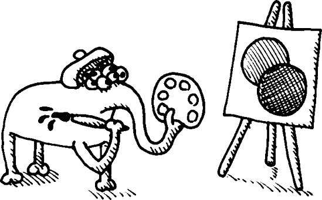

SVG 格式是一种用于绘制图形的文件格式。在这个格式中，你指定像圆圈和多边形这样的对象，然后将它们传递给一个兼容的计算机程序来查看。由于 SVG 格式使用纯数学函数而不是原始像素来指定绘图，因此程序可以轻松地将 SVG 图像渲染成任何大小，使得这种格式的图像易于缩放。

SVG 格式目前正受到许多网络开发者的关注。所有现代浏览器（不包括 Microsoft Internet Explorer）都原生支持 SVG。最近，Google 发布了一套名为 SVG Web 的库，为 SVG 提供了良好的支持，甚至在 Internet Explorer 中也是如此。这使得 SVG 在超过 90% 的当前网络浏览器中工作。最终，SVG 已经成为在网站上绘制图形的实用和高效选项。

SVG 格式建立在 XML 格式之上。以下是一个完整的 SVG 文件示例：

```
<svg >
  <circle cx="50"
          cy="50"
          r="50"
          style="fill:rgb(255,0,0);stroke:rgb(155,0,0)">
  </circle>
  <circle cx="100"
          cy="100"
          r="50"
          style="fill:rgb(0,0,255);stroke:rgb(0,0,155)">
  </circle>
</svg>
```

简单地复制这段文本并将其放置在名为 *example.svg* 的文件中（或从 [`landoflisp.com/`](http://landoflisp.com/) 下载此文件）。然后你可以从 Firefox 网络浏览器（Safari、Chrome 和 Opera 网络浏览器也应该可以）打开该文件。

这是你应该看到的内容，有一个红色和蓝色的圆圈：


现在，让我们编写一些宏和函数，让我们能够直接在 Common Lisp 中创建这样的图片！

## 使用标签宏创建 XML 和 HTML

XML 数据格式（就像 HTML 数据格式一样）主要由嵌套标签组成：

```
 <mytag>
      <inner_tag>
      </inner_tag>
 </mytag>
```

每个标签  都有一个对应的闭合标签 。闭合标签具有相同的名称，但前面有一个斜杠。此外，标签可能包含属性：

```
<mytag color="BLUE" height="9"></mytag>
```

在这个例子中，我们创建了一个名为 `mytag` 的标签，它具有蓝色属性和高度为 9。

### 编写宏辅助函数

通常，当你编写一个宏来执行一个任务时，你会发现你的宏需要做的很多工作可以通过一个函数来处理。正因为如此，通常明智的做法是首先编写一个辅助函数，它完成宏需要做的绝大部分工作。然后你编写宏，通过利用辅助函数使其尽可能简单。这就是我们在编写一个用于在 Lisp 中创建 XML 风格标签的宏时将要做的。

这是我们的辅助函数，名为 `print-tag`，它打印一个单个的开头（或闭合）标签：

```
(defun print-tag (name alst closingp)
   (princ #\<)
   (when closingp
      (princ #\/))
   (princ (string-downcase name))
   (mapc (lambda (att)
           (format t " ˜a=\"˜a\"" (string-downcase (car att)) (cdr att)))
        alst)
   (princ #\>))
```

首先，`print-tag`函数打印一个开方括号。由于这只是一个字符，我们使用字面字符语法，通过在括号前加上#\. 然后我们检查谓词`closingp`。如果它是真的，标签前面需要有一个斜杠，使其成为一个闭合标签。然后我们打印标签的名称，使用`string-downcase`函数转换为小写。接下来，我们遍历属性列表`alst`中的所有属性并打印出每个属性/值对。最后，我们通过添加一个闭合方括号来结束。

以下是一个`print-tag`函数的示例用法。由于它是一个普通函数而不是宏，所以在 REPL 中调试起来很容易。这也是为什么在创建宏时使用辅助函数是一个好主意。

```
> `(print-tag 'mytag '((color . blue) (height . 9)) nil)`
<mytag color="BLUE" height="9">
```

如您所见，这个函数很好地打印了一个 XML 标签。然而，如果所有标签都必须以这种方式创建，那将是一件非常繁琐的事情。这就是为什么我们将编写`tag`宏的下一个原因。

### 创建标签宏 Macro

我们将要创建的`tag`宏是从保罗·格雷厄姆的 Arc Lisp 方言中同名宏中采纳的。它在几个关键方面改进了`print-tag`函数，所有这些都无法在没有宏的情况下修复：

+   标签总是成对出现。然而，如果我们想要嵌套标签，函数将无法打印出包围其内部打印的标签的标签。这是因为它要求我们在嵌套标签评估前后执行代码。这在宏中是可能的，但在函数中则不行。

+   标签名称和属性名称通常不需要以动态方式更改。正因为如此，在标签名称前加上单引号是多余的。换句话说，标签名称应该默认被视为数据模式中的内容。

+   与标签名称不同，属性值的动态生成是非常希望的。我们的宏将有一个语法，将属性值放入代码模式，这样我们就可以执行 Lisp 代码来填充这些值。

理想情况下，这就是我们希望在 REPL 中使用标签宏的方式：

```
> `(tag mytag (color 'blue height (+ 4 5)))`
<mytag color="BLUE" height="9"></mytag>
```

注意，标签名称和属性列表不再需要前面的引号。此外，现在使用 Lisp 代码动态计算属性变得容易。在这种情况下，我们计算高度是 4 加 5。

这是完成这个任务的宏：

```
(defmacro tag (name atts &body body)
   `(progn (print-tag ',name
                      (list ,@(mapcar (lambda (x)
                                        `(cons ',(car x) ,(cdr x)))
                                      (pairs atts)))
                       nil)
           ,@body
           (print-tag ',name nil t)))
```

如你所料，宏首先调用`print-tag`来生成开标签 ![http://atomoreilly.com/source/nostarch/images/783564.png]。当我们为`print-tag`生成属性列表时，这有点棘手，因为我们希望属性的值处于代码模式。我们通过使用`list`来包装属性来实现这一点 ![http://atomoreilly.com/source/nostarch/images/783562.png]。然后我们使用`mapcar`遍历属性，这些属性与`pairs`函数配对 ![http://atomoreilly.com/source/nostarch/images/783554.png]。（记住，我们在上一章的末尾创建了`pairs`函数。）对于每个属性对，我们在列表中生成一个代码片段，该片段由 cons 组成，属性值的面前没有引号，这样我们就可以动态地计算它 ![http://atomoreilly.com/source/nostarch/images/783560.png]。

接下来，我们将所有嵌套在`tag`宏内部的代码放入其中，以便在开标签之后调用它 ![http://atomoreilly.com/source/nostarch/images/783510.png]。最后，我们创建一个闭标签 ![http://atomoreilly.com/source/nostarch/images/783544.png]。

为了更好地理解这个宏如何处理属性列表，让我们将我们的示例输出传递给`macroexpand`：

```
> `(macroexpand '(tag mytag (color 'blue height (+ 4 5))))`
  (PROGN (PRINT-TAG 'MYTAG
                   (LIST (CONS 'COLOR 'BLUE)
                         (CONS 'HEIGHT (+ 4 5)))
                    NIL)
          (PRINT-TAG 'MYTAG NIL T)) ;
  T
```

通过查看宏展开，应该很清楚`tag`宏如何构建传递给`print-tag`的属性列表 ![http://atomoreilly.com/source/nostarch/images/783564.png]以及它如何允许我们动态生成属性值，例如高度属性 ![http://atomoreilly.com/source/nostarch/images/783562.png]。

下面是使用此宏的另一个示例，现在包含两个内部标签：

```
> `(tag mytag (color 'blue size 'big)`
   `(tag first_inner_tag ())`
   `(tag second_inner_tag ()))`
 <mytag color="BLUE" size="BIG">
    <first_inner_tag></first_inner_tag>
    <second_inner_tag></second_inner_tag>
  </mytag>
```

注意它如何正确地使用适当的 XML 开闭标签包围内部嵌套标签。同时，我还添加了换行和缩进来使输出更清晰 ![http://atomoreilly.com/source/nostarch/images/783564.png]。`tag`函数的实际输出始终打印在单行上，没有换行或缩进。

### 使用`tag`宏生成 HTML

`tag`宏可以用于生成 XML 或 HTML。例如，我们可以这样做来生成一个“Hello World”HTML 文档：

```
> `(tag html ()`
 `(tag body ()`
 `(princ "Hello World!")))`
<html><body>Hello World!</body></html>
```

由于 HTML 使用预定义的标签（与 XML 不同，XML 的标签可以有任意名称），我们可以为特定的 HTML 标签编写简单的宏，使它们在 Lisp 中编写 HTML 变得更加容易。例如，这里有一些简单的`html`和`body`宏：

```
(defmacro html (&body body)
  `(tag html ()
        ,@body))
(defmacro body (&body body)
  `(tag body ()
        ,@body))
```

现在，我们可以更优雅地编写我们的“Hello World”HTML 示例：

```
> `(html`
 `(body`
 `(princ "Hello World!")))`
<html><body>Hello World!</body></html>
```

然而，我们希望使用`tag`宏来创建 SVG 绘图。因此，让我们扩展我们的 SVG 领域 DSL。

## 创建 SVG 特定宏和函数

首先，让我们编写`svg`宏，它包含整个 SVG 图像。如下所示：

```
(defmacro svg (&body body)
   `(tag svg (xmlns "http://www.w3.org/2000/svg"
              "xmlns:xlink" "http://www.w3.org/1999/xlink")
          ,@body))
```

`svg`宏建立在`tag`宏之上。对于我们的目的，SVG 图像需要创建两个特殊属性：

+   `xmlns` 属性告诉 SVG 查看器（在我们的例子中，是 Firefox 网络浏览器）在哪里可以找到 SVG 格式的正确文档 。

+   第二个属性允许在图片内启用超链接 。我们将在下一章的更高级示例中使用这个超链接功能。

要绘制图像，我们需要操作颜色。为了简化问题，我们将只将颜色表示为存储在列表中的 RGB 三元组。例如，颜色 `(255 0 0)` 是亮红色。

通常，生成特定颜色的亮或暗变体很有用。下面的 `brightness` 函数为我们做到了这一点：

```
(defun brightness (col amt)
  (mapcar (lambda (x)
        (min 255 (max 0 (+ x amt))))
      col))
```

如果你将亮红色传递给这个函数并将亮度设置为 -100，你可以看到它会生成一个较深的红色：

```
> `(brightness '(255 0 0) −100)`
(155 0 0)
```

接下来，让我们创建一个函数来设置 SVG 图像元素的样式：

```
(defun svg-style (color)
    (format nil
           "˜{fill:rgb(˜a,˜a,˜a);stroke:rgb(˜a,˜a,˜a)˜}"
            (append color
                   (brightness color −100))))
```

`svg-style` 函数接受一个颜色，然后设置图片元素的填充和描边（轮廓）。通过使用我们的亮度函数，我们可以使轮廓成为填充的较暗变体 。这样，我们只需要为图片中的每个元素指定一个颜色，同时保持令人愉悦的外观。

现在，让我们创建一个函数来绘制圆。由于我们不需要在圆内嵌套其他 SVG 标签，因此不需要编写绘制圆的宏——一个函数就足够了。

```
(defun circle (center radius color)
   (tag circle (cx (car center)
                cy (cdr center)
                r radius
                style (svg-style color))))
```

我们将想要设置每个圆的中心、半径和颜色。中心需要分配给圆的 `cx`  和 `cy`  SVG 属性。半径放在 `r` 属性  中。我们使用我们的 `svg-style` 函数  设置圆的样式。

现在，我们已经准备好使用我们新的 DSL 来绘制之前展示的简单 SVG 图像，这里是我们的操作方法：

```
> `(svg (circle '(50 . 50) 50 '(255 0 0))`
 `(circle '(100 . 100) 50 '(0 0 255)))`
<svg  xmlns:xlink="http://www.w3.org/1999/
xlink"><circle cx="50" cy="50" r="50"
style="fill:rgb(255,0,0);stroke:rgb(155,0,0)"></circle><circle cx="100"
cy="100" r="50" style="fill:rgb(0,0,255);stroke:rgb(0,0,155)"></circle></svg>
```

现在我们有一个功能性的 SVG DSL。让我们给我们的 DSL 添加更多功能，以便我们能够欣赏 DSL 可以给我们的程序带来的力量。

## 构建更复杂的 SVG 示例

让我们在我们的 SVG DSL 中添加一个新功能，使其能够轻松绘制任意多边形：

```
(defun polygon (points color)
   (tag polygon (points (format nil
                    "˜{˜a,˜a ˜}"
                    (mapcan (lambda (tp)
                       (list (car tp) (cdr tp)))
                         points))
          style (svg-style color))))
```

SVG 多边形将多边形的所有点存储在 `points` 属性中 。我们通过使用包含 `˜{ ˜}` 控制字符串的 `format` 语句来构建点的列表 。记得从第十一章（Chapter 11）中，这些控制字符串允许我们在 `format` 函数内部迭代列表。在这种情况下，我们正在迭代点的列表。然后我们使用 `mapcan` ，你可能记得这与使用 `mapcar` 后跟 `append` 相同，来展平点对的列表。

在本例中，我们将绘制一些随机游走。随机游走是一种图表，如果你在每个时间点决定抛硬币，然后向上或向下移动一步，你将得到的结果。随机游走的行为与股市中的股票非常相似。它们通常被用作金融建模的起点。以下是一个生成随机游走的函数：

```
(defun random-walk (value length)
    (unless (zerop length)
      (cons value
           (random-walk (if (zerop (random 2))
                             (1- value)
                           (1+ value))
                         (1- length)))))
```

此函数从 `value` 参数开始构建一个数字列表。然后它随机增加或减少此值。我们使用 `random` 函数  来选择移动的方向。（注意，为了保持简单，此函数没有进行尾调用优化，因为 `cons` 发生在递归调用之后。）

下面是如何使用 `random-walk` 函数的一个示例：

```
> `(random-walk 100 10)`
(100 101 102 101 100 101 102 103 102 103)
```

现在我们使用我们的 SVG DSL 来绘制一系列随机游走图片：

```
(with-open-file (*standard-output* "random_walk.svg"
                   :direction :output
                  :if-exists :supersede)
   (svg (loop repeat 10
              do (polygon (append '((0 . 200))
                                   (loop for x
                                         for y in (random-walk 100 400)
                                         collect (cons x y))
                                  '((400 . 200)))
                            (loop repeat 3
                                 collect (random 256))))))
```

由于本例中创建的数据量相当巨大，我们将数据直接输出到文件（命名为 *random_walk.svg*），而不是打印到 REPL。我们通过重定向 `*standard-output*` 动态变量 ，这是一种在第十二章（Chapter 12）中介绍的技术。注意我们如何可以自由地混合 Lisp 代码和我们的 DSL 命令。例如，我们可以在 SVG 宏内部直接循环以一次性生成 10 个多边形 。

为了使图表更美观，我们将用颜色填充每条图表线下的区域。为此，我们将每条线表示为一个多边形，底边沿着图表的底部（y 坐标为 200）包括作为点来闭合形状：

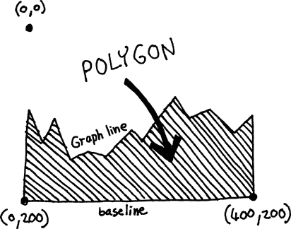

这也是为什么我们在创建每个多边形时，会添加左下角  和右下角  的点。为了增加更多乐趣，我们还随机化了每条图表线的颜色 。

下面是使用这个非常简单的 DSL 代码生成的随机图表的示例：


现在你已经看到在 Lisp 中编写 XML、HTML 和 SVG DSL 是多么容易，让我们创建一种完全不同的 DSL——一种将允许我们为第五章（第五章. 构建文本游戏引擎）和第六章（第六章. 与世界交互：在 Lisp 中读取和打印）中的巫师冒险游戏构建自定义游戏命令的 DSL！

# 为巫师冒险游戏创建自定义游戏命令


如果你记得，当我们上次在第五章和第六章中遇到以我们的巫师和学徒为主角的游戏时，我们可以在世界中四处走动并捡起物品。然而，我们实际上无法执行任何其他有趣或有趣味的动作。为了让游戏变得有趣，它应该包括可以在游戏中的特定对象和/或位置执行的特殊动作。我们需要可以亲吻的青蛙、可以战斗的龙，甚至可能还有可以救出的少女！

在游戏中创建这些有趣的活动提出了独特的挑战。一方面，这类不同的游戏动作之间显然有许多相似之处。例如，大多数动作将需要我们拥有一个对象。另一方面，它们都需要具有*独特和个性化的属性*（通过特定命令的 Lisp 代码实现）或者游戏会变得无聊。正如你将看到的，一个 DSL 可以帮助你向你的游戏添加许多这样的独特命令。

要从这里运行代码到本章结束，我们将使用第五章和第六章中的所有游戏代码。只需将这些章节中的代码放入名为*wizards_game.lisp*的文件中（或从[`landoflisp.com/`](http://landoflisp.com/)下载*wizards_game.lisp*）。游戏加载后，你可以在 CLISP REPL 中直接输入游戏命令，如 look。或者，你可以使用我们在第六章中创建的`game-repl`命令来获得更精致的游戏体验。记住，`quit`命令将带你退出游戏 REPL。

这里是如何从 REPL 加载游戏代码并开始运行游戏命令的步骤：

```
> `(load "wizards_game.lisp")`
;; Loading file wizards_game.lisp ...
;; Loaded file wizards_game.lisp
T
> `(look)`
(YOU ARE IN THE ATTIC. THERE IS A GIANT WELDING TORCH IN THE CORNER. THERE IS
A LADDER GOING DOWNSTAIRS FROM HERE.)
> `(game-repl)`
`look`
You are in the living-room. A wizard is snoring loudly on the couch. There is
a door going west from here. There is a ladder going upstairs
from here. You see a whiskey on the floor. You see a bucket on the floor.
`quit`
```

## 手动创建新的游戏命令

那么，我们的游戏领域特定语言（DSL）应该是什么样子呢？真正了解的唯一方法就是首先手动创建一些命令。然后我们可以看看不同命令之间是否存在任何共同模式，这些模式可以作为我们 DSL 的基础。

### 焊接命令

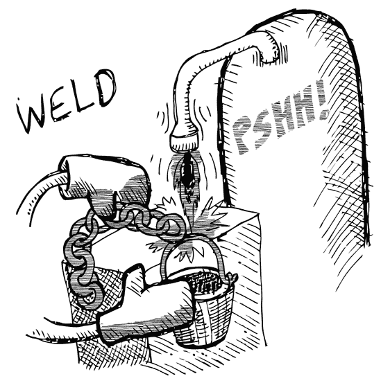

在巫师房子的阁楼里有一台焊接机。让我们允许玩家如果带着这些物品到那个地点，就可以将链条焊接在桶上。以下是实现这一功能的代码：

```
 (defun have (object)
    (member object (inventory)))

 (defparameter *chain-welded* nil)

 (defun weld (subject object)
   (if (and (eq *location* 'attic)
             (eq subject 'chain)
             (eq object 'bucket)
             (have 'chain)
             (have 'bucket)
             (not *chain-welded*))
       (progn (setf *chain-welded* t)
               '(the chain is now securely welded to the bucket.))
     '(you cannot weld like that.)))
```

首先，我们需要一种简单的方法来检查玩家是否正在携带一个物品，使用 `have` 函数 。记住，我们创建了一个名为 `inventory` 的命令来检查玩家携带的物品。如果一个物品是存货列表的成员，这意味着玩家必须“拥有”那个物品。

接下来，我们的程序需要一种方法来跟踪链条和桶是否已经焊接在一起，因为游戏后期会有一些只有在焊接发生后才能执行的动作。为此，我们创建了一个名为 `*chain-welded*` 的全局动态变量 。

最后，我们需要创建焊接命令本身 。只有在满足一系列条件的情况下才能进行焊接 ：

+   你必须身处阁楼。

+   你必须将 `chain` 和 `bucket` 作为焊接命令的主题和宾语。

+   你必须随身携带链条和桶。

+   链条和桶不能已经焊接在一起。

如果这些条件得到满足，我们将我们的 `*chain-welded*` 变量设置为 `true`  并打印一条表示成功的消息。如果任何条件失败，我们将表明焊接未成功 。

让我们在 CLISP REPL 中尝试这个命令：

```
> `(weld 'chain 'bucket)`
(YOU CANNOT WELD LIKE THAT.)
```

嗯，这正是正确的回答。毕竟，我们不在阁楼里，也没有携带正确的物品。到目前为止，一切顺利。

接下来，让我们在我们的花哨的 `game-repl` 中尝试我们的新命令：

```
> `(game-repl)`
`weld chain bucket`
I do not know that command.
`quit`
```

什么？为什么它“不知道”那个命令？答案是简单的：我们的 `game-repl` 有一些基本的保护措施来防止运行未经授权的命令。为了解决这个问题，我们需要将 `weld` 添加到我们允许的命令列表中：

```
> `(pushnew 'weld *allowed-commands*)`
(WELD LOOK WALK PICKUP INVENTORY)
> `(game-repl)`
`weld chain bucket`
You cannot weld like that.
```

通过使用 `pushnew` 命令，只有在 `weld` 函数尚未出现在该列表中时，才会将其添加到允许的命令中。问题解决！

### 一个浸没命令

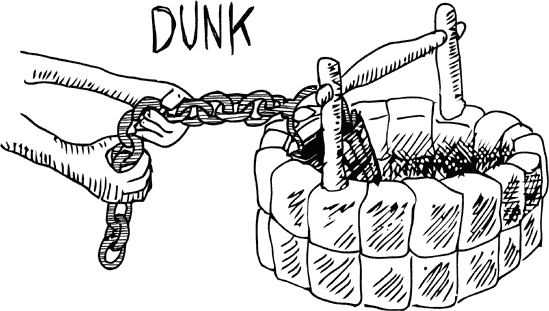

在巫师的花园里有一口井。让我们创建一个命令，让玩家可以将桶浸入井中，以装满水：

```
 (setf *bucket-filled* nil)

 (defun dunk (subject object)
   (if (and (eq *location* 'garden)
             (eq subject 'bucket)
             (eq object 'well)
             (have 'bucket)
             *chain-welded*)
        (progn (setf *bucket-filled* 't)
               '(the bucket is now full of water))
      '(you cannot dunk like that.)))

 (pushnew 'dunk *allowed-commands*)
```

就像我们的 `weld` 命令一样，我们首先需要一个变量来跟踪水桶是否已经被填满 ![httpatomoreillycomsourcenostarchimages783564.png]。接下来，我们需要一个 `dunk` 函数 ![httpatomoreillycomsourcenostarchimages783562.png]。注意，在浸没过程中，我们再次需要满足一系列条件才能成功完成动作 ![httpatomoreillycomsourcenostarchimages783560.png]。其中一些与我们的焊接命令所需的条件相似。例如，浸没也需要玩家在特定位置拥有正确的对象。其他条件是浸没特有的，例如，玩家在能够浸没之前需要有一个焊接好的链条。最后，我们需要将 `dunk` 函数推送到允许的动作列表中 ![httpatomoreillycomsourcenostarchimages783554.png]。

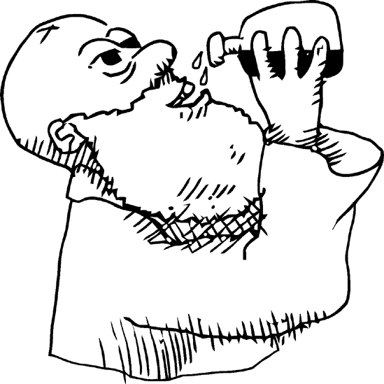

### 游戏动作宏

现在我们已经为我们的游戏创建了两个自定义游戏动作，很明显，`weld` 和 `dunk` 命令在某些方面非常相似。然而，正如我们的 SVG 库一样，每个游戏命令都需要包含一定量的动态逻辑，以自定义命令的行为。让我们编写一个 `game-action` 宏来处理这些问题。这将使创建新的游戏命令变得容易得多。

```
 (defmacro game-action (command subj obj place &body body)
   `(progn (defun ,command (subject object)
             (if (and (eq *location* ',place)
                       (eq subject ',subj)
                       (eq object ',obj)
                      (have ',subj))
                 ,@body
             '(i cant ,command like that.)))
           (pushnew ',command *allowed-commands*)))
```

这个 `game-action` 宏体现了我们的 `dunk` 和 `weld` 命令之间的共同模式。`game-action` 的参数是命令的名称、参与动作的两个对象、需要发生的地方，以及 `body` 参数中的任意附加代码，这允许我们向命令添加自定义逻辑 ![httpatomoreillycomsourcenostarchimages783564.png]。

`game-action` 宏的主要任务是定义一个新函数来处理命令 ![httpatomoreillycomsourcenostarchimages783562.png]。你可能觉得宏能够独立定义一个新函数是非常强大的，但没有任何东西可以阻止它这样做。我希望这个例子能让你看到 Common Lisp 宏系统是多么灵活和令人费解。

由于这个游戏的所有游戏动作都需要位置、主题和对象，我们可以在宏内部直接处理一些条件 ![httpatomoreillycomsourcenostarchimages783560.png]。然而，我们将为每个特定命令留出其他条件。注意，例如，游戏句子的主题需要由玩家拥有 ![httpatomoreillycomsourcenostarchimages783554.png]，但对象则不需要。这很有道理，因为有许多可以执行的动作，例如“扔石头龙”，其中句子的对象（龙）不需要在玩家的库存中。

一旦满足了基本的宏级条件，我们将把其余的逻辑推迟到单个命令的级别！。如果条件没有满足，我们将打印一个错误消息，该消息根据当前命令进行了定制！。最后，我们将命令 `pushnew` 到允许的命令列表中，用于我们的花哨的 `game-repl`！。

在这个宏中，我们不做的一件事是定义或设置任何全局变量。如果游戏命令需要定义 `*chain-welded*` 或 `*bucket-filled*` 全局变量，它必须自己完成。这很有道理，因为很明显，我们的游戏的状态变量和特定命令之间不可能存在一对一的关系。例如，某些命令可能被允许多次执行，使得状态变得不必要。或者一个动作可能依赖于多个状态变量。这种命令的多样性使得它们独特且有趣。

使用这个宏，我们现在有一个简单的领域特定语言（DSL）来创建新的游戏动作！本质上，这个命令给我们提供了一个自己的编程语言，专门用于创建游戏命令的领域。让我们用我们新的游戏命令编程语言重写之前的 `weld` 和 `dunk` 命令：

```
(defparameter *chain-welded* nil)

(game-action weld chain bucket attic
             (if (and (have 'bucket) (not *chain-welded*))
                 (progn (setf *chain-welded* 't)
                        '(the chain is now securely welded to the bucket.))
               '(you do not have a bucket.)))

(setf *bucket-filled* nil)

(game-action dunk bucket well garden
             (if *chain-welded*
                 (progn (setf *bucket-filled* 't)
                        '(the bucket is now full of water))
               '(the water level is too low to reach.)))
```

如您所见，这些命令现在看起来更容易阅读。注意 `weld` 命令是如何检查桶的所有权的，而 `dunk` 命令则不需要检查井的所有权。

为了进一步说明使用宏来实现我们的游戏命令 DSL 的价值，让我们实现一个更复杂的游戏命令，`splash`：

```
(game-action splash bucket wizard living-room
   (cond ((not *bucket-filled*) '(the bucket has nothing in it.))
         ((have 'frog) '(the wizard awakens and sees that you stole his frog.
                         he is so upset he banishes you to the
                         netherworlds- you lose! the end.))
         (t '(the wizard awakens from his slumber and greets you warmly.
              he hands you the magic low-carb donut- you win! the end.))))
```

对于这个命令，可能有三种不同的场景会发生：

+   桶是空的。

+   你的桶满了，但你偷了青蛙。在这种情况下，你输了。

+   你的桶满了，但你没有偷青蛙。你赢了！

使用我们的 `game-action` 宏，我们可以支持许多动作命令，每个命令都有特殊的行为。尽管如此，我们仍然能够避免不必要的重复。

### 注意

`game-action` 命令在宏的体内部暴露了 `subject` 和 `object` 变量。这允许游戏命令访问这些信息，但如果有创建 `game-action` 命令的代码也使用了名为 `subject` 和 `object` 的变量，则可能会引起名称冲突。作为一个练习，尝试修改 `game-action` 宏，使 `subject` 和 `object` 变量被 `gensym` 名称替换，如第十六章 中所述。

## 让我们尝试完成巫师冒险游戏！

这里是巫师冒险游戏的一个示例运行，展示了我们在这个游戏中加入的一些丰富功能。自己玩一玩，看看你是否能赢得魔法甜甜圈！

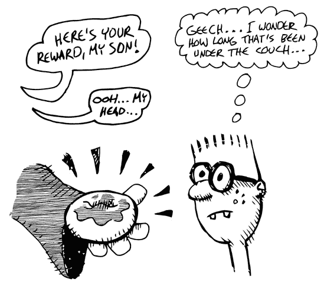

```
> `(game-repl)`
`look`
You are in the living-room. There is a wizard  snoring loudly on the couch.
There is a door going west from here. There is a ladder going upstairs from
here. You see a whiskey on the floor. You see a bucket on the floor.
`pickup bucket`
You are now carrying the bucket
`pickup whiskey`
You are now carrying the whiskey
`inventory`
Items- whiskey bucket
`walk upstairs`
You are in the attic. There is a giant welding torch in the corner. There is a
ladder going downstairs from here.
`walk east`
You cannot go that way.
`walk downstairs`
You are in the living-room. A wizard is snoring loudly on the couch. There is
a door going west from here. There is a ladder going upstairs from here.
`walk west`
You are in a beautiful garden. There is a well in front of you. There is a
door going east from here. You see a frog on the floor. You see
a chain on the floor.
`dunk bucket well`
The water level is too low to reach.
`pickup chain`
You are now carrying the chain
`walk east`
You are in the living-room. A wizard is snoring loudly on the couch. There is
a door going west from here. There is a ladder going upstairs
from here.
`splash bucket wizard`
The bucket has nothing in it.
```

# 你学到了什么

本章展示了如何在 Lisp 中创建 DSLs。你学习了以下内容：

+   当你需要为非常具体的领域进行一些奇怪的编程时，宏是一个很好的解决方案。有了它们，你可以创建自己的 DSL。

+   通常，为宏（如`print-tag`）编写一个辅助函数是有意义的，然后编写一个宏（如`tag`）来添加只有宏才能提供的改进。这些改进通常涉及能够以更清晰、通常更安全的语法访问代码。

+   你可以将领域特定语言（DSLs）与常规 Lisp 代码混合，这给了你很多力量。

+   当你需要编写非常具体的代码时，DSLs 非常有用——无论是网页代码、绘图代码还是构建特殊游戏命令的代码。

# 第十八章。懒编程

在第十四章中，你了解到当使用干净、类似数学的函数构建程序时，你的程序可以更简单、更干净。这些函数总是返回相同的结果，这完全取决于传入它们的参数。当你只依赖这些类型的函数时，你就是在使用*函数式编程风格*。

然而，当我们使用函数式编程风格在第十五章创建 Dice of Doom 游戏时，一个问题变得明显：如果你的函数完全依赖于传入它们的参数，你需要传入的东西通常会变得*非常大*。

在 Dice of Doom 游戏中，我们传递`game-tree`变量，它包含游戏棋盘所有可能未来的状态。这是一个真正的巨大结构，即使在可怜的 3x3 棋盘上也是如此！因此，虽然游戏当前的设计使我们的代码非常简单和优雅，但它似乎不太适合更大的游戏棋盘，这会导致指数级更大的游戏树。我们唯一可能保持优雅代码的同时，允许在更大的棋盘上进行更复杂的游戏的方法是，使我们的程序足够智能，从游戏开始时就不查看每一个可能的走法。这是可能的吗？是的，是可能的，使用一个叫做*懒加载评估*的功能。在本章中，我们将使用懒加载评估来创建 Dice of Doom 的改进版本。

# 将懒加载评估添加到 Lisp

使用懒加载评估，我们仍然可以在代码的一个地方创建整个游戏树——在游戏开始时。然而，我们使用一些巧妙的技巧，使得游戏树的一些分支隐藏在云中：

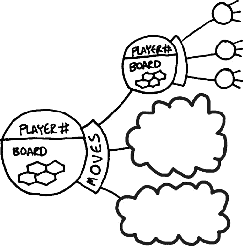

游戏树分支从一开始就被声明了。然而，我们并不麻烦去计算云分支的实际值，就像我们创建一个“真实”分支时那样。这是懒加载评估的*懒*部分。

相反，我们等待看是否有人“查看”一个云分支。一旦发生这种情况，POOF！，我们在游戏树的那个位置创建一个真实的分支：


这意味着只有当代码的某个部分偶然查看这些分支时，这些游戏树中的分支才会被创建。如果玩家从未选择过特定的移动，并且 AI 从未决定考虑它，我们的程序将懒地避免进行计算，以确定给定分支的实际样子。

一些语言，如 Haskell 和 Clojure Lisp，在语言的核心中包含对懒计算的支撑。实际上，Clojure 鼓励使用它，并清楚地展示了它对函数式编程的实用性。然而，ANSI Common Lisp 标准并没有包含任何类似的功能来实现这种懒计算。幸运的是，凭借 Common Lisp 强大的宏系统，我们可以轻松地将这个功能添加到语言中！

## 创建懒和强制命令

我们将要创建的最基本的懒计算命令是`lazy`和`force`。`lazy`命令将是一个包装器，你可以将其放在一段代码周围，告诉 Lisp 你希望这段代码以懒方式评估，如下所示：

```
> `(lazy (+ 1 2))`
#<FUNCTION ...>
```

如你所见，计算机*不会*尝试计算 1 加 2 的值。相反，它只是返回一个函数。要获取计算的真正结果，我们必须在我们的另一个基本懒计算命令上调用懒值：

```
> `(force (lazy (+ 1 2)))`
3
```

重要的是，计算确实被执行了，但不是在懒值创建时，而是在它被强制时。为了证明这一点，让我们看一个更复杂的例子：

```
 > `(defun add (a b)`
   `(princ "I am adding now")`
   `(+ a b))`
  ADD
 > `(defparameter *foo* (lazy (add 1 2)))`
  *FOO*
 > `(force *foo*)`
 I am adding now
  3
```

在这里，我们创建了自己的`add`函数，它作为副作用，会在控制台打印出加法操作发生的时间 。接下来，我们使用我们的函数懒加两个数字，并将结果存储在变量`*foo*`中 。到目前为止，我们知道加法实际上还没有发生，因为消息“我现在正在加”还没有出现。

然后，我们`force`我们的变量 。通过强制赋值，计算实际上被执行，并返回`3`的结果。你可以看到，当我们强制赋值懒值时，加法操作发生了，因为我们的消息也打印到了控制台 。

下面是`lazy`简单实现的代码：

```
 (defmacro lazy (&body body)
   (let ((forced (gensym))
          (value (gensym)))
     `(let ((,forced nil)
        (,value nil))
        (lambda ()
          (unless ,forced
            (setf ,value (progn ,@body))
            (setf ,forced t))
          ,value))))
```

我们通过声明一个宏来实现`lazy`，这个宏的代码如下 。这个宏在生成的代码中需要两个变量。我们需要将这些变量声明为`gensym`名称 ，正如在第十六章中讨论的那样。接下来，我们开始生成宏将要输出的代码 （注意这一行开头的反引号）。

在宏生成的代码顶部，有两个局部变量的声明，使用我们创建的`gensym`名称 。第一个变量告诉我们这个懒值是否已经被强制 。如果是`nil`，值可以隐藏在云彩中。如果变量为真，值就不再隐藏在云彩中，因为它已经被强制。

一旦通过调用`force`计算了值，我们将结果值存储在另一个变量中，尽管最初这个值没有被使用，并设置为`nil` 。当我们的`lazy`宏被调用时，我们希望它返回一个函数，这个函数可以在稍后调用以强制我们的懒值返回一个结果。因此，我们接下来声明一个 lambda 函数 。

记住，任何在这个 lambda 函数外部声明的局部变量都将被函数作为闭包捕获。这意味着上面的局部变量  将在 lambda 函数的后续调用之间持续存在。这为什么很重要呢？好吧，一旦云彩消失 POOF!，我们就完成了计算值的全部工作，我们不想在未来在懒值被强制和再次检查多次时再次做这件事。我们可以通过在调用之间记住第一次`force`这里的值来避免这种情况 。

当我们的懒值被强制（通过调用我们创建的 lambda 函数）时，我们必须问自己的第一个问题是它是否已经被强制，或者仍然隐藏在云彩后面 。对于尚未被强制的一个值，我们就会 POOF!执行懒计算 ，并将其保存为我们的`value`。我们还标记它为`forced` 。现在云彩已经消失了。

云彩消失后，我们只需简单地返回我们的计算值 。这可能刚刚被计算，或者它可能已经存在于之前的`force`调用中。

与（诚然令人费解的）`lazy`宏的代码不同，`force`函数非常简单。它所做的只是调用由`lazy`创建的 lambda 函数：

```
(defun force (lazy-value)
  (funcall lazy-value))
```

现在我们已经有一套完整的原始懒评估命令。许多不同类型的复杂工具可以建立在这些简单的`lazy`和`force`命令之上。

## 创建懒列表库

我们现在将使用我们的新命令构建一个基于 Clojure 实现的懒列表库的库。 (在 Clojure 中，懒列表被称为懒序列。)

由于处理 Lisp 列表的基本命令是`cons`命令，您可能不会对第一个用于处理惰性列表的命令是`lazy-cons`命令感到惊讶：

```
(defmacro lazy-cons (a d)
  `(lazy (cons ,a ,d)))
```

这个宏模拟了`cons`的行为，只不过结果是包裹在`lazy`宏中。为了配合`lazy-cons`，我们还将创建`lazy-car`和`lazy-cdr`命令：

```
(defun lazy-car (x)
  (car (force x)))

(defun lazy-cdr (x)
  (cdr (force x)))
```

所有这些函数所做的只是强制惰性值，然后分别调用`car`和`cdr`。让我们尝试使用这些新命令：

```
 > `(defparameter *foo* (lazy-cons 4 7))`
  *FOO*
 > `(lazy-car *foo*)`
  4
 > `(lazy-cdr *foo*)`
  7
```

如您所见，我们可以像使用`cons`一样使用`lazy-cons` 。然后我们可以像分解`cons`一样分解惰性`cons` 。

到目前为止，看起来我们的惰性列表函数与标准的`cons`、`car`和`cdr`函数没有太大区别。然而，我们实际上可以使用它们来完成一些相当惊人的壮举。例如，考虑以下定义：

```
(defparameter *integers*
   (labels ((f (n)
              (lazy-cons n (f (1+ n)))))
        (f 1)))
```

在这里，我们使用了`lazy-cons`命令来声明一件看似不可能的事情：一个包含所有正整数的列表的变量！我们通过创建一个局部函数`f` ，然后递归地调用它来构建一个无限的`lazy-cons`链，使用一个不断增长的数字`n` 。一旦我们声明了这个看似不可能的`*integers*`变量，我们就可以像预期的那样使用它：

```
> `(lazy-car *integers*)`
1
> `(lazy-car (lazy-cdr *integers*))`
2
> `(lazy-car (lazy-cdr (lazy-cdr *integers*)))`
3
```

只要我们坚持只使用我们的`lazy-`命令，我们就可以从我们的无限整数列表中取出我们想要的任何东西，根据需要强制从`*integers*`中获取更多和更多的数字。

由于并非所有列表都是无限的（例如正整数的列表），我们还需要有一个`lazy-nil`的概念来终止列表。同样，我们需要一个`lazy-null`函数，我们可以用它来检查是否到达了列表的末尾，就像`null`函数可以用来检查常规列表的末尾一样。

```
(defun lazy-nil ()
  (lazy nil))

(defun lazy-null (x)
  (not (force x)))
```

现在我们已经拥有了处理惰性列表的基本构建块，让我们为我们的库创建一些有用的函数。

## 在常规列表和惰性列表之间的转换

我们想要能够做的一件明显的事情是将常规列表转换为惰性列表。`make-lazy`函数允许我们这样做：

```
(defun make-lazy (lst)
   (lazy (when lst
           (cons (car lst) (make-lazy (cdr lst))))))
```

正如`make-lazy`函数清楚地显示的那样，编写惰性列表库函数有点像写禅宗公案。理解它们的唯一方法就是长时间地盯着它们看。英语没有合适的词汇来清楚地解释像`make-lazy`这样的函数。

从广义上讲，`make-lazy` 使用递归遍历列表 ![http://atomoreilly.com/source/nostarch/images/783562.png]，然后将每个 cons 元素包裹在 `lazy` 宏的调用中 ![http://atomoreilly.com/source/nostarch/images/783564.png]。然而，要完全理解这个函数（以及我们懒加载库中剩余的其他函数），你只需仔细思考 `lazy` 和 `force` 的真正含义，并对每个函数进行一些冥想。幸运的是，一旦我们的小懒列表库完成，它将隐藏大多数懒加载的奇怪之处。

正如我们编写 `make-lazy` 函数将常规列表转换为懒加载列表一样，我们可以创建一些函数来做相反的操作——将懒加载列表转换为常规列表。`take` 和 `take-all` 函数允许我们这样做。

```
 (defun take (n lst)
    (unless (or (zerop n) (lazy-null lst))
      (cons (lazy-car lst) (take (1- n) (lazy-cdr lst)))))

 (defun take-all (lst)
    (unless (lazy-null lst)
      (cons (lazy-car lst) (take-all (lazy-cdr lst)))))
```

我们想要两个不同的命令来从懒加载列表转换为常规列表的原因是，与常规列表不同，懒加载列表可以是无限的。因此，有一个额外的命令让我们能够从列表中取出指定数量的项是有用的。`take` 函数接受一个额外的参数 `n`，它表示我们想要取出的值的数量 ![http://atomoreilly.com/source/nostarch/images/783564.png]。如果我们只想获取所有值，我们可以调用 `take-all` 函数 ![http://atomoreilly.com/source/nostarch/images/783562.png]。当然，这个函数不能用于无限列表——从无限列表中取出所有项会导致无限循环。

让我们尝试使用我们新的懒加载列表转换函数：

```
 > `(take 10 *integers*)`
  (1 2 3 4 5 6 7 8 9 10)
 > `(take 10 (make-lazy '(q w e r t y u i o p a s d f)))`
  (Q W E R T Y U I O P)
  > `(take-all (make-lazy '(q w e r t y u i o p a s d f)))`
 (Q W E R T Y U I O P A S D F)
```

如你所预期，如果我们从所有正整数的列表中取出前 10 个整数，我们只会得到从 1 到 10 的数字作为结果 ![http://atomoreilly.com/source/nostarch/images/783564.png]。`take` 函数也可以用于通过调用 `make-lazy` 创建的有限列表 ![http://atomoreilly.com/source/nostarch/images/783562.png]。然而，如果列表是有限的，我们可以使用更简单的 `take-all` 函数，并直接得到懒加载列表中所有项的常规列表 ![http://atomoreilly.com/source/nostarch/images/783560.png]。

## 在懒加载列表中进行映射和搜索

我们还希望能够在懒加载列表上进行映射和搜索。以下是一些允许这样做的函数：

```
(defun lazy-mapcar (fun lst)
  (lazy (unless (lazy-null lst)
          (cons (funcall fun (lazy-car lst))
                (lazy-mapcar fun (lazy-cdr lst))))))

(defun lazy-mapcan (fun lst)
  (labels ((f (lst-cur)
          (if (lazy-null lst-cur)
                  (force (lazy-mapcan fun (lazy-cdr lst)))
                (cons (lazy-car lst-cur) (lazy (f (lazy-cdr lst-cur)))))))
    (lazy (unless (lazy-null lst)
        (f (funcall fun (lazy-car lst)))))))

(defun lazy-find-if (fun lst)
  (unless (lazy-null lst)
    (let ((x (lazy-car lst)))
      (if (funcall fun x)
          x
        (lazy-find-if fun (lazy-cdr lst))))))

(defun lazy-nth (n lst)
  (if (zerop n)
      (lazy-car lst)
    (lazy-nth (1- n) (lazy-cdr lst))))
```

这些函数与 `mapcar`、`mapcan`、`find-if` 和 `nth` 函数类似。唯一的区别是它们接受和返回懒加载列表。这意味着它们不是使用 `null`、`car` 和 `cdr`，而是使用我们刚刚创建的这些函数的懒加载版本（`lazy-null`、`lazy-car` 和 `lazy-cdr`）。

使用这些函数相当简单：

```
 > `(take 10 (lazy-mapcar #'sqrt *integers*))`
  (1 1.4142135 1.7320508 2 2.236068 2.4494898
   2.6457512 2.828427 3 3.1622777)
 > `(take 10 (lazy-mapcan (lambda (x)`
   `(if (evenp x)`
  `(make-lazy (list x))`
  `(lazy-nil)))`
   `*integers*))`
  (2 4 6 8 10 12 14 16 18 20)
 > `(lazy-find-if #'oddp (make-lazy '(2 4 6 7 8 10)))`
  7
 > `(lazy-nth 4 (make-lazy '(a b c d e f g)))`
  E
```

使用`lazy-mapcar`调用平方根函数映射正整数，我们得到了正整数的平方根的懒列表。前 10 个如下所示 ![httpatomoreillycomsourcenostarchimages783564.png]。接下来，我们调用`lazy-mapcan` ![httpatomoreillycomsourcenostarchimages783562.png]并检查每个正整数是否为偶数。如果是，我们返回一个包含数字的懒列表 ![httpatomoreillycomsourcenostarchimages783560.png]。如果不是，我们返回一个懒空列表 ![httpatomoreillycomsourcenostarchimages783554.png]。结果是，我们从整数懒列表中过滤掉了所有偶数。我们可以使用`lazy-find-if`在懒列表中找到第一个奇数 ![httpatomoreillycomsourcenostarchimages783510.png]。在这种情况下，数字是 7。最后，我们可以使用`lazy-nth`从懒列表的特定位置选择一个数字 ![httpatomoreillycomsourcenostarchimages783544.png]。

我们现在已经编写了一个完整的，尽管相当简单的懒列表库。将本章中我们编写的所有函数放入名为*lazy.lisp*的文件中（或者直接从[`landoflisp.com/`](http://landoflisp.com/)下载该文件）。

现在，你们将看到懒列表如何极大地提升我们“末日骰子”游戏引擎的效能！

# 末日骰子，版本 2

在第十五章中，我们创建了“末日骰子”游戏的第一个版本。现在，我们将修改该版本中的一些函数。为了继续，将那一章的代码放入名为*dice_of_doom_v1.lisp*的文件中，以便我们可以在新版本中引用它（或者直接从[`landoflisp.com/`](http://landoflisp.com/)下载该文件）。

要使用我们之前的“末日骰子”和新的懒列表库，请在 REPL 中运行以下命令：

```
> `(load "dice_of_doom_v1.lisp")`
> `(load "lazy.lisp")`
```

接下来，我们将棋盘的大小增加到更宽敞的 4x4：

```
> `(defparameter *board-size* 4)`
> `(defparameter *board-hexnum* (* *board-size* *board-size*))`
```

为了使游戏以合理的速度运行在这个更大的规模上，我们将游戏树每个分支的移动列表改为懒列表，而不是普通的列表。通过简单地将我们游戏中的一种结构从普通列表转换为懒列表，整个游戏树将因此变为懒列表。为了实现这一点，我们现在需要重新定义我们游戏第一版中的一些函数，以便使用我们新的懒列表函数。

首先，让我们对计算从给定棋盘位置可能的攻击和传球移动的函数做一些小的修改：

```
(defun add-passing-move (board player spare-dice first-move moves)
    (if first-move
        moves
       (lazy-cons (list nil
                         (game-tree (add-new-dice board player
                                                  (1- spare-dice))
                                    (mod (1+ player) *num-players*)
                                    0
                                    t))
                   moves)))

  (defun attacking-moves (board cur-player spare-dice)
    (labels ((player (pos)
          (car (aref board pos)))
       (dice (pos)
           (cadr (aref board pos))))
     (lazy-mapcan
       (lambda (src)
         (if (eq (player src) cur-player)
            (lazy-mapcan
              (lambda (dst)
                (if (and (not (eq (player dst)
                                  cur-player))
                         (> (dice src) (dice dst)))
                   (make-lazy
                     (list (list (list src dst)
                                 (game-tree (board-attack board
                                                          cur-player
                                                          src
                                                          dst
                                                          (dice src))
                                            cur-player
                                            (+ spare-dice (dice dst))
                                            nil))))
                 (lazy-nil)))
             (make-lazy (neighbors src)))
          (lazy-nil)))
      (make-lazy (loop for n below *board-hexnum*
                        collect n)))))
```

如你们所见，`add-passing-move`函数只需要做一个小改动。由于移动列表现在是懒列表，我们使用`lazy-cons`将一个传球移动添加到可能的移动列表的顶部 ![httpatomoreillycomsourcenostarchimages783564.png]。

`attacking-moves` 函数需要一些额外的更改。首先，由于它现在需要返回一个惰性列表，我们在两个地方使用 `lazy-mapcan` 代替 `mapcan` 来计算移动 。`lazy-mapcan` 函数还要求其内部创建的列表是惰性的，我们通过 `make-lazy` 函数来实现 。此外，我们还将返回 `nil` 的任何地方现在改为返回 `lazy-nil` 。最后，我们还使计算出的棋盘位置列表变为惰性 ，因为它被输入到外部的 `lazy-mapcan`。

接下来，让我们对处理人类玩家的两个函数进行类似的更改：

```
(defun handle-human (tree)
    (fresh-line)
    (princ "choose your move:")
    (let ((moves (caddr tree)))
      (labels ((print-moves (moves n)
                     (unless (lazy-null moves)
                       (let* ((move (lazy-car moves))
                           (action (car move)))
                          (fresh-line)
                          (format t "˜a. " n)
                          (if action
                            (format t "˜a -> ˜a" (car action) (cadr action))
                           (princ "end turn")))
                       (print-moves (lazy-cdr moves) (1+ n)))))
            (print-moves moves 1))
      (fresh-line)
     (cadr (lazy-nth (1- (read)) moves))))

  (defun play-vs-human (tree)
    (print-info tree)
   (if (not (lazy-null (caddr tree)))
        (play-vs-human (handle-human tree))
      (announce-winner (cadr tree))))
```

在 `handle-human` 函数中，我们有一个局部函数 `print-moves`，它是一个遍历移动列表的列表消耗函数。我们修改它以在检查列表的末尾时使用我们的惰性命令 ，从列表的前端移除一个移动 ，并在列表的尾部递归 。最后，我们修改 `handle-human` 以使用 `lazy-nth` 在人类从选项列表中选择移动后选择一个移动 。

在 `play-vs-human` 函数中，我们只做了一处精确的更改。为了确定我们是否到达了游戏的末尾，我们需要检查后续可能的移动列表是否为空，然后宣布获胜者。我们简单地使用 `lazy-null` 来检查惰性移动列表是否为空 。

在这些简单的更改到位后，你可以在更大的棋盘尺寸上与另一名人类玩家玩“末日骰子”，因为除非一名玩家决定做出移动，否则树中的任何移动都不会实现。在我们的更大，4x4 的棋盘上，输入以下内容以开始游戏（就像我们游戏的第 1 版一样）：

```
> `(play-vs-human (game-tree (gen-board) 0 0 t))`
current player = a
        a-1 a-3 a-1 b-2
      b-3 a-3 a-3 a-1
    a-3 a-3 b-1 a-2
  b-3 a-3 a-1 a-3
choose your move:
1\. 5 -> 10
2\. 6 -> 10
3\. 9 -> 10
4\. 11 -> 10
5\. 15 -> 10
```

第 1 版会在执行此命令的瞬间停止。这是因为它需要在游戏开始播放之前，为整个游戏中所有可能的移动生成整个游戏树。

使用我们的惰性版本“末日骰子”，游戏可以立即开始！

# 使我们的 AI 在更大的游戏棋盘上工作

接下来，我们将调整我们的游戏 AI 函数以在处理移动时使用新的惰性列表库。在这个过程中，我们将对 AI 代码进行一些额外的改进。

## 剪切游戏树


在《末日骰子》版本 1 中，我们的 AI 代码在某些方面非常强大。这是因为，在每一个决策点，AI 玩家会查看**每一个可能的未来棋盘位置**来选择绝对最佳的下一步走法。通过这种方式，它可以玩出完美的《末日骰子》，赢得每一场可以赢得的比赛。

然而，这种设计无法扩展到更大的棋盘。这是因为一旦棋盘变得太大，就几乎不可能考虑每一个可能的未来走法。事实上，我们新提出的懒惰游戏树的核心目的就是避免考虑每一个可能的走法。因此，我们需要一种方法告诉计算机，“只考虑这么多走法，不再考虑更多。”换句话说，我们希望能够告诉它只看两步、三步或四步，然后停止进一步查看。

《末日骰子》的函数式编程风格允许我们以一种非常优雅但并不明显的方式做到这一点。

解决这个问题的**明显**方案是对版本 1 中的`get-ratings`和`rate-position`进行修改，添加一个名为`search-depth`的新参数。然后，在每次调用这些函数时，我们可以问自己，“我们已经达到想要的最大搜索深度了吗？”

这种方法的缺点是它会使那些函数变得复杂，代码难以理解。实际上，我们评估棋盘位置的方式在理论上与希望搜索的深度是两个独立的问题。程序员喜欢说，这些问题是**正交的**，如果我们可以分别编写函数来独立处理这些问题，那就最好不过了。

实际上，有了我们新的懒惰游戏树，我们可以编写一个单独的函数，专门负责“修剪”搜索树，并且完全独立于主要 AI 代码，后者负责考虑和评估可能的走法。

下面是这个修剪树的函数：

```
 (defun limit-tree-depth (tree depth)
    (list (car tree)
      (cadr tree)
     (if (zerop depth)
         (lazy-nil)
        (lazy-mapcar (lambda (move)
                         (list (car move)
                              (limit-tree-depth (cadr move) (1- depth))))
                 (caddr tree)))))
```

这是一个相当简单的函数，它只接受两个参数：一个懒惰树和希望修剪到的深度！[](httpatomoreillycomsourcenostarchimages783564.png)。因此，它只是输出一个新的游戏树，递归地调用自身，每深入树的一层就减少深度！[](httpatomoreillycomsourcenostarchimages783554.png)。一旦这个深度达到零！[](httpatomoreillycomsourcenostarchimages783562.png)，我们就知道我们已经到达了想要修剪的水平，并将懒惰走法列表设置为空列表！[](httpatomoreillycomsourcenostarchimages783560.png)。

现在我们需要做的只是在我们进行 AI 评级计算之前调用我们的新`limit-tree-depth`函数。我们通过稍微调整我们的`handle-computer`函数来实现这一点：

```
(defparameter *ai-level* 4)

  (defun handle-computer (tree)
   (let ((ratings (get-ratings (limit-tree-depth tree *ai-level*)
                                (car tree))))
      (cadr (lazy-nth (position (apply #'max ratings) ratings)
                     (caddr tree)))))
```

在调用`get-ratings`以获取每个下一个可用移动的评分之前，我们将我们的游戏树转换为修剪后的游戏树 。现在，我们所有的 AI 代码都可以在修剪后的树上运行，完全不知道存在一个更大的游戏树，或者它没有包括在计算中的更深层次的移动。通过这种技术，我们已经成功地将限制 AI 搜索深度的代码与实际评估棋盘位置的算法解耦。另一个小的修改是在从懒加载移动列表中选择移动时使用`lazy-nth` 。

### 注意

`limit-tree-depth`函数使用了一种相当粗糙的方法来修剪我们的树：它只是简单地修剪所有超过一定深度的树分支。对于大多数棋盘游戏来说，这样做是修剪游戏树的最佳方式。然而，《末日骰子》有一个不寻常的特性，即每个玩家都允许连续进行多次移动。如果`limit-tree-depth`在修剪分支时考虑到我们切换玩家的次数，可能更优。但我们的简单版本已经足够好了。

在这一点上，我们也应该对`play-vs-computer`进行精确的修改：

```
(defun play-vs-computer (tree)
    (print-info tree)
   (cond ((lazy-null (caddr tree)) (announce-winner (cadr tree)))
          ((zerop (car tree)) (play-vs-computer (handle-human tree)))
          (t (play-vs-computer (handle-computer tree)))))
```

在这里，我们只是添加了一个`lazy-null`来检查单个位置上懒加载移动列表的末尾 。

现在，让我们看看另一个将提高我们 AI 代码能力的技巧。

## 应用启发式

通过修剪我们的游戏树，我们从根本上改变了我们的 AI 玩家。如果没有修剪，AI 玩家能够始终玩出完美的游戏。然而，通过修剪树，AI 就有可能“错过”一些东西，因为它不再考虑每一个可能未来的移动。在《末日骰子》版本 2 中，电脑玩家将无法再玩出完美的游戏——只能玩出“相当不错”的游戏。

事实上，我们用 AI 玩完美游戏的能力换取了更好的性能。在这个过程中，我们将 AI 代码从可以被数学分析出的精确事物转变为“更柔软”且远不那么精确的事物。正如计算机科学家所说，我们现在已经进入了*启发式*领域。

在计算机科学中，启发式是一种不完美的编程技术，但允许我们快速获得良好的结果。广义上讲，任何快速但不是每次都能保证成功的技巧都是启发式。当我们编写使用启发式（如我们的《末日骰子》AI 引擎现在所做的那样）的代码时，通常值得进行一些创造性思考，并以不同的方式“玩弄”代码。

基本上，既然我们已经放弃了寻找完美解决方案的目标，现在正在使用不精确的技术，那么以不同的方式调整启发式代码中的旋钮可能会显著提高我们的结果。事实上，我们发现我们可以对 Dice of Doom AI 的启发式算法进行一个简单的修改，这将显著提高 AI 玩家的游戏表现。

## 大胜与小胜

在 Dice of Doom 代码的版本 1 中，AI 玩家没有理由担心其胜利的幅度。它唯一关心的是当游戏结束时，它至少比对手多拥有一个棋盘领土，这意味着它已经获胜。

然而，现在我们在 AI 代码中使用不精确的启发式算法，游戏中的领先幅度在任何时刻都非常重要。这种情况下的启发式规则是：“如果我在游戏中彻底打败了我的对手，那么即使我只看几步棋，他/她恢复的可能性也很小。”

记住，最小-最大算法（正如我们在 AI 中使用的那样）会给树中的每个最终叶子分支分配一个得分。在我们的游戏版本 1 中，这个得分要么是 0 或 1，或者当游戏以平局结束时，有时是 1/2。在版本 2 中，这些并不是树中的真正“最终叶子”，而只是我们更小的修剪树中的叶子。在这种情况下，如果我们的叶子得分有更大的值范围，那么我们就可以判断哪些走法会导致我们赢得“很多”的游戏，哪些走法会导致我们只赢得“一点”。

让我们编写一个`score-board`函数，该函数使用一些更复杂的启发式算法来评估叶子节点的棋盘位置：

```
(defun score-board (board player)
   (loop for hex across board
          for pos from 0
         sum (if (eq (car hex) player)
                 (if (threatened pos board)
                     1
                   2)
               −1)))
```

`score-board`函数遍历棋盘上的所有六边形，并使用循环宏的`sum`指令为每个六边形累积得分。如果我们要评估的玩家拥有当前的六边形，我们希望将正分加到总分上！[图片链接](http://atomoreilly.com/source/nostarch/images/783564.png)！[图片链接](http://atomoreilly.com/source/nostarch/images/783562.png)！[图片链接](http://atomoreilly.com/source/nostarch/images/783554.png)！[图片链接](http://atomoreilly.com/source/nostarch/images/783510.png)。

为了决定为占据的六边形添加多少分，我们做出另一个启发式观察：与更强的对手相邻的六边形并不像没有强邻居的六边形那样有价值。我们将一个与拥有更多骰子的敌人相邻的六边形称为*受威胁的六边形*。对于受威胁的六边形！[图片链接](http://atomoreilly.com/source/nostarch/images/783560.png)，我们将只添加 1 分到总分！[图片链接](http://atomoreilly.com/source/nostarch/images/783554.png)。对于不受威胁的六边形，我们将添加 2 分！[图片链接](http://atomoreilly.com/source/nostarch/images/783510.png)。最后，对于每个由对手拥有的六边形，我们将从总分中减去 1 分！[图片链接](http://atomoreilly.com/source/nostarch/images/783544.png)。

再次强调，重要的是要认识到 `score-board` 是一个启发式函数，没有真正正确或错误的方式来生成这样的分数。我们不仅可以为不受威胁的六边形加 2 分，同样也可以加 1.5 分。在开发这个示例时，我使用不同版本的 `score-board` 函数与各种对手进行了模拟，这个版本最终表现相当不错。开发启发式方法不是一门精确的科学。

这里是确定给定六边形是否受到威胁的函数：

```
(defun threatened (pos board)
   (let* ((hex (aref board pos))
           (player (car hex))
           (dice (cadr hex)))
     (loop for n in (neighbors pos)
           do (let* ((nhex (aref board n))
                      (nplayer (car nhex))
                      (ndice (cadr nhex)))
                (when (and (not (eq player nplayer)) (> ndice dice))
                  (return t))))))
```

首先，我们获取相关的六边形，并确定占据该六边形的玩家以及该玩家有多少个骰子 。然后，我们遍历当前位置的所有相邻方格 。之后，我们找出每个相邻方格的玩家和骰子数量 。一旦我们找到一个由对手拥有的、骰子数量更多的相邻六边形（一个威胁性的邻居） ，我们就可以返回 true 。以这种方式调用 `return` 会导致循环提前停止，并以 true 作为结果。

现在我们已经完成了我们的 `score-board` 和 `threatened` 函数，我们准备编写我们的改进的 `get-ratings` 和 `rate-position` 函数：

```
(defun get-ratings (tree player)
   (take-all (lazy-mapcar (lambda (move)
                             (rate-position (cadr move) player))
                           (caddr tree))))

  (defun rate-position (tree player)
    (let ((moves (caddr tree)))
     (if (not (lazy-null moves))
      (apply (if (eq (car tree) player)
             #'max
           #'min)
             (get-ratings tree player))
       (score-board (cadr tree) player))))
```

如您所见，我们更新了几行代码 ，以与我们的新懒散游戏树兼容。请注意，任何缺乏后续移动（即，叶子）的游戏位置现在都会调用我们的新 `score-board` 函数 。

现在我们有一个完全工作的启发式 AI 玩家，可以在更大的游戏棋盘上玩游戏，让我们试试。像往常一样，以下示例中玩家 B 的所有移动都由 AI 算法自动计算：

```
> `(play-vs-computer (game-tree (gen-board) 0 0 t))`
current player = a
        a-1 b-2 b-1 a-3
      b-3 a-1 a-3 a-3
    b-3 b-2 b-2 b-2
  a-3 a-3 a-2 a-2
choose your move:
1\. 3 -> 2
2\. 6 -> 2
3\. 6 -> 10
4\. 6 -> 1
5\. 6 -> 11
6\. 7 -> 11
7\. 7 -> 2
8\. 13 -> 9
`3`
current player = a
        a-1 b-2 b-1 a-3
      b-3 a-1 a-1 a-3
    b-3 b-2 a-2 b-2
  a-3 a-3 a-2 a-2
choose your move:
1\. end turn
2\. 3 -> 2
3\. 7 -> 11
4\. 7 -> 2
5\. 13 -> 9
`1`
current player = b
        a-2 b-2 b-1 a-3
      b-3 a-1 a-1 a-3
    b-3 b-2 a-2 b-2
  a-3 a-3 a-2 a-2
current player = b
        a-2 b-1 b-1 a-3
      b-3 b-1 a-1 a-3
    b-3 b-2 a-2 b-2
  a-3 a-3 a-2 a-2
current player = b
        b-2 b-1 b-1 a-3
      b-1 b-1 a-1 a-3
    b-3 b-2 a-2 b-2
  a-3 a-3 a-2 a-2
current player = b
        b-2 b-1 b-1 a-3
      b-1 b-1 b-1 a-3
    b-3 b-2 a-2 b-1
  a-3 a-3 a-2 a-2
current player = a
        b-3 b-2 b-2 a-3
      b-1 b-1 b-1 a-3
    b-3 b-2 a-2 b-1
  a-3 a-3 a-2 a-2
choose your move:
1\. 3 -> 2
2\. 7 -> 11
3\. 7 -> 2
4\. 7 -> 6
5\. 10 -> 6
6\. 10 -> 5
7\. 10 -> 11
8\. 13 -> 9
9\. 15 -> 11
...
```

在这些更改到位后，当与只选择随机移动的玩家对抗时，AI 玩家将赢得大约 65 到 70% 的所有游戏（取决于棋盘大小和 AI 级别）。这实际上是一个非常不错的结果。我们的简单 `gen-board` 函数经常创建非常不平衡的起始位置，所以剩下的 30% 的游戏对于计算机来说很多都是无法赢得的。

## Alpha Beta Pruning

让我们在 Dice of Doom AI 的第 2 版中添加一个最后的改进。

*Alpha-beta pruning* 是一个著名的最小-最大算法优化，通过跳过一些分支（*剪枝*这些分支）来提高性能，如果确定这些分支不会影响最终的最小-最大评估。


游戏树中的哪个分支无法影响最终结果？为了理解 alpha-beta 剪枝是如何工作的，请看以下图片，展示了简单 2x2 节点的游戏树：


图的上方是游戏的起始位置。箭头指向可能的移动。在每个棋盘上方都标明当前是哪个玩家（A 或 B）进行移动。

图片还显示了游戏树的最小-最大分析结果。在每个棋盘的右下角，你可以看到一个数字，显示我们的最新 `get-ratings` 函数（带有新的 `score-board` 逻辑）将如何评估该位置。对于叶节点（最底部的棋盘），这个数字是通过 `score-board` 计算得出的。对于分支节点，这个数字是基于最小-最大算法计算得出的。

游戏树中每个允许选择移动的位置都被标记为 MAX 节点或 MIN 节点。由于图中分析是基于寻找玩家 A 的最佳移动，因此允许玩家 A 进行选择的所有位置都被标记为 MAX。允许玩家 B 进行选择的所有位置都被标记为 MIN。从图中可以看出，这个游戏相当无趣，玩家 B 实际上只有一个移动选择的位置。换句话说，游戏树中只有一个 MIN 节点。

从左到右工作，最小-最大算法深度优先遍历，一直探索到叶节点。这被称为 *深度优先搜索*。（我们假设没有进行修剪，`*ai-level*` 设置得非常高。）然后它为具有多个分支的任何节点选择最大或最小分数。

当它这样做时，图中 MIN 节点的第一个（左侧）分支最终得分为 8。如果 AI 引擎现在进入右侧分支，它只关心在那里找到的内容，只要得分低于 8。毕竟，8 和任何大于 8 的最小值仍然是 8，使得这些大数字对计算的最终结果无关紧要。

一旦 AI 在右侧分支找到一个得分为 8 的节点（图中用星号标记），它就知道右侧分支的其余部分是无关紧要的，可以从我们的计算中剪除。这意味着最小-最大算法不需要查看图中标记的虚线分支。

这是一个简单的例子，展示了 alpha-beta 剪枝的实际应用。在图中显示的游戏树中，这种剪枝仅导致微小的节省，因为总共可以剪枝的节点数量很少。然而，对于更大的游戏树，alpha-beta 剪枝的节省通常是巨大的，构成了游戏树中大多数节点。

我们将在我们的游戏中对 alpha-beta 剪枝的实现采取一些简化措施。首先，alpha-beta 剪枝算法通常会传递两个变量，自然地称为 `alpha` 和 `beta`。

这是因为我们可以编写一次处理 MAX 节点和 MIN 节点的代码，通过在高低限制之间切换 `alpha` 和 `beta`。在我们的例子中，我们将使用变量 `upper-limit` 和 `lower-limit`，表示我们在遍历游戏树时关心的最高和最低值。作为代价，将会有一些看起来重复的代码来处理 MAX 和 MIN 情况。然而，将 alpha-beta 剪枝视为 `upper-limit` 和 `lower-limit` 使得代码更容易理解。

我们做出的另一个妥协是，我们没有将剪枝代码与最小-最大代码解耦。记住，在使用剪枝代码时，我们编写了一个独立的函数名为 `limit-tree-depth`，它将剪枝操作与 AI 代码的其他部分分离。我们同样可以采用类似的方法来分离 alpha-beta 剪枝代码，创建一个能够将游戏树转换为剪枝版本的函数。然而，这样做稍微复杂一些，因为 alpha-beta 剪枝代码必须能够访问中间的最小-最大计算。对于更高级的 AI 引擎，这是一个好主意。对于我们的简单引擎，我们将在最小-最大函数内部直接添加我们的 alpha-beta 剪枝检查。

那么，让我们开始吧。首先，我们将重写我们的 `get-ratings` 函数为两个新函数：`ab-get-ratings-max` 和 `ab-get-ratings-min`。

记住，`get-ratings` 函数负责计算从单板布局中多个可用走法中的最佳得分。然而，现在我们希望它在决定找到了“尽可能好”的走法后，能够提前停止对走法的评估。确定是否达到这一点取决于所讨论的节点是 MAX 走法（当前玩家的走法）还是 MIN 走法（对手的走法）。

让我们先看看负责 MAX 节点的版本：

```
 (defun ab-get-ratings-max (tree player upper-limit lower-limit)
    (labels ((f (moves lower-limit)
             (unless (lazy-null moves)
              (let ((x (ab-rate-position (cadr (lazy-car moves))
                                          player
                                          upper-limit
                                          lower-limit)))
                (if (>= x upper-limit)
                    (list x)
                  (cons x (f (lazy-cdr moves) (max x lower-limit))))))))
      (f (caddr tree) lower-limit)))
```

现在，我们将额外的 `upper-limit` 和 `lower-limit` 参数传递给 `ab-get-ratings-max`！。这个函数实际上永远不会直接检查 `lower-limit` 参数，因为它只关心从树中的给定位置找到可能的最大评分。然而，它将这个值传递给子分支，这些分支可能包含关心下限的 MIN 节点。

当我们评估树的下一个分支 （通过调用 `ab-rate-position`，我们很快就会编写这个函数），我们将结果保存为 `x`。如果 `x` 大于或等于我们的 `upper-limit` ，我们知道我们已经得到了我们所能期望的最好的结果，并且可以只将最新的评估值作为列表中的最终值返回 。

如果 `x` 不够大，我们需要继续查看剩余的分支 。注意，如果 `x` 大于之前的 `lower-limit`，它将成为新的 `lower-limit`。

接下来，让我们看看 `ab-get-ratings-min` 函数：

```
(defun ab-get-ratings-min (tree player upper-limit lower-limit)
  (labels ((f (moves upper-limit)
           (unless (lazy-null moves)
             (let ((x (ab-rate-position (cadr (lazy-car moves))
                                        player
                                        upper-limit
                                        lower-limit)))
               (if (<= x lower-limit)
                   (list x)
                 (cons x (f (lazy-cdr moves) (min x upper-limit))))))))
    (f (caddr tree) upper-limit)))
```

`ab-get-ratings-min` 函数基本上与 `ab-get-ratings-max` 函数相同，除了上下限的角色互换了。基于这两个函数的重复性，你可以想象 `ab-get-ratings-max` 和 `ab-get-ratings-min` 函数如何合并成一个函数。如前所述，采用这种方法，而不是 `upper-limit` 和 `lower-limit`，你会使用更通用的术语 `alpha` 和 `beta`，因为这些将根据节点是 MAX 节点还是 MIN 节点而有所不同。

接下来，我们需要调整 `rate-position` 函数，这是评估单板排列的函数：

```
(defun ab-rate-position (tree player upper-limit lower-limit)
    (let ((moves (caddr tree)))
      (if (not (lazy-null moves))
       (if (eq (car tree) player)
           (apply #'max (ab-get-ratings-max tree
                                             player
                                             upper-limit
                                             lower-limit))
           (apply #'min (ab-get-ratings-min tree
                                             player
                                             upper-limit
                                             lower-limit)))
        (score-board (cadr tree) player))))
```

在我们的新 `ab-rate-position` 中，我们检查游戏树中的这个节点是我们的一步棋还是对手的一步棋 。如果是我们的棋，那么它是一个 MAX 节点，我们希望调度到 `ab-get-ratings-max` 。如果是对手的回合，我们则调度到 `ab-get-ratings-min` 。否则，`ab-rate-position` 与我们之前的 `rate-position` 函数相同。

为了完成我们对 alpha-beta 剪枝的支持，我们需要修改另一个函数：启动我们的最小-最大计算的 `handle-computer` 函数：

```
(defun handle-computer (tree)
   (let ((ratings (ab-get-ratings-max (limit-tree-depth tree *ai-level*)
                                       (car tree)
                                      most-positive-fixnum
                                      most-negative-fixnum)))
      (cadr (lazy-nth (position (apply #'max ratings) ratings) (caddr tree)))))
```

这个函数通过调用 `ab-get-ratings-max`  开始最小-最大计算，因为第一步肯定属于目标玩家，因此是一个 MAX 节点。

当我们调用这个函数时，我们需要传入我们的起始`upper-limit`和`lower-limit`。由于我们处于 minimax 搜索的非常开始阶段，我们希望将这些设置得尽可能大和尽可能小。理想情况下，我们希望它们是*正无穷大*和*负无穷大*。尽管许多 Lisp 环境包含对这些概念的支持，但它们不是 ANSI Common Lisp 标准的一部分。然而，标准确实定义了`most-positive-fixnum`和`most-negative-fixnum`，它们是非常大的正数和负数，非常适合我们的目的。因此，我们将这些传递给`ab-get-ratings-max`以开始我们的限制！[](http://atomoreilly.com/source/nostarch/images/783562.png)！[](http://atomoreilly.com/source/nostarch/images/783560.png)。

如果我们想要从我们的 AI 引擎中挤出更多效率，我们可以，相反，将`upper-limit`和`lower-limit`设置为`score-board`函数的最大值和最小值。这将略微提高可能进行的剪枝量。然而，`score-board`函数可能会根据棋盘的大小返回不同的分数范围，并且如果我们决定在未来进一步优化棋盘评分，它可能还有其他依赖项。因此，目前最好的做法是在我们的 minimax 计算开始时将我们的限制设置为接近无限大，这样我们就不必担心这个问题。

作为再次提高我们 AI 性能的最终奖励，让我们将棋盘的大小增加到 5x5 游戏区域。使用我们新的懒、修剪和剪枝 AI 算法，我们应该能够轻松地处理这个更大的棋盘：

```
(defparameter *board-size* 5)
(defparameter *board-hexnum* (* *board-size* *board-size*))
```

### 注意

记住，我们为一些早期的函数使用了记忆化。如果你已经在 4x4 棋盘上玩了一些游戏，特别是`neighbors`函数，可能会根据这个旧的棋盘大小返回结果。这仅在你已经在这个 4x4 棋盘上玩过游戏并且在此期间没有重新启动 Lisp 的情况下才是问题。为了解决这个问题，只需在 REPL 中重新运行`dice_of_doom_v1.lisp`中`neighbors`函数的定义（包括文件底部的记忆化修订版）以清除任何缓存的计算结果。

现在看看我们的游戏是什么样子：

```
> `(play-vs-computer (game-tree (gen-board) 0 0 t))`
current player = a
          a-2 b-2 a-1 b-2 b-2
        a-1 b-2 b-3 b-3 a-3
      a-1 b-2 a-3 b-1 b-2
    b-1 b-3 a-2 b-2 a-1
  b-3 b-1 b-1 a-3 b-3
choose your move:
1\. 9 -> 13
2\. 9 -> 4
3\. 9 -> 14
4\. 12 -> 13
5\. 17 -> 22
6\. 23 -> 18
7\. 23 -> 22
`3`
current player = a
          a-2 b-2 a-1 b-2 b-2
        a-1 b-2 b-3 b-3 a-1
      a-1 b-2 a-3 b-1 a-2
    b-1 b-3 a-2 b-2 a-1
  b-3 b-1 b-1 a-3 b-3
choose your move:
1\. end turn
2\. 12 -> 13
3\. 14 -> 13
4\. 14 -> 15
5\. 17 -> 22
6\. 23 -> 18
7\. 23 -> 22
`1`
current player = b
          a-3 b-2 a-1 b-2 b-2
        a-1 b-2 b-3 b-3 a-1
      a-1 b-2 a-3 b-1 a-2
    b-1 b-3 a-2 b-2 a-1
  b-3 b-1 b-1 a-3 b-3
current player = b
          a-3 b-1 a-1 b-2 b-2
        b-1 b-2 b-3 b-3 a-1
      a-1 b-2 a-3 b-1 a-2
    b-1 b-3 a-2 b-2 a-1
  b-3 b-1 b-1 a-3 b-3
current player = b
          a-3 b-1 b-1 b-1 b-2
        b-1 b-2 b-3 b-3 a-1
      a-1 b-2 a-3 b-1 a-2
    b-1 b-3 a-2 b-2 a-1
  b-3 b-1 b-1 a-3 b-3
current player = b
          a-3 b-1 b-1 b-1 b-1
        b-1 b-2 b-3 b-3 b-1
      a-1 b-2 a-3 b-1 a-2
    b-1 b-3 a-2 b-2 a-1
  b-3 b-1 b-1 a-3 b-3
current player = b
          a-3 b-1 b-1 b-1 b-1
        b-1 b-1 b-3 b-3 b-1
      b-1 b-2 a-3 b-1 a-2
    b-1 b-3 a-2 b-2 a-1
  b-3 b-1 b-1 a-3 b-3
current player = b
          a-3 b-1 b-1 b-1 b-1
        b-1 b-1 b-3 b-3 b-1
      b-1 b-2 a-3 b-1 a-2
    b-1 b-1 b-2 b-2 a-1
  b-3 b-1 b-1 a-3 b-3
current player = b
          a-3 b-1 b-1 b-1 b-1
        b-1 b-1 b-3 b-3 b-1
      b-1 b-2 a-3 b-1 a-2
    b-1 b-1 b-2 b-2 b-2
  b-3 b-1 b-1 a-3 b-1
current player = a
          a-3 b-2 b-2 b-2 b-2
        b-2 b-2 b-3 b-3 b-1
      b-1 b-2 a-3 b-1 a-2
    b-1 b-1 b-2 b-2 b-2
  b-3 b-1 b-1 a-3 b-1
choose your move:
1\. 0 -> 4
2\. 0 -> 1
3\. 0 -> 5
4\. 12 -> 13
5\. 14 -> 10
6\. 14 -> 9
7\. 14 -> 13
8\. 14 -> 15
9\. 23 -> 18
10\. 23 -> 17
11\. 23 -> 22
12\. 23 -> 24
```

到目前为止，我们的 REPL 游戏界面对于如此大的游戏区域来说变得非常不实用。我们将在下一节解决这个问题。

# 你学到的内容

在本章中，我们使我们的“末日骰子”游戏计算机玩家变得更加复杂。我们使用懒列表实现游戏树，并应用了多种优化技术来限制 AI 引擎搜索的棋盘位置数量。在这个过程中，你学习了以下内容：

+   *懒编程*允许你以高效的方式处理非常大的（甚至无限的）数据结构。

+   一旦你有了`lazy`宏和`force`函数，你可以使用它们来构建更复杂的懒操作，包括构建懒列表库。

+   启发式算法是不完美的算法，可以通过一些创造性思维来提高代码的性能。在我们的例子中，我们对评分叶节点的启发式方法进行了一些更改。

+   一旦我们将“末日骰子”转换为使用懒树，我们就能优雅地修剪游戏树，以限制 AI 在考虑其移动时的思考深度。

+   Alpha-beta 剪枝让我们能够进一步改进性能，通过剪枝那些无法影响 AI 考虑的移动最终得分的分支。

# 第十九章：创建基于网页的“末日骰子”图形版本

在前一章中，我们创建了“末日骰子”的第二个版本，用于在更大的游戏板上进行游戏。使用我们粗糙的控制台界面来理解和移动变得相当困难。当然，如果有一个漂亮的图形游戏板，我们可以简单地点击想要移动的位置，那么“末日骰子”将变得无限好。好消息是……

在本章中，我们将从早期章节中收集大量代码，将“末日骰子”转换成一个可以在网页浏览器中直接玩的全功能图形游戏！

# 使用 SVG 格式绘制游戏板

我们已经在 第十三章 中编写了一个原始的网络服务器。此外，我们在 第十七章 中介绍了如何使用 DSL 绘制 SVG 图形。幸运的是，新的 HTML5 标准包括一些功能，使得直接在标准 HTML 文档中嵌入 SVG 图片成为可能。这样，我们将能够使用我们简单的网络服务器来提供一些完全交互式的矢量图形。您将惊讶于做这件事有多容易。

### 注意

在本书编写时，唯一支持在 HTML 中内联 SVG 的网络浏览器是 Firefox 3.7 Alpha。请使用这个版本，或者使用 Firefox 的较新版本与我们的新版本“末日骰子”。如果您遇到问题，请尝试在 Firefox 地址栏中导航到 about:config 页面，并将 html5.enable 配置设置设置为 true。这将允许 Firefox 使用最新的 HTML5 设置。

此外，请记住，我们的网络服务器库不是纯 ANSI Common Lisp，而是使用了某些 CLISP 特定扩展。这意味着它需要 CLISP 才能运行。

首先，我们需要从其他章节中提取代码，为准备工作做好准备。在前一章中，我们创建了“末日骰子”引擎的第二个版本。将那一章的所有代码放入名为 *dice_of_doom_v2.lisp* 的文件中。您也应该已经从 第十三章 中创建了一个名为 *webserver.lisp* 的文件。（这些文件都可以从 [`landoflisp.com/`](http://landoflisp.com/) 免费获取。）

让我们加载这些文件：

```
> `(load "dice_of_doom_v2.lisp")`
> `(load "webserver.lisp")`
```

对于我们的 SVG 支持，我们还需要第十六章 ![ch18.html "第十六章。Lisp 宏的魔力"] 和第十七章 ![ch19.html "第十七章。领域特定语言"] 中的 SVG 渲染代码。将这些函数放在 `svg.lisp` 中。（此文件也可从 [`landoflisp.com/`](http://landoflisp.com/) 获取。）作为参考，我们需要的功能有 `let1`、`split`、`pairs`、`print-tag`、`tag`、`svg`、`brightness`、`svg-style` 和 `polygon`。接下来加载此文件：

```
> `(load "svg.lisp")`
```

现在让我们编写一些代码，使用 SVG 绘制我们游戏板的漂亮版本。首先，我们需要定义一些常量来控制绘制板所需的各种尺寸：

```
(defparameter *board-width* 900)
  (defparameter *board-height* 500)
 (defparameter *board-scale* 64)
 (defparameter *top-offset* 3)
 (defparameter *dice-scale* 40)
 (defparameter *dot-size* 0.05)
```

板的宽度和高度将是 900x500 像素，这对于在大多数人的电脑屏幕上玩游戏来说是一个很好的尺寸。板的比例 ![http://atomoreilly.com/source/no_starch_images/783564.png] 表示屏幕上单个六边形的宽度的一半（以像素为单位）。`*top-offset*` 变量 ![http://atomoreilly.com/source/no_starch_images/783562.png] 告诉我们我们希望在板的底部上方有额外的三个六边形高度的空间。我们需要这个空间，因为一个上面有很多骰子的六边形，其骰子会向上突出，我们需要空间让这些骰子在屏幕上可见。`*dice-scale*` 变量 ![http://atomoreilly.com/source/no_starch_images/783560.png] 告诉我们单个骰子在屏幕上大约高宽 40 像素。最后，我们将 `*dot-size*` 设置为 `0.05`，这意味着每个点将是骰子大小的 0.05 倍 ![http://atomoreilly.com/source/no_starch_images/783554.png]。

## 绘制骰子

现在我们准备编写一个可以绘制骰子的函数。请注意，我们不会使用位图或类似的东西来绘制。相反，我们将通过直接从原始 SVG 多边形渲染骰子“硬”方法来绘制骰子。以下是代码：

```
 (defun draw-die-svg (x y col)
   (labels ((calc-pt (pt)
                  (cons (+ x (* *dice-scale* (car pt)))
                        (+ y (* *dice-scale* (cdr pt)))))
            (f (pol col)
                (polygon (mapcar #'calc-pt pol) col)))
         (f '((0 . −1) (−0.6 . −0.75) (0 . −0.5) (0.6 . −0.75))
             (brightness col 40))
          (f '((0 . −0.5) (−0.6 . −0.75) (−0.6 . 0) (0 . 0.25))
             col)
          (f '((0 . −0.5) (0.6 . −0.75) (0.6 . 0) (0 . 0.25))
             (brightness col −40))
         (mapc (lambda (x y)
                (polygon (mapcar (lambda (xx yy)
                                   (calc-pt (cons (+ x (* xx *dot-size*))
                                                  (+ y (* yy *dot-size*)))))
                                 '(−1 −1 1 1)
                                 '(−1 1 1 −1))
                         '(255 255 255)))
             '(−0.05 0.125 0.3 −0.3 −0.125 0.05 0.2 0.2 0.45 0.45 −0.45 −0.2)
              '(−0.875 −0.80 −0.725 −0.775 −0.70 −0.625
                −0.35 −0.05 −0.45 −0.15 −0.45 −0.05))))
```

要绘制一个骰子，我们需要传递三个参数 ![http://atomoreilly.com/source/no_starch_images/783564.png]。前两个是骰子在 SVG 图片中应出现的位置的 x 和 y 坐标。第三个是我们想要骰子的颜色。这个函数将对那个颜色做一些自由处理，并根据需要修改它，以给骰子一点阴影。

在这个函数中我们绘制的任何内容都需要根据我们定义的 `*dice-scale*` 常量进行缩放渲染。因此，我们首先定义一个局部函数 `calc-pt`，它为我们缩放一个点 ![http://atomoreilly.com/source/no_starch_images/783562.png]。由于我们需要绘制几个缩放的多边形，让我们也创建一个便利函数 `f`，它对多边形中的所有点运行 `calc-pt`，然后通过调用 `polygon` 函数 ![http://atomoreilly.com/source/no_starch_images/783560.png] 来绘制它。

我们图片中的骰子将有三个可见的面：顶面、前面和右面。我们通过三次调用我们的函数 `f` 来绘制这些面，从这里开始 ![http://atomoreilly.com/source/no_starch_images/783554.png]，并使用一些硬编码的坐标来绘制三个面。

我们最后需要做的是在骰子的面上绘制小圆点。我们通过 `mapcing`  小圆点的坐标与一个可以渲染点的 lambda 函数进行映射 。这个 lambda 函数使用 `*dot-size*` 变量来缩小代表骰子面上每个点的正方形多边形。我们可以编写更复杂的代码来绘制圆形和/或椭圆形的点，但点非常小，正方形看起来就很好。

让我们尝试在 x=50 和 y=50 的位置用 RGB 红色 `(255 0 0)` 绘制一个骰子：

```
> `(svg 100 100 (draw-die-svg 50 50 '(255 0 0)))`
<svg  xmlns
:xlink="http://www.w3.org/1999/xlink" height="100" width="100"><polygon
 points="50,10 26.0,20.0 50,30.0 74.0,20.0 " style="fill:rgb(255,40,40);stroke:rgb
(155,0,0)"></polygon><polygon points="50,30.0 26.0,20.0 26.0,50 50,60.0
" style="fill:rgb(255,0,0);stroke:rgb(155,0,0)"></polygon><polygon points="50,
30.0 74.0,20.0 74.0,50 50,60.0 " style="fill:rgb(215,0,0);
stroke:rgb(115,0,0)"></polygon><polygon points="46.0,
13.0 46.0,17.0 50.0,17.0 50.0,13.0 " style="fill:rgb(255,255,255);stroke:rgb(155,155,
155)"></polygon><polygon points="53.0,16.0 53.0,20.0 57.0,20.0 57.0,16.0
 " style="fill:rgb(255,255,255);stroke:rgb(155,155,155)"></polygon><polygon
 points="60.0,18.999998 60.0,23.0 64.0,23.0 64.0,18.999998 "
 style="fill:rgb(255,255,255);stroke:rgb(155,155,155)"></polygon><polygon
 points="36.0,17.0 36.0,21.000002 40.0,21.000002 40.0,17.0 " style="fill:rgb(255,255,
255);stroke:rgb(155,155,155)"></polygon><polygon points="43.0,20.0 43.0,
24.0 47.0,24.0 47.0,20.0 " style="fill:rgb(255,255,255);stroke:rgb(155,155,155)"><
/polygon><polygon points="50.0,23.0 50.0,27.0 54.0,27.0 54.0,23.0 "
 style="fill:rgb(255,255,255);
stroke:rgb(155,155,155)"></polygon><polygon points="56.0,34.0 56.0,38.0
60.0,38.0 60.0,34.0 " style="fill:rgb(255,255,255);stroke:rgb(155,155,155)"></polygon>
<polygon points="56.0,46.0 56.0,50.0 60.0,50.0 60.0,46.0 "
 style="fill:rgb(255,255,255);stroke:rgb(155,155,155)">
</polygon><polygon points="66.0,30.0 66.0,34.0 70.0,34.0 70.0,30.0 " style=
"fill:rgb(255,255,255);stroke:rgb(155,155,155)"></polygon><polygon
 points="66.0,42.0 66.0,46.0 70.0,46.0 70.0,42.0 " style="fill:rgb
(255,255,255);stroke:rgb(155,155,155)"></polygon><polygon points="30.0,30.0
 30.0,34.0 34.0,34.0 34.0,30.0 " style="fill:rgb(255,255,255);stroke:rgb
(155,155,155)"></polygon><polygon points="40.0,46.0 40.0,50.0 44.0,
50.0 44.0,46.0 " style="fill:rgb(255,255,255);stroke:rgb(155,155,155)"
></polygon></svg>
```

如果你想看看最终的骰子是什么样子，只需将这个乱七八糟的东西保存到一个名为 *die.svg* 的文件中。然后在 Firefox 中加载这个结果，你应该会看到以下图片（放大显示）：


## 绘制格子

接下来，让我们编写一个函数来绘制整个六边形格子，包括基础和格子上的骰子：

```
(defun draw-tile-svg (x y pos hex xx yy col chosen-tile)
   (loop for z below 2
         do (polygon (mapcar (lambda (pt)
                                (cons (+ xx (* *board-scale* (car pt)))
                                      (+ yy (* *board-scale*
                                               (+ (cdr pt) (* (- 1 z) 0.1))))))
                             '((−1 . −0.2) (0 . −0.5) (1 . −0.2)
                                (1 . 0.2) (0 . 0.5) (−1 . 0.2)))
                     (if (eql pos chosen-tile)
                          (brightness col 100)
                        col)))
   (loop for z below (second hex)
         do (draw-die-svg (+ xx
                              (* *dice-scale*
                                 0.3
                                (if (oddp (+ x y z))
                                     −0.3
                                   0.3)))
                           (- yy (* *dice-scale* z 0.8)) col)))
```

这个函数接收很多参数，因为很多信息都编码在棋盘的单个格子中。当我们下一节绘制棋盘时，你会了解到这些参数的精确含义。

首先，我们的 `draw-tile-svg` 函数绘制基础。为了给基础一个轻微的 3D 效果，我们将绘制两次，一层堆叠在另一层之上。这里  是绘制两个基础的循环。在这个循环内部，我们需要绘制一个六边形多边形 。我们将缩放函数映射到坐标上，以便它们缩放到我们的 `*board-scale*` 变量。这里  你可以看到使用十进制表示法编码的六边形的六个点。如果玩家选择该基础进行移动，基础的颜色会稍微变亮。我们通过在创建多边形时增加格子的亮度来实现这一点 。

在我们完成绘制格子基础之后，我们需要绘制位于格子上的骰子。我们通过遍历骰子的数量  并调用我们的 `draw-die-svg` 函数  来完成这个任务。在计算骰子的 x 和 y 位置时，我们需要进行一些缩放数学运算。这个数学运算中最有趣的部分是我们根据给定骰子的 x、y 和 z 坐标之和是奇数还是偶数，稍微向左或向右移动骰子 。这使得堆叠看起来有点不完美，并且会给整个棋盘的堆叠骰子带来令人愉悦、自然的外观。

现在让我们调用我们的函数来绘制一个完成的瓷砖，看看它的样子。同样，只需将此命令的输出复制到一个名为 *tile.svg* 的文件中。

```
> `(svg 300 300 (draw-tile-svg 0 0 0 '(0 3) 100 150 '(255 0 0) nil))`
<svg  xmlns:xlink="http://www.w3.org/
1999/xlink" height="300" width="300"><polygon points="36,143.6 100,124.4
 164,143.6 164,169.2 100,188.4 36,169.2 " style="fill:rgb
(255,0,0);stroke:rgb(155,0,0)">
...
```

当你在 Firefox 中查看文件时，你应该看到以下内容：


## 绘制游戏板

现在我们准备编写一个函数，将整个游戏板作为 SVG 绘制出来。它将非常类似于我们用来将游戏板绘制到控制台的 `draw-board` 函数。它扮演着相同的角色，但只是将结果输出为 SVG 数据。

```
(defparameter *die-colors* '((255 63 63) (63 63 255)))

 (defun draw-board-svg (board chosen-tile legal-tiles)
   (loop for y below *board-size*
       do (loop for x below *board-size*
              for pos = (+ x (* *board-size* y))
               for hex = (aref board pos)
               for xx = (* *board-scale* (+ (* 2 x) (- *board-size* y)))
               for yy = (* *board-scale* (+ (* y 0.7) *top-offset*))
               for col = (brightness (nth (first hex) *die-colors*)
                                         (* −15 (- *board-size* y)))
                  do (if (member pos legal-tiles)
                          (tag g ()
                           (tag a ("xlink:href" (make-game-link pos))
                       (draw-tile-svg x y pos hex xx yy col chosen-tile)))
                        (draw-tile-svg x y pos hex xx yy col chosen-tile)))))

  (defun make-game-link (pos)
    (format nil "/game.html?chosen=˜a" pos))
```

`draw-board-svg` 函数接受游戏板作为参数，但还需要两个其他参数，这对于将图片用作我们游戏用户界面的前端非常重要！其中一个参数是 `chosen-tile`，它指示玩家用鼠标点击的瓷砖。我们将使该瓷砖的颜色稍微亮一些，这样玩家就可以知道计算机已经识别了选择。另一个参数是 `legal-tiles`，它指示玩家可以合法点击的瓷砖。

偶然的是，SVG 图片有一个用于网页链接的功能，它的工作方式与常规 HTML 中的 `<a href="...">` 超链接类似。如果一个瓷砖是玩家下一步合法的瓷砖，我们将用这样的链接包裹该瓷砖的 SVG，使其可点击。拥有 `legal-tiles` 参数让我们知道我们想要哪些瓷砖是可点击的。

`draw-board-svg` 函数由几个嵌套循环组成，这些循环遍历瓷砖板的 `y` 和 `x` 坐标。对于每个瓷砖，我们定义大量局部变量（使用在第十章中引入的 `loop` 宏提供的局部变量功能）。首先，我们声明 `pos`，它指示当前瓷砖在六边形数组中的位置。然后我们获取那个六边形。接下来，我们计算瓷砖的像素坐标，存储在变量 `xx` 和 `yy` 中。如您所见，这些坐标的数学计算有点复杂，因为游戏板在屏幕上是按透视绘制的。

我们定义的最后一个局部变量是 `col`，它将保存当前位置瓷砖和骰子的颜色。我们通过使用一个包含骰子颜色的列表来完成此操作，目前该列表包含红色（代表玩家 A）和蓝色（代表玩家 B）。我们还根据 y 坐标使用 `brightness` 函数（在第十七章中讨论）稍微加深颜色，这会使背景行变暗，增加我们 SVG 游戏板的 3D 效果。

如果当前瓷砖是合法瓷砖的成员 ，我们将像之前提到的那样将其包装在一个网络链接中。在 SVG 中，这是通过创建一个形式为`<a xlink:href="...">`的标签来完成的，我们在这里创建它 。请注意，我们还把每个瓷砖包装在一个`<g>`标签中，这告诉 SVG 渲染器将这个瓷砖中的多边形视为一个组。为了确定我们想要链接的实际 URL，我们调用`make-game-link`函数。这个函数构建一个合适的 URL。一旦我们开始编写处理我们游戏网络服务器的代码，你将更好地理解 URL 的格式。

最后，我们准备调用我们的`draw-tile`函数 。在我们的代码中，有两个不同的调用版本：一个用于超链接版本，另一个用于非链接版本。

呼吸！现在我们终于可以使用 SVG 格式动态地绘制一个完整的游戏板了：

```
> `(svg *board-width* *board-height* (draw-board-svg (gen-board) nil nil))`
<svg  xmlns:xlink="http://www.w3.org/
1999/xlink" height="500" width="900"><polygon points="256,185.6 320,166.4
 384,185.6 384,211.2 320,230.4 256,211.2 "
...
```

如果你将输出保存为`board.svg`并在 Firefox 中加载它，你应该看到以下内容：


# 构建网络服务器界面

现在我们已经完成了 Dice of Doom 版本 3 的图形部分，我们准备编写与网络服务器交互的部分。

## 编写我们的网络请求处理器

我们网络服务器处理的核心函数名为`dod-request-handler`。它是我们可以传递给网络服务器库中的`serve`命令的函数，并且负责处理来自网络浏览器的所有网络请求。以下是`dod-request-handler`的代码：

```
(defparameter *cur-game-tree* nil)
  (defparameter *from-tile* nil)

  (defun dod-request-handler (path header params)
   (if (equal path "game.html")
       (progn (princ "<!doctype html>")
              (tag center ()
                    (princ "Welcome to DICE OF DOOM!")
                    (tag br ())
                   (let ((chosen (assoc 'chosen params)))
                     (when (or (not *cur-game-tree*) (not chosen))
                        (setf chosen nil)
                       (web-initialize))
                      (cond ((lazy-null (caddr *cur-game-tree*))
                              (web-announce-winner (cadr *cur-game-tree*)))
                            ((zerop (car *cur-game-tree*))
                              (web-handle-human
                                  (when chosen
                                        (read-from-string (cdr chosen)))))
                           (t (web-handle-computer))))
                    (tag br ())
                   (draw-dod-page *cur-game-tree* *from-tile*)))
      (princ "Sorry... I don't know that page.")))
```

首先，这个函数检查从网络服务器获取的当前页面是否是`game.html` 。这是我们游戏将在网络服务器上驻留的页面。在页面的顶部，我们指定`doctype` 。以这种方式完成时，它告诉网络浏览器预期一个 HTML5 编码的网页。然后我们添加一些简单的 HTML 来居中页面并打印一个欢迎信息 。

从网络服务器库传递的`params`可能包含一个名为`chosen`的重要值，我们可以使用此行来获取它 。如果没有选中的瓷砖，或者如果游戏树当前为空 ，这意味着玩家必须是在开始一个全新的游戏。如果是这种情况，我们将调用名为`web-initialize`的函数 。

接下来，我们需要找出游戏是否已经结束。我们可以通过检查移动列表是否为空（你可能记得，这是存储在树的`caddr`位置）来判断这一点。在这种情况下，我们将宣布一个获胜者 。

接着，我们需要检查当前玩家是否是玩家零，这意味着玩家是人类玩家。在这种情况下，我们将调用函数 `web-handle-human`  来构建页面主体中的剩余 HTML 数据。我们同样使用 `read-from-string` 函数从 `chosen` 参数中提取所选瓷砖的编号，如果它存在的话。

在所有其他情况下，我们知道我们正在处理一个电脑玩家，并将控制权交给 `web-handle-computer`  来构建剩余的 HTML。

最后，`dod-request-handler` 函数需要调用 `draw-dod-page` 函数来绘制游戏板，我们在这里完成 。

## 我们游戏服务器的局限性

我们游戏服务器的局限性相当显著。首先，为了简化起见，`dod-request-handler` 函数根本不尝试确定网络请求来自何方。它表现得好像所有游戏交互都来自单个玩家，因此对于《末日骰子》来说，它不是一个真正的多人服务器。如果多个玩家同时尝试玩不同的游戏，`dod-request-handler` 会感到困惑，并且会发生*不好的事情*。

将 `dod-request-handler` 扩展成一个真正的支持多个、并行游戏的网络服务器并不困难。为此，我们需要从它从网络服务器接收的作为参数的头部数据中提取会话信息，然后所有引用的变量（例如 `*cur-game-tree*` 等）都需要存储在散列表中，使用会话信息作为键。这样，每位玩家都会有自己的游戏树，然后我们的引擎就可以并行服务多个游戏。这种多游戏版本的 `dod-request-handler` 的实现是“留给读者的练习。”

`dod-request-handler` 的另一个局限性是它使用 `read-from-string` 函数从 URL 中读取信息。正如你在前面的章节中学到的，这个函数可以被破坏，在经验丰富（且邪恶）的 Lisp 程序员手中运行任意代码。

## 初始化新游戏

下面是 `web-initialize` 函数，它初始化我们的游戏引擎以开始一场全新的《末日骰子》游戏：

```
(defun web-initialize ()
    (setf *from-tile* nil)
   (setf *cur-game-tree* (game-tree (gen-board) 0 0 t)))
```

正如你所见，它生成一个随机的游戏板，从中构建一棵树，然后将结果存储在全局变量 `*cur-game-tree*` 中 。

## 宣布获奖者

下面是宣布获胜者的函数，它是在网页浏览器内执行的：

```
(defun web-announce-winner (board)
    (fresh-line)
    (let ((w (winners board)))
      (if (> (length w) 1)
        (format t "The game is a tie between ˜a" (mapcar #'player-letter w))
        (format t "The winner is ˜a" (player-letter (car w)))))
   (tag a (href "game.html")
         (princ " play again")))
```

它与我们之前的 `announce-winner` 函数完全相同，只是现在在末尾添加了一些额外的代码来构建一个网页链接 ，这将允许我们方便地开始一场全新的游戏，因为当前的游戏已经结束。

## 处理人类玩家

`web-handle-human`函数负责在当前回合的玩家是人类玩家时创建 HTML 并进行账目管理。

```
(defun web-handle-human (pos)
   (cond ((not pos) (princ "Please choose a hex to move from:"))
          ((eq pos 'pass) (setf *cur-game-tree*
                                (cadr (lazy-car (caddr *cur-game-tree*))))
          (princ "Your reinforcements have been placed.")
           (tag a (href (make-game-link nil))
                (princ "continue")))
         ((not *from-tile*) (setf *from-tile* pos)
                             (princ "Now choose a destination:"))
         ((eq pos *from-tile*) (setf *from-tile* nil)
                                (princ "Move cancelled."))
         (t (setf *cur-game-tree*
                   (cadr (lazy-find-if (lambda (move)
                                         (equal (car move)
                                                (list *from-tile* pos)))
                                       (caddr *cur-game-tree*))))
             (setf *from-tile* nil)
             (princ "You may now ")
            (tag a (href (make-game-link 'pass))
                  (princ "pass"))
             (princ " or make another move:"))))
```

人类玩家最近的选择决定了这个函数将执行什么操作。`web-handle-human`函数通过引用最近选择的位置来了解人类玩家的选择，这个位置来源于通过网络请求传递的参数变量。它还可以引用`*from-tile*`全局变量，这告诉它玩家最初选择哪个地砖作为移动的起始位置。它需要这两个值，因为移动既有源位置也有目标位置。

如果玩家尚未选择位置，我们想要打印一条消息要求玩家选择一个六边形。如果玩家选择通过，我们想要打印一条消息说玩家的增援已经部署。（记住，增援是在有人通过之后立即部署的。）

接下来，我们检查`*from-tile*`变量是否为 nil。如果是这种情况，这意味着玩家尚未为掷骰攻击选择起始位置。如果它是`nil`，我们可以将`*from-tile*`设置为刚刚选择的地点，并要求玩家选择目的地。

如果当前选定的位置与`*from-tile*`变量相同，这意味着选了两次地砖。这一定意味着玩家改变了主意，想要撤销选择。因此，我们将`*from-tile*`设置为`nil`并打印一条取消消息。

在所有其他情况下，这意味着玩家已经为攻击的起始和结束位置选择了两个有效位置。现在我们可以将`*cur-game-tree*`向前推进，指向可用移动懒列表中的适当下一个树。我们想要打印一条消息，允许玩家通过或再次发起攻击。

我们现在已经完成了游戏服务器将用于与人类玩家交互的代码。接下来，让我们编写一个处理计算机玩家的函数。

## 处理计算机玩家

处理我们计算机玩家的网络界面相当简单。毕竟，计算机玩家不需要任何花哨的用户界面东西来了解游戏中的情况。当计算机移动时发生的所有网络操作都是为了人类玩家的利益。以下是`web-handle-computer`代码，当 AI 玩家移动时，它在网络界面中渲染 HTML：

```
(defun web-handle-computer ()
   (setf *cur-game-tree* (handle-computer *cur-game-tree*))
   (princ "The computer has moved. ")
   (tag script ()
      (princ
        "window.setTimeout('window.location=\"game.html?chosen=NIL\"',5000)")))
```

这个函数所做的只是调用我们之前的`handle-computer`函数，该函数将返回游戏树中计算机选择的下一个分支。我们使用这个来更新我们的`*cur-game-tree*`变量 。接下来，我们打印一条消息来声明玩家已经移动 。函数的最后部分是一个巧妙的小技巧，用来让我们的网页界面更加生动。它在网页的 HTML 中放入了一点点 JavaScript ，这会强制网络浏览器在五秒后自动加载一个新的网页。这意味着当计算机 AI 玩家移动时，我们能看到所有动作在一个粗略的动画中发生！

## 在 HTML 中绘制 SVG 游戏棋盘

我们还需要编写一个函数来完成 Dice of Doom 的版本 3：`draw-dod-page`函数。这个函数将我们的页面游戏服务器代码与绘制我们棋盘的 SVG 代码接口。

```
(defun draw-dod-page (tree selected-tile)
    (svg *board-width*
         *board-height*
         (draw-board-svg (cadr tree)
                         selected-tile
                        (take-all (if selected-tile
                                       (lazy-mapcar
                                        (lambda (move)
                                           (when (eql (caar move)
                                                     selected-tile)
                                                (cadar move)))
                                         (caddr tree))
                                    (lazy-mapcar #'caar (caddr tree)))))))
```

这个函数最复杂的部分是确定棋盘上哪些方块是玩家可以点击的有效方块的代码 。如果玩家已经选择了一个方块，我们希望找到所有移动 ，其中移动的起始位置与所选方块  匹配，并返回给定移动的终点位置 。如果玩家还没有选择方块，我们只想返回所有合法的起始位置 。

我们现在已经完成了 Dice of Doom 的完全图形版本。让我们开始玩吧！

# 玩 Dice of Doom 的版本 3

首先，我们需要启动我们的网络服务器。只需提供我们的`dod-request-handler`，我们就可以开始了：

```
> `(serve #'dod-request-handler)`
```

现在，切换到 Firefox 并访问[`localhost:8080/game.html`](http://localhost:8080/game.html)。你应该能在浏览器中看到我们的游戏：


当你点击一个方块时，它会高亮显示：

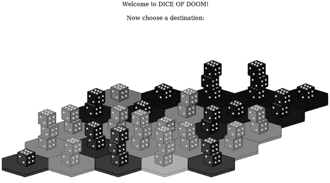

现在你可以选择一个方块进行攻击。在这个例子中，我们将选择所选堆叠右侧的两个骰子的堆叠：

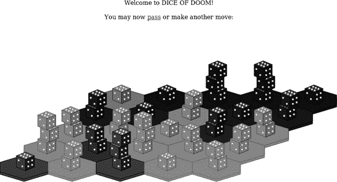

接下来，通过点击**`pass`**网页链接来跳过我们的回合。这将导致强化骰子被放置（在这种情况下，只在左上角放置一个额外的骰子）：


如果你现在点击 **`继续`**，你将看到游戏自动通过计算机玩家的移动，以类似的方式。它将继续这样进行，直到有游戏获胜者。你可以通过简单地回到原始的 *game.html* URL 来开始新游戏。

这比我们迄今为止使用的原始控制台界面要好得多！但还有一些最终改进我们将对“末日骰子”进行，以使其更加生动。我们将在本书的下一章（也是最后一章）中介绍这些改进。

# 你所学的

在本章中，我们讨论了如何从 Lisp 程序生成 Web 浏览器中的交互式图形。在这个过程中，你学习了以下内容：

+   您可以通过使用 SVG 格式渲染棋盘来创建“末日骰子”的图形版本。

+   HTML5 标准支持内联 SVG 图像。您可以使用此功能创建一个基于 Web 的交互式游戏版本。

+   我们用于示例的简单 Web 服务器有几个限制。例如，我们的游戏不能由多个玩家进行。然而，请求处理器可以被扩展以允许进行多个并行游戏。

# 第二十章. 使“末日骰子”游戏更加有趣

现在是时候创建“末日骰子”的最终版本了。我们游戏的第 4 版将比之前的版本更有趣。

尽管你可能没有意识到，我们在游戏规则上做出了一些重大妥协，以使其更容易编程。在本章中，我们将允许更多玩家参与，增加掷骰子，并对“末日骰子”进行一些更多更改，使其成为一个更加有趣的游戏。

# 增加玩家数量

首先，将上一章的所有代码放入名为 *dice_of_doom_v3.lisp* 的文件中（也可从配套网站获取），然后执行以下命令：

```
> `(load "dice_of_doom_v3.lisp")`
```

我们将要做的第一个改变是将玩家数量从两个增加到四个。其中三个将是人工智能对手，由计算机进行游戏。由于我们迄今为止的代码编写方式，这只需要很少的额外代码：

```
(defparameter *num-players* 4)
(defparameter *die-colors* '((255 63 63) (63 63 255) (63 255 63)
                             (255 63 255)))
```

首先，我们只需将我们的 `*num-players*` 变量更改为 `4`。然后我们需要为我们的新玩家指定额外的骰子颜色。四位玩家的颜色将是红色、蓝色、绿色和紫色。

结果表明，我们迄今为止创建的人工智能在四人游戏中运行得很好。

我们的 AI 游戏引擎将使用所谓的“偏执策略”。这意味着 AI 玩家将始终假设每个其他玩家（包括人类）的唯一目标就是——如何表达？——个人地欺骗他们。这不是一个坏策略；然而，超过两个玩家的游戏打开了新的可能性。例如，输掉游戏的玩家可能会联合起来对付获胜的玩家，以提高他们的胜算。我们的游戏 AI 不够聪明，无法形成这样的合作团伙，但已经足够好了。

现在我们已经调整了一些常数以增加玩家数量，让我们再调整几个：

```
(defparameter *max-dice* 5)
(defparameter *ai-level* 2)
```

在这里，我们将六边形瓷砖上的最大骰子数量从三个增加到五个，并将我们的 AI 级别从四降低到二。根据本章中描述的新规则，我们需要使我们的 AI 稍微简单一些，以确保它保持敏捷。由于现在有四个竞争玩家，AI 实际上不需要非常聪明就能挑战人类对手。

# 掷骰子

我相信你肯定注意到了我们游戏中的一个明显的缺陷：尽管它被称为“末日骰子”，但实际上它完全没有随机性！骰子从未被掷出，较大的堆叠总是自动获胜，这使得游戏变得相当无聊。现在我们终于要纠正这个缺陷了。

在这个游戏版本中，在攻击期间，两个骰子堆都会被掷出，掷出最高数字的一方赢得战斗。平局对防守方有利。如果攻击者失败，该玩家必须放弃攻击六边形中除一个以外的所有骰子。

在人工智能编程的术语中，这意味着我们将向我们的游戏树添加 *机会节点*。我们将以非常简单的方式实现这一点。

## 构建机会节点

到目前为止，我们懒散的移动列表中的每个移动都恰好有两个项目：移动的描述（攻击的源和目的地列表，或者对于通过移动为 `nil`）以及当移动被采取时的游戏树的新节点。现在我们只是简单地为移动添加第三个项目，它包含一个不成功攻击的游戏树。这意味着我们的移动列表中的每个移动都将作为机会节点，根据攻击是否成功，为下一个游戏树提供两个可能的后续节点。

让我们更新 `attacking-moves` 函数，以便为移动添加这个额外项目，使每个移动都充当一个机会节点。

```
(defun attacking-moves (board cur-player spare-dice)
    (labels ((player (pos)
                 (car (aref board pos)))
           (dice (pos)
               (cadr (aref board pos))))
      (lazy-mapcan (lambda (src)
                     (if (eq (player src) cur-player)
                       (lazy-mapcan
                         (lambda (dst)
                           (if (and (not (eq (player dst) cur-player))
                                    (> (dice src) 1))
                               (make-lazy (list (list (list src dst)
        (game-tree (board-attack board cur-player src dst (dice src))
                   cur-player
                   (+ spare-dice (dice dst))
                   nil)
       (game-tree (board-attack-fail board cur-player src dst (dice src))
                   cur-player
                   (+ spare-dice (dice dst))
                   nil))))
                                        (lazy-nil)))
                                    (make-lazy (neighbors src)))
                       (lazy-nil)))
                   (make-lazy (loop for n below *board-hexnum*
                            collect n)))))
```

在这个 `attacking-moves` 的更新版本中，唯一的新增内容就在这里 ，我们在创建游戏树中的新移动时添加了第三个项目。在这个机会节点的替代分支中，棋盘是通过调用 `board-attack-fail` 函数构建的，我们将在下一节中编写这个函数。

`board-attack-fail` 函数正是你所期望的那样工作：它接受一个棋盘，并返回一个棋盘，其中从攻击失败的六边形中移除了所有骰子（除了一个）。

```
(defun board-attack-fail (board player src dst dice)
    (board-array (loop for pos from 0
                       for hex across board
                       collect (if (eq pos src)
                                  (list player 1)
                                hex))))
```

在这里，我们只是遍历棋盘，并返回每个未修改的六边形 ，除非它恰好是攻击的源六边形。在这种情况下，我们将从该六边形中移除所有骰子（除了一个） 。

## 进行实际的骰子掷出

接下来，我们需要编写一些函数来实际掷骰子。以下是一个掷骰子堆的函数：

```
(defun roll-dice (dice-num)
   (let ((total (loop repeat dice-num
                       sum (1+ (random 6)))))
      (fresh-line)
     (format t "On ˜a dice rolled ˜a. " dice-num total)
     total))
```

首先，它通过为每个骰子循环一次来计算掷出的骰子堆的总数。对于每个骰子，它生成一个 1 到 6 之间的随机数。然后，它将总和存储在`total`变量中！[](httpatomoreillycomsourcenostarchimages783564.png)。接下来，`roll-dice`函数打印关于掷骰子的描述性消息！[](httpatomoreillycomsourcenostarchimages783562.png)。最后，它返回总和！[](httpatomoreillycomsourcenostarchimages783560.png)。

由于我们永远不会单独掷骰子堆，让我们创建另一个函数，将两堆骰子相互对抗：

```
(defun roll-against (src-dice dst-dice)
  (> (roll-dice src-dice) (roll-dice dst-dice)))
```

这只是两次调用`roll-dice`并比较两次滚动的总和。当我们沿着游戏树前进，选择人类或计算机选择的获胜或失败移动时，我们将想要使用这个函数。

## 从我们的游戏引擎调用掷骰子代码

在我们的游戏引擎的上下文中，掷骰子简单地意味着在人类或计算机选择移动后，选择机遇节点的获胜或失败分支。这个动作由`pick-chance-branch`函数执行：

```
 (defun pick-chance-branch (board move)
    (labels ((dice (pos)
                   (cadr (aref board pos))))
      (let ((path (car move)))
       (if (or (null path) (roll-against (dice (car path))
                                          (dice (cadr path))))
           (cadr move)
         (caddr move)))))
```

这个函数接受当前棋盘以及包含需要解决的机遇节点的移动！[](httpatomoreillycomsourcenostarchimages783564.png)。当移动内部的路径不是`null`时，我们使用源和目标六边形路径上的骰子数量调用`roll-against`！[](httpatomoreillycomsourcenostarchimages783562.png)。我们检查`null`路径，因为这表示移动是“跳过”，不需要掷骰子。

如果攻击的骰子滚动成功，我们从移动中的机遇节点中移除第一个子树！[](httpatomoreillycomsourcenostarchimages783560.png)。如果攻击失败，我们返回机遇节点的第二个子节点！[](httpatomoreillycomsourcenostarchimages783554.png)。

现在，我们需要确保在人类或计算机选择移动时调用`pick-chance-branch`函数。首先，让我们处理人类的情况：

```
(defun handle-human (tree)
    (fresh-line)
    (princ "choose your move:")
    (let ((moves (caddr tree)))
      (labels ((print-moves (moves n)
                      (unless (lazy-null moves)
                        (let* ((move (lazy-car moves))
                             (action (car move)))
                          (fresh-line)
                          (format t "˜a. " n)
                          (if action
                            (format t "˜a -> ˜a" (car action) (cadr action))
                          (princ "end turn")))
                        (print-moves (lazy-cdr moves) (1+ n)))))
            (print-moves moves 1))
      (fresh-line)
     (pick-chance-branch (cadr tree) (lazy-nth (1- (read)) moves))))
```

在这里，我们只是在我们之前的`handle-human`函数末尾添加了对`pick-chance-branch`的调用，在需要返回包含游戏下一个状态的子树分支的点！[](httpatomoreillycomsourcenostarchimages783564.png)。

我们以相同的方式更新`handle-computer`函数：

```
(defun handle-computer (tree)
    (let ((ratings (get-ratings (limit-tree-depth tree *ai-level*) (car tree))))
      (pick-chance-branch
        (cadr tree)
       (lazy-nth (position (apply #'max ratings) ratings) (caddr tree)))))
```

再次，我们只是在函数末尾简单地添加了对`pick-chance-branch`的调用！[](httpatomoreillycomsourcenostarchimages783564.png)。

现在可以玩我们更新的“末日骰子”游戏了。然而，在这个阶段，计算机玩家将玩得非常糟糕，因为 AI 还没有理解机遇节点存在。它将简单地假设每次攻击都会成功，这使得它过于鲁莽，无法玩得体面。我们需要改进我们的 AI，使其在做出决策时考虑到掷骰子。

## 更新 AI

为了让 AI 能够处理对我们游戏现在重要的骰子滚动，它必须对骰子滚动的统计信息有所了解。以下表格提供了它所需的统计信息：

```
(defparameter *dice-odds* #(#(0.84 0.97 1.0 1.0)
                            #(0.44 0.78 0.94 0.99)
                            #(0.15 0.45 0.74 0.91)
                            #(0.04 0.19 0.46 0.72)
                            #(0.01 0.06 0.22 0.46)))
```

此表格包含了我游戏中每个可能的骰子配对获胜的概率。列代表攻击骰子，从一枚骰子开始。行代表目标骰子，从两枚骰子开始（攻击所需的最低骰子数量）。

此表格告诉我们，例如，两枚攻击骰子对抗一枚防御骰子的投掷有 84%的获胜概率。四枚攻击骰子对抗三枚防御骰子有 74%的获胜概率。

如果你记得，我们 AI 代码中的核心函数是`get-ratings`函数，它为可能的后续走法列表提供得分。我们需要修改它计算每个可能走法得分的算法，以考虑骰子滚动的成功概率。我们现在将利用我们的`*dice-odds*`表格以及每个攻击成功或失败的结果的点分数，为每个可用的走法插值一个综合得分：

```
(defun get-ratings (tree player)
    (let ((board (cadr tree)))
      (labels ((dice (pos)
                     (cadr (aref board pos))))
        (take-all (lazy-mapcar
                    (lambda (move)
                      (let ((path (car move)))
                        (if path
                            (let* ((src (car path))
                                   (dst (cadr path))
                                  (odds (aref (aref *dice-odds*
                                                     (1- (dice dst)))
                                               (- (dice src) 2))))
                             (+ (* odds (rate-position (cadr move) player))
                                (* (- 1 odds) (rate-position (caddr move)
                                                              player))))
                          (rate-position (cadr move) player))))
                    (caddr tree))))))
```

在我们更新的`get-ratings`函数中，我们从表格中查找每个攻击成功的概率。然后我们将概率与获胜子树的评级相乘。此外，我们还将攻击失败的几率（胜率减一）乘以失败棋盘位置的评级。现在我们有一个更新的`get-ratings`函数，它理解随机节点，并在生成走法得分时适当考虑它们。

为了让我们的游戏 AI 完全兼容随机节点，我们需要进行一个小小的额外修改。我们的剪枝函数需要了解每个走法中随机节点的两个分支，这样它就可以正确地修剪每个走法的获胜和失败选项：

```
(defun limit-tree-depth (tree depth)
    (list (car tree)
          (cadr tree)
          (if (zerop depth)
              (lazy-nil)
            (lazy-mapcar (lambda (move)
                           (cons (car move)
                                (mapcar (lambda (x)
                                           (limit-tree-depth x (1- depth)))
                                         (cdr move))))
                         (caddr tree)))))
```

我们对每个走法的尾部使用`mapcar`，因此对任何随机节点的两个分支都进行修剪。

### 注意

“末日骰子”版本 4 将不会有 alpha-beta 剪枝。在有随机节点的情况下执行正确的 alpha-beta 剪枝非常复杂。

# 改进“末日骰子”增援规则

到目前为止，玩家回合结束时增加的增援数量总是等于捕获的对手骰子数量减一。这个增援规则保证了游戏中骰子的总数总是减少，因此游戏最终一定会结束，游戏树的大小总是有限的。

然而，自从版本 2 以来，我们的游戏树一直是一个懒树，所以如果树是无限的，那完全没问题。记住，懒加载的主要好处之一是可以拥有无限大小的数据结构。

因此，我们现在将调整我们的强化规则，使我们的游戏在战略上更有趣。

根据我们的新规则，强化骰子的数量将等于玩家最大连续领土中的瓷砖数量。这增加了许多战略深度，因为玩家必须不断决定是否冒险连接他们的领土，或者甚至通过派遣自杀任务来牺牲较小的、不可行的领土。

为了实现这个新的强化规则，我们首先定义一个名为`get-connected`的函数，该函数返回当前玩家拥有的、与目标瓷砖作为邻居集群连接的瓷砖列表：

```
(defun get-connected (board player pos)
   (labels ((check-pos (pos visited)
               (if (and (eq (car (aref board pos)) player)
                        (not (member pos visited)))
                   (check-neighbors (neighbors pos) (cons pos visited))
                 visited))
            (check-neighbors (lst visited)
               (if lst
                   (check-neighbors (cdr lst) (check-pos (car lst) visited))
                 visited)))
     (check-pos pos '())))
```

此函数使用与我们在第八章中用于计算连通性的 Grand Theft Wumpus 游戏相同的算法来查找连通的瓷砖。我们通过递归遍历六边形及其邻居，同时维护一个`visited`列表。

`get-connected`函数通过定义两个递归局部函数来实现这一点。`check-pos`函数 ![http://atomoreilly.com/source/nostarch/images/783564.png] 检查单个位置，并将从该位置可访问的新邻居添加到访问列表中。`check-neighbors`函数 ![http://atomoreilly.com/source/nostarch/images/783562.png] 检查整个邻居列表，同样将新邻居添加到访问列表中。这两个函数相互递归调用，直到找到集群中的所有邻居。为了开始这个递归计算，我们使用目标位置和一个最初为空的`visited`列表调用`check-pos`函数 ![http://atomoreilly.com/source/nostarch/images/783560.png]。

现在我们可以找到集群了。但是，为了找到*最大的*集群，我们需要`largest-cluster-size`函数：

```
(defun largest-cluster-size (board player)
   (labels ((f (pos visited best)
             (if (< pos *board-hexnum*)
                (if (and (eq (car (aref board pos)) player)
                        (not (member pos visited)))
                   (let* ((cluster (get-connected board player pos))
                         (size (length cluster)))
                   (if (> size best)
                       (f (1+ pos) (append cluster visited) size)
                     (f (1+ pos) (append cluster visited) best)))
                  (f (1+ pos) visited best))
              best)))
          (f 0 '() 0)))
```

此函数定义了一个局部函数`f`，我们将使用它来检查棋盘上的每个位置，同时维护先前访问过的节点列表以及迄今为止找到的最大、最佳集群的大小 ![http://atomoreilly.com/source/nostarch/images/783564.png]。

只要当前位置编号小于板上的总点数 ，我们就继续检查瓷砖。如果当前要检查的瓷砖属于玩家，并且尚未访问 ，我们将调用 `get-connected` 来检索从这个位置可达的六边形集群 。然后，如果集群的大小大于迄今为止找到的最佳大小 ，我们将在这个递归调用中将它作为新的最佳大小。否则，我们通过调用 `f` 并保持先前的最佳大小继续进行 。（此时最佳变量将保留迄今为止从先前迭代中找到的最佳值。）无论如何，`pos` 变量都会在每次递归调用 `f` 时增加，这样我们最终就能覆盖整个板。

最后，我们需要更新 `add-new-dice` 以利用我们选择增援数量的新规则：

```
 (defun add-new-dice (board player spare-dice)
    (labels ((f (lst n)
              (cond ((zerop n) lst)
                  ((null lst) nil)
                  (t (let ((cur-player (caar lst))
                         (cur-dice (cadar lst)))
                     (if (and (eq cur-player player) (< cur-dice *max-dice*))
                         (cons (list cur-player (1+ cur-dice))
                               (f (cdr lst) (1- n)))
                       (cons (car lst) (f (cdr lst) n))))))))
          (board-array (f (coerce board 'list)
                         (largest-cluster-size board player)))))
```

如您所见，`add-new-dice` 函数仍然接收 `spare-dice` 作为参数以保持与旧代码的兼容性 ，但现在这个参数被简单地忽略。相反，添加到板上的增援数量取决于最大集群的大小 。否则，`add-new-dice` 与我们之前的版本相同。

这就是我们需要的所有代码，以启用新的增援规则。请注意，由于我们代码的设计，AI 玩家可以完全访问游戏树。由于游戏树现在包含所有这些新的增援数据，AI 将自动调整其游戏策略，以考虑新的增援规则！

# 结论

我们在创建“末日骰子”游戏的过程中走了一段相当长的旅程，沿途使用了大量的不同编程技术。在这本书中的其他所有游戏中，我们也进行了更多的旅行。感谢您与我一起踏上 Lisp 编程世界的旅程！

我建议您花点时间享受您辛勤劳动的成果，并玩几局“末日骰子”的第四版和最终版本。再次提醒，您只需要通过我们的网络服务器提供“末日骰子”请求处理器：

```
> `(serve #'dod-request-handler)`
```

现在，您可以在 Firefox 中玩“末日骰子”（再次，地址为 *localhost:8080/game.html*），按照预期的方式玩，有四名玩家和我们在本章中添加的所有新规则。


祝您在所有“末日骰子”战斗和未来的 Lisp 编程中一切顺利！


# 附录 A. 结语

现在你已经通读了这本书，这里有一个最后的奖励：一个关于整个 Lisp 编程语言家族背后的技术的故事，设定在不太遥远的未来……

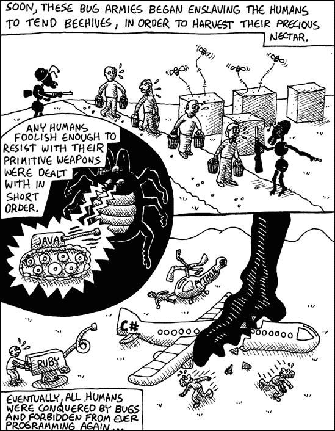

# 功能型巡洋舰

**Lisp 方言**

Common Lisp

## 概述

函数式编程是一种数学化的编程方法，由 Lisp 的创造者开创。函数式编程对程序员施加某些限制，但它可以导致非常优雅的代码。在使用函数式编程时，给定函数使用的每个变量必须是以下之一：


+   传递给该函数的参数

+   在该函数内部创建的局部变量

+   一个常量

此外，函数式编程不允许函数有*副作用*。这意味着函数不能写入磁盘，不能在屏幕上打印消息，或者做任何除了返回结果之外的事情。目标是使用“函数式代码”编写程序的大部分内容，同时保留一小部分代码，用于执行任何仍然需要的脏乱的非函数式操作。

## 它如何杀死错误

以函数式风格编写代码可以保证函数只做一件事（返回一个值）并且只依赖于一个东西（传递给它的参数）。这使得调试变得非常容易。无论你运行函数多少次，只要传递给它相同的数据，你总是会得到相同的结果。

示例 A-1. 示例

```
 (defun unique-letters (name)
      (concatenate 'string
                   "Hello "
                   (coerce (remove-duplicates name) 'string)))

 (defun ask-and-respond ()
      (princ "What is your name?")
      (princ (unique-letters (read-line))))
```

## 说明

如果你将此代码输入到 Lisp REPL 中并执行`(ask-and-respond)`，你将被要求输入你的名字，然后会以你的名字问候你，但所有重复的字母都被移除了。这个函数中的所有艰苦工作都是由`unique-letters`处理的，它是以函数式风格编写的 。与用户交互的脏活，不能以纯函数式方式编写，由`ask-and-respond`处理 。

## 弱点

函数式编程的主要弱点是，程序实际上要“做”一些事情，几乎总是需要一些副作用。这意味着你不能编写一个全部用函数式风格编写的有用程序。至少会有一些代码是非函数式的。

函数式编程在第十四章中讨论。


# 宏团近战战士

**Lisp 方言**

Common Lisp

## 摘要

*真正的宏*是 Lisp 最独特和最惊人的特性之一。事实上，Lisper 忍受他们代码中所有那些令人烦恼的括号的原因是，那些括号使得 Lisp 的宏系统变得神奇。


真正的宏允许你以非常基本的方式向 Lisp 添加新功能。经验丰富的 Lisper 可以使用宏来干净优雅地让他们的 Lisp 编译器/解释器执行他们的命令。

## 如何杀死错误

通过使用宏，经验丰富的 Lisper 可以最小化代码重复，并更好地将底层语言定制到当前问题。这导致代码更干净，错误更少。

例 A-2. 示例

```
(defmacro three-way-if (expr a b &rest c)
   (let ((val (gensym)))
       `(let ((,val ,expr))
          (cond ((and (numberp ,val) (zerop ,val)) ,a)
                (,val ,@c)
                (t ,b)))))
```

## 解释

Lisp 宏如此强大，以至于你可以实际编写自己的 if-then 命令！这里显示的代码创建了一个名为`three-way-if`的宏，它有三个分支：一个用于`nil`值 ，一个用于数值零 ，以及一个用于其他所有情况 。对于大多数用途，这样的函数可能看起来很愚蠢，但如果你需要编写一个经常需要区分零和`nil`（或需要处理其他特定领域的头痛问题）的程序，编写一个宏将使你的生活更容易。

## 弱点

由于 Lisp 宏非常强大，程序员滥用它们的风险总是存在的。过度使用宏可能会让其他程序员难以理解你的代码。

宏在第十六章中讨论。

# 重启团装甲战士

**Lisp 方言**

Common Lisp

## 摘要

正确的异常处理极其困难。实际上只有两种好的方法：根本不处理异常，当异常发生时让程序直接崩溃，或者以最直接和具体的方式处理每一个异常。但是，在代码中真正处理每一个潜在的异常是否真的可能？如果你编写 Common Lisp 代码，你可以非常接近这个理想目标。


例如，假设你编写了一个函数来提高小部件列表中的价格。但在函数处理列表中的某个小部件时，出现了内存分配错误。你无法提前准备这种类型的错误，因为它可能发生在程序的任何地方。这使得使用传统的异常处理方法无法解决这个问题。

即使调用栈中较低层的函数捕获并解决了异常的根源，程序仍然面临一个无法解决的问题：一些小部件的价格已经上涨，而另一些则没有。然而，Common Lisp 有一个机制来解决这个问题，称为 *重启*。

在支持重启的语言中，提高小部件价格的函数可以宣布，“嘿，大家！如果在我处理小部件时发生什么坏事，当对我来说安全完成我的工作时，请使用我的重启（称为 `try-again`）！” 另一个位于调用树较低层的函数现在可以处理错误，然后调用 `try-again` 来确保小部件价格不会变得损坏。这允许函数在失败的确切点完成提高小部件价格的操作。

事实上，如果你有一个无法承受关闭的程序（例如，一个网络服务器），你仍然可以在不结束程序的情况下处理大量极端的异常。即使程序遇到真正异常的异常，它也可以简单地将控制权转回到交互式解释器。然后程序员可以修复异常的原因，访问可用的重启列表，并立即继续运行程序。

## 它如何杀死错误

通过使用重启和 Lisp REPL，可以在运行中的程序中修复错误，允许你以几乎可以忽略不计的中断来“热脚本”长时间运行的应用程序。

示例 A-3. 示例

```
(defun raise-widget-prices (widgets)
   (when widgets
        (loop (restart-case (progn (raise-price (car widgets))
                                   (return))
                (try-again () (princ "trying again"))))
         (raise-widget-prices (cdr widgets))))
```

## 说明

这是一个实现函数的示例，该函数会提高一系列小工具的价格。单个小工具价格提高的实际工作由`raise-price`函数完成 ![httpatomoreillycomsourcenostarchimages783564.png]。对该函数的调用被包裹在一个`loop`和一个`restart-case`命令中，该命令声明了一个名为`try-again`的重启 ![httpatomoreillycomsourcenostarchimages783560.png]。如果价格可以无问题地提高，`raise-price`函数将正常完成，循环通过`return`中断 ![httpatomoreillycomsourcenostarchimages783562.png]，然后处理小工具列表中的下一个项目。另一方面，如果在提高小工具价格时发生错误，另一个函数（或程序员）可以尝试修复问题并调用`try-again`重启来重试失败点的小工具 ![httpatomoreillycomsourcenostarchimages783560.png]，这导致循环的另一个循环 ![httpatomoreillycomsourcenostarchimages783564.png]。然后函数可以继续处理列表的其余部分，提高剩余小工具的价格 ![httpatomoreillycomsourcenostarchimages783554.png]。

通过使用重启，你的代码可以为处理异常提供多种替代后续选项，即使是最异常的异常也能得到适当的处理。

## 弱点

尽管 Common Lisp 拥有现存最先进的异常处理系统之一，但在代码中仍然难以适当地处理每一个异常。然而，重启功能赋予你独特的修复正在运行程序并允许其继续运行的能力，这在其他语言中通常是不可能的。

重启在第十四章中讨论。


# 通用设置器供应船

**Lisp 方言**

Common Lisp

## 概述

要修改 Common Lisp 中变量的值，你使用`setf`。然而，此命令还具有惊人的特殊功能：你可以传递一个复杂的 Lisp 表达式作为参数，该表达式检索一个值。然后它可以反转该表达式并使用它来修改该值，而不仅仅是检索它。这类表达式被称为*通用设置器*。

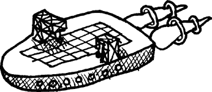

除了`setf`之外，许多命令还支持通用设置器。使用此功能，大多数数据结构类型都可以无需任何特定的“设置”函数。

## 它如何杀死虫子

当你有一个复杂、嵌套的数据结构时，理解从特定位置检索数据的代码通常比理解在相同位置设置值的代码更容易。如果你想在复杂结构中的特定位置设置值，你通常需要从结构中向后工作以找出如何更改它。但是，使用通用设置器，你可以让 Lisp 为你处理复杂的代码。拥有更简单的代码是防止错误的好方法。

示例 A-4. 示例

```
 (defparameter foo (list 1 (make-hash-table) 3))
 (setf (gethash 'my-key (nth foo 1)) 77)
```

## 说明

示例创建了一个名为`foo`的变量，它包含三个项目列表 。列表中的第二个项目是一个空的哈希表。然后它一次性将名为`my-key`的键和值为`77`添加到`foo`内部的表中，通过将一个复杂的表达式放入`setf`中，以“获取”这个位置 。

## 弱点

通过修改现有数据结构，通用设置器产生副作用，这违反了函数式编程的一个原则。这意味着在纯函数式编程风格中不能使用它们。

通用设置器在第九章中讨论。

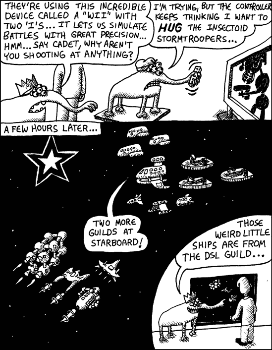

# DSL Guild Hot Rods

**Lisp 方言**

Common Lisp

## 概述

由于 Lisp 有如此简单的语法（所有内容都用括号分隔），因此很容易用它来构建自己的定制编程语言，专为特定领域设计。这种*领域特定语言*（*DSLs*）往往大量使用 Lisp 宏系统。它们代表了宏编程的极端形式，将 Lisp 转换成一种全新的编程语言。


## 说明

这是一个使用 DSL 构建 HTML 页面的代码示例。在这种情况下，页面在浏览器中显示“Hello **World**”，第二个单词以粗体显示。`html`和`body`命令（在第十六章 Chapter 16. The Magic of Lisp Macros 中为 HTML 库创建的宏）生成包含页面主体的开闭标签 。然后它调用常规的 Lisp 函数`princ`来生成文本。第二个单词被另一个自定义 DSL 命令`bold` 包裹，该命令在指定文本周围生成开闭粗体标签。

示例 A-5. 示例

```
 (html (body (princ "Hello ")
             (bold (princ "World!"))))
```

## 弱点

由于 DSLs 是你自己创建的编程语言，如果你不小心，你肯定可以自己给自己挖坑。很容易创建别人（甚至可能是你自己）都无法理解的语言。

第十七章 讨论了 DSL，包括允许你直接在 Lisp 代码中编写 HTML 的 DSL，如本例所示。

# CLOS Guild Battleship

**Lisp 方言**

Common Lisp

## 概述

Common Lisp 拥有任何主要编程语言中最复杂的面向对象编程框架，称为**Common Lisp 对象系统**（*CLOS*）。它可以使用**元对象协议**（*MOP*）在基本级别进行自定义。在编程的任何其他地方都找不到类似的东西。它让你能够创建极其复杂的软件，同时又不失去对代码的控制。


## 如何杀死虫子

*面向对象编程*（*OOP*）是保持虫子（错误）在控制之下的一种常用技术。通过以面向对象的方式编写代码，你可以*解耦*代码的不同部分。当你解耦代码时，你会将代码分解成逻辑组件，这些组件可以独立进行测试。

示例 A-6. 示例 1：将代码包裹在方法周围

```
 (defclass widget ()
      ((color :accessor widget-color
                :initarg :color)))
 (defmethod describe-widget ((w widget))
     (format t "this is a ˜a widget" (widget-color w)))
 (defmethod describe-widget :before ((w widget))
    (add-to-log "Somebody is checking on a widget"))
```

Common Lisp 中面向对象编程的基本概念在第九章中讨论。有关 CLOS 设计的详细信息，我建议阅读编译在[`www.dreamsongs.com/CLOS.html`](http://www.dreamsongs.com/CLOS.html)的 CLOS 论文。

## 说明

对于这个例子，假设我们经营一家销售小部件的公司，我们需要一些面向对象的 Lisp 代码来帮助跟踪它们。首先，我们需要使用`defclass`创建一个新的 CLOS 类（称为`widget`） 。它有一个属性（或 Lisp 术语中的*槽*）描述小部件的颜色。接下来，我们声明一个`describe-widget`，它会打印出小部件的描述 。按照惯例，设计用于操作特定类型对象的函数被称为*方法*。在这种情况下，`describe-widget`被认为是`widget`对象的方法。

现在假设我们想在用户检查小部件时，每次都向日志文件写入一条条目。使用 CLOS，我们可以声明一个或多个**前置方法**，这些方法将在主`describe-widget`方法执行之前自动被调用 。

如果我们没有可用的前置方法，我们需要弄脏我们的主小部件代码以添加日志，如下所示：

```
 (defmethod describe-widget ((w widget))
   (add-to-log "Somebody is checking on a widget")
    (format t "this is a ˜a widget" (widget-color w)))
```

在这里，我们在 `describe-widget` 方法的中间添加了日志记录命令 。这段代码看起来很丑，因为将日志写入与描述小部件本质上没有关系。在这个版本中，日志记录也与主代码紧密耦合，这意味着我们不能再独立于调试代码测试小部件代码。使用 before 方法会导致更干净、更解耦的代码。

## 说明

这个示例演示了*多重分派*，这是一种强大的技术，可以根据参数的类型选择方法。

示例 A-7. 示例 2：多重分派

```
 (defclass color () ())
 (defclass red (color) ())
  (defclass blue (color) ())
  (defclass yellow (color) ())

 (defmethod mix ((c1 color) (c2 color))
      "I don't know what color that makes")

 (defmethod mix ((c1 blue) (c2 yellow))
    "you made green!")

 (defmethod mix ((c1 yellow) (c2 red))
    "you made orange!")
```

示例首先创建一个 `color` 类  并定义了三个派生类：`red`、`green` 和 `blue` 。然后我们声明一个 `mix` 方法，它将告诉我们混合任何两种颜色会发生什么。默认情况下，当我们混合两种颜色时，它只是说，“我不知道那是什么颜色” 。然而，使用多重分派，我们可以定义更多版本的 `mix` 方法。例如，我们可以声明一个混合蓝色和黄色的版本 ，以及一个混合黄色和红色的版本 。以下是使用不同颜色调用这些方法时发生的情况：

```
> `(mix (make-instance 'red) (make-instance 'blue))`
"I don't know what color that makes"
> `(mix (make-instance 'yellow) (make-instance 'red))`
"you made orange!"
```

关于这个示例的重要事项是，为了确定在给定情况下调用哪个混合方法，CLOS 需要考虑传递给方法的所有对象。它是基于*多个*对象类型的*分派*到特定方法实现的。这是传统面向对象语言（如 Java 或 C++）中不可用的功能。

## 弱点

Lisp 社区中关于面向对象技术在编程中应扮演多大角色的观点差异很大。这种风格的批评者抱怨说，面向对象技术通过要求它们存在于许多不同的对象中，迫使数据隐藏在许多不同的地方。数据位于不同的地方可能会使程序难以理解，尤其是如果这些数据随时间变化。因此，许多 Lisp 程序员更喜欢使用函数式技术而不是面向对象技术，尽管这两种技术通常可以谨慎地一起使用。尽管如此，仍然有许多领域在面向对象技术中非常有价值，例如用户界面编程或模拟编程。

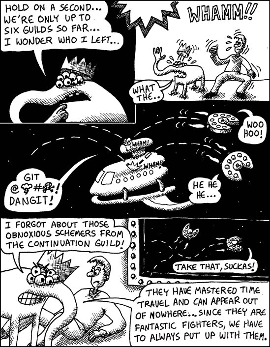

# Continuation Guild 火箭舱

**Lisp 方言**

方案（在 Common Lisp 中有限制地支持，例如通过使用*延续传递风格*或通过使用特殊库）


## 概述

在 20 世纪 70 年代，创建了一种特殊的 Lisp 方言，它具有一个特别强大的编程特性，称为 *延续*。基本上，延续让你可以将“时间旅行”放入你的代码中。这允许你做一些事情，比如运行程序的逆向、横向或其他疯狂的方式。例如，这对于实现高级编程技术，如 *非确定性编程* 非常有用。在非确定性编程中，你编写代码，让计算机有多个选择来决定下一步做什么。如果某个选择不满意，计算机可以使用延续“回滚时间”来尝试不同的路径。

示例 A-8. 示例

```
(define continuation null)

 (define (foo n)
    (* (call-with-current-continuation
           (lambda (c)
             (set! continuation c)
              (+ n 1)))
      2))
```

### 注意

这个示例是 Scheme Lisp 语言的，不会在 Common Lisp 中运行。

## 如何杀死错误

有许多情况，在代码中拥有时间旅行可以使代码更容易理解。经典的例子是在一个网络服务器中。通常，一个人必须访问网页上的几个页面才能执行一个单一的操作。使用了解延续的网络服务器，你可以编写代码，让这些页面看起来是同时访问的，这使得你的代码的 bug 少得多。稍后，网络服务器使用延续将你的代码分成几个部分（通过使用延续的时间旅行能力），处理处理多页面网络操作的所有丑陋细节。

## 说明

在示例中，我们创建了一个简单的函数，名为 `foo` ![http://atomoreilly.com/source/nostarch/images/783564.png]，它将一个数字加一，然后将其翻倍。例如，运行 `(foo 7)` 将返回 `16`。然而，在函数内部，有一个对 `call-with-current-continuation` 的调用 ![http://atomoreilly.com/source/nostarch/images/783562.png]，它捕获了翻倍步骤之前的函数状态。它将这个“时间点”保存在变量 `continuation` ![http://atomoreilly.com/source/nostarch/images/783560.png] 中。当前程序的运行状态在此行被捕获 ![http://atomoreilly.com/source/nostarch/images/783562.png]。如果调用捕获的延续，那么在延续被捕获之后发生的所有事情都将被执行。在延续被捕获之后发生的 `foo` 命令的唯一部分是乘以二 ![http://atomoreilly.com/source/nostarch/images/783554.png]。因此，变量 `continuation` 现在是一个时间机器，我们可以用它跳回到这个过去时刻，用另一个数字替换我们想要翻倍的数字。所以，如果我们现在调用 `(continuation 100)`，它将返回 200（这是 100 翻倍的结果）。我们已经回到了过去！

## 弱点

续续是如此出色的特性，以至于它几乎没有缺点。它唯一真正的问题是对于编程语言的创造者。真正的续续在技术上很难放入编程语言中，所以很少有语言支持它们。Scheme 碰巧是其中之一。想了解更多关于基于续续的 Web 服务器，请参阅 Shriram Krishnamurthi 等人撰写的“PLT Scheme Web 服务器的实现和使用”。

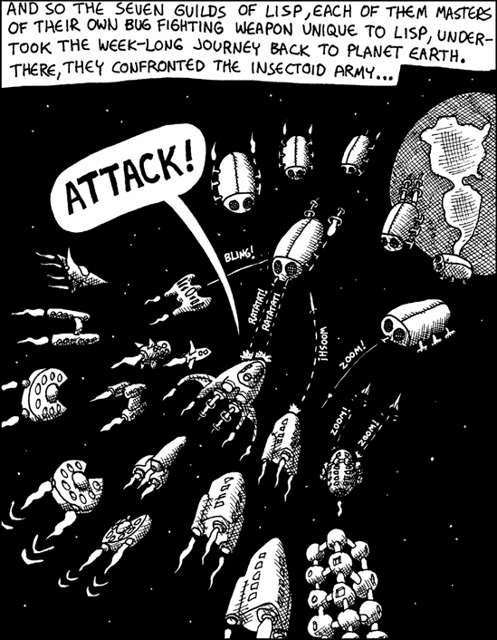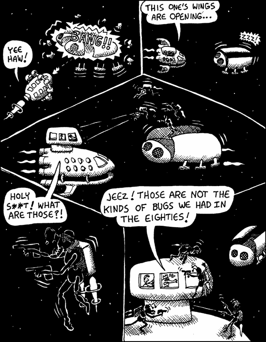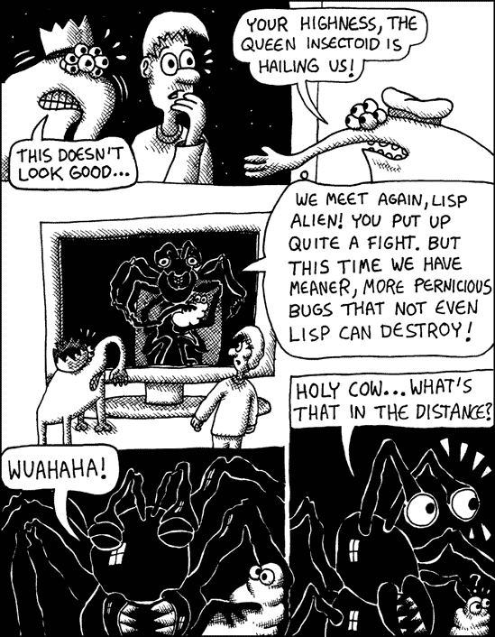

# 简洁派微战斗机

**Lisp 方言**

Arc Lisp（在 Common Lisp 中使用自定义宏间接可用）

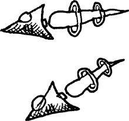

## 概述

Lisp 允许你编写非常简洁的代码，但看起来并不像是你的猫在键盘上走过。（我正在看着你，Perl！）这是由于我们已经提到的各种特性，例如宏、函数式编程和 Lisp 的动态类型系统。

然而，有一种 Lisp 方言将这一理念推向了极致：Arc。事实上，代码简洁性是这种语言的主要设计目标。Arc 的设计者保罗·格雷厄姆分析了大量计算机代码，试图找出编写尽可能简洁的代码所需的原始命令，同时保持代码的可读性。

## 它如何杀死虫子

使用 Arc，目标是编写简短的程序。它旨在让你以最简洁的方式表达你的想法，不留任何让错误隐藏的地方。

示例 A-9. 示例

```
 (accum a
   (for n 1 1000
        (unless (some [is 0 (mod n _)] (range 2 (- n 1)))
            a.n)))
```

### 注意

这个例子是在 Arc Lisp 方言中，不会在 Common Lisp 中运行。

## 说明

这个例子使用检查当前循环值是否有较小数可以整除的朴素方法，创建了一个包含 1 到 1000 之间所有素数的列表。

`accum`函数创建了一个名为`a`的局部函数，用于收集找到的任何素数！[](httpatomoreillycomsourcenostarchimages783564.png)。我们使用`for`循环！[](httpatomoreillycomsourcenostarchimages783562.png)遍历整数，检查是否有比当前`i`的值小的数可以整除`i`！[](httpatomoreillycomsourcenostarchimages783560.png)。如果没有找到，`i`将通过调用带有这个新数字的函数`a`添加到素数列表！[](httpatomoreillycomsourcenostarchimages783554.png)。方括号`[ ]`是创建具有一个参数的 lambda 函数的快捷方式，该参数通过下划线字符访问。

## 弱点

找到一个最优的简洁命令集是困难的。当可用的命令太多时，你的代码可能难以理解，因为难以记住每个函数的作用。当命令太少时，程序可能会变得过于庞大。Arc Lisp 试图找到一个折中的方案，尽管仍有空间为代码简洁性优化的替代语言设计。

第十六章展示了如何使用宏来使代码简洁，以及在该讨论之后章节中展示了 Lisp 简洁性的许多其他示例。

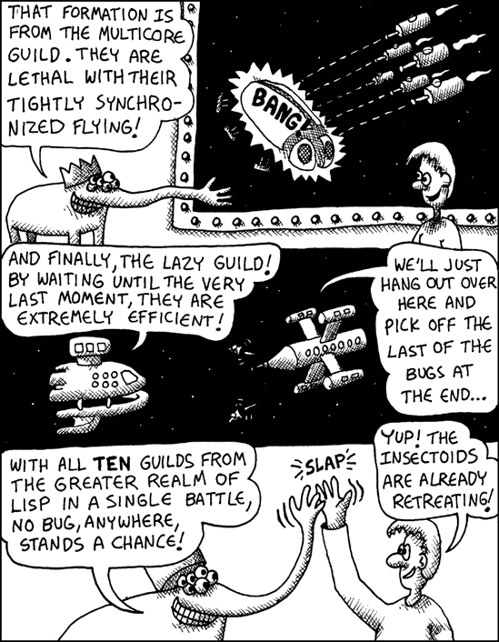

# 多核公会战斗者

**Lisp 方言**

Clojure Lisp（在 Common Lisp 中通过 CL-STM 扩展提供）


## 概述

现在大多数计算机都有多个核心，因此寻找编写多核/多线程代码的优雅方法引起了广泛关注。一种流行的方法是使用功能数据结构以及一个*软件事务内存*系统。

使用软件事务内存，你可以在几个线程之间共享复杂的数据结构，并保证没有任何线程会在数据中看到不一致的信息，即使它在另一个线程尝试写入共享数据时尝试读取它。

## 如何战斗错误

多线程代码往往非常容易出错。通过使用软件事务内存，你可以大大提高编写无 bug 多线程软件的机会。

## 说明

在这个例子中，我们定义了两个账户，分别称为`checking`和`savings`，它们之间的总金额为$300。然后我们定义了一个`transfer-to-savings`函数，可以通过调用它将钱从`checking`账户转移到`savings`账户。

示例 A-10. 示例

```
 (def checking (ref 100))
  (def savings (ref 200))

 (defn transfer-to-savings [n]
       (dosync (alter checking - n)
                (alter savings + n)))
```

### 注意

此示例使用 Clojure Lisp 方言，无法在 Common Lisp 中运行。

因为这个函数包含一个`dosync`块，Clojure 会确保这两个`alter`操作在相同的时间点发生。当然，这两个值并不是在完全相同的时间点被修改，但语言确保它们看起来是同时发生的。如果另一个线程在`dosync`块内同时读取这两个账户，它将看到总金额正好是$300，无论哪个线程检查这些值多少次。

## 弱点

软件事务内存会带来性能损失，这抵消了使用多个 CPU 核心带来的部分性能提升。然而，随着 CPU 核心数量的增加，这种损失变得越来越小。

# 懒惰公会战舰

## Lisp 方言

Clojure（在 Common Lisp 中通过 Series 库、CLAZY 库或自定义宏提供）


## 概述

懒编程语言仅在编译器确定它绝对必要以产生可见结果时才会执行计算。Clojure 是最受欢迎的包含懒编程作为主要特性的 Lisp 方言。然而，所有 Lisp 方言中都有懒编程的有限形式。

## 如何杀死错误

懒惰的语言允许你创建无限大的数据结构（只要你不尝试使用*所有*的数据），这使得更多的代码可以表述为大型数据结构的转换。一般来说，调试数据结构比调试算法更容易。算法涉及随时间展开的步骤，要理解它们，你通常需要观察它们执行的过程。另一方面，数据独立于时间存在，这意味着你只需查看数据结构就能找到其中的错误。

示例 A-11. 示例

```
(take 20 (filter even? (iterate inc 0)))
```

### 注意

此示例使用 Clojure Lisp 方言，无法在 Common Lisp 中运行。

## 说明

此代码返回前 20 个正偶数。为此，它首先使用`iterate`函数创建一个从零开始的整数列表，形成一个无限大的正整数列表 。然后它过滤出偶数 。最后，它从该结果中取出前 20 个数字 。直到最后的`take`命令，正在操作的数据结构在理论上是无尽的。然而，由于 Clojure 是一种懒语言，它仅在需要时实例化这些数据结构。这意味着只有前 20 个这样的数字会被生成。（即使如此，只有在实际使用最终值的情况下，例如将其打印到屏幕上，它们才会被生成。）

## 弱点

由于懒编程语言选择代码运行的顺序，如果你尝试跟踪代码的执行过程，可能会导致调试困难。

第十八章 讨论了懒编程。

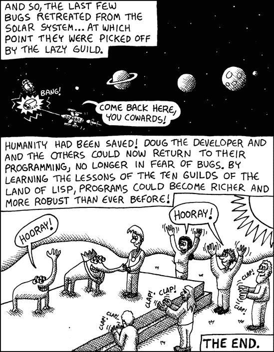
