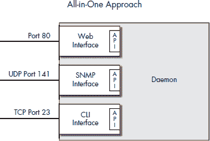
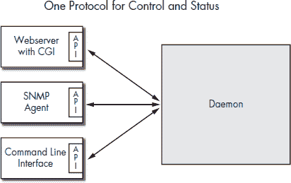
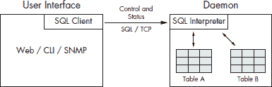

**管理守护进程**

在本质上，大多数设备都有一个应用程序或守护进程执行设备的定义功能，一个或多个用户界面管理核心应用程序或守护进程。图 2-1 显示了一种典型的设备架构，这可能已经与您对设备的想法相似。

正如定义应用程序是由用户界面（UI）管理一样，常见的服务，如网络服务器或系统日志，也需要进行管理。由于主要应用程序和大多数常见服务都是作为守护进程实现的，因此管理问题归结为管理守护进程的问题。本章的重点是如何最好地管理守护进程。

在本章中，我们将介绍以下内容：

• 管理守护进程的常见方法

• 控制和状态协议

*图 2-1：应用程序的典型用户界面*

**管理守护进程的常见方法**

通过*管理*守护进程，我们指的是配置守护进程，从它那里收集统计数据，并能够查看其当前状态。大多数 Linux 守护进程使用 ASCII 文本文件进行此类通信，但在构建您的守护进程时，您还有其他选项可以考虑。接下来的几节将描述各种守护进程管理方法及其优缺点。

***基于文件的管理***

守护进程通常通过几个配置文件进行管理或监控，这些文件控制它们的运行时参数、状态和日志。例如，DHCP 守护进程 dhcpd 由 /etc/dhcpd.conf 配置文件控制；其状态显示在 /var/state/dhcp/dhcpd.leases 中；其启动脚本在 /etc/rc.d/init.d/dhcpd 中；其日志在 /var/log/messages 中。然而，在守护进程的配置存储方式或其状态如何提供方面，几乎没有一致性。状态和其他状态变化通常使用 syslog() 进行记录，但许多应用程序使用自定义例程进行记录，并将它们的日志文件存储在非标准格式中。图 2-2 显示了使用文件进行配置和管理的守护进程的典型流程。

基于文件的方法对设备有以下局限性：

• 从大多数运行中的应用程序中获取状态或统计数据没有好方法。虽然应用程序可以将状态和统计数据写入文件，但在实时（或接近实时）这样做可能会对 CPU 和文件系统造成过重的负载。

您需要能够编辑配置文件，这在设备上并不总是容易的。

• 要应用新设置，通常必须重新启动正在运行的守护进程，这可能会中断服务并给用户带来问题。

*图 2-2：管理守护进程最常见的方式*

尽管基于文件的接口存在局限性，但许多应用程序使用它们进行 Unix 系统管理，并且它们可能会继续保持流行。如果您正在构建新的应用程序，并且您已经选择使用基于文件的程序管理，请考虑使用 libini 或 XML 解析库。此外，像 Webmin 这样的应用程序可以通过提供允许您显示和编辑许多配置文件的 Web 前端来提供帮助。

请记住，非常简单的应用程序（包括一些守护进程）可能永远不需要运行时访问状态、统计信息和配置。可能没有理由从传统的 Unix .conf 和 .log 文件方法切换。决定哪种方法最适合您的特定应用程序取决于您自己。

***基于守护进程的 Web 界面***

另一种常见的守护进程管理方法是直接从守护进程提供 Web 界面。例如，cupsd 是 CUPS 打印队列守护进程的守护进程，它在 TCP 端口 631 上提供自己的 Web 界面。这种方法适用于简单的守护进程，但它有两个问题：

• 您需要在您的守护进程中维护代码以支持许多不同浏览器中的 HTTP 实现。

• 当需要添加额外的接口时，这可能很困难。

以此为例，我们项目中需要运行时访问状态和配置，因此我们添加了一个内置的 Web 界面。多么糟糕的编码噩梦！似乎需要花费很长时间才能正确处理所有 HTTP 细节，并使生成的代码与所有主要网络浏览器兼容。如果您决定直接在您的守护进程中构建 Web 界面，请自己行个方便，使用 Hughes Technologies 的 libhttpd 这样的 HTTP 库。因为其他程序员，HTTP 专家，会不断更新有关各种浏览器怪癖的信息，您的维护工作将会容易得多。

这个相同的项目也突出了第二个问题。一旦 Web 界面开始工作，客户要求我们添加一个 SNMP 接口。最快的方法是将 SNMP 直接添加到守护进程中，就像我们添加 Web 界面一样。这次添加使我们走上了所谓的“一体化”方法的道路，这在下一节中将有描述。

***一体化方法***

如果您知道您的用户需要在守护进程运行时与之交互，并且您的运行守护进程需要超过一种类型的接口，您可能会倾向于直接将必要的接口添加到守护进程中。图 2-3 显示了一个不仅试图执行其实际任务，还试图支持多个、同时用户界面的守护进程。

*图 2-3：直接将所有用户界面添加到守护进程中*

我们在早期设计中使用了一种类似的捆绑方法，但我们发现它带来了很多问题。因为一次只能有少数开发者对设备进行操作，所以开发变成了串行，开发者必须同时编写主守护进程和所有用户界面。UI 和守护进程之间的紧密耦合使得隔离代码的一个部分变得更加困难。我们担心即使是简单的用户界面更改也可能有副作用，因此我们要求每次更改都要等待主要发布版本的全面回归测试。整个开发和发布周期变得非常缓慢。

全面方法的一个问题是性能。如果所有用户界面都直接从守护进程运行，守护进程可能会将所有的 CPU 周期都花在一些可能并不重要的接口请求上，而忽略了它需要做的真正工作。

**控制和状态协议**

克服上述方法局限性的一个方法是通过控制和状态协议将守护进程与用户界面分离。图 2-4 展示了守护进程提供一个单一的应用程序编程接口（API），供所有客户端和用户界面使用。

*图 2-4：在守护进程和用户界面之间使用一个协议*

控制和状态协议相对于其他替代方案具有几个优点：

**减少多个用户界面的复杂性**

控制和状态协议简化了守护进程的用户界面逻辑，因为守护进程只需要实现该协议。用户界面可以使用适合该界面的语言和工具独立实现。例如，可以使用 Apache 和 PHP 构建 Web 界面，而 SNMP 界面则可以使用 Net-SNMP 和 C 语言构建。

**在守护进程运行时访问它**

用户希望在应用程序运行时能够访问它，以便获取状态、统计信息和运行时调试信息。控制和状态协议可以使你的应用程序在启动时和 SIGHUP 信号时仅限于配置文件访问的应用程序中具有竞争优势。你可能已经注意到，Microsoft 用户不是通过编辑文件来配置守护进程的；他们通过守护进程本身来配置守护进程。因此，设计你的守护进程以这种方式进行配置可以使 Microsoft 用户更容易迁移到你的软件。

**远程网络访问**

远程访问可以加快开发和测试速度，因为你可以从几乎任何联网的工作站上对设备进行操作。对于管理大量设备的中枢运营管理中心，远程访问对你的客户非常有用。此外，你的技术支持人员也需要良好的远程访问来帮助诊断现场的问题。

**并行开发**

将管理用户界面与守护进程解耦意味着你可以让两个团队并行工作在项目上。人员配备更容易，因为你可以雇佣只需要开发项目特定部分所需技能的人。将用户界面开发者和守护进程开发者分开还有一个优点：它迫使你在开发早期就考虑并定义你的守护进程接口，那时进行更改最容易。

**简单的测试框架**

由于用户界面与守护进程分离，围绕每段代码构建测试框架是一个干净且简单的过程。一旦构建了框架，即使所有部件尚未就位，你也可以进行测试。

**增强安全性**

使用控制和状态协议为你的守护进程可以以两种方式提高你的设备的安全性。首先，用户界面不需要与守护进程运行相同的特殊权限，这意味着在任何给定时间运行的具有特殊权限的代码更少。其次，使用严格定义的协议让你能够专注于保护协议及其 API。这比保护，比如说，一个一体化的方法要容易得多。

控制和状态协议可以使用串行连接、Unix 或 TCP 套接字、文件读写，或者它可能隐藏在库调用中。这些技术将在本章后面进行描述。作为预览，考虑以下示例，它们设置了一个名为*cntl_pt*的单个位。

AT 命令 ATS301=1

XML <rpc><cntrl_pt><value>1</value></cntrl_pt></rpc>

库调用 ret = set_cntl_pt(1);

/proc echo 1 > /proc/sys/mydev/cntl_pt

SQL UPDATE my_table SET cntl_pt = 1

***控制和状态协议的要求***

如果你设计自己的控制和状态协议，你应该根据以下标准来评估你的设计：客户端和守护进程的数据模型，对现有协议和软件的重用，对客户端和守护进程施加的约束，以及你发现其系统的容易程度：

**数据模型**

控制和状态协议应允许客户端和守护进程具有相同的数据模型。也就是说，如果守护进程使用变量、结构、列表和数组，那么控制状态协议另一侧的客户端也应支持变量、结构、列表和数组。在协议的两端具有相同的数据模型可以更容易地重用代码，并帮助程序员保持对试图解决的问题的一致看法。

**使用现有标准和代码**

控制和状态协议应尽可能使用现有的软件和标准。你可能能够找到已经了解这些协议和软件的开发者，并且现有的协议和软件很可能为需要学习它们的开发者提供了良好的文档。使用现有代码几乎总是好主意，因为新代码越少，新错误就越少。

**对守护进程和客户端的限制很少**

理想情况下，协议应该对您设计守护进程的方式施加很少的限制，并且不会增加守护进程的大小。您应该能够通过在主要源文件中做很少的更改就将控制和状态协议添加到您的程序中。当将控制和状态协议添加到旧程序中时，您应该能够将大部分新代码放入单独的源文件中，而不是将更改交织到主要代码库中。您的协议客户端绑定应该对所有主要编程语言都可用：至少 Java 和 PHP 用于网络界面，以及 C 和 C++ 用于编译代码。

**发现机制**

我们希望在不依赖文档的情况下发现设备可用的信息。例如，ls 命令可以发现 Unix 文件系统中可用的文件；get-next 操作符可以发现 SNMP MIB 中的内容；数据库中的系统表描述了数据库本身。以类似的方式，我们希望有一个机制，用户可以通过它发现可以在设备上配置的内容以及设备可提供的信息。

***常见控制和状态协议***

在我们的工作中，我们开发了几个控制和状态协议，我们将在本节中描述它们。在阅读时，请尝试根据前一个章节中提出的四个标准来评估它们。

**AT 命令**

在我们的第一个控制和状态协议中，我们使用了 Hayes AT 命令集的变体。我们正在工作的设备是无线电调制解调器，因此我们的大多数客户已经熟悉该命令集，这使得它成为一个合理的选择。我们的守护进程监听传入的 TCP 连接，并为已接受的连接提供一个 AT 命令解释器。使用 TCP 给我们提供了远程访问以进行诊断和配置。

我们将系统配置存储为 AT 命令列表。在系统启动时，守护进程会读取配置文件并通过 AT 命令解释器运行它。这种方法意味着我们不需要为处理不同格式的配置文件添加代码。虽然 XML 和 INI 是存储配置的标准，但我们不想在不必要的情况下增加代码和复杂性。

AT 命令协议有两个限制。首先，我们无法方便地使用标准的 AT S-register 语法访问数据数组。其次，客户端程序员必须编写大量代码来生成 AT 命令并解析回复。

**可扩展标记语言**

我们在一个项目中使用了可扩展标记语言（XML）作为管理 Juniper 路由器的控制和状态格式。XML 协议的例子包括 XML-RPC、SOAP 和 JUNOScript。JUNOScript 通过 telnet 或 SSH 连接管理 Juniper 路由器。它允许你使用 XML 编码命令，然后路由器会以 XML 响应回复。例如，请求运行配置看起来像这样：

<rpc>

<get-configuration/>

</rpc>

在 JUNOScript 可用之前，Juniper 路由器通过命令行界面（CLI）进行配置。当使用程序而不是手动管理路由器时（尤其是当你必须编写该程序时），XML 相对于 CLI 的优势变得明显。解析 XML 响应的代码比解析 CLI 响应的代码更容易编写。XML 的其他优点包括其在表示丰富数据方面的灵活性以及处理 XML 格式的软件库的可用性。

在客户端和服务器之间交换 XML 数据需要添加传输协议。你可以使用 telnet 或 SSH，就像 JUNOScript 所做的那样，或者你可以使用 SOAP 和 XML-RPC 标准所指定的 HTTP。

通常，你会在服务器端使用库来解析 XML，然后将解析后的 XML 元素映射到服务器的内部数据结构中。将 XML 映射到内部数据结构的代码可能很复杂且容易出错，因为 XML 结构很少直接映射到守护进程中使用的数据模型。

如果你使用 XML 构建你的控制和状态协议，你应该考虑使用简单的 XML API（SAX）。SAX 使用事件驱动模型来处理 XML，它更适合控制和状态协议中发现的对话类型。

**库调用**

对于另一个项目，我们使用了流行的技术，通过将协议封装在 API 的子例程中来隐藏协议，从而避免开发者直接接触协议。在这种情况下，守护进程和客户端程序员在他们的代码中包含了共享对象库，并且都没有直接处理协议。对于开发者来说，API 中的库例程*变成了*协议。这种方法如此普遍，以至于许多程序员无法想象有其他替代方案。他们开始一个项目时，假设他们将构建一个守护进程和一个库，而守护进程的客户端必须包含该库才能与守护进程通信。

我们的建议是让其他程序员编写库，而你自己避免这样做。大多数说这个的理由归结为最小化你必须编写和维护的代码行数。在库 API 中隐藏协议并不能消除编写协议和库的需要。你仍然需要考虑使用哪种 IPC 以及在该 IPC 上使用哪种实际协议。可能最大的负担是编写和维护所有感兴趣编程语言的客户端库——那些可以编写 C 库并完成所有工作的日子已经过去了。你希望库在 Java 和 PHP 中可用，用于 Web 界面，以及在 Perl 和 shell 命令中用于脚本和测试。很少有公司拥有编写和记录这些库所需的所有专家，更少的公司有时间和资源在每次修订更改后正确维护和更新库。

我们尝试为我们的守护进程编写库，我们发现我们一直在重复造轮子。每个库，无论与之前的相似程度如何，都是为当前的守护进程编写的，因此我们必须为每个守护进程编写不同的库。虽然我们试图重用代码，但这个过程远远达不到理想状态。如果只有一个库（以及一个底层协议）我们可以用于所有守护进程，那该有多好。

对于嵌入式系统来说，每个守护进程有一个库尤其成问题，因为你可能不得不放弃大量的系统 RAM 来加载所有需要的库。

**结构化查询语言**

为了让所有守护进程只有一个控制和状态协议，我们尝试在 TCP 上使用结构化查询语言（SQL）文本命令，并将我们守护进程中的数据建模为数据库中的表。守护进程接受 TCP 连接并向客户端提供了一个 SQL 命令行解释器。此协议使我们能够在控制和状态协议中表示数组（和列表），从而解决了 AT 命令协议的一个限制。图 2-5 说明了基本思想。

*图 2-5：SQL 作为控制和状态协议*

例如，TCP 连接上的典型命令可能是以下字符串：

SELECT Column_A FROM Table_A

那时，命令解释器负责解析 SQL 字符串并访问适当的“表”。表用引号括起来，因为守护进程中的数据可以表示为任意数据结构，而将任意数据结构呈现为表格是 SQL 解释器的责任。

与 AT 控制和状态协议类似，我们的配置文件存储为包含 SQL 命令的文本文件；这消除了解析 XML 或 INI 文件的需要。

这种方法的最好部分是，守护进程中的数据已经以结构体的数组形式存储，因此对于程序员来说，转向“表”范式是极其容易的。这种协议的限制在于用户界面或客户端必须开发的代码量。因为该协议是基于文本的，我们必须编写客户端代码来格式化和发送请求以及解析响应。这些代码必须为特定客户端编写的每种编程语言重写。在我们的案例中，需要大量的努力，因为我们开发了 Windows C++客户端、Java 客户端、Mac OS 9 C 客户端和 Linux C 客户端。

**PostgreSQL**

我们最终的控制和状态协议克服了之前协议的限制。它在某种程度上类似于我们的 SQL 协议，因为它将守护程序的数据建模为数据库中的表，并在守护程序和客户端之间使用 TCP 或 Unix 套接字。区别在于，它使用的是 PostgreSQL 协议，而不是专有的基于文本的协议。使用 PostgreSQL 意味着我们可以使用 C、Java、PHP、bash 等客户端的 PostgreSQL 绑定。

将守护程序的内部数据结构作为数据库表提供出来的所有艰苦工作都由一个名为*运行时访问（RTA）*的库来处理。我们将我们的守护程序与 RTA 库链接，在守护程序告诉 RTA 关于我们的表之后，它将它们作为 PostgreSQL 数据库表提供出来。

虽然 RTA 使用 PostgreSQL 作为控制和状态协议，但它**不是**一个数据库。相反，它使用 PostgreSQL 协议的一个子集和客户端绑定，作为在运行中的守护程序中读取和写入内存变量的手段。

PostgreSQL 和 RTA 作为控制和状态协议具有几个优势。如前所述，已经有一些 PostgreSQL 绑定在各种语言中可用，包括 C、C++、Java、Perl、Tcl 和 Python。这些绑定的可用性意味着您在 UI 或客户端上的开发代码将更少，因此您在编写 UI 客户端时受到的限制更少。PostgreSQL 具有宽松的许可证，并且文档非常完善，RTA 的系统表可以用作浏览提供给 UI 程序的数据的方式。

通过使用 Unix 套接字并仔细设置所有权和读写权限，可以提高安全性。使用 SELinux 和 Linux 安全模块，可以对连接到守护程序上的 RTA 的程序进行更精确的控制。考虑使用 Stunnel 或 SSH 与端口转发来实现安全的远程访问。

虽然 XML 很流行，但 RTA 和 PostgreSQL 相对于它有一些优势。PostgreSQL 提供了一种数据交换格式和传输协议。使用 RTA，您不需要将代码序列化以将 XML 的树结构映射到守护程序的内部数据结构，因此 RTA 方法比基于 XML 的方法需要更少的开发。使用 RTA，客户端可以直接查看守护程序的内部内存变量，并且这种功能不需要额外的开发。

RTA 将在下一章中更详细地介绍，但一个简单的示例可以展示 RTA 从 UI 客户端的角度是如何工作的。假设守护程序有一个以下结构的数组：

在向 RTA 告知数组（使用 rta_add_table()）之后，您可以使用任何启用了 PostgreSQL 的客户端来读取和写入数组中的数据。如果您使用 psql，一个 PostgreSQL 外壳程序，您可以使用以下 SELECT 命令读取区域表：

此示例展示了从运行中的守护程序读取变量的简单方法。

RTA 有一些缺点。其中之一是 RTA 库是用 C 语言编写的，这意味着如果你的服务器进程是用另一种语言编写的——比如说 Java，你就无法使用 RTA。另一个缺点是，如果你的设备由多个守护进程组成，你需要开发一个管理过程来管理这些守护进程，同时只向客户端暴露一个*单一*的管理点。公平地说，这个最后一个缺点适用于所有控制和状态协议。

**摘要**

在本章中，我们讨论了管理守护进程的各种方法。简单的守护进程可以使用文件进行所有管理，但我们认为对于具有多个用户界面的 Linux 设备，控制和状态协议是最好的。我们描述了使用控制和状态协议的原因，并提出了如果你决定自己构建时需要遵循的一些指南。

在下一章中，我们将向您展示如何将 RTA 集成到守护进程中，以便客户端可以访问守护进程的状态、配置和统计信息。

本书余下的所有示例都使用 PostgreSQL 和 RTA 库作为守护进程和用户界面之间的管理协议。尽管如此，如果你选择不使用 RTA，也无需担心。本书更多地关注设备*设计*，而不是使用特定的库。
