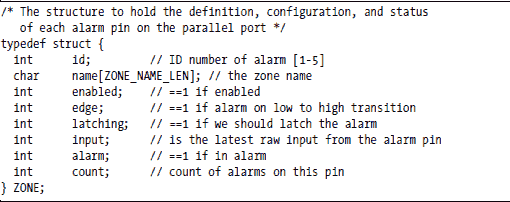
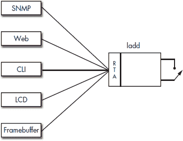
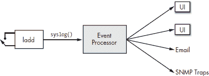
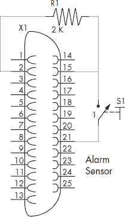
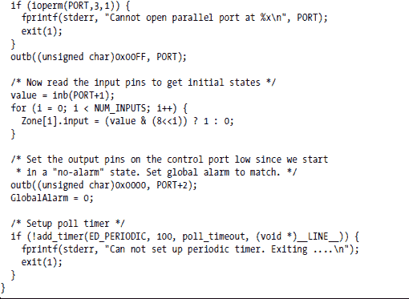
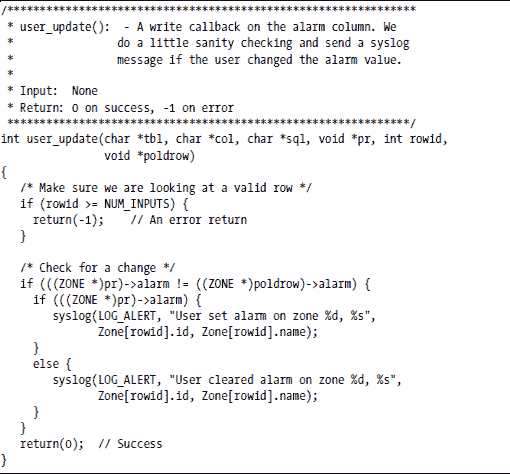

**LADDIE 报警系统：一个示例设备**

前几章介绍了如何构建和确保守护进程，以及如何在守护进程运行时与其通信。我们将通过构建*Laddie*，一个基于 Linux 的报警系统，将这些主题结合起来。¹

Laddie 使用标准 PC 并行端口上的五个状态输入作为报警系统的传感器输入。Laddie 设备的核心是*ladd*（发音为*lad-dee*）守护进程，它轮询状态线并使用 syslog()报告输入转换。由于大多数读者对报警系统都有一定的了解，并且报警系统应用程序易于编写、理解和修改，因此报警系统是一个很好的示例应用程序。

本章包括以下五个部分：

+   报警系统简介

+   Laddie 的功能规范

+   Laddie 硬件设计

+   Laddie 软件设计

+   构建 和 测试 Laddie

在阅读本章时，请记住，报警系统本身并不像构建它的技术那样重要。不要让实现细节掩盖了正在教授的设计原则。

**报警系统简介**

本节介绍了用于描述通用报警系统和 Laddie 特定概念的术语和定义。

***传感器***

报警*传感器*是一个小型设备或开关，用于检测房间内的运动或区域内的活动。报警系统监控多个报警传感器，并报告它们检测到的任何意外活动。传感器保护的区域称为*区域*。区域被赋予*名称*，通常描述受保护的区域；典型的区域名称可能包括*车库、二楼窗户*和*冰箱*。

图 5-1 展示了小型企业中传感器和区域的一个示例配置。前门和后门上都有门传感器，还有一个检测办公室和储藏室附近运动的运动探测器。

*图 5-1：一个示例报警系统*

**传感器类型**

由于报警系统只能报告其传感器检测到的内容，因此选择传感器非常重要。让我们考虑可用的传感器类型。

**磁簧开关**

这些通常用于监控门；它们被放置在门框上带有开关，门上带有磁铁。

**PIR 运动探测器**

*被动红外（PIR）*运动探测器检测红外（热量）源运动的微小变化。人或动物可以触发 PIR 运动探测器，但例如，棒球不能。

**声学传感器**

声学传感器检测特定的声音。它们通常用于检测破碎玻璃的声音，并且非常敏感，以至于单个声学传感器可以保护房间内所有的窗户。

**地板垫传感器**

地毯传感器具有可以检测人体重量的开关。它们非常薄，通常放置在入口处的地毯下。

**振动传感器**

振动传感器可以检测非常微小的物理运动。它们通常用于保护汽车。

**烟雾和一氧化碳探测器**

这些传感器用于检测潜在的火灾。

**温度传感器**

温度控制器和其他温度传感器在达到一定温度时触发，或者简单地报告区域内的当前温度。它们通常用于保护对温度敏感的设备和供应。

**传感器接触类型**

对于报警系统来说，大多数传感器看起来像开关。开关触点在没有报警时可以是开路（称为*常开*或*NO*传感器），或者在没有报警时是闭路（称为*常闭*或*NC*传感器）。当你安装传感器时，你必须告诉报警系统传感器的*接触类型*——也就是说，触点是否是常开或常闭。大多数传感器是常闭的。常闭传感器具有在传感器线被切断时触发报警的优良特性。

传感器和区域设置的另一个有用功能是，只要级联的传感器都是同一接触类型，就可以在区域内级联传感器。图 5-2 展示了如何级联常开传感器，图 5-3 展示了如何级联常闭传感器。

*图 5-2：如何级联常开传感器*

*图 5-3：如何级联常闭传感器*

从逻辑上讲，报警系统在每个区域内只看到一个传感器，即使实际上那里有几个级联的传感器。

**保持传感器状态**

大多数传感器在检测到的条件被移除时（例如，有人关闭门或从地毯上走开）会返回非报警或正常状态。你通常希望配置报警系统以保持这些传感器检测到的报警。*保持状态*的报警即使在检测到的条件被移除后也会保持报警状态，直到由用户手动清除。

然而，你可能不希望每个传感器都保持状态。例如，你可能希望在恒温器保护的房间温度恢复正常时自动移除报警。

当你在区域内设置报警时，考虑你使用的传感器类型和具体需求，以确定报警是保持状态还是非保持状态。

**启用区域**

如果区域内的传感器正在工作并且你想监控该区域，请将区域标记为*启用*。未使用的输入可以通过禁用区域来忽略。此外，当你想暂时关闭门或窗户时，你可能发现禁用区域很方便。

**Laddie 的功能规范**

Laddie 警报系统最多监控五个区域，当监控区域之一发生变更时，会触发警报。警报报告给 Laddie 的五个不同用户界面。除了能够查看 Laddie 监控的区域状态外，用户界面还允许您测试和清除警报、查看日志以及配置区域。配置参数包括以下内容：

+   区域名称

+   接触类型

+   锁定或非锁定

+   启用或禁用

Laddie 的功能规范分为两部分：一部分允许用户访问警报配置和状态，另一部分允许 Laddie 处理警报。

**注意**

*提醒一下，* Laddie *指的是整个设备，而* ladd *仅指监视并行端口上五个输入引脚的守护进程。由于它们的发音相同，很容易混淆这两个词。*

***ladd 的配置和状态***

ladd 有一个配置和状态表，称为*Zone*，作为 RTA 表对所有用户界面可见。Zone 表有五行，每行由以下数据结构定义：

让我们逐一考虑这些字段。

**id（配置）**

区域由一个介于一到五之间的数字标识。id 字段在 ladd 启动时初始化，用户无法编辑它。您可以在用户界面程序中使用 id 字段来唯一标识特定区域。

**name（配置）**

此字段存储用户分配给区域的简短助记符或名称。

**enabled（配置）**

只有标记为*启用*的区域才会使系统进入警报状态。标记为*禁用*的区域不会生成日志消息或导致警报状态。由于 RTA 不支持布尔数据类型，此字段包含一个整数而不是布尔值。

**边缘（配置）**

对于下一节中描述的硬件，一个常闭传感器在输入引脚的零到一电平跳变上触发警报。Laddie 上的常开传感器在一到零电平跳变上触发警报。“第 68 页的 Laddie 硬件设计”更详细地描述了开和闭传感器。

**latching（配置）**

用户将此字段设置为 1，即使传感器引脚返回到正常状态，警报也会持续存在。用户必须手动清除锁定的警报。

**input（状态）**

此字段显示输入引脚的最新原始值。这是一个状态字段，用户无法编辑它。

**alarm（状态）**

每个区域要么处于*警报*状态，要么处于*安全*状态。此字段由 ladd 守护进程根据检测到的输入引脚上的跳变设置。用户可以通过将此字段写入 1 来测试区域。当用户将此字段设置为 0 时，警报被清除。

**count（状态）**

此字段包含导致警报的输入边沿的数量。仅在区域标记为 *启用* 时，此字段才会递增；用户对区域进行的测试不会递增。这是一个只读的统计字段，当 ladd 启动时设置为零。

你可能还记得，RTA 的优势在于它为所有用户界面提供了相同的 API 来配置、状态和统计信息。RTA 定义的 API 是 PostgreSQL 数据库。PostgreSQL 的优势在于 SQL 被广泛使用和理解，并且有大量的 PostgreSQL 绑定，包括 C、PHP、Java 和 Perl。图 5-4 展示了 Laddie 如何使用 RTA 允许五个不同的用户界面使用单个守护进程协议获取状态和设置配置。

*图 5-4：一个守护进程与多个用户界面*

让我们看看一些典型的 Laddie 配置更改和查询的 SQL。

要禁用区域 2，请输入：

UPDATE Zone SET enabled = 0 WHERE id = 2

要找出区域 4 进入警报的次数，请输入：

SELECT count FROM Zone WHERE id = 4

要清除系统中的所有警报，请输入：

UPDATE Zone SET alarm = 0

任何可以发出这些命令的程序都可以作为 Laddie 的用户界面。在本书后面的内容中，我们将通过五个当前可用的 Laddie 用户界面来关注这些命令。

***ladd 的警报处理***

ladd 通过使用 syslog() 发送日志消息来响应警报。日志消息的文本取决于警报是由硬件检测到的还是由用户发出的测试警报。文本还取决于警报是设置还是清除。对于 ID 为 *n* 且名称为 *zone_name* 的区域，四个日志消息如下：

+   在区域 *n, 区域名称* 上设置警报

+   区域 *n, 区域名称* 上的警报已清除

+   用户在区域 *n, 区域名称* 上设置警报

+   用户已清除区域 *n, 区域名称* 的警报

一些用户不关心 *哪个* 区域处于警报状态；他们只想知道是否有 *任何* 区域处于警报状态。为了满足这一需求，ladd 提供了另外两个日志消息：

+   警报系统状态：警报

+   警报系统状态：安全

这些消息在第一个区域进入警报和最后一个区域清除后发送。Laddie 还将并行端口上的所有四个控制引脚设置为 1（见表 5-1），以指示系统中的任何警报。当所有警报清除时，它将控制引脚设置为低。

我们为 Laddie 的整体架构提供的一个优点是，ladd 本身不需要向 UI 发送信号、发送电子邮件或发送 SNMP 陷阱。我们将所有这些留给一个单独的过程，极大地简化了 ladd 守护进程的设计和实现。（事件处理器将在下一章中描述。）Syslog-as-output 不仅简化了 ladd，还使调试和测试更容易，因为我们可以轻松地检查我们期望的消息的日志文件，并且我们可以使用 logger 命令为事件处理器生成测试事件。警报响应的数据流在图 5-5 中表示。

*图 5-5：在 Laddie 中处理报警事件*

**Laddie 的硬件设计**

本节介绍了使用 Laddie 作为实际报警系统所需的硬件。如果您不熟悉电子电路或对硬件的工作原理不感兴趣，可以跳过本节。

并行端口上的引脚分为三个主要组：数据线、控制线和状态线。每个组都使用一个寄存器进行控制，该寄存器在特定的 I/O 地址上可用。数据线位于并行端口的基址，状态线位于基址加一，控制线位于基址加二。表 5-1 显示了 25 针并行端口连接器上的引脚与打印机端口名称、端口寄存器和报警系统之间的关系。

**表 5-1：Laddie 对 PC 并行端口的利用**

报警守护进程使用数据线作为输出，状态线作为输入。图 5-6 显示了一个报警传感器的电路图。守护进程通过将输出引脚设置为 0xFF，使引脚 2 处于高电平来初始化并行端口。当传感器 S1 打开时，没有电流通过 2K 欧姆电阻 R1，引脚 15 的电压被拉高。当传感器关闭时，引脚 15 通过引脚 21 短路到地。

换句话说，当报警传感器打开时，引脚 15 被偏置为高电平，当传感器关闭时被拉低。通过读取包括引脚 15 在内的状态线，守护进程可以检测传感器是打开还是关闭。此描述适用于并行端口上的所有五个状态输入。

*图 5-6：Laddie 的正常开路报警传感器*

**Laddie 的软件设计**

我们使用第四章中介绍的空守护进程构建了 ladd 守护进程。但无论我们使用空守护进程、编写基于 select()的程序，还是编写基于线程的程序，都会有三个主要子例程：

**appInit()** 初始化硬件。启动定时器。将 Zone 表注册到 RTA。

**poll_timeout()** 读取状态线。记录相关更改。

**user_update()** 向报警状态发送用户更改的日志。

这些例程将在接下来的几节中详细描述。

***appInit()回调子例程***

appInit()子例程是空守护进程调用的第一个回调子例程。此回调子例程负责执行任何应用程序特定的初始化，设置任何定时器回调子例程，并注册任何 RTA 表。在 ladd 中，appInit()子例程初始化 ZONE 结构的 Zone 数组，调用 rta_add_table()将 Zone 表注册到 RTA，初始化并行端口，并使用 poll_timeout()作为其回调子例程启动一个周期为 100 毫秒的定时器。请注意，一旦 appInit()子例程返回，守护进程就准备好接受用户界面的连接。

虽然没有显示 Zone 数组的 COLDEFs 或 TBLDEF，但表 5-2 应该能让你了解它们包含的内容。

**表 5-2:** Laddie 区域表的列

ladd 的所有初始化代码都在下面的 appInit() 例程中。

***poll_timeout() 回调子例程***

poll_timeout() 子例程执行警报守护进程的大部分功能。此子例程读取并行端口，处理输入引脚，并修改适当的 ZONE 数据结构的状态。此子例程每 100 毫秒被调用一次，如 add_timer() 调用所指定。注意 poll_timeout() 子例程的以下显著特征。

+   poll_timeout() 的主要责任是设置 Zone 表中每个区域的警报字段。如上所述，警报字段显示特定区域是否处于警报状态。

+   该子例程独立于其他区域处理每个区域。也就是说，一个区域可以处于警报状态，而另一个区域处于安全状态。

+   只有当启用字段非零时，才会修改特定区域的警报字段。此功能允许用户在没有任何传感器或用户希望忽略传感器的情况下禁用区域。

+   当 poll_timeout() 检测到区域进入警报状态时，它将警报字段设置为 1 并发送一个 syslog 消息。在后面的章节中，我们将向您展示如何将 syslog 消息转换为电子邮件和 SNMP 陷阱。

+   类似地，当此子例程检测到输入引脚返回到正常状态时，它清除警报变量，如果滞后字段设置为 0，则发送一个 syslog 消息。这种机制允许用户配置区域，一旦进入警报状态，就必须手动清除。

+   poll_alarm() 子例程还维护一个全局警报变量 GlobalAlarm，如果任何区域处于警报状态，则将其设置为 1，如果所有区域都安全，则将其设置为 0。该子例程跟踪 GlobalAlarm 变量状态的变化。当 GlobalAlarm 变量被设置时，并行端口的控制引脚被设置为高电平。当 GlobalAlarm 变量状态改变时，则发送一个适当的 syslog 消息。

所有新的警报轮询都在下面的 poll_timeout() 例程中完成。

***用户更新() 回调子例程***

当用户手动修改 ZONE 数据结构中的警报字段时，将调用 user_update() 回调子例程。此回调子例程负责在用户手动清除（对于滞后区域）或手动设置警报状态时发送一个 syslog 消息。在第七章中，我们将向您展示如何使用 syslog 消息更新用户界面。

这个回调子例程包含在我们的警报守护进程的 RTA COLDEF 结构中。看看下面的源代码片段，你会看到 user_update 子例程包含在写入回调条目中。每当用户在区域数据结构中写入警报变量时，user_update 子例程就会被调用。

下面的 user_update()子例程检查是否有用户设置了警报变量并导致其改变。如果警报变量已更改，user_update()子例程将写入 syslog 消息。

在最后两个部分中，我们向您展示了警报守护进程的源代码，并解释了源代码是如何工作的。您注意到实现警报守护进程有多容易吗？下一节将向您展示如何构建和测试警报守护进程。

**构建和测试 ladd**

你不需要安装一套完整的警报传感器来运行这个守护进程——你只需要一个带有并行端口的普通 PC。在运行守护进程之前，你必须创建目录/opt/laddie/ladd/，因为警报守护进程会在这个目录中创建一个 PID 文件。使用以下命令以 root 用户创建此目录：

mkdir /opt/laddie/ladd

ladd 的源代码位于配套 CD 上的/Code/src/ladd 目录中。编译警报守护进程，然后以 root 用户身份运行守护进程，如下所示：

cd /Code/src/ladd

make

su

./ladd

为了确保警报守护进程正在运行并响应用户请求，调用以下 psql SQL 命令，并验证区域表是否显示。

通常，你会在警报设备上添加硬件传感器，但你也可以在没有硬件传感器的情况下模拟警报。

考虑区域 1。我们的方法是使用以下命令调用警报写入回调：

UPDATE Zone SET name = "BackDoor", enabled=1, edge=0, WHERE id=1;

接下来，我们将使用以下命令在区域 1 的输入上模拟警报：

UPDATE Zone SET alarm=1 WHERE id=1;

验证 ladd 是否生成了一个日志消息，表明*用户在区域 1 上设置了警报*。然后手动清除警报，如下所示：

UPDATE Zone SET alarm=0 WHERE id=1;

再次验证 ladd 是否为 syslog 生成了消息。我们将在未来的章节中向您展示如何构建更易于访问的警报守护进程用户界面。

**总结**

本章通过向您展示如何使用 RTA 和空守护进程构建简单的警报守护进程 ladd，将前几章的内容串联起来。您看到了 ladd 的 RTA 表的设计，这是用户界面管理警报守护进程的控制点。您还看到了警报守护进程的源代码，包括空守护进程用来实现警报守护进程运行时行为的三个子例程。最后，您还看到了如何配置警报守护进程，以及如何从命令行手动设置和清除警报。

下一章将继续发展 Laddie 的设计，通过向您展示如何处理设备上的事件，包括例如 ladd 向 syslog 发送消息的事件。

__________________

¹ Laddie 是一种示例设备，用于说明本书中介绍的技术和软件。Laddie **并非**一种商业可行的报警系统，并且绝不应该用来替代真正的报警系统。
