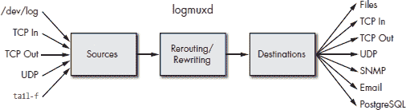
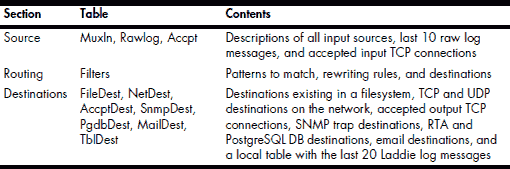
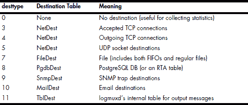
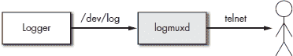
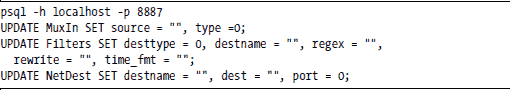
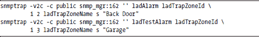
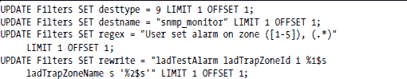
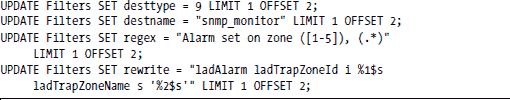

**LADDIE 事件处理**

当警报或其他关键事件发生时，你的设备需要做出响应。无论是 CPU 温度、电池水平、磁盘空间不足还是纸张水平，都会发生需要设备采取行动的情况。

拥有一个通用事件处理系统的想法，在 Linux 中出人意料地并不常见。通常，事件处理的需求直到设备系统测试接近尾声时才变得明显，因此它通常被视为一个事后考虑——使用临时和整合不良的代码。

作者构建了足够的 Linux 设备，知道我们应该将事件处理集成到 Laddie 设计的核心中。作为 Laddie 项目的一部分，我们构建了自己的事件处理系统，该系统使用日志记录来捕获感兴趣的事件。我们的事件处理守护进程称为 logmuxd，本章解释了为什么我们构建它，描述了其特性，展示了其主要表格，并给出了其使用的完整示例。即使你选择不使用 logmuxd，本章也可能有价值，因为它展示了任何事件感知设备所需的处理类型。

本章讨论了在日志记录背景下的事件处理，但请记住，目标是事件处理，而日志记录只是达到该目标的一种机制。

我们将本章组织成以下部分：

+   新事件处理系统的原因

+   logmuxd 的功能和特性

+   配置 logmuxd

+   使用 logmuxd 的示例

**新事件处理系统的原因**

我们发现，我们唯一按时且无错误交付的代码是我们没有编写的代码。也就是说，我们最成功的项目是我们能够最大限度地避免编写新代码的项目。新代码总是有错误的，新代码总是延迟的。那么，我们为什么决定编写一个用于事件处理的日志守护进程呢？答案实际上有两个部分：为什么我们选择使用日志作为机制，以及为什么我们选择不使用现有的日志系统。

第六章解释了为什么我们认为日志是事件报告的正确机制。对我们感兴趣的所有事件都已由 syslog 消息捕获，或者可以轻松地被捕获。几乎每种编程语言都有 syslog 库，syslog 被广泛理解，相当安全，并且 CPU 和内存效率都很高。

在事件处理方面，D-Bus（一个常用于分发桌面事件的开源软件包）排在 syslog 之后，是一个远程的第二选择。D-Bus 提供了库和 API，允许进程交换消息，前提是两个进程都支持 D-Bus。（正因为如此，使用 syslog 的旧应用程序必须重写以添加 D-Bus 支持。）然而，D-Bus 并不提供与 syslog 相同范围的语言支持，并且 D-Bus 通常需要两个运行中的守护进程，这使得它相对于 syslog 来说在 RAM 和 CPU 使用上更为密集。

**注意**

*D-Bus 在大多数 Linux 桌面上是标准配置，但在大多数 Linux 设备上处理事件可能不太合适。*

如果 syslog 是事件报告机制，那么为什么不使用 syslog 守护进程来处理事件呢？我们发现目前可用的日志系统缺少的主要功能是轻松复制日志消息并在接受的 TCP 连接上广播它们。

Laddie 警报系统需要将 Laddie 警报消息路由到多个正在运行的程序和用户界面。图 7-1 展示了一个典型情况。当发生警报时，ladd 发送一个日志消息来报告事件。我们需要将生成的日志消息的副本发送到每个启用了日志记录的 CLI 和每个查看系统状态的网页。问题是我们在事先不知道有多少个这样的接口是打开的。

我们的新日志守护进程 logmuxd 通过允许我们将消息路由到多个目的地来解决此问题，即使这些目的地是临时的。没有其他日志系统支持多个临时的目的地。当 ladd 检测到警报时，它使用 syslog() 发送日志；然后 logmuxd 捕获事件，如果需要则重写它，并将其多路复用到每个接受的 TCP 连接。

*图 7-1：需要多路复用日志守护进程*

我们决定投入时间构建一个新的日志系统用于事件处理，因为我们希望能够捕获、重写和路由来自设备上所有应用程序和守护进程的事件报告。作为一个设备设计师，您可能会发现您的设备需要从许多来源捕获事件报告并将消息路由到多个目的地。如果是这样，您应该考虑在您的设备中使用 logmuxd。

**logmuxd 的功能和特性**

我们希望 logmuxd 能够与现有的 syslogd 安装一起工作，或者作为它的替代品。也就是说，我们需要能够以整数周围的角度括号风格读取和写入消息。我们希望我们的日志守护进程能够支持许多类型的输入和许多类型的输出，能够根据正则表达式进行路由，并且能够在将其转发到目的地之前重写日志消息。

每个目的地都有自己的路由和重写规则集。这类似于 syslogd，这意味着您可能有其他完全相同的过滤器，每个过滤器的输出都发送到不同的目的地。

过滤器使用 regex() 库进行模式匹配和从日志消息中提取相关字段。消息可以选择使用从正则表达式模式中提取的字段进行重写。

图 7-2 展示了 logmuxd 的整体架构。在下一节中，我们将讨论此图中每个块。

*图 7-2：logmuxd 的架构*

如果我们从一个根据图 7-2 中显示的三个处理块分组其配置表的 logmuxd 配置表列表开始，可能会更容易理解 logmuxd 的使用。表 7-1 并没有详细描述所有表，因此您可能想使用 RTA 表编辑器更仔细地检查它们。

**表 7-1:** 根据处理块分组的配置表

logmuxd 有几个限制。它没有任何洪水过滤（例如，syslog 的“最后一条消息重复了 10 亿次”）。它使用正则表达式，这给它带来了很多功能和灵活性，但代价是 CPU 周期。最后，它是一个相对较新的日志守护进程，并且在某种程度上仍在变化，因为新功能被添加，以及发现和修复了错误。

您可以通过将 syslogd 与 logmuxd 配对来克服 logmuxd 的大部分限制。配置 syslogd 将所有消息输出到 FIFO，并配置 logmuxd 从 FIFO 读取，并仅过滤和重写您想要捕获以进行进一步处理的少量消息。

**配置 logmuxd**

RTA 表存储 logmuxd 的配置和统计信息。以下讨论了这些表，下一节的示例给出了使用它们的 SQL 语句。

***logmuxd 源***

您可以通过在 logmuxd 的 MuxIn 表中的四个可编辑字段中描述它们来告诉 logmuxd 关于您的事件源。这些字段是源、端口、类型和术语。

*源*字段包含如果源是文件、管道或 Unix 套接字，则为文件名；如果源是 UDP 或 TCP 套接字，则为 IP 地址。

*端口*字段包含 UDP 和 TCP 套接字的端口号，对于来自文件系统的源则忽略。

*类型*字段指定了源可能的六种类型之一。表 7-2 描述了这六种源类型。

**表 7-2:** 六种可能的源类型

*术语*字段指定了源如何终止日志消息。零表示日志消息以空字符终止。syslog 的消息使用空字符终止。一表示每次从源读取()将接收到一个完整的消息。这种终止方式用于 UDP 套接字等。二表示换行符终止消息。换行符终止用于类似 tail -f 类型的源。

MuxIn 表也包含只读字段，用于存储使用统计信息、错误统计信息和源文件的文件描述符。有关这些字段的更多信息，请使用 RTA 表编辑器在运行的 Laddie 设备上检查它们。

与消息输入处理相关的其他两个 logmuxd 表。Rawlog 表充当 FIFO，用于保存最近的 10 条消息。这在调试过滤器或监控记录器的原始输入时很有用。Accpt 表保存由接受的 TCP 连接和打开的 Unix 套接字所需的数据文件描述符和其他信息。Rawlog 和 Accpt 中都没有可配置的字段。

***logmuxd 过滤器和重写功能***

使用 logmuxd 的主要理由之一是它可以重写消息并将它们转发到另一个进程。例如，当用户在区域中设置测试警报时，ladd 会发送日志消息“用户在区域 *n, 区域名称”*（其中 *n* 和 *zone_name* 分别被区域编号和用户指定的名称替换）。我们希望这条日志消息出现在前面板的 LCD 显示屏上，但 LCD 显示屏只能显示 16 个字符，因此我们使用 logmuxd 的重写功能将消息重写以适应 LCD 显示屏。原始消息的重写如下：

Aug 12 22:28:31 ladd[3820]: 用户在区域 5 设置了警报，冰箱

到如下：

22:28 用户设置 5

识别和重写日志消息的所有配置数据都包含在 Filters 表中。此表包含目标类型和名称、匹配的正则表达式以及重写消息的 snprintf() 格式字符串。让我们依次查看这些字段。

用于指定目标的有两个字段：*desttype* 和 *destname*。每种目标类型都有一个单独的表。这是必要的，因为例如，电子邮件目标需要与 SNMP 钩子目标不同的配置信息。目标类型及其目标表由 desttype 字段设置。有九种有效的目标类型。类型 1 和 2 不包含在表 7-3 中，因为它们是严格的目标类型。

**表 7-3：九种有效的目标类型**

每个目标表中可以描述几个不同的目标。每个目标在其目标表中的一个唯一名称（destname）。例如，如果您有两个不同的 SNMP 目标，您可能将其中一个称为 *allsnmp*，另一个称为 *laddiesnmp*。通过给它们不同的名称，您可以定义不同的路由和重写规则。要将 Filters 表中的过滤器链接到特定目标，您需要指定目标类型和目标名称。

Logmuxd 根据消息的设施、日志级别和文本模式匹配来路由消息。Filters 表中的这三个对应字段是 *facility*、*level* 和 *regex*。设施和日志级别与为 syslogd 定义的相同。regex 模式是一个用于模式匹配和子模式提取的正则表达式。

正则表达式库是进行模式匹配和提取的好选择，因为模式可以预先编译以提高模式匹配的速度，并且正则表达式让你能够轻松地从搜索模式中提取子模式。在我们使用 logmuxd 的过程中，我们发现我们实际上并不需要了解太多的正则表达式模式。以下示例说明了你需要了解的大部分内容。

假设你正在处理火车到达车站的事件，并且日志消息是*从 San Jose 开来的火车到达轨道编号 15*。要将此消息重写为*San Jose : 15*，你需要提取城市和轨道编号。捕获城市的正则表达式模式是*[A-Za-z -]+*。这个模式匹配至少一个大小写字母、一个空格或一个连字符的任意组合。轨道编号的模式只是*[0-9]+*。这里有个技巧：如果你在一个模式周围加上括号，正则表达式会使得该模式在正则表达式输出中作为单独的部分可用。以下是一个匹配消息并提取城市和火车编号的正则表达式模式。

Train from ([A-Za-z -]+) arriving on Track number ([0-9]+)

过滤表中的*重写*字段包含用于重写日志消息的 snprintf()格式字符串。格式字符串包含你选择的文本，并且可以包含从正则表达式模式中提取的字符串。正则表达式模式的匹配结果可以作为 snprintf()的显式参数使用。表 7-4 列出了可用的参数。

**表 7-4:** 可用于 snprintf()的参数

继续上面的例子，你可以使用重写格式字符串*%1$s : %2$s*来获取消息*San Jose : 15*。

你可以通过在重写字符串中包含*%11$s*来向重写消息中添加日期和时间。日期和时间的格式由*time_fmt*字段设置，该字段传递给 strftime()进行转换。time_fmt 的常见示例包括*%F %T*，它给出日期和时间的显示为*YYYY-MM-DD hh:mm:ss*，以及*%R*，它只显示时间为*hh:mm*。

新行的显式参数很方便，因为将换行符放入 RTA 表中可能很困难。记住，对于 PostgreSQL 来说，\n 是一个由反斜杠和字母*n*组成的两个字符字符串。

我们将在第 98 页的“使用 logmuxd 的示例”部分展示更多正则表达式模式匹配和消息重写的例子。

***logmuxd 目标地址***

每种类型的目标都有一个表来存储该类型独有的参数。你可以通过使用 RTA 表编辑器浏览它们来轻松地了解大多数表及其内容，但有三张目标表需要一些额外的说明。

*MailDest* 表格有一个包含要发送的电子邮件消息主题的 *subject* 字段。*to_list* 字段是分隔的收件人列表。出于安全原因，to_list 中只允许使用字母数字、点、下划线、at 符号（@）和空格。如果您打算使用电子邮件作为目标，请确保在您的设备上运行 Sendmail、Postfix 或其他邮件传输代理。

*SnmpDest* 表格包含目标名称、SNMP 陷阱守护进程的 IP 地址、SNMP 守护进程的社区字符串、端口号以及要发送的陷阱类型（版本 2 陷阱或版本 2 通知）。这些字段中的值作为参数传递给 snmptrap 命令，该命令实际上发送陷阱。

*TblDest* 表格包含 20 条日志消息，最新消息始终位于表格顶部。在 Laddie 中，我们使用此表格来存储我们向最终用户显示的日志消息。

**使用 logmuxd 的示例**

让我们通过几个示例来帮助阐明如何使用 logmuxd。

***示例 1：logmuxd 演示***

在前面的章节中，您可以看到 Laddie 警报系统的一个优点是，当发生警报时，所有用户界面都会更新以反映新的警报和新的系统状态。本演示展示了如何查看分发到所有用户界面的日志消息。

1.  启动 Laddie CD。系统启动后，请验证您是否可以在另一台 PC 的网页浏览器中看到 Laddie 的网页界面。

1.  在 Laddie 上，logmuxd 被配置为将警报系统事件广播到所有接受的 TCP 连接的 4444 端口。打开一个终端窗口并 telnet 到 Laddie PC 上的 4444 端口。例如：

    telnet 192.168.1.11 4444

1.  使用网页界面测试几个区域，然后清除所有警报。您的 telnet 会话应显示类似于以下日志消息。

    2007-10-07 12:03:35 用户在区域 2，后门设置了警报。

    2007-10-07 12:03:35

    警报系统状态：警报 2007-10-07 12:03:37

    用户在区域 3，车库设置了警报。

    2007-10-07 12:03:38 用户在区域 2，后门清除了警报。

    2007-10-07 12:03:40 用户在区域 3，车库清除了警报。

    2007-10-07 12:03:40 警报系统状态：安全

尽管这个示例很简单，但它展示了 logmuxd 多路复用日志消息的能力。

***示例 2：logmuxd 和接受的 TCP 连接***

我们构建新 logger 的理由是我们想要能够打开到日志守护进程的 TCP 连接，并且通过该连接将日志消息发送给我们。最后一个示例展示了这一功能，在本例中我们看到如何配置 logmuxd 以接受 TCP 连接。我们使用 logmuxd 替换 syslogd，使用 logger 命令生成“火车到达”消息，并通过 telnet 连接到 logmuxd 来查看重写的日志消息。在本例中，我们将形式为“Train arriving from *city_name* on track *track_number*”的日志消息重写为“*city_name* : *track_number*”。

您可以从 CD 复制源代码并在您的开发系统上构建 logmuxd，或者您可以从 Laddie CD 启动并使用其运行的 logmuxd 版本。不用担心更改 Laddie 上的 logmuxd 表，重启将恢复到原始状态。我们将使用 psql 进行表更新，但您也可以使用表编辑器，如果您愿意的话。图 7-3 展示了本例中的数据流。

*图 7-3：使用 telnet 的 logmuxd 示例*

配置的基本步骤如下：

1.  配置 logmuxd 以接受来自 /dev/log 的 syslog 消息。验证设置。

1.  配置 logmuxd 以识别和重写“火车到达”消息。

1.  配置 logmuxd 以在端口 3333 上接受 TCP 连接。

1.  使用 logger 和 telnet 验证消息是否被分发到 TCP 端口 3333 的连接。

我们首先清除我们将要使用的所有表中的配置。使用控制台或 telnet 登录运行 logmuxd 的 PC（从本书的 CD 启动的 PC）。logmuxd 上的 RTA 接口监听端口 8887；您可以使用以下命令启动 SQL 会话并清除表：

**MuxIn**

在本例中，我们希望 logmuxd 替换 syslogd，因此我们需要配置它监听 Unix 套接字 /dev/log 并以 syslog 风格读取日志消息。我们指定源为 /dev/log，类型为 6（syslog 格式），日志消息终止符为 0（消息之间的空字符）。

UPDATE MuxIn SET source = "/dev/log", type = *6,* term = 0 LIMIT 1;

如果一切正常，上述命令在 /dev/log 上打开了一个 Unix 套接字，并且 MuxIn 表的显示应该显示我们源的有效文件描述符。（netstat 命令也应该显示 /dev/log 套接字。）

SELECT source, fd FROM MuxIn;

如果我们现在正在监听 /dev/log，我们应该能够看到使用 logger 发送的日志消息。打开另一个终端窗口，并第二次 telnet 到运行 logmuxd 的 PC。在新窗口中输入以下命令：

logger "Hello, world!"

通过查看 Rawlog 表来验证 logmuxd 是否接收到了消息。

SELECT source, log FROM Rawlog;

**Filters**

继续以上示例，我们将使用过滤器中的第一行，但我们将逐列更新它，以便更好地解释这些列。

**desttype**

你可能还记得，desttype 是一个整数，它隐式地选择这个过滤器将使用哪个目的地表作为其目的地。desttype 为 3 用于已接受的 TCP 连接。

**destname**

在目的地表中可能存在多个独立的目的地。我们需要一种方法来区分一个目的地与另一个目的地，因此我们给每个目的地起一个名字。过滤器表中的 destype 用于选择使用哪个目的地表，而 destname 用于选择使用该表中的哪一行。在这个例子中，我们将分配一个名为*example_2*的名字。

UPDATE Filters SET desttype = 3, destname = "example_2" LIMIT 1;

**regex**

如果我们将我们在查看列车到达示例时构建的正则表达式模式与一些简单的 SQL 结合起来，我们就可以得到设置过滤器中正则表达式模式的命令。

UPDATE Filters SET regex =

"Train from ([A-Za-z -]+) arriving on Track number ([0-9]+)" LIMIT 1;

**level and facility**

The logmuxd 守护进程根据传入日志消息的级别和设施进行路由。在这个例子中，我们不在乎用于发送消息的级别和设施是哪个，所以我们设置级别为一个高值，并清除设施掩码。

UPDATE Filters SET level = 15, facility = 0 LIMIT 1;

在我们的例子中，此时我们可以测试我们的正则表达式模式的模式匹配能力。使用带有 bash 提示符的终端发出以下命令。

logger "凤凰城开往的列车到达轨道号码 22"

验证我们的过滤器中匹配的数量是否增加了一个。

SELECT * FROM Filters LIMIT 1;

重复上述两个步骤几次，使用不同的城市名称和跟踪号码。发出几个日志命令，其中模式不完全匹配，并验证计数没有增加。

**重写**

你可能还记得，正则表达式模式的魔力在于你可以通过在其周围放置括号来提取子模式。在这里，我们正在提取城市名称和轨道号码，并将它们重写为*city_name : track_number.* 正则表达式子模式作为*%1$s 到%9$s*可用。我们想要前两个模式，并且我们想要在输出中添加一个换行符，所以我们使用以下命令设置重写字符串：

UPDATE Filters SET rewrite = "%1$s : %2$s %12$s" LIMIT 1;

我们已经完成了 Filters 表的配置，现在可以通过编辑 NetDest 表来完成配置。

**NetDest**

我们希望设置一个监听端口 3333 的 TCP 套接字。让我们通过绑定到 0.0.0.0 来让网络上的每个人都能访问该端口。这个网络目的地的名字应该是 example_2，而这个网络目的地的类型应该是已接受的 TCP 连接，即类型 3：

UPDATE NetDest SET destname = "example_2", dest = "0.0.0.0", port = 3333, type = 3 LIMIT 1;

如果一切顺利，应该在端口 3333 上有一个监听套接字。使用 netstat -nat 来验证端口是否打开并绑定到正确的地址。使用以下 SQL 语句查看套接字的文件描述符。

SELECT * FROM NetDest LIMIT 1;

我们现在可以验证整个系统。打开第三个终端窗口并连接到端口号 3333。你的命令可能看起来像这样：

telnet 192.168.1.99 3333

你现在应该能够验证 logmuxd 已经接受你的 telnet 连接。在 psql 提示符下，输入以下内容：

SELECT * FROM AccptDest;

应该一切正常。在带有 bash 提示符的终端中输入以下内容：

logger "从凤凰城开来的火车到达 22 号轨道"

logger "从圣何塞开来的火车到达 15 号轨道"

logger "从旧金山开来的火车到达 9 号轨道"

验证城市和轨道号是否已从连接到端口号 3333 的连接中提取并显示。你的输出应该如下所示：

凤凰城：22

圣何塞：15

旧金山：9

这是一个很长的例子，但它已经说明了如何配置 logmuxd 以及如何调试该配置。

***示例 3：logmuxd 和 SNMP 陷阱***

*简单网络管理协议 (SNMP)* 是一个互联网标准，用于管理网络设备，如路由器。该协议具有读取和写入值（GET 和 SET）以及 *traps* 的命令，这是其日志消息的等效。网络设备通常需要在特定事件发生时发送 SNMP 陷阱。本例展示了如何使用 logmuxd 将 syslog 风格的日志消息转换为 SNMP 陷阱。（SNMP 和陷阱将在后面的章节中详细说明，你可能想在阅读这些章节之后再进行此示例。）

当系统进入或离开警报状态时，Laddie 警报系统会发送 SNMP 陷阱消息。为了发送 SNMP 陷阱，logmuxd 使用一个辅助应用程序，snmptrap。snmptrap 命令以与 logger 发送 syslog 消息相同的方式发送 SNMP 陷阱。

你可能还记得，当区域进入警报状态时，ladd 使用 syslog 发送类似以下的日志。

在区域 *2*，后门设置了警报

用户在区域 *3*，车库设置了警报

以下是对应上述两个日志消息的 snmptrap 命令。

在上述行中，*public* 是团体名称，它来自 SnmpDest 表，因为它是特定于目的地的。对于 *snmp_mgr:162*，它也是目的名称（或 IP 地址）和 snmptrapd 使用的端口号。如果 SnmpDest 的类型字段设置为 3，则命令中会添加一个-Ci，使其成为 SNMP 版本 2 *inform*。目的名称、端口、团体字符串和要发送的陷阱类型字段都应该出现在你的 UI 中，因为最终用户必须使用与最终用户安装匹配的值来配置这些。

如果您的 MIB 已安装并且可以通过 snmptrap 命令访问，您可以使用陷阱的名称。如果 MIB 未安装，您需要在命令行上放置陷阱的完整、数字对象 ID（OID）。命令行中的两个单引号告诉 snmptrap 命令在陷阱中发送当前运行时间。务必阅读 snmptrap 的手册页，以了解更多关于该命令及其选项的信息。本书中的 SNMP 章节将回答您关于 SNMP 及其事件通知系统（陷阱）的许多问题。

关于 SNMP 陷阱服务器的信息来自 SnmpDest 表中输入的用户信息。对于某些陷阱信息必须从日志消息中提取。例如，为了发送我们的 SNMP 陷阱，我们需要将这些翻译成：

在区域*2*，后门上设置警报

在区域*3*，Garage 上设置用户警报

转换为：

ladAlarm ladTrapZoneId i 2 ladTrapZoneName s "Back Door"

ladTestAlarm ladTrapZoneId i 3 ladTrapZoneName s "Garage"

这就是正则表达式模式匹配和重写发挥作用的地方。使用上面火车站示例中给出的正则表达式模式，您已经拥有了填充表格所需的一切。

目标类型 9 表示 SNMP 目标，我们给这个目标起的名字是 snmp_monitor。我们需要从 Filters 表中获取两行，一行用于用户测试区域时发送的“用户设置”消息，另一行用于由真实警报生成的“警报设置”消息。我们使用 Filters 表中的第 1 行和第 2 行，这样就不会覆盖之前例子中使用的第 0 行。我们在这里使用 SQL 展示配置，但表编辑器同样适用。

SnmpDest 表中的值针对配置为接收陷阱的网络计算机是特定的，因此您应该从您的 UI 之一或多个中提供对这些值的用户访问。（Laddie 网页界面允许您指定发送 Laddie 的 SNMP 陷阱的位置。）在这个例子中，我们使用 SQL 手动设置这些值。假设陷阱目的地在一个名为 snmp_host 的网络主机上。

您可以通过在您的网络主机之一上运行 snmptrapd 来测试此配置。（有关详细信息，请参阅第十三章。）

**摘要**

传统日志处理事件的方法是将事件的报告（日志消息）放入磁盘上的一个或多个文件中。更好的方法是单独检查每个事件，然后决定如何最好地处理它。使您的设备能够意识到事件并能够对这些事件做出响应，是您可以为您的客户做的最好的事情之一。

在前面的章节中，我们向您展示了如何使用 PostgreSQL 协议和 API 来控制和管理您的设备。但控制和状态只是解决方案的一半——在本章中，我们介绍了事件处理，这是成功设备设计的另一半。

__________________

其他编程书籍可能会将配置作为文件格式或一系列子程序调用给出。相反，我们以 logmuxd 的 RTA 表接口来展示其配置。你现在应该将所有状态和配置信息视为它们在 RTA 表中呈现的方式。

如果 SNMP 的 GET 和 SET 命令对应于 SQL 的 SELECT 和 UPDATE 命令，那么 SNMP 管理信息库（MIB）对应于数据库表。
