**实现您的 SNMP MIB**

在本章中，我们将通过编写 Net-SNMP 代理的扩展来添加对 LAD-MIB 的支持，从而实现我们在第十四章中开发的 MIB。我们将涵盖以下主题：

+   Net-SNMP 代理

+   MIB 框架：mib2c

+   头文件：ladProject.h

+   代码文件：ladProject.c

+   重新审视 Makefile

+   调试

+   陷阱

记住，我们的目标是实现一个支持我们 MIB 的工作的 SNMP 代理。当查询我们定义的对象时，代理将响应这些对象的当前值。我们还将能够为具有读写访问权限的对象分配值。例如，我们可以使用 snmptable 命令从 Alarm 表中检索值，如下所示。不要过于担心这个命令的格式（尽管如果你阅读了第十三章，你应该熟悉它）。snmptable 命令使用 SNMPv2 和社区名称 *public;* 从名为 myappliance 的系统检索 ladAlarmTable，然后逐行显示表格，以便于阅读。

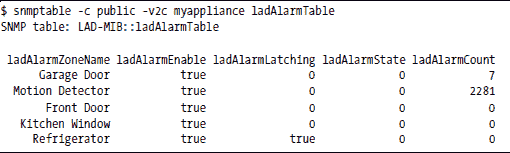

SNMP 命令将允许远程访问 ladd 守护进程内部数据结构中保存的信息。如图 15-1 所示，SNMP 用于远程系统和 SNMP 代理之间。然后代理使用 PostgreSQL 从 ladd 守护进程内运行的 RTA 请求信息。

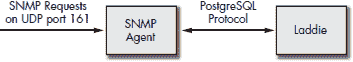

*图 15-1：SNMP 代理作为中间人*

**注意**

*在本章中，你将注意到文件放置与第十三章有所不同，因为在这里我们正在为设备本身设计代理。为了清晰起见，我们将保持我们的文件在/opt 目录下，而不是在文件系统的正常默认位置周围分布。*

**Net-SNMP 代理**

我们将扩展 Net-SNMP 代理，因此我们需要下载源代码包，可以在[`net-snmp.sourceforge.net`](http://net-snmp.sourceforge.net/)找到。截至本文撰写时，版本 5.2.1 是当前的版本，因此我们将检索 net-snmp-5.2.1.tar.gz。毫无疑问，当你阅读这篇文章时，Net-SNMP 将会发布几个版本，但你可以直接获取最新版本。在本章中我们将描述的扩展代理的过程，在我们使用它的所有时间里（即至少自 UCD-SNMP 4.1 以来）并没有发生显著变化。

我们的目的是设置一种构建我们的代理的方式，这样我们将来就可以轻松地下载 Net-SNMP 的新版本，并将其直接放入构建中。计划是创建一个 Makefile，它会解压 Net-SNMP，将代理扩展复制到构建树中的正确位置，配置 Net-SNMP 代理以包含扩展，然后构建它。要升级到 Net-SNMP 的新版本，你只需要将新的 Net-SNMP 源代码 tarball 放入目录中，并更改定义 Net-SNMP 版本的 Makefile 中的那一行。我们还没有准备好我们的扩展，所以让我们先解压并构建纯代理。这将使我们能够在用 MIB 复杂化事情之前测试这个过程。以下是在本书附带的光盘中找到的简化版 Makefile：

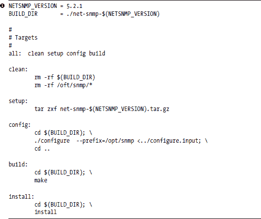

如果你使用的是 Net-SNMP 的新版本，只需将你的 tarball 放入与 Makefile 相同的目录中，将 NETSNMP_VERSION 行更改为匹配你的版本，然后继续下面的说明。

我们将把 Makefile 和 configure 输入文件放入我们刚刚下载的 tarball 的同一目录中。Configure.input 包含配置步骤期望的交互式答案。-prefix 选项告诉配置脚本使用 /opt/snmp 前缀来指定文件位置。Net-SNMP 的安装遵循大多数 Linux 源包的熟悉步骤，尽管我们将让 Makefile 为我们完成这些工作。

./configure

make

make install

步骤，尽管我们将让 Makefile 为我们完成这些工作。

这就是我们的 configure.input 的样子：

（空白行）

2

未设置

未设置

/var/log/snmpd.log

/var/net-snmp

第一行必须是空的，因为配置脚本要求我们在准备好输入时按回车键。

2 选项选择 SNMPv2 作为我们的默认 SNMP 版本。这实际上并不适用于代理，因为它从接收到的请求中获取线索，但 Net-SNMP 软件包还包含了管理应用程序（如 snmpget 和 snmpwalk）的源代码。

两个“未设置”行用于系统联系人信息和系统位置（MIB-2 中可用的对象）。我们将在代理配置文件中覆盖这些值，因此我们只需将这些对象设置为字符串“未设置”。

下两行是默认的日志文件和持久存储位置。

通过输入 **make** 来尝试一下。它将构建 Net-SNMP 应用程序（snmpget、snmpwalk 等）、库和代理。如果不起作用，尝试手动执行这些步骤，而不使用 Makefile。首先解压 tarball 并进入它生成的目录。然后运行 **./configure** 并回答我们上面在 configure 输入中列出的问题。检查配置的输出，看看是否缺少某些内容，比如需要安装的库。如果没有看到任何问题，请在 net-snmp.5.2.1 目录中输入 **make** 并注意错误。除非这个工作正常，否则你不能继续。

一旦 make 工作正常，就在你的开发系统上安装 Net-SNMP。作为 root 用户，输入

make install

这将在/opt/snmp 下的几个目录中安装文件。

$ ls /opt/snmp

bin/ include/ lib/ man/ sbin/ share/

/opt/snmp 目录树是我们将需要复制到设备上的文件的临时区域，以使代理在那里工作。我们不需要设备上的 include 或 man 目录。

我们也可以决定从我们的设备上的 bin 目录中移除客户端应用程序，如 snmpget 和 snmpset，但请务必**不要**移除 snmptrap，因为我们将会使用它从我们的设备发送陷阱。其他命令在需要登录到设备进行调试或从 CLI 或 Web 界面调用它们进行诊断时可能会很有用，但它们对于代理或发送陷阱的功能不是必需的。

代理本身，snmpd，将在/opt/snmp/sbin 目录中，与 snmptrapd 一起。我们可以移除 snmptrapd，因为它在我们的设备上不需要。尽管如此，你仍然应该在开发系统上保留它——当你想要测试发送陷阱的能力时，它会很有用。

MIB 文件位于/opt/snmp/share/snmp/mibs。它们对于设备不是绝对必要的，但我们可能有一些原因想要包含它们。首先，我们可能想要简化创建用于发送陷阱的过滤器（参见第七章中关于 logmuxd 和 SNMP 陷阱的示例）。其次，我们可能想要将它们提供给客户方的网络管理软件使用。

如果我们想在 logmuxd 过滤器中使用数字对象标识符（OID）的易读名称，我们必须告诉 snmptrap 命令在哪里可以找到这些 MIB 文件。我们可以将这些选项添加到调用 snmptrap 的命令行中：

-m ALL -M /opt/snmp/share/snmp/mibs

或者使这些环境变量对它可用：

export MIBS=ALL

export MIBDIRS=/opt/snmp/share/snmp/mibs

这告诉 SNMP 命令（snmpget、snmpset、snmpwalk、snmptrap 等）使用在/opt/snmp/share/snmp/mibs 目录中找到的所有 MIB 文件。

尽管在将软件安装到设备上之前，你可能需要从这个临时区域移除一些东西，但现在我们还不这样做。我们需要其中的一些内容来创建我们的 MIB 扩展。实际上，你应该像这样将/opt/snmp/bin 添加到你的环境变量中：

export PATH=/opt/snmp/bin:$PATH

现在是时候继续前进，创建代理扩展并实现 MIB。

**MIB 骨架：mib2c**

Net-SNMP 友好地提供了一个工具，可以读取 MIB 文件并为代理扩展生成骨架代码。在本章的后面部分，我们将向你展示如何将这个骨架扩展成一个完整的 MIB 实现。

**注意**

*Net-SNMP 为 mib2c 提供了多种输出代码风格；我们将使用较旧的 UCD-SNMP 代码风格。较新的所谓“MIB for Dummies”风格不是本章所描述的内容。我们选择使用较旧的风格，因为它足以满足我们的需求（而且这也是我们的经验所在）。*

在我们能够运行 mib2c 之前，您需要安装 SNMP Perl 模块，该模块包含在 Net-SNMP tarball 中。当您之前运行 make 命令时，它解压缩了这个 tarball 并创建了 net-snmp-5.2.1 目录（或您使用的任何版本）。进入这个目录，然后进入 perl/SNMP。在那里您会找到一个 README 文件，解释如何构建和安装 SNMP Perl 模块。或者，如果您提供的 Linux 发行版中有 libsnmp-perl 包，您也可以安装它。

我们还需要通过将它们复制到包含我们的其他 MIB 的目录 (/opt/snmp/share/snmp/mibs) 中，使我们的 MIB 文件（LADDIE-GROUP-SMI.txt 和 LAD-MIB.txt，我们在第十二章中创建）可供 mib2c 使用。或者，如果您愿意，您可以将点 (.) 添加到您的 MIBDIRS 列表中，如下所示：

export MIBDIRS=.:/opt/snmp/share/snmp/mibs

现在让我们运行 mib2c 生成骨架代码。如果您将 . 添加到您的目录路径中，您需要确保在您的 MIB 文件所在的目录中。请注意，我们向 mib2c 提供的是一个 MIB 模块或 OID，而不是 MIB 文件的名称。

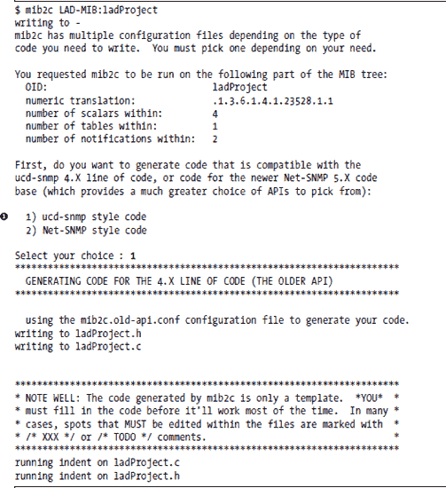

在所有这些过程中，您将在第  行看到以下内容：

我们使用第一种选项，因为我们有经验。您可能想尝试较新且更灵活的 Net-SNMP 类型，但在这里我们不需要这种灵活性。

**《头文件：ladProject.h**》

为我们生成了两个文件：ladProject.c 和 ladProject.h。头文件 ladProject.h 简短且简洁，我们不需要进一步处理它。下面是它的样子：

这些是 ladProject.c 代码文件中为我们生成的例程的原型。

**《代码文件：ladProject.c**》

ladProject.c 文件是我们将要修改的文件。我们不会描述生成的代码，然后再进行第二次遍历来添加我们的修改，而是会逐步进行，在过程中进行修改。我们将使用粗体文本区分我们添加的代码和 mib2c 生成的代码。具体来说，我们需要对生成的骨架代码进行以下修改：

1.  包含 libpq（PostgreSQL 库）的头文件。

1.  在 ladd 守护进程中提供一个连接到 RTA 的函数。

1.  提供函数以通过连接到 ladd 守护进程来读取和写入 RTA 表。

1.  为 MIB 中的每个标量提供读取代码。

1.  为 ladAlarmTable 中的每个表对象提供读取代码。

1.  为 MIB 中的每个可写对象提供一个写函数。

***包含文件***

我们首先包括必要的头文件。记住，我们将用粗体标记我们的添加和修改。

在这里，我们已经通过包含定义 libpq PostgreSQL API 的头文件，实现了我们的第一个目标。

***基本 OID***

在此代码中，由 mib2c 生成的注释基本上已经说明了所有内容。这是我们 MIB 中定义的所有对象的基 OID。

***MIB 对象定义***

下一段代码定义了我们 MIB 中的所有*叶对象*，我们指的是我们将返回值的对象。为这些叶对象中的每一个生成一个定义，为我们将要处理的每个对象赋予一个唯一的数字。定义的名称是 MIB 文件中对象名称的全大写版本；例如，ladVersion 变为 LADVERSION。

每个对象在 ladProject_variables 表中都有自己的条目（如下所示），为该对象提供以下信息：

+   一个将在我们后续的 case 语句中使用的唯一标识符（我们刚才讨论的 define 名称）

+   数据类型

+   是否为只读或读写

+   将要调用的读取对象值的函数

+   当附加到基 OID 时，将给出对象完整 OID 的 OID 后缀

我们发现 mib2c 的原始输出有点难以阅读，因为唯一标识符值的定义与表行定义混合在一起。为了使它更容易访问，我们稍作整理，将所有定义放在一起，并将所有内容对齐在列中。不幸的是，mib2c 没有为我们生成完美的代码，但我们将利用这一点来讲解应该生成的内容。像 mib2c 这样的工具是节省时间的伟大工具，但您应该始终意识到应该生成的内容，并记住检查输出。最终，您将负责代码正确运行。首先，让我们看看代码，然后我们将讨论我们看到的问题。

上述第一个问题是生成的代码包括ladTrapZoneId 和ladTrapZoneName 作为可读对象，但它们不应该。这些对象仅在陷阱中使用，并且代理无法读取或写入它们，因此我们不需要为它们编写代码，并且在这里也不需要指示回调。我们应该删除这两行。

第二，每个对象的 OID 后缀字段都是错误的。您将此后缀附加到基 OID（ladProject_variables_oid，在上一节中定义）以获取单个对象的 OID。这就是我们定义基 OID 的方式：

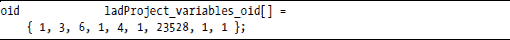

例如，在生成的代码中，ladAlarmState 的 OID 应该是：

{ 1, 3, 6, 1, 4, 1, 23528, 1, 1, 1, 1, 5 };

让我们看看这是否正确。我们可以通过运行 snmptranslate 来检查它。

$ snmptranslate -On LAD-MIB:ladAlarmState .1.3.6.1.4.1.23528.1.1.1.2.1.1.5

这肯定是不对的。我们缺少 OID 层次结构中的两个节点。如果你对 LAD-MIB 中的每个标量执行此 snmptranslate 测试，你会发现它们都缺少 ladSystem (1)和 ladSystemScalars (1)的数字。如果你对表格列重复此测试，你会发现它们缺少 ladSystem (1)和 ladSystemTables (2)。这就像从文件路径名中缺少几个目录级别一样。

在我们继续之前，让我们修复这个表格。以下是修正后的代码，其中添加的数字已加粗：

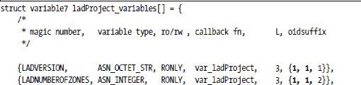

这样就好多了。我们已经从 trapInfo 部分移除了对象，修正了 OID，并修正了后缀的长度。注意，我们不得不将我们用作此数组模板的结构类型从 variable4 更改为 variable7，因为我们的 OID 现在更长。Net-SNMP 头文件为不同长度的 OID 提供了几个不同的结构。你不想使用过多的内存，但你确实需要一个足够长的结构来容纳你将要定义的最长后缀。当我们将我们的后缀长度从三个增加到五个用于表格对象时，我们超过了 variable4 的长度，下一个更长的就是 variable7。你可以在 net-snmp-5.2.1 目录下的 include/net-snmp/agent 目录中的 var_struct.h 文件中找到这些结构。如果你需要更长的结构，你可以在这里查看可用的选项。看看 variable7 是如何定义的：

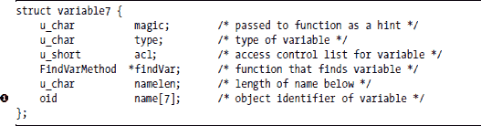

注意  名称字段的长度。

***RTA 访问例程***

现在我们需要插入我们将要使用的连接和与 ladd 守护进程通信的函数：lad_connect()、query()和 update()。

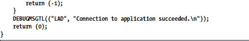

我们定义了一个全局变量来保存我们与 Laddie 的连接句柄以及建立此连接的函数，lad_connect。注意 PQconnectdb、PQStatus、PQerrorMessage 和 PQfinish 的使用。这些是 libpq 中提供的函数；你可以在 PostgreSQL 为这个库提供的文档中了解更多关于它们的信息。基本上，我们正在尝试连接到本地主机的 8888 端口（ladd 守护进程决定使用的端口）。如果失败，我们返回资源（PQfinish），使用我们之前看到的 DEBUGMSGTL 宏记录错误信息，并返回一个错误。否则，我们返回成功。请注意，DEBUGMSGTL 需要一个格式语句和像 printf 一样的参数，但它需要一个额外的括号对。我们在 DEBUGMSGTL 调用中用较短的 LAD 替换了默认的 ladProject 字符串，只是为了在我们的示例中节省一些水平空间。下面你将看到的未更改的生成代码默认使用 ladProject。你应该在你的代码中保持这些一致性；也就是说，如果你添加新的 DEBUGMSGTL 语句，使用 mib2c 生成的相同值。你不需要保持 DEBUGMSGTL 字符串与你的项目名称一致，但这样做可以避免混淆。我们只在这些示例中做出更改，以防止由于书籍打印页面的有限水平空间而导致的换行。你不需要在你的代码中这样做。

我们接着使用我们的函数从 RTA 表中读取值。你需要传递表名和字段名、一个过滤器字符串（你可能用它来选择表行）、选项、一个用于从表中返回值的缓冲区，以及该缓冲区的长度。我们没有为一次从 RTA 表中查询多个字段做出任何准备。（这实际上并不是一个问题，因为 Net-SNMP 一次只会传递给我们一个 MIB 对象来读取。）虽然单个 MIB 对象可能需要读取多个 RTA 表——也就是说，RTA 字段和 MIB 对象之间不需要一一对应——但我们为 Laddie 准备的 MIB 不需要这样做。

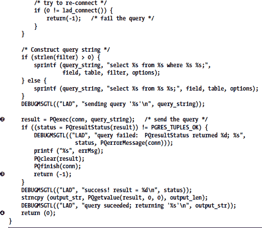

我们首先检查我们的 Laddie 连接是否仍然有效。如果不是，我们通过调用 lad_connect()重新连接。然后我们构造我们的查询字符串，并使用 Pqexec()执行查询。PostgreSQL 库的应用程序编程接口（API）允许你在单个查询中请求多个值，这就是为什么结果以元组列表的形式返回。我们检查我们的元组是否正常。如果不正常，我们清理，返回资源，并向我们的调用者返回一个错误。否则，我们提取返回的第一个值（在我们的情况下，应该只有一个），将其返回给我们提供的缓冲区，然后返回成功。

下面的代码与上面的查询例程非常相似，但它构建了一个更新请求以写入字段，然后将其传递给 libpq。这是我们 MIB 写入例程将调用的例程。

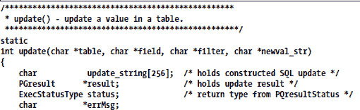

我们应该指出，这些只是从 PostgreSQL 数据库读取和写入的简单、通用例程，因此是 RTA 表。它们与 SNMP 或 Laddie 特定的没有任何关系。您可以在任何用 C 编写的应用程序中使用它们，该应用程序需要从同一系统上的另一个应用程序访问 RTA 表——您唯一需要更改的是端口号。

***初始化例程***

现在我们来到了 mib2c 为我们生成的相当简单的初始化例程。请注意，我们没有对生成的代码进行任何修改。我们本可以在这里调用 lad_connect()，但我们为了简单起见而没有这样做。我们定义的 query() 或 update() 例程的第一个调用将检测到连接不存在，然后为我们创建它。

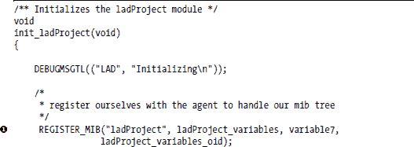

 REGISTER_MIB 行将您的 OID 子树注册到中央代理代码中，以便它知道调用您来读取和写入此子树中的对象。请注意，我们在这里也必须将 variable4 更改为 variable7。

***标量***

下一个例程是处理所有标量读取的地方。*标量* 是 MIB 中的叶对象（即，它们不是通过索引表来访问的）。

在我们深入这个函数之前，让我们花一点时间看看输入参数。它们在 Net-SNMP 软件包提供的 AGENT.txt 文件中描述得相当好（顺便说一句，这是一本非常值得阅读的书籍），但我们将在这里总结它们：

+   vp 是指向我们在第 268 页“MIB 对象定义”部分讨论的数组中相关条目的指针。

+   name 是请求中的 OID，length 是此 OID 的长度。

+   exact 表示您是否正在处理一个请求精确 OID，如 GET 或 SET，或者需要您找到 OID 来处理，如 GETNEXT。（GETNEXT 是为什么名称和长度也是输出参数。您必须为 GETNEXT 请求适当地设置它们，以指示您返回值的 OID。）

+   var_len 是一个输出参数，该函数必须将其设置为返回数据的长度。

+   write_method 也是一个输出参数，用于指向将处理任何您已设置为可 SET 的 OID 的 SET 的函数。

+   函数返回请求的数据值，如果数据不可用则返回 NULL。

现在我们来处理函数的主体部分。我们已对一些行进行了重新格式化，以便更好地适应打印页面，但除此之外，大部分常规操作保持原样。我们突出显示了需要添加或更改的几行，以便从 Laddie 守护进程的 RTA 表中检索值。如您所见，在 SNMP 代理中需要做的工作非常少，以检索我们 MIB 中的可读值。每个对象都需要对 Laddie 的 RTA 可访问表中的一个字段进行单次访问。

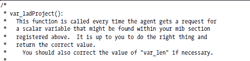

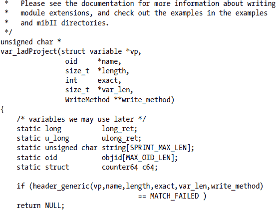

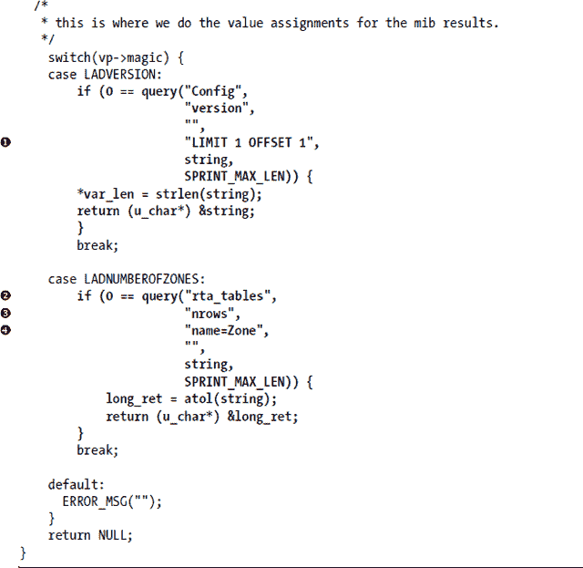

我们唯一的更改是在 switch 语句中。我们调用我们的 query() 例程从 Laddie 的 RTA 表中检索值以满足请求。ladVersion 的值来自 Laddie 配置表的版本字段。我们添加了  选项 LIMIT 1 OFFSET 1，因为配置表有多个行用于不同的目的。每一行都有一个版本字段，但我们只想得到一个答案，所以我们使用选项 LIMIT 1。我们还想要表的第二行，所以我们添加了选项 OFFSET 1。

对于区域数量，我们没有遇到任何问题，我们直接从  rta_tables 表中的 nrows（行数）字段获取，但我们必须使用 filter 参数来 query() 和选择 name 字段为 Zone 的行。rta_tables 表为 ladd 守护进程中的每个 RTA 表都有一个行，因此我们可以直接访问描述 Zone 表的行以找到行数。

**读取警报表**

var_ladAlarmTable() 函数处理 ladAlarmTable 中的对象读取。同样，我们的大部分工作将是向 switch 语句中添加代码。读取表例程的主要区别在于需要处理表行索引和确定表大小。

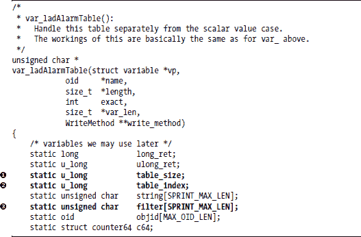

var_ladAlarmTable 的开头与 var_ladProject 非常相似，我们在那里实现了我们的标量。我们迄今为止所做的一切只是添加了一些局部变量，具体如下：

 table_size，它将保存我们表中的行数。

 table_index，它显示我们想要检索的表行。

 filter，这是我们传递给 query() 的，以告诉它我们想要哪一行。

这应该在我们对第 275 页“标量”部分中 LADNUMBEROFZONES 的讨论中很熟悉。我们需要表的长度来处理下面的操作。请注意，对于无法检索表长度的情况，反应是  返回 NULL。这不应该失败，但我们仍然需要处理这种情况。如果我们无法获取表的长度，代理将像它不存在一样绕过此表，当有人遍历我们的 MIB 时。

在上面的代码中，我们利用了 Net-SNMP 提供的 header_simple_table()函数。AGENT.txt 文件定义了一个*简单表*，它由一个从 1 开始到某个可确定的最大值的整数单索引；该范围内的所有行都是有效的（没有空隙），数据可以直接检索——例如，通过索引到底层数据结构，如我们的 RTA 区域表。

注释块是由 mib2c 生成的，它包括一个名为 TABLE_SIZE 的常量，我们将其替换为前面讨论的变量 table_size。

我们简单地从我们的 OID 末尾获取表索引。对象的*实例*的 OID 是对象定义的 OID，后跟实例索引。在任何简单表中，如上所述，实例索引将是表行号（第一行从 1 开始，而不是 0）。然后我们使用这个索引来创建查询区域表的过滤字符串。我们正在从区域表获取 ladAlarmTable 中对象的全部值，因此我们只需创建这个过滤字符串一次，并在所有查询中使用它。

以下（下方）的常规操作是一个根据请求的对象进行索引的切换语句。

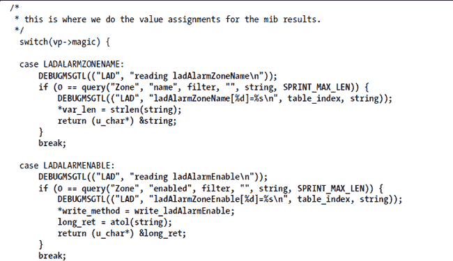

在每个情况下，我们查询区域表中的某个字段以获取切换语句中的值。如果查询失败，我们将跳出切换并返回 NULL，这告诉代理此值无法检索。

另一点需要注意的地方是，我们必须为每个我们定义为具有读写访问权限的对象返回一个 write_method。每个可写对象都有自己的写入方法——即指向处理 SET 调用的例程的指针。每当进行写入（snmpset）操作时，主代理代码首先调用读取例程以找到适当的写入例程。

**编写警报表**

对于可写对象的每个写入例程看起来基本上都一样，所以我们只需以 ladAlarmEnable 对象为例。

写入例程都围绕一个基于动作参数选择不同处理的切换语句。切换语句中的情况将始终如下：

+   RESERVE1

+   RESERVE2

+   FREE

+   ACTION

+   UNDO

+   COMMIT

写入比读取复杂得多。当代理接收到针对您的对象的 SNMPSET 命令时，上面讨论的读取代码将被调用来返回 write_method（特定对象的写入例程的指针）。然后，该写入函数将每次使用不同的操作参数重复调用。如果一切顺利，写入方法将依次调用 RESERVE1、RESERVE2、ACTION 和 COMMIT。第二个 RESERVE 是为了在接收到多个对象的写入时允许对象之间的依赖性。如果任一 RESERVE 返回失败，您将被调用 FREE 以释放任何分配的资源。对于在处理过程中进一步失败的情况，提供了撤销。您必须承诺（真心实意地希望如此）撤销不能失败，这样您的设置就不会变得不一致——至少要尽力而为，并牢记这一点。关于这个主题的更多信息可以在 Net-SNMP 软件包的顶级目录中的 AGENT.txt 文件中找到。以下是我们对 Laddie 代理修改的代码。

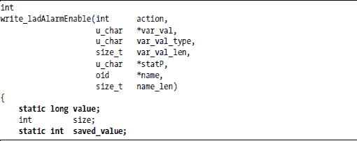

我们已将 mib2c 生成的代码更改为使值静态，并添加另一个静态变量来保存保存的值。此函数将使用一系列操作参数重复调用，因此我们可以从调用到调用保存一些信息。

这些应该与上面我们的标量和 ladAlarmTable 查询看起来很熟悉。这里，我们将使用它们进行查询和更新。

**table_index = name[name_len-1];**

这也应该很熟悉。我们从 OID 的末尾获取表索引。

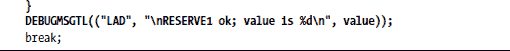

RESERVE1 动作检查值类型和长度以确保准确性。用于检查错误类型和错误长度的代码已为我们生成，但我们稍作修改，将 printf 替换为 DEBUGMSGTL 宏。我们还添加了对写入值范围的检查。启用值应始终为 0 或 1。

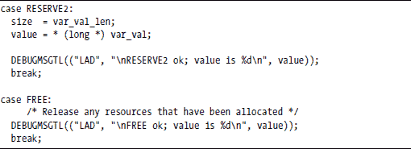

在 Laddie 中，我们不需要使用 RESERVE2 和 FREE。通常，RESERVE2 会用于检查 SNMP SET 的 var-bind 列表中对象的相互依赖性，而 FREE 会用于释放我们暂时占用的任何资源，但这两者都不适用于我们的 Laddie MIB。在 RESERVE2 中没有突出显示代码，因为我们没有添加任何内容。甚至注释也是由 mib2c 生成的。

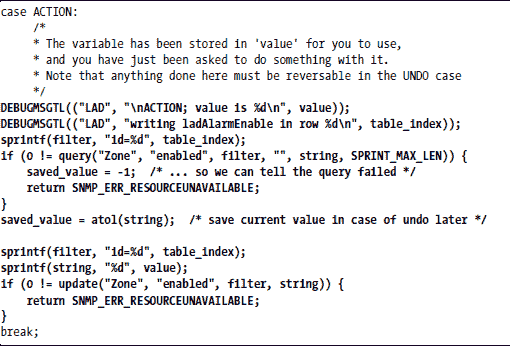

在 ACTION 中，我们在将新值写入 RTA Zone 表之前，从当前值中检索并保存到 saved_value 中。如果我们遇到麻烦，我们将返回一个错误。我们保存的值可能在撤销情况下使用。

我们通过将保存的值写回来实现撤销，但前提是 ACTION 已经检索到旧值。

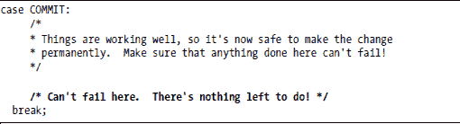

在 COMMIT 案例中，我们没有什么要做。ACTION 已经将值写入 Laddie 守护进程的 RTA 表中。

如果在此点之前我们没有返回错误，我们就返回成功的完成。

所有其他写入例程看起来都像这样，因此我们关于 LAD-MIB 实现的讨论到此结束。下一步是构建它。

**重新审视 Makefile**

在“Net-SNMP 代理”的第 262 页中，我们使用 Makefile 生成我们的代理。现在我们只需修改这个 Makefile 以包含我们的 LAD-MIB 代码。

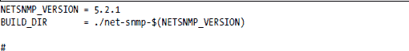

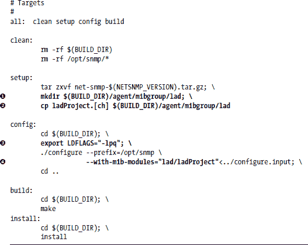

这些更改相当微小。我们在设置案例中添加了两行来在 agent/mibgroup 下创建 lad 目录，并将我们的 ladProject 头文件和 C 文件复制到那里！

配置案例！ 将 "-lpq" 添加到 LDFLAGS 中，以告诉链接器包含用于我们更新和查询例程的 PostgreSQL 代码的 libpq 库。我们还！ 告诉 configure 在构建中包含我们的 MIB。

就这些！如果 Net-SNMP 发布了新的安全改进、错误修复或新功能，我们只需要将新的源 tarball 放入构建目录，更改 Makefile 中的 NETSNMP_VERSION 行，然后重新构建。自从我们开始使用 Net-SNMP 以来，每个 Net-SNMP 版本都保持了向后兼容性，当时 Net-SNMP 还是 UCD-SNMP，将新的 Net-SNMP 版本滚动到我们的设备软件的新版本中一直是一件令人愉快的事情。为此（以及其他原因），我们永远感激 UCD/NET-SNMP 的维护者。

在第十四章中，我们提到我们的 SNMP 代理使用的是旧式的非 RTA 配置方法（即，位于/etc 下的某个地方的.conf 文件）。你可能想知道为什么我们没有讨论如何将 SNMP 代理 RTA 化，这样我们就可以像 Laddie 一样动态更改其配置。这是原因。我们不希望定制基本代理，因为这会使新版本发布变得复杂。现在很简单——我们没有每次更新都要移植到代理的变化，并且所有定制都集中在我们的 MIB 扩展中。

现在我们需要做的就是构建和安装它。

make

make install

你还需要将所需的文件从/opt/snmp 复制到你的设备构建中，但这超出了本章的范围。

**调试**

多亏了 DEBUGMSGTL 宏，我们直接将我们的 MIB 扩展作为我们编写的那样添加进去，并且我们已经准备好在必要时跟踪我们的代理中的控制流。只需关闭在后台运行的代理

/etc/rc.d/init.d/snmpd stop

并从命令行运行你的副本：

/opt/snmp/sbin/snmpd -D "LAD" -Le -f -c /opt/snmp/etc/snmp/snmpd.conf -C

-c <配置文件路径> -C 是从运行代理的正常命令字符串中来的。我们在第十四章中讨论了这一点。新的是前三个选项。

`-D "LAD"` 激活我们的 DEBUGMSGTL 语句，指定了"LAD"。以下是从我们上面讨论的代码中摘录的一个示例：

DEBUGMSGTL(("LAD", "reading ladAlarmState\n"));

`-Le` 参数告诉代理将输出发送到 stderr。其他选项包括 stdout、syslog 或文件。有关 snmpd 的更多信息，请参阅手册页。

`-f` 参数告诉代理不要进行分叉并进入后台。这使其与我们的当前终端窗口相关联，因此我们可以看到输出。

现在，使用另一个终端窗口中的 snmpget、snmpset 或 snmpwalk 查询代理，并观察输出，或者将其捕获到文件中。

**陷阱**

我们在我们的 MIB 中定义了两个陷阱，但我们将不会在本章中讨论如何发送这些陷阱。在第十四章中，我们讨论了使用 snmptrap 实用程序为我们发送陷阱的方法，在第七章中，我们解释了如何使用日志事件来触发 SNMP 陷阱。只需记住，我们定义在 LAD-MIB 中的陷阱不是由 SNMP 代理生成的。它们是通过记录由 ladd 守护进程记录的事件的日志子系统生成的。

**总结**

在第十四章中，你学习了如何创建一个与应用程序匹配的 MIB，在本章中，你学习了如何创建一个用于 Net-SNMP 代理的 MIB 扩展以实现该 MIB，以及如何使用 PostgreSQL 接口库和 RTA 从另一个守护进程进程中检索 MIB 数据值。此时，你应该感到自信，能够从头开始自己完成这项工作。

你也应该足够熟悉 MIB 和 Net-SNMP 代理扩展的结构，以便将新对象插入 MIB 和代码中。没有必要通过 mib2c 生成骨架代码。你只需要将新对象添加到 MIB 文件中（主要是剪切和粘贴工作），在定义列表中为这些变量定义新数字，向 ladProject_variables 数组添加适当的行，然后向适当的 switch 语句添加情况。只需记住，虽然你可以向 MIB 添加内容，但你不能重新分配 OID。如果你总是添加到分支的末尾，你应该处于良好状态。

在第十四章中，我们提到我们忽略了在 MIB 中包含 Laddie 表中的边缘和输入列。对你这两章的理解的一个很好的测试是将其中一个或两个这些字段添加到 MIB 和代理中。

