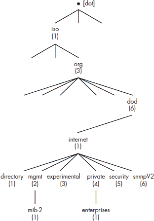
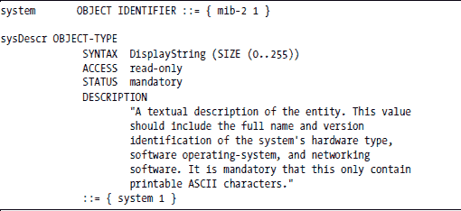
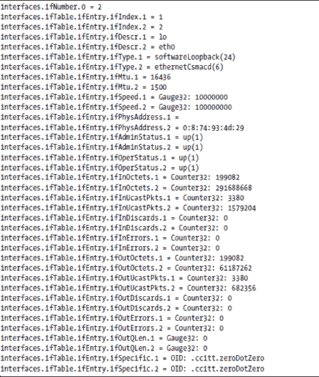
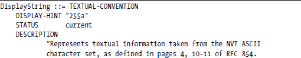
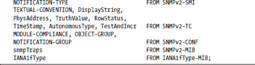
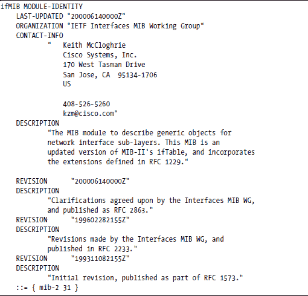

**SNMP 综述**

本附录提供了一些人希望了解 SNMP 的额外详细信息或背景信息。

在本附录中，我们将涵盖以下主题：

+   为什么选择 SNMP

+   代理和管理员

+   命名空间、语法和协议

+   MIB

+   OID

+   MIB-2

+   SMI

+   SNMP 协议

+   SNMPv1、SNMPv2 和 SNMPv3

+   SNMP 数据类型

+   定义新类型

+   MIB 文件的结构

**为什么选择 SNMP？**

在 20 世纪 70 年代初，计算机及其 I/O 设备足够大，需要自己的空调房间。大多数大型公司在其独立的系统上执行计算任务。当出现问题时并不难发现——错误会打印在系统控制台上，前面板的指示灯会停止闪烁。

今天，即使是小型科技公司也有一个服务器室，里面摆满了来自多个供应商的计算机和网络设备，包括交换机、路由器、打印服务器、Web 服务器、RAID 服务器等等。网络打印机分布在站点周围的便利位置，每个办公桌都有一台桌面或笔记本电脑。实际上，高科技公司通常拥有的计算机比员工还多。

与那些古老的计算机不同，这个设备网络中任何单个组件的故障并不容易检测。IT 经理需要某种形式的自动化来帮助他们管理所有这些设备。

自动化可能只是执行定期 ping 扫描的自定义脚本，但大型网络可能更倾向于依赖使用 SNMP 的网络管理系统（NMS），例如惠普的 OpenView。这样的系统可以提供比设备故障更多的信息。它可以记录性能统计信息，保持重启历史记录，并维护设备自身发送的关于即将出现问题的通知日志。设备可能会报告过量的数据包丢失或重传；连接故障；风扇运行缓慢或 CPU 过热；过度的 CPU、内存或磁盘利用率；以及系统重启。

**代理和管理员**

管理设备（路由器、交换机、Web 主机、桌面计算机、网络打印机等）每个都运行一个名为 SNMP 代理的服务器进程（守护进程）。这个*代理*监听特定的 UDP 端口（通常是，但不总是，端口 161）以接收读（GET）和写（SET）命令。获取请求的数据并返回是代理的责任。这个代理以及其他设备上的监控软件还可以向一个或多个配置的目标系统发送自发的通知，称为*陷阱*或*通知*。

管理应用程序（*管理员*）轮询代理以获取信息。它们可以保留历史信息，生成报告，或创建网络中设备的图形映射。一些管理应用程序只是简单的命令行工具（如 Net-SNMP 提供的 snmpwalk、snmpget 和 snmpset 命令）。

**命名空间、语法和协议**

SNMP 代表简单网络管理协议，但实际上它不仅仅是一个协议——它是一种命名数据的方式，是描述数据的语法，以及在网络中交换数据的协议。这些组件被称为 *MIB*（命名方案）、*SMI*（语法）和 *SNMP 协议*。描述 SNMP 的 RFC 包含一组有用的信息，用于管理网络设备。这被称为 *MIB-2*（需要两次尝试才能正确）。我们将在稍后讨论更多关于 MIB-2 的内容。

**MIB**

MIB 代表 *管理信息库*。这个词听起来有点复杂，但你可以把它想象成一个虚拟数据库的分层命名方案。这是一个“虚拟”数据库，因为数据可能不存在存储的任何地方，直到代理收到读取数据的请求。当请求一个对象（可以将其视为数据库记录中的一个字段）时，代理检索信息，并在可能涉及从管理系统获取多个信息片段并计算返回值的处理过程中返回信息。（你可以将其视为即时数据库。）请求信息本身的行为可能会触发值的创建。

虽然有一个通用的寻址方案，但我们将其细分为子集，我们也将它们称为 MIB。通常，当人们使用“MIB”这个词时，他们不是指整体命名空间，而是指这些子集之一。MIB-2 就是其中之一，还有许多其他由不同的小组为不同的目的定义。有些是由标准组织生产的，而有些则是由私人公司定义的，以描述其网络产品提供的专有数据。（在第十四章中，我们描述了如何为你的设备定义一个私有的 MIB，并在命名空间中为其找到一个位置。）

**OID**

每个 MIB 中的每个对象都有一个对象标识符（OID）。*OID* 是一个由点或句点分隔的十进制数字序列的唯一名称，如下所示：

.1.3.6.1.2.1.1.2.0

这个名称表示对象在命名空间中的位置。第一个点表示树的根，每个数字表示树中的一个 *节点*（分支的基）。SNMP 中可命名的所有内容都位于这个 OID 树的某个位置，每个名称（OID）都包含从树根到该对象的整个路径。

这一开始可能看起来有点奇怪，但它与你应该熟悉的 Unix 文件系统以相同的方式工作。文件的路径从根开始，由一个初始斜杠（/）表示，通过多个由斜杠分隔的命名节点（目录）进行，并以文件本身的名称结束。

让我们以 Unix 文件系统中的一个文件为例：

/usr/local/bin/myprog

如果我们用点而不是斜杠来分隔目录，文件的路径将看起来像这样：

.usr.local.bin.myprog

假设以下表定义了目录名称和一组数字之间的映射：

如果我们用数字代替名称，路径将看起来像这样：

.1.3.6.1

图 B-1 展示了 OID 树（或命名空间）的一部分。请注意，树中的一些节点是以组织命名的：ISO 是国际标准化组织，DOD 是美国国防部。（DOD 在这个结构中是因为它在 DARPANet 的创建中发挥了重要作用，DARPANet 最初由一个四台计算机的网络组成。到 1972 年，DARPANet 已增长到 37 台计算机的网络，并更名为 ARPANet，这导致了今天的互联网。历史课到此结束。）

*图 B-1：OID 树*

互联网数字分配机构（IANA）负责在 *enterprises 节点*下分配数字给公司和组织，赋予公司或组织在其自己的子树中管理 OID 的权限。

我们最感兴趣的树的部分位于 .1.3.6.1 (.iso.org .dod.internet) 之下。在这个节点之下是 mgmt.mib-2 (.1.3.6.1.2.1) 子树和 private.enterprises (.1.3.6.1.4.1) 子树。MIB-2 是我们之前提到的公共对象集合；它被所有可由 SNMP 管理的网络设备支持。enterprises OID 是组织注册其私有 MIB 的地方。（关于这个主题的更多信息，请参阅第十四章。）

**MIB-2**

MIB-2，定义在 RFC 1213 中，¹ 描述了一组有助于管理网络设备的核心信息。MIB-2 组织成下面显示的十个组。并非所有组都支持所有网络设备，但你可以普遍期望找到大多数组。

**系统**

这个组包含诸如 sysDescr（操作系统的可打印描述，硬件，网络软件等）、sysContact（通常是管理此系统的人员的电子邮件地址）、sysLocation（系统的可打印位置描述）和 sysObjectID（可以用来确定设备类型的 OID）等对象。

**接口**

这个组是一个描述系统上可用的网络接口的表。接口表包含每个接口的速度和接口上的活动（输入和输出的字节数）。通过定期轮询输入和输出的字节数，你可以知道接口上可用带宽的百分比正在被使用。这可以帮助你监控网络中路由器的容量。

**AT**

这是地址转换组。MIB-2 废弃了这个组，但为了与实现 MIB-1 的设备兼容而包含它。除非你对 SNMP 历史有特别兴趣，否则你应该忽略这个组。

**IP**

这个组包括与 IP（网络）层相关的信息，包括 ipAddrTable（IP 地址表），它描述了系统上可用的接口的 IP 地址。

**ICMP**

这个组包含了各种互联网控制消息协议（ICMP）的统计数据。

**TCP**

这个组包含了各种 TCP 层的统计数据，包括 tcpConnTable（TCP 连接表），描述了与网络中其他系统之间的当前 TCP 连接。这个表常用于网络发现。一旦你有了这个系统的地址，你就可以找到与之联系的其他系统的地址。

**UDP**

这个组包含了各种用户数据报协议（UDP）数据报的统计数据。

**EGP**

这个组包含支持 EGP 协议的系统的外部网关协议（EGP）统计数据。

**传输**

这个组包含与传输媒体管理相关的信息。

**SNMP**

这个组包含了与 SNMP 协议本身相关的各种统计数据。

**SMI**

MIBs 使用结构化管理信息（SMI）定义的语法进行描述，SMI 是抽象语法表示法一（ASN.1）的一个子集。ASN.1 的创建是为了允许以与机器架构无关的方式描述数据（例如，不假设字节序或字大小）。SNMP SMI 采用了 ASN.1 下可定义的对象类型的一个子集，并简化了表示法。

你真正需要了解的所有关于这些的信息是如何读取和写入用于描述 MIB 的表示法。这最好通过示例中的最小符号定义来实现。你可以通过从其他 MIB 中剪切和粘贴来创建一个新的 MIB。

**注意**

*我们尽量使对 MIB 的讨论尽可能简单。要深入了解，请参阅大卫·珀金斯和伊万·麦金尼斯（Prentice Hall，1996）所著的《理解 SNMP MIBs》。*

下面是使用 SMI 中描述的语法的一个对象定义示例：

The ::= 读取 *定义为*，而 {mib-2 1} 表示如果 mib-2 是 .1.3.6.1.2.1，那么 system 是 .1.3.6.1.2.1.1。因此，sysDescr 是 .1.3.6.1.2.1.1.1。每个定义描述了 OID 树中的单个步骤。

注意，一些对象标识符仅仅描述了树结构中的节点，而另一些则描述了你可能实际读取的对象（叶节点）。这些就像文件系统中的目录和文件。实际上，当你尝试读取 sysDescr 时，你必须请求 .1.3.6.1.4.1.1.1.0。这就是我们与文件系统类比有所不同的地方。结尾的零表示你正在检索对象的 *实例*。标量对象实例（标量是独立于表的独立对象）总是 .0（点零）。在面向对象术语中，.1.3.6.1.2.1.1.1 是 *类*，而 .0 描述的是类的实例。

如果你将对象视为表格结构中的字段，并且必须通过行索引检索它们，这可能会更有意义。表行号将替换零。例如，ifDescr 是描述机器上特定网络接口信息的表格中的一个字段。mib-2 下的另一个节点 interfaces 被描述为

interfaces OBJECT IDENTIFIER ::= { mib-2 2 }

如果你检索了一个系统前两个接口的 ifDescr 字段，你可能会得到这个：

interfaces.ifTable.ifEntry.ifDescr.1 = lo

interfaces.ifTable.ifEntry.ifDescr.2 = eth0

与请求 sysDescr 时可能检索到的内容进行对比：

system.sysDescr.0 = Linux localhost.localdomain 2.4.18-27.8.0 #1 Fri Mar 14 06:45:49 EST 2003 i686

ifDescr OIDs 结尾的.1 和.2 表示检索它们的表行。在 SNMP 中，表行从 1 开始编号，0 用来表示标量。

MIB 的 SMI 描述通常以*MIB 文件*的形式分发。这是一个包含对通用 MIB 一部分无歧义描述的文本文件。

有时，单个表的描述会放在单独的文件中。其他文件可能只包含一组其他 MIB 文件使用的公共对象或定义，例如文本约定。通常，特定产品的私有 MIB 在一个文件或一组小文件中描述，根据需要从其他文件导入类型和约定，这与 C 语言中使用#include 语句的使用方式类似。

MIB 文件用作 MIB 的正式定义，供人类使用，但它也被程序化地用于解释 SNMP 响应以供人类显示。（我们将在下面看到这一点。）因此，MIB 文件必须与任何计算机程序一样语法正确。有 MIB 编译器和检查器（类似于 C 语言的 lint 程序）来帮助验证 MIB 文件的正确性。（我们将在第十四章中进一步讨论这一点，其中我们将涵盖创建和验证我们自己的 MIB。）

**SNMP 协议**

尽管值得单独成章，但我们可以从它定义的协议数据单元（PDUs）及其用途中了解关于 SNMP 协议的大部分内容。

***基本命令：GET, SET, GETNEXT***

SNMP 协议用于在受管理系统和用于管理它们的程序之间交换信息。受管理系统托管一个称为代理的守护进程，通常命名为 snmpd，它提供了从 MIB 中读取信息或将信息写入 MIB 的能力。GET、SET 和 GETNEXT PDUs 用于从 MIB 中读取、写入和遍历 MIB。

***使用 GETNEXT 遍历 MIB***

GETNEXT 允许您指定一个对象，并要求代理返回 MIB 树中下一个对象的 OID 和值。*遍历 MIB*意味着从 OID 树中的某个点开始，通过重复使用 GETNEXT 命令遍历其下的整个子树。当返回的 OID 不在由第一个 OID 定义的子树内时，遍历结束。通过以这种方式遍历整个 MIB 树，应用程序可以找出在受管系统中支持哪些 MIB。

***陷阱和通知***

受管系统还可以自发地向配置的目标管理节点发送信息，这个过程称为发送 SNMP *trap*或*inform*。trap 是向目标系统发送的，但发送者永远不会知道它是否到达了那里。inform 比 trap 有所改进，因为它期望接收者回复；如果未在合理的时间内收到回复，它可以重试。

***命令行工具：示例***

让我们看看一些使用命令行工具的示例，这些工具使用我们刚刚讨论过的 SNMP PDU 来实现其功能。这些命令作为 Net-SNMP 包的一部分提供（[`net-snmp.sourceforge.net`](http://net-snmp.sourceforge.net/))，我们在本书的 SNMP 章节中一直使用它。

要检索上一节中显示的 sysDescr 字段，您可能需要发出以下命令

snmpget -c public 10.1.1.21 .1.3.6.1.2.1.1.1.0

这要求从 IP 地址为 10.1.1.21 的系统获取 sysDescr 对象的实例，使用社区名称 public（将其视为密码）。正如您从其名称中可以猜到的，snmpget 命令生成一个 SNMP GET PDU。

现在让我们遍历一个子树。snmpwalk 命令使用一系列 GETNEXT PDU。如果您发出以下命令以从一个系统中检索接口表：

snmpwalk -c public 10.1.1.21 .1.3.6.1.2.1.2

这可能就是您会得到的结果：

由于这是一个深度优先遍历；也就是说，它先遍历每一列，然后再回到第一行并开始下一列。这是 OID 的词法排序的结果。例如，由于 ifDescr 是 ifEntry.1 而 ifType 是 ifEntry.2，所以在任何 ifType 字段之前，您都会看到所有 ifDescr 字段。

**通过 MIB 了解设备**

通过支持 MIBs 可以经常识别出机器的类型。例如，一位作者曾被分配了一个新工作站的 IP 地址，并发现有人已经在使用这个地址。由于他是通过正当渠道获得这个地址的，他假设其他人无效地使用了它。他关闭了自己的系统，并使用另一个系统从有问题的系统中读取 system.sysContact；这应该设置为该节点的管理员联系信息，但并没有。然后他尝试遍历该系统支持的 MIBs，发现它支持打印机 MIB。嗯……结果证明，他被错误地分配了部门的打印机的 IP 地址！

**SNMPv1、SNMPv2 和 SNMPv3**

SNMP 有三种主要变体。原始的 SNMPv1（版本 1）是最简单的，但它有一些缺点，新版本试图解决这些问题。其缺点包括：

+   不支持大于 32 位的整数。

+   没有请求批量数据的方法（每个对象都必须按名称请求）。

+   没有机制来确保陷阱到达其目的地。

+   安全/认证是通过使用社区名称来完成的，这些名称类似于密码，但在网络上以明文形式传输（即未加密）。

SNMPv2c（基于社区的 SNMPv2）解决了上述前三个问题，但在就新的安全机制达成一致方面遇到了更大的困难，因此 SNMPv2c 仍然依赖于社区名称进行认证。SNMPv2c 包括 64 位整数、GETBULK 命令，并引入了 informs，这是一种已确认的陷阱。

SNMPv3 用更安全的认证和加密机制取代了社区名称认证机制，但对其的深入讨论超出了本书的范围。

**注意**

*SNMPv1 已被移至“历史”状态，但许多 IT 组织使用的应用程序仍然在使用它。您的网络设备可能需要使用 SNMPv1 与这些较老的应用程序兼容。然而，预计在不久的将来，一些客户将希望禁用较旧、安全性较低的 SNMP 版本。*

**SNMP 数据类型**

SNMP 数据类型是 ASN.1 类型的子集。SNMP 数据类型及其用途的完整描述超出了本简要介绍的范畴，但本节是对主要类型的总结。SNMP 定义了三种数据类型：原始类型、定义类型和构造类型。我们在此不深入探讨它们之间的区别，只是简单地说，原始类型是基本类型，定义类型具有特殊含义但基于原始类型，构造类型是我们下面将要讨论的表格。尽管这看起来可能有些奇怪，但我们将尽力保持与 SNMP 的标准一致，即在原始类型名称中使用全部大写字母，而在定义类型名称中只使用首字母大写。

**整数**

INTEGER 可以是正数或负数。它的值可以是枚举的，可以指定一个合法值范围（例如，(lowValue..highValue)），或者固定大小（例如，Size(4)）。在 SNMPv2 中，INTEGER 变为 Integer32，明确表示大小为 32 位。SNMPv2 还添加了 Unsigned32 类型，用于只有正值的 32 位整数。

**Gauge**

Gauges 是只取非负值的整数，其值在指定的范围内上升或下降（例如，在 0 到 100 百分比之间，或在 0 到某个最大容量之间）。SNMPv2 将其重新定义为 Gauge32。

**Counter**

与 Gauge 类似，Counter 是一个只取非负值的整数。与 Gauge 不同，计数器的值只会在达到最大限制时回绕到零。SNMPv2 用 Counter32 和 Counter64 替换了 Counter。

**TimeTicks**

TimeTicks 是描述时间的整数，单位为 1/100 秒。它们通常用于描述自某个重要事件或起点以来的时间，例如系统启动或上次配置更改。

**OCTET STRING**

OCTET STRING 是一个八位字节的字符串。它不一定是 null-terminated 的 C 字符串；每个八位字节可以包含任何值（0..255）在任何位置（即，中间可能有空字符）。SNMPv2 添加了限制，即 OCTET STRING 不能超过 65,535（即，其长度必须可以用 16 位表示）。

**OBJECT IDENTIFIER**

这用于包含 SNMP OID 值。SNMPv2 添加了限制，即 OBJECT IDENTIFIER 不能包含超过 128 个组件，每个组件都必须可以用最多 32 位表示。

**IpAddress**

IpAddress 字符串是长度为四的八位字节字符串。（注意，这仅允许表达 Ipv4 地址。）

**Opaque**

这种类型与 OCTET STRING 非常相似，因为它是一系列具有类似限制的字节字符串。Opaque 被定义为允许扩展 SMI。基于 Opaque 类型定义新类型被强烈建议不要这样做。

**BITS**

BITS 在 SNMPv2 中被添加，以提供表达标记位字段（即，每个位都有单独的含义）的方法。

**注意**

*从 SNMP 后期修订中删除的类型在上面的列表中没有显示。*

**SNMP 表**

除了上述简单类型外，表格还可以使用 SEQUENCE 和 SEQUENCE OF 来描述。MIB 中的表格被描述为描述条目的类型的 SEQUENCE OF。然后，表条目被描述为包含条目各个字段的 SEQUENCE。条目类型描述了构成表中每一行的列，而表本身被描述为这些条目结构的数组。

例如，以下是 MIB-2 中接口表的定义：

注意 if Entry 和 IfEntry 两种用法，一个首字母大写，一个没有。所有对象名称都以小写字母开头；例如，ifTable 和 if Entry。因为 IfEntry 首字母大写，我们知道它描述的是一个类型，而不是一个对象。

IfEntry 类型类似于 C 语言中的 struct；它描述了每个表格行的布局。小写的 ifEntry 是 OID 树下的一个节点，在此节点下将定义列对象。因此，特定接口的描述将有一个类似于这样的 OID：

ifTable.ifEntry.ifDescr.*x*

其中 *x* 是行索引。

在定义条目类型之后，将是组成条目序列的每个对象的定义。你将在 MIB 定义中反复看到这种格式；许多 MIB 信息都组织成表格。

**定义新类型**

尽管 SMI 中定义的数据类型已经足够，但有时更具体一点会更方便。例如，你可能想限制 OCTET STRING 中可能值的范围或 Integer32 覆盖的范围；如果你的 MIB 反复使用相同的限制值，重复描述这些相同的限制就会变得繁琐。

RFC 1903 描述了*文本约定*，这是一个宏，允许你将你的澄清绑定到一个新的类型中。以下文本约定取自与 Net-SNMP（版本 5.0.8）一起分发的 SNMPv2-TC.txt 文件。

这描述了一个名为 DisplayString 的类型，它可以占用多达 255 个八位字节，其值限制在对应可显示字符的范围内。DISPLAY-HINT 子句显示了 DisplayString 可能的外观。"255a"表示它可以采用多达 255 个 ASCII 字符的形式。RFC 1903 描述了显示提示的完整语法。

**MIB 文件的结构**

当你阅读 MIB 文件时，你会注意到它是在 BEGIN 和 END 语句之间命名和定义的。它将描述它从其他 MIB 文件中包含的内容，并命名在此 MIB 文件中定义的模块，负责 MIB 的人员的联系方式以及修订历史。接下来，你将看到 MIB 中对象的定义。

如果你再次查看随 Net-SNMP 包一起分发的 IF-MIB，你可以看到所有这些部分。MIB 被包含在这些行内

IF-MIB DEFINITIONS ::= BEGIN

END

第一部分声明了外部依赖。

然后是模块的定义。

这描述了 ifMib 模块，它在整体 MIB 地址空间中占据位置 { mib-2 31 }。组织机构和联系方式可以清楚地识别，随后以倒序排列的方式描述了该 MIB 的各个版本。时间和日期看起来相当晦涩，但它们只是年、月、日、小时和分钟在 GMT（由 *Z* 表示为 Zulu 时间）的串联。因此，最近的修订版（200006140000Z）是在 2000 年 6 月 14 日完成的。

接下来，你将看到 MIB 对象的实际结构定义，以及任何对这个 MIB 新的文本约定。

**摘要**

这是对 SNMP 的一次快速浏览。我们已经涵盖了 SNMP 的基本组成部分：协议、语法以及第一组管理对象。你现在应该理解了缩写词 *SMI*、*MIB* 和 *OID*，以及术语 *对象* 和 *陷阱*。你也应该熟悉术语 MIB-2，并对其包含的内容有所了解。我们已经讨论了各种数据类型，包括标量和表格。到此为止，你应该能够阅读一个不熟悉的 MIB，并理解其基本结构和它试图描述的内容。我们还简要介绍了几个可能对你有用的命令行实用工具，用于探测启用了 SNMP 的设备：snmpwalk 和 snmpget。

经过一些剪切粘贴和适当的修改，你现在可能能够开发一个简单的 MIB。

__________________

¹ 网络工作组，请求评论：1213。*基于 TCP/IP 的互联网网络管理信息库：MIB-II*。K. McCloghrie 和 M. Rose，1991 年 3 月。
