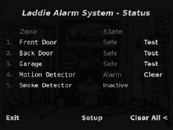
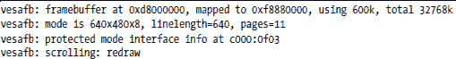
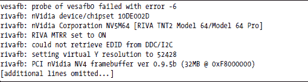

**安装帧缓冲区设备驱动程序**

Laddie CD 设计为与尽可能多的显卡一起工作。为了实现这一点，它默认使用广泛采用的视频标准的帧缓冲区设备驱动程序，并为其配置了低分辨率显示，每像素只有八位。如果此驱动程序失败，系统将尝试找到针对您的显卡的特定硬件驱动程序，并使用其默认配置加载该驱动程序。这种方法将为大多数系统提供一个最小的工作帧缓冲区。但是，如果您想更好地利用您的特定硬件，您需要采取一些额外的步骤。

在本附录中，我们将涵盖以下主题：

+   为您的显卡查找帧缓冲区设备驱动程序

+   配置帧缓冲区设备驱动程序

**为您的显卡查找帧缓冲区设备驱动程序**

要查找您的显卡的可用设备驱动程序，请使用 Laddie CD 启动您的 PC。

如果 Laddie CD 成功找到您的显卡的驱动程序，它将启动 Laddie 帧缓冲区用户界面，如图 C-1 所示。否则，在登录提示符之前，它将显示消息 *帧缓冲区 (/dev/fb0) 不可用*。

*图 C-1：Laddie 帧缓冲区用户界面*

目前，我们假设帧缓冲区驱动程序已成功加载。要确定加载了哪个驱动程序，首先通过按 ESC 键退出帧缓冲区用户界面。然后在命令提示符下输入以下内容：

laddie:~# dmesg | grep fb

dmesg 命令显示自启动以来内核产生的消息缓冲区，grep 命令选择可能与帧缓冲区有关的消息。

***vesafb 驱动程序***

Laddie CD 首先尝试加载 vesfab 视频驱动程序，因为这是未知显卡最可能的候选者。vesafb 驱动程序支持由视频电子标准协会 (VESA) 开发的接口，称为 VESA BIOS 扩展 (VBE)。该驱动程序依赖于 BIOS，因此必须在系统启动时进行配置。这意味着 vesafb 驱动程序必须编译到内核中，而不是作为单独的模块提供。Laddie 设备使用引导提示命令配置驱动程序，我们将在后面进行描述。

这里是我们系统中一个成功安装了 vesafb 驱动程序的示例输出：

***特定硬件的驱动程序***

如果您的系统成功加载了 vesafb 驱动程序，您需要在启动时禁用该驱动程序以检查其他驱动程序。为此，重新启动 Laddie CD。当您看到启动提示时，键入 **novesa** 并按 ENTER。如果 framebuffer UI 启动，这意味着系统找到了合适的驱动程序。退出 framebuffer UI，并键入命令 **dmesg | grep f** **b**。当我们对我们中的一个系统执行此操作时，该命令生成了以下内容：

我们可以看到 vesafb 驱动程序未能加载，而特定于设备的驱动程序成功加载。rivafb 是 NVIDIA 图形卡的视频驱动程序。

您还可以使用 lsmod 命令检查您的系统加载了哪些特定于硬件的 framebuffer 驱动程序。在控制台执行以下命令：

lsmod | grep fb

lsmod 命令列出了内核当前加载的所有模块；framebuffer 名称通常包含字母 *fb*，例如 *nvidiafb, radeonfb, savagefb* 或 *matroxfb_g450*。顺便说一下，lsmod 命令对 vesafb 驱动不起作用，因为 vesafb 驱动不是一个模块——它是编译到内核中的。

***Laddie CD 上未包含的驱动程序***

如果 Laddie CD 没有找到您的图形卡的驱动程序，那么可能有一个更新的内核支持它。在这种情况下，使用 lspci 命令来识别您的图形卡。如果您的卡是 AGP、PCI 或 PCI-Express，此命令将报告它。以下是在我们的一台开发机上运行 lspci 命令时产生的几行之一。

01:00.0 兼容的 VGA 控制器：nVidia Corporation NV15 [GeForce2 GTS/Pro] (rev a4)

此输出显示我们有一个 NVIDIA 兼容的 VGA 控制器（VGA 代表 *视频图形数组)*。在这个时候，您可能需要在互联网上花费一些时间来寻找适合您的图形卡的驱动程序。同时请注意，Linux 不支持所有图形卡，因此您可能需要安装不同的卡才能使用 Linux framebuffer。

**配置 Framebuffer 设备驱动程序**

一旦您找到了适合您硬件的正确视频驱动程序，您就需要将其配置为所需的视频模式。

***vesafb 驱动程序***

由于 vesafb 驱动程序依赖于实模式 BIOS 函数进行初始化，因此它必须编译到内核中，并在启动时进行配置。此配置在内核命令行中指定，并可能在启动提示或引导加载程序的配置文件中提供。对于 vesafb 驱动程序，内核命令行应包括以下内容：

video=vesafb *vga=<Linux video mode>*

*Linux 视频模式* 是一个指定特定分辨率和每像素位数的数字。这个数字是通过将 *0x200* 添加到由 VESA BIOS 扩展标准指定的视频模式编号中形成的。这些 Linux 视频模式在表 C-1 中总结。

**表 C-1:** Linux 视频模式编号

**选择合适的视频模式**

典型的 VBE 兼容图形卡可能不支持所有这些模式，因此你可能需要尝试以找到一种可以工作的方式。最简单的方法是指定

video=vesafb vga=ask

（如果你正在使用 Laddie CD 进行实验，完整的引导提示符行将是 linux vga=ask。）内核初始化代码将显示一系列模式并请求一个模式号。你可以忽略它提供的那些，因为这些是为仅文本控制台准备的。

此外，无需选择扫描选项。最好的情况是，这将提供更长的文本模式列表；最坏的情况是，它将使系统挂起，你必须重新启动。实际上，每次输入不受支持的数字时，内核都会立即响应*未知模式 ID。重试*，所以找到一种可以工作的方式不会花费很长时间。在输入模式时，只需提供十六进制数字，无需前缀*0x*。

**更新内核命令行**

一旦你找到一个可以工作的 VBE 视频模式，你可以在引导加载程序配置文件中更新内核命令行。在这种情况下，你需要使用前缀*0x.*。例如，在 Linux 引导提示符下的命令

video=vesafb vga=0x311 3

适用于支持 640 x 480 分辨率且每像素 16 位的 VBE 兼容视频卡。最后的*3*指定运行级别 3 以防止 X 显示管理器加载单独的视频驱动程序。

**注意**

*vesafb 驱动程序接受用于功能如高效滚动的可选参数。有关详细信息，请参阅/usr/src/linux/Documentation/fb/vesafb.txt。*

***特定硬件的驱动程序***

如果你以 novesa 选项引导 Laddie CD，并且系统能够找到特定硬件的视频驱动程序，它将为视频模式提供默认设置。

在本节中，我们将描述如何使用 Laddie CD 进行这些设置的实验，然后如何在你自己的系统引导时选择你首选的设置。这些注释也适用于 Laddie CD 不支持的视频驱动程序，尽管你将不得不使用你自己的系统来实验它们。

**尝试不同的视频模式**

与 vesafb 驱动程序不同，非 VBE 驱动程序可以在启动后更改模式。要更改视频模式，请使用 fbset 实用程序。此实用程序访问/etc/fb.modes 文件，将模式名称与几何和定时参数关联。例如，命令

fbset 640x480-60

将找到与字符串 640x480-60 相关的几何和定时参数，并使用这些参数将帧缓冲区切换到 640 x 480 的分辨率，频率为 60 Hz。如果此命令成功，你可能会看到控制台屏幕发生变化（例如，字体变大），因为它切换到不同的图形模式。

如果你所在的发行版中没有 fbset 实用程序，你可以从[`packages.debian.org/stable/admin/fbset`](http://packages.debian.org/stable/admin/fbset)下载它。如果你自己安装，请确保在/etc 中安装适当的 fb.modes 文件。你可以使用 fbset 包中提供的 fb.modes 文件之一（这是我们做的），但请谨慎操作，因为错误的时序值可能会损坏某些显示器。

**在启动时选择所需的视频模式**

Laddie CD 维护硬件特定的视频驱动程序作为模块，但一旦你找到了适合你系统的适当 framebuffer 设备驱动程序，你可能希望将其构建到内核中。当然，Laddie CD 没有这个选项，但如果你为自己的系统重新构建内核，你需要在内核引导提示符下配置驱动程序。现在许多非 VBE 的 framebuffer 设备驱动程序现在支持在内核命令行上提供视频模式的通用语法。按照这个语法，examplefb 驱动程序在引导时可以通过以下命令选择：

video=examplefb:1024x768-24@76

这指定了 1,024 像素的宽度，768 像素的高度，每像素 24 位，以及 76 Hz 的刷新率。

**注意**

除了刷新率外，没有提供时序信息。内核包含一个时序参数数据库（有关详细信息，请参阅文件/usr/src/linux/drivers/video/modedb.c），并将搜索与提供的分辨率和刷新率匹配的条目。如果找不到匹配项，它将使用默认的视频模式，如果这也失败了，它将尝试数据库中的所有模式。

通常，以下格式用于指定视频模式：

<xres>x<yres>[M][R][-<bpp>][@<refresh>][i][m]

在这里，可选的 M 请求使用*VESA 协调视频时序*，这是一种基于分辨率、刷新率、显示器类型（CRT 或数字显示）和交错的方法来确定适当的时序的系统方法。可选的 R 指定数字显示的减少消隐。可选的 i 指定交错模式，可选的 m 请求在时序计算中增加额外的 1.8%边缘。

除了这里概述的通用语法之外，特定的驱动程序可能支持其他选项，例如禁用加速。驱动程序之间很少有共性；你可能需要查阅你的驱动程序的源代码来找到这些选项。

**验证您的 framebuffer 驱动程序的设置**

如果你已成功加载 framebuffer 驱动程序并想了解更多关于其配置的信息，你可以使用 fbset -i 命令来报告你的 framebuffer 的几何形状、时序和其它各种参数。

要查看已加载的 framebuffer 驱动程序的配置数据，尝试使用 cat 来检查/proc/fb 和/sys/class/graphics/fb0 目录中的文件的内容。并非所有驱动程序都会更新/sys 目录，但它们这样做时，这些文件提供了方便地访问 framebuffer 参数（如 bits_per_pixel 和 color_map）的方法。

关于 Linux 帧缓冲区的更多信息，请参阅（有些过时）的 HOWTO 文档，链接为 [`tldp.org/HOWTO/Framebuffer-HOWTO.html`](http://tldp.org/HOWTO/Framebuffer-HOWTO.html)。VBE 3.0 规范可在 [`www.vesa.org/public/VBE/vbe3.pdf`](http://www.vesa.org/public/VBE/vbe3.pdf) 获取。
