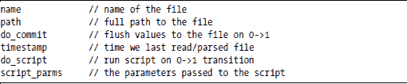

**数据库到文件实用程序**

本附录描述了 tbl2filed，这是一个守护进程，允许您使用 SQL 读取和写入 Linux 配置文件中的值，就像这些值在数据库中而不是文件中一样。如果您想使用 RTA 为新守护进程，并希望保持相同的数据库隐喻来读取和写入传统、非 RTA 配置文件中的值，则此实用程序很方便。本附录讨论了以下主题：

+   概述

+   表定义

+   用法和 API

+   安全注意事项

**概述**

tbl2filed 守护进程的目标是允许您的 UI 程序使用 PostgreSQL 库读取或写入（SELECT 或 UPDATE）RTA 表，并使底层系统配置文件作为 SELECT 或 UPDATE 的一部分进行扫描或修改。此实用程序试图模拟以下常见任务：

+   查看配置文件中的值（SELECT value . . .）

+   编辑配置文件中的值（UPDATE value . . .）

+   原子性地将文件写入磁盘（UPDATE tbl2file SET do_commit . . .）

+   如果需要，重新启动服务（UPDATE tbl2file SET do_script . . .）

tbl2filed 守护进程允许您通过在两个 RTA 表上使用 PostgreSQL 命令来读取和写入配置文件。第一个表，tbl2file，描述了由守护进程管理的文件，第二个表，tbl2field，描述了管理的字段。

图 D-1 说明了此实用程序如何将两个表映射到磁盘文件内的文本字段中。

*图 D-1：使用 SQL 访问文件中的数据。*

此守护进程还允许我们将系统服务的所有重启脚本放入一个文件中，并使用单一方法（写入回调）来调用它们。这种方法可能有助于安全性，因为它允许非特权 UI 程序安全地更改系统配置文件。

**表定义**

在本附录的后面给出了一个示例，但为了使该示例有意义，您需要对两个 tbl2filed 表的内容有所了解。Laddie 使用 tbl2filed 来帮助网络配置，您可以通过查看运行中的 Laddie 系统中的表来更容易地理解这些表。启动 Laddie CD，并遵循 192.168.1.11/table_editor/rta/rta_apps.html 上的 tbl2filed 链接。

***tbl2file 表***

管理的文件信息表，tbl2file，有以下列：

文件名是用户界面看到的名称。它也用作 tbl2field 表的索引的一部分。这可以仅仅是文件的简称或助记符，例如，*resolv.*

路径是文件的完整路径，包括文件名。例如，名称字段可能是 *resolv*，而路径可能是 */etc/resolv.conf*。

将 1 写入 do_commit 标志会导致管理文件的值写回到磁盘文件。首先将文件写入临时文件，然后调用 rename()将临时文件移动到目标文件。这种机制通过尽可能使整个文件的写入原子化来帮助维护系统的一致性。对 do_commit 的 SELECT 查询始终返回零。

从文件中读取和解析值在时间和 CPU 周期上都是昂贵的。由于文件不会经常改变，我们可以通过在 tbl2field 表中缓存文件的值来提高系统的响应速度，并且只有在文件自上次读取以来被修改时才重新读取文件。时间戳标记了我们上次读取和解析文件的时间；时间是以自上次写入以来的秒数来衡量的。当一个 UI 请求一个值时，我们的守护进程会将文件 inode 中的 mtime（最后修改时间）与我们的时间戳进行比较，如果需要，则重新扫描文件，或者如果缓存的值仍然有效，则直接从字段表中返回值。

将 do_script 设置为 1 将启动脚本/usr/local/tbl2filed/tbl2script.sh。（脚本位置在 tbl2filed Makefile 中设置。）script_parms 字段包含一系列用空格分隔的参数，这些参数传递给脚本。参数不是通过命令行传递的；相反，它们通过标准输入传递，并使用 cut 命令解析为参数。此脚本被启动并遗忘——也就是说，我们忽略从它那里返回的任何返回值。此脚本仅在显式写入 1 到 do_script 列时运行，并且该列仅用于其写入回调。对该列的 SELECT 查询始终返回零。Laddie 使用此脚本，例如，在用户更改设备的 IP 地址时重新启动网络。

***The tbl2field Table***

存储单个字段值的 tbl2field 表具有以下列：

名称是文件的名称，必须与 tbl2file 表中的名称列匹配。

字段是所有 UI 程序看到的字段名称。这始终用于 WHERE 子句中，以标识要读取和更新的确切字段。

模式是一个正则表达式，与跳过计数结合使用，可以唯一地标识文件中的字段。模式应包含恰好一组括号，以从文本行中提取值。例如，要从 resolv.conf 文件中获取第一个 DNS 名称服务器，我们可能使用以下正则表达式：

^nameserver[ \t]+([0-9\.]+)

如果模式不能解析为正则表达式，则 regerr 字段不为零。在开发期间，通常只需要检查 regerr。

跳过列告诉守护进程在将行作为值的来源选择之前要跳过上述模式中的多少个。例如，我们会使用跳过值为 1 来从 resolv.conf 中读取第二个 DNS 名称服务器。这将跳过一个名称服务器并读取第二个。

格式字段用于在目标文件中重现配置数据行。我们可以从正则表达式获取这个值，但使用 printf 格式字符串要容易得多。如果这个字段留空，则该字段被视为只读字段。/proc 或/sys 中的任何只读值都应该有一个空白的格式字段。你可以通过查看 tbl2field 表中的 uptime 字段来查看一个只读值的良好示例。对于 resolv.conf 中的名称服务器行，格式字符串将是 nameserver %s。格式字符串中不需要\n，因为它会被 print 语句自动添加。

值是该字段当前值的字符串表示。对这一列进行 SELECT 操作将导致如果需要（参见 tbl2file 上面的时间戳）读取并解析文件。如果缓存的值仍然有效，则直接从表中获取值。对这一列的写入将保存表中的值，但不会实际写入文件；将 do_commit 设置为 1 来执行写入操作。

**一个 tbl2filed 示例**

让我们通过继续 Laddie 的名称服务器配置来查看一个完整的示例。运行中的 Laddie 系统上的/etc/resolv.conf 文件看起来如下所示：

nameserver 204.117.214.10

nameserver 199.2.252.10

nameserver 65.173.40.10

我们的目标是能够使用以下 SELECT 语句读取第一个 DNS 名称服务器：

psql -h localhost -p 8885

> SELECT * FROM tbl2field where name = "nameserver_1";
> 
> \q

同样，为了修改第二个 DNS 服务器，Laddie 使用以下 UPDATE 语句：

你可以通过启动 Laddie CD，退出 frame-buffer 菜单，以 root 身份登录，并执行上述命令来验证上述内容。务必验证 UPDATE 命令后文件是否已被修改。

现在，让我们看看 tbl2file 和 tbl2field 配置，它使我们能够像在 PostgreSQL 数据库中一样读取和写入名称服务器 IP 地址。我们首先在 tbl2file 表中列出我们想要管理的文件：

UPDATE tbl2file SET name=resolv, path=/etc/resolv.conf, script_parms="" LIMIT 1 OFFSET 0

我们不需要在编辑完 resolv.conf 文件后运行脚本，因此我们可以留 script_parms 为空。你可以使用完整路径或相对路径名称，但作为一个安全预防措施，使用完整路径名称是个好主意。

在这个例子中，我们想要管理三个 DNS 名称服务器。这个 SQL 语句是从 tbl2field.sql 文件中获取的（可能需要使用完整路径，例如，/opt/laddie/tbl2filed/...）如下所示：

模式识别带有参数的行，并且模式中的单个括号对提取实际的字段值。在上面的示例中，命名服务器字段的值必须只包含数字零到九和/或小数点。括号不是识别的一部分——它们仅用于提取字段值。

tbl2filed 守护进程的一个优点是，当您向字段写入值时，守护进程使用格式字符串构建新配置行的副本。然后它对新行运行模式，如果模式不识别新行，则拒绝更新。在这个例子中，对 11.22.33.44 的命名服务器更新将成功，因为它包含所需的数字和小数点；然而，Bob 的娱乐屋的命名服务器更新将失败，因为它不包含所需的数字和小数点。

命名服务器示例也说明了跳过列的使用。主命名服务器将跳过设置为零，这意味着我们使用第一个匹配模式的行。辅助命名服务器指定跳过设置为 1，意味着我们跳过一条匹配行并使用第二条匹配行。¹

**安全注意事项**

根据您如何使用它，这个守护进程可能会增强或损害您的系统安全性。乍一看，拥有一个以 root 权限运行并接受数据库连接的守护进程似乎是个坏主意。另一方面，这可能会让您通过只运行一个作为 root 运行的守护进程并作为非 root 用户运行每个 UI 程序来提高安全性。这样，如果攻击者入侵了您的 UI 程序之一，他或她只能获得该非 root 用户的权限。与大多数需要以 root 身份运行以进行系统更改的 Linux 设备相比，这是一个对比。

守护进程在启动时读取 tbl2file.sql 和 tbl2field.sql，然后将其所有配置列标记为只读。不允许更新受管理的文件或脚本参数有助于提高安全性，但也意味着您在程序启动后无法更新配置的任何部分。您必须在启动 tbl2filed 守护进程之前直接编辑 tbl2file.sql 和 tbl2field.sql 文件。如果您必须将任何列标记为读写以简化开发，请确保在发布产品之前将其改回只读。此外，请确保保护目录和文件的写权限，以防止守护进程的初始配置被篡改。

__________________

¹ resolv.conf 文件与大多数 Linux 配置文件不同，因为将引导配置协议从 DHCP 切换到或从 DHCP 切换，可以完全破坏您之前写入的所有值。解决这个问题的一个简单方法是在必要时将模板文件复制到/etc/resolv.conf。
