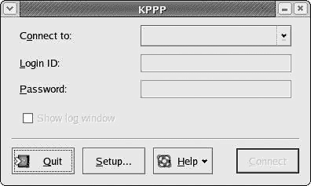
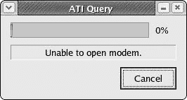
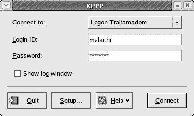
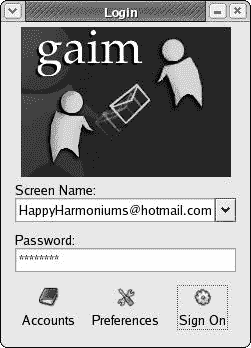

# 第四章：不止是网状脚

*使用 Linux 上网*

现在，一台没有连接到互联网的电脑就像一个没有水的铝制浓缩咖啡机在你炉子的前烧架上煮着。幸运的是，你的 Fedora 系统已经很好地配备了处理你无疑为其准备的许多互联网任务。

## 连接硬件

为了连接到互联网，你必须有相应的硬件。有几种可能的方法可以实现这一点，包括高速局域网（LAN）、电缆调制解调器和来自电话公司的 ADSL 连接。大多数电脑也内置 56 Kbps 调制解调器或可以连接到外部调制解调器，通过普通电话线进行较慢的拨号连接。

### *高速连接*

如果你通过有线电视或电话公司拥有高速互联网连接，或者如果你在办公室通过局域网系统连接到互联网，那么你真的很幸运，因为这些设置可能是最容易处理的。很可能是，你所要做的就是将墙上的以太网线（如果你使用的是局域网）或从你的电缆调制解调器连接到你的机器的网络卡端口。之后，一旦你启动你的机器，你就可以开始使用了。

|  | 注意  | *如果你不确定以太网线是什么样子，它是一种圆形电缆，大约八分之一英寸厚，末端有一个看起来像超大型电话插头的插头，如图图 4-1 所示。* 图 4-1：标准电话线和以太网插头对比 |
| --- | --- | --- |

如果你遇到在线问题，并且你试图通过局域网或电缆调制解调器连接到互联网，问题可能是你的网络卡不受你的系统支持。这很容易解决（通过更换它），并且幸运的是，这种情况相对罕见。

然而，问题也可能是你的网络或服务提供商没有通过动态主机配置协议（DHCP）自动分配地址。DHCP 是一种方式，你的互联网提供商可以自动（动态地）为你提供系统连接到互联网所需的配置信息。如果你的提供商不使用 DHCP，你必须从网络管理员或服务提供商那里获取必要的设置信息，并自行输入。

如果你正好处于这种情况，你将它们输入到网络配置窗口中。要访问此窗口，请转到主菜单并选择**系统设置** > **网络**。在提供所需的 root 密码后，配置窗口将打开。你的以太网或网络卡应该已经突出显示，所以只需点击**编辑**。这将打开以太网设备窗口，这就是你将输入所有设置的地方，按照指示操作。

### *无线网络连接*

最近，许多办公室、大学，甚至是那些从有线电视公司获得高速互联网连接的家庭都已经转向了无线连接。在大多数情况下，设置过程与前面描述的有线网络连接过程相当相似。当然，也有一些值得注意的差异。如果你正在使用无线网络连接到互联网，或者只是好奇无线这个概念是什么，请查看第十八章。在大多数情况下，你应该能够使用你到目前为止拥有的技能轻松地设置一切。

### *内置调制解调器*

许多，如果不是大多数，你们仍在使用拨号互联网连接，这意味着你们需要有一个传统的拨号调制解调器才能从你们的盒子里连接到外部世界。这些调制解调器，如果你已经忘记了，就是那些在你拨号上网时发出哨声、铃声、尖叫声和喷气声的奇妙机器。我想你可以把它们想象成需要好好打嗝的嘈杂电话。

在 Linux 中处理调制解调器的最大缺点是，Linux 支持的调制解调器非常少。然而，事情的好的一面是，一旦你找到了一个可以工作的调制解调器，设置起来相对容易。兼容性问题的主要罪魁祸首是一个被称为 Winmodem 的怪物。随着硬件制造商试图为你提供越来越便宜的机器，他们不可避免地试图在这里那里削减成本。Winmodem 就是这些成本削减发展之一。

虽然从技术上讲，Winmodem 是一个硬件设备，但它与所谓的硬件调制解调器相去甚远。硬件调制解调器，简单来说，是一个没有听筒和拨号的电话，它插在你的电脑的某个地方。这是一个完全功能的机器，只需要你的系统提供拨号和连接信息。另一方面，Winmodem 完全依赖于系统。这是一个假调制解调器，它和吸血虫比电话更相似，因为它必须利用 Windows 系统来完成其任务。当你使用 Linux 系统时，你并没有使用 Windows 系统，所以你有点陷入困境，因为 Winmodem 没有可以利用的。事实上，Winmodem 的大部分工作都是由系统本身完成的，这意味着它是一个非常简单的硬件设备。这当然意味着 Winmodem 的生产成本比真正的硬件调制解调器要低得多。在这种情况下，你可以相当肯定，如果你的机器内置了调制解调器，那么它是一个 Winmodem。

当然，Linux 社区一直在努力寻找处理这些 Winmodem 怪物的方法，以便它们能在 Linux 系统上工作。当它们确实工作时，Winmodems 被称为 Linmodems，但对各种调制解调器型号的支持仍然相当零散。如果您不确定您安装了什么类型的调制解调器，我的建议是走一遍互联网连接设置过程，看看您的调制解调器是否工作。如果不行，您可以更换一个已知可以工作的调制解调器，最好是真正的硬件调制解调器。

可能找出哪些调制解调器与 Linux 兼容的最好方法是访问在线论坛之一，例如 Linux Questions ([www.linuxquestions.org](http://www.linuxquestions.org))或 JustLinux ([www.justlinux.com](http://www.justlinux.com))，并寻求建议。据说 US Robotics 的 56K V.92 性能专业调制解调器（内部插槽）和 56 PC 卡型号也可以工作。

调制解调器（PC 卡插槽，用于笔记本电脑）都是易于获得的真实硬件调制解调器，据说可以工作，尽管我必须承认我还没有亲自尝试过这些型号。您可以访问 US Robotics 网站获取有关这些型号的更多信息([www.usr.com](http://www.usr.com))。

|  | 警告  | *在购买调制解调器时，要小心那些声称与 Linux 兼容的通用、无品牌的内部调制解调器。首先上网核实这种说法。有时，这样的调制解调器只有在您对系统做了各种可怕的事情之后才会兼容，即使是铁杆的 Linux 极客也不愿意去麻烦。盒子上的可爱小企鹅图标并不一定意味着调制解调器对企鹅友好。可能只是这只可怜的小鸟被愚弄了。* |
| --- | --- | --- |

### *外置调制解调器*

如果您打算在 Linux 系统上使用调制解调器，最佳解决方案是使用外置串行调制解调器。外置调制解调器位于计算机外部的一个盒子里，并通过串行端口连接到计算机的后面，这个端口看起来像有一个小刺的孔（见图 4-2）。因为调制解调器不使用您的操作系统来操作，所以在它忙碌时不会占用系统资源，这可能会导致计算机速度的提升。

图 4-2：串行端口和连接器

大多数外置串行调制解调器都应该与您的系统兼容，至少大多数人会这样告诉您。如果您担心并且正在寻找一个稳妥的选择，Zoom Telephonics ([www.zoom.com](http://www.zoom.com))生产了一种与 Linux 兼容的外置串行调制解调器，他们直接在网站上这样说的。据说 US Robotics 56KV.92 外置传真调制解调器也可以工作，尽管我还没有亲自尝试过这个型号。

如果您发现另一个型号的调制解调器，您认为它可能有效，在您通过支付现金来承诺购买之前，请使用该调制解调器的品牌和型号号进行 Yahoo 或 Google 搜索，并加上“Linux”这个词，看看您能得到什么搜索结果。当然，您也可以尝试 Linux 论坛，并在那里询问调制解调器的品牌和型号。有很多人和您一样，所以您肯定能得到很多意见和建议。

### *确保您的调制解调器一切正常*

假设您最终得到了一个应该与您的 Linux 系统兼容的调制解调器。现在您必须确保您的系统识别它。要设置它，将调制解调器连接到计算机和墙上的电话插孔。打开调制解调器（如果它是外置调制解调器）然后启动您的机器。如果一切正常，Fedora 将自动找到并配置您的调制解调器。

然而，您可能首先需要经过几个非常简单的步骤来配置您的调制解调器，在启动机器后不久。如果是这样，您将看到一个半图形化的屏幕告诉您 Kudzu（Red Hat 硬件浏览器）发现了一块新的硬件。要配置新设备，只需按任意键继续，然后按 ENTER 键进行配置。就是这样。

### *设置 KPPP 作为您的互联网拨号器*

您的调制解调器现在已全部设置好并准备就绪，但在实际上线之前，您必须设置一些事情，以便它能够拨号连接到您的互联网服务提供商。这相当简单，通过这个过程，您还可以确保您的调制解调器实际上与您的系统兼容。

有一种方法可以通过 GNOME 来设置，这并不像使用 KPPP（KDE 互联网拨号器）那样顺畅或令人满意。KDE 应用程序可以在 GNOME 中运行，所以不用担心这一点。

要进入 KPPP，请转到主菜单并选择 **互联网** > **更多互联网应用程序** > **KPPP**。之后，系统将提示您输入 root 密码，因此请输入并点击 **确定**；KPPP 窗口将很快出现（见 图 4-3）。

图 4-3：使用 KPPP 进入您的互联网设置

点击 **设置** 按钮。KPPP 配置窗口将打开，一旦打开，点击 **调制解调器** 选项卡，然后在调制解调器页面，通过点击 **查询调制解调器** 按钮测试您的调制解调器。KPPP 将搜索您的调制解调器，如果找到，将显示其查询结果（见下一页的 图 4-4）。

图 4-4：KPPP 显示成功调制解调器查询的结果

如果 KPPP 找不到你的调制解调器，它会在一个消息窗口中告诉你（参见图 4-5）。如果是这种情况，点击 **取消** 关闭该窗口，然后点击主配置窗口中的 **设备** 选项卡。在设备页面（如图 4-6 所示），查看 **调制解调器设备** 下拉菜单，它很可能将 **/dev/modem** 列为默认位置；在该菜单中选择下一个设备位置，**/dev/ttyS0**。一旦你这样做，返回到 **调制解调器** 选项卡，通过再次点击 **查询调制解调器** 来尝试新的设置。如果这也不行，只需重复选择下一个设备并再次查询调制解调器的过程，直到找到正确的设备位置。如果 KPPP 永远找不到你的调制解调器，那么是时候用已知与 Linux 兼容的调制解调器来替换它了。

图 4-5：KPPP 的“找不到调制解调器”信息

图 4-6：在 KPPP 配置窗口中选择另一个设备位置

一旦 KPPP 找到你的调制解调器，你就可以设置一个拨号账户。（你需要从你的互联网服务提供商那里提供的适当配置细节。）点击 **账户** 选项卡，然后点击 **新建**。一个小的窗口会立即弹出，询问你是否想使用设置向导或基于对话框的标准设置。忽略小字，忘记向导，只需点击 **对话框设置**，这将弹出新建账户窗口（参见图 4-7）。

点击展开

图 4-7：在 KPPP 中设置新账户

在新建账户窗口的 **拨号** 选项卡顶部附近，你可以给你的连接账户命名；你可以自己决定叫什么，但大多数人会使用与提供商名称相关的东西。接下来，你必须添加一些拨号号码，这些号码你应该已经从你的服务提供商那里收到了。要添加一个号码，只需点击 **添加**，在弹出的窗口中输入号码，然后点击 **确定**。如果你的提供商给了你多个号码，以同样的方式添加每个号码。

如果你真的很幸运，那么你就可以完成了。然而，如果你稍微有点不那么幸运，你的提供商可能需要你手动输入一些其他信息。在这种情况下，你可能唯一需要做的事情就是点击 **IP**（互联网协议）或 **DNS**（域名系统）选项卡，并添加提供商指定的信息。看看你的提供商对在哪里输入有什么要说的。如果他们给你一些关于不支持 Linux 的胡说八道，只需截图这个新建账户窗口的前四个选项卡页面，将截图传真或邮寄给你的提供商，然后要求他们告诉你应该在哪里输入。如果他们给你正确的信息，就没有理由事情不能工作。无论如何，你可能不需要经历这样的对抗性场景。

|  | 注意  | *如果你想知道 IP 和 DNS 是什么，你可以这样简单地想：DNS 将你熟悉的易于记忆的 URL（例如[www.yahoo.com](http://www.yahoo.com)）转换成互联网可以理解的数字或 IP 地址。因此，地址[`www.yahoo.com`](http://www.yahoo.com)变成了[`216.109.118.68/`](http://216.109.118.68/)。你可以在浏览器中输入这个数字版本，亲自查看。* |
| --- | --- | --- |

一旦你完成设置调制解调器并输入任何必要的设置，剩下的唯一事情就是点击**确定**来关闭新账户窗口，然后在配置窗口中再次点击确定来关闭它。你应该会剩下主 KPPP 窗口，现在显示你的新账户信息（图 4-8）。

图 4-8：在主 KPPP 窗口中显示的新账户信息

### *连接和断开连接*

要连接到互联网，只需将你的服务提供商给你的登录 ID 和密码输入到 KPPP 窗口中，然后，在确认你的调制解调器已开启（如果是外置调制解调器）后，点击**连接**。片刻之后，你的调制解调器应该开始发出可怕的喷溅、嘶嘶声和搅拌声，你就可以开始使用了。当你看到 KPPP 窗口自动最小化时，你就知道你已经建立了互联网连接，尽管它将继续在 GNOME 面板中可用。

一旦你完成浏览，你可以通过在面板中点击最小化的 KPPP 窗口来轻松断开与互联网的连接，然后，当窗口恢复到原始大小时（参见图 4-9），点击**断开连接**。然后你可以点击**退出**来关闭 KPPP。下次你打开 KPPP 时，你不需要输入你的登录 ID 或密码。

图 4-9：KPPP 登录窗口的最大化和最小化（面板）视图

你很可能经常会使用你的 KPPP 拨号器。因此，将启动器添加到你的 GNOME 面板中可能是个好主意，而且绝对非常方便。你现在应该知道如何做这件事，但以防万一，这里是一些步骤：

1.  在 GNOME 面板的空白区域右键单击。

1.  从弹出菜单中选择**添加到面板** > **从菜单启动器** > **互联网** > **更多互联网应用程序** > **KPPP**。

* * *

* * *

## Mozilla — 你的互联网浏览器

如果你曾经使用过 Netscape，那么你本质上就了解了 Mozilla，因为 Netscape 是基于 Mozilla 设计的。如果你来自 Internet Explorer 或 Apple Safari 的世界，那么在这些浏览器中，实际上不应该有任何让你感到困惑的地方。这些浏览器中的操作大致相同。在这种情况下，你应该能够在没有任何指导的情况下使用 Mozilla 的基本功能。

### *Mozilla 中的标签浏览*

然而，有一个独特的点属于 Mozilla（以及随之而来的 Netscape），这一点值得特别提及；那就是非常实用的功能——标签页。

通常情况下，当你在一个网页中点击一个链接时，新页面会在同一个窗口中打开。在一些页面上，链接被编码成在新窗口中打开新页面，或者你可能偶尔会通过右键点击链接并选择**在新窗口中打开链接**选项来打开链接。这非常有用；然而，一旦你打开了几个浏览器窗口，要在这许多打开的窗口中找到你想要的东西就会变得有点困难。这也会稍微减慢一些速度。

这就是标签页功能派上用场的地方。要了解它是如何工作的，现在就亲自试试。通过点击 GNOME 面板上的 Mozilla 启动器打开你的 Mozilla 浏览器；然后转到[www.google.com](http://www.google.com)并搜索“城市沸腾的青蛙”，作为一个有趣的例子。一旦结果显示，右键点击顶部链接，在弹出菜单中选择**在新标签页中打开链接**（见图 4-10）。

图 4-10：在 Mozilla 中在新标签页中打开链接

一旦你这样做，新页面就会出现在一个新标签页中，而你原来的搜索结果页面仍然在那里，准备好在另一个标签页中等待（见图 4-11）。我相当有信心地说，一旦你习惯了这一功能，你就不会再错过你以前使用的旧版 Internet Explorer 了。

图 4-11：在 Mozilla 中在新标签页中打开的链接

你还可以设置 Mozilla，在输入 URL 时在新标签页中打开页面。只需转到**编辑**菜单并选择**首选项**。在首选项窗口中，点击窗口左侧的面板中的**标签页浏览**，然后勾选**在地址栏中按 Control+Enter**旁边的复选框。当你在那里时，你也可以勾选**在网页中的链接上中间点击或按 Control 键点击**旁边的复选框。完成这些后，只需点击**确定**。

现在你输入 URL 并同时按下 CTRL 和 ENTER 键时，新页面将在新标签页中打开，而不是同一个窗口。此外，如果你在点击链接时按住 CTRL 键，它也会在新标签页中打开（或者如果你有一个三按钮鼠标，单独点击中间按钮也会达到同样的效果）——这是右键点击方法的一种变体。

### *Mozilla 弹出管理器*

Fedora Core 中较新版本的 Mozilla 自带一个方便的新功能，称为弹出窗口管理器。当你首次访问一个弹出那些令人烦恼的弹出窗口的网页时，Mozilla 会弹出一个对话框询问你是否想要设置偏好设置以抑制此类窗口的出现。如果你选择使用此功能，偏好设置将打开到弹出窗口部分，你可以去除大部分这些讨厌的麻烦事（见图 4-12）。你可以通过点击**允许的网站**按钮允许指定网站的弹出窗口。不用说，这是一个极其有用、有效且受欢迎的功能。

(0412_0.jpg)

图 4-12：在 Mozilla 偏好设置窗口中阻止弹出窗口

### *使用 Mozilla 创建网页*

Mozilla 不仅让你可以查看网页，还可以让你创建网页。Mozilla Composer（如图 4-13 所示）是一个相当简单但功能强大的 HTML 编辑器。它是一个 WYSIWYG（所见即所得，发音为“wiz-ee-wig”）编辑器，这意味着你可以在构建页面时看到页面将是什么样子——你不需要学习或处理 HTML 编码（除非你想这么做）。如果你想试一试，点击 Mozilla 浏览器的**文件**菜单，然后选择**新建** > **Composer 页面**。

(0413_0.jpg)

图 4-13：使用 Mozilla Composer 创建网页

如果你需要一点帮助开始使用 Mozilla Composer，请查看[`thelinuxapprentice.com/`](http://thelinuxapprentice.com/) designwebsitemozcomp.html 上的简要但有用的教程。你还可以通过访问 Composer 窗口的**帮助**菜单并选择**帮助内容**来找到更多信息。

* * *

* * *

## 邮件

Evolution 是 Fedora Core 的默认电子邮件程序，它可能最好被描述为一个打扮得更好、更有活力的 Outlook 克隆版（见图 4-14）。它允许你发送和接收邮件、安排约会以及列出任务。它还可以显示世界各地各种城市的天气状况和来自各种来源的新闻头条，所有这些都可以在程序设置中自定义。通过提供此类信息的直接访问，它甚至比 Outlook 做得更好。它也是一个比 Outlook 看起来更漂亮的程序，而且与 Fedora Core 一起发货的最新版本甚至比它们的 predecessors 看起来更好。

要使用进化（Evolution），只需点击 GNOME 面板上的邮件启动器或转到主菜单并选择**互联网** > **Evolution Email**。当你第一次运行进化（Evolution）时，你将看到一个设置向导，所以请准备好从你的互联网服务提供商那里收到的账户详情。这些应该包括你的 POP 主机地址（用于接收邮件）、你的 SMTP 主机地址（用于发送邮件）以及你的邮件密码，这通常与你的互联网登录密码不同。你的邮件密码实际上在各个向导步骤中并没有输入，所以在填写 POP 详情时请勾选**记住此密码**复选框。当你第一次连接到你的邮件服务器时，你将需要输入你的邮件密码，所以你可以当时输入它，以后就不再需要处理它了。

图 4-14：使用进化（Evolution）进行电子邮件、约会、任务和天气报告

毫无疑问，进化（Evolution）是 Linux 世界中最受欢迎的电子邮件软件，尽管它具有明显的吸引力和流行度，但我更倾向于使用更直接的 Mozilla Mail 来处理我的电子邮件事务。与多功能的进化（Evolution）相比，Mozilla Mail 是一个仅用于邮件的程序，使用起来非常简单。如果你需要处理多种字符集的邮件（例如英语和日语），这也是你想要使用的程序，因为进化在这方面的表现似乎较弱。Mozilla Mail 还拥有一个方便且有效的垃圾邮件控制功能，可以帮助你处理垃圾邮件（垃圾邮件）。如果你想尝试 Mozilla Mail，你可以通过主菜单选择**互联网** > **更多互联网应用程序** > **Mozilla Mail**来运行它。尝试使用进化（Evolution）和 Mozilla Mail，并使用你更喜欢的一个。这就是 Linux 的一大优点：选择。

如果你发现你更喜欢 Mozilla Mail 而不是进化（Evolution），你可以将你的 GNOME 面板中的邮件启动器更改为启动 Mozilla Mail，以使事情变得更容易。只需在面板中的电子邮件图标上右键单击，然后在属性窗口中，将“Evolution Email”的名称更改为 Mozilla Mail，并将命令“evolution”更改为/usr/bin/mozilla -mail。

* * *

* * *

## 使用 Gaim 进行即时消息

Fedora Core 允许你进行即时消息。无论你通常使用 MSN/Windows 即时消息、Yahoo Messenger、AOL 即时消息（AIM）还是 ICQ，你都可以设置 Gaim，一个单一的应用程序，来检查**所有**这些消息账户。然而，过去大多数人最关心的问题是**如何**设置 Gaim 来做到这一点——它可以说是不够直观的。然而，在随 Fedora Core 一起提供的 Gaim 新版本中，事情变得容易多了，所以你真的很幸运。

要设置 Gaim 并使其准备就绪，请转到主菜单并选择**互联网** > **即时消息**。点击**账户**按钮，然后在账户窗口中点击**添加**。这将打开显示在图 4-15 中的添加账户窗口。

图 4-15：将即时消息账户添加到 Gaim

从现在开始，设置 Gaim 变得非常简单。首先，在下拉菜单中选择适合你的消息服务的协议。然后输入你的屏幕名（通常是你的消息账户注册的电子邮件地址），你的密码（即你的消息密码），最后，你的别名（当你出现在他们的联系人列表中时，其他人看到的昵称）。完成所有这些后，点击**保存**，然后关闭其他 Gaim 窗口，包括主窗口。现在再次运行 Gaim，你的新账户将出现在主 Gaim 窗口中（见图 4-16）。你现在只需点击**登录**，很快你就可以开始聊天了。

图 4-16：使用 Gaim 登录

* * *

* * *

## 其他互联网应用

除了我已经讨论的程序之外，Fedora 发行版还包括许多其他互联网应用。你有 Konqueror 网络浏览器，如果你想要将网页保存为 PDF 文件，它非常有用，而且，正如我将在第八章中讨论的，还有一个名为 Epiphany 的另一个网络浏览器。然而，还包括其他用于不同互联网任务的应用程序，我现在将简要介绍其中的一些。

### *词典*

虽然通常不会将其视为互联网应用，但 GNOME 词典实际上就是这样。要打开它，在主菜单中选择**附件** > **词典**。在词典输入框中输入一个单词，点击**查找单词**按钮，然后词典将搜索多个在线数据库，并为该单词提供定义（见图 4-17）。

图 4-17：使用 GNOME 词典查找单词

### *gFTP*

如果你经常通过文件传输协议（FTP）从互联网下载文件，那么你将使用 GNOME 应用程序 gFTP。如果你已经熟悉 FTP 应用程序，你应该会感到 gFTP 的传统布局非常亲切（见下一页的图 4-18）。你可以通过转到主菜单并选择**互联网** > **更多互联网应用** > **gFTP**来运行 gFTP。

图 4-18：使用 gFTP 通过 FTP 下载

### *X-Chat*

最后，聊天室爱好者不必绝望；Fedora Core 附带聊天客户端 X-Chat（见图 4-19）。X-Chat 是一个非常强大且高度可定制的软件，对于那些在不同操作系统下使用过类似软件的人来说应该很容易使用。你可以通过转到主菜单并选择**互联网** > **更多互联网应用** > **IRC 客户端**来运行 X-Chat。

图 4-19：使用 X-Chat 聊天

* * *
