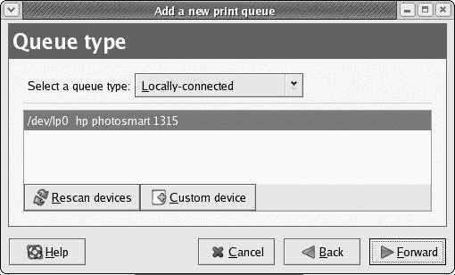
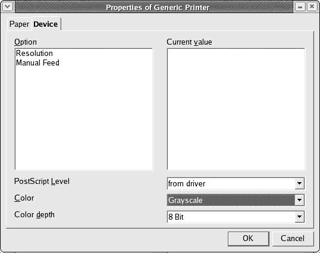
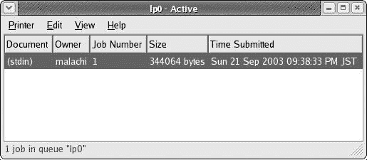

# 第六章：Gutenbird

*设置和使用您的打印机*

除非您使用计算机的唯一目的是玩游戏、听 MP3 或阻止热风中的门，否则您无疑会想将您的机器连接到打印机。这似乎是人类的一种天生的特性，使我们想看到我们的文字变成印刷品。如果您必须打印，您想打印，那么您就会打印……

## 我的打印机受支持吗？

将打印机设置为与您的系统一起工作是一项相当简单的任务，但您确实需要确保您的打印机受支持。幸运的是，看起来 Linux 世界中的打印机支持似乎比以前好得多。一般来说，对爱普生和惠普喷墨打印机的支持相当不错，而对其他制造商和其他打印机类型的支持则有点参差不齐。

如果您真的想确认您的打印机是否受支持（而且为什么不可以呢？），最好的做法可能是访问[www.linuxprinting.org.](http://www.linuxprinting.org)。在该网站上，您可以查看在线数据库以确定您的打印机是否目前受支持，以及受支持的程度。受支持打印机的列表还包括有关最适合您目的的驱动程序的信息。如果您正在考虑购买打印机，还有一个建议的品牌和型号页面。

* * *

* * *

## 设置环境

要开始，您必须关闭计算机，将打印机连接到计算机，打开打印机，然后重新启动计算机。当然，如果您的打印机在安装过程中已经连接并打开，您可以跳过此步骤。无论如何，如果您的打印机受支持，系统将找到它并自动配置它。

有时，事情可能不太自动：当系统启动时，它会在找到您的打印机后，弹出一个蓝红相间的 Kudzu（硬件探测工具）屏幕，告诉您它找到了一些新硬件。在那个屏幕上，然后按任意键继续，在下一个屏幕上您通过按回车键告诉它配置您的打印机。

就打印机硬件而言，这就结束了。之后，您可能还需要设置它，以便操作系统知道如何与该特定打印机通信。

要查看是否需要这样做，请转到 GNOME 面板并点击 GNOME 打印管理器图标（看起来像打印机的那个）。如果弹出的窗口中出现打印机图标，您就设置好了。

如果不是，请按照以下步骤操作：

1.  在 GNOME 主菜单中，选择**系统设置** > **打印**。系统会提示您输入管理员密码，所以请输入密码并点击**确定**。完成此操作后，打印机配置窗口（如图 6-1 所示）将出现，它将像清晨我的头脑一样空空如也。

    

    图 6-1：空白的打印机配置窗口

1.  为了填补这种空白，你需要创建一个新的打印队列——一个**打印队列**不仅仅是你的文档排队等待打印的地方——它是一个**虚拟**打印机，但你将在本章的后面了解更多关于它的信息。现在，只需点击**新建**按钮开始。这将启动打印队列向导（参见图 6-2）。

    

    图 6-2：启动打印队列向导

1.  点击**前进**按钮进入向导的下一页。在这一页，你需要给你的打印机命名，如果你愿意，还可以写一些关于它的注释。因为我的打印机是惠普的，我会叫它“Hewie”，但你可以自由地给它起任何你喜欢的名字。在这个阶段，你不必过于担心；你总是可以在以后更改名字。你也可以暂时留空注释部分——当你找到如何最好地为你自己的用途使用它时，你可以在以后填写。一旦你给你的打印机命名完毕，点击**前进**按钮。

1.  下一个向导页面非常重要，因为它将显示你的打印机是否已正确配置（参见下一页的图 6-3）。如果是的话，打印机的名称应该在这里显示为**/dev/lp0** *yourprintername* 或 **/dev/usb/lp0** *yourprintername*，具体取决于你的打印机是连接到并行/打印机端口还是 USB 端口。（*yourprintername*部分将是你在上一步中给打印机起的名字，当然。）如果你的打印机在这里显示，那么你可以通过点击**前进**来继续。

    

    图 6-3：检查新打印机队列的队列类型

1.  在向导的下一页，你的打印机可能已经被选中。如果是这样，那么就继续到下一步。如果不是，并且下拉菜单显示**通用**，点击菜单并向下滚动以找到并选择你的打印机制造商。一旦你这样做，该制造商所有受支持的型号列表将出现在向导页面的底部。通过该列表滚动以找到并选择你的型号。当你完成所有操作后，向导页面应该看起来像下一页的图 6-4 中的那样，尽管你的将根据你的打印机而有所不同。

    

    图 6-4：为新打印机队列选择打印机型号

1.  一切都按预期进行时，点击**前进**按钮，这将带你到向导的最后一页。

1.  最后这一页仅仅是一个公告，说明向导即将创建一个新的队列。点击**应用**，将弹出一个小窗口询问你是否想要打印测试页。这样做并不是一个坏主意，所以点击**是**，你很快就会知道一切是否按预期工作。如果你的测试页看起来没问题，那么你做得很好，你现在已经有了一个打印队列。你可以开始将你的文字打印到纸张上了。

    |  | 注意 | *如果你的测试页没有按照预期打印出来，或者如果你的打印机没有被系统自动或正确配置，请访问[www.linuxprinting.org](http://www.linuxprinting.org)，看看是否有针对您型号的特殊要求或注意事项.* |
    | --- | --- | --- |

* * *

* * *

## 使用打印机打印

现在你的打印机已经设置好了，你无疑想要开始打印。这是一个简单的任务，与 Windows 和 Mac 世界中的操作没有太大区别，所以在这方面你不需要太多解释。然而，有一个简单的点可能会让你一开始感到困惑，所以我现在就来解释一下。

当你第一次从 OpenOffice 或其他程序打印时，你会注意到打印对话框中将列出**通用打印机**、**默认**或**Postscript/默认**作为选定的打印机。你刚刚创建的打印队列就是默认打印机，所以这些更通用的选择也指的是你的打印机。然而，如果你更喜欢看到打印机的名称，就像我更喜欢看到我的 Hewie 一样，点击打印对话框中“名称”旁边的下拉菜单右侧的按钮，你就可以通过名称找到你的打印机。再次强调，你选择哪个打印机都无关紧要，因为它们都是一样的。

* * *

* * *

## 打印到 PDF

当你查看上一节中讨论的打印对话框时，你可能已经注意到列表中还有一个选项：**PDF 转换器**。当你从其他程序打印时，它可能被列为**打印到 PDF**或类似的内容，但目的相同：你可以将你的文档保存为 PDF 文件。你可能已经阅读过 PDF 格式的文档，所以你很可能知道它们是什么，但现在你也可以创建它们了。

这非常方便，因为它允许你创建其他人无法更改的文档，同时可以轻松地阅读，无论另一个人使用什么文字处理程序或计算机平台。这也使得文件更小，可以更容易、更快地作为电子邮件附件发送。例如，这本书的第二章是一个 5.5MB 的 OpenOffice 文档，但当我将其打印成 PDF 时，它变成了一个 770KB 的 PDF 文件。总的来说，这是一个非常实用的功能，在 Windows 世界中你可能需要支付相当的费用。

|  | 注意 | *将网页打印到 PDF 也是一种非常方便的方式，可以保存你希望保留在手中以供将来参考的网页的图形内容。目前，Mozilla 不支持此功能，因此如果你希望以这种方式保存网页，请尝试在 Konquerer 网络浏览器中打开它（在主菜单中选择* ***Internet*** > ***More Internet Applications*** > ***Konquerer Web Browser****).* |
| --- | --- | --- |

* * *

* * *

## 更改打印机设置

当你打印各种东西时，由于某种原因，你不可避免地会想要更改打印机设置。例如，假设你的彩色墨水快用完了，你想要暂时将所有内容打印为黑色或灰色阴影。或者，你可能想要以比当前打印机驱动程序的默认分辨率设置更高的分辨率打印一张特定的照片。做所有这些都很简单，有几种方法——一种非常临时，另一种则稍微更永久一些。

### *临时更改设置*

假设你想要打印一个包含各种颜色的 OpenOffice 文档，但你想要以灰度打印。只需像平常一样转到**文件**菜单并选择**打印**。当打印对话框打开时，点击**属性**按钮。属性窗口出现后，点击**设备**选项卡，从**颜色**下拉菜单中选择**灰度**（见图 6-5）。完成此操作后，只需点击**确定**关闭属性窗口，然后点击**确定**打印文档。这些设置将保持到完成并关闭你正在打印的文档。

图 6-5：在打印属性窗口中进行临时打印更改

虽然这种方法看起来足够直接，但有时可能会有点古怪。如果你发现它对你不起作用，请尝试下一节中介绍的更永久的方法。

### *更永久地更改设置*

当第一种方法对你不起作用时，如果你将要准备大量需要相同设置更改的文档，或者你想要更改分辨率设置，最好使用第二种更改打印机设置的方法。这种方法也很简单，尽管它可能比你习惯的要稍微间接一些。只需转到主菜单，选择**系统设置** > **打印**。系统将提示你输入 root 密码，所以输入它并点击**确定**。完成此操作后，你将看到打印机配置窗口。点击你的打印机名称，然后点击**编辑**按钮。

一旦出现“编辑打印队列”窗口，点击**驱动器选项**选项卡，你将看到一个与图 6-6 非常相似的屏幕，尽管你的可能因打印机的品牌和型号而略有不同。

图 6-6：在“编辑打印队列”窗口中设置驱动器选项

现在你已经到了应该去的地方，只需转到**分辨率、质量、墨水类型、媒体类型**下拉菜单，并选择你想要或需要的颜色配置和打印质量。完成后，点击**确定**。

在此窗口关闭后，你将回到打印机配置窗口，因此在该窗口中点击**应用**按钮。然后你就完成了，你可以关闭这些窗口。如果你以后希望回到旧设置，只需遵循相同的步骤并选择你的旧设置。毕竟，这是一种**更永久**的方法。

* * *

* * *

## 添加另一个打印队列（以及你可能想要这样做的原因）

好吧，更改打印机设置本身很简单，但如果你要经常进行此类更改，你最终会感到相当烦恼。假设你经常进行此类更改，因为你编写了很多仅需要以 300 dpi 分辨率打印的黑白草稿文档，但一旦你完成修改，你希望以更高的质量打印并发送给其他人，例如 600 dpi。而且，当你不编写商业文档时，你喜欢打印你在数码相机上拍摄的高质量照片，但在打印最终版本之前，你希望以较低、打印速度更快的分辨率预览它们。满足所有这些需求需要多次前往编辑窗口，而这显然是不行的。

这就是拥有多个打印队列变得方便的地方。尽管你只有一个打印机，但你可以创建各种打印队列，每个队列都有自己的驱动程序首选项集。这些就像一系列虚拟打印机，你可以从中自由选择。你最初创建的队列很可能是 300 dpi、彩色和黑白墨盒、信纸大小的设置。然而，你可以添加其他队列，这些队列在颜色选择、打印分辨率甚至纸张大小方面具有不同的配置。

为了展示如何完成这项操作，我将自己作为例子。假设我对我的 300 dpi、彩色和黑白设置感到满意，但我也经常打印高质量彩色照片。我将为此创建一个新的打印队列。

就像你创建原始队列时做的那样，我将前往 GNOME 主菜单并选择**系统设置** > **打印**。现在当打印机配置窗口打开时，我将点击**新建**按钮，然后我将浏览向导页面，这次我将我的队列命名为 Color1200（名称中不允许有空格）。在注释框中我写：高质量彩色打印和鸡尾酒。然后我继续浏览剩余的向导步骤，就像之前一样，直到我完成并回到打印机配置窗口。

我现在可以看到我的原始 Hewie，在其下方是我的新 Color_1200。接下来，我必须更改新队列的驱动程序设置，所以我通过点击它来选择 Color_1200，然后我点击**编辑**按钮。在编辑窗口中，我点击**驱动程序选项**选项卡，然后在**分辨率、质量、墨水类型、媒体类型**下拉菜单中，我选择**1200 dpi、照片、黑白+彩色墨盒**，然后点击**确定**按钮。为了应用我的新更改，我点击**应用**按钮，这样就完成了。

由于我有时更喜欢以灰度创建文档，我将创建另一个名为 Grayscale300 的队列，并遵循相同的步骤，除了注释框（我将输入通用灰度打印）和选择驱动程序选项。

现在我已经完成了这一切，我认为我应该更改我原始的 Hewie 的名称，这样我将来就不会混淆了。为此，我点击打印机配置窗口中的**Hewie**，然后点击**编辑**。在编辑窗口中，我将 Hewie 的名称更改为 Color300，并在注释框中写下：通用彩色打印。然后我点击**确定**，回到打印机配置窗口，我点击**应用**按钮以应用我的更改。就是这样。我的打印机配置窗口现在看起来就像图 6-7 中的那样。

(0607_0.jpg)

图 6-7：打印机配置窗口中列出的打印队列

当然，如果你决定采取类似的方法，确保你在做出更改后退出并重新启动你当时正在使用的任何程序，否则你的新打印队列将不会在该程序的打印对话框中显示。

* * *

* * *

## 选择打印队列

现在我有了所有这些打印队列，你可能想知道我在打印时如何在这之间切换。如果我要频繁切换，最简单的方法可能就是从像 OpenOffice 这样的程序中的打印对话框中选择我想要使用的队列。然而，如果我要连续打印几个需要相同队列的文档，我可能只想将那个队列设置为默认打印机，如果它还不是默认的话。

更改默认打印机是一件轻松的事情。有几种方法可以做到，但我将告诉你最简单的一种。一旦你创建了一些自己的队列，你只需要通过点击 GNOME 面板左侧的打印机图标来打开打印管理器。当你这样做时，你将能够看到你的打印队列，每个队列都以 GNOME 打印管理器窗口中的打印机图标的形式显示。在我的情况下，我的当前默认设置是 Color300，但我将把默认设置改为 Gray300。为此，我只需右键单击**Gray300**并在弹出菜单中选择**设置为默认**。Gray300 现在有一个勾选标记，表示它是默认打印队列，正如你可以在图 6-8 中看到的那样。

图 6-8：在 GNOME 打印管理器中设置默认打印队列

你采取的打印机队列方法取决于你和你自己的需求。你可能不需要比单个打印队列更多的东西，但至少你现在知道所有这些都可以做到。无论你最终选择做什么，你都不必在每一步都担心，因为你可以以某种方式撤销你所做的一切。只需尽情享受这个过程。感到有力量。继续前进。

* * *

* * *

## 取消打印作业

这是我们每个人都会遇到的情况。您只想打印一份 57 页文档中的一页，但意外地开始打印整个文档。您能做些什么来节省墨水和 56 张纸？幸运的是，解决方案很简单。

一旦您点击了**打印**按钮并将打印作业发送到您的打印机，您可以在 GNOME 面板的右端看到一个小的打印机图标，正如您可以在下一页的图 6-9 中看到的那样。

图 6-9：GNOME 面板中的打印队列图标

只需点击该图标一次，就会出现两个窗口：一个 GNOME 打印管理器窗口，显示您已创建的打印队列，以及一个显示当前打印作业的窗口（如图 6-10 所示）。您的错误打印作业将列在该窗口中，因此点击作业名称以选择它，然后在**编辑**菜单中选择**取消文档**。

图 6-10：取消打印作业

完成此操作后，队列窗口中列出的打印作业将消失，您的打印机将停止打印。然后您可以关闭打印管理器和打印队列窗口。这是一个非常简单的过程，您可能会发现它比您在其他操作系统中的体验更有效。

|  | 注意 | *在取消打印作业后，您可能需要关闭并重新开启打印机才能再次打印。* |
| --- | --- | --- |

* * *
