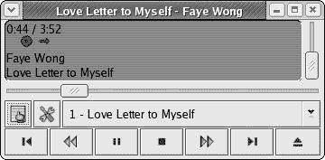
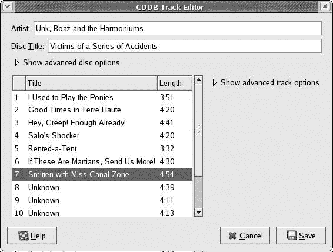
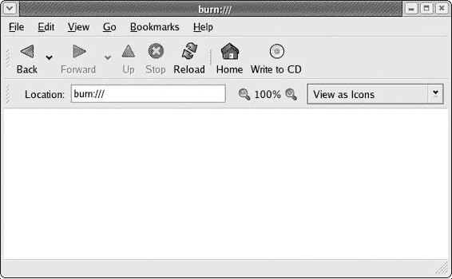
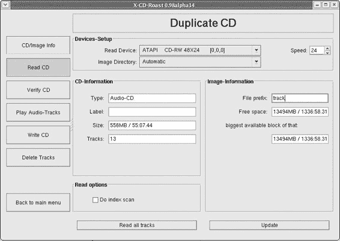

# 第七章：将您的数据存入冰库

## 概述

*与软盘和光盘一起工作*

如您从经验中无疑所知，您在电脑上工作的时间越长，硬盘上的文件就越多。其中许多是您自己创建的，其他的是从网络上下载的，还有一些是从其他人那里通过光盘或软盘获得的。

能够使用软盘和光盘是使用电脑时的基本技能。无论是为了将照片发送给亲戚，还是在电脑上听音乐，或者只是备份存储在硬盘上的所有宝贵物品，你最终都会想要或不得不转向使用磁盘。

* * *

* * *

## 软盘

当原始的 Macintosh 首次推出时，它最酷的特点之一就是它使用了 3.5 英寸的软盘（也称为软盘）。当时，我认为这些磁盘，有它们的硬外壳和滑动金属门保护介质本身，是高科技酷的化身。当然，时代在变化，现在使用软盘的人越来越少。这种变化的原因很简单：文件已经变得太大，无法适应软盘及其非常有限的 1.4MB 容量。如今，大多数人处理音频、视频和图像文件都非常大。例如，您可能只能在一张软盘上放超过三张数字照片。与今天流行的其他可移动存储介质相比，如光盘、Zip 磁盘、内存卡等，软盘的速度也太慢了。例如，您可以在将大量文件写入软盘所需的时间内给猫喂食，泡一杯咖啡，甚至读报纸的前三页。（好吧，好吧，那是一个夸张，但与替代品相比，软盘确实很慢。）

尽管软盘体积小且速度慢，但仍有越来越少的人使用它们，他们没有其他方式将文件传输到可移动介质，或者只是想将一两个小文档交给无法阅读其他类型介质的人。您可能是这些人之一，或者您可能需要向这种情况下的某人发送文件或从他们那里接收文件。

在您的系统上使用软盘足够简单，尽管这可能不像您所熟悉的那样直接，尤其是如果您是一个 Mac 移民。假设您有一个用旧系统制作的软盘，您想要将上面的文件复制到新系统上。正如您所想象的那样，您首先需要将软盘放入驱动器。到目前为止，一切顺利。但是，为了查看软盘上的内容，您必须*挂载*磁盘。简单来说，挂载一个磁盘就像是告诉您的系统，“嘿，我刚刚把一个磁盘放入驱动器，所以醒来处理一下。”如果您的系统没有意识到您的软盘在那里，它就不能很好地向您展示其内容，对吧？虽然 Fedora 像当今大多数操作系统一样会自动挂载光盘，但它并没有对软盘提供同样的便利。

将软盘挂载的最简单方法是右键点击桌面上的任何位置，然后在弹出的菜单中选择**磁盘** > **软盘**。Fedora 会挂载你的软盘，并在桌面上放置一个小的软盘图标，以通知你已完成操作。现在双击该图标，将出现一个新的 Nautilus 窗口，显示该磁盘的内容。

### **向磁盘写入和从磁盘复制**

从你的软盘复制文件到你的硬盘涉及与你之前使用的操作系统中相同的拖放过程，因此不需要特殊说明。然而，当涉及到向软盘写入时，事情就有点不同了——当你将文件拖到包含你的软盘内容的 Nautilus 窗口时，你的系统实际上并没有在那个时刻将任何内容写入磁盘。你可以通过查看你的软盘驱动器的活动灯来确认这一点。

当你第一次将磁盘放入驱动器时，你会看到灯是关闭的。通过右键点击桌面并选择**磁盘** > **软盘**来挂载驱动器，驱动器灯会亮起。将文件从软盘拖到垃圾桶，驱动器灯会亮起。将文件从软盘拖到桌面或你的家目录，灯也会亮起。然而，将文件从你的家目录或硬盘上的任何其他位置拖到软盘上，灯会保持关闭。文件将出现在软盘的 Nautilus 窗口中，但驱动器灯不会亮，因为文件还没有被写入磁盘。

实际的写入操作发生在你完成所有操作之后。一旦你将想要复制的所有内容拖到软盘上并准备弹出它，你必须首先**卸载**软盘。为此，关闭软盘的 Nautilus 窗口，右键点击桌面上的软盘图标，然后在弹出的菜单中选择**弹出**。那时，你的软盘驱动器的灯会亮起，因为你的系统正在将文件写入磁盘。一旦完成，软盘图标将从你的桌面上消失，你就可以从驱动器中取出磁盘。正如你所见，这有点不同，但一点也不难。

在你完成我刚才提到的卸载过程之后，你有时仍然会看到一个窗口告诉你系统无法卸载你的软盘，而实际上它已经卸载或者正在卸载过程中。如果你在阅读无法执行的消息时，桌面上的软盘图标消失了，你就知道这是这种情况。如果你遇到这种情况，那完全是因为你的软盘太慢，跟不上系统。你可以通过点击**确定**来安全地忽略警告。如果软盘图标消失了，你就知道它已经被卸载了。

|  | 注意  | *当您从软盘中弹出数据时，如果您想直接从另一种形式的可移动数据传输到软盘，可能会变得混乱。我强烈建议在您的硬盘中创建一个名为* ***data_transfer*** *(或类似名称)的文件夹，您可以用作某种形式的临时区域。只需从一种可移动源（如光盘）复制数据，然后从那里复制数据到软盘。我也建议这种方法用于您想从软盘传输到光盘的文件。 |
| --- | --- | --- |

### *格式化软盘*

在您实际上向磁盘写入任何内容之前，该磁盘必须已经被格式化。这适用于任何类型的存储介质，无论是您的硬盘、光盘、数码相机的存储卡，还是软盘，尽管有时在购买介质之前就会进行格式化。通过格式化磁盘，您的系统（根据您的请求）在磁盘上放置一种类型的地图，以指定数据可以存储的位置。由于存在许多操作系统，因此存在许多这样的格式。Linux 可以读取 Linux 原生*ext2*格式化的磁盘和 Windows/DOS*FAT*格式化的磁盘。它还可以创建这两种格式之一。

要格式化未格式化的软盘，请将磁盘放入驱动器中，然后在主菜单中，选择**系统工具** > **软盘格式化工具**。这将打开软盘格式化窗口（见下一页的图 7-1）。

图 7-1：格式化软盘

在此窗口中，您可以指定软盘的信息密度（1.44MB 或 720KB）、文件系统类型（ext2 或 FAT）以及磁盘的名称。完成这些操作后，您可以通过单击**格式化**开始格式化软盘。非常简单。

如果您想重新格式化已经格式化的软盘以擦除它或更改格式（例如从 ext2 转换为 FAT），您可以通过前面提到的方式进入软盘格式化工具，或者首先挂载软盘，然后右键单击出现在桌面上的软盘图标，并在弹出窗口中选择**格式化**。

* * *

* * *

## 阅读数据光盘

处理光盘比处理软盘容易得多，因为整个过程相当自动化。要读取带有数据的 CD（而不是音乐 CD），只需将 CD 放入你的 CD 驱动器，一个 CD 图标就会自动出现在桌面上。双击该图标将弹出一个显示 CD 内容的 Nautilus 窗口，将文件从该窗口复制到你的家目录是一个标准的拖放操作。记住，正如我在第三章中提到的，从 CD 复制到硬盘上的任何文件都将被设置为写保护，这可以通过一个带有铅笔穿过它的红色*verboten*符号来指示。为了能够写入该文件，你必须更改其权限。这些权限可以通过右键单击文件，在弹出的窗口中选择**属性**，然后在属性窗口中点击**权限**选项卡来访问。

当你想取出 CD 时，只需关闭其 Nautilus 窗口，右键单击桌面上的 CD 图标，在弹出的菜单中选择**弹出**。CD 将自动弹出。这真的很简单，即使是 Mac 迁移者也能轻松做到。

* * *

* * *

## 播放音乐 CD

播放音乐 CD 同样自动化。将音乐 CD 放入你的驱动器，GNOME CD 播放器（如图图 7-2 所示）将自动打开并开始播放 CD。要弹出 CD，只需点击 CD 播放器窗口右下角的弹出按钮。

图 7-2：使用 GNOME CD 播放器播放 CD

GNOME CD 播放器会自动查询互联网以获取你的 CD 标题和其中的歌曲播放列表，但 CD 播放器也允许你通过 CDDB 曲目编辑器手动输入这些信息。如果在线数据库信息错误或你没有互联网连接，这很有用。

要打开 CDDB 曲目编辑器，点击 CD 播放器窗口中的曲目编辑器按钮（在左下角，显示手在列表上）。当曲目编辑器窗口打开时，你可以输入或修改 CD 的标题、艺术家的名字以及所有歌曲的标题（见图 7-3）。

图 7-3：使用 CDDB 曲目编辑器输入播放列表信息

如果你点击“显示高级曲目选项”旁边的箭头，你也可以为每首歌曲添加注释，如果你喜欢这样做的话。所有这些信息都会保存到你的硬盘上，下次你将相同的 CD 插入机器时，这些信息将可用。当然，如果你将相同的 CD 放入另一台机器，你手动输入的信息将不会出现。

* * *

* * *

## CD-RW 驱动器

这些天几乎所有的电脑都内置了 CD-RW（可擦写 CD）驱动器，以至于我几乎可以说这是必需品。如果你想知道的话，CD-RW 驱动器的工作方式与 CD-ROM 驱动器类似，它们允许你从 CD 读取数据或播放音乐。然而，它们还允许你将数据烧录到空白 CD 上。如果你的机器中没有 CD-RW 驱动器，我强烈建议你购买一个。台式机的驱动器相对便宜（从 Amazon.com 大约 40 美元或更少），并且易于安装。如果你需要一点帮助，可以查看这本书的网页([www.edgy-penguins.org/non-geeks](http://www.edgy-penguins.org/non-geeks))。你甚至可以找到我创建的 PDF 格式的说明，你可以下载。

* * *

* * *

## 烧录数据 CD

自从 Red Hat Linux 中出现 Nautilus CD Creator 以来，在 GNOME 中烧录数据 CD 变得极其简单。这也是我更喜欢 GNOME 而不是 KDE 的许多原因之一。要烧录数据 CD，只需将空白 CD-R（可记录 CD）盘放入驱动器中，然后一个空的 Nautilus CD Creator 窗口将打开（参见图 7-4）。

图 7-4：空的 Nautilus CD Creator 窗口

之后，事情就变得同样简单。将你想要烧录到 CD 的所有文件拖到 CD Creator 窗口中。记住，一旦你将这些文件写入 CD-R 光盘，文件就会在那里永久保存；你以后无法从该盘中添加或删除文件，所以在你做出决定之前，请确保你已经准备好了所有想要烧录的内容。一旦你的文件列表完成，点击**写入到 CD**按钮。

图 7-5 中显示的窗口将出现，告诉你你选择了多少兆字节的文件要写入 CD。在这个窗口中，你可以调整写入速度并给你的 CD 命名；你也可以直接接受 CD Creator 自动选择的默认设置。除非你计划烧录多张相同数据的光盘，否则你应该取消勾选**重复使用这些文件为另一张 CD**复选框。

图 7-5：在写入 CD 之前设置选项

一旦你准备好烧录 CD，只需点击**写入文件到 CD**按钮，CD Creator 就会开始工作。当它完成烧录你的 CD 后，它甚至会自动为你弹出 CD。非常简单。而且是的，你在 Linux 中创建的 CD 在其他操作系统中*将是*可读的。

* * *

* * *

## 处理 CD-RW 光盘

CD-RW 光盘与 CD-R 光盘几乎一样，只是它们可以被擦除并重新写入。它们也比 CD-R 光盘贵得多。

使用 CD-RW 光盘与使用 CD-R 光盘的过程非常相似。如果光盘是空的，整个过程没有任何区别，这使得事情变得相当简单。然而，如果 CD-RW 光盘上已经存在你希望用其他内容替换的数据，那么过程只有细微的差别。

这些区别之一是 Nautilus 会将你的 CD-RW 磁盘视为一个普通的数据磁盘，而不是一个空白磁盘。这意味着当你将磁盘放入驱动器时，会自动打开一个普通的 Nautilus 窗口，而不是 CD Creator 窗口。

要写入磁盘，你需要手动从 Nautilus 窗口切换到 CD Creator 窗口，这可以通过在 Nautilus 窗口的**转到**菜单中选择**CD Creator**（或者通过在 Nautilus 窗口的**位置**框中替换**/mnt/cdrom**文本为 burn:///并按回车键）轻松完成。一旦你这样做，窗口将变成 CD Creator 窗口。现在将你想要烧录到 CD 的文件拖到该窗口中，准备好烧录后，点击**写入 CD**按钮。

现在是唯一的另一个区别：在上一页的图 7-5 中显示的 Nautilus CD Creator 对话框窗口中，点击**擦除 CD**复选框。一旦你做了这个，只需点击**将文件写入 CD**按钮，CD Creator 就会擦除 CD-RW 上已有的文件，并用你拖到 CD Creator 窗口中的新文件替换它们。这并不坏，对吧？

* * *

* * *

## 复制音频和数据 CD

在 Fedora 中复制音频和数据 CD 也很容易完成。然而，你不需要使用 Nautilus CD Creator，而是可以使用 X-CD-Roast 来完成。要开始，转到主菜单并选择**系统工具**>**CD 写入器**。系统会提示你输入 root 密码，所以输入它并点击**确定**。这将打开 X-CD-Roast 的主窗口（见图 7-6）。

图 7-6：X-CD-Roast 复制音频和数据 CD

### *设置 X-CD-Roast*

第一次使用 X-CD-Roast 时，你很可能会被告知在继续之前需要设置一些东西，所以点击**设置**按钮，在设置窗口中点击**CD 设置**标签。你的 CD 驱动器应该被列为**CD 写入设备**和**主要读取设备**。如果不是这样，请在这两种情况下都进行设置。然后点击**硬盘设置**标签。在这个页面上，你必须指定 X-CD-Roast 将查找磁盘镜像以进行复制的文件夹，以及它可以在 CD 复制过程中写入和存储文件的文件夹。

如果你打算进行大量的 CD 复制，最好在你的主文件夹中创建一个新的文件夹来整理这些文件。你可以将文件夹命名为“CD_stuff”。如果你不打算进行大量的 CD 复制，你可能不需要创建任何新的文件夹。

在设置窗口的底部，在**路径**处，如果你创建了 CD_stuff 子文件夹，则输入/home/username/CD_stuff（当然，你应该用你的实际用户名替换*username*），或者如果你没有创建 CD_stuff 子文件夹，则直接输入/home/username。然后点击**添加**。

完成所有这些操作后，点击**保存配置**按钮。随后会弹出一个小窗口，告诉你配置已保存；在那个窗口中点击**确定**，然后点击设置窗口左侧的**确定**。你将返回到开始时的主 X-CD-Roast 窗口。

### *读取要复制的光盘*

要开始复制过程，点击主 X-CD-Roast 窗口左侧的**复制光盘**按钮（如前文图 7-6 所示）。为了使 X-CD-Roast 能够复制光盘，它必须首先读取该光盘，并将数据暂时存储在设置过程中指定的文件夹中，因此请将你想要复制的光盘放入光盘驱动器中。当然，如果你放入了音频光盘，GNOME CD 播放器将自动启动，所以在继续之前你必须退出播放器。

完成上述操作后，点击复制光盘窗口中的**读取光盘**按钮（见下一页的图 7-7）。你的驱动器中的光盘类型以及其上的曲目数量应随后在窗口的 CD-Information 框架中列出。如果一切看起来都正确，调整**速度**框中的读取/写入速度到驱动器允许的最高速度，或者为了安全起见，可能稍微慢一点；默认速度设置为 1，如果你不更改它，这个过程将永远持续下去。接下来，点击**读取所有曲目**按钮，读取过程将开始。读取过程的进度将在读取进度窗口中显示，当过程完成后，该窗口会告诉你。当它显示已完成时，点击**确定**。

图 7-7：设置 X-CD-Roast 以读取要复制的光盘

### *将文件写入新光盘*

一旦读取完光盘，你将想要写入一张新光盘。请从驱动器中取出源光盘，然后点击复制光盘窗口左侧的**写入光盘**按钮。如果所有数据看起来都正确，调整驱动器速度，使其略低于驱动器的最高写入速度，然后点击窗口底部的**写入光盘**按钮（不是左侧的大按钮）。随后会弹出一个小窗口，提示你在驱动器中插入空白光盘。按照提示操作，然后点击**确定**。

X-CD-Roast 随后将开始烧录你的复制光盘，并在进度窗口中显示其进度。当写入全部完成后，X-CD-Roast 将自动弹出光盘并告诉你已完成。此时，你可以通过点击**确定**来关闭进度窗口。

### *删除曲目*

前面的步骤将导致 X-CD-Roast 在读取过程中将源光盘上的所有文件写入你的 Home 文件夹（或者如果你创建了一个，则写入 CD_stuff 文件夹），然后将这些文件传输到新的光盘上。然而，你可能不希望这些文件的副本在新的光盘烧录后长时间占用你的电脑空间，因此你应该删除它们。

要这样做，点击复制光盘窗口左侧的**删除轨道**按钮（如图 7-7 所示[DDU83]）。你现在应该会看到一个它创建的所有轨道的列表。点击**全选**，然后点击**删除所选轨道**。随后将弹出一个小窗口询问你是否要删除所选的轨道数；点击**是**，文件将被删除。当过程完成后，进度窗口将显示完成，然后你可以点击**确定**。

* * *

* * *

## 将 ISO 镜像烧录到磁盘

当你从互联网下载 Fedora Core 或其他 Linux 发行版时，你通常以一个或多个磁盘镜像的形式下载它们，这些镜像通常被称为 ISO，因为这样的文件以.iso 扩展名结尾。*ISO*是光盘文件内容的镜像，这意味着它是光盘本身减去媒体。换句话说，如果光盘有灵魂，ISO 就是光盘的灵魂；移除光盘的金属和塑料，剩下的数据就是一个 ISO。

由于无法在网络上物理下载光盘，因此无内容的 ISO 是次优选择。例如，要从网络上获取 Fedora Core 的副本，你需要下载三个 ISO，然后你可以将每个 ISO 烧录到空白 CD 上，以便恢复镜像的实体，换句话说，你因此创建了三个需要的安装磁盘。

X-CD-Roast 是烧录（或复制）ISO 的首选程序，至少是我的首选。这个过程与复制光盘的过程类似，但稍微简单一些，因为你已经在硬盘上有了虚拟光盘，即你下载的 ISO。

首先，按照上一节中的说明运行 X-CD-Roast，假设你已经完成了设置过程，然后在主窗口中点击**创建光盘**按钮（如图 7-6 所示[DDU0062.html#334]在第 106 页[DDU0062.html#336]）。

一旦进入创建光盘窗口，点击**写入轨道**按钮，你将进入创建光盘窗口的写入轨道页面（见图 7-8）。点击**布局轨道**标签，在图像信息面板中，你会看到所有存在于你的 CD_stuff 文件夹（或你在设置过程中指定的其他文件夹）中的 ISO 列表。点击你想要复制到磁盘上的 ISO，然后点击**添加**。你选择的 ISO 将随后出现在要写入的轨道面板中，你可以在页面底部点击**接受轨道布局**按钮。然后点击**写入轨道**标签。

图 7-8：在 X-CD-Roast 中选择要烧录到光盘的 ISO

在**Write Tracks**选项卡中，你选择的 ISO 应该出现在白色面板中。如果是这样，调整**Speed**框中的写入速度，使其低于你的驱动器的最大写入速度；我个人发现，在创建 Linux 安装光盘时，将速度限制在约 8 较好，因为以较快的速度写入的光盘有时会引发安装问题。

一旦完成，点击页面底部的**Write Tracks**按钮，系统会提示你将一张空白光盘放入驱动器。这样做，然后点击**OK**。随后将开始写入过程。

由于 ISO 文件通常相当大，这个过程会花费一些时间，所以你需要有点耐心。全部完成后，X-CD-Roast 会自动弹出你的光盘，然后你可以关闭剩余的窗口。

* * *
