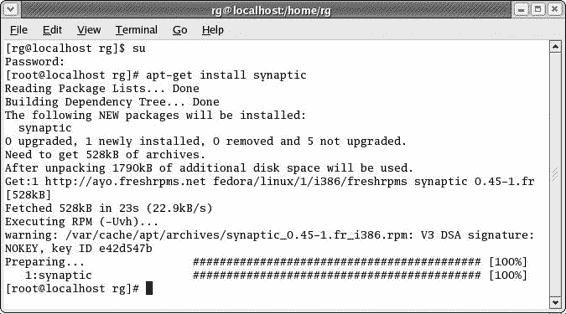
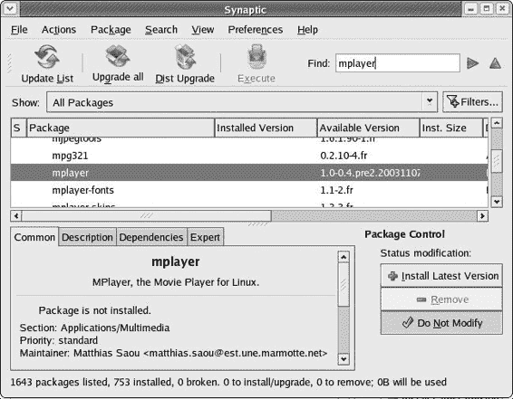
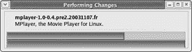
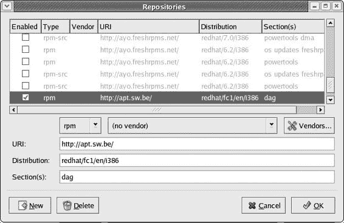

# 第十章：是的，还有另一种方法

## 概述

*使用 APT 和 Synaptic 下载、安装和更新程序*

您已经学会了如何通过软件包管理器和双击方法直接安装 RPM 软件包。然而，信不信由你，还有第三种方法，称为 APT（高级软件包工具），用于安装新的基于 RPM 的软件。实际上，任何熟悉 Linux Debian 发行版或 Mac OS X 上的 Fink 程序的人可能已经熟悉 APT 程序。

Debian 版本的 APT 设计用于从特定的 Debian APT 软件包中下载程序及其所有依赖项。然而，由于这些软件包不是 RPM 格式，它们在 Fedora 上无法工作。但是，有一个基于原始 Debian 版本的 APT 的特殊变体，它被设计用于在基于 RPM 的系统上工作，例如 Fedora Core。APT 会连接到互联网上的 RPM 仓库，然后下载您选择的程序及其依赖项。程序以 RPM 文件的形式下载，然后 APT 将其安装到您的系统上。

APT 是一种非常简单、安全和万无一失的安装程序的方式，因为不会丢失任何东西，它几乎使依赖地狱成为过去式。当然，并非每个程序或文件都可在 APT 仓库中找到，因此您之前学到的其他方法并非毫无用处。还有一些应用程序根本无法以 RPM 格式提供，但您将在下一章中学习如何处理这些应用程序。下一章。然而，有大量的文件您可以通过 APT 下载和安装，或者（非常重要）仅通过 APT 进行更新。

关于 APT，有些人可能会认为的一个问题是它是命令驱动的应用程序。这意味着您必须通过 Linux 命令终端中的命令来运行它。幸运的是，您可以通过安装程序 Synaptic 来避免这种更繁琐的方式，Synaptic 是 APT 的图形前端。Synaptic 允许您图形化地使用 APT，因此相当容易。

最后，互联网上有各种 APT 仓库，这些仓库提供的 APT 版本通常预先配置为从特定仓库下载 RPM 文件。此外，来自一个仓库的软件包并不保证与来自另一个仓库的软件包兼容，这意味着如果您混合来自不同仓库的文件，可能会发生冲突（尽管我必须承认在这方面我从未遇到过问题）。为了保持安全、方便、用户友好和美观，我们将使用 Freshrpms 的仓库来 APT，对于 Freshrpms 中不可用的 RPM，我们将在可能的情况下使用 Freshrpms 兼容的 DAG 仓库，您将在执行本书中的一些项目时从该仓库下载几个 RPM。

* * *

* * *

## 项目 10A：安装 APT 和 Synaptic

在这个项目中，你将安装 APT 程序，它以易于安装的 RPM 形式提供。一旦安装了 APT，你将通过命令行使用它来安装其图形前端 Synaptic。总的来说，这两个步骤都非常简单。

### *获取 APT 文件*

要开始，你只需要 APT 的文件。你可以通过访问 [`freshrpms.net/packages/`](http://freshrpms.net/packages/) 并点击适合你正在运行的 Linux 版本的链接来获取这个文件。在新页面出现后，转到页面的左侧并点击**apt**链接，这将带你到该软件包的页面。你将在页面的顶部看到 APT 文件。

要下载文件，只需在文件名左侧的微型软盘图标上右键单击，然后在弹出菜单中选择**另存链接目标为**。你不需要**apt-devel**文件，所以不必理会它。

### *10A-1：安装 APT*

由于 APT 是以 RPM 文件的形式提供的，所以安装非常简单，正如你现在所知道的。只需双击 RPM 文件，然后按照你在第八章中学到的常规 RPM 安装程序进行操作。

### *10A-2：输入 APT 代理设置*

如果你的互联网服务提供商要求你通过代理服务器连接到互联网，你必须在执行任何更新或下载之前将你的代理设置添加到 APT 中。如果你不通过代理服务器连接到互联网，你可以直接跳到项目的下一个步骤（10A-3）。

在大多数程序中，输入代理设置通常可以在该程序的“首选项”窗口中轻松完成。在 APT 的情况下，它稍微复杂一些，但只是稍微复杂一些。要输入 APT 的代理设置，你需要打开**apt.conf**文件。由于此文件位于 root 区域，你必须在成为 root 用户后打开并修改它。

要开始，打开一个终端窗口并成为 root 用户。一旦你完成了这个，输入 gedit /etc/apt/apt.conf 并按回车键。这将使用 Gedit 文本编辑器（以 root 模式）打开 apt.conf 文件。一旦文件打开，滚动通过它并查找以单词**Acquire**开头的条目。当你找到它时，将其更改为类似于以下示例中的条目，但使用你的服务提供商或网络管理员提供的代理和端口号信息。

```
Acquire {
    Retries "0";
    Http {
        Proxy "http://proxy.yourserver.com:3128/"; 
```

如果你的服务提供商分别给你提供代理地址和端口号（例如，[`proxy.magnumopus.se`](http://proxy.magnumopus.se) 和端口号 6048），请在地址后面输入一个冒号，然后在该冒号后添加端口号。使用之前的例子，那就是 [`proxy.magnumopus.se:6048/.`](http://proxy.magnumopus.se:6048/) 你的配置可能不同。

### *10A-3：更新 APT 数据库*

现在 APT 已安装到您的系统上，您几乎可以开始使用它了。我说“几乎”，因为您首先需要告诉 APT 更新其数据库，这样它就会知道可以从在线仓库下载什么，以及您已经在系统上以 RPM 形式安装了什么。要执行更新，打开一个终端窗口，使用**su**命令成为 root 用户，然后输入 apt-get update 并按回车键。

检查您的系统和仓库可能需要 APT 几分钟的时间，所以请耐心等待，思考您的未来（或其它什么）直到提示符再次出现。一旦它再次出现，您就准备好采取行动了。

### *10A-4：使用 APT 安装 Synaptic*

您第一次通过命令行使用 APT（可能也是您最不想再次使用的）是下载和安装 Synaptic，它是 APT 的图形前端。

使用 APT 下载和安装包的通用命令格式是：apt-get install package_name。在这种情况下，您将安装 Synaptic，因此打开一个终端窗口，成为 root 用户，然后输入 apt-get install synaptic 并按回车键。APT 将开始下载 Synaptic，一旦完成下载，它将继续安装。在此期间，APT 将显示其进度，正如您可以在图 10-1 中看到的那样。



图 10-1：下载和安装 Synaptic

在提示符再次出现后，过程就完成了，您现在可以使用 Synaptic 了。

* * *

* * *

## 项目 10B：使用 Synaptic 安装 MPlayer

现在您已经准备好使用 Synaptic 来获得一些经验，同时通过安装用于您的 MPEG 和 QuickTime 视频文件的播放器来完善您的系统。这个程序叫做 MPlayer（如图 10-2 所示），它是一个非常方便的程序，可以播放多种视频格式、DVD、VCD、一些视频流，甚至音频文件。


图 10-2：MPlayer 视频播放器

如图 10-2 所示，MPlayer 有单独的控制和查看窗口。如果您更喜欢单窗口方法，或者您想要捕获视频帧作为静态图像的能力，您可能想尝试 gxine（如图 10-3 所示），它在功能上与 MPlayer 非常相似（尽管有时可能有点 buggy）。


图 10-3：gxine 视频播放器

当然，有些人可能根本不需要视频播放，因此可能不希望为这样一个将不会被使用的程序花费如此多的下载时间。如果你是这样的人，并且你选择不下载 MPlayer（或者你选择下载 gxine），你应该下载 MP3 编码器 LAME，它通常作为 MPlayer 依赖项之一下载。LAME 用于将 WAV 音频文件（如音频 CD 上的文件）转换为流行的节省空间的 MP3 音频文件。在你到达 第十三章 时，你需要安装 LAME，在那里你将学习更多关于这个编码过程的内容。

安装 gxine 和 LAME 或仅安装 LAME 的说明基本上与安装 MPlayer 的说明相同；只需在下面的说明中将 **gxine** 或 **lame** 替换为 **mplayer**。

### *获取 MPlayer 文件*

由于 APT 和 Synaptic 将自动为你下载所有内容，因此你不需要为这个项目自己获取任何文件。

### *10B-1: 设置 Synaptic 代理*

如果你身后有防火墙，并且为了使用 APT 而不得不添加你的代理设置，你将不得不为 Synaptic 做同样的事情。如果不是这样，你可以跳到下一个步骤（10B-2）。

在 Synaptic 中设置代理比在 APT 中更容易。只需转到 **首选项** 菜单并选择 **首选项**。一旦进入首选项窗口，点击 **网络** 选项卡，选择 **手动代理配置**，然后输入你的代理设置。

### *10B-2: 安装 MPlayer*

在你开始之前，我应该提到，MPlayer 及其所有依赖项的下载相当大（大约 13MB），所以请确保你给自己留出一些时间来做这件事。总的来说，整个过程应该需要大约二十分钟或更长（取决于你的互联网连接速度），但在大多数时间里，你除了等待之外不需要做任何事情。这是所有花时间都值得的，因为许多这些依赖项都是你将来使用其他程序时将证明有用的项目。

无论如何，你首先想要做的事情是运行 Synaptic，你可以通过转到主菜单并选择 **系统工具** > **Synaptic**（某些版本的 Synaptic 可能将自己放在 **系统设置** > **Synaptic**）。一旦 Synaptic 运行，你需要在 Synaptic 软件包列表中找到 MPlayer 程序。只需在程序窗口右侧的 **查找** 框中键入 mplayer，程序窗口中间的软件包面板中就会出现高亮显示的软件包名称（见 图 10-4）。点击 **应用程序/多媒体** 旁边的箭头，然后向下滚动，直到你看到 **mplayer**，然后点击它。



图 10-4：使用 Synaptic 下载和安装 MPlayer

文件信息将出现在 Synaptic 窗口的底部。正如你所看到的，那里有四个标签页，每个标签页都会告诉你关于所选文件的一些信息。其中最重要的是**描述**，它会告诉你关于文件的一些信息，以及**依赖关系**，它会告诉你需要哪些其他文件来运行或使用你选择的文件。尚未安装在你系统上的依赖关系将以红色显示，但你不必担心它们，因为 Synaptic/APT 组合会自动为你下载和安装它们。

现在你可以实际安装 MPlayer 了，以下是需要遵循的简单步骤，其中许多步骤不需要你采取任何行动：

1.  假设**mplayer**在软件包列表中仍然被突出显示，请在 Synaptic 窗口的右下角点击**安装最新版本**按钮。

1.  根据所选的软件包以及你系统上已安装的内容，可能会出现一个窗口询问你是否要“应用额外的必需更改？”这将告诉你需要更改哪些文件（升级或安装）。如果出现此窗口，请点击**应用**。

1.  在主程序窗口中点击**执行**按钮以开始下载和安装。

1.  操作摘要窗口将随后打开，告诉你将要安装什么，将要更新什么，以及将要保留什么。在该窗口中点击**继续**按钮。

1.  Synaptic 将开始下载所有需要的文件。一个显示下载进度的窗口将出现（参见下一页的图 10-5）。你可以休息一下，喝点 Dr. Pepper 或其他饮料，等待片刻。

    (1005_0.jpg)

    图 10-5：Synaptic 中的下载进度指示器

1.  一旦所有必要的文件都下载完毕，APT/Synaptic 将开始准备安装文件，然后安装它们。这些过程的进度将在一个小窗口中显示（参见图 10-6）。你不需要做任何事情，只需稍等片刻。

    (1006_0.jpg)

    图 10-6：Synaptic 中的安装进度指示器

1.  一旦安装进度窗口消失，Synaptic 将再次变灰，因为它正在更新其软件包列表。一旦恢复正常，过程就完成了。

### *10B-3：运行 MPlayer*

现在 MPlayer 已经安装，你可以通过进入主菜单并选择**声音** & **视频** > **更多声音** & **视频** > **电影播放器**来运行它。MPlayer 将分为两部分打开：控制器和实际观看窗口。为了测试它，尝试播放你的 MPEG 或电影文件（具有.mpg 或.mov 扩展名的文件）。只需点击播放器窗口圆形部分的顶部箭头（如图 10-2 所示），然后选择你想要播放的文件。

如果你选择下载并安装 gxine 而不是 MPlayer，你可以通过进入主菜单并选择 **声音** & **视频** > **更多声音** & **视频** > **gxine** 来运行它。如果你只下载了 LAME，你将不得不等到 第十三章 才能了解如何使用它。

* * *

* * *

## 使用 Synaptic 更新 APT 软件包数据库

定期更新 APT 软件包数据库是个好主意，以便保持 APT 与可下载的内容同步。在本章的早期部分，你已经在终端中使用了 **apt-get update** 命令来完成这个任务，但通过 Synaptic 来做会更简单。只需在 Synaptic 的主窗口中点击 **更新列表** 按钮，Synaptic 就会检查在线仓库并更新其软件包列表。很简单，对吧？

* * *

* * *

## 使用 Synaptic 查找新软件包和升级软件包

如果你只想找出 APT 仓库中有哪些软件包可用但尚未安装在你的机器上，请点击 Synaptic 窗口顶部的 **显示** 下拉菜单按钮，默认情况下它显示为 **所有软件包**，然后选择 **未安装**。然后 Synaptic 将仅显示那些可供下载但尚未安装在你系统上的软件包。

如果你想要知道哪些软件包可以升级，请转到相同的下拉菜单按钮并选择 **可升级**。然后 Synaptic 将显示你系统上哪些软件包可以升级，你拥有的给定软件包的版本，以及可供下载的最新版本。你可以选择要升级的软件包，然后点击 **升级** 按钮。完成选择后，你只需在 Synaptic 的主窗口中点击 **执行** 按钮即可开始下载文件。

你也可以通过点击主 Synaptic 窗口顶部的 **全部升级** 按钮来升级所有可升级的软件包（不要触碰 **发行版升级** 按钮）。当然，这可能会需要大量的下载时间，所以点击该按钮后，再点击之后的 **执行** 按钮，查看操作摘要窗口以了解你需要下载多少数据。完整的系统升级可能需要下载超过 100MB 的文件——如果你使用的是拨号上网连接，这将是一个非常庞大的下载。如果你认为你能承受你情况下指示的下载大小，请在操作摘要窗口中点击 **继续** 按钮；如果不能，请点击 **取消**。

* * *

* * *

## 使用 Synaptic 删除软件包

Synaptic 也可以用来移除你系统上已安装的软件包。这对于移除在包管理器窗口中不出现的 RPM 软件包特别有用。然而，请记住，APT 和 Synaptic 只处理 RPM。如果你下载了一个程序文件，然后从源代码编译并自行安装，正如你将在第十一章中学到的，它将不会出现在 Synaptic 中。

要移除 RPM 软件包，从 Synaptic 窗口顶部的**显示**下拉菜单中选择**所有软件包**，然后在程序窗口中间找到你想要移除的软件包。通过点击它来选择它，然后点击**移除**按钮。一旦你为所有你想要移除的软件包点击了**移除**按钮，点击**执行**按钮。

* * *

* * *

## 将仓库添加到 Synaptic 的查找列表

如果你发现你经常使用 Freshrpms 兼容的仓库，特别是 DAG，直接下载文件，你可能发现通过 APT/Synaptic 访问该仓库很有用。如果你使用拨号调制解调器，我不建议这样做，因为当你更新软件包列表时，这会稍微减慢速度，但除此之外，这可以相当方便。

将仓库添加到 Synaptic 现在相当简单。运行 Synaptic 后，转到偏好设置菜单并选择仓库，这将打开仓库窗口。要添加一个新的仓库，例如 DAG，点击**新建**按钮，然后在仓库窗口底部的三个文本框中输入仓库信息（图 10-7）。这些信息可以在你想要添加的仓库的主页上找到。对于 DAG，这些信息位于[`dag.wieers.com/home-made/apt/`](http://dag.wieers.com/home-made/apt/)。



图 10-7：在 Synaptic 中将仓库添加到源列表

仓库信息被分为三部分：URL、发行版和部分。在仓库主页上，这通常是一行写成的，不同部分由空格分隔。例如，对于 Fedora Core 1，仓库详细信息给出为[`apt.sw.be`](http://apt.sw.be) redhat/fc1/ en/i386 dag，这三个元素在 Synaptic 仓库窗口中的位置可以在图 10-7 中看到。

* * *

* * *

## 更多的需求？

如果你渴望使用 APT/Synaptic 下载更多内容，你可以在本书的其他地方找到更多机会。然而，如果你实在等不及，现在就想立即开始，请访问我的网站（[`www.edgy-penguins.org/non-geeks`](http://www.edgy-penguins.org/non-geeks)）获取一些推荐。

* * *
