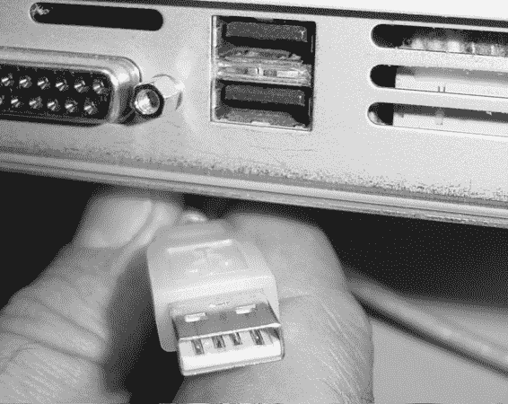
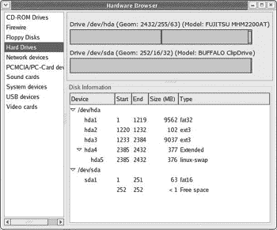

# 第十二章：冰上数据重访

*Windows 分区和 USB 存储设备*

您已经学会了通过从互联网下载来将数据传输到您的计算机（例如，在安装应用程序、字体和其他文件时）。您也知道如何使用 CD 和软盘将数据传输到和从您的计算机中。还有一些其他的数据来源我们尚未讨论：便携式 USB 存储设备和对于双启动用户，Windows 分区。

## USB 存储设备

现在，名为 PenDrive、JumpDrive、ClipDrive、DiskOnKey 等等的小型便携式存储设备已经相当流行（参见下一页的图 12-1）。由于它们体积小巧，当您需要在不同计算机之间（例如从工作地点到家中）传输相当大但不是巨大的数据量时，这些“闪存盘”非常方便。


图 12-1：一个 USB 闪存盘和卡读卡器

从计算机到计算机（例如从工作地点到家中）的传输。它们的容量从 16MB 到 2GB 不等，而且价格越来越便宜（尤其是在 16MB 到 256MB 区间内）。

内存卡也作为便携式存储设备而流行；然而，为了读取这些卡，您需要使用卡读卡器（如图 12-1 所示）。内存卡最常用于数码相机。由于这些内存卡有多种格式，如 CompactFlash、Memory Stick 和 SmartMedia，因此有不同类型的卡读卡器可供读取不同的媒体格式。

如您可能已经知道，USB 设备，以其窄长方形的连接器插头而著称（如图 12-2 所示），已经变得越来越受欢迎，这主要是因为您可以在计算机运行时插拔它们（称为*热插拔*）。虽然将通用串行总线（USB）存储设备连接到 USB 端口（如图 12-2 所示）几乎是最简单的事情，但访问这些设备以便您可以将数据传输到和从它们中取出仍然是 Fedora 较弱的地方之一，但一旦您完成了设置 USB 存储设备的稍微繁琐的一次性过程，事情就会变得非常简单。正如 pyWings 预言家可能会说的那样，一点耐心会带来巨大的回报。



图 12-2：USB 连接器插头和 USB 端口

### *设备兼容性*

就像所有形式的计算机硬件一样，你必须想知道这个设备是否与你的系统兼容。在 Windows 或 Macintosh 兼容性的情况下，这通常很简单，只需阅读设备包装盒侧面的细小字样即可。正如你现在所知道的，Linux 兼容性很少被指定。似乎也没有针对 USB 存储设备的 Linux 兼容性在线指南，这可能是由于许多这些设备是由相当小的（有时是无名）公司制造的，或者至少是分销的，而这些公司太多，难以处理。

可以相当肯定地说，如果一个设备声称可以在 Mac 和 Windows 上同时使用，或者它不需要特殊驱动程序就能在最新的 Windows 版本上运行，那么它很可能在 Linux 上也能工作。在卡片读卡器的情况下，多读卡器类型，可以读取多种卡片类型，更有可能给你带来麻烦。在我看来，最好坚持使用专门为一种卡片类型设计的读卡器。

如果你是一个容易担心的人，并且我的鼓励话语没有让你感到安慰，你可以尝试访问一个在线 Linux 论坛，寻求一些推荐，或者如果你已经考虑到了一个特定的型号，可以询问是否有人有使用该特定设备的经验。还有我经常建议的经过验证的 Google 搜索，对于硬件兼容性问题。只需输入设备的制造商和型号，以及“Linux”这个词，看看会发生什么。

### *定位您的设备*

在你开始设置系统以处理你的新 USB 存储设备之前，了解 Linux 实际上是如何处理它的是有用的。Linux 中的大容量存储驱动程序将所有 USB 存储设备处理成 SCSI（小型计算机系统接口）驱动器。SCSI（发音为*scuzzy —* 哎呀！）设备曾经是最受欢迎的外设类型，但它们已经被更便宜、更容易处理的 USB 设备所取代。这意味着这些设备，无论是真正的 SCSI 还是 USB，都会在你的硬件浏览器中作为 SCSI 驱动器列在**/dev**列表下：**/sda**、**/sdb**、**/sdc**等等，具体取决于你有多少这样的设备。正如你可能已经猜到的，这些列表（sda、sdb、sdc 等等）代表 SCSI 设备 a、b、c 等等。

为了了解我在说什么，将你的 USB 存储设备插入到电脑的 USB 端口上；你不需要在这样做之前关闭机器。一旦你这样做，你需要找出设备实际上在哪里，根据电脑来说。当然，你知道它被插入到你的一个 USB 端口中，但你的系统有自己的现实。

找到 USB 设备最简单的图形方式是使用你的硬件浏览器。只需进入主菜单，选择**系统工具** > **硬件浏览器**。系统会要求你输入 root 密码，所以当提示时输入它，然后点击**确定**。随后会弹出一个窗口告诉你检查硬件配置可能需要一些时间；但在你读完它之前，硬件浏览器窗口将打开，信息窗口将消失。在硬件浏览器的左侧，你会看到许多标题，点击其中一个写着**硬盘驱动器**的选项（而不是写着 USB 设备的那个）。

如果你的 USB 存储设备与 Linux 硬件兼容，它很可能会以**/dev/sda1**的形式出现在列表中，前提是你只处理这种类型的设备（参见图 12-3）。如果你正在处理第二个或第三个设备，它可能显示为**sdb1**、**sdc1**，等等。

(1203_0.jpg)

图 12-3：在硬件浏览器中查看 USB 存储设备

### *设置配置 — 编辑 fstab 文件*

就目前的情况来看，你的系统正在识别你的 USB 存储设备，但你仍然真的无法使用它，至少不是很容易。为了设置一个配置，让你只需点击几个鼠标按钮就能随时使用存储设备，你需要在你的**fstab**文件中为该设备创建一个条目。

我必须承认，第一次听说这个 fstab 文件，以及我打算以某种方式修改它时，我有点不安。仅仅文件名就足够让人毛骨悚然：f+stab。我以为这个名字是 Linux 那些古怪的首字母缩略词之一，代表一些阴暗和沉闷的东西。不幸的是，当我发现 fstab 仅仅代表*文件系统表*时，我松了一口气（或者甚至有些失望）。通过修改 fstab 文件，你只是在表中添加一个条目。这并没有什么可怕的。

要访问你的 fstab 文件，你将使用你现在钟爱的终端，所以通过点击 GNOME 面板中的终端启动器来打开它。一旦你这样做，使用**su**命令成为 root 用户，然后输入 gedit /etc/fstab 并按回车键。如果你想知道，命令的前一部分打开文本编辑程序 Gedit，而第二部分告诉 Gedit 打开位于**etc**文件夹中的**fstab**文件。一旦打开，你的 fstab 文件应该看起来像图 12-4 中的那样。

(1204_0.jpg)

图 12-4：修改 fstab 文件

现在 fstab 文件已经打开，你可以通过使用硬件浏览器中列出的设备位置来为你的新 USB 存储设备添加一个条目。你需要做的是滚动到列表底部，并添加类似以下内容：

```
/dev/sda1 /mnt/pendrive auto defaults,users,noauto 0 0
```

现在让我们一点一点地解释这一切的含义。

+   第一个元素，**/dev/sda1**（或**/dev/sdb1**，等等），是系统说你的设备所在的位置。这是你从硬件浏览器中获得的信息。在**sda1**中的**1**指向该设备上的第一个（通常是唯一的）分区。

+   第二个元素，**/mnt/pendrive**，是驱动器的*挂载点*。这个挂载点目前还不存在，但你将在下一节中创建它。这个元素在**/mnt/**之后的部分可以是任何你喜欢的名称。例如，如果你在设置一个读卡器而不是 U 盘，你可以称它为/mnt/cardreader。

+   第三个元素是设备的文件系统。为了简化，你将使用 auto，在这个情况下应该很容易理解。

+   接下来的三个元素，它们之间没有空格（只有逗号分隔），是设备的其他设置：defaults 告诉系统以通常的方式处理此设备，**users**赋予机器上的所有用户使用它的权限，而**noauto**告诉系统在启动时不要自动挂载设备，因为它是一个可能不在启动时存在的可移动设备。确保你在这个条目部分不要在逗号周围输入任何空格。

+   最后的部分，两个零，有点复杂，所以就相信我吧。确保在两个零之间只有一个空格。

你不需要太担心将你的新条目与之前的条目对齐。然而，如果你留出空间，一定要确保不要使用 TAB 键来创建空格，因为它会在某些文本编辑器中引起问题。完成后，点击 Gedit 中的**保存**按钮，然后退出程序。

### *创建挂载点*

现在已经编辑了 fstab，是时候创建你在 fstab 条目中列出的挂载点了。这很简单，因为你已经知道**mkdir**命令。只需回到你的终端窗口，它应该仍然处于 root 模式，输入 mkdir /mnt/pendrive（或将 pendrive 替换为你在 fstab 文件中为存储设备提供的任何名称）并按回车键。

### *挂载您的 USB 存储设备*

现在应该很容易使用你的新 USB 存储设备了。如果设备尚未连接，请将其插入，然后右键单击桌面。在弹出菜单中，选择**磁盘** > **pendrive**，你的新驱动器图标将出现在桌面上（在 Red Hat Linux 9 中，你可能需要在新的存储设备名称出现在弹出菜单之前重新启动你的机器）。之后，你可以通过双击它来打开 Nautilus 窗口，就像使用硬盘或软盘一样，将文件拖到设备和从设备中。

|  | 注意 | *Fedora 用户请注意，将文件从您的 USB 存储设备拖动到桌面会移动文件，而不是复制它；因此，一旦您完成拖放操作，文件将位于您的硬盘上，但将从 USB 设备中删除。另一方面，将文件从 USB 设备直接拖动到您的家目录或任何其他位置，将导致文件被复制而不是移动——拖放完成后，文件将同时存在于硬盘和存储设备上。在 Red Hat Linux 9 的情况下，所有拖放操作都被视为复制而不是移动。* |
| --- | --- | --- |

### *卸载您的 USB 存储设备*

一旦您使用完 USB 存储设备，您必须先卸载它，然后才能从 USB 端口拔掉它。如果您不这样做，那么您拖放到设备上的所有文件都不会被保存，这可能会造成混淆。要卸载 USB 设备，右键单击设备的桌面图标，然后在弹出菜单中选择**卸载卷**。图标将消失，然后如果您喜欢，可以拔掉设备，尽管您不必这样做。在尝试卸载之前，请确保关闭所有打开的 Nautilus 窗口，否则系统不允许您这样做。

有时，比如在卸载软盘时，您的系统可能会提前一步告诉您无法卸载驱动器，而实际上它正在后台忙于进行卸载操作。正如我之前提到的，如果您收到无法执行的消息，但驱动器图标仍然消失了，您可以忽略系统警告。一旦图标消失，驱动器就被卸载了。

* * *

* * *

## 添加额外的 USB 存储设备

以与添加第一个设备相同的方式添加额外的存储设备：

1.  使用硬件浏览器检查设备位置。

1.  在 fstab 文件中添加一个新条目。

1.  创建一个新的挂载点。

1.  重新启动您的计算机。

1.  通过右键单击桌面，从弹出菜单中选择**磁盘** > ***newdrivename*** 来挂载驱动器。

* * *

* * *

## 双启动用户：挂载 Windows 分区或驱动器

如果您是双启动用户，意味着您在硬盘上同时安装了 Windows 和 Linux，您可能非常希望能够在 Windows 和 Linux 分区或磁盘之间相互传输文件。例如，如果您想将一些 Windows 字体复制到您的 Linux 系统，您将在下一章中学习如何这样做。要这样做，您必须挂载您的 Windows 分区或驱动器。

现在不要大喊大叫说您的 Windows 分区不是 USB 设备；我知道这一点。然而，设置系统以便您可以轻松挂载 Windows 分区或驱动器的过程与您学习挂载 USB 驱动器的过程基本相同。

### *定位您的 Windows 分区或驱动器*

就像 USB 存储设备一样，你首先必须使用硬件浏览器找到你的 Windows 驱动器或分区。转到主菜单，选择**系统工具** > **硬件浏览器**，并在需要时输入你的 root 密码。一旦硬件浏览器打开，点击左侧面板中的**硬盘**。

接下来，寻找你的 Windows 分区，它很可能是**hda1**。一旦完成，检查**类型**列以查看分区的文件系统格式。如果是**fat16**或**fat32**，你将没有问题。然而，如果它是**ntfs**（这是 Windows NT、2000 和 XP 的默认文件系统），你就没有运气了，将不得不放弃此过程，因为截至目前，Linux 不允许你挂载 NTFS 分区，而且并非没有原因。Linux 内核对 NTFS 的支持仍然存在缺陷，这可能会危及这些分区或驱动器的完整性。

如果你有一个 FAT16 或 FAT32 分区，记下该分区的信息。在前面图 12-3 中显示的示例中，必要的信息将是：**/dev/hda1 fat32**。一旦完成，你可以继续编辑 fstab 文件。

### *将你的 Windows 分区或驱动器添加到 fstab 文件中*

打开一个终端窗口，成为 root 用户，然后输入 gedit /etc/fstab 并按回车键。当 fstab 文件在 Gedit 中打开时，在列表底部添加一个新条目，输入以下内容：

```
/dev/hda1  /mnt/windows  vfat  defaults,users,noauto 0 0
```

当然，如果你的设备位置不同，相应地更改条目。你可能还想将 noauto 更改为 auto。如果你这样做，每次登录时都会出现你的 Windows 分区或驱动器的桌面图标，从而在每次启动机器时消除挂载步骤。当一切如你所愿时，点击**保存**按钮，并退出 Gedit。

### *创建挂载点*

现在 fstab 已经编辑，是时候创建你在 fstab 条目中列出的挂载点了。回到你的终端，它应该仍然是 root 模式，并输入 mkdir /mnt/windows 然后按回车键。

### *挂载你的 Windows 分区或磁盘*

你可以以与 USB 存储设备描述的相同方式挂载你的 Windows 分区或驱动器。在桌面上的任何位置右键单击，然后在弹出菜单中选择**磁盘** > **windows**。然后你的 Windows 分区或驱动器的桌面图标将出现。

双击你的 Windows 分区桌面图标将打开一个 Nautilus 窗口。然后你可以将文件拖放到 Windows 分区中。

如果你将 Windows 分区 fstab 条目中的 noauto 更改为 auto，那么下次启动机器时你不需要做任何事情，因为你的 Windows 分区将在启动时自动挂载，Windows 分区桌面图标也会自动出现。

### *卸载你的 Windows 分区或磁盘*

卸载您的 Windows 分区或磁盘的方式与卸载 USB 存储设备相同。关闭任何打开的 Nautilus 窗口，然后右键单击 Windows 分区或驱动器的桌面图标，从弹出菜单中选择**卸载卷**。

* * *
