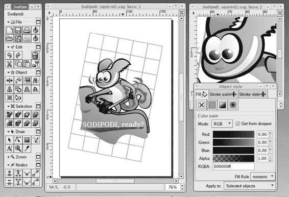
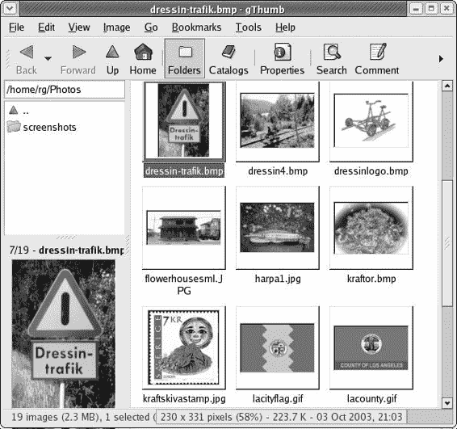
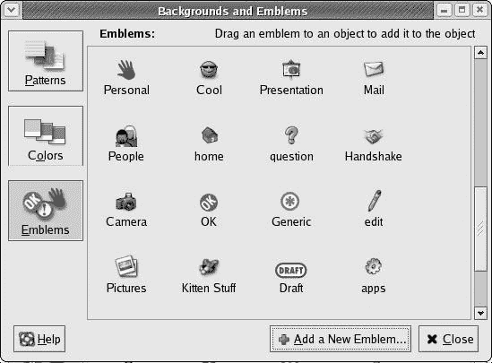
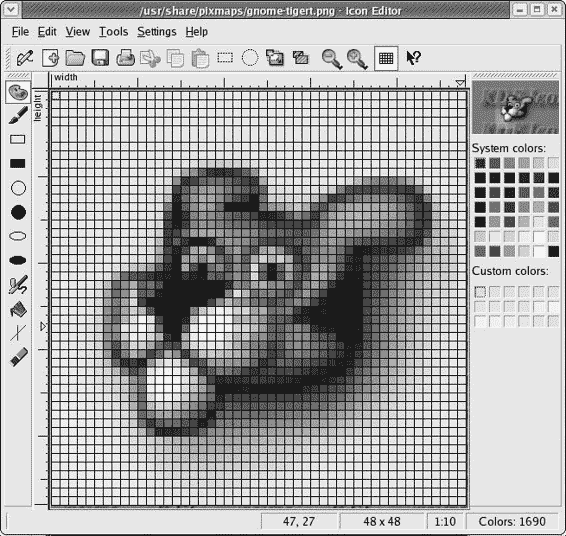
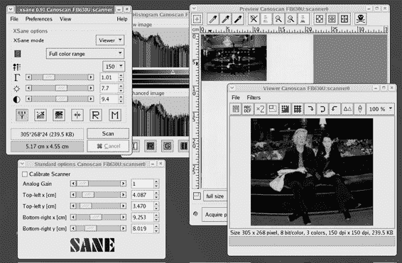
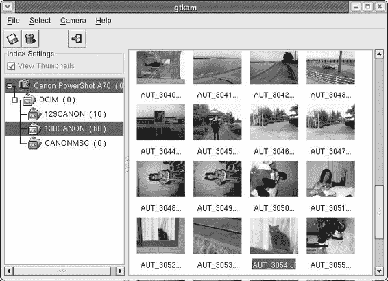
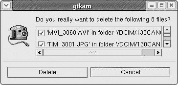

# 第十四章：挥舞画笔的企鹅

*Linux Does Art*

既然你知道 Linux 很棒，那么是时候戴上你的贝雷帽，转向 Linux 的艺术方面了。是的，Linux 确实做艺术，而且你很快就会知道，你的系统上有许多程序允许你创建和操作图形文件。其中最著名（也是最著名）的应用程序是 GIMP，你可能认为它是 Linux 版的 Adobe Photoshop。要运行 GIMP，只需转到主菜单，然后选择**图形** > **GIMP**。

## 用 GIMP 进行艺术创作

GIMP 允许您创建位图图形，并且非常重要的一点是，您可以修复或完全处理图像文件，例如来自您的数码相机的图像。（你想在你的脸颊上加点颜色，是吗？）使用 GIMP，您可以去除您照片中的红眼。

数字照片，去除不需要的阴影（甚至面部瑕疵），给你的图像添加画布纹理，将照片变成油画，甚至在这里和那里添加一些甜椒（见图 14-1）。

图 14-1：在 GIMP 中操作数字图像

GIMP 也是一个非常方便的图像缩放工具。只需在 GIMP 中打开的图像上右键单击，然后在弹出菜单中选择**图像** > **缩放图像**即可轻松完成。这将打开缩放图像窗口，您可以在其中设置图像的新大小。

GIMP 也是一个将图像从一种文件格式转换为另一种格式的优秀工具。例如，您可以打开一个位图（.bmp）文件并将其保存为 PNG（.png）文件，或者将 JPEG（.jpg）文件保存为 GIF（.gif）文件等。GIMP 支持极其广泛的文件格式，甚至允许您将图像文件保存为压缩的 tarball。要执行文件转换，只需在 GIMP 中打开的图像上右键单击，然后在弹出菜单中选择**文件** > **另存为**。这将打开一个对话框，您可以在其中通过将窗口底部的**选择**框中的原始文件扩展名替换为您想要转换图像到的格式扩展名来指定新的文件格式。

通过简单地玩一会儿 GIMP 来学习如何使用它是一件很有趣的事情。当然，在这样做之前，您应该备份任何您计划实验的文件。如果您更喜欢通过教程来工作，而不是通过摸索来找出东西，GIMP 文档页面([www.gimp.org/tutorials.html](http://www.gimp.org/tutorials.html))提供了一些链接，涵盖了各种功能、特性和技能水平。在我看来，最好的是 GIMP 教程页面([http://empyrean.lib.ndsu.nodak.edu/~nem/(http://empyrean.lib.ndsu.nodak.edu/~nem/) gimp/tuts])。

* * *

* * *

## 项目 14A：Tux Paint（可选）

如果您并不真的需要 GIMP 提供的所有功能，而是只想为孩子们提供一个简单的绘画工具（或者甚至只是想快速画几笔草图），您总是可以尝试 KPaint，它是 Windows Paint 或早期 Macintosh 时代的 MacPaint 的一个非常轻量级的等价物（两者都是轻量级程序）。KPaint 是 Fedora Core 系统的一部分，可以通过进入主菜单并选择 **图形** > **更多图形应用程序** > **绘图程序** 来运行。

如果您想要一些更有趣和吸引人的东西，您应该查看 Tux Paint（见图 14-2）。Tux Paint 是一个非常易于使用的、面向儿童的绘画程序，具有高度直观和吸引人的界面，几乎任何年龄的人在使用一分钟之后都能掌握（对于真正的年轻人来说可能需要稍微多点时间）。如果您还下载并安装了单独的橡皮图章软件包，您或您的孩子可以在页面上贴上各种奇怪的东西：热带鱼、企鹅、五分镍币、一角硬币、欧元、衣夹，甚至是甜椒，就像在 GIMP 中一样。

图 14-2：使用 Tux Paint 玩耍

### *获取 Tux Paint 文件*

Tux Paint 并不包含在您的 Fedora Core 系统中，因此您需要自行下载。除了主要的 Tux Paint 软件包外，您还需要下载 **SDL-ttf**，这是 Tux Paint 运行所必需的，以及橡皮图章插件，虽然它是可选的，但正是这个插件让 Tux Paint 变得如此酷。

要获取主要的 Tux Paint 软件包和橡皮图章插件，请访问 [www.newbreedsoftware.com/tuxpaint/download/linux-rpm.](http://www.newbreedsoftware.com/tuxpaint/download/linux-rpm)。对于主软件包，选择适合您所使用的 Linux 版本的相应 **tuxpaint** 文件。对于橡皮图章插件，选择下面的链接 **tuxpaint-stamps noarch-rpm**。

要获取 SDL_ttf 软件包，请访问 [www.libsdl.org/projects/SDL_ttf](http://www.libsdl.org/projects/SDL_ttf) 并从 **Linux** 下方右侧的 **二进制** 部分下载 **SDL_ttf-2.0.6-1.i386.rpm** 文件。

### *14A-1：安装和运行 Tux Paint*

您下载的所有三个文件都是 RPM 软件包，所以您的端不会有问题。在安装软件包时，只需确保按照正确的顺序安装它们，以避免依赖警告：**SDL_ttf** 首先安装，**tuxpaint** 第二，**tuxpaint-stamps** 最后安装。

一切安装完成后，您可以通过进入主菜单并选择 **图形** > **Tux Paint** 来运行 Tux Paint。

* * *

* * *

## 项目 14B：Sodipodi（可选）

GIMP 与其他所谓的绘画程序一样，创建位图（.bmp）图像。这些图像记录了每个单独像素的位置和颜色。图像本质上是一系列点，或称为比特。因此，你创建的文件是一个相当庞大的比特映射（因此得名），这个映射告诉你的系统在图像显示或打印时，图像中的每个元素应该放在哪里。

与此相反，绘图程序创建的是矢量图像，或称为绘图。矢量图像文件是一系列数学公式，代表图像中的各种形状。这可能对你来说似乎并不重要，但这类绘图在某些情况下具有优势。其中一个优势是，矢量图像文件在硬盘上占用的空间比位图少。另一个，也许是最重要的优势是，矢量图像中的形状在图像放大时仍保持平滑边缘。例如，作为一个位图创建的平滑圆圈，在放大到任何程度时都会开始显示出锯齿边缘（锯齿），而矢量图像中的相同圆圈无论你将其大小增加到多少，都会保持平滑和圆形。

Fedora 随带了一些被称为绘图程序的程序（OpenOffice.org Draw 和 Dia），但正如你将在本章后面看到的那样，这些程序更适合创建简单的传单和图表。我最推荐的、最容易使用的绘图程序是 Sodipodi —— 这个名字在爱沙尼亚语中意为混乱（见图 14-3）。

### *14B-1：下载、安装和运行 Sodipodi*

Sodipodi 不包含在 Fedora Core 系统中，因此你必须自己下载并安装它。你可以通过访问 http://dag.wieers.com/packages/sodipodi 并点击适合你 Linux 版本的最新版本链接来获取 RPM 文件。如果你像我在第十章中解释的那样将 DAG 添加到 Synaptic 的仓库列表中，你也可以通过运行 Synaptic，在 Synaptic 的 **查找** 框中输入 sodipodi，然后遵循标准的 Synaptic 安装程序来下载文件。由于文件是一个没有未满足依赖关系的 RPM，安装非常简单。

图 14-3：使用 Sodipodi 创建真实图形

安装 Sodipodi 后，你可以通过转到主菜单并选择 **Graphics** > **More Graphics Applications** > **Sodipodi** 来运行它。

如果你想要了解你可以用 Sodipodi 做些什么，请点击 Sodipodi 项目主页顶部的 **Galleries** 链接（[www.sodipodi.com](http://www.sodipodi.com)）。你还可以在 [`hawthorn.csse.monash.edu.au/~njh/programming/drawing-packages/sodipodi`](http://hawthorn.csse.monash.edu.au/~njh/programming/drawing-packages/sodipodi) 找到关于如何使用 Sodipodi 的一个非常不错的教程。

* * *

* * *

## 使用 gThumb 查看您的图像

正如你在第三章中学到的，Nautilus 充当你图形文件的预览器。然而，Nautilus 能做的事情有限，因此是时候让你熟悉 Fedora Core 系统附带的其他程序了：gThumb（参见下一页的图 14-4）。你可以通过转到主菜单并选择**图形** > **gThumb 图像查看器**来运行 gThumb。

图 14-4：使用 gThumb 查看文件夹中的图片

一旦 gThumb 启动并运行，你将希望将其指向你保存图片的文件夹。你可以通过点击程序窗口左侧面板中的文件夹图标，或者在左侧面板上方的位置框中输入位置（如果你创建了我在第五章中提到的文件夹，则为/home/username/Photos）来实现。一旦到达那里，gThumb 将以幻灯片式缩略图的形式显示该文件夹中的所有文件。

那么，这又意味着什么呢？好吧，gThumb 还允许你通过简单地点击想要修改的图片，然后在**图像**菜单中选择不同的选项来调整图片的大小、亮度、对比度，甚至旋转图片。你还可以在 gThumb 中更改指定文件的格式（例如，从.jpg 更改为.png），尽管这没有在 GIMP 中执行时那么多选项。最后，如果你想打印你的图片之一，通过 gThumb 来做这一点非常简单。只需点击你想要打印的图片，然后在**文件**菜单中选择**打印**。

在查看方面，你也可以通过点击想要查看的图片，然后在**查看**菜单中选择**全屏**来使用全屏查看图片。从同一菜单，你也可以通过选择**幻灯片放映**来以幻灯片的形式查看所有图片。

* * *

* * *

## 项目 14C：再次创建徽标！

我母亲在 Linux 启动并运行后，首先问我的是如何创建她自己的徽标。你已经学习了如何在第五章中处理徽标，但现在我已经介绍了许多可用的图形工具，也许现在是时候回答我母亲的问题了。

### *14C-1: 使用现有图标作为徽标*

可能开始创建徽标最简单的方法就是使用系统中的一个图标作为徽标。但这个想法的唯一问题是，你系统中的大多数图标大小都是 48x48 像素，而徽标的大小是 36x36 像素。如果你不希望你的新徽标看起来过大且不协调，最好是调整它的大小。

如我在上一节中提到的，gThumb 应用程序在调整图像大小方面非常方便。对于这个项目，我们将使用 **gnome-tigert** 图标，所以请在 gThumb 窗口的左侧面板中导航到 **/usr/share/pixmaps**。一旦到达那里，寻找 **gnome-tigert.png** 文件，单击一次，然后转到 **图像** 菜单并选择 **调整大小**。这将弹出一个调整图像大小的窗口（见图 14-5），你可以将图标的宽度调整为 36 像素（高度将自动调整，只要勾选了 **保持纵横比** 复选框）。完成后，点击 **调整大小**。

图 14-5：在 gThumb 中缩放图像

现在你需要将新尺寸的图标保存到你的主目录中，同时保留原始文件不变。为此，转到 **文件** 菜单并选择 **另存为**，这将弹出一个保存图像窗口。将文件保存为 gnome-tigert_emblem.png 到你的主目录中。你可以通过在该窗口中浏览文件夹或通过更改窗口底部的选择框中的文本从 gnome-tigert.png 更改为 /home/username/gnome-tigert_emblem.png 来完成此操作。使用任何一种方法后，点击 **保存**。

### *14C-2：将新尺寸的图像添加到图标集合*

现在你已经拥有了适当大小的图像，是时候将它添加到系统图标集合中了。为此，打开 Nautilus 窗口，转到 **编辑** 菜单，然后选择 **背景和图标**。一旦背景和图标窗口打开，点击窗口左侧的 **图标** 按钮，然后点击该窗口底部的 **添加新图标** 按钮。这将弹出一个创建新图标的小窗口（见图 14-6）。

图 14-6：将新图标添加到你的集合中

首先，给你的图标起一个名字。由于图像是老虎的图像，我将其命名为“小猫玩意”，但如果你愿意，可以取其他名字。只需在 **关键词** 框中输入名字。

在完成之后，是时候将你的新图标添加到系统图标集合中了。为此，只需点击旁边单词 **图像** 的大按钮。这将打开选择图像窗口。由于你的新图标在主目录中，更改窗口顶部的路径，使其读取 /home/username/gnome-tigert_emblem.png，然后按 ENTER 键。

创建新图标窗口现在应该消失了，你的新“小猫玩意”图标（或你给它取的任何名字）将出现在图标窗口中（见图 14-7）。现在你可以像使用任何其他图标一样使用你的新图标。

图 14-7：在图标窗口中的新图标（小猫玩意）

* * *

* * *

## 创建你自己的图标（和图标）

在本章中您已经看到了所有可用的图形程序，您可能会受到启发，想要创建一些自己的图标。或者，也许您只是想给 Tigert 加上一副太阳镜来隐藏他迷茫和困惑的表情。如果是这样的话，您可能会想尝试使用图标编辑器，它允许您像素级地创建新图标或修改现有图标（参见图 14-8）。如果您以前从未尝试过这类事情，可能需要一些时间来适应，所以在开始工作之前，请确保将您正在工作的文件以另一个名称保存（以防万一您真的把一个原本漂亮的图标搞砸了）。

图 14-8：在图标编辑器中修改图标

要运行图标编辑器，只需进入主菜单，选择**图形** > **更多图形应用** > **图标编辑器**。

* * *

* * *

## 扫描

在 Linux 中，扫描仪的硬件支持仍然相当零散，这更多的是制造商的过错，而不是 Linux 社区的问题。基本上，要确定您的扫描仪是否可以工作，在启动之前将其连接到您的计算机。然后，一旦您登录并准备好，进入主菜单并选择**图形** > **扫描**。这将打开 Sane 扫描程序。如果 Sane 能够识别您的扫描仪，主程序窗口将打开（参见图 14-9），您就可以开始扫描了。

图 14-9：使用 Sane 扫描

如果 Sane 无法识别您的扫描仪，或者您正在尝试确定要购买哪种类型的扫描仪，您可能想去 Sane 网站查看支持哪些扫描仪，或者您是否可以通过一些调整使您的扫描仪工作。Sane 硬件支持页面的 URL 是[www.sane-project.org/sanemfgs.html.](http://www.sane-project.org/sanemfgs.html)

如果您的扫描仪是惠普多功能扫描仪/打印机组合（多功能设备）的一部分，您需要安装**libsane-hpoj**，您可以通过包管理窗口安装它，您在第八章中学习了如何使用它。您可以通过点击**图形**旁边的**详细信息**链接找到并选择**libsane-hpoj**。

* * *

* * *

## 数码相机

虽然 Linux 对扫描仪的支持仍然有些零散，但对数码相机的支持要好得多。Linux 通过 gPhoto2 数码相机软件包支持超过 400 台相机，这是 Fedora Core 默认安装的一部分。要查看您的相机是否受支持，请访问 gPhoto2 项目页面([www.gphoto.org](http://www.gphoto.org))，向下滚动并点击显示 **400 台相机** 的链接。一旦进入该页面，您将找到 gPhoto2 支持的所有相机的完整列表。如果您的相机不在列表中，那很可能意味着（正如该页面所指出的）您的相机太旧，几乎没有对其支持的需求，或者它太新，还没有足够的时间开发支持。当然，gPhoto2 一直在更新，所以如果您的相机现在不在列表中，它将来可能会在列表中。通过 Synaptic 定期更新 gPhoto2 应该能确保您尽可能保持最新。

如果您的相机目前不被 gPhoto2 支持，并且您真的想立即开始操作，也不要灰心，因为您仍然可以通过设置系统与 USB 闪存卡读卡器一起工作来将图片传输到硬盘上，正如我在第十二章中讨论的那样。在将您的读卡器添加到系统中的 *fstab* 文件后，从您的相机中取出闪存媒体卡，将其插入 USB 读卡器中，然后通过右键单击桌面并选择 **磁盘** > **cardreader**（或您为其命名的任何名称）来挂载读卡器。完成这些操作后，将图片拖放到硬盘上就是一个简单的拖放过程。当然，即使您的相机被支持，您也可以使用这种方法，我认为这是处理事情的最简单方法。

### *使用 gtKam 查看复制和删除图片*

如果您的相机被 gPhoto2 支持，并且您更喜欢直接从相机访问您的照片而不是摆弄闪存卡，那么 gtKam 就是您要使用的程序。gtKam 程序本质上是一个 gPhoto2 的图形前端，并且默认安装在 Fedora Core 中。在运行 gtKam 之前，您需要通过 USB 线缆将您的相机连接到计算机。一旦这样做，打开您的相机并设置其与计算机通信。将相机切换到 **播放** 模式，而不是 **相机** 模式通常似乎有效，但您应该检查用户手册以确保无误。

一旦您的相机连接并设置好，您可以通过转到主菜单并选择 **图形** > **数码相机工具** 来运行 gtKam。第一次运行 gtKam 时，您需要将其设置以识别您的相机。这通过转到 **相机** 菜单并选择 **添加相机** 来完成，非常简单。一旦这样做，就会出现一个小型相机选择窗口（图 14-10）。处理事情的最简单方法是让 gtKam 通过点击 **检测** 按钮自己找到您的相机。

图 14-10：配置 gtKam 以与您的数码相机一起使用

在一秒或两秒内，gtKam 将找到您的相机并选择合适的设置。一旦完成工作，只需点击**应用**然后**确定**。此时，您的相机图标将出现在 gtKam 窗口的左侧面板中。

现在，gtKam 已准备就绪，您可以通过点击 gtKam 窗口左侧面板中相机图标旁边的加号符号轻松访问您的文件。这将显示存储在相机闪存卡上的文件夹。点击您希望查看的任何文件夹（或多个文件夹），gtKam 窗口右侧面板中将显示缩略图形式的图片内容（参见图 14-11）。

图 14-11：使用 gtKam 访问您的图片

要将图片复制到您的硬盘，首先通过逐个点击选择您想要传输的图片。如果您想全部复制，请转到**选择**菜单并选择**全选**。完成选择图片后，点击 gtKam 窗口左上角的软盘图标。这将弹出一个“另存为”窗口。此窗口中的默认设置应该足够好，所以只需点击**确定**以完成操作。

您可以通过先选择要删除的图片来轻松地从您的相机中删除图片。完成后，点击软盘图标右侧的垃圾桶图标。这将弹出一个方便的最终确认窗口（图 14-12）。在该窗口中，您可以通过取消勾选任何您最终不希望删除的文件旁边的框来处理任何犹豫。完成后，点击**删除**，所选文件将永久消失。

图 14-12：使用 gtKam 从您的相机中删除图片

* * *
