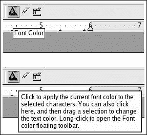
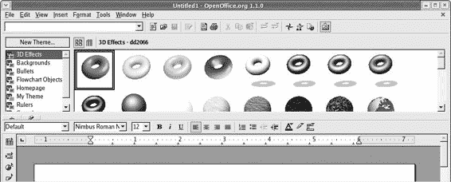
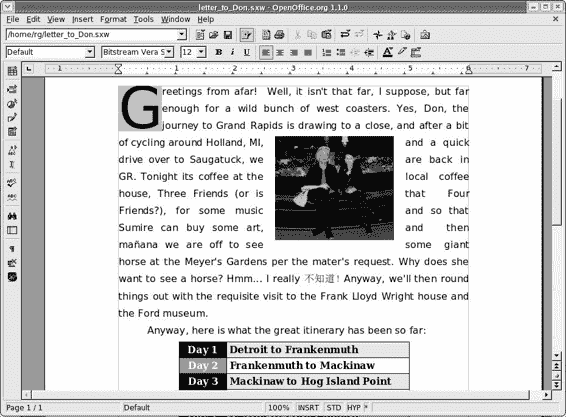
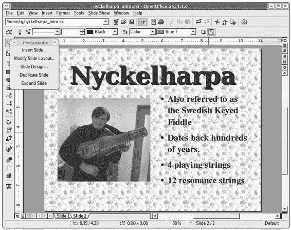
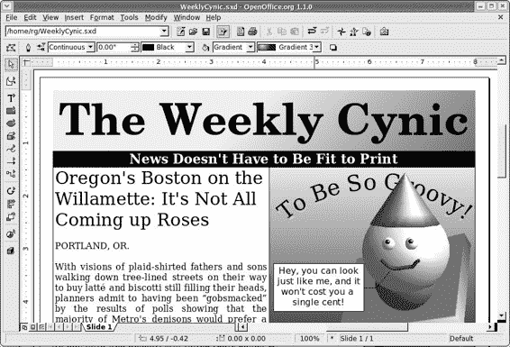
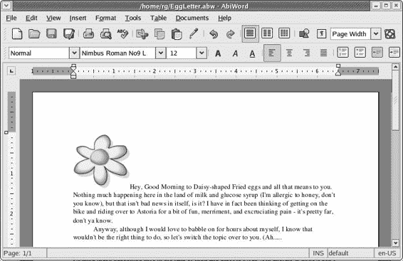
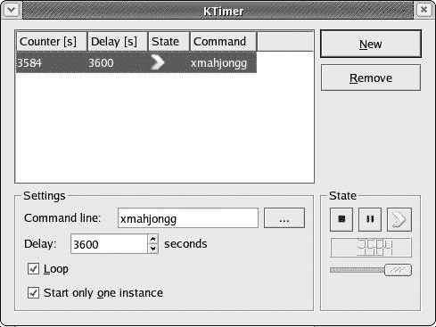
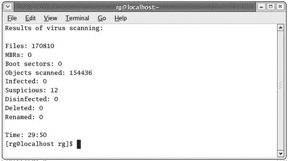

# 第十五章：企鹅回归工作

## 概述

*在 Linux 中投入工作*

好吧，我承认；我一直在引导你进行一场完全享乐主义、游戏至上、快乐至上的疯狂之旅，穿越 Linux 的世界，几乎没提到任何与工作场所相关的内容……甚至工作本身。毕竟，我试图让你看到 Linux 是一个温暖而舒适的、有趣而友好的操作系统。

所有这些对乐趣的关注并不意味着 Linux 在办公桌后面没有能力。Linux 可以投入工作，并且做得和下一个操作系统一样好。我认为可以安全地说，你在 Linux 的世界里，在家庭和办公生产力程序方面，并没有错过什么，而且可能还获得了很多。在这一章中，我将带你了解这个部门的 Linux 提供内容。

* * *

* * *

## OpenOffice.org

无论他们是否应该如此，人们都非常痴迷于办公套件，尽管大多数人很少需要比文字处理器更多的东西。办公套件的事实标准是 Microsoft Office，它在 Windows 和 Macintosh 世界中都可用。当然，由于它是微软的产品，你可以相当确信没有 Linux 版本可用。

幸运的是，Linux 确实有一个非常强大的办公套件，那就是 OpenOffice.org，顺便说一下，它也在 Windows 和 Mac OS X 版本中免费提供（这里的“免费”是指免费）。OpenOffice.org 并不是 Linux 世界中对 Microsoft Office 的轻量级替代品；它是一个功能齐全的竞争者，在某些情况下，例如其屏幕字体渲染，OpenOffice.org 是一个明显的赢家。

就像大多数其他办公套件一样，OpenOffice.org 由一个文字处理器、一个电子表格程序、一个演示程序以及几个其他程序组成。主要的三项应用在读取和写入文件方面与它们的 Microsoft Office 等价物（分别是 Microsoft Word、Excel 和 PowerPoint）兼容，并且由于这些应用程序的基本外观和感觉相当类似于 Microsoft Office，因此切换到 OpenOffice.org 应用程序应该相对容易。即使你没有使用 Microsoft Office 的经验，你也应该觉得一切都很直观，因为基本布局相当直观。而且如果你在直觉方面有所欠缺，内置的帮助文件也相当不错。

要启动 OpenOffice.org，请前往主菜单，选择**办公**，然后选择你想要使用的办公应用程序。记住，文字处理器和电子表格程序的启动器也应该还在你的面板上。

### *开启提示功能*

一旦你开始使用 OpenOffice.org 的某个程序，我建议开启 OpenOffice.org 的提示功能，以便你在进一步查看组成 OpenOffice.org 套件的应用程序时得到帮助。

OpenOffice.org 的提示系统与 Windows 和 Mac 世界中的类似系统一样。实际上，在 GNOME 环境中您也有一个类似的功能，尽管它并没有应用到 OpenOffice.org 中。

如果您不确定我在说什么，提示就是那些弹出的小黄色框，当您将鼠标放在按钮或菜单项上时，会显示按钮或菜单项的功能。图 15-1 显示了 OpenOffice.org 应用程序中可用的两种提示类型：通常的简短类型和更详细的扩展类型。



图 15-1：OpenOffice.org 中的两种提示类型：标准（顶部）和扩展（底部）

要激活提示，请转到**帮助**菜单并选择**提示**，如果您更喜欢更多的文字，也可以选择**扩展提示**。

### *了解其他按钮*

现在您已经激活了提示，应该不会很难弄清楚 OpenOffice.org 应用程序中各种按钮和菜单项的功能。然而，有几个按钮可能需要，或者至少值得，更多的解释（参见图 15-2）。

[(1502_0.jpg)]

图 15-2：OpenOffice.org 中的功能工具栏

第一个奇怪的按钮位于打印机图标稍左的位置。这是 PDF 按钮，您可以使用它将文档导出为 PDF 文件。虽然这个按钮是 OpenOffice.org 1.1.0 的新功能，但实际上在 OpenOffice.org 的早期版本中，通过打印对话框就可以实现 PDF 创建功能。如第六章中所述，在 OpenOffice.org 1.1.0 版本中，仍然可以通过打印对话框创建 PDF 文件。

图 15-2 中显示的工具栏右侧还有四个看起来很奇怪的按钮。这四个按钮实际上都是切换开关，意味着点击时会打开一个窗口，再次点击时会关闭相同的窗口。从左到右，这些按钮切换导航窗口、样式窗口、超链接窗口和图库。

+   **导航窗口** 导航窗口（参见下一页的图 15-3）是一个相当酷的导航功能，当处理长文档或复杂文档时非常有用。导航功能允许您轻松地在文档的页面之间或其中的元素之间跳转。假设您有一个包含大量插图（如本章）的文档，并且您想直接从一张插图跳到另一张。在这种情况下，您会在导航窗口的主面板中点击“图形”一词，然后点击跳转按钮（位于页面选择器左侧的奇怪小按钮）以开始跳转。

    

    图 15-3：导航窗口

+   **样式窗口** 样式窗口允许您将各种样式（章节标题、段落样式、编号等）应用到文本的各个部分。

+   **超链接窗口** 超链接窗口允许您将链接分配给指定的文档——不仅限于网页，还包括单个计算机上的文档。虽然网页上的超链接是我们所有人都习以为常的事情，但文本文档之间超链接的想法听起来像是一个非常激进的观念。实际上，这是一个相当古老的观念，早在我们甚至听说过互联网之前就已经存在了。

+   **相册** 相册是用于您文档或网页中的图形元素库（见图 15-4）。这些元素从各种线条到按钮，再到彩色三维甜甜圈不等，您甚至可以添加自己的元素。

    

    图 15-4：相册

即使不使用相册，将图形插入文档也是一个足够简单的任务。您需要做的只是转到**插入**菜单，选择**图形** > **从文件**，然后定位您想要插入的图片文件。然而，当您打算频繁使用某些图形时，使用相册会更方便。一旦进入相册，您的图形只需点击一两次即可，并且可以在相册浏览器窗口中方便地查看。

将您自己的图形添加到相册也是相对容易的。首先，您必须为要添加的每一组图片创建一个新的类别（称为*主题*）。要创建自己的相册主题，只需在相册窗口中点击**新建主题**按钮。这将打开新建主题属性窗口，在那里您应该首先点击**常规**选项卡，并为您的主题命名。完成此操作后，点击**文件**选项卡，然后点击**查找文件**按钮，这将打开选择路径窗口。从那里，您可以导航到您存储剪贴画、照片或其他图形的文件夹。一旦找到文件夹，点击**选择**按钮，之后该文件夹中所有文件的列表将出现在新建主题属性窗口中。

现在，您可以通过点击您想要添加的每个图片的名称（您可能想要确保**预览**被勾选以使事情变得更容易），然后点击**添加**按钮，轻松地将图片添加到您的新相册主题中。一旦完成，图片的副本将立即出现在相册浏览器中，以便将来使用。要使用相册中的图片之一，只需在您想要插入文档中的图片上右键单击，然后在弹出菜单中选择**复制**或**链接**。

* * *

* * *

## OpenOffice.org 应用程序

整个 OpenOffice.org 办公套件由五个应用程序组成：文字处理器（Writer）、电子表格（Calc）、演示创建和播放器（Impress）、矢量绘图程序（Draw）和数学公式编辑器（Math）。所有这些应用程序都可以通过访问主菜单并选择**办公**来访问。此外，在默认的 Fedora Core 设置中，主要三个应用程序（Writer、Impress 和 Calc）都有面板启动器，尽管你可能在使用第三章时移除了 Impress 的启动器。

让我们简要地看看每个应用程序，尽管作为一个数学白痴，我认为我不会冒险进入 Math 能做什么的领域。

### *作者*

正如我之前提到的，文字处理器是大多数用户最常使用的办公应用程序。幸运的是，OpenOffice.org 的 Writer 是一个很好的选择（参见上一页的图 15-5）。它功能丰富，甚至可以读取和保存 Microsoft Word 文件。和 Word 一样，它甚至允许你将页面保存为 HTML 文件，这样你就可以轻松地将文档转换为网页。



图 15-5：在 OpenOffice.org 的文字处理器——Writer 中创建的信件

正如我所说的，Writer 是一个非常直接的文字处理器，所以我就不多说了，但如果你想要了解一些关于如何使用 Writer 的简介，可以查看 OpenOffice.org 网站上的第一步教程([www.openoffice.org/writerfirststeps/writerfirststeps.html](http://www.openoffice.org/writerfirststeps/writerfirststeps.html))。

### *Calc*

Calc 是 OpenOffice.org 的电子表格应用程序，在功能和总体布局方面与 Excel 相似（参见图 15-6）。它也非常重要的一点是可以读取和保存 Microsoft Excel 文件。


图 15-6：在 OpenOffice.org Calc 中创建的电子表格

如同大多数使用电子表格的人一般，他们通常都能理解电子表格的基本用途，并且在稍微摸索一番后，就能找出如何使用它们，因此我不会有任何关于如何使用 Calc 的入门介绍。然而，由于还有很多人认为没有必要尝试使用电子表格，我将提及一些使用 Calc 可以做的简单事情，希望能吸引你们中的某些人尝试一下。

大多数不使用电子表格的人认为它们是一种用于计算不舒服的大量数字的巨型计算器，比如工资单（这是此类应用程序的原始目的）。没错，当然，但电子表格也可以用于日常任务，例如预测家庭预算、计算平均成绩点（适用于教师或学生）、计算你为前往匈牙利旅行攒钱需要多长时间，甚至可以用于像比较你试图从四或五款摩托车中选择的一款的座位高度这样奇怪的事情。在进行这些小数学任务时，你可以轻松地创建图表，以便所有抽象的数字都能直观地对你说话。

如果你不喜欢数字，你仍然可以使用 Calc 创建信息列表，例如生日列表、班级名单、购物清单、地址列表……等等。你甚至可以让 Calc 将这些列表按字母顺序排序，或按出生日期排序等。

### *Impress*

Impress (图 15-7)是 OpenOffice.org 对 Microsoft PowerPoint 的回应，它与 PowerPoint 兼容。它允许你创建用于演示的图形吸引人的幻灯片，并允许你创建伴随它们的笔记或讲义。虽然这些功能使 Impress 在商业和教育环境中非常方便，但你可能不会觉得它对家庭用户有太大的价值。



图 15-7：在 OpenOffice.org Impress 中准备演示文稿

### *Draw*

对家庭用户更有用的是 OpenOffice.org Draw。虽然 Draw 在艺术意义上创建真正图形的能力并不出色，但它对于创建流程图、组织图（如婚礼招待会或会议的座位安排）或任何其他你希望对文本和图形的放置有更多控制的文档非常有用（尤其是当两者结合时），例如传单、奖项、图表和通讯稿。从这个意义上说，OpenOffice.org Draw 可以非常有效地作为一个简单的页面布局程序，正如你在图 15-8 中可以看到的那样。



图 15-8：在 OpenOffice.org Draw 中创建（并显示）的通讯稿

### *Math*

最后，我们来到了 OpenOffice.org 的 Math。由于我在数学方面有些外行，我无法告诉你更多关于 Math 的信息，除了它是一个数学公式编辑器，允许你生成复杂的数学公式，然后将它们作为嵌入对象粘贴到其他 OpenOffice.org 程序中。它严格是一个编辑器，并不进行计算。我想我可以安全地说，大多数人在日常生活中并不需要它，除非，当然，你以编写数学教科书为生。

* * *

* * *

## 另一个办公套件

在 Linux 世界中，还有一个名为 KOffice 的免费办公套件，它是包含在 Fedora Core 中的 KDE 办公套件。我从未发现 KOffice 有什么太多用途，因为它不像人们预期的那样直观，而且它附带了很多相当无用的额外功能，至少在我看来是这样的，它们只是浪费了空间。

如果你感兴趣 KOffice，你可以通过访问[`koffice.kde.org.`](http://koffice.kde.org)来了解更多信息。如果你在查看该网站后想安装它，你可以通过软件包管理窗口轻松完成。只需转到主菜单，选择**系统设置** > **添加/删除应用程序**。当软件包管理窗口打开时，滚动到**办公和生产力**部分，并点击**详细信息**链接。完成此操作后，将打开软件包详细信息窗口——只需勾选**koffice**旁边的复选框。点击**关闭**以关闭详细信息窗口，然后在软件包管理窗口中点击**更新**。

* * *

* * *

## AbiWord

AbiWord 曾经是唯一真正的跨平台文字处理器的独特之处，因为它有 Linux、Mac 和 Windows 版本。这一点，加上它是免费的，意味着很多人使用它。然而，现在 OpenOffice.org 也在这三个平台上可用（并且同样免费），AbiWord 在这方面已经失去了它的名声。

尽管如此，AbiWord 在整体方案中仍有其位置。最重要的是，AbiWord 相当快速。毕竟，可能有些人并不真的需要 Writer 的所有功能（至少不是所有时候），他们更愿意选择点击启动器后立即出现的软件，而且使用起来不需要超过一分钟（参见图 15-9）。



图 15-9：另一个 Linux 文字处理器——AbiWord

AbiWord 拥有一个非常直观且易于使用的界面，你应该能够在没有太多，如果有的话，帮助的情况下弄清楚它。它还有一些相当有趣的功能，例如它的自动调整大小功能，当你增加或减少程序窗口的大小时，它会放大或缩小屏幕上的文档大小（字体、图像等）。另一个是 AbiWord 能够读取和保存大量格式的文件，包括 Microsoft Word (.doc)、OpenOffice.org Writer (.sxw)以及许多其他熟悉（以及一些不熟悉）的格式。

如果你以前在 Linux 环境中使用过 AbiWord，那么你可能会对它绝对糟糕的屏幕字体渲染感到不太满意。我个人觉得这种外观非常令人烦恼，以至于我无法忍受使用它。幸运的是，情况已经改变。字体现在看起来相当不错（尽管不如 OpenOffice.org 中绝对美丽的屏幕字体渲染），整个界面也是如此，可以说已经完全 GNOME 化了。总的来说，AbiWord 只是更好。

您可以使用 APT/Synaptic 轻松安装 AbiWord。只需运行 Synaptic，在**查找**框中输入 abiword，然后...嗯，你现在应该知道了这个流程。如果你是从 3-CD 安装盘套装安装的 Fedora Core 或 Red Hat Linux 系统，AbiWord 将包含在这些盘上，所以如果你更喜欢通过软件包管理窗口安装它，请点击**详情**按钮旁边的**办公/生产力**，然后勾选**abiword**旁边的复选框。一旦安装了 AbiWord，您可以通过进入主菜单并选择**办公** > **更多办公应用程序** > **文字处理器**来运行它。

* * *

* * *

## 一些其他酷炫的生产力应用程序

除了传统的办公套件应用程序外，您的系统中还包括许多其他可以归类为“生产力”标签的应用程序。您已经听说过（也许甚至安装过）Linux 家庭财务程序 GnuCash，但还有许多其他已安装并可供您使用的应用程序，例如以下这些：

+   Gcalctool，一个具有基本和科学模式的计算器（从主菜单选择**附件** > **计算器**）

+   Gpdf，GNOME PDF 文件查看器（从主菜单选择**图形** > **更多图形应用程序** > **PDF 文件查看器**）

+   Kdeprintfax，一个传真发送和接收实用程序（从主菜单选择**附件** > **kdeprintfax**）

+   Dia，图表创建工具（从主菜单选择**办公** > **Dia 图表**）

+   Mr. Project，工作项目管理器（从主菜单选择**办公** > **项目管理**）

除了这些或多或少标准的实用程序之外，您的系统上还安装了一些其他相当有趣的应用程序。其中之一是 KTimer，它允许您在给定时间段的末尾运行一个命令（参见图 15-10）。例如，假设您想确保每小时休息一下，以保持自己的理智。您可以通过选择**延迟**框中的秒数（3600 秒是一小时），勾选**循环**复选框（如果您希望每小时重复发生），并输入您希望执行的命令（本例中的 xmahjongg）来设置 KTimer。您可以通过进入主菜单并选择**附件** > **更多附件** > **KTimer**来运行 KTimer。



图 15-10：使用 KTimer 设置每小时命令

另一个有趣且实用的应用程序是 KJots（见图 15-11）。KJots 是一种类似记事本的应用程序，它被组织成书籍和页面。书籍是你创建的一般主题区域，它们包含页面，你在其中写下或草拟笔记。窗口底部还有一个热列表部分，你可以放置按钮，直接跳转到你最常需要的那些书籍。总的来说，这是一款非常简单的软件，但一旦开始使用，你会发现它非常实用。要运行 KJots，只需转到主菜单，选择**附件** > **更多附件** > **Kjots**。


图 15-11：使用 KJots 做笔记

* * *

* * *

## 使用 File Roller 创建自己的 Tar 包（和 ZIP 文件）

最有用的非办公应用程序之一是你已经熟悉的：File Roller。你在完成这本书中的项目时，已经使用 File Roller 解压了许多 tar 包。然而，直到现在，你还没有学习如何使用它来创建自己的 tar 包。现在就让我们来改变这一点。

你可能想知道为什么你想要创建一个 tar 包。好吧，让我们假设你想要通过电子邮件发送一份文档和一些图片给你的一个朋友。你想要发送的文件总共有 669KB，这会使通过调制解调器连接的上传和下载变得有些漫长。为了将这个大小降低一些，并且使接收端更容易管理，你可以将这些文件打包成一个 tar 包。

要创建你的 tar 包（或 ZIP 文件），转到主菜单，选择**附件** > **File Roller**。这将打开现在熟悉的 File Roller 窗口。在这个窗口中，点击**新建**按钮。一个新建归档窗口将打开。使用这个窗口，你首先将创建一个空归档，你可以稍后将其放入你想要打包在一起的所有文件。为归档输入一个名称，如果你是要发送给 Windows 用户，请输入.zip 作为扩展名，如果你是要发送给其他 Linux 用户，请输入.tar.gz（Linux 和 Mac 用户实际上应该能够处理这两种类型的归档）。完成这些后，点击**确定**，一个仍然为空的归档将被创建。

向你的归档中添加文件的最简单方法是将你想要的文件直接拖放到新归档的 File Roller 窗口中。你可以逐个添加文件，或者通过拖放整个文件夹来添加它们。一旦这样做，File Roller 将归档文件，新添加的文件将出现在 File Roller 窗口中（见图 15-12）。哦，别担心，你的原始文件仍然在它们原来的位置——安全且未受损害。


图 15-12：使用 File Roller 创建 tar 包或 ZIP 文件

一旦文件出现在那个窗口中，你就完成了，可以关闭 File Roller 并将你的存档文件发送给你的朋友。请注意，然而，有时当你第一次拖入存档的项目是一个文件夹时，它不会出现在存档窗口中，直到你添加另一个文件，尽管实际上它已经在那里了。这是 File Roller 的一个小问题，但它只是表面的，所以如果你要存档的唯一项目是一个文件夹，不用担心。你不能保存空存档，所以如果你的存档出现在你的文件夹或子文件夹中，你知道你已经成功了。

* * *

* * *

## 项目 15A：检查系统病毒（可选）

当我们还在处理严肃的事情时，我们不妨简要提及一下病毒。确实，大多数出现在新闻中的病毒都是针对 Windows 系统的，并利用 Windows 版本的 Outlook 和 Outlook Express 电子邮件客户端来广泛传播。但这并不意味着 Linux 对病毒免疫。由于许多 Linux 用户认为病毒只会发生在 Windows 上，Linux 系统通常没有防护，并且成为了一个有吸引力的潜在目标，尤其是随着 Linux 用户数量的持续增长。还有可能你的系统可能被用作某种中转站，将病毒从一个人传递给你的一个同事（猜猜谁会承担责任）。所以，虽然你现在真的不必太担心，但总是安全比后悔好。

由于 Windows 是病毒的首要目标，因此针对 Windows 的病毒扫描应用程序数量远多于 Linux。在这些 Linux 应用程序中，许多对初学者来说使用起来有些繁琐，而且大多数都需要付费才能使用。然而，有一款名为 F-Prot Antivirus 的程序，由冰岛公司 Frisk Software International（[www.f-prot.com](http://www.f-prot.com)）开发，对“个人工作站上的个人用户”免费提供。如果你是我想象中的读者群体之一，那么这意味着 F-Prot Antivirus 对你来说是免费的。F-Prot Antivirus 以 RPM 文件的形式提供，因此安装非常简单。尽管它是在 Linux 命令终端中运行的，因此没有图形界面，但它使用起来也非常简单。

### *获取和安装 F-Prot Antivirus*

要获取 F-Prot Antivirus，请点击[F-Prot 下载页面上的**RPM 包**链接](http://www.f-prot.com/download/download_fplinux_personal.html)。你将看到一个表单，你需要填写你的姓名、电子邮件地址、位置和国家。填写完表格后，点击页面底部的**提交并开始下载**按钮。下载完成后，**fp-linux-ws.rpm**文件将出现在你的主文件夹中。只需双击该文件即可安装。

### *15A-1：使用 F-Prot Antivirus*

在使用 F-Prot Antivirus 之前，最好先更新其病毒数据库，这样你就可以捕捉到最新的病毒恶棍。为此，你使用与 F-Prot Antivirus 一起安装的更新脚本。打开一个终端窗口，使用 **su** 命令成为 root 用户，输入 /usr/local/f-prot/tools/check-updates.pl 并按回车键。然后脚本将联系 F-Prot 服务器，检查更新的病毒信息，下载所有可用的内容，然后安装它——当然，在过程中会告诉你它所做的一切。

一旦更新了病毒数据库，你就可以使用 F-Prot Antivirus。正如我之前提到的，F-Prot Antivirus 是基于命令的，但命令本身相当简单。基本的命令结构由主要命令 **f-prot** 以及你想要扫描的目录或文件组成。例如，如果你想扫描整个硬盘以查看是否有病毒，你首先成为 root 用户，然后输入 f-prot / 并按回车键。然后 F-Prot 会扫描整个硬盘以检查已知病毒。这可能会根据你系统的速度和文件数量而花费大约 30 分钟，所以你最好在吃午饭时做这件事。当扫描完成后，F-Prot Antivirus 将显示其结果，如图 15-13 所示。



图 15-13：F-Prot Antivirus 扫描的结果

如你所见，F-Prot Antivirus 会告诉你它扫描了多少个文件，完成扫描所需的时间，有多少个文件可疑（意味着对 F-Prot 来说看起来很奇怪，但与数据库中的任何已知病毒都不匹配），以及有多少个文件实际上被感染。

在前一个例子中使用简单命令字符串的一个问题是，F-Prot Antivirus 在执行任务时不会给你任何反馈——你将在终端中看不到任何东西，直到 F-Prot 完成任务，显示其结果，并且你的用户提示符重新出现。我觉得这有点令人不安，所以我更喜欢在 **f-prot** 命令中添加 **-list** 标志，这样 F-Prot 就会在扫描过程中显示它正在扫描的每个文件。这让你确信 F-Prot 正在执行它应该做的事情（并且给你一些关于其进度的指示）。

如果你觉得这样更好，请打开一个终端窗口，成为 root 用户，输入这个命令，然后按回车键：

```
f-prot -list /

```

如果你只想扫描你的主文件夹，那么请输入这个版本的命令并按回车键：

```
f-prot -list /home/username/
```

如果你喜欢，也可以使用这个版本的命令来扫描单个文件：

```
f-prot /home/username/mysuspiciousfile.xxx
```

当然，在这个最后版本中，我省略了 **-list** 标志，因为只有一个文件正在被扫描。当你已经知道正在扫描的文件时，没有必要显示 F-Prot 进度的列表。

这一切都很简单。然而，你所做的只是扫描磁盘以查找病毒。如果你想让 F-Prot 杀毒软件对它找到的任何感染文件进行消毒，你需要在命令字符串中添加另一个标志，**-disinf**。要使用**-disinf**标志与你的命令一起使用，你只需输入以下内容并按回车键：

```
f-prot -disinf -list /
```

当 F-Prot 找到需要消毒的文件时，它将首先寻求你的同意然后再进行消毒。

你现在几乎已经知道了使用 F-Prot 杀毒软件所需的所有信息，但如果你想阅读文档本身并了解一些可供你使用的更多选项，你可以在 www.f-prot.com/support/helpfiles/unix/linux_ws/index.html 查看。

* * *
