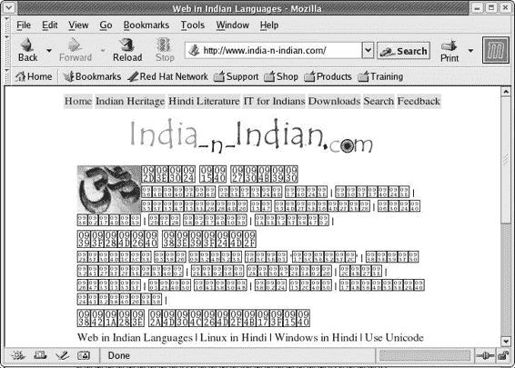
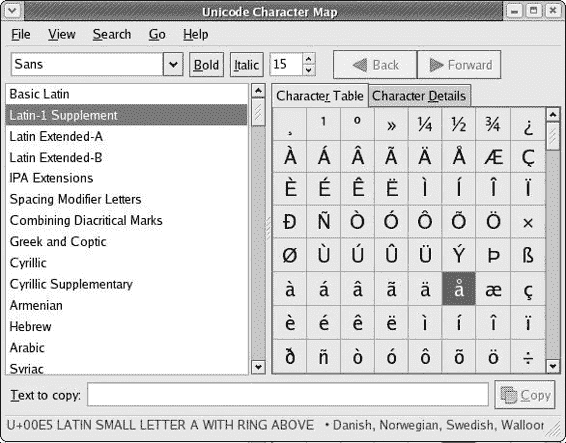
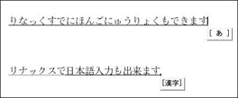
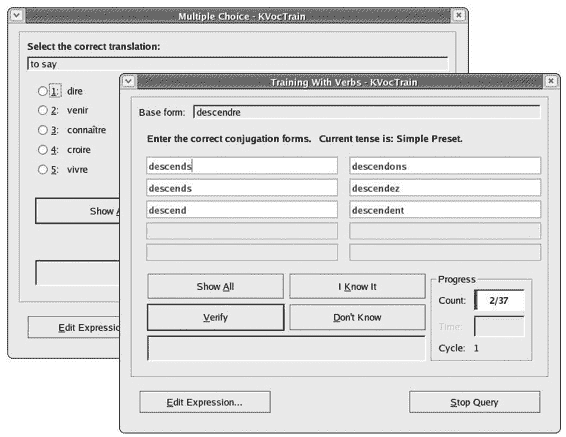

# 第十七章：图克斯说你的语言

## 概述

*Linux for Multilingual Users and Language Learners*

现在，几乎所有操作系统至少在某种程度上都是多语言的或能够成为多语言的。Linux 也是如此。只需打开你的网络浏览器，你就可以阅读任何欧洲语言的页面，包括那些有西里尔字母的，如俄语。你甚至可以稍微多花点力气查看中文、日语、泰语、阿拉伯语和希伯来语等语言的页面。

但 Linux 的多语言能力远不止于此，Fedora Core 的设置方式使得充分利用这些功能变得相当容易。正如你很快就会看到的，你甚至可以设置你的系统，使其提供一个完全陌生的语言环境，让你能够完全使用你选择的语言进行操作。再加上不断增多的免费语言学习程序，你将拥有一个真正有意义的语言学习工具。

* * *

* * *

## 只读语言支持

如果你只想能够阅读用外语编写的网页或文档，你不需要安装任何额外的语言支持。实际上，根据所涉及的语言，你可能根本不需要做任何事情。

使用罗马字母编写的文档或网页，如瑞典语、意大利语、马来西亚语或他加禄语，你不需要做任何额外的工作。如果在第十六章中你安装了微软 TrueType 核心字体（特别是 Arial、Courier New 或 Times New Roman），你也将能够阅读用罗马字母编写的许多其他语言的页面和文档，这些语言需要特殊的变音符号，如越南语，以及非罗马字母的字母书写系统语言，如阿拉伯语、希伯来语、泰语或基于西里尔字母的语言（俄语、乌克兰语、塞尔维亚语和保加利亚语）。

对于其他语言，你可能需要安装该语言的字体。当你遇到一个用你没有任何字体支持的文字编写的页面时，文本将显示为奇怪的符号，就像图 17-1 中显示的印地语页面图 17-1。

图 17-1：没有适当字体支持查看的印地语网页

一旦你为想要查看的页面安装了适当的字体集，奇怪的符号将被该字体中的适当字符所替换。（在这种情况下，我安装了从 [www.india-n-indian.com/download](http://www.india-n-indian.com/download) 通过右键点击 **Free Indic TTF Font** 链接下载的 indic.ttf 字体。）结果是页面显示得应该就是这样（参见图 17-2）。

图 17-2：安装了 indic.ttf 字体后的印地语网页

除了印地语外，可能需要安装特定字体包的语言是中文、日文和韩文。这些字体都包含在安装盘 2 中。你可以通过在该盘上的**Fedora**文件夹（如果你使用的是 Red Hat Linux 9 而不是本书中包含的磁盘，则为**RedHat**文件夹）中双击来找到这些字体，然后在该文件夹内找到**RPMS**文件夹。一旦找到字体，将你想要的字体包复制到你的硬盘上的 Tarballs_and_RPMs 文件夹中。这些字体的文件名以**ttfonts**开头：

+   **ttfonts-ko** 用于韩文

+   **ttfonts-zh_CN** 用于中华人民共和国使用的简体中文

+   **ttfonts-zh_TW** 用于台湾使用的繁体中文

+   **ttfonts-ja** 用于日文

一旦复制了文件，你可以通过 RPM 的常规双击方法安装字体。

如果你愿意（或需要），你可以使用 Synaptic/APT 下载并安装这些字体中的任何一种或全部。为此，只需在 Synaptic 主窗口的**查找**框中输入 ttfonts。一旦完成，点击该框旁边的搜索箭头。然后你可以从 Synaptic 搜索结果中列出你想要安装的字体中选择。

### *在 Mozilla 中更改字符编码*

如果你已经安装了新字体但仍然无法查看你为该字体安装的语言的页面，尝试更改 Mozilla 中的字符编码。你可以通过转到 Mozilla 的**查看**菜单并选择**更改编码**来完成此操作。从该子菜单中，你可以选择该页面的适当编码。Mozilla 通常会自动完成此操作，但有时页面的作者可能忘记在 HTML 中包含该页面的字符编码，在这种情况下，Mozilla 不知道该页面是用另一种语言准备的，因此将以你的系统默认语言打开。

* * *

* * *

## 输入非标准字符

在 Linux 中输入非英语标准字符，如é、ç、ß、ø、æ和å，可以非常容易地完成，无需任何修改。在大多数情况下，你可以通过使用系统包含的 Unicode 字符映射工具来完成此操作，该工具可以在**主菜单**下的**附件** > **Unicode 字符映射**中找到。随后将出现一个类似于图 17-3 的窗口。

图 17-3：使用 Unicode 字符映射输入字符

要输入你想要的字符，只需在窗口的左侧面板中选择语言或字符集，然后在右侧面板中点击你想要输入的字符。该字符将随后出现在窗口底部的**要复制的文本**框中的小输入框中。只需点击**复制**按钮，然后将字符粘贴到你想要放置的位置。

在某些应用程序中，例如 OpenOffice.org，此方法可能不起作用。在这些情况下，程序通常会提供自己的方法。例如，在 OpenOffice.org 中，您可以在菜单栏中点击**插入**，然后选择**特殊字符**。将打开一个选择窗口，您可以在其中选择所需的字符。完成选择后，点击**确定**按钮，字符将出现在您的文档中，之后选择窗口将自动关闭。

### *键盘布局切换器*

如果您经常使用某种特定的外语进行输入，那么使用**键盘布局切换器** GNOME 面板实用程序可能对您来说会更加方便。此实用程序允许您快速在多种键盘布局之间切换。例如，如果您经常使用瑞典语，并且经常使用字符 å、ä 和 ö，那么使用适当的键盘布局会比反复使用 Unicode 字符映射更容易。当然，您需要熟悉您选择的每种语言的键盘布局或**快捷键映射**，但这相对容易。

键盘布局切换器已包含在您的系统中，因此无需安装。要访问它，只需在 GNOME 面板上的您想要放置启动器的地方右键单击。然后，从弹出菜单中选择**添加到面板** > **实用程序** > **键盘布局切换器**。在面板中会出现一个类似键帽的图标，上面带有美国国旗。

现在，仅此而已将不会给您带来任何东西，除了您默认的快捷键映射，因此如果您想使用其他快捷键映射，您必须配置键盘布局切换器。要做到这一点，只需右键单击图标，然后从弹出菜单中选择**首选项**，这将打开首选项窗口。

要添加快捷键映射，请点击窗口右侧的**添加**按钮。完成此操作后，将打开一个包含快捷键映射列表的另一个窗口。向下滚动到您要添加的语言的快捷键映射，然后点击它。该语言的可用快捷键映射将显示出来；只需选择您想要的快捷键映射，如图 图 17-4 所示。当有可用选项时，通常最好选择**xkb**布局，因为它通常具有最多的选项（例如，阿拉伯语或希伯来语的从右到左文本输入）。

图 17-4：向键盘布局切换器添加快捷键映射

一旦您选择了想要的快捷键映射，点击**添加**按钮，然后点击**关闭**。这将使您回到主首选项窗口，该窗口将显示您已安装的新快捷键映射。关闭首选项窗口后，可以通过点击面板中的图标来更改键盘布局。您还可以通过转到首选项窗口的**选项**选项卡并分配键盘快捷键来在键盘布局之间切换。

如果你只想选择一个键盘布局来替换你现有的布局（例如，使用英国英语而不是美国英语，或者使用德语而不是西班牙语），你可以通过转到主菜单并选择**系统设置** > **键盘**来实现。你首先会被要求输入 root 密码，然后你会看到一个你可以从中选择的键盘布局列表。

* * *

* * *

## 在另一种语言中查看您的系统

吸引我最初对 Linux 世界产生兴趣的许多事情之一就是能够为除英语之外的语言安装语言支持。在我的其中一台机器上，我安装了中文、日文、瑞典文以及我的默认语言英语的支持。只需简单的注销和几点击，我就可以用完全不同的语言界面重新登录。我可以在任何时候拥有一个中文系统、一个日文系统或一个瑞典文系统。

这对于你将要大量使用外语进行工作，或者即使你正在学习一门外语并希望尽可能多地接触这门语言来说非常有用。当你有不同母语的用户使用同一台机器时，这也非常方便。例如，在我所在的大学，我的日本学生和中国学生有时会使用我的电脑，额外的语言支持使他们能够使用自己的语言登录。总的来说，这是一个非常有用的功能。

利用 GNOME 环境中的这个功能非常简单，并且根据你希望使用的语言，可能不需要进行任何特殊的安装措施。一般规则基本上与我在前面提到的只读语言支持相同——如果你想查看使用基于拉丁字母的书写系统的语言（法语、西班牙语、丹麦语、德语、马来西亚语等等）的整个系统，那么你不需要做任何事情。一旦你安装了微软的 TrueType 核心字体，你就可以准备使用我之前提到的所有非拉丁字母书写系统的语言了。

对中文、日文和韩文的支持是另一回事。这三种语言的书写系统足够复杂，不仅需要安装适当的字体，还需要安装相当数量的其他应用程序来处理输入和转换过程。尽可能在初始系统安装过程中安装这些语言的额外语言支持，如第二章中所述。如果你已经安装了没有这些语言支持的系统，但希望在不重新安装整个系统的情况下添加它们，请查看本书的网页([www.edgy-penguins.org/non-geeks](http://www.edgy-penguins.org/non-geeks))以获取你需要安装的软件包信息。

注意，如果你打算将来使用 KDE 作为你的桌面环境（或者如果你已经在暗中这样做），你还需要为每个你想要登录支持的语种安装特殊的 KDE 语言文件。你可以在安装盘 X 的 RPMS 文件夹中找到适当的 RPM 文件。这些文件都将具有类似 kde-i18n-Czech、kde-i18n-Arabic 等名称。如果你愿意，可以使用 Synaptic/APT 来添加此类支持。为此，只需在 Synaptic 主窗口的 **查找** 框中输入 kde-i，然后从结果列表中选择你想要安装的语言。

### *多语言登录*

在另一种语言中登录你的计算机非常简单。你首先需要做的是到达登录屏幕。你可以通过像往常一样启动计算机并等待登录屏幕出现来完成此操作，或者，如果你已经启动并运行，可以通过在主面板菜单中选择 **注销** 来完成。

一旦你到达登录屏幕，点击屏幕左下角的 **语言** 单词。

然后会出现一个包含所有可用语言的窗口，即使是你没有安装的语言。从该列表中，点击你想要使用的语言（当然，前提是你已经安装了它），然后点击 **确定**。语言列表窗口将自动关闭，你可以像往常一样通过输入登录名和密码（当然，每个后面都按回车键）继续操作。

然后会出现一个小窗口询问你是否想要将你选择的语言永久设置为默认语言。你可以根据个人喜好点击 **仅此会话** 或 **设置为默认**。无论你最终选择什么，都无需担心；稍后通过注销系统，以你之前默认的语言重新登录系统，并点击 **设置为默认**，更改回来并不麻烦。

你的启动过程将继续，一切都将像往常一样进行。根据你选择的语言，一旦你的桌面出现，你将进入另一个语言世界。你的菜单、桌面图标标题，甚至当你将鼠标移到面板图标上时弹出的小提示窗口，都将使用所选语言。(图 17-5 展示了多种语言中的回收站和开始这里图标。)你打开的大多数应用程序也将使用该语言显示菜单和按钮。

图 17-5：英文、希伯来语、日文、冰岛语和土耳其语的桌面图标

* * *

* * *

## 中文、日文和韩文输入

这一部分仅适用于那些已经安装中文、日文或韩文作为附加语言的人，或者那些计划或正在考虑这样做的人。当然，如果你只是对此类事物感兴趣，也可以继续阅读。我包括这个特殊部分关于这些语言，因为它们的使用比其他语言复杂一些。

与大多数欧洲语言以及许多其他基于字母的非欧洲语言（如泰语、阿拉伯语和印地语）不同，在这些语言中按键盘上的字母会在屏幕上打印出该字母，中文、日文和韩文需要一种转换过程，这个过程由一个特殊的应用程序（实际上是一套应用程序）处理，称为输入法编辑器（IME）。当然，这是一个 Windows 世界的术语，但为了方便起见，我将使用它。无论如何，每种语言都有自己的 IME，Fedora 会自动为你要安装的每种语言安装适当的 IME。

尽管中文、日文和韩文都需要使用 IME 将单词显示在屏幕上，但由于每种语言的书写系统不同，它们的工作方式各不相同。

### *中文*

尽管大多数人（至少是那些懂语言学的人）会认为中文是最复杂的系统，因为其书写系统由数千个字符组成，但实际上它是最简单的。中文输入法只是简单地接受罗马化键盘输入，称为*拼音*，并将其转换为中文字符，或*汉字*。对于输入法来说，这本质上是一个简单的字典查找任务——大字典，简单的输入法。

这里有一些使用中文输入法的技巧：

+   CTRL + SPACE 键切换输入法编辑器。

+   通过按选择面板中相应选项旁边的数字选择*汉字*；按空格键选择列表中的第一个选项。

+   以下是中国真型字体：AR PL KaitiM GB，AR PL SongtiL GB，ZYSong 18030。

### *日文*

日文输入法有一个相当复杂的任务要执行，因为它需要处理三种书写系统：*汉字*（很久以前从中国借用的表意文字）、音节字母的*平假名*（主要用于时态和格的结尾），以及*片假名*（主要用于从其他语言借用的单词）。尽管如此，日文的标准输入方法主要是通过标准的罗马键盘布局，再加上一些额外的特殊功能键。因此，输入日文是一个两步过程，其中输入法编辑器首先在输入时将罗马化文本转换为*平假名*，然后在按下空格键后将它转换为适当的*汉字*、*片假名*或*平假名*元素。

你可以在图 17-6 中看到这些步骤的示例。

(1706_0.jpg)

图 17-6：使用日文输入法

在第一行，输入法已经将输入的*rinakkusdenihongonyuuryokumodekimasu*（意为“您也可以在 Linux 中输入日文”）即时转换为*平假名*。在第二行，用户按下了空格键，这导致输入法将*平假名*字符串转换为适当的*汉字*、*片假名*和*平假名*元素。第一个单词“Linux”已被转换为*片假名*文本，因为它是一个借词，而“Japanese input”和“can”已被转换为*汉字*；其余部分保持为*平假名*。

这里有一些使用日文输入法的技巧：

+   SHIFT + SPACE 切换输入法编辑器。

+   按空格键将*平假名*字符串转换为适当的*汉字*、*片假名*和*平假名*元素。

+   按回车键接受转换，按退格键拒绝。

+   日文 TrueType 字体包括 Kochi Gothic 和 Kochi Mincho。

### *韩文*

韩文输入法的工作与中文和日文输入法的工作相当不同，因为韩文本身是以非常不同的方式书写的。韩文要么完全使用字母，称为*韩文*，要么是*韩文*和从中文借用的表意文字*汉字*的组合。虽然*汉字*与中文和日文的对应文字*汉字*和*漢字*基本相同，但韩文的音节字母表*韩文*具有其独特的形状，正如您在图 17-7 中看到的韩国单词*韩文*（Hangug）一样。

图 17-7：水平书写的韩国（韩文）单词

这看起来很简单；然而，表示并不完全正确，因为韩文在字母字符放置到页面上的方式上非常独特。与*平假名*、*片假名*和大多数其他使用字母书写的语言并排排列不同，*韩文*字母以成对、三联或四联的形式组合，通常按顺时针方向书写。因此，输入法必须在输入时处理输入（通常基于韩文字母键盘布局），并且必须调整每个字母的大小、间距和位置，将其放入适当的聚类中（参见下一页的图 17-8）。

图 17-8：韩文输入法中的聚类过程示例

这里有一些使用韩文输入法的技巧：

+   SHIFT + SPACE 切换输入法编辑器。

+   按空格键接受*韩文*聚类。

+   要将*韩文*转换为*汉字*，在接受*韩文*聚类之前按 F9 键，以显示*汉字*选择面板。在面板中选择适当的选项，然后按回车键。

+   韩文 TrueType 字体包括 Baekmuk Batang、Baekmuk Dotum、Baekmuk Gulim 和 Baekmuk Headline。

* * *

* * *

## Kdeedu 语言学习程序

如果你正在学习一门外语，你可能想知道 Kdeedu（KDE 教育娱乐）软件包中有一套非常实用的程序可供你使用，其中包括西班牙语动词训练器（KVerbos）、儿童法语字母发音程序（KLettres）和两个闪卡程序（KVocTrain 和 FlashKard）。它还有一些与语言学习无关的教育应用程序（例如一个酷炫的星图）。

要安装任何单个的 Kdeedu 程序，你必须安装整个 kdeedu 软件包。你可以通过使用 Synaptic 来轻松完成这项操作。启动 Synaptic 后，在 **查找** 框中输入 kdeedu，然后按照你在第二章中学到的标准程序操作。如果你是从 3-CD Fedora 或 Red Hat Linux 9 安装套件安装的系统，你只需将 kdeedu RPM 文件从安装盘 3 的 RPMS 文件夹复制到你的硬盘上。之后，只需双击该文件即可安装。

### *闪卡*

正如我提到的，Kdeedu 软件包中包含两个闪卡程序。其中更复杂的是 KVocTrain，你可以通过转到主菜单并选择 **运行程序** 来运行它（Kdeedu 的所有应用程序都不会出现在 GNOME 菜单中）。在运行程序窗口中输入 kvoctrain，然后点击 **运行**。

在我的看法中，KVocTrain 在创建自己的单词列表用于学习方面过于复杂；然而，在研究或添加它在线提供的各种学习列表时，它相当不错。这些以 **kvtml** 结尾的文件包括词汇表、动词变位和甚至非语言项目，如世界首都和音乐调号。要获取一些这些列表，请访问 Kdeedu 贡献学习文件页面 [`edu.kde.org/contrib/`](http://edu.kde.org/contrib/) kvtml.php，并将你想要的文件下载到你的硬盘上。我建议在你的主文件夹内创建一个特殊的文件夹来保存这些文件。你可以将这个新文件夹命名为 kdeedu_data。

一旦你在 KVocTrain 中打开了文件，你可以以列表形式或作为闪卡或多项选择题的形式查看它们（参见 图 17-9）。

图 17-9：KVocTrain 多项选择题

如果你感兴趣的是创建自己的闪卡的一种更直接的方式，FlashKard 是一个更合适的选择（尽管它也可以使用 KVocTrain 使用的相同 .kvtml 文件）。要运行 FlashKard，只需转到主菜单并选择 **运行程序**，然后在运行程序窗口中输入 flashkard，然后点击 **运行**。FlashKard 将随后出现，你可以开始输入你想要学习的单词（参见下一页的 图 17-10）。在你创建了一个词汇表之后，你可以通过转到 **功能** 菜单并选择 **测验** 来以典型的闪卡方式对自己进行测验。

图 17-10：FlashKard 的输入和测验模式

* * *

* * *

## 项目 17A：安装 StarDict 词典（可选）

对于语言学习者或任何需要在多语言世界中工作的人来说，最方便的程序之一是名为 StarDict 的 GNOME 词典程序（见图 17-11）。它是一个简单的词典，可以一次性提供多种语言的定义。

图 17-11：在 StarDict 中查找单词

一旦程序启动并运行，它将显示你在安装 StarDict 时安装的所有语言词典中的定义。这可以在任何方向上工作，所以无论你输入什么语言的单词，都会显示定义。例如，我已经安装了 Eng-Swe、Swe-Eng、Ger-Swe、Swe-Jpn、Jpn-Eng、Eng-Jpn、Chi-Eng 和 Eng-Chi 词典。如果我输入一个英文单词，我会得到瑞典语、中文和日语的定义。如果我输入一个瑞典语单词，我会得到英文和日语的定义，依此类推。

StarDict 同样是一个在文件或网页中阅读文本的出色实用工具，因为只要 StarDict 程序正在运行，它就会显示你在其他程序中使用鼠标选择的单词的定义。图 17-12 展示了在网页中此内联功能的作用。这个内联功能被称为 *扫描选择*，当你将文本输入到文档中，甚至在系统自身的对话框中输入文本时，它也会工作。如果你选择一个单词，StarDict 将会扫描它并告诉你它的意思。

图 17-12：StarDict 为选定的文本提供内联定义

### *获取 StarDict 文件*

要获取 StarDict 的最新版本，请访问 [`stardict.sourceforge.net`](http://stardict.sourceforge.net) 并将 **stardict-2.4.2-1.i386.rpm**（或更新的版本）下载到你的 Tarballs_and_RPMs 文件夹。如果你在安装盘上偶然发现 StarDict RPM 文件，请不要使用它。它不是同一个版本。

为了使用词典，你还需要下载一些词典文件，通常是一对每种语言对的词典（例如，英语-德语和德语-英语）。你可以通过点击网页顶部的 **词典** 链接来获取这些文件。一旦你到达词典页面，你会看到一些额外的链接：**dictd-[www.dict.org](http://www.dict.org)**、**dictd[www.freedict.de](http://www.freedict.de)**、**dictd-[www.mova.org](http://www.mova.org)**、***Quick**、**zh_CN**、**zh_TW** 和 **ja**。尽管你可以尝试它们所有，但 FreeDict 链接（dictd-[www.freedict.de](http://www.freedict.de)）应该包含你想要的大部分内容。当你开始下载时，请下载 RPM 文件，而不是 tarballs ——当然，为了简化事情。

### *17A-1：安装 StarDict 和词典*

StarDict 程序及其所有词典都是以 RPM 文件的形式提供的（或者至少应该是这样，如果你按照我告诉你的去做），所以你安装它们时不会有任何问题。只需从 StarDict RPM 包开始，双击它。接下来的步骤与你所学到的第八章中的步骤相同，所以你应该不会有任何麻烦。

完成主程序后，继续安装词典，你可以用同样的方式安装它们。一切都非常简单。

### *17A-2: 运行 StarDict*

运行 StarDict 很简单。只需进入主菜单，选择**附件** > **更多附件** > **StarDict**。然后 StarDict 将启动并在 GNOME 面板中放置一个小应用程序。当你点击这个应用程序时，它允许你隐藏和显示主词典窗口。如果你右键点击它，你可以开启和关闭扫描选择功能。这非常方便，因为一旦 StarDict 启动并运行，它就会在你突出显示任何文本项时立即弹出定义，这似乎可能会引起某种形式的痴呆症的早期发作。

* * *

* * *

## 想要更多？

当然，市面上还有其他语言学习程序，其中许多是针对特定语言的。如果你有兴趣了解更多，可以查看我为这本书建立的网站([www.edgy-penguins.org/LFYM/multilingual.html](http://www.edgy-penguins.org/LFYM/multilingual.html))，我在那里列出了我在 Fedora Core 上找到并测试的一些其他语言学习应用。在我写这篇文章的时候，已经有几个关于日语学习应用的条目（Gjiten 和 Kanjipad），我总是寻找更多。

* * *
