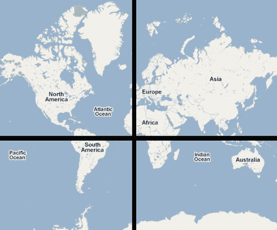
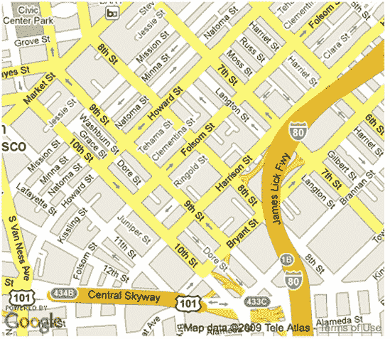
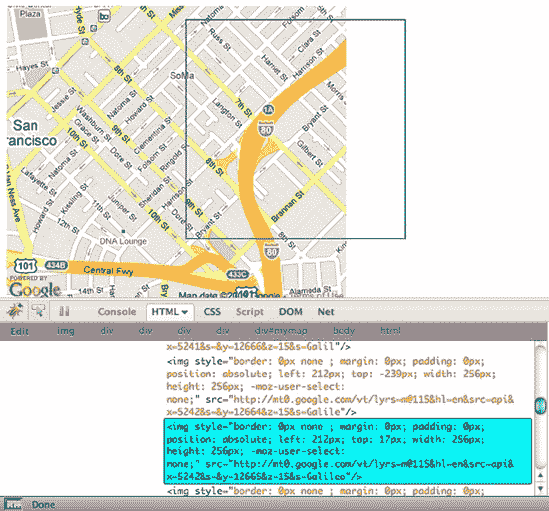

# 第一章. 地图基础


*X*标记了地点，对吧？这是老海盗的说法。你有没有想过是谁为海盗制作地图？海盗不得不自己来做。难怪他们那么烦躁！如果他们只有今天的技术，海盗就可以使用别人的地图，只需要自己标记*X*，把复杂的海岸线细节留给制图师。

幸运的是，你生活在现在，有各种各样的地图选项。你可以使用 Google Maps、Yahoo! Maps 以及许多其他地图。这些地图使地图制作变得简单；你只需要几行代码就可以在你的网页上包含地图。图 1-1 显示了来自 Yelp 的页面，这是一个餐厅评论网站，也是成千上万个使用地图标记位置的网站之一。


图 1-1. 本地搜索网站 Yelp 使用 Google Maps。

要嵌入地图，你需要使用一个 API。一个 API……什么？API 代表*应用程序编程接口*，它由一系列使创建地图更简单的函数组成。你仍然需要进行一些编程，但与如果你必须自己完成所有事情相比，编写代码将变得微不足道。这听起来熟悉吗，伙计？

# 地图 API：Google、Yahoo!和 Mapstraction

正如我提到的，你可以从许多地图 API 提供者中选择。地图的功能和风格各不相同，尽管 API 共享许多元素。这本书将涵盖 Google 和 Yahoo!的地图工具，但大多数代码示例将使用一个名为 Mapstraction 的 JavaScript 库，它也是一个 API，但与其他的不同。Mapstraction 本身不是一个地图服务；相反，它是其他 API 的包装器。你只需编写一次代码，它就可以在 Google Maps、Yahoo! Maps 和其他十个提供者上工作.^([1])

Mapstraction 并不总是支持每个提供者的所有功能，但它涵盖了这些服务共享的功能以及更多。对于大多数地图项目来说，使用 Mapstraction 是有意义的。偶尔，你会遇到只能与一个提供者一起工作的示例。在这些情况下，我会清楚地指出 Mapstraction 代码的结束和专有代码的开始。

使用 Mapstraction 是关于前瞻性的。例如，如果 Google 关闭其地图 API，你需要重写多少代码？如果这听起来不太可能，那么考虑一下，如果你的地图提供者开始显示令人讨厌的广告，或者另一个提供者出现了，其地图颜色更适合你的设计，会发生什么。Mapstraction 允许你在提供者之间无缝切换。所以你只需编写一次代码，它就可以在任何地方工作。

然而，在你开始在地图上标记位置之前，你需要了解地图的基础知识。最重要的概念之一是用来描述地球上某一点的坐标系。让我们看看这是如何完成的。

* * *

^([1]) CloudMade, FreeEarth, Map24, MapQuest, Microsoft, MultiMap, OpenLayers, OpenSpace, OpenStreetMap, and ViaMichelin

# 描述地球上的一个点

地理学家的工作很困难，他们需要将一个圆形的地球在平面上赋予意义。对于那些有技能的人来说，这项工作是一项接受不精确性的练习。因为，尽管哥伦布说过，地球不是圆的；它甚至不是一个球体。地球是一个椭球体，比它的高度略宽。我们非常感谢过去几百年来辛勤工作的天文学家和数学家，他们帮助我们尽可能精确地确定位置。

描述地球上某一点最常见的方式是使用纬度和经度坐标。这个系统被 GPS 设备、每个网络地图 API 提供商和这本书所使用。有了它，我们可以将复杂的椭球体转换成我们用于在代数课上创建图表的标准坐标系。一张带有网格覆盖的世界地图在图 1-2 中显示，轴被叠加。

我们所标记的点表示地球上的位置，误差仅为两厘米（0.8 英寸）。我们不像在学校里那样将轴称为*x*和*y*，而是称它们为纬度和经度。我们可以用几种方式表示坐标对：

| **45° 33′ 25″ N, 122° 31′ 55″ W** |
| --- |
| **45° 33.4′, −122° 31.9′ 或 45d33.4m, −122d31.9m** |
| **45.55713, −122.53194** |

如你所猜想的，这些坐标对都是大致相同地表达同一点的方法。单位是度（°）、分（′）和秒（″）。每个度被分成 60 分，每个分再进一步分成 60 秒。第三种示例中的十进制表示法被地图提供商使用，也是你在这本书中最常看到的形式。

就像我们所有人都熟悉的坐标系一样，每个轴都有一个零点，数值在一个方向上增加，在另一个方向上减少。因此，纬度和经度都可以有正负数。

*纬度*衡量垂直轴，它描述了一个位置距离北或南有多远。纬度的零点是赤道。向北，数值增加，直到在极点达到 90 度。赤道以南，纬度减少，−90 度是另一个极点。



图 1-2. 带有网格覆盖的世界地图

水平轴的测量称为**经度**。经度描述了一个位置在西方或东方有多远。地球没有自然的垂直赤道，所以科学家和政治家必须决定一个零点。他们选择了天文学家乔治·比德尔·艾里的望远镜在伦敦格林威治（皇家天文台）的位置作为**本初子午线**。在此点以东，经度增加到地球另一侧的 180 度。同样，经度减少到−180 度，在西方与正经度相对（称为**对跖子午线**）。

为什么纬度在 90 度停止，而经度继续到 180 度？水平轴没有任何极点，所以选择一个停止点将像子午线一样任意。此外，纬度度数彼此平行，而经度线在极点处彼此更近。特定纬度上的点是对称的。如果你追踪假设的 100 度纬度在地球半圈，你会到达 80 度纬度，所以你不妨就称它为那样。

现在你对坐标的使用有了感觉，让我们看看它们的不同表达方式以及如何在它们之间切换。

## 在十进制度和度数格式之间转换

当我第一次介绍纬度和经度点时，我展示了几个例子。如果你处理足够的地理数据，你可能会看到表达相同点的这些方式。在本节中，我将向你展示如何在两种最常见格式之间进行转换。

地图 API 接受纬度和经度值作为一对小数。例如，旧金山的 No Starch Press 办公室位于 37.7740486, −122.4101883。这意味着什么？首先，找到主要度数很容易——这些是在小数点之前的数字，所以在这个例子中是 37 和−122。

剩余的小数描述了这个值接近下一个度数有多近。纬度为 37.7740486 位于第 37 度和第 38 度之间的一半以上。一度的一部分表示为分钟和秒。

将坐标的小数部分乘以 60 以得到分钟数：

| **0.7740486 × 60 = 46.442916 分钟** |
| --- |
| **0.4101883 × 60 = 24.611298 分钟** |

现在我们有进展了。纬度是 37 度 46 分。经度是−122 度 24 分。然而，答案有小数部分。我们需要重复之前的步骤，将这些新的小数乘以 60，以确定秒数：

| **0.442916 × 60 = 26.57496 秒** |
| --- |
| **0.611298 × 60 = 36.67788 秒** |

再次，我们只剩下一个小数部分。除非我们想要极其精确，否则我们只需取整数部分即可。26.57496 秒与 26 秒之间的差异是 1/100 英里。有些人选择在小数点后保留一位数字。然后我们的测量精度大约在五英尺以内，这几乎肯定小于网络地图上的一个像素。

将点 37.7740486, −122.4101883 从度、分、秒格式转换为度、分、秒格式后的最终答案是 37° 46′ 26″ N，122° 24′ 36″ W。

注意方向，这表明该位置位于北半球和西半球。此外，经度不再表示为负数，因为该位置位于本初子午线以西。

从度、分、秒转换为小数格式甚至更容易。与之前一样，转换度数很容易，因为它成为小数点左边的整数部分。现在我们只需记住使用负数来表示南半球和西半球。

接下来，将分钟部分转换为秒（乘以 60）并将该结果加到现有的秒数上：

| **46 × 60 + 26 = 2,786 秒纬度** |
| --- |
| **24 × 60 + 36 = 1,476 秒经度** |

最后，将每个结果除以一度中的秒数，即 3,600（60 × 60）：

| **2,786 / 3600 = 0.77389** |
| --- |
| **1,476 / 3600 = 0.41000** |

将点 37° 46′ 26″ N，122° 24′ 36″ W 转换为小数格式后的答案是 37.77389，−122.41000。这个答案与该节开始时的小数版本大致相同。差异是舍入误差，对于这个目的来说并不非常显著。你将在下一个项目中发现更多关于精度的问题。

## 确定小数坐标的精度

最常用的经纬度格式将度数表示为小数。地图服务提供商以及大多数服务都将度数转换为小数以提供位置数据。

你可能还记得在数学课上学习实数时遇到的一个小难题：它们可以无限延伸。你必须决定使用多少位数字，就像计算器只能容纳一定数量的数字一样。在某个时候，小数需要被截断。

纬度和经度点的小数位数因服务而异。然而，大多数服务至少提供小数点后五位数字。正如你在表 1-1 中看到的那样，五位数字足以将位置精确到四英尺以内。换句话说，对于在网络上绘制点，五位数字已经足够了。

表 1-1. 小数位数纬度精度

| 小数点后位数 | 可能的误差 |
| --- | --- |
| 1 | 7 英里（11 公里） |
| 2 | 3/4 英里（1 公里） |
| 3 | 370 英尺（110 米） |
| 4 | 37 英尺（11 米） |
| 5 | 4 英尺（1 米） |

城市级别的坐标通常在小数点后只有一位数字。仅使用一位数字可能导致 7 英里的误差，但坐标仍然在大多数城市的范围内。例如，Yahoo!的天气 API（在第六十九部分：创建天气地图中使用，第六十九部分：创建天气地图）只提供两位精度的城市坐标，这使误差降低到不到一英里。

经度的精度不像纬度那样容易计算，因为经度线不是平行的。在赤道，纬度和经度图将是相同的。然而，当经度线接近两极时，它们会越来越靠近。好消息是纬度误差是经度可能存在的最大误差，因此，在大多数情况下，经度的误差更小。

### 注意

纬度误差在赤道和两极之间大约变化 1 公里，但这个误差与经度相比要小得多。

你将在第三十六部分：计算两点之间的距离中了解更多关于经度奇怪特性的内容，在那里我会展示如何根据纬度调整度之间的不同距离。

# 创建你的第一个地图

你即将开始学习新制图学，从普通的网络开发者转变为地理定位网络开发者。在本节中，我们将创建一个基本的地图，它将成为未来项目的基石。

首先，我们将使用 Google Maps API 创建一个以旧金山 No Starch Press 办公室为中心的地图。然后，我会向你展示如何使用 Yahoo!的服务创建相同的地图。最后，我会展示几乎相同的 Mapstraction 代码如何创建这两个地图。

## 创建一个 Google 地图

Google 在许多网络领域都是 500 磅的大猩猩，地图也不例外。大多数地图开发者选择 Google Maps API，仅因为其无处不在。除了无处不在，Google Maps 还快速稳定。

Google Maps 自 2005 年以来一直存在。这并不是说地图团队没有创新。相反，Google Maps 经常是第一个在其 API 中添加新功能的，例如驾驶方向和在美国许多城市以及全球选定地点的任何地址的 360 度视图。

让我们使用 Google 创建一个基本的地图。打开一个新的 HTML 文件，并输入以下内容：

```
<!DOCTYPE html PUBLIC "-//W3C//DTD XHTML 1.0 Strict//EN"
  "http://www.w3.org/TR/xhtml1/DTD/xhtml1-strict.dtd">
  <html >
    <head>
      <title>Basic Google Map</title>
      <script
          src="*`http://maps.google.com/maps/api/js?sensor=false`*"
          type="text/javascript"></script>
      <style type="text/css">
      div#mymap {
          width: 400px;
          height: 350px;
      }
      </style>
      <script type="text/javascript">
      function create_map() {
❶        var opt = {center: new google.maps.LatLng(37.7740486,-122.4101883),
                   zoom: 15, mapTypeId: google.maps.MapTypeId.ROADMAP};
❷        var map = new google.maps.Map(document.getElementById("mapdiv"), opt);
      }
      </script>
    </head>
    <body onload="create_map()">
❸    <div id="mymap"></div>
    </body>
  </html>
```

保存你的文件并在浏览器中打开它。结果应该看起来像图 1-3，你的 Google 地图将位于旧金山 No Starch Press 所在地区的中心。



图 1-3. 基本的 Google 地图

如你所见，HTML 钩子是最小的。只需要一个带有`id`属性的空`div`标签 ❸。JavaScript 函数`create_map()`接管并调用 API。这个函数可以取任何你想要的名称。在这本书的许多示例中，我会使用这个相同的名称。

在创建地图之前，我们需要设置一些选项 ❶。所需的最基本信息是一个中心点（使用经纬度对），缩放级别和地图类型。然后，我们传递这些选项并引用`div`标签的`id`来创建地图 ❷。

就这样，你已经创建了你的第一个 Google 地图。继续阅读，了解这个地图与 Yahoo!的不同之处以及如何使用 Mapstraction 编写一次即可与任何地图提供商一起工作的代码。

## 创建一个 Yahoo!地图

Yahoo!在 Google 发布其地图 API 的大约同一时间发布了它的地图 API。不幸的是，第一个版本是基于 Flash 的，使用起来很困难。Google 抢得了先机，而 Yahoo!一直处于追赶状态。现在 Yahoo!有一个具有与 Google 类似功能的 JavaScript API。

你需要从 Yahoo!获取一个 API 密钥和一个 Yahoo!账户才能使用其地图。要注册应用程序，以获取密钥，请访问此网页：[`developer.yahoo.com/wsregapp/`](https://developer.yahoo.com/wsregapp/)。

选择无认证的选项，因为你将不会访问 Yahoo!用户数据。填写表单的其余部分，包括有关你的应用程序的信息，点击按钮，设置完成。

一旦你获得了 API 密钥，你就可以创建一个 Yahoo!地图了。要做到这一点，从上一节中的 Google 示例开始。将调用 Google 的 JavaScript 替换为包含 Yahoo!的代码（确保使用你的 API 密钥）：

```
<script type="text/javascript"
 src="http://api.maps.yahoo.com/ajaxymap?v=3.8&appid=*`yourkeyhere`*"></script>
```

接下来，按照如下方式修改`create_map`函数的内容：

```
function create_map() {
❶    var map = new Ymap(document.getElementById('mymap'));
❷    map.drawZoomAndCenter(new YGeoPoint(37.7740486,-122.4101883), 3);
    }
```

保存你的文件，并在浏览器中加载它。结果应该类似于图 1-4，你的 Yahoo!地图将位于旧金山 No Starch Press 的社区中心。


图 1-4. 基本的 Yahoo!地图

代码与 Google 地图没有太大区别。你通过引用`div`标签的`id`来创建一个新的地图 ❶。然后，你使用经纬度对给地图设置一个中心点 ❷。最大的区别在于语法和顺序。在 Yahoo 中，你创建地图，然后添加选项，如缩放级别和中心点。

两个地图背后的概念非常相似。但是，这些细微的差异累积起来，如果你需要从其中一个切换到另一个，就会变得非常痛苦。这就是为什么 Mapstraction 如此强大的原因，你将在下一节中看到。

## 创建一个 Mapstraction 地图

Mapstraction 与 Google Maps 和 Yahoo! Maps 略有不同。Mapstraction 是一个开源的 JavaScript 库，它可以与其他地图 API 集成。如果你使用 Mapstraction，你可以通过非常少的努力在一种类型的地图和另一种类型之间切换，而不是完全重写你的代码。

使用 Mapstraction 可以降低 API 更改的风险。例如，如果你的网站流量超过了所选提供者的限制，或者提供者开始在地图上放置广告，Mapstraction 让你能够快速且低成本地切换提供者。

要使用 Mapstraction，你必须首先选择一个提供者。在这个例子中，我正在使用 Mapstraction 来创建一个 Google 地图。

打开一个新的 HTML 文件并输入以下内容：

```
<html>
    <head>
      <title>Basic Mapstraction Map</title>
      <script
❶   src="*`http://maps.google.com/maps/api/js?sensor=false`*"
       type="text/javascript"></script>
  <script type="text/javascript" src="mxn.js?(❷googlev3)"></script>
     <style type="text/css">
       div#mymap {
         width: 400px;
         height: 350px;
       }
      </style>
      <script type="text/javascript">
        function create_map() {
          var mapstraction = new mxn.Mapstraction('mymap', '❸googlev3');
          mapstraction.setCenterAndZoom(
            new mxn.LatLonPoint(37.7740486,-122.4101883), 15);
        }
      </script>
    </head>
    <body onload="create_map()">
      <div id="mymap"></div>
    </body>
  </html>
```

就像为正常的 Google 地图一样，我们包括 Google 的 JavaScript ❶。为了使这段代码正常工作，你还需要下载 Mapstraction 文件。访问[`mapstraction.com/`](http://mapstraction.com/)，并按照说明将文件保存在与你的 HTML 文件相同的目录下。最佳实践会建议你将 JavaScript 文件保存在它们自己的目录中，与 HTML 文件分开，但为了这个例子，我在简化事情。

你至少应该拥有的 Mapstraction 文件是*mxn.js*、*mxn.core.js*和*googlev3.core.js*。你可能还会有其他提供者的文件，例如*yahoo.core.js*。在我们 HTML 代码中需要引用的只有一个*mxn.js*，它会加载它需要的其他文件，包括我们通过文件名传递给它的那些文件 ❷。然后，在`create_map`函数中，我们让它知道我们正在创建哪种类型的地图 ❸。

一旦你有了你的 Mapstraction 地图，保存你的 HTML 文件并在浏览器中加载它。结果应该看起来与图 1-4 中的 Google 地图完全一样。这个通过 Mapstraction 创建的 Google 地图应该位于旧金山 No Starch Press 的社区中心。

## 使用 Mapstraction 和 Yahoo!地图

为了了解 Mapstraction 库有多强大，让我们尝试使用 Yahoo!地图而不是 Google 地图。你只需要在代码中更改几个部分。最好的部分是，即使你有大量的 Mapstraction 代码，你仍然只需要更改这一行。

就像从标准 Google 地图切换到 Yahoo!地图一样，你需要包括 Yahoo!'s JavaScript。在继续之前，确保以下行在你的文件中：

```
<script
     src="http://api.maps.yahoo.com/ajaxymap?v=3.8&appid=*`yourkeyhere`*"
     type="text/javascript"></script>
<script type="text/javascript" src="mxn.js?(❶yahoo)"></script>
```

注意，我们不是加载带有 Google 支持的 Mapstraction JavaScript，而是指定了 Yahoo!版本的 Mapstraction ❶。尽管 Mapstraction 的核心是提供者无关的，但你需要告诉它你想要使用哪个提供者。你还需要确保*yahoo.core.js*与*mxn.js*在同一个目录下。

现在让我们看看`create_map`函数内部的 Mapstraction 代码：

```
function create_map() {
     var mapstraction = new mxn.Mapstraction('mymap', ❷'yahoo');
     mapstraction.setCenterAndZoom(
          new mxn.LatLonPoint(37.7740486,-122.4101883), 15);
}
```

在这里，使用谷歌制作的 Mapstraction 地图和这个地图之间的唯一区别是我们已经注明我们正在制作一个雅虎地图❷。仅此而已。无需更改`setCenterAndZoom`或`LatLonPoint`函数。语法相同，因为 Mapstraction 是围绕提供者包装的。

保存并重新加载你的文件，原本的谷歌地图应该会被雅虎地图所替代，就像图 1-5 所示。这是同一张雅虎地图，只是这一张是通过 Mapstraction 创建的。

Mapstraction 就像魔法一样，但更好。实际上，你甚至不需要选择谷歌*或*雅虎！你可以在同一张地图中同时使用两者，或者在一页上使用每个中的一个。

# 查找底层地图瓦片

网络地图的可拖动性可能是其最好的属性。我经常发现自己只是因为可以而拖动地图。这个特性也证明是一个非常棒的错觉。

看起来像是一张无缝地图，实际上是由许多并排放置的小瓦片组成的。你可能曾在网络延迟的一瞬间注意到这一点，当时你的地图的一部分未能加载。网络延迟最可能发生在你更改缩放级别或快速将地图从原始位置拖远之后。

提供者通常会尝试通过预加载所有接触你当前区域瓦片的瓦片来避免打破无缝的错觉。

每个瓦片的标准尺寸为 256 像素平方。在基本地图示例中，有六个瓦片至少部分可见。如果谷歌是提供者，它还会加载额外的周围瓦片。图 1-5 显示了地图的可见部分如何对应其瓦片。在原始视图中，我们只能看到顶部两个瓦片的边缘。


图 1-5. 显示周围瓦片的基本地图

当我们更改缩放级别时会发生什么？我们需要下载一组全新的瓦片。每个缩放级别显示的细节都不同，每个瓦片现在代表地球的不同部分。

由于版权问题，提供者往往会使其瓦片难以直接访问。然而，当你访问提供者的地图时，你可以查看下载到浏览器中的瓦片。这样做将更好地了解瓦片系统是如何工作的。

虽然你可以通过多种方式获取文件，但我将向你展示一个使用 Firefox 浏览器和 Firebug 开发者插件非常简单的方法。你可以在[`www.getfirefox.com/`](http://www.getfirefox.com/)和[`www.getfirebug.com/`](http://www.getfirebug.com/)找到它们，分别。

在 Firefox 中，加载一个嵌入的地图，例如基本地图示例中的地图。点击右下角的 Firebug 图标，或从工具菜单中选择**Firebug ▸ 打开 Firebug**。在 Firebug 面板中，点击**检查**按钮，这允许你看到高亮的页面元素。将鼠标悬停在地图中心，应该会在地图的一部分周围出现一个蓝色边框。你找到了一个瓦片！

当一个瓦片被高亮时，点击鼠标，你将被带到包含图像标签的 HTML 代码中，如图图 1-6 所示。一开始，这个标签可能看起来很令人困惑，因为你没有将此图像添加到你的代码中。与在浏览器中简单地查看源代码不同，Firebug 显示了添加了 JavaScript 元素的页面。为了创建地图，你的提供商必须将图像注入到地图`div`标签的子元素中。

在图片的`src`属性中，你会看到使用 Firebug 高亮的单个瓦片的 URL。你可以将这个 URL 复制到一个新的窗口或标签页中，只查看那个瓦片，而不包括其周围兄弟的上下文。此外，你还可以修改 URL 中的参数来查看其他瓦片。

地球由数千或数百万个瓦片组成，具体取决于缩放级别。地图提供商根据简单的网格系统来引用瓦片。你可以将其想象成类似于纸地图，它通过字母-数字组合来帮助你识别区域。例如，你可能查看(K, 18)以找到 Maple Street。

瓦片也通过其网格参考来命名；只是这些通常以千为单位编号。例如，我的旧金山示例可能包含一个位于(5241, 3718)的瓦片。每个缩放级别都有不同的网格，因此这个参考是调用特定瓦片所需的重要第三条信息。要调用示例瓦片右侧的瓦片，我会在同一缩放级别查找(5242, 3718)。只有第一个数字会改变，因为它代表网格的水平部分。垂直方向上，两个瓦片都在第 3718 行。

总结一下，你通常会在瓦片 URL 中找到三个数字：水平网格参考（通常称为*X*），垂直网格参考(*Y*)和缩放级别。

Mapstraction 提供了一种使用你想要的任何瓦片的方法，无论提供商如何。再次强调，大多数提供商不支持直接访问瓦片。很多时候，你可能发现他们使用方法来阻止你调用它们。你始终可以创建自己的瓦片。我在第二十六部分：使用自定义瓦片中向你展示了如何做到这一点以及如何将它们连接到 Mapstraction。第二十六部分：使用自定义瓦片。



图 1-6. 使用 Firebug 查找瓦片。

# 更改地图大小

初始地图大小由`div`标签的 CSS 样式确定。然而，你可以使用 Mapstraction 以编程方式更改地图的大小。

将以下行添加到`create_map`函数中，或者将其作为链接的点击事件包含（参见附录 A)：

```
mapstraction.resizeTo(200, 300);
```

当调用`resizeTo`函数时，你需要传递宽度和高度。Mapstraction 随后立即将地图的大小设置为所需的像素。请注意，地图的中心不会被重置。如果你缩小地图，你可能需要重新定位地图以保持相同的中心点在视图中。

此外，关于缩小地图的一些建议：根据你使用的提供商，界面元素可能会开始碰撞。务必测试以查看你可以缩小到多小。

# 添加缩放和其他控件

在你的网站上使用地图的最好之处之一是用户可以使用它们进行探索。他们想看看附近有什么，更仔细地查看特定位置，或者弄清楚某个地点在城市或国家中的位置。我迄今为止展示的基本地图并没有给用户太多的控制权。

让我们给用户提供一个可以点击的界面，这样他们就可以在地图上缩放和平移。Mapstraction 提供了几种实现此功能的方法。

## 小控件

当你的地图不是很大时，小控件很有用，例如当你将其嵌入侧边栏时。此外，如果你不期望用户进行很多缩放操作，你可能更喜欢保持界面简洁。

要在你的地图中添加小控件，请在设置`mapstraction`变量后在`create_map`函数中添加此行：

```
mapstraction.addSmallControls();
```

保存并重新加载你的文件，你应该会在地图的左上角看到一组小按钮。控件的具体外观将取决于你指示 Mapstraction 使用的地图服务提供商。地图可能包含用于缩放的加号和减号按钮，以及一组箭头按钮用于平移。

## 大控件

如果你的地图是网站或页面的焦点，你可能想要大控件。虽然小控件只能让用户逐级缩放，但大控件可以跳到任何缩放级别。

将此行添加到你的`create_map`函数中：

```
mapstraction.addLargeControls();
```

保存并重新加载你的文件。当使用 Google Maps 时，Mapstraction 除了较大的缩放/平移工具外，还会添加几个其他控件。要查看小和大缩放/平移工具的外观，请参阅图 1-7。

要仅添加缩放/平移的大版本，尝试此函数：

```
mapstraction.addControls({zoom:'large'});
```

在这里，你需要传递一个对象（用花括号声明），并为其提供一个用于大缩放控制的选项。


图 1-7. Google 地图（顶部）和 Yahoo!地图（底部）中的小和大缩放控件

## 地图类型控件

地图服务提供商通常允许用户选择查看哪种类型的地图。除了普通地图外，卫星视图和普通与卫星视图的混合视图也很常见。并非每个地图服务提供商都提供所有这些视图。例如，一些使用航空摄影而不是卫星图像，或者根本不提供摄影图像。

使用此命令将地图类型控件添加到您的地图中，就像图 1-8 中所示，以便用户可以选择他们想要查看的地图：

```
mapstraction.addMapTypeControls();
```

保存并重新加载您的文件，以查看地图右上角（在大多数服务提供商中）的按钮。


图 1-8. Google 地图中的地图类型控件

# 设置缩放级别

现在您已经为地图添加了一些控件，用户可以更改缩放级别。在大多数项目中，您会希望赋予用户这种权力。无论如何，您需要设置一个初始缩放级别，这样地图服务提供商就知道要显示什么。

缩放级别决定了显示多少细节。整个世界的地图无法包含街道或公园。显示国界线与该地图的复杂程度相当——甚至大多数城市都比一个像素小。当缩放到城市级别的地图时，您将看到主要街道，但可能看不到街区特征。

在基本地图中，您同时设置中心和缩放级别。Mapstraction 还有一个仅设置缩放级别而保持中心不变的功能：

```
mapstraction.setZoom(10);
```

与`setCenterAndZoom`函数一样，缩放级别以整数形式传达。在这个例子中，我设置了 10 的缩放级别，而在基本地图中我使用了 15。这些数字代表什么？哪一个更接近缩放？

Mapstraction 使用缩放级别 0-16，较大的数字对应于更详细的缩放级别。使用卫星视图，您甚至可以进一步缩放。表 1-2 显示了缩放级别与通常显示的区域之间的近似对应关系。当然，确切级别取决于国家、州或城市的大小。

表 1-2. Mapstraction 缩放级别

| 地理描述 | 缩放级别 |
| --- | --- |
| 世界 | 0 |
| 国家 | 4 |
| 州 | 7 |
| 城市 | 13 |
| 街道 | 16 |

欣赏 Mapstraction 的另一个原因是它适应了地图服务提供商处理缩放级别的不同方式。例如，Yahoo!使用反向编号系统，其中较大的数字意味着地图缩放程度更大。另一方面，MapQuest 的计数方式与 Mapstraction 相同，但具有更少的级别和最少的细节。通过其单一接口，Mapstraction 处理这些差异。

就像您可以设置缩放级别一样，Mapstraction 有一个非常相似的命令来检索当前缩放级别：

```
var currentzoom = mapstraction.getZoom();
```

返回的整数位于 0-16 的 Mapstraction 范围内，如果需要，则从提供者的缩放系统中转换。你可以使用 `setZoom` 和 `getZoom` 的组合来创建自己的控件，而不是坚持使用地图提供者的默认设置。创建自己的缩放界面 在 创建自己的缩放界面 中展示了如何通过逐步说明来完成此操作。

# 设置地图类型

大多数地图提供者提供了三种确定地图外观的选项。你可以选择一个简单的地图，这是默认设置，卫星视图，或者两者的组合。正如我之前所展示的，你可以通过添加控件（通常位于地图的右上角）让用户决定要查看哪种地图类型。地图类型也可以通过编程方式设置，这就是本节我们将要做的。

你可以在任何时候设置地图类型，尽管最常见的情况是在地图加载时声明除默认类型之外的内容。例如，将此行添加到基本地图的 `create_map` 函数中，以显示带有街道信息的卫星视图：

```
mapstraction.setMapType(Mapstraction.HYBRID);
```

`setMapType` 函数接受的参数只是一个简单的整数，但正如你所看到的，我们传递了其他类型的变量。Mapstraction 有 *常量*——这些特殊变量是为了赋予比简单数字更多的意义而创建的，这使得选择地图类型变得容易。将地图类型设置为 `HYBRID` 比记住在需要同时显示街道和卫星视图时需要传递数字 3 要有意义得多。表 1-3 展示了所有地图类型选项及其对应的数值。

表 1-3. Mapstraction 地图类型

| 名称 | 值 |
| --- | --- |
| `Mapstraction.ROAD` | 1 |
| `Mapstraction.SATELLITE` | 2 |
| `Mapstraction.HYBRID` | 3 |

当从 Mapstraction 获取当前地图类型时，地图类型常量也非常有用。正如你可以设置和获取缩放级别一样，你也可以访问地图类型。在你创建地图之后，添加此行：

```
var maptype = mapstraction.getMapType();
```

记住，`setMapType` 函数接受一个整数作为参数。`getMapType` 返回的值是 1、2 或 3。再次强调，通过 Mapstraction 常量来引用地图类型要容易得多。例如，你可以使用 `switch...case` 语句根据地图类型执行不同的操作：

```
switch (maptype) {
  case Mapstraction.ROAD:
    // Run this code only when it is a road map type
  break;
  case Mapstraction.SATELLITE:
    // Run this code only when it is a satellite map type
  break;
  case Mapstraction.HYBRID:
    // Run this code only when it is a hybrid map type
  break;
}
```

将注释（以两个斜杠开始的行）替换为你想要在描述的情境中使用的代码。例如，你可能想要在只显示卫星地图的情况下从地图中删除路线，因为当没有街道可见时显示路线没有意义。

# 重新定位地图

如果您已经显示了一个地图，那么您已经使用`setCenterAndZoom`函数给它设置了一个中心点。您永远不知道用户何时会将地图拖离您的中心点。知道如何重置中心点——仅重置中心点——可能很有用。

将以下行添加到`create_map`函数中，或者将其作为链接中的点击事件包含在内：

```
mapstraction.setCenter(new mxn.LatLonPoint(37.7740486,-122.4101883));
```

当然，直接将地图移动到某个点可能会让人感到突然。幸运的是，用户可以拖动到新的中心点，就像他们拖动地图到那里一样：

```
mapstraction.setCenter(new mxn.LatLonPoint(37.7740486,-122.4101883), {pan:true});
```

在这里，我们向`setCenter`函数传递了一个选项对象。大括号在 JavaScript 中声明了一个对象，其值由`key:value`对设置。Mapstraction 会检查是否存在`pan`。如果`pan`设置为`true`，则地图将平滑地移动到新点。

# 检索地图中心

当您加载一个新的地图时，需要给它一个中心点。然后您放弃控制权，因为您的用户会根据他们的意愿拖动和缩放地图。这是好事，因为地图是交互式的。另一方面，您可能想知道地图的当前中心点。

Mapstraction 有一个简单的命令来检索地图的中心：

```
var centerpoint = mapstraction.getCenter();
```

创建的变量`centerpoint`保存了`getCenter()`调用返回的结果，作为一个`LatLonPoint`，这是 Mapstraction 存储坐标的方式。将坐标保存在变量中很方便，因为您可以转身将其传递给其他函数。或者您可以直接访问纬度和经度：

```
centerpoint.lat
centerpoint.lon
```

现在，您可以使用这些值在地图上添加标记，在地图上绘制本地结果，或用于其他目的。

# 查找用户点击的点

开箱即用的交互性使得地图 API 非常特别。使用内置控件，用户可以拖动和缩放地图，放大，并更改地图类型。用户也可以点击，但除非您帮助他们，否则不会发生任何事情。

要找到用户点击的点，您需要“监听”点击事件：

```
mapstraction.addEventListener('click', function(clickpoint) {
    alert('latitude: ' + clickpoint.lat + '\nlongitude: ' + clickpoint.lon);
});
```

当用户点击地图上的任何位置时，会以`clickpoint`作为参数调用一个匿名函数。这与您检索地图中心时类似，变量是一个`LatLonPoint`。本例使用 JavaScript 弹窗来显示用户点击点的纬度和经度，如图图 1-9 所示。


图 1-9. JavaScript 弹窗显示点击点的纬度和经度

当然，您可能想要做一些比 JavaScript 弹窗更有用的事情。例如，您可以在该点在地图上添加标记。碰巧的是，下一章将向您展示如何做到这一点以及更多。
