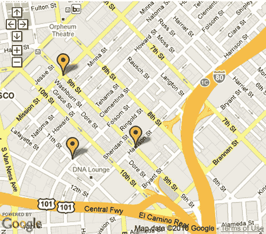
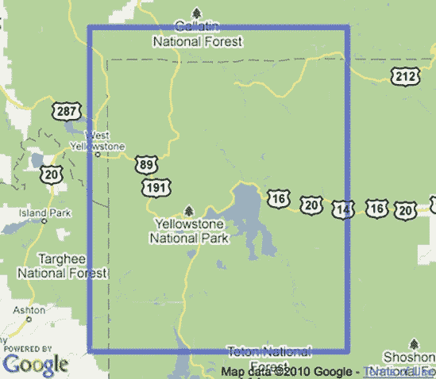

# 第五章：处理地图事件


基于网络的地图高度交互。它们使用户想要拖动、点击和缩放地图。这些都是乐趣的一部分，但这种交互性也使它们更有用。通过利用这种交互性，你可以设计那些小小的用户动作，以提供更好的界面；例如，当用户拖动地图时更改可见标记，或者随着缩放级别改变搜索半径。

事件控制了用户与您的地图交互的所有潜在方式。用户拖动地图、放大或点击时，您都可以运行特殊代码。事件也针对标记、消息框和多段线。继续阅读，了解 Mapstraction 组织事件的方式以及每个事件的示例。

# Mapstraction 的事件模型

事件发生，无论我们是否关注。为了能够对事件做出反应，我们需要告诉 Mapstraction 我们关心那个特定的事件。我们通过为 Mapstraction 在事件发生时调用的函数设置一个函数来实现这一点。这个函数被称为 *handler*。

要创建事件处理器，我们需要知道我们正在寻找的事件类型以及事件将从中起源的对象。我们使用以下形式注册我们对事件的兴趣：

```
*`object.event`*.addHandler(function (event_name, event_source, event_args) {
  // Code to perform after the event
});
```

每个对象可能发生的事件潜力在 表 5-1 中显示。`addHandler` 函数接受一个参数——一个引用到将处理事件的函数。在前面示例以及本章中的大多数示例中，我使用的是匿名内联函数。您也可以使用命名函数，就像我在涉及标记的大多数示例中所做的那样。如果您要在许多对象上调用相同的函数，使用命名函数将发现更节省内存。

无论您使用匿名函数还是命名函数来处理事件，该函数都接受三个参数：事件名称、事件源和额外的事件参数。这些值由 Mapstraction 自动传递。名称将始终与 *event* 相同，而源将始终是 *object*。如果存在，附加数据将包含在参数对象中。

表 5-1. 对象及其事件

| 对象 | 事件 |
| --- | --- |
| `Mapstraction` | `click` |
| `Mapstraction` | `endPan` |
| `Mapstraction` | `changeZoom` |
| `Mapstraction` | `markerAdded` |
| `Mapstraction` | `markerRemoved` |
| `Mapstraction` | `polylineAdded` |
| `Mapstraction` | `polylineRemoved` |
| `Marker` | `click` |
| `Marker` | `openInfoBubble` |

本章的各个部分都深入探讨了每个事件。

# #27：用户点击地图

开箱即用的交互性使地图 API 非常特别。使用内置控件，用户可以拖动和移动地图、放大并更改地图类型。用户也可以点击，但除非您帮助他们，否则不会发生任何事情。

Mapstraction 的点击事件是响应用户点击的。与本章中展示的其他一些事件不同，仅仅知道用户点击了是不够的。你需要知道他们点击了*哪里*。

要找出用户何时何地点击，请将以下代码添加到你的 `create_map` 函数中：

```
mapstraction.click.addHandler(function(event_name, event_source, event_args) {
  var clickpoint = event_args.location;
  var mk = new mxn.Marker(clickpoint);
  mapstraction.addMarker(mk);
});
```

在这里，我们为 Mapstraction 的 `click` 事件添加了一个处理程序。为了响应这个事件，我使用了一个匿名内联函数。如果你有超过几行代码要运行，你将想要使用一个标准的命名函数，因为长的匿名函数很难阅读。我在这里正在挑战极限。

当用户在地图的任何地方点击时，Mapstraction 会调用我们的函数，并传递三份数据，其中最后一份数据包含事件参数。我们想要的关键信息就在这些参数中：点击位置，它被存储为 `LatLonPoint`。上一个例子就是使用这个点来创建一个新的标记。

每次点击都会在地图上添加另一个标记。这样做几次，你的地图看起来就会像图 5-1 那样。

# #28: 用户拖动地图

如果你是一个喜欢控制的开发者，你可能不会立即欣赏地图的交互性。用户可以将地图的可视部分移动到他们想要的位置，从而放弃你精心设计的体验。多么令人沮丧啊！实际上，字面上来说就是令人沮丧，因为用户会这样拖动地图。然而，你可以使用一个事件来帮助你恢复一点控制。

你可以编写代码来响应地图的最小移动。你可以使用这个来强制地图回到你放置的位置，如果你喜欢这样做的话。一个更友好的反应是找到一种方法来识别用户移动的地图区域。例如，如果你正在显示搜索结果，尝试用新的中心重新加载它们。



图 5-1. 每次点击都会添加一个新的标记。

在这个例子中，我们将简单地创建一个 JavaScript 警告，每当我们发现地图已经移动时。那么我们如何知道地图已经移动了呢？请将这些行添加到你的基本地图中：

```
mapstraction.`endPan`.addHandler(function(event_name, event_source, event_args) {
  alert('The map just moved!');
});
```

在这里，我们为 Mapstraction 的 `endPan` 事件添加了一个处理程序。为了响应这个事件，我使用了一个匿名内联函数。如果你有超过几行代码要运行，你将想要使用一个标准的命名函数。

实现了这段代码后，每次用户移动地图时，这个事件都会触发，并且会弹出警告框。程序性地设置中心也会触发事件，因为地图已经被平移（尽管不是直接由用户操作）。然而，当你最初设置地图中心时，事件不会触发，这仅仅是因为那段代码在 Mapstraction 知道要关注地图移动之前就已经执行了。

### 注意

对于一些提供者，例如 Google，当缩放级别改变时，也会触发 `endPan` 事件。

一旦`endPan`事件触发，你将可以通过 Mapstraction 对象访问当前地图数据，例如中心点。以下是一个示例，每当用户拖动地图时，都会在新的中心创建一个新的标记：

```
mapstraction.endPan.addHandler(function(event_name, event_source, event_args) {
  var mk = new mxn.Marker(mapstraction.getCenter());
  mapstraction.addMarker(mk);
});
```

将此代码输入到你的基本地图的`create_map`函数中，并在浏览器中加载它。尝试移动地图，每次你都会在中心找到一个全新的标记。

# #29：缩放级别变化

"让我们仔细看看吧,"她心想，点击加号按钮将地图放大。假设你提供了这样的界面，你的用户将会进行大量的放大和缩小操作。在一些地图中，对地图边界有时剧烈变化做出反应是很重要的，这就是 Mapstraction 的缩放事件能成为你最好朋友的地方。

你可以让你的地图处理缩放事件并执行一些有用的操作，比如重置你的搜索半径。或者，如本章后面所示，确定用户是否将地图移动到预设边界之外。

对于这个例子，我们将在地图缩放时创建一个 JavaScript 弹窗，这样你可以感受到这个事件何时被触发。将以下代码添加到你的基本地图的`create_map`函数中：

```
mapstraction.`changeZoom`.addHandler(function(event_name, event_source, event_args) {
  alert('Zoom level changed!');
});
```

在这里，我们为 Mapstraction 的`changeZoom`事件添加了一个处理程序。为了响应此事件，我使用了一个匿名内联函数。如果你有超过几行代码要运行，你将想要使用一个标准的命名函数。

尝试加载包含此代码的地图。在地图上改变缩放几次，并观察其响应。如果你的提供商将双击解释为放大（大多数都是这样），也试试这个。你的用户在没有你了解的情况下无法放大或缩小！

你想用更有用的事情来响应吗？比如显示新的缩放级别？尝试以下代码：

```
mapstraction.`changeZoom`.addHandler(function(event_name, event_source, event_args) {
  alert('Changed zoom to level ' + mapstraction.getZoom());
});
```

现在，每次你的用户放大或缩小，消息不仅会说缩放级别已更改；还会显示新的缩放级别。如果你的地图有大的缩放控件，尝试从当前级别快速放大到一个非常接近的级别，或者尝试极度缩小。一个带有新缩放级别数字的弹窗将会弹出。如果你想更好地理解缩放级别，请参阅设置缩放级别。

# #30：标记被添加到或从地图中移除

标记无处不在。一旦你的映射应用程序变得庞大，你可能需要从代码的许多不同区域添加标记。移除标记也可能如此。你可以利用两个事件，当标记被添加或移除时，将调用你指定的函数。

将以下代码添加到你的基本地图的`create_map`函数中：

```
mapstraction.markerAdded.addHandler(function(event_name, event_source, event_args) {
  alert('Added marker at ' + event_args.marker.location);
});
mapstraction.markerRemoved.addHandler(function(event_name, event_source, event_args) {
  alert('Removed marker at ' + event_args.marker.location);
});
```

当然，使用 JavaScript 弹窗来通知用户标记已被添加或移除可能并不那么有帮助。相反，你可能更新自己的标记元数据或根据新的或剩余的标记自动居中地图。

你可以通过`event_args`对象访问受影响的标记，该对象包含一个名为`marker`的属性。你可能觉得从`event_source`对象访问标记更直观。尽管这些事件与标记相关，但它们是由 Mapstraction 对象发起的，该对象作为源传递。

因为添加或删除标记的唯一方式是通过你的代码，所以有大量其他非事件驱动的方法可以在添加或删除标记时执行操作。正如提到的，你可能只有在大型应用程序中才会觉得这很有用。

# #31：向地图添加或从地图移除折线

你在地图上使用了很多折线吗？你可以在每次添加或删除折线时运行一个特殊函数。这个特性对于大型地图应用程序特别有用，在这些应用程序中，许多不同的地方创建新的线条，或者当你需要删除不必要的线条时。

要为两个折线事件创建函数，请将以下代码添加到你的`create_map`函数中：

```
mapstraction.polylineAdded.addHandler(function(event_name, event_source, event_args) {
  alert('Added polyline starting at ' + event_args.polyline.points[0]);
});
mapstraction.polylineRemoved.addHandler(function(event_name,
 event_source, event_args) {
  alert('Removed polyline starting at ' + event_args.polyline.points[0]);
});
```

我已经创建了一个 JavaScript 警告框来显示已添加或删除的折线的第一个点。你可能会想要包含比 JavaScript 警告框更有用的内容，在大多数情况下，用户可能会认为这是过度杀鸡用牛刀。例如，你可以选择根据新添加或删除的折线自动居中地图。

你可以通过`event_args`对象访问受影响的折线，该对象包含一个名为`polyline`的属性。你可能觉得从`event_source`对象访问折线更直观。尽管这些事件与折线相关，但它们是由 Mapstraction 对象发起的，该对象作为源传递。

与添加和删除标记一样，你的代码是向地图添加新折线（或从地图中删除不需要的折线）的唯一方式。由于这个原因，有其他方法可以在这些事件中运行代码。然而，对于大型应用程序，你可能更喜欢这种基于事件的方法。

# #32：用户打开或关闭消息框

你的地图标记只能做到如此来传达地点的意义。其余的事情发生在消息框中，用户可以通过点击标记来打开它。如果你想对消息框的打开或关闭做出反应，你需要为每个标记编写事件处理器。

一个常见的用例是在消息框打开时更新地图外的网站部分。例如，你可能想在搜索结果中突出显示与该标记相关的结果。或者你可能想在查看过每个标记的消息框后隐藏每个标记。在这里，我们将坚持使用我们的方法来显示 JavaScript 警告框。

将以下代码添加到你的基本地图的`create_map`函数中：

```
var mk = new mxn.Marker(mapstraction.getCenter());
mk.setInfoBubble('Look ma, No Starch!');
mk.`openInfoBubble`.addHandler(myboxopened);
mk.`closeInfoBubble`.addHandler(myboxclosed);
mapstraction.addMarker(mk);
```

并且将此函数包含在 JavaScript 部分中，但不在其他函数之外：

```
function myboxopened(event_name, ❶event_source, event_args) {
  alert('Opened bubble attached to marker at ' + ❷event_source.location);
}
function myboxclosed(event_name, event_source, event_args) {
  alert('Closed bubble attached to marker at ' + event_source.location);
}
```

在这里，我在地图中心创建了一个简单的标记，并附带了一个信息框，类似于我们在第三部分：当您的标记被点击时显示信息框中创建的。打开和关闭信息框的事件以粗体显示。对于这个特定的标记，我们正在等待对这两个事件之一做出反应。

当事件触发时，我们调用命名函数，无论是`myboxopened`还是`myboxclosed`。您可以命名这些函数为任何您想要的名称。当适当的函数被调用时，标记会被传递到`event_source`变量❶。在这个时候，我们可以访问这个标记的任何属性，包括位置❷。我们可以用这个标记做任何我们可以对其他标记做的事情，包括隐藏它、移除它或设置新的属性（也许跟踪哪些信息框已被打开？）。

### 注意

与之前的一些示例不同，我们为这些事件添加了处理程序到标记对象，而不是 Mapstraction 对象。如果你想要为每个标记运行类似的代码，你需要为每个标记添加一个事件。

如您从比较两个事件的代码中看到的，对关闭信息框的反应使用了几乎相同的代码。您可以在本章后面的部分看到一个更高级的`closeInfoBubble`事件的示例。

# #33: 用户点击标记

您的用户会看到地图上的所有标记，许多人会想要点击它们来了解更多关于特定位置的信息。这就是信息框的作用，对吧？嗯，你可能还想做更多。在这种情况下，你需要一种方法来告诉何时一个标记被点击。正如你可能猜到的，Mapstraction 有一个专门为此场合的事件。

标记点击事件，就像其他标记事件一样，是附加到标记本身的。所以，如果您想要为每个标记执行相同的操作，您需要单独添加处理程序。

对于这个示例，我们将简单地使用一个标记并创建一个 JavaScript 警告框来共享其位置。将以下代码添加到您的`create_map`函数的基本地图中：

```
var mk = new mxn.Marker(mapstraction.getCenter());
mk.`click`.addHandler(mymarkerclicked);
```

并且在 JavaScript 部分之外的其他函数之外包含此函数：

```
function mymarkerclicked(event_name, ❶event_source, event_args) {
  alert('Clicked the marker at ' + ❷event_source.location);
}
```

当事件触发时，`mymarkerclicked`函数会带有三个参数被调用。然后标记会被传递到`event_source`变量❶。在这个时候，我们可以访问这个标记的任何属性，包括位置❷。我们可以用这个标记做任何我们可以对其他标记做的事情，但在这里我们只是创建了一个 JavaScript 警告框。

### 注意

这个事件与 Mapstraction 的主要点击事件不同，后者在地图被点击时随时触发。在这种情况下，事件是附加到一个特定的标记上的，并且只有当那个标记被点击时，您的代码才会运行。

事实是：你不会经常使用此事件，因为消息框是显示标记信息的最佳方式。然而，标记点击事件是一个有用的工具，尤其是在你想做一些不同的事情时。

# #34：当消息框关闭时返回中心

我是否已经充分赞扬了消息框？它们有助于解释你的标记代表什么。它们提供了有关位置的额外信息，但仅在用户需要时提供。它们使你的地图更具信息性和交互性。但它们也可能妨碍，如图 图 5-2 所示。

根据你的提供商，打开消息框可能会导致你的地图不优雅地平移，当用户关闭消息框时留下一个混乱的地图。一点代码和本章中已经覆盖的事件的帮助可以改善用户体验。重新进入 `closeInfoBubble` 事件。

假设你已经布置了标记，使它们完美地位于地图内，如 #8：根据标记确定正确的缩放级别 所示，在 #7：遍历所有标记 中。如果你在用户关闭消息框和添加每个新标记后再次运行此代码，你的地图将始终保持有序。

在创建标记后添加此代码：

```
mk.closeInfoBubble.addHandler(myboxclosed);
```

添加处理事件的函数：

```
function myboxclosed(event_name, event_source, event_args) {
  mapstraction.autoCenterAndZoom();
}
```

此代码假设有一个名为 `mk` 的标记，但你需要将其更改为与你的标记所选择的任何变量名匹配。还要记住，`closeInfoBubble` 事件是为单个标记设置的。为了使事件对每个标记都触发，你需要为每个标记设置它。

## 保留先前的中心

重新自动居中代码在大多数情况下可能非常有用，因为用户仍然可以看到每个标记。然而，在某些情况下，你可能希望给用户更多的控制权，同时仍然保持当消息框关闭时重新组织地图的好处。在这里，你想要记住用户打开消息框之前地图的位置。

要实现此结果，你需要同时使用两个消息框事件。这种方法是保留地图中心的一个简单而有效的方法。在创建每个标记后添加以下代码：

```
mk.openInfoBubble.addHandler(myboxopened);
mk.closeInfoBubble.addHandler(myboxclosed);
```

然后包括以下处理函数：

```
function myboxopened(event_name, event_source, event_args) {
❶   mapcenter = mapstraction.getCenter();
  }
  function myboxclosed(event_name, event_source, event_args) {
    mapstraction.setCenter(mapcenter, ❷{pan: true});
  }
```

与前面的示例一样，我假设有一个名为 `mk` 的标记。此外，我添加了一个名为 `mapcenter` 的全局变量来保存地图中心的 `LatLonPoint`。

每当打开消息框时，`openInfoBubble` 事件会在提供商移动地图以腾出消息框的空间之前触发。这很重要：现在我们有记录地图中心 ❶ 的机会，这将允许我们稍后重置它。

当消息框关闭时，会触发`closeInfoBubble`事件。而不是自动居中，我们将中心设置为打开消息框时存储的那个位置，如图 5-3 所示。为了更加体贴用户的眼睛，我们平移地图❷而不是直接设置中心。

现在你已经使用事件微妙地改善了用户与你的地图的交互。


图 5-2. 打开消息框可以移动你的地图。


图 5-3. 当消息框关闭时返回到上一个中心位置。

# #35: 用户将地图移动到预设边界之外

用户可以随意拖动地图，但不要拖动得太远，否则我们就没有其他东西可以展示了。提供商已经绘制了整个地球的地图，但你的地图可能只包含特定街区或城市的资料。你可以使用事件来通知用户他们是否已经移动到了预设区域之外。

假设你正在创建黄石国家公园的观光地图。你会包括老忠实喷泉和大角温泉，因为它们都在黄石公园内。你不会包括自由女神像，因为它在数千英里之外。我们想提醒用户，如果他们把地图从黄石公园拖开，他们将不会在那里找到任何东西。

首先，让我们获取一个以黄石公园为中心的基本地图。将以下代码添加到您的 JavaScript 中，替换掉任何其他地图代码：

```
var mapstraction;
❶ var yellowstone = new mxn.BoundingBox(43.7, −111.8, 45.5, −109.3);
  function create_map() {
    mapstraction = new mxn.Mapstraction('mymap', 'google');
    mapstraction.addLargeControls();
    // Add Old Faithful marker
    var ofmk = new mxn.Marker(new mxn.LatLonPoint(44.46270, −110.81153));
    ofmk.setInfoBubble('Old Faithful');
    mapstraction.addMarker(ofmk);
    // Add Mammoth Hot Springs marker
    var mammk = new mxn.Marker(new mxn.LatLonPoint(44.97682, −110.70425));
    mk.setInfoBubble('Mammoth Hot Springs');
    mapstraction.addMarker(mk);
    mapstraction.autoCenterAndZoom();
    // Event code below here
❷
  }
  // Additional functions below here
❸
```

首先，我们创建一个全局变量来保存描述黄石的`BoundingBox`。我们将在下一步中使用这些边界。在`create_map`函数中，你会看到我提到的两个景点的标记。之后，地图会自动居中，仅显示这些位置。我留下了两行代码，以指示我们很快将添加的额外代码。一个位置❷是用于事件代码，另一个位置❸是我们将用来确定地图是否在黄石之外的函数。

保存代码并将其加载到浏览器中。你的地图应该看起来像图 5-4。尝试拖动地图以显示更多北部的区域。拖动足够远，地图就会进入加拿大，远离黄石公园。让我们看看我们能做些什么来为用户提供警告。

拖动地图的行为是将用户从黄石公园带远，因此我们需要处理前面章节中提到的`endPan`事件。在为事件代码预留的部分中，在`create_map`函数内添加以下代码：

```
mapstraction.endPan.addHandler(function(event_name, event_source, event_args) {
  if (❹!boundsInBounds(mapstraction.getBounds(), yellowstone)) {
    alert('Watch out! You might be leaving Yellowstone...');
  }
});
```


图 5-4. 黄石国家公园带有两个景点标记的地图

在这里，我们创建了一段代码，每次用户完成地图拖动时都会运行。它使用全局变量 `yellowstone`，这是描述黄石的 `BoundingBox`。边界仅是数据，在地图上不可见。图 5-5 显示了我们的边界覆盖的区域。你可以看到，我已经将边界做得足够大，以便在黄石周围包含一个合理的缓冲区。我们希望用户能够看到附近的东西。我们只想在他们显然偏离路线时警告他们。

要检查我们的地图是否仍然在黄石边界内，我们需要将新变量与地图的边界进行比较。为此，我们将这些传递给一个名为 `boundsInBounds` 的函数，我们还需要编写这个函数。如果该函数返回 false ❹（代码中的感叹号读作“不”），则我们创建一个 JavaScript 提示框来警告用户。



图 5-5. 黄石的边界

让我们在 `create_map` 之外包含新的函数，在为函数代码预留的部分：

```
function boundsInBounds(smaller, larger) {
  if (larger.contains(smaller.sw) && larger.contains(smaller.ne)) {
    return true;
  }
  return false;
}
```

该函数接受两个 `BoundingBox` 变量作为参数。第一个是我们 *期望* 较小的，在这种情况下是地图的边界。第二个是我们正在检查的边界，在这种情况下是黄石。因为 `BoundingBox` 由两个点（其西南角和东北角）组成，我们知道只有当较大的边界包含这两个点时，一个 `BoundingBox` 才在另一个内部。

我们之前编写的代码只有在该函数返回 false 时才会创建一个提示框，这意味着用户已经将地图拖出了黄石。试试看。将地图向北拖动。一旦你离开黄石，你将在每次拖动地图后收到警告，如图 5-6 所示。


图 5-6. 用户移出黄石边界时触发的 JavaScript 提示框
