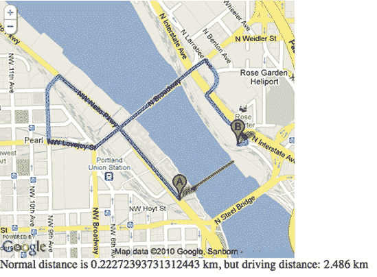
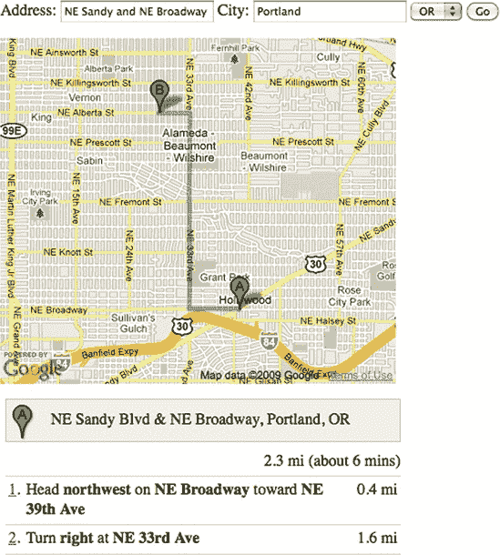
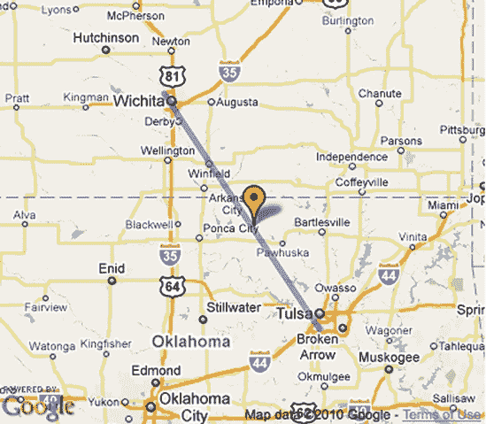
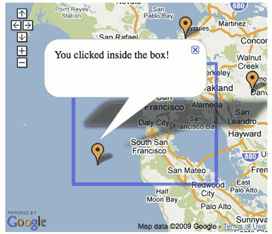
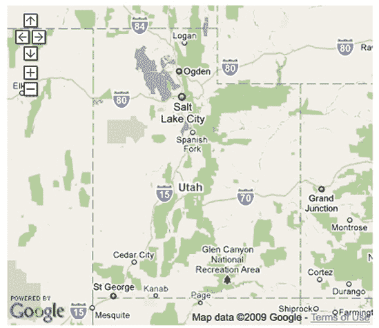
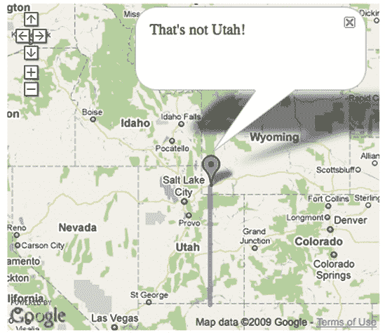

# 第六章. 探索邻近性


地图都是关于邻近性的。附近有什么？从一个位置到另一个位置有多远？本章将帮助你通过自己的地图来回答这些问题。

在某些情况下，你可能需要使用其他服务，例如 Yahoo!的本地搜索 API。在其他情况下，Mapstraction 提供了一些实用的函数。我们还将依赖一些比我聪明的数学家来帮助我们理解应用于地球三维球体的二维坐标系。

# #36: 计算两点之间的距离

在纸质地图的古代，确定地图上两点之间的距离需要使用地图的比例尺和一些测量工具。我经常会用一张纸片或手指来复制所需的长度，以计算距离。没有尺子，计算距离并不是一门精确的科学。一些提供商仍然显示比例尺，但 Mapstraction 使得自己进行计算变得不再必要。

假设你有一张带有两个标记的地图：`marker1` 和 `marker2`。你可以确定这些标记的纬度和经度点，并据此计算距离。或者，你可以让 Mapstraction 为你完成这项工作：

```
var dist_km = marker1.location.distance(marker2.location);
```

结果是`marker1`位置到`marker2`位置之间的公里数。`distance`函数可以在任何`LatLonPoint`上调用，第二个`LatLonPoint`作为参数传递。标记的`LatLonPoint`存储在`location`属性中。

这个计算实际上发生了什么？这难道不就是我们在小学学过的简单勾股定理——*a*² + *b*² = *c*²吗？不幸的是，并非完全如此。毕达哥拉斯是在二维空间工作的，而地球是一个三维的椭球体——即一个略微变形的球体。

在 第一章 中，我描述了纬度和经度系统，其中随着点离赤道的距离越远，经度之间的距离越小。换句话说，如果你在厄瓜多尔，使用勾股定理可以得到足够接近的结果，但在瑞典你的计算就会偏差很大。

你还需要另一个奇怪命名的公式——*哈弗辛公式*。这个函数使用地球半径和一些复杂的球面三角学。以下是 Mapstraction 距离函数的一个略微修改版本：

```
function LatLonPoint_distance(pt1, pt2) {
❶   var rads = Math.PI / 180;
    var diffLat = (pt1.lat-pt2.lat) * rads;
    var diffLon = (pt1.lon-pt2.lon) * rads;
    var a = Math.sin(diffLat / 2) * Math.sin(diffLat / 2) +
            Math.cos(pt1.lat * rads) * Math.cos(pt2.lat * rads) *
            Math.sin(diffLon/2) * Math.sin(diffLon/2);
    return 2 * Math.atan2(Math.sqrt(a), Math.sqrt(1-a)) * ❷6371;
  }
```

这个函数首先做的事情是计算将度数转换为弧度所需的乘数❶，这是三角函数用来计算所需距离的。弧度大约是 57 度（180 度除以π）。要将纬度和经度十进制度数转换为弧度，我们需要乘以一度中的弧度数，这大约是 1/57（π除以 180 度）。

然后我们进入哈弗辛公式，它确定了球面上两点之间的最短距离。为了得到一个可用的距离，我们必须知道球的半径。在这种情况下，我们使用地球的半径（千米）❷。要得到英里，使用半径 3958。或者将千米结果乘以 0.6213。Mapstraction 还有两个辅助函数，`KMToMiles`和`milesToKM`，用于执行这些转换。

## 你能扔一个物体过河吗？

这道数学题让我头疼，让我们来看一个实际例子。嗯，在你所在的地方扔东西可能不实用，但在波特兰，威拉米特河穿过城市的中心。自然地，我经常想知道是否有什么东西可以扔过河。

人类扔物体最远的距离是 Erin Hemmings 扔飞盘，距离为 1333 英尺，超过四分之一英里（0.4 公里）。在这个例子中，我们将看看从波特兰市中心西岸到威拉米特河东岸的距离是否小于 Hemmings 的投掷距离。

自然地，我们想在地图上可视化这个例子，所以我们向我们的基本地图的 JavaScript 部分添加以下代码，替换掉任何已有的 JavaScript：

```
var mapstraction;
  var dist;
  var wportland, eportland;
  function create_map() {
    mapstraction = new mxn.Mapstraction('mymap', 'google');
    mapstraction.addSmallControls();
    // Declare points for each side of the river
    wportland = new mxn.LatLonPoint(45.52822, −122.67195);
    eportland = new mxn.LatLonPoint(45.52933, −122.66957);

❶   dist = eportland.distance(wportland); // Calculate distance

    // Show points on the map
    mapstraction.addMarker(new mxn.Marker(wportland));
    mapstraction.addMarker(new mxn.Marker(eportland));
❷   mapstraction.addPolylineWithData(new mxn.Polyline([wportland, eportland]));
    mapstraction.autoCenterAndZoom();

    var disttext = document.createTextNode("Distance is " + dist + " km.");
❸   mapstraction.currentElement.parentNode.appendChild(disttext);
  }
```

确保在页面加载时调用`create_map`函数，并且你有一个`div`标签，其`id`设置为`mymap`，就像你在基本地图中做的那样。在函数内部，除了创建 Mapstraction 地图外，这段代码还创建了两个点，一个在河的一侧，一个在另一侧。然后它计算这两个点之间的距离 ❶。

我们可以在这里停止，但让我们在地图上添加一些视觉元素，使其更有意义。让我们为两个点中的每一个添加一个标记。然后，为了使事情更加清晰，让我们在这两点之间画一条线 ❷。你可以看到这个地图在图 6-1 中的样子。

在地图下方，我们向用户展示我们计算出的距离。我们通过在地图`div`下方添加一个新的文本节点来实现这一点 ❸。这个文本将显示距离，为 0.22 公里。与记录进行比较，你可以看到，如果你的名字是 Erin Hemmings，你确实可以扔一个物体过威拉米特河！


图 6-1. 两点及其之间的距离

# #37: 使用路线查找真实距离

确定两点之间的距离是搜索的关键。这就是为什么 Mapstraction 让你可以访问之前项目中描述的距离函数。然而，这个函数只告诉你鸟飞的距离。我还没有见过任何乌鸦使用地图。

要确定两点之间的驾驶距离，你需要大量的信息。你需要有一个存储交叉点和街道是单向还是双向的地图底层数据。然后你需要一个算法来确定最佳路线。自己创建这些会是一项繁琐的工作，所以在这个例子中，你将利用 Google Maps API 的驾驶路线服务。

在这个例子中，你仍然会使用 Mapstraction，但你将依赖 Google 来计算距离。这意味着你需要加载 Google API，因此你可能会使用 Google 作为你的地图服务提供商。然而，你也可以加载第二个提供商，并在其地图上显示 Google 的路线结果。

你需要理解这里发生的事情。与依赖于公式的简单点间距离计算不同，这里你需要将点发送到 Google 并等待回复。由于结果等待时间，不建议对多个点执行此操作。

让我们来看看路线代码。在这个例子中，我将使用标准距离计算中的两个点，并比较结果。将以下代码添加到你的基本地图的 JavaScript 部分，替换任何其他代码：

```
var mapstraction;
  var gdir;
  var dist, ddist;
  var wportland, eportland;
  function create_map() {
    mapstraction = new mxn.Mapstraction('mymap', 'google');
    mapstraction.addSmallControls();
    // Declare points for each side of the river
    wportland = new mxn.LatLonPoint(45.52822, −122.67195);
    eportland = new mxn.LatLonPoint(45.52933, −122.66957);
    dist = eportland.distance(wportland); // Calculate distance
    mapstraction.addPolylineWithData(new mxn.Polyline([wportland, eportland]));

    // Google-specific code for driving directions
❶   gdir = new google.maps.DirectionsService();
❷   var diropt = {
    origin: wportland.toProprietary(mapstraction.api),
    destination: eportland.toProprietary(mapstraction.api),
    travelMode: google.maps.DirectionsTravelMode.DRIVING
    };
    gdir.route(diropt, ❸setDDist);
  }
  function setDDist() {
    if (status == google.maps.DirectionsStatus.OK) {
      var directionsDisplay = new google.maps.DirectionsRenderer(
                              {map: mapstraction.getMap()});
❹     directionsDisplay.setDirections(response);
❺     ddist = response.routes[0].legs[0].distance.value / 1000;
      // driving distance in km
      var disttext = document.createTextNode("Normal distance is " + dist +
      " km, but driving distance is " + ddist + " km");
❻     mapstraction.currentElement.parentNode.appendChild(disttext);
    }
  }
  function handleErrors(){
    // Handle errors in this section
  }
```

由于大部分设置与之前距离项目中的地图相似，让我们先讨论一下 Google 特定的代码。由于 Google API 已经加载，我们可以创建一个 `DirectionsService` 对象 ❶。尽管我们通常通过 Mapstraction 与 Google 交流，但在这里我们直接与 Google 通信。

一旦我们创建了 `DirectionsService` 对象，我们就可以用它做些事情。我们首先准备选项 ❷，例如我们的起点和终点，用于我们的路线搜索。由于我们的点是为 Mapstraction 创建的，我们需要将它们转换为 Google 的专有格式。然后我们将这些选项连同回调函数 ❸ 一起发送给 Google，以接收结果。

当路线加载完成后，Google 会调用我们的 `setDDist` 函数。我们将驾驶路线添加到地图上作为一个专有的 Google 多段线 ❹，这将帮助我们直观地比较两种距离方法。然后我们可以获取这些路线的驾驶距离（以米为单位）❺。要将公里转换为米，只需除以 1000。

最后，我们将在地图 `div` ❻ 下方添加一个新的文本节点，它将向用户传达距离信息。



图 6-2. 与 Haversine 距离相比的驾驶距离

如图 6-2 所示，你必须驾驶的距离比懒惰的乌鸦飞行的距离要远得多。鉴于两点之间的最短距离是直线，路由结果总是会更远。在这种情况下，因为只有这么多桥梁跨越威拉米特河，这种影响被放大了，至少直到谷歌在其 API 中包含游泳路线。

# #38：创建驾驶路线

地图网站最有用的功能可能一直是它们的驾驶路线。驾驶路线背后的路由技术比大多数开发者能够承担的更先进，但谷歌通过其 API 提供了驾驶路线的访问权限。在本节中，我将创建一个方向小部件，可以帮助任何企业向客户展示通往商店的路。在这种情况下，我将使用 La Bonita，一家墨西哥餐厅，我在那里写下了这本书的大部分内容。

这个示例严重依赖于 Google Maps API，所以这个项目是我不会使用 Mapstraction 的少数项目之一。首先，让我们向一个新文件添加一些基本的 HTML：

```
<html >
  <head>
    <title>Driving Directions with Google Maps</title>

    <script type="text/javascript" src="http://maps.google.
com/maps/api/js?sensor=false"></script>
    <style type="text/css">
    div#mymap {
      width: 400px;
      height: 350px;
    }
    div#mydir {
      width: 400px;
    }
    </style>
    <script type="text/javascript">
      ❶var myaddress = "2839 NE Alberta St, Portland, OR";
      // Google Maps Driving Directions Code Will Go Here
    </script>
  </head>
  <body ❷onload="create_map()" onunload="GUnload()">
    <h1>Venido a La Bonita</h1>

    <div id="mymap"></div>
    ❸<div id="mydir"></div>
  </body>
</html>
```

这段代码主要用于一个基本的、几乎空白的 HTML 页面。我们将用表单来接受用户输入，并用 JavaScript 请求谷歌的驾驶路线。首先，让我们看看几个新元素，我会解释它们的意义。

在 JavaScript 部分，我硬编码了 La Bonita 的地址❶。你可以用你的商业地址或派对的地点替换它。然后，客户或客人将稍后输入他们自己的地址。这两个地址将共同构成驾驶路线的起点和终点。

当页面加载时，我们调用`create_map`函数❷，就像我们在大多数 Mapstraction 示例中所做的那样。这是因为我想了这个函数；我可以叫任何名字，因为它与 Mapstraction 无关。

在 HTML 的下方，我包含了一个第二个`div`❸。这个标签将包含驾驶方向文本。这个第二个`div`在地图`div`之后，所以方向将列在地图下方。这个驾驶方向服务的部分是可选的（事实上，我在#37：使用路由找到真实距离中省略了它），但文本对这个示例很重要。

现在我们已经组装好了 HTML 页面的外壳，让我们添加使这个地图工作的组件。在地图`div`上方的空白区域（以及`<h1>`标签下方），包括以下表单：

```
<form onSubmit="❹loadDir();return false;">
  Address: <input type="text" name="addr" />
  City: <input type="text" name="city" value="Portland" />
  ❺<select name="state">
    <option>OR</option>
    <option>WA</option>
  </select>
  <input type="submit" value="Go" />
</form>
```

大多数表单都会将数据发送到服务器，但在这个示例中，我们想使用 JavaScript。这意味着当用户提交表单时，我们需要调用一个 JavaScript 函数❹。然后我们需要返回 false 以防止浏览器将数据发送到服务器。

此代码请求用户的位置信息分为三个部分：地址、城市和州。如果您愿意，可以使用一个或两个字段，但将它们分开成单独的字段有助于使您的格式期望更清晰。另一方面，准备调用驾驶路线服务将需要更多的工作。

州以下拉菜单的形式显示❺。在我的示例中，我只包括了俄勒冈州和华盛顿州。La Bonita 的食物很好，但没有人会为了它而走很远的路。您可以包括客户最有可能居住的州。

现在，我们将使用 JavaScript 将所有这些连接起来。至少，我们需要创建我们在 HTML 中已经引用的两个函数：`create_map`将使 Google 地图准备就绪，而`loadDir`将发送地址到 Google 的驾驶路线服务。

将以下内容添加到 La Bonita 地址下的 JavaScript 部分：

```
❶ var map, gdir;
  function create_map() {
    var opt = {center: new google.maps.LatLng(45.559192, −122.636049), zoom: 15,
               mapTypeId: google.maps.MapTypeId.ROADMAP};
    map = new google.maps.Map(document.getElementById("mymap"), opt);
❷   gdir = new google.maps.DirectionsService();
  }
  function loadDir() {
    var stateobj = document.getElementById('state');
❸   var fromaddress = document.getElementById('addr').value + " "
          + document.getElementById('city').value + ", "
          + stateobj.options[stateobj.selectedIndex].value;
❹   var diropt = {
      origin: fromaddress, destination: myaddress,
      travelMode: google.maps.DirectionsTravelMode.DRIVING
    }
    gdir.route(diropt, ❺setDir);
  }
  function setDir(response, status) {
    if (status == google.maps.DirectionsStatus.OK) {
      var directionsDisplay = new google.maps.DirectionsRenderer(
          {map: map, panel: document.getElementById('mydir')});
      directionsDisplay.setDirections(response);
    }
  }
```

首先，我们通过在函数外部声明`gdir`变量使其全局❶。这样，变量就可以在代码的任何地方被引用。在创建地图后，我们还需要初始化`gdir`变量❷，这样 Google 就知道我们将要求驾驶路线。

我们几乎准备好让用户与我们的表单进行交互了。让我们看看当表单提交时被调用的函数`loadDir`。首先，该函数将地址与城市/州组合在一起❸。您可能更喜欢检查这些字段中的空或格式不正确的内容，但这个简单的示例只是将它们连接在一起。

接下来，我们设置选项❹，包括两个地址，告诉 Google 要查找哪些路线。最后，该函数将选项连同回调函数❺一起发送给 Google。在`setDir`函数中，该函数接收驾驶路线，我们只是告诉 Google 在地图上以及地图下方显示路线，如图图 6-3 所示。

就这样。我们已经为任何人前往 La Bonita 创建了驾驶路线。要将其用于您的业务，只需更改`myaddress`变量并填写适当的州。要查看一个更深入探讨驾驶路线的示例，请参阅#73: 在中间找到一家咖啡店见面。

查看 Google 驾驶路线服务的完整文档：[`code.google.com/apis/maps/documentation/javascript/reference.html#DirectionsService`](http://code.google.com/apis/maps/documentation/javascript/reference.html#DirectionsService)

# #39: 确定最近的标记

给定一个点和一大堆标记，你能找到离你的点最近的那个吗？在这个项目中，我们将遍历地图上的每个标记，并在用户点击的位置和最近的标记之间画一条线，我们将通过计算两点之间的距离来确定这个最近的标记。

然而，在我们找到最近的标记之前，我们需要一个带有一些标记的地图。为此，我们将获取五个随机点，如本章前面所示。在这里，我重新打印了您需要从该部分获取的`get_random_by_bounds`函数。将这些行添加到您基本地图的 JavaScript 部分顶部，但请确保它们在`create_map`函数外部：

```
function get_random_by_bounds(bounds) {
  var lat = bounds.sw.lat + (Math.random() * (bounds.ne.lat − bounds.sw.lat));
             var lon = bounds.sw.lon + (Math.random()
 * (bounds.ne.lon − bounds.sw.lon));
  return new mxn.LatLonPoint(lat, lon);
}
```



图 6-3. 来自 Google 的驾驶方向

在有了这个辅助函数之后，将这些行添加到基本地图的`create_map`函数中：

```
❶ var bounds = new mxn.BoundingBox(32.4, −113.9, 40.9, −103.0);
❷ for (i=1; i<=5; i++) {
    var marker = new mxn.Marker(❸get_random_by_bounds(bounds));
    mapstraction.addMarker(marker);
  }
❹ mapstraction.setBounds(bounds);
  mapstraction.click.addHandler(❺find_closest_marker);
```

假设您已经初始化了地图，您几乎可以开始创建标记了。首先，您需要创建标记的边界，这代表您将用于创建随机位置的面积。在这种情况下，我使用了一些点❶，这些点大致定义了美国“四个角落”的州：亚利桑那州、犹他州、科罗拉多州和新墨西哥州。

现在，我们可以创建一个循环❷来执行相同的代码五次。每次循环，我们都会得到一个新的随机点❸，因此我们的标记可以在边界内任何地方。

通常，我会要求 Mapstraction 在使用随机标记时自动居中和缩放。然而，在这里，我设置了边界为四个州的组合❹，这个区域可能包含一个标记。这样，我知道所有的标记都将可见。

最后，我们等待用户点击地图。点击后，我们告诉 Mapstraction 调用一个函数来找到最近的标记❺。现在我们需要编写这个函数。将这些行添加到您的 JavaScript 中，在`create_map`函数外部：

```
function find_closest_marker(event_type, event_source, event_args) {
    if (mapstraction.markers.length > 0) {
      var clickpoint = event_args.location;
❻     var closest_marker = mapstraction.markers[0];
❼     var closest_dist = clickpoint.distance(closest_marker.location);
❽     for (var i=1; i < mapstraction.markers.length; i++) {
        var thismarker = mapstraction.markers[i];
        var thisdist = clickpoint.distance(thismarker.location);
❾       if (thisdist < closest_dist) {
          closest_dist = thisdist;
          closest_marker = thismarker;
        }
      }
      if (closest_marker) {
❿       var poly = new mxn.Polyline([clickpoint, closest_marker.location]);
        mapstraction.addPolyline(poly);
      }
    }
  }
```

为了找到用户点击的点最近的标记，我们需要检查每个标记和点击点之间的距离。在搜索过程中，我们需要保留两份数据：我们找到的当前最近标记及其到点的距离。

首先，我们创建这两个变量，并假设第一个标记（记住 JavaScript 数组索引从零开始）目前是最接近的❻。因此，我们知道要比较的距离，我们还计算了第一个标记到点的距离❽。现在我们准备好遍历所有其他标记❽，从第二个开始。

每次循环中，我们计算当前标记和点击点之间的距离。如果距离比我们迄今为止找到的最近距离更远，我们就不做任何事情。如果这个当前标记现在比之前的❾个更近，我们就用新值替换原始的两个变量。

循环结束后，我在用户点击的位置和我们所确定的最近的标记之间创建了一条新的折线标记❿。将此示例加载到网页浏览器中并点击几次。如果你移动得足够多，你会创建几条线，连接多个标记（参见图 6-4)。哪个标记离阿尔伯克基最近？丹佛呢？


图 6-4. 每次点击都连接到最近的标记。

# #40：在一条线上找到一个点

假设你和你那位健忘的飞行员朋友从堪萨斯州的威奇托飞往俄克拉荷马州的塔尔萨，大约 140 英里。飞机起飞后，他漫不经心地说：“哎呀，我忘记加油了。”我知道你在想什么——掉头！但你的朋友向你保证，油足够你开 80 英里，应该能让你到达俄克拉荷马州，那里的油价更便宜。

知道两点之间的距离是有用的，但有时你想要知道这两点之间的故事。例如，两个城市之间的中点在哪里？或者，给定点 A 和点 B，沿着这条线九英里处的点 C 的坐标是什么？这是一个数学问题，但解决它会带来一些有趣的可能。

如果你真的是从威奇托飞往塔尔萨的几乎空油箱上，那么“乐趣”可能不是一个合适的词。但当你发动机开始噼啪作响时，你肯定想知道沿着那条路线 80 英里后你会在哪里。你最好再检查一下：*你会到达你的朋友所说的俄克拉荷马州吗？*毕竟，这个信息是从那个忘记给飞机加油的家伙那里来的。

为了找出这个问题的答案，我们将使用三个步骤的过程：

1.  在地图上标出我们的起始点和终点。

1.  使用两个点计算我们的航向（方向）。

1.  使用航向和起始点找到一个 80 英里外的新点。

让我们在还有时间掉头之前开始。

## 绘制你的路线

由于飞机直线飞行，我们将使用一个简单的折线，类似于在第十六章：在地图上绘制线条中的初始示例。我们只需要两个机场的起始点和终点。

要在威奇托和塔尔萨之间画一条线，请将以下函数添加到你的基本地图中，替换你当前的`create_map`函数：

```
var mapstraction;
var wichita = new mxn.LatLonPoint(37.7454463, −97.4080747);
var tulsa = new mxn.LatLonPoint(36.0390101, −95.9936344);

function create_map() {
  mapstraction = new mxn.Mapstraction('mymap', 'google');
  mapstraction.setCenterAndZoom(wichita, 8);
  mapstraction.addPolyline(new mxn.Polyline([wichita, tulsa]));
  mapstraction.autoCenterAndZoom();
  // Find bearing

  // Find point X km along route

}
```

保存文件并加载它。你的地图应该看起来类似于图 6-5。

你认为你能到达俄克拉荷马州吗？油箱里的 80 英里油可以让你走完路线的大约 60%。这将非常接近。让我们继续并找出答案。


图 6-5. Wichita 和 Tulsa 之间的直接路线

## 找到你的方位角

为了找到直线上的一个点，你首先需要知道直线的指向。这个方向被称为方位角，它是一个用度数表示的数字，范围从 0 到 359。大多数指南针在周围标记这些度数，以及四个基本方向。

在本节中，我们将编写一个函数来计算方位角，这个函数基于 Movable Type Ltd. 的 Chris Veness 的工作。将以下代码添加到你的地图文件的 JavaScript 部分，但不要放在 `create_map` 函数内部：

```
function get_bearing(pt1, pt2) {
  var lat1 = degrees_to_radians(pt1.lat);
  var lat2 = degrees_to_radians(pt2.lat);
  var lon_diff = degrees_to_radians(pt2.lon − pt1.lon);
  var y = Math.sin(lon_diff) * Math.cos(lat2);
  var x = Math.cos(lat1) * Math.sin(lat2)
          - Math.sin(lat1) * Math.cos(lat2) * Math.cos(lon_diff);
  var bearing = Math.atan2(y, x);
  return (radians_to_degrees(bearing)+360) % 360;
}
function degrees_to_radians(deg) {
  return deg * Math.PI / 180;
}
function radians_to_degrees(rad) {
  return rad * 180 / Math.PI;
}
```

除了计算方位角的函数外，我还包括了一些辅助函数，用于在度数和弧度之间进行转换。当我们使用弧度时，我们使用的三角学更简单（没错——数学可能更复杂）。然而，我们还需要转换回来，因为 Mapstraction 期望的是度数。

现在，在你的 `create_map` 函数内部，添加以下这一行：

```
var bearing = get_bearing(wichita, tulsa);
```

在这里，我们调用 `get_bearing` 函数，传递我们的两个点。结果应该是大约 146 度。注意，如果你交换函数参数的顺序，结果将不同：大约 326 度。这是因为从 Tulsa 到 Wichita 的旅行方向不同。由于它是完全相反的方向，这两个结果相差 180 度。

我们是从 Wichita 到 Tulsa，所以我们将使用这个结果在下一节中。

## 确定新点

现在我们知道了我们的行进方向。这是找到我们路线上的 80 英里处的点的关键步骤。是时候使用一些更复杂的数学，结合方位角和我们的起点 Wichita 的坐标了。

在本节中，我们将编写另一个函数，同样基于 Chris Veness 的工作。将以下代码添加到你的 JavaScript 中，注意不要将其放在任何其他函数内部：

```
function get_destination(pt, dist, bearing) {
  var R = 6371; // radius of earth (km)
  var lat1 = degrees_to_radians(pt.lat);
  var lon1 = degrees_to_radians(pt.lon);
  bearing = degrees_to_radians(bearing);
  var cosLat1 = Math.cos(lat1);
  var sinLat1 = Math.sin(lat1);
  var distOverR = dist / R;
  var cosDistOverR = Math.cos(distOverR);
  var sinDistOverR = Math.sin(distOverR);

  var lat2 = Math.asin( sinLat1 * cosDistOverR

             + cosLat1 * sinDistOverR * Math.cos(bearing) );
  var lon2 = lon1 + Math.atan2( Math.sin(bearing) * sinDistOverR * cosLat1,
             cosDistOverR Đ sinLat1 * Math.sin(lat2) );
  lon2 = (lon2 + Math.PI) % (2 * Math.PI) Đ Math.PI;
  lat2 = radians_to_degrees(lat2);
  lon2 = radians_to_degrees(lon2);

  return new mxn.LatLonPoint(lat2, lon2);
}
```

现在我们需要调用我们刚刚创建的函数。在 `create_map` 函数中，在计算方位角的行之后添加以下代码：

```
var newpt = get_destination(wichita, 128, bearing);
var mk = new mxn.Marker(newpt);
mapstraction.addMarker(mk);
```

注意，我们传递给新函数的距离是 128，而不是 80。这是因为该函数期望距离以 *千米* 为单位，而不是英里。这与 Mapstraction 计算距离的方式相匹配。要将英里转换为千米，将英里数乘以 1.6。

在加载你的更改之前深吸一口气。除了确定路径上的 80 英里处的点之外，代码还会创建并添加一个标记到地图上，如图 图 6-6 所示。



图 6-6. 从 Wichita 出发 80 英里就进入俄克拉荷马州！

你可以再深吸一口气，因为看起来 80 英里的油量可以让你从威奇托开到俄克拉荷马州，根据你健忘的飞行员朋友的说法，在那里你可以以更低的价格加油。至于找到着陆点，那是另一个问题。

现在你已经知道了如何找到线上的一个点，尝试一个不那么假设性的项目。#73: 在中间找到一个咖啡店见面 在 #73: 在中间找到一个咖啡店见面 中将你刚刚完成的项目与行车路线和本地搜索结果结合起来。

### 注意

你找到的点将只会在短距离内直接位于线上，就像这个例子中的 140 英里行程一样。对于更长的距离，点将是正确的，但线将是错误的。标准的多段线不考虑地球的曲率。为了得到两点之间“大圆”最短距离的线，你需要使用大地测量多段线，这是谷歌支持的。

# #41: 在地图上绘制本地结果

当你在附近搜索时，迟早你会想要找到符合某些条件的企业。例如，在波特兰，我们总是在寻找咖啡。在这次示例发生的旧金山，这意味着要找到美味且价格便宜的墨西哥卷饼。

在这个项目中，我们将使用 JavaScript 来执行针对关键词 *burritos* 的本地搜索。谷歌和雅虎都提供了允许这种搜索的 API。在这个例子中，我们将使用雅虎，因为它简单直接。

我们从基本的 Mapstraction 地图开始，因此我们最小化了特定提供者的调用次数。因为我的大多数示例都使用了谷歌作为提供者，请确保你正在调用雅虎地图 API：

```
<script type="text/javascript"
src="http://api.maps.yahoo.com/ajaxymap?v=3.8&appid=*`yourkeyhere`*"></script>
```

当外部 JavaScript 加载完成后，将任何现有的内联 JavaScript 代码替换为以下内容：

```
var mapstraction;
  function create_map() {
    mapstraction = new mxn.Mapstraction('mymap', 'yahoo');
    mapstraction.setCenterAndZoom(new mxn.LatLonPoint(37.7740486,-122.4101883), 15);
    mapstraction.addLargeControls();
    // Yahoo-specific calls
❶   var ymap = mapstraction.getMap();
    YEvent.Capture(ymap, EventsList.onEndLocalSearch, ❷plotResults);
❸   ymap.searchLocal(ymap.getCenterLatLon(), 'burritos', ❹1, ❺5);
  }
```

为了能够使用雅虎特定的调用，我们需要获取地图对象 ❶。然后我们需要让地图知道我们对一个事件感兴趣，这个事件将在我们的搜索完成后发生。我们还引用了一个可以发送结果的函数 ❷。我们稍后会创建这个函数。

现在，我们需要编写实际启动对雅虎进行本地搜索的代码 ❸。`searchLocal` 函数需要传递四个值：我们发送地图的中心、搜索查询、搜索半径（以英里为单位） ❹ 和结果数量 ❺。

然后我们编写 `plotResults` 函数。在 `create_map` 函数下方添加以下行：

```
function plotResults(❶results) {
    if (results.Data) {
      var places = results.Data.ITEMS;
❷     for (i=0; i < places.length; i++) {
        var thisplace = places[i];
        var lat = ❸parseFloat(thisplace.LATITUDE);
        var lon = parseFloat(thisplace.LONGITUDE);
        var marker = new mxn.Marker(new mxn.LatLonPoint(lat, lon));
        marker.setInfoBubble(thisplace.TITLE + '<br />' + thisplace.ADDRESS);
        mapstraction.addMarker(marker);
      }
    }
❹   mapstraction.autoCenterAndZoom();
  }
```

搜索结果作为参数 ❶ 从雅虎传递到我们的函数。该参数是一个特殊对象，其中包含我们找到的每个企业的许多信息。我们想要从对象中提取纬度、经度、地址和商家名称，我们通过遍历 ❷ 结果来实现这一点。

在循环的每次迭代中，我们访问我们需要的四个商业信息。为了获取可用的经纬度值，我们需要使用 JavaScript 辅助函数 `parseFloat` ❸。这个函数将文本值转换为坐标所需的浮点数。

其余的现在可能对你来说已经很熟悉了。我们创建一个标记，在消息框中输入文本（地点的名称和地址），当我们添加了所有标记后，我们确保它们都可以在地图上显示出来❹，如图 图 6-7 所示。

# #42: 使用 HTTP 获取本地结果

在许多情况下，你可能需要使用比 JavaScript 更强大的工具来执行本地搜索。例如，你可能希望将结果存储在数据库中或将它们输出到 RSS 源中。在任一情况下，之前项目中使用的方法都行不通。相反，我们将使用 Yahoo! 的本地搜索 API，并通过 PHP 访问它，这是一种在许多网络主机上可用的流行服务器端编程语言。


图 6-7. Yahoo! 地图上的本地结果

在我们将结果带入代码之前，让我们看看它们看起来像什么。我们使用的 API 中的一个优点是它输出纯文本 XML，这可以被网络浏览器解释，并且是可读的。

### 注意

本项目中的某些概念可能被认为是高级的。它们建立在 第八章 和 第九章 中介绍的概念之上。

就像访问普通网页一样，你可以通过访问一个 URL 来访问本地搜索 API。尝试在地址栏中输入以下搜索：在旧金山搜索玉米卷：

```
http://local.yahooapis.com/LocalSearchService/V3/localSearch?`appid`=
*`yourkeyhere`*&`query`=burritos&`location`=San+Francisco+CA
```

请求参数以粗体显示。第一个，你的 `appid`，是你的 Yahoo! API 密钥。`query` 是你正在搜索的内容，而 `location` 是你正在搜索的位置。

一旦结果被加载，你会看到类似以下的内容：

```
❶ <?xml version="1.0"?>
❷ <ResultSet ... totalResultsAvailable="553" totalResultsReturned="10">
❸   <Result id="21356805">
      <Title>El Farolito</Title>
      <Address>2777 Mission St</Address>
      <City>San Francisco</City>
      <State>CA</State>
      <Latitude>37.752713</Latitude>
      <Longitude>-122.41835</Longitude>
      ...
    </Result>
    <Result id="21342579">
      ...
    </Result>
    ...
  </ResultSet>
```

与大多数 XML 文档一样，结果在第一行声明自己是 XML ❶。第二行是文档的根元素 ❷，这意味着它包含其下所有其他标签。每个结果都存储在 `<Result>` 标签 ❸ 中，数据项存储在低于一级的标签中。

更多关于描述 XML 的术语，请参阅 #52: 使用 XML，其中还包含比我将在下一节中提供的更深入的 XML 解析描述。

## 使用 PHP 解析本地结果

在浏览器中查看 Yahoo! 返回的 XML 是一件事情。更有用的事情是将它读入 PHP，这允许你做更多的事情。在这个例子中，我们将获取与上一节相同的玉米卷结果，并打印出找到的第一家餐厅的名称。

创建一个新的 PHP 文件并添加以下行：

```
<?
    $api_key = "*`yourkeyhere`*";
    $search_term = urlencode("burritos");
    $location = ❶"urlencode("San Francisco, CA");
    $url = "http://local.yahooapis.com/LocalSearchService/V3/localSearch";
❷   $url .= "?appid=$api_key&query=$search_term&location=$location";
❸   $xobj = get_xml($url);
    print $xobj->Result[0]->Title;
  ?>
```

我已经将这三个参数存储为 PHP 变量。这使得你可以轻松地包含自己的 API 密钥并更改搜索词。继续更改我们正在搜索的内容，或者包含你自己的城市。请注意，尽管我们正在硬编码搜索条件，但我已经使用了`urlencode`函数来确保 URL 的有效性。例如，位置的编码❶将替换空格和逗号，以使用这些字符的 URL 友好版本。

接下来，我将参数以 URL 形式组合在一起❷，这样我们就可以检索结果。实际下载网页的调用发生在另一个函数❸中，你可以在第六十一部分：检索网页中找到详细描述。

最后，PHP 代码打印出第一个结果的名字：示例结果中的 El Farolito。你可能更希望对结果做些更有趣的事情，而不仅仅是打印出第一个名字，但这给你提供了一个如何访问这些条目的想法。

## 其他有用参数

在上一个示例中，我展示了你可以使用 Yahoo!本地搜索 API 进行搜索的三个参数：`appid`（必需）、`query`（大多数搜索必需）和`location`。

有更多选项可用，其中最有趣的我已包括在表 6-1 中。

表 6-1. Yahoo!本地搜索接受的附加参数

| 参数名称 | 描述 |
| --- | --- |
| `city`、`state`和`zip` | 这三个中的任何一个都可以单独使用或组合使用，以替换示例中使用的自由格式`location`参数。 |
| `latitude`和`longitude` | 如果这两个都使用，它们将取代任何其他位置数据，并将搜索中心设置在由坐标创建的点。 |
| `radius` | 设置搜索位置的最大距离（以英里为单位）。 |
| `results` | 声明结果数量，从 1 到 20。默认值是 10。 |
| `sort` | 指示结果将如何排序，使用以下四个选项之一：`distance`（距离）、`rating`（评分）、`relevance`（相关性）或`title`（标题）。默认值是`relevance`。 |

Yahoo!的文档中列出了更多参数^([2]），但通过这里提供的示例，你应该能够得到一些有趣的结果。你最近的动物标本制作师在哪里？

* * *

^([2]) [`developer.yahoo.com/search/local/V3/localSearch.html`](http://developer.yahoo.com/search/local/V3/localSearch.html)

# #43：检查点是否在边界框内

在地图绘制中，矩形是最重要的形状之一。经过几个世纪，我们仍然以矩形形状查看地图，即使是在今天的 JavaScript 中也是如此。矩形也可以很容易地描述（你只需要两个点），判断一个点是否在特定的矩形内不需要复杂的数学计算。

正如你将在本项目的后续部分看到的那样，检查一个点是否在`BoundingBox`内是第一步。你也可以用它来确定，例如，所有标记是否都在屏幕上。

由于判断一个点是否在矩形内是一个非常实用的功能，Mapstraction 将其作为一个函数内置。给定任何`BoundingBox`对象，你可以传递一个`LatLonPoint`并返回 true（在框内）或 false。

这里是确定一个点是否在地图视图中的代码：

```
var box = mapstraction.getBounds();
var inview = box.contains(new mxn.LatLonPoint(37.7740486, −122.4101883));
```

发生了什么？这并不复杂。一个`BoundingBox`由其西南角和东北角点确定（见图 6-8）。所以要在框内，你的纬度必须在这两个点的纬度之间。经度是相同的。


图 6-8. 一个`BoundingBox`通过其西南角和东北角点来声明。

这里是 Mapstraction 的`BoundingBox contains`函数的一个稍微修改过的版本：

```
function check_bounds(pt, box) {
  return (pt.lat >= box.sw.lat && pt.lat <= box.ne.lat
       && pt.lon >= box.sw.lon && pt.lon <= box.ne.lon);
```

是的，数学相当直接，但每次都要编写很多代码。我很高兴 Mapstraction 为我们做了这件事。

## 你能在框内点击吗？

现在我们知道了如何检查一个点是否在框内，让我们试试。这个例子将创建一个比可视地图小的边界框。当用户点击时，我们检查他或她点击的点是否在我们的框内。

为了使事情更清晰，我们将在边界框周围绘制一个多边形，这样就可以很容易地判断 Mapstraction 是否返回了正确的结果。你认为你能在框内点击吗？

将以下代码添加到基本地图的 JavaScript 部分，替换任何现有的代码：

```
var mapstraction;
  var box;
  function create_map() {
    mapstraction = new mxn.Mapstraction('mymap', 'google');
    mapstraction.setCenterAndZoom(new mxn.LatLonPoint(37.7740486,-122.4101883), 9);
    mapstraction.addSmallControls();
❶   box = new mxn.BoundingBox(37.5, −122.8, 37.9, −122.2);
❷   var poly = BoundingBox_to_Polyline(box);
    mapstraction.addPolyline(poly);
❸   mapstraction.click.addHandler(function(event_type, event_source, event_args) {
      var reply = "";
      var clickpoint = event_args.location;
❹     if (box.contains(clickpoint)) {
        reply = "You clicked inside the box! ";
      }
      else {
        reply = "Sorry--You missed the box. ";
      }
      // Create marker at click
      var mk = new mxn.Marker(clickpoint);
      mk.setInfoBubble(reply);
      mapstraction.addMarker(mk);
❺     mk.openBubble();
    });
  }
  function BoundingBox_to_Polyline(box) {
    var points = [box.sw, new mxn.LatLonPoint(box.ne.lat, box.sw.lon), box.ne,
                  new mxn.LatLonPoint(box.sw.lat, box.ne.lon),
                  new mxn.LatLonPoint(box.sw.lat, box.sw.lon-.0001)];
    var poly = new mxn.Polyline(points);
    return poly;
  }
```

在创建地图后，我们在旧金山周围创建了一个相当随意的边界框❶。然后我们用同样的框并沿着其边缘绘制使其在地图上可见❷。我们使用`BoundingBox_to_Polyline`函数，我在第十九章：绘制矩形声明区域中详细解释了它。为了方便，我在这里重新打印了它。

接下来我们需要监听地图上的点击❸。当用户点击时，我们需要查看点击的点是否在框内。为此，我们在我们创建的`BoundingBox`对象上调用`contains`函数❹。结果（true 或 false）将决定我们向用户显示什么信息。

为了将结果传达给用户，我们在用户点击的位置添加一个新的标记，并打开其消息框❺以显示点击是否在边界内。试几次。点击内部，点击外部——它每次都能正确识别！一个示例结果如图图 6-9 所示。



图 6-9. 点击边界框内的点

# #44: 在边界框内获取一个随机点

快！想一个介于-122.9 和-122.8 之间的数字！虽然这不是一个普通的问题，但你可能会在创建地图时问自己。特别是对于测试，你希望能够生成随机地理点，通常在特定区域内。从某种意义上说，在矩形区域内找到一个随机点与上一个项目正好相反。

我创建了一个专门用于创建随机点的特殊函数。你可能甚至在其他部分这本书中见过它。在本节中，我将简要描述它，然后在一个示例中使用它。

下面是获取随机点的代码：

```
function get_random_by_bounds(❶bounds) {
    var lat = bounds.sw.lat + (❷Math.random() * ❸(bounds.ne.lat − bounds.sw.lat));
    var lon = bounds.sw.lon + (Math.random() * (bounds.ne.lon − bounds.sw.lon));
❸   return new mxn.LatLonPoint(lat, lon);
  }
```

这个函数最需要的信息是知道你想要随机点的大致区域，即*边界*。这个信息作为该函数的单个参数❶传递，是一个 Mapstraction `BoundingBox`对象。`BoundingBox`对象由矩形区域的西南（SW）和东北（NE）角组成。在这两点之间，你可以确定边的最大和最小值。

现在，我们知道点将位于何处，但我们仍然需要使用内置的 JavaScript 函数❷来使点变得随机。`Math.random`返回的数字是一个介于 0 和 1 之间的十进制数，这很可能不是你想要的。然而，我们可以使用这个数字，乘以我们的范围❸，来确定随机坐标。

例如，要获取随机纬度，我们取东北纬度减去西南纬度，然后将这个答案（两个纬度之间以度为单位距离）乘以随机数。然后，我们将西南纬度（两者中最小的一个）加到结果上。因此，我们的最小纬度（当随机数为零时）将与西南纬度相同；最大纬度（当随机数为一时）将与东北纬度相同。

然后将相同的流程应用于经度，但使用一个新的随机数。现在我们有了纬度和经度，我们可以将这两个数字作为新的`LatLonPoint`❹返回。

下面是一个使用随机点的示例。确保你的 JavaScript 代码中有`get_random_by_bounds`函数，然后向基本地图的`create_map`函数中添加以下行：

```
var b = new mxn.BoundingBox(❶45.5, −122.9, 45.6, −122.8);
❷ var pt = get_random_by_bounds(b);
  var mk = new mxn.Marker(pt);
  mapstraction.addMarker(mk);
```

我们需要一些边界才能传递给随机点函数。在这种情况下，我虚构了一些点 ❶，大致位于我的家乡俄勒冈州波特兰市。在创建一个新的`BoundingBox`时，我们必须按以下顺序传递四个数字：SW 纬度，SW 经度，NE 纬度，和 NE 经度。

接下来，我们通过传递我们刚刚创建的边界来获取随机点 ❷。记住我们创建的函数使用了`return`来共享新的随机点。当我们调用该函数时，我们可以声明一个变量（我称之为`pt`）来存储返回的值。

为了显示随机点，我使用它创建了一个新的标记，并将其放置在地图上。如果你想直观地检查这个点是否真的在你的边界内，尝试将第十九部分：绘制一个矩形来声明一个区域与这个一起使用。

# #45: 检查一个点是否在形状内

用户刚刚点击了堪萨斯州吗？这个地址是否在城市的界限内？这些问题是你希望用碰撞测试来回答的常见问题，碰撞测试是用来确定一个点是否在形状内的过程。要做到这一点，需要一些数据（形状的轮廓）和一些数学知识。在本节中，我将展示如何处理坐标并找到这些以及其他问题的答案。

首先，数据。一个形状可以描述为一系列纬度和经度点，其中起点和终点是同一个点，围成一个多边形。你可能可以通过绘制边界来创建你想要的形状。你很可能会在网上找到分享他们形状的人。例如，所有 50 个美国州的形状可以在[`mapscripting.com/state-boundaries`](http://mapscripting.com/state-boundaries)找到。

我们将执行一个碰撞测试来查看用户点击的点是否在某个州内。鉴于堪萨斯州形状较为规则，让我们选择一个形状稍微复杂一些的州，比如犹他州（见图 6-10)。犹他州的边缘由六个点组成，这意味着描述犹他州作为一条线需要七个点（因为最后一个点需要与第一个点重新连接）。

这里有一些 Mapstraction 代码，用来描述犹他州的轮廓作为一系列坐标：

```
utah = [new mxn.LatLonPoint(36.99, −114.05), new mxn.LatLonPoint(36.99, −109.04),
        new mxn.LatLonPoint(40.99, −109.05), new mxn.LatLonPoint(40.99, −111.05),
        new mxn.LatLonPoint(41.99, −111.05), new mxn.LatLonPoint(41.99, −114.04),
        new mxn.LatLonPoint(36.99, −114.05)];
```

现在我们想编写一个函数，用来确定特定点是否在由这些点创建的多边形内。我们的点可能位于地球上的任何地方。鉴于犹他州是一个相对较小的区域，我们的点很可能不在该州内。让我们快速排除这一点——在进入高级数学之前。



图 6-10. 犹他州手柄部分的状态非常适合进行碰撞测试。

## 找到多边形的边界框

确定一个点不在多边形内部的最简单方法就是证明这个点位于多边形边界框的外部。为了确定多边形的矩形边界，我们必须查看每个点，这样我们就可以找到纬度和经度的最小值和最大值。

一旦我们有了这些值，我们就会知道如何创建边界框。一个例子在图 6-11 中展示。

让我们编写一个函数来从一系列`LatLonPoints`创建一个新的`Mapstraction` `BoundingBox`。以下是整个函数的代码：

```
function points_to_bounds(pts) {
    if (pts.length > 0) { var minlat = pts[0].lat
      var maxlat = minlat;
      var minlon = pts[0].lon
      var maxlon = minlon;
❶     for (var i = 1; i < pts.length; i++) {
        var pt = pts[i];
❷       if (pt.lat > maxlat) {
❸         maxlat = pt.lat;
         }
        if (pt.lon > maxlon) {
          maxlon = pt.lon;
        }
  if (pt.lat < minlat) {
          minlat = pt.lat;
        }
        if (pt.lon < minlon) {
          minlon = pt.lon;
        }
      }
❹     return new mxn.BoundingBox(minlat, minlon, maxlat, maxlon);
    }
    return null;
  }
```


图 6-11. 一个多边形的矩形边界

我们想要确定四个值：最小的纬度，最大的纬度，最小的经度，以及最大的经度。因为我们必须从一个地方开始，所以我们首先假设第一个点既是最小值也是最大值。这样做只是为了让我们有东西可以比较。

然后，从第二个点开始（因为 JavaScript 数组索引从零开始，所以它的索引为 1），我们遍历所有其他点❶。每次循环中，我们检查是否找到了新的最小值或最大值。例如，如果当前点的纬度大于我们目前认为的最大值❷，那么我们需要将最大值设置为这个值❸。

一旦我们完成循环，四个值将正确无误。这些值代表`BoundingBox`的四个角。西南角由最小值组成，东北角由最大值组成。我们可以创建`BoundingBox`并将其返回以供其他地方使用❹。

现在我们有了边界，我们可以通过围绕我们的多边形（简单矩形）来检查一个点是否在多边形内部。我之前已经详细介绍了这个方法，我将在接下来的几个部分再次演示，当我们执行完整的碰撞测试时。

## 将我们的点连接到外部点

好的，如果我们已经走到这一步，我们就已经确定我们的点在多边形边界框内。这并不意味着这个点在多边形内部，但至少它附近。在我们的犹他州例子中，我们的点位于边界框的非常东北角，但不在犹他州多边形内部。

现在开始有点棘手了，但在这个小把戏中，你会发现简单性。我们需要为测试制作一条临时线。这条线连接我们的点（可能位于多边形内部）到一个我们可以保证在多边形外部的点。

当我们绘制临时线时，它可能会与组成我们的多边形的线段相交。如果线条与多边形相交奇数次，则我们的点在内部。如果它以偶数次或根本不相交，则我们的点在外部。图 6-12 提供了犹他州示例的视觉表示。


图 6-12. 仅表示犹他州的多边形只与形状相交一次——该点位于形状内部。

只有当我们能保证我们创建的新点将位于多边形外部时，碰撞测试才是确定的。我们如何做到这一点？我们将为新点创建一个纬度，该纬度小于西南纬度。

如果我们要测试的点称为`mypt`，我们的`BoundingBox`称为`box`，以下是创建我们的测试点的代码：

```
var lat_change = (❶(box.ne.lat - box.sw.lat) / 100);
var pt2 = new mxn.LatLonPoint(box.sw.lat - lat_change, mypt.lon);
```

我们不需要移动到边界框外面很远。为了确定纬度需要改变多少，我取了西南和东北之间的度数差❶，然后除以 100。在犹他州的情况下，我们的新点将位于南部边界下方 0.05 度。南北纬度之间的差异越小，新点就越接近边界框——但该点始终位于框外。

对于新点的经度，我将其设置为与我们要检查的点的经度相同。这个决定是随意的，因为任何经度都会创建一个位于边界框外的点，因为纬度小于框的最小纬度。

## 检查线段交点

现在我们有一个边界框和一个位于框外的点，我们可以将这个点与我们要测试的点连接起来。最后一步是确定连接这两个点的线与多边形相交的次数。为此，我们需要知道如何检查两条线是否相交。

由于只有两个线段，但变量很多，代码变得有些混乱。我们有四个单独的点或八个不同的值。从两个到四个到八个。就像我说的，事情很快就会变得混乱。

加入一点向量数学（基于用 Visual Basic 编写的解决方案，可在[`www.vb-helper.com/howto_segments_intersect.html`](http://www.vb-helper.com/howto_segments_intersect.html)找到）后，代码开始变得复杂。以下是测试从点 A 到 B 的线段是否与从点 C 到 D 的另一个线段相交的 JavaScript 代码：

```
function check_intersection(A, B, C, D) {
❶   var latdiff1 = B.lat − A.lat;
    var latdiff2 = D.lat − C.lat;
    var londiff1 = B.lon − A.lon;
    var londiff2 = D.lon − C.lon;

    // Make sure lines aren't parallel
❷   if (londiff2 * latdiff1 - latdiff2 * londiff1 != 0) {
      var segtest1 = (londiff1 * (C.lat - A.lat) + latdiff1 * (A.lon − C.lon))
                     / ❸(londiff2 * latdiff1 - latdiff2 * londiff1);
      var segtest2 = (londiff2 * (A.lat - C.lat) + latdiff2 * (C.lon − A.lon))
                     / (latdiff2 * londiff1 - londiff2 * latdiff1);
❹     if (segtest1 >= 0 && segtest1 <= 1 && segtest2 >= 0 && segtest2 <= 1) {
        return true;
      }
    }
    return false;
  }
```

代码首先计算每条线段的端点距离，例如点 A 和 B 的纬度之间的距离❶。这些值成为确定线是否相交的向量计算的基础。

仅使用纬度和经度距离，我们可以确保线不平行 ❷。确定这一点可以节省我们进一步的计算，因为平行线永远不会相交。更重要的是，我们不会在第一个线段测试中除以零 ❸。

`segtest1` 和 `segtest2` 变量比较线段 AB 和 CD，然后反过来。值决定了两条线的交点。因为它们不平行，它们*将*在某处相交。如果两个线段测试都在 0 和 1 之间 ❹，那么我们知道交点发生在我们的线段内。

## 执行碰撞测试

到目前为止，我们已经找到了多边形的边界框，从多边形外的点到我们关注的点画了一条线，并学会了如何确定两个线段是否相交。你是否觉得我们已经失去了找到点是否在多边形内的原始计划？好吧，那么让我们把所有这些都放在一起，执行碰撞测试。

记住，如果我们所创建的线与构成多边形的线相交的次数是奇数，那么我们的点就在多边形内。我们需要将每个线段与我们的线进行测试，我们知道至少*开始*在多边形外。

这里是函数，使用我们在本项目中早期组合的组件来确定点是否在多边形内：

```
function check_polygon(mypt, polypts) {
❶   var box = points_to_bounds(polypts);
❷   if (box.contains(mypt)) {
      var lat_change = ((box.ne.lat - box.sw.lat) / 100);
❸     var pt2 = new mxn.LatLonPoint(box.sw.lat - lat_change, mypt.lon);
      var intersections = 0;
❹     for (var i = 1; i < polypts.length; i++) {
        var seg1 = polypts[i-1];
        var seg2 = polypts[i];
❺       if (check_intersection(seg1, seg2, mypt, pt2)) {
          intersections++;
        }
      }
❻     if (intersections % 2 == 1) {
        return true;
      }
    }
    return false;
  }
```

碰撞测试函数接收要检查的点以及构成多边形的点的数组。从后者，我们能够确定多边形的边界框 ❶。当然，除非我们的点在这个框内 ❷，否则我们不需要做任何事情。如果点不在多边形的边界内，它就不在多边形内。

现在，我们准备检查点是否在多边形内。为此，我们在我们的点和边界框外的点之间创建一条临时线 ❸。然后我们需要检查这条线与多边形的交点。为此，我们将遍历多边形的点 ❹，检查与这条临时线的交点。

每次循环，我们从四个点制作两个线段。第一个线段是由多边形中的两个连续点组成的。另一个线段是用我们的点和我们在边界框外找到的点创建的。

我们将这些点传递给创建的函数以检查交点 ❺。如果两个线段相交，我们增加交点计数。无论如何，我们接着进行循环的下一轮。

当循环结束时，我们将知道我们的点是否在多边形内。如果交点计数是奇数，则点在内部。如果计数是偶数，则我们的点在外部。一个数是奇数，如果除以二时余数为 1。取模运算符 `%` 给我们余数 ❻。余数意味着我们有奇数个交点，我们返回 true 因为点在多边形内。在所有其他情况下，我们返回 false 因为点不在多边形内。

## 你在犹他州点击了！

现在我们能够检查一个点是否在多边形内，让我们将其整合到地图中。在本章的开头，我们创建了一系列形状像犹他州的多点。我们将使用这些点，以及到目前为止展示的所有其他代码，来报告用户是否点击了由`utah`变量描述的多边形内部。

创建一个基本的地图并添加多边形点。我们还需要之前创建的函数。确保包括`check_polygon`、`check_intersection`和`points_to_bounds`函数。然后添加以下代码，替换已经存在的`create_map`函数：

```
function create_map() {
    mapstraction = new mxn.Mapstraction('mymap', 'google');
    mapstraction.setCenterAndZoom(new mxn.LatLonPoint(39.5, −111.7), 6);
    mapstraction.addSmallControls();
❶   mapstraction.click.addHandler(function(event_type, event_source, event_args) {
      var clickpoint = event_args.location;
      var intersects = check_polygon(clickpoint, utah);
❷     if (intersects) {
        msg = "You clicked in Utah!";
      }
      else {
        msg = "That's not Utah!";
      }
❸     var m = new mxn.Marker(clickpoint);
      m.setInfoBubble(msg);
      mapstraction.addMarker(m);
      m.openBubble();
    });
  }
```

前几行创建了一个新的地图，将其中心定位在犹他州，并添加了缩放控件。然后我们需要等待用户在地图上的某个位置点击 ❶。当用户点击时，我们初始化一个内联的匿名函数，将点击点作为参数传递，如第二十七部分：用户点击地图中所示。

检查一个点是否在多边形内的困难工作被传递给了`check_polygon`函数。这个函数，我们在前面的部分中编写过，返回`true`或`false`。如果函数返回`true` ❷，我们创建一个文本变量来告诉用户“你点击在犹他州内！”否则，用户会收到一条消息说“那不是犹他州！”

现在我们需要报告点击和结果。我们通过在点击点创建一个标记 ❸ 并将文本放入消息框中来实现这一点。然后我们将标记添加到页面并打开消息框。

尝试自己操作或查看图 6-13。看看你是否能通过在州东北角点击（看起来怀俄明州似乎侵入了犹他州的边界框）来欺骗测试。确实如此，如果你点击在犹他州之外，你会看到正确的信息。在点击在犹他州内部时也是如此。每次击中测试都会得到正确答案。



图 6-13. 你无法欺骗数学——那个点在犹他州之外！

# #46: 从您的数据库中获取最近的位置

在本章的早期，我展示了如何计算两点之间的距离以及如何确定点到最近标记的位置。更有用可能是我们将在本项目中做的事情：从一个存储在数据库中的许多可能性列表中获取到点的最近位置。

要在数据库中查找位置，我们首先需要在数据库中有一些内容。在这个例子中，我们将使用 安装 MySQL 自己 中的 第六十三部分：将商店位置存储到数据库 的数据库表。尽管我们使用 MySQL 作为引擎，但大多数数据库都可以与这里的 SQL 语句一起工作。*结构化查询语言 (SQL)* 是与数据库服务器通信的语法。

因为我们正在寻找离单个点最近的位置，我们需要确定那个点是什么。我选择了一个位于俄勒冈州波特兰附近、纬度为 45.517、经度为 −122.649 的点。现在我们将这个点代入 Haversine 公式——这是我们在 JavaScript 中使用的相同三角函数，但这次我们将使用 SQL。

从 MySQL 命令解释器或 phpMyAdmin 中，输入以下查询：

```
SET @earthRadius = 6371;
SET @lat = 45.517;
SET @lon = −122.649;
SET @radLat = RADIANS(@lat);
SET @radLon = RADIANS(@lon);
SET @cosLat = COS(@radLat);
SET @sinLat = SIN(@radLat);
SELECT *,
  `( @earthRadius❶ * ACOS( @cosLat * cosRadLat *`
  `COS( radLon - @radLon ) + @sinLat *`
  `sinRadLat ) ) AS dist`
FROM places
ORDER BY dist;
```

我们从 places 表中选择了所有字段，以及一个额外的字段，正如粗体部分所描述的那样。这需要很多代码！它通过使用每个地点存储的纬度和经度值来计算我们的点与数据库中点的距离。

距离，成为名为 `dist` 的列，以公里为单位表示。与之前实现的 Haversine 公式一样，我们乘以地球半径，即 6371 公里。对于英里，将数字 ❶ 替换为其英里等价值：3958。

当你运行这个 SQL 查询时，你的结果将与 表 6-2 中显示的结果相同。因为我们按距离排序，所以离我们的点最近的地点在表中排在前面。因此，离我们选择的点最近的地方是 Old Faithful。

表 6-2. Nearest Place SQL 的结果

| ID | 名称 | 纬度 | 经度 | 距离 |
| --- | --- | --- | --- | --- |
| 1 | Old Faithful Geyser | 44.4605 | − 110.828 | 936.12 |
| 2 | 圣路易斯拱门 | 38.6247 | − 90.1851 | 2765.97 |
