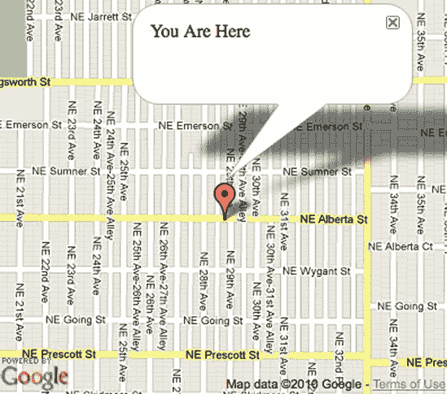

# 第七章。用户位置


创建一个基于位置网站需要一个起点。有时这个点来自您的数据库数据，或者来自您网站对一个小地理区域的关注。即使在这些情况下，了解用户的位置也能给您带来好处。

您可以通过多种方式检索这些信息，我将在本章中介绍。这些方法在复杂性和准确性方面有所不同。在某些情况下，您可能需要在 JavaScript 中做一个简单的调用。在其他情况下，您将安装一个数据库，以便您的服务器可以确定位置。

找到用户的位置也取决于您需要从他们那里获得多少权限。例如，IP 地址是每个互联网用户都有的东西。您可以在用户甚至不知道您在查找的情况下，为大多数用户找到城市级别的位置。对于浏览器访问其他数据源的方法，您将需要用户的权限。当然，在所有情况下，您都应该尽自己的一份力来确保用户隐私。

我们将从可能最简单的方法开始，确定用户的位置，这种方法与互联网本身一样历史悠久。

# #47: 询问用户他们在哪里

这看起来明显吗？询问用户他们在哪里可能不是确定他们位置的一种引人注目的方法，但这种方法肯定会产生用户期望的结果。此外，它具有内置的好处，即只具体到用户想要的程度。换句话说，用户可以提供一个完整的地址、邮政编码，或者只是一个城市名称。如果您依赖于知道用户的所在地，至少在您无法确定他们的位置时，将此项目作为备选方案。

当然，您想要的是纬度和经度坐标。我们的地图需要这些坐标，这也是大量地理数据存储的方式。我们无法直接请求纬度和经度（您可以尝试在您的朋友身上这样做，看看有多少人知道他们当前的地理编码）；相反，我们请求这些坐标的文本表示。一旦用户提供了这些信息，您可能需要将其输入到地理编码器中。本节不会涵盖这部分内容，但您可以在第三章中了解所有相关信息。在这个项目中，我将展示如何使用 JavaScript 和 PHP 将输入放入变量中。

## 使用 JavaScript 获取输入

当我们依赖 JavaScript 来接受输入时，您可以在不重新加载整个页面的情况下使用这些数据。此外，由于地图服务提供商与 JavaScript 一起工作，您只需要一种编程语言，这简化了一些事情。

为了接受用户输入，我们将把一个 HTML 表单集成到网站上。该表单将包含一个简单的文本输入框和一个提交按钮，如图图 7-1 所示。


图 7-1. 使用 JavaScript 请求位置或其他输入。

将以下代码添加到一个新的 HTML 页面中：

```
<!DOCTYPE html "-//W3C//DTD XHTML 1.0 Strict//EN"
 "http://www.w3.org/TR/xhtml1/DTD/xhtml1-strict.dtd">
  <html >
    <head>
      <title>Get Input from a Form with JavaScript</title>
      <script type="text/javascript">
        var f;
❶       function prepare() {
          f = document.getElementById("myform");
❷         f.onsubmit = function() {
            var userinput = ❸f.wheretext.value;
            // Do something with userinput
❹           return false; // avoids form submission
          };
        }
      </script>
    </head>
    <body onload="prepare()">
      <form id="myform">
        <input type="text" name="wheretext" />
        <input type="submit" name="butnew" value="Get Input" />
      </form>
    </body>
  </html>
```

当页面加载时，会调用 `prepare` 函数 ❶。这种方法与其他地图项目中的 `create_map` 函数类似。这个函数的名字可以是任何你想要的，只要它与你用来调用它的名字匹配即可。

首先，你需要将提交事件附加到表单 ❷。你想要阻止表单提交到服务器，而是使用 JavaScript 中的数据。在这个例子中，我使用了一个内联的匿名函数来提交表单，而不是命名函数。否则，`prepare` 函数将只有一行。

此外，我通过索引引用表单，在这个例子中，索引是零。这是页面上的第一个也是唯一一个表单。如果页面上有其他表单，它可能是第二个，其索引将是 1（因为 JavaScript 数组索引从零开始）。你也可以给表单一个名字或 ID，然后通过这种方式访问它。

要获取用户输入，我通过表单对象中的名称来引用文本输入字段 ❸。包含 `.value` 部分很重要，因为它可以检索用户输入的文本，而不是输入字段对象。一旦你有了文本，你可以决定如何使用它；例如，你可以在网站上显示它或使用 #12: 使用 JavaScript 进行地理编码 来确定其坐标 #12: 使用 JavaScript 进行地理编码。

提交函数的最后一行 ❹ 也同样重要。这一行阻止浏览器将表单的输入发送到服务器，这是我们 *希望* 在下一节发生的事情。

## 使用 PHP 获取输入

让我们明确一下：用户在浏览器中输入他们的输入。使用 JavaScript 获取输入和使用 PHP（或任何服务器端语言）之间的区别在于，我们允许数据提交到服务器。HTML 表单的原始目的是将数据发送到服务器端的脚本，然后以额外的 HTML 进行回复。

由于大部分显著的操作都在 PHP 脚本中完成，因此获取输入的 HTML 代码相当简单。将以下行添加到一个新的 HTML 文件中：

```
<!DOCTYPE html "-//W3C//DTD XHTML 1.0 Strict//EN"
 "http://www.w3.org/TR/xhtml1/DTD/xhtml1-strict.dtd">
<html >
  <head>
    <title>Get Input from a Form with PHP</title>
  </head>
  <body>
    <form ❶method="POST" ❷action="input.php">
      <input type="text" name="wheretext" />
      <input type="submit" name="butnew" value="Get Input" />
    </form>
  </body>
</html>
```

这段代码基本上与 JavaScript 示例中的 HTML 相同，但移除了 JavaScript。主要区别是 `<form>` 标签接收了几个额外的属性。

我声明了一个方法 ❶，它告诉浏览器如何将输入发送到服务器。这里有两个主要选项：`GET`，它将输入作为查询字符串放在 URL 中。我选择了 `POST`，它将数据放在 HTTP 消息的主体中，这样用户就看不到它。

另一个重要的属性是表单的 action ❷。这个 action 是表单数据的目标 URL。如果省略了 action，则默认为当前页面。如果你从一个普通的 HTML 文件发送，这个结果肯定不是你想要的，因为服务器端语言将无法解析数据。在这种情况下，我使用了 PHP 文件，因为这就是我将如何读取输入的。

现在我们需要编写 PHP 代码，因此将以下代码添加到名为*input.php*的新文件中（或与你的 action 属性匹配）：

```
<?
 $userinput = $_POST["wheretext"];
 // Do something with userinput
?>
```

很简单，对吧？你只需要将输入框的名称传递给`$_POST`变量，它是一个关联数组。PHP 会做艰难的工作，解析头部文本和解码文本。

如果你打算在数据库中使用该值，请确保验证数据是好的。如果你期望邮政编码，请确保数据格式正确。如果你有一个地址，要注意地址中不属于地址的奇怪字符——分号就是其中之一。你不想成为 SQL 注入攻击的受害者，其中用户输入被用来创建有害的查询。

如果你打算在其他地方使用输入，比如在#13: 使用 HTTP 网络服务进行地理编码中，你可能会依赖它的安全性。但大多数时候，尽可能在你的端上做更多的工作，以确保数据完整性。

# #48: 使用 JavaScript 获取位置

许多网络浏览器现在可以比使用 IP 地址提供更精确的用户位置信息。使用坐标，你可以省去用户告诉你他们位置的需要，例如，可以自动搜索附近的地点。

万维网联盟，通常被称为 W3C，是一个致力于制定网络标准的组织。在这些示例中，我将使用 W3C 推荐的语法。无论使用台式机、笔记本电脑还是移动电话，你将使用的代码都是相同的。

那么，让我们开始吧。从你的 JavaScript 代码的任何地方，添加以下行：

```
navigator.geolocation.getCurrentPosition(foundLoc, noLoc);
```

这个函数开始地理位置过程。浏览器将请求用户的许可，以便与你共享他的或她的位置。当用户批准时，浏览器将调用一个回调函数，这是传递给`getCurrentPosition`的第一个参数。当无法确定位置或用户拒绝你的请求时，还有一个可用的第二个回调函数。

我自己想出了那些函数的名字，你可以使用任何你想要的名称。然而，无论你叫它们什么，你都需要编写这些函数，这样浏览器就有东西可以引用。如果你更喜欢匿名内联函数，你可以用它们来代替命名函数。

在你用于发出位置请求的同一文件中，让我们添加这两个函数：

```
function foundLoc(❶pos) {
    var lat = ❷pos.coords.latitude;
    var lon = pos.coords.longitude;
❸   alert('Found location: ' + lat + ', ' + lon);
  }
  function noLoc() {
❹   alert('Could not find location');
  }
```

第一个函数，当浏览器能够找到位置并且用户同意共享时会被调用，它接收一个位置对象 ❶。我们可以利用这个对象获取纬度 ❷、经度以及一些其他数据（关于这一点稍后详述）。一旦我们获取了这两个坐标，我们就会创建一个 JavaScript 警告框，显示位置 ❸。这个警告框并不特别有用，但我们现在只是证明它能够正常工作。

如果找不到位置（或者如果用户不想分享他的或她的位置），我们会创建一个 JavaScript 警告框，说明这一点 ❹。在一个完整的应用程序中，在这种情况下，您可能选择不采取任何行动。或者根据您网站的设计，您可以在无法确定位置时创建一个手动输入位置的选项。

在我们进行一些更有趣的操作之前，让我们谈谈一个普通的浏览器是如何访问您的位置的。

## 数据来自哪里？

位置数据的来源和准确性因来源而异。一款前沿的智能手机当然配备了全球定位卫星（GPS），因此如果这是数据来源，浏览器就能相当准确地知道您在哪里。那么在笔记本电脑或台式机上呢？

大多数计算机没有 GPS。相反，它们依赖 Wi-Fi 来找到您的位置。一些公司已经在全球最大的城市（以及一些小城市）周围开车，并“嗅探”无线互联网。每当他们发现信号时，他们就会将其唯一的 ID 添加到他们的数据库中，包括纬度和经度。

然后，当浏览器请求位置时，它会检测可用的 Wi-Fi。有了 ID，它会请求服务器回复坐标。您怀疑吗？在市区，这种方法在定位位置方面非常准确，因为有很多 Wi-Fi 接入点可用。此外，无线信号只应该传播几百英尺，所以对于大多数用途来说，它仍然相当准确。而且在很多情况下，Wi-Fi 比 GPS 更可靠，GPS 在室内获取信号比较困难。您可以在表 7-1 中看到不同方法的准确性。

表 7-1. 地理定位方法的准确性

| 方法 | 准确性 |
| --- | --- |
| GPS | 在几英尺范围内 |
| WiFi | 在一个街区范围内 |
| 蜂窝基站 | 在几英里范围内 |
| IP 地址 | ZIP 码或城市级别 |

当这两种选项都不可用时，您需要有一个后备计划。移动设备有时可以使用蜂窝基站三角测量。另一方面，标准网络浏览器始终有一个 IP 地址。是否使用后备计划取决于实现方式。

另一个随着使用的设备和浏览器实现位置代码的方式而变化的是，可用的附加数据。

## 我们可以获得哪些其他数据？

W3C 创建了一个可以在所有情况下工作的标准。正如您所看到的，可以使用多种数据源和设备来确定位置。特别是，移动电话可以提供一些有趣的数据。

之前，我描述了如何使用 JavaScript 获取位置坐标。这里有一些你可能能够访问的其他值：

+   获取位置的时间

+   位置的精度，以米为单位

+   位置的海拔高度

+   如果存在，海拔精度的米

+   速度，以米/秒为单位

+   航向，相对于真北的方向，以度为单位

并非每个设备都能提供所有这些信息。例如，如果用户在使用笔记本电脑，可能只有纬度和经度是可用的。然而，如果数据来自 GPS，你可能能够访问所有这些字段。

## 在地图上使用位置

现在你已经可以获取用户的位置，你可能想对它*做一些事情*。最简单的例子是将它用作新地图的中心。你还可以在那个位置添加一个标记。嘿，为什么不两者都做呢？

这个例子将与其他例子略有不同，因为地图将在我们知道有位置信息时才创建。因此，让我们从一个新的 HTML 文件开始，而不是基本地图。将以下行添加到你的新文件中：

```
<html>
    <head>
      <title>W3C Geolocation Map</title>

      <script type="text/javascript"
              src="http://maps.google.com/maps/api/js?sensor=false"></script>
      <script type="text/javascript" src="mxn.js?(googlev3)"></script>
      <style>
        div#mymap {
          width: 400px;
          height: 350px;
        }
      </style>
      <script type="text/javascript">
        navigator.geolocation.getCurrentPosition(❶create_map, ❷function() {});

        function create_map(❸pos) {
❹         var pt = new mxn.LatLonPoint(pos.coords.latitude, pos.coords.longitude);
          mapstraction = new mxn.Mapstraction('mymap', 'googlev3');
          mapstraction.setCenterAndZoom(pt, 15);
          var marker = new mxn.Marker(pt);
          marker.setInfoBubble('You Are Here');
          mapstraction.addMarker(marker);
❺         marker.openBubble();
        }
      </script>
    </head>
    <body>
      <div id="mymap"></div>
    </body>
  </html>
```

因为我们只想在拥有位置信息时调用`create_map`函数，所以在页面加载时不会调用任何东西。相反，`getCurrentPosition`的调用发生在裸 JavaScript 中，然后使用地图初始化函数作为回调❶。如果没有找到位置，我们不想做任何事情，因此我们创建了一个空的内联函数❷。将来，你可能想做一些事情，所以这留下了一个模板来提醒你这里可以放置某些内容。

当`create_map`函数被调用时，浏览器找到的位置❸会被传递给它。我们将首先使用这个位置，它是一个 W3C 格式的对象，将其转换为 Mapstraction 描述点的对象❹。然后，将地图居中并创建标记就像第一、第二章中展示的例子一样简单。

为了增加一些乐趣，我们给标记添加了一个消息框，上面写着“您在这里”。在将标记添加到地图后，我们会自动显示消息❺。当我在我家乡波特兰运行这个程序时，我得到了图 7-2 中所示的结果。

从这里，你可以在地图上绘制本地结果或使用找到的位置作为起点获取驾驶问题。

## 接收持续更新

如果你的应用程序将在移动设备上使用，那么用户的位置可能会随着他们的移动而改变。根据你对数据的处理方式，接收一个初始位置可能不够——你可能需要更新。

W3C 通过第二个函数来满足这一需求，以访问用户的位置。而不是使用`getCurrentPosition`，你可以使用以下这行代码：

```
var geoid = navigator.geolocation.watchPosition(foundLoc, noLoc);
```

作为参数传递的两个函数引用的使用方式与单个位置请求相同。这里的区别是，浏览器将定期调用您的函数，而无需代码执行另一个请求。频率由浏览器决定，可能是每分钟或更频繁。移动浏览器可能会更频繁地发送更新。



图 7-2. 在地图上绘制的位置坐标

您可以通过每隔一段时间调用单个请求来实现这一点。然而，浏览器可能会在每次请求时提示用户；`watchPosition`函数的权限将持续到用户重新加载页面。

如果您想停止跟踪用户的地理位置，可以使用此函数清除：

```
navigator.geolocation.clearWatch(geoid);
```

注意该函数接受一个参数。这个变量是`watchPosition`函数输出的标识符。为了停止监视，请将此标识符存储在变量中。

## 其他地理位置选项

在前几节中提到的两个函数接受一个尚未覆盖的第三个参数。您可以设置额外的选项，例如位置可以有多旧，以及您是否想要尽可能高的精度。

这里是一个包含选项的地理位置调用示例：

```
var locOptions = {
  enableHighAccuracy: true,
  timeout: 5000,
  maximumAge: 60000
}
navigator.geolocation.getCurrentPosition(foundLocation, noLocation, locOptions);
```

我创建了一个变量来保存位置选项，这些选项存储为 JavaScript 对象。选项可以按任何顺序输入，并且不必包含所有选项。在这种情况下，我使用了所有三个潜在选项。

首先，`enableHighAccuracy`是一个布尔值，期望的值是`true`或`false`。当设置为`true`时，浏览器将提供它能够提供的最准确的位置，即使这样做需要更多的时间（例如，锁定额外的 GPS 卫星）。在之前的例子中，我们没有使用选项参数，出于效率原因，高精度并未启用。

我们还可以使用`timeout`选项为位置查找设置一个时间限制。此选项以毫秒为单位设置。因为 1 秒钟有 1000 毫秒，所以示例显示了 5 秒的超时。

最后一个选项，`maximumAge`，为浏览器提供了发送缓存位置的指令。根据您的需求，您可能需要一个非常近的位置，或者您可能不太关心。就像超时一样，这个值以毫秒为单位传递。在这个例子中，我展示了`maximumAge`为 60,000 毫秒，即 1 分钟。

选项对象可以作为第三个参数传递给`getCurrentPosition`或`watchPosition`。如果您使用后者请求持续更新，则每次浏览器返回位置时都会跟随这些选项。

# #49：使用 Fire Eagle 获取位置

您可以通过多种方式检索用户的位置，其中一些方式可以提供非常精确的输出。许多询问并存储用户当前位置的服务也都可以使用。雅虎的 Fire Eagle 就是这些服务的经纪人。当您编写 Fire Eagle 应用程序时，您可以设置或接收用户的当前位置，只要用户给予权限，这个位置信息就会对所有其他 Fire Eagle 应用程序可用。

在这个项目中，我将展示如何使用 Fire Eagle 获取用户的位置。一旦用户批准了您的应用程序访问权限，您将能够随时获取用户的最新位置，即使他或她不在线。

当然，某些应用程序必须设置位置才能准确。还记得我提到的那些帮助用户分享位置网站吗？我们将让他们在 Fire Eagle 中设置位置，让我们深入探讨如何使用 Fire Eagle 来检索位置。我们编写的应用程序将使用 PHP，我在第九章（第九章）中对其进行了更深入的介绍。

### 注意

有许多其他用于分享位置的服务。当您阅读此内容时，可能还有更多。请参阅[`mapscripting.com/location-apis`](http://mapscripting.com/location-apis)中的列表和教程链接。

## 获取 Fire Eagle 基础知识

雅虎有一些工具可以使编写 Fire Eagle 应用程序变得容易得多。在您可以使用它们之前，您需要将应用程序注册到 Fire Eagle，这样您就可以获得使程序工作的代码。一个是 API 密钥，类似于其他服务使用的；另一个是“秘密代码”。如果您觉得有帮助，您可以将其视为加入一个秘密俱乐部。实际上，您只是在填写一个表格。

您需要一个雅虎账户。一旦您有了它，请转到此页面以注册您的应用程序：[`fireeagle.yahoo.net/developer/create`](https://fireeagle.yahoo.net/developer/create)。

不要担心完美。您稍后可以编辑此应用程序。此外，Fire Eagle 允许您注册多个应用程序，所以让这个成为您稍后编写的应用程序的彩排。

在创建您的应用程序时，Fire Eagle 有两个重要的设置需要注意。首先，您将使用**基于 Web 服务的认证**进行身份验证。接下来，您需要设置一个回调 URL。URL 可以命名为您想要的任何名称，但在这个简单的示例中，让我们使用**`callback.php`**。Fire Eagle 需要知道一个完整的 URL，所以您将插入类似[`yoursite.com/fireeagle/callback.php`](http://yoursite.com/fireeagle/callback.php)的内容。出于测试目的，您甚至可以使用您的本地机器而不是服务器。

一旦您注册了您的应用程序，Fire Eagle 将向您展示一些特殊的密钥，API 以及我之前提到的秘密代码。您可以通过访问此页面随时返回它们：[`fireeagle.yahoo.net/developer/manage`](http://fireeagle.yahoo.net/developer/manage)。

在您离开网站一段时间之前，还有最后一件事：您需要 API 工具包。Fire Eagle 为各种网络编程语言提供了预包装的代码，这使得编写应用程序变得容易得多。从以下页面下载 PHP 工具包：[`fireeagle.yahoo.net/developer/code/php`](http://fireeagle.yahoo.net/developer/code/php)。

您绝对需要从这个包中获取两个文件：*fireeagle.php* 和 *OAuth.php*。将这些文件存储在名为 *lib*（代表库）的目录中，因为我们很快就会访问它们。

## 验证用户

正如其中一个文件的名字所暗示的，Fire Eagle 使用 OAuth 来验证用户。如果您之前没有使用过 OAuth，它可能看起来有点奇怪，但我已经学会了欣赏它的简单性和安全性。

验证用户的过程是从向 Fire Eagle 请求一个 *令牌* 开始的。这个令牌实际上由两部分组成：*公开* 和 *私有*。我们将用户和公开令牌一起重定向到 Fire Eagle。然后，当用户批准我们访问时，我们可以使用公开和私有令牌一起向 Fire Eagle 证明我们是批准的应用程序。

让我们看看代码中的样子。创建一个名为 *authorize.php* 的新文件，并添加以下行：

```
<?
  require_once "lib/fireeagle.php";

  $key = "*`YOURKEY`*";
  $secret = "*`YOURSECRETCODE`*";

❶ $fe = new FireEagle($key, $secret);
❷ $response = $fe->getRequestToken();

  session_start();
  $oauth_token = $response["oauth_token"];
  $_SESSION['oauth_token'] = $oauth_token;
  $_SESSION['oauth_secret'] = $response["oauth_token_secret"];
❸ $_SESSION["signed_in"] = 0;

❹ header("Location: " . $fe->getAuthorizeURL($oauth_token));
  ?>
```

首先，我们使用密钥和密钥代码创建一个新的 Fire Eagle 对象❶。密钥和密钥代码与我所描述的令牌不同。密钥和密钥代码标识您的应用程序本身，并且永远不会改变。令牌对每个用户都是不同的。

使用我们创建的 Fire Eagle 对象，我们现在请求公开和私有令牌❷。我们将这些存储为会话变量，这是 PHP 在页面之间维护用户数据的方式。然后我们创建另一个会话变量，告诉我们用户尚未登录❸。

最后，使用公开令牌，我们将用户重定向到 Fire Eagle URL❹。这个页面是用户将批准我们的应用程序的地方。

## 回应召唤

一旦用户同意给我们访问权限，Fire Eagle 将重定向回我们的回调 URL。记住那些设置吗？当用户来到这个页面时，他或她很可能已经授权了我们的应用程序。

回调页面是用户正式登录的地方。您如何设置这取决于您正在创建的应用程序类型。例如，如果用户在数据库中存储了账户，您可能会在那里维护他们的 Fire Eagle 令牌。在这里，我们将简单地更新会话变量。

将以下代码添加到您的 *callback.php* 文件中：

```
<?
  require_once "lib/fireeagle.php";

  $key = "*`YOURKEY`*";
  $secret = "*`YOURSECRETCODE`*";

  session_start();
❶ $fe = new FireEagle($key, $secret,
                      $_SESSION["oauth_token"], $_SESSION["oauth_secret"]);
❷ $response = $fe->getAccessToken();

  $oauth_token = $response["oauth_token"];
  $_SESSION["oauth_token"] = $oauth_token;
  $_SESSION["oauth_secret"] = $response["oauth_token_secret"];
❸ $_SESSION["signed_in"] = 1;

❹ header("Location: getloc.php");
  ?>
```

我们再次使用 Yahoo!提供的 PHP 工具包创建一个 Fire Eagle 对象❶。这次我们包括了用户的公开和私有令牌，以及我们应用程序的密钥和密钥。记住，这些信息证明了我们是用户刚刚批准的同一应用程序。

如果所有这些密钥和令牌都让人困惑，请做好准备。还有一对即将到来。一旦用户批准了一个应用程序，就不需要公共和私有令牌了。相反，它们被*访问令牌*❷所取代。我们用新的会话变量覆盖之前的会话变量。而且因为用户现在已经成功登录，我们可以适当地设置那个会话变量❸。

这个过程可能看起来很繁琐，需要遵循以访问用户的位置，但请记住，这只需要发生一次。而且，所有这些步骤都是为了安全起见，这是用户所欣赏的。此外，这个回调页面将立即显示给用户。

最后一行将用户重定向到我们将用于检索其位置的页面❹。毕竟，这就是整个事情的核心所在。所以，让我们开始吧。

## 获取用户的位置

用户已经给了我们访问其位置的权利。我们甚至可以检查我们设置的会话变量来确保。现在，我们将检索用户的位置。

将以下代码添加到*getloc.php*文件中：

```
<?
  require_once "lib/fireeagle.php";

  $key = "*`YOURKEY`*";
  $secret = "*`YOURSECRETCODE`*";

  session_start();
❶ if ($_SESSION["signed_in"] == 1) {
    $fe = new FireEagle($key, $secret,
                        $_SESSION["oauth_token"], $_SESSION["oauth_secret"]);

❷   $loc = $fe->user();
❸   $toploc = $loc->user->best_guess;
❹   $lat = $toploc->latitude;
    $lon = $toploc->longitude;
    $datetime = date("M j, g:i A", strtotime(❺$toploc->located_at));
  }
  ?>
  <p>
❻ Your current location: <strong><?=$lat?>, <?=$lon?></strong>
  (as of <?=$datetime?>)
  </p>
```

代码的起始部分与其他页面类似，包括 PHP API 套件并声明我们的应用程序密钥和秘密代码。然后我们检查我们的会话变量以确保用户确实已经给了我们许可❶。如果已登录变量仍然是 0，我们可以重定向到认证页面，或者显示错误。

就像上一节一样，我们使用应用程序密钥和访问令牌创建一个 Fire Eagle 对象。因为我们相当确信我们现在可以访问用户的位置，所以我们向 Fire Eagle 请求位置对象❷。从那里，我们可以获取其对用户位置的最好猜测❸，这是用户愿意分享的最细粒度数据。

现在我们可以访问包括纬度❹和经度在内的几份数据。我们还可以了解用户分享该位置的时间有多久了❺。为了提高可读性，我使用了 PHP `date`函数来格式化时间戳。

最后，在 HTML 中，我们输出从 Fire Eagle 检索到的数据❻。当然，这只是一个例子，不是一个伟大的 Fire Eagle 应用程序。真正伟大的是您将编写的那个。对吧？

# #50：通过 IP 获取位置

互联网上的所有用户都可以用一个在至少一个在线会话中保持不变的数字来识别，这个数字是静态的——永远不会改变。这个数字，称为*IP 地址*，属于互联网服务提供商，他们通常拥有一个（或更多）类似的数字块。通过将这些数字与位置相关的数据库绑定，您通常可以确定用户所在的城市，如果不是邮政编码的话。

我将在本章演示其他项目，这些项目可以获取更细粒度的数据，确定用户的精确位置。但了解一个地理区域通常就足够做一些有趣的事情。此外，您可以通过使用 IP 地址来定位大多数用户，而且您不必请求他们的许可。

什么是 IP 地址？IP 地址是一系列四个数字，每个数字从一到三位。例如，它可能是 *208.54.34.3*。每个连接到互联网的计算机都有自己的 IP 地址，尽管有时一个地址会在局域网中共享。

对于这个项目，我们将查看两个基于用户 IP 地址提供地理坐标的服务。一个必须在服务器上使用，而另一个则通过 JavaScript 在浏览器中运行。你选择哪个取决于你如何使用这些数据。例如，如果你将结果存储到数据库中，你可能会想要使用服务器端版本。但如果你只是想将地图中心定位在用户的位置，JavaScript 版本就足够了。

## 使用 HostIP 网络服务

对于这个示例，我将使用 hostip.info API。许多网络服务提供基于 IP 的地理位置服务，包括一个名为 MaxMind 的商业服务。然而，我选择了 HostIP，因为它易于使用，并且数据库由一群开发者和用户维护。

我们将使用 PHP 调用 API，包括在第八章（Chapter 8）和第九章（Chapter 9）中描述的一些概念。我会尽力使它们易于理解，但如果你发现某些内容看起来很奇怪，你可能需要提前翻阅。

在我们开始编写 PHP 代码之前，我们需要了解如何从 HostIP 获取数据。幸运的是，该网站使得在浏览器中尝试 API 变得非常简单。尝试将以下 URL 加载到地址栏中：[`api.hostip.info/?ip=12.215.42.19`](http://api.hostip.info/?ip=12.215.42.19)。

你的结果应该看起来像这样：

```
<?xml version="1.0" encoding="ISO-8859-1"?>
<HostipLookupResultSet ... >
  <gml:description>This is the Hostip Lookup Service</gml:description>
  ...
  <gml:featureMember>
    <Hostip>
      <gml:name>Sugar Grove, IL</gml:name>
      <countryName>UNITED STATES</countryName>
      <countryAbbrev>US</countryAbbrev>
      <ipLocation>
        <gml:PointProperty>
          <gml:Point srsName="http://www.opengis.net/gml/srs/epsg.xml#4326">
            <gml:coordinates>`−88.4588,41.7696`</gml:coordinates>
          </gml:Point>
        </gml:PointProperty>
      </ipLocation>
    </Hostip>
  </gml:featureMember>
</HostipLookupResultSet>
```

在所有这些中间，以粗体显示的是我们想要的纬度和经度坐标（注意在这里经度在前）。获取这些数字意味着解析结果并提取数字。这个过程在 #52: 使用 XML 中有详细说明。让我们使用 PHP 将纬度和经度放入两个变量中。创建一个新文件并添加以下代码行：

```
<?
❶ $ipaddr = $_SERVER["REMOTE_ADDR"];
❷ $xmltxt = get_url("http://api.hostip.info/?ip=$ipaddr");
❸ $xmlobj = simplexml_load_string($xmltxt);
❹ $coords = $xmlobj->xpath("//coordinates");
❺ list($lon, $lat) = preg_split("/\,/", $coords[0]);

  // cUrl functions
❻ function get_url($url) {
   ...
  }
  ?>
```

在我们能够调用 HostIP 之前，我们需要确定用户的 IP。幸运的是，IP 通过服务器变量提供给 PHP，我们将它放入一个局部变量中 ❶。

尽管代码做了很多工作，但其余代码相对简洁，主要是因为它依赖于其他函数来完成繁重的工作。例如，我们通过一行调用加载 XML 文本 ❷，传递包含用户 IP 地址的 HostIP URL。为了将文本转换为可用的对象，我们调用`SimpleXML`解析函数 ❸，该函数将 XML 转换为对象。现在我们有一个易于访问的对象，我们使用`xpath`函数返回所有`<coordinates>`标签 ❹。我们只有一个，所以我们将其传递给字符串分割函数，将其插入到我们的两个变量中 ❺。

这些函数中的大多数依赖于内部 PHP，但其中之一 ❻ 是我自己编写的。你可以在 #61: 获取网页 中找到这个函数的完整内容。

## 使用 Google 的 ClientLocation JavaScript 对象

如果你不需要在服务器上获取用户的地理位置，如果你使用 Google 的 Ajax Loader，你可以轻松地获取它。这是加载 Google 的 JavaScript API 的另一种方式，包括 Maps 和 Search。即使没有加载特定的 API，`ClientLocation` 对象也是可用的，考虑到它提供的数据，这可以最小化开销。

与标准的 Google Maps API 一样，你需要在 HTML 文件的头部包含对 Google 的 JavaScript 的调用：

```
<script type="text/javascript" src="http://www.google.com/jsapi?key=
*`yourkey`*"></script>
```

然后，在你的 JavaScript 代码中的任何地方，你都可以访问 `google.loader.ClientLocation.latitude` 和 `google.loader.ClientLocation.longitude`（以及一些其他数据项，如城市名称）。

### 注意

在出版时，Ajax Loader 只支持 Google Maps 版本 2。要使用此示例，你需要一个 Google Maps API 密钥。你可以在 [`code.google.com/apis/ajax/documentation/`](http://code.google.com/apis/ajax/documentation/) 找到它，以及有关 Ajax Loader 的更新信息。

在地图上看到它总是更容易，所以让我们创建一个新的 Mapstraction 地图，使用 Google 作为映射提供者。我们将使用 Ajax loader 而不是标准的 Google Maps。将以下代码添加到一个新的 HTML 文件中：

```
<html>
    <head>
      <title>ClientLocation Map</title>
      <script type="text/javascript"
              src="http://www.google.com/jsapi?key=*`yourkeyhere`*"></script>
      <script type="text/javascript" src="mxn.js?(google)">
      <style>
        div#mymap {
          width: 400px;
          height: 350px;
        }
      </style>
      <script type="text/javascript">
❶       google.load("maps", "2");
        function create_map() {
❷         var pos = google.loader.ClientLocation;
❸         var pt = new mxn.LatLonPoint(pos.latitude, pos.longitude);
          mapstraction = new mxn.Mapstraction('mymap', 'google');
          mapstraction.setCenterAndZoom(pt, 10);
          var marker = new mxn.Marker(pt);
          marker.setInfoBubble('You Are Here');
          mapstraction.addMarker(marker);
          marker.openBubble();
        }
      </script>
    </head>
    <body onLoad="create_map()">
      <div id="mymap"></div>
    </body>
  </html>
```

JavaScript 的第一行代码告诉 Google Ajax Loader 加载 Maps API ❶。然后，一旦它以及页面的其余部分加载完成，就会调用 `create_map` 函数。

要访问位置，我们将 `ClientLocation` 对象复制到一个局部变量 ❷ 中，这使得访问它更加容易。然后我们使用新对象中的纬度和经度创建一个点 ❸。从那里开始，代码与之前的 JavaScript 示例非常相似，我们使用这个点作为地图的中心并创建一个标记。

# #51: 创建自己的 IP 数据库

如果你在公共场所摔倒，你会拒绝帮助吗？那么你可能也是那种想要托管自己的 *IP* 数据库，而不是依赖他人服务的人。当然，你可能只是那种关心性能或不想担心网络延迟的人。无论哪种情况，这个项目将帮助你通过自己的服务器使用 IP 定位用户。

数据从哪里来？我们将使用一个名为 IPInfoDB 的免费服务，该服务每月更新一个精简的 MySQL 数据库转储。在 [`ipinfodb.com/ip_database.php`](http://ipinfodb.com/ip_database.php) 下载最新的数据库。

你有几种数据库类型可供选择。在这个例子中，我们将使用包含单个表的较小、城市级别的数据库。该表应包含大约 140 万条记录，这将导致数据库文件略大于 100MB。（当你下载压缩版本时，文件将小得多。）

## 导入 IP 数据

现在你已经下载了 SQL 文件，你需要导入它。这个文件太大，无法使用 phpMyAdmin，所以你需要使用命令解释器，你通常可以通过服务器上的 `mysql` 命令访问它。

你可能可以向你的系统管理员寻求帮助，以便访问你的 MySQL 数据库的命令解释器。或者，如果你使用的是 MAMP，你可以在 MAMP 目录中运行 `Library/bin/mysql -u root -p`（密码也是 `root`）。在 WAMP 上，位置可能有所不同，但通常可以在 `C:\wamp\bin\mysql\mysql`*版本*`\bin\mysql` 找到。在两种情况下，你都需要通过命令行：终端（在 Mac 上）或 CMD（在 Windows 上）来访问解释器。

打开命令解释器并选择你的数据库，或者创建一个新的数据库（参见 第六十三部分：将位置存储到数据库中 在 自己安装 MySQL）。要开始导入数据的过程，请输入以下命令：

```
\. /path/to/ipdata.sql
```

确保包含你下载的 SQL 文件的完整路径。在导入过程中，你会看到类似这样的消息：

```
Query OK, 0 rows affected (0.00 sec)
Query OK, 0 rows affected (0.00 sec)
Query OK, 11068 rows affected (0.35 sec)
Records: 11068 Duplicates: 0 Warnings: 0
```

当消息结束时，你可以离开命令解释器并返回 phpMyAdmin，如果你愿意的话。现在我们已经添加了数据，让我们来访问它。

## 查找 IP 的位置

IP 数据库中有什么信息可用，以及它是如何存储的？从 phpMyAdmin 点击到你的数据库，然后到你刚刚导入的 `ip_group_city` 表。点击浏览选项卡，你将看到数据库中的前 30 条记录。

可用的有趣字段包括城市、纬度和经度。你还会看到存储为非常大的数字的 IP 地址本身，这与你习惯看到的点分隔版本不同。这种差异是因为你需要进行一些预处理，这使得查找过程更加高效。

当 IP 地址为 `A.B.C.D` 时，该数字可以表示为 `((A*256+B)*256+C)*256`。所以 *71.59.208.255* 会变成 *1195102208*。同样，*71.59.208.X* 块中的任何内容也会如此。注意公式中没有 D；这是因为 IP 地址以块的形式出现，所以该范围内的所有内容可能具有相同的地理位置。

将 IP 转换为数字的过程相当标准化。实际上，MySQL 有一个辅助函数，`INET_ATON`，这使得它变得非常简单。在 phpMyAdmin 中点击 SQL 选项卡，或者使用命令解释器，并添加以下查询：

```
SELECT * FROM ip_group_city
WHERE ip_start <= INET_ATON('*`71.59.208.255`*')
ORDER BY ip_start DESC LIMIT 1
```

记得将我使用的 IP 地址替换为你自己的。在这里，我请求了数据库中最近 IP 地址的所有字段。为了防止返回所有 1.4 百万条记录，我限制结果只返回一行——就是我想要的。

现在我们将把它连接到一个 PHP 脚本，这在 第六十五部分：从 PHP 使用 MySQL 中有介绍。
