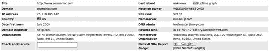

## 第三章 情报收集

情报收集是渗透测试的第二步，紧随预接触活动之后。在情报收集阶段，你的目标应该是获取关于目标对象的准确信息，同时不暴露你的存在或意图，了解组织的运作方式，并确定最佳进入途径。如果你没有做好情报收集的全面工作，可能会错过易受攻击的系统或可行的攻击向量。对网页进行筛选、执行谷歌黑客攻击以及彻底绘制系统图，以理解特定目标的架构，这需要时间和耐心。情报收集需要周密的计划、研究和，最重要的是，具备像攻击者一样思考的能力。在这一步，你将尝试收集尽可能多的关于目标环境的信息。这可能是一大堆信息，甚至在这个阶段收集到的最微不足道的数据也可能在以后变得有用，所以请务必注意。

在开始情报收集之前，考虑你将如何记录你所做的一切和所取得的结果。你必须记住并记录尽可能多的渗透测试细节。大多数安全专业人士很快就会意识到，详细的笔记可能意味着成功和失败的渗透测试之间的区别。就像科学家需要达到可重复的结果一样，其他经验丰富的渗透测试人员应该能够仅使用你的文档来重现你的工作。

情报收集可以说是渗透测试最重要的方面，因为它为所有后续工作提供了基础。在记录你的工作时，要条理清晰、准确、精确。并且，如前所述，在发动攻击之前，确保你已经了解了关于目标的所有信息。

对于大多数人来说，兴奋点在于利用系统和获取 root 权限，但你在跑之前需要学会走路。

* * *

### 警告

如果你遵循本章中的程序，实际上可能会损坏你的系统和目标系统，所以请确保现在就设置你的测试环境。（有关帮助，请参阅附录 A。）这些章节中的许多示例可能是破坏性的，并使目标系统无法使用。如果有人出于恶意目的执行本章讨论的活动，可能会被视为非法，所以请遵守规则，不要愚蠢行事。

* * *

## 被动情报收集

通过使用*被动*和*间接*的情报收集方法，你可以在不接触目标系统的情况下发现有关目标的信息。例如，你可以使用这些技术来识别网络边界、识别网络维护者，甚至了解目标网络上正在使用的操作系统和 Web 服务器软件。

*开源情报（OSINT）*是一种情报收集形式，它使用公开或易于获取的信息来查找、选择和获取有关目标的信息。一些工具使被动信息收集变得几乎无痛，包括像 Yeti 这样的复杂工具和简单的*whois*。在本节中，我们将探讨被动信息收集的过程以及你可能用于此步骤的工具。

例如，想象一下对[`www.secmaniac.net/`](http://www.secmaniac.net/)的攻击。我们的目标是确定，作为渗透测试的一部分，公司拥有哪些系统，我们可以攻击哪些系统。一些系统可能不属于公司，可能被视为范围之外且不可攻击。

### whois 查询

让我们从使用 Back|Track 的*whois*查询开始，以找到[secmaniac.net](http://secmaniac.net)的域名服务器名称。

```
msf > `whois secmaniac.net`
[*] exec: whois secmaniac.net

`. . . SNIP . . .`
Registered through: GoDaddy.com, Inc. (http://www.godaddy.com)
   Domain Name: SECMANIAC.NET
      Created on: 03-Feb-10
      Expires on: 03-Feb-12
      Last Updated on: 03-Feb-10

  Domain servers in listed order:
      NS57.DOMAINCONTROL.COM
      NS58.DOMAINCONTROL.COM
```

我们在中了解到，域名系统（DNS）服务器由*DOMAINCONTROL.COM*托管，因此这是一个很好的例子，说明在渗透测试中不会包含的系统，因为我们没有权限攻击它们。在大多数大型组织中，DNS 服务器位于公司内部，并且是可行的攻击向量。区域传输和类似的 DNS 攻击通常可以用来从内部和外部了解更多关于网络的信息。在这种情况下，因为*DOMAINCONTROL.COM*不属于[secmaniac.net](http://secmaniac.net)，所以我们不应该攻击这些系统，而将转向不同的攻击向量。

### Netcraft

Netcraft ([`searchdns.netcraft.com/`](http://searchdns.netcraft.com/))是一个基于网络的工具，我们可以用它来查找特定网站托管服务器的 IP 地址，如图 3-1 所示。

图 3-1. 使用 Netcraft 查找特定网站托管服务器的 IP 地址。

在将[secmaniac.net](http://secmaniac.net)的 IP 地址识别为 75.118.185.142 后，我们对该 IP 地址进行了另一个*whois*查询：

```
msf > `whois 75.118.185.142`
[*] exec: whois 75.118.185.142
WideOpenWest Finance LLC WIDEOPENWEST (NET-75-118-0-0-1)
                                  75.118.0.0 - 75.118.255.255
WIDEOPENWEST OHIO WOW-CL11-1-184-118-75 (NET-75-118-184-0-1)
                                  75.118.184.0 - 75.118.191.255
```

从*whois*查询和快速搜索中我们可以看到，这个 IP（*WIDEOPENWEST*）看起来是一个合法的服务提供商。虽然实际的子网范围并没有特别注册给[secmaniac.net](http://secmaniac.net)或[secmaniac.com](http://secmaniac.com)，但我们可以判断这个网站似乎是在作者的家中托管，因为 IP 块看起来是居民区的一部分。

### NSLookup

为了获取额外的服务器信息，我们将使用 Back|Track 利用内置在大多数操作系统中的`nslookup`工具来查找关于[secmaniac.net](http://secmaniac.net)的信息。

```
root@bt:˜# `nslookup`
`set type=mx`
> `secmaniac.net`
Server:         172.16.32.2
Address:        172.16.32.2#53

Non-authoritative answer:
secmaniac.net   mail exchanger = 10 mailstore1.secureserver.net.
secmaniac.net   mail exchanger = 0 smtp.secureserver.net.
```

从这个列表中我们可以看到，邮件服务器指向*mailstore1.secureserver.net*和*smtp.secureserver.net*。对这些邮件服务器的一些快速研究告诉我们，这个网站由第三方托管，这不会在我们的渗透测试范围内。

到目前为止，我们已经收集了一些可能后来用于攻击目标的有价值信息。然而，最终，我们必须求助于活动信息收集技术来确定实际的目标 IP 地址，即 75.118.185.142。

* * *

### 注意

被动信息收集是一种艺术，仅通过几页的讨论是无法轻易掌握的。请参阅*渗透测试执行标准（PTES；* [`www.pentest-standard.org/`](http://www.pentest-standard.org/))以获取执行额外被动情报收集的潜在方法列表。

* * *

## 活动信息收集

在活动信息收集过程中，我们直接与系统交互以了解更多信息。例如，我们可能会对目标进行端口扫描以查找开放的端口，或者进行扫描以确定正在运行的服务。我们发现的每个系统或运行中的服务都为我们提供了另一个利用的机会。但请注意：如果在活动信息收集时粗心大意，你可能会被入侵检测系统（IDS）或入侵预防系统（IPS）抓住——这对隐蔽渗透测试员来说不是好结果。

### 使用 Nmap 进行端口扫描

在使用被动信息收集识别了目标 IP 范围以及[secmaniac.net](http://secmaniac.net)的目标 IP 地址后，我们可以开始通过*端口扫描*来扫描目标上的开放端口，这是一个我们仔细连接到远程主机上的端口以识别那些活跃端口的流程。（显然，在一个更大的企业中，我们会遇到多个 IP 范围和攻击目标，而不仅仅是单个 IP。）

*Nmap*无疑是最受欢迎的端口扫描工具。它与 Metasploit 优雅地集成，将扫描输出存储在数据库后端以供以后使用。*Nmap*允许您扫描主机以识别每个主机上运行的服务，其中任何一个都可能提供进入的方式。

在这个例子中，让我们将[secmaniac.net](http://secmaniac.net)放在一边，转向附录 A 中描述的虚拟机，其 IP 地址为 172.16.32.131。在我们开始之前，快速查看一下基本*nmap*语法，通过在 Back|Track 机器的命令行中输入**`nmap`**。

你会立即发现*nmap*有很多选项，但大多数情况下你只会使用其中的一小部分。

我们偏爱的 *nmap* 选项之一是 `-sS`。这个选项运行一个隐蔽的 TCP 扫描，以确定特定的 TCP 端口是否开放。另一个偏爱的选项是 `-Pn`，它告诉 *nmap* 不要使用 `ping` 来确定系统是否运行；相反，它认为所有主机都是“活跃”的。如果你正在执行基于互联网的渗透测试，你应该使用这个标志，因为大多数网络不允许使用 `ping` 的 Internet 控制消息协议 (ICMP)。如果你在内部执行此扫描，你可能可以忽略这个标志。

现在，让我们使用 `-sS` 和 `-Pn` 标志快速对 Windows XP 机器进行 *nmap* 扫描。

```
root@bt:˜# `nmap -sS -Pn 172.16.32.131`
Nmap scan report for 172.16.32.131
Host is up (0.00057s latency).
Not shown: 990 closed ports
PORT     STATE SERVICE
21/tcp   open  ftp
25/tcp   open  smtp
80/tcp   open  http
135/tcp  open  msrpc
139/tcp  open  netbios-ssn
443/tcp  open  https
445/tcp  open  microsoft-ds
1025/tcp open  NFS-or-IIS
1433/tcp open  ms-sql-s
3389/tcp open  ms-term-serv
Nmap done: 1 IP address (1 host up) scanned in 14.34 seconds
```

如你所见，*nmap* 报告了一个开放端口的列表，以及每个相关服务的描述。

要获取更多详细信息，请尝试使用 `-A` 标志。此选项将尝试高级服务枚举和标语捕获，这可能为你提供有关目标系统的更多详细信息。例如，如果我们使用 `-sS` 和 `-A` 标志调用 *nmap*，使用我们相同的目标系统，我们会看到以下内容：

```
root@bt:˜# `nmap -Pn -sS -A 172.16.32.131`
Nmap scan report for 172.16.32.131
Host is up (0.0035s latency).
Not shown: 993 closed ports
PORT     STATE SERVICE      VERSION
135/tcp  open  msrpc        Microsoft Windows RPC
139/tcp  open  netbios-ssn
445/tcp  open  microsoft-ds Microsoft Windows XP microsoft-ds
777/tcp  open  unknown
1039/tcp open  unknown
1138/tcp open  msrpc        Microsoft Windows RPC
1433/tcp open  ms-sql-s     Microsoft SQL Server 2005 9.00.1399; RTM

`. . . SNIP . . .`

Device type: general purpose
Running: Microsoft Windows XP|2003
OS details: Microsoft Windows XP Professional SP2 or Windows Server 2003
Network Distance: 1 hop
Service Info: OS: Windows

Host script results:
|_nbstat: NetBIOS name: V-MAC-XP, NetBIOS user: <unknown>, NetBIOS MAC:
    00:0c:29:c9:38:4c (VMware)
|_smbv2-enabled: Server doesn't support SMBv2 protocol
| smb-os-discovery:

|   OS: Windows XP (Windows 2000 LAN Manager)
|   Name: WORKGROUP\V-MAC-XP
```

### 在 Metasploit 中使用数据库

当你运行一个具有许多目标的复杂渗透测试时，跟踪所有内容可能是一个挑战。幸运的是，Metasploit 提供了对多个数据库系统的广泛支持。

为了确保数据库支持适用于您的系统，您应该首先决定您想要运行哪种数据库系统。Metasploit 支持 MySQL 和 PostgreSQL；因为 PostgreSQL 是默认的，所以我们将在这次讨论中坚持使用它。

首先，我们使用内置的 Back|Track *init.d* 脚本启动数据库子系统。

```
root@bt˜# `/etc/init.d/postgresql-8.3 start`
```

在 PostgreSQL 启动后，我们告诉框架连接到数据库实例。此连接需要一个用户名、密码、数据库所在主机的名称以及我们想要使用的数据库名称。Back|Track 的默认 PostgreSQL 用户名是 *postgres*，密码是 *toor*，但我们将使用 *msfbook* 作为数据库名称。让我们建立连接。

```
msf > `db_connect postgres:toor@127.0.0.1/msfbook`
```

如果这是我们第一次连接到名为数据库的数据库，我们会看到大量的文本输出，因为 Metasploit 正在设置所有必要的表。否则，命令将返回到 `msfconsole` 提示符。

Metasploit 提供了我们可以用来与数据库交互的许多命令，正如你将在本书的整个过程中看到的那样。（要获取完整列表，请输入 **`help`**。）现在，我们将使用 `db_status` 来确保我们正确连接。

```
msf > `db_status`
[*] postgresql connected to msfbook
```

似乎一切设置得都很正常。

#### 将 Nmap 结果导入 Metasploit

当你与其他团队成员一起工作时，他们会在不同的时间和不同的地点进行扫描，了解如何单独运行 *nmap* 并将其结果导入框架很有帮助。接下来，我们将检查如何将基本的 *nmap*-生成的 XML 导出文件（使用 *nmap* 的 `-oX` 选项生成）导入框架。

首先，我们使用 `-oX` 选项扫描 Windows 虚拟机以生成 *Subnet1.xml* 文件：

```
`nmap -Pn -sS -A -oX Subnet1 192.168.1.0/24`
```

生成 XML 文件后，我们使用 `db_import` 命令将其导入我们的数据库。然后，我们可以通过使用 `db_hosts` 命令来验证导入是否成功，该命令列出了已创建的系统条目，如下所示：

```
msf > `db_connect postgres:toor@127.0.0.1/msf3`
msf > `db_import Subnet1.xml`
msf > `db_hosts -c address`

Hosts
=====

address

-------

192.168.1.1
192.168.1.10
192.168.1.101
192.168.1.102
192.168.1.109
192.168.1.116
192.168.1.142
192.168.1.152
192.168.1.154
192.168.1.171
192.168.1.155
192.168.1.174
192.168.1.180
192.168.1.181
192.168.1.2
192.168.1.99

msf >
```

这表明我们已经成功将我们的 *nmap* 扫描输出导入到 Metasploit 中，正如我们在运行 `db_hosts` 命令时填充的 IP 地址所证明的那样。

#### 高级 Nmap 扫描：TCP 空闲扫描

一种更高级的 *nmap* 扫描方法，*TCP 空闲扫描*，允许我们通过在网络中伪造另一个宿主的 IP 地址来秘密地扫描目标。为了使此类扫描工作，我们首先需要在网络中定位一个使用增量 IP IDs（用于跟踪数据包顺序）的空闲宿主。当我们发现一个使用增量 IP IDs 的空闲系统时，IP IDs 变得可预测，然后我们可以预测下一个 ID。然而，当我们扫描目标从开放端口收到的响应并伪造空闲宿主的地址时，我们可以看到 IP ID 序列的可预测性中断，这表明我们已经发现了一个开放端口。（要了解更多关于此模块和 IP ID 序列的信息，请访问 [`www.metasploit.com/modules/auxiliary/scanner/ip/ipidseq/`](http://www.metasploit.com/modules/auxiliary/scanner/ip/ipidseq/)。）

使用框架的 *scanner/ip/ipidseq* 模块来扫描符合 TCP 空闲扫描要求的宿主，如下所示：

```
msf > `use auxiliary/scanner/ip/ipidseq`
 msf auxiliary(ipidseq) > `show options`

 Module options:

    Name       Current Setting  Required  Description
    ----       ---------------  --------  -----------
    GWHOST                      no        The gateway IP address
    INTERFACE                   no        The name of the interface
    LHOST                       no        The local IP address
   RHOSTS
                      yes       The target address range or CIDR identifier
    RPORT      80               yes       The target port
    SNAPLEN    65535            yes       The number of bytes to capture
   THREADS    1                yes       The number of concurrent threads
    TIMEOUT    500              yes       The reply read timeout in milliseconds
```

此列表显示了 *ipidseq* 扫描所需的选项。其中一个值得注意的选项是 `RHOSTS` 在  处，它可以接受 IP 范围（例如 192.168.1.20–192.168.1.30）；无类域间路由（CIDR）范围（例如 192.168.1.0/24）；用逗号分隔的多个范围（例如 192.168.1.0/24, 192.168.3.0/24）；以及每行一个宿主的文本文件（例如 *file:/tmp/hostlist.txt*）。所有这些选项为我们提供了相当大的灵活性来指定我们的目标。

在  处设置的 `THREADS` 值用于在扫描时设置并发线程的数量。默认情况下，所有扫描模块的 `THREADS` 值最初都设置为 1。我们可以提高此值以加快扫描速度或降低此值以减少网络流量。通常，在 Windows 上运行 Metasploit 时，不应将 `THREADS` 值设置大于 16，在类 UNIX 操作系统上不应大于 128。

现在让我们设置我们的值并运行模块。我们将 `RHOSTS` 的值设置为 192.168.1.0/24，将 `THREADS` 设置为 50，然后运行扫描。

```
msf auxiliary(ipidseq) > `set RHOSTS 192.168.1.0/24`
  RHOSTS => 192.168.1.0/24
  msf auxiliary(ipidseq) > `set THREADS 50`
  THREADS => 50
  msf auxiliary(ipidseq) > `run`

  [*] 192.168.1.1's IPID sequence class: All zeros
  [*] 192.168.1.10's IPID sequence class: Incremental!
  [*] Scanned 030 of 256 hosts (011% complete)
  [*] 192.168.1.116's IPID sequence class: All zeros
 [*] 192.168.1.109's IPID sequence class: Incremental!
  [*] Scanned 128 of 256 hosts (050% complete)
  [*] 192.168.1.154's IPID sequence class: Incremental!
  [*] 192.168.1.155's IPID sequence class: Incremental!
  [*] Scanned 155 of 256 hosts (060% complete)
  [*] 192.168.1.180's IPID sequence class: All zeros
  [*] 192.168.1.181's IPID sequence class: Incremental!
  [*] 192.168.1.185's IPID sequence class: All zeros
  [*] 192.168.1.184's IPID sequence class: Randomized
  [*] Scanned 232 of 256 hosts (090% complete)
  [*] Scanned 256 of 256 hosts (100% complete)
  [*] Auxiliary module execution completed
  msf auxiliary(ipidseq) >
```

根据我们的扫描结果，我们看到有多个潜在的空闲宿主，我们可以使用它们来执行空闲扫描。我们将尝试使用 `-sI` 命令行标志通过使用  中显示的系统 192.168.1.109 来扫描一个宿主：

```
msf auxiliary(ipidseq) > `nmap -PN -sI 192.168.1.109 192.168.1.155`
[*] exec: nmap -PN -sI 192.168.1.109 192.168.1.155

Idle scan using zombie 192.168.1.109 (192.168.1.109:80); Class: Incremental
Interesting ports on 192.168.1.155:
Not shown: 996 closed|filtered ports
PORT    STATE SERVICE
135/tcp open  msrpc
139/tcp open  netbios-ssn
445/tcp open  microsoft-ds
MAC Address: 00:0C:29:E4:59:7C (VMware)
Nmap done: 1 IP address (1 host up) scanned in 7.12 seconds
msf auxiliary(ipidseq) >
```

通过使用空闲宿主，我们能够在不向系统发送任何数据包的情况下发现目标系统上的多个开放端口。

#### 从 MSFconsole 运行 Nmap

现在我们已经对目标进行了高级枚举，让我们将*nmap*与 Metasploit 连接起来。为此，我们首先连接到*msfbook*数据库：

```
msf > `db_connect postgres:toor@127.0.0.1/msf3`
```

现在我们应该能够从*msfconsole*中输入`db_nmap`命令来运行*nmap*，并将其结果自动存储在我们的新数据库中。

* * *

### 注意

在这个例子中，我们只攻击一个系统，但您可以使用 CIDR 表示法指定 IP，甚至指定范围（例如，192.168.1.1/24 或 192.168.1.1–254）。

* * *

```
msf > `db_nmap -sS -A 172.16.32.131`

Warning: Traceroute does not support idle or connect scan, disabling...
Nmap scan report for 172.16.32.131
Host is up (0.00056s latency).
Not shown: 990 closed ports
PORT     STATE SERVICE       VERSION
21/tcp open  ftp           Microsoft ftpd
25/tcp   open  smtp          Microsoft ESMTP 6.0.2600.2180 
80/tcp   open  http          Microsoft IIS webserver 5.1
|_html-title:
135/tcp  open  msrpc         Microsoft Windows RPC
139/tcp  open  netbios-ssn
443/tcp  open  https?
445/tcp  open  microsoft-ds  Microsoft Windows XP microsoft-ds
1025/tcp open  msrpc         Microsoft Windows RPC
1433/tcp open  ms-sql-s      Microsoft SQL Server 2005 9.00.1399; RTM
3389/tcp open  microsoft-rdp Microsoft Terminal Service
MAC Address: 00:0C:29:EA:26:7C (VMware)
Device type: general purpose
Running: Microsoft Windows XP|2003 
OS details: Microsoft Windows XP Professional SP2 or Windows Server 2003
Network Distance: 1 hop
Service Info: Host: ihazsecurity; OS: Windows

Host script results:
|_nbstat: NetBIOS name: IHAZSECURITY, NetBIOS user:
 <unknown>, NetBIOS MAC: 00:0c:29:ea:26:7c
| smb-os-discovery:
|   OS: Windows XP (Windows 2000 LAN Manager)
|   Name: WORKGROUP\IHAZSECURITY
|_smbv2-enabled: Server doesn't support SMBv2 protocol

OS and Service detection performed. Please report any
 incorrect results at http://nmap.org/submit/.
Nmap done: 1 IP address (1 host up) scanned in 33.51 seconds
```

注意一系列开放的端口 ，软件版本 ，甚至对目标操作系统的预测 。

为了检查扫描结果是否存储在数据库中，我们运行`db_services`：

```
msf > `db_services`
Services
========

host            port   proto  name          state  info
----            ----   -----  ----          -----  ----
172.16.32.131   135    tcp   msrpc         open   Microsoft Windows RPC
172.16.32.131   139    tcp   netbios-ssn   open
172.16.32.131   445    tcp   microsoft-ds  open   Microsoft Windows XP microsoft-ds
172.16.32.131   777    tcp   unknown       open
172.16.32.131   1433   tcp   ms-sql-s      open   Microsoft
 SQL Server 2005 9.00.1399; RTM
```

我们正在开始构建目标及其暴露的端口，这些端口可能作为潜在的攻击向量。

### 使用 Metasploit 进行端口扫描

除了能够使用第三方扫描器外，Metasploit 在其辅助模块中集成了几个端口扫描器，这些扫描器可以直接与框架的大部分功能集成。在后面的章节中，我们将使用这些端口扫描器利用受损害的系统进行访问和攻击；这个过程通常被称为*pivoting*，它允许我们使用内部连接的系统将流量路由到原本无法访问的网络。

例如，假设您攻破了防火墙后面的系统，该防火墙使用网络地址转换（NAT）。NAT 防火墙后面的系统使用私有 IP 地址，您无法从互联网直接联系到这些地址。如果您使用 Metasploit 攻破 NAT 后面的系统，您可能能够使用该受损害的内部系统将流量（pivoting）传递到内部托管和基于私有 IP 地址的系统，以渗透防火墙后面的更远网络。

要查看框架提供的端口扫描工具列表，请输入以下内容：

```
msf > `search portscan`
```

让我们使用 Metasploit 的 SYN 端口扫描器对单个主机进行简单扫描。在下面的列表中，我们使用`use scanner/portscan/syn`，将`RHOSTS`设置为 192.168.1.155，将`THREADS`设置为 50，然后运行扫描。

```
msf > `use scanner/portscan/syn`
  msf auxiliary(syn) > `set RHOSTS 192.168.1.155`
  RHOSTS => 192.168.1.155
  msf auxiliary(syn) > `set THREADS 50`
  THREADS => 50
  msf auxiliary(syn) > `run`
 [*]  TCP OPEN 192.168.1.155:135
  [*]  TCP OPEN 192.168.1.155:139
  [*]  TCP OPEN 192.168.1.155:445
  [*] Scanned 1 of 1 hosts (100% complete)
  [*] Auxiliary module execution completed
  msf auxiliary(syn) >
```

从结果中，您可以看到上的 135、139 和 445 端口在 IP 地址 192.168.1.155 上开放，利用 Metasploit 中的*portscan syn*模块。

## 有针对性的扫描

在进行渗透测试时，寻找容易的胜利并不丢人。一种*有针对性的扫描*会寻找特定的操作系统、服务、程序版本或配置，这些已知可被利用并提供进入目标网络的便捷途径。例如，快速扫描目标网络以寻找 MS08-067 漏洞是很常见的，因为这个漏洞（仍然）非常普遍，它将比扫描整个目标网络寻找漏洞更快地为您提供 SYSTEM 访问权限。

### 服务器消息块扫描

Metasploit 可以扫描网络并尝试使用其 *smb_version* 模块识别 Microsoft Windows 的版本。

* * *

### 注意

如果你不太熟悉服务器消息块（SMB，一种常见的文件共享协议），在继续之前，请了解一下不同的协议及其用途。你需要了解基本端口信息，才能成功攻击一个系统。

* * *

我们运行模块，列出我们的选项，设置 `RHOSTS`，并开始扫描：

```
msf > `use scanner/smb/smb_version`
  msf auxiliary(smb_version) > `show options`

  Module options:

     Name     Current Setting  Required  Description
     ----     ---------------  --------  -----------
     RHOSTS                    yes       The target address range or CIDR identifier
     THREADS  1                yes       The number of concurrent threads

  msf auxiliary(smb_version) > `set RHOSTS 192.168.1.155`
  RHOSTS => 192.168.1.155
  msf auxiliary(smb_version) > `run`

 [*] 192.168.1.155 is running Windows XP Service Pack 2 (language: English)
      (name:DOOKIE-FA154354) (domain:WORKGROUP)
  [*] Scanned 1 of 1 hosts (100% complete)
  [*] Auxiliary module execution completed
```

正如你在  中可以看到，`smb_version` 扫描器已精确识别操作系统为 Windows XP with Service Pack 2。因为我们只扫描一个系统，所以我们保留 `THREADS` 设置为 1。如果我们扫描了多个系统，例如一个 C 类子网范围，我们可能会考虑使用 `set THREADS` *`number`* 选项来增加 `THREADS`。此扫描的结果存储在 Metasploit 数据库中，以供以后使用，并可以通过 `db_hosts` 命令访问。

```
msf auxiliary(smb_version) > `db_hosts -c address,os_flavor`

Hosts
=====

address        os_flavor   Svcs  Vulns  Workspace
-------        ---------   ----  -----  ---------
192.168.1.155  Windows XP  3     0      default
msf auxiliary(smb_version) >
```

我们发现了一个运行 Windows XP 的系统，而无需对整个网络进行全扫描。这是一种快速且悄无声息地定位可能在我们试图避免被发现时更易受攻击的主机的方法。

### 寻找配置不当的微软 SQL 服务器

配置不当的微软 SQL 服务器（MS SQL）安装通常为进入目标网络提供了一种初始方式。事实上，许多系统管理员甚至没有意识到他们在工作站上安装了 MS SQL 服务器，因为该服务是某些常见软件（如 Microsoft Visual Studio）的先决条件。这些安装通常是未使用的、未打补丁的，或者甚至从未配置过。

当 MS SQL 安装时，它默认监听 TCP 端口 1433 或一个随机的动态 TCP 端口。如果 MS SQL 在动态端口上监听，只需查询 UDP 端口 1434 以发现 MS SQL 正在监听的动态 TCP 端口。当然，Metasploit 有一个可以利用这个“特性”的模块：*mssql_ping*。

由于 *mssql_ping* 使用 UDP，它可能因为超时问题在整个子网中运行时相当慢。但在本地局域网中，将 `THREADS` 设置为 255 将大大加快扫描速度。当 Metasploit 发现 MS SQL 服务器时，它会显示从它们提取的所有详细信息，包括，也许最重要的是，服务器正在监听的 TCP 端口。

这是你可能运行的 *mssql_ping* 扫描的方式，包括启动扫描、列出和设置选项，以及结果。

```
msf > `use scanner/mssql/mssql_ping`
  msf auxiliary(mssql_ping) > `show options`

  Module options:

     Name       Current Setting  Required  Description
     ----       ---------------  --------  -----------
     PASSWORD                    no        The password for the specified username
     RHOSTS                      yes       The target address range or CIDR identifier
     THREADS    1                yes       The number of concurrent threads
     USERNAME   sa               no        The username to authenticate as
     WORKSPACE                   no        The name of the
 workspace to report data into

  msf auxiliary(mssql_ping) > `set RHOSTS 192.168.1.0/24`
  RHOSTS => 192.168.1.0/24
  msf auxiliary(mssql_ping) > `set THREADS 255`
  THREADS => 255
  msf auxiliary(mssql_ping) > `run`

 [*] SQL Server information for 192.168.1.155:
  [*]    ServerName      = V-XPSP2-BARE
 [*]    InstanceName    = SQLEXPRESS
  [*]    IsClustered     = No
 [*]    Version         = 10.0.1600.22
 [*]    tcp             = 1433
```

如你所见，扫描器不仅定位到一个 MS SQL 服务器在 ，而且还识别出实例名称在 ，SQL 服务器版本在 ，以及它正在监听的 TCP 端口号在 。想想看，这种针对 SQL 服务器的有针对性的扫描将节省多少时间，而不是在目标子网中的所有机器的所有端口上运行 *nmap* 来寻找难以捉摸的 TCP 端口。

### SSH 服务器扫描

如果在扫描过程中遇到运行 Secure Shell (SSH)的机器，你应该确定目标上运行的是哪个版本。SSH 是一个安全的协议，但各种实现中的漏洞已经被发现。你永远不知道何时可能会幸运地遇到一个尚未更新的旧机器。你可以使用 Framework 的*ssh_version*模块来确定目标服务器上运行的 SSH 版本。

```
msf > `use scanner/ssh/ssh_version`
msf auxiliary(ssh_version) > `set THREADS 50`
THREADS => 50
msf auxiliary(ssh_version) > `run`

[*] 192.168.1.1:22, SSH server version: SSH-2.0-dropbear_0.52
[*] Scanned 044 of 256 hosts (017% complete)
[*] 192.168.1.101:22, SSH server version: SSH-2.0-OpenSSH_5.1p1 Debian-3ubuntu1
[*] Scanned 100 of 256 hosts (039% complete)
[*] 192.168.1.153:22, SSH server version: SSH-2.0-OpenSSH_4.3p2 Debian-8ubuntu1
[*] 192.168.1.185:22, SSH server version: SSH-2.0-OpenSSH_4.3
```

这个输出告诉我们，几个不同的服务器正在以不同的补丁级别运行。如果，例如，我们想要攻击通过*ssh_version*扫描找到的特定版本的 OpenSSH，那么这些信息可能会非常有用。

### FTP 扫描

FTP 是一个复杂且不安全的协议。FTP 服务器通常是进入目标网络的 easiest way，你应该始终扫描、识别和指纹任何运行在目标上的 FTP 服务器。

接下来，我们使用 Framework 的*ftp_version*模块扫描我们的 XP 盒子上的 FTP 服务：

```
msf > `use scanner/ftp/ftp_version`
  msf auxiliary(ftp_version) > `show options`

  Module options:

     Name       Current Setting      Required  Description
     ----       ---------------      --------  -----------
     FTPPASS    mozilla@example.com  no        The password for the specified username
     FTPUSER    anonymous            no        The username to authenticate as
     RHOSTS                          yes       The target
 address range or CIDR identifier
     RPORT      21                   yes       The target port
     THREADS    1                    yes       The number of concurrent threads
     WORKSPACE                       no        The name of
 the workspace to report data into

  msf auxiliary(ftp_version) > `set RHOSTS 192.168.1.0/24`
  RHOSTS => 192.168.1.0/24
  msf auxiliary(ftp_version) > `set THREADS 255`
  THREADS => 255
  msf auxiliary(ftp_version) > `run`

 [*] 192.168.1.155:21 FTP Banner: Minftpd ready
```

扫描器在成功识别了一个 FTP 服务器。现在让我们看看这个 FTP 服务器是否允许使用 Framework 的*scanner/ftp/anonymous*模块进行匿名登录。

```
msf > `use auxiliary/scanner/ftp/anonymous`
  msf auxiliary(anonymous) > `set RHOSTS 192.168.1.0/24`
  RHOSTS => 192.168.1.0/24
  msf auxiliary(anonymous) > `set THREADS 50`
  THREADS => 50
  msf auxiliary(anonymous) > `run`

  [*] Scanned 045 of 256 hosts (017% complete)
 [*] 192.168.1.155:21 Anonymous READ/WRITE (220 Minftpd ready)
```

扫描器报告在中，匿名访问被允许，并且匿名用户对服务器具有读写访问权限；换句话说，我们有权访问远程系统，并能够上传或下载 FTP 服务器软件可以访问的任何文件。

### 简单网络管理协议扫描

简单网络管理协议（SNMP）通常用于网络设备，以报告有关带宽利用率、冲突率和其他信息。然而，一些操作系统也有 SNMP 服务器，可以提供有关 CPU 利用率、空闲内存和其他系统特定细节的信息。

对于系统管理员来说，便利性可能是渗透测试人员的金矿，可访问的 SNMP 服务器可以提供有关特定系统的大量信息，甚至可能使远程设备受到损害。例如，如果你可以获取 Cisco 路由器的读写 SNMP 社区字符串，你可以下载路由器的整个配置，修改它，并将其上传回路由器。

Metasploit Framework 包括一个内置的辅助模块，称为*scanner/snmp/snmp_enum*，专门用于 SNMP 扫描。在开始扫描之前，请记住，只读（RO）和读写（RW）社区字符串将在你能够从给定设备提取的信息类型中扮演重要角色。在配置了 SNMP 的基于 Windows 的设备上，你通常可以使用 RO 或 RW 社区字符串提取补丁级别、运行的服务、用户名、运行时间、路由和其他信息，这些信息可以在渗透测试期间使事情变得容易得多。（*社区字符串*基本上是用于查询设备以获取信息或将配置信息写入设备的密码。）

在猜出社区字符串后，SNMP 本身（取决于版本）可能允许从过度信息泄露到完全系统妥协的各种情况。SNMPv1 和 v2 是固有的有缺陷的协议。集成了加密和更好的检查机制的 SNMPv3 显著更安全。要访问交换机，你首先需要尝试找到其社区字符串。框架的 `use scanner/snmp/snmp_login` 模块将尝试一个单词列表针对一个或一系列 IP 地址。

```
msf > `use use scanner/snmp/snmp_login`
  msf auxiliary(snmp_login) > `set RHOSTS 192.168.1.0/24`
  RHOSTS => 192.168.1.0/24
  msf auxiliary(snmp_login) > `set THREADS 50`
  THREADS => 50
  msf auxiliary(snmp_login) > `run`

  [*] >> progress (192.168.1.0-192.168.1.255) 0/30208...
 [*] 192.168.1.2 'public' '`GSM7224` L2 Managed Gigabit Switch'
 [*] 192.168.1.2 'private' 'GSM7224 L2 Managed Gigabit Switch'
  [*] Auxiliary module execution completed
  msf auxiliary(snmp_login) >
```

从输出中快速搜索 *GSM7224* 可以告诉我们，该扫描器已找到 Netgear 交换机的公共  和私有  社区字符串。信不信由你，这个结果并不是为这本书准备的。这是该交换机的默认出厂设置。

在你的渗透测试生涯中，你将遇到许多令人瞠目结舌的情况，因为许多管理员只是将设备连接到网络，所有默认设置仍然保持原样。当你发现在一个大公司内这些设备可以从互联网访问时，情况甚至更加可怕。

## 编写自定义扫描器

许多应用程序和服务在 Metasploit 中缺少自定义模块。幸运的是，该框架具有许多在构建自定义扫描器时可能很有用的功能，包括提供对其所有漏洞类和方法的无限制访问，以及支持代理、安全套接字层（SSL）、报告和线程。在安全评估期间编写自己的扫描器非常有用，因为这样做将允许你快速在目标系统上定位到每个不良密码或未打补丁服务的实例。

Metasploit 框架的扫描器模块包括各种混合模块，例如 TCP、SMB 等的漏洞混合模块，以及内置在框架中的辅助 `scanner` 混合模块。"混合模块" 是具有预定义函数和调用的代码片段，这些函数和调用已经为您预先配置。`Auxiliary::Scanner` 混合模块重载了辅助 `run` 方法；在运行时通过 `run_host(ip)`、`run_range(range)` 或 `run_batch(batch)` 调用模块方法；然后处理 IP 地址。我们可以利用 `Auxiliary::Scanner` 来调用额外的内置 Metasploit 功能。

下面是一个简单的 TCP 扫描器的 Ruby 脚本，它将连接到默认端口 12345 的远程主机，连接后发送“HELLO SERVER”，接收服务器响应，并将其打印出来，同时打印服务器的 IP 地址。

```
#`Metasploit`
require 'msf/core'
class Metasploit3 < Msf::Auxiliary
      include Msf::Exploit::Remote::Tcp
      include Msf::Auxiliary::Scanner
        def initialize
                super(
                        'Name'           => 'My custom TCP scan',
                        'Version'        => '$Revision: 1 $',
                        'Description'    => 'My quick scanner',
                        'Author'         => 'Your name here',
                        'License'        => MSF_LICENSE
                )
                register_options(
                        [
                                Opt::RPORT(12345)
                        ], self.class)
        end

        def run_host(ip)
                connect()
              sock.puts('HELLO SERVER')
                data = sock.recv(1024)
              print_status("Received: #{data} from #{ip}")
                disconnect()
        end
end
```

这个简单的扫描器使用 `Msf::Exploit::Remote::Tcp`  混合来处理 TCP 网络连接，而 `Msf::Auxiliary::Scanner` 混合则公开了框架内扫描器所需的各项设置！[](../images/00004.gif)。这个扫描器配置为使用默认端口 12345！[](../images/00005.gif)，连接到服务器后，它会发送一条消息！[](../images/00006.gif)，接收来自服务器的回复，并将其连同服务器 IP 地址一起打印到屏幕上！[](../images/00007.gif)。

我们已经将这个自定义脚本保存在 *modules/auxiliary/scanner/* 目录下，命名为 *simple_tcp.rb*。在 Metasploit 中，保存位置很重要。例如，如果模块保存在 *modules/auxiliary/scanner/http/* 目录下，它将在模块列表中显示为 *scanner/http/simple_tcp*。

为了测试这个基本的扫描器，我们在端口 12345 上设置了一个 *netcat* 监听器，并将一个文本文件管道输入作为服务器响应。

```
root@bt:/# `echo "Hello Metasploit" > banner.txt`
root@bt:/# `nc -lvnp 12345 < banner.txt`
listening on [any] 12345...
```

接下来，我们加载 *msfconsole*，选择我们的扫描模块，设置其参数，然后运行它以查看它是否工作。

```
msf > `use auxiliary/scanner/simple_tcp`
msf auxiliary(simple_tcp) > `show options`

Module options:

   Name     Current Setting  Required  Description
   ----     ---------------  --------  -----------
   RHOSTS                    yes       The target address range or CIDR identifier
   RPORT    12345            yes       The target port
   THREADS  1                yes       The number of concurrent threads

msf auxiliary(simple_tcp) > `set RHOSTS 192.168.1.101`
RHOSTS => 192.168.1.101
msf auxiliary(simple_tcp) > `run`

[*] Received: Hello Metasploit from 192.168.1.101
[*] Scanned 1 of 1 hosts (100% complete)
[*] Auxiliary module execution completed
msf auxiliary(simple_tcp) >
```

虽然这只是一个简单的例子，但 Metasploit 框架提供的多功能性在需要快速在渗透测试过程中运行一些自定义代码时非常有帮助。希望这个简单的例子展示了框架和模块化代码的力量。但当然，你不必事事亲力亲为。

## 展望未来

在本章中，你学习了如何利用 Metasploit 框架进行情报收集，正如 PTES 中概述的那样。情报收集需要实践，并需要对组织运作方式和如何识别最佳潜在攻击向量有深入的理解。与任何事物一样，你应该在整个渗透测试生涯中不断调整和改进自己的方法。但请记住，这个阶段的主要焦点是了解你攻击的组织及其整体足迹。无论你的工作是在互联网上、内部网络、无线或有社交工程，情报收集的目标始终相同。

在下一章中，我们将继续到漏洞分析阶段的一个重要步骤：自动化漏洞扫描。在后面的章节中，我们将更深入地探讨如何创建自己的模块、漏洞利用和 Meterpreter 脚本的示例。
