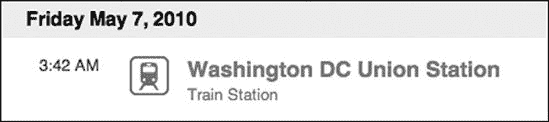

## 第九章。Metasploit 辅助模块

当大多数人想到 Metasploit 时，会想到漏洞利用。漏洞利用很酷，漏洞利用能让你获得 shell，漏洞利用吸引了所有的注意力。但有时你需要比这更多的东西。根据定义，Metasploit 中不是漏洞利用的模块是 *辅助模块*，这留下了很多想象空间。

除了提供如端口扫描器和服务指纹识别器等有价值的侦察工具外，辅助模块如 *ssh_login* 可以尝试通过暴力破解整个目标网络登录已知的用户名和密码列表。辅助模块还包括各种协议模糊测试工具，如 *ftp_pre_post*、*http_get_uri_long*、*smtp_fuzzer*、*ssh_version_corrupt* 等。你可以在目标服务上启动这些模糊测试工具，希望找到可以利用的自己的漏洞。

只是因为辅助模块没有有效载荷，并不意味着你不会使用它们。但在我们深入探讨它们的多种用途之前，这里有一个概述，帮助你了解我们正在处理的内容。

```
 root@bt:/opt/framework3/msf3/modules/auxiliary# `ls -l`
  total 52
  drwxr-xr-x 23 root root 4096 Apr 10 03:22 admin
  drwxr-xr-x  4 root root 4096 Dec 14 03:25 client
  drwxr-xr-x 16 root root 4096 Jan  1 04:19 dos
  drwxr-xr-x  8 root root 4096 Dec 14 03:25 fuzzers
  drwxr-xr-x  3 root root 4096 May  2 15:38 gather
  drwxr-xr-x  4 root root 4096 Dec 14 03:25 pdf
  drwxr-xr-x 36 root root 4096 Apr 10 03:22 scanner
  drwxr-xr-x  5 root root 4096 May  2 15:38 server
  drwxr-xr-x  3 root root 4096 May  2 15:38 sniffer
  drwxr-xr-x  5 root root 4096 Dec 14 03:25 spoof
  drwxr-xr-x  4 root root 4096 Dec 14 03:25 sqli
  drwxr-xr-x  3 root root 4096 May  2 15:38 test
  drwxr-xr-x  3 root root 4096 May  2 15:38 voip
```

如你所见，模块安装在与 Framework 的 */modules/auxiliary* 目录  中，并且在该目录内按它们提供的功能进行排序。如果你想要创建自己的模块或编辑现有的模块以适应特定目的，你将在相应的目录中找到它们。例如，如果你需要开发一个模糊测试模块来寻找自己的漏洞，你将在 */fuzzers* 目录中找到一些预存的模块。

要列出 Metasploit 中所有可用的辅助模块，只需在 *msfconsole* 中发出 **`show auxiliary`** 命令 。如果你将前面的目录列表与 *msfconsole* 中显示的模块名称进行比较，你会注意到模块的命名取决于底层目录结构，如下所示。

```
 msf > `show auxiliary`

  Auxiliary
  =========

     Name                                  Rank       Description
     ----                                  ----       -----------
     admin/backupexec/dump                 normal
     Veritas Backup Exec Windows Remote
                                                        File Access
     admin/backupexec/registry             normal     Veritas
 Backup Exec Server Registry
                                                        Access
     admin/cisco/ios_http_auth_bypass      normal     Cisco IOS HTTP Unauthorized
                                                        Administrative Access
  `. . . SNIP . . .`

     fuzzers/ssh/ssh_version_corrupt       normal     SSH Version Corruption
     fuzzers/tds/tds_login_corrupt         normal     TDS Protocol
 Login Request Corruption
                                                        Fuzzer
     fuzzers/tds/tds_login_username        normal
    TDS Protocol Login Request Username
                                                        Fuzzer
     fuzzers/wifi/fuzz_beacon              normal     Wireless Beacon Frame Fuzzer
     fuzzers/wifi/fuzz_proberesp           normal
     Wireless Probe Response Frame Fuzzer
     gather/citrix_published_applications  normal     Citrix MetaFrame ICA Published
                                                        Applications Scanner
     gather/citrix_published_bruteforce    normal     Citrix MetaFrame ICA Published
                                                        Applications Bruteforcer
     gather/dns_enum                       normal     DNS Enumeration Module
     gather/search_email_collector         normal
     Search Engine Domain Email Address
                                                        Collector
     pdf/foxit/authbypass                  normal     Foxit
 Reader Authorization Bypass
     scanner/backdoor/energizer_duo_detect normal     Energizer DUO Trojan Scanner
     scanner/db2/db2_auth                  normal     DB2
 Authentication Brute Force Utility
     scanner/db2/db2_version               normal     DB2 Probe Utility
```

如你所见，在这个裁剪后的输出中，辅助模块按类别组织。你可以使用 DNS 枚举模块、Wi-Fi 模糊测试工具，甚至一个用于定位和滥用在 Energizer USB 电池充电器上包含的木马后门的模块。

使用辅助模块与在 Framework 中使用任何漏洞利用类似——只需发出 `use` 命令后跟模块名称。例如，要使用 *webdav_scanner* 模块（在 使用辅助模块 中探讨），你将运行 `use scanner/http/webdav_scanner`，如下所示。

* * *

### 注意

在辅助模块中，基本选项略有不同，有一个 `RHOSTS` 选项用于针对多台机器，以及一个 `THREADS` 值用于微调扫描速度。

* * *

```
 msf > `use scanner/http/webdav_scanner`
 msf auxiliary(webdav_scanner) > `info`

         Name: HTTP WebDAV Scanner
      Version: 9179
      License: Metasploit Framework License (BSD)
         Rank: Normal

  Provided by:
    et <et@metasploit.com>

  Basic options:
    Name     Current Setting  Required  Description
    ----     ---------------  --------  -----------
    Proxies                   no        Use a proxy chain

  RHOSTS                    yes       The target address range or CIDR identifier
    RPORT    80               yes       The target port
   THREADS  1                yes       The number of concurrent threads
    VHOST                     no        HTTP server virtual host

  Description:
    Detect webservers with WebDAV enabled

  msf auxiliary(webdav_scanner) >
```

在这里，我们发出`use`命令  来使用感兴趣的模块。然后，我们可以使用`info`命令  从系统中获取完整的信息，以及各种可用选项的列表。在选项中，我们看到唯一一个没有默认值的必需选项是`RHOSTS` ，它可以接受单个 IP 地址、列表、范围或 CIDR 表示法。

其他选项主要取决于所使用的辅助模块。例如，`THREADS` 选项允许在扫描过程中启动多个线程，这可以指数级地加快速度。

## 正在使用的辅助模块

辅助模块非常吸引人，因为它们可以用多种方式用于许多事情。如果你找不到完美的辅助模块，很容易修改一个来满足你的特定需求。

考虑一个常见的例子。比如说，你正在进行远程渗透测试，在扫描网络后，你识别出了一些 Web 服务器以及其他不多的事物。此时你的攻击面有限，你必须利用你所拥有的资源。你的辅助*scanner/http*模块现在将证明在寻找容易攻击的目标时极为有用。要搜索所有可用的 HTTP 扫描器，运行**`search scanner/http`**，如下所示。

```
msf auxiliary(webdav_scanner) > `search scanner/http`
  [*] Searching loaded modules for pattern 'scanner/http'...

  Auxiliary
  =========

     Name                                        Rank    Description
     ----                                        ----    -----------
     scanner/http/backup_file                    normal  HTTP Backup File Scanner
     scanner/http/blind_sql_query                normal
  HTTP Blind SQL Injection GET QUERY Scanner
     scanner/http/brute_dirs                     normal
 HTTP Directory Brute Force Scanner
     scanner/http/cert                           normal  HTTP SSL Certificate Checker
     scanner/http/copy_of_file                   normal  HTTP Copy File Scanner
     scanner/http/dir_listing                    normal
  HTTP Directory Listing Scanner
     scanner/http/dir_scanner                    normal  HTTP Directory Scanner
     scanner/http/dir_webdav_unicode_bypass      normal
  MS09-020 IIS6 WebDAV Unicode Auth Bypass
                                                           Directory Scanner
     scanner/http/enum_delicious                 normal
  Pull Del.icio.us Links (URLs) for a domain
     scanner/http/enum_wayback                   normal
  Pull Archive.org stored URLs for a domain
     scanner/http/error_sql_injection            normal
  HTTP Error Based SQL Injection Scanner
     scanner/http/file_same_name_dir             normal
  HTTP File Same Name Directory Scanner
     scanner/http/files_dir                      normal  HTTP Interesting File Scanner
     scanner/http/frontpage_login                normal
  FrontPage Server Extensions Login Utility
     scanner/http/http_login                     normal  HTTP Login Utility
     scanner/http/http_version                   normal  HTTP Version Detection
     scanner/http/lucky_punch                    normal
  HTTP Microsoft SQL Injection Table XSS
                                                           Infection
     scanner/http/ms09_020_webdav_unicode_bypass normal
  MS09-020 IIS6 WebDAV Unicode Auth Bypass
     scanner/http/options                        normal  HTTP Options Detection
     scanner/http/prev_dir_same_name_file        normal  HTTP
 Previous Directory File Scanner
     scanner/http/replace_ext                    normal  HTTP File Extension Scanner
   scanner/http/robots_txt
                     normal  HTTP Robots.txt Content Scanner
     scanner/http/soap_xml                       normal
  HTTP SOAP Verb/Noun Brute Force Scanner
     scanner/http/sqlmap                         normal  SQLMAP SQL
 Injection External Module
     scanner/http/ssl                            normal  HTTP
 SSL Certificate Information
     scanner/http/svn_scanner                    normal  HTTP Subversion Scanner
     scanner/http/tomcat_mgr_login               normal  Tomcat
 Application Manager Login Utility
     scanner/http/trace_axd                      normal  HTTP
 trace.axd Content Scanner
     scanner/http/verb_auth_bypass               normal  HTTP Verb
 Authentication Bypass Scanner
     scanner/http/vhost_scanner                  normal  HTTP Virtual
 Host Brute Force Scanner
     scanner/http/vmware_server_dir_trav         normal  VMware Server
 Directory Transversal
                                                           Vulnerability
     scanner/http/web_vulndb                     normal  HTTP Vuln scanner

   scanner/http/webdav_internal_ip
             normal  HTTP WebDAV Internal IP Scanner
     scanner/http/webdav_scanner                 normal  HTTP WebDAV Scanner
     scanner/http/webdav_website_content         normal  HTTP
 WebDAV Website Content Scanner
   scanner/http/writable
                       normal  HTTP Writable Path PUT/DELETE File Access
     scanner/http/xpath                          normal  HTTP Blind XPATH 1.0 Injector
```

这里有许多选项，所以让我们在那份列表中识别一些可能的候选者。请注意，有从各种服务器识别*robots.txt* 文件的选项，多种与 WebDAV 交互的方式，以及识别具有可写文件访问权限的服务器的工具，还有许多其他特殊用途的模块。

你可以立即看到一些可以用于后续探索的模块。Microsoft IIS 的旧版本在其 WebDAV 实现中存在一个漏洞，允许远程利用，因此你可以首先对你的目标运行扫描，希望找到启用了 WebDAV 的服务器，如下所示。

```
msf auxiliary(dir_webdav_unicode_bypass) > `use scanner/http/webdav_scanner`
  msf auxiliary(webdav_scanner) > `show options`

  Module options:

     Name     Current Setting  Required  Description
     ----     ---------------  --------  -----------
     Proxies                   no        Use a proxy chain
     RHOSTS                    yes       The target address range or CIDR identifier
     RPORT    80               yes       The target port
     THREADS  1                yes       The number of concurrent threads
     VHOST                     no        HTTP server virtual host

 msf auxiliary(webdav_scanner) >
 `set RHOSTS 192.168.1.242, 192.168.13.242.252,`
  `192.168.13.242.254, 192.168.4.116, 192.168.4.118, 192.168.4.122,`
  `192.168.13.242.251, 192.168.13.242.234, 192.168.8.67, 192.68.8.113,`
  `192.168.13.242.231, 192.168.13.242.249, 192.168.4.115, 192.168.8.66, 192.168.8.68,`
  `192.168.6.62`
  RHOSTS => 192.168.1.242, 192.168.13.242.252, 192.168.13.242.254, 192.168.4.116,
  192.168.4.118, 192.168.4.122, 192.168.13.242.251, 192.168.13.242.234, 192.168.8.67,
  192.168.6.113, 192.168.13.242.231, 192.168.13.242.249, 192.168.4.115, 192.168.8.66,
  192.168.8.68, 192.168.6.62
  msf auxiliary(webdav_scanner) > `run`

  [*] 192.168.1.242 (Microsoft-IIS/6.0) WebDAV disabled.
  [*] 192.168.13.242.252 (Apache/2.2.9 (Debian) proxy_html/3.0.0 mod_ssl/2.2.9
  OpenSSL/0.9.8g) WebDAV disabled.
  [*] Scanned 04 of 31 hosts (012% complete)
  [*] Scanned 07 of 31 hosts (022% complete)
  [*] 192.168.4.116 (Apache/2.2.3 (Red Hat)) WebDAV disabled.
  [*] Scanned 10 of 31 hosts (032% complete)
  [*] 192.168.4.122 (Apache/2.2.3 (Red Hat)) WebDAV disabled.
  [*] Scanned 13 of 31 hosts (041% complete)
  [*] 192.168.13.242.251 (Microsoft-IIS/6.0) WebDAV disabled.
  [*] 192.168.13.242.234 (Microsoft-IIS/6.0) WebDAV disabled.
  [*] Scanned 16 of 31 hosts (051% complete)
  [*] 192.168.8.67 (Microsoft-IIS/6.0) WebDAV disabled.
  [*] Scanned 19 of 31 hosts (061% complete)
 [*] 192.168.6.113 (Microsoft-IIS/5.0) has WEBDAV ENABLED
  [*] 192.168.13.242.231 (Microsoft-IIS/6.0) WebDAV disabled.
  [*] Scanned 22 of 31 hosts (070% complete)
  [*] 192.168.13.242.249 (Microsoft-IIS/6.0) WebDAV disabled.
  [*] Scanned 25 of 31 hosts (080% complete)
  [*] 192.168.4.115 (Microsoft-IIS/6.0) WebDAV disabled.
  [*] 192.168.8.66 (Microsoft-IIS/6.0) WebDAV disabled.
  [*] Scanned 28 of 31 hosts (090% complete)
  [*] 192.168.8.68 (Microsoft-IIS/6.0) WebDAV disabled.
  [*] Scanned 31 of 31 hosts (100% complete)
  [*] Auxiliary module execution completed
```

正如这个例子所示，在寻找 WebDAV 的过程中已经扫描了多个 HTTP 服务器，而只有一个恰好启用了 Web-DAV 。该模块迅速识别了一个特定的系统，你可以针对它发起进一步的攻击。

* * *

### 注意

辅助模块的功能远不止扫描。正如你将在第十四章中看到的那样，辅助模块经过一些修改后也可以作为 fuzzers 使用。还有一些针对 Wi-Fi（包括*dos/wifi/deauth*）的拒绝服务模块也可用，如果正确使用，可能会造成相当大的破坏。

* * *

## 辅助模块的解剖结构

让我们通过一个有趣的小例子来看看辅助模块的构成，这个例子目前不在 Metasploit 仓库中（因为它与渗透测试无关）。这个例子将展示将大量编程工作卸载到框架中是多么容易，这样我们就可以专注于模块的具体细节。

Chris Gates 为框架编写了一个辅助模块，让他的 Twitter 粉丝误以为他发明了一种能够以光速旅行的设备。这是 Metasploit 中可重用代码的一个很好的例子。（您可以在[`carnal0wnage.googlecode.com/`](http://carnal0wnage.googlecode.com/)找到脚本的源代码。）

```
 root@bt:/opt/framework3/msf3# `cd modules/auxiliary/admin/`
  root@bt:/opt/framework3/msf3/modules/auxiliary/admin# wget
 `http://carnal0wnage.googlecode .com/svn/trunk/`
`msf3/modules/auxiliary/admin/random/foursquare.rb`
```

我们将模块放置在我们的辅助目录  中，以便它可供 Metasploit 使用。但在我们使用此模块之前，让我们看看实际的脚本，并分解组件，这样我们就可以确切地看到模块包含什么。

```
require 'msf/core'

 class Metasploit3 < Msf::Auxiliary

      # Exploit mixins should be called first
     include Msf::Exploit::Remote::HttpClient
      include Msf::Auxiliary::Report
```

模块从导入辅助类  的前两行开始。接下来，它使 HTTP 客户端函数可用于脚本中使用 。

```
 def initialize
          super(
            'Name'         => 'Foursquare Location Poster',
              'Version       => '$Revision:$',
              'Description'  => 'F*ck with Foursquare, be
 anywhere you want to be by venue id',
              'Author'       => ['CG'],
              'License'      => MSF_LICENSE,
              'References'   =>
                  [
                      [ 'URL', 'http://groups.google.com/group/foursquare-api' ],
                      [ 'URL', 'http://www.mikekey.com/im-a-foursquare-cheater/'],
                  ]
          )
  #todo pass in geocoords instead of venueid, create a venueid, other tom foolery
          register_options(
              [
                Opt::RHOST('api.foursquare.com'),
                  OptString.new('VENUEID', [ true, 'foursquare
 venueid', '185675']), #Louvre                      Paris France
                  OptString.new('USERNAME', [ true, 'foursquare
 username', 'username']),
                  OptString.new('PASSWORD', [ true, 'foursquare
 password', 'password']),
              ], self.class)

  end
```

在初始化构造函数  中，我们定义了在执行`info`命令时通过 *msfconsole* 返回的大部分信息 。我们可以看到各种选项在哪里定义  以及它们是否是必需的。到目前为止，所有选项都很直接，它们的目的都很明确。然而，我们还没有看到任何实际执行的逻辑。接下来就是了。

```
def run

          begin
            user = datastore['USERNAME']
              pass = datastore['PASSWORD']
              venid = datastore['VENUEID']
              user_pass = Rex::Text.encode_base64(user + ":" + pass)
              decode = Rex::Text.decode_base64(user_pass)
              postrequest = "twitter=1\n" #add facebook=1 if you want facebook

              print_status("Base64 Encoded User/Pass: #{user_pass}") #debug
              print_status("Base64 Decoded User/Pass: #{decode}") #debug

            res = send_request_cgi({
                  'uri'     => "/v1/checkin?vid=#{venid}",
                  'version'    => "1.1",
                  'method'  => 'POST',
                  'data'   => postrequest,
                  'headers' =>
                      {
                          'Authorization' => "Basic #{user_pass}",
                          'Proxy-Connection' =>  "Keep-Alive",
                      }
              }, 25)
```

现在我们来到了脚本的真正逻辑——当在模块中调用`run`时会发生什么。最初，提供的选项被设置为局部变量名 ，同时定义了各种其他对象。然后通过调用从脚本中导入的`*send_request_cgi*`方法 （该方法是导入自`*lib/msf/core/exploit/http.rb*`并定义为“连接到服务器，创建请求，发送请求，读取响应。”）来创建一个对象。此方法接受各种参数，这些参数构成了对实际服务器的调用，如这里所示。

```
print_status("#{res}") #this outputs the entire response. We could probably do
                                    #without this but it's
 nice to see what's going on.
              end

rescue ::Rex::ConnectionRefused, ::Rex::HostUnreachable, ::Rex::ConnectionTimeout
          rescue ::Timeout::Error, ::Errno::EPIPE =>e
              puts e.message
      end
  end
```

创建此对象后，结果会被打印出来 。如果发生任何错误，存在逻辑来捕获任何错误 并向用户报告。所有这些逻辑都很简单，只是将各种参数插入到框架的现有函数中。这是一个框架强大功能的绝佳例子，因为它允许我们只关注实现目标所需的信息。没有必要重新实现任何标准功能，如错误处理、连接管理等。

让我们看看这个模块的实际应用。如果您不记得 Metasploit 目录结构中模块的完整路径，可以像这样搜索它。

```
 msf > `search foursquare`
  [*] Searching loaded modules for pattern 'foursquare'...

  Auxiliary
  =========

     Name              Rank    Description
     ----              ----    -----------
     admin/foursquare  normal  Foursquare Location Poster

 msf > use admin/foursquare
 msf auxiliary(foursquare) > info

         Name: Foursquare Location Poster
      Version: $Revision:$
      License: Metasploit Framework License (BSD)
         Rank: Normal

  Provided by:
    CG <cg@carnal0wnage.com>

  Basic options:
    Name      Current Setting     Required  Description
    ----      ---------------     --------  -----------
    PASSWORD  password            yes       foursquare password
    Proxies                       no        Use a proxy chain
    RHOST     api.foursquare.com  yes       The target address
    RPORT     80                  yes       The target port
    USERNAME  username            yes       foursquare username
    VENUEID   185675              yes       foursquare venueid
    VHOST                         no        HTTP server virtual host

  Description:
    F*ck with Foursquare, be anywhere you want to be by venue id

  References:
    http://groups.google.com/group/foursquare-api
    http://www.mikekey.com/im-a-foursquare-cheater/
```

在先前的例子中，我们搜索“foursquare” ![../images/00002.gif]，发出`use`命令 ![../images/00004.gif] 来选择辅助模块，并显示所选模块的信息 ![../images/00005.gif]。根据上述提供的选项，我们首先需要配置其中的一些。

```
 msf auxiliary(foursquare) > `set VENUEID 2584421`
  VENUEID => 2584421
  msf auxiliary(foursquare) > `set USERNAME msf@elwood.net`
  USERNAME => metasploit
  msf auxiliary(foursquare) > `set PASSWORD ilovemetasploit`
  PASSWORD => ilovemetasploit
 msf auxiliary(foursquare) > `run`
  [*] Base64 Encoded User/Pass: bXNmQGVsd29vZC5uZXQ6aWxvdmVtZXRhc3Bsb2l0
  [*] Base64 Decoded User/Pass: msf@elwood.net:ilovemetasploit
  [*] HTTP/1.1 200 OK
  Content-Type: text/xml; charset=utf-8
  Date: Sat, 08 May 2010 07:42:09 GMT
  Content-Length: 1400
  Server: nginx/0.7.64
  Connection: keep-alive

  <?xml version="1.0" encoding="UTF-8"?>
  <checkin><id>40299544</id><created>Sat,
 08 May 10 07:42:09 +0000</created><message>OK!
  We've got you @ Washington DC Union Station. This
 is your 1st checkin here!</message>
  <venue><id>2584421</id><name>Washington DC Union Station</name><primary
category><id>79283</
  id><fullpathname>Travel:Train Station</
fullpathname><nodename>Train Station</nodename>
  <iconurl>http://foursquare.com/img/categories/travel/
trainstation.png</iconurl></primary
  category><address>Union Station</address><city>Washington</city><state>DC</
state><geolat>
  38.89777986957695</geolat><geolong>-77.0060920715332
</geolong></venue><mayor><type>nochange
  </type><checkins>4</checkins><user><id>685446</id><firstname>
Ron</firstname><photo>http://
  playfoursquare.s3.amazonaws.com/userpix_thumbs/ELOW44Q
HXJFB4PWZ.jpg</photo><gender>male</
  gender></user><message>Ron is The Mayor
 of Washington DC Union Station.</message></mayor>
  <badges><badge><id>1</id><name>Newbie</name><icon>http://
foursquare.com/img/badge/newbie
  .png</icon><description>Congrats on your
 first check-in!</description></badge></badges>
  <scoring><score><points>1</
points><icon>http://foursquare.com/img/scoring/2.png</icon>
  <message>First stop tonight</message></score>
<score><points>5</points><icon>http://
  foursquare.com/img/scoring/1.png</icon>
<message>First time @ Washington DC Union Station!</
  message></score></scoring></checkin>
```

为了成功运行此模块，我们需要一组有效的 Foursquare 凭证来进行签到。我们首先通过一些谷歌搜索找到在线的 VenueID ![../images/00002.gif]，然后设置我们的 Foursquare 凭证 ![../images/00004.gif] 并运行模块。我们得到了一个成功的结果，Foursquare 服务确认了我们的签到并给我们五分 ![../images/00005.gif]。

在这种情况下，我们在 Foursquare 服务上提交了一个在华盛顿特区的联合车站“签到”的请求（见图 9-1）。

 图 9-1. 在联合车站成功签到

当我们检查 Foursquare 网站时，我们看到一个成功的结果。这类模块表明 Metasploit 允许我们实现几乎任何我们可以通过编程想象的事情。

## 展望未来

正如你所见，辅助模块可以有多种用途。Metasploit 框架提供的基础设施可以在很短的时间内产生大量工具。使用 Metasploit 的辅助模块，你可以扫描 IP 地址范围以确定哪些主机是活跃的，以及每个主机上运行着哪些服务。然后你可以利用这些信息来确定有漏洞的服务，例如在 WebDAV 示例中，或者甚至通过暴力破解在远程服务器上登录。

虽然你可以轻松创建自定义辅助模块，但不要低估框架中现有的辅助模块。这些模块可能是你需要的特定一次性工具。

辅助模块提供了一系列潜在的可选途径。对于一个 Web 应用程序，辅助模块提供了 40 多个额外的检查或攻击，你可以执行。在某些情况下，你可能想暴力破解 Web 服务器以查看哪些服务器正在列出目录。或者你可能想扫描 Web 服务器以查看它是否可以作为开放代理并将流量中继到互联网。无论你的需求如何，辅助模块都可以提供额外的枚举信息、攻击向量或漏洞。
