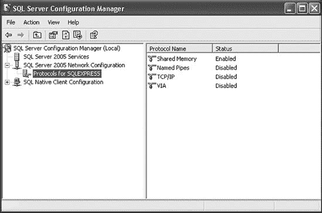
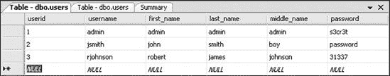

## 附录 A. 配置您的目标机器

学习使用 Metasploit 框架的最佳方式是通过实践——重复执行任务，直到您完全理解它是如何完成的。本附录解释了如何设置一个测试环境，以便与本书中的示例一起使用。

## 安装和设置系统

本书中的示例使用 Back|Track、Ubuntu 9.04、Metasploitable 和 Windows XP 的组合。Back|Track 作为我们的攻击工具，Ubuntu 和 Windows 系统是我们的目标系统。

首先创建一个未经修补的 Windows XP Service Pack 2 安装来测试本书中展示的示例。Back|Track 和 Ubuntu 9.04 虚拟机可以在运行任何 VMware 产品（包括 Workstation、Server、Player、Fusion 或 ESX）的 Windows、Mac OS X 或 Linux 主机上运行。

* * *

### 注意

请小心使用您的 Ubuntu 和 Windows XP 虚拟机，因为这些系统容易受到攻击，容易被利用。不要在这些机器上执行任何敏感操作：如果您能攻击它们，其他人也能。

* * *

如果您还没有 Windows 和 Linux 的免费 VMware Player，请下载并安装它。如果您使用的是 OS X，请下载免费 30 天试用版的 VMware Fusion。（如果您运行的是 Windows，您还可以使用免费的 VMware Server 版本。）

安装 VMware 后，双击 *.vmx* 文件以在 VMware 中使用，或者在 VMware Player 中通过选择 **文件** ▸ **打开** 并指向包含所有虚拟机和相关文件的文件夹来打开虚拟机文件。如果您是从 ISO 光盘镜像安装，创建一个新的虚拟机，并将此 ISO 文件指定为 CD-ROM 设备。

* * *

### 注意

通过搜索 Ubuntu 9.04，从 [`www.backtrack-linux.org/`](http://www.backtrack-linux.org/) 下载 Back|Track，从 [`www.vmware.com/appliances/directory/`](http://www.vmware.com/appliances/directory/) 下载 Ubuntu 9.04。Metasploitable 可以从 [`blog.metasploit.com/2010/05/introducing-metasploitable.html`](http://blog.metasploit.com/2010/05/introducing-metasploitable.html) 下载。

* * *

## 启动 Linux 虚拟机

在启动任一 Linux 虚拟机后，您需要登录。两个 Linux 环境的默认凭据是用户名 *root* 和密码 *toor*。

如果您的网络中没有 DHCP 服务器，请找到您系统的地址范围，并使用以下列表中的命令。确保您将 IP 地址替换为未使用的地址，并编辑您将使用的网络接口。有关手动网络设置的更多信息，请参阅 [`www.yolinux.com/TUTORIALS/LinuxTutorialNetworking.html`](http://www.yolinux.com/TUTORIALS/LinuxTutorialNetworking.html)。

```
root@bt:˜# `nano /etc/network/interfaces`
Password:
<inside the nano editor place your valid information into the system>
# The primary network interface
auto eth0 # the interface used
iface eth0 inet static # configure static IP address
      address 192.168.1.10 # your IP address you want
      netmask 255.255.255.0 # your subnet mask
      network 192.168.1.0 # your network address
      broadcast 192.168.0.255 # your broadcast address
      gateway 192.168.1.1 # your default gateway
<control-x>
<y>
```

配置完成后，您的 Linux 环境应准备好使用。不要更新 Ubuntu 安装，因为这个系统应该保持易受攻击状态。

## 设置易受攻击的 Windows XP 安装

为了运行本书中的示例，你需要在虚拟化平台（如 VMware）上安装 Windows XP 的授权副本。安装完成后，以管理员身份登录，打开控制面板，切换到经典视图，并选择**Windows 防火墙**。选择**关闭**并点击**确定**。（这看起来可能不太现实，但这种情况在你可能想象的大公司中比你想的更常见。）

接下来，打开自动更新并选择**关闭自动更新**；然后点击**确定**。你不想在尝试利用漏洞时让 Windows 修补漏洞。

现在通过网络连接控制面板配置你的安装，使用静态 IP 地址。虽然这不是必需的，但这样做将节省你每次启动漏洞利用时重新检查目标地址的时间。

### 在 Windows XP 上配置你的 Web 服务器

为了使事情更有趣并扩大攻击面，我们将启用一些额外的服务。

1.  在控制面板中，选择**添加或删除程序**，然后选择**添加/删除 Windows 组件**。你应该会看到**Windows 组件向导**。

1.  选择**互联网信息服务（IIS）**复选框并点击**详细信息**。然后选择**文件传输协议（FTP）服务**复选框并点击**确定**。方便的是，FTP 服务默认允许匿名连接。

1.  选择**管理和监控工具**复选框并点击**确定**。默认情况下，这将安装简单网络管理协议（SNMP）和 Windows 管理接口（WMI）SNMP 提供程序。

1.  点击**下一步**完成安装，并为了保险起见重新启动计算机。

这些步骤的组合添加了我们在本书中测试的不同服务。IIS 服务器将允许你运行网站，可以从[`www.secmaniac.com/files/nostarch1.zip`](http://www.secmaniac.com/files/nostarch1.zip)下载。FTP 服务将允许你对 Windows 系统执行基于 FTP 的攻击，而 SNMP 配置将允许你在 Metasploit 中测试辅助模块。

### 构建 SQL 服务器

Metasploit 和 Fast-Track 中的许多数据库模块针对 Microsoft SQL Server，因此你需要安装 SQL Server 2005 Express，可以从 Microsoft 免费获得。截至本书写作时，你可以在[`www.microsoft.com/`](http://www.microsoft.com/)找到 SQL Server Express 的非服务包版本。要安装 SQL Server Express，你需要安装 Windows Installer 3.1 和.NET Framework 2.0。你可以在本页上找到资源的链接，以及本书中引用的所有其他 URL，在[`www.secmaniac.com/files/nostarch1.zip`](http://www.secmaniac.com/files/nostarch1.zip)。

一旦安装了先决条件，运行 SQL Express 安装程序并选择所有默认设置，除了身份验证模式。选择**混合模式**，设置*sa*登录密码为*password1*，然后继续安装。

SQL Server 的基本安装完成后，您需要做一些更改，以便在您的网络上访问它：

1.  选择 **Start** ▸ **All Programs** ▸ **Microsoft SQL Server 2005** ▸ **Configuration Tools**，然后选择 **SQL Server Configuration Manager**。

1.  当配置管理器启动时，选择 **SQL Server 2005 Services**，右键单击 **SQL Server (SQLEXPRESS)** 并选择 **Stop**。

1.  展开 SQL Server 2005 网络配置管理器，并选择 **Protocols for SQLEXPRESS**，如图 图 A-1 所示。 图 A-1. Protocols for SQLEXPRESS

1.  双击 **TCP/IP**，在协议选项卡上，将 **Enabled** 设置为 **Yes**，将 **Listen All** 设置为 **No**。

1.  接下来，在 TCP/IP 属性对话框中，选择 IP Addresses 选项卡，并删除 IPAll 下的任何条目。在 IP1 和 IP2 下，删除 TCP Dynamic Ports 的值，并将每个的 **Active** 和 **Enabled** 设置为 **Yes**。

1.  最后，将 IP1 的 IP 地址设置为之前设置的静态 IP 地址，将 IP2 地址设置为 **127.0.0.1**，并将每个的 TCP 端口设置为 **1433**。您的设置应类似于 图 A-2 中所示的设置。设置完成后，点击 **OK**。

接下来，您需要启用 SQL Server 浏览器服务：

1.  选择 **SQL Server 2005 Services** 并双击 **SQL Server Browser**。

1.  在服务选项卡上，将 **Start Mode** 设置为 **Automatic**。

 图 A-2. 在 TCP/IP 属性对话框中设置 SQL Server IP 地址

默认情况下，SQL Server 在低权限的 Network Service 账户下运行，这是一个很好的默认设置。然而，对于我们现场发现的情况来说，这并不完全现实，并且管理员通常更改此设置而不是尝试解决权限问题。

在大多数目标系统上，我们发现 SQL Server 浏览器服务是以提升的 SYSTEM-based 账户运行的。大多数系统将 SQL Server 服务登录为 Local System，这是 Microsoft SQL Server（2000 及更早版本）的默认设置。因此，您应该通过双击 **SQL Server (SQLEXPRESS)** 并将 **Log on as** 设置为 **Local System** 来更改账户。完成设置后，点击 **OK**。然后右键单击 **SQL Server (SQLEXPRESS)** 并选择 **Start**。对 SQL Server 浏览器执行相同的操作。

最后，关闭配置管理器，通过打开命令提示符并运行 **`netstat -ano |find "1433"`** 和 **`netstat -ano |find "1434"`** 来验证一切是否正常工作。您之前配置的 IP 地址应该监听 TCP 端口 1433 和 UDP 端口 1434，如下所示：

```
Microsoft Windows XP [Version 5.1.2600]
© Copyright 1985-2001 Microsoft Corp.

C:\Documents and Settings\Administrator>`netstat -ano |find "1433"`
   TCP      127.0.0.1:1433          0.0.0.0:0   LISTENING   512
   TCP      192.168.1.155:1433      0.0.0.0:0   LISTENING   512
C:\Documents and Settings\Administrator>`netstat -ano |find "1434"`
   UDP      0.0.0:1434        *:*
C:\Documents and Settings\Administrator>
```

### 创建一个易受攻击的 Web 应用程序

要使用 Metasploit 和一些外部工具（如 Fast-Track 和 Social-Engineer Toolkit（SET））的一些更高级功能，您需要一个易受攻击的 Web 应用程序进行测试。要创建数据库和表，从[`www.nostarch.com/metasploit.htm`](http://www.nostarch.com/metasploit.htm)提供的链接下载并安装 SQL Server Management Studio Express。

安装完成后，进行健康重启，执行以下操作：

1.  通过选择**开始** ▸ **所有程序** ▸ **Microsoft SQL Server 2005** ▸ **SQL Server Management Studio Express**来启动应用程序。

1.  当提示输入凭据时，从身份验证下拉菜单中选择**SQL Server 身份验证**，并使用用户名*sa*和密码*password1*登录。

1.  在对象资源管理器中，右键单击**数据库**并选择**新建数据库**。

1.  在数据库名称处输入**WebApp**并点击**确定**。

1.  展开数据库和 WebApp 数据库树。

1.  右键单击**表**并选择**新建表**。将您的新表命名为*users*，列名和类型如图 A-3 所示。图 A-3. *users*表列

1.  保存*users*表，然后右键单击它并选择**打开表**。

1.  使用类似于图 A-4 中所示的一些示例数据填充表，然后保存您的作品。图 A-4. 填充的*users*表

1.  在对象资源管理器下展开安全树，然后展开登录。

1.  在用户属性窗口中右键单击**登录**并选择**新建登录**。在登录-新建窗口中，点击**搜索**，输入**ASPNET**，然后点击**检查名称**。完整的用户名应自动填充。点击**确定**退出用户搜索。

1.  最后，在用户属性窗口中，选择**用户映射**，选择**WebApp**旁边的复选框，选择**db_owner**角色成员，然后点击**确定**。

这样就完成了 Web 应用程序在 SQL 后端所需的所有配置。保存并退出管理工作室。

剩下的就是创建一个与您创建的数据库交互的网站。现在让我们来做这件事：

1.  从[`www.nostarch.com/metasploit.htm`](http://www.nostarch.com/metasploit.htm)下载易受攻击的 Web 应用程序，并将存档内容提取到*C:\Inetpub\wwwroot\*。

1.  打开您的浏览器并将指针指向*http://<youripaddress>/Default.aspx*。您应该看到一个登录表单，如图 A-5 所示。

1.  输入无效凭据以验证 SQL 查询是否被正确执行。为了测试一些基本的 SQL 注入以确定 Web 应用程序是否正常运行，在用户名字段中输入一个单引号（**`'`**），并将密码输入为任何内容（无关紧要）。应用程序应该显示一个包含与 SQL 相关的错误信息的黄色页面。

1.  点击浏览器上的后退箭头，在密码字段中输入 **OR 1=1--** 和一些（不重要）的内容。你应该会看到一个“您已成功登录”的消息。

如果你已经到达这里，那么一切设置都正确，你准备好深入研究了。

图 A-5. 示例攻击网站

### 更新 Back|Track

就像任何操作系统一样，确保你正在运行 Back|Track 及其工具的最新版本。在登录 Back|Track (*root*/*toor*) 时，输入以下命令：

```
root@bt:˜# `apt-get update && apt-get upgrade && apt-get dist-upgrade`
```

这一系列命令将选择 Back|Track 中所有可用的更新。在你通过输入 **`y`**（代表是）接受 SVN 证书提示后更新 Back|Track，你的系统仍然需要一些对 Metasploit、Fast-Track 和 SET 的微小更新。

```
 root@bt:˜# `cd /opt/framework3/msf3`/
 root@bt:/opt/framework3/msf3# `msfupdate`

  `. . . SNIP . . .`

  Updated to revision XXXX.
 root@bt:/opt/framework3/msf3# `cd /pentest/exploits/set/`
  root@bt:/pentest/exploits/set# `svn update`

  `. . . SNIP . . .`

  Updated to revision XXXX.
 root@bt:/pentest/exploits/set# `cd /pentest/exploits/fasttrack/`
  root@bt:/pentest/exploits/fasttrack# `svn update`

  `. . . SNIP . . .`

  At revision XXXX.
  root@bt:/pentest/exploits/fasttrack#
```

在 Back|Track 中，Metasploit 位于 */opt/framework3/msf3/* ，所以在通过 subversion 使用 **`msfupdate`**  更新 Framework 之前，请切换到该目录。

一旦 Metasploit 更新后，切换到 */pentest/exploits/set*`/`  并运行 **`svn update`**。最后，切换到 */pentest/exploits/fasttrack*`/`  并更新 Fast-Track。

现在你已经创建并更新了测试环境，你将在本书的示例中用到它。
