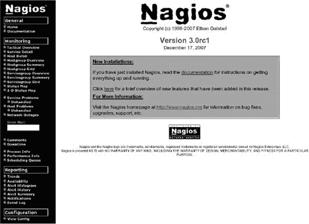
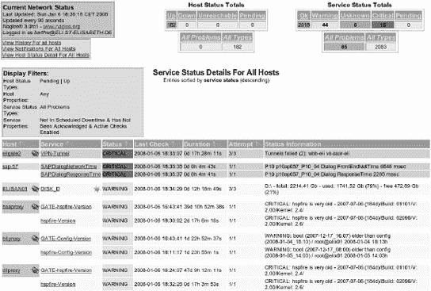
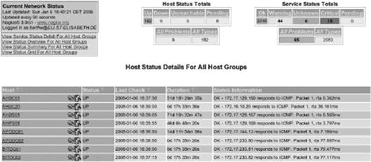
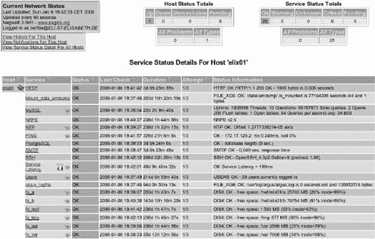

# 第一部分。从源代码到运行安装

# 第一章。安装

最简单的安装方法是安装您所使用发行版提供的 Nagios 软件包。Nagios 2.x 现在已经非常成熟，因此成为大多数发行版的一个组件。Linux 发行商维护的这些软件包中各个目录的路径通常与源软件包中指定的默认路径不同，因此也与本书中使用的路径不同。

Nagios 3.0 相对较新；在此建议您通过编译和安装软件来“亲自动手”。以下安装指南也适用于 Nagios 2.x，版本 2.x 和 3.0 之间的任何差异都会在文本中明确说明。

如果您编译自己的软件，您将控制目录结构和许多其他参数。以这种方式编译的 Nagios 系统也提供了一个几乎完整的主配置文件，其中最初不需要进行任何更改。但应指出，如果您自己编译 Nagios，可能会涉及对必要的开发包进行繁琐的搜索，具体取决于计算机上已经安装的内容。

# 1.1 准备工作

为了编译 Nagios 本身，您需要 **`gcc`**、**`make`**、**`autoconf`** 和 **`automake`**。所需的库是 **`libgd`**^([9]) 和 **`openssl`**^([10**)。这些库的开发包也必须安装（根据发行版的不同，可能以 **`-dev`** 或 **`-devel`** 结尾）：**`libssl-dev`**、**`libgd-dev`**、**`libc6-dev`**。

使用 Debian 和 Ubuntu，您可以通过使用 **`apt-get install`** 来安装软件包 **`apache2`**、**`build-essential`** 和 **`libgd2-dev`**。在 Open-SUSE 中，您可以通过 YAST2 安装 **`apache2`**，以及所有 C/C++ 开发库，以及软件包 **`gd`**。在 Fedora 中，您在命令行上运行 **`yum install`** 命令，并将软件包 **`httpd`**、**`gcc`**、**`glibc`**、**`glibc-common`**、**`gd`** 和 **`gd-devel`** 作为参数输入。

对于插件，建议您还安装以下软件包：**`ntpdate`**^([11])（可能包含在软件包 **`ntp`** 或 **`xntp`** 中），**`snmp`**，^([12**) **`smbclient`**^([13**)（可能是软件包 **`samba-client`** 的一个组件），**`libldap2`** 库，以及相关的开发包 **`libldap2-dev`**^([14**)（根据发行版的不同，适当的软件包也称为 **`openldap2-client`** 和 **`openldap2-devel`**）。您还需要安装用于数据库的客户端和开发包（例如，**`postgresql-client`** 和 **`postgresql-dev(el)`**）。

## 1.1.1 确定和设置所需的用户

在编译和安装之前，使用命令**`groupadd`**设置操作所需的组。使用**`groupadd`**设置**`nagios`**和**`nagcmd`**组，并使用**`useradd`**设置分配给这些组并使用其权限运行的**`nagios`**用户：

```
linux:~ # **groupadd -g 9000 nagios**
linux:~ # **groupadd -g 9001 nagcmd**
linux:~ # **useradd -u 9000 -g nagios -G nagcmd -d /usr/local/nagios** \
 **-c "Nagios Admin" nagios**
```

除了这里使用的用户（9000）和组 ID（9000 或 9001）之外，还可以使用任何其他可用的 ID。用户**`nagios`**的主要组**`nagios`**应仅为此用户保留。

Nagios 在运行 CGI 脚本时使用的是与 Apache Web 服务器运行权限相同的用户 ID。为了使此用户能够访问 Nagios 的某些受保护区域，需要一个额外的组，即所谓的*Nagios 命令组**`nagcmd`**。只有 Web 用户和用户**`nagios`**应属于此组。Web 用户可以从 Apache 配置文件中确定。在 Debian/Ubuntu 中，它位于**`/etc/apache2/apache2.conf`**；在 Fedora 中位于**`/etc/httpd/httpd.conf`**：

```
linux:~ # **grep "^User" /etc/apache2/apache2.conf**
User www-data
```

以这种方式确定的用户（在 Debian/Ubuntu 中为**`www-data`**，在 Open-SUSE 中为**`www-run`**，在 Fedora 中为**`httpd`**）还分配到**`nagcmd`**组，以下以 Debian/Ubuntu 为例：

```
linux:~ # **usermod -G nagcmd www-data**
```

在示例中，Web 用户被称为**`www-data`**。命令**`usermod`**（此命令更改现有用户账户的数据）也通过**`-G`**选项将 Web 用户包含在**`nagcmd`**组中，这是通过操作文件**`/etc/group`**中的相应条目实现的。

此外，指定为用户**`nagios`**主目录的目录**`/usr/local/nagios`**、配置目录**`/etc/nagios`**以及 Nagios 运行时记录变量数据的目录**`/var/nagios`**都是手动设置的，并分配给用户**`nagios`**和同名的组：

```
linux:~ # **mkdir /usr/local/nagios /etc/nagios /var/nagios**
linux:~ # **chown nagios.nagios /usr/local/nagios /etc/nagios /var/nagios**
```

* * *

^([9]) [`www.boutell.com/gd/`](http://www.boutell.com/gd/)

^([10]) [`www.openssl.org/`](http://www.openssl.org/) 根据发行版的不同，所需的 RPM 和 Debian 软件包有时有不同的名称。在这里，您需要参考相应发行版的搜索帮助。对于 Debian，主页将有所帮助。例如，如果**`configure`**指令抱怨缺少**`gd.h`**文件，您可以在[`www.debian.org/distrib/packages`](http://www.debian.org/distrib/packages)中专门搜索软件包的内容。搜索结果将显示包含文件**`gd.h`**的所有软件包。

^([11]) [`ntp.isc.org/bin/view/Main/SoftwareDownloads`](http://ntp.isc.org/bin/view/Main/SoftwareDownloads)

^([12]) [`net-snmp.sourceforge.net/`](http://net-snmp.sourceforge.net/)

^([13]) [`samba.org/samba/`](http://samba.org/samba/)

^([14]) [`www.openldap.org/`](http://www.openldap.org/)

# 1.2 编译源代码

Nagios 源代码可在项目页面上下载.^([15]) 下面的安装说明适用于版本 3.0，该版本由开发者以 tarball 形式提供。Nagios 2.x 的安装几乎以相同的方式进行：

```
linux:~ # **mkdir /usr/local/src**
linux:~ # **cd /usr/local/src**
linux:local/src # **tar xvzf** path/to/**nagios-3.0.tar.gz**
...
```

三个命令将源代码解压缩到为此目的创建的目录中，**`/usr/local/src`**。还创建了一个名为 **`nagios-3.0`** 的子目录，其中包含 Nagios 源代码。为了准备编译，在运行 **`configure`** 命令时输入偏离默认值的参数。表 1-1 列出了最重要的参数：

```
linux:~ # **cd /usr/local/src/nagios-3.0**
linux:src/nagios-3.0 # **./configure** \
 **--sysconfdir=/etc/nagios** \
 **--localstatedir=/var/nagios** \
 **--with-command-group=nagcmd**
...
```

这里选择的值确保安装程序选择书中使用的目录，并在生成主配置文件时设置所有参数正确。这大大简化了配置的微调。如果您想使用内置 Perl 解释器来加速 Perl 脚本的执行，那么您还需要两个开关 **`--with-perlcache`** 和 **`--enable-embedded-perl`**。

在 Nagios 3.0 中，您可以省略 **`--with-perlcache`**，因为它由 **`--enable-embedded-perl`** 自动启用。您可以在 附录 G，第 669 页找到更多关于内置 Perl 解释器的信息。

表 1-1. Nagios 的安装参数

| 属性 | 值 | 配置选项 |
| --- | --- | --- |
| 根目录 | **`/usr/local/nagios`** | **`--prefix`** |
| 配置目录 | **`/etc/nagios`** | **`--sysconfdir`** |
| 变量数据目录 | **`/var/nagios`** | **`--localstatedir`** |
| Nagios 用户（用户 ID） | **`nagios (9000)`** | **`--with-nagios-user`** |
| Nagios 组（组 ID） | **`nagios (9000)`** | **`--with-nagios-group`** |
| Nagios 命令组（组 ID） | **`nagcmd (9001)`** | **`--with-command-group`** |

**`If --prefix`** 未指定，Nagios 将自身安装在 **`/usr/local/nagios`** 目录下。我们建议您坚持使用此目录.^([16])

系统通常将其配置文件存储在其根目录下的 **`etc`** 目录中。通常，将这些文件存储在 **`/etc`** 层次结构中会更好。在这里，我们使用 **`/etc/nagios`**.^([17])

默认情况下，变量数据（如日志文件和状态文件）存储在 **`/usr/local/nagios/var`** 目录中。这位于 **`/usr`** 层次结构中，其中应只包含程序和其他只读文件，而不是可写文件。为了确保这一点，我们使用 **`/var/nagios`**.^([18])

不论这些变化如何，在大多数情况下，**`configure`** 并非第一次运行就毫无故障，因为总会有某个包缺失。对于像 **`libgd`** 这样的必需库，Nagios 几乎总是要求相关的开发者包，包括头文件（在这里，**`libgd-dev`** 或 **`libgd-devel`**）。根据发行版的不同，它们的名称将以 **`-devel`** 或 **`-dev`** 结尾。

在所有测试运行完毕后，**`configure`** 会显示所有重要的配置参数的摘要：

```
******* Configuration summary for nagios 3.0 *******:

General Options:
----------------
       Nagios executable:   nagios
       Nagios user/group:   nagios,nagios
      Command user/group:   nagios,nagcmd
           Embedded Perl:   yes, with caching
            Event Broker:   yes
       Install $prefix:   /usr/local/nagios
                 Lock file: /var/nagios/nagios.lock
 Check result  directory:   /var/nagios/spool/checkresults
         Init  directory:   /etc/init.d
Apache conf.d  directory:   /etc/apache2/conf.d
           Mail program:    /usr/bin/mail
                Host OS:    linux-gnu

Web Interface Options:
------------------
               HTML URL:    http://localhost/nagios/
                CGI URL:    http://localhost/nagios/cgi-bin/
Traceroute (used by WAP):   /usr/sbin/traceroute
```

在 Nagios 2.x 中，缺少 **`Check result directory`**、**`Apache conf.d directory`** 和 **`Mail program`** 这几行。

如果在 **`Embedded Perl`** 项后面写有 **`yes`**，则启用嵌入式 Perl 解释器。*事件代理* 提供了一个接口，用于加载作为附加模块的扩展，而系统正在运行.^([19])

如果你对结果满意，**`make`** 将开始实际的编译并安装软件:^([20])

```
linux:src/nagios-3.0 # **make all**
...
linux:src/nagios-3.0 # **make install**
...
linux:src/nagios-3.0 # **make install-init**
...
linux:src/nagios-3.0 # **make install-commandmode**
...
linux:src/nagios-3.0 # **make install-config**
...
```

命令 **`make all`** 编译所有相关程序，然后通过 **`make install`** 将它们以及 CGI 脚本和文档复制到相应的目录中。除了 **`/etc/nagios`** 和 **`/var/nagios`**，在 **`/usr/local/nagios`** 下还会创建其他目录，这些目录在 表 1-2 中进行了总结。

表 1-2. `/usr/local/nagios` 下的 Nagios 目录

| 目录 | 内容 |
| --- | --- |
| **`./bin`** | 可执行的 Nagios 主程序 |
| **`./libexec`** | 插件 |
| **`./sbin`** | CGI 脚本 |
| **`./share`** | 文档，Web 界面的 HTML 文件 |

命令 **`make install-commandmode`** 生成用于后续使用 *命令文件机制* 所需的目录（参见 13.1 外部命令的接口，第 292 页）。这一步是可选的，取决于预期用途，但由于稍后容易忘记，因此最好现在就采取预防措施。最后的 **`make install-config`** 创建示例配置，该配置将在 第二章 中使用，第 53 页。

* * *

^([15]) [`www.nagios.org/`](http://www.nagios.org/)

^([16]) 根据 *文件系统层次结构标准* FHS，版本 2.3，或管理员加载的本地程序应安装在 **`/usr/local`**

^([17]) 这与 FHS 2.3 并不完全兼容，FHS 2.3 更希望配置文件位于 **`/etc/local/nagios`**。

^([18]) 这也不完全符合 FHS 2.3 的要求。但由于 Nagios 在 spool、cache 和状态信息之间没有区别，因此以简单的方式实现 FHS-true 的复制是不可能的。

^([19]) 在印刷时，还没有任何外部扩展，这就是为什么事件代理目前只对开发者有吸引力。

^([20]) 从 Nagios 2.x 更新到 Nagios 3.0 时需要小心：这里你应该首先备份现有的配置，最初只运行 **`make all`**，并仔细阅读第 693 页的 H.13 从 Nagios 2.x 升级到 3.0。在 Nagios 3.0 中，**`make install-config`** 命令会覆盖现有文件！

# 1.3 自动启动 Nagios

命令 **`make install-init`** 为系统启动安装合适的初始化脚本。这里 **`make`** 会自动尝试检测正确的路径，对于大多数 Linux 发行版是 **`/etc/init.d`**。根据你的系统，这可能不正确，因此你应该检查它。为了使 Nagios 在系统启动时自动启动，会在 **`/etc/rc?.d`** 目录中创建符号链接。对于使用 System-V-Init 的 Debian 和 Ubuntu，内置的系统脚本 **`update-rc.d`** 执行此任务：

```
linux:~ # **update-rc.d nagios defaults 99**
```

此命令创建以 **`S99`** 为前缀的符号链接到目录 **`rc2.d`** 到 **`rc5.d`**，以便在切换到运行级别 2 到 5 时 Nagios 能够自动启动。此外，它还确保在目录 **`rc0.d`**、**`rc1.d`** 和 **`rc6.d`** 中的 **`K99`** 符号链接在系统关闭和重启以及切换到维护模式时负责停止 Nagios。这对应以下命令行命令：

```
linux:~ # **ln -s /etc/init.d/nagios /etc/rc2.d/S99nagios**
linux:~ # **ln -s /etc/init.d/nagios /etc/rc3.d/S99nagios**
linux:~ # **ln -s /etc/init.d/nagios /etc/rc4.d/S99nagios**
linux:~ # **ln -s /etc/init.d/nagios /etc/rc5.d/S99nagios**
linux:~ # **ln -s /etc/init.d/nagios /etc/rc0.d/K99nagios**
linux:~ # **ln -s /etc/init.d/nagios /etc/rc1.d/K99nagios**
linux:~ # **ln -s /etc/init.d/nagios /etc/rc6.d/K99nagios**
```

对于 OpenSUSE，所需的符号链接是通过脚本 **`insserv`** 创建的：

```
linux:~ # **insserv nagios**
```

Fedora 用户使用 **`chkconfig`** 执行此任务：

```
linux:~ # **chkconfig --add nagios**
linux:~ # **nagios on**
```

# 1.4 安装和测试插件

目前仍然缺少的是插件。它们必须从 [`www.nagios.org/`](http://www.nagios.org/) 独立下载并安装。作为独立程序，它们的版本控制系统与 Nagios 不同。在印刷时，当前版本是 1.4.11，但如果你不介意没有最新功能，也可以使用早期版本的插件。

## 1.4.1 安装

插件源代码的安装，就像 Nagios 一样，发生在目录 **`/usr/local`** 中：

```
linux:~ # **cd /usr/local/src**
linux:local/src # **tar xvzf** path /to/**nagios-plugins-1.4.tar.gz**
linux:src/nagios-plugins-1.4.11 # **./configure** \
 **--sysconfdir=/etc/nagios** \
 **--localstatedir=/var/nagios** \
 **--enable-perl-modules**
...
```

当运行**`configure`**命令时，您应该指定与服务器相同的非默认值，这里是指配置目录（**`/etc/nagios`**）和 Nagios 保存数据的目录（**`/var/nagios`**）。由于 Nagios 插件不是由与 Nagios 本身相同的人维护的，您应该始终提前检查，使用**`./configure --help`**，以确定 Nagios 和插件的**`configure`**选项是否真正匹配或有所偏差。

只有当您打算安装 Perl 模块**`Nagios::Plugin`**时，才需要**`--enable-perl-modules`**开关——例如，如果您正在使用它用 Perl 编写自己的插件。您可以在 24.2 The Perl Module Nagios::Plugin 中了解更多信息，第 560 页。

可能会在**`configure`**命令的输出中出现一系列**`WARNING`**警告，类似于以下内容：

```
...
configure: WARNING: Skipping radius plugin
configure: WARNING: install radius libs to compile this plugin (see
           REQUIREMENTS).
...
configure: WARNING: Tried /usr/bin/perl - install Net ::SNMP perl
           module if you want to use the perl snmp plugins
...
```

如果您不使用 Radius，您不必担心忽略相应的错误信息。否则，您应该安装缺失的包并重复**`configure`**过程。在这个例子中，经常需要的 SNMP 功能缺失了一个 Perl 模块。这个模块可以通过发行版包或通过在线 CPAN 存档安装：^([21])

```
linux:~ # **perl -MCPAN -e 'install Net::SNMP'**
...
```

如果您是第一次运行 CPAN 程序，它将交互式地引导您完成一个自解释的设置，您可以用默认选项回答几乎所有的问题。

在**`nagios-plugins-1.4.11`**目录中运行**`make`**将编译所有插件。之后，您有机会执行测试，使用**`make check`**。由于这些测试并没有被特别仔细地编程，您经常会看到许多错误信息，这些信息更多地与测试本身有关，而不是与插件有关。如果您仍然想尝试，那么还必须安装**`Cache`**Perl 模块。无论您是否使用**`make check`**，您都应该在安装后手动检查最重要的插件。

命令**`make install`**最终将插件固定在子目录**`libexec`**（在我们的例子中是**`/usr/local/nagios/libexec`**）。然而，并非所有插件都是通过此命令安装的。源目录**`contrib`**包含了一些**`make install`**不会自动安装的插件。

此目录中的大多数插件是 shell 或 Perl 脚本。在需要时，这些脚本会简单地复制到插件目录**`/usr/local/nagios/libexec`**。少数 C 程序首先必须编译，在某些情况下，这可能不是一件轻松的事情，因为可能缺少相应的 makefile，甚至缺少所需库的描述。如果简单的**`make`**不足以解决问题，就像在以下情况中：

```
linux:nagios-plugins-1.4.11/contrib # **make check_cluster2**[22]
cc     check_cluster2.c   -o check_cluster2
```

然后，最好在 **`nagiosplug-help`** 邮件列表中寻求帮助.^([23]) 编译后的程序也必须复制到插件目录中。

## 1.4.2 插件测试

因为插件是独立的程序，所以现在就可以手动用于测试目的——在 Nagios 安装完成之前。无论如何，你应该检查 **`check_icmp`** 插件，它起着至关重要的作用。它检查是否可以通过 **`ping`** 访问另一台计算机，并且是唯一既可以用作服务检查也可以用作主机检查的插件。如果它不能正常工作，Nagios 也无法正常工作，因为只要系统将主机分类为“down”，就无法执行任何服务检查。6.2 使用 Ping 进行可达性测试, 108，详细介绍了 **`check_icmp`**，这就是为什么这里只简要介绍其手动使用方法。

为了使插件能够正确运行，它必须像 **`/bin/ping`** 程序一样，以 **`root`** 用户身份运行。这是通过提供 *SUID 位* 来实现的。在当前插件版本中，**`make install`** 会自动设置这个位。一种可以观察到这一点的方式是，源代码中包含一个额外的目录，**`plugins-root`**。在较旧版本的插件中，你必须手动完成这项操作：

```
linux:~ # **chown root.nagios /usr/local/nagios/libexec/check_icmp**
linux:~ # **chmod 4711 /usr/local/nagios/libexec/check_icmp**
linux:~ # **ls -l /usr/local/nagios/libexec/check_icmp**
-rwsr-x--x 1 root nagios 61326 2005-02-08 19:49 check_icmp
```

使用 **`-h`** 选项可以提供插件的简要说明:^([24])

```
nagios@linux:~$ **/usr/local/nagios/libexec/check_icmp -h**
Usage: check_icmp [options] [-H] host1 host2 hostn

Where options are any combination of:
 ***** -H | --host        specify a target
 ***** -w | --warn        warning threshold (currently 200.000ms,40%)
 ***** -c | --crit        critical threshold (currently 500.000ms,80%)
 ***** -n | --packets     number of packets to send (currently 5)
 ***** -i | --interval    max packet interval (currently 80.000ms)
 ***** -I | --hostint     max target interval (currently 0.000ms)
 ***** -l | --ttl         TTL on outgoing packets (currently 0)
 ***** -t | --timeout     timeout value (seconds, currently 10)
 ***** -b | --bytes       icmp packet size (currenly ignored)
  -v | --verbose     verbosity++
  -h | --help        this cruft
The -H switch is optional. Naming a host (or several) to check is not.
```

对于简单的测试，指定一个 IP 地址就足够了（是否使用 **`-H`** 标志无关紧要）：

```
user@linux:~$ **cd /usr/local/nagios/libexec**
user@linux:nagios/libexec$ **./check_icmp -H 192.168.1.13**
OK - 192.168.1.13: rta 0.261ms, lost 0%|rta=0.261ms;200.000;500.000;0;
pl=0%;40;80;;
```

输出显示为单行，这里为了打印版本而进行了换行：在零百分比的数据包丢失（**`丢失 0%`**）的情况下，测试已经通过。Nagios 只使用输出行的前 300 个字节。如果插件提供了更多信息，这些信息将被截断。

如果你想测试其他插件，我们建议你参考第六章和第七章，它们详细介绍了最重要的插件。所有（合理编写的）插件都提供了带有 **`--help`** 选项的更详细的说明。

* * *

^([21]) [`www.cpan.org/`](http://www.cpan.org/) 的 *Comprehensive Perl Archive Network*

^([22]) 使用 **`check_cluster`**，可以监控集群的主机和服务的状态。在这里，通常希望在所有节点或冗余服务同时失败时收到通知。另一方面，如果某个特定服务失败，这不算是关键问题，只要集群中的其他主机提供这项服务即可。

^([23]) [`lists.sourceforge.net/lists/listinfo/nagiosplug-help`](http://lists.sourceforge.net/lists/listinfo/nagiosplug-help)

^([24]) 列出的选项在 6.2 使用 Ping 进行可达性测试中详细解释，从第 108 页开始。

# 1.5 配置 Web 界面

为了使 Nagios 的 Web 前端能够运行，Web 服务器必须知道 CGI 目录和主要 Web 目录。以下描述适用于 Apache 1.3、Apache 2.0 和 2.2。

## 1.5.1 设置 Apache

只要您没有通过**`configure`**脚本使用**`-with-cgiurl`**添加前端的不同地址，Nagios 就会期望在 URL**`/nagios/cgi-bin`**（实际目录：**`/usr/local/na-gios/sbin`**）以及**`/nagios`**以下的所有 HTML 文件（实际目录：**`/usr/local/nagios/share`**）中找到 CGI 程序。Nagios 3.0 包括用于 Web 界面的自己的**`make`**目标，它配置目录并设置两个 URL 的相应别名：

```
linux:~ # **make install-webconf**
...
```

此命令将文件**`nagios.conf`**安装到 Apache 的配置目录中。在 Debian/Ubuntu 和 OpenSUSE 中，它命名为**`/etc/apache2/`** **`conf.d`**，或在 Fedora 中为**`/etc/httpd/conf.d`**。它看起来是这样的：

```
ScriptAlias /nagios/cgi-bin "/usr/local/nagios/sbin"
<Directory "/usr/local/nagios/sbin">
  Options ExecCGI
  AllowOverride None
  Order allow,deny
  Allow from all
# Order deny,allow
# Deny from all
# Allow from 127.0.0.1
  AuthName "Nagios Access"
  AuthType Basic
  AuthUserFile /etc/nagios/htpasswd.users
Require valid-user
</Directory>
```

在 Nagios 2.x 版本中，您必须手动设置文件。

指令**`ScriptAlias`**确保当调用类似[`nagios-server/nagios/cgi-bin`](http://nagios-server/nagios/cgi-bin)的 URL 时，Apache 访问 Nagios CGI 目录，而不论 Apache CGI 目录可能位于何处。**`Options ExcecCGI`**确保 Web 服务器接受那里放置的所有脚本。**`Order`**和**`Allow`**最初允许 Web 服务器无限制地访问这里。如果您想限制访问，则改变**`Order`**参数的顺序：

```
Order deny, allow
Deny from all
Allow from 127.0.0.1
Allow from 192.0.2.0/24
```

此示例确保只有来自网络**`192.0.2.0/24 (/24`**代表子网掩码**`255.255.255.0`**)和**`localhost`**的客户端可以访问指定的目录。三个**`Auth*`**和**`Require`**指令确保了经过身份验证的访问；有关用户身份验证的更多信息，请参见 1.5.3 用户身份验证，第 49 页。

Nagios 文档目录**`/usr/local/nagios/share`**的设置方式类似：指令**`Alias`**允许通过 URL [`nagios-server/nagios`](http://nagios-server/nagios)访问目录，而不管 Apache-**`DocumentRoot`**位于何处。

指令**`Order`**和**`Allow`**（如果需要，还包括**`Deny`**）的设置方式与 CGI 部分相同。在文档领域，身份验证并非绝对必要，但如果您想在其中安装扩展，如 PNP，那么它肯定是有用的（参见 19.6 使用 PNP 进行平滑绘图，第 446 页）。

命令

```
linux:~ # **/etc/init.d/apache reload**
```

加载新的配置。如果一切正常，Nagios 主页面将在 Web 浏览器中的[`nagios-server/nagios`](http://nagios-server/nagios)下显示。

## 1.5.2 SELinux

只有少数发行版——特别是 Fedora——默认启用*安全增强型 Linux* (SELinux)。当启用并适当配置时，这允许诸如 Apache Web 服务器之类的服务仅访问明确提到的文件和目录。Nagios 使用的目录**`/usr/local/nagios/bin`**和**`/usr/local/nagios/share`**并不包含在内。结果是：SELinux 首先拒绝 Apache 访问，直到通过配置允许为止。命令**`getenforce`**显示*执行模式*是否开启，在这种模式下，SELinux 强制执行配置的访问权限的严格遵守。这可以通过命令关闭。

```
linux:~ # **setenforce 0**
```

要在下次系统启动时保持此状态，需要更改**`/etc/selinux/config`**中的设置。然而，与其关闭执行模式，不如更好地配置所需的访问权限。这确实需要一些了解 SELinux 如何工作的知识，以及一些通用的 Linux 经验——这些知识将超出本书的范围。对于那些想要更深入地掌握这个主题的人来说，可以在 Nagios 社区 Wiki 中找到更多信息，包括一个具体的指南链接^([25])。

## 1.5.3 用户身份验证

在交付时的状态中，Nagios 只允许经过身份验证的用户访问 CGI 目录。这意味着未“登录”的用户除了主页和文档外无法看到任何内容。他们被阻止访问其他功能。

有一个很好的理由：除了状态查询和其他显示功能外，Nagios 还有通过 Web 界面发送命令的能力。外部命令的接口用于此目的（13.1 外部命令接口, 第 292 页）。如果此功能激活，可以通过 Web 浏览器切换检查，例如，Nagios 甚至可以重新启动。只有授权用户应该能够这样做。此外，一般的考虑安全因素表明，Nagios 提供的大量信息应该只对可信赖的人开放。

首先，Nagios 的 CGI 配置文件**`cgi.cfg`**中的参数**`use_authenticationin`**必须设置为 1^([27])：

```
use_authentication=1
```

在安装过程中，这是默认设置。Apache 提供的最简单的身份验证形式是基于文件的**`Basic`**身份验证，这在配置文件中已经启用：

```
AuthName "Nagios Access"
AuthType Basic
AuthUserFile /etc/nagios/htpasswd.users
Require valid-user
```

**`AuthName`**是一个信息字段，当 Web 服务器请求身份验证时，浏览器会显示它。**`AuthType Basic`**表示简单身份验证，其中密码在没有加密的情况下传输，只要不使用 SSL 连接。最好将密码文件——这里指**`htpasswd.users`**——保存在 Nagios 配置目录**`/etc/nagios`**中。最后一个参数**`require valid-user`**意味着所有经过身份验证的用户都有访问权限（没有对特定组的限制；只需用户密码对有效即可）。

这里将指定（可自由选择的）密码文件名称，以便显示涉及哪种类型的密码文件。它由 Apache 中包含的**`htpasswd2`**程序生成。（在 Apache 1.3 和一些其他发行版中，该程序称为**`htpasswd`**。）运行

```
linux:/etc/nagios **# htpasswd2 -c htpasswd.users nagios**
New password: passwort
Re-type new password: passwort
Adding password for user nagios
```

为用户**`nagios`**生成一个新的密码文件。其格式相对简单：

```
nagios:7NlyfpdI2UZEs
```

每行包含一个用户密码对，由冒号分隔.^([28）如果您想添加其他用户，应确保省略**`-c`**（*创建*）选项。否则**`htpasswd(2)`**将重新创建文件并删除旧内容：

```
linux:/etc/nagios **# htpasswd2 htpasswd.users** another_user
```

用户名不能随意选择，而必须与联系人姓名匹配（参见 2.7 定义错误消息的收件人：联系人，第 70 页）。只有网络用户（根据您的发行版，可能是**`www-data`**、**`www-run`**或**`httpd`**，参见 1.1.1 确定和设置所需用户)可以访问生成的**`htpasswd.users`**文件，并且应该保护它不被其他人访问：

```
linux:/etc/nagios **# chown www-data htpasswd.users**
linux:/etc/nagios **# chmod 600 htpasswd**
```

结合其自身模块和第三方模块，Apache 允许一系列其他身份验证方法。这些包括通过 LDAP 目录、通过可插拔身份验证模块（PAM）^([29])或通过 Windows 服务器使用 SMB 进行身份验证。这里我们推荐您查阅相关文献和 Apache 主页上的高度详细文档.^([30）一个相当高级的例子，其中已经通过 Kerberos 认证的用户不需要再次进行认证，在附录 E 的第 637 页中描述。

尽管 Web 界面的配置现在已经完成，但此时只有文档被正确显示：Nagios 本身必须首先进行相应的调整——正如以下章节中详细描述的那样——然后才能用于监控以这种方式提供的数据。

* * *

^([25]) 在[`www.nagioscommunity.org/wiki/`](http://www.nagioscommunity.org/wiki/)搜索关键字**`SELinux`**。

^([26]) [`www.rickwargo.com/2006/10/29/fc6-selinux-and-nagios/`](http://www.rickwargo.com/2006/10/29/fc6-selinux-and-nagios/)

^([27]) 更多信息请参阅第 77 页的 2.13 cgi.cfg 中的 CGI 配置。

^([28]) 严格来说，第二个位置不包含密码本身，而是其哈希值。

^([29]) “可插拔认证模块”现在控制着所有 Linux 发行版的认证，因此你也可以在这里使用现有的用户账户。

^([30]) [`httpd.apache.org/`](http://httpd.apache.org/)

# 第二章. Nagios 配置

尽管 Nagios 配置可能会变得相当庞大，但你只需要处理其中的一小部分，就可以让系统启动并运行。幸运的是，Nagios 中的许多参数已经设置为合理的默认设置。因此，本章将主要关注最基本的和最常用的参数，这对于初始配置来说已经足够了。

关于配置的更多详细信息可以在各个 Nagios 功能章节中找到：在网络插件中，第六章（第 105 页）提供了许多服务配置的示例。Nagios 消息系统的所有参数都在第十二章（第 265 页）中详细解释，控制 Web 界面的参数在第十六章（第 327 页）中描述。此外，Nagios 还包括其自己的详尽文档（**`/usr/local/nagios/share/docs`**），这也可以从 Web 界面访问。这始终可以作为获取进一步信息的有用来源，因此下面的每个部分都引用了原始文档中的相应位置。

安装程序在 **`make install-config`**（参见第 39 页的 1.2 编译源代码）中，将单个配置文件的示例存储在目录 **`/etc/nagios`** 中。但请注意：Nagios 2.0 中示例文件的名字以 **`-sample`** 结尾（这样在更新时不会覆盖生产所需的文件），但在当前的 Nagios 2.x 版本和 Nagios 3.0 中不再是这样。在这里，现有文件会被覆盖。诚然，**`make install`** 会重命名现有文件：因此 **`nagios.cfg`** 被转换为 **`nagios.cfg˜`**。但这只会发生一次。运行 **`make install`** 一次后，文件的原内容就会被永久删除。因此，在运行 **`make install-config`** 之前备份现有配置是至关重要的。

在此命令之后，Nagios 3.0 的目录**`/etc/nagios`**包含三个主要配置文件：**`nagios.cfg`**、**`cgi.cfg`**和**`resource.cfg`**。对象定义最终位于子目录**`objects`**中的其他文件中：

```
user@linux:/etc/nagios$ **tree**[31]
.
|-- nagios.cfg
|-- cgi.cfg
|-- resource.cfg
'-- objects
    |-- templates.cfg
    |-- commands.cfg
    |-- contacts.cfg
    |-- timeperiods.cfg
    |-- localhost.cfg
    |-- windows.cfg
    |-- printer.cfg
    '-- switch.cfg
```

Nagios 2.10 使用更少的文件；对象仅在文件**`localhost.cfg`**和**`commands.cfg`**中定义：

```
user@linux:/etc/nagios$ **tree**
.
|-- nagios.cfg
|-- cgi.cfg
|-- resource.cfg
|-- localhost.cfg
'-- commands.cfg
```

所有后续工作都应作为用户**`nagios`**执行。如果你以超级用户身份编辑文件，你必须确保目录**`/etc/nagios`**的内容在之后再次属于用户**`nagios`**。除了文件**`resource.cfg`**——它可能包含密码，因此只有所有者**`nagios`**应该设置读取权限——所有其他文件都可以被所有人读取。

# 2.1 主配置文件**`nagios.cfg`**

中心配置发生在**`nagios.cfg`**中。它不是将所有配置选项存储在那里，而是链接到其他配置文件（CGI 配置除外）。

对于自己编译和安装 Nagios 的用户来说，一个优点是，一开始他们甚至不需要调整**`nagios.cfg`**，因为所有路径都已经正确设置。^[[32]) 这就是你需要做的全部。尽管如此，建议进行一个小修改，这有助于保持清晰的画面，并在涉及大型网络时大大简化配置。

相关的参数是**`cfg_file`**，它集成了具有对象定义的文件（见第 59 页的 2.2 对象——概述 到 2.10 使用 timeperiod 定义时间周期）。包含在 Nagios 3.0 软件包中的文件**`nagios.cfg`**包含以下条目：

```
nagios@linux:/etc/nagios$ **fgrep cfg_file nagios.cfg**
...
cfg_file=/etc/nagios/objects/commands.cfg
cfg_file=/etc/nagios/objects/contacts.cfg
cfg_file=/etc/nagios/objects/timeperiods.cfg
cfg_file=/etc/nagios/objects/templates.cfg
cfg_file=/etc/nagios/objects/localhost.cfg
...
```

Nagios 2.x 将所有示例对象文件汇集到仅有的两个配置文件中：

```
nagios@linux:/etc/nagios$ **fgrep cfg_file nagios.cfg**
...
cfg_file=/etc/nagios/commands.cfg
cfg_file=/etc/nagios/localhost.cfg
...
```

作为**`cfg_file`**的替代方案，你也可以使用参数**`cfg_dir`**：这要求你指定一个目录的名称，Nagios 应从该目录中集成所有以**`.cfg`**结尾的配置文件（具有其他扩展名的文件将被简单地忽略）。这也适用于递归；因此，Nagios 会评估所有子目录中的所有**`*.cfg`**文件。因此，使用**`cfg_dir`**参数，你只需要指定一个信号目录，而不是像使用**`cfg_file`**一样，单独调用所有配置文件。唯一的限制是：这些必须是描述对象的配置文件。配置文件**`cgi.cfg`**和**`resource.cfg`**不包括在内，这就是为什么，像主配置文件**`nagios.cfg`**一样，它们仍然保留在主目录**`/etc/nagios`**中。

## 简单结构

### 简单结构

对于特定对象的配置，最好创建一个名为 **`/etc/nagios/mysite`** 的目录，然后在 **`nagios.cfg`** 中删除所有 **`cfg_file`** 指令（或在行首用 **`#`** 注释它们），并替换为以下内容：

```
...
cfg_dir=/etc/nagios/mysite
...
```

目录 **`/etc/nagios`** 的内容将是版本无关的，如下所示：

```
nagios@linux:/etc/nagios$ **tree**
.
|-- nagios.cfg
|-- cgi.cfg
|-- resource.cfg
|-- htpasswd
'-- mysite
    |-- contactgroups.cfg
    |-- misccommands.cfg
    |-- contacts.cfg
    |-- timeperiods.cfg
    |-- checkcommands.cfg
    |-- hosts.cfg
    |-- services.cfg
    '-- hostgroups.cfg
```

主要目录 **`/etc/nagios`** 只包含三个配置文件和受保护 Web 访问的密码文件。是否将相同类型的所有对象收集在一个单独的文件中，即所有主机定义在 **`hosts.cfg`** 中，所有服务在 **`services.cfg`** 中，等等，或者将这些对象分割到单独的文件中，由个人自行决定。

在此示例中，只需要将顶层目录 **`mysite`** 与 **`nagios.cfg`** 中的 **`cfg_dir`** 集成。这构成了我们初始配置的基础。

### 一个更大的位置

对于较大的安装，您应该将对象定义分割到单独的文件中（例如，为每个主机创建一个包含主机定义的单独文件），并根据合理的标准将这些文件分组到子目录中，如下例所示：

```
...
'-- mysite
    |-- linux
    |   |-- services
    |   '-- hosts
    |   |-- linux01.cfg
    |   |-- linux02.cfg
    |   '-- linux03.cfg
    |-- windows
    |   |-- services
    |   '-- hosts
    |       |-- win03.cfg

    |       '-- win09.cfg
    '-- router
        |-- services
        '-- hosts
            |-- edge01.cfg
            |-- edge02.cfg
            '-- backbone.cfg
```

此示例根据操作系统（**`linux`**、**`windows`** 和 **`router`**）排列对象。这些系统目录中的每个目录都有两个更进一步的子目录：**`hosts`** 和 **`services`**。

每个单独的主机对象都在一个单独的文件中描述（例如 **`linux01.cfg`**）。如果您想创建具有相似属性的其他主机对象，可以轻松地复制这些文件。您也可以以类似的方式复制服务。

其他对象定义可以直接放置在目录 **`my-site`** 中，如 简单结构 中的简单结构所示，或者您可以创建子目录，如下一节更详细地描述的那样。

在 **`nagios.cfg`** 中，对象定义再次与单个指令绑定：

```
cfg_dir=/etc/nagios/mysite
```

### 具有多个不同位置的较大安装

对于大型安装，最好根据位置将主机和服务对象分割开来。即使对于剩余的对象，我们也建议您将它们分割到单独的文件中，并将这些文件分组到子目录中：

```
|-- global
|   |-- commands
|   |   |-- check-host-alive.cfg
|   |   |-- check_http.cfg
|   |   |-- check_icmp.cfg
... ... ...
|   |-- contacts
|   |   |-- nagios.cfg
|   |-- templates
|   |   |-- host_generic_t.cfg
|   |   |-- service_generic_t.cfg
|   |   |-- service_perfdata_t.cfg
... ... ...
|   '-- timeperiods
'-- sites
    |-- foreignsite
    |   |-- hosts
    | '-- services
    |-- mysite
    |   |-- hosts
    | '-- services
    '-- othersite
        |-- hosts
        '--services
```

在此示例中，目录 **`global`** 收集了所有不定义检查的对象（即，所有不是主机或服务对象的东西）。这是 **`commands`**、**`contacts`**、**`templates`** 和 **`timeperiods`** 子目录所在的位置，每个子目录都包含同名对象类别的文件。对于许多命令对象，单独的文件比一个大文本文件更容易处理。

如果联系人对象也存储在单独的文件中，禁用联系人就很容易：只需将文件扩展名从 **`.cfg`** 更改为 **`.cfx`**，然后执行重新加载。Nagios 忽略对象目录中所有不以 **`.cfg`** 结尾的文件。上层目录 **`global`** 和 **`sites`** 被绑定到 **`nagios.cfg`**：

```
cfg_dir=/etc/nagios/global
cfg_dir=/etc/nagios/sites
```

### 设置欧洲日期格式

Nagios 中的日期规范默认以美国格式显示 **``*`MM-DD -YYYY`*``**：

```
date_format=us
```

如果你更喜欢其他格式，例如欧洲日期格式，建议你从一开始就更改 **`nagios.cfg`** 中的 **`date_format`** 参数。值 **`iso8601`** 确保 Nagios 日期规范以 ISO 或 DIN 格式显示 **``*`YYYY-MM-DD HH-.MM: SS`*``**。 表 2-1 列出了 **`date_format`** 的可能值。

**`nagios.cfg`** 中的其他参数在 A.1 主配置文件 nagios.cfg 中描述；在原始文档中，这些可以在 [`localhost/nagios/docs/configmain.html`](http://localhost/nagios/docs/configmain.html) 或 **`/usr/local/nagios/share/docs/config-main.html`** 中找到。

表 2-1. 可能的日期格式

| 值 | 表示 |
| --- | --- |
| **`us`** | *MM-DD-YYYY HH:MM:SS* |
| **`euro`** | *DD-MM-YYYY HH:MM:SS* |
| **`iso8601`** | *YYYY-MM-DD HH:MM:SS* |
| **`strict-iso8601`** | *YYYY-MM-DDTHH:MM:SS* |

* * *

^([31]) [`mama.indstate.edu/users/ice/tree/`](http://mama.indstate.edu/users/ice/tree/)

^([32]) 如果 Nagios 来自发行版包，至少检查路径细节是值得的。在维护良好的发行版中，这些也将与那里使用的 Nagios 目录相匹配。

# 2.2 对象——概述

Nagios 对象描述了特定的单元：一个主机、一个服务、一个联系人或每个所属的组。甚至命令也被定义为对象。这种定义并非偶然。Nagios 还能够继承特性（2.11 模板，第 75 页）。

对象定义遵循以下模式：

```
define *object-type* {
 *parameter value*
 *parameter value*
   ...
}
```

Nagios 有以下 **``*`object-type`*``** 的值：

**`host`**

主对象描述了要监控的网络节点之一。Nagios 期望在这里使用 IP 地址作为参数（或 *完全限定域名*）以及定义主机是否存活的命令（参见 2.3 定义要监控的机器，带主机，第 62 页）。主机定义在服务定义中重新引用。

**`hostgroup`**

可以将多个主机组合成一个组（参见 2.4 使用 hostgroup 组合计算机，第 65 页）。这简化了配置过程，因为定义服务时可以指定整个主机组而不是单个主机（服务将为组中的每个成员存在）。此外，Nagios 在 Web 前端将主机组的成员一起在表格中展示，这有助于提高清晰度。

**`service`**

要监控的各个服务被定义为服务对象（参见 2.5 使用 service 定义要监控的服务，第 66 页）。服务永远不会独立于主机存在。因此，完全可能存在具有相同名称的多个服务，只要它们属于不同的主机。以下代码，

```
define service {
   name PING
   host_name linux01
   ...
}
define service {
   name PING
   host_name linux03
}
```

描述了两个具有相同服务名称但属于不同主机的服务。因此，在 Nagios 的语言中，一个服务始终是一个主机-服务对。

**`servicegroup`**

与主机组类似，Nagios 将多个服务组合在一起，并在 Web 前端以一个具有自己表格的单元来表示这些服务（参见 2.6 使用 servicegroup 组合服务，第 69 页）。服务组并非绝对必要，但有助于提高清晰度，并且在报告中也会用到。

**`contact`**

通知 Nagios 特定事件的人（参见 2.7 定义错误消息的收件人：contact，第 70 页）。Nagios 使用联系对象通过 Web 前端向用户展示用户被列为联系人的人员的相关信息。在基本设置中，用户无法看到他们不负责的主机和服务的详细信息。

**`contactgroup`**

主机和服务的通知事件通过联系组进行（参见 2.8 消息的接收者：contactgroup，第 72 页）。主机/服务与联系人之间不可能直接建立联系。

**`timeperiod`**

描述了 Nagios 应该通知联系组的时段（参见 2.10 使用 timeperiod 定义时段，第 74 页）。在此时段之外，系统不会发送任何消息。可以通过各种 *时段* 对消息链进行微调，具体取决于主机/服务以及联系人和联系组。更多内容将在 12.3 消息过滤器中介绍，第 267 页。

**`command`**

Nagios 总是通过命令对象调用外部程序（参见 2.9 当 Nagios 需要做某事时：命令对象，第 72 页）。除了插件外，消息程序还包括电子邮件或短信消息应用程序。

**`servicedependency`**

此对象类型描述了服务之间的依赖关系。例如，如果一个应用程序没有数据库就无法运行，相应的依赖对象将确保 Nagios 将失败的数据库视为主要问题，而不是仅仅宣布应用程序无法运行（参见 12.6 主机和服务的依赖关系会计，第 285 页）。

**`serviceescalation`**

用于定义适当的升级管理：如果某个服务在特定时间段后不可用，Nagios 会通知进一步或不同的人群。这也可以在任何你想要的多级上进行配置（参见 12.5 升级管理）。

**`hostdependency`**

类似于**`servicedependency`**，但针对主机。

**`hostescalation`**

类似于**`serviceescalation`**，但针对主机。

**`hostextinfo`** (Nagios 2.x)

*扩展主机信息*对象是可选的，并定义了特定的图形和/或 URL，Nagios 会将其额外集成到其图形输出中。该 URL 可以指向提供主机额外信息的网页（参见 16.4 主机和服务的附加信息，第 362 页）。

**`hostextinfo`** 该对象在 Nagios 3.0 中已弃用，但仍然可用。Nagios 3.0 将对象参数集成到了主机定义中。

**`serviceextinfo`** (Nagios 2.x)

*扩展服务信息*，类似于*扩展主机信息*。

并非所有对象类型都是绝对必要的；尤其是在开始时。你可以很容易地不使用**`*dependency`**、**`*escalation`**、**`*extinfo`**对象以及**`servicegroup`**。第十二章详细探讨了升级和依赖关系。**`hostextinfo`**和**`serviceextinfo`**用于提供“更丰富多彩”的图形表示，但它们对于运行 Nagios 并非绝对必要。16.4 主机和服务的附加信息从第 362 页更详细地探讨了这一点。原始文档还提供了更多信息。33]

## 以下对象示例的注意事项

### 以下对象示例的注意事项

虽然以下章节详细描述了各个对象类型，但只描述了必需的参数以及那些对有意义操作绝对必要的参数。这里的必需参数总是以**粗体**形式打印。每个示例的第一个（注释）行列出记录对象定义要存储的文件。对于标记为(*)的参数，Nagios 2.x 和 Nagios 3.0 之间存在一些差异，这些差异将在文本中更深入地解释。

当你首次开始使用 Nagios 时，建议你限制自己使用最小配置，每个对象类型只有一个或两个对象，以将潜在的错误来源降到最低，并尽可能快地获得一个运行系统。之后，扩展可以非常简单和快速地实现，特别是如果你在模板中包含了 2.11 模板]) [`localhost/nagios/docs/objectdefinitions.html#hostextinfo`](http://localhost/nagios/docs/objectdefinitions.html#hostextinfo) 或 **`#serviceextinfo`**（Nagios 3.0）

[`localhost/nagios/docs/xodtemplate.html#hostextinfo`](http://localhost/nagios/docs/xodtemplate.html#hostextinfo) 或 **`#serviceextinfo`**（Nagios 2.x）；文件可以在本地**`/usr/local/nagios/share/docs/`**中找到。

# 2.3 使用**`host`**定义要监控的机器

主机对象是所有主机和服务检查的基础中央指挥所。它定义了要监控的机器。必须指定打印为粗体的所有参数：

```
# -- /etc/nagios/mysite/hosts.cfg
define host{
 **host_name**                   linux01
   hostgroups                      linux-servers
 **alias**(*)           Linux File Server
 **address**                     192.168.1.9
   check_command                   check-host-alive
 **max_check_attempts**          3
 **check_period**                24×7
 **contact_groups**              localadmins
 **notification_interval**       120
 **notification_period**         24×7
 **notification_options**        d,u,r,f,s(*)
   parents                         router01
}
```

**`host_name`**

此参数指定 Nagios 在服务、主机组和其它对象中使用的机器名称。只允许特殊字符**`-`**和**`_`**。

**`hostgroups`**

此参数将主机分配给一个主机组对象，该对象必须已经定义（2.4 使用 hostgroup 将计算机分组）。将主机分配给主机组的第二种可能性，与版本 1.x 兼容，使用在定义主机组本身时使用的**`members`**参数。两种方法也可以结合使用。

**`alias`**

此参数包含对主机的简短描述，Nagios 会在多个位置将其作为附加信息显示。这里允许使用普通文本。从 Nagios 3.0 开始，该参数不再是必需的。如果缺失，将使用**`host_name`**的值。

**`address`**

这指定了计算机的 IP 地址或*完全限定域名*（FQDN）。如果可能（即对于静态 IP 地址），你应该使用 IP 地址，因为将名称解析为 IP 地址始终依赖于 DNS 工作，而这并不总是可靠的。

**`check_command`**

这指定了 Nagios 在必要时用来检查主机是否可达的命令。该参数是可选的。如果省略，Nagios 将永远不会执行主机检查！这对于经常关闭的网络组件（例如，打印机服务器）可能很有用。

通常用于**`check_command`**的命令称为**`check-host -alive`**，它已在提供的文件**`checkcom-mands.cfg`**中预定义（见 2.9 当 Nagios 需要做某事时：命令对象，第 72 页）。这使用了插件**`check_ping`**或更现代的**`check_icmp`**。这两个插件都通过 ICMP 数据包*ICMP Echo Request*和*Echo Reply*检查主机的可达性。

**`max_check_attempts`**

此参数决定了 Nagios 在第一次测试失败后应多久尝试连接到计算机。示例中的值**`3`**表示，如果第一次测试返回的不是 OK，则测试将重复进行最多三次。只要还有重复测试要进行，Nagios 就将其称为*软状态*。如果最终进行了测试，系统将状态分类为*硬状态*。Nagios 仅通知系统管理员硬状态，在示例中，只有在第三次测试也以错误或警告结束的情况下才会发送消息。

**`check_period`**

这指定了主机应该被监控的时间段。实际上，只有“全天候”才有意义——即**`24×7`**。这里涉及到一个**`timeperiod`**对象，其定义在 2.10 使用 timeperiod 定义时间周期的第 74 页有更详细的描述。除非你想在特定时间显式抑制主机检查，否则使用除**`24×7`**之外的其他指定是没有意义的。

**`contact_groups`**

这指定了 Nagios 发送与在此定义的主机相关的消息的接收者，即**`localadmin`**。2.8 消息接收者：contactgroup 在第 72 页对此有更全面的解释。

**`notification_interval`**

这指定了 Nagios 应该在什么时间间隔内重复通知状态的持续存在。120 个时间单位通常意味着每 120 分钟发送一条消息，前提是错误状态持续。

**`notification_period`**

这指定了应该发送消息的时间间隔。与 **`check_period`** 不同的时间段在这里可能非常有用。理解这里的区别很重要：如果 **`check_period`** 排除了时间段，Nagios 甚至无法确定是否存在错误。但如果主机全天候监控，并且仅通过参数 **`notification_period`** 限制通知时间段，Nagios 一定会记录错误，并在 Web 前端和日志评估中显示它们。在 **`notification_period`** 之外，系统不会发送任何消息。有关通知系统的更详细描述，请参阅 12.3 消息过滤器，第 267 页。

**`notification_options`**

此参数描述了 Nagios 在状态发生时应提供通知的状态。Nagios 对于计算机知道以下状态：

| **`d`** | 停机 |
| --- | --- |
| **`u`** | 不可达（由于 Nagios 和主机之间的网络节点失败，主机不可达，无法确定主机的实际状态） |
| **`r`** | 恢复（错误后的正常状态） |
| **`f`** | 振荡（状态变化非常快；有关更多信息，请参阅第 611 页的附录 B）。 |
| **`s`** | 计划停机时间（Nagios 3.0 提供有关计划维护期开始和结束的信息，或在计划维护期取消的情况下。此选项在 Nagios 2.x 中不可用。） |

通过指定 **`d`**、**`u`**，当主机不在网络上或通过网络不可达时，系统会发送消息，但如果在错误状态（恢复）之后可以再次到达，则不会发送消息。如果使用 **`n`**（无）作为值，Nagios 通常不会发出任何通知。

Nagios 发送消息的形式取决于联系人的定义方式。无论您何时想要被通知，Web 界面总是显示当前状态，即使 Nagios 没有发送消息，因为时间段不匹配或系统仍在重复测试（所谓的软状态）。

**`parents`**

这允许考虑网络的物理拓扑。在这里，如果主机不在同一网络段中直接接触，则通过路由器或网络组件可以到达主机。这也可以是 Nagios 服务器和主机之间的交换机。如果 Nagios 由于所有父节点（用逗号分隔）都停机而无法到达主机，则 Nagios 将其分类为 UNREACHABLE，而不是 DOWN。

更多信息可以在 Nagios 3.0 在线帮助中找到，地址为[`localhost/nagios/docs//objectdefinitions.html#host`](http://localhost/nagios/docs//objectdefinitions.html#host).^([34]) 在 Nagios 2.x 中，该文件名为**`xodtemplate.html`**，位于同一目录下。Nagios 2.x 和 Nagios 3.0 之间的差异在 H.1.1 主机对象中描述，第 678 页。

* * *

^([34]) 本地位于 **`/usr/local/nagios/share/docs/objectdefinitions.html`**。

# 2.4 使用 **`hostgroup`** 将计算机分组

主机组包含一个或多个计算机，以便它们可以在 Web 界面中一起表示（参见第 334 页的图 16-10）——此外，某些对象（例如，服务）可以应用于整个计算机组，而不是为每个主机单独定义它们。

**`hostgroup_name`** 参数指定了组的唯一名称，别名接受简短描述。**`members`** 参数列出了属于该组的所有主机名称，名称之间用逗号分隔：

```
# -- /etc/nagios/mysite/hostgroups.cfg
define hostgroup{
 **hostgroup_name**           linux-servers
 **alias**                    Linux Servers
    members                      linux01,linux02
    hostgroup_members(*) hostgroup1,hostgroup2
}
```

如果在单个成员计算机的主机定义中指定它们所属的组，使用参数**`hostgroups`** (2.3 使用主机定义要监控的机器)，则从版本 2.0 开始可以省略**`members`**条目。这意味着如果您只想删除单个主机，就不再需要搜索所有组定义。**`members`**在**`hostgroup`**对象中的使用和**`hostgroups`**在**`host`**对象中的同时使用是同样可能的。Nagios 3.0 中的新主机组是**`hostgroup_members`**，您可以使用它指定其他主机组作为成员，从而形成主机组的层次结构。此选项在 Nagios 2.0 中不可用。

# 2.5 使用 **`service`** 定义要监控的服务

Nagios 中的服务始终由主机和服务的组合组成。这种组合必须是唯一的。另一方面，服务名称可以多次出现，只要它们与不同的主机组合。

最简单的服务由简单的 ping 组成，该 ping 测试相关主机是否可达，并记录响应时间和可能发生的任何丢包：

```
# -- /etc/nagios/mysite/services.cfg
define service{
 **host_name**                         linux01
 **service_description**               PING
 **check_command**                     check_ping!100.0,20%!500.0,60%
 **max_check_attempts**                3
 **normal_check_interval**(*)          5
 **retry_check_interval**(*)           1
 **check_period**                      24×7
 **notification_interval**             120
 **notification_period**(*)            24×7
 **notification_options**              w, u, c, r, f, s(*)
 **contact_groups**(*)                 localadmins
}
```

与 Nagios 仅在无法访问主机上的任何其他服务时才执行的主机检查相比，ping 服务是定期执行的。可以通过响应时间和丢包率相对简单地检测到网络问题。主机检查不适用于此目的。

**`host_name`**

这指的是在主机对象中定义的名称。Nagios 也通过这种方式获取计算机的 IP 地址。除了单个主机名外，还可以输入由逗号分隔的多个主机列表。作为 **`host_name`** 的替代，也可以使用参数 **`hostgroup_name`** 来指定整个主机组而不是单个主机。这样，服务就被认为是为以这种方式组合在一起的每个单独的计算机组定义的。您是否使用这种优化，或者为每台计算机分配自己的服务定义，对 Nagios 来说没有区别。

**`service_description`**

此参数定义了服务的实际名称。名称中可以包含空格、冒号和破折号。Nagios 始终将服务视为主机名（此处为 **`linux01`**）和服务描述（**`PING`**）的组合。这必须是唯一的。

**`servicegroups`**

将服务分配给必须已经定义的服务组对象（2.6 使用 servicegroup 将服务分组在一起，第 69 页）。

**`check_command`**

这定义了 Nagios 测试服务功能时使用的命令。参数通过感叹号传递给实际命令，例如 **`check_ping`**。在示例文件中预定义的 **`check_ping`** 命令的定义在 2.9 当 Nagios 需要执行某些操作时：命令对象的第 72 页中解释。

在示例中，确定了警告限制的值（**`100 ms, 20%`**）和 CRITICAL 状态的值（**`500 ms, 60%`**）。您可以将其比作交通灯：如果响应时间保持在 100 毫秒的警告限制以下，并且没有或小于 20%的数据包丢失，则状态为 OK（绿色）。如果数据包丢失或响应时间超过定义的警告限制，但仍在临界限制以下，则状态为 WARNING（黄色）。如果超过临界限制，Nagios 将发出 CRITICAL 状态（红色）。插件返回值在第六章（第 6 页）的开头描述，基础插件 **`check_icmp`** 在 6.2 使用 Ping 进行可达性测试的第 108 页中详细介绍。

**`max_check_attempts`**

这指定了 Nagios 应该多久重复一次测试，以验证和最终接受已发现（或已恢复的功能）的错误状态，即将其识别为*硬状态*。在过渡阶段（例如从 OK 到 CRITICAL），我们称之为*软状态*。软和硬之间的基本区别仅由 Nagios 通知系统做出，这就是为什么这两个状态在系统上下文中被更详细地描述（见第十二章，第 265 页）。这种差异对 Web 界面的表示没有影响。

**`normal_check_interval**

这指定了当系统处于稳定状态时，Nagios 应该以什么间隔测试服务——这可以同样是一个 OK 或错误状态。在示例中，这是五个时间单位，通常是五分钟。在 Nagios 3.0 中，该参数也可以写成**`check_interval`**；与主机定义一样，两种形式是等效的。

**`retry_check_interval`**

这描述了在状态正在变化的过程中（例如，从 OK 到 WARNING），即存在软状态时，两次测试之间的时间间隔。在 Nagios 3.0 中，该参数也可以写成**`retry_interval`**；两种形式是等效的。

一旦 Nagios 执行了在**`max_check_attempts`**中指定的测试次数，它就会以**`normal_check_interval`**的间隔再次检查服务。

**`check_period`**

这描述了服务需要被监控的时间段。条目代表一个**`timeperiod`**对象，其定义在 2.10 使用 timeperiod 定义时间周期中详细描述，见第 74 页。在此处，你应该输入**`24×7`**表示“全天候”，除非你希望明确停止在特定时间运行测试（可能是因为计划中的维护时段）。如果只想在特定时间防止通知，则最好使用**`notification_period`**或其他 Nagios 通知系统的过滤器（见第十二章，第 265 页）。

**`notification_interval`**

这决定了 Nagios 在什么规律的时间间隔重复报告错误状态。在示例中，只要错误状态持续，系统就会每 120 个时间单位（通常是分钟）这样做。**`0`**的值会导致 Nagios 只宣布当前状态一次。从 Nagios 3.0 开始，**`notification_interval`**不再是必选参数。如果它缺失，则值将从相关的主机定义中获取。

**`notification_period`**

这描述了通知应在其中发生的时间段。这又涉及到一个**`timeperiod`**对象（参见 2.10 使用 timeperiod 定义时间段）。在此示例中，**`24×7`**被使用，因此通知将全天发送。关于**`notification_period`**参数的更详细讨论可以在 12.3 消息过滤器的第 267 页中找到。从 Nagios 3.0 开始，此参数是可选的。如果缺失，则值将从伴随的主机定义中获取。

**`notification_options`**

这决定了 Nagios 应报告哪些错误状态。在此处可以使用与主机对象中已描述的相同状态，即**`c`**（严重），**`w`**（警告），**`u`**（未知），**`r`**（恢复），**`f`**（波动），以及（从 Nagios 3.0 开始）**`s`**（计划维护间隔）。指定**`c`**，**`r`**仅当服务处于严重状态并随后恢复（恢复）时通知系统。

如果使用**`n`**（无）作为值，Nagios 通常不会发送任何通知。但 Web 界面仍然显示当前状态。

**`contact_groups`**

最后，此参数定义了应接收通知的接收者组。可以输入多个组，用逗号分隔。从 Nagios 3.0 开始，此参数可以省略。然后值将从伴随的主机定义中获取。

更多信息可以在 Nagios 3.0 在线帮助中找到，请访问[`localhost/nagios/docs/objectdefinitions.html#service`](http://localhost/nagios/docs/objectdefinitions.html#service).^([35]) 对于 2.x 版本，文件名为**`xodtemplate.html`**。Nagios 2.x 和 Nagios 3.0 之间的差异在 H.1.2 服务对象的第 680 页中描述。

* * *

^([35]) 相应的文件在安装后位于目录**`/usr/local/nagios/share/docs/`**。

# 2.6 使用**`servicegroup`**组合服务

服务组，就像主机组一样，将多个服务组合成一个组，以便可以在 Web 前端一起表示。这增加了清晰度并简化了某些评估，但这是可选的，不建议在开始时使用，以保持配置简单。

```
# -- /etc/nagios/mysite/servicegroups.cfg
define servicegroup{
 **servicegroup_name**            all-ping
 **alias**                        All Pings
 **members**                      linux01, PING, linux02, PING
  servicegroup_members(*) servicegroup1, servicegroup2
}
```

**`servicegroup_name`**和**`alias`**与主机组的含义相同。应注意的是，语法与**`members`**条目相同。因为 Nagios 中的服务始终由主机和服务的组合组成，所以两者必须始终成对列出。首先是计算机，然后是服务：

```
members `hostl`,`servicel`,`host2`,`service2`, ...
```

如果在服务定义中使用 **`servicegroups`** 参数，则可以省略 **`members`** 细节（2.5 使用服务定义要监控的服务）。如果您愿意，可以将这两种可能性结合起来使用。至于宿主组，从 Nagios 3.0 开始，可以使用参数 **`service-group_members`** 形成服务组层次结构。

# 2.7 定义错误消息的接收者：**`contact`**

联系人基本上是消息通过联系人组发送的接收者：

```
# -- /etc/nagios/mysite/contacts.cfg
define contact{
 **contact_name**                   nagios
 **alias**                          Nagios Admin
 **host_notification_period**       24×7
 **service_notification_period**    24×7
 **service_notification_options**   w, u, c, r
 **host_notification_options**      d, u, r
   service_notification_commands      notify-by-email
   host_notification_commands         host-notify-by-email
  **email**                          nagios-admin@localhost
    can_submit_commands(*)    1
}
```

在认证过程中，联系人也扮演着角色：仅在 Web 前端登录的用户只能看到将联系人输入为该用户的宿主和服务。因此，登录 Web 界面的用户必须与这里指定的 **`contact_name`** 值相同。第一次使用时，用户 **`nagios`** 就足够了。

**`contact_name`**

此参数定义用户名。它必须与密码文件 **`htpasswd`** 中的对应用户名匹配。

**`alias`**

此参数简要描述联系人。这里允许使用空格。

**`host_notification_period`**

此定义了在哪个时间段内可以发送关于计算机可达性的消息。 12.3 消息过滤器（第 267 页）展示了如何在不同对象类型中合理地组合时间段细节。一开始，值 **`24×7`**（即：总是）当然不是一个坏选项。

**`service_notification_period`**

此定义了 Nagios 向相关用户服务发送通知的时间段。条目作为过滤器生效：如果消息在指定时间段外发送，则简单地丢弃生成的消息。如果没有后续消息，联系人将保持不知情。因此，您必须考虑在各个不同的定义中组合个别时间段。依赖关系在 12.3 消息过滤器 中有详细描述。

**`host_notification_options`**

此定义了用户应接收哪些类型的宿主消息。这里使用的选项与宿主参数 **`notification_options`** 相同 (2.3 定义要监控的机器，使用宿主).

**`service_notification_options`**

此参数描述了联系人接收哪些类型的服务消息。涉及到的五个值与服务和宿主对象的 **`notification_options`** 参数相同。

**`service_notification_commands`**

此参数定义了哪些命令（一个或多个）负责通知。它们必须定义为**`command`**对象类型（见 2.9 当 Nagios 需要做某事时：**`command`**对象）；基本上任何外部程序都可以集成。

**`host_notification_commands`**

与**`service_notification_commands`**类似，此参数指定了发送通知时要执行哪些命令，尽管这里它关注的是计算机的可达性。

**`email`**

这指定了一个或多个应发送消息的电子邮件地址（以逗号分隔）。通知命令可以评估此值（此示例之一是命令**`notify-by-email`**^([36])）。

**`can_submit_commands`**（Nagios 3.0）

这控制了联系人是否可以通过 Web 界面执行命令。值**`0`**禁止他们这样做。对于 Nagios 2.x，通常任何联系人都可以通过 Web 界面运行命令（见 16.2.3 外部命令接口：cmd.cgi，第 343 页）。从 Nagios 3.0 开始，此参数现在还允许定义具有只读权限的联系人。

更多信息可以在 Nagios 3.0 在线帮助中找到，网址为[`localhost/nagios/docs/objectdefinitions.html#contact`](http://localhost/nagios/docs/objectdefinitions.html#contact)。在 Nagios 2.x 中，该文件称为**`xodtemplate.html`**。Nagios 2.x 和 Nagios 3.0 之间的差异在 H.1.4 联系人对象中描述，第 681 页。

* * *

^([36]) 见表 12-1 第 277 页

# 2.8 消息接收者：**`contactgroup**

**`contactgroup`**作为通知系统和单个联系人之间的接口。Nagios 在各个对象定义中从不直接针对单个联系人，而是始终通过联系人组进行。

此外，Nagios 还期望一个名称（**`contactgroup_name`**）和一个注释（**`alias`**），这向网站访客揭示了该组的目的。对于组的成员（**`members`**），您可以输入单个联系人或多个联系人的逗号分隔列表：

```
# -- /etc/nagios/mysite/contactgroups.cfg
define contactgroup{
 **contactgroup_name**    localadmins
 **alias**                Local Site Administrators
 **members**              nagios
   contactgroup_members(*) contactgroup1,contactgroup2
}
```

额外的参数**`contactgroup_members`**允许 Nagios 3.0 将其他联系人组作为成员包含在内。在 Nagios 2.x 中，此参数不可用。

# 2.9 当 Nagios 需要做某事时：**`command`**对象

Nagios 所做的每一件事都是由 **`command`** 对象定义的。在提供的示例文件中，**`checkcommands.cfg`** 定义了一系列需要包含的命令。为此，你只需将文件复制到子目录 **`mysite`** 即可：^([37])

```
nagios@linux:/etc/nagios$ **cp objects/checkcommands.cfg** \ **mysite/checkcommands.cfg**
```

现有的命令 **`check_ping`** 说明了这种对象类型的定义：

```
# -- /etc/nagios/mysite/checkcommands.cfg
...
define command{
 **command_name** check_ping
 **command_line** $USER1$/check_icmp -H $HOSTADDRESS$ -w $ARG1$ -c $ARG2$
-p 5
}
...
```

**`check_ping`** 是在定义服务时将使用的命令名称。**`command_line`** 描述了要执行的命令。这里不仅使用了旧的插件 **`check_ping`**，还使用了更高效的 **`check_icmp`**。这两个之间的区别在 6.2 使用 Ping 进行可达性测试的第 108 页有更详细的解释，但它们在很大程度上使用相同的参数。

这里使用并由美元符号包围的标识符是宏。Nagios 识别三种不同类型的宏：**`$USERx$`** 宏（`*x*` 可以取 1 到 32 之间的值）定义文件 **`resource.cfg`**。属于这一类的宏有包含插件目录路径的 **`$USER1$`**。

第二组宏是在调用命令时可以传递的参数。这些包括 **`$ARG1$`** 和 **`$ARG2$`**。

Nagios 定义的第三组包括宏 **`$HOSTADDRESS$`**，它引用主机定义中的主机 IP 地址（即参数 **`address`**）。这种类型的宏在在线帮助[`localhost/nagios/docs/macros.html`](http://localhost/nagios/docs/macros.html)中有文档说明。

如果你调用服务 **`linux01`**，在 2.4 使用 hostgroup 将计算机分组中定义的 **`PING`** 作为 **`check_command`**

```
check_ping!100.0,20%!500.0,60%
```

那么 **`100.0,20%`** 将出现在 **`$ARG1$`** 中，而 **`500.0,60%`** 将出现在 **`$ARG2$`** 中。为了分隔命令和要传递的参数，使用感叹号。

理论上，可以通过 **`command_line`** 启动任何程序，但 Nagios 期望在这里有特定的行为，尤其是关于返回值。因此，应仅使用 Nagios 插件（参见第六章到第九章）。

* * *

^([37]) 在 Nagios 2.0 中，示例文件位于目录 **`/etc/nagios`** 中。

# 2.10 使用 **`timeperiod`** 定义时间段

**`timeperiod`** 对象描述了 Nagios 生成和/或发送通知的时间段。包含的示例文件（Nagios 3.0: **`objects/timeperiods.cfg`**；Nagios 2.x: **`localhost.cfg`**) 包含了一些定义，可以直接复制到你的 **`timeperiods.cfg`** 文件中。

在这里，**`24×7`** 的定义是“每周日到周六，每天从 0 点到 24 点：”

```
# -- /etc/nagios/mysite/timeperiods.cfg
define timeperiod{
 **timeperiod_name** 24×7
 **alias**           24 Hours A Day, 7 Days A Week
   Sunday              00:00-24:00
   Monday              00:00-24:00
   tuesday             00:00-24:00
   wednesday           00:00-24:00
   Thursday            00:00-24:00
   Friday              00:00-24:00
   Saturday            00:00-24:00
}
```

单个工作日的时间也可以通过逗号分隔的时间段“拼凑”出来：

```
define timeperiod{
   ...
   Monday          00:00-09:00,12:00-13:00,17:00-24:00
   ...
}
```

如果完全省略了日指定，则定义的时间段将不包括该日。

Nagios 3.0 允许定义个别日历日的时间段：

```
2007-12-24     08:00-12:00
may 1          00:00-24:00
monday 2 may   00:00-24:00
monday 3       00:00-24:00
...
2007-12-24 - 2008-01-08 / 2 00:00-24:00
```

第一行以 ISO 格式命名固定的日历日，第二行描述每年的 5 月 1 日。第三行的细节指的是五月的第二个星期一，第四行的细节指的是每月的第三个星期一。细节也可以组合，形式为**``*`from - to`*``**。随后的/作为分隔符：第六行描述从 2007 年 12 月 24 日到 2008 年 1 月 8 日的每第二个工作日（**`/ 2`**）。

H.1.5 时间定义，第 682 页也致力于 Nagios 3.0 的扩展格式。完整的文档可以在 Nagios 3.0 在线帮助中找到，网址为[`localhost/nagios/docs/objectdefinitions.html#contact`](http://localhost/nagios/docs/objectdefinitions.html#contact)。在 Nagios 2.x 中，相应的文件称为**`xodtemplate.html`**。

# 2.11 模板

Nagios 将定义分类为对象，这是有很好的理由的：它们的特性可以被其他对象继承——这是一个可以节省大量打字时间的特性。您可以定义一个所谓的**模板**，并将其传递给其他对象作为基础，您只需要描述那些不同的细节。

这最好通过一个例子来说明（用于模板使用的必需参数以粗体打印）：

```
# -- /etc/nagios/mysite/hosts.cfg
define host{
 **name**             **Generic-Host**
 **register**         **0**

   check_command           check-host-alive
   max_check_attempts      3
   check_period            24×7
   contact_groups          localadmins
   notification_interval   120
   notification_period     24×7
   notification_options    d, u, r, f
}
```

使用**`name`**，模板首先被赋予一个名称，以便稍后引用。接下来的条目**`register 0`**阻止 Nagios 尝试将此模板视为真实的主机。在示例中，真实主机对象的条目不足；因此，当读取配置文件时，Nagios 会中断，错误信息指出缺少此类定义所必需的参数，例如：

```
Error: Host name is NULL
```

所有其他参数涉及应用于所有依赖于**`Generic-Host`**的定义的设置。

在实际主机定义中——以下示例为**`linux03`**和**`linux04`**——参数**`use`**引用模板并因此继承预设值：

```
# -- /etc/nagios/mysite/hosts.cfg
define host{
   host_name   linux03
   **use**  **Generic-Host**
   alias       Linux File Server
   address     192.168.0.1
}
define host{
   host_name   linux04
   **use  Generic-Host**
   alias       Linux Print Server
   address     192.168.0.2
}
```

这样，您只需要完成那些在两个主机之间有差异的条目。

但是，参数也可能出现在已经由模板定义的主机定义中。在这种情况下，主机的定义具有优先权，它覆盖了模板中的值。

以这种方式创建的模板通常可以用于所有对象类型。有关它们的使用信息，请参阅 Nagios 3.0 在线帮助中的 [`localhost/nagios/docs//objectinheritance.html`](http://localhost/nagios/docs//objectinheritance.html).^([38]) 在 Nagios 2.x 中，该文件被称为 **`templaterecursion.html`**。Nagios 3.0 的扩展功能，这些功能仅在更复杂的设置中开始发挥作用，由 H.1.8 继承 从第 684 页描述。

* * *

^([38]) 本地位于 **`/usr/local/nagios/share/docs//objectinheritance.html`**。

# 2.12 为那些懒得输入的人提供的配置辅助

## 2.12.1 为多台计算机定义服务

通过同时为多个主机或甚至主机组定义服务，您可以在服务定义中大大简化事情：

```
# -- /etc/nagios/mysite/services.cfg
define service{
 **host_name**         linux01,linux02,linux04,...
   service_description   PING
   ...
}
```

通过逗号分隔的多个主机确保 Nagios 并行定义多个服务。您可以通过指定 * 字符而不是单个计算机别名来更进一步。这将把此服务分配给所有主机。

第三种可能性是通过主机组并行分配：

```
# -- /etc/nagios/mysite/services.cfg
define service{
 **hostgroup_name**    linux-servers,windows-servers
   service_description   PING
   ...
}
```

在这种情况下，使用 **`hostgroup_name`** 参数而不是 **`host_name`** 参数。

## 2.12.2 为所有计算机使用一个主机组

使用通配符 **`*`** 描述包含所有定义计算机的主机组是最快的方法：

```
# -- /etc/nagios/mysite/hostgroups.cfg
define hostgroup{
   hostgroup_name    all-hosts
 **members    ***
   ...
}
```

## 2.12.3 其他配置辅助工具

实际上，2.11 模板 中描述的覆盖多个主机的服务定义迄今为止是最重要的。但还有其他基于升级和依赖对象的配置辅助工具，这些工具在 在不同时间通知不同的管理员 (参见第 282 页的 12.5 升级管理 和第 285 页的 12.6 主机和服务的依赖关系会计 12.6) 中介绍。在那里，您也可以使用 **`hostgroup_name`** 代替 **`host_name`** (主机组列表) 或 **`servicegroup_name`** 代替 **`service_description`**。此外，您还可以为 **`host_name`** 和 **`service_description`** 设置 * 值，这涵盖了所有主机或服务。

# 2.13 在 **`cgi.cfg`** 中的 CGI 配置

为了使 Web 前端正常工作，Nagios 需要配置文件 **`cgi.cfg`**。Nagios 的示例文件最初可以逐个继承，因为安装期间其中包含的路径已经正确设置：

```
nagios@linux:/etc/nagios$ **cp sample/cgi.cfg-sample ./cgi.cfg**
```

重要：文件 **`cgi.cfg`** 必须位于与文件 **`nagios.cfg`** 相同的目录中，因为 CGI 程序已经永久编译在此路径。如果 **`cgi.cfg`** 位于不同的目录，Web 服务器也必须提供一个包含正确路径的环境变量，称为 **`NAGIOS_CGI_CONFIG`**。Apache 中如何设置，请参阅相应的在线文档.^([39])

默认情况下，CGI 配置文件中启用了几个参数。这些参数是什么可以通过以下 **`egrep`** 命令揭示，该命令排除了注释和空行：

```
nagios@linux:/etc/nagios$ **egrep -v '^$|^#' cgi.cfg-sample | less**
main_config_file=/etc/nagios/nagios.cfg
physical_html_path=/usr/local/nagios/share
url_html_path=/nagios
show_context_help=0
use_authentication=1
...
```

**`main_config_file`**

此参数指定主配置文件。

**`physical_html_path`**

这指定了文件树中包含 HTML 文档（包括在线文档、图像和 CSS 样式表）的目录的绝对路径。

**`url_html_path`**

这也描述了 Nagios HTML 文档的路径，但是从 Web 服务器的角度，而不是操作系统的角度。

**`show_context_help`**

此选项在开启（值 **`1`**）的情况下提供上下文相关的帮助，如果你在 Web 界面上将鼠标移至单个链接或按钮上。

**`use_authentication`**

此选项应始终开启（值 **`1`**）。Nagios 将只允许认证用户访问。认证本身在 CGI 目录中的 **`.htaccess`** 文件中配置（请参阅第 47 页的 1.5 Web 界面的配置）。如果此文件缺失，并且 **`use_authentication=1`**，则 CGI 程序将拒绝工作。

**`default_statusmap_layout`** 和 **`default_statuswrl_layout`**

这两个布局参数描述了网络依赖性图形表示的形式。可能的值在第 608 页的 A.2 cgi.cfg 中的 CGI 配置中描述。

**`refresh_rate`**

这指定了浏览器被指示从 Web 服务器重新加载数据的秒数间隔。这样，浏览器中的显示总是最新的。

**`authorized_for_all_services and authorized_for_all_hosts`**

为了使特定用户从一开始就能在 Web 界面上看到所有计算机和服务，而不考虑主机和服务的正确联系人组分配，您还应在文件 **`cgi.cfg`** 中激活以下两个参数：

```
authorized_for_all_services=nagios
authorized_for_all_hosts=nagios
```

Web 用户（和联系人）**`nagios`** 现在能够在 Web 界面上看到所有主机和所有服务，即使他没有被登记为所有主机或服务的联系人。

所有参数的完整列表可以在第 606 页的 A.2 cgi.cfg 中的 CGI 配置中找到。

* * *

^([39]) [`httpd.apache.org/docs-2.0/env.html`](http://httpd.apache.org/docs-2.0/env.html)

# 2.14 资源文件 **`resource.cfg`**

Nagios 期望在资源文件 **`resource.cfg`** 中找到宏的定义，关于它们如何用于创建命令对象（2.9 当 Nagios 需要执行某些操作时：命令对象，第 72 页），这也可以作为默认设置使用。

Nagios 应该在主配置文件 **`nagios.cfg`** 中的 **`resource.cfg`** 参数定义的位置搜索此文件。在这里使用与 **`nagios.cfg`** 相同的目录是有意义的。

在其“出厂设置”中，**`resource.cfg`** 仅定义了 **`$USER1$`** 宏，它包含插件的路径：

```
$USER1$=/usr/local/nagios/libexec
```

总的来说，Nagios 提供了 32 个可自由定义的 **`$USERx$`** 宏，其中 **``*`x`*``** 可以从 1 到 32。这些宏与密码结合使用时非常有用，例如：通过这样的宏在文件 **`resource.cfg`** 中定义密码，该文件可能只能由用户 **`nagios`** 读取。定义的宏用于实际的服务定义中，从而隐藏密码，不让好奇的旁观者看到。

# 第三章：启动

一旦安装了 Nagios 和插件，Apache 已经设置了 Web 界面，并创建了一个最小配置，如之前所述，系统操作就可以开始了。如果你还没有这样做，建议你首先花一些时间测试 **`check_icmp`** 插件，如 1.4 安装和测试插件（第 43 页）中所述，以检查初始配置。

# 3.1 检查配置

通常以守护进程运行并持续收集数据的 **`nagios`** 程序，也可以用来测试配置：

```
nagios@linux:~$ **/usr/local/nagios/bin/nagios -v /etc/nagios/nagios.cfg**
Nagios 3.0rc1
Copyright (c) 1999-2007 Ethan Galstad (http://www.nagios.org)
Last Modified: 12-17-2007
License: GPL

Reading configuration data...

Running pre-flight check on configuration data...

Checking services...
         Checked 2092 services.
Checking hosts...
Warning: Host 'eli-sw01' has no services associated with it!
         Checked 183 hosts.
Checking host groups...
         Checked 55 host groups.
Checking service groups...
         Checked 34 service groups.
Checking contacts...
         Checked 59 contacts.
Checking contact groups...
         Checked 7 contact groups.
Checking service escalations...
         Checked 0 service escalations.
Checking service dependencies...
         Checked 24 service dependencies.
Checking host escalations...
         Checked 0 host escalations.
Checking host dependencies...
         Checked 0 host dependencies.
Checking service groups...
         Checked 34 service groups.
Checking contacts...
         Checked 59 contacts.
Checking contact groups...
         Checked 7 contact groups.
Checking service escalations...
         Checked 0 service escalations.
Checking service dependencies...
         Checked 24 service dependencies.
Checking host escalations...
         Checked 0 host escalations.
Checking host dependencies...
         Checked 0 host dependencies.
Checking commands...
         Checked 105 commands.
Checking time periods...
         Checked 6 time periods.
Checking for circular paths between hosts...
Checking for circular host and service dependencies...
Checking global event handlers...
Checking obsessive compulsive processor commands...
Checking misc settings...
Total Warnings: 1
Total Errors: 0

Things look okay - No serious problems were detected during the pre-flig
ht check
```

虽然这里显示的警告原则上可以忽略，但这并不总是发明者的初衷：也许你在配置中犯了一个错误，Nagios 正在忽略一个特定的对象，而你实际上想使用它。

如果你没有为主机定义任何服务，例如，Nagios 将发出警告，如上面 **`eli-sw01`** 的示例所示。因此，建议为每个主机定义一个“PING”服务，尽管这不是绝对必要的。即使这里使用的插件 **`check_icmp`** 与主机检查相同，但这并不是一回事。主机检查只需要一个响应数据包——毕竟，它只想知道主机“是否存活”。作为服务检查，**`check_icmp`** 记录数据包运行时间和丢失率，如果需要，可以用来得出有关网卡现有问题的结论。

与警告不同，真正的**`错误`**必须消除，因为如果解析器发现错误，Nagios 通常不会启动，如下面的例子所示：

```
Error: Could not find any host matching 'linux03'
Error: Could not expand hostgroups and/or hosts specified in service
(config file '/etc/nagios/mysite/services.cfg', starting on line 0)

***> One or more problems was encountered while processing the config files...
```

在这里，配置错误地包含了一个名为**`linux03`**的宿主，对于这个宿主没有定义。如果你仔细阅读错误信息，你会很快意识到错误可以在文件**`/etc/nagios/mysite/services.cfg`**中找到。

在独立性的定义中（*宿主*和*服务依赖性*；参见 12.6 宿主和服务之间依赖性的考虑，第 285 页）存在一个基本的风险，即可能会错误地指定循环依赖性。因为 Nagios 无法自动解决这样的依赖性，所以在启动之前也会进行检查，并在必要时显示错误。

当使用**`parents`**参数时，也可能出现两个宿主无意中相互作为“父宿主”的情况；Nagios 也会测试这一点。

# 3.2 开始监控

在 Nagios 安装过程中，命令

```
linux:src/nagios # **make install-init**
...
```

在包含启动脚本的目录中保存启动脚本，通常是**`/etc/init.d`**。

## 3.2.1 手动启动

如果配置测试没有错误运行，Debian、Ubuntu 和 OpenSuSE 上的 Nagios 首先使用此脚本手动启动：

```
linux:~ # **/etc/init.d/nagios start**
```

Fedora 提供自己的启动机制：

```
linux:~ # **service nagios start**
```

如果这里一切顺利（可以通过运行 Web 界面进行检查——参见 3.3 Web 界面概述，第 85 页），你只需确保脚本在系统启动时执行。根据发行版的不同，所需的步骤在 1.3 自动启动 Nagios，第 43 页中描述。

## 3.2.2 使配置更改生效

如果进行配置更改，每次都不需要也不建议重新启动 Nagios。相反，你只需执行重新加载：

```
linux:~ # **/etc/init.d/nagios reload**
```

这会导致 Nagios 重新读取配置，结束不再存在的宿主和服务的测试，并将新的计算机和服务集成到测试中。然而，每次重新加载都会重新安排检查计划，这意味着 Nagios 计划重新执行所有测试。

为了防止所有测试在启动时同时开始，Nagios 执行所谓的*分散*。在这里，服务器将测试的开始时间分散在可配置的期间内.^([40]) 因此，对于大量服务，Nagios 在继续特定服务的测试之前可能需要一段时间。因此，你绝对不应该在短时间内运行重新加载：在最坏的情况下，Nagios 可能无法在间隔期间执行某些检查，而只能在最近一次重新加载后一段时间内执行。

在重新加载之前，配置被测试以消除任何现有错误，如 3.1 检查配置中所示。

* * *

^([40]) 相关的配置参数被称为**`max_host_check_spread`**和**`max_service_check_spread`**，见 A.1 主配置文件 nagios.cfg，第 599 页。

# 3.3 网络界面概览

当 Nagios 守护进程正在运行时，在浏览器中调用 URL [`nagios-server/nagios`](http://nagios-server/nagios)，您将被带到图 3-1 中所示的欢迎屏幕。



图 3-1. 启动屏幕

所说的“战术概览”（**战术概览**），可以通过左侧菜单栏中的第一个**`monitoring`**链接访问，如图图 3-2 所示。它总结了所有测试系统的状态。

然而，在实践中，菜单项**Service Problems**（图 3-3）的显示要有趣得多。它记录了当前引起问题的服务，那些不在 OK 状态的服务，这正是 Nagios 被构思的意义：精确地通知管理员任何问题。


图 3-2. “战术”概览所有要监控的系统和服务



图 3-3. Nagios：所有服务问题的总结

第一列命名了涉及的主机。如果这有一个灰色背景，Nagios 原则上可以访问该计算机。如果主机“down”，这可以通过红色背景看到。对于服务，红色表示 CRITICAL，黄色表示 WARNING。

第二列提供服务名称，第三列再次显示状态，以纯文本形式。第四列指定上次检查的时间。第五列很有趣——它显示了当前状态持续了多长时间。

标题为**Attempt**的第六列揭示了 Nagios 已经进行了多少次测试（不成功）：**`3/3`**意味着错误状态已经连续确认了三次，但如果存在错误，测试只进行三次（参数**`max_check_attempts`**，见 2.3 定义要监控的机器，包括主机）。

最后，最后一列将插件信息传递给管理员，管理员会详细描述当前状态。在图 3-3 中的上述行警告说，Windows 服务器 ELISAN01 的 D 驱动器（服务**`DISK_D`**)上只剩下 21%的磁盘空间。



图 3-4. 所有主机的概述 (摘录)

**`Host Detail`** (图 3-4")) 和 **`Service Detail`** 概述提供了所有主机和服务的概述。在实际操作中，您将更精确地查找信息，无论是通过单个主机还是主机组或服务组。相关名称输入到**显示主机**搜索字段中。图 3-5") 使用**`elix01`**主机作为示例展示了这一点。

或者，您可以搜索主机和服务组的名称。这里的一个有趣变化是，通过链接**Hostgroup Grid**显示的**状态网格**输出，它显示了所有主机及其对应服务的概述，以及这些服务的状态（图 3-6). 通过服务的颜色（绿色/黄色/红色），您可以一眼看出您正在查看的服务组或主机组中是否存在问题。



图 3-5. 对主机 `elix01` 的服务 (摘录)


图 3-6. 在网格表示中的主机组 `eliLINUX`
