# 第三部分. Web 界面和其他可视化 Nagios 数据的方法

# 第十六章. 经典 Web 界面

右侧是带有醒目黑色背景的导航区域，其余区域用于显示被调用的 CGI 脚本（图 16-1）- Nagios Web 界面就这么简单。起始屏幕提供了访问程序文档的入口——如果你只是想快速查找某些信息，这非常实用。

只要你有正确的访问权限，Web 界面允许你做的不仅仅是查找信息。你可以运行一系列命令并主动控制 Nagios：从设置单个命令，到开关消息，到重启服务器。

要完全描述所有功能，需要单独一本书。这就是为什么我们在这里只描述 CGI 程序所基于的概念，^([147]) 以此方式向您展示可用的广泛选项。

许多功能使用相同的 CGI 程序。如果你在图 16-1 所示的导航区域上下移动鼠标，并观察浏览器在此操作时的状态显示，这会揭示要调用的 URL，你将看到在**监控**部分直到**显示主机**：输入字段，始终调用 CGI 程序**`status.cgi`**，只有四个例外。参数不同。对于 CGI 程序**`cmd.cgi`**，情况类似，它可以运行一般命令。传递的参数指定是否读取注释，或启用或禁用消息，或重启 Nagios。

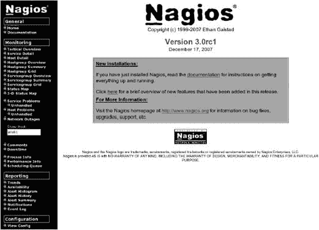

图 16-1. 在“服务问题”和“主机问题”菜单项下未处理的子项自 Nagios 3.0 以来一直位于 Nagios Web 界面的起始页。

表 16-1. CGI 程序概述

| CGI 程序 | 描述 |
| --- | --- |
| **`status.cgi`** | 以各种形式显示状态；迄今为止最重要的 CGI 程序（图 16-10 到 图 16-15, 第 334 页）。 |
| **`statusmap.cgi`** | 监控主机的拓扑表示（参见 图 16-27, 第 347 页） |
| **`statuswrl.cgi`** | 以 3D 格式表示拓扑结构；需要 VRML 兼容的浏览器，并允许在虚拟空间中进行交互式导航（图 16-29, 第 349 页） |
| **`statuswml.cgi`** | WAP 设备（手机）的简单状态页面 |
| extinfo.cgi | 关于主机或服务的附加信息，以及运行命令的可能性（图 16-4, 第 331 页） |
| cmd.cgi | 运行命令（图 16-23, 第 343 页） |
| tac.cgi | 所有要监控的服务和主机的概述，**战术概述**（参见 图 16-26, 第 346 页） |
| outages.cgi | 导致部分网络故障的网络节点（图 16-30, 第 350 页） |
| config.cgi | 显示 Nagios 对象定义（图 16-31, 第 352 页） |
| histogram.cgi | 发生事件的数量的直方图（图 16-34, 第 353 页） |
| History.cgi | 显示所有曾经发生的事件（图 16-35, 第 355 页） |
| notifications.cgi | 所有已发送通知的概述（图 16-36, 第 355 页） |
| showlog.cgi | 显示所有日志文件条目 (图 16-37, 第 356 页) |
| summary.cgi | 事件报告，可以按主机、服务、错误类别和时间段进行编译 (图 16-39, 第 358 页) |
| trends.cgi | 记录已发生状态的时序轴 (图 16-40, 第 359 页) |

表 16-1 显示了包含在包中的所有 CGI 程序的概述。它们都会检查运行请求操作的人是否有权这样做。通常，用户只能访问他作为联系人登记的主机和服务的相关信息。此外，还有可能为特定用户分配更全面的权限，使他们基本上可以显示所有主机和服务，例如，或请求系统信息。其他用户的设置在**`cgi.cfg`**配置文件中完成，认证参数在 A.2 cgi.cfg 中的 CGI 配置, 第 606 页中描述。

# 16.1 识别和应对问题

对于管理员来说，一个合适的起点是**服务问题**页面，可以通过菜单项访问，如图图 16-2 所示。您可以一目了然地看到所有问题。如果只有与服务相关的问题，但没有与主机相关的问题，**主机**列中的主机名背景为灰色，但红色背景表示主机本身是问题的来源。


图 16-2. 服务问题菜单项将当前问题提请注意

主机 **`sis-mail`** 和 **`sis-proxy`**，在图 16-2 中失败，现在可以在**主机问题**菜单项中再次看到它们（图 16-3)：**`sis-mail`**无法访问（不可达），因此真正的故障因此存在于主机 **`sls-proxy`** 的失败中。这种依赖关系在**故障**菜单项中得到了说明（图 16-30, 第 350 页）或**状态图**（图 16-27, 第 347 页）。在图 16-27 中，两个失败的主机以红色背景显示，并且你可以清楚地看到哪个主机依赖于另一个主机（始终从中央 Nagios 主机的角度）。

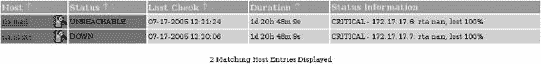

图 16-3. 主机问题菜单项揭示了此显示

## 16.1.1 对有问题的主机的注释

管理员通过电话与外部办公室澄清了问题：DSL 连接已失败。他向负责的提供商宣布了这一故障。为了防止他的同事再次遇到同样的麻烦，管理员在失败的主机上输入了相应的注释。为此，他点击状态显示中的主机名，这会带他到一个特定主机的信息页面（图 16-4)，这些选项在 16.2.2 附加信息和控制中心：extinfo.cgi 中有更详细的描述，第 339 页。


图 16-4. `extinfo.cgi` 提供所选主机的附加信息

使用页面底部的**添加新注释**链接，CGI 程序**`cmd.cgi`**（16.2.3 外部命令接口：cmd.cgi, 第 343 页），通过传递相应的参数已经为此任务做好了准备，^([148]) 允许记录注释（图 16-5). 主机名已经显示，**持久**框中的勾选确保注释也将“存活”在 Nagios 重启之后。在**作者（您的姓名）：**字段中填写的用户名可以编辑，同样，**注释**字段中的实际注释也可以编辑.^([149])


图 16-5. 为主机添加注释

管理员通过**提交**按钮确认输入。返回到状态概览，例如使用**服务问题**菜单项，管理员将在主机名旁边看到一个气泡，表示此主机存在注释（图 16-6). 点击图标将打开对应的信息页面，并将管理员直接带到注释输入页面（图 16-7). 点击**操作**列中的垃圾桶图标可以单独删除这些注释，如果需要的话。


图 16-6. 一个气泡显示注释的存在

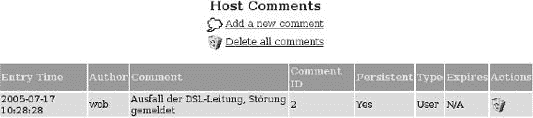

图 16-7. 点击删除所有注释将一次性删除所有注释

## 16.1.2 对问题承担责任

*致谢*（在 Web 界面上如此拼写）比简单的注释更接近工作流程。致谢信号向其他管理员表明有人已经在处理问题，因此暂时不需要其他人介入。在状态概览中，一个小工图标象征着这种承担责任的形式（图 16-8")), Nagios 还会通知相关联系人。

要发出此类声明，需要在相关主机的扩展信息页面上使用**“确认此主机问题”**链接。除了用于输入正常评论的字段外，此情况下还有两个复选框，**“粘性确认”** (图 16-9)——如果选中，此选项将防止在错误状态持续时进行周期性通知——以及**“发送通知”**。如果后者也被选中，Nagios 将通知其他管理员。


图 16-8. 一个工人图标表示管理员已经承担了问题的责任（确认）


图 16-9. 主机确认输入对话框

**持久性注释**在 Nagios 2.x 和 Nagios 3.0 中的效果不同：在 Nagios 2.x 中，只有当复选框被标记时，注释才会被保留。不幸的是，使用这种方法在重启时保存注释的缺点是，当问题解决后，注释不会自动消失。另一方面，Nagios 3.0 通常在重启后保留所有注释。如果删除**“持久性注释”**的勾选标记，Nagios 将在问题得到纠正后立即自动删除注释。如果勾选标记被设置，当不再需要时，必须手动删除注释，就像在 Nagios 2.x 中一样。

我们在这里使用故障主机状态进行演示的内容，也可以应用于故障服务。CGI 程序是相同的，并且通过传递参数，它们会接收到有关是否涉及主机或服务的相关信息，并相应地做出反应；只有主机字段会以**服务**条目的形式获得支持。

* * *

^([147]) 我们在这里提到 CGI 程序而不是 CGI 脚本的合理原因是：Nagios 2.x 和 3.0 的所有 CGI 程序都是 C 程序。

^([148]) **`cmd_type=1&host=sls-proxy`**. 关于参数的更多内容请参阅 16.2.3 外部命令接口：cmd.cgi，见第 343 页。

^([149]) 从 Nagios 3.0 开始，可以通过使用参数**`lock_author_name`**（参见 A.2.2 其他参数）来防止修改作者名称。

# 16.2 各个 CGI 程序概述

在本书付印时，这一章是关于 Nagios Web 界面的最全面文档，特别是针对单个 CGI 脚本。但由于篇幅限制，我们不会深入每个细节。如果你想要了解更多，你必须查看脚本的源代码或查看**`nagios-users`**^([150])邮件列表。其中一些也被 Nagios 开发者阅读，许多问题在那里得到了解答，而这些问题的文档目前尚不存在。

## 16.2.1 状态显示的变体：**`status.cgi`**

到目前为止，最重要的 CGI 程序是**`status.cgi`**，它负责状态显示。显示的内容由三个参数组决定。第一个参数组定义生成的网页是否显示所有主机、特定主机或服务组：

```
http://*nagiosserver*/nagios/cgi-bin/status.cgi?host=all
http://*nagiosserver*/nagios/cgi-bin/status.cgi?hostgroup=all
http://*nagiosserver*/nagios/cgi-bin/status.cgi?servicegroup=all
```

使用**`host`**可以选定单个主机，而在此情况下**`all`**代表所有主机。**`hostgroup`**允许显示特定的主机组，同样你也可以使用**`all`**来代表所有主机组。最后，**`servicegroup`**指示 CGI 程序显示给定值的单个服务组或**`all service groups`**，使用**`all`**。

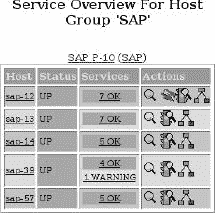

图 16-10. 概览输出样式

**`host=all`**和**`hostgroup=all`**的输出在样式上有所不同，这种样式由第二个参数组定义。对于**`host=all`**，**`style=detail`**是默认设置，而对于**`hostgroup=all`**，它是**`style=overview.status.cgi?host=all&style=overview`**，因此它产生的结果与**`status.cgi?hostgroup=all`**相同。

不属于任何主机组的主机仅在**`host=all&style=detail`**或**`hostgroup=all&style=hostdetail`**的详细视图中出现。所有其他显示样式总是显示整个主机组，其中可能缺少单个主机。**`status.cgi`**提供了五种可能的输出样式：**`overview`**以表格形式表示主机，但根据状态总结服务（图 16-10 展示了这种情况）。对于**`SAP`**主机组，你可以通过以下 URL 调用相应的显示

```
http://*nagiosserver*/nagios/cgi-bin/status.cgi?hostgroup=SAP&style=overview
```

**`style`**值**`summary`**压缩了**`overview: status.cgi`**的输出，仅显示每行一个主机组（图 16-11 展示了 Nagios 2.x 的情况，图 16-12 展示了 Nagios 3.0 的情况）。对于 Nagios 3.0，错误状态被区分成**未处理**（未设置确认）或**已确认**。


图 16-11. Nagios 2.x 的**`summary`**输出样式

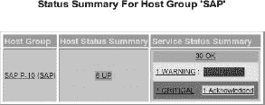

图 16-12. Nagios 3.0 的 ``*`summary`*`` 输出样式

**`grid`** 样式提供了一个非常吸引人的总结，您可以通过它所突出显示的颜色看到每个单独服务的状态（图 16-13）。**`detail`** 在单独的一行中详细显示每个服务。**`hostdetail`** 输出样式仅限于主机信息，为每个主机提供一行详细信息的详细信息（图 16-15）。

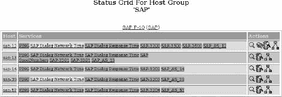

图 16-13. `grid` 输出样式


图 16-14. `detail` 输出样式

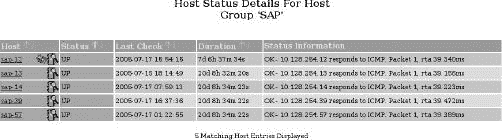

图 16-15. `hostdetail` 输出样式

第三个也是最后一个参数组允许您通过 *选择器* 影响由 **`status.cgi`** 显示的状态和属性，例如尚未由管理员设置确认的所有处于错误状态的服务（参见 16.1.2 负责问题，第 332 页）。状态通过 **`hoststatustypes`** 或 **`servicestatustypes`** 参数传递，属性通过 **`hostprops`** 和 **`serviceprops`**。所有四个参数在等号后都需要数值，这些数值总结在 表 16-2、表 16-3 和 表 16-4 中。

表 16-2. `Hoststatustypes` 的可能值

| 值 | 描述 |
| --- | --- |
| 1 | 待定（由于为该主机计划进行的第一次测试的结果尚未可用） |
| 2 | UP |
| 4 | DOWN |
| 8 | 不可达 |

第三个也是最后一个参数组允许使用**选择器**来影响**`status.cgi`**显示哪些状态和属性，例如，所有尚未设置确认的故障状态的服务（参见 16.1.2 负责问题）。条件通过参数**`hoststatustypes`**或**`servicestatustypes`**传递，属性通过**`hostprops`**和**`serviceprops`**参数传递。所有四个参数都需要等于号后的数值，这些数值总结在表 16-2、表 16-3 和表 16-4 中。

表 16-3. `Servicestatus types` 的可能值

| 值 | 描述 |
| --- | --- |
| 1 | 待定（服务最初计划进行检查，但迄今为止没有结果可用） |
| 2 | 正常 |
| 4 | 警告 |
| 8 | 未知 |
| 16 | 严重 |

表 16-4. `host` 和 `serviceprops` 的可能值

| 值 | 描述 |
| --- | --- |
| 1 | 计划的下线时间（计划下线） |
| 2 | 没有计划的下线时间（没有计划下线） |
| 4 | 确认（状态已由管理员确认） |
| 8 | 没有确认 |
| 16 | 主机/服务检查已禁用 |
| 32 | 主机/服务检查已启用 |
| 64 | 事件处理器已禁用 |
| 128 | 事件处理器已启用 |
| 256 | 振荡检测已禁用 |
| 512 | 振荡检测已启用 |
| 1024 | 主机/服务振荡（波动） |
| 2048 | 主机/服务不振荡 |
| 4096 | 当前排除在通知之外的主机或服务 |
| 8192 | 通知已启用 |
| 16384 | 被动主机/服务检查已禁用（第十三章） |
| 32768 | 被动主机/服务检查已启用 |
| 65536 | 至少有一个被动测试结果的主机/服务 |
| 131072 | 至少有一个活动检查结果的主机/服务 |
| 262144 | 硬状态下的主机/服务（从 Nagios 3.0 开始） |
| 524288 | 软状态下的主机/服务（从 Nagios 3.0 开始） |

如果你想同时查询多个状态或属性，只需将指定的值相加：**`status.cgi?host=all&servicestatustypes=28`** 显示所有具有错误状态的服务：警告、未知和严重，即 4+8+16 = 28。此查询与导航区域中的**服务问题**菜单项相同。

**`status.cgi?hostgroup=all&hoststatustypes=12&style=hostdetail`** 对应导航区域中的 **主机问题** 菜单项。它查询所有处于 DOWN 或 UNREACHABLE 状态的主机（这里 4+8 = 12）。由于只应显示主机信息，而不显示服务信息，因此输出样式为 **`hostdetail`**。

**`status.cgi?host=all&servicestatustypes=24&serviceprops=10`** 是第一个示例的变体：仅显示状态为 UNKNOWN 和 CRITICAL（8 + 16 = 24），并且既不显示计划停机时间，也没有已经被确认（2 + 8 = 10）。

CGI 程序每次在单独的复选框中指定过滤器参数。图 16-16 展示了第三个示例。


图 16-16. 此信息框显示了 status.cgi 应显示的状态和属性

如果您愿意，可以根据自己的需求定义自己的导航区域，或者直接使用现有的导航区域。主页由一个框架组成，导航区域本身由一个普通的 HTML 文件定义：**`/usr/local/nagios/share/side.html`**.^([151])

在 Netways 的 Nagios 示例页面上提供了一个更改后的 **`side.html`** 示例^([152]);^([153]); 另一个示例是图 16.6 使用 Nuvola 风格的现代布局中展示的 Nuvola 风格。

## 16.2.2 额外信息和控制中心：**`extinfo.cgi`**

如果使用 **`host`** 或 **`service`** 参数调用，**`extinfo.cgi`** 不仅提供特定主机或服务的详细信息（图 16-4, 第 331 页），还充当主机和服务（参数 **`hostgroup`**）以及服务组（**`servicegroup`**）的控制中心。根据被调用的对象类，您可以从这里运行各种命令。

在左侧区域，详细记录了主机的状态，而在右侧的框中——被**主机命令**覆盖——提供了可以运行的命令选择。这些命令调用**`cmd.cgi`**（16.2.3 外部命令接口：cmd.cgi，第 343 页）并且仅在外部命令接口（13.1 外部命令接口，第 292 页）激活时才有效。页面底部允许您输入特定对象的注释、读取它们，并再次删除。**`extinfo.cgi`**为服务生成的网页也遵循此模式。

服务和主机组的对应页面（图 16-17），另一方面，仅允许运行特定组的命令，并且不显示任何其他信息。每个命令适用于整个组，从而节省了大量的鼠标点击。例如，**禁用此主机组中所有主机的通知**，确保 Nagios 不再向此主机组中的主机发送任何消息。

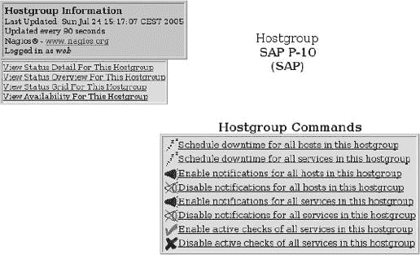

图 16-17. SAP 主机组的命令中心：`extinfo.cgi?type=5&hostgroup=SAP`

除了主机、服务和相应的组之外，CGI 程序还有其他显示功能，这些功能由 CGI 参数**`type:`**启用

```
http://nagsrv/nagios/cgi-bin/extinfo.cgi?type=*value*
```

根据指定的值，可能需要进一步参数，因此要显示服务，还必须包括主机名和服务标识：

**`extinfo.cgi?type=0`**

显示 Nagios 进程本身及其所有全局参数的信息（例如启动时间和进程 ID；通常包括发送通知、处理性能数据等；参见图 16-18)。在**进程命令**框中可以更改全局参数，并且 Nagios 也可以停止和重新启动。


图 16-18. Nagios 进程和全局设置信息：`extinfo.cgi?type=0`

**`extinfo.cgi?type=l&host=`****``*`host`*``**

显示**``*`主机`*``**（参见图 16-4，第 331 页）的命令和信息。

**`extinfo.cgi?type=2&service=`****``*`service`*``**

对于**``*`服务`*``**也是如此。

**`extinfo.cgi?type=3`**

在单页上显示所有可用的主机和服务评论(图 16-19)。


图 16-19. 所有现有评论的概述：`extinfo.cgi?type=3`

**`extinfo.cgi?type=4`**

提供了按主机和服务以及主动和被动检查分开的 Nagios 性能信息(图 16-20)。


图 16-20. 性能信息：`extinfo.cgi?type= 4`

中间列显示了 Nagios 在过去 1、5、15 和 60 分钟内已经执行了多少个计划测试。只要存在**`normal_check_interval`**超过五分钟的检查，前两个值永远无法达到 100%。

右侧列定义了此页的实际值：**检查执行时间**指定了 Nagios 执行主动主机和服务检查所需的最小、最大和平均时间。**检查延迟**衡量了测试计划开始时间和实际运行时间之间的距离。如果这种延迟明显大于一或两秒，Nagios 可能存在性能问题。一个可能的原因是系统处理性能数据太慢，但低性能硬件也可能在这里发挥作用。寻找原因有时可能非常困难，原始文档^([154])提供了关于此主题的一些提示。

**`extinfo.cgi?type=5&hostgroup=`****``*`hostgroup`*``**

显示主机组的命令中心(图 16-17 在第 339 页)。

**`extinfo.cgi?type=6`**

显示主机和服务的所有计划维护期(图 16-21)。


图 16-21. 所有计划维护期的概述：`extinfo.cgi?type=6`

**`extinfo.cgi?type=7`**

显示所有计划测试的概述，按下一个实施时间排序（见图 16-22）。在此旁边，**`extinfo.cgi`**还列出了上次检查的时间。

**“活动检查”**列显示相应的测试是否处于活动状态，而在**“操作”**列中可以删除计划中的检查或将检查移动到不同的时间。

**`extinfo.cgi?type=8&servicegroup`****``*`servicegroup`*``**

显示服务组的命令中心，其结构与主机组的命令中心相同。


图 16-22. 所有计划中的测试，按计划实施时间排序：`extinfo.cgi?type=7`

## 16.2.3 外部命令接口：**`cmd.cgi`**

作为一名真正的全能选手，**`cgi.cmd`**，拥有大约 100 个功能，涵盖了接口为外部命令提供的几乎所有可能性。**`cmd_typ`**参数定义了 CGI 程序应该运行这些功能中的哪一个。以下命令

```
http:*//nagiosserver*/nagios/cgi-bin/cmd.cgi?cmd_typ=6
```

关闭特定服务的活动服务检查（图 16-23）。为了唯一描述所需的服务，必须指定主机和服务描述。如果手动运行 CGI 程序，显示的 Web 表单将查询这些值；如果**`cmd.cgi`**由另一个 CGI 程序启动，所需数据将通过 CGI 参数传递。此处可能的参数是**`host`**、**`service`**、**`hostgroup`**和**`servicegroup`**，后面跟着一个等号（=）和相应的 Nagios 对象。


图 16-23. 使用`cmd.cgi?cmd_typ=6`禁用服务检查

图 16-24 列出了指向主机或服务的最重要命令，而图 16-25 显示了那些指向全局参数控制（对应于主配置文件**`nagios.cfg`**中的值）。源代码文件**`include/common.h`**包含所有可能值的完整列表，包括计划中但尚未实现的值。

图 16-24 和图 16-25 的第一列描述了命令的功能：**`ADD_HOST_COMMENT`**为主机添加注释，**`DISABLE_ACTIVE_SVC_CHECK`**关闭服务的活动检查（简称为**`SVC`**）。

此后的列指定了相应函数所引用的对象类型。要添加带有**`ADD_HOST_COMMENT`** 的注释，你必须指定相关的主机。因此，在主机列中显示的函数代码**`1`**。只有当匹配的服务被命名时，才能关闭特定的活动服务检查，所以函数代码**`6`** 应该在**服务**列中找到。使用**`16`**，你可以关闭指定主机上的所有活动服务检查；也有针对主机或服务组所有活动服务检查的相应代码。

使用**`ACKNOWLEDGE_PROBLEM`**，管理员确认他正在处理特定问题。**`33`**（主机列）指的是主机问题，而**`34`**（**服务**列）指的是服务问题。灰色字段表示没有对应于主机和服务组的函数。当使用**`cmd_typ=33`** 打开的网页表单时（图 16-9

图 16-24. `cmd.cgi?cmd_typ=` 最重要主机和服务相关代码

指向全局参数的函数（图 16-25

图 16-25. `cmd.cgi` 命令代码用于全局参数

## 16.2.4 一目了然的最重要事项：**`tac.cgi`**

作为“战术概览”，**`tac.cgi`** 在一个网页上提供了大量信息，以摘要形式显示（图 16-26

图 16-26. 使用 `tac.cgi` 的战术概览

在页面右侧的上框总结了**`extinfo.cgi?type=4`**（参见 16.2.2 额外信息和控制中心：extinfo.cgi）Nagios 性能数据，这些数据可以详细显示。下面的条形图显示了整个监控网络的健康状况，以百分比表示。如果你将鼠标悬停在任何一个条形上，你也会看到百分比数值。

## 16.2.5 网络拓扑图：**`statusmap.cgi`**

**`statusmap.cgi`** (图 16-27) 提供了监控主机之间依赖关系的视图。从中间的中央 Nagios 服务器开始，线条连接了服务器直接到达的所有主机——这些主机的定义不需要指定**`parents`**参数（参见 2.3 定义要监控的机器，包括主机，第 62 页）。

图形还揭示了 Nagios 只能通过其他主机间接访问的主机。因此，在**`sis-mail`**和图 16-27 中的 Nagios 服务器之间，有主机**`sis-proxy`**、**`hspvip`**和**`pfint. sis-proxy`**，正如注释**Down**和红色（而不是绿色）的背景所暗示的，已经失败。由于**`sis-mail`**依赖于它，因此它处于 UNREACHABLE 状态，**`statusmap.cgi`**也用红色背景标记。

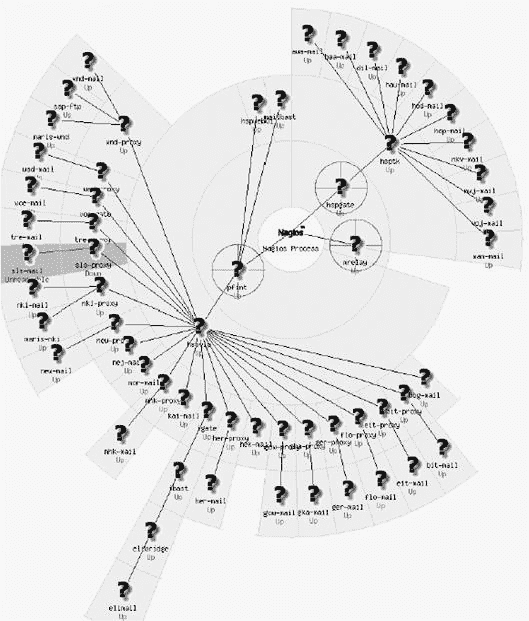

图 16-27. 以图形方式显示的监控主机依赖关系

Nagios 如何在图形中排列主机由配置文件**`cgi.cfg`**中的参数**`default_statusmap_layout`**(A.2.1 认证参数)定义。布局也可以通过 Web 界面中的选择窗口进行更改（在图 16-28 的右上角）。该图显示了 Netways 的演示系统，其外观取决于用户特定的坐标，在这种情况下，你必须为每个主机单独指定（参见 16.4.1 扩展主机信息）。Nagios 提供的问号图标已被网站管理员更换为更漂亮的图片。坐标和图标由**`hostextinfo`**对象定义，在 16.4.1 扩展主机信息中更详细地描述。


图 16-28. 带有自定义坐标和图标的状况图

如果将鼠标移至特定的主机上，Nagios 将在左上角打开一个黄色窗口，显示状态信息，包括 IP 地址、当前状态信息和最后检查的时间。在这个框的底部，**`statusmap.cgi`**总结了在此主机上运行的服务状态。

如果你双击特定的主机，Nagios 将分支到通常的状态概述，除了所选主机的数据外，还显示属于此主机的所有服务（第 336 页的图 16-14 提供了一个示例）。

## 16.2.6 3D 导航：**`statuswrl.cgi`**

**`statuswrl.cgi`** 允许 Nagios 在网络计划的 3D 表示中移动 (图 16-29). 在这里，您可以放大到主机，移动整体视图，旋转等。

显示需要 VRML 功能的浏览器.^([156]) 尽管原始文档^([157]) 提供了对应插件的链接，但其中两个已经过时，只有 *Cortona*^([158]) 在印刷时可以访问。然而，这个插件在 Linux 下不工作；在 Windows 下，它与 Internet Explorer 一起工作，也可以与 Netscape、Mozilla 和 Firefox 一起工作.^([159]) 美国国家标准与技术研究院（NIST）在其网站上提供了一个按操作系统和浏览器组织的 VRML 软件的良好概述.^([160])

在 Linux 的 VRML 插件中，*OpenVRML*、^([161]) 和 *free WRL*^([162]) 最有可能被使用。标准的 Linux 发行版通常不包括完整的软件包。OpenVRML 包含在 Fedora 的 Extras 中；在 freeWRL 的主页上有 Fedora 和 Ubuntu 的二进制软件包。除非您是经验丰富的系统管理员或软件开发者，否则您不应该尝试自己编译软件：这里有很多陷阱。如果您以前从未使用过 Java 编译器，也没有自己编译过像 Mozilla 或 Firefox 这样的复杂软件包，那么您应该放弃。


图 16-29. 这张图片标志着您自己的网络之旅的开始

但这一切都不是绝望的理由，因为 3D 导航的使用本身就值得怀疑，尤其是当正常状态图的 2D 视图已经显示了所需的所有信息，并且在浏览器中显示简单的平面图形比 CPU 密集型的 3D 渲染要快得多。在您匆忙开始自己编译软件的冒险之前，我们建议您自己决定，使用 Cortona 插件，编译像 OpenVRML 这样的项目是否值得努力。

## 16.2.7 使用手机查询状态：**`statuswml.cgi`**

为了使 Nagios 提供的信息对没有完全功能浏览器的 WAP^([163])设备可访问，**`statuswml.cgi`** 生成 WML 格式的网页，^([164]) 可以用手机显示——前提是 Nagios 服务器在互联网上是可访问的。除了对主机和服务的状态查询外，它还允许 CGI 程序关闭测试和通知，并通过对现有问题的确认来确认问题。

在您将 Nagios 通过互联网访问之前，您应该仔细思考：Nagios 提供了许多敏感数据，这些数据可能会被黑客滥用。如果有疑问，您最好不使用它。没有直接互联网访问，**`statuswml.cgi`** 是无用的，因为手机无法使用如 VPN 隧道之类的受保护访问方法。这就是为什么我们在此处不会详细介绍**`statuswml.cgi`**。

## 16.2.8 分析中断的局部网络：**`outages.cgi`**

CGI 程序 **`outages.cgi`** 只显示那些导致局部网络故障的主机概览中的网络节点：与状态概览不同，如图 16-15，第 336 页，**`outages.cgi`** 在**#受影响的主机**列中指定了每种情况下影响的多少服务和主机（图 16-30）。


图 16-30. 只要 `sis-proxy` 失败，Nagios 就无法访问其后面的任何主机

使用**操作**列中的图标，您可以调用其他 CGI 程序，这些程序将选择性地过滤掉此处显示的主机上的信息。从左到右，它们显示了详细视图中的状态显示（交通灯）、拓扑网络视图（网络树）、3D 视图（**3-D**）、趋势显示（图表）、主机日志文件条目（电子表格），以及已发出的通知的显示（扩音器）。

## 16.2.9 使用 **`config.cgi`** 查询对象定义

**`config.cgi`** 展示了指定类型（图 16-31）的所有对象的定义表格概览——涉及的对象类型可以在右上角的选项字段中定义。如果考虑本身包含 Nagios 对象（在主机视图中为**主机检查命令，默认联系人组**，以及——在图片中不可见——**通知周期**），则链接会直接带您到该对象类型的配置视图。

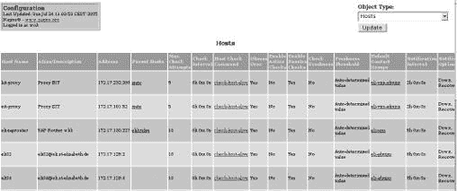

图 16-31. `config.cgi`显示所选对象类（此处为主机）的当前配置（提取）

CGI 程序不提供任何更改设置的方法。此外，只有被列入参数**`authorized _for_configuration_information`**（配置文件**`cgi.cfg`**，第 607 页）的用户才有权访问此视图。

## 16.2.10 可用性统计：**`avail.cgi`**

如果你正在监控系统，那么你也会对其可用性感兴趣。**`avail.cgi`**首先询问你是否对**主机、服务、主机组**和**服务组**感兴趣。选择时间范围后，你将看到概述，如图 16-32 所示。对于**服务**和**主机**，你还可以通过**所有主机**或**所有服务**以 CSV 文件的形式展示可用性数据。

**`avail.cgi`**将主机和服务分别显示。服务或主机在特定状态下保持的时间可以通过相应的颜色列查看——绿色表示 OK，黄色表示 WARNING，红色表示 CRITICAL（服务），DOWN 和 UNREACHABLE（主机）——以百分比表示。显示服务状态为 UNKNOWN 的时间的列以橙色显示。不完整的日志文件显示在**未确定**列中。如果存在大于零的值，则表示 Nagios 无法就状态发表意见的时段。

在每个表格下方，**平均**行指定了各个值的平均值。在图 16-32 中，涉及的主机有 99.965%的时间是可用的。

**`avail.cgi`**在每种情况下都显示了两次可用性：首先作为评估期间的绝对值，然后（在括号中）与数据实际可用的时间相关。只要**时间未确定**列显示**`0.000%`**，两个可用性值就匹配。

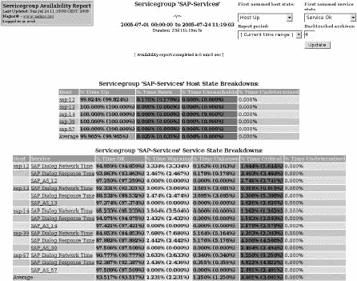

图 16-32. 使用`SAP-Services`服务组示例的可用性报告

如果你点击显示的某个主机或服务，将出现详细视图。图 16-33 展示了主机**`sap-12`**的此类视图。


图 16-33. 详细解释了主机`sap-12`的可用性

在一个显示所选期间状态的彩色条形图中，有关于主机本身的详细信息，然后是监控在此主机上运行的服务可用性的统计信息。这包括日志文件的摘录，只显示与主机可用性相关的条目；即**`HOST UP`**、**`HOST DOWN`**或**`HOST UNREACHABLE`**。日志文件条目由**`avail.cgi`**截断以节省空间。

## 16.2.11 发生了哪些事件，频率如何？—**`histogram.Cgi`**

如果主机或服务的状态发生变化，这被称为**事件**。CGI 程序**`histogram.cgi`**以不同的视图显示了这种变化的频率。如果你选择**月日**作为**细分类型**，它说明了哪一天发生了什么事件，以及发生的频率（图 16-34). 服务中的红色图表代表 CRITICAL，橙色代表 UNKNOWN，黄色代表 WARNING，绿色代表 OK。处于 DOWN 状态的主机的曲线由**`histogram.cgi`**用红色标记，不可达主机的曲线用酒红色标记，绿色线条通常代表 OK。

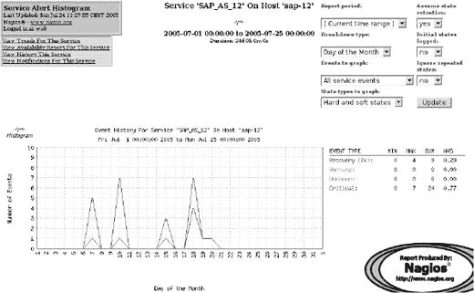

图 16-34. 在哪些天发生了多少种类型的事件？

如果你选择“星期几”这个变化，网页将显示一周中哪一天发生的事件最多，这样你可以找出周一是否真的是最糟糕的一天。此外，你还可以按天（**小时**）或按年月（**月份**）显示频率。通过**报告周期**你可以调整报告周期。通过**假设状态保留**你可以调整是否保留并包含在评估中的先前存在的状态（**`yes`**）或不是（**`no`**）。

如果你已经配置了 Nagios，以便它明确记录监控主机和服务的状态以重启或当日志文件更改时，^([165])并且如果你将**`Initial states logged`**设置为**`yes`**，脚本将明确将其包含在评估中。一个**`no`**将忽略条目；**`histogram.cgi`**随后假定系统启动后的状态与重启前直接存在的状态相同.^([166])

**忽略重复状态**在状态长时间持续并因此反复产生相同结果时，会做出让步。如果你在这里设置为“是”，脚本将只评估一次而不是多次。

如果你选择 **`State types to graph:**** 中的 **`Hard and soft states`** 项，**`histogram.cgi`** 也会计算软状态。例如，如果一个服务在 **`retry_check_interval`** 设置为 **4** 时从 OK 变为 CRITICAL，那么 **`histogram.cgi`** 会计算总共四个结果，三个软状态和一个硬状态。如果你只评估硬状态，统计值评估为 1。如果错误被纠正，则没有软状态；因此，如果包含软状态在评估中，CRITICAL 的值通常大于 RECOVERY 的值。

## 16.2.12 在特定状态后过滤日志条目：**`history.cgi`**

**`history.cgi`** 脚本允许通过选择字段 **`State type options`**（如图 16-35 中的顶部右侧所示图 16-35) 选择性地从日志文件中提取某种类型（软或硬）的状态，并使用 **`History detail level for all hosts`** 提取特定事件（所有、所有与主机相关的、所有服务事件、仅主机恢复、仅主机下线等）。当调用 CGI 程序时，可以通过参数限制要显示的条目到个别主机、服务或主机或服务组。因此，命令

```
histogram.cgi?host=sap-12
```

仅显示主机 **`sap-12`** 的日志文件条目。如果输出应限制到特定主机，则还需要指定服务描述：

```
histogram.cgi?host=sap-12&service=PING
```

选择主机和服务组的方式相同：

```
histogram.cgi?hostgroup=SAP
histogram.cgi?servicegroup=SAP-Services
```

**`history.cgi`** 视图所显示的周期取决于日志文件的存档间隔。脚本始终引用存档文件的内容。如果你在配置文件 **`nagios.cfg`** 中将参数 **`log_rotation_method`** (A.1 主配置文件 nagios.cfg) 设置为 **`d`** 以进行每日存档，网页将显示一天的条目。使用箭头（如图 16-35 中的顶部所示图 16-35)，你可以上下滚动查看不同日期。


图 16-35. `history.cgi` 过滤日志文件中的信息

## 16.2.13 谁被告知了什么，何时？— **`notifications.Cgi`**

日志文件还提供了一个过滤视图：**`notifications.cgi:`** 它显示了所有已发送的消息。在这里，视图也可以通过右上角的选项字段限制到特定的消息组，如图 16-36：涉及所有主机的通知，关于处于关键状态的服务等。


图 16-36. `notifications.cgi` 回答了谁在何时收到关于什么的消息的问题

如果你只想看到有关特定主机和服务的消息，你必须再次在运行 CGI 程序时使用参数来指定：

```
notifications.cgi?host=*host*
notifications.cgi?host=*host&service=service name*
notifications.cgi?contact=*contact*
```

除了 **`host`** 和 **`service`**，你还可以选择特定的联系人，但选择主机或服务组是不可能的。

## 16.2.14 显示所有日志文件条目：**`showlog.cgi`**

CGI 程序 **`showlog.cgi`** 以原始形式显示日志文件，并添加了一些彩色图标以帮助你找到方向：一个红色按钮标记关键服务状态或 DOWN/UNREACHABLE 主机，一个黄色按钮标记 WARNING，一个绿色按钮标记 OK。其他按钮指的是信息条目或 Nagios 重启(图 16-37).

你在这里只有一个选项：按时间顺序。通常 **`showlog.cgi`** 首先显示最新的条目。如果你启用“旧条目优先：”（右上角）的复选框，则首先显示最旧的条目。

这里表示的周期也取决于归档方法：如果你每天归档一次，每个网页将只获得一天的数据。要访问其他日期的条目，你必须使用图片顶部的箭头浏览日志文件的各个归档文件。


图 16-37. 一个蓝色按钮标记信息条目，图表从红色变为绿色表示 Nagios 重启，带有绿色勾选背景的 GO 图标表示监控系统的重启

## 16.2.15 评估你想要的任何内容：**`summary.cgi`**

如果迄今为止引入的显示和选择选项不足以满足你的需求，你可以使用 **`summary.cgi`** 创建自己的报告，该报告生成图 16-38 中显示的选择对话框。**标准报告：**部分提供了一个快速总结，其中只能选择一种固定的报告类型。点击此按钮下方直接生成的报告。

第二部分更为复杂。**报告类型:** 字段，与 **最近警报** 报告类型一起，提供了最后 **`n`** 个单独事件的个别列表。数字 **`n`** 在选择对话框的 **最大列表项数:** 下进一步定义。**报告类型:** 也可以用来在单独的一行上显示所有事件，使用 **最近警报**，或者您可以选择显示统计信息，例如总体发生的事件数量、每个主机组的数量等，使用 **警报总数、按主机组划分的警报总数** 等。

一个特别有趣的报告类型是 **顶级警报生成者**：此类报告显示在报告期间造成最多麻烦的人的点击列表。

在 **报告期间:** 您可以从预定义的间隔中选择所需的报告期间（本周、过去七天、本月、上周、上个月等），或者您可以选择 **`自定义报告期间`** 并定义您选择的任何时间段。如果您忘记明确指定 **`自定义报告期间`**，CGI 程序将忽略您设置的日期，并选择当前在 **报告期间** 中输入的内容。

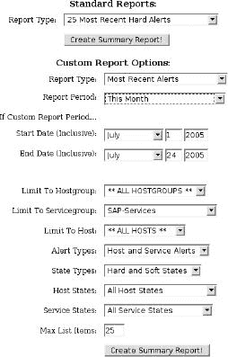

图 16-38. `summary.cgi` 中参数的选择模板

随后的报告期间细节根据主机、服务或其组、状态类型和/或单个状态（例如，仅处于 CRITICAL 状态的服务）进行筛选。在最后指定 **最大列表项数** 很重要：**`summary.cgi`** 总是只显示在此处指定的条目数。默认值有点小；如果您想显示所选期间的所有条目，您应将值输入为 **`0`**。此处可以明确给出的最大值是 999。然后，**创建摘要报告!** 按钮生成所需的报告（图 16-39）。

报告的标题包含报告期间和所做选择的详细信息。表格直接上方的细节很有趣：**显示最近的 25 条，共 3721 条匹配警报**表明选择标准匹配了总共 3721 条条目，但由于 **最大列表项数** 的限制，CGI 脚本只输出了最近的 25 条条目。


图 16-39. 由 `summary.cgi` 生成的个人报告

## 16.2.16 随时间图形化跟踪：**`trends.Cgi`**

图形输出 **`trends.cgi`** (图 16-40) 提供了特定主机或服务何时发生状态的快速概述。选择特定的主机或服务后，可以定义一个周期，就像在 **`summary.cgi`** 中一样。状态由 **`trends.cgi`** 进行颜色编码，这使得概述更容易跟随。

CGI 程序的缩放功能是一个有趣的细节。如果你在特定部分的彩色区域点击，所选区域会根据右上角指定的缩放因子放大或缩小。负数输入（**`−1, −2, −3`** 和 **`−4`**）会扩展报告期而不是减少它。


图 16-40. `trends.cgi` 表示状态的时序序列——这里以服务为例

* * *

^([150]) [`lists.sourceforge.net/mailman/listinfo/nagios-users`](http://lists.sourceforge.net/mailman/listinfo/nagios-users)

^([151]) 如果您一直按照本书中的安装说明进行。

^([152]) [`nagios-demo.netways.de/`](http://nagios-demo.netways.de/)

^([153]) [`www.netways.de/`](http://www.netways.de/)

^([154]) **`/usr/local/nagios/share/docs/tuning.html`**

^([155]) [`netways.de/Demosystem.1621.0.html`](http://netways.de/Demosystem.1621.0.html)

^([156]) 虚拟现实标记语言（VRML），版本 2.0/1997，用于描述虚拟“空间”。

^([157]) **`/usr/local/nagios/share/docs/cgis.html#statuswrl_cgi`**

^([158]) [`www.parallelgrafics.com/products/cortona`](http://www.parallelgrafics.com/products/cortona)

^([159]) 对于 Firefox，您需要手动安装，在安装过程中选择 **自定义** 而不是 **典型**，并在 **不支持的浏览器** 中指定浏览器的插件目录。

^([160]) [`cic.nist.gov/vrml/vbdetect.html`](http://cic.nist.gov/vrml/vbdetect.html)

^([161]) [`www.openvrml.org/`](http://www.openvrml.org/)

^([162]) [`freewrl.sourcef orge. net/`](http://freewrl.%20sourcef%20orge.%20net/)

^([163]) 无线接入协议。

^([164]) 无线标记语言包含 HTML 的一部分，其功能大大减少。

^([165]) 在 **`nagios.cfg;`** 中的参数 **`log_initial_state`**，见第 597 页。

^([166]) 这里的细微差别在于**`retain_state_information`**（参见 A.1 主要配置文件 nagios.cfg）。如果此参数设置为 0，Nagios 会忘记之前的状态。如果没有**`log_initial_state = yes`**，Nagios 在重启后会接受 OK 状态。

^([167]) 因此，Nagios 在将状态分类为“硬”之前会重复测试四次。

^([168]) 如果报告期间的事件数量小于**最大列表项数**中指定的数量，则报告将涵盖此期间发生的所有事件。

# 16.3 计划停机时间

在每个系统环境维护工作中，管理员会时不时地积累一些可以正常计划的任务，以便提前通知用户。Nagios 将这些维护窗口称为*计划停机时间*；管理员可以在由**`extinfo.cgi`**(图 16-4, 第 331 页)或对应的主机或服务组(图 16-17, 第 339 页)生成的信息页面上输入这些信息。在此过程中，**`extinfo.cgi`**利用了**`cmd.cgi`**(16.2.3 外部命令接口：cmd.cgi, 第 343 页)，该接口也可以选择性地调用：

```
http://*nagiosserver*/nagios/cgi-bin/cmd.cgi?cmd_typ=55
```

打开单个主机的维护时间导入模板。**`cmd_typ`**的值在图 16-24 中总结，第 344 页。

提供了另一种记录维护时间段的方法的插件，这些插件与 CGI 程序类似，使用外部命令接口，但可以自动化，与交互式 Web 界面相比。这样的插件也可以在 Nagios Exchange 上找到.^([169])

对于计划中的停机时间，Nagios 阻止发送通知。这确保管理员不会被虚假警报淹没。当检查是否应该发送消息时，停机时间是列表中的第三项（图 16-2 显示了主机停机时间的输入模板（**`cmd.cgi?cmd_typ=55`**）。


图 16-41. 在 Web 界面中，使用此对话框记录主机的停机时间

第一行定义了主机，而在第二行 Nagios 会自动输入您用于登录 Web 界面的登录信息。在 **注释** 关键字之后的输入字段中，您可以描述计划停机的原因。指定触发器可以显示它是否是通过其他条目间接生成的。在记录新的停机时间时，应将值保留为 **N/A**（即不可用，没有触发器）。

在接下来的四行中，您可以选择输入两种不同的停机类型：固定的（**类型：固定**）或可变的时间段（**灵活**）。第一种类型有一个固定的开始时间和结束时间。在这种情况下，Nagios 完全忽略 **灵活持续时间** 字段中的小时和分钟输入。

灵活的停机时间从指定时间段内首次事件发生时开始。从这一刻起，Nagios 根据此处指定的小时和分钟来规划停机时间。这可能会超过 **结束时间** 中指定的终点。

如果还有其他主机依赖于在 **主机名**：中指定的计算机（可能是因为涉及了路由器，其他主机对象已将其作为 **父对象** 进入），您可以使用最后一条项目，**子主机**：为所有子主机安排触发下线，将灵活的下线传递给所有“子主机”，**为所有子主机安排非触发下线** 对固定下线做同样处理，而 **对子主机不采取任何操作** 忽略依赖关系，这样 Nagios 就不会为除此处指定的主机以外的任何主机计划下线。

这种遗传行为如何在图 16-41 中生效，可以通过第 342 页上图 16-21 中所有计划下线的概述来展示。第一行包含刚刚描述的主机 **eli-saprouter** 的下线，其 **下线 ID** 为 **1**。由继承此超时引起的条目在 **触发 ID** 列中包含导致下线的 **下线 ID**：对于 **`sap-12`**，这是 **1**，因为 **`eli-saprouter`** 的维护也影响了此主机。

当计划下线时，Nagios 会同时生成一个注释条目，当这个时间段过去后，这个注释条目会自动被移除。这就是为什么在状态显示中会出现一个话泡。在下线期间，Nagios 会补充一个“呼噜声标志”，其目的是表示睡眠状态（图 16-42）。

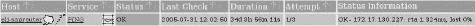

图 16-42. 呼噜声标志 zzzzz 显示主机下线开始

## 16.3.2 服务下线

服务的下线与主机的下线在两个小细节上有所不同。除了主机名外，还必须包含服务描述，并且排除继承的可能性，因为服务没有相应的依赖关系。

主机宕机并不会自动影响到其上运行的服务。但既然主机宕机时这些服务也无法使用，建议您为所有依赖的服务规划相同的宕机时间。逐个服务地输入宕机时间可能会相当繁琐。使用主机组（**`cmd_typ=85`**）来做这件事会容易得多，如图 16-43 所示。使用这种方法，您可以仅用一个命令就为特定主机组中的服务定义宕机时间，以及更多：同时勾选**“也为主机安排宕机时间”**选项，将为该组中的所有主机定义相同的宕机时间.^([170])


Figure 16-43. 主机组中所有服务的单个宕机时间

* * *

^([169]) [`www.nagiosexchange.org/Downtimes.38.0.html`](http://www.nagiosexchange.org/Downtimes.38.0.html).

^([170]) 至少在 Nagios 版本 3.0rc1 之前，复选框没有任何效果；在那里，您必须再次运行**`cmd.cgi?cmd_typ=84`**来分别输入主机的宕机时间。

# 16.4 主机和服务的附加信息

通过为主机和服务的扩展信息，您可以在 Web 界面中包含额外的信息，并使用合适的图标来改善其外观。在 Nagios 2.x 中，有两个单独的对象来存储这些信息：**`hostextinfo`**和**`serviceextinfo`**。从 Nagios 3.0 开始，附加信息直接定义在主机和服务对象中。尽管 Nagios 3.0 仍然评估**`hostextinfo`**和**`serviceextinfo`**对象，但在检查配置时会发出警告信息，并将这些对象视为过时。

计划在版本 4 之前完全从 Nagios 中移除这些信息。首次使用 Nagios 3.0 的用户应直接在主机和服务定义中指定以下介绍的信息，并从一开始就省略**`hostextinfo`**和**`serviceextinfo`**。如果您正在从 Nagios 2.x 迁移到 Nagios 3.0，您无需担心这一点，并且可以继续使用这些对象的现有实例。

为了使这一点更清晰，以下我们将使用术语**`hostextinfo`**和**`serviceextinfo`**对象*信息*。对于 Nagios 2.x，该术语指的是相同名称的*对象*，而对于 Nagios 3.0，它指的是**`host`**和**`service`**对象中给出的相应*细节*。参数本身在 Nagios 2.x 和 3.0 中是相同的。对象信息仅影响 Web 界面，对 Nagios 的功能没有影响。

## 16.4.1 扩展主机信息

主机对象信息允许您通过链接和图标以及坐标形式的增强功能，在 Web 界面中通过附加功能来增强主机的显示：

```
# Nagios 2.x                     # Nagios 3.0
define hostextinfo{              define host{
 **host_name**    linux01
   notes               Samba Primary Domaincontroller
   notes_url           /hosts/linux01.html
   action_url          /hosts/actions/linux01.html
   icon_image          base/linux40.png
   icon_image_alt      Linux Host
   vrml_image          base/linux40.png
   statusmap_image     base/linux40.gd2
   2d_coords           120, 80
   3d_coords           70.0,30.0,40.0
}
```

当这些参数被定义时，唯一必需的参数是主机的指定，即**`host_name`**；其余的都是可选的：

**`host_name`**

这是将要通过以下属性扩展其 Web 页面的主机对象的名称。

**`notes`**

使用此功能以获取**`extinfo.cgi`**在信息页面中考虑的附加信息。（上述示例中指定的条目，**Samba Primary Domaincontroller**，可以在 Linux 图标下方找到，图 16-44"))）

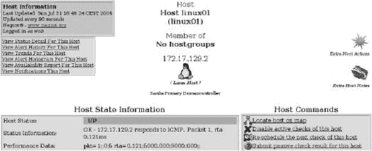

图 16-44. `extinfo.cgi`同样在此处显示了 Linux 图标（括号中的 Tux）的替代文本以及参数`notes`的附加信息（在替代文本下方）

**`notes_url`**

这是包含有关所讨论主机额外信息的（HTML）文件的 URL，您可以通过图标链接到该文件，该图标以红色略为打开的手册形式呈现，既在状态概述中（图 16-45"))。如果涉及的主机文档存储在内联网中，那么维护合同、热线电话号码、系统配置等只需鼠标点击即可获得。

参数可能包含一个绝对路径（从 Web 服务器的视角来看）或一个完整的 URL（**`http://.`**..）。


图 16-45. 此细节视图显示了`notes_url`（打开，阅读手册）`action_url`（粉红色星星）和`icon_image`（此处，Linux 企鹅）的图标

**`action_url`**

这是一个指向为主机运行操作的链接，例如，通过仅点击鼠标即可执行 CGI 程序，如**`cmd.cgi`**。由于浏览器中的链接始终只是一个链接，因此这不必是一个命令，你也可以轻松地链接到另一个网页。在状态概览（图 16-45]]

**`icon_image_alt`**

如果浏览器没有显示图片（例如，对于阅读设备或点字输出设备），则会出现此图标的替代文本。从图标和图标文本细节中，Nagios 生成以下 HTML 代码：

```
IMG SRC= *icon_image* ALT=*icon_image_alt*>
```

**`vrml_image`**

这是在 3D 表示中象征主机图像的符号。允许的格式再次是 GIF、JPEG 或 PNG。你应该避免使用幻灯片，因为图像放置在一个立方体上，3D 界面中的透明部分可能会导致意外结果。

**`statusmap_image`**

这是**`statusmap.cgi`**（见 16.2.5 网络拓扑图：statusmap.cgi，第 346 页）在其拓扑图中表示主机的图像。Netways 的 Nagios 演示页面（^[172]），(图 16-28 在第 348 页）展示了很好的例子。

虽然允许使用 GIF、JPEG 和 PNG，但最好使用 GD2 格式，因为这样 Nagios 生成状态图所需的计算机时间更少。使用程序**`pngtogd2`**，该程序应作为大多数 Linux 发行版中 Thomas Boutell GD 库实用程序组件的一部分提供，可以轻松地将 PNG 文件转换。再次推荐 40×40 像素的图像大小。

**`2d_coords`**

此参数指定了拓扑图的用户定义布局的坐标。细节以像素为单位给出，原点**`(0, 0)`**位于左上角，并且值必须是正数：正 x 值表示从原点到右边的像素数，正 y 值表示从原点向下。

图 16-28 使用单个主机的固定坐标。如果状态图映射的布局与用户定义的不同，Nagios 会忽略**`2d_coords`**细节。

**`3d_coords`**

这些是 3D 表示的坐标。允许使用正负浮点数。**`(0.0,0.0,0.0)`**用作原点。在起始视图中，**`statuswrl.cgi`**调整 3D 图像的大小，以便所有现有主机都显示在屏幕上。因此，起始点在屏幕上的位置无法预测。

在 Nagios Exchange 中，**Logos and Images**类别中有大量成品图标。最好将它们解压缩到单独的子目录中，这样各个包就不会相互干扰：

```
linux:~ # **cd /usr/local/nagios/share/images/logos**
linux:images/logos # **tar xvzf imagepak-base.tar.gz**
base/aix.gd2
base/aix.gif
base/aix.jpg
base/aix.png
base/amiga.gd2
...
```

**`imagepak-base.tar.gz`**包含一组基本的图标选择，你可以根据需要用其他包进行补充。与本章开头对象定义一样创建的**`base`**子目录也必须包含在内。

## 16.4.2 扩展服务信息

扩展服务对象信息与主机等效对象信息大致相同，所以我们只提一下差异。除了主机名外，**`service_description`**中的服务描述是必需的，但 2D（状态图）和 3D 视图的详细信息被省略：

```
# Nagios 2.x                  # Nagios 3.0
define serviceextinfo{        define service{
   ...
 **host_name**       linux01
 **service_description** LPD
    notes                      Linux Print Services
    notes_url                  /hosts/linux01-lpd.html
    action_url                 /hosts/linux01-lpd-action.html
    icon_image                  base/hp-printer40.png
    icon_image_alt              Linux Print Server
}
```

与扩展主机信息相比，本例中的状态概述只显示在**`icon_image`**中指定的打印机图标，而不显示在**`notes_url`**和**`action_url`**中定义的两个图标。它们只会在**`extinfo.cgi`**生成的页面中显示，与扩展主机信息中的图标相同 (图 16-44"), 第 363 页)。

* * *

^([171]) 如果你一直遵循本书中建议的路径。

^([172]) [`nagios-demo.netways.de/`](http://nagios-demo.netways.de/)

^([173]) [`www.nagiosexchange.org/Image_Packs.75.0.html`](http://www.nagiosexchange.org/Image_Packs.75.0.html)

# 16.5 通过 Web 界面进行配置更改：重启问题

CGI 程序**`cmd.cgi`** (16.2.3 外部命令接口：cmd.cgi, 第 343 页)通过 Web 界面允许进行一系列当前配置的更改。^([174]) 以这种方式可以切换通知或主动检查等。

Nagios 不会将这些更改保存到相关的配置文件中，而是在单独定义的文件中记录当前状态，该文件使用**`nagios.cfg`**中的参数**`state_retention_file in nagios.cfg`** (参见 A.1 主配置文件 nagios.cfg). 但如果你在 Web 界面进行了许多更改后重启 Nagios 会发生什么？

Nagios 是否保留重启后所做的交互式更改，或者忘记它们，取决于配置文件**`nagios.cfg`**中的参数**`retain_state_informationin`** (A.1 主配置文件 nagios.cfg). 默认值**`0`**告诉系统忘记交互式更改。为了让 Nagios 记住这些更改，你必须设置

```
# /etc/nagios/nagios.cfg
...
retain_state_information=1
...
```

但这又带来了一个新的问题：在 Web 界面中设置的配置项不会优先于配置文件中的详细信息。如果你为某个服务更改了那里的**`active_checks_enabled`**参数，配置文件中参数的方向就会被忽略，因为当前文件中用**`state_retention_file`**定义的临时存储设置将始终“胜出”。这种行为会影响所有可以通过界面更改的外部命令参数，因此也可以通过 CGI 程序**`cmd.cgi`**进行更改。Nagios 的原版文档^([175])用红色星号标记了这些参数。

在此情况下，有两种方法可以提供解决方案：一方面，你可以在重启前短暂地将参数**`retain_state_information`** 设置为**`0`**。然后，Nagios 在重启时会忘记所有更改，并从头开始读取配置文件。这种方法仅在特殊情况下推荐，因为在大型环境中几乎不可能完成配置文件中的所有交互式更改。另一方面，你可以养成习惯，每次在配置文件中做出更改时，都在 Web 界面中再次进行更改。虽然这会稍微增加一些工作量，但永远不会存在丢失当前设置，甚至可能是非常重要的设置的风险。

主机和服务的定义中还有两个额外的参数提供了微调的机会：

```
define host{
   ...
   retain_status_information    1
   retain_nonstatus_information 1
   ...
}
define service{
   ...
   retain_status_information    1
   retain_nonstatus_information 1
   ...
}
```

**`retain_status_information`** 指定主机或服务的当前状态是否应该在 Nagios 重启后继续存在：**`1`** 表示系统会临时存储状态，而**`0`** 表示它会忘记状态。对于状态来说，**`1`** 是一个更合理的值，你应该只在有正当理由的情况下偏离这个值。

另一方面，**`retain_nonstatus_information`** 指的是描述**无**状态的全部信息。例如，这包括是否启用了活动检查，是否允许被动检查，或者是否需要通知管理员此对象的状态变化。当值为**`1`**时，系统会临时存储这些信息，并在重启后再次使用；而当值为**`0`**时，Nagios 在重启时会忘记当前设置，并从配置文件中读取设置。

* * *

^([174]) 当进行此操作时，CGI 程序会使用外部命令文件接口。

^([175]) Nagios 2.x: **`/usr/local/nagios/share/docs/xodtemplate.html`**，Nagios 3.0: **`/usr/local/nagios/docs/objectdefinitions.html`**

# 16.6 使用 Nuvola 风格的现代布局

到目前为止所描述的 Nagios Web 界面的经典视图仅使用了少数 CGI 配置选项。然而，几乎不可能将更多项目放入左侧的导航栏中，该导航栏的外观已经变得有些业余。一个解决方案是使用 Nuvola 风格，如图图 16-46 所示。

实际 CGI 程序的布局——此示例显示了右侧图片中带有**`status.cgi`**的服务问题视图——不仅色彩丰富，还有新的图标。在图片的左侧，你可以看到相当优雅的导航，并配以相应的图标。然而，真正的亮点是使用基于 JavaScript 的菜单树：可以通过鼠标点击打开和关闭各个条目（例如，**首页**、**监控**、**报告**和**配置**等部分）。

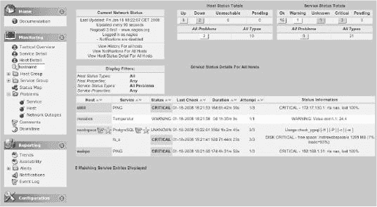

图 16-46. 以 Nuvola 风格显示的 Nagios：此处显示的是服务问题

在安装 Nuvola 风格之前，必须备份 **`/usr/local/nagios/share`** 目录，以便如果你不喜欢新的设置，可以恢复旧设置。

NagiosExchange^([176]) 在印刷时的当前版本 1.0.3 是 2005 年 9 月的，但它与 Nagios 3.0 一起工作得非常好。内容被解压到一个合适的空目录中：

```
linux:~ # **cd /usr/local/src; mkdir nuvola; cd nuvola**
linux:src/nuvola # **tar xvz*fpfad/zu*/nagios-nuvola-1.0.3.tar.gz**
...
linux:src/nuvola # **cd html**
```

源文件包含在 Nagios 中已存在的文件（**`index.html, main.html`**）和目录（**`stylesheets, images`**），它们在安装过程中会覆盖原始文件。此外，Nuvola 风格包括一个新的子目录，**`side`**，其中包含树导航的实际 JavaScript 代码：

```
linux:nuvola/html # **tree**
|-- config.js
|-- images
|   |
... ...
|-- index.html
|-- main.html
|-- side
|  |-- apytmenu.css
|  |-- apytmenu.js
|  |-- apytmenu_data.js
... ...
|  |-- dtree.css
|  |-- dtree.js
|  |-- dtree_data.js
... ...
|  |-- icons
|  |  |
... ...
|-- sidel.html
'-- stylesheets
    |
... ...
5 directories, 175 files
```

**`html`** 目录的内容简单地复制到 **`/usr/local/share`**，例如，使用 **`rsync:****

```
linux:nuvola/html # **rsync -av. /usr/local/nagios/share/**.
...
```

为了使新的导航出现，必须安装 **`sidel.html`** 文件。如果你只是将其重命名为 **`side.html`**，那么新版本的 Nagios 的 **`make install`** 将会再次覆盖它。因此，最好使用一个单独的索引文件，例如 **`index1.html`**，并从这个文件运行 Nagios Web 界面：

```
http://*nagiosserver*/nagios/index1.html
```

要完成这个任务，你需要将包含在 Nuvola 中的 **`index.html`** 文件复制到 Nagios 的 **`share`** 目录下，并命名为 **`index1.html:****

```
linux:nuvola/html # **cp index.html/usr/local/nagios/share/index1.html**
```

在 **`index1.html`** 文件中，你将 **`side.html`** 替换为 **`side1.html`**，以便调用 JavaScript 导航：

```
...
document.write('<FRAME SCROLLING="no" SRC="**side1.html**" NAME="side"
...
...
```

如果你认为像本书的作者一样，改变所有 CGI 程序的样式过于夸张，你可以只挑选改进的导航，并根据你的想法进行补充和重新设计。你不需要复制整个 **`html`** 目录，只需选择所需的文件即可：

```
linux:nuvola/html # **cp -r side /usr/local/nagios/share/**.
                linux:nuvola/html # **cp side1.html config.js/usr/local/nagios/share/**.
                linux:nuvola/html # **cp index.html/usr/local/nagios/share/index1.html**
```

你像我们刚才展示的那样更改 **`index1.html`** 文件，并检查 **`config.js:**** 中的 **`cgipath`** 变量

```
...
var cgipath = "/nagios/cgi-bin/";
...
```

Nuvola 使用现成的菜单树库，商业版本称为 **`apytmenu`**，^([177]) 这里将不讨论，或者免费版本 dTree.^([178）。dTree 是 **`config.js (treeType = 'dtree'`**) 中的默认设置，并且完全包含在内。菜单和树的配置在 **`side`** 目录下的 **`dtree_data.js`** 文件中完成。可以用 **Home** 菜单作为例子简要解释其基本原理：

```
general = new dTree('general');
general.header( 'Home', '*icon*', ...);
general.add(0,-1);
general.add(1, 0,'Documentation','docs/index.html', ... );
document.write(general);
```

**`dTree`** 函数生成一个新的菜单树。它的参数是一个可自由选择的标识符（在这种情况下，**`general`**），用于引用树。**`general.header`** 设置菜单的标题为 **`Home`**。该函数还需要其他参数，包括一个图标（如图所示）。

第一个 **`general.add`** 调用将树仍锚定到待创建的状态。**`add`** 函数的前两个参数指的是要添加的节点编号，然后是其父节点编号。最顶层的节点称为 **`0`**，其下是 **`Documentation`** 条目，分配编号 **`1`**。如果 **`Documentation`** 本身要具有子节点，调用方式如下：

```
general.add(2, 1, *'new_entry'*, ...);
general.add(3, 1, *'new_entry'*, ...);
general.add(4, 1, *'new_entry'*, ...);
```

最后，**`document.write`** 构建整个菜单树。**`header`** 函数有以下参数：

```
*menu_name*. header(*title, icon, height, background image, background color*, open);
```

**``*`title`*``**

包含标题，也可以设置为 URL。点击标题会打开指定的超链接。

**``*`icon`*``**

指定显示在标题前面的图形的路径。

**``*`height`*``**

指定标题下方背景的高度。随后，可以指定此背景的属性，要么作为背景图像，使用 **``*`backgroundimage`*``**，要么作为颜色（**``*`background colorw`*``**）。

最后，**``*`open`*``** 指定菜单树在开始时应该是打开（**`1`**）还是关闭（**`0`**）。指定文本值的参数用单引号括起来，数值参数直接书写，如示例所示。

**`add`** 函数以类似的方式调用：

```
*menu_name*.add(*id, pid, name*,
*url, title, target, icon*,varlistentry58
*iconOpen, open, css)*
```

**``*`id`*``** 是节点编号，**``*`pid`*``** 是要整合的条目所在的节点编号。**``*`name`*``** 定义菜单中节点的名称，**``*`url`*``** 定义要调用的超链接。**``*`title`*``** 和 **``*`target`*``** 可选地指定通过 *url* 调用的页面标题和显示页面的目标框架。这两个参数通常在这里保持为空；目标框架的默认值——对于 Nagios 来说是正确的——是框架 **`main`**。

**``*`icon`*``** 定义放置在菜单条目前面的迷你图形，**``*`iconOpen`*``** 可选地包含在条目打开时替代它的另一个图标。**``*`open`*``** 再次定义在启动时条目应该是打开（值 **`1`**）还是关闭（值 **`0`**），**``*`css`*``** 可选地允许替代 CSS 定义。对于所有可选参数，以下适用：如果它们在末尾，可以省略，但如果它们后面跟有其他详细信息，省略必须用一对单引号（**``*`''`*``**）标记。

包含的文件 **``*`dtree_data.js`*``** 包含四个广泛的菜单。如果你处理 JavaScript 的经验不多，最好保存此模板并逐步调整。如果出现错误，信息非常稀少且通常具有误导性，因此特别重要的是要准确记录从一步到下一步所更改的内容，以便能够快速隔离错误。

在这一点上，我们再次提到 dTree 主页^([179))，它提供了带有代码摘录的示例，以及编程接口的描述。

对于本章中描述的 Nagios Web 界面的可能性不满意的人应该看看 NagVis (第十八章，第 389 页)。这个插件允许自由定义的界面，并以令人印象深刻的方式补充了标准 CGI。然而，NagVis 的前提是安装数据库接口 NDOUtils (第十七章，第 375 页)，这稍微提高了安装门槛。

* * *

^([176]) [`www.nagiosexchange.org/75;252`](http://www.nagiosexchange.org/75;252)

^([177]) [`dhtml-menu.com/`](http://dhtml-menu.com/)

^([178]) [`www.destroydrop.com/javascripts/tree/`](http://www.destroydrop.com/javascripts/tree/)

^([179]) [`www.destroydrop.com/javascripts/tree/`](http://www.destroydrop.com/javascripts/tree/)

# 第十七章。使用 NDOUtils 的灵活 Web 界面

Nagios 2.x 和 3.0 的 Web 界面，如第十六章第 327 页第十六章中所述，对于拥有数百台主机的环境来说有一个关键缺点：它无法扩展。只要您只观察错误状态并密集地使用确认，您就可以使用基于 CGI 的 Web 界面管理得很好。但如果你试图显示数千个服务，你必须准备好等待——无论它们的状态如何。设置页面可能需要很长时间，然后实际工作几乎是不可能的。

Nagios 扩展与 CGI Web 界面有冲突，因为这直接评估 Nagios 内部，如对象配置、状态数据和日志文件。这意味着每个用于补充或替换 Web 界面的扩展都必须遵循这个逻辑。

解决这个问题的方案被称为 NDOUtils（*Nagios 数据对象工具*）。这些工具包括一些工具，它们将所有数据——从配置到事件和检查结果，再到历史记录——写入数据库，并通过统一的数据库模型提供。

将 NDOUtils 连接到 Nagios 的机制被称为*Nagios 事件代理*（NEB）。这为 Nagios 添加了一个模块化接口。NEB 在 Nagios 启动时加载扩展作为模块，这样模块就可以在不重新编译 Nagios 的情况下使用。这种方法类似于 Apache 模块，它们在需要时加载，并为 Web 服务器添加新功能。

NDOUtils 是 Nagios 未来基于 PHP 实现的 Web 界面的基础，预计从 Nagios 4.x 版本开始投入使用。然而，NagVis（见第十八章，第 389 页）已经提供了一个基于 NDOUtils 的替代 Web 界面。

# 17.1 事件代理

NEB 提供了一个基于共享库的 Nagios 与外部模块之间的接口。一个外部、应用程序依赖的模块提供了*回调函数*。Nagios 内核本身会为每个事件从加载的模块中调用相应的回调函数：如果没有匹配的函数，则不会发生任何操作。回调函数执行什么动作留给开发者想象：要么它自己执行某些操作，要么它将配置、状态和事件数据传递给外部应用程序，如图 17-1 所示。

对于数据传输到外部工具，可以使用 Unix 套接字或网络套接字，尽管也可以使用文件系统。应用程序进一步处理信息（例如，将其保存到数据库中，或通过 SNMP 陷阱发送消息，写入 syslog 等）。


图 17-1. 外部应用程序与加载的 NEB 模块通信

当回调函数被调用时，Nagios 会等待其完成。这意味着长时间的执行时间会阻碍系统。因此，回调函数应该始终将耗时的处理步骤留给外部应用程序，并限制于尽可能快地发送必要的信息。

构建事件代理模块应该留给经验丰富的程序员来做；普通人必须满足于使用现成的模块。NEB 模块可以通过主配置文件**`nagios.cfg:`**中的指令**`broker_module`**进行集成。

```
# /etc/nagios/nagios.cfg
...
broker_module=*module-with-path arguments*
event_broker_options=-1
```

你是否将参数传递给模块取决于其具体实现。参数**`event_broker_options`**控制 Nagios 传递给事件代理模块的信息。使用选项**`−1`**表示所有信息，而值 0 则防止任何信息传递。通过 Nagios 源代码中的文件**`broker.h`**提供了一种选择性传递特定信息的替代方法：

```
/* broker.h from the Nagios sources */
...
/*************** EVENT BROKER OPTIONS *****************/

#define BROKER_NOTHING                  0
#define BROKER_EVERYTHING               1048575

#define BROKER_PROGRAM_STATE            1      /* DONE */
...
#define BROKER_DOWNTIME_DATA            512    /* DONE */
...
#define BROKER_STATUS_DATA              4096   /* DONE */
...
#define BROKER_RETENTION_DATA           32768  /* DONE */
#define BROKER_ACKNOWLEDGEMENT_DATA     65536
```

表 17-1. 要传输到 NagVis 的数据

| 代理选项 | 值 | 说明 |
| --- | --- | --- |
| **`BROKER_PROGRAM_STATE`** | 1 | 程序是否是运行的 Nagios |
| **`BROKER_DOWNTIME_DATA`** | 512 | 计划维护期的详细信息 |
| **`BROKER_STATUS_DATA`** | 4096 | 所有检查的当前状态信息 |
| **`BROKER_RETENTION_DATA`** | 32768 | 为 Nagios 重启缓冲的数据 |
| **`BROKER_ACKNOWLEDGEMENT_DATA`** | 65536 | 确认已对主机和服务检查的错误状态进行的确认 |

在第十八章中介绍的 NagVis 1.1 需要表 17-1 中列出的信息。相应的数值总和为**`102913`**，因此可以修改**`event_broker_options`**如下，使其适合 NagVis：

```
# /etc/nagios/nagios.cfg
...
event_broker_options=102913
```

关于事件代理的信息目前非常稀少。唯一描述接口的是来自 Nagios 2.0 的相当旧的文档和《Nagios 事件代理 API》^([180]）。

* * *

^([180]) [`www.nagios.org/developerinfo`](http://www.nagios.org/developerinfo)

# 17.2 数据库接口

作为事件代理概念的具体和实用应用，Nagios 数据对象工具，或称 NDOUtils，将所有配置和事件数据保存到数据库中。为了能够使用数据库，还需要进一步的应用程序。对于 Nagios 4.x 版本，这很可能是基于 PHP 的新设计的 Web 界面。在新闻发布时（当时 Nagios 3.0 尚未完成），这个 Nagios 版本是否会立即管理数据库中的所有配置数据仍然是一个猜测。

对于数据库，NDOUtils 目前仅支持 MySQL；计划使用 PostgreSQL，但在本章节中引入的 1.4 版本中尚未实现。

由于 NDOUtils 插件提供了一个相对简单易用的数据库接口，预计它们与 Nagios 3.x 的使用将会增加。NagVis（下一章从第 389 页讨论）已经提供了一个强大的基于 NDO 的前端，在许多情况下可以替代状态图，该图相对简单，在 16.2.5 网络拓扑图：statusmap.cgi 中从第 346 页进行了讨论。

图 17-2 展示了 Nagios 数据可以导入到 NDOUtils 数据库的各种路径。Nagios 的数据导出由事件代理模块 ndomod 处理。它可以选择操作 TCP 或 Unix 套接字，或将数据写入文件。如果 Nagios 安装在与 NDOUtils 数据库相同的计算机上，Unix 套接字接口将提供最佳性能和最高安全性（与 TCP 套接字不同，Unix 套接字不能从网络上访问）。查询最终将数据写入数据库的 ndo2db 守护进程的套接字。

使用文件的方法涉及实用程序 FILE2SOCK，它读取文件并通过 TCP 或 Unix 套接字将数据传递给 nd02db 守护进程。FILE2SOCK 还可以从标准输入读取数据。

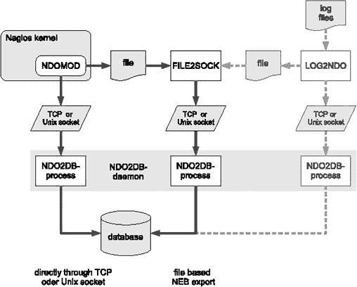

图 17-2. 如何将 Nagios 数据集成到 NDOUtils 数据库中？

对于每个数据库，您需要恰好一个 ndo2db 守护进程。如果有多个不同的客户端可以访问套接字接口，它将启动多个进程来处理这些。

程序 LOG2NDO 是 NDOUtils 之一。它从 Nagios 2.x 和 3.0 读取日志文件，并将这些数据传递给 ndo2db 守护进程——要么直接通过套接字接口，要么通过必须单独用 FILE2SOCK 导入的文件。如果您想将此类历史数据集成到数据库中，您将需要提供大量的存储空间，因为日志文件在存档时被压缩，但在数据库中以未压缩的形式保存。因此，当使用数据库管理时，日志文件会占用更多空间。

FILE2SOCK 和 LOG2NDO 主要用于导入历史数据。NagVis 稍后需要的数据由 Nagios 在非常短的时间间隔内更新。由于这里不需要历史数据，我们将不再详细描述这两个程序。

# 17.3 安装

由于在使用 MySQL 4.0 版本时，NDOUtils 数据库的一些表中的**`INSERT`**语句存在问题，因此最好从一开始就使用 MySQL 5。^([181]) 除了 MySQL 服务器包（在 Debian 中为“Etch” **`mysql-server-5.0`**) 和在服务器包安装过程中通常自动选择的库之外，您还需要相应的开发包（在 Debian 中为“Etch” **`libmysqlclient15-dev`**)，以便能够编译 NDOUtils。

NDOUtils 与 Nagios 广泛集成的一个后果是版本必须与所使用的 Nagios 版本完全匹配。Nagios 和 NDOUtils 都在源代码中用宏**`CURRENT_OBJECT_STRUCTURE_VERSION`**定义它们的版本状态。该宏可以在 Nagios 源代码的文件**`./include/objects.h`**中找到（对于 Nagios 3.0，在本例中）：

```
linux:src/nagios-3.0rc1 # **fgrep CURRENT_OBJECT_STRUCTURE_VERSION** \
  **include/objects.h**
#define CURRENT_OBJECT_STRUCTURE_VERSION 307
```

NDOUtils 包包含两个包含文件，一个用于 Nagios 2.x，一个用于 Nagios 3.x：

```
linux:src/ndoutils-1.4b7 # **fgrep CURRENT_OBJECT_STRUCTURE_VERSION** \
  **include/*/objects.h**
include/nagios-2x/objects.h:#define CURRENT_OBJECT_STRUCTURE_VERSION 2
include/nagios-3x/objects.h:#define CURRENT_OBJECT_STRUCTURE_VERSION 307
```

如果 Nagios 的**`CURRENT_OBJECT_STRUCTURE_VERSION`**值与 NDOUtils 源代码中的两个值之一不匹配，NDOUtils 模块将卸载自己并拒绝执行。该过程在日志文件**`nagios.log`**中有记录，如下所示（两个不同的版本用粗体表示）：

```
[1186152181] ndomod: NDOMOD 1.4b4 (06-19-2007) Copyright (c) 2005 -2007
Ethan Galstad (nagios@nagios.org)
[1186152181] ndomod: I've been compiled with support for **revision 303** of
the internal Nagios object structures, but the Nagios daemon is currentl
y using **revision 304**. I'm going to unload so I don't cause any probl...
```

## 17.3.1 编译源代码

最新版本的 NDOUtils 代码可以从 Nagios 网页^([182])下载，然后解压到合适的目录：

```
linux:~ # **cd /usr/local/src/nagios**
linux:src/nagios # **tar xvzf** /path/to/**ndoutils-1.4b7.tar.gz**
...
linux:src/nagios # **cd ndoutils-1.4b7**
linux:nagios/ndoutils-1.4.b7 # **./configure --sysconfdir=/etc**
...
linux:nagios/ndoutils-1.4.b7 # **make**
...
```

我们使用开关 **`--sysconfdir=/etc`** 启动 **`configure`** 运行，以便安装模块和守护进程的配置文件，以符合本书中的约定，即到目录 **`/etc/nagios`**。**`make`** 调用编译程序代码，然后手动完成安装：

```
linux:nagios/ndoutils-1.4.b7 # **cd ./src**
linux:ndoutils-1.4.b7/src # **cp ndo2db-3x ndomod-3x.o log2ndo file2sock** \
  **/usr/local/nagios/bin/**
```

对于 Nagios 2.x，守护进程 **`ndo2db-2x`** 和模块 **`ndomod-2x.o`** 被复制到 **`/usr/local/nagios/bin`** 而不是 3.x 版本。

## 17.3.2 准备 MySQL 数据库

在 MySQL 数据库系统中，我们需要一个存储用户 **`nagios`** 适当访问选项的数据库。为了设置这个数据库，我们首先以用户 **`root:`** 登录 MySQL。

```
user@linux:~$ **mysql --user=root -p**
Enter password: *root-passwort_for_the_db*
Welcome to the MySQL monitor. Commands end with ; or \g.
Your MySQL connection id is 1861
Server version: 5.0.32-Debian_7etch1 Debian etch distribution

Type 'help;' or '\h' for help. Type '\c' to clear the buffer.

mysql>
```

开关 **`-p`** 确保请求密码。以下命令测试是否设置了密码：

```
user@linux:~$ **mysql --user=root**
```

如果由该登录触发的操作没有错误消息，则 **`root`** 密码缺失。这应该使用以下命令指定：

```
user@linux:~$ **/usr/bin/mysqladmin -u root password** 'secret'
```

您应该用您自己的安全密码替换 **``*`secret`*``**。^([183)]

数据库（被命名为 **`nagios`**）使用 SQL 命令 **`CREATE DATABASE`** 创建，然后使用 **`GRANT:`** 给予所需的权限。

```
mysql> **CREATE DATABASE nagios;**
Query OK, 1 row affected (0.01 sec)
mysql> **GRANT USAGE ON *.* TO 'nagios'@'localhost' IDENTIFIED BY** 'secret'
 **WITH MAX_QUERIES_PER_HOUR 0**
 **MAX_CONNECTIONS_PER_HOUR 0**
 **MAX_UPDATES_PER_HOUR 0 ;**
Query OK, 0 rows affected (0.00 sec)
mysql> **GRANT SELECT, INSERT, UPDATE, DELETE ON 'nagios'.***
 **TO 'nagios'@'localhost';**
Query OK, 0 rows affected (0.01 sec)
mysql> **FLUSH PRIVILEGES;**
Query OK, 0 rows affected (0.00 sec)
mysql> **quit**
```

**`GRANT USAGE`** 命令定义了用户及其密码，并指定对他来说，在每小时查询次数、数据库连接次数或数据库更新次数上没有限制。对于密码，选择比 **``*`secret`*``** 稍微安全一些的密码，但必须以纯文本形式写在这里。**`GRANT USAGE`** 还没有给 **`nagios`** 数据库的表提供任何访问权限。这由第二个 **`GRANT`** 命令处理。通过 **`FLUSH PRIVILEGES`** 激活对 **`nagios`** 用户权限的更改。

NDOUtils 需要 **`SELECT`**、**`INSERT`**、**`UPDATE`** 和 **`DELETE`** 权限。对于仅从数据库中读取数据的 NagVis 和其他应用程序，**`SELECT`** 权限就足够了。

在下一步中，将生成表格，NDOUtils 将在此之后保存数据。在 NDOUtils 源代码的 **`db`** 子目录中提供了一个用于此目的的完成 SQL 脚本，并且只需要执行：

```
user@linux:src/ndoutils-1.4b7$ **cd db**
user@linux:ndoutils-1.4b7/db$ **mysql -u root -p nagios < mysql.sql**
```

脚本应在所有情况下（即没有任何消息）正常运行。创建的表格可以使用 SQL 命令 **`show tables`** 显示。

各种发行版默认安装 MySQL 时会开启日志记录。与（通常是二进制）日志文件一起，可以复制或恢复数据库的当前状态。然而，与 NDOUtils 结合使用时，这些日志文件会迅速增长。如果您仅使用数据库进行 NDOUtils，您将只在罕见情况下需要此类工具，因此可以在 **`my.cnf`** 配置文件中注释掉所有 **`*log*`** 参数，并重新启动 MySQL——这次不进行日志记录。

## 17.3.3 升级数据库设计

由于 NDOUtils 正在积极开发中，因此不能排除对数据库结构的较大更改。对于升级，数据库设计可能也需要更改。NDOUtils 提供了一个脚本用于此目的，位于子目录 **`db`** 中的 **`upgradedb`**，它将自动调整表格：

```
linux:~ # **cd /usr/local/src/nagios/ndoutils-1.4b7/db**
linux:ndoutils-1.4b7/db # **./upgradedb -u root -p** password \
**-h localhost -d nagios**
Current database version: 1.4b5
****** DB upgrade required for 1.4b7
    Using mysql-upgrade-1.4b5.sql for upgrade...
****** Upgrade to 1.4b7 complete
```

该脚本检测现有的 NDOUtils 版本，并相应地调整表格。其中之一是，它使用 SQL 命令 **`ALTER TABLE`**，对于在上一节中创建的 MySQL 用户 **`nagios`** 来说，权限不足。因此，脚本需要以 MySQL 用户 **`root`** 的身份运行。

* * *

^([181]) 作者已测试版本 5.0.23，但也有报告称 NDOUtils 与 MySQL 4.1.x 版本成功兼容。

^([182]) [`www.nagios.org/download/`](http://www.nagios.org/download/)

^([183]) 关于 MySQL 安全管理的更多说明，可以在在线文档 [`www.mysql.org/doc/refman/5.0/en/security-guidelines.html`](http://www.mysql.org/doc/refman/5.0/en/security-guidelines.html) 中找到，也可能在随分发版提供的文档中找到，位于 **`/usr/share/doc/`**。

# 17.4 配置

NDOUtils 在三个不同的位置进行配置。文件 **`ndomod.cfg`** 指定了事件代理模块的设置。**`ndo2db.cfg`** 控制守护进程 **`ndo2db`**，它从代理接收数据并将其写入数据库。**`/etc/nagios/nagios.cfg`** 中的条目最终确保 Nagios 启动时加载事件代理模块 **`ndomod`**。

子目录 **`./config`** 中的 NDOUtils 源代码为两个配置文件中的每一个提供了一个模板。该命令

```
linux:src/ndoutils-1.4b7 # **cp config/ndo*.cfg /etc/nagios/**.
```

根据本书中使用的惯例，将这些复制到目录 **`/etc/nagios`**。

## 17.4.1 调整事件代理配置

**`ndomod.cfg`** 的模板几乎可以不变地使用；您只需调整到 **`var`** 目录的路径：

```
# /etc/nagios/ndomod.cfg
instance_name=default
output_type=unixsocket
output=**/var/nagios/ndo.sock**
# tcp_port=5668
output_buffer_items=5000
buffer_file=**/var/nagios/ndomod.tmp**
# file_rotation_command=rotate_ndo_log
# file_rotation_interval=14400
# file_rotation_timeout=60
reconnect_interval=15
reconnect_warning_interval=15
data_processing_options=-1
config_output_options=2
```

**`instance_name`** 指的是数据库中要使用的实例。如果您在数据库中只映射一个 Nagios 实例，则可以保持 **`default`** 设置。假设 Nagios 和 **`ndo2db`** 守护进程运行在同一个主机上，可以使用 Unix 套接字作为 **`output_type`**，其名称由 **`output`** 参数定义。**`tcp_port`** 仅用于 **`output_type=tcpsocket`**，因此被注释掉。

如果 **`ndomod`** 模块无法通过套接字接口释放数据（例如，守护进程刚刚重启），这些数据将暂时保存在文件 **`buffer_file`** 中。在 **`output_buffer_items`** 参数中要保存的条目数不应设置得太低。这里的一个经验法则是将所有定义的主机和服务的数量乘以五。这是一个经验值：当重新加载或 Nagios 重新启动时，NDOUtils 将每个主机和每个服务的起始状态写入数据库，以及所有计划的和已开始的检查。这些可能还会补充新的或仍在进行的检查的结果。

**`file_rotation_*`** 参数仅在 **`output_type=file`** 时需要，这需要使用额外的守护进程 **`FILE2SOCK`**。然而，出于性能考虑，建议您使用套接字接口而不是基于文件的接口。由于额外的守护进程，文件接口也使得配置更加复杂。

参数 **`reconnect_interval`** 和 **`reconnect_warning_interval`** 也适用于无法建立使用 **`ndo2db`** 守护进程的连接的情况。它们指定了 Nagios 多久尝试与他们建立联系，以及如果无法建立连接，日志文件中多久出现一次警告。这两个参数应保留为默认值。

## 17.4.2 配置数据库访问

对于 **`ndo2db`** 守护进程的配置文件模板，几乎没有需要调整的地方。除了套接字接口的路径外，还必须指定对数据库进行写访问的相关密码：

```
# /etc/nagios/ndo2db.cfg
ndo2db_user=nagios
ndo2db_group=nagios
socket_type=unix
socket_name=**/var/nagios/ndo.sock**
# tcp_port=5668
db_servertype=mysql
db_host=localhost
db_port=3306
db_name=nagios
db_prefix=nagios_
db_user=nagios
db_pass=secret
max_timedevents_age=1440
max_systemcommands_age=1440
max_servicechecks_age=1440
max_hostchecks_age=1440
max_eventhandlers_age=10080
```

两个 **`ndo2db_*`** 参数指定了守护进程启动后运行的用户和组权限。**`socket_type`** 和 **`socket_name`** 必须设置为 **`ndomod.cfg`** 中的配置。 

当前可以指定的唯一数据库类型是 **`db_servertype`** 的 **`mysql`**；对于 **`db_port`**，通常输入 MySQL 的标准端口（**`3306`**）。在 **`db_name`** 中的数据库名称必须与在 **`CREATE DATABASE`** 命令中选择的名称匹配（在这种情况下，**`nagios`**），并且数据库用户和密码也必须以与设置数据库时相同的方式给出。在任何情况下都不应更改 **`db_prefix`** 参数的值，否则在 **`mysql.sql`** 脚本中创建的表的名称也必须进行调整。

以 **`max_*`** 开头的参数定义了 NDOUtils 数据在系统命令、计划事件、服务和主机检查以及事件处理程序中应在数据库中保留多长时间（以分钟为单位）。值 1440 对应于一天。如果您仅使用 NagVis 与 NDOUtils，则不需要更长时间。短间隔对数据库和硬盘都较为友好。

## 17.4.3 启动 **`ndo2db`** 守护进程

当一切配置完成后，首先手动调用**`ndo2db`**守护进程：

```
/usr/local/nagios/bin/ndo2db-3x -c /etc/nagios/ndo2db.cfg
```

之后，建议您通过复制和修改分发中提供的脚本**`/etc/init.d/skeleton`**来创建一个 init 脚本。守护进程必须与 Nagios 版本匹配：**`ndo2db-3x`**与 Nagios 版本 3.x 一起工作，**`ndo2db-2x`**与版本 2.x 一起工作。启动后，您应该检查配置中指定的套接字是否存在：

```
linux:~ # **ls -l /var/nagios/ndo.sock**
srwxr-xr-x 1 nagios nagios 0 Jul 18 21:16 /var/nagios/ndo.sock
```

如果在运行守护进程时出现**`Socket already in use`**消息，那么要么守护进程已经在运行，要么在守护进程停止时没有移除套接字**`ndo.sock`**。在这种情况下，您应该在重新启动之前手动删除它。

## 17.4.4 在 Nagios 中加载事件代理模块

为了使 Nagios 在启动时加载 NDOUtils 的事件代理模块，以下条目被添加到配置文件**`/etc/nagios/nagios.cfg:`**

```
# /etc/nagios/nagios.cfg:
...
# === NDO ===
broker_module=/usr/local/nagios/bin/ndomod-3x.o config_file=/etc/nagios/
ndomod.cfg
```

在此示例中使用了 Nagios 版本 3.x 的模块；如果您使用的是 Nagios 2.x，则输入**`ndomod-2x.o`**。重新加载激活模块：

```
linux:~ # **/etc/init.d/nagios reload**
```

在重新加载后不久，所有主机和服务对象都应该记录在数据库中：

```
user@linux:~$ **mysql --user=nagios -p nagios**
mysql> **select name1,name2 from nagios_objects WHERE objecttype**_**id=2 ;**
+---------+----------------------+
| name1   | name2                |
+---------+----------------------+
| AHDC01  | CPU_LOAD             |
| AHDC01  | DISK_C               |
| AHDC01  | DISK_D               |
...
```

表**`nagios_objects`**包含所有对象，**`objecttype_id=2`**显示所有服务。或者对象类型**`1`**指代主机，**`3`**指代主机组，**`4`**指代服务组。关于表的完整描述可以在 NDOUtils 中包含的文件**`NDOUTILS DB Model.pdf`**中找到，该文件位于子目录**`./docs`**中。

* * *

^([184]) 关于事件处理器，请参阅第 619 页的附录 C（附录 C. 事件处理器）

# 第十八章. NagVis

NagVis^([185]) 是 Nagios 的一个插件，它将用户选择背景图像显示主机和服务状态。这必须是 PNG 格式；您可以选择使用地图、您自己的系统文档图、服务器室的照片或系统环境的示意图作为背景，如图图 18-1 所示。

通过 Web 界面，您可以在背景上放置任何您想要的对象。NagVis 根据对象的状态显示不同的图标：红色表示 CRITICAL 状态，黄色表示 WARNING，绿色表示 OK，灰色背景上的问号表示 UNKNOWN。如果设置了确认，则通过带有工人图片的绿色按钮表示。

主机和服务的图标不同；在默认模板中，主机图标是矩形的，而服务图标是圆形的。完成的 NagVis 显示——NagVis 将其称为 *地图*——在 图 18-2 中显示。NagVis 主页上提供了更多示例——例如使用地理地图或服务器室的照片作为背景。^([186)]


图 18-1. 作为 NagVis 模板的系统环境示意图

除了主机和服务外，主机和服务组还可以集成到 NagVis 显示中，以及额外的地图。因此，可以使用地理概览图作为起始页面，每个监控位置的图标都链接到针对该位置的详细 NagVis 地图。

如果一个图标包含多个状态，例如主机和服务组，NagVis 会显示具有最高优先级的状态，其中 CRITICAL 的优先级高于 WARNING，WARNING 胜过 UNKNOWN，UNKNOWN 比确认得到更多关注，而 OK 是所有状态中优先级最低的。如果主机组中的任何主机处于 CRITICAL 状态，整个主机组都会相应地显示。

对于主机和主机组，NagVis 提供了选择仅考虑主机状态以确定显示状态，或者包括依赖于这些主机的服务（参见 18.1.2 初始配置）。在后一种情况下，如果主机的任何一个服务处于关键状态，则会显示一个红色的停止灯。

特别值得注意的是 NagVis 只评估硬状态的能力（参见 18.1.2 初始配置）。对于使用 Web 界面的常规工作，如果并非每个临时的软 CRITICAL 状态都立即生成红灯，这会非常有用。

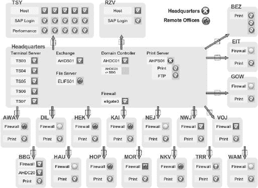

图 18-2. 显示系统环境

特别会让面向对象编程的粉丝感到高兴的是，NagVis 充分利用了面向对象的概念。例如，系统从全局配置继承默认值，用于单个地图和地图级别的设置，并将这些值传递给单个对象，同时始终可以选择在本地覆盖设置。这在很大程度上简化了配置，NagVis 还在图形编辑器（也称为 *Web 用户界面* 或 WUI）中指出了哪些设置是针对对象的，哪些是继承的（图 18-8 下发布；下面的描述指的是版本 1.3。

# 18.1 安装

NagVis 使用 NDOUtils 并用 PHP 实现。因此，除了 第十七章]) 根据发行版和使用的 PHP 版本，包名可能会有所不同。对于 Debian "Etch" 和 PHP5，您需要 **`libapache2-mod-php5, php5, php5-common, php5-gd`** 和 **`php5-mysql`** 包。

虽然在许多情况下它们被打包在同一台主机上，但 NagVis 不一定必须安装在 Nagios 和 NDOUtils 相同的计算机上。NDO 数据库的配置——NagVis 文档将其称为 *后端*——可以引用（如 18.1.2 初始配置，解压到您选择的目录中：

```
linux:~ # **tar xvzf** /pfad/zu/**nagvis-1.3.tar.gz**
...
```

如果存在先前的安装，您应该首先备份它。然后，您将创建的目录（在我们的例子中，**`nagvis-1.3`**）以名称 **`nagvis`** 复制到 **`/usr/local/nagios/share:`**

```
linux:~ # **mv nagvis-1.3 /usr/local/nagios/share/nagvis**
linux:~ # **ls -F /usr/local/nagios/share/nagvis**
INSTALL LICENCE README config.php etc/ index.php nagvis/ var/ wui/
```

重复的目录名称 **`nagvis`** 有时会导致混淆，但这是正确的：

```
/usr/local/nagios/share/nagvis
/usr/local/nagios/share/nagvis/nagvis
/usr/local/nagios/share/nagvis/wui
```

**`/usr/local/nagios/share/nagvis`** 代表 NagVis 安装的根目录，而子目录 **`nagvis`** 包含 NagVis 应用程序及其配置。最后，子目录 **`wui`** 包含图形编辑器，它允许通过浏览器编辑 NagVis 地图。

目前，必须手动设置目录和文件的正确访问权限。为此，您首先需要确定 Web 服务器运行的用户的权限（也参见 1.2 编译源代码，第 39 页）：

```
linux:~ # **grep "^User" /etc/apache2/apache2.conf**
User www-data
linux:~ # **id www-data**
uid=33(www-data) gid=33(www-data) Groups=33 (www=data),9001 (nagcmd)
```

第一个 **`grep`** 命令在 Web 服务器（在此情况下，Apache2）的配置文件中查找相应的用户，然后 **`id`** 命令搜索此用户的初始组。这可以在 **`gid=`** 指定之后找到。现在将根据这些权限设置访问权限：

```
linux:~ # **chown www-data.www-data -R /usr/local/nagios/share/nagvis**
linux:~ # **chmod 664 /usr/local/nagios/share/nagvis/etc/nagvis.ini.php**
linux:~ # **chmod 775 /usr/local/nagios/share/nagvis/nagvis/images/maps**
linux:~ # **chmod 664 /usr/local/nagios/share/nagvis/nagvis/images/maps/***
linux:~ # **chmod 775 /usr/local/nagios/share/nagvis/etc/maps**
linux:~ # **chmod 664 /usr/local/nagios/share/nagvis/etc/maps/***
linux:~ # **chmod 775 /usr/local/nagios/share/nagvis/var**
linux:~ # **chmod 664 /usr/local/nagios/share/nagvis/var/***
```

在可以使用 Web 用户界面之前，您必须创建中央配置文件并确保只有经过成功认证后才能访问 NagVis。

## 18.1.2 初始配置

中央 NagVis 配置文件 **`config.ini.php`** 的模板可以在目录 **`/usr/local/nagios/share/nagvis/etc`** 中找到，只需重命名和修改即可：

```
linux:~ # **cd /usr/local/nagios/share/nagvis/etc**
linux:nagvis/etc # **cp config.ini.php.dist config.ini.php**
linux:nagvis/etc # **chown www-data.www-data config.ini.php**
linux:nagvis/etc # **chmod 664 config.ini.php**
```

命令 **`chown`** 和 **`chmod`** 确保为 Web 用户（在此处，**`www-data`**）及其组设置了正确的访问权限。

除了后端（即 NDO 数据库）的配置之外，包含的 **`config.ini.php`** 已经有可用的默认值。因此，以下描述仅限于介绍最重要的参数:^([188])

```
[global]
language="german"
refreshtime=60
```

在 **`[global]`** 部分中，您可以使用 **`language`** 设置语言；默认为 **`english`**。`refreshtime` 定义浏览器中显示刷新的秒数。

部分 **`[defaults]`** 指定了从映射配置继承的默认值。如果需要，可以通过映射覆盖这些值。最好在这里定义大多数对象都相同的设置，以避免在对象定义中重复明确地定义它们：

```
[defaults]
backend="ndomy_1"
icons="std_medium"
recognizeservices=1
onlyhardstates=1
```

**`backend`** 指定用作默认后端的 NDO 数据库。此名称可以是任何您喜欢的，但后端本身必须在单独的部分中定义（参见 18.1.2 初始配置）。如果您刚开始，最好保留提供的名称，**`ndomy_1`**。

参数 **`icons`** 定义了要使用的图标集，该图标集位于目录 **`./nagvis/nagvis/images/iconsets`** 中。包含四个集合：**`std_small, std_medium, std_big`** 和 **`folder`**。其他图标可以从 NagVis 主页下载，^([189]) 或者您可以自己创建它们.^([190])

设置 **`recognizeserivces=1`** 确保在确定整体状态时，包括伴随服务的当前状态。值 0 关闭此行为。

另一方面，**`onlyhardstates=1`**指示 NagVis 只考虑硬状态。默认值**`0`**也包括软状态。

**`[wui]`**部分允许为 NagVis 编辑器设置参数：

```
[wui]
autoupdatefreq=25
maplocktime=5
```

**`autoupdatefreq`**确定 Web 用户界面自动保存更改的频率（以秒为单位），而**`maplocktime`**指定在当前正在编辑的地图上进一步更改应被阻止的分钟数，从上次更改的时间起。这是为了防止多个用户同时编辑同一地图。

从文件系统（**`base`**）的角度以及从浏览器角度分别针对 NagVis 数据和 NagVis CGIs，NagVis 安装的路径在**`[paths]`**部分指定：

```
[paths]
base="/usr/local/nagios/share/nagvis/"
htmlbase="/nagios/nagvis"
htmlcgi="/nagios/cgi-bin"
```

此处列出的默认值与上述标准安装相匹配。

后端配置，即访问 NDO 数据库的配置，位于文件底部：

```
[backend_ndomy_1]
backendtype="ndomy"
dbhost="localhost"
dbport=3306
dbname="nagios"
dbuser="nagios"
dbpass="verysecret"
dbprefix="nagios_"
dbinstancename="default"
maxtimewithoutupdate=180
```

本节名称必须包含在`[defaults]`下通过**`backend`**参数指定的名称，根据模式**`[backend_`****``*`value_of_backend]`*``**。默认值此处为**`ndomy_1`**。如果**`backend`**参数值与定义的任何后端部分不匹配，NagVis 将拒绝工作。

**`backendtype`**定义后端类型，目前**`ndomy`**——基于 MySQL 的 NDO 数据库——是唯一可能的值。

**`dbhost`**和**`dbport`**指定数据库访问的主机名或 IP 地址以及相应的 TCP 端口。**`dbname`**包含 NDO 数据库的名称，而**`dbuser`**和**`dbpass`**提供了访问的用户名和密码。

默认定义的**`dbprefix`**和**`dbinstancename`**值适用于 NDOUtils 标准安装。假设你没有在文件**`ndomod.cfg`**（见 17.4.1 调整事件代理配置第 384 页）中更改参数**`instance_name`**，以及在文件**`ndo2db.cfg`**（见 17.4.2 配置数据库访问第 385 页）中更改**`db_prefix`**，你可以使用此处给出的值。

你应该特别注意的一个参数是**`maxtime-withoutupdate:`**。这定义了允许 Nagios 状态更新的秒数。如果此处指定的超时时间被超过，NagVis 假定数据已过时，并将其显示为错误。如果 NagVis 访问分布在多个服务器上的 NDO 数据库，服务器之间的时钟时间必须相互同步，否则如果 NagVis 遇到大于**`maxtimewithoutupdate`**秒的时间差，它将拒绝工作。

在这一点上，我们将提到另一个涉及 NDO 数据库与 NagVis 之间数据交换的问题：NagVis 评估当前程序状态。然而，在 3.0b1 之前的 Nagios 版本中，它仅在夜间日志文件更改后将其写入 NDO 数据库。从 3.0b1 版本开始，Nagios 每五秒更新一次状态，这样 NagVis 总是有最新的信息。

## 18.1.3 用户身份验证

NagVis 要求用户进行身份验证。如果没有用户身份验证，它将只显示错误消息.^([191])

如果 Nagios 的**`share`**目录不可用于身份验证，例如在 1.5.1 设置 Apache 中的 Apache 配置中，您应该在 Apache 配置文件**`/etc/apache2/conf.d/nagios`**中进行更改。认证数据最好从 CGI 目录中获取（参见第 47 页的 1.5 配置 Web 界面）。

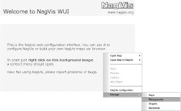

图 18-3。在点击显示的图形后，将出现菜单

* * *

^([185]) [`www.nagvis.org/`](http://www.nagvis.org/)

^([186]) [`www.nagvis.org/screenshots`](http://www.nagvis.org/screenshots)

^([187]) 如果在 NagVis 配置文件**`config.ini.php`**（参见 18.1.1 安装源代码）中将参数**`usedgdlibs`**设置为**`0`**，则可以不使用 GD 库来管理。

^([188]) 完整的文档可以在[`www.nagvis.org/docs/1.3/nagvis_config_format_description`](http://www.nagvis.org/docs/1.3/nagvis_config_format_description)找到。

^([189]) [`www.nagvis.org/downloads`](http://www.nagvis.org/downloads)

^([190]) 相应的指南可以在[`www.nagvis.org/docs/extending/iconsets`](http://www.nagvis.org/docs/extending/iconsets)找到。

^([191]) FAQ 条目[`www.nagvis.org/docs/general/faq#how/to/run/nagvis/without/authentication/`](http://www.nagvis.org/docs/general/faq#how/to/run/nagvis/without/authentication/)描述了在不进行身份验证的情况下使用 NagVis 的方法，但出于安全考虑，您应该避免这样做。

# 18.2 创建 NagVis 地图

通过 URL [`nagiosserver/nagios/wui/index.php`](http://nagiosserver/nagios/wui/index.php) 访问 NagVis 配置界面。在这里，您将**``*`nagiosserver`*``**替换为您自己的 Nagios 主机名（图 18-3 显示了起始页面）。

它通过在您点击右键鼠标按钮时打开的菜单来操作。对于将 NagVis 菜单与其自己的菜单叠加的浏览器，第二次右键单击鼠标按钮将导致浏览器菜单消失。

如果您没有可用的 PNG 格式的合适背景图形，您可以通过菜单项**管理 | 背景**（如图图 18-4

图 18-4。创建一个新的空背景

此图像以原始大小显示在屏幕上，即未缩放。为了避免滚动，它不应太大，适当的大小取决于屏幕分辨率，并考虑可能的窗口边框。

之后，图像大小只能有限度地更改：尽管您可以随时上传或创建背景图像，但已经放置的对象不会受到背景大小或其他特性的任何更改的影响，因此它们可能无法正确地适应新的背景图像。此时唯一的选择是重新定位所有对象。最佳方法是首先在最终环境中仅使用少数几个对象进行实验，然后再设置广泛的地图。


图 18-5。如果地图图标集的条目为空，NagVis 将使用中央配置的默认值。

您现在为生成的或上传的图像创建一个新的地图。通过菜单项**管理 | 地图**（图 18-3 直接调用它。


图 18-6. 通过图形界面插入对象

在 图 18-5 中创建的地图的 **``*`mapname`*``** 为 **`Test`**。在地图本身中，你现在可以使用鼠标右键插入对象（见 图 18-6). 对象可以是图标、线条或特殊对象。图标和线条代表主机或服务的当前状态，也可以代表整个主机或服务组。图标只能反映地图的整体状态。特殊对象是表示无状态对象（例如，也可能是图标）或文本框的图形，这些文本框也可以提供超链接。

要插入主机组，请在菜单中选择 **添加对象 | 图标 | 主机组**。然后，将鼠标放在所需位置，并用鼠标左键定义图标的目的地（位置可以在以后更改）。

完成此操作后，将打开一个对话框，如图 18-7 所示。条目 **backend_id** 可以保持为空，此时 NagVis 将使用中央配置文件 **`config.php.ini`** 中的 **`backend`** 参数的值。在 **hostgroup_name** 下拉菜单中，NagVis 允许您从所有定义的主机组中选择。

可以通过输入数值或使用鼠标来根据 **x** 和 **y** 坐标定位图标。对于简单的图标，点 (x, y) 对应于中心，对于线条对应于起点或终点。z 坐标仅在图标重叠时使用。值 **`0`** 描述的是后面的底层图像，并保留用于背景，而具有最高 **z** 值的对象就在最前面。如果插入对象时显式地留空 **z** 坐标，它将自动接收值 **`1`**。

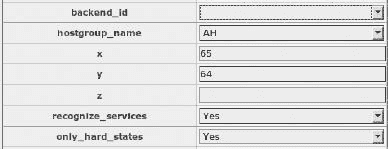

图 18-7. 在图形界面中定义主机组

参数 **`recognize_services`** 允许覆盖 **`config.ini.php`** 中的 **`recognizeservices`** 设置（见 18.1.2 初始配置)，而 **`only_hard_states`** 对参数 **`onlyhardstates`** 执行相同的操作（18.1.2 初始配置）。

以这种方式插入的对象始终以所选图标集中的 OK 图标的形式出现在图形编辑器中；Web 界面不考虑其实际状态。

如果将鼠标移至图标上，将打开一个悬停菜单，如图图 18-8 所示。它清楚地区分了哪些设置是继承的，哪些是在对象中直接指定的。如果您点击那里的**更改**链接，可以再次更改设置。


图 18-8. 如果将鼠标移至插入的对象上，将打开一个悬停菜单

当您的工作完成时，不要忘记通过上下文菜单中的**保存**（见第 396 页的图 18-3）保存您的更改）。然后，**在 NagVis 中打开地图**菜单项将带您进入完成后的视图，现在它确实显示了实际状态。

在图 18-9 中，已为主机组图标添加了一个文本框。在此文本框下方显示的字段是一个悬停菜单，当鼠标移至对象上时，它会显示关于对象及其状态的信息。本例显示，主机组中的两个主机显示为“不正常”状态，并且这已经通过确认得到了证实。


图 18-9. 最终视图中带有文本框和悬停菜单的对象

完成的地图可以通过 URL 直接调用[`nagiosserver/nagios/nagvis/nagvis/index.php?map=mapname`](http://nagiosserver/nagios/nagvis/nagvis/index.php?map=mapname)。

## 18.2.1 以文本形式编辑配置

NagVis 将地图的整个配置存储在文本文件中，这些文件也可以使用文本编辑器进行编辑。这些文件位于目录**`/usr/local/nagios/share/nagvis/etc/maps/`**中。如果您使用的是已知栅格的背景图像，您可以在 WUI 中插入多个对象，并使用刚刚确定的坐标在编辑器中继续编辑地图。这就是图 18-2 中显示的地图是如何创建的。背景图像（图 18-1）是用 OpenOffice 创建的，以便获得可重复的栅格；OpenOffice 绘图随后导出为 PNG 文件。

文本文件的配置选项，总体来说非常广泛，已在在线文档中描述.^([192])

## 18.2.2 将 NagVis 地图添加到 Nagios Web 界面

NagVis 地图也可以集成到 Nagios Web 界面中。图 18-10 显示了在**`index.html`**页面添加了第三个框架之后的情况，该框架将一个 32 像素高的地图绑定在主窗口下方。无论管理员当前在做什么，最重要的状态（在这里是主机组）总是直接显示，并且可以通过单次鼠标点击访问。使用 NagVis 时，你的用户界面梦想没有限制！

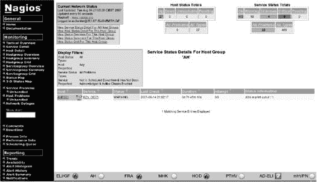

图 18-10. NagVis 地图作为 Nagios Web 界面中的“脚注”

* * *

^([192]) [`www.nagvis.org/docs`](http://www.nagvis.org/docs)

# 第十九章. 性能数据的图形显示

当 Nagios 快速且选择性地向管理员报告发生的问题时，它基本上只能区分 OK 状态和错误状态，从而避免了管理员收到有关有问题的服务和主机的信息洪水。在一段时间内测量值的图形显示不能集成到这种“交通灯方法”中，但可以通过第三方软件实现。Nagios 支持通过为此创建的接口进行外部处理值。通过它处理的数据在 Nagios 术语中被称为*性能数据*。

Nagios 有两种不同类的性能数据。第一类是 Nagios 内部性能数据，包括测试性能时间统计以及实际测试时间与计划时间之间的差异（*延迟*）。第二类包括插件与测试结果一起传递的性能数据。这包括插件可以测量的所有内容：响应时间、硬盘使用情况、系统负载等。这些都是管理员感兴趣的事情，这也是为什么本书专注于如何处理它们。

Nagios 提取这些数据，要么将其写入文件以便其他程序处理，要么直接传递给在每次服务或主机检查之后运行的第三方软件。

# 19.1 使用 Nagios 处理插件性能数据

只有当相应的插件以预定义的格式提供时，服务检查和主机检查提供的性能数据才能被处理。如图所示，使用**`check_icmp`**插件(6.2 使用 Ping 进行可达性测试, 第 108 页)，它以**`|`**符号开头，并且在 Web 界面中不显示：

```
nagios@linux:libexec/nagios$ **./check_icmp -H vpn01**
OK - eli02: rta 96.387ms, lost 0%| rta=96.387ms;200.000;500.000;0; pl=0%;
40;80;;
```

这种标准化形式在大多数插件中仅在版本 1.4 之后提供.^([193]) 性能数据本身由以下形式的一个或多个变量组成：

```
*name= value ; warn ; crit;min; max*
```

变量 **``*`name`*``** 可以包含空格，但此时它必须被单引号包围。等号之后首先是作为整数或浮点小数的测量值，可以带或不带单位。可能的单位有 **`%`**（百分比）、**`s`**（秒）、**`B`**（字节大小）或 **`c`**（计数器，一个增量计数器）。

此后，由分号分隔，接着是警告和临界限制，然后是最小和最大值。插件可以省略百分比值。您也可以为最小/最大值、警告或临界限制指定 **`0`**，如果不存在此类阈值值。如果有多个变量，它们可以用空格分隔，如 **`check_icmp`** 示例所示。然而，与此相反，最后的指定不应以分号结束，根据开发者指南。

## 19.1.1 模板机制

Nagios 有两种处理性能数据的方法：要么系统使用一个 *模板* 将数据保存到文件中，要么执行一个外部命令。如果您只想将数据持续写入日志文件，模板过程配置起来相对容易一些。

为了使 Nagios 能够处理所有性能数据，该参数

```
# /etc/nagios/nagios.cfg
...
process_performance_data=1
...
```

必须设置为 **`1`**。Nagios 将主机或服务性能数据写入的文件由参数 **`host_perfdata_file`** 和 **`service_perfdata_file:`**

```
# /etc/nagios/nagios.cfg
...
# host_perfdata_file=/var/nagios/host-perfdata.dat
service_perfdata_file=/var/nagios/service-perfdata.dat
# host_perfdata_file_template=[HOSTPERFDATA]\t$TIMET$\t$HOSTNAME$\t$HOST
EXECUTIONTIME$\t$HOSTOUTPUT$\t$HOSTPERFDATA$
service_perfdata_file_template=[SERVICEPERFDATA]\t$TIMET$\t$HOSTNAME$\t$
SERVICEDESC$\t$SERVICEEXECUTIONTIME$\t$SERVICELATENCY$\t$SERVICEOUTPUT$\
t$SERVICEPERFDATA$
...
```

如果 **`host_perf data_file`** 被注释掉，如本例所示，Nagios 不会保存任何主机检查的性能数据。但鉴于它们仅在所有服务检查失败时才使用，主机检查的本质在于它们只提供零星且不规律的数据。这就是为什么在大多数情况下不值得评估它们的原因。

**`*_perf data_file_template`** 参数定义了输出格式。上面显示的定义，**`service_perfdata_file_template`**，以以下模式提供（单行）日志文件条目：

```
[SERVICEPERFDATA]       1114353266     linux01 PING  0.483    0.104 OK
- 10.128.254.12: rta 100.436ms, lost 0% rta=100.436ms;3000.000;6000.000
;0; pl=0%;40;80;;
```

每一行以一个 **`[SERVICEPERFDATA]`** “戳记”开始，后面跟着测试时间（以纪元秒 **`($TIMET$)`** 表示），主机名和服务描述（**`$HOSTNAME$`** 和 **`$SERVICEDESC$`**），Nagios 进行测试所需的时间（**`$SERVICEEXECUTIONTIME$`**），以及性能计划时间和实际时间之间的延迟（**`$SERVICELATENCY$`**），每个值之间用制表符分隔。

然后 Nagios 将 Web 界面的输出写入日志文件（**`$SER-VICEOUTPUT$`**），最后写入实际性能数据（**`$SERVICEPERF-DATA$`**）。参数定义中的**`\t`**确保日志中的各个细节通过制表符分隔。使用**`*_perfdata_file_mode`**参数，您可以定义 Nagios 是将数据追加到现有文件（**`a`**）还是覆盖现有文件（**`w`**）：

```
# /etc/nagios/nagios.cfg
...
**host_perfdata_file_mode**=a
**service_perfdata_file_mode**=a
...
```

这适用于可以读取（之前已设置）命名管道数据的程序。这种方法提供了更好的性能，并且不需要硬盘上的任何空间。然而，如果处理软件没有运行，数据可能会丢失：Nagios 会尝试一段时间继续写入管道，但如果数据无法读出，则会超时并终止此过程。

从日志文件读取的程序通常会在之后删除它，以防止文件系统溢出。如果程序没有检索任何数据，文件会迅速增长，但只要文件系统还有空间，就不会丢失任何数据。

最好将外部评估软件作为永久服务运行。但您也可以配置 Nagios，使其定期触发程序进行进一步处理：

```
# /etc/nagios/nagios.cfg
...
# **host_perfdata_file_processing_interval**=0
# **service_perfdata_file_processing_interval**=0
# **host_perfdata_file_processing_command**=process-host-perfdata-file
# **service_perfdata_file_processing_command**=process-service-perfdata-file
```

使用**`*_perfdata_file_processing_interval`**参数，您设置一个秒数间隔，在此之后 Nagios 将定期运行相应的**`*_perf data_file_processirLg_command`**。此命令被定义为正常的 Nagios 命令对象：

```
# misccommands.cfg
...
define command{
    command_name   **process-service-perfdata-file**
    command_line   */path/to_the/evaluation_program*
}
...
```

只要外部软件本身负责处理性能数据文件，您就无需使用**`*_perf data_file_processing_*`**参数。

## 19.1.2 使用外部命令处理性能数据

作为模板方法的替代方案，Nagios 还可以直接调用一个命令，该命令接管数据的进一步处理。这是在每个测试结果之后直接进行的；因此，在每个单独的检查之后，都会启动一个外部程序。如果您有大量需要检查的服务，这可能会根据软件的不同而显著降低性能。

命令本身是通过**`process_perfdata_command`**参数定义的，而不是通过**`perfdata_file`**参数：

```
# /etc/nagios/nagios.cfg
...
process_performance_data=1
**service_perfdata_command**=process-service-perfdata
...
```

与服务性能数据相同，您还可以使用**`host_perfdata_command`**参数处理主机检查的结果。**`process-service-perfdata`**本身再次指的是一个正常的 Nagios 命令对象：

```
# misccommands.cfg
...
define command{
   command_name   **process-service-perfdata**
   command_line   */pfad/zum/programm* "$LASTSERVICECHECK$||$HOSTNAME$||$
SERVICEDESC$||$SERVICEOUTPUT$||$SERVICEPERFDATA$"
}
...
```

这将打开外部程序，并将必要的信息作为参数传递给它。这应包括至少最后一次服务检查的时间戳（**`$LASTSERVICECHECK$`**）、主机名（**`$HOSTNAME$`**）、服务描述（**`$SERVICEDESC$`**），以及实际的服务性能数据（**`$SERVICEPERFDATA$`**）。分隔符取决于使用的程序：此示例使用**`||`**，这是 Nagiosgraph 程序使用的分隔符。

* * *

^([193]) 一些工具，如 Nagiosgraph 和 NagiosGrapher，利用了剩余文本通常也包含性能数据的事实。如果它们相应地配置，它们能够提取其中包含的性能数据。这样，它们可以进一步处理不符合标准格式的数据。

# 19.2 使用 Nagiosgraph 在 Web 上创建图表

使用来自 [`nagiosgraph.sf.net/`](http://nagiosgraph.sf.net/) 的程序 Nagiosgraph，插件提供的性能数据可以在 Web 界面中以时间顺序的形式以图形方式显示。该软件由两个 Perl 脚本组成。脚本 **`insert.pl`** 将 Nagios 性能数据写入循环冗余数据库，这是一个环形缓冲区，其中最新数据会覆盖最旧数据^([194])。这种方法的优点是所需空间小，这可以在事先定义。

这个技巧包括根据数据的不同年龄以不同的分辨率保存数据：较旧的数据以较低的分辨率（例如，每天一个测量值），当前数据以较高的分辨率（例如，每五分钟一个测量值）。在设置数据库时，您还定义了数据保留的时间长度。这从一开始就定义了空间需求。

假设 Nagiosgraph 检测到性能数据，当它首次出现时，程序将为每个新服务创建一个单独的循环冗余数据库。包含的 **`map`** 配置文件仅描述了一些服务，因此通常需要一些手动工作——以及基本的 Perl 知识。

第二个 Nagiosgraph 脚本 **`show.cgi`**，一个 CGI 脚本，以动态 HTML 页面的形式表示数据库中的信息。为此，它（在配置完成后）以以下形式运行

```
http://nagsrv/*path/to*/show.cgi?host=*host*&service=*service_description*
```

Nagiosgraph 然后为所需服务显示四个图表（每日、每周、每月和年度摘要）。

## 19.2.1 基本安装

安装在 Linux 发行版中的 RRDtool 软件包是 Nagiosgraph 的先决条件。或者，您可以从 [`www.rrdtool.org/`](http://www.rrdtool.org/) 获取当前源代码。出于性能考虑，建议您还安装包含的 Perl 模块 **`RRDs`**。

建议将 Nagiosgraph 的 tar 文件解压缩到目录 **`/usr/local/nagios`**：

```
nagios@linux:local/nagios$ **tar xvzf nagiosgraph-0.5.tar.gz**
nagiosgraph/INSTALL
nagiosgraph/README
nagiosgraph/README.map
nagiosgraph/insert.pl
nagiosgraph/insert_fast.pl
nagiosgraph/map
nagiosgraph/nagiosgraph.conf
nagiosgraph/show.cgi
nagiosgraph/testcolor.cgi
nagiosgraph/testentry.pl
```

**`insert.pl`** 提取 Nagios 传输的数据并将其插入到 RRD 数据库中。如果该数据库不存在，则脚本将创建它。或者，**`insert_fast.pl`** 可以承担这项任务。此脚本使用 Perl 模块 **`RRDs`**，这比每次调用外部程序 **`rrdtool`**（这是 **`insert.pl`** 所做的）要高效得多。

另一个名为 **`testentry.pl`** 的 Perl 脚本可以帮助您测试自己的 **`map`** 条目。但既然您必须直接将它们写入此文件，您也可以更改 **`map`** 文件本身（如下所示）——前提是您已经创建了备份副本。CGI 脚本 **`testcolor.cgi`** 更像是一个开发者遗留在包中的工具，而不是对用户有任何帮助的工具。

除了已经提到的 **`map`** 配置文件外，还有一个名为 **`nagiosgraph.conf`** 的第二个配置文件，并且其路径必须在 **`insert.pl`**（或 **`insert_fast.pl`**）和 **`show.cgi`** 中正确定义，因此建议您检查这一点：

```
my $configfile = '/usr/local/nagios/nagiosgraph/nagiosgraph.conf';
```

## 19.2.2 配置

### 配置文件 **`nagiosgraph.conf`**

所有其他相关路径——例如到 **`map`** 文件和到 **`rrdtool`** 的路径——都在 **`nagiosgraph.conf`** 中调整：

```
rrdtool = /usr/bin/rrdtool
rrddir  = /var/lib/rrd/nagiosgraph
logfile = /var/nagios/nagiosgraph.log
mapfile = /usr/local/nagios/nagiosgraph/map
debug   = 2
colorscheme = 4
```

Nagiosgraph 在 **`rrddir`** 目录中创建 RRD 数据库。在这里，用户 **`nagios`** 必须有写权限，而以该用户的权限运行的 Web 服务器用户必须有读权限：

```
linux:~ # **mkdir -p /var/lib/rrd/nagiosgraph**
linux:~ # **chown nagios.nagcmd /var/lib/rrd/nagiosgraph**
linux:~ # **chmod 755 /var/lib/rrd/nagiosgraph**
```

对于这两个用户都需要写访问权限的日志文件（Web 用户因为 CGI 脚本也会将信息记录到日志文件中），也是至关重要的：

```
linux:~ # **touch /var/nagios/nagiosgraph.log**
linux:~ # **chown nagios.nagcmd /var/nagios/nagiosgraph.log**
linux:~ # **chmod 775 /var/nagios/nagiosgraph.log**
```

Nagiosgraph 的详细程度可以通过 **`debug`** 调整。可能的调试级别在包含的配置文件中有文档说明：**`2`** 表示“错误”，“**4**”表示“信息”——在这里 Nagiosgraph 已经非常详细，你必须注意文件系统不要溢出。除了调试目的（例如设置系统时）外，最好选择 **`2`**。

使用 **`colorscheme`**，它可以接受从 1 到 8 的值，你可以影响图表中的颜色数量——最好是尝试不同的选项，看看哪个配色方案最适合你的个人品味。

### Nagios 配置

Nagiosgraph 直接从 Nagios 抓取性能数据。因此，**`nagios.cfg`** 不需要任何 **`*_perfdata_file_*`** 参数。

```
# /etc/nagios/nagios.cfg
...
process_performance_data=1
service_perfdata_command=**process-service-perfdata**
...
```

**`process_performance_data`** 开启了性能数据的处理；**`service_perfdata_command`** 指向包含外部命令的 Nagios 命令对象：

```
# misccommands.cfg
...
define command{
  command_name **process-service-perfdata**
  command_line   /usr/local/nagios/nagiosgraph/insert_fast.pl "$LASTSERV
ICECHECK$||$HOSTNAME$||$SERVICEDESC$||$SERVICEOUTPUT$||$SERVICEPERFDATA$"
}
...
```

参数 **`command_line`** 的定义必须写在一行中（不使用反斜杠 **`\`**），就像通常一样。

为了使 CGI 脚本可以直接从 Nagios Web 界面运行，定义了一个 **`serviceextinfo`** 对象：

```
define serviceextinfo{
    service_description PING
    host_name       *
    notes_url       /nagiosgraph/show.cgi?host=$HOSTNAME$&service=PING
    icon_image      graph.gif
    icon_image_alt  show graphics
}
```

如果在 **`icon_image`** 中定义的图形位于目录 **`/usr/local/nagios/share/images/logos`** 中，Web 界面将所有主机的 **`PING`** 服务在状态显示中标记为这个。在这里可以看到 show.cgi 的强大之处：正是因为这个脚本明确地用主机和服务名称调用，才可能定义像上面的定义。除了单个主机名称外，您也可以指定一个主机组，或者，就像这个例子中一样，一个 **`*`**。这个要求是 PING 确实被定义为每个主机的服务。 

**`$HOSTNAME$`** 宏随后自动插入适当的主机。因此，对于特定服务类型（必须在所有主机中具有相同的服务描述）的附加信息，只需一个单一的定义即可满足。

### Apache 配置

为了使 Apache 网络服务器能够接受 CGI 脚本，创建了一个 **`Script-Alias`**，例如：

```
ScriptAlias /nagiosgraph/ /usr/local/nagios/nagiosgraph/
```

此条目最好放在 1.5 网络界面的配置（第 47 页）中讨论的配置文件 **`nagios.conf`**。只有在重新加载 Apache 之后，才能从 19.2 使用 Nagiosgraph 的网络图表 中指定的 URL 运行 CGI 脚本。

### 对 map 的调整

根据服务类型，循环冗余数据库也可能保存多个测量系列，这些系列可以通过 CGI 脚本单独请求：

```
http://nagsrv/*path/to*/show.cgi?host=*host*&service=*service_description*&db=
*database,entry1,entry2*&db=*database,entry3*
```

这里使用的数据库包含至少三个不同的测量系列，前两个系列在一张图中一起显示，而第三个系列则在单独的图中显示。显示在一起和显示分开的内容取决于标准化。在同一个图中显示硬盘的百分比负载和绝对字节数没有太大意义，因为 Y 轴只能有一个刻度。在这里，最好在一张图中显示百分比值，在另一张图中显示绝对字节数。另一方面，可以在一张图中显示系统负载的各种平均值（一分钟、五分钟和十五分钟）。如果您省略所有 **`db`**= 规范，Nagiosgraph 总是会在一张图中显示一个服务的所有测量值。

个体数据库和测量值显示的内容由 **`map`** 文件定义。要了解其中包含的指令如何影响数据的提取，只需将调试级别切换到 **`4`** 并查看日志文件 **`nagiosgraph.log`** 中的输出。每次插入函数运行时，Nagiosgraph 会重新读取配置文件，因此这不会引起任何类型的重置。

在以下日志文件摘录中，三个点标记了我们为了清晰起见不会打印的部分：

```
... INSERT info:... servicedescr:PING
... INSERT info:... hostname:linux01
... INSERT info:... perfdata:rta=99.278ms;3000.000;7000.000;0; pl=0%;60;
80;;
... INSERT info:... lastcheck:1114853435
... INSERT info:... output:OK - 172.17.4.11: rta 99.278ms, lost 0%
```

输出来自 **`check_icmp`** 插件。主机名、服务描述、性能数据（**`perfdata:`**）和标准输出行（**`output:`**）各自占一行。在性能数据中，插件使用变量 **`rta`** 宣布 *往返平均*，并使用 **`pl`**（*数据包丢失*）表示丢失的数据包数量。

**`map`** 文件包含 Perl 指令，用于过滤这些输出并提取相应的数据（如果有匹配项）。每个指令都以一个搜索指令开始：

```
/perfdata:rta=([.\d]+)ms.+pl=(\d+)%/
```

经典的 Perl 搜索函数由两个连续的斜杠 **`/`** 组成，其中包含一个正则表达式形式的搜索模式。圆括号对包围的部分模式，通过这种方式找到的文本可以通过变量 **`$1`**、**`$2`** 等访问。

因此，第一个括号中的模式匹配单个数字（**`\d`**）或点，^([197]) 并且下一个 + 状态表示可以有多个（或一个也没有）。然而，在第二个圆括号中，允许一个或多个数字，但不能有点。具体来说，**`$1`** 提供响应时间的数值，**`$2`** 提供百分比中的数据包丢失。

**`map`** 文件中的完整指令使用 **`and`** 操作符链接两个 Perl 语句：

```
# -- check_icmp
# perfdata:rta=100.424ms;5000.000;9000 .000;0; pl=0%;40;80;;
/perfdata:rta=([.\d]+)ms.+pl=(\d+)%/
and push @s, [ 'ping',
               [ 'rta',        'GAUGE', $1 ],
               [ 'losspct',    'GAUGE', $2 ],
             ];
```

如果第一个——搜索函数——成功，那么轮到 **`push`** 语句。它将方括号中跟随的表达式添加到数组 **`@s`** 中。指令以分号结束。如果搜索函数没有提供结果，则 **`map`** 指令不会在 **`@s`** 数组中保存任何条目。要包含在数组中的表达式具有以下格式：

```
[ *db-name*,
      [*name_of_data_source, type, value* ],
      [*name_of_data_source, type, value* ],
      ...
]
```

Nagiosgraph 数据库文件的文件名由主机名、服务描述和数据库名组合而成，例如，**`linux01_PING_ping.rrd`**。数据库名称的期望字符串应输入到 **`map`** 文件中（在这种情况下，**`ping`**）代替占位符 *db-name*。

数据源名称可以自由选择，但应包含存储在此处的数据的指示，例如，**`rta`** 表示响应时间或 **`losspct`** 表示丢失的包的百分比。

您指定的 *类型* 由 RRD 工具确定。**`GAUGE`** 表示简单测量值，它们以原样显示。Nagiosgraph 作者 Soren Dossing 推荐使用 **`DERIVE`** 处理计数器，例如在查询网络接口上的数据包计数器。计数器增量增长，当它们溢出时，从零开始。这里感兴趣的是两个时间点之间的差异。如果指定数据源类型 **`DERIVE`**，RRD 数据库将自动确定这些值。

数据库名称、数据源和类型应始终在 **`map`** 文件中以单引号放置，以防止与 Perl 中保留的关键字发生名称冲突。

测量值本身是通过 Perl 方法确定的，占位符 *value* 被相应的指令替换。在最简单的情况下，您可以使用 **`$1`**、**`$2`** 等等（见上面的示例）来接管性能数据中找到的值，或者通过乘以 1024 或计算百分比来计算新值：

```
# -- check_nt -v USEDDISKSPACE
# perfdata:C:\ Used Space=1.71Gb;6.40;7.20;0.00;8.00
/perfdata:.*Used Space=([.\d]+)Gb;([.\d]+);([.\d]+);([.\d]+);([.\d]+)/
and push @s,  [ 'disk',
                [ 'used',    'GAUGE', $1*1024 ],
                [ 'usepct',    'GAUGE', ($1/$5)*100 ],
                [ 'freepct', '  'GAUGE', (($5-$1)/$5)*100 ],
];

# -- check_disk (unix)
# perfdata:/=498MB;1090;1175;0;1212
m@perfdata:.*/([^ =]+)=([.\d]+)MB;([.\d]+);([.\d]+);([.\d]+);([.\d]+)@
and push @s, [ $1,
               [ 'used',    'GAUGE',    $2*1024**2 ],
               [ 'warn',    'GAUGE',    $3*1024**2 ],
               [ 'crit',    'GAUGE',    $4*1024**2 ],
];
```

第一条记录评估了 Windows 服务器上**`check_nt`**（见 20.2.1 NSClient，第 476 页）对硬盘空间的查询。性能数据还包含除**`$1`**中的占用空间外，还有**`$5`**中的数据载体大小。这可以用来计算可用百分比（**`freepct`**）和已用百分比（**`usepct`**）。

第二个示例通过将指定的 MB 数空闲硬盘空间乘以 1024²来转换成字节，评估 Unix 主机上通过**`check_ disk`**获得的数据。关键和警告限制始终保持不变，这导致出现水平线，如图 19-1 所示：下方的线在 12.1 GB 处代表警告限制，中间的线代表当前负载，上方的线在 18.1 GB 处，代表关键限制。每个单独的图表的键列出了最小值、最大值和平均值作为数值。这种对两个限制值的区分没有任何用处，但无法避免，因为 Nagiosgraph 不知道这些是常数：它将警告和关键限制值视为任何其他测量值。

如果插件不提供任何性能数据，但提供在正常输出中使用的值，则可以将搜索功能应用于输出（**`/output:.../`**）而不是性能数据。例如，Nagiosgraph 论坛在[`sourceforge.net/forum/forum.php?forum_id=394748`](http://sourceforge.net/forum/forum.php?forum_id=394748)提供帮助。


图 19-1. Nagiosgraph 表示的主机`linux0l`上文件系统`/net/linux01/a`的使用空间和限制值

对**`map`**的更改至关重要。因此，建议您首先复制文件，然后编辑副本，并使用**`perl -c`**进行语法检查：

```
nagios@linux:libexec/nagios$ **cp map map.new**
nagios@linux:libexec/nagios$ **vi map.new**
nagios@linux:libexec/nagios$ **perl -c map.new**
nagios@linux:libexec/nagios$ **mv map.new map**
```

如果语法检查无误，您可以安装新的文件作为**`map`**。

* * *

^([194]) 关于此主题的更多信息可以在[`www.rrdtool.org/`](http://www.rrdtool.org/)找到。

^([195]) 要安装，请参阅 19.4.1 安装。

^([196]) 关于**`serviceextinfo`**对象的更详细描述包含在 16.4.2 扩展服务信息，第 366 页。

^([197]) 一对方括号包含备选方案。

^([198]) 这将千字节转换为字节。

# 19.3 使用 Perf2rrd 准备性能数据以进行评估

另一个将 Nagios 性能数据传输到 RRD 数据库的工具是 Java 应用程序 Perf2rrd。这需要一个已安装的 Java 运行时环境（1.4.2 插件测试，或者最好是 1.5 配置 Web 界面）。由于虚拟机在较不强大的计算机上会产生明显的负载，并且还需要大量的内存，因此 Perf2rrd 对 Nagios 服务器的要求比 Nagiosgraph 的要求要高得多。

另一方面，在安装方面，在生成 RRD 数据库方面就没有更多的工作要做，因为 Perf2rrd 使用了 Nagios 的模板机制（见 19.1 使用 Nagios 处理插件性能数据，第 404 页）。对于模板中包含的每个服务和每个变量，该工具都会使用以下命名模式创建一个单独的 RRD 数据库：

```
*host+service_description+variable_name.rrd*
```

因此，为了评估**`check_icmp`**变量**`rta`**（往返平均）和**`pl`**（丢包率），文件名分别是**`linux01+PING+pl.rrd`**和**`linux01+PING+rta.rrd`**。

Perf2rrd 只负责在 RRD 数据库中存储数据，并不提供任何图形显示已保存数据的工具。Perf2rrd 的作者 Marc DeTrano 在这里提到了**`drraw`**工具（见 19.4 图形专家 drraw，第 420 页）。使用它可能是有益的，因为一方面**`drraw`**提供了比 Nagiosgraph 提供的单一显示更多的功能，另一方面你不必在 Perl 中与正则表达式抗争。

## 19.3.1 安装

对于安装，你应该从[`perf2rrd.sf.net/`](http://perf2rrd.sf.net/)获取 tar 格式的存档，并将其复制，最好复制到**`/usr/local`**层次结构中：

```
linux:~ # **cd /usr/local**
linux:usr/local # **tar xvzf /**path/to/**perf2rrd-1.0.tar.gz**
...
perf2rrd/run
...
```

之后运行的可执行程序是一个名为**`run`**的脚本，该脚本会调用 Java 字节码解释器，**`java`**。除此之外，该目录还包含 Java 类文件和其他实用工具，如果需要，可以使用这些工具重新编译包含的共享库**`librrdj.so`**。对于较新的发行版，这通常是不必要的。

为了让**`run`**能够找到**`java`**程序，它必须位于**`/usr/bin`**。如果不是这样（例如，因为你已经从[`www.sun.com/`](http://www.sun.com/)安装了 Java 存档），那么你应该设置一个链接：

```
linux:~ # ln -s /usr/local/jre1.5.0_02/bin/java/usr/bin/java
```

简短的测试可以显示 Perf2rrd 是否正确启动：

```
nagios@linux:local/perf2rrd$ **./run**
perf2rrd starting
Using Nagios Config: /etc/nagios/nagios.cfg
Using RRD Repository: /var/log/nagios/rrd
Unable to create RRD Repository
```

最后行显示的错误信息目前不是问题，因为我们已经将 RRD 数据库保存在了不同的目录中（Perf2rrd 永久运行）。

## 19.3.2 Nagios 配置

Perf2rrd 在 Nagios 配置中搜索它所需的所有数据：Nagios 应将性能数据写入哪个文件，用于此的写入模式，以及模板的格式：

```
# /etc/nagios/nagios.cfg
...
process_performance_data=1
...
service_perfdata_file=/var/nagios/service-perfdata.dat

service_perfdata_file_template=$TIMET$\t$HOSTNAME$\t\
   $SERVICEDESC$\t$SERVICEEXECUTIONTIME$\t$SERVICELATENCY$\t\
   $SERVICEOUTPUT$\t$SERVICEPERFDATA$

service_perfdata_file_mode=w
...
```

由于**`service_perfdata_file_mode=w`**，这里使用的命名管道必须手动创建——Perf2rrd 1.0 在 Nagios 2.0 中与正常文件接口（**`service_perfdata_file_mode=a`**）存在问题：

```
linux:~ # **mknod /var/nagios/service-perfdata.dat p**
linux:~ # **ls -l /var/nagios/service-perfdata.dat**
prw-r--r-- 1 nagios nagios 0 May 1 10:49 /var/nagios/service-perfdata.dat
```

在模板中缺少了介绍性的[**`SERVICEPERFDATA`**]戳记（参见 19.1 使用 Nagios 处理插件性能数据），因为 Perf2rrd 1.0 无法正确解析此戳记。更改 Nagios 配置需要重新加载：

```
linux:~ # **/etc/init.d/nagios reload**
```

最后，你为 RRD 数据库创建目录：

```
linux:~ # **mkdir /var/lib/rrd/perf2rrd**
linux:~ # **chown nagios.nagios /var/lib/rrd/perf2rrd**
```

## 19.3.3 实际应用中的 Perf2rrd

每次启动 Perf2rrd 时都加载 Java 虚拟机需要相当多的资源。因此，你不应该使用**`service_perfdata_file_processing_command`**参数在 Nagios 的特定间隔启动 Perf2rrd，也不应该使用**`one-shot mode`**，即通过**`./run -o`**，其中软件一次处理一个文件。理论上，这可以通过 cron 作业定期运行 Perf2rrd。相反，建议你让程序永久运行。

当首次使用时，我们建议你开启调试模式，这将显示发生的任何问题。选项**`-d`**指定工具应创建和更新 RRD 数据库的目录：

```
nagios@linux:local/perf2rrd$ **./run -d /var/lib/rrd/perf2rrd -x**
perf2rrd starting
Using Nagios Config: /etc/nagios/nagios.cfg
Using RRD Repository: /var/lib/rrd/perf2rrd
Debug Mode is on
Reading perfdata from **named pipe**.
Perf Data File is : /var/nagios/service-perfdata.dat
I believe we are using Nagios ver. 2
Object Cache File is : /var/nagios/objects.cache
**Nagios interval_length 60**
called update with: .../eli02+PING+rta.rrd 1114938329:0.079
called update with: .../eli02+PING+pl.rrd 1114938329:0.0
**/var/lib/rrd/perf2rrd/sap-14+SAP-3202+time.rrd created**.
called update with: .../sap-14+SAP-3202+time.rrd 1114938688:0.030775
...
```

Nagios 配置文件、RRD 存储库和数据传输模式（**`named pipe`**）的输出紧随 Nagios 使用的（并通过**`interval_length`**参数设置的）时间单位。通常这是 60 秒，即**`5`**分钟的检查间隔为五分钟。确保此参数被正确识别非常重要，因为 Perf2rrd 通过将**`normal_check_interval`**和**`interval_length`**参数相乘来确定 RRD 数据库的*步长间隔*。

在步长间隔内发生的所有测量值都由数据库进行平均。如果这个时间段太小，数据库可能永远不会发布任何值，因为它期望保存的数据比实际获得的多得多。

当 Nagiosgraph 使用固定的五分钟间隔时，Perf2rrd 会调整自身以适应 Nagios 配置。然而，软件仅在创建 RRD 数据库时考虑间隔；稍后更改 Nagios 配置不会产生进一步的影响。你可以做的唯一改变是删除 RRD 数据库并重新设置它。

### 永久运行的 Perf2rrd

在命名管道上运行 Perf2rrd 有一个缺点：如果 Nagios 重新启动，它会先关闭管道然后再重新打开。不幸的是，当管道关闭时，Perf2rrd 也会随之关闭。

这可以通过 Daniel J. Bernstein 的 Daemon Tools 来防止。它们监控程序并在这些程序停止时重新启动它们。它们自己通过 init 进程的 **`/etc/inittab`** 条目启动，并在它们在某个时刻自行关闭时重新启动。可以从 [`cr.yp.to/daemorLtools/install.html`](http://cr.yp.to/daemorLtools/install.html) 获取 Daemon Tools 的 tar 文件，并将其解压到 **`/usr/local/src`** 目录中：

```
linux:~ # **cd /usr/local/src**
linux:local/src # **tar xvzf */path/to/*daemontools-0.76.tar.gz**
admin
admin/daemontools-0.76
admin/daemontools-0.76/package
admin/daemontools-0.76/package/README
...
admin/daemontools-0.76/src
```

这将创建 **`admin/daemontools-0.76`** 目录，其中包含子目录 **`package`** 和 **`src`**。从那里你应该运行 **`install`** 脚本，它会编译并安装程序：

```
linux:local/src # **cd admin/daemontools-0.76**
linux:admin/daemontools-0.76 # **package/install**
```

二进制文件会落在新创建的目录 **`daemontools-0.76/com-mand`** 中，并保留在那里。安装程序还会设置指向它们的符号链接，这些链接指向新创建的文件夹 **`/command`**。

**`install`** 脚本还在 **`/etc/init-tab`** 文件中包含以下行，以确保 Daemon Tools 永久运行：

```
SV:123456:respawn:/command/svscanboot
```

程序 **`svscanboot`** 会定期搜索新的或崩溃的守护进程。为此，它会扫描 **`/service`** 目录，该目录也是在安装过程中创建的。只需一个符号链接就可以让 Perf2rrd 被监控：

```
linux:~ # **ln -s /usr/local/perf2rrd /service/perf2rrd**
```

Daemon Tools 在此目录中搜索名为 **`run`** 的脚本并启动它。为了使 **`run`** 能够找到 RRD 存储库的路径，在脚本文件中输入了实际的命令行选项而不是 **`$*`**：

```
# exec java -cp $classpath perf2rrd $*
exec java -cp $classpath perf2rrd -d /var/lib/rrd/perf2rrd
```

现在，启动和结束 Perf2rrd 由程序 **`svc`** 负责：

```
linux:~ # **/command/svc -d /service/perf2rrd**
linux:~ # **/command/svc -u /service/perf2rrd**
```

**`-d`** 选项（表示 *down*）会停止指定的服务，而 **`-u`** (*up*) 选项会再次启动它。在开始时运行它并不是必需的，因为 Daemon Tools 会定期扫描 **`/service`** 目录以查找新的服务并自动启动它们。这一点很重要，因为本书基于的 Nagios-2.0 测试版在配置的命名管道无法读取时存在问题。那时，它可能根本不会再提供任何数据，直到重新加载或重启。在印刷时，无法确定 Nagios 2.0 最终版本是否修复了这个问题。

* * *

^([199]) 使用 **`a`**，Nagios 将数据追加到正常日志文件中；使用 **`w`**，它通过命名管道使其可访问。参见 19.1 使用 Nagios 处理插件性能数据，第 404 页。

# 19.4 图形专家 **`drraw`**

从由 Perf2rrd 或 Nagios-graph 生成的 RRD 数据库中，CGI 脚本**`drraw`**创建交互式图形——简单的相对快速，而对于更复杂的图形，则需要了解一些 RRDtools 的知识^([200))。

## 19.4.1 安装

对于**`drraw`**的安装，您需要从[`www.taranis.org/drraw/`](http://www.taranis.org/drraw/)获取当前的 tar 文件，并将其解压到 Web 服务器 CGI 层次结构中的自己的子目录中^([201)]:

```
linux:~ # **cd /usr/lib/cgi-bin**
linux:lib/cgi-bin # **tar xvzf** /path/to/**drraw-2.1.1.tar.gz**
drraw-2.1.1/
...
drraw-2.1.1/drraw.cgi
drraw-2.1.1/drraw.conf
drraw-2.1.1/icons/
...
```

然后将此目录重命名为**`drraw`**^([202)）

```
linux:lib/cgi-bin # **mv drraw-2.1.1 drraw**
```

**`drraw.cgi`**本身除了 Perl 外，还需要 Perl CGI 模块（**`CGI.pm`**）和至少版本 1.0.47 的 RRDtools；低于 1.0.36 的版本将无法工作。如果您的发行版不包含当前版本，您应从[`www.rrdtool.org/`](http://www.rrdtool.org/)获取源代码并自行编译：

```
linux:~ # **cd /usr/local/src**
linux:local/src # **tar xvzf */path/to/*rrdtool-1.0.49.tar.gz**
...
linux:local/src # **cd rrdtool-1.0.49**
linux:src/rrdtool-1.0..49 # **./configure**
...
linux:src/rrdtool-1.0..49 # **make**
...
linux:src/rrdtool-1.0..49 # **make install**
...
linux:src/rrdtool-1.0..49 # **make site-perl-install**
```

CGI 脚本**`drraw.cgi`**使用 Perl 模块**`RRDs`**，在执行**`make site-perl-install`**安装后，会自动找到。

## 19.4.2 配置

**`drraw`**的配置包含在文件**`drraw.conf`**中：

```
linux:cgi-bin/drraw # **egrep -v '^#|^$' drraw.conf**
...
%datadirs = ('/var/lib/rrd' ⇒ '[RRDbase]',
            );
$vrefresh = '120';
@dv_def = ( 'end - 6 hours', 'end - 28 hours', 'end - 1 week', 'end - 1
month', 'end - 1 year' );
@dv_name = ( 'Past 6 Hours', 'Past 28 Hours', 'Past Week', 'Past Month',
'Past Year' );
@dv_secs = ( 21600, 100800, 604800, 2419200, 31536000 );
$saved_dir = '/var/lib/drraw/saved';
$tmp_dir = '/var/lib/drraw/tmp';
...
```

显示的提取指定了 RRD 存储库（此处：**`/var/lib/rrd`**）作为最重要的细节，但也可以指定多个目录：

```
%datadirs = ('/var/lib/rrd' ⇒ '[RRDbase]',
             '/data/rrd'    ⇒ '[RRDdata]',
            );
```

方括号中的文本（例如，[**`RRDbase`**]）将在 Web 界面上稍后出现，这允许区分不同的不同存储库。变量**`@dv_def`**、**`@dv_name`**和**`@dv_secs`**影响布局和图形数量。

上面的配置比标准配置多生成一个图形。这代表过去六小时：**`@dv_def`**中的扩展语句**`'end--6 hours'**描述了**`rrdtool`**（见**`man rrdgraph`**）的时间段，在**`@dv_name`**中给出了合适的标题**`'Past 6 Hours'****，而**`@dv_secs`**包含六小时，转换为（**`21600`**）秒，由**`drraw`**作为单独的图形显示的时间段。

存储库必须可读，由运行 Web 服务器的用户权限读取，并且在**`$saved_dir`**和**`$tmp_dir`**中指定的目录也必须可读。如果除**`www-data`**之外的用户运行此程序，则必须相应地调整以下命令：

```
linux:~ # **mkdir -p /var/lib/drraw/{saved,tmp}**
linux:~ # **chown -R www-data.www-data /var/lib/drraw**
```

数据到达临时目录**`$temp_dir`**，其内容可以随时删除，而在**`$saved_dir drraw`**中存储程序需要访问已创建图形的配置数据。这些数据不得丢失。

**`drraw`**在三个阶段实现简单的访问保护：只读（**`0`**）、受限编辑（**`1`**）和完全访问（**`2`**）。登录到 Web 服务器的用户自动获得级别 2。未经授权的用户被视为**`guest`**并分配级别**`0`**。为了避免在开始时进行身份验证的麻烦，您可以在配置文件中的以下指令中授予用户**`guest`**完全访问权限：

```
%users = ( 'guest' ⇒ 2 );
```

## 19.4.3 实际应用

Web 服务器 CGI 目录中的 CGI 脚本可以通过 URL [`nagiosserver/cgi-bin/drraw/drraw.cgi`](http://nagiosserver/cgi-bin/drraw/drraw.cgi)访问。


图 19-2. `ddraw`启动菜单

新图形在启动图片中的**创建新图形**菜单项中生成，启动图片如图 19-2]），可以进一步限制可用的数据源；此表达式也可以是简单的文本，例如**`sap-12`**。

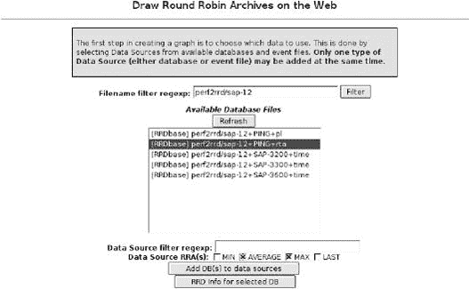

图 19-3. 选择数据源

一旦您选择了 RRD 数据库，您只需指定要使用的*循环冗余存档*（RRA）。这些存档中的每一个都以特定的形式保存数据，通过合并函数处理：**`AVERAGE`**函数平均测量周期内累积的所有测量数据，**`MIN`**只保存区间内数据的最低值，而**`MAX`**只保存最高值。由于原始数据已丢失，创建循环冗余数据库时必须指定存档；如果当时考虑到这一点，则只能稍后回忆最大值。

如果您无法记住存在哪些存档，您可以使用按钮**`RRD Info for selected DB`**来显示它们。点击**`Add DB(s) to Data Sources`**按钮将带您进入一个对话框，您首先需要向下滚动一点才能到达项目**`Data Source Configuration`**（图 19-4]）

**更新** 按钮提供了完成图形的预览，同时揭示了使用的 **`rrdtool`** 选项 (图 19-5). 当你保存时，使用 **保存图形**，你将获得一个如下形式的链接

```
http://*nagiosserver*/cgi-bin/drraw/drraw.cgi?Mode=view;Graph=11149589.4932
```

通过这些教程，你可以随时访问图形。或者你现在可以在 **`drraw`** 的 **所有图形** 下找到该图形。


图 19-4. 精细调整图形配置

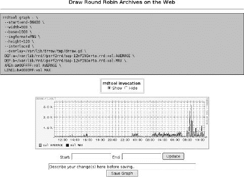

图 19-5. 预览并指定 `rrdtool` 选项


图 19-6. 完成的图形表示不同的时间段

当你保存图形时提到的链接可以记录在 **`service-extinfo`** 对象中，使其可以通过 Nagios 接口直接访问：

```
define serviceextinfo{
    service_description PING
    host            sap-12
    notes_url /nagiosgraph/drraw/drraw.cgi?Mode=view;Graph=11149589.4932
    icon_image      graph.gif
    icon_image_alt  View graphics
}
```

使用模板和仪表板，**`drraw`** 包含其他一些功能，由于篇幅原因，这里不能详细讨论。模板允许在同一个图形中显示相同类型的多个来源。这些来源可以在 **创建新图形** 中指定 (参见 图 19-3). 由于你只能一次添加一个来源，因此你必须为每个单独的来源点击 **添加** 按钮，然后再继续下一个。

仪表板展示了一个包含多个预览图形的显示。如果你点击其中一个图形，你会看到详细的表示。交互式菜单 **创建仪表板** 包含简要说明，你可以在这里获得关于两个功能的帮助。

* * *

^([200]) 除了主页上的文档 [`www.rrdtool.org/`](http://www.rrdtool.org/) 之外，包含的教程 (`man rrdtutorial`) 是一个有用的起点，同样还有手册页 **`man rrdgraph`**。

^([201]) 这个目录取决于你使用的发行版或 Apache 配置。

^([202]) 也可以使用符号链接，但那时 Apache 必须配置为遵循符号链接，这通常不是自动完成的。

^([203]) POSIX 正则表达式；参见 **`man 7 regex`**。

^([204]) 在 RRDtools 作者 Tobias Oetiker 的主页 [`people.ee.ethz.ch/~oetiker/webtools/rrdtool/tut/index.en.html`](http://people.ee.ethz.ch/~oetiker/webtools/rrdtool/tut/index.en.html) 上有许多教程。

# 19.5 大部分自动化：NagiosGrapher

Netways 提供的 NagiosGrapher，The Nagios Exchange Platform 的托管者[`www.nagiosexchange.org/`](http://www.nagiosexchange.org/)，是一个强大的性能数据表示工具，但已经非常强大。它还保存数据在轮询数据库中，并使用 RRDtools 进行处理和表示。它声称易于安装，并且与“竞争者”相比，在很大程度上是自动工作的。然而，后者承诺至今尚未实现；就像 Nagiosgraph 一样，你必须配置搜索模式以解释插件输出或性能数据。RRD 数据库由 NagiosGrapher 自动生成；此外，工具**`serviceextinfo`**也会生成条目。

一旦它识别出性能数据，你就不必再担心将其集成到 Nagios 中。只需重新加载即可使在此期间生成的**`serviceextinfo`**条目在 Nagios 中可用。这些条目是“智能”创建的，所以如果你在服务摘要中点击相应的图标（见图 19-7，在 434 页），你将直接进入性能数据的图形显示。

在功能性和安装努力方面，NagiosGrapher 位于 Nagiosgraph 和 Perf2rrd 之间：所需的初始配置比 Nagiosgraph 要多一些，但图形输出的变化可能性要大得多，而且你不必像 Perf2rrd/**`drraw`**那样逐个生成每个图形。

## 19.5.1 安装

除了 RRDtools（至少在版本 1.2 中）和程序**`auto-conf`**之外，NagiosGrapher 还需要一系列 Perl 模块：**`CGI`**，**`CGI::Carp`**，**`Calendar:: Simple`**，**`Carp`**，**`Data:: Dumper`**，**`File::Basename`**，**`File::Copy`**，**`GD`**，**`IO::Handle`**，**`Image::Magick`**，**`POSIX`**，**`RRDs`**，**`Storable`**，**`Time::HiRes`**，**`Time :: Local`**，和**`URI::Escape`**。

安装它们有两种选择，即从发行版中包含的软件包或从 CPAN 安装。在 Debian "Etch"和类似的基于 Debian 的系统上，如果你选择安装**`autoconf`**，**`rrdtool`**，**`perl-modules`**，**`libcalendar-simple-perl`**，**`libgd-gd2-perl`**，**`perlmagick`**，**`librrds-perl`**，和**`liburi-perl`**这些软件包，你将拥有所有模块。在其他发行版中，你必须搜索上述模块，最好使用发行版中的图形软件包安装器。你可以在执行**`configure`**命令后运行**`make testdeps`**来查看你是否已安装所有所需的模块。使用**`make fixdeps`**命令从 CPAN 安装每个最新模块版本。

NagiosGrapher 的源代码可以从 NagiosExchange 获得，205 并解压到目录 **`/usr/local/src`**：

```
linux:~ # **cd /usr/local/src**
linux:local/src # **tar xvjf**/path/to/**NagiosGrapher-1.6.1.tar.bz2**
...
linux:local/src # **cd NagiosGrapher-1.6.1**
linux:src/NagiosGrapher-1.6.1 # **autoconf**
```

命令 **`autoconf`** 生成一个 **`configure`** 脚本。在运行此脚本之前，编辑文件 **`config.layout`**，它提供了各种 *布局*。在 NagiosGrapher 文档中，这个术语意味着所有必需的安装路径的定义。

**`config.layout`** 包含一系列与发行版相关的建议，需要根据本书中的约定在某个方面进行更改。为此，最好复制与您的发行版匹配的部分，并将其重命名为 **`<Layout nagiosbook>`**，并修改多个条目。206 对于 Debian "Etch"，以下条目适用（更改的值以粗体显示）：

```
# config.layout
<Layout nagiosbook>
   prefix:                /usr/local/nagios
   nagios_config:  **/etc/nagios**
   nagios_config_cgi: **/etc/nagios/cgi.cfg**
   nagios_images:         ${prefix}/share/images
   nagios_images_logos:   ${prefix}/share/images/logos
   nagios_folder_cgi:     ${prefix}/sbin
   nagios_contribution:   ${prefix}/contrib
   perl_inc:           **${prefix}/perl/lib**
   ng_config:          **/etc/nagios**
   ng_config_sub:         ${ng_config}/ngraph.d
   ng_daemon:          **/var/nagios_grapher**
   ng_srvext_file:     **/etc/nagios/serviceextinfo.cfg**
   ng_srvext_dir:      **/etc/nagios/serviceext**
   ng_interface_pipe:  **/var/nagios/rw/ngraph.pipe**
   ng_perffile_path:   **/var/nagios/**
   ng_logfile:         **/var/nagios/ngraph.log**
   ng_rrd:             **/var/lib/rrd/nagios_grapher**
   ng_rrd_font: /usr/share/fonts/truetype/ttf-dejavu/DejaVuSansCondensed.ttf
   ng_cgi:                /nagios/cgi-bin
   ng_logos:              /nagios/images/logos
   ng_pid_file:           ${ng_daemon}/nagios_grapher.pid
   init_script_dir:       /etc/init.d
   logrotate_conf_dir:    /etc/logrotate.d
</Layout>
```

在此情况下，参数 **`perl_inc`** 中定义的 Perl 模块路径对应于 Ton Voon 为 Perl 模块 **`Nagios::Plugin`** 建议的目录（参见 使用 CPAN 的方法）。

新布局包含在 **`configure`** 脚本中：

```
linux:src/NagiosGrapher-1.6.1 # **./configure --with-layout=nagiosbook**
...
```

您可以运行 **`make testdeps`** 来检查是否已满足所有依赖项，特别是 Perl 模块的依赖项：

```
linux:src/NagiosGrapher-1.6.1 # **make testdeps**
/usr/bin/perl ./tools/testdeps.pl
Checking Data::Dumper ... found
...
Checking IO::Handle ... found
Checking URI::Escape ... found
Checking Calendar::Simple ... not installed!
make: *** [testdeps] Error 1
```

如果发生错误，例如在这个例子中，您必须安装适当的模块（这里 **`Calendar::Simple`**）。这可以通过 CPAN 使用以下命令完成：

```
linux:src/NagiosGrapher-1.6.1 # **make fixdeps**
...
```

对于基于 Debian 的发行版，包命名方案相当简单：Perl 模块 **`Calendar:: Simple`** 被转换为包 **`lib-calendar-simple-perl`**，可以通过 **`apt-get`** 或 **`aptitude`** 安装：

```
linux:src/NagiosGrapher-1.6.1 # **apt-get install libcalendar-simple-perl**
...
```

再次运行 **`make testdeps`** 可以显示是否现在已满足所有要求。

已经安装的 NagiosGrapher 通过 **`make update`** 进行更新，因为 **`make install`**（用于新安装）不考虑已存在的配置文件，并简单地覆盖它们。207 **`make install`** 创建所有必要的目录，确保设置了正确的访问权限，并将所有文件复制到它们应该去的地方：

```
linux:src/NagiosGrapher-1.6.1 # **make install**
mkdir -p /etc/nagios/serviceext
chown -R nagios /etc/nagios/serviceext
mkdir -p /var/lib/rrd/nagios_grapher
chown -R nagios /var/lib/rrd/nagios_grapher
...
==================================================
Just a few steps to run the grapher ...
...
```

**`make`** 的输出以关于 NagiosGrapher 和 Nagios 配置的一些说明结束，我们将在 19.5.1 安装 和 图形重处理的选项 中更详细地探讨。

NagiosGrapher 的一个核心组件是守护进程 **`collect2.pl`**，它通过位于 **`/etc/init.d`** 的启动脚本 **`nagios_grapher`** 启动：

```
linux:~ # **/etc/init.d/nagios_grapher start**
```

为了使守护进程在系统启动时自动启动，在使用系统 V init 的发行版中设置了相应的符号链接。在 Debian/Ubuntu 中，这是通过系统脚本 **`update-rc.d`** 完成的：

```
linux:~ # **update-rc.d nagios_grapher defaults 98**
```

OpenSUSE 包含用于此目的的脚本 **`insserv`**：

```
linux:~ # **insserv nagios_grapher**
```

在 Fedora 中，此任务由 **`chkconfig`** 执行：

```
linux:~ # **chkconfig --add nagios_grapher**
     linux:~ # **nagios on**
```

## 19.5.2 配置

### 配置文件 **`ngraph.ncfg`**

配置文件 **`ngraph.ncfg`** 包含一个全局 **`config`** 部分，其中包含路径和一般设置。之后是一个包含指令，带有参数 **`cfg_dir`**，它在 Nagios 中，将指定目录中所有配置文件集成在一起。与 Nagios 不同，NagiosGrapher 的配置文件都以 **`.ncfg`** 结尾。

即使是快速浏览也能看出，语法符合 Nagios 使用的约定：

```
# /etc/nagios/ngraph.ncfg
define config {
     interface          file
     perffile_path      /var/nagios/
     pipe               /var/nagios/rw/ngraph.pipe
     port               5667
     buffer             1024
     pidfile            /var/nagios_grapher/nagios_grapher.pid

     user               nagios
     group              nagios

     step               300
     heartbeat          AUTO

     rrdpath            /var/lib/rrd/nagios_grapher/
     tmppath            /tmp/nagiosgrapher/

     fontfile          /usr/share/fonts/truetype/ttf-dejavu/DejaVuSansCon
densed.ttf

     serviceext_type   MULTIPLE
     serviceextinfo    /etc/nagios/serviceextinfo.cfg
     serviceext_path   /etc/nagios/serviceext

     url               /nagios/cgi-bin/graphs.cgi
     #notes_url        /wiki/index.php/$HOSTNAME$#$SERVICEDESC$
     notes_url

     nagios_config     /etc/nagios
     cgi_config        /etc/nagios/cgi.cfg
   icon_image_tag        dot.png' border="0"></a><A TARGET="_blank" HREF="g
raphs.cgi?###URL###"><img src='###IMAGESRC###' '
   icon_image_src        /nagios/images/logos/graph.png
   icon_image_script     /nagios/cgi-bin/rrd2-system.cgi?###URL###&start=-5
400&title=Actual&width=20&height=20&type=AVERAGE&only-graph=true
   icon_image_static true

   log_file              /var/nagios/ngraph.log
   log_level             1023

   rrd_color_background  ffffff
   rrd_color_font        333333
   rrd_color_arrow       ff0000
   rrd_color_frame       ffffff
   rrd_color_grid
   rrd_color_canvas      ffffff
   rrd_color_shadea      c0c0c0
   rrd_color_shadeb      c0c0c0

   fe_use_browser_all    false
   fe_use_browser_for    nagiosadmin
   fe_use_browser_url    false
   fe_use_timefilter     true
   use_authentication    true
   ...
}
# Includes
cfg_dir=/etc/nagios/ngraph.d
```

**`config`** 部分包含以下参数：

**`interface`**

这定义了连接到 Nagios 的类型。可能的连接类型有 **`pipe`**、**`network`** 和 **`file`**。对于 **`pipe`** 类型，Nagios 和 **`collect2.pl`** 守护进程通过命名管道（参见 **`pipe`** 参数）进行通信；对于 **`network`** 类型，Nagios 通过 UDP 传输协议通过网络套接字发送性能数据（参见参数 **`port`**）。

与前面描述的接口类型不同，**`file`** 类型（从版本 1.7 开始可用）使用模板机制，这意味着 Nagios 将性能数据写入一个文件，该文件由守护进程 **`collect2.pl`** 定期评估。这使得首次可能进行大量处理性能数据，从而节省资源。默认接口类型在版本 1.6 之前是 **`pipe`**，从版本 1.7 开始是 **`file`**。

**`perffile_path`**

这定义了 Nagios 通过模板机制写入所有性能数据的文件目录。

**`pipe`**

这定义了一个命名管道，Nagios 通过程序 **`fifo_write`** 向其写入数据，并且收集脚本 **`collect2.pl`** 从中再次读取它们。从版本 1.6.1 开始，命名管道由 **`make install`** 自动创建。

**`port`**

这指定了 **`network`** 通信类型的 UDP 端口。默认值为 **`5667`**。

**`buffer`**

这确定通过 UDP 发送性能数据缓冲区的大小（以字节为单位）。默认值为 1024 字节。

**`pidfile`**

这定义了 NagiosGrapher 在启动时写入其自身进程 ID 的文件。

**`user, group`**

这些定义了以哪个用户和组权限运行的守护进程 **`collect2.pl`** 的权限。在这里，指定 Nagios 工作时使用的用户和组权限是有意义的。

**`step`**

这定义了 RRD 数据库的秒级步长。在此期间记录的所有值都由 RRDtools 汇总成一个值。因此，**`step`** 也描述了 RRD 数据库中数据的最低时间分辨率。该值仅对新建的 RRD 数据库有效，对现有数据库的后续修改没有影响。

**`heartbeat`**

心跳定义了一个以秒为单位的时间段，在此期间，RRD 数据库始终期望接收数据。如果在此期间没有任何测量值到达，NagiosGrapher 将生成一个无效条目（**`nan`**，即非数字）。

为了在上述示例中生成有效的条目，每**`600`**秒至少必须有一个测量值到达。由于分辨率为**`60`**秒，数据库包含“心跳”期间十个条目。如果这些值中有一个缺失，NagiosGrapher 将简单地用最后一个有效值替换它。如果十分钟内只有一个测量值到达，它将在数据库中记录十次。

**`rrdpath`**

这指定了 RRD 数据库的目录。它必须对用户**`nagios`**可写，并且（连同数据库文件）对 Web 服务器用户可读。该目录在安装 NagiosGrapher 时自动创建。

**`tmppath`**

这定义了 NagiosGrapher 临时保存内部 XML 文件的位置。

**`fontfile`**

这指定了 RRDtools 用于标注图形所使用的字体文件。

**`serviceext_type`**

这描述了如何创建**`serviceextinfo`**对象。使用**`SINGLE`**类型，NagiosGrapher 将所有内容写入**`serviceextinfo`**中指定的文件。

Nagios 2.0 也可以递归地读取目录，在这种情况下，最好使用**`MULTIPLE`**类型。然后 NagiosGrapher 为每个主机创建一个包含相应**`serviceextinfo`**对象的单独文件。目录由**`serviceext_path`**参数指定。这必须通过**`cfg_dir`**指令通知 Nagios。

**`url`**

这包含从 Web 服务器的角度（即从服务器根目录开始的路径）或从浏览器的角度（即完整的 URL）到 CGI 脚本**`graphs.cgi`**的路径。

**`notes_url`**

NagiosGrapher 自动生成**`serviceextinfo`**对象；能够设置参数**`notes_url`**（来自 16.4.2 扩展服务信息）也很有用，例如，生成一个指向 Wiki 条目的服务相关链接。

**`nagios_config`**

这揭示了 NagiosGrapher 标准配置文件的位置。

**`cgi_config`**

这指定了 Nagios CGI 配置文件。NagiosGrapher 使用此文件来找出除了联系组之外，谁有权查询所有主机的信息。

**`icon_image_tag`**

此参数对应于稍后在**`serviceextinfo`**对象中作为**`icon_image`**参数找到的条目。在**`serviceextinfo`**对象中，NagiosGrapher 将文本**`###URL###`**替换为主机和服务名称。另一方面，条目**`###IMAGESRC###`**则由 NagiosGrapher 替换为参数**`icon_image_src`**的内容。

在这里，程序通过一个技巧欺骗了 Nagios：**`dot.png`** 是一个一像素大小的图形，它在屏幕上是不可见的。为了创建一个围绕它、可见的第二个图标 **`graph.png`**，设置了一个超链接到 CGI 脚本 **`graphs.cgi`**。

通常情况下，如果你点击 **`icon_image`** 中指定的图像，Nagios 会带你到 **`扩展信息`** 页面，并且图形可以通过 **`url`**（Nagios：**`notes_url`**）仅通过另一个鼠标点击来访问。使用这里使用的技巧，你可以直接这样做。

在 **`icon_image_tag`** 后面的规范必须写在单行上。图 19-7 显示了图标 **`graph.png`**，它在 Nagios 界面中可见，多亏了自动生成的 **`serviceextinfo`** 对象。


图 19-7. NagiosGrapher 图标（箭头）在 Nagios 网络界面中表示对该服务的相关评估

**`icon_image_static`**

这指定了 图 19-7 中集成的图标是静态生成还是动态生成。可能的值是 **`true`**（静态图标）或 **`false`**（动态生成图标）。

**`icon_image_src`**

这指定了一个静态图标，NagiosGrapher 将其集成到 **`icon_image_tag`** 中。

**`icon_image_script`**

这定义了一个脚本，它生成的是图形的迷你视图而不是动态图标。

**`log_file`**

这定义了 NagiosGrapher 写入信息的日志文件。如果你想要日志轮转，你必须自己设置，因为 NagiosGrapher 不会自动清理。由于 Nagios 需要对该文件的写入权限，因此最好将其存储在 Nagios 的 **`var`** 目录中（在这种情况下：**`/var/nagios`**）。

**`log_level`**

此参数指定日志文件应包含什么信息。可能的值有 **`1`**（检测到的服务和值）、**`2`**（Nagios 提供的、NagiosGrapher 未识别的性能数据）、**`4`**（程序状态）、**`8`**（关于 **`serviceextinfo`** 对象的信息）、**`16`**（RRD 操作）和 **`32`**（从管道中读取的输入）。对于更广泛的调试，还有值 **`64`**（正则表达式解析的详细信息）和 **`128`**（关于配置文件解析的高级信息）。

如果您想记录这些信息类型中的几个，只需将相关值相加即可，因此使用**`255`**可以获得最全面的结果；第 445 页展示了此例。建议您仅将这些日志级别用于调试目的，并且通常应使用**`0`**或**`4`**。

**`rrd_color_*`**

**`rrd_color`**选项为 Web 界面增添了颜色（图 19-8)：**`rrd_color_background`**定义整个图像的背景颜色，**`rrd_color_font`**定义字体颜色，**`rrd_color_arrow`**定义箭头尖的颜色，**`rrd_color_frame`**定义键的框架颜色，**`rrd_color_grid`**定义网格颜色，**`rrd_color_canvas`**定义图表本身的背景。**`rrd_color_shadea`**定义框架顶部和左边的颜色，**`rrd_color_shadeb`**则定义框架右边和底部的颜色。颜色以十六进制表示的 RGB 值指定，前面有一个**`#`**，这是网页的标准做法。更改这些选项将在下次重新加载网页时立即生效。

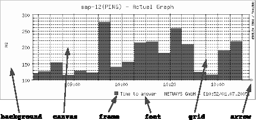

图 19-8. `rrd_color_*`颜色选项的影响

**`fe_use_browser_all`**

从版本 1.2 开始，NagiosGrapher 提供了一种方法，可以从任何主机的特定服务显示切换到其他服务的显示。为此，它将一个选择窗口集成到**`graphs.cgi`**显示中（参见图 19-9）。

值**`1`**激活下拉菜单**`host`**和**`service`**，**`0`**则隐藏它们。

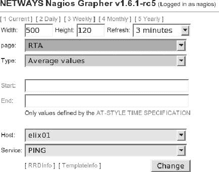

图 19-9. NagiosGrapher 是否显示`host`和`services`字段由`fe_use_browser`参数决定

**`fe_use_browser_for`**

此选项允许特定用户使用主机/服务选择。可以指定多个用户，用逗号分隔。为了确保只有此处指定的用户可以看到**`host`**和**`service`**的选择字段，**`fe_use_browser_all`**也必须同时设置为**`0`**。

**`fe_use_browser_url`**

此选项允许通过 URL**`graphs.cgi?browser=l`**插入**`host`**和**`service`**的选择字段，前提是值为**`1`**。如果值为**`0`**，则无法实现。

**`fe_use_timefilter`**

这控制了通过**开始**和**结束**选择的时间是否出现在浏览器菜单中（参见第 436 页的图 19-9）。值**`true`**显示选择，**`false`**隐藏它。

**`use_authentication`**

这定义了 NagiosGrapher 是否应该考虑 Nagios 的认证结果。值**`true`**允许观察者仅访问他作为联系人负责的主机和服务的资源。值**`false`**完全关闭认证，这样每个人都可以访问一切。

在 19.5.1 安装中提到的**`cfg_dir`**配置参数定义了一个包含附加配置文件的目录，特别是各种图表的定义：

```
cfg_dir=/etc/nagios/ngraph.d
```

NagiosGrapher 递归地检查任何名称的配置文件；它们只需要以**`.ncfg`**结尾。参数必须位于**`config{}`**块之外；参数和值之间必须有一个等号。

### 配置图形——基本原理

**`ngraph`**对象用于定义要提取并写入 RRD 数据库的数据，但对象还包含有关显示形式的信息。像 Nagios 一样，NagiosGrapher 将信息临时保存在缓存文件中，因此每次更改配置文件后都必须重新启动数据收集脚本**`collect2.pl`**，使用**`/etc/init.d/nagios_grapher restart`**。**`collect2.pl`**在完成此操作时还会更新对象缓存。

在安装过程中，NagiosGrapher 为**`ngraph`**对象提供了一些模板；这些模板可以在**`/etc/nagios/ngraph.d/templates`**下的**`standard`**和**`extra`**子目录中找到。这些模板都以**`.ncfg_disabled`**结尾，这样它们就不会被 NagiosGrapher 考虑。为了使用它们，需要重命名文件扩展名：

```
nagios@linux:nagios/ngraph.d$ **cp** \
**templates/standard/check_ping.ncfg_disabled ./check_ping.ncfg**
```

然而，**`check_ping.ncfg_disabled`**中的示例仅适用于**`check_ping`**，而不是**`check_icmp`**（参见 6.2 使用 Ping 进行可达性测试）。为了使 NagiosGrapher 能够图形化显示**`check_icmp`**插件性能数据中的平均响应时间**`rta`**（往返平均）和**`pl`**（数据包丢失），

```
nagios@linux:libexec/nagios$ **./check_icmp -H linux01**
OK - linux01: rta 96.387ms, lost 0%| rta=96.387ms;200.000;500.000;0; pl=
0%;40;80;;
```

以下**`ngraph`**对象被使用：

```
# check_icmp.ncfg
...
# Ping Packet loss
define ngraph{
           service_name                PING
           graph_perf_regex            pl=([0-9]*)%
           graph_value                 Loss
           graph_units                 %
           graph_legend                Packet Loss
           graph_legend_eol            none
           page                        Packet Loss
           rrd_plottype                LINE2
           rrd_color                   ff0000
}
# Ping RTA
define ngraph{
           service_name                PING
           graph_perf_regex            rta=([0-9]*\.[0-9]*)
           graph_value                 RTA
           graph_units                 ms
           graph_legend                Time to answer
           page                        RTA
           rrd_plottype                AREA
           rrd_color                   00a000
}
```

**`service_name`**

这由一个正则表达式组成，即`^([209])`，NagiosGrapher 通过它来识别在传递的数据中要显示的服务。如果使用相同插件的服务对象中提供的服务描述具有相同的前缀，则一个**`ngraph`**定义就足够了：**`Disk`**_ 匹配 **`Disk_usr`**，以及 **`Disk_var`** 或 **`Disk_tmp`**。为了使这生效，性能数据必须结构相同，如果使用相同的插件，这总是成立的。

**`graph_perf_regex`**

使用这个正则表达式，NagiosGrapher 可以在性能数据中找到要搜索的值。圆括号中的模式必须与值本身匹配。

如果插件没有提供任何性能数据，可以使用**`graph_log_regex`**代替。那里指定的搜索模式由 NagiosGrapher 应用于插件的正常文本输出。

**`graph_value`**

RRD 数据库中变量的名称对于每个服务必须是唯一的，并且不得包含空格或特殊字符（例外：下划线是允许的）。

**`graph_units`**

此参数定义 y 轴的单位。

**`graph_legend`**

这包含变量的键。

**`graph_legend_eol`**

这确定是否以及如何在这些图例的条目之后插入换行符。可能的值：**`left`**（换行，行左对齐），**`right`**（换行，行右对齐），**`center`**（换行，行居中对齐），**`justify`**（换行，完全对齐），和**`none`**（无换行，左对齐）。您可以将空格数附加到所有值上，用冒号与它分隔：**`none: 20`**不会创建换行符，但条目后面跟着 20 个空格。

**`graph_legend_max`**

这定义了图例的列宽。而不是手动使用空格格式化，使用**`graph_legend_eol`**，此参数指定图例条目的列应该有多宽。较长的条目将被截断。

**`page`**

这个可选参数确保 NagiosGrapher 在标准化不匹配的情况下以不同的图表显示变量。所有要在单个图形中使用的值都赋予相同的**`page`**条目。对于选择要显示的“页面”，CGI 脚本包含其自己的**`page`**条目字段（参见图 19-10）。


图 19-10. ping 的平均响应时间，由 NagiosGrapher 表示

对于两个**`check_icmp`**输出，建议将**`Loss`**的百分比（值范围从 0 到 100）与**`RTA`**（可以是几千毫秒）分开。

如果省略 **`page`** 参数，则两个图形——一个用于 **`Packet`** 丢失，另一个用于 **`RTA`**——将显示在一个图形中。

**`rrd_plottype`**

此参数定义 RRDtools 应该使用哪种绘图函数：

+   **`LINE1`**：简单线条，

+   **`LINE2`**：双线，

+   **`LINE3`**：额外的粗线，

+   **`AREA`**：填充的表面，

+   **`STACK`**：将当前值添加到前一个值上。在这种情况下，显示（线条或表面）取决于前一个值。

**`rrd_color`**

这是图形的 RGB 十六进制颜色表示（**``*`rrggbb`*``**）。

图 19-10 展示了 NagiosGrapher 如何显示主机 **`sap-13`** 上 PING 服务的平均响应时间 **`RTA`**。可以在 Web 表单的顶部选择相应的 **`页面`** 输出。此外，您还可以调整单个图形的 **`宽度`** 和 **`高度`**，以及 **`刷新`** 速率。

从版本 1.7 开始，NagiosGrapher 也具有缩放功能：如果您点击 图 19-10 中的任何一个图形，您可以看到更详细的视图。您可以使用鼠标在图表中选择一个时间段，NagiosGrapher 将在鼠标按钮释放后显示该时间段的数据图。

### 图形重新处理的高级选项

您可能并不总是希望直接显示测量值。使用 RRDtools 的 *CDEF* 功能，您可以添加从记录的值计算出的新值。

例如，我们将使用 **`check_disk`** 插件的输出（7.1 硬盘空闲容量, 第 158 页），该插件确定文件系统占用的量：

```
DISK OK - free space: /usr 287 MB (19%);| /usr=1225MB;1359;1465;0;1511
```

使用的空间以深灰色区域显示，空闲容量以浅灰色显示。性能数据提供了当前使用的空间（**`1225MB`**）和不可疑的警告限制，以及最小和最大值（文件系统的尺寸）。剩余的空闲容量是最大值和当前占用空间之间的差值。此外，MB 的单位有些不幸：图形将显示 10 GB 为 **`10k`** MB。因此，您首先确定插件返回的值，然后您可以按需对其进行缩放：

```
# (1) readout current occupancy of hard drive space,
#     but do not show it as a graphic
define ngraph{
        service_name               fs_
        graph_perf_regex           =([.].+)MB;[.].+;[.].+;[.].+;[.]. +
        graph_value                disk_used
        graph_units                Bytes
        graph_legend               used space
        rrd_plottype               AREA
        rrd_color                  00a000
        hide                       yes
}
```

在 **`service_name`** 后指定的正则表达式匹配所有以 **`fs_`**（代表 *文件系统*）开头的服务描述，即 **`fs_root`**、**`fs_usr`**、**`fs_var`**、**`fs_tmp`** 等。参数 **`hide`** 确保 CGI 脚本不显示图形。相反，NagiosGrapher 只将数据存储在数据库中。

在第二步中，使用 RRD 功能 **`CDEF`** 对确定的值进行标准化：

```
# (2) display used hard drive space in scaled form
define ngraph{
            service_name           fs_
            type                   CDEF
            graph_value            DISK_USED
            graph_legend           used space
            graph_calc             disk_used,1024,1024,*,*
            rrd_plottype           AREA
            rrd_color              666666
            hide                   no
}
```

**`type`**将条目标识为**`CDEF`**定义，它从已存在的值中计算新值。**`graph_value`**必须是唯一的，这就是为什么此处为条目提供了自己的名称。

**`graph_calc`**最终处理数据。此参数期望以逆波兰表示法（RPN）的指令。在此，要处理的价值依次推入堆栈，稍后将其移除并操作。

在 RPN 中，将 2 + 3 相加表示为**`2`**，**`3`**，+。在示例中，我们将图形重新处理的高级选项中定义的变量**`disk_used`**乘以 1024²，以便结果以字节为单位。**`hide no`**现在确保此值被显示。

要根据相同的模式显示可用空间，我们首先确定整个可用空间（**`disk_max`**），NagiosGrapher 不应显示，计算**`disk_max`**与上述**`disk_used`**值之间的差异，并将结果转换为字节：

```
# (3) defining the space available,
#     but not displaying it in the graphic
define ngraph{
       service_name              fs_
       graph_perf_regex          =[.].+MB;[.].+;[.].+;[.].+;([.].sb>+)
       graph_value               disk_max
       graph_legend              max space
       rrd_plottype              LINE2
       rrd_color                 0000a0
       hide                      yes
}

# (4) calculate and display free space
define ngraph{
      service_name         fs_
      type                 CDEF
      graph_value          DISK_MAX
      graph_legend         free space
      rrd_plottype         STACK
      rrd_color            CCCCCC
      graph_calc           disk_max,disk_used,-,1024,1024,*,*
      hide                 no
}
```

相应的公式是（**`disk_max-disk_used`**）x1024²。绘图类型**`STACK`**确保从上一个**`disk_used`**值确定的价值位于其顶部。图 19-11 显示了相应的输出：屏幕的下半部分表示过去六小时、过去一天和一周内文件系统上的当前使用空间，上半部分显示剩余的空闲硬盘空间。图表还包含月度和年视图，此处未显示。

在这一点上，应再次强调，根据此定义，NagiosGrapher 自动记录所有以**`fs_`**开头并与搜索模式匹配的服务，将数据写入 RRD 数据库，并生成相应的**`serviceextinfo`**条目，在 Nagios 重新加载后自动出现在 Web 界面中（见第 434 页的图 19-7）。

在对配置文件**`ngraph.ncfg`**进行更改后，文件收集器**`collect2.pl`**也必须重新启动：

```
linux:~ # **/etc/init.d/nagios_grapher restart**
```


图 19-11. 显示计算后的负载数据

### Nagios 配置

Nagios 通过命令界面传递数据给 NagiosGrapher，即每个单独的结果都会启动一个外部命令。相应地，Nagios 主配置文件包含以下参数：

```
# /etc/nagios/nagios.cfg
...
process_performance_data=1
service_perfdata_command=**process-service-perfdata**
```

命令对象 **`process-service-perfdata`** 的定义——最好通过创建一个名为 **`process_service_perfdata_n.graph.cfg`** 的单独文件来实现——取决于所使用的接口类型。

对于 **`interface pipe`**，使用程序 **`fifo_write`**，而对于 **`interface network`**，NagiosGrapher 需要程序 **`udpecho`**。

命令 **`fifo_write`** 的定义如下：

```
# process_service_perfdata_ngraph.cfg
...
define command{
      command_name **process-service-perfdata**
      command_line /usr/local/nagios/contrib/**fifo_write** /var/nagios/rw/ngr
aph.pipe '$HOSTNAME$\t$SERVICEDESC$\t$SERVICEOUTPUT$\t$SERVICEPERFDATA$\
n' 3
}
...
```

**`process-service-perfdata`** 调用脚本 **`fifo_write.pl`**，该脚本作为参数提供了三个参数：命名管道、包含性能细节的字符串以及以秒为单位的超时时间。后者确保如果数据在三秒内无法写入，则脚本将终止操作。**`command_line`** 必须像往常一样，写在一行上。

对于程序 **`udpecho`**，命令的定义相对简单：

```
# process_service_perfdata_ngraph.cfg
...
define command{
   command_name **process-service-perfdata**
   command_line     /usr/local/nagios/contrib/**udpecho**
}
...
```

**`udpecho`** 不需要任何参数：它从环境变量 **`NAGIOS_HOSTNAME, NAGIOS_SERVICE-DESC`**、**`NAGIOS_SERVICEOUTPUT`** 和 **`NAGIOS_SERVICEPERFDATA`** 中检索所需信息。Nagios 必须通过 **`enable_environment_macros=1`**（见 A.1 主配置文件 nagios.cfg）提供这些信息，以便 **`udpecho`** 可以向 NagiosGrapher 提供可用的数据。

对于 **`file`** 接口类型，命令 **`process-service-perfdata`** 有另一个含义：它不是对每个检查结果都调用，而是通过模板机制将文件移入 Nagios 写入所有性能数据的文件中：

```
# process_service_perfdata_ngraph.cfg
...
define command{
    command_name    process-service-perfdata
command_line mv /var/nagios/service-perfdata /var/nagios/service-per
fdata.$TIMET$
}
...
```

当前的时间戳简单地附加到文件名 **`service-perf-data`**。守护进程 **`collect2.pl`** 在指定目录中搜索所有名为 **`service-perfdata.`****``*`time_stamp`*``** 的文件，并处理这些文件。

Nagios 写入文件的数据由 **`nagios.cfg`** 中的 **`service_perf data_file_template`** 指定：

```
# /etc/nagios/nagios.cfg
...
service_perfdata_file_processing_command=process-service-perfdata
service_perfdata_file=/var/nagios/service-perfdata
service_perfdata_file_template=$HOSTNAME$\t$SERVICEDESC$\t$SERVICEOUTPUT
$\t$SERVICEPERFDATA$\t**$TIMET$**
service_perfdata_file_mode=a
service_perfdata_file_processing_interval=60
...
```

与 **`fifo_write.pl`** 的变体相比，Nagios 现在还传递每个检查的时间戳。这是必要的，因为数据不是立即处理，而是在 **`service_perfdata_ file_processing_interval`** 间隔内定期处理——在我们的例子中是 60 秒。

如果你想从这个中挤出更多性能，你可以为 **`service-perfdata*`** 文件选择一个临时文件系统，例如 **`/dev/shm`**。然后文件不会写入硬盘，而保持在 Nagios 服务器的内存中。

如往常一样，对 Nagios 配置的更改需要重新加载：

```
linux:~ # **/etc/init.d/nagios reload**
```

如果将日志级别设置为 255（见配置文件 ngraph.ncfg），则可以在日志文件中清楚地观察到这种成功的迹象。为了清晰起见，我们将省略行首的时间戳：

```
CFG: buffer ⇒ '1024'
     CFG: cgi_config ⇒ '/etc/nagios/cgi.cfg'
     ...
     PRG: Starting up collect2.pl (PID: 25003) ...
     PRG: using UDP socket (port: 5667)
     ...
     NET: got udp message from localhost:32783
     PIPE: swobspace PING OK - 192.168.1.9: rta 0.104ms, lost 0% rt a
     =0.104ms;200.000;500.000;0; pl=0%;20;60;;
     REGEX: 2 blocks for 'PING' found.
     REGEX: graph_value=RTA
     REGEX: output=perfdata
     REGEX: regex=m/rta=([0-9]* [0-9]*)/i
     REGEX: perfdata=rta=0.104ms;200.000;500.000;0; pl=0%;20;60;;
     REGEX: match=0.104
     REGEX: graph_value=Loss
     REGEX: output=perfdata
     REGEX: regex=m/.*pl=([0-9]*)/i
     REGEX: perfdata=rta=0.104ms;200.000;500.000;0; pl=0%;20;60;;
     REGEX: match=0
     VALUES: [swobspace][PING]: RTA=0.104 Loss=0
     RRD: rrdtool update /var/lib/rrd/nagios_grapher/swobspace/f66ffe61c885 d
     e2d8b6d0c41ff444b39.rrd --template=RTA:Loss N:0.104:0
...
```

标签**`PRG`**标识程序状态，例如这里的重启。**`PIPE`**完整地重现从命名管道（主机名、服务描述、插件输出和性能数据，每个用制表符分隔）中获取的所有数据。**`REGEX`**显示了如何搜索匹配条目以及如何从中提取值。**`RRD`**揭示了使用**`rrdtool`**执行的命令，而**`VALUES`**显示了识别的值（**`PING`**）。

* * *

^([205]) [`www.nagiosexchange.org/42;195`](http://www.nagiosexchange.org/42;195)

^([206]) 从 NagiosGrapher 1.7 版本开始，文件**`config.layout`**已经包含了条目**`<Layout nagiosbook>`**。

^([207]) 即使在运行**`make update`**时，事先备份配置文件也不会有害。

^([208]) 请参阅第 405 页的 19.1.1 模板机制。

^([209]) 由于我们手头有 Perl 脚本，这当然是一个 Perl 正则表达式。

^([210]) RPN 的介绍可以在[`people.ee.ethz.ch/˜oetiker/webtools/rrdtool/tut/rpntutorial.en.html`](http://people.ee.ethz.ch/%CB%9Coetiker/webtools/rrdtool/tut/rpntutorial.en.html)找到。

^([211]) 环境宏的描述可以在第 D.1.8 节 使用关于环境的标准宏中找到，从第 631 页开始。

^([212]) 通常：2^n - 1，其中*n*≥8。

# 19.6 使用 PNP 进行平滑绘图

*PNP 不是 PerfParse*——这个递归缩写是对 PerfParse 工具的暗指（本书中未描述），PNP 的作者 Jörg Linge 和 Hendrik B$aUcker 显然在宣扬他们自己的工具处理性能数据的优点：据说它安装起来非常容易（与 PerfParse 相比），并且几乎无需配置即可使用，但提供了广泛的配置选项以供高级使用。

除了提供特定检查的常规图表外，PNP 还创建了一个属于一个主机的所有图表的概述。一个基于 AJAX 的输入字段允许输入主机名。在输入过程中，名称会自动完成，并显示一个匹配列表的替代完成。图形具有复杂的外观，并且可以导出为 PDF 格式。

PNP 直接从插件输出保留区域获取性能数据，也就是说，只有显示性能数据的标准格式的插件才能使用。与 NagiosGrapher 不同，无法从正常文本输出中提取数据。为了弥补这一轻微的限制，PNP 自动输出所有插件的性能数据。如果 PNP 无法识别插件，它将使用通用模板。

在 PNP 主页^([213])上，您可以找到英文邮件列表^([214])和德语论坛的地址，尽管如此，您可以用英语提问.^([215]) 英文主页是[`www.pnp4nagios.org/pnp/`](http://www.pnp4nagios.org/pnp/)。

以下描述适用于 PNP 版本 0.4；较旧版本可能不具备此处描述的所有功能。

## 19.6.1 安装

安装要求相当简单：Apache、Perl（无需任何特殊模块）、PHP4 版本 4.3.0 或 PHP5，以及所有 RRDtools.^([216]) 如果可能，您应该从您的发行版中包含的 Perl 包中安装 Perl 模块 RRDs（例如，Debian 中的**`librrds-perl`**）。Perl 脚本**`process_perfdata.pl`**将 Nagios 性能数据转发到 PNP，然后直接访问 RRD 数据库，而不运行外部程序。

PNP 源代码从主页^([217]) 下载，并在**`/usr/local/src`**目录中适当解包：

```
linux:~ # **cd /usr/local/src/**
linux:local/src # **tar xvzf** /path/to/**pnp-0.4.tar.gz**
...
linux:local/src # **cd pnp-0.4**
linux:src/pnp-0.4 # **./configure --sysconfdir=/etc/pnp**
...
```

最后，**`make all`**编译必要的 C 程序，**`make install`**完全安装 PNP。在**`configure`**命令中，**`--sysconfdir=/etc/pnp`**允许在**`/etc/pnp`**中安装配置示例，这符合本书中使用的约定。其他**`configure`**选项可以通过**`./configure --help`**查看。

## 19.6.2 标准配置

在安装 PNP 期间，各种数据被放置在配置目录中（在这种情况下为**`/etc/pnp`**），包括**`config.php`**，这是 Web 界面的配置文件。在那里，您必须首先检查**`rrdtool`**和性能数据目录的路径是否设置正确：

```
# /etc/pnp/config.php
     ...
     $conf['rrdtool'] = "/usr/bin/rrdtool"
     $conf['rrdbase'] = "/usr/local/nagios/share/perfdata"
     ...
```

**`/etc/pnp`** 还包含数据收集器**`process_perfdata.pl`**的示例配置，在文件**`process_perfdata.cfg-sample`**和**`rra.cfg-sample`**中。这两者都不是绝对必要的：PNP 在没有调整的情况下也能正常工作。但为了使用数据收集器，您需要重命名文件**`process_perfdata.cfg`**和**`rra.cfg`**，并相应地修改它们。如果已安装 Perl 模块 RRDs，则它在**`process_perfdata.cfg`**文件中通过**`USE_RRDS=1`**被激活：

```
# /etc/pnp/process_perfdata.cfg
     TIMEOUT = 5
     USE_RRDs = **1**
     RRDPATH = /usr/local/nagios/share/perfdata
     RRDTOOL = /usr/bin/rrdtool
     CFG_DIR = /etc/pnp/
     RRA_CFG = /etc/pnp/rra.cfg
     RRA_STEP =60
     LOG_FILE = **/var/nagios/pnp-perfdata.log**
     LOG_LEVEL = 0
```

样本文件中的第二次更改（此处为粗体）指的是 Nagios 日志文件的目录，在本书中命名为**`/var/nagios`**。

**`rra.cfg`**用作新创建的 RRD 数据库的模板。如果需要修改现有数据库，则必须将其删除；但这样会丢失所有现有数据。该模板在存储长度和时间分辨率之间是一个很好的折衷方案：这会导致具有每小时时间分辨率的数存储长达四年，这样一个大约 400 KB 大小的 RRD 数据库。有关 RRD 数据库设置的说明，请参阅命令**`man rrdcreate`**。

在目录 **`/etc/pnp`** 中，还有 *Nagios 性能数据 C 守护进程* **`npcd`** 的配置文件 **`npcd.cfg`** 和一个名为 *自定义模板* 的子目录 **`check_ commands`**。这两者将在 19.6.4 大量处理性能数据 中讨论。

### 调整 Nagios 配置

Nagios 有多种方式可以将性能数据传递给 PNP 数据收集器 **`process_perfdata.pl`**。最简单的方式是系统为每个事件运行一个单独的程序，称为 **`service-perf-data-pnp`**。为此，在文件 **`/etc/nagios/nagios.cfg`** 中通过参数 **`process_performance_data`** 启用性能数据处理，并通过 **`service_perfdata_command`** 定义要执行的命令：

```
# /etc/nagios/nagios.cfg
     ...
     illegal_macro_output_chars='~$&|"<>
     # -- perfdata
     process_performance_data=1
     service_perfdata_command=**service-perfdata-pnp**
     ...
```

不同的插件性能数据包含设置在单引号中的名称。为了防止这些名称在插件输出中丢失，参数 **`illegal_macro_output_chars`** 中 *不得* 使用单引号.^([218])

命令 **`service-perfdata-pnp`** 运行 **`process_perfdata.pl`**:

```
# /etc/nagios/global/commands/service-perfdata-pnp.cfg
define command{
    command_name service-perfdata-pnp
    command_line /usr/bin/perl /usr/local/nagios/libexec/process_perfdat
    a.pl
}
```

内嵌的 Perl 解释器 ePN（见第 669 页的 附录 G）不能执行此 Perl 脚本，因此必须显式使用 **`/usr/bin/perl`**。如果 ePN 没有编译到 Nagios 中，可以省略 **`/usr/bin/perl`** 路径。

性能数据是通过环境变量 **`NAGIOS_SERVICEPERFDATA`** 由 **`process_perfdata.pl`** 采集的，因此通常必须不关闭环境变量.^([219])

## 19.6.3 PNP 网页界面

如果你运行 [`nagios_server/nagios/pnp/index.php`](http://nagios_server/nagios/pnp/index.php)，你将被带到 PNP 概览页面（见 图 19-12). 这显示了 PNP 找到的第一个主机的数据，按字母顺序排列。右上角的输入字段使用 AJAX 实现，并显示一个匹配已输入文本的命中列表，从中选择所需的主机。相关的概览页面以 24 小时视图展示所有服务。

这也可以直接通过 [`nagiosserver/nagios/ pnp/index.php?host=hostname`](http://nagiosserver/nagios/%20pnp/index.php?host=hostname) 访问。如果你将 **``*`hostname`*``** 替换为 **`elix01`**，你将到达该名称的主机概览页面（图 19-12）。


图 19-12. `elix01` 在一页上的所有服务

在服务图形或概述中右侧的辅助链接上单击鼠标，会导致所选显示以不同的时间分辨率显示（图 19-13)：四小时、一天和（未显示）一周、一个月和一年。PNP 在此处显示的周期在配置文件**`config.php`**中定义：

```
$views[0]["title"]   =   "4 Hours";
         $views[0]["start"]   =   ( 60*60*4 );

         $views[1]["title"]   =   "24 Hours";
         $views[1]["start"]   =   ( 60*60*24 );

         $views[2]["title"]   =   "One Week";
         $views[2]["start"]   =   ( 60*60*24*7 );

         $views[3]["title"]   =   "One Month";
         $views[3]["start"]   =   ( 60*60*24*30 );

         $views[4]["title"]   =   "One Year";
         $views[4]["start"]   =   ( 60*60*24*365 );
```

具体的**`title`**标签可以自由选择，因此您也可以使用其他语言中的文本。然而，图像本身无法本地化。

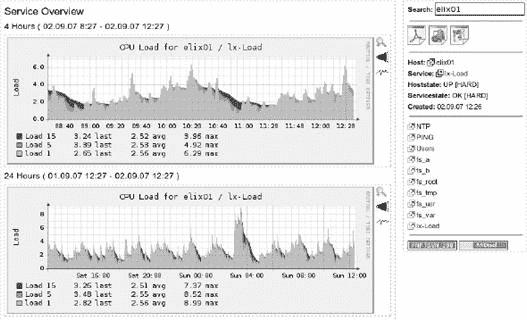

图 19-13. PNP 中的系统负载：主机`elix01`，服务`lx-load`

**`start`**细节指定了图形在定义的参考点之前多少秒开始。通常使用当前时间作为参考点，但也可以使用包含的日历来选择。为此，您点击日历图标（见图 19-14)，用鼠标点击选择**时间**后的结束时间，然后选择日期。选择时间需要一些习惯：单击会增加显示的值，同时按住键会减少显示的时间值。您也可以按住左鼠标按钮并拖动鼠标向左增加值，或向右拖动以减少值。


图 19-14. PNP 的日历功能

为了直接显示特定的服务，只需将详细资料**`svc=`****``*`servicename`*``**添加到 URL 中，这样您就有[`nagiosserver/nagios/pnp/index.php?host=hostname&svc=servicename`](http://nagiosserver/nagios/pnp/index.php?host=hostname&svc=servicename)。

PNP 的一个特定功能是每个图形都可以直接访问，而无需使用 HTML 或 PHP 页面。您需要两个可选参数**`display`**和**`view`**：[`nagiosserver/nagios/pnp/index.php?host=host&svc=servicename&display=image&view=0`](http://nagiosserver/nagios/pnp/index.php?host=host&svc=servicename&display=image&view=0)。**`display`**目前只能处理值**`image`**，而对于**`view`**，您输入在**`config.php`**中定义的索引：**`view=0`**指的是在那里用**`$views [0] ["start"]`**定义的时间周期（因此这是默认值，具有四小时概述）。

### 将 PNP 集成到 Nagios Web 界面

要在 Nagios 3 中直接从 Nagios Web 界面显示单个服务，您需要在服务定义中集成以下 URL 作为**`action_url`**：

```
# Nagios 3
define service {
    hostname              *hostname*
    service_description   *servicename*
    ...
    action_url            /pnp/index.php?host=$HOSTNAME$&srv=$SERVICEDESC$
}
```

在 Nagios 2.x 中，你需要对象**`serviceextinfo`**来实现相同的目的：

```
# Nagios 2.x
define serviceextinfo {
     hostname             *hostname*
     service_description  *servicedesc*
     ...
     action_url           /pnp/index.php?host=$HOSTNAME$&srv=$SERVICEDESC$
}
```

## 19.6.4 批量处理性能数据

讨论的常规配置调用每个检查中定义的**`service_perfdata_command`**命令。由于嵌入的 Perl 解释器 ePN（见第 669 页的附录 G）无法执行**`process_perf-data.pl`**，Nagios 必须为每个需要处理性能数据的服务的 Perl 解释器重新启动。这消耗了资源，并且根据主机的能力和要处理的服务数量，对 Nagios 的性能产生负面影响（要测量 Nagios 性能，请参阅第 653 页的附录 F）。因此，Nagios 实际上是被逼到了绝境，这意味着从计划开始点到实际开始检查之间的延迟时间大大增加，Nagios 的时间表（即*调度*）失控。

由 PNP 的批量模式与*Nagios 性能数据 C 守护进程*（NPCD）的组合提供了一种解决方案。^([220）当使用它时，Nagios 将性能数据——由模板（在**`service_perfdata_file_template`**中定义）格式化——写入一个文件，该文件由**`service_perfdata_file_processing_command`**中的命令定期重命名。NPCD 现在只为每个文件运行一次 Perl 脚本**`process_perfdata.pl`**。

**`service_perfdata_file_template`**定义了将数据写入**`service_perfdata_file`**中指定的文件时的格式：^([221])

```
# /etc/nagios/nagios.cfg
...
service_perfdata_file_template=DATATYPE::SERVICEPERFDATA\tTIMET::$TIMET$
\tHOSTNAME::$HOSTNAME$\tSERVICEDESC::$SERVICEDESC$\tSERVICEPERFDATA::$SE
RVICEPERFDATA$\tSERVICECHECKCOMMAND::$SERVICECHECKCOMMAND$\tHOSTSTATE::
$HOSTSTATE$\tHOSTSTATETYPE::$HOSTSTATETYPE$\tSERVICESTATE::$SERVICEST
ATE$\tSERVICESTATETYPE::$SERVICESTATETYPE$

service_perfdata_file=/var/nagios/service-perfdata
service_perfdata_file_mode=a
service_perfdata_file_processing_interval=30
service_perfdata_file_processing_command=service-perfdata-npcd
...
```

**`service_perfdata_file_mode`**指定 Nagios 如何处理文件：值**`a`**代表*追加*。因此，Nagios 将新结果追加到已存在的文件中。每 30 秒（如**`service_perfdata_file_processing_interval`**中指定）启动*文件处理命令* **`service-perfdata-npcd`**。它移动文件，重命名它，并添加当前的时戳，使用 Nagios 宏**`$TIMET$`**：

```
define command{
      command_name service-perfdata-npcd
      command_line /bin/mv /var/nagios/service-perfdata /var/nagios/perfsp
ool/service-perfdata-$TIMET$
}
```

重命名和移动不会消耗任何时间。因此，Nagios 可以立即恢复其正常任务，并将性能数据的进一步处理留给外部 NPCD 守护进程。NPCD 有自己的配置文件，在**`npcd.cfg`**中，安装期间被复制到目录**`/etc/pnp`**：

```
user=nagios
group=nagios
log_type=syslog
log_level=0
perfdata_spool_dir=/var/nagios/perfspool/
perfdata_file_run_cmd=/usr/local/nagios/libexec/process_perfdata.pl
perfdata_file_run_cmd_args=-b
npcd_max_threads=1
```

前两个条目指定 NPCD 应以哪个用户和哪个组成员身份启动。守护进程目前只能将其工作记录在 syslog 中。未来的版本也应该允许将其写入单独的文件。**`log_level=0`**确保 NPCD 本身保持安静，并将所有错误仅传递给 syslog 守护进程。

参数**`perfdata_spool_dir`**将监控的目录重命名。它必须已经存在；NPCD 不会自动创建它。由于在**`perfdata_file_run_cmd_args, process_perfdata.pl`**中给出了参数**`-b`**，因此以批量模式启动。

NPCD 在 PNP 的**`"make install"`**命令期间将自己安装到目录**`/usr/local/nagios/bin`**。运行**`make install-init`**会在**`/etc/init.d`**中放置一个额外的启动脚本，您需要检查配置文件的路径：

```
...
CONF=/etc/pnp/npcd.cfg
...
```

通过以下命令启动守护进程：

```
linux:~ # /etc/init.d/npcd start
```

根据您的发行版，**`rc`**目录中的初始化脚本链接到相关的运行级别：

```
linux:~ # ln -s /etc/init.d/npcd.sh /etc/init.d/rc2.d/S99npcd
linux:~ # ln -s /etc/init.d/npcd.sh /etc/init.d/rc3.d/S99npcd
linux:~ # ln -s /etc/init.d/npcd.sh /etc/init.d/rc5.d/S99npcd
```

## 19.6.5 图形应该如何显示？

PNP 图形的外观由模板决定。包含的示例位于目录**`/usr/local/nagios/share/pnp/templates.dist`**中。您不应该修改这些文件，因为它们将在下一次更新时被覆盖。目录**`templates`**用于一些模板。PNP 会取**`command_name`**中定义的检查名称，并在这里搜索一个名为**`*command_name.php`*``**的匹配模板。

如果 PNP 既找不到**`./templates`**或**`./templates.dist`**中的这个文件，它将使用默认模板**`default.php`**。

有时在**`templates.dist`**中已经存在一个合适的模板（例如，**`check_ping.php`**用于插件**`check_icmp`**），其名称与命令名称不匹配（在**`check_icmp`**的情况下，我们将其定义为**`command_name check_icmp`**）。然后您必须在**`./templates`**中创建一个指向所需文件的符号链接：

```
linux:~ # **cd /usr/local/nagios/share/pnp/templates**
linux:pnp/templates # **ln -s../templates.dist/check_ping.php \
check_icmp.php**
```

一个简单的模板，可以用于所有传输简单响应时间的插件是**`response.php`**：

```
<?php
#
# For all plugins that provide response times
# $Id: response.php 53 2006-06-07 07:16:50Z linge $
#

$opt[1] = "--vertical-label \"Response Time\" \
           --title \"Response Time For $hostname / $serviced
esc\" ";

$def[1]  =  "DEF:var1=$rrdfile:$DS[1]:AVERAGE " ;
$def[1]  .=  "AREA:var1#00FF00:\"Response Times \" " ;
$def[1]  .=  "LINE1:var1#000000:\"\" " ;
$def[1]  .=  "GPRINT:var1:LAST:\"%3.41g %s$UNIT[1] LAST \" ";
$def[1]  .=  "GPRINT:var1:MAX:\"%3.41g %s$UNIT[1] MAX \" ";
$def[1]  .=  "GPRINT:var1:AVERAGE:\"%3.4lg %s$UNIT[1] AVERAGE \" ";
?>
```

变量**`$opt[1]`**定义了**`rrdtool`**的选项，变量**`$def[1]`**定义了 RRD 图形。如果您想创建自己的模板，您需要更详细地了解**`rrdtool`**。图形的定义在**`man rrdgraph`**中有详细解释，更多信息可以在主页上找到.^([222])

### 自定义模板

PNP 基于定义的命令对象的名称。如果这不足以提供信息，例如在**`command_name check_nrpe`**的情况下，那么将使用目录**`/etc/pnp/check_commands`**中的所谓**自定义模板**。然而，这些模板必须包含原始命令的名称，在我们的例子中是**`check_nt.cfg`**：

```
#
# Adapt the Template if check_command should not be the PNP Template
#
# check_command check_nt!MEMUSE!80%!90%
# ________0__________|     |    |  |
# ________1________________|    |  |
# ________2_____________________|  |
# ________3________________________|
#
CUSTOM_TEMPLATE = 0,1
#
```

如果 **`check_nt`** 没有将 **`MEMUSE`** 作为第一个参数给出，那么插件 **`check_nt`** 的实际命令，只有这个参数才能区分是测量内存使用还是 CPU 负载，例如。参数 **`CUSTOM_TEMPLATE`** 组合了 PNP 在搜索模板时使用的命令：下面的例子组合了 **`check_nt`**（条目编号 0）和 **`MEMUSE`**（条目编号 1）。这意味着 PNP 将搜索名为 **`check_nt_MEMUSE.php`** 的模板。如果 **`CUSTOM_TEMPLATE = 1`**，PNP 将搜索 **`MEMUSE.php`**。现在在目录 **`./templates`** 中设置了一个合适的符号链接：

```
linux:~ # **cd /usr/local/nagios/share/pnp/templates**
linux:pnp/templates # **ln -s ../templates.dist/check_nt_mem.php**\
**check_nt_MEMUSE.php**
```

* * *

^([213]) [`www.pnp4nagios.org/pnp/`](http://www.pnp4nagios.org/pnp/)

^([214]) [`lists.sourceforge.net/mailman/listinfo/pnp4nagios-users`](https://lists.sourceforge.net/mailman/listinfo/pnp4nagios-users)（通常关于 PNP 使用）和 [`lists.sourceiorge.net/mailman/listinio/ pnp4nagios-devel`](https://lists.sourceiorge.net/mailman/listinio/%20pnp4nagios-devel)（功能请求、错误、补丁等）

^([215]) [`nagios-portal.de/forum/board.php?boardid=58`](http://nagios-portal.de/forum/board.php?boardid=58)

^([216]) [`www.rrdtool.org/`](http://www.rrdtool.org/)，也参见 19.4.1 安装。

^([217]) [`www.pnp4nagios.org/pnp/`](http://www.pnp4nagios.org/pnp/)

^([218]) 性能数据由宏 **`$SERVICEPERFDATA$`** 提供；参见 D.1.1 主机宏。

^([219]) 这只有在 Nagios 3.0 之后才成为可能，因为有了 **`enable_environment_macros`** 参数（参见 A.1 主配置文件 nagios.cfg）。关于环境变量的更多信息，请参见第 631 页的 D.1.8 关于环境的标准宏的使用。

^([220]) 名称中的 C 指的是与 Perl 脚本相比，C 程序的执行速度要快得多，因为 Nagios 每次都需要重新启动 Perl 解释器。

^([221]) 这只是一行，这里为了显示目的进行了换行。

^([222]) [`www.rrdtool.org/`](http://www.rrdtool.org/)

# 19.7 其他工具和图形评估的限制

除了这里介绍的工具之外，[`www.nagiosexchange.org/`](http://www.nagiosexchange.org/) 还提供了用于性能数据图形评估的更多工具。其中许多也是基于 RRDtools 和循环冗余数据库，其结果是它们对于多年精确评估并不太有用，就像这里描述的那样。

几个工具，如当前的 APAN^([223]) 版本，将它们的数据保存在 SQL 数据库中，从而实现长期统计而不会丢失数据。

PerfParse^([224]) 非常广泛，它将数据存储在 MySQL 或 PostgreSQL 数据库中，并包括其自己的广泛评估工具。因为它使用了各种当前库，而这些库并不包含在每个发行版中，所以安装障碍相当高。然而，对于那些 RRD 工具提供不足的人来说，应该看看 PerfParse 工具是否可以提供所需的功能。

尽管提供了所有这些选项，Nagios 性能数据的图形显示也有其局限性。如果你通过 ping 远程主机来检查 WAN 连接并测量平均响应时间，如果检查间隔只有每五分钟一次，那么所有漂亮的图形都没有什么意义。你每五分钟只能收到一个瞬间的快照，这并不能提供任何关于连接在一段时间内流量负载的严重线索。

要能够合理评估插件每分钟、五分钟和十五分钟报告的 Unix 计算机负载，检查间隔应该是一分钟。不那么关键的数据包括已使用的硬盘空间或温度。同样非关键的是网络流量的显示，插件以计数器的形式显示这些值。基于 RRD 的工具可以自动检测两次测量之间的差异并显示它们；检查间隔是一分钟、两分钟还是五分钟，这里都没有关系；没有数据丢失。

如果 Nagios 的测量精度不尽如人意，你可以并行部署其他工具，例如 Cricket^([225]) 或 Cacti.^([226])。如果外部工具（如 Munin^([227])）与 RRD 数据库一起工作，你可以检查这些关键值，以便它们包含在复杂的 Nagios 通知系统中。或者，外部工具可以提供一个接口，用于进一步处理记录的数据。这些可以作为被动测试结果传递给 Nagios，例如使用 NSCA（见第十四章）。

但额外的工具总是有增加配置努力的缺点。这是否合理，或者 Nagios 性能监控是否足够，取决于特定情况下所需的信息。

* * *

^([223]) [`apan.sf.net/`](http://apan.sf.net/)

^([224]) [`perfparse.sf.net/`](http://perfparse.sf.net/)

^([225]) [`cricket.sourceforge.net/`](http://cricket.sourceforge.net/)

^([226]) [`www.cacti.net/`](http://www.cacti.net/)

^([227]) [`munin.projects.linpro.no/`](http://munin.projects.linpro.no/)
