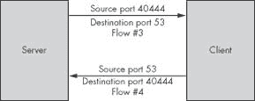

# 第一章. 流的基本概念

我假设到这一点，你已经接受了流可以解决你的问题的想法。现在，让我们具体了解一下流是什么，它们有什么好处，以及你如何实现和分析它们。本章重点介绍在 TCP/IP 网络上常见的流，特别是 TCP、UDP 和 ICMP 流。

本章假设你已具备 TCP/IP 的基本理解，并试图帮助你更深入地理解它。如果你发现自己越来越困惑，我建议你查阅 Charles M. Kozierok 的*《TCP/IP 指南》*（No Starch Press，2005 年）。我也鼓励你花些时间与数据包嗅探器一起观察现实世界中的 TCP/IP 事务，因为没有比观察它们执行实际工作更好的学习网络协议的方法了。

### 注意

经验丰富的网络管理员可能会发现本章重复了他们已经知道的主题。如果你已经理解了三次握手，如果看到`0x2`让你想到“TCP 重置”，那么你可能想跳过这一章。然而，本章从基于流的角度覆盖了这些材料，所以如果你决定跳过，当你困惑时不要来找我哭诉。

# 什么是流？

严格来说，一个*流*是一系列具有相同源和目的 IP 地址、源和目的端口以及 IP 协议的分组。这也被称为*五元组 IP 流*。*流*这个词有时也用来指单个流的聚合。*流记录*是关于流的信息摘要，记录了哪些主机与哪些其他主机通信，何时发生这种通信，如何传输流量，以及关于网络对话的其他基本信息。流分析系统收集流信息，并为你提供一个系统来搜索、过滤和打印流信息。流记录总结了网络上每个连接。

你想知道哪种流量正在填充你的互联网 T1，客户端 PC 在做什么，或者哪种错误正在到达服务器吗？检查流记录。想知道昨天凌晨 3 点到 3 点 05 分之间网络发生了什么，当时文件服务器神秘地崩溃并重新启动吗？检查昨天的流记录。

好消息是，大多数网络硬件都可以报告流量作为流。让这种硬件将流信息发送到记录主机只会产生很小的开销；你不需要安装任何东西。

由于流量记录不包括网络连接交换的数据，因此流量记录很小。例如，在我写这篇文章的时候，我的数据中心有一个 DS3，几个 T1，一个千兆以太网骨干网，以及各种较小的子网和 DMZ。尽管如此，三年完整的流量记录使用的磁盘空间不到 100GB。当然，这不算小，但按照现代标准，这只是一小部分磁盘空间，远低于捕获每个交换完整内容所需的磁盘空间。

即使有数 GB 的数据，流量记录也不允许无限的故障排除。任何曾经使用数据包嗅探器来监视 telnet 或未加密 Web 会话的人都知道，网络中穿越的所有内容都可以被捕获、分析和重建。一个监听者可以看到用户访问了哪些网站，用户下载了哪些文件，用户向网站发送了什么内容，以及交换中使用的任何用户名和密码。流量记录不包含这些数据；它们只是告诉网络管理员，一个客户端访问了运行在特定 IP 地址上的网站，用户与该网站建立了多少连接，交换了多少数据，但不是这些交换的内容。

仅记录流量信息而不是完整的数据包可能听起来有限，但国家安全局（NSA）正是通过对电话记录进行类似分析来捕捉罪犯和恐怖分子。同样，AT&T 的无线窃听是通过网络流量分析发现的。知道谁和谁交谈，交谈的时间以及每一方说了多少是非常宝贵的。

流量与会话的比较

不同的协议使用诸如*会话*、*事务*和*对话*等词汇来描述网络交互。这些与流量有何不同？请记住，流量中的所有流量都是同一方向流动的。当客户端连接到 Web 服务器并下载文件时，它创建了一个简单的 HTTP 会话。然而，这个会话（即这个事务）实际上是两个流量：一个从客户端到服务器，另一个从服务器到客户端。每个流量都反映了另一个。

# 流量系统架构

典型的基于流量的管理系统有三个组件：一个传感器（或多个传感器）、一个收集器和报告系统。组件也可以组合，正如你将在第二章中学到的。

一种称为*探针*的*传感器*是一种监听网络并捕获流量数据的设备。传感器可能是一个具有集成流量导出功能的交换机、路由器或防火墙，或者它可能是一段软件，监听以太网分接或监控模式下的交换机端口。传感器跟踪网络连接，并在它认为连接已完成或连接达到超时后，传输数据。

*收集器*是接收传感器记录并将它们写入磁盘的软件。收集器是您基于流的网络管理基础设施中绝对关键的部分。不幸的是，没有一种通用的磁盘格式被普遍接受用于存储流量记录。这使分析变得复杂，并限制了您可以使用报告工具的范围，但您将在本书中学习如何克服这一点。

最后，*报告系统*读取收集器文件并生成易于理解的报告。报告系统必须理解收集器使用的文件格式。

你可以找到许多基于流的管理系统中每个组件的不同实现。每个硬件供应商的高端设备都配备了流量传感器，许多人也为他们偏好的操作系统编写或实现了流量传感器。一些不同的收集器曾经突出，后来又消失，例如 cflowd，许多想要展示他们对最新酷脚本语言掌握的人也编写了满足他们特定需求的报告系统。

新手可能会看到众多选项，从而认为流量管理过于复杂，甚至不敢尝试。更糟糕的是，其中许多软件已经过时，但 1998 年的互联网邮件列表存档却强烈推荐它们。新手可能会花费数小时追踪这些软件，最终发现它们无法用现代编译器构建。此外，许多可能的组合存在细微的不兼容性。

这种情况令人沮丧不已，许多人在仅仅几小时后就会放弃对基于流的网络管理的研究。

本书介绍了一套单一的软件组件，它们可以协同工作。这些组件要么仍在积极开发中，要么拥有广泛的用户基础。核心平台是 flow-tools 工具包（[`code.google.com/p/flow-tools/`](http://code.google.com/p/flow-tools/））。多年来，flow-tools 一直是标准化的免费流量收集和报告软件，并且与所有常见传感器兼容。此外，许多报告工具在正确配置的情况下会利用 flow-tools 的数据格式。你将在本书中学习如何使 flow-tools 与其他一些流行的工具集成。

# 网络流量历史

高速路由器和交换机硬件在不对操作系统进行操作的情况下直接引导流量，换句话说，即不在软件中做出每个转发决策。数据包路由的决策在可能的最底层做出，通常在硬件内部。大约在 1996 年，思科发明了一种通过流量引导路由决策的方法。随后，流量信息的价值得到了认可，并作为名为 NetFlow 的功能提供给网络管理员。

## NetFlow 版本

NetFlow 在其历史中经历了多次修订。

### NetFlow 版本 1

NetFlow 版本 1 是思科最早的发布版本。其他供应商对 NetFlow 报告协议进行了逆向工程，并发布了他们自己的兼容 NetFlow 的报告系统。一些供应商仍然支持 NetFlow 版本 1，如果你只有这个版本，它仍然可以解决你许多问题。它只包含最少的流量信息。

### NetFlow 版本 5

最古老的广泛部署的流量记录格式是 NetFlow 版本 5。许多供应商，如 Juniper 和 Nokia，实现了此协议。

NetFlow 版本 5 包括七个关键值：源 IP 地址、目的 IP 地址、源端口（仅 TCP 和 UDP 协议）、目的端口、IP 协议、流量到达系统上的接口，以及 IP 服务类型。它还包括有关 BGP、导出器 IP 地址以及一些其他流量特性的信息。尽管随着时间的推移，流量记录变得越来越详细，但 NetFlow 版本 5 对于大多数环境来说已经足够了。

### NetFlow 版本 7

NetFlow 版本 7 仅由高端思科 Catalyst 交换机支持。其流量记录格式包括版本 5 中不可用的交换和路由信息，例如流量的下一跳地址的 IP 地址。如果你有支持 NetFlow 版本 7 的硬件，这本书将向你展示如何利用它。

### NetFlow 版本 8

NetFlow 版本 8 是一组类似的格式，用于汇总信息。如果你有很多高带宽连接，并且必须最小化你用于收集和分析流量记录的资源量，NetFlow 版本 8 可能很有用。然而，只有思科支持它，并且它很少使用。然而，鉴于我们不断增长的计算能力和磁盘容量，NetFlow 版本 8 通常并不具有吸引力。

### NetFlow 版本 9

NetFlow 版本 9 是思科的最终版本。它是基于模板且可扩展的，这意味着第三方供应商可以将任意信息添加到 NetFlow 记录中。版本 9 也是第一个支持 IPv6（IP 版本 6）的版本。NetFlow 版本 9 仅在少数商业产品中部署。

## NetFlow 竞赛

随着思科部署越来越多的 NetFlow 版本，其他网络公司看到了导出和报告流量数据的好处。例如，思科根据其客户的需要开发了 NetFlow，这些需要并不一定是全球网络社区的需要。其他供应商根据其客户的需要实现了基于流的类似报告。因此，NetFlow 的竞争对手出现了，其中最著名的是 sFlow。来自 3Com、HP、Extreme 和 Juniper 等供应商的一些设备支持 sFlow。

### 注意

sFlow 特别不是 NetFlow，因为思科拥有这个词。大约在 sFlow 发布的同时，人们开始使用*流量导出*而不是*NetFlow*。

随着竞争对手数量的增加，网络社区看到了一个共同标准定义的流导出协议的优势。当前的工作重点集中在这种基于标准的方法上。

## 最新标准

在 2000 年代初，互联网工程任务组创建了一个工作组来定义流格式并防止进一步的流格式碎片化。该工作组选择使用 NetFlow 版本 9 作为基本协议，并进行了少量修改以使其更友好。思科仍然参与其中，但现在作为成员而不是唯一的控制利益方。

网络流标准的最新版本被称为 IP 流信息导出（IPFIX）。尽管许多硬件供应商也在实施 IPFIX 支持以及旧版本的支持，但该格式很少被部署。IPFIX 比早期的流版本更复杂，并且使用更多的系统资源。早期 NetFlow 版本之间的差异是渐进式的，但 NetFlow 版本 9 和 IPFIX 代表了与早期版本的重大突破。人们也在研究使用 IPFIX 来管理非网络数据，例如安全事件。

本书将探讨的解决方案涵盖了 NetFlow 版本 1 至 7。版本 8 和 9 很少需要，尽管 IPv6 需要 NetFlow 版本 9 或更高版本，但世界上大多数人对 IPv6 不感兴趣，并且将保持这种不感兴趣的态度，直到 IPv4 地址空间短缺变得无法忍受。一旦 IPv6 不再是可选的，我预计供应商将直接跳到 IPFIX。当 IPFIX 变得更加普遍时，我毫不怀疑用户社区将把 IPFIX 支持添加到本书涵盖的工具中。

NETFLOW VS. FLOW EXPORT

在本书中，有时我会使用“*NetFlow*”这个词；有时我会使用“*流管理*”或“*流导出*”。它们之间的区别是，思科拥有“NetFlow”这个词，而其他供应商支持与 NetFlow 兼容的流导出技术。你可能在使用 NetFlow，或者你可能在使用一个与 NetFlow 兼容的流导出系统，这取决于你的设备。这种区别只是语义上的，但只要可能，我都会避免惹恼任何可能像压扁虫子一样压垮我的跨国公司。

# 现实世界中的流

“*流*是一系列所有共享相同的源和目的 IP 地址、源和目的端口以及 IP 协议的分组。”这到底是什么意思呢？让我们拆解这个描述，看看它在现实世界的几个地方真正意味着什么。我将从最简单的网络流量开始，一个 ping 请求和响应，然后继续到更复杂的 DNS 和 HTTP 请求的例子。

## ICMP 流

尽管 ICMP 最常与 ping 请求相关联，但它也携带了互联网路由和管理的基本指令。某些个别流，如 ICMP 重定向，可以携带有用的信息，但为了简单起见，我将涵盖常见的 ping。

ICMP 没有 TCP 风格的标志，也没有 TCP 和 UDP 那样的端口。相反，ICMP 数据包被分配一个*ICMP 类型*和一个可选的*ICMP 代码*。ICMP 类型标识了数据包的一般用途。ping 请求和响应消息有自己的 ICMP 类型，并且一个 ICMP 类型可能关联有提供更多详细信息的 ICMP 代码。（你将在第三章中了解更多关于 ICMP 类型和代码的内容。）

要 ping 服务器，客户端会创建一个包含客户端源地址和服务器目标地址的 ICMP 数据包。客户端将 ICMP 类型设置为 8，或`echo-request`，并将数据包发送到网络。这个 ping 数据包是第一个数据流的全部内容。

作为回应，服务器创建了一个包含服务器源地址、客户端目标地址以及 ICMP 类型为 0，或`echo-response`的 ICMP 数据包。这是完整的第二个数据流。

话虽如此，如果你的客户端发送多个 ping 请求，流系统会将后续的 ping 分配到同一个数据流。例如，Windows 系统通常发送五个 ping 请求并期望得到五个 ping 响应。你的流系统记录一个包含五个请求和一个包含五个响应的单个数据流。

流传感器无法知道 ICMP 数据流何时完成，因为流量中没有内部标记表明“不会再有数据包到达”。传感器将 ICMP 数据流保留在内存中，直到超时时间到期，此时传感器将数据流标记为完成并将它们传输到收集器。

## UDP 数据流

现在考虑一个基本的 DNS 请求，以了解 UDP 数据流是如何工作的。UDP 会话比 ICMP 数据流稍微复杂一些：尽管 UDP 不像 ICMP 那样使用类型和代码，也不像 TCP 那样有标志，但 UDP 使用 TCP 风格的端口号。此外，UDP 没有内置的会话或事务概念，这就是为什么人们将其描述为*无连接*。然而，UDP 确实携带有用的应用层数据，并且大多数 UDP 流量都是某种会话或事务的一部分。在普通网络上最常见的 UDP 数据流是 DNS 请求。DNS 请求是可能的最简单的网络请求之一，并产生最短的数据流。其他 UDP 网络协议，如 bootp，在每个数据流中生成更多的数据包，但为了理解数据流，你将在这里查看谦逊的 DNS 请求。

当一个客户端连接到 DNS 服务器时，它会创建一个包含客户端源 IP 地址和服务器目标 IP 地址的 UDP 数据包。与 TCP 类似，UDP 请求从客户端的一个未使用端口发起，并使用标准的 DNS 端口 53 作为目标端口。一个简单的 DNS 查询，例如请求[www.nostarch.com](http://www.nostarch.com)的地址，可以完全包含在一个数据包中。这个单一的数据包是第三个示例数据流的开始。

第四个流开始于服务器通过创建一个源 IP 为服务器、目标 IP 为客户端的 UDP 数据包来响应。同样，源端口和目标端口与客户端发送的数据包相反。包含典型网站信息的 DNS 响应也完全包含在一个数据包中。

这些流现在已经完成，不会再有流量作为它们的一部分传输。你可以在图 1-1 中看到这些流。

图 1-1. UDP 网络事务与流成员

因为 UDP 是无连接的，网络流量中不包含标记来告诉观察者某个特定的会话已经完成。数据包没有 TCP 式的 FIN 标志来宣布“我完成了，所以现在挂断”，因此流量传感器无法知道这些流已经完成。传感器将这些流保存在内存中，直到超时时间到期，此时传感器将流标记为完成并将它们传输到收集器。

## TCP 流

我将涵盖的最复杂的网络流是 TCP 流，例如那些由 Web 服务器和浏览器使用的流。TCP 协议包括 UDP 使用的端口，还包括指示连接状态的内部标志。TCP 告诉客户端和服务器连接是被请求、进行中还是正在拆除。例如，现在你有了[www.nostarch.com](http://www.nostarch.com)的 IP 地址，让我们看看一个 Web 客户端从这个网站请求单个、静态、简单的 Web 对象。^([1)]

第五个流开始于一个连接到 Web 服务器的客户端向服务器发送一个数据包，该数据包的源 IP 是客户端，目标 IP 是服务器。客户端在本地系统上分配一个未使用的端口，用于此连接的专用，这就是数据包的*源端口*。Web 服务器通常运行在端口 80 上，因此这是数据包的目标端口。在连接的第一个数据包中，客户端设置同步（SYN）请求标志（这个初始数据包通常被称为*SYN 请求*）。客户端正在联系服务器，说“嘿，我能和你说话吗？”

当服务器在端口 80 上接收到 SYN 请求并决定接受连接时，它准备一个*响应数据包*。这个响应数据包的源地址是服务器，目标地址是客户端。源端口是 80，客户端请求的端口；目标端口是之前数据包的源端口。

第六个流是作为对 SYN 数据包的响应发送的数据包，因此服务器设置了确认（ACK）标志。因为服务器在此 TCP/IP 会话之前没有发送任何数据包，它还设置了 SYN 标志以请求同步（通常称为*SYN-ACK 数据包*）。

一个网络事务中的第二个流？是的。记住，单个流共享相同的源和目的 IP 地址，以及其他一些内容。你有一个来自客户端的源地址和一个来自服务器的源地址的流。一个流的源端口与另一个流的目的端口相匹配，允许你将它们匹配起来，但这些都是两个独立的流。流让你能够确定在任何给定事务中每个方向的流量有多少。

当客户端收到服务器的响应时，它会将传入的数据包与它试图与该服务器建立的连接进行匹配。客户端向服务器发送一个从分配的本地端口发出的数据包。现在连接已经同步：客户端和服务器都知道连接中涉及的 IP 地址以及每边的端口号（以及唯一标识此连接的序列号和其他一些特性）。然而，由于这个数据包是现有连接的一部分，因此不需要 SYN 标志。但是，客户端必须确认服务器在其最后的数据包中包含的 SYN 请求，因此这个下一个数据包包括 ACK 标志。

从客户端到服务器的这个数据包可能是事务中的第三个数据包，但它是由客户端发送给服务器的第二个数据包。它共享事务中第一个数据包的源和目的 IP 地址以及端口号，这两个数据包都使用相同的 IP 协议（TCP）。这个第三个数据包是第一个流中的第二个数据包。（图 1-2

图 1-2. 带有流成员的 TCP 三次握手

现在连接已经建立，客户端可以传输实际数据，例如 HTTP GET 请求。GET 请求是第一个流的一部分，从客户端到服务器。服务器的响应，包括任何 HTML、图像或错误代码，成为第二个流的一部分，从服务器到客户端。数据包现在来回流动，包括必要的 ACK 以确认先前数据包的接收。

事务结束时，任一方发送一个设置了“完成” (FIN) 标志的数据包。这个数据包被称为 *FIN 请求*，它标志着 TCP/IP 会话的结束。另一系统发送一个 ACK 然后发送它自己的 FIN。客户端向最后的 FIN 发送 ACK，关闭连接。流量传感器看到 FIN 和 ACK，终止两个流，并立即将 TCP 流记录传输到收集器。

## 其他协议

流量管理系统可以跟踪除 ICMP、UDP 和 TCP 之外的协议，但这三个协议构成了网络流量的绝大多数。你的流量系统将记录用于 IPSec VPN 的 AH 和 ESP 协议等协议的流量，但流量不会记录这种流量的内部特征。

对于这些不太常见的协议，流量系统会记录协议、时间、数据包数量以及其他重要的流量信息。

* * *

^([1]) 当然，No Starch Press 网站是完全动态的、交互式的，并且由一个复杂的自我修改人工智能为每个观众单独生成，它没有任何简单的“个体对象”。你应该去看看。在那里买些东西吧。

# 流量导出和超时

大多数中高端路由器和交换机存储流量数据，但它们并不一定提供一种让人类可以在本地查看流量数据的方法。相反，为了分析流量记录，你必须首先从硬件中将流量记录*导出*到计算机上。流量传感器在网络活动完成或超时到期时导出它们的记录。

导出的记录不一定是完整的 TCP/IP 会话。例如，从互联网网站下载 ISO 镜像可能需要非常长的时间，而这个会话可能会在几个连续的流量记录中表示。

为什么要把长时间运行的会话拆分成多个记录呢？假设你的路由器只在每个 TCP/IP 会话结束时导出流量记录。现在假设你的一个用户开始了一个可能需要几个小时才能耗尽你的互联网连接的大型下载。作为网络管理员，你很快会接到一个电话，抱怨互联网真的非常慢。为了解决这个问题，你将希望识别出过去几分钟内你网络上的情况，而不仅仅是当大下载完成时。通过将长时间运行的连接记录拆分成每几分钟一个的离散流量记录，路由器让你能够几乎实时地查看数据。你可以在这个大下载仍在进行时查看流量记录，并在问题持续一整天之前识别出问题。你可以关闭违规用户，或者如果用户是高管或 IT 团队成员，你可以通知打电话的人，由于太阳辐射干扰，互联网将暂时变慢，他们只需等待即可。

网络硬件根据配置的*超时时间*或设备跟踪单个流量的最大时间来创建流量记录。当一个特定连接持续的时间与超时时间相同，设备就会导出流量记录并创建一个新的记录。例如，如果你的路由器有一个一分钟的超时时间，它就会每分钟导出一次大下载的记录。尽管这个记录不会包括完整的 TCP 会话，但你可以通过查看你的流量记录来说，“在这分钟内，最大的带宽使用者是这台特定的工作站从这个特定的网站下载。”如果你需要，你有时间进行干预。

超时还有助于管理 UDP、ICMP 和其他非 TCP 流量的流量记录。网络设备将为这些交易中的每一个创建流量记录。当超时时间到期时，设备导出流量记录。尽管网络设备无法确切知道 UDP 流量何时结束，但超时保证了该记录最终会被导出。

你可以更改超时时间以适应你的需求。我将在本书的后面部分讨论这样做的原因，但你应该知道更改超时时间会影响系统资源。增加超时时间会增加设备进行流量跟踪所需的内存和 CPU。

# 数据包采样流量

流量导出最初出现在硬件资源非常有限的路由器上。在这些设备中，随着接口带宽的增加，跟踪每个数据包所需的计算能力超过了路由器或分接器能够提供的。相反，硬件*采样*数据包来创建流量数据，只记录和导出通过设备的数据流中指定的一部分。这种流量数据必然是不完整的。

今天，大多数硬件可以在大多数小型和中型环境中跟踪通过机器的大部分或所有流量.^([2]) 一旦你开始进入 10 千兆网络，对每 100 个或每 1000 个数据包进行采样就成为了常态。随着硬件容量的增加，我们将进行更全面的采样，但带宽也会相应增加。一旦太比特以太网变得普遍，我预计我们将有在 10 千兆以太网上进行流量捕获的能力，即使我们真的需要那么多的数据！

你应该采样你的网络流量还是记录所有流量？如果可能的话，你应该记录通过你的网络的所有流量。只有当你的硬件无法支持完整的流量跟踪时，你才应该进行采样。采样一些数据比没有数据要好，但尽可能记录更多细节对于故障排除来说更有用。

你现在应该对流量系统的工作方式、其组件如何组合以及如何组装流量分析系统有一个很好的了解。让我们从你的流量工具收集器和你的第一个传感器开始。

* * *

^([2]) 我与互联网软件联盟（ISC）的一位资深技术专家就其流量导出系统进行了交谈。ISC 从其多个千兆比特的互联网上行链路中采样。如果你，像 ISC 一样，拥有的带宽只能用“你肯定是在开玩笑吧（哔哔）”来形容，你可能也需要进行采样。
