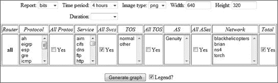

# 第六章。PERL、FLOWSCAN 和 CFLOW.PM


欢迎来到 flow-tools 实现中最麻烦的部分：Perl 模块。Perl 因其快速创建报告工具和网页界面而受到欢迎。最用户友好的流量报告工具之一，FlowScan，是基于 Perl 构建的，但不幸的是，用于处理流量文件的 Perl 模块 *Cflow.pm* 安装起来非常困难。这并不是因为 Perl，而是因为流量收集器在磁盘上的存储格式各不相同。你的 *Cflow.pm* 安装必须知道如何读取 flow-tools 流量文件。

*Cflow.pm* 以已废弃的流量收集器 cflowd 命名。当 cflowd 项目关闭时，cflowd 的作者建议迁移到 flow-tools。*Cflow.pm* 被修改以包含对 flow-tools 的可选支持。许多邮件列表存档消息和大量文档都提到了 cflowd 和 *Cflow.pm*，并且不一定区分两者。你需要 *Cflow.pm*，而不是 cflowd。

# 安装 Cflow.pm

历史上，正确安装 *Cflow.pm* 一直是任何流量分析实现中最困难且令人烦恼的部分。网络搜索会发现各种文章和邮件列表存档讨论 *Cflow.pm* 安装问题，包括作者的一系列文章。新的 flow-tools 版本为安装 *Cflow.pm* 提供了特定的过程。使用推荐的过程，并在安装后立即测试你的 *Cflow.pm*。如果你的 *Cflow.pm* 安装没有给出合理的结果，请不要继续进行。

## 测试 Cflow.pm

*Cflow.pm* 套件包括一个用于访问流量文件的命令行工具，`flowdumper`。它不如 flow-tools 中包含的工具强大或灵活，但它确实测试 *Cflow.pm*。如果 `flowdumper` 正确打印了你的流量文件内容，那么你的 *Cflow.pm* 安装正在正常工作。只需运行 **`flowdumper -s`**，并给它一个流量文件的名称。

```
# `flowdumper -s ft-v05.2011-12-14*`
2011/12/16 23:59:42 69.134.229.81.51459 -> 192.0.2.37.443 6(PUSH|ACK) 1 81
2011/12/16 23:59:43 192.0.2.4.10690 -> 198.6.1.1.53 17 1 81
2011/12/16 23:59:43 192.0.2.37.443 -> 69.134.229.81.51459 6(ACK) 1 40
...
```

`-s` 参数告诉 `flowdumper` 在一行中打印每个流量的摘要。每一行代表一个流量。你会看到源地址和目标地址以及端口、协议号、TCP 标志、数据包数量和八位字节数量。

如果你的 *Cflow.pm* 安装有误，`flowdumper` 会静默返回或返回错误。在你解决任何错误之前，你不能继续使用 Perl 模块或 FlowScan。

失败隐患在此

正确安装 *Cflow.pm* 似乎是流量管理项目失败的最常见原因。在 `flowdumper` 给出正确答案之前，不要继续使用任何使用 *Cflow.pm* 的软件。你已经收到警告。

## 从操作系统包安装

一些操作系统供应商包括可能包含 flow-tools 支持的 *Cflow.pm* 软件包。安装该软件包，并测试 `flowdumper`。如果它不起作用，在继续之前先卸载该软件包。

## 从源安装

从 [`net.doit.wisc.edu/~plonka/Cflow/`](http://net.doit.wisc.edu/~plonka/Cflow/) 获取 *Cflow.pm* 源代码，*Cflow-1.053.tar.gz*，并提取它。但是不要遵循 *Cflow.pm* 源代码中包含的构建说明。自从 Cflow.pm 发布以来，Flow-tools 已经发生了变化，要构建它请使用 flow-tools 的 *contrib/README* 文件中的说明。

进入提取的 *Cflow.pm* 源代码并运行

```
# `perl Makefile.PL CCFLAGS='-DOSU' LIBS='-lft'`
# `make`
# `make install`
```

立即测试 `flowdumper`。如果它不起作用，请继续下一节。

## 使用大锤从源代码安装

如果你的默认源安装失败，这应该会起作用。（Unix 和 Perl 纯粹主义者可能会在道德上表示愤怒，他们欢迎修复真正的问题。）

在 *Cflow-1.053* 源代码目录中，使用文本编辑器打开 *Makefile.PL* 文件。找到以下代码段：

```
sub find_flow_tools {
   my($ver, $dir);
   my($libdir, $incdir);
❶  if (-f '../../lib/libft.a') {
   ...
```

❶ 对 *libft.a* 的引用是所有麻烦的源头。如果所有其他方法都失败了，请将 *libft.a* 的路径硬编码。我的测试系统有 */usr/local/lib/libft.a*，所以我将更改此源代码如下：

```
if (-f '/usr/local/lib/libft.a') {
```

然后按照前面 从源代码安装 部分所示构建和安装 *Cflow.pm*。现在 `flowdumper` 将显示数据。

如果这些方法对你都不起作用，请将你的问题的完整描述发送到 flow-tools 邮件列表，包括失败的构建输出。

# flowdumper 和完整流量信息

虽然 `flowdumper` 通常不如 `flow-print` 有用，但它有一些独特的功能。你已经使用了摘要功能（`-s`）来测试 *Cflow.pm*。（`flowdumper` 也可以在命令行接受 Perl 指令，但如果你足够熟练地使用 Perl 来做这件事，你可以阅读 `flowdumper` 的手册页面。）

如果你没有使用摘要功能，`flowdumper` 会打印出每个流量文件包含的所有信息。

```
# `flowdumper ft-*`
 FLOW
     index:          0xc7ffff
❶    router:         192.0.2.12
❷    src IP:         158.43.128.72
     dst IP:         192.0.2.37
     input ifIndex:  9
     output ifIndex: 1
     src port:       53
     dst port:       34095
     pkts:           1
     bytes:          130
❸    IP nexthop:     192.0.2.37
     start time:     Sat Dec 31 23:54:42 2011
     end time:       Sat Dec 31 23:54:42 2011
     protocol:       17
     tos:            0x0
❹    src AS:         702
     dst AS:         0
     src masklen:    16
     dst masklen:    25
     TCP flags:      0x0
     engine type:    0
     engine id:      0
 ...
```

你之前已经看到了大部分的流量信息，但这里有趣的是 `flowdumper` 显示了流量记录中的所有内容，包括在大多数环境中无关的数据字段。你会看到传感器地址（❶）、源地址和目标地址（❷）等等。你还会看到传感器正在导出诸如下一跳数据（❸）、BGP 路由数据（❹）等信息。尽管你通常不会想要尝试使用完整的 `flowdumper` 输出进行日常管理，但它让你验证你的系统是否收集了你认为应该收集的所有数据。然而，对于日常报告来说，更有用的系统是 FlowScan。

# FlowScan 和 CUFlow

尽管第五章中展示的基于文本的流量报告显然很有用，即使是非技术人员也容易理解流量的视觉表示。第七章和第八章展示了任意数据的绘图，但很多时候绘制非任意数据就足够了。每个网络管理员都已经对他们的网络中最常见的流量有相当好的了解。例如，如果你运行一个 Web 农场，你可能更关心 HTTP 和 HTTPS 流量，而不是其他服务的流量。如果你管理一个办公网络，你可能非常关心 CIFS 和打印机流量。很多时候，你可以通过绘制你所知道的内容，并将你不知道的内容归入“其他”类别来获得足够的结果。这就是 FlowScan 的作用。

FlowScan 是一个提取和汇总流量数据的引擎。它提供了一个网络界面，显示网络管理员之前认为有趣的网络流量图表。这些图表适合向用户、员工和客户展示，他们可能会被更详细的流量报告所困惑。

FlowScan 建立在*Cflow.pm*之上，并使用轮询数据库（RRD），就像 MRTG 和 Cacti 一样。RRD 是一个固定大小的数据库，通过压缩和平均较旧的条目来保留长期数据。换句话说，RRD 提供了对最近流量的良好视图，对几个月前的流量的合理视图，以及去年流量的高级视图。然而，这比你想象的要常见得多。大多数用户想知道为什么过去一小时互联网速度慢，或者今天的流量与去年的流量相比如何。FlowScan 将回答这些问题，尽管它不能解释为什么一年前的 10 月 3 日下午互联网速度慢。

FlowScan 的模块化框架允许网络管理员从各种报告方法中进行选择。其中，我将介绍流行的 CUFlow 模块。

# FlowScan 先决条件

FlowScan 有以下要求：

+   Web 服务器，例如任何 Apache 的最新版本

+   Perl

+   Korn shell 或 pdksh ([`www.cs.mun.ca/~michael/pdksh/`](http://www.cs.mun.ca/~michael/pdksh/))

+   RRDtool ([`oss.oetiker.ch/rrdtool/`](http://oss.oetiker.ch/rrdtool/))带有 Perl 共享模块支持

+   Boulder::Stream Perl 模块

+   ConfigReader::DirectiveStyle Perl 模块

+   HTML::Table Perl 模块

+   Net::Patricia Perl 模块

+   *Cflow.pm*

你可以从操作系统包中安装这些中的大多数。尽管 FlowScan 文档中包括有关安装 RRDtool Perl 模块`RRDs.pm`的警告，但 RRDTool 已经包含了这个模块一段时间了。

### 注意

在开始使用 FlowScan 之前，务必测试你的*Cflow.pm*安装。

# 安装 FlowScan 和 CUFlow

FlowScan 最初是为了与已废弃的 cflowd 收集器一起使用而编写的。如果你从操作系统包中安装 FlowScan，该包可能会想要安装 cflowd 及其废弃的编译器库，以及其他依赖项。有时，操作系统提供商已经编辑了 FlowScan 软件，以便最常见的用法更容易，但更不寻常的用法则更困难。出于这些原因，我建议手动安装 FlowScan。要这样做，请按照以下步骤操作：

1.  从其作者的网站 [`net.doit.wisc.edu/~plonka/FlowScan/`](http://net.doit.wisc.edu/~plonka/FlowScan/) 下载 FlowScan。

1.  从 [`net.doit.wisc.edu/~plonka/list/flowscan/archive/att-0848/01-FlowScan.pm`](http://net.doit.wisc.edu/~plonka/list/flowscan/archive/att-0848/01-FlowScan.pm) 或通过在 Google 中搜索 *flowscan.pm 1.6* 下载 FlowScan Perl 模块的版本 1.6 或更高版本。 （你还可以检查本书网站上的链接部分。）

1.  解压 FlowScan 的 tarball，然后进入构建目录。

1.  FlowScan 的作者建议将 FlowScan 安装在你保存流量文件的目录中。将此目录用作 `configure` 命令中的 `prefix`。（如果你没有选择位置，FlowScan 将在 `/usr/local/bin` 中安装目录、配置文件和 Perl 模块，这并不理想。）

    ```
    # `cd FlowScan-1.006`
    # `./configure --prefix=/var/db/flows/test`
    # `make install`
    ```

    现在目录 */var/db/flows/test/bin* 应该包含你的 FlowScan 软件。

1.  你还需要 FlowScan 的一个小型配置文件，*flowscan.cf*，它不会自动安装。它在解压后的 FlowScan 源代码的 *cf* 目录中。将此模板复制到 FlowScan *bin* 目录。

1.  最后，升级现有的 *FlowScan.pm* 文件。FlowScan 附带的版本 1.5 只支持 cflowd，但版本 1.6 及更高版本可以读取 `flow-capture` 文件。将版本 1.6 直接覆盖到 *bin/FlowScan.pm*。

## FlowScan 用户、组和数据目录

安装 FlowScan 后，创建一个名为 *flowscan* 的用户，专门用于 FlowScan，并授予该用户对 FlowScan *bin* 目录的所有权。同时，在目录上设置组权限，以便网络管理员可以编辑 FlowScan 配置文件，而无需输入 root 密码。

FlowScan 需要在 *bin* 目录同一级别的两个目录：一个名为 *flowscandata*，用于接收流量数据文件；另一个名为 *flowscanrrd*，用于流量 RRD 记录。将这些目录的粘性位设置为如下：

```
# `chown -R flowscan:flowscan bin`
# `chmod g+w bin`
# `chmod g+ws flowscandata`
# `chown flowscan:flowscan flowscandata flowscanrrd`
# `chmod g+ws flowscandata/ flowscanrrd/`
```

现在将你的网络管理员添加到 `flowscan` 组，以便他们可以在无需 root 权限的情况下配置 FlowScan。

## FlowScan 启动脚本

你的操作系统可能包含自己的 FlowScan 启动脚本。如果是这样，检查脚本的说明以了解如何配置它。如果没有，FlowScan 在 *rc* 目录中包含了 Linux 和 Solaris 的启动脚本。在本节中，我将展示如何配置 Linux 脚本。（Solaris 脚本非常相似，并且这些脚本应该可以在任何现代操作系统上稍作修改后使用。）文件的顶部包括四个你需要设置的变量。

```
❶ bindir=/var/db/flows/test/bin
❷ scandir=/var/db/flows/flowscandata
❸ logfile=/var/log/flowscan.log
❹ user=flowscan
```

*bindir* 目录（❶）包含 FlowScan 文件和 *flowscan.cf*。

*scandir* 目录（❷）是 FlowScan 检查新数据文件的地方。

将 *logfile* 目录（❸）放在你喜欢的任何位置。我更喜欢将所有日志放在 */var/log*。在运行 FlowScan 之前，你必须 `touch` 日志文件，并给 flowscan 用户更改文件的权限，

最后，告诉 FlowScan 哪个用户（❹）将运行 flowscan。

该文件的第二部分包含各种标准命令的路径。这些对于大多数类 Unix 系统应该是正确的，但如果你有麻烦，请单独验证每个路径。

一旦你做了更改，让系统启动脚本以 `/bin/sh` 的参数运行 FlowScan 启动脚本。（根据你的系统启动过程，你可能需要在脚本顶部添加一行 `#!/bin/sh`。）

## 配置 FlowScan

*flowscan.cf* 文件只有四个配置值：`FlowFileGlob`、`ReportClasses`、`WaitSeconds` 和 `Verbose`。

`FlowFileGlob` 告诉 FlowScan 要处理哪些文件。使用它来告诉 FlowScan 要检查的目录和要尝试处理的文件类型。在这里，我正在检查目录 */var/db/flows/test/flowscandata* 中的任何 `flow-capture` 文件：

```
FlowFileGlob /var/db/flows/test/flowscandata/ft-v*[0-9]
```

`ReportClasses` 列出了你正在使用的所有报告模块。FlowScan 随带两个模块，CampusIO 和 SubNetIO。这些模块不太可配置，并且并不真正代表现代流量模式，所以你会使用 CUFlow。

```
ReportClasses CUFlow
```

现在告诉 FlowScan 多久检查一次目录中的文件。CUFlow 模块假定 FlowScan 每五分钟运行一次。不要更改此设置；只需使用默认值。

```
WaitSeconds 300
```

最后，详细的日志记录在设置过程中可能会有帮助。一旦 FlowScan 运行起来，就将此设置为 0。现在，设置为 1。

```
Verbose 1
```

你已经完成了 FlowScan 的配置，但除非你设置了报告模块，否则它不会做任何事情。让我们设置 CUFlow，然后返回到 FlowScan。

## 配置 CUFlow: CUFlow.cf

CUFlow 比 FlowScan 的默认模块更可配置，但它假定它处理的全部流量要么进入要么离开你的网络。这使得 FlowScan 适用于在边界路由器、站点 MPLS 路由器等设备上使用，但不适用于监控在你的网络上开始和结束的流量。中转运营商对 CUFlow 的使用将有限，但即使是大型 ISP 也有一些本地网络。

要安装 CUFlow，从[`www.columbia.edu/acis/networks/advanced/CUFlow/CUFlow.html`](http://www.columbia.edu/acis/networks/advanced/CUFlow/CUFlow.html)下载它，然后提取并复制文件*CUFlow.cf*和*CUFLow.pm*到您的 FlowScan *bin*目录。

*CUFlow.cf*包含各种语句，以告诉 FlowScan 要查找哪些数据以及如何处理这些数据。根据您的网络编辑这些语句，如下所示。

### 子网

`子网`语句告诉 CUFlow 您的本地网络上的地址。CUFlow 使用此信息来确定流量是入站还是出站。源在此网络上的流量被视为出站，而目标在此网络上的流量被视为入站。

```
Subnet 192.0.2.0/24
```

根据需要，您可以拥有多个`子网`语句。

### 网络

`网络`语句包括您想要单独跟踪的主机和范围。您可以拥有任意数量的`网络`语句，一个地址可以出现在多个`网络`语句中。列出单个主机或使用斜杠表示子网掩码的网络。务必为每个网络提供一个单词名称。

```
Network 192.0.2.4                proxy
Network 192.0.2.128/26           dmz
Network 192.0.2.36,192.0.2.37    mailservers
```

### 输出目录

`OutputDir`指令告诉 CUFlow 在哪里存储其 RRD 数据文件。不要将您的记录存储在 Web 可访问的位置或您的`flow-capture`日志目录中。相反，将它们存储在您为这些记录创建的*bin*目录旁边的*flowscanrrd*目录中。

```
OutputDir /var/db/flows/test/flowscanrrd
```

每个 FlowScan 模块都必须有自己的输出目录。如果您选择运行多个 FlowScan 模块，根据需要创建额外的 RRD 目录。

### 计分板

CUFlow 还可以计算流文件中最活跃的站点，并展示通过最多流、字节和包的主机地址的计分板。`Scoreboard`选项接受三个参数：您的“最活跃”列表中的地址数量、存储这些列表的目录以及最新列表的文件名，如下所示：

```
Scoreboard ❶ 10 ❷ /var/www/flowscan/topten ❸ /var/www/flowscan/topten/topten.html
```

在这里，计分板计算前 10 名主机（❶），将旧数据存储在目录*/var/www/flowscan/topten/*（❷），并将最新数据放入文件*/var/www/flowscan/topten/topten.html*（❸）。您必须创建*Scoreboard*目录，将目录所有权赋予 flowscan 用户，并配置您的 Web 服务器以允许访问当前和历史页面。

### 注意

不要将您的计分板文件放在与您的流文件相同的目录中。您的流文件不应靠近由 Web 服务器提供的文件。

### 聚合评分

CUFlow 还可以使用`AggregateScore`跟踪一段时间内最活跃的主机。配置`AggregateScore`选项与`Scoreboard`选项类似，包括要显示的主机数量、存储长期总量的文件以及用于结果的网页，如下所示。（请确保将聚合数据文件存储在您的 Web 服务器无法访问的地方，例如您的 RRD 数据目录。）

```
AggregateScore ❶ 10 ❷ /var/db/flows/test/
flowscanrrd/agg.dat ❸ /var/www/flowscan/overall.html
```

在这里，我展示了流量历史中前 10 个最繁忙的主机（❶），将长期数据存储在目录*/var/db/flows/test/flowscanrrd/agg.dat*（❷）中，并在*/var/www/flowscan/overall.html*（❸）中展示前 10 个 HTML 页面。

再次强调，你必须事先创建目录，并且 FlowScan 必须拥有在这些目录中写入文件的权限。

### 路由器

如果你有多台流量传感器向同一收集器发送数据（例如 BGP/HSRP 集群中的两个路由器），你可以使用如这里所示的`路由器`语句来识别不同的传感器。CUFlow 可以分离来自不同传感器的数据，这样你就可以看到每个传感器处理了多少流量。

```
Router 192.0.2.2    rocky
Router 192.0.2.3    bullwinkle
```

在这里，你通过 IP 地址识别每个路由器，并给它一个便于理解的名字。友好的名字将出现在 Web 界面中。

### 服务

`服务`语句定义了你想要单独跟踪的 TCP/IP 端口。CUFlow 将为每个由`服务`语句跟踪的端口或端口集生成一个单独的 RRD 文件，每个文件在 Web 界面中都以不同的颜色显示。

### 注意

增加服务语句的数量会增加 CUFlow 消耗的处理能力和磁盘 I/O CU，所以不要只是复制*/etc/services*到这里！

`CUFlow.cf`包含一些示例，你可以编辑以适应你的需求。例如，我网络上的用户不允许使用 Gnutella 或 eDonkey，所以我将它们从文件中注释掉。以下是一些示例`服务`语句：

```
Service 20-21/tcp ftp
Service 22/tcp ssh
Service 53/udp,53/tcp dns
```

第一个`服务`语句，FTP，使用两个 TCP 端口。第二个要简单得多，只使用一个 TCP 端口。第三个同时运行在 TCP 和 UDP 上。

如果你不确定要跟踪哪些端口，运行一些命令行报告以确定你网络上使用最频繁的端口。

### 协议

`协议`语句与`服务`语句非常相似，只是它在第 3 层而不是第 4 层。

```
Protocol 1 icmp
Protocol 6 tcp
Protocol 17 udp
```

如果你使用 IPSec VPN，你可能想跟踪协议 50-51（ESP 和 AH）。PPTP 用户可能对协议 47（GRE）感兴趣。

### AS

基于 BGP 的站点可能对通过 AS 号跟踪特定网络流量的流量感兴趣。同样，这里的每个 AS 条目都会消耗处理时间。不要只是将 AS 分配的完整列表放在这里！

```
AS 7853,13385,36377,16748,33542,36196,14668    Comcast
AS 65535                                       Lucas
AS 701-705                                     UUnetLegacy
```

软件流量传感器（如`softflowd`）不导出 BGP 信息，因此在使用软件传感器时，不要麻烦进行 AS 分析。

现在你已经配置了 CUFlow，让我们给它一些数据。

## 轮转程序和 flow-capture

FlowScan 会检查单个目录中的流文件：*/var/db/flows/flowscandata*。如果 FlowScan 找不到任何文件，它将返回休眠五分钟。这个`flow-capture`系统将数据记录到存储在目录层次结构中的文件中。例如，2011 年 2 月 17 日的文件存储在目录*/var/db/flows/test/2011/2011-02/2011-02-17*中。你如何将这些文件放入你的*/var/db/flows/flowscandata*目录中？你可以使用一个`flow-capture`日志轮转脚本。

`flow-capture` 的 `-R` 选项在流量文件关闭并创建新临时文件时运行脚本。例如，为了在每个新日志文件上运行脚本 `/usr/local/bin/flow-rotate.sh`，你应该这样运行 `flow-capture`：

```
# `flow-capture -p /var/run/flow-capture.pid -R /usr/local/bin/flow-rotate.sh -n 287 \`
`-w /var/db/flows -S 5 10.10.10.10/172.16.16.16/5678`
```

`flow-capture` 给旋转程序一个参数：相对于流量目录的关闭日志文件的名称。例如，在我写这篇文章的时候，我的测试实验室中的 `flow-capture` 正在将文件 *tmp-v05.2011-02-17.152001-0500* 写入今天的目录。在下午 3:25 **pm**，`flow-capture` 将关闭这个临时文件，将其重命名为 *ft-v05.2011-02-17.152001-0500*，并创建一个新的 *tmp-* 文件。此时，`flow-capture` 将运行由 `-R` 指定的任何脚本，并带有当前文件的路径。这就像你在每个日志文件关闭后立即运行这个命令一样。

```
# `flow-rotate.sh  2011/2011-02/2011-02-17/ft-v05.2011-02-17.152001-0500`
```

你的脚本需要接受这个名称并对流量数据文件执行任何必要的后处理。首先，你想要将流量文件复制到你的数据目录。以下是一个 shell 脚本示例：

```
#!/bin/sh

cp $1 /var/db/flows/test/flowscandata/
```

第二，一旦你有了文件名，将文件复制到 *flowscan* 数据目录就很简单了。

现在将这个脚本作为 `flow-capture -R` 的参数传递，然后验证流量文件是否已复制到 FlowScan 数据目录。

### 注意

让你的旋转脚本非常简单。记住，这个脚本每五分钟就会运行一次，如果它生成大量的日志或发送电子邮件，你每天会收到这些消息 288 次。

## 运行 FlowScan

现在是时候通过运行其启动脚本来启动 FlowScan。FlowScan 的日志文件应该有如下条目：

```
2011/02/17 17:29:07 working on file ❶ /var/db/flows/test/
flowscandata/ft-v05.2011-02-17.172501-0400...
  2011/02/17 17:29:10 flowscan-1.020 CUFlow: Cflow::find took
 ❷ 3 wallclock secs (3.36 usr +  0.00 sys =  3.36 CPU) for
 ❸ 615816 flow file bytes, ❹ flow hit ratio: 31593/31599
  2011/02/17 17:29:12 flowscan-1.020 CUFlow: report took
 ❺ 1 wallclock secs (0.00 usr  0.00 sys +  0.12 cusr  0.04 csys =  0.16 CPU)
❻ Sleep 300...
```

在这个输出中，FlowScan 开始（❶）处理你的日志轮转程序复制到数据目录中的文件。你可以看到 ❷ FlowScan 搜索文件以查找数据花费了多长时间，以及 ❸ 文件大小。

然而，这里最有趣的是 ❹ 处的流量命中比率。这个比率告诉你文件中有多少流量匹配你的 `Subnet` 语句。你应该有压倒性的匹配数量。在这里，我在文件中匹配了 31,593 个流量中的 31,599 个，这是可以接受的。（广播流量和配置错误的设备可能解释了少量不匹配的流量。）你还可以看到 ❺ FlowScan 写入 RRD 文件花费了多长时间。

最后，在 ❻ FlowScan 处理完所有文件后，它会进入休眠状态五分钟。当它醒来时，它会处理数据目录中找到的任何文件。

### 注意

如果你的日志消息看起来不像这样，你就犯了错误。检查你的权限，然后谷歌搜索错误。几乎可以肯定，之前有人犯过同样的错误。他们总是这样。

## FlowScan 文件处理

当 FlowScan 完成处理文件后，它会删除流量文件。当你将文件复制到 FlowScan 特定的数据目录时，这是一种理想的行为，因为尽管现在磁盘空间很便宜，但保存每个流量文件的副本有点过多！

如果您不希望 FlowScan 删除已处理的文件，在 FlowScan 数据目录中创建一个 *saved* 目录，FlowScan 将将处理过的文件移动到这个目录。然而，这种保留不是分层的：您将每天向此目录添加 288 个文件，每周添加 2,016 个文件，每年添加 104,832 个文件。过了一段时间后，简单的 `ls` 命令将需要很长时间才能完成。我建议您让 FlowScan 抛弃已处理的文件，并依赖您的原始文件。

## 显示 CUFlow 图

CUFlow 包含一个用于显示图表的 CGI 脚本，称为 *CUGrapher.pl*。此脚本将 RRD 数据转换为图表。要使用此脚本，将其复制到您的 Web 服务器 CGI 目录，然后在脚本顶部附近设置两个变量以生成以下图表：

1.  将 `$rrddir` 变量设置为存储您的 FlowScan RRD 文件的目录。

    ```
    my $rrddir = "/var/db/flows/test/flowscanrrd";
    ```

1.  使用 `$organization` 变量设置站点或公司名称。

    ```
    my $organization = "Obey Lucas in All Things";
    ```

1.  现在，将您的网络浏览器指向 CGI 脚本，您应该会看到类似于 图 6-1 的内容。

    

    图 6-1. 初始 CUFlow 菜单

在“所有服务”下方勾选复选框，并在最右侧勾选“总计”复选框，如图 图 6-1 所示。这将显示该网络上使用的所有 TCP/IP 服务的 FlowScan 图，类似于 图 6-2。

在 *CUFlow.cf* 中定义的每个协议都有自己的颜色，如图表底部的图例所示。图 6-2 中的示例图例显示了分配给 RTSP、HTTP、SMTP 等的颜色。空白区域表示在 *CUFlow.cf* 中未列为服务的流量。在每个颜色旁边，您将看到该协议的总流量量。


图 6-2. CUFlow 中的服务

此外，正数表示离开您网络的数据流量，负数表示进入网络的数据流量。例如，在此图表的起始位置（在最左侧），有 140Kbps 的数据流量离开网络，80Kbps 的数据流量进入。大部分出去的流量由已知服务组成。进入流量中的大量空白区域包括 CUFlow 尚未告知分类的流量。要识别这些空白区域中的流量，请检查流量文件本身。

CUFlow 允许您在各个时间段内生成协议、网络和服务的图表，但它一次只会报告一个协议、网络或服务。此外，CUFlow 会将您的所有选择相加。例如，如果您从协议列中选择 TCP，从服务列中选择 HTTP，从网络列中选择您的 Web 服务器，结果将是一个没有意义的图表，它包括所有 TCP 流量、所有 HTTP 流量和您 Web 服务器的所有流量。要创建一个更具体的图表，例如特定服务器的所有 HTTP 流量，您必须使用更灵活的工具，如 FlowViewer (第七章)。或者，如果您需要反复检查此图表，请拆分您的流量记录，并运行多个 FlowScan 和 CUFlow 实例。

# 流量记录拆分和 CUFlow

CUFlow 是一个用于绘制最常见网络情况的有用工具，但它有其局限性。例如，您不能从多个列中选择，比如查看您的 Web 服务器发送了多少 HTTP 流量；您只能看到 HTTP 流量的总量或 Web 服务器流量的总量。此外，您不能使用 CUFlow 进行真正的即兴报告，但您可以配置它来表示关于您网络的常见问题。

在某些环境中，CUFlow 的局限性尤为明显。曾经我管理过一个数据中心，它通过私有 MPLS 网络为远程站点提供服务。每个工厂都有一个 T1 或 E1，而数据中心有一个 DS3。每个站点都从主数据中心获得所有服务。我在总部 DS3 上有流量导出和 CUFlow，它报告了流向中央邮件服务器、文件服务器、代理服务器等流量，我想提供管理访问以显示每个工厂使用的流量以及该流量是什么。然而，大多数工厂没有能够导出流量数据的设备。

通过将工厂流量信息从 DS3 流量记录中拆分出来，并为每个工厂运行一个单独的 FlowScan 实例，我提供了有用（但不完美）的结果。我说“不完美”，因为这些结果不会显示工厂之间的流量，例如。然而，由于每个工厂的绝大多数外部流量都流向了中央数据中心，它对电路上的流量提供了一个很好的猜测。

流量记录拆分适用于许多环境。例如，Web 农场没有远程站点，但他们可能有一些主要客户，每个客户都希望有自己的 FlowScan 页面。您可以通过首先将流量拆分为多个数据集，然后为每个数据集设置一个单独的 FlowScan 实例来提供这些单独的页面。

## 流量拆分

要将流数据分割成更小的数据集，请使用 `flow-nfilter`。您可能已经为每个数据子集都有一个过滤器，但您需要确保过滤器覆盖传入和传出流量。例如，要仅提取包含地址 192.0.2.0/24 的流数据，您可以使用以下基本过滤器：

```
filter-primitive site1
    type ip-address-prefix
    permit 192.0.2.0/24

filter-definition site1
    match ip-source-address site1
    or
    match ip-destination-address site1
```

接下来，使用 `flow-print` 验证过滤器只为这些地址传递流，并使用 `flow-cat` 和 `flow-nfilter` 创建只包含这些数据的流文件。

```
# `flow-cat ft-v05.2011-02-18.112001-0500 | flow-nfilter -F` ❶ `site1 >`
 ❷ `ft-v05.site1`
```

文件 *ft-v05.site1*（❷）是一个只包含由 `site1` 过滤器（❶）允许的流的流文件。使用 `flow-print` 验证这一点。

## 流记录分割脚本编写

FlowScan 预期流文件的稳定供应。您不应手动为每个新的流文件运行 `flow-cat` 和 `flow-nfilter`。相反，使用流旋转脚本将每个新的流文件过滤到更小的数据集中，如下例所示：

```
#!/bin/sh
 PATH=/bin:/usr/bin:/usr/local/bin

 #for our primary flowscan instance
 cp $1 /var/db/flows/test/flowscandata

 #for flowscan on a data subset
 flow-cat /var/db/flows/test/$1 | \
     flow-nfilter ❶ -f /usr/local/etc/flow-tools/site1-filter.cfg -F site1 > \
❷    /var/db/flows/site1/flowscandata/
```

该脚本的开始部分与您用来将流文件复制到现有 FlowScan 实例的流旋转脚本相同。（您不希望破坏已经正常工作的东西！）最后一个命令将特定站点的流分离出来，并在单独的目录中创建该数据流文件。使用 `flow-nfilter` 的 `-f` 参数（❶）来使用非标准流过滤器定义文件，记住如果您的流过滤器文件包含不完整或无效的规则，`flow-nfilter` 将不会运行。

### 注意

如果在旋转脚本运行时编辑过滤器规则，脚本将失败。最好有一个专门的过滤器定义文件，专门用于分离这些流。

每个 FlowScan 实例都需要其自己的传入数据目录（❷），如下一节详细讨论的那样。为此脚本添加针对您数据子集的每个 FlowScan 实例的行，并且每次更改旋转脚本时都要确保重启 `flow-capture`。

## 过滤后的 CUFlow 和目录设置

为每个 FlowScan 实例分配其自己的目录。主要流文件收集在 */var/db/flows/test* 中，因此请使用类似 */var/db/flows/site1* 的目录。此目录需要三个子目录：*flowscandata*（用于传入的过滤流文件）、*flowscanrrd*（用于从处理过的流文件创建的 RRD 文件）和 *bin*（用于此 FlowScan 实例）。确保 flowscan 用户可以写入这些目录。

将您原始 FlowScan *bin* 目录中的所有内容复制到此 FlowScan 实例的 *bin* 目录中，以获取所有更新后的模块。然后，为了设置您的新实例，通过将 `FlowFileGlob` 更改为指向您新实例的数据目录路径来编辑 *flowscan.cf*。

现在，因为每个 FlowScan 实例都需要在你的 web 服务器下单独的目录来存储其计分板和顶级主机列表，所以创建该目录，然后编辑 *CUFlow.cf* 以更改 *OutputDir*、*Scoreboard* 和 *AggregateScore* 目录和文件，使其指向该目录。最后，通过复制现有的启动脚本、编辑它以匹配你的新实例，并为其分配一个新的日志文件，为每个 FlowScan 实例提供自己的启动脚本。(记住，在启动 FlowScan 之前，日志文件必须存在，并且 flowscan 用户必须能够写入它。)现在启动你的第二个 FlowScan 实例。如果有问题，你应该能在日志文件中看到。

虽然为网络中的每个服务器组或甚至每个主机创建单独的 FlowScan 实例可能很有吸引力，但这样做会增加系统负载和维护开销。FlowScan 每五分钟运行一次，如果你的服务器需要超过五分钟才能完全处理数百个 FlowScan 实例，那么你的系统将变得不可用。

深入了解 PERL

FlowScan 和 CUFlow 并非适合所有人。对于那些希望自行实现的人来说，本章的其余部分讨论了如何编写自己的 Perl 模块来读取流量记录。以下代码片段假设你具备基本的、实际操作的 Perl 知识，但并非很多人都是网络工程师、系统管理员和 *Perl 程序员*。如果你不习惯阅读行噪声，并且对导出变量或函数不感兴趣，请跳到下一章。

# 使用 Cflow.pm

Perl 是系统管理和网络开发中流行的语言。*Cflow.pm* 模块允许你编写直接读取流量文件的 Perl 代码。

## 一个 Sample Cflow.pm 脚本

这是一个简单的 *Cflow.pm* Perl 脚本，它打印出所有 UDP 端口 500 (Checkpoint ISAKMP，用于 IPSec VPN) 流量，从 *Cflow.pm* 文档中提供的脚本中简化而来。此脚本接受一个或多个流程文件名作为参数。

```
#!/usr/bin/perl

❶ use Cflow qw(:flowvars find);
❷ find (\&wanted, @ARGV);

❸ sub wanted {
      return unless (($srcport == 500 && $dstport == 500 ) && $udp == $protocol);
      printf("%s %15.15s.%-5hu %15.15s.%-5hu %2hu %10u %10u\n",
             $localtime, $srcip, $srcport, $dstip,
             $dstport, $protocol, $pkts, $bytes)
  }
```

此脚本首先包含 *Cflow.pm* (❶)，然后从该模块导出流程变量名和 `find()` 函数。*Cflow.pm* (❷) 的核心是 `find()` 和 `wanted()` 函数。当你将流程文件传递给脚本时，`find()` 将文件中的每个流程发送到 `wanted()` 函数。在 `wanted()` 函数 (❸) 中，脚本执行你为每个单独的流程编写的任何函数。

*Cflow.pm* 提供了许多变量来访问流量数据。尽管许多这些变量的含义很容易猜测，例如 `$srcport`、`$dstport`、`$protocol` 等等，但我还是将它们列在 表 6-1 中。

`Find()` 和 `wanted()` 允许你使用 *Cflow.pm* 作为引擎将流量数据输入到数据库、RRD 或哈希文件中；标记符合你环境独特模式（你无法轻松过滤）的有趣流量等等。

## Cflow.pm 变量

表 6-1 显示了由*Cflow.pm*提供的流评估变量。

表 6-1. *Cflow.pm*变量

| 变量 | 含义 | 样本输出 |
| --- | --- | --- |
| `$unix_secs` | 流开始时间的纪元秒 | 1229490004 |
| `$exporter` | 传感器 IP 地址，作为长整数 | 1430200323 |
| `$exporterip` | 传感器 IP 地址，作为点分四元组 | 192.0.2.3 |
| `$localtime` | 将纪元时间转换为本地时间 | 2011/12/16 23:59:43 |
| `$srcaddr` | 作为长整数的源 IP 地址 | 1430200341 |
| `$srcip` | 作为点分四元组的源 IP 地址 | 192.0.2.27 |
| `$dstaddr` | 作为长整数的目标 IP 地址 | 1166468433 |
| `$dstip` | 作为点分四元组的目标 IP 地址 | 69.134.229.81 |
| `$input_if` | 输入接口索引 | 2 |
| `$output_if` | 输出接口索引 | 9 |
| `$srcport` | TCP 或 UDP 源端口号或等效值 | 53 |
| `$dstport` | TCP 或 UDP 目标端口号或等效值 | 46819 |
| `$ICMPType` | ICMP 类型（仅对 ICMP 流，$dstport 的高字节） | 3 |
| `$ICMPCode` | ICMP 代码（仅对 ICMP 流，$dstport 的低字节） | 1 |
| `$ICMPTypeCode` | ICMP 类型和代码的友好名称 | HOST_UNREACH |
| `$pkts` | 流中的数据包 | 5 |
| `$bytes` | 期间发送的字节数 | 138 |
| `$nexthop` | 下一个跳转路由器的 IP 地址，作为长整数 | 1398215405 |
| `$nexthopip` | 下一个跳转路由器的 IP 地址，作为点分四元组 | 12.61.8.12 |
| `$starttime` | 流开始时本地时间的纪元秒 | 1229489984 |
| `$start_msecs` | 起始时间的毫秒部分 | 131 |
| `$endtime` | 流结束时本地时间的纪元秒 | 1229489985 |
| `$end_msecs` | 结束时间的毫秒部分 | 871 |
| `$protocol` | TCP/IP 协议号 | 17 |
| `$tos` | 服务类型 | 0 |
| `$tcp_flags` | 所有 TCP 标志的按位或，或非 TCP 流的 0x10 | 16 |
| `$TCPFlags` | tcp_flags 的友好表示 | ACK |
| `$raw` | 整个原始流格式 | *二进制* |
| `$reraw` | 修改后的原始流文件格式，用于写入新文件 | *二进制* |
| `$Bps` | 此流每秒的最小字节数 | 40 |
| `$pps` | 此流的每秒最小数据包数 | 5 |
| `$src_as` | 当前流的 BGP 源 AS | 701 |
| `$dst_as` | 当前流的 BGP 目标 AS | 11512 |
| `$src_mask` | 源地址前缀掩码位 | /23 |
| `$dst_mask` | 目标地址前缀掩码位 | /16 |
| `$engine_type` | 流切换引擎的类型（供应商特定） | 1 |
| `$engine_id` | 流切换引擎的引擎 ID（供应商特定） | 0 |

要使用这些变量，您必须首先在它们前面加上`Cflow::`或像我在示例脚本顶部所做的那样从*Cflow.pm*导出它们。

## 其他 Cflow.pm 导出

*Cflow.pm* 还导出了 TCP 标志和 ICMP 类型及代码的符号名称。您可能会发现这些名称（如表 6-2 所示）比原始数字更容易使用，尤其是在复杂的脚本中。

表 6-2. 导出的 TCP 标志符号名称

| 变量 | 含义 | 值 |
| --- | --- | --- |
| `$TH_FIN` | 结束标志 | 1 |
| `$TH_SYN` | 同步标志 | 2 |
| `$TH_RST` | 重置标志 | 4 |
| `$TH_PUSH` | 推送标志 | 8 |
| `$TH_ACK` | 确认标志 | 16 |
| `$TH_URG` | 紧急标志 | 32 |

将 TCP 标志通过导出`tcpflags`使其可访问。同样，导出`icmptypes`和`icmpcodes`以使用它们的符号名称，如表 6-3 所示。

表 6-3. 导出的 ICMP 类型符号名称

| 变量 | 含义 | 值 |
| --- | --- | --- |
| `$ICMP_ECHOREPLY` | 回显响应 | 0 |
| `$ICMP_DEST_UNREACH` | 目标不可达 | 3 |
| `$ICMP_SOURCE_QUENCH` | 源抑制 | 4 |
| `$ICMP_REDIRECT` | 重定向 | 5 |
| `$ICMP_ECHO` | 回显请求 | 8 |
| `$ICMP_TIME_EXCEEDED` | 超时 | 11 |
| `$ICMP_PARAMETERPROB` | 其他 ICMP 类型未涵盖的错误 | 12 |
| `$ICMP_TIMESTAMP` | 时间戳请求 | 13 |
| `$ICMP_TIMESTAMPREPLY` | 时间戳响应 | 14 |
| `$ICMP_INFO_REQUEST` | 网络信息请求（已弃用） | 15 |
| `$ICMP_INFO_REPLY` | 网络信息响应（已弃用） | 16 |
| `$ICMP_ADDRESS` | 网络掩码请求 | 17 |
| `$ICMP_ADDRESSREPLY` | 网络掩码请求响应 | 18 |

符号名称包括用于 ICMP 类型 3（不可达，表 6-4)、5（重定向，表 6-5)和 11（超时，表 6-5)的 ICMP 代码。

表 6-4. 导出的 ICMP 类型 3 代码符号名称

| 变量 | 含义 | 值 |
| --- | --- | --- |
| `$ICMP_NET_UNREACH` | 网络不可达 | 0 |
| `$ICMP_HOST_UNREACH` | 主机不可达 | 1 |
| `$ICMP_PROT_UNREACH` | 协议不可达 | 2 |
| `$ICMP_PORT_UNREACH` | UDP 端口不可达 | 3 |
| `$ICMP_FRAG_NEEDED` | 需要分片 | 4 |
| `$ICMP_SR_FAILED` | 源路由失败 | 5 |
| `$ICMP_NET_UNKNOWN` | 网络未知 | 6 |
| `$ICMP_HOST_UNKNOWN` | 主机未知 | 7 |
| `$ICMP_HOST_ISOLATED` | 源主机隔离 | 8 |
| `$ICMP_NET_ANO` | 网络被管理禁止 | 9 |
| `$ICMP_HOST_ANO` | 主机被管理禁止 | 10 |
| `$ICMP_NET_UNR_TOS` | 在此服务类型下网络不可达 | 11 |
| `$ICMP_HOST_UNR_TOS` | 在此服务类型下主机不可达 | 12 |
| `$ICMP_PKT_FILTERED` | 被过滤禁止的通信 | 13 |
| `$ICMP_PREC_VIOLATION` | 主机优先级违规 | 14 |
| `$ICMP_PREC_CUTOFF` | 优先级截止生效 | 15 |
| `$ICMP_REDIRECT_NET` | 网络重定向 | 0 |
| `$ICMP_REDIRECT_HOST` | 主机重定向 | 1 |
| `$ICMP_REDIRECT_NETTOS` | 网络和类型服务重定向 | 2 |
| `$ICMP_REDIRECT_HOSTTOS` | 主机和类型服务重定向 | 3 |

表 6-5. 导出的 ICMP 类型 11 代码符号名

| 变量 | 含义 | 值 |
| --- | --- | --- |
| `$ICMP_EXC_TTL` | 转运中生存时间超时 | 0 |
| `$ICMP_EXC_FRAGTIME` | 片段重组时间超时 | 1 |

### 注意

在每个流量的可用值、TCP 标志和 ICMP 类型及代码之间，你可以添加代码以执行流量分析。

## 对每个文件执行操作

*Cflow.pm* 支持在处理流量文件后的操作，例如释放内存、重新初始化变量，或者可能将文件移动到存档目录。如果你将其包含在你的脚本中，*Cflow.pm* 将对每个流量文件调用一次 `perfile()` 函数。在你的 `find()` 函数中立即包含对 `perfile` 的引用，紧随 `wanted` 引用之后。

```
#!/usr/bin/perl
use Cflow qw(:flowvars find );
find (\&wanted, \&perfile, @ARGV);

sub wanted {
}

sub perfile {
    print "working on \"$_[0]\"...\n";
}
```

此代码示例会为每个文件打印一次文件名。

## 返回值

`find()` 函数返回匹配 `wanted()` 函数的流量数量比率。例如，这里我返回流量文件中的 ICMP 流量数量：

```
#!/usr/bin/perl
use Cflow qw(find :flowvars );
$hitrate = find (\&wanted, @ARGV);

sub wanted {
    return unless (1 == $protocol);
    $icmp++;
}

print "hitrate is $hitrate\n";
```

运行此命令会生成如下所示的输出：

```
hitrate is 34/4140
```

输入文件中的 4,140 个流量中有 34 个是 ICMP 流量。

## 详细模式

*Cflow.pm* 默认生成错误信息。要禁用此功能，将 `verbose` 设置为 `0`，如下所示：

```
use Cflow qw(find :flowvars );
verbose(0);
...
```

每次设置此选项时，我通常都会希望我没有这样做，因为它会生成大量的输出，掩盖了有用的数据。尽管如此，它对于调试仍然很有用。

现在你已经了解了如何进行简单的基于网络的报告，你将学习如何进行复杂的报告。
