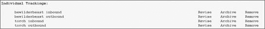

# 第七章. FLOWVIEWER


几乎每个人都喜欢网络流量的漂亮图片。FlowScan 和 CUFlow 以用户友好的方式绘制常见的、预期的流量类型。然而，你的网络却并非如此普通或预期。除了 CUFlow 之外，你还需要一个更可定制的分析工具，无论是因为你需要一次性报告、对从未期望看到的流量进行洞察，还是对去年流量的近距离观察。正如你将在本章中学到的，FlowViewer 套件 ([`ensight.eos.nasa.gov/FlowViewer/`](http://ensight.eos.nasa.gov/FlowViewer/)) 是这样的可定制工具之一，它可以快速创建和访问基于网络的报告。

FlowViewer 包含三个独立的组件：FlowViewer、FlowTracker 和 FlowGrapher。*FlowViewer* 是 `flow-print` 和 `flow-nfilter` 的网络界面，一旦你在网页表单中定义了过滤器，就会打印出匹配的流量。*FlowGrapher* 允许你根据需要绘制数据子集。*FlowTracker* 是一种简单的方式来构建和查看 RRDs，就像 CUFlow 一样，但它允许你非常具体地过滤绘制的流量。如果你想持续跟踪企业资源规划 (ERP) 系统的 HTTPS 和 telnet 流量，FlowTracker 就是你的好朋友。总体而言，这三个工具为网络提供了大量的可见性。

### 注意

FlowViewer 拥有一份详尽的用户手册，其中包含的信息比我能够在一个章节中容纳的要多。请参阅 FlowViewer 手册以获取更深入的信息。

# FlowTracker 和 FlowGrapher 与 CUFlow 的比较

如果 FlowTracker、FlowGrapher 和 CUFlow 有类似的功能，为什么不只使用其中一个呢？主要原因是易用性。

CUFlow 很容易理解。你可以给你的客户访问 CUFlow 图表，并且只需最少的解释，他们就可以相当准确地解释结果。即使是最笨拙的同事也能理解 CUFlow 的输出。但与此同时，这种易于理解也牺牲了灵活性。用户只能获得网络管理员配置的功能和报告，而旧的报告则受到第六章中讨论的 RRD 数据库压缩的影响。

另一方面，FlowViewer 的绘图和跟踪功能比 CUFlow 更强大，但也更复杂。报告几乎可以无限定制、调整和配置，这一广泛的功能集意味着你真的需要知道自己在做什么才能获取有用的信息。此外，FlowViewer 没有只读用户的观念：任何可以访问你的 FlowViewer 网站的人都可以完全访问其所有功能。FlowViewer 是为网络管理员设计的，而不是为普通用户。

# FlowViewer 安全性

如前所述，任何可以访问 FlowViewer 的人都可以看到您内部网络的所有信息。一个熟练的入侵者会认为这是无法抗拒的。其他人可能只是打扰您：不熟练的访客，例如您的帮助台工作人员，可能会错误地解释 FlowViewer 的结果，让您花费时间解释为什么它们是错误的。因此，我强烈建议对 FlowViewer 网站进行密码保护，并限制允许访问服务器的 IP 地址。即使使用自签名证书，HTTPS 也能保护您的用户凭据和数据在传输过程中的安全。

FlowViewer 的默认安装还使用一个可由世界写入的目录来存储报告。这在多用户系统中是一个安全风险。如果您使用共享系统作为您的分析工作站，您必须比 FlowViewer 的默认设置更严格地限制权限。

# 安装 FlowViewer

如果可能，请从您的操作系统供应商提供的软件包中安装 FlowViewer。如果您的供应商不提供 FlowViewer 软件包，您当然需要手动安装。

## 先决条件

在安装 FlowViewer 之前安装以下软件包，这些软件包在大多数操作系统中都应作为软件包提供：

+   Web 服务器，例如任何最近的 Apache

+   Perl

+   RRDtool ([`oss.oetiker.ch/rrdtool/`](http://oss.oetiker.ch/rrdtool/)) 支持 Perl 共享模块

+   GD 图形库 ([`www.boutell.com/gd/`](http://www.boutell.com/gd/))

+   gd::graph Perl 模块

+   GDBM Perl 模块（可能打包为 GDBM_File）

您还需要知道运行您的网页的系统用户。这可能是名为 *www*、*http* 或 *www-data* 的用户。如果您的 Web 服务器正在运行，请输入 **`ps -axe`** 或 **`ps -axj`** 以获取运行服务器的用户名。

## FlowViewer 安装过程

要安装 FlowViewer，首先从 [`ensight.eos.nasa.gov/FlowViewer/`](http://ensight.eos.nasa.gov/FlowViewer/) 下载 FlowViewer 的最新版本。压缩的安装文件包含一个包含整个包的 FlowViewer 目录，将其解压到您的 Web 服务器下的一个目录中。

现在配置您的 Web 服务器以允许在该目录中执行 CGI。例如，以下是如何配置 Apache 以在目录 */usr/local/www/flowviewer* 中支持 FlowViewer 的示例：

```
❶ `Alias /FlowViewer/ /usr/local/www/flowviewer/`
❷ `<Directory /usr/local/www/flowviewer/>`
    `Options +ExecCGI`
    `AddHandler cgi-script .cgi`
    `Order allow,deny`
    `Allow from all`
 `</Directory>`
```

在❶处的别名定义将 Web 位置 [`servername/FlowViewer/`](http://servername/FlowViewer/) 映射到本地目录 */usr/local/www/flowviewer/。然后，在❷处您为 FlowViewer 目录分配特定的权限，允许 CGI 执行和客户端访问。最后，重新启动 Apache。

安装部分到此结束。FlowViewer 更困难的部分是配置。

# 配置 FlowViewer

FlowViewer 套件中的所有工具都使用*FlowViewer_Configuration.pm*配置文件。尽管此文件包含许多设置，但只有少数是正确操作所必需的；其他设置允许你调整应用程序的外观和 FlowTracker 的 RRD 文件的行为。如果你对这里未讨论的设置感兴趣，请参阅 FlowViewer 的详细手册。我将仅介绍使 FlowViewer 工作所需的设置。（某些操作系统包在安装过程中为你设置这些设置。）不再多言，以下是你将需要的设置：

+   `$ENV{PATH}`变量仅包括 FlowViewer 所需的系统命令的路径。在几乎所有系统中，你应该保持这个设置不变。你不需要在这些目录中有 flow-tools 和 RRDtool；它们有自己的路径变量，你将在稍后设置。

+   `$FlowViewer_server`变量告诉 FlowViewer 你网站的域名。例如，为了使我的测试收集器在[`netflow.blackhelicopters.org/`](https://netflow.blackhelicopters.org/)可见，我将`$FlowViewer_server`设置为`netflow.blackhelicopters.org`。

+   `$FlowViewer_service`变量帮助 FlowViewer 构建网页。根据你网站的适当情况将其设置为`http`或`https`。

## 目录和网站路径

FlowViewer 将文件存储在 Web 服务器上，所有文件存储目录都必须可由 Web 服务器用户写入。创建这些目录，并将它们的所有权更改为 Web 服务器用户。（不可写入的目录是 FlowViewer 问题的一个常见原因。）

大多数目录变量还有一个“简短”版本，它定义了网络浏览器可以在服务器上找到该目录的位置。FlowViewer 使用这个简短名称来创建指向生成内容的链接。当我带你设置前几个变量时，我会通过例子来展示。

搜索和替换配置

默认的*FlowViewer_Configuration.pm*假定 Apache 的*DocumentRoot*目录是*/htp/htdocs*，而 FlowViewer 安装的 CGI 目录是*/htp/cgi-bin*。你可能需要对这些值进行简单的搜索和替换，将它们替换为你环境中正确的*DocumentRoot*和*FlowViewer*安装目录。在所有以下示例中，我的网站根目录是*/var/www/ssl*，FlowViewer 安装在*/usr/local/www/flowviewer*。你必须创建 FlowViewer 告诉你要使用的所有目录。

`$reports_directory`告诉 FlowViewer 报告的存储位置，而`$reports_short`给出客户端在网站上找到*$reports*目录的位置。报告目录必须在 Apache 的*DocumentRoot*或另一个 Apache 可访问的目录下。在这里，我在我的*DocumentRoot*中创建了一个*FlowViewer*目录：

```
$reports_directory       = "/var/www/ssl/FlowViewer";
$reports_short           = "/FlowViewer";
```

FlowViewer 将生成的图形存储在`$graphs_directory`中，`$graphs_short`定义了客户端在网站上找到`$graphs_directory`的位置。像`$reports_directory`一样，`$graphs_directory`必须在网站上可访问。我使用目录`/var/www/ssl/FlowGrapher`。

```
$graphs_directory = "/var/www/ssl/FlowGrapher";
$graphs_short = "/FlowGrapher";
```

FlowTracker 工具将文件存储在`$tracker_directory`中，该目录在网站上可通过`$tracker_short`访问。我使用目录`/var/www/ssl/FlowTracker`。

```
$tracker_directory = "/var/www/ssl/FlowTracker";
$tracker_short = "/FlowTracker";
```

`$$cgi_bin_directory`变量指向包含 FlowViewer 软件的目录。您可以选择将其复制到您的 Web 服务器的常规 CGI 可执行目录，但我建议在单独的目录中安装 FlowViewer，然后配置您的 Web 服务器在该目录中运行 CGI 脚本。例如，正如您在这里可以看到的，我的 FlowViewer 安装在`/usr/local/www/flowviewer`，我已配置 Web 服务器提供[`servername/flowviewer`](http://servername/flowviewer)：

```
$cgi_bin_directory = "/usr/local/www/flowviewer";
$cgi_bin_short = "/flowviewer";
```

FlowViewer 将临时文件保存在`$work_directory`中，该目录在 Web 服务器上可通过`$work_short`访问。这里我使用`/var/www/ssl/FlowWorking`：

```
$work_directory = "/var/www/ssl/FlowWorking";
$work_short = "/FlowWorking";
```

为以后保存的报告和过滤器存储在`$save_directory`中，该目录可通过 Web 客户端作为`$save_short`访问。为此创建`/var/www/ssl/FlowViewer_Saves`。

```
$save_directory = "/var/www/ssl/FlowViewer";
$save_short = "/FlowViewer_Saves";
```

剩余的目录在网站上的路径上没有“短”变量。FlowViewer 使用它们进行内部跟踪或查找关键软件，客户端不应直接访问它们。

+   当用户要求 FlowViewer 解析 IP 地址的名称时，它将在`$names_directory`中缓存结果。例如，我把我的名称缓存放在`/usr/local/www/flowviewer/names`。记住，任何缓存的 DNS 数据随着主机更改 IP 地址而逐渐变得过时。

+   FlowTracker 将其用于创建跟踪器的过滤器存储在`$filter_directory`中，并将 RRD 文件存储在`$rrdtool_directory`中。

+   `$flow_bin_directory`目录是 flow-tools 安装的位置。这通常是类似`/usr/local/bin`或`/usr/local/flow-tools/bin`的东西。

+   类似地，`rrdtool_bin_directory`是 RRDtool 安装的位置，通常是`/usr/local/bin`或`/usr/local/rrdtool/bin`。

在配置中，它们看起来是这样的：

```
$names_directory         = "/usr/local/www/flowviewer/names";
$filter_directory        = "/usr/local/www/flowviewer/FlowTracker_
Files/FlowTracker_Filters";
$rrdtool_directory       = "/usr/local/www/flowviewer/FlowTracker
_Files/FlowTracker_RRDtool";
$flow_bin_directory      = "/usr/local/bin";
$rrdtool_bin_directory   = "/usr/local/bin";
```

## 网站设置

下面的四个值在 FlowViewer 的 Web 界面中设置了一些基本属性：

+   FlowTracker 自动生成一个网页，列出当前正在运行的跟踪器。默认文件是`$tracker_directory`中的`index.html`。通过将`$actives_webpage`设置为所需的文件名来更改此设置。

+   自动生成的跟踪页面将您的组织名称作为`$trackings_title`的值列出。

+   要将您的公司标志放在每个页面顶部的 FlowViewer 图形旁边，创建一个高度为 86 像素的标志文件，并将其复制到`$reports_directory`。

+   然后将`$user_logo`分配给文件名。标志将链接到在`$user_hyperlink`中定义的网站。

在配置中，它们将看起来像这样：

```
$actives_webpage         = "index.html";
$trackings_title         = "Lucas LLC";
$user_logo               = "myfirm.jpg";
$user_hyperlink          = "http://www.michaelwlucas.com/";
```

## 设备和导出器

在第二章中，您决定使用一个接受来自所有传感器的流量记录的单个收集器，或者为每个传感器设置一个单独的收集器。FlowViewer 可以支持这两种配置，但您必须告诉它它使用的是哪一种。

最简单的情况是单个传感器和单个收集器，当您预期永远不会更多时，但我不建议做出这个假设。网络会随着时间的推移而变化，您的 FlowViewer 安装应该适应这种变化。如果您坚持只有一个收集器和单个传感器，尽管如此，请参阅 FlowViewer 手册了解有关更改 `$no_devices_or_exporters` 的信息。

### 每个传感器一个收集器

在第二章中，我建议为每个传感器设置一个收集器。您的流量数据将进入一个目录，例如 */var/db/flows*，每个设备都有一个子目录。您最终会得到如下目录：*/var/db/flows/router1*（用于传感器路由器 1），*/var/db/flows/router2*（用于传感器路由器 2），等等。

对于这个设置，将流量数据根目录分配给 `$flow_data_directory`。在我的设置中，`$flow_data_directory` 是 */var/db/flows*。现在将变量 `@devices` 分配给代表传感器的目录名称列表。例如，我的网络有传感器路由器 1、路由器 2 和路由器 3。我会将以下值分配给 `@devices`。（FlowViewer 将 `@devices` 中的所有内容作为下拉菜单中的选项提供。）

```
$flow_data_directory     = "/var/db/flows";
@devices=("router1","router2","router3");
```

### 为所有传感器分配一个收集器

如果所有您的传感器都将数据发送到单个收集器，请不要设置 `@devices` 或 `$flow_data_directory`。相反，将 `$exporter_directory` 设置为您的综合流量数据的位置。如果您运行了一个单独的收集器并且所有数据都进入了 */var/db/flows*，则将 `$exporter_directory` 设置为 */var/db/flows*。此外，取消注释 `@exporters`，并将其设置为收集器中的传感器列表，按 IP 地址和主机名列出导出器，如下所示：

```
$exporter_directory      = "/var/db/flows";
@exporters = ("192.0.2.1:router1","192.0.2.2:router2","192.0.2.3:router3");
```

FlowViewer 现在已配置并准备好使用。将您的网络浏览器指向 *FlowViewer.cgi* 以查看其初始屏幕。

## 流览器套件故障排除

FlowViewer 有许多设置选项，您在第一次安装时可能会犯错。我强烈建议保持一个终端窗口打开，并在您的 Web 服务器错误日志上运行 `tail -f` 以显示错误。根据我的经验，最常见的问题是目录变量不正确和目录权限问题。

在使用 FlowViewer 时，请监视错误日志，并在错误出现时进行纠正。遵循这些程序，在测试几分钟内，您应该有一个正确工作的 FlowViewer 安装。

# 使用 FlowViewer

正确安装后，FlowViewer 应该看起来像图 7-1。


图 7-1. 默认 FlowViewer 界面

屏幕上半部分，过滤条件，控制流量选择。这基本上是`flow-nfilter`的接口，让您选择您想要检查的确切流量。FlowGrapher 和 FlowTracker 与 FlowViewer 的过滤接口共享大部分功能。屏幕下半部分，报告参数，控制结果的显示。您可以对流量运行报告或仅查看匹配的流量。

在以下章节中，我将首先介绍如何使用过滤界面，然后是查看选项。

## 使用 FlowViewer 过滤流量

您在过滤条件部分修改的每个字段都会传递给`flow-nfilter`。大多数字段接受多个条目，条目之间用逗号分隔。您还可以通过在条目前加负号来否定一个条目。（如果您对过滤流量有一般性问题，请参阅第四章。）

### 设备

如果您有多个传感器，您必须首先选择提供您想要检查的数据的设备。此下拉菜单直接来自您为 FlowViewer 配置的设备或导出列表，并且是唯一需要您输入内容的字段。

### 下一跳 IP

这是传感器发送流量的 IP 地址。请记住，只有硬件流量传感器（如路由器和交换机）在流中包含下一跳地址信息。软件流量传感器无法访问此信息。

### 开始和结束日期和时间

在这里，您设置您感兴趣的时间。时间以 24 小时制格式表示。FlowViewer 默认提供最近的完整小时。请参阅包含流量如果中的包含流量如果，了解 FlowViewer 如何处理跨越开始或结束时间的流量。

### TOS 字段、TCP 标志和协议

FlowViewer 的服务类型（DSCP）和 TCP 标志过滤接受十进制值（16）和十六进制值（0x10）。

您可以通过名称（TCP、UDP 等）或数字（6、17 等）输入 IP 协议。

### 源和目标 IP

您可以报告单个地址、主机名、多个以逗号分隔的地址，或者带有前缀长度的网络（斜杠表示法）中的网络。例如，要报告来自网络 192.0.2.0 且子网掩码为 255.255.255.128 的流量，您将输入**192.0.2.0/25**。

### 备注

在使用主机名进行网络分析时，请务必非常小心。一些主机有多个 IP 地址。在这种情况下，您最好使用实际的 IP 地址以减少歧义。

### 源和目标接口

如果您认为您知道您的流量是如何流动的，您可以通过源或目标接口进行过滤。当您这样做时，请记住接口是通过索引号进行编号的，您可以从 SNMP 中获取这些索引号。您可以将接口名称添加到 FlowViewer 中，我将在本章末尾讨论这一点。

我最常在分析问题和故障时使用 FlowViewer。在这种情况下，我建议不要按接口过滤，因为流量错误是问题和故障的常见原因，按接口过滤可能会过滤掉问题流量。

### 源和目的端口以及 AS

FlowViewer 可以按 TCP 或 UDP 端口进行过滤。您还可以将 ICMP 类型和代码编码为端口，如 ICMP 类型和代码及流量记录中所述，并使用它来过滤 ICMP 流量。此外，如果您的传感器导出 BGP 信息，您还可以按源和目的 AS 号进行过滤。

## 报告参数

FlowViewer 可以提供统计报告或打印报告。这两种类型的报告共享剩余的选项设置。我将首先介绍选项，然后讨论两种类型的报告。您一次可以运行一个报告，但如果您同时选择统计报告和打印报告，FlowViewer 将返回错误。

### 包含流量条件

此设置确定 FlowViewer 如何选择要报告的流量。默认的“指定时间段内任何部分”设置，如果流量的任何部分在您指定的时间范围内，就会包含流量记录。例如，如果您对 9 到 10 点的流量数据感兴趣，您的原始数据可能包括一个从 8:59:30 开始到 9:01:30 结束的流量，以及一个从 9:59:59 开始到 10:05:59 结束的流量，其中这些流量的部分在您选择的时间窗口两端。

大多数情况下，默认设置可以提供您选择时间段内交通状况的最佳视图。当使用默认设置时，这些流量将会包含在过滤后的数据中。另一方面，指定时间段结束时间设置会截断任何超出关闭窗口的流量。具体来说，在这个例子中，从 9:59:59 开始到 10:05:59 结束的流量将不会包含在所选数据中。指定时间段开始时间设置会截断从 8:59:30 开始的流量，而完全在指定时间段设置会排除这两段尾随流量。

### 排序字段、解析地址、字节转换和采样倍数

与`flow-report`类似，FlowViewer 可以根据任何字段对输出进行排序，输出列从 1 开始编号。要按特定字段排序，请在排序字段区域输入您想要排序的列号。

一些报告可以将 IP 地址替换为主机名，但默认情况下，FlowViewer 会解析名称。要使 FlowViewer 只显示 IP 地址，请将解析地址更改为**N**。同样，FlowViewer 默认将大字节数显示为千字节、兆字节或吉字节，而不是数百万或数十亿字节的原始计数。要查看原始字节数，请将字节转换设置为**N**。（以千字节、兆字节或吉字节显示结果不会影响排序；FlowViewer 足够智能，可以正确地对不同单位进行排序。）

如果你的传感器采样流量，你知道你报告中显示的流量水平只是你实际流量的一个小部分。FlowViewer 会将其结果乘以你在采样倍数中输入的数字，以近似你的真实世界流量。

### 饼图

FlowViewer 的统计报告可以生成结果饼图，但饼图对于 FlowViewer 报告来说并不实用；它们就像制作电话簿的饼图。对于统计报告，你可以选择在你的图表中包含一个“其他”的通用类别。尝试两种方法，看看哪种在你的环境中生成最有用的图表。

### 截止值

如果你有一个繁忙的路由器，即使是经过良好过滤的报告也可能包含数十万个流量。在这种情况下，截止值非常有用，因为它们告诉 FlowViewer 何时停止打印结果。你可以通过输出行数或字节数来截断报告。

如果你真的想拥有所有这些数据，考虑从命令行运行报告并将结果保存到文件以供以后分析。

## 打印报告

FlowViewer 的打印报告是 `flow-print` 的网络界面。表 7-1 将 FlowViewer 的打印报告映射到 `flow-print` 格式。第三章 详细介绍了各种打印格式。

表 7-1. 打印报告和 flow-print 格式

| 打印报告 | flow-print 格式 |
| --- | --- |
| 流量时间 | `-f 1` |
| AS 号码 | `-f 4` |
| 132 列 | `-f 5` |
| 带标签的 1 行 | `-f 9` |
| AS 聚合 | `-f 10` |
| 协议端口聚合 | `-f 11` |
| 源前缀聚合 | `-f 12` |
| 目的端口前缀聚合 | `-f 13` |
| 前缀聚合 | `-f 14` |
| 完整（Catalyst） | `-f 24` |

注意，并非所有报告都会产生输出。例如，如果你的流量数据不包含 BGP 信息，而你运行了一个基于 BGP 的报告，你将得到一个空报告。

## 统计报告

FlowViewer 的统计报告基于 `flow-stat`，它是 `flow-report` 的前身。`flow-stat` 相比 `flow-report` 要少很多灵活性，但其中一些报告更适合用于网络应用。大多数 `flow-stat` 分析都可以作为 `flow-report` 输出格式的子集使用，具体请参见 表 7-2。

表 7-2. FlowViewer 统计报告和相应的 flow-reports

| 统计报告 | flow-report |
| --- | --- |
| 摘要 | summary (默认) |
| UDP/TCP 目的端口 | ip-destination-port |
| UDP/TCP 源端口 | ip-source-port |
| UDP/TCP 端口 | ip-port |
| 目的 IP | ip-destination-address |
| 源 IP | ip-source-address |
| 源/目的 IP | ip-source/destination-address |
| 源或目的 IP | ip-address |
| IP 协议 | ip-protocol |
| 输入接口 | input-interface |
| 输出接口 | output-interface |
| 输入/输出接口 | input/output-interface |
| 源 AS | source-as |
| 目的 AS | destination-as |
| 源/目的 AS | source/destination-as |
| IP ToS | ip-tos |
| 源地址前缀 | 类似于 ip-source-address，其中 ip-source-address-format 设置为 prefix-len |
| 目的地址前缀 | 类似于 ip-destination-address，其中 ip-destination-address-format 设置为 prefix-len |
| 源/目的地址前缀 | 类似于 ip-source/destination-address，其中 ip-source-address-format 和 ip-destination-address-format 都设置为 prefix-len |
| 导出器 IP | ip-exporter-address |

### 注意

如果您需要这里没有提供的报告，请使用 `flow-report`。

# FlowGrapher

FlowGrapher 创建任意流数据的图表。从 FlowViewer 页面顶部的标志中选择 FlowGrapher 文本，即可进入 FlowGrapher。

## FlowGrapher 设置

FlowGrapher 页面的上半部分允许您根据需要定义数据包过滤器。FlowGrapher 过滤器与在 图 7-1 中列出的 FlowViewer 过滤器定义相同，因此我不会再次详细说明，但 FlowGrapher 页面的底部提供了新的图形选项，如图 图 7-2 所示。


图 7-2. FlowGrapher 选项

如果包含流、解析地址和采样乘数与 FlowViewer 中的等效字段工作方式相同。FlowGrapher 独有的选项——详细行、图宽和样本时间——决定了您的图表如何绘制、其外观以及如何呈现任何相关数据。

### 详细行

FlowGrapher 在图表下方打印所选流文件的 `flow-print` 输出的前几行。此列表让您验证图表是否包含您认为应该包含的流。

### 图宽

默认的 FlowGrapher 图像宽度为 600 像素，但覆盖超过几个小时的数据的图表必须更宽，以便显示必要的细节。图宽设置将图表宽度乘以所选的数字。例如，选择 **3** 将创建一个宽度为 1,800 像素的图表。

### 样本时间

FlowGrapher 通过时间“桶”来计算带宽，以平滑数据并呈现更真实的图表。（您将在 第八章 中看到为什么这很重要。）默认的桶大小为五秒，对于几乎所有环境来说都是合理的。更大的桶大小将减少带宽峰值的大小，如果您的流量大部分由长时间存在的流组成，这可能更真实。

### 图形类型

您可以选择每秒比特数（默认）、每秒流数或每秒数据包数图表。大多数情况下，您会想要每秒比特数，但如果您的环境中有很多小数据包，您可能会发现每秒数据包数图表很有用。每秒流数主要用于确定您是否有比平时更多的或更少的活动。

## FlowGrapher 输出

图 7-3 展示了我的服务器的流量图，没有标志或样本 `flow-print` 输出。


图 7-3. 样本流量图

注意 FlowGrapher 如何在图表上方打印所选的过滤器标准。这些信息让您能够轻松地以略有不同的条件重新创建图表，并在您稍后返回图像时提醒您尝试绘制的内容。

### 注意

要创建超出 FlowGrapher 容量的流量图，请参阅第八章。

# FlowTracker

FlowTracker 不断生成基于 RRD 的流量数据图表，类似于 FlowScan 和 CUFlow。您创建的每个图表都称为 *跟踪器*。一个跟踪器可以绘制入站或出站流量，但不能同时绘制两者。FlowTracker 比 FlowScan 更灵活，但这种灵活性也使其不适合客户或管理层直接访问。

## FlowTracker 进程

与 FlowScan 类似，FlowTracker 在创建 `flow-capture` 文件时创建 RRD 文件。然而，FlowTracker 不是移动流文件，而是使用两个进程来监视 `flow-capture` 目录的变化，并在每个新流文件关闭时读取它。如果这些进程停止，FlowTracker 将不会更新新流的 RRD，也不会创建新的图表。

在系统启动时启动 `FlowTracker_Collector` 和 `FlowTracker_Grapher` 进程。包含的 `flowcap` 脚本可能适用于您的操作系统，如果不适用，您可以按照以下方式启动它们：

```
#!/bin/sh
PERL5LIB=/usr/local/www/flowviewer/ /usr/local/www/flowviewer/FlowTracker_Collector &
PERL5LIB=/usr/local/www/flowviewer/ /usr/local/www/flowviewer/FlowTracker_Grapher &
```

在网络初始化后开始这些进程。让您的网络管理系统监控这些进程，如果它们失败，则发送警报或自动重启它们。

## FlowTracker 设置

FlowTracker 提供与 FlowViewer 和 FlowGrapher 相同的过滤选项，但没有选择您想要覆盖的时间的选项。（由于 FlowTracker 持续处理流数据，基于时间的过滤没有意义。）FlowTracker 根据您定义的过滤器创建图表，就像 FlowGrapher 和 FlowViewer 一样。

图 7-4 展示了 FlowTracker 特定的配置选项。


图 7-4. FlowTracker 选项

一旦您设置了所需的参数，点击**建立跟踪**以启动您的跟踪器。

### 跟踪集标签

跟踪集标签是跟踪器的名称。你应该根据主机、网络或流量名称以及流量流动的方向来命名跟踪器，例如“服务器 1 Web 流量入站”或“服务器 2 出站”。你在此处输入的文本将作为链接出现在主 FlowTracker 页面上，指向实际的跟踪器。

### 跟踪类型

FlowTracker 可以将单个跟踪器聚合为“分组跟踪器”。我将在后面介绍分组跟踪器；现在，所有跟踪器都应该是个体。

### 采样乘数

与 FlowViewer 的其他部分一样，FlowTracker 可以对图表应用采样乘数来近似正确的流量水平。

### 警报阈值

作为持续运行的过程，FlowTracker 可以监控总流量水平，并在流量超过一定水平时发送警报。在此处输入每秒比特数来设置警报。请注意，你的服务器必须有一个正确配置的邮件系统来发送警报。

### 警报频率

每当流量超过你的临界水平时，如果流量负载在该水平上下波动，频繁地发出警报可能会令人烦恼。使用警报频率来告诉 FlowTracker 每次流量超过临界限制时发送警报，每天只发送一次，或者完全禁用电子邮件警报。

### 警报目的地

这是接收警报的电子邮件地址。

### 一般评论

此处任何备注或评论都将出现在完成的图表上。

## 查看跟踪器

你已经创建的跟踪器将出现在 FlowTracker 页面的底部。图 7-5 显示了两个机器的入站和出站跟踪器。



图 7-5. FlowTracker 个体跟踪

要查看跟踪器，请点击其名称。跟踪器包括过去 24 小时、7 天、4 周、12 个月和 3 年的视图。每个图表看起来与 FlowGrapher 输出非常相似，所以这里不会重现那些图表。

你可以编辑跟踪器来更新过滤器或纠正错误。为此，点击跟踪器旁边的**修订**链接，以便在 FlowTracker 页面上填充跟踪器的原始设置，然后进行所需的更改。你还可以添加一个备注，在图表上显示跟踪器何时被更改。

存档跟踪器告诉 FlowTracker 停止处理此特定跟踪器的当前流，同时继续更新其他跟踪器。它保留存档跟踪器的配置和图表。存档让您能够保留历史信息，而不会浪费计算能力，并在需要时轻松重新激活跟踪器。

最后，你也可以通过点击链接完全删除跟踪器。这将删除所有图表和相关数据库。

## 分组跟踪器

FlowTracker 允许您将单个跟踪器组合成组跟踪器，以提供不同类型流量的统一视图。例如，在图 7-5 中，您可以看到两个服务器的单独入站和出站跟踪器。要同时查看服务器的入站和出站流量，您需要使用组跟踪器。

要创建组跟踪器，请命名跟踪器，并选择**组**类型的跟踪方式。接下来，当您点击**建立跟踪**时，FlowTracker 将打开一个单独的页面来定义您的组跟踪器，如图图 7-6 所示。


图 7-6. 基本 FlowTracker 设置

图 7-6 顶部显示的示例图形不是基于实际数据，但它将展示您的颜色选择在实际图形上的外观。

图形下方是关键组件。在这里，您可以选择要包含在您的组跟踪器中的单个跟踪器，或者选择跟踪器出现在 x 轴的上方或下方。我尽量将入站跟踪器放在 x 轴上方，出站跟踪器放在下方，以减少混淆。如果您更喜欢，可以切换这些设置；只需选择一个标准并坚持下去。

您可以为您的图形中的每个跟踪器分配颜色。自动选项选择同一颜色家族中的颜色。我建议为所有入站跟踪器使用一个自动颜色，并为所有出站跟踪器使用不同的自动颜色。

一旦您将单个跟踪器添加到您的组跟踪器中，请点击**添加此组件**。然后，立即在此选项下方，您将看到该组跟踪器中所有单个跟踪器的列表。例如，图 7-7 显示了我添加了两个个人服务器的入站和出站跟踪器后的这个组跟踪器。


图 7-7. 组跟踪器组件

火炬和 bewilderbeast 服务器现在将出现在这个跟踪器中。入站跟踪器将出现在 x 轴上方，如长水平线所示。颜色名称出现在所选颜色中（当然，在这个黑白图形中不会出现）。如果您不喜欢这个颜色，可以使用**新颜色**下拉菜单进行更改。

使用最右侧的**移动**下拉菜单重新排列服务器顺序，然后点击**调整组**以应用您的更改。我建议在跟踪器的入站和出站两侧保持服务器顺序一致。

一旦您配置了您的组跟踪器，请点击页面底部的**完成**以创建跟踪器。您可以对您的组跟踪器进行修改、存档和删除，就像对个人跟踪器一样。

ADDITIONAL RRD SOFTWARE

不同的工具有不同的展示方式和侧重点。如果你觉得 FlowTracker 并不完全适合你的长期跟踪需求，可以看看 Webview Netflow Reporter，网址为[`wvnetflow.sourceforge.net/`](http://wvnetflow.sourceforge.net/)。

# 接口名称和 FlowViewer

流量通过索引号管理接口，但人类使用接口名称。如果你告诉 FlowViewer 与每个接口号关联的名称，它将在 Web 界面中提供这些名称作为选项。如果你在*FlowViewer*目录中创建名为*NamedInterfaces_Devices*的文件，FlowViewer 将使用文件中的信息填充所有三个工具过滤器部分的接口名称下拉菜单。

*NamedInterfaces_Devices*文件中的每一行包含三个条目：

```
exporter name:SNMP index:human-friendly name
```

例如，我主路由器的千兆上行链路位于 SNMP 索引号 5。这个接口的条目可能看起来像这样：

```
core-4:5:Gigabit Ethernet 1/0 - uplink
```

将所有导出器的接口信息输入到 FlowViewer 中，将为你未来的问题解决带来便利并简化问题。你不必查找你感兴趣的接口的编号，只需从菜单中选择即可。

FlowTracker、FlowViewer 和 FlowGrapher 可以让你可视化大多数常见情况，但它们并不能解决所有问题。在下一章中，你将看到当 FlowGrapher 不够强大或不够灵活时如何绘制数据。
