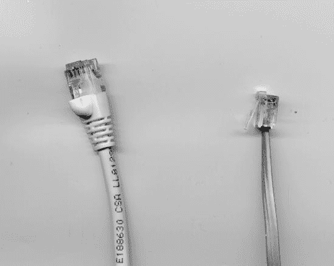
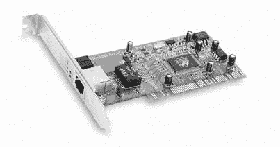
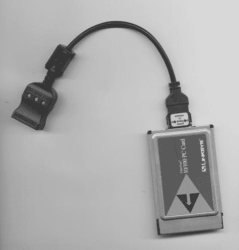

# 第七章. 以太网网络接口

网络上的每台计算机都使用某种内部或外部连接器来发送和接收数据，与其他计算机进行通信。这个连接器及其控制它的硬件被称为*网络适配器*或*网络接口*，因为它是计算机和网络之间的接触点。在一个小型家庭或商业网络中，网络接口可以是用于通过电缆与网络通信的以太网端口，或者是一个无线发射器和接收器，它与 Wi-Fi 基站交换无线电信号。本章描述了最常见的有线以太网网络接口。第八章提供了通过无线接口连接计算机到网络的相关信息。

# 集成在主板中

每个现代的有线以太网接口都有一个八针插座（以太网端口或插孔），它与以太网电缆上的插头相匹配。插头和插座都遵循一个称为*RJ-45*的标准，该标准规定了连接器的尺寸和形状以及通过每个八针的信号（*RJ*代表*Registered Jack*）。RJ-45 连接器与电话上使用的六针 RJ-11 插头和插座相似，但 RJ-45 略大一些，以便容纳额外的针。图图 7-1 显示了 RJ-45 以太网插头和 RJ-11 电话插头。

**图 7-1. An RJ-45 数据插头（左）有八根线；RJ-11 电话插头（右）有四根或六根线。**

除了端口本身之外，以太网接口还包括一些内部硬件，这些硬件在双向之间转换计算机中央处理器可以处理的格式和网络使用的格式。这种硬件可以有多种形式。它可以：

+   在计算机的主电路板（主板）上

+   安装在计算机内部的印刷电路板

+   插入笔记本电脑的 PC 卡

+   通过 USB 电缆连接到计算机的外部单元

几乎所有近几年来制造的计算机都内置了以太网端口。在台式机和塔式计算机上，RJ-45 接口位于机箱背面，如图图 7-2 所示。在笔记本电脑上，以太网端口通常位于机箱的背面或侧面。

如果你的电脑内置了以太网端口，用于指导中央处理器如何处理网络数据的驱动软件包含在电脑提供的软件光盘或主板中。如果你的电脑预装了操作系统，驱动程序已经就绪。然而，如果你从零件组装电脑，你可能需要在加载 Windows、Linux 或 Unix 操作系统后安装主板提供的网络驱动程序或第三方驱动程序。

**图 7-2. 大多数新电脑都配备了以太网端口作为标准功能。**

## 设置 BIOS 实用程序

如果你的电脑内置了以太网接口，有时需要关闭该接口并使用扩展卡上的网络适配器或某种其他类型的网络接口。这可能发生在你想使用比内置适配器能处理的更快的网络（如千兆以太网网络）时，或者如果板载网络控制器工作不正常。

要关闭内部网络接口，你必须打开电脑的 BIOS 设置实用程序，找到启用或禁用板载 LAN 控制器或具有类似名称的其他选项。在大多数 BIOS 实用程序中，LAN 选项被隐藏在两到三个菜单级别之下。

BIOS 设置实用程序是一组控制，当电脑开机时加载配置设置。这些设置是电脑启动序列的重要组成部分，因为它们告诉电脑在哪里以及如何找到操作系统。要运行 BIOS 设置实用程序，关闭电脑，然后重新开机并立即按下**del**（删除）键或 F1 键（取决于电脑使用的 BIOS 类型）。

如果你不太习惯更改 BIOS 设置，就别动它们。当你安装另一个网络接口时，Windows 和其他操作系统将识别内部和外部适配器。在大多数情况下，如果两者同时激活，这不会有什么影响。

另一方面，如果你在开机时网络连接不工作，但其他网络正常且所有网络电缆都已插入相应的插座，那么可能是内部适配器意外被禁用了。这种情况不应该发生，除非有人进入 BIOS 实用程序并更改了设置，但这种情况是可能的，尤其是如果电脑位于公共场所，其他人可以随意操作它。

# 为旧电脑添加网络接口

如果你使用的是旧电脑，可能电脑没有内置网络接口。在这种情况下，你必须添加一个接口，才能将其连接到网络。幸运的是，网络接口适配器价格低廉且易于安装。

至少，寻找一个可以处理 10Base-T 和 100Base-T 网络的以太网适配器。如果你计划将电脑连接到千兆以太网网络，你需要一个更快且更昂贵的适配器。

与其他电脑组件一样，以太网适配器既有价格低廉的无名产品，也有价格稍高的品牌版本，这些版本提供更好的文档和制造商的保修。一如既往，你得到的就是你付出的；考虑到你通常只需多花几美元（或欧元或英镑），通常更好的选择是购买品牌适配器。

## 内部扩展卡

内部网络适配器是适合插入电脑主板上的扩展槽之一的印刷电路板，就像图 7-3 中所示的那样。除非你使用的是非常旧的电脑，否则适配器应该是一块 PCI 卡；这可能是你在当地电脑或办公用品店能找到的唯一类型。主板上的 PCI 插槽几乎总是白色的。

**图 7-3. 在台式机或塔式电脑内部，一块内部 PCI 卡安装在扩展槽中。**

*照片由 D-Link 提供*

如果你的电脑是在 1990 年代中期之前制造的，你可能需要一块 ISA 卡。主板上的 ISA 插槽通常是黑色的。ISA 以太网适配器仍然可用，但你可能需要去专业供应商那里购买。通过搜索“ISA 以太网卡”将产生指向许多选择的指针，但请确保订购“10/100”或“快速以太网”卡，而不是只能以 10 Mbps 速度工作的旧设计。

要安装内部以太网适配器，请按照以下步骤操作：

1.  关闭电脑并拔掉电源线。

1.  从电脑机箱上取下盖子。

1.  在主板上找到一个空的扩展槽。

1.  拔掉连接到电脑框架上空槽位的金属支架。保存螺丝；你需要它来固定适配器卡。

1.  将适配器卡的底部与扩展插槽中的插槽对齐，并将其推入位置。

1.  使用从旧支架上保存的螺丝固定适配器卡。

1.  在关闭电脑机箱的情况下，清理积累的灰尘，并确保连接到主板和驱动器的所有连接器都没有松动。

1.  恢复盖子并插入电源线。

1.  将网络线缆插入电脑后面的新以太网插孔。

1.  打开电脑。如果操作系统没有自动检测到新的网络连接，请加载驱动程序软件。

## USB 适配器

没有以太网端口但内置 USB 端口的计算机可以使用外部 USB 网络接口作为内部扩展卡的替代品，但数据传输速度可能不会那么快。USB 适配器很常见，但很少需要：当 USB 端口成为计算机的常见功能时，内置以太网端口也是标准配置。

## 笔记本电脑网络适配器

没有内置以太网端口的旧笔记本电脑必须使用插在电脑侧面的 PCMCIA 插槽上的网络适配器。显示了 PC 卡上的网络适配器。

### 注意

1995 年采用了名为 CardBus 的新标准，用于 32 位 PC 卡和服务。CardBus PC 卡（在 68 针连接器旁边有一个金色接地条）不能插入旧的 16 位 PC 卡插槽，但 16 位卡可以插入 32 位插槽。如果你的笔记本电脑是在 1997 年之前制造的，请寻找一个 16 位 10/100 Mbps PC 卡适配器。

非常旧的笔记本电脑如果没有 PC 卡插槽，可以通过串行到以太网适配器连接到以太网网络，但这可能不值得费力。任何没有 PC 卡插槽的笔记本电脑至少有十年历史，其性能也远不及今天最便宜的型号。考虑到串行到以太网适配器的价格可能几乎与一台全新的计算机相当，是时候更换你的“忠实老友”古董电脑了。

**图 7-4. 这个 16 位 PC 卡网络适配器使用一根短电缆（有时称为线缆）将适配器连接到以太网插座。**

## 为您的适配器查找驱动软件

Windows XP、Windows Vista、Mac OS X 以及大多数当前版本的 Linux 和 Unix 可以自动检测新的网络适配器。在某些情况下，安装网络适配器后，你可能需要重新启动计算机，但通常操作系统会立即加载设备驱动程序软件。

### 注意

在一些不太友好的 Unix 或 Linux 发行版中，可能需要编译内核以支持特定的网络驱动程序，并在运行时加载模块，但这并不常见。

然而，如果您使用的是较旧的操作系统或操作系统无法识别的网络接口，您将需要找到并安装正确的设备驱动程序。*设备驱动程序*是一个小型程序，它将计算机中央处理器提供的通用输出信号转换为控制连接到计算机的设备功能和功能的特定指令。它还将来自外围设备的传入命令和数据转换为中央处理器可以识别的格式。

新的网络适配器通常附带包含设备驱动程序和其他相关程序及文档的软件光盘。如果您的光盘丢失，或者光盘不包含适合您操作系统的正确驱动程序，您可能可以在适配器制造商的网站上或通过开源设备驱动程序的在线来源找到驱动程序程序。

几个网站提供直接链接到数百个设备驱动程序的来源：

| [`www.windrivers.com/`](http://www.windrivers.com/) |
| --- |
| [`www.pcdrivers.com/`](http://www.pcdrivers.com/) |
| [`www.driverzone.com/`](http://www.driverzone.com/) |
| [`www.driverguide.com/`](http://www.driverguide.com/) |
| [`www.helpdrivers.com/`](http://www.helpdrivers.com/) |
| [`www.winguides.com/drivers/`](http://www.winguides.com/drivers/) |
| [`www.driversplanet.com/`](http://www.driversplanet.com/) |
| [`www.totallydrivers.com/`](http://www.totallydrivers.com/) |

# 网络适配器的状态灯

大多数以太网适配器都有两个或三个状态指示灯，随着数据通过网络连接而亮起和熄灭。在扩展卡上，指示灯通常位于金属安装支架上，位于 RJ-45 连接器上方或下方；在 PC 卡上，它们可能位于卡片本身或连接到网络电缆的插槽上。内置以太网插槽的指示灯通常位于插槽本身旁边。

三种指示灯如下：

**LINK**

当适配器连接到活动网络时，指示灯呈绿色

**10/100**

当适配器连接到 100 Mbps 网络时，指示灯呈黄色；当连接到 10 Mbps 网络时，指示灯熄灭

**ACT**

数据通过网络连接在任一方向通过时，指示灯在绿色闪烁

这些指示灯对于故障排除和监视网络性能很有用，因为它们可以告诉您您的网络连接是否正常工作。例如，当 LINK 指示灯亮起时，您知道计算机已连接到活动网络；当它熄灭时，网络连接处于离线状态。当 ACT 灯闪烁时，它告诉您计算机正在发送或接收数据。

不幸的是，指示灯通常位于一个在使用计算机时难以或无法看到的地方。当您测试系统时，通常很有帮助的是让其他人观察指示灯，而您操作计算机。

在某些电脑上，当电脑关闭时，LINK 和 10/100 指示灯可能仍然亮着。这种情况发生在电脑的 BIOS 中有一个“唤醒网络”功能，如果适配器收到一个传入信号，则会打开电脑。即使这个功能被禁用，只要电源开启，电脑就会保持网络端口处于活跃状态。完全禁用网络适配器的唯一方法是拔掉交流电源插头或关闭电源供应器背面的电源开关。
