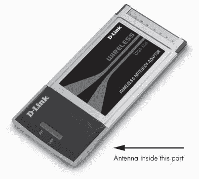

# 第八章。Wi-Fi 网络

Wi-Fi（无线保真，发音为“why-fie”）网络使用无线电信号而不是以太网电缆来连接计算机和其他设备到局域网。Wi-Fi 是传统有线网络的便捷替代品，因为任何在 Wi-Fi 信号范围内的无线启用计算机都可以加入网络；无需寻找网络插座。这在无法实际将数据电缆拉过墙壁、天花板和地板时尤其有用，当用户想要将笔记本电脑或手持设备（如 iPhone 或 BlackBerry）连接到现有网络或通过局域网连接到互联网时。当然，机场、咖啡店、图书馆和学校等公共场所的成千上万的 Wi-Fi 热点，在您远离自己的家或办公室时，可以轻松访问互联网。

然而，Wi-Fi 连接的安全性远低于有线网络，因为通过无线电在计算机和基站之间移动的相同数据可以被另一台计算机截获。即使数据被加密，一个有足够时间的专业入侵者也可以窃取密码、信用卡号码和其他个人信息。然而，最新的安全工具，包括 WPA 加密和虚拟私人网络（VPN），可以在很大程度上使 Wi-Fi 网络变得安全。

本章介绍了 Wi-Fi 网络的类型，并解释了如何将 Wi-Fi 热点添加到您的局域网中，如何选择和使用计算机上的 Wi-Fi 网络接口，以及如何尽可能使您的 Wi-Fi 网络保持安全。

# Wi-Fi 网络类型

Wi-Fi 网络使用 IEEE（电气和电子工程师协会）802.11 系列标准来定义建立无线局域网所需的无线电频率、数据格式和其他技术细节。今天，有四种类型的 802.11 网络，如表 8-1 所示。

**表 8-1。无线网络标准**

| 类型 | 最大速度 | 最大范围（室外） | 无线电频率范围 |
| --- | --- | --- | --- |
| 802.11b | 11 Mbps | 300 英尺（100 米） | 2.4 GHz |
| 802.11a | 54 Mbps | 75-100 英尺（23-30 米） | 5.2 GHz |
| 802.11g | 54 Mbps | 300 英尺（100 米） | 2.4 GHz |
| 802.11n | 248 Mbps | 750 英尺（250 米） | 2.4 GHz/5.2 GHz |

接入点能够达到的有用距离通常远小于承诺的最大值，尤其是在接入点和计算机无线适配器之间的路径在室内时。两根天线之间的墙壁、家具和其他物体都可以减少信号强度。802.11b 网络是最先出现的，也是最常见的一种类型，直到更快的 802.11g 版本可用。802.11a 使用不同的无线电频率，但许多网络适配器与 2.4 GHz 和 5.2 GHz 接入点都兼容。今天，新的 802.11n 标准开始取代所有三种较旧版本。

在 2.4 GHz 频率范围内使用信道的三个系统是向后兼容的。换句话说，如果您的 Wi-Fi 网络接口适配器仅使用 802.11b，它将继续与 802.11g 或 802.11n 基站一起工作；802.11b 和 802.11g 适配器都将与 802.11n 基站一起工作。

### 注意

缺失的字母——802.11c、d、e 等等——描述了适用于无线数据网络的其他无线数据特性和增强功能。它们对硬件设计师和制造商来说很重要，但作为网络管理员或用户，您不必担心这些。

您可能还会看到一些被标识为 *极端* 或 *增强* 的 Wi-Fi 接入点和网络适配器，或者带有其他暗示它们以比标准网络更快的速度工作的词语。这些系统通常使用专有方法，涉及两个或更多并行信道以增加其数据处理能力。增强系统通常如广告所述工作，但仅当适配器和接入点都由同一家公司制造时。当您正在构建将使用不同制造商生产的网络适配器的无线网络时，或者如果您计划允许笔记本电脑和其他便携式设备的用户连接到您的网络，拥有一个增强网络的好处并不大。

Wi-Fi 联盟（[`www.wi-fi.org/`](http://www.wi-fi.org/)），该行业组织推广这些网络，定期进行“烘焙”活动，许多制造商在活动中展示他们的产品可以与竞争对手生产的设备正确工作。带有 Wi-Fi 标志的网络适配器或接入点已经经过 Wi-Fi 联盟的测试和认证，以确保其兼容性。

# 操作信道

Wi-Fi 使用了 2.4 GHz 附近的无线电频谱（也称为波段）的一部分，这部分频谱已被预留用于未经许可的工业、科学和医疗（ISM）服务，包括无线数据网络。802.11b、802.11g 和 802.11n 都使用这个频率波段。802.11a 使用一个不同的频率波段，该波段位于 5.2 GHz 附近，被称为 *未经许可的国家信息基础设施（U-NII）*。

ISM 和 U-NII 频段都对多种未授权无线电服务开放。这意味着制造设备的厂商必须证明他们的设计符合有关最大功率、干扰等方面的各种规定，但实际用户（也就是你和我）在操作批准的无线电设备之前不需要获得许可证。这一结果就是，Wi-Fi 网络使用的相同无线电频率也被许多其他信号所占据，包括无绳电话、医疗设备、遥控玩具和微波炉等。Wi-Fi 和这些其他设备使用不同的方法来传输和接收无线电信号，所以你的笔记本电脑中的 Wi-Fi 适配器不太可能引起模型火车事故或让你的无绳电话响起。然而，其他 ISM 或 U-NII 信号，以及附近用户的 Wi-Fi 信号，可能会对你的 Wi-Fi 信号增加噪声，从而降低网络的数据传输速度。

在 2.4 GHz 频段内，有 14 个重叠的 Wi-Fi 无线电频道。日本是唯一一个使用所有这些频道的主要国家。在北美和中国，只有 11 个频道被使用，而大多数欧洲国家使用 13 个频道。在法国，只有 4 个频道可用。每个频道在不同的频率上运行，从频道 1 到频道 14。

每个频道与其上面的两个频道和下面的两个频道重叠，如图图 8-1 所示，因此相邻数字的频道可能会相互干扰。就像其他 ISM 设备产生的干扰一样，相邻频道干扰可能会创建一个速度较慢、噪声较大的连接。因此，在设置新的网络或向现有网络添加接入点时，最好选择一个尽可能远离附近网络使用的频道号。

**图 8-1. Wi-Fi 信号使用 11 个相互重叠的频道。请注意，频道 1、6 和 11 之间不会相互干扰。**

# 接入点

每个 Wi-Fi 网络至少需要一个接入点。Wi-Fi 接入点，或基站，是无线电发射/接收器（*收发器*），通过无线电发送和接收数据，并与有线以太网交换数据。你可以把接入点想象成 Wi-Fi 网络和有线局域网之间的路由器。

大多数接入点在背面面板上有一个或两个短天线；一些还配有可以与单独天线电缆连接的连接器。单独的天线很有用，因为它们可以增加接入点的信号强度和灵敏度，但在小型室内家庭或小型商业网络中通常不是必需的。关于天线的更多信息将在本章后面介绍。

Wi-Fi 接入点通常与电缆或 DSL 调制解调器、网关路由器或以太网交换机组合在一起。如果你的网络包括有线和无线连接，你可能想考虑一个组合设备，这通常比两个单独的盒子成本低。图 8-2 显示了组合接入点、以太网交换机和路由器。该设备前面的指示灯显示电源、无线活动和数据向或从每个有线网络节点移动。

单个 802.11g 或 802.11n 基站应该提供足够的信号覆盖，以覆盖房屋或小型办公室的所有部分，但如果信号不足（由于障碍物或干扰），最佳解决方案是在信号可以填补盲点的位置添加第二个（或第三个）接入点。每个接入点应通过以太网集线器或交换机连接到网络的有线部分，或者如果这不切实际，则通过无线桥接器重新传输 Wi-Fi 信号，该桥接器在不同的频道上传输。在具有多个接入点的 Wi-Fi 网络中，它们应使用相同的网络名称，但每个接入点应使用不同的非重叠操作频道。

**图 8-2. 这个 Wi-Fi 接入点同时充当网络路由器。**

*图片由 D-Link 提供*

# 网络接口适配器

Wi-Fi 网络接口适配器是小型的无线电收发器，它们将计算机数据转换为与 Wi-Fi 接入点交换的无线电信号，然后再转换回来。Wi-Fi 适配器可以是笔记本电脑或台式计算机内部的扩展卡，也可以是 PC 卡或单独的 USB 设备。

### 备注

Wi-Fi 适配器还可以通过无线电直接在 ad hoc 网络中与其他计算机交换数据，如第二章所述。

大多数新的 Wi-Fi 适配器与所有四个标准（802.11a、b、g 和 n）兼容，因此它们可以与任何 Wi-Fi 接入点交换数据。较旧的适配器可能只使用一个、两个或三个标准，因此它们只能连接到兼容的基站。当网络适配器检测到附近接入点的无线电信号时，适配器的控制软件将自动匹配该接入点使用的信号类型。

## 笔记本电脑内置适配器

内置 Wi-Fi 接口是大多数新笔记本电脑的标准功能。实际的接口适配器位于安装在计算机母板上的小型 PCI 卡上，就像图 8-3 中所示的那样。内部 Wi-Fi 适配器天线通常是笔记本电脑折叠式翻盖上半部分的柔性电线，在围绕显示器屏幕的空间中。

**图 8-3. 小型 PCI 卡 Wi-Fi 适配器安装在笔记本电脑的母板上。照片中靠近顶部的“主”和“辅”连接器是天线连接器。**

*照片由英特尔提供*

与将 Wi-Fi 适配器本身作为主板永久部分的方法相比，小型 PCI 卡方法的一个优点是适配器是 IBM 所说的*现场可更换单元(FRU)*。其他制造商使用不同的名称，但含义相同：如果适配器损坏，或者您想用支持新标准的较新适配器替换较旧的适配器，相对容易地移除旧卡并在其位置安装新卡，而无需更改主板。当 802.11n 标准变得更加普遍时，这一特性将特别方便。

在您不使用网络时关闭 Wi-Fi 适配器很重要，以减少电池消耗并避免传输黑客可能用来连接到您的计算机的信号。通常有几种方法可以打开和关闭内部适配器：一个物理的开关，一组键盘命令，以及 Wi-Fi 控制程序中的选项。计算机的用户手册是获取有关操作 Wi-Fi 适配器说明的最佳来源。

## PC 卡

没有内置适配器的笔记本电脑可以使用信用卡大小的 PC 卡或 PC ExpressCard 适配器。要安装适配器，只需将其插入 PCMCIA 插槽，等待操作系统识别它并加载适当的驱动程序软件。

图 8-4 展示了一个 PC 卡适配器。适配器延伸约一英寸超过 PCMCIA 插槽的边缘，以便将天线放置在计算机金属外壳之外。

**图 8-4. PC 卡 Wi-Fi 适配器通常具有内置天线。**

*照片由 D-Link 提供*

一些 PC 卡适配器在卡的上部或外侧边缘也提供了一个外部天线连接器。这可以使您将天线放置在基站信号更好或更差的位置，但额外的天线是携带笔记本电脑时需要额外携带的一件东西。一般来说，内置天线的适配器通常是便携式电脑的更好选择。

一些 Wi-Fi 适配器也适用于较新的 PC ExpressCard，这些 ExpressCard 正在逐渐取代最新一代笔记本电脑中的 PC 卡。然而，内置 Wi-Fi 适配器在 2004 年和 2005 年 PC ExpressCard 插槽推出时已经成为大多数笔记本电脑的标准功能，因此通常没有必要寻找单独的适配器。另一方面，如果电脑机箱上有 PC ExpressCard 插槽，PC ExpressCard 适配器可能是为台式电脑添加 Wi-Fi 的最佳方式。

## USB 适配器

USB Wi-Fi 适配器有两种不同的形式：可直接插入电脑 USB 端口的小型模块和通过电缆连接到 USB 端口的独立设备。单独的单元通常提供更好的连接，因为它们有更强大的发射器和更灵敏的接收器，但它们比小型模块不太方便，尤其是在笔记本电脑上。

图 8-5 展示了独立 USB 适配器和插件 USB Wi-Fi 模块。

### 注意

较小（且较便宜）的 USB Wi-Fi 插件模块通常足以将您的电脑连接到 Wi-Fi 网络，除非您在接入点的边缘使用电脑。如果您可以用插件模块检测到强信号，您不会通过使用独立设备获得更好的性能。然而，具有更强大发射器和更灵敏接收器的单独适配器可能允许您使用小型模块无法检测到的信号。

**图 8-5. USB Wi-Fi 适配器可以是独立设备（左侧）或小型插件模块（右侧）。**

*照片由思科系统公司旗下的 Linksys 提供*

## PCI 卡

安装在台式电脑内部的 PCI 扩展卡上的 Wi-Fi 适配器也是可用的，但它们比其他类型的适配器不太方便。要安装 PCI 卡，您必须打开电脑机箱，并将适配器插入电脑主板上未使用的扩展槽中——这是一个比插入 PC 卡或 USB 设备复杂得多的过程。

考虑在 PCI 扩展卡上使用 Wi-Fi 适配器的唯一原因可能是将没有 USB 端口的旧电脑连接到无线网络。即便如此，你也可以通过在电脑内部安装带有多个 USB 端口的扩展卡，并将 USB Wi-Fi 适配器连接到其中一个端口来实现相同的效果。这可能是更好的方法，因为它还允许你使用其他 USB 设备与同一台电脑。

## 天线

每个 Wi-Fi 适配器都内置天线或一个可以插入适配器外壳上的插孔的天线。有些适配器同时内置天线和插孔。正如本章前面提到的，笔记本电脑中 mini-PCI 适配器的天线通常安装在电脑外壳的顶部，与显示屏面板并排。

除非你试图在非常长的距离上发送和接收 Wi-Fi 信号，否则适配器提供的天线应该就足够了。记住，一个更强大的天线可能会产生更强的接收和发送信号，但那些更强的信号通常对网络性能没有太大影响——一旦信号强度达到足够的水平，增加更多功率或灵敏度就没有优势了。

与接入点一起使用的天线是另一回事。如果你安装一个“高增益”定向天线或将天线尽可能放置得高，接入点的覆盖范围将会增加，因为 Wi-Fi 使用的频率上的无线电信号是*视距*，这意味着信号可以到达观察者在同一位置可以看到的任何地方。然而，来自或指向定向天线的非轴信号要弱得多，因为天线将大部分输出（从发射器）或灵敏度（对接收器）集中在有限区域内。当你安装定向天线时，请花时间确保天线方向以获得接入点和网络接口之间最佳可能的信号强度。

另一方面，*非定向*（或*全向*）天线在所有方向上具有相同的信号强度或灵敏度。在广泛区域内提供 Wi-Fi 覆盖的最佳方式是使用带有非定向天线的接入点，或者增加接入点或天线的高度，或者在网络边缘的接入点覆盖区域使用定向天线。

许多 Wi-Fi 适配器和接入点使用的天线连接器与天线上的标准电缆连接器不同。为了匹配这两个连接器，您必须使用一个短电缆适配器（不要与网络接口适配器混淆），称为*尾线*。尾线通常可以直接从制造 Wi-Fi 适配器和接入点的公司购买，但这些*OEM（原始设备制造商）*部件极其昂贵。来自专业电缆供应商的电缆可以以 OEM 价格的一小部分完成相同的工作。通过搜索*Wi-Fi 尾线*来找到可以订购经济型适配电缆的地方。

# Wi-Fi 控制程序

在您可以通过 Wi-Fi 网络传输数据之前，您必须配置网络的基础站以指定您想要使用的操作频道、数据加密的密码以及网络的其它特性。此外，每个无线网络适配器也必须运行一个控制程序。

## 接入点配置程序

您的接入点应该至少有一个有线连接到计算机，以便设置和更改配置设置。根据您使用的品牌和型号，此连接可能是通过以太网端口、USB 端口或串行数据端口。接入点使用此连接来接受配置和设置命令以及发送状态信息。某些接入点也可以通过无线链路接受命令，但关闭无线功能后，您需要有线连接才能再次打开它。

配置接入点最常见的方法是通过基于 Web 的配置实用程序。换句话说，接入点的配置选项都显示在您将计算机的 Web 浏览器指向接入点的 IP 地址时出现的单个或多个网页上。

每个接入点的品牌和型号都使用不同的配置程序，因此每个设备提供的说明书是获取具体说明的最佳来源。然而，它们都包括类似选项。最重要的设置包括：

**DHCP**

许多网络使用*动态主机配置协议（DHCP）*来自动从*DHCP 主机*或*DHCP 服务器*分配 IP 地址。另一种选择是手动为连接到网络的每台计算机和其他设备分配一个数字 IP 地址。接入点的配置实用程序包括一个选项，可以使用接入点作为网络的 DHCP 服务器。

**IP 地址**

您必须将接入点设置为从另一台设备（动态 IP 地址）接受 IP 地址，或者手动为接入点输入地址。

**无线网络名称**

每个网络都应该有一个独特的名称，称为*服务集标识符（SSID）*。这是用户将在他们的计算机控制程序中的网络列表中选择的名字。

**频道号**

每个接入点在一个单独的信道上运行。此选项设置该信道。为了获得最佳性能，请选择一个与您信号范围内其他 Wi-Fi 网络使用的信道不同的信道。

**操作模式**

许多接入点可以在多种操作模式（802.11b、802.11a、802.11g 或 802.11n）下运行，具体取决于与之交换数据的计算机所使用的模式。此选项允许您设置接入模式以自动检测操作模式并选择最佳可用模式，或者指定特定模式。

其他无线设置通常也可用，有时在单独的“高级”菜单或网页中。除非您有充分的理由更改某些设置，否则通常最好保持默认设置。

许多 Wi-Fi 接入点都与路由器或调制解调器结合使用，因此配置过程还包括一些额外的设置选项。有关配置路由器或调制解调器的信息，请参阅第十章。如果您使用的是独立的接入点，通常最好关闭接入点中的 DHCP 服务器，并从路由器或调制解调器获取所有网络地址。

## 无线连接程序

搭载 Wi-Fi 适配器的计算机使用无线控制程序选择 Wi-Fi 网络，并建立连接。Windows、Mac OS X 以及各种版本的 Linux 和 Unix 都包含无线控制程序，并且作为无线网络接口适配器和笔记本电脑提供的驱动软件的一部分，通常还提供替代控制程序。

例如，图 8-6 展示了 Windows XP 中包含的 Wi-Fi 控制程序，图 8-7 展示了与它的 mini-PCI Wi-Fi 适配器一起提供的 Intel 程序。这两个程序都显示所有附近的 Wi-Fi 接入点列表，并标识那些使用加密数据接入的接入点。要使用任一程序，请选择您想要连接的网络名称，然后点击程序窗口底部的 **连接** 按钮。其他程序使用不同的屏幕布局，但它们的工作方式相似。在某些情况下，您计算机上安装的程序可能对接入点的弱信号更敏感，但这通常并不重要——它们都能检测到您最常使用的强大接入点的信号。

**图 8-6. 随 Windows 提供的无线网络连接程序检测附近的 Wi-Fi 信号并设置新的网络连接。**

**图 8-7. 英特尔无线程序提供与微软程序相同的信息，但格式不同。**

这两个程序，以及随其他操作系统、网络适配器和计算机提供的类似程序，可以自动记住您使用的每个 Wi-Fi 网络的登录和密码信息以及其他详细信息。例如，图 8-8 显示了酒店 Wi-Fi 网络的属性设置。下次您尝试连接到同一网络时，控制程序不需要再次请求密码，因为此网络配置文件设置为“自动”。

**图 8-8. Windows Wi-Fi 控制程序自动保存过去网络连接的特性。**

如果您的计算机始终连接到同一 Wi-Fi 网络（在家或办公室），或者如果您经常连接到您最喜欢的咖啡馆或讲堂的同一 Wi-Fi 热点，Wi-Fi 控制程序应自动使用该网络的密码和其他配置设置，每次您在网络的范围内打开计算机时。例外情况是需要每次连接都进行新登录的公共网络。

### 注意

许多需要密码的 Wi-Fi 热点在将您连接到您尝试查看的第一个网站之前，会显示一个基于网页的登录屏幕。这些热点在您通过网页浏览器登录之前，不会连接到任何其他互联网服务（如电子邮件或即时消息）。

# 混合（有线-无线）网络

大多数家庭和企业 Wi-Fi 网络至少包含一台通过以太网线连接到网络路由器的计算机，而不是通过无线连接。有线连接通常位于路由器和调制解调器所在的同一房间，在那里使用无线连接几乎没有优势。在许多网络中，可能方便将电缆延伸到相邻的一个或多个房间，但为更孤立位置的计算机使用 Wi-Fi。

其他网络限制 Wi-Fi 连接到笔记本电脑、智能手机和其他便携式或手持设备。所有永久系统都使用以太网线，因为它们更快、更安全。

# Wi-Fi 安全

无线网络在安全性和便利性之间是一种权衡。无线网络连接的明显好处——从便携式计算机或孤立的位置快速轻松地访问网络——是有代价的。对于大多数用户来说，无线操作带来的便利性超过了可能的安全威胁。但就像你在街上停车时锁上车门一样，你也应该采取类似的步骤来保护你的网络和数据。

简单的事实是，任何愿意投入足够的时间和精力来监控 Wi-Fi 信号的人，都可能找到一种方法来拦截和读取他们携带的数据。如果你通过无线链路发送机密信息，除非网站或其他主机使用 SSL 等端到端加密方案，否则窃听者可以复制它。信用卡号码、账户密码和其他个人信息都容易受到攻击。

加密和其他安全方法可以使数据更难被盗取，但它们不能完全保护一个真正专注的窃听者。在互联网上可以轻松找到用于破解 Wi-Fi 加密的工具集。就像任何警察都会告诉你的那样，锁对于阻止诚实的人来说是很好的，但严重的盗贼知道如何绕过它们。

无线网络面临两种不同的安全威胁。第一种是未经你知情或允许的外部人员连接到你的网络的风险；第二种是在你发送和接收数据时，一个专注的窃听者可能会窃取或修改数据。每种都代表了一个不同的潜在问题，并且每种都需要不同的预防和保护方法。尽管目前可用的加密工具不能提供完全的保护，但它们可以使大多数普通入侵者更难生活。只要这些工具存在，你不妨使用它们。

一些技术可以阻止入侵者和破解者。首先，你可以接受无线网络并不完全安全的事实，并使用内置的网络安全功能来减缓潜在的入侵者；其次，你可以使用硬件或软件*防火墙*（或两者兼而有之）来隔离无线网络（但请记住，能够抓取和解码加密网络密码的破解者通常也能抓取防火墙密码）；第三，你可以使用额外的加密，如*VPN（虚拟专用网络）*，使网络更加安全。

早期 Wi-Fi 协议（WEP 加密）的安全功能不足以保护数据。WEP 协议存在几个缺陷。WEP 应该更像是一个“请勿打扰”的标志，而不是真正的保护手段。WPA（Wi-Fi 保护访问）和 WPA2 标准试图弥补 WEP 的不足，但它们只有在你的网络中的所有用户都拥有现代网卡和驱动程序时才能发挥作用。

这里有一些具体的保护方法：

+   不要使用接入点的默认 SSID。这些默认值对网络破解者来说众所周知。

+   将 SSID 更改为一个不能识别你的业务或位置的名字。一个检测到名为 BigCorpNet 的东西并四处张望以查看街对面的 BigCorp 总部的人会针对那个网络。对于家庭网络也是如此：不要使用你的姓氏或街道地址或任何其他容易让人推断出信号来源的东西。

+   不要使用一个 SSID 让你的网络听起来像包含某种吸引人或有价值的内容——使用一个无聊的名字，比如，*network5*，或者甚至是一串乱码，例如 *W24rnQ*。如果一个潜在的破解者看到附近网络列表，你的网络应该看起来是最不有趣的。

+   更改你的接入点的密码。大多数接入点配置工具的出厂默认密码很容易找到（而且它们通常来自同一个制造商——提示：不要使用 *admin*），所以它们甚至不足以阻止你的用户，更不用说那些想利用你的网络为自己谋利的未知入侵者。一个未经授权的人（可能是你自己的孩子）如果进入了接入点的软件，可以通过更改密码和加密密钥来锁定你自己的网络。

+   如果可能的话，将你的室内接入点放置在建筑物的中间而不是靠近窗户。这将减少你的网络信号超出你自己的墙壁的距离。

+   使用 WPA 加密而不是 WEP。WPA 加密要难破解得多，特别是如果它使用一个复杂的加密密钥。

+   经常更改你的加密密钥。从数据流中嗅探加密密钥需要时间；每次密钥更改，试图窃取你数据的恶意分子都不得不从头开始。在家庭网络中，每月更改一次或两次密钥并不算频繁。办公室局域网应至少每周更改一次密钥。

+   不要在网络中明文存储你的加密密钥。这看起来很明显，但在一个广泛使用的网络中，可能会诱使你在私人网页或文本文件中分发密钥。不要这么做。

+   不要使用电子邮件分发加密密钥。即使你没有在明文邮件中发送，一个偷走了账户名和密码的入侵者也会在你的合法用户收到之前收到包含你新代码的消息。

+   如果在你的网络中这样做是实用的，请在你的接入点中开启访问控制功能。访问控制将网络连接限制为具有指定 MAC 地址的网络客户端。接入点将拒绝与任何地址不在列表上的网络设备关联。如果你希望允许访客使用你的网络，这可能不太实用，但在你了解所有潜在用户的情况下，这是一个有用的工具。MAC 地址过滤不能阻止一个有决心的攻击者复制和欺骗认证用户的地址，但它可以提供额外的保护层。

+   启用安全功能，但将网络视为完全向公众开放。确保使用网络的所有人都明白他们正在使用一个不安全的系统。

+   将文件共享限制到你真正想要共享的文件；不要共享整个驱动器。在每个共享上使用密码保护。

+   使用与有线网络相同的防火墙和其他安全工具。从最好的情况来看，你的局域网的无线部分并不比有线部分更安全，因此你应该采取所有相同的预防措施。

+   考虑使用虚拟私人网络（VPN）以增加安全性。

+   在网络上的每台计算机上使用防火墙程序，包括有线和无线节点。

重视无线网络安全非常重要，但不要让安全问题阻止你在家庭或办公室中使用 Wi-Fi，除非你正在通过网络传输非常敏感的信息。如果你用加密和其他安全工具保护你的网络，你可能会将除了最坚定的黑客和破解者之外的所有人拒之门外。

另一方面，如果你的小企业处理客户账单信息、信用卡数据、敏感的客户或病人记录、人事数据（如社会保险号码）或任何类似的信息，这些信息应该保持机密，那么在你的局域网中添加 Wi-Fi 将创建一个极具吸引力的目标。如果你必须向你的小企业网络添加 Wi-Fi 接入，请在 Wi-Fi 接入点和网络上的其他计算机之间使用你能找到的最强大的防火墙。
